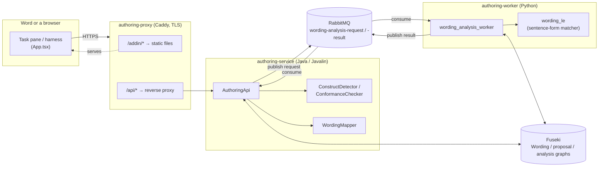
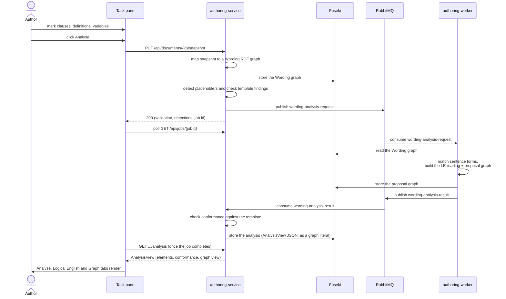
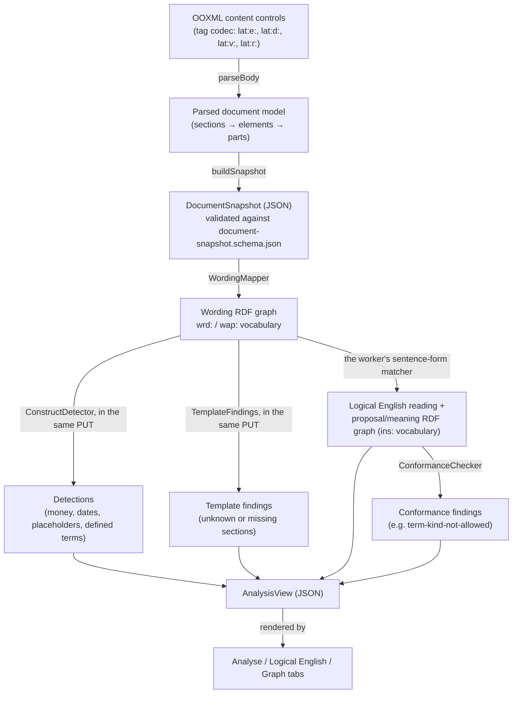

<!-- SPDX-License-Identifier: MPL-2.0 -->

# LATTICE Authoring (Word add-in, proof of concept)

A Word add-in for the word authoring proof of concept (ADR-A114): mark clauses, definitions,
variables and defined-term references in a document, then read them as Logical English and
review the proposed `ins:` graph against [`platform/authoring-service`](../../platform/authoring-service).
Not a platform contract. Its code, markup and manifest may change or be withdrawn without
deprecation.

The add-in has a domain layer (WA8: OOXML parser/writer, tag codec, contract types and Ajv
validation, HTTP client, `DocumentPort` seam), a task pane UI (WA9: `App.tsx` and five panels,
`officePort.ts`/`fakePort.ts`, a Playwright harness), ribbon/right-click commands (WA9a, running
in a shared JavaScript runtime with the task pane per decision WA-D13), and a compose stack
(WA10: [`deployment/compose/authoring`](../../deployment/compose/authoring)) that runs the whole
proof of concept together, behind one TLS proxy.

## How the proof of concept fits together

The POC spans four parts, each owning one concern and each with its own README for a deep dive:

| Part | Concern | README |
|---|---|---|
| [`contracts/authoring`](../../contracts/authoring) | The JSON Schemas, templates and samples every other part validates against | (schemas only, no README) |
| [`platform/authoring-service`](../../platform/authoring-service) | The Java HTTP API: maps a snapshot to RDF, detects markup opportunities, checks template conformance, tracks jobs | [README](../../platform/authoring-service/README.md) |
| [`workers`](../../workers) (the `lattice_workers.wording_analysis_*` modules) | The Python worker: reads the Wording graph, matches it against sentence forms, produces a Logical English reading and a proposal/meaning graph | [README](../../workers/README.md) |
| This add-in | The Word task pane and ribbon/right-click commands an author actually uses | this file |
| [`deployment/compose/authoring`](../../deployment/compose/authoring) | Runs all of the above, plus Fuseki, RabbitMQ and a TLS proxy, as one demo stack | [README](../../deployment/compose/authoring/README.md) |

### Architecture



The service and the worker never call each other directly. They only share Fuseki (the RDF store)
and RabbitMQ (the event bus). This is why either one can restart independently without losing
data: everything that must survive a restart lives in Fuseki, never in a service's memory — see
[`deployment/compose/authoring`'s README](../../deployment/compose/authoring/README.md) for how its
end-to-end suite checks exactly that.

### Request flow: marking up and analysing a document



### How the data is constructed

Each stage changes the data's shape, and each shape is chosen for what reads or writes it: JSON at
every HTTP boundary (so Ajv/`json-schema-validator` can check it against the schemas in
`contracts/authoring`), RDF once it is inside Fuseki (so it can be queried directly with SPARQL,
independent of either runtime), and JSON again for the one value the task pane actually renders.



The `ins:` vocabulary (`https://www.nebularis.org/neuro-semantic/lattice/instrument#`) is the same
one [`ontology/instrument`](../../ontology/instrument) defines: `Obligation`, `Prohibition`,
`Permission`, `Exclusion`, `Power`, `Definition`, `Deeming`. The worker's proposal graph is a
genuine (if deliberately narrow) instance of that ontology, not a POC-only shape — see
[`docs/architecture/ontology-architecture.md`](../../docs/architecture/ontology-architecture.md)
for what the full layer means. `wrd:` and `wap:` are POC-only vocabularies
(`platform/authoring-service/src/main/resources/vocab/wording-provisional.ttl`) for the parts no
substrate layer covers yet: which OOXML element a reading came from, which sentence form matched,
and so on.

## Modules (`src/`)

| Module | Holds |
|---|---|
| `domain/types.ts` | hand-written TypeScript types for every schema under `contracts/authoring` and `contracts/events` |
| `domain/schemas.ts` | one Ajv 2020-12 instance over the same 14 schemas, `validate(name, value): string[]` |
| `domain/tags.ts` | the content-control tag codec: `encode`/`decode`, and `title` |
| `domain/offsets.ts` | `occurrenceIndex` and `escapeWordSearch`, for `Range.search` |
| `domain/keys.ts` | `suggestKey`/`guessValueType`, ported from WA3's Java detector |
| `domain/xml.ts` | small shared DOM helpers used by `ooxml.ts` and `metadata.ts` |
| `domain/ooxml.ts` | `parseBody`, `writeSections`, `writeTemplate`, `writePackage` |
| `domain/snapshot.ts` | `buildSnapshot(parsed, metadata)`, validated against `document-snapshot` |
| `domain/metadata.ts` | `toXml`/`fromXml` for the document's custom XML metadata part |
| `domain/mermaid.ts` | `toMermaid(graphView)`, a deterministic Mermaid `flowchart` renderer |
| `domain/poll.ts` | `pollJob(api, jobId, options)` |
| `domain/uuid.ts` | a dependency-free UUID v4 generator |
| `api/client.ts` | `ApiClient`, `HttpApiClient`, `ApiError` |
| `word/port.ts` | the `DocumentPort` interface, `MarkResult`, `InlineMark`, `AuthoringMetadata` |
| `word/officePort.ts` | `DocumentPort` over the real Word API |
| `word/fakePort.ts` | `DocumentPort` over an in-memory model, for tests and the harness |
| `app/App.tsx` | the task pane root: tabs, error banner, all shared state |
| `app/DocumentPanel.tsx`, `MarkupPanel.tsx`, `AnalysePanel.tsx`, `LogicalEnglishPanel.tsx`, `GraphPanel.tsx` | one component per tab |
| `app/uiBridge.ts` | the observable store bridging ribbon/right-click commands and the task pane |
| `commands/ids.ts` | `COMMAND_IDS`, the eight command ids |
| `commands/handlers.ts` | `createHandlers(deps)`, one handler per command (no Office global touched) |
| `commands/register.ts` | `registerCommands(handlers)`, the only module that calls `Office.actions.associate` |
| `main.tsx` / `harness.tsx` | the real and harness entry points |

## Tag codec

| Kind | Tag | Title | Appearance | Colour |
|---|---|---|---|---|
| section | `lat:s:<sectionKey>` | `Section: <heading>` | BoundingBox | `#5B6B7F` |
| clause | `lat:e:<uuid>` | `Clause` | BoundingBox | `#1F6FB2` |
| definition | `lat:d:<uuid>` | `Definition` | BoundingBox | `#6A3FB5` |
| term | `lat:term` | `Term` | Tags | `#6A3FB5` |
| variable | `lat:v:<variableKey>` | `Variable: <label>` | Tags | `#C46A00` |
| reference | `lat:r:<uuid>` | `Defined term: <term>` | Tags | `#2E7D32` |

## Commands

| Id | Ribbon | Right-click | Does |
|---|---|---|---|
| `showPane` | Show pane | | opens the task pane |
| `markClause` | Clause | Mark as clause | wraps the selected paragraphs as a clause |
| `markDefinition` | Definition | Mark as definition | wraps the selected paragraphs as a definition |
| `markTerm` | Term | Mark as defined term (in its definition) | marks the selection as the defined term |
| `markVariable` | Variable… | Mark as variable… | drafts a variable from the selection, opens the pane on the Markup tab |
| `markDefinedTerm` | Defined term… | Mark as reference to a defined term… | marks a reference when exactly one definition matches, otherwise drafts one |
| `unmark` | Unmark | Remove LATTICE mark | removes the mark, keeping the text |
| `analyse` | Analyse | | opens the pane on the Analyse tab and starts the analysis |

A command never fails silently: a `MarkResult` that is not `ok`, or an exception, posts the reason
to the Markup tab and opens the pane.

## Running the tests

```
mise run check:authoring-addin
mise run test:authoring-addin
```

`check:authoring-addin` type-checks with `tsc --noEmit` and runs the Vitest unit suite.
`test:authoring-addin` additionally runs the Playwright suite (`e2e/`) against a real `msedge`
channel and the harness, using fake/mocked API responses.

`e2e-stack/` (plan WA10) is a second Playwright suite that runs against the real compose stack in
[`deployment/compose/authoring`](../../deployment/compose/authoring) instead — the real service,
worker, Fuseki and RabbitMQ, through the real Caddy proxy, no mocking. Run it with:

```
mise run check:authoring-stack
```

See [`deployment/compose/authoring/README.md`](../../deployment/compose/authoring/README.md) for
what the stack is and how to browse it directly.

## Load the add-in in Word

The compose stack above serves the demo over `https://localhost:3443`, with a self-signed local CA
(`mise run authoring:ca` to trust it). Start it first (`mise run authoring:up`), then pick one of
these ways to load `manifest/manifest.xml` into a real Word client.

### Word on the web

1. Open Word on the web, then **Home** → **Add-ins** → **More Add-ins**.
2. Choose **My Add-ins** → **Upload My Add-in**.
3. Browse to `apps/word-authoring-addin/manifest/manifest.xml` and upload it.
4. The LATTICE group appears on the Home tab.

To remove it: **Home** → **Add-ins** → **My Add-ins**, then remove it from the list.

### Desktop Word on Windows (sideload via the registry)

Desktop Word reads a list of trusted manifest folders from one user-level registry value, rather
than a file picker. Run this once, as the signed-in user (not elevated):

```powershell
New-Item -Path "HKCU:\Software\Microsoft\Office\16.0\WEF\Developer" -Force | Out-Null
New-ItemProperty -Path "HKCU:\Software\Microsoft\Office\16.0\WEF\Developer" `
  -Name "LatticeAuthoring" `
  -Value "C:\path\to\lattice\apps\word-authoring-addin\manifest\manifest.xml" `
  -PropertyType String -Force
```

Replace the path with this repository's actual location, then restart Word. **Insert** →
**Add-ins** → **My Add-ins** → **Shared Folder** lists it.

To remove it: delete the `LatticeAuthoring` value (or the whole `Developer` key if it holds nothing
else) and restart Word.

```powershell
Remove-ItemProperty -Path "HKCU:\Software\Microsoft\Office\16.0\WEF\Developer" -Name "LatticeAuthoring"
```

### Desktop Word on macOS (sideload via the manifest folder)

Quit Word completely with **Word** → **Quit Word**. From the repository root, run these commands
in Terminal as your normal user, without `sudo`:

```sh
mkdir -p "$HOME/Library/Containers/com.microsoft.Word/Data/Documents/wef"
cp apps/word-authoring-addin/manifest/manifest.xml \
    "$HOME/Library/Containers/com.microsoft.Word/Data/Documents/wef/lattice-authoring.xml"
```

Word reads manifests from this `wef` folder. This is a copy, so repeat the `cp` command whenever
the repository's manifest changes.

Before loading the add-in, run `mise run authoring:ca` from the repository root. Import
`.build/authoring/lattice-authoring-root.crt` into your login keychain using **Keychain Access**.
Open the imported certificate, expand **Trust**, and set **When using this certificate** to
**Always Trust**. Only trust the CA exported by your own local stack.

Reopen Word and open a document. Select **Home** → **Add-ins** and choose **LATTICE Authoring**.
The LATTICE group appears on the Home tab.

To remove it, quit Word, run the following command, then reopen Word:

```sh
rm "$HOME/Library/Containers/com.microsoft.Word/Data/Documents/wef/lattice-authoring.xml"
```

If Word still lists a cached copy, follow Microsoft's
[Office cache clearing instructions](https://learn.microsoft.com/office/dev/add-ins/testing/clear-cache).
See also Microsoft's [macOS sideloading guide](https://learn.microsoft.com/office/dev/add-ins/testing/sideload-an-office-add-in-on-mac).

### Central deployment (an administrator, for a whole tenant)

An Microsoft 365 administrator can publish `manifest/manifest.xml` through the
[Integrated Apps](https://learn.microsoft.com/microsoft-365/admin/manage/centralized-deployment-of-add-ins)
flow in the Microsoft 365 admin center, scoped to a pilot group of users rather than the whole
tenant. This is the only option that reaches Word on the web and desktop Word without each user
sideloading individually, and the only one worth using once the POC leaves a single developer's
machine. To remove it, delete the deployment from Integrated Apps. It becomes unavailable to every
user it was assigned to within the hour.

Every method above needs the compose stack reachable at `https://localhost:3443` from the machine
running Word — the manifest's URLs are not relative to wherever the manifest file itself sits.

