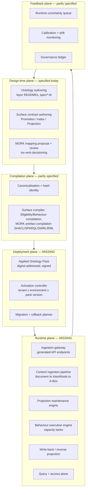
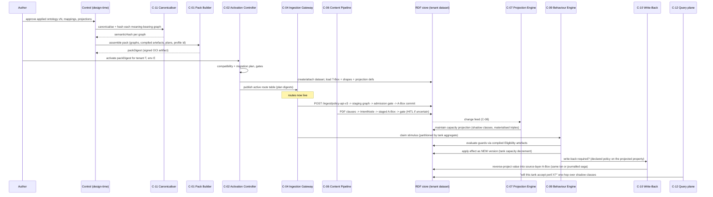

# LATTICE Platform — Architecture Review, Gap Analysis, and Component Specification

**Status:** Review document. It does not replace, restate, or rewrite `solution-design-specification.md`, `data-architecture.md`, `ux-design.md`, `ontology-architecture.md`, or `MORK UXD.md`. Every item below is expressed as **Gap → Analysis → Normative recommendation**, with an attachment point naming the document and section that should absorb it, and a proposed ADR where a decision is genuinely open.

**Identifier conventions used throughout**

| Prefix | Meaning |
|---|---|
| `G-nn` | Gap or defect, with severity S1–S4 |
| `C-nn` | New or re-scoped component requiring specification |
| `D-nn` | Open decision, proposed as an ADR |
| `R-nn` | Risk for the register in §10 |

**Severity scale**

| Sev | Meaning |
|---|---|
| **S1** | Correctness, safety, or auditability defect. The design as written can produce wrong or unattributable results. |
| **S2** | Blocks a stated product use case. The design has no answer, not merely an unfinished one. |
| **S3** | Operability, performance, or cost defect. Works, but not survivably. |
| **S4** | Hygiene, consistency, naming, documentation coherence. |

---

## Part 0 — Reading order and what this document is for

The existing document set is unusually good at one thing: it is honest about maturity, and it separates ontology semantics from platform mechanics cleanly. `data-architecture.md`'s three-realm model, the single-writer rule, the "no cross-realm foreign keys" rule, and MORK UXD's role-perimeter and anti-pattern discipline are load-bearing and should not be disturbed.

The problem is not quality. It is **coverage**. The entire document set describes one plane of the system — the plane in which a human authors, reviews, approves, compiles, and releases *specifications*. The commercial use case described in the brief requires four more planes that currently have no component, no contract, no data model, no UX, and no ADR:

1. **Deployment plane** — how an approved, compiled, hash-identified body of ontology + mappings + projections becomes an active configuration in a running environment for a specific tenant.
2. **Ingestion plane** — how MORK mappings become live API endpoints and live document-extraction pipelines that write into an applied ontology's A-Box.
3. **Operation plane** — how projections are maintained, how Behaviour executes (capacity tanks reacting to claims), how values surfaced in a projected layer are written back to their source layer, and how consumers query any of it with predictable cost and freshness.
4. **Feedback plane at runtime** — how runtime uncertainty (an unmapped payload field, a low-confidence clause extraction, a stale projection) routes into the same MORK review and governance machinery that currently only consumes design-time snapshots.

Read this document in this order: Part 1 for the structural diagnosis, Part 2 if you maintain the existing documents (it is a defect list against them), Parts 3–4 if you are about to implement, Part 5 for the cross-cutting rules that bind old and new components, Part 6 for UX, Parts 7–9 for catalogue, decisions and sequencing.

---

## Part 1 — Executive assessment

### 1.1 The single structural finding

> **G-01 (S2). The platform is specified as a design-time studio. The product is a runtime system with a design-time studio attached.**

Every capability row in `solution-design-specification.md §1` terminates at "evidence recorded" or "artifact packaged". `§4.4` then draws the boundary explicitly: *"Registry storage lifecycle, signing key custody, deployment mechanics, and retention enforcement remain the responsibility of whatever release stack is configured."* ADR-A31's intent — LATTICE is not a release engine — is correct and should be preserved. But it has been over-applied: it has been used to export not only *deployment mechanics* but *the entire runtime semantics of the framework* to an unnamed external party.

Nobody outside LATTICE can implement "ingest this JSON payload through the active MORK mapping, materialise the Surface projection, let the capacity tank react, and write the adjusted fund value back to the contract layer in the same transaction." That is not release engineering. That is the product.

The correct boundary restatement, which should be added to `§4.4` rather than replacing it:

> LATTICE does not own **artifact transport, registry lifecycle, signing custody, or orchestration of the operator's infrastructure**. LATTICE does own **semantic activation**: which pack version is in force, for which tenant, in which environment, with which generation profile, and what happens to data flowing through it.

Deployment *mechanics* stay external. Deployment *semantics* come back in-house, as `C-02`.

### 1.2 The plane model this review proposes



Every arrow crossing a plane boundary is a contract that does not currently exist. The rest of this document specifies them.

### 1.3 Secondary findings summary

| ID | Finding | Sev |
|---|---|---|
| G-02 | No query or read plane at all. The system can be written to and audited, but the point of the ontology — AI-enabled discovery, analysis, decisioning — has no API. | S2 |
| G-03 | No triple/quad-level provenance mechanism. LATTICE's promise of provenance compositionality has no platform realisation. | S1 |
| G-04 | Hash identities (`ontology-architecture.md §10`) are entirely unwired into the platform. Caching, invalidation, idempotency digests, and artefact interchangeability all silently depend on a canonicalisation contract nobody owns. | S1 |
| G-05 | Immutable graph-family registration keyed on `(tenantId, projectId, graphIri)` makes a second revision of the same graph IRI impossible, and no IRI-minting/versioning policy exists to resolve it. | S1 |
| G-06 | Dual-write inconsistency between PostgreSQL and Fuseki is acknowledged only as an alert, never as a mechanism (release provenance, and every future runtime write). | S1 |
| G-07 | No bi-temporal model. Claims, tanks, and audit all require as-of-valid-time and as-of-transaction-time queries. Neither is addressed. | S2 |
| G-08 | Projection writability (the view-update problem) is treated as a feature request ("write values back") with no formal basis. Some projections are not invertible. | S1 |
| G-09 | No per-aggregate ordering guarantee. A capacity tank is an aggregate; RabbitMQ topic exchanges as specified deliver no key-ordering, so two claims against one tank can interleave. | S1 |
| G-10 | Single Fuseki instance, single broker, single PostgreSQL, explicitly justified for a "studio". Untenable once runtime ingestion and tank reaction are in scope. The `§7.1` CAP framing must be re-derived, not patched. | S2 |
| G-11 | No NFR/SLO catalogue, no capacity model, no data volume estimates, no cost model. Performance is asserted ("high performing services") and never specified. | S3 |
| G-12 | No threat model. LLM-mediated document ingestion introduces prompt injection and data egress paths that no document mentions. | S1 |
| G-13 | No metering, quota, or tenancy control plane — required by the commercial framing. | S2 |
| G-14 | No open-source/commercial boundary specification: no SPI inventory, no plugin model, no statement of what a licensee extends versus forks. | S2 |
| G-15 | Real-time push deferred (`§7.4`). Defensible for job progress, indefensible for runtime operational surfaces. | S3 |
| G-16 | Store portability asserted via `ScopedDataset` SPI with no capability matrix and no conformance kit; GraphDB and Jena differ materially in transactions, reasoning, and SHACL. | S2 |
| G-17 | Event/message contracts have no schema registry, no versioning policy, no compatibility rules, despite two runtimes (Java/Python) and CloudEvents bodies. | S3 |
| G-18 | UX design covers two expert tools. The product needs operational surfaces for non-expert business users, and a design-system/embedding story, neither of which exists. | S2 |
| G-19 | SPC is a fully authored session-typed orchestration ontology sitting unused next to a system that is about to acquire multi-agent runtime orchestration. Either integrate deliberately or state the deferral with a real reason. | S3 |
| G-20 | Storage growth is unbounded by design (no deletes, versioned writes, append-only ledgers) with no compaction, snapshot, or archival strategy. | S3 |

---

## Part 2 — Defect list against the existing documents

This part is intended to be actionable by whoever maintains those files. Each item names its attachment point.

### 2.1 `solution-design-specification.md`

**G-21 (S4) — `§2.2` release publish sync/async classification is self-contradictory.**
The table says publish is "async from the caller's perspective … but implemented as a request-triggered background operation, not a broker job." The process map `P3` then shows it as a fully synchronous call chain returning `200 ReleaseReceipt`. Both cannot be true.
*Recommendation:* classify publish as **synchronous with a bounded deadline** (it is deterministic evidence verification plus bounded file I/O), and specify the deadline (proposed: 30 s soft, 120 s hard). If signing or registry push is enabled, that specific step becomes a job on `lattice.release.publish` with the receipt recorded on completion. Add the deadline to the row; delete the "background operation" language.

**G-06 (S1) — `§2.4 P3` step `CP->>Fuseki: write provenance N-Triples` is an unprotected dual write.**
`recordReceipt` commits in PostgreSQL, then a separate network call writes Fuseki. A crash between them leaves a receipt with no provenance, detected only by an alert in `§5.3`. Alerting on a known-broken invariant is not a design.
*Recommendation:* route provenance publication through the outbox (`ProvenancePublishRequested` event), consumed by a `ProvenanceGraphPublisher` worker, idempotent by `(releaseId, receiptDigest)`. The alert then becomes a genuine anomaly signal rather than an expected race. This generalises: **every PostgreSQL→Fuseki write in the system must go through the outbox**, which should be stated once as a rule in `§7.2`.

**G-22 (S2) — `§4.2` Control Plane runtime decision is under-determined in the dimension that matters.**
"A minimal HTTP runtime (a single well-chosen library)" is a non-decision that will be re-litigated at implementation time. More importantly, the decision omits the dimensions that will actually bite: virtual threads vs reactive for a runtime plane that must hold many concurrent slow SPARQL calls; request deadline propagation; a JSON codec choice that must be shared with contract schema validation; and whether the control plane and the runtime data plane are the *same* process (they must not be — see `G-23`).
*Recommendation:* ADR-A44 should decide: Java 21 virtual-thread-per-request on a minimal HTTP server (Helidon SE / Javalin / Undertow class of library, not a framework), Jackson at the edge with JSON Schema validation driven from `contracts/`, mandatory per-request deadline propagated into every downstream call as a `Deadline` object in the call context, and explicit rejection of reactive style on the grounds that the codebase's domain logic is blocking and synchronous by design.

**G-23 (S2) — One control plane process for both control and data traffic.**
`§4.2` explicitly refuses to shard by product, correctly, on the grounds of shared identity/policy/outbox wiring. But it then implies one process for everything. Runtime ingestion (thousands of payloads per minute, latency-sensitive) and authoring/review traffic (dozens of requests per minute, latency-tolerant) must not share a thread pool, connection pool, or deploy cadence.
*Recommendation:* keep one *codebase and composition root*, deploy as **two role-profiled instances of the same artifact**: `control` (authoring, review, release, governance, deployment) and `edge` (ingestion, query, subscriptions). Selected by a `LATTICE_ROLE` setting that determines which routers and consumers are mounted. This keeps `§4.2`'s "no duplicated wiring" benefit while gaining independent scaling and blast-radius separation. Proposed **ADR-A50**.

**G-24 (S3) — `§4.5` topology omits families that now exist, and omits ordering.**
Missing families: projection maintenance, behaviour stimuli, write-back, document extraction, provenance publication, reindex/rehash, replay. And no family declares an ordering requirement.
*Recommendation:* extend the table per `§5.3` of this document, and add one rule: **every job family declares an ordering class** — `none`, `per-key`, or `global` — and `per-key` families name their partition key. `per-key` cannot be implemented on a plain topic exchange with competing consumers; see `D-09`.

**G-25 (S4) — `§4.6` failure-mode table omits the failure that matters most.**
There is no row for "worker succeeded, result event lost", "result event applied twice with different content", "outbox relay runs in two instances simultaneously", or "clock skew between control plane and worker invalidates `recordedAt` ordering".
*Recommendation:* add those four rows. The relay one is significant: `§2.1` lists "Relay (outbox)" as a system actor with no statement of singleton-ness. Specify **relay leadership via a PostgreSQL advisory lock**, with the lock held per-shard so the relay can scale by hash range later.

**G-26 (S1) — `§7.1` CAP framing is correct for the documented system and wrong for the product.**
The argument "one PostgreSQL, one Fuseki, one broker, therefore no partitions worth naming" collapses the moment there is a second authoritative store on the write path (the RDF store at runtime), a per-tenant dataset topology, or a read replica for query serving. The real consistency problem in this platform is not CAP; it is **the absence of a distributed transaction across PostgreSQL and the RDF store**, which exists today and is simply not named.
*Recommendation:* replace the framing (not the section) with a **transaction boundary catalogue** (§5.2 of this document) enumerating every multi-store write and its chosen mechanism (single-store transaction, outbox, saga with compensation, or reconciliation loop). Keep the "no multi-region" non-goal. Proposed **ADR-A48 (revised)**.

**G-27 (S4) — `§1` capability catalogue has no runtime rows, and no NFR columns.**
*Recommendation:* add columns for *Latency class*, *Throughput class*, *Tenancy scope*, and *OSS/Commercial*, and add the runtime capabilities from Part 7 of this document.

### 2.2 `data-architecture.md`

**G-05 (S1) — the graph-family registry forbids graph revision.**
`§2.1` and `§5.2`: `(tenantId, projectId, graphIri)` may be registered once; "registering the same key with a different hash, family, or owner revision is rejected outright." Combined with `§2.3`'s "Immutable per revision hash", this is only coherent if **every revision mints a new graph IRI**. No document states that, and no IRI-minting policy exists anywhere in the repository. Downstream, `GraphReference` carries both `graphIri` and `revisionHash`, which is redundant under a versioned-IRI policy and ambiguous under a stable-IRI policy.
*Recommendation:* adopt and document a **versioned IRI policy** (Appendix A of this document): a stable *lineage IRI* identifies the continuing artefact and maps to `fnd:PersistentIdentity`; a *revision IRI* derived as `{lineageIri}/rev/{semanticContentHash[0:16]}` identifies the immutable content and maps to `fnd:Version`. The registry key becomes the revision IRI (naturally append-only), and a second table `graph_lineage` maps lineage → ordered revisions with `supersededBy` mirroring the ontology. Then `revisionHash` in `GraphReference` becomes a *verification* field, not an identity field, and the hash-mismatch check in `GraphMaterializer` is checking exactly what it claims to check. Proposed **ADR-A51**.

**G-28 (S3) — the realm table's "never holds" column is already violated.**
Operational state is declared PostgreSQL-only and "never RDF triples", yet the release provenance graph in Fuseki is a *derived projection of operational state* (`§3` admits it: "derived deterministically from the PostgreSQL release ledger"). At runtime this gets worse: Behaviour execution state, write-back journals, and ingestion batch metadata all want to be graph-resident because they are semantically meaningful.
*Recommendation:* replace the binary rule with an **authority declaration per fact class**, exactly as `ontology-architecture.md §10` already demands ("a materialised or projected statement must not automatically outrank its source"). Every graph named in the system carries a graph-level annotation: `lattice:authority` ∈ {`authoritative`, `derived-cache`, `derived-operational`, `external-synchronised`, `advisory`}. Rule becomes: *a realm may hold a derived copy of another realm's content only if it is marked derived and carries a reference to the authoritative source*. This preserves the intent, permits the reality, and makes it checkable by a SHACL governance shape.

**G-29 (S3) — a fourth realm is missing.**
Runtime needs: a change feed / transaction log, a hot cache for compiled plans and projection lookups, a blob realm for source documents (contract PDFs) with their own retention and PII posture, and time-series/metering counters. Forcing these into the three existing realms is what produces the "Postgres as everything" pressure the document is trying to avoid.
*Recommendation:* add two realms explicitly: **Stream realm** (append-only ordered log; the graph change feed and behaviour stimulus log live here) and **Cache realm** (strictly derived, reconstructible, never authoritative, no backup requirement). Document realm can be folded into the existing artifact realm with a distinct retention class and encryption requirement.

**G-30 (S4) — `§5.7` "single writer per data class" is contradicted by `§3`.**
`§3` assigns `processed_surface_job` to a "worker-owned schema" written by Python, while `§4`'s prose insists "the Control Plane is the only writer of operational state."
*Recommendation:* state the rule as **single writer per table, with tables partitioned into two ownership domains**: `control` schema (Java, Flyway-migrated) and `worker` schema (Python, its own migration tool), with a hard rule that neither domain issues DML against the other's schema, and cross-domain reads only through views explicitly granted. That is what the code does; the document should say so.

**G-31 (S3) — no retention or growth model.**
`§6` says deletion is "a retention-policy operation, not a routine one" and defers it. At runtime, with versioned writes, no in-place mutation, per-claim named graphs, and append-only ledgers, the dataset grows monotonically and forever.
*Recommendation:* specify three growth controls now, because they constrain the data model: (a) **named-graph snapshotting** — a projection graph may be replaced wholesale by a newer generation, with the prior generation archived to the artifact realm as a digest-addressed N-Quads bundle and dropped from the live dataset; (b) **cold-partitioning by valid-time** — closed contract periods move to an archive dataset queryable through federation; (c) **ledger partitioning** by month with archive export. All three require the bi-temporal model in `G-07`.

### 2.3 `ux-design.md` and `MORK UXD.md`

**G-18 (S2) — the user population is larger than the documents assume.**
Both documents describe expert tooling for people who build and govern mappings and contracts. The commercial use case implies additional humans: a claims handler seeing a capacity tank decline a claim and needing to know *why*; an underwriter inspecting a projected eligibility decision; an operations engineer watching an ingestion endpoint reject 4% of payloads; an auditor tracing a materialised triple to a clause in a PDF.
*Recommendation:* add a **UX register model** (§6.1 of this document) distinguishing *expert-dense* surfaces (MORK UXD's reference class, correctly argued) from *operational* surfaces (task-focused, lower density, still evidence-first, still no client-side security). The anti-pattern "modern web aesthetic" in MORK UXD Part 12 is correct *for the Bench* and must not be generalised into a prohibition on designing usable operational screens. State that explicitly so the tension is resolved by design rather than by whoever argues loudest.

**G-32 (S3) — `ux-design.md §2.3` polling contradicts runtime needs.**
Polling `GET /surface/jobs/{jobId}` is fine. A claims operator watching tanks cannot poll.
*Recommendation:* specify one push transport (`C-18`) used by all surfaces, with polling retained as fallback. Reverses part of `§7.4`'s deferral with a stated reason.

**G-33 (S4) — no design system, no accessibility, no i18n, no theming.**
LATTICE is a framework a licensee builds a product on. That product will be white-labelled, will need WCAG 2.2 AA for enterprise procurement, and will need locale handling for money, dates, and clause text.
*Recommendation:* §6.2–6.5 of this document.

### 2.4 `ontology-architecture.md`

**G-04 (S1) — §10 is the most important unimplemented section in the repository and no platform document references it.**
`solution-design-specification.md` and `data-architecture.md` both depend on stable content hashes (`revisionHash`, `requestDigest`, "immutable per revision hash", "deterministic compilation") without ever naming a canonicalisation contract. Today `revisionHash` is presumably a SHA-256 over serialised bytes, which means a whitespace change invalidates every cache and two semantically identical graphs compare unequal.
*Recommendation:* `C-11` (Canonicalisation & Hash Identity Service) is a **prerequisite**, not a later gate. Specified in §4.11.

**G-34 (S3) — `fnd:GovernanceState` individuals still undeclared, and the platform's lifecycle states are a parallel, unrelated vocabulary.**
Surface revisions have `DRAFT/REVIEW/APPROVED/GENERATED/RELEASED/SUPERSEDED` in PostgreSQL; Foundation has `Draft/Reviewed/Active/Superseded` undeclared in RDF. Two lifecycles, no mapping.
*Recommendation:* declare the Foundation individuals (as §11 item 2 already says) and add a normative mapping table from platform lifecycle states to `fnd:GovernanceState`, so a released Surface contract's graph actually carries `fnd:hasGovernanceState fnd:Active`. Without this, the ontology's governance layer is decorative in the platform that claims to govern it.

**G-19 (S3) — SPC.** See §4.13.

---

## Part 3 — The missing architecture

### 3.1 Plane responsibility matrix

| Plane | Owns | Must not own | Authoritative store |
|---|---|---|---|
| Design-time | Contract/profile/mapping authoring, review, approval, lifecycle | Any activation in a running environment | PostgreSQL (lifecycle) + RDF (content) |
| Compilation | Canonicalisation, hashing, deterministic artefact generation (SHACL/SPARQL/SWRL/RML/shadow classes/ingestion plans) | Any judgement call; any LLM invocation | Artifact realm, keyed by `(semanticHash, generationProfileId)` |
| Deployment | Pack assembly, signing, activation binding, migration plan, rollback | Infrastructure orchestration, registry lifecycle | PostgreSQL (activation ledger) + artifact realm (packs) |
| Runtime ingestion | Payload/document admission, mapping execution, staging, admission gate, A-Box commit | Mapping *authoring*; direct writes to live A-Box without a gate | RDF (A-Box), Stream realm (batch log) |
| Runtime operation | Projection maintenance, Behaviour execution, write-back, query serving | Mutation of authored source graphs in place | RDF (A-Box + projections), Stream realm (stimulus log) |
| Feedback | Runtime uncertainty capture, calibration, drift, governance ledger | Silent auto-correction of mappings | PostgreSQL (ledgers) |

### 3.2 New component inventory

| ID | Component | Runtime | Deployment unit | System of record for |
|---|---|---|---|---|
| C-01 | Pack Builder & Registry | Java (extends `release-integration`) | In `control` process + artifact realm | Pack manifests, pack signatures |
| C-02 | Activation Controller | Java | `control` process | `activation_binding`, `activation_event` |
| C-03 | Semantic Store Gateway (`semantic-dataset-*` expansion) | Java library | Linked into both roles + workers | Nothing (adapter) |
| C-04 | Ingestion Gateway | Java (`edge` role) | `edge` process | `ingestion_batch`, route registry (cache of activation) |
| C-05 | Mapping Plan Compiler | Python worker (design-time) + Java interpreter (runtime) | Worker + `edge` | Compiled plan artefacts (artifact realm) |
| C-06 | Content Ingestion Pipeline | Python workers | Worker tier | `extraction_run`, `extraction_span` |
| C-07 | Projection Maintenance Engine | Java worker (JVM, in-process SPARQL) | Dedicated `projection` worker process | `projection_generation`, `projection_freshness` |
| C-08 | Graph Change Feed | Java, store-adapter-specific | `edge` + projection worker | Stream realm |
| C-09 | Behaviour Execution Engine | Java | Dedicated `behaviour` worker process, partitioned | `stimulus_log`, `aggregate_position`, runtime state hashes |
| C-10 | Write-Back Service | Java | With Behaviour engine | `writeback_journal` |
| C-11 | Canonicalisation & Hash Identity Service | Java library + CLI | Linked everywhere | Nothing (pure function) + `hash_registry` cache |
| C-12 | Query & Access Plane | Java (`edge`) | `edge` process | `query_audit`, saved queries |
| C-13 | Reasoning & Validation Service | Java (Jena/store-native) | Projection worker + `edge` read path | `validation_run` |
| C-14 | Agent Orchestrator | Python | Worker tier | `agent_session` |
| C-15 | Runtime Feedback Router | Java + Python | `edge` + worker | `runtime_uncertainty` |
| C-16 | Metering & Quota Service | Java | `control` + `edge` sidecar path | `usage_event`, `quota_state` |
| C-17 | Tenancy Control Plane | Java | `control` | `tenant`, `environment`, `dataset_binding` |
| C-18 | Push/Subscription Gateway | Java (`edge`) | `edge` process | Nothing (projection of change feed) |
| C-19 | Lineage Service | Java (`edge`) | `edge` | Nothing (queries provenance graphs) |
| C-20 | Platform UI Kit + Client SDKs | TypeScript / Java / Python | npm + Maven + PyPI artefacts | Nothing |

### 3.3 The end-to-end narrative, made concrete

This is the walkthrough the brief describes, expressed as the component sequence it requires. It is the acceptance test for the whole design.



Every box in the `Note over IG` region downward is new.

---

## Part 4 — Component specifications

Each specification follows a fixed shape: purpose, interface, ownership, algorithm/state, concurrency, failure modes, performance budget, testability, and open decisions.

### 4.1 C-01 Applied Ontology Pack Builder & Registry

**Purpose.** Produce the single digest-addressed, signed unit that crosses the design-time/runtime boundary. This closes `G-01` at its narrowest point: rather than exporting the runtime, LATTICE exports a *pack* and owns what it means to activate one.

**Pack content (manifest schema `contracts/pack/pack-manifest.schema.json`):**

| Section | Content | Hash identity used |
|---|---|---|
| `ontology` | Layer T-Boxes in dependency order, applied ontology, SKOS schemes, `owl:imports` closure pinned by digest | semantic content hash per graph |
| `shapes` | `structural.ttl`, `constraints.ttl`, `rules.ttl` per layer, plus compiled Eligibility/Behaviour shapes | build artefact hash |
| `projections` | Surface Promotion/Index/Projection contracts + their compiled outputs (shadow class definitions, materialisation queries, invalidation policy) | semantic hash + generation identity |
| `mappings` | MORK active-mapping graphs, compiled ingestion plans, RML/SHACL/SWRL artefacts, template set | semantic hash + generation identity |
| `pedagogy` | Teaching pack hash, cassette corpus digest, model id constraints (from MORK UXD Part 10/11 stratum requirement) | pack hash |
| `profile` | Generation/profile identity: compiler versions, entailment regime, validation profile, IRI binding rules, store capability requirements | `generationProfileId` |
| `provenance` | Approval evidence references, release ledger intent/receipt refs, signature chain | — |
| `compatibility` | Declared compatibility with prior pack versions, migration requirements, required store capabilities | — |

**Interface.**
```
PackBuilder.assemble(PackIntent) -> PackManifest        // deterministic; same inputs -> same digest
PackRegistry.publish(PackManifest, Signature) -> PackDigest
PackRegistry.resolve(PackDigest) -> PackManifest
PackRegistry.verify(PackDigest) -> VerificationReport   // signature + every member digest + closure completeness
```

**Key rules.**
1. **Closure completeness is a gate.** A pack whose `owl:imports` closure is not fully pinned by digest is rejected. No runtime resolution of imports over the network, ever. (`R-01` mitigated.)
2. **Determinism is a gate.** `assemble` twice must yield an identical digest; CI asserts this.
3. **Reuse of `OciLayoutBundleService`.** A pack is an OCI artifact; this is exactly the existing bundle/export/restore machinery with a new manifest media type. No new transport.
4. **A pack is immutable and never partially activated.** There is no "hot-patch one mapping"; you build pack N+1. This is the single most important operational simplification available and should be adopted before anyone argues for incremental activation.

**Open decisions.** `D-01` (ADR-A52): pack media types, signature scheme (cosign keyless vs key custody by licensee), and whether pack contents are stored as loose blobs or a single compressed layer.

### 4.2 C-02 Activation Controller

**Purpose.** Bind `(tenant, environment, packDigest)` and make that binding the *only* source of truth for what any runtime component believes. Everything at runtime derives its behaviour from the active binding; nothing is configured independently.

**Data model (PostgreSQL, `control` schema).**

| Table | Key | Notes |
|---|---|---|
| `activation_binding` | (`tenantId`, `environmentId`) | current `packDigest`, `generationProfileId`, `activatedAt`, `activatedBy`, `state` ∈ {`preparing`,`active`,`draining`,`rolled_back`}; optimistic version |
| `activation_event` | (`tenantId`,`environmentId`,`eventId`) | append-only; the audit trail for "what was in force when" |
| `activation_plan` | `planId` | migration steps, computed, immutable, replayable |
| `dataset_binding` | (`tenantId`,`environmentId`) | dataset URI, store kind, capability set, isolation mode |

**Activation state machine.**

```
REQUESTED -> VALIDATING -> PREPARING -> SHADOW -> PROMOTING -> ACTIVE
                  |            |          |          |
                  v            v          v          v
               REJECTED     FAILED     FAILED    ROLLED_BACK
```

| Phase | Actions | Gate to proceed |
|---|---|---|
| VALIDATING | Verify pack signature and closure; check store capability requirements against `dataset_binding`; compute compatibility class against current pack | All required capabilities present; compatibility class resolved |
| PREPARING | Load T-Box/shapes/projection definitions into a **new named-graph generation** inside the tenant dataset; compile/warm plan caches; run shape self-tests | Zero shape violations against a fixture corpus; all compiled artefact digests match pack manifest |
| SHADOW | Run new projections and new ingestion plans in parallel with current, writing to shadow graphs; compare outputs on live traffic sample | Divergence report reviewed; no unexpected divergence, or divergence explicitly accepted with reason recorded |
| PROMOTING | Atomically repoint the projection alias graphs and the ingestion route table; drain in-flight work on old plans | Route table repoint acknowledged by all `edge` instances |
| ACTIVE | Old generation retained for the configured rollback window, then archived per `G-31` | — |

**Compatibility classes** (this is the ontology-evolution answer missing from every document):

| Class | Definition | Consequence |
|---|---|---|
| `additive` | New classes/properties/projections only; no existing semantic hash changed | Activate without re-materialisation; wildcard elision (`ontology-architecture §10`) makes existing projection hashes stable |
| `projection-affecting` | A projection's semantic hash changed | Re-materialise only affected projections, driven by the invalidation dependency graph |
| `abox-affecting` | An axiom change alters validity or entailments over existing A-Box data | Requires a data migration plan + re-validation run; SHADOW phase mandatory |
| `breaking` | Removal/renaming of terms referenced by existing A-Box data, or canonicalisation-contract change | Requires full rehash + regeneration cutover (`ontology-architecture §10`'s named migration consequence); dual-run window; explicit operator approval with named impact count |

**Rollback.** Rollback is repointing the alias graphs and route table to the prior generation, valid only within the retention window and only for `additive`/`projection-affecting` classes. For `abox-affecting`/`breaking`, rollback is a *forward* migration to a compensating pack — state this, because operators will assume otherwise and lose data.

**Failure modes.** Partial promotion (some `edge` instances repointed, some not) is the dangerous one. Mitigation: route table is versioned, `edge` instances poll/subscribe and report the version they serve, and `PROMOTING` does not complete until quorum reports the new version; requests during the window are served by whichever version the instance holds, which is safe only if both generations are semantically valid — hence SHADOW.

**Open decisions.** `D-02` (ADR-A53): activation granularity (whole pack, as recommended) and rollback window default.

### 4.3 C-03 Semantic Store Gateway and the store capability matrix

**Gap closed:** `G-16`, `G-10`.

The existing `semantic-dataset-spi` / `-fuseki` split is the right idea, executed without the analysis that makes it real. Jena Fuseki (TDB2), GraphDB, Neptune, Stardog, and Virtuoso differ in ways that change the design of `C-07`, `C-09`, and `C-10`.

**Required capability matrix (to be filled and CI-verified per adapter):**

| Capability | Why it matters | Fallback if absent |
|---|---|---|
| Multi-graph write transaction (ACID across named graphs in one dataset) | The "single transaction write-back" the brief requires | Saga + journal (`C-10`), degraded contract |
| Transaction isolation level / MVCC | Concurrent tank updates | Per-aggregate serialisation (`C-09`) becomes mandatory rather than an optimisation |
| Read-your-writes on a replica | Query plane consistency | Route reads to primary, lose scale-out |
| Transaction log / change feed | `C-08` | Diff-by-snapshot (expensive) or write-side dual emission |
| Native SHACL validation | `C-13` cost | Jena SHACL in-process, higher latency |
| Native OWL entailment + which profile (RL/QL/EL) | Guard evaluation, projection materialisation | Materialise via rules (`rules.ttl`) only; no dynamic entailment |
| SPARQL Update with `INSERT ... WHERE` performance class | Materialisation strategy | Client-side construct + bulk load |
| Full-text index, geo index | Lexical matching in MORK recognition; spatial eligibility | External index (adds a realm) |
| Bulk load throughput and offline load | Pack activation, archive restore | Long PREPARING phase |
| RDF-star or quad-level metadata | `G-03` provenance strategy | Named-graph-per-batch (recommended default) |
| Query timeout + memory cap enforcement | `C-12` cost governance | Enforce in gateway only, weaker |

**Normative recommendations.**
1. **Default reference store: Jena TDB2 via Fuseki for single-node, with GraphDB as the first validated commercial alternative.** State this; "one dataset" today is not a strategy.
2. **Conformance kit.** A test suite (`semantic-dataset-tck`) that every adapter must pass, producing a published capability report. The capability report is an input to `C-02`'s VALIDATING phase — a pack that declares `requires: multi-graph-transaction` cannot be activated onto a store that lacks it. This turns a documentation aspiration into an enforced gate.
3. **Dataset topology decision** (`D-03`, ADR-A54). Options and assessment:

| Option | Isolation | Cross-tenant query | Cost at 1000 tenants | Recommendation |
|---|---|---|---|---|
| One dataset, graph-per-tenant | Weak (enforced in app layer only) | Easy | Cheap | Reject: violates "no client-side security" logic one layer down; a single malformed query leaks |
| Dataset-per-tenant, shared store process | Strong at query scope | Federation only | Moderate; store-dependent limits | **Recommended default** |
| Store-per-tenant | Strongest; per-tenant tuning, reasoning, upgrade | Federation | Expensive | Recommended for large/regulated tenants ("dedicated" tier) |

Adopt dataset-per-tenant as default with store-per-tenant as a tier, and make the choice a property of `dataset_binding`, invisible to every other component because access always goes through `ScopedDataset`.

4. **Named-graph layout convention** inside a tenant dataset (this is currently unspecified and will otherwise be invented five times):

```
urn:lattice:{tenant}:{env}:tbox:{layer}:{revHash}          # pack-loaded, read-only at runtime
urn:lattice:{tenant}:{env}:shapes:{layer}:{revHash}
urn:lattice:{tenant}:{env}:abox:{appOntology}:current      # alias graph
urn:lattice:{tenant}:{env}:abox:ingest:{batchId}           # per-batch, provenance carrier
urn:lattice:{tenant}:{env}:stage:{batchId}                 # pre-admission, never queried by consumers
urn:lattice:{tenant}:{env}:proj:{projectionId}:{gen}       # projection generation
urn:lattice:{tenant}:{env}:proj:{projectionId}:current     # alias
urn:lattice:{tenant}:{env}:prov:{scope}
urn:lattice:{tenant}:{env}:rtstate:{aggregateType}:{gen}   # behaviour runtime state
urn:lattice:{tenant}:{env}:writeback:{journalId}
```
Alias graphs are the promotion/rollback mechanism; consumers never name a generation directly.

### 4.4 C-04 Ingestion Gateway

**Purpose.** Turn an active MORK mapping into a live, validated, idempotent, metered HTTP/stream endpoint that lands source data in an applied ontology's A-Box. This is the "API mappings are used to generate endpoints for ingestion" capability, entirely absent today.

**The central design decision (`D-04`, ADR-A55): interpret, don't generate code.**

| Approach | Pros | Cons |
|---|---|---|
| Generate Java/Python source per mapping, compile, deploy | Peak throughput; static typing | Every mapping change is a build+deploy; 200 entity types = 200 artefacts; kills the "activate a pack" model |
| **Interpret a compiled plan at runtime** | Activation is a data change; one binary; plan cache keyed by digest | Interpretation overhead; needs a well-designed plan IR |
| Hybrid: interpret, with optional JIT of hot plans | Best of both | Complexity |

**Recommendation: interpret a compiled plan IR**, with the plan produced at design time by `C-05` and pinned into the pack. Revisit JIT only if measured against the SLO in §5.4.

**Ingestion plan IR (artefact in pack, `contracts/plan/ingestion-plan.schema.json`).** Per route:

```
route:
  routeId, mappingGraphDigest, planDigest
  transport: http-json | http-xml | file-batch | stream
  path: /ingest/{tenant}/{routeSlug}
  requestSchema: JSON Schema (derived from MORK Representation + Entity/Attribute structure)
  idempotency: { keyPaths: [...], scope: route|tenant, window: duration }
  steps:
    - bind: extract values by dataRef/path into a typed frame
    - mint: IRI minting rules per entity (deterministic; see Appendix A)
    - assert: triple templates ordered by MORK box stratification (T-Box -> A-Box -> R-Box)
    - reference: SKOS concept resolution via bound ConceptScheme + SchemeContract check
    - validate: shape set to run pre-admission
  admission: { shapeSet, severityPolicy, onViolation: reject|quarantine|partial }
  provenance: { batchGraphTemplate, sourceAttribution, retainPayload: bool }
  writeTarget: abox alias graph
```

Note `mint` and `reference` are where most real-world ingestion bugs live and where the documents are silent. Two rules:
- **IRI minting is deterministic and declared**, never random, so re-ingesting the same payload converges rather than duplicating. Appendix A.
- **SKOS resolution is a lookup, never an inference.** If a payload carries a code not present in the bound `voc:ConceptScheme`, that is an admission violation routed to `C-15`, not an LLM call. The compilation boundary from `ontology-architecture §8.1` applies at runtime, which no document currently states.

**Request lifecycle.**

```
1. Authenticate (service principal / API key -> Principal with tenant+env)
2. Resolve active route (route table version, plan digest) — reject if no active binding
3. Quota + rate check (C-16) — 429 with retry hints
4. Validate against requestSchema — 400 with pointer-level errors
5. Idempotency check — (routeId, idempotencyKey, payloadDigest):
     same key + same digest -> return cached result (200/202, replayed)
     same key + different digest -> 409
6. Open ingestion batch (batchId, Stream realm record)
7. Execute plan -> staging graph
8. Run admission shapes (C-13) against staging + relevant existing A-Box context
9a. Clean -> commit: copy staging into abox batch graph, link provenance, drop staging (single store txn if supported)
9b. Violations -> per severityPolicy: reject (roll back staging) | quarantine (retain staging, open C-15 item) | partial (commit conforming subgraph, quarantine remainder — only if declared)
10. Emit change feed event; emit usage event; respond with batchId + accepted/rejected counts + per-item diagnostics
```

**Staging is non-negotiable.** Direct writes to the live A-Box from an ingestion endpoint make it impossible to (a) validate against whole-graph constraints before commit, (b) reject atomically, (c) give the human a coherent thing to review. This one rule prevents an entire class of "our graph is full of garbage" outcomes. Attach to `data-architecture.md §2.3` as a new family: `INGEST_STAGING` (immutable, content-addressed, short-retained).

**Throughput modes.** Single-record synchronous (SLO in §5.4), batch file (async, job on `lattice.ingest.batch`, chunked with per-chunk commit and a batch-level manifest), and stream (consumer with the same plan interpreter, at-least-once + idempotency). All three share the plan interpreter; only the transport and commit granularity differ.

**Failure modes.**

| Failure | Containment | Recovery |
|---|---|---|
| Store unavailable mid-commit | Staging graph is orphaned, batch marked `INTERRUPTED` | Reaper job resolves: if commit marker absent, drop staging and 503 the batch; idempotency makes client retry safe |
| Plan digest not in cache and pack unreachable | `edge` refuses to serve the route (fail closed) | Warm cache during PREPARING; never lazy-load a plan on the request path |
| Payload references unknown SKOS code | Quarantine + `C-15` item + `Unresolved` state per MORK UXD Part 5 | Steward teaches synonym / Ontology Owner extends scheme; quarantined batch replayed by digest |
| Malicious payload size / depth | Hard limits enforced before parse (size, depth, array cardinality) | 413 |
| Duplicate at-least-once stream delivery | Idempotency key | Cached replay |

**Performance budget.** See §5.4; the ingestion plan interpreter must not allocate per-triple beyond a pooled frame, and admission shape sets must be pre-compiled and cached per plan digest.

### 4.5 C-05 Mapping Plan Compiler

**Purpose.** The deterministic compiler from an *active* MORK mapping graph to (a) an ingestion plan IR, (b) RML/SHACL/SWRL artefacts, (c) a JSON Schema for the request contract, (d) a reverse plan for `C-10` where the mapping is declared invertible.

**Why it is a separate component.** `ontology-architecture §8.1` states the architectural commitment: the LLM proposes; everything downstream of the validation gate is deterministic. `C-05` *is* that downstream. Today the repository has the vocabulary and no compiler (§8.6 says so explicitly). This is the largest single piece of missing implementation in the whole system and it is not mentioned in the platform specification at all.

**Interface.**
```
compile(MappingGraph, TargetOntologyClosure, GenerationProfile) -> CompiledMappingSet
  // deterministic; digest = f(mappingSemanticHash, targetClosureHash, generationProfileId)
explainPlan(planDigest) -> PlanExplanation   // for the Technical Inspector UX and lineage
```

**Required properties (assert in CI):** termination, idempotence, determinism under permuted input order, precedence completeness (T→A→R ordering derived, never specified), and provenance compositionality (every emitted artefact element carries back-references to the mapping node and the source intent node). These are exactly the claims in `§8.4` that the review there calls "design intent, not verified properties". Making them CI-asserted properties of `C-05` converts them into verified properties of the *platform*, which is the honest way to keep the claim.

**Gates before compilation** (these are the "machine-clean" precondition MORK UXD Part 1 requires): MORK lint, GCI/disjointness consistency, Meta-SHACL, type compatibility against the target closure, and template round-trip proof for every `templateMapping`.

### 4.6 C-06 Content Ingestion Pipeline (documents → A-Box)

**Purpose.** The "train AI to classify and ingest text into the graph, creating structured sub-graphs from written clauses" capability. Runtime, LLM-mediated, and therefore the highest-risk component in the system.

**Pipeline stages.**

| Stage | Output | Determinism |
|---|---|---|
| 1. Acquire | Document blob in artifact realm (encrypted, PII-classified), `documentId`, content digest | Deterministic |
| 2. Layout + text extraction | Page/span geometry, text with span coordinates | Deterministic given engine version (pinned in profile) |
| 3. Segment | Clause/section candidates with span ranges | Deterministic (rules) or model-assisted (pinned model id) |
| 4. Extract intent | `IntentNode` graph in general vocabularies only, with `hasNaturalLanguageSource` span + page + bbox, plus **extraction confidence** | LLM; non-deterministic; pinned model + pack + temperature 0 + seed where available |
| 5. Align | Intent → ontology paths via active MORK mapping + retrieval over prior confirmed mappings | LLM proposes, deterministic scoring |
| 6. Compile candidate A-Box | Staging graph | Deterministic (`C-05` plan) |
| 7. Admission gate | Shape validation + confidence thresholds + calibration gate | Deterministic |
| 8. Route | Auto-admit / HITL review / quarantine | Deterministic policy |
| 9. Commit | A-Box batch graph + provenance | Deterministic |

**Three confidence channels kept separate** (MORK UXD §4.6 demands this and no platform document carries it): `extractionConfidence` (did the document say this), `notationConfidence` (is the MORK structure well-formed), `domainConfidence` (`weighting`; does this mapping mean this). Each is a separate property on the staged node, each has its own threshold in the admission policy, and **none may be combined into a single score at any point in the pipeline or the API**. This is a data-contract rule, not a UX preference.

**The two-bench layer separation is an API constraint, not just a UI one.** MORK UXD §4.6 requires an Intent Bench where ontology IRIs are *structurally absent*. Enforce server-side: the intent-review API response type has no field capable of carrying an ontology IRI. Proposition 6.1's layer independence then cannot be violated by a UI bug.

**Prompt-injection threat (G-12, S1).** Documents are untrusted input reaching an LLM that influences graph writes. This is not mentioned anywhere. Required controls:
1. Extracted text is **data, never instruction**: structured prompt boundaries, no tool-calling capability granted to the extraction model, no ability for extracted content to name a target IRI directly (it can only produce Intent, per stage 4).
2. The alignment step (stage 5) may only *select from* a candidate set computed deterministically from the active pack; it cannot invent an IRI. Minting is a separate, human-gated path (MORK UXD Part 5).
3. Admission shapes are authored from the pack, never from the document.
4. Every LLM call is logged with model id, pack hash, prompt template hash, token counts, and cost, to `extraction_run`, for both audit and `C-16`.

**Replay and non-determinism.** Because stage 4 is non-deterministic, the pipeline must record the *output* as the durable artefact, not just the inputs. Re-running is a new `extraction_run` with a new id; comparing runs is a first-class operation (drift detection, `C-15`). Never overwrite an extraction result in place.

**Cost control.** Per-tenant token budgets enforced pre-call; cheapest-first stratum ordering (`ontology-architecture §8.4`: recognition → community → projection → LLM) so the LLM is the last resort, not the first; cache keyed by `(spanDigest, promptTemplateHash, modelId, packHash)`.

### 4.7 C-07 Projection Maintenance Engine

**Purpose.** Run Surface's projections *continuously over live data*, which is the capability the brief describes ("have the surface mappings across layers execute once the data is in the graph") and which `surface-workflow` currently only does as a design-time compile step.

**Projection strategy taxonomy (declared per projection in the Surface contract; `D-05`, ADR-A56):**

| Strategy | Mechanism | Read latency | Write cost | Freshness | Use when |
|---|---|---|---|---|---|
| `virtual` | SPARQL rewrite at query time over source layers | High | Zero | Exact | Low query volume, high write volume |
| `materialised-full` | Periodic full rebuild into a new generation, alias flip | Lowest | High, batched | Bounded staleness | Slow-changing reference structure |
| `materialised-incremental` | Change-feed-driven delta maintenance | Lowest | Per-change | Near-real-time | The capacity-tank case |
| `hybrid` | Materialised base + virtual overlay for the current open period | Low | Moderate | Exact for hot data | Claims-period workloads |
| `entailed` | Store-native reasoning (OWL-RL/QL) with shapes as guard rails | Store-dependent | Store-dependent | Store-dependent | Only where the store's profile genuinely covers the axioms |

**Each projection declares a freshness contract** — `exact`, `bounded(Δ)`, or `eventual` — and `C-12` returns the *observed* freshness with every query result over that projection. Without this, consumers silently read stale shadow classes and no one can tell whether a wrong answer was a bug or a lag. This is a small addition with very large operational value.

**Incremental maintenance algorithm.** For `materialised-incremental`:
1. Subscribe to `C-08` change feed, filtered by the projection's declared **read-set** (Surface already computes read-sets for impact preview — reuse, do not reinvent).
2. Map changed quads → affected projection keys via the compiled **dependency index** (built at compile time; a function from source predicate/class to projection key extraction query).
3. Recompute affected keys only, in per-key order, writing into the current generation graph.
4. Advance a watermark (`projection_freshness.appliedThrough`), which is what `C-12` reports.
5. Periodic **full reconciliation** compares a full rebuild's digest against the incremental state and alarms on divergence. Incremental maintenance without a reconciliation check is how silent corruption happens; make it scheduled and mandatory.

**Invalidation across pack activation.** `ontology-architecture §10`'s cache rule — `cache valid = semantic content hash + generation/profile identity` — is implemented here: a projection generation graph is annotated with both, and `C-02` re-materialises exactly those whose pair changed. Wildcard elision means adding an unused dimension does not trigger re-materialisation, which is the concrete payoff of the canonicalisation work.

**Concurrency.** One maintainer per `(tenant, projection)` — enforced by advisory lock — so ordering within a projection is guaranteed without distributed coordination.

**Failure modes.** Maintainer lag (alarm on watermark age vs freshness contract); dependency index miss (a change that should have triggered recompute did not — caught by reconciliation, treated as an S1 defect); generation graph corruption (rebuild from source; projections are always reconstructible, never authoritative — assert via the `lattice:authority` annotation from `G-28`).

### 4.8 C-08 Graph Change Feed

**Purpose.** The single missing primitive on which `C-07`, `C-09`, `C-15`, `C-18`, and `C-19` all depend. No document mentions it.

**Interface.** An ordered, durable, replayable stream per tenant dataset:
```
ChangeEvent {
  tenantId, environmentId, txnId, seq, committedAt,
  graph, added: [quad], removed: [quad],
  cause: { kind: ingest|behaviour|projection|writeback|activation|admin,
           batchId?, stimulusId?, principal },
  packDigest, generationProfileId
}
```

**Implementation options (`D-06`, ADR-A57):**

| Option | Fidelity | Coupling |
|---|---|---|
| Write-side emission (all writes go through `ScopedDataset`, which emits) | Complete *if* no out-of-band writes exist | Requires banning direct store access — already the intent |
| Store transaction log tailing (TDB2 journal, GraphDB plugin) | Complete including admin writes | Store-specific, adapter work per store |
| Snapshot diffing | Lossy, expensive | Portable |

**Recommendation:** write-side emission as the primary mechanism, with **a store-level audit reconciliation** that periodically compares an expected-state digest against the store to detect out-of-band writes. Emit into the Stream realm within the same transaction where the store supports it, otherwise via the outbox pattern applied to the graph side (a `pending_change_event` row committed with the data in a store-native transaction is not possible across stores — so where it is not, the change event is derived from the commit record and marked `derived`, with reconciliation as the safety net).

**Ban direct store access.** Add to `data-architecture.md §5` as rule 8: *no component writes to the RDF store except through `ScopedDataset`; credentials for direct access exist only for operators performing an audited break-glass procedure, which emits an `admin` change event by policy.*

### 4.9 C-09 Behaviour Execution Engine (the capacity tanks)

**Purpose.** Execute the Behaviour layer at runtime: stimuli arrive, guards evaluate (delegating to Eligibility), effects apply, state advances, without in-place mutation. This is the component the brief describes as "capacity tanks respond in turn", and it is entirely absent. `ontology-architecture §10.4` already specifies its state hash ("state occupancies, activation registers, ordered stimulus queues, execution sequence numbers, emitted stimuli, effect results, occupancy and account records") — the ontology anticipated this engine; the platform never noticed.

**Aggregate model.** The unit of consistency is an **aggregate**: typically one capacity tank, one obligation, one role occupancy. Formally: the transitive closure of nodes whose state a single transition may write. Declared in the Behaviour projection contract as an `aggregateRoot` with a key-extraction query. Everything else follows:

- **All stimuli for one aggregate are processed in strict order by exactly one processor at a time.**
- **Cross-aggregate effects are emitted as new stimuli, never applied inline.** This is the rule that makes the engine tractable; without it you get distributed locks and deadlock.
- Cross-aggregate invariants (a treaty-level cap across many layer tanks) are handled by a *parent aggregate* or by a compensating saga, declared explicitly. There is no third option and pretending otherwise is how these systems fail under load.

**Execution loop (per stimulus, single aggregate).**
```
1. Acquire aggregate lease (per-key, fenced token)
2. Load aggregate state at position P (from rtstate graph current generation + replay tail)
3. Idempotency: if stimulusId <= appliedPosition -> return recorded outcome
4. Evaluate activation policy + guard:
     guard -> compiled Eligibility artefact (SHACL-SPARQL / compiled evaluator) over
              aggregate state + projected context; NO LLM, NO network beyond the store
5. Decide: fire | not-fired (with reason) | blocked (unresolved question -> C-15)
6. Compute effects as a proposed delta (new versions; never mutate authored nodes)
7. Validate delta against shapes (C-13)
8. Commit in ONE store transaction:
     - new version nodes + supersededBy links
     - stimulus log entry (applied, position P+1)
     - emitted stimuli (outbox rows in the graph or Stream realm)
     - runtime state hash for the new position
9. Release lease; publish change events; publish emitted stimuli
```

**Determinism and replay.** Given the same pack, the same aggregate start state, and the same ordered stimulus sequence, the engine must produce the same runtime state hash. Wall-clock and storage addresses are excluded from the hash projection (as `§10.4` already says). Consequences that must be designed in, not retrofitted:
- **Time is an input, not an ambient read.** Every stimulus carries a `decisionTime`; no guard may call `now()`. This single rule is what makes replay, backdating, and as-of analysis possible.
- **Random and external calls are forbidden in guards and effects.** Anything external is a prior stimulus.

**Why the JVM and not the Python worker tier.** The existing worker tier is Python and correct for compiler/analysis work. The behaviour engine is latency-sensitive, holds aggregate state, needs tight store transactions, and shares the compiled Eligibility/Shape artefacts with `C-07` and `C-13`. Put it in the JVM, as a separate partitioned deployment. Proposed **ADR-A58** (`D-07`).

**Partitioning and ordering (`G-09`, `D-09`).** Aggregate leases plus per-key ordering cannot be obtained from a plain RabbitMQ topic exchange with competing consumers. Options:

| Option | Ordering | Operational cost | Assessment |
|---|---|---|---|
| RabbitMQ consistent-hash exchange plugin, one queue per partition, one consumer per queue | Per-key within partition | Low; plugin dependency | **Recommended for phase 1.** Keeps single-broker posture from `§7.4` |
| Single-active-consumer queues per partition | Per-partition | Low | Equivalent; fewer moving parts, less even distribution |
| Kafka/Redpanda partitioned log | Per-key, plus replay and retention natively | New infrastructure, second broker | Recommended once throughput or replay requirements justify it; also the natural home for the Stream realm |
| PostgreSQL-backed queue with `FOR UPDATE SKIP LOCKED` per key | Per-key, transactional with state | No new infra; couples throughput to Postgres | Viable and underrated for phase 1 |

Decide in **ADR-A59**; do not leave it implicit. Whichever is chosen, the *abstraction* (`PartitionedWorkQueue` with a declared key) must be in place from the start so the substitution is later a configuration change.

**Capacity-tank semantics specifics.** The brief's example demands: a tank decrement must not alter the contract's stated capacity. Realise as: the authored `ins:` capacity node is immutable; the tank's *current* capacity lives in the capacity projection's A-Box as a versioned runtime node linked by `fnd:derivedFrom` to the authored node and by provenance to the stimulus that changed it. The engine writes only runtime nodes. The query "what capacity did this layer have on date D under claim sequence S" is then answerable by position, not by guesswork. This is the concrete payoff of the no-in-place-mutation rule and should be written into the Behaviour projection contract as a required declaration.

# Part 4 (continued) — Component specifications

### 4.10 C-10 Write-Back / Reverse Projection Service *(continued)*

**Round-trip laws, checked at compile time.** For any property declared `pass-through`, `unit-converted`, or `lens`, `C-05`/Surface compilation must discharge two obligations before the pack is buildable. These are the standard lens laws, and they are the only thing standing between "configurable write-back" and silent corruption of authored contract data:

| Law | Statement | Failure means |
|---|---|---|
| **PutGet** (acceptability) | `get(put(s, v)) = v` — after writing `v` through the projection, reading the projection back yields `v` | The write did not achieve what the user asked for; the UI would lie |
| **GetPut** (stability) | `put(s, get(s)) = s` — writing back an unchanged value changes nothing in the source | Idle saves mutate data; version churn; false invalidation cascades |
| **PutPut** (optional, declared) | `put(put(s, v₁), v₂) = put(s, v₂)` | Sequence-dependent results; only required where the UI permits rapid successive edits |

Discharge method: for `pass-through` and `unit-converted`, structurally (the compiler proves the inverse from the projection's shape, no author input). For `lens`, by **property-based testing over a generated instance corpus** during pack build, with the corpus and its seed pinned into the pack manifest so the proof is auditable and reproducible. A `lens` whose laws fail is a pack build failure, named to the property, not a runtime surprise.

This closes `G-08`. Attachment point: a new subsection in `surface-workflow.md`, plus a required `surface:writability` field in the Projection contract schema, plus `contracts/surface/projection-contract.schema.json` gaining a `writeBack` block.

**Transaction modes — the "user contract preference" the brief requires.** Each writable property additionally declares a write-back mode:

| Mode | Mechanism | Guarantee | Requires store capability | Use when |
|---|---|---|---|---|
| `same-transaction` | Projected write and source write commit in one store transaction; projection generation updated in the same commit | Strong; reader never observes divergence | Multi-graph ACID transaction | Fund-tracked capacity value; anything a downstream decision reads immediately |
| `journalled` | Projected write commits; a `writeback_journal` entry commits with it; an applier applies to source asynchronously with retry | Eventual, bounded, auditable; divergence window is observable | None beyond single-graph atomicity | Cross-store source, slow source system, human-approval-gated write-back |
| `proposal` | No write occurs. A `WriteBackProposal` node is created and routed to an approver | None until approved | None | Regulated data, authored contract terms, anything an auditor must bless |
| `rejected` | Default for `read-only` | — | — | Everything not explicitly opened |

Two rules that must be stated normatively because they will otherwise be violated in the first sprint:

1. **`journalled` mode makes divergence a first-class, queryable fact, not a hidden race.** Every projected value written in `journalled` mode carries `lattice:writeBackState ∈ {pending, applied, failed, compensated}` and the `journalId`. `C-12` returns this alongside the value, and the UI renders it (§6.4). An operator can always answer "is the source layer consistent with what I am looking at, right now?" — which is exactly the question that an unadvertised eventual-consistency window makes unanswerable.
2. **Write-back never writes to a graph marked `lattice:authority = derived-*`.** It writes to the authoritative source graph, creating a *new version* of the source node per `ontology-architecture §10`'s explicit rejection of in-place mutation, linked by `fnd:supersededBy`, with the projection write and the stimulus (or user action) recorded as `fnd:Evidence` on the new version. The source layer's history therefore records *why* it changed, which is the property that makes the whole mechanism defensible to an auditor.

**Data model (`control` schema, PostgreSQL).**

| Table | Key | Columns of note |
|---|---|---|
| `writeback_journal` | `journalId` | tenant, env, projectionId, propertyPath, aggregateKey, `projectedGraphRef`, `sourceGraphRef`, `proposedValue`, `priorValueDigest`, mode, state, attempts, `decisionTime`, principal, `causeStimulusId?` |
| `writeback_attempt` | (`journalId`, `attemptNo`) | append-only; outcome, diagnostic, storeTxnId |
| `writeback_conflict` | `conflictId` | journalId, conflict kind, observed source state digest, resolution, resolvedBy |

**Conflict handling.** A `journalled` write-back applies only if the source node's current version digest still equals `priorValueDigest`. Otherwise the journal entry moves to `CONFLICTED` and routes to `C-15` with the three facts a human needs: what I intended to write, what the source says now, and what changed it. Never last-write-wins. This is the optimistic-concurrency rule from `data-architecture.md §5.1` extended across realms, and it should be added there as the same rule applied to graph-to-graph writes.

**Compensation.** If a `journalled` write-back fails terminally, the projected value must not silently stay changed. Two declared options per property: `compensate` (revert the projected runtime node to its prior version, recording the compensation as its own versioned change — never a deletion) or `hold` (keep the projected value, mark `writeBackState = failed`, block further writes to that property until resolved). `compensate` is the default; `hold` requires an explicit declaration and an alert route.

**Interface.**
```
WriteBackService.propose(WriteBackRequest) -> WriteBackDecision
   // synchronous: resolves writability class, mode, laws, authority, conflict precondition
WriteBackService.apply(journalId) -> ApplyResult          // applier worker; idempotent by journalId
WriteBackService.state(journalId) -> JournalState
WriteBackService.listDivergent(tenant, env, projectionId) -> [JournalState]  // operability
```

**Failure modes.**

| Failure | Detection | Containment | Recovery |
|---|---|---|---|
| Source store rejects write (shape violation in source layer) | Applier receives validation report | Journal → `FAILED`, compensation per declaration | The projection's write-back inverse is wrong; treat as pack defect, not data defect |
| Applier runs twice | Idempotent by `journalId` + precondition digest | Second attempt no-ops | — |
| Projection re-materialised while journal pending | Watermark comparison in applier | Applier re-reads current projected value; if it no longer matches, journal → `STALE`, routed for review | — |
| Write-back loop (source write → change feed → projection recompute → write-back) | Cause-chain depth counter on change events | Hard cap (default 1) on write-back-caused re-derivation; exceeded → circuit break and alarm | Almost always a mis-declared `lens`; the depth counter is what turns an infinite loop into a named defect |

The write-back loop is the single most likely catastrophic failure of this component. The cause-chain depth counter on `ChangeEvent.cause` (§4.8) must exist from the first line of code, not be added after the first incident.

---

### 4.11 C-11 Canonicalisation & Hash Identity Service

**Closes `G-04` (S1).** `ontology-architecture.md §10` specifies four identities and a canonicalisation contract; the platform documents consume `revisionHash`, `requestDigest`, "immutable per revision hash", and "deterministic compilation" without ever naming what produces them. Today these are almost certainly byte digests over serialised output, which means a re-serialisation invalidates every cache, two semantically identical graphs compare unequal, and "verify determinism" verifies the serialiser rather than the compiler.

This is a **prerequisite component**, not a later gate. Nothing downstream — idempotency, cache validity, pack determinism, projection invalidation, replay verification — is correct without it.

**Interface (pure library, plus a CLI for CI and for operator forensics).**
```
canonicalise(Graph, CanonicalisationProfile) -> CanonicalForm      // deterministic byte sequence
semanticHash(Graph, CanonicalisationProfile) -> Hash               // sha256 over CanonicalForm
generationProfileId(GenerationProfile) -> Hash                     // over a canonical profile record
artefactHash(bytes) -> Hash                                        // plain digest, named for clarity
runtimeStateHash(AggregateState, StateHashProjection) -> Hash
explain(Graph, CanonicalisationProfile) -> CanonicalisationTrace    // which normalisations fired
```

**Normalisation steps, in fixed order** (elaborating `§10.1`'s list into an implementable contract):

| Step | Rule | Rationale |
|---|---|---|
| 1. Blank node canonicalisation | RDFC-1.0 (formerly URDNA2015) | The only standardised answer; do not invent one |
| 2. Triple ordering | Sort canonical N-Quads lines byte-wise after step 1 | Serialisation-order independence |
| 3. Literal normalisation | Canonical lexical form per XSD datatype; explicit `xsd:string` datatype dropped; language tags lowercased | `"1.0"^^decimal` ≡ `"1.00"^^decimal` |
| 4. Annotation stripping | Named annotation properties excluded by profile (e.g. `rdfs:comment`, `fnd:utility`, editorial provenance) | Meaning-bearing vs documentation split; this is the step that makes doc edits cache-neutral |
| 5. Import pinning | `owl:imports` replaced by `(importedLineage, importedSemanticHash)` pairs | Closure identity without recursive inclusion |
| 6. Wildcard elision | Unconstrained dimension values omitted; `elg:Unsourced` **retained** | `§10.1`'s stated optimisation and its stated exception |
| 7. Optional-value normalisation | Absent vs explicit-empty distinguished only where the profile declares it significant | Prevents accidental hash churn from serialiser differences |
| 8. Ordered-collection normalisation | `rdf:List` / `skos:OrderedCollection` reduced to an indexed form | Order preserved, encoding freed |
| 9. Legacy IRI override application | Declared IRI rebinding applied before hashing | Deployment-specific IRIs must not change the semantic hash (`§10.1` explicitly requires this) |

**The profile is itself versioned and hashed.** Every computed hash is stored as the pair `(canonicalisationProfileVersion, hash)`. A profile change is a **`breaking` compatibility class** event (§4.2) requiring a planned full rehash, exactly as `§10`'s migration note warns. Never compare hashes computed under different profile versions; make that a type-level impossibility (`SemanticHash` carries its profile version and equality requires both to match).

**Canonicalisation cost is a real constraint.** RDFC-1.0 is worst-case super-polynomial on adversarial blank-node structures. Mitigations, all required:
- Cache by `(inputByteDigest, profileVersion)` in the Cache realm and in `hash_registry` (PostgreSQL) for durable reuse.
- Hash **per named graph**, never over a whole dataset, so cost scales with the changed unit.
- Set a hard blank-node-count ceiling per graph (default 10 000) with a diagnostic naming the offending structure; the ontology's own conventions (reified relations with IRIs, not blank nodes) mean well-authored content never approaches it.
- Compute hashes **at author/commit time**, never on a read path.

**Where the four identities attach in the platform** (the mapping that is currently missing everywhere):

| Identity | Produced by | Stored in | Consumed by |
|---|---|---|---|
| Semantic content hash | `C-11` on graph commit | `surface_graph_artifact`, `graph_lineage`, pack manifest, graph-level annotation | Cache validity, pack determinism, projection invalidation, compatibility classing |
| Generation/profile identity | `C-11` over the profile record | `activation_binding`, pack manifest, every derived artefact | Artefact interchangeability, convergence stratification (MORK UXD Part 11 / R4) |
| Build artefact hash | Compilers (`C-05`, Surface) | Artifact realm, `release_ledger_*` | Determinism verification, receipt digests |
| Runtime state hash | `C-09` per applied position | `rtstate` graph, `aggregate_position` | Replay verification, divergence detection, audit |

**Attachment points:** `data-architecture.md §2` (as a new realm-crossing invariant: every `GraphReference.revisionHash` is a `(profileVersion, semanticHash)` pair), `solution-design-specification.md §1` (as a capability row), and `ontology-architecture.md §10` (as the note that the contract is now owned by a named component).

---

### 4.12 C-12 Query & Access Plane

**Closes `G-02` (S2).** The system as documented can be authored, reviewed, released, and audited. It cannot be *asked a question*. The entire stated purpose of LATTICE — "domain ontologies well suited to supporting AI-enabled discovery, analysis, and decision making" — has no API, no cost control, no consistency contract, and no authorization model.

**Four query surfaces, deliberately distinct.**

| Surface | Audience | Shape | Governance |
|---|---|---|---|
| **Typed read API** | Applications, UI | Per-projection typed resources; generated from the Projection contract at pack build | Fully governed; no SPARQL exposure; predictable cost |
| **Governed SPARQL** | Analysts, integrations | SPARQL 1.1 Query, scoped to a role-visible graph set, cost-limited | Named, reviewed saved queries preferred; ad-hoc permitted with lower limits |
| **Decision/Explain API** | Applications, operators, auditors | "Will tank X accept peril P at time T?" → verdict + explanation + evidence | Always returns explanation; never a bare boolean |
| **Change subscription** | UIs, downstream systems | Filtered `C-08` feed (via `C-18`) | Same graph-visibility rules as reads |

**The Decision/Explain API is the most important of the four and appears nowhere in the documents.** It is the runtime realisation of what the whole projection apparatus exists to make cheap. Contract shape:

```
POST /decide/{decisionId}
  { subject: IRI, context: {...}, asOfValidTime, asOfTransactionTime?, explain: minimal|full }
->
  { verdict: admit|deny|indeterminate,
    reason: [ { axiomOrShape: IRI, satisfied: bool, witness: [...], challenge: [...] } ],
    evidence: [ GraphReference | provenance chain ref ],
    freshness: { projectionId, contract: exact|bounded(Δ)|eventual, appliedThrough, observedLagMs },
    identity: { packDigest, generationProfileId, decisionRecordId } }
```

Three properties worth naming:
- `indeterminate` is a first-class verdict, mirroring Eligibility's unresolved-question mechanism and MORK UXD's insistence that "I don't know" must be a correct thing to emit. Collapsing it to `deny` is the same category error as collapsing `UncertainMapping` into an error count, and it will be tempting for exactly the same reason.
- The witness/challenge structure is deliberately **the same shape as MORK UXD §4.3's Bench panel**. Reusing the structure means the explanation UI for a runtime decision and the review UI for a mapping share one component and one mental model. This is a large, cheap win and should be locked in before either is built.
- `decisionRecordId` — every non-trivial decision is recorded (see `§5.6`), so "why did we decline this claim on 3 March" is answerable from the record rather than by re-running against a graph that has since changed.

**Cost governance (required, not optional).** A SPARQL endpoint over a business-critical dataset with no cost control is an outage waiting for a query. Controls, all enforced in the gateway rather than trusted to the store:

| Control | Default | Enforcement |
|---|---|---|
| Wall-clock timeout | 5 s typed, 30 s SPARQL, 300 s analytic (separate pool) | Gateway deadline + store-native timeout |
| Result cardinality cap | 10 000 rows, paginated beyond | Gateway |
| Complexity pre-check | Reject unbounded property paths, cross products over unbound subjects, `DESCRIBE` on hub nodes | Parse-time analysis before dispatch |
| Concurrency per tenant | Bounded queue + fair scheduling; analytic queries in a separate pool with lower priority | Gateway semaphore per tenant per class |
| Named-graph visibility | Computed from `Principal`; the `FROM`/`FROM NAMED` set is *constructed by the gateway*, never accepted from the client | Gateway rewrites; a query naming a graph it may not see is rejected, not filtered |
| Reasoning opt-in | Entailment regime is a request parameter bounded by the pack's declared profile | Gateway |

The named-graph visibility rule is the direct extension of `ux-design.md §3`'s "no client-side security" into the query plane: **graph scoping is applied by constructing the dataset, not by post-filtering results.** Add this to `data-architecture.md §5.5` as the SPARQL-specific form of the existing policy-layer rule.

**Consistency contract.** Every response carries the freshness block above. Reads may be routed to a replica only when the request declares tolerance (`consistency: strong|bounded|any`); `strong` pins to primary, and any read that will feed a write-back or a behaviour decision is `strong` by construction. Without this, `G-10`'s eventual read replicas silently corrupt decisions.

**Authorization granularity (`D-10`, ADR-A60).** Graph-level scoping is sufficient for phase 1 and should be adopted, with the explicit statement that **triple-level / instance-level authorization is deliberately deferred**, and that where finer granularity is needed the answer is a *projection* that contains only the permitted subset (which is a capability the system already has, used for exactly the purpose MORK UXD's role-projection uses it for). This is far cheaper and far more auditable than a per-triple ACL evaluation on the read path, and it should be stated so nobody attempts the latter.

---

### 4.13 C-13 Reasoning & Validation Service

**Purpose.** The single place where entailment and SHACL validation are configured, budgeted, cached, and explained. Today reasoning is mentioned in three documents as a capability of stores and of MORK's degradation path, and owned by nobody.

**Why it needs to be a component.** Four callers with four different budgets and three different determinism requirements: `C-04` admission (hard latency budget, must be deterministic), `C-07` projection materialisation (batch, expensive, cacheable), `C-09` guard evaluation (hard latency budget, must be deterministic and replayable), `C-12` query-time entailment (opt-in, bounded). Letting each choose its own reasoner is how you get four different answers to the same question.

**Validation profile (pinned in the generation profile, therefore in the pack).**

| Dimension | Options | Rule |
|---|---|---|
| Entailment regime | none, RDFS, OWL-RL, OWL-QL, OWL-EL, store-native | Declared per use; guards restricted to regimes with bounded, deterministic evaluation |
| Reasoning strategy | materialise-on-write, materialise-on-activation, query-rewrite, hybrid | Must match the projection strategy taxonomy (§4.7) |
| SHACL engine | store-native, Jena SHACL | Pinned by version; a version change is a `projection-affecting` compatibility event at minimum |
| Shape severity policy | which severities block admission, which warn, which inform | Per shape set, per caller |
| Explanation depth | none, witness set, full proof | Full proof only on the explain path, never on the hot path |

**Materialisation authority.** Every materialised or inferred triple is written to a graph carrying `lattice:authority = derived-cache` (or `derived-operational` where it participates in decisions) plus `fnd:derivedFrom` and the `(semanticHash, generationProfileId)` pair. This is `ontology-architecture §10`'s explicit demand — "a materialised or projected statement must not automatically outrank its source" — finally given a mechanism. A governance SHACL shape asserts it: any graph containing inferred triples without an authority annotation is a governance failure. That shape belongs in `governance/shapes/`, which is currently an empty scaffold, and is the first genuinely useful thing to put there.

**Explanation.** For `C-12`'s Decision API and for the UX in §6.4, the service must return *which axioms and shapes produced the verdict*. This is available cheaply for SHACL (validation reports name the shape and the focus node) and is harder for OWL entailment. Recommendation: restrict guard-relevant entailment to rule-based materialisation (`rules.ttl` / compiled evaluators) where each rule firing is logged with its bindings, and use full OWL reasoning only for design-time consistency checking where explanation is a human-driven forensic activity rather than an API contract. This is a real design constraint on the ontology layers and should be recorded as such — proposed **ADR-A61** (`D-11`).

---

### 4.14 C-14 Agent Orchestrator, and the SPC decision

**Closes `G-19` (S3).** The repository contains a fully authored, 1227-line session-typed process calculus ontology for orchestrating exchanges between human, AI, and computational agents, sitting unintegrated next to a platform that is about to acquire: LLM extraction agents, mapping-proposal agents, human review steps with typed verbs, retrospective challenge sweeps, and a write-back approval workflow. These are precisely session-typed multi-party exchanges.

**Two coherent positions; pick one explicitly.**

| Position | Consequence | Assessment |
|---|---|---|
| **Integrate SPC as the orchestration substrate.** Harmonise the namespace, author `spc/projection/party.ttl` and `behaviour.ttl`, and model every multi-step human/AI workflow (extraction → review → approval → activation) as an SPC session type | Workflows become ontology-resident, typed, auditable, and replayable with the same machinery as everything else; session-type checking catches protocol errors (e.g. a decision recorded against a stale snapshot) statically | Strategically strong, genuinely differentiating, and expensive. Recommended as a **phase 4** programme, gated on the runtime planes being stable |
| **Defer SPC with a stated reason and a placeholder contract.** Workflows are implemented as conventional state machines in `C-02`/`C-06`/`C-10` | Faster; but four independently invented workflow engines, and the SPC investment stays stranded | Recommended for **phases 1–3**, on the explicit condition that each workflow's state machine is documented in a uniform shape so a later SPC lift is mechanical |

**Recommendation:** adopt the second now, the first later, and **write the deferral down with the reason** — currently `ontology-architecture §3` says only "integration is out of scope for the current programme", which reads as neglect rather than sequencing. Proposed **ADR-A62** (`D-12`), which should also fix the namespace harmonisation immediately (a one-line change with no cost that removes `http://example.org/spc#` from the repository before anyone depends on it).

**C-14 in phases 1–3** is therefore narrow and worth building anyway: a supervisor for LLM-mediated work (`C-06` stages 4–5, MORK proposal generation) that owns model/prompt/pack pinning, token and cost budgets, retry with backoff, structured-output validation, cache lookup, and the audit record. One component, one place to change models, one place where cost is visible.

| Concern | Rule |
|---|---|
| Model pinning | `(modelId, promptTemplateHash, packHash, temperature, seed)` recorded on every call; a model change is a calibration stratum boundary (MORK UXD Part 11) and must be rendered as such, never smoothed |
| Structured output | Model output parsed into a validated intent/mapping fragment; a parse failure is a typed failure signature routed to the Pack Maintainer (MORK UXD Part 10), never a retry-until-it-parses loop |
| Budget | Per-tenant, per-run token and currency caps enforced before dispatch; exhaustion degrades to the non-LLM strata (`ontology-architecture §8.4`'s stated 60–85% path), which is a *designed* degradation, not an outage |
| Data egress | Per-tenant policy: which provider, which region, whether payload/document content may leave the deployment at all; a tenant may pin to local models only, and the pipeline must remain functional (recognition + community + projection strata) when it does |
| Determinism | LLM output is recorded as an artefact, never recomputed on read; replay replays the recorded output |

---

### 4.15 C-15 Runtime Feedback Router

**Purpose.** Close the loop the whole MORK design depends on. MORK UXD and the platform documents model review as consuming *design-time* analysis snapshots. At runtime, uncertainty is generated continuously: an ingested payload field with no mapping, a SKOS code not in the bound scheme, an extraction below confidence threshold, a quarantined batch, a write-back conflict, an `indeterminate` decision verdict, a projection divergence, a behaviour guard blocked on an unresolved question.

Today every one of these has nowhere to go. They will become log lines, and the supervised-learning premise of MORK quietly dies.

**Design rule: runtime uncertainty enters the *same* queue, with the *same* verbs, ordered by the *same* yield function.** MORK UXD Part 6's yield ordering ("ask the question whose answer resolves the most open fields") is *more* valuable at runtime than at design time, because the cross-schema yield figure becomes a cross-*batch* figure: answering one question unblocks a quantified number of quarantined records. That number is the most motivating figure the product can show an operator, and it is free.

**Uncertainty taxonomy (extends MORK UXD Part 5's six states to runtime).**

| Runtime state | Source | Owner | Routes to | Affordance |
|---|---|---|---|---|
| `unmapped-field` | `C-04` plan execution | Steward | Queue (section unit) | Suggest concept / teach synonym |
| `unknown-code` | `C-04` SKOS resolution | Steward or Ontology Owner | Queue | Teach synonym / extend scheme (governed) |
| `low-extraction-confidence` | `C-06` stage 4 | Steward | Intent Bench | Confirm span / correct text / decline |
| `low-alignment-confidence` | `C-06` stage 5 | Steward | Alignment Bench | Six verbs |
| `admission-violation` | `C-13` | Engineer | Quarantine view | Fix plan / accept exception / amend shape |
| `guard-indeterminate` | `C-09` | Ontology Owner / Engineer | Queue (blocker class) | Supply missing condition / amend eligibility profile |
| `writeback-conflict` | `C-10` | Engineer or business approver | Conflict view | Re-apply / abandon / escalate |
| `projection-divergence` | `C-07` reconciliation | Engineer | Blocker | Treat as defect; never auto-heal silently |
| `drift` | `C-15` monitor | Pack Maintainer | Studio | Errata / pack change |

**Two rules carried forward from MORK UXD, now as data-contract rules rather than styling rules:**
1. **Runtime uncertainty is counted as *questions asked*, never as *errors*.** The dashboards, the metrics names, and the API field names must all reflect this, because whatever the metric is called is what will be optimised. A metric literally named `ingestion_errors_total` that includes `UncertainMapping` outcomes will, within one quarter, have caused someone to tune thresholds to suppress them. Name it `open_questions_total` and carry `admission_rejections_total` separately.
2. **Resolution is replayable, not retroactive-by-magic.** When a steward teaches a synonym or an owner extends a scheme, the effect is: a governance ledger entry, a new pack (or a scheme update where the pack declares the scheme as externally bound and mutable), and **a replay of the quarantined batches by digest**. The original batch is never edited. This makes "what fixed these 4 000 records" a single answerable question, and it reuses the ingestion idempotency machinery rather than inventing a repair path.

**Drift monitoring (new, and necessary).** Compare, per `(packDigest, generationProfileId, modelId)` stratum: field-level unmapped rate over time, extraction-confidence distribution, approval rate in the confident tail, admission violation rate by shape, and projection divergence count. Alarm on distribution shift, because it is the earliest available signal that a source system changed its payload shape without telling anyone — a failure mode that currently has no detector anywhere in the design and is the single most common cause of silent data-quality collapse in integration platforms.

---

### 4.16 C-16 Metering & Quota Service

**Closes `G-13` (S2).** "LATTICE is the open source element of a wider commercial framework" and "a fundamental requirement is high performing services" jointly imply multi-tenant resource governance. No document mentions usage, quota, rate limiting, or cost attribution.

**Metered dimensions.**

| Dimension | Unit | Where captured | Why it matters |
|---|---|---|---|
| Ingested records | count, bytes | `C-04` | Primary commercial unit for API ingestion |
| Document pages processed | count | `C-06` | Primary unit for content ingestion; drives LLM cost |
| LLM tokens and currency | tokens, cost | `C-14` | The one genuinely variable cost; must be attributable per tenant *and* per pack version |
| Query units | weighted by class and duration | `C-12` | Prevents a single analyst destroying an environment |
| Stimuli processed | count | `C-09` | Runtime operational scale |
| Stored triples / graph bytes | gauge, sampled | Store adapter | Growth control (`G-31`) |
| Active packs, tenants, environments | gauge | `C-02`, `C-17` | Entitlement enforcement |
| Human review decisions | count | MORK/Studio APIs | Useful commercially; also the convergence denominator |

**Design rules.**
- **Metering is emitted, never inferred from logs.** A `usage_event` row (or Stream realm record) is written on the same path as the work, with `tenantId`, `environmentId`, `packDigest`, `principal`, and a `correlationId`. Log-derived billing is unauditable and always eventually wrong.
- **Quota enforcement is a pre-check with a typed refusal.** `429` with `Retry-After` and a machine-readable reason (`quota: documents_per_month`), never a silent slow-down and never a 500. Soft-limit warnings at 80% surface in the operations console (§6.2).
- **Enforcement points are the gateway and `C-14`, not every component.** Two enforcement points, each with a clear budget check, rather than diffuse checks that drift out of agreement.
- **Metering is OSS; billing is not.** The `usage_event` stream is part of the open framework (operators need it for capacity planning regardless). Rating, invoicing, and entitlement packaging are commercial-side concerns consuming that stream. This is a clean seam and should be stated in §5.11.

---

### 4.17 C-17 Tenancy Control Plane

**Purpose.** Own the entities every other component currently assumes exist. `tenantId` and `projectId` appear throughout `data-architecture.md` as scoping fields with no lifecycle, no provisioning, no deprovisioning, and no relationship to environments.

**Entity model.**

```
Organisation
  └── Tenant                (isolation boundary; owns datasets, quotas, entitlements)
        ├── Project         (design-time grouping: contracts, mappings, packs)  [existing concept]
        └── Environment      (runtime: dev | test | staging | prod | per-tenant custom)
              ├── DatasetBinding   (store kind, URI, capability report, isolation mode)
              └── ActivationBinding (pack in force)  [C-02]
```

**The `projectId` / `environmentId` distinction must be stated, because today `projectId` is doing both jobs implicitly.** `projectId` scopes *authoring*; `environmentId` scopes *running*. A pack built in project P can be activated into environments E₁…Eₙ, possibly of different tenants (for a vendor shipping a standard applied ontology to customers). Conflating them makes that last case — which is the commercial distribution model — unexpressible. Add `environmentId` to `GraphReference`'s sibling scope tuple for runtime graphs, or (cleaner) define two reference types: `AuthoredGraphReference(tenant, project, revisionIri, hash)` and `RuntimeGraphReference(tenant, environment, graphIri, generation)`. Proposed **ADR-A63** (`D-13`). Attachment point: `data-architecture.md §1`.

**Lifecycle operations, each with an explicit data consequence:**

| Operation | Consequence |
|---|---|
| Provision tenant | Create quota state, entitlement record, key material references; no dataset yet |
| Provision environment | Create dataset per `D-03` topology, register capability report, seed `lattice:authority` annotations |
| Activate pack | `C-02` |
| Clone environment | Copy dataset (store-native or N-Quads bundle via artifact realm) + activation binding; **regenerate all IRIs? No** — IRIs are environment-scoped by the naming convention in §4.3, so a clone must rewrite the environment segment. State this; it is the kind of thing discovered at 2 a.m. |
| Suspend tenant | Routes fail closed with a typed reason; no data deletion; ledgers retained |
| Deprovision tenant | Export bundle (digest-addressed, verifiable), then dataset drop, then ledger retention per policy. **Ledgers survive tenant deletion** — required by audit obligations, and must be stated because "delete the tenant" will otherwise be read as "delete everything" |
| Data subject erasure (GDPR) | The hard one. See §5.7 |

---

### 4.18 C-18 Push / Subscription Gateway

**Closes `G-15` / `G-32` (S3).** `solution-design-specification.md §7.4` defers real-time push with the reason "polling is sufficient at this scale and keeps the transport surface to one protocol." Correct for job progress. Wrong for a claims operator watching tank levels, an ingestion monitor, an activation promotion, or a review queue that must not hand the same item to two reviewers.

**Recommendation: one push transport, added deliberately, with a narrow contract.**

| Aspect | Decision |
|---|---|
| Transport | **Server-Sent Events** over the existing HTTP surface. Rationale: unidirectional (which is all that is needed — every mutation stays a normal authenticated POST), traverses proxies, no second protocol stack, no sticky-session requirement beyond the stream's lifetime, trivially testable. WebSocket only if bidirectional need emerges, which it should not |
| Subjects | `job.status`, `queue.entry`, `activation.progress`, `ingestion.batch`, `projection.freshness`, `graph.change` (filtered), `writeback.state` |
| Filtering | Server-side, derived from `Principal` and the same graph-visibility rules as `C-12`. A subscription is a query; it gets the same authorization, the same cost accounting, and the same fail-closed posture |
| Delivery semantics | At-least-once, with a `lastEventId` cursor for resume; consumers must be idempotent. Never "exactly once", never guaranteed-ordered across subjects |
| Backpressure | Bounded per-connection buffer; on overflow the server emits a `resync` event and drops the buffer rather than growing it. Clients treat `resync` as "refetch current state". This is essential and routinely omitted |
| Fallback | Every subject has a polling equivalent; the SDK (`C-20`) degrades automatically. A deployment may disable push entirely and remain fully functional |

Proposed **ADR-A64** (`D-14`), superseding the relevant row of `§7.4` with a stated reason rather than silently contradicting it.

---

### 4.19 C-19 Lineage Service, and the provenance mechanism

**Closes `G-03` (S1).** Both MORK and LATTICE promise provenance compositionality: "every generated axiom traces to mapping → intent → original source"; `fnd:Evidence`/`assertedBy`; `ConstraintProvenance`; MORK UXD's Ledger surface requiring readable chains. The platform documents contain no mechanism by which a *triple* in a runtime A-Box is associated with its source. Provenance is currently modelled only for release artefacts.

**This must be decided before any runtime write exists,** because it determines the shape of every graph the system produces. `D-08`, proposed **ADR-A65**.

| Option | Granularity | Cost | Store portability | Query ergonomics |
|---|---|---|---|---|
| **Named-graph-per-batch** (recommended) | All triples from one ingestion batch / stimulus / extraction run / materialisation share a graph carrying the provenance record | Low; one provenance record per batch | Universal | Good: `GRAPH ?g { ... }` then look up `?g`'s record |
| RDF-star / reification per triple | Per triple | High (2–5× storage, index pressure) | Poor and inconsistent across stores | Awkward |
| Singleton property | Per triple | Very high | Portable but pathological for query planners | Bad |
| Reified statement nodes | Per triple | Highest | Universal | Bad |

**Recommendation: named-graph-per-batch as the universal mechanism, with per-triple provenance available only as an opt-in for declared high-scrutiny properties** (e.g. a monetary limit extracted from a contract clause), realised as an explicit `ProvenanceAssertion` node rather than RDF-star, so no store capability is required.

The batch granularity then dictates a discipline that is worth stating: **a batch must be provenance-homogeneous.** One ingestion request, one document extraction run, one stimulus application, one projection generation — each gets its own graph. Do not accumulate multiple causes into one graph for write efficiency; the storage saving is trivial and the audit loss is total.

**Provenance record shape (per graph, in the `prov:` graph for that scope):**
```
<batchGraph> a lattice:ProvenanceScope ;
  lattice:authority "authoritative"|"derived-cache"|... ;
  prov:wasGeneratedBy <activity> ;
  lattice:packDigest ... ; lattice:generationProfileId ... ;
  lattice:cause [ kind, batchId|stimulusId|extractionRunId|journalId ] ;
  prov:wasAttributedTo <principal-or-agent> ;
  lattice:sourceArtifact <documentDigest|payloadDigest> ;
  lattice:derivedFrom ( <sourceGraph>... ) ;
  fnd:recordedAt ... ;
  lattice:transactionTime ...
```

**C-19's interface** is the thing humans and auditors actually use, and it is the payoff for all of the above:
```
GET /lineage/backward?node={iri}&property={iri}&depth=n
   -> chain: runtime node -> version -> batch graph -> extraction run / ingest batch
             -> mapping node -> intent node -> document span (page, bbox) or payload JSON pointer
GET /lineage/forward?node={iri}
   -> every derived product, projection, decision record, and downstream write affected
GET /lineage/decision/{decisionRecordId}
   -> the full evidence set as it stood, by hash, at decision time
```
Forward lineage is what makes `C-02`'s invalidation planning and `G-31`'s archival safe; backward lineage is what makes the product defensible in a regulated industry. Both are queries over the provenance graphs, which is why the graph layout convention in §4.3 matters.

---

### 4.20 C-20 Platform UI Kit and Client SDKs

**Closes part of `G-14` and `G-33`.** LATTICE is a framework; licensees build products on it. Today the only client artefacts are two React fixture apps with no shared component library, no SDK, and no embedding story.

**Deliverables.**

| Artefact | Content | Consumers |
|---|---|---|
| `@lattice/ui-kit` (npm) | The dense expert primitives, as a real library: token ribbon, witness/challenge checklist, two-sided coverage meter, evidence-channel availability display, yield-ordered queue, keyboard verb bar, provenance chain renderer, freshness badge, conflict/diff panel | MORK Workbench, Surface Studio, licensee products |
| `@lattice/client` (npm) | Typed client generated from `contracts/openapi/*`, plus SSE subscription with automatic polling fallback, deadline propagation, idempotency-key handling, retry policy | Browser and Node consumers |
| `lattice-client` (Maven), `lattice-client` (PyPI) | Same, for server-side integrations and for the worker tier's calls back to the control plane | Integrations, licensee backends |
| Embedding contract | Documented iframe/web-component embedding for the Explain and Lineage viewers, with token exchange and theming inputs | Licensee products embedding LATTICE explanations in their own UI |

**The most valuable single item here is the witness/challenge checklist component**, because §4.12's Decision API returns the same structure. One component renders "why is this mapping feasible" and "why did this tank decline this claim". That is a genuine architectural economy and it only materialises if the API shapes are unified *before* either is built. Lock it in now.

---

# Part 5 — Cross-cutting specifications

### 5.1 Identity, authorization, and policy

**Gaps.** `Principal(subject, tenantId, projectId, roles)` is a good start and insufficient. Missing: environments, service principals, machine-to-machine ingestion credentials, delegation, break-glass, and the relationship between a role claim and a graph visibility set.

**Extended principal model.**
```
Principal {
  subject, kind: human|service|agent,
  organisationId, tenantId,
  scope: { projects: [..], environments: [..] },     // explicit, never wildcard by default
  roles: [ scoped role claims ],
  graphVisibility: GraphSelector,                    // DERIVED, never client-supplied
  entitlements: [..],                                // from C-16/C-17
  delegation: { onBehalfOf?, chain: [..] }?,
  deadline, correlationId
}
```

**Rules.**
1. **`graphVisibility` is derived server-side from roles + activation binding + dataset binding, once per request, and is the only input to graph scoping.** No component re-derives it; no component accepts it from elsewhere. This makes `C-12`'s dataset-construction rule and MORK's evidence-projection rule instances of one mechanism.
2. **Service principals for ingestion are first-class**, with their own credential lifecycle (rotation, expiry, per-route scoping), and they are *not* OIDC end-user tokens. An ingestion credential that can also read the review queue is a misconfiguration the model should make impossible: service principal roles are drawn from a disjoint role set (`ingest:route:*`, `query:projection:*`) from human roles.
3. **Agent principals are distinct from service principals**, because MORK's design constrains agents by named-graph perimeter (`ontology-architecture §8`, MORK UXD Part 2). An LLM-mediated agent runs under a principal whose visibility is exactly its perimeter, and `C-14` cannot widen it. This is the platform realisation of Proposition 6.1's layer independence, and it is currently only a UI-level claim.
4. **Delegation is recorded, never implied.** When `C-09` applies an effect on behalf of a policy, or `C-10` writes back on behalf of an operator, the provenance records the chain. `pty:Delegation` already models exactly this and should be used rather than a bespoke field.
5. **Break-glass is a procedure, not an absence of controls**: a time-boxed elevated principal, requiring a second approver, emitting a governance ledger entry on issue and on every use, with all writes tagged `cause.kind = admin` in the change feed.

Proposed **ADR-A66** (`D-15`): principal model extension, service/agent principal separation, and derived graph visibility.

### 5.2 Transaction boundary catalogue

**Replaces `§7.1`'s CAP framing with the analysis the system actually needs (`G-26`, `G-06`).** The real question is never "C or A" — it is "which of these writes span two stores, and what happens when the second one fails?"

| # | Operation | Stores touched | Mechanism | Residual risk | Detection |
|---|---|---|---|---|---|
| T1 | Surface lifecycle transition | PG | Single transaction + optimistic concurrency | None | — |
| T2 | Lifecycle transition + job enqueue | PG + broker | Outbox (row committed with state change; relay publishes) | Duplicate publish | Idempotent consumer by `jobId` |
| T3 | Job result recording | PG | Single transaction, idempotent by `(jobId, requestDigest)` | None | — |
| T4 | Generated output publication | RDF + artifact + PG | **Saga**: write immutable graph (idempotent by revision IRI), write bytes (idempotent by digest), then record. Any prefix is safe because all steps are content-addressed | Orphaned graph/bytes | Reaper by unreferenced digest |
| T5 | Release receipt + provenance graph | PG + RDF | **Outbox** (currently a bare dual write — `G-06`) | Delayed provenance | Watermark age alarm |
| T6 | Ingestion commit | RDF (staging→A-Box) + PG (batch) + stream | Store transaction for graph moves; batch row via outbox-on-commit-marker; commit marker *inside* the store transaction | Batch row lag | Reaper resolves by commit marker presence |
| T7 | Behaviour effect application | RDF (versions + rtstate + emitted stimuli) | **Single store transaction, mandatory.** Aggregate lease ensures single writer | Requires multi-graph ACID; else per-aggregate saga with the stimulus log as the recovery point | Position/state-hash mismatch on next load |
| T8 | Write-back `same-transaction` | RDF (projection + source) | Single store transaction | Requires multi-graph ACID; refuse the mode if the capability report says no | Activation-time capability gate |
| T9 | Write-back `journalled` | RDF then PG then RDF | **Saga with journal + compensation** | Divergence window (advertised) | `listDivergent`, lag alarm |
| T10 | Pack activation | PG + RDF + artifact + route tables | **Saga with explicit phases and rollback** (§4.2) | Partial promotion | Route-version quorum |
| T11 | Projection maintenance | RDF | Single transaction per key batch + watermark | Lag | Watermark + reconciliation |
| T12 | Tenant deprovision | Everything | Saga: export → verify → drop → retain ledgers | Partial drop | Reconciliation job listing orphaned datasets |

**Three rules extracted from the table**, to be stated once in `§7.2`:
- **No unprotected dual write.** Every multi-store operation is a single store transaction, an outbox, or a named saga with a compensation and a detector. There is no fourth category, and "we alert on it" is not a mechanism.
- **Content addressing is what makes sagas safe.** T4, T6, and T10 are recoverable precisely because their intermediate products are idempotent by digest. Any future multi-store operation that is not content-addressed must justify itself.
- **Every saga has a named reaper.** A saga without a reconciliation job that finds and resolves interrupted instances is an unbounded leak. List the reapers in `§5.3` as scheduled jobs with their own alarms.

### 5.3 Messaging topology, ordering, and schema governance

**Extension to `§4.5` (`G-24`), adding an ordering class column:**

| Job family | Exchange | Ordering class | Partition key | Notes |
|---|---|---|---|---|
| Surface jobs | `lattice.surface.jobs` | none | — | As specified today |
| Projection lowering | `lattice.projection.lower` | none | — | As specified today |
| MORK analysis | `lattice.mork.analysis` | none | — | As specified today |
| Graph validation | `lattice.graph.validation` | none | — | As specified today |
| **Ingestion batch** | `lattice.ingest.batch` | per-key | `batchId` | Chunk ordering within a batch |
| **Document extraction** | `lattice.extract.document` | per-key | `documentId` | Stage sequencing |
| **Projection maintenance** | `lattice.projection.maintain` | per-key | `(tenant, projectionId)` | Enforced additionally by advisory lock |
| **Behaviour stimuli** | `lattice.behaviour.stimulus` | **per-key, strict** | `aggregateKey` | The critical one (`G-09`) |
| **Write-back apply** | `lattice.writeback.apply` | per-key | `(projectionId, aggregateKey)` | Prevents interleaved applies to one source node |
| **Provenance publish** | `lattice.provenance.publish` | none | — | Closes `G-06` |
| **Activation** | `lattice.activation` | per-key | `(tenant, environment)` | One activation per environment at a time |
| **Replay** | `lattice.replay` | per-key | as replayed family | Replay must respect the original ordering class |
| **Reindex / rehash** | `lattice.maintenance` | none | — | Long-running, low priority, separate pool |
| Result events | `lattice.results` | none | — | As specified today |

**Additional rules.**
- **Priority classes.** Runtime families (`ingest`, `stimulus`, `writeback`) must not queue behind maintenance families. Separate consumer pools and separate connections; a bulk reindex must never starve claim processing.
- **Poison-message policy differs by family.** For design-time families the existing dead-letter-and-wait is right. For `behaviour.stimulus`, a poison message **blocks its partition** (because skipping breaks ordering and therefore determinism) and must page a human. State this explicitly; the alternative — skip and continue — silently produces an aggregate whose state no longer corresponds to its stimulus history, which is unrecoverable.
- **Retry budgets are per family**, not global: ingestion retries fast and few (client will retry), extraction retries slowly and few (expensive), maintenance retries long and many.

**Schema governance (`G-17`).** Two runtimes, JSON on the wire, and no registry is a guaranteed future outage.

| Rule | Detail |
|---|---|
| Single source of truth | `contracts/**/*.schema.json` is normative; Java and Python types are **generated**, never hand-maintained |
| Versioning | Every event body carries `specversion` (CloudEvents) and a LATTICE `dataschema` URI including a schema version |
| Compatibility | Backward-compatible evolution only within a major: additive optional fields, no type narrowing, no required-field addition, no enum-value removal. Enforced by a CI schema-diff gate |
| Unknown fields | Consumers ignore unknown fields (forward compatibility); producers never rely on it |
| Breaking change | New routing key + parallel consumption window + explicit retirement, recorded as an ADR |
| Test enforcement | Cross-runtime contract tests: Java-produced fixtures validated by Python consumers and vice versa, in CI, for every event type |

### 5.4 NFR and SLO catalogue

**Closes `G-11` (S3).** "High performing services" is not a requirement. The following is a proposed starting catalogue — the numbers are defaults to be argued with, but their *existence* is not optional, because they determine the projection strategy, the store choice, the partition count, and the hardware.

**Reference load profile (per tenant, mid-size insurance deployment — state your own, but state one):**

| Quantity | Value |
|---|---|
| Policies under management | 250 000 |
| Clauses per policy | 40–400 |
| A-Box triples, contract layer | 300M–1.5B |
| Capacity tanks (aggregates) | 2M |
| Claim events / day | 50 000 (peak 10× in catastrophe) |
| API ingestion records / day | 2M |
| Documents ingested / month | 20 000 (≈ 400 000 pages) |
| Concurrent human users | 200 authoring/review; 2 000 operational |
| Query volume | 5M typed reads/day; 50 000 governed SPARQL/day |

**SLOs.**

| Operation | p50 | p99 | Availability | Notes |
|---|---|---|---|---|
| Typed projection read | 15 ms | 150 ms | 99.9% | Over materialised projection; the entire point of Surface |
| Decision API (`explain: minimal`) | 25 ms | 250 ms | 99.9% | Guard evaluation over projection; the capacity-tank question |
| Decision API (`explain: full`) | 200 ms | 2 s | 99.5% | Separate pool |
| Governed SPARQL (interactive class) | 300 ms | 5 s | 99.5% | Hard timeout 30 s |
| Single-record ingestion (sync) | 40 ms | 400 ms | 99.9% | Incl. admission shapes; excl. store fsync variance |
| Batch ingestion throughput | — | — | — | ≥ 5 000 records/s/worker sustained |
| Stimulus processing (behaviour) | 30 ms | 300 ms | 99.9% | Per stimulus, per aggregate; excludes lease contention |
| Projection incremental lag | 1 s | 10 s | — | Against declared `bounded(Δ)`; alarm at 0.8Δ |
| Write-back `same-transaction` | 60 ms | 600 ms | 99.9% | Inside the user's request |
| Write-back `journalled` apply lag | 2 s | 60 s | — | Advertised divergence window |
| Document extraction (per page) | 2 s | 15 s | 99% | LLM-bound; async by construction |
| Pack activation (`additive`) | — | < 5 min | — | Excluding re-materialisation |
| Pack activation (`abox-affecting`) | — | hours, planned | — | With SHADOW window |
| Lifecycle transition (design-time) | 30 ms | 300 ms | 99.5% | Existing |

**Derived design constraints — this is why the catalogue matters:**
- A 25 ms p50 Decision API over a 1B-triple store forbids multi-hop SKOS traversal at query time. Therefore the capacity projection **must** be `materialised-incremental` with shadow classes, exactly as the brief argues. The SLO is what makes Surface load-bearing rather than optional.
- A 300 ms p99 stimulus at 10× catastrophe peak (≈ 6 000 stimuli/minute) with per-aggregate ordering implies ≥ 32 partitions and a lease acquisition cost well under 5 ms — which rules out lease implementations involving a network round trip per stimulus beyond the store transaction itself.
- 400 000 pages/month at 2 s/page is ≈ 9 concurrent extraction workers sustained; LLM cost at that volume is the dominant operating cost, which is why `C-14`'s cheapest-first stratum ordering and caching are architectural rather than nice-to-have.
- 99.9% on the runtime read path is incompatible with `§7.4`'s single-everything posture (see §5.9 below).

**Capacity and cost model.** Publish, per tenant tier, an expected footprint: store nodes and RAM (RDF stores are memory-hungry; TDB2 wants the index working set resident), PostgreSQL size driven by ledgers and journals, broker throughput, LLM spend per 1 000 pages, and worker counts. Without this, the first production sizing conversation happens after the first outage.

### 5.5 Bi-temporal model

**Closes `G-07` (S2).** Every use case in the brief requires two independent time axes and the documents have neither:

- **Valid time** — when the fact is true in the world. "What was this layer's capacity on 1 July?" "Was this peril covered at the loss date?" Foundation already provides `fnd:TemporalScope` (`validFrom`/`validTo`) for this; it is available and unused by the platform.
- **Transaction time** — when the system knew it. "What did we believe on 1 July, before the endorsement arrived on 15 August?" This is the axis that makes audit, reproducible decisioning, and late-arriving data correct.

**Normative rules.**
1. Every runtime A-Box assertion graph carries `lattice:transactionTime` (commit instant, assigned by the store/commit path, monotone per dataset) and, where the asserted facts are temporally scoped, `fnd:TemporalScope` on the subject nodes.
2. **No in-place correction.** A correction to a previously asserted fact is a new version with a new transaction time, superseding the prior version, with `fnd:Evidence` naming the correction cause. The prior version remains queryable.
3. `C-12` accepts `asOfValidTime` and `asOfTransactionTime`; omitting both means "current beliefs about now", which must be stated rather than assumed.
4. Behaviour guards receive `decisionTime` (valid time) as a stimulus field and the engine pins transaction time at the commit; replay supplies both. This is what makes `C-09`'s determinism claim survive backdated claims — the single most common real-world complication in insurance and the one most likely to be discovered late.
5. Decision records (§5.6) store both, so "re-derive this decision exactly" is possible without the graph having stood still.

**Implementation cost is real** — bi-temporal queries over named graphs require either a per-graph temporal index or a temporal-filter pattern in every query, and they interact badly with naive materialisation (you cannot materialise "current" and also answer as-of). Recommended split: materialise *current* projections for the hot path (the SLOs above), and answer as-of queries from the authoritative layers via a separate analytic path with relaxed SLOs. State this as a deliberate two-path design rather than discovering it when the first as-of query times out. Proposed **ADR-A67** (`D-16`).

### 5.6 Decision records and audit

Implied by every document and specified by none. A decision record is written for: every behaviour transition (fired or not-fired, with reason), every admission gate outcome, every non-trivial Decision API call, every write-back proposal outcome, every human verb in MORK or Surface, and every activation.

```
DecisionRecord {
  decisionRecordId, tenantId, environmentId,
  kind, subject, verdict,
  decisionTime (valid), transactionTime,
  packDigest, generationProfileId, canonicalisationProfileVersion,
  inputDigests: [ GraphReference | payloadDigest ],
  evidence: [ shape/axiom IRI + witness bindings ],
  principal (+ delegation chain),
  freshness observed at decision time,
  outputRefs: [ graphs written, stimuli emitted, journal entries ]
}
```

**The point of recording `packDigest` + profile + input digests + freshness is reproducibility**: an auditor can re-derive the decision, and a divergence between the record and the re-derivation is itself a detectable defect (drift, non-determinism, or tampering). This is the concrete mechanism behind "who inspected this evidence and what did they do with it" in `data-architecture.md §6`, extended from human review to machine decisions — which is where regulatory scrutiny will actually land.

Storage: decision records are high-volume. Recommendation: records in the Stream realm (append-only, partitioned by month, archived per `G-31`), with an index in PostgreSQL for the queries operators actually run (`by subject`, `by principal`, `by time range`, `by verdict`), and the full record fetched by id. Do not put millions of decision records in a single PostgreSQL table with no partitioning and then discover it.

### 5.7 Security and threat model

**Closes `G-12` (S1).** No document contains a threat model. Below is the minimum set, framed as threat → control → owner.

| # | Threat | Control | Owner |
|---|---|---|---|
| S-1 | **Prompt injection via ingested documents** (a clause instructing the model to map itself to a favourable concept) | Extracted text is data not instruction; no tool access to extraction model; stage 4 cannot emit ontology IRIs (Intent only); stage 5 selects from a deterministically computed candidate set; admission shapes authored from pack only; anomaly detection on extraction outputs that diverge sharply from the section consensus | `C-06`, `C-14` |
| S-2 | **Data egress to LLM provider** | Per-tenant egress policy (provider, region, redaction, local-only option); documented degradation path when LLM disabled; token/cost audit per tenant; no cross-tenant prompt caching, ever | `C-14`, `C-17` |
| S-3 | **Cross-tenant leakage via graph scoping bug** | Dataset-per-tenant isolation (`D-03`); gateway-constructed `FROM NAMED` sets; automated cross-tenant probe tests in CI *and* as a continuous production canary | `C-03`, `C-12` |
| S-4 | **SPARQL injection / resource exhaustion** | Parameterised query construction only; no string concatenation of user input into queries; complexity pre-check; timeouts; separate pools | `C-12` |
| S-5 | **Malicious pack** (an activated pack containing a rule that exfiltrates or corrupts) | Pack signature verification with a tenant-configured trust root; closure pinning; no network-resolvable imports; SPARQL in packs restricted to a declared safe subset (no `SERVICE`, no `LOAD`, no arbitrary `INSERT` outside declared target graphs); SHADOW phase | `C-01`, `C-02` |
| S-6 | **Federated `SERVICE` calls** as an egress channel | Disallowed by default; allow-listed endpoints only, per environment, recorded in `dataset_binding` | `C-12`, `C-03` |
| S-7 | **Credential sprawl** (ingestion keys, store admin passwords, registry creds) | Secret manager integration, no secrets in Compose for shared environments, per-route scoped ingestion credentials with rotation, store admin credentials held only by `C-02`'s activation path | `C-17`, infra |
| S-8 | **Document blob exposure** (contract PDFs contain PII and commercially sensitive terms) | Encryption at rest with per-tenant keys; access via short-lived signed URLs bound to `Principal`; separate retention class; page-level access audit | Artifact realm |
| S-9 | **PII in graph, GDPR erasure** | **The hard one.** Recommended: model personal data as separately-graphed, referenceable nodes (a `pty:Actor`'s identifying attributes in a dedicated per-subject graph) so erasure is a graph drop plus a tombstone, rather than a search-and-destroy across an append-only estate. **This constrains the data model and must be decided before production data exists.** Ledgers retain references (pseudonymous ids) not personal data | Data model, `C-17` |
| S-10 | **Tampering with audit trails** | Append-only enforced by DB grants (no UPDATE/DELETE for the application role); periodic hash-chaining of ledger segments with the chain head exported to the artifact realm; anomaly detection on gaps | Ledgers |
| S-11 | **Replay of ingestion credentials** | TLS, short-lived tokens or signed requests with timestamp+nonce, idempotency keys limiting damage | `C-04` |
| S-12 | **Insider break-glass abuse** | Time-boxed elevation, second approver, governance ledger entry on issue and use, all writes tagged `admin` in the change feed and reviewed | §5.1 |

Proposed **ADR-A68** (`D-17`): PII/erasure data-model strategy, because it is irreversible once data exists, and **ADR-A69** (`D-18`): pack trust model and the safe SPARQL subset.

### 5.8 Observability extension

`§5.3` is a good sketch for the design-time system. Runtime requires the following additions, organised by the question each answers.

| Question | Signal |
|---|---|
| Is the graph consistent with reality? | Projection watermark age per projection; reconciliation divergence count; write-back divergence count and oldest pending journal age; out-of-band write detections |
| Is the runtime keeping up? | Stimulus queue depth and age per partition; aggregate lease contention; ingestion admission rate; extraction backlog |
| Is data quality degrading? | Unmapped-field rate; unknown-code rate; admission violation rate per shape; extraction confidence distribution shift (drift, §4.15) |
| Is the system still trustworthy? | Calibration curve per stratum; confident-tail approval rate; decision-record re-derivation divergence rate; hash-chain integrity |
| What is this costing? | LLM spend per tenant per pack; query units; store size growth rate vs projection |
| Did the last activation work? | SHADOW divergence report; route-version quorum lag; post-promotion error-rate delta |

**Correlation identity.** Extend `§5.3`'s correlation ID rule to a full chain: `correlationId` (one user action or one ingested record) → `batchId` / `stimulusId` → `decisionRecordId` → change-feed `txnId` → downstream `journalId`. The acceptance criterion is: given a customer complaint naming a policy number and a date, an operator can retrieve every event, decision, and write that touched it, in order, in under a minute, without a developer. Nothing less is sufficient for a regulated deployment, and the identity chain must be designed in.

**Alerting additions** to `§5.3`'s three: projection watermark exceeding its freshness contract; write-back journal age; behaviour partition blocked; pack activation stuck in `PROMOTING`; decision re-derivation divergence; canonicalisation cache miss rate spike (indicates a serialisation change); cross-tenant probe failure (page immediately).

### 5.9 Availability posture, revisited

`§7.4`'s non-goals are correct for the studio and must be **re-derived per plane** once runtime exists, because the runtime read path carries a 99.9% SLO that a single Fuseki cannot meet across an upgrade, a compaction, or a GC pause.

| Component | Studio posture (today) | Runtime posture (required) |
|---|---|---|
| RDF store | One dataset | Primary + ≥1 read replica for `consistency: bounded|any` traffic; documented failover procedure; store-dependent HA (TDB2 has no native replication — this is a genuine constraint and may itself drive the GraphDB/commercial-store decision) |
| PostgreSQL | One primary | Primary + synchronous standby; PITR backups; connection pooling |
| Broker | One node | Quorum queues or the partitioned-log substitution from `D-09`; single-node acceptable only for design-time families |
| Control plane | One process | ≥2 `control` instances (stateless except relay leadership via advisory lock) |
| Edge | — | ≥3 `edge` instances behind a load balancer, autoscaled on ingestion/query load |
| Behaviour engine | — | N instances, partition-assigned, with lease-based failover; partition count fixed at provisioning (repartitioning is a planned migration, not an autoscale event) |
| Projection engine | — | One active maintainer per projection, standby via advisory lock |

**Multi-region remains correctly deferred.** Single-region HA is not a CAP problem and does not require reopening `§7.1`'s conclusion — it requires acknowledging that "one of everything" was a *studio* posture and stating the runtime posture separately. Proposed **ADR-A70** (`D-19`).

### 5.10 Configuration, environments, and secrets

Currently implicit. Required rules:
- **Behaviour is determined by the activation binding, not by configuration.** Anything semantic (which mapping, which shapes, which projection, which thresholds) lives in the pack. Configuration holds only infrastructure facts (endpoints, pool sizes, credentials, feature flags for unfinished work). The test: *changing configuration must never change a decision outcome.* If it can, it belongs in the pack, where it is hashed, reviewed, and auditable.
- **No configuration in code, no semantics in configuration.** Both directions matter.
- Secrets from a secret manager, never in Compose files for any shared environment, with a documented local-dev exception.
- Feature flags are for *incomplete* features only, are named with an owner and an expiry date, and are removed — not as a permanent branching mechanism.

### 5.11 Open-source / commercial boundary and the SPI inventory

**Closes `G-14` (S2).** LATTICE is described as "the open source element of a wider commercial framework". Nothing in the documents says where the seam is, which means the seam will be discovered by accident during the first commercial engagement — usually by finding that a commercial feature requires patching an OSS class.

**Proposed seam.** OSS: the ontology stack, MORK vocabulary, all contracts and schemas, canonicalisation (`C-11`), the store SPI plus the Jena/Fuseki adapter plus the TCK, the plan IR and interpreter (`C-04`/`C-05` core), the projection engine (`C-07`), the behaviour engine (`C-09`), the write-back mechanism (`C-10`), the query plane (`C-12`), provenance and lineage (`C-19`), metering emission (`C-16` emit side), the UI kit and SDKs (`C-20`), and the reference Workbench/Studio apps.

Commercial: LLM provider integrations beyond a reference adapter, teaching packs and cassette corpora, advanced calibration and drift analytics, commercial store adapters, enterprise identity integrations, managed multi-tenant operations tooling, rating/billing, industry applied ontologies (the insurance product), and support/certification.

**The mechanism that makes the seam real is an SPI inventory** — every extension point named, versioned, and TCK-covered, so a commercial extension is a plugin rather than a fork:

| SPI | Contract | Reference impl (OSS) |
|---|---|---|
| `ScopedDataset` | Store access, transactions, capability report | Fuseki/TDB2 |
| `ChangeFeedSource` | Change events | Write-side emission |
| `ReasonerProvider` / `ShaclEngine` | Entailment + validation | Jena |
| `LlmProvider` | Completion, embedding, token accounting, egress policy | Local model adapter |
| `IdentityProvider` | Token verification, claim mapping | Keycloak/OIDC |
| `ArtifactStore` | Digest-addressed bytes | Filesystem + OCI |
| `SecretProvider` | Secret resolution | Env/file |
| `UsageSink` | Metering events | PostgreSQL/stream |
| `PackSigner` / `TrustStore` | Signature + verification | Cosign adapter |
| `PartitionedWorkQueue` | Per-key ordered delivery | RabbitMQ CH plugin / PG `SKIP LOCKED` |
| `DocumentExtractor` | Layout + text + spans | Reference OCR adapter |
| `NotificationSink` | Alerts, human routing | Log + webhook |

**Licensing consequence.** `ontology-architecture §2` sets MPL-2.0 for `.ttl`/`tools/` and CC-BY-SA-4.0 for docs. The platform code's licence is never stated in any document. It must be, and it interacts with the seam: MPL-2.0's file-level copyleft is a good fit for SPI interfaces and reference implementations (a commercial adapter in a new file carries no obligation), whereas anything more permissive weakens the framework's position and anything stronger (AGPL) makes commercial embedding hostile. Recommendation: **MPL-2.0 for platform code, with SPI interface modules explicitly documented as the sanctioned extension boundary.** Proposed **ADR-A71** (`D-20`).

### 5.12 Storage lifecycle and growth

**Closes `G-20` / `G-31`.** With no deletes, versioned writes, per-batch graphs, append-only ledgers, and decision records, a mid-size deployment grows by billions of triples per year. Three controls, all of which constrain the data model and therefore must be adopted now:

| Control | Mechanism | Prerequisite |
|---|---|---|
| **Generation retirement** | A projection generation superseded and outside its rollback window is exported to the artifact realm as digest-addressed N-Quads and dropped from the live dataset; the export digest is recorded so lineage still resolves | Alias graphs (§4.3), forward lineage (`C-19`) |
| **Valid-time cold partitioning** | Closed periods (expired contracts, settled claims) move to an archive dataset, queryable via federation with relaxed SLOs | Bi-temporal model (§5.5) |
| **Ledger and record partitioning** | Monthly partitions; older partitions compressed and exported with hash-chain continuity preserved | Hash chaining (S-10) |

Two rules: **nothing is deleted without a verified export first** (export → verify digest → drop, as a saga with a reaper), and **lineage must survive archival** — a backward-lineage query that hits archived content returns the archive reference rather than "not found". Otherwise the first archival run destroys the auditability the whole design exists to provide.

---

# Part 6 — UX specifications for the missing surfaces

### 6.1 The register model

**Closes `G-18`.** `MORK UXD` Part 12's rejection of "modern web aesthetic" is correct *for the Bench* and is argued from the task: dense, keyboard-driven, multi-pane, persistent selection, because the reviewer is adjudicating evidence. It is not a house style, and generalising it would produce unusable operational screens for claims handlers and unusable dashboards for operators.

Define three registers explicitly, so the tension is resolved by design rather than by argument:

| Register | Surfaces | Reference class | Density | Primary input | Non-negotiables inherited |
|---|---|---|---|---|---|
| **Expert / adjudication** | MORK Bench, Atlas, Boundary, Dossier, Studio; Surface Editor + Inspector | IDE, diff tool, DAW, clinical review | Maximum | Keyboard | Everything in MORK UXD Parts 4–12 |
| **Operational** | Ingestion Monitor, Tank Inspector, Activation Console, Queue triage, Release view, Tenant admin | Observability console, air-traffic/NOC display | High but scannable; status-first | Mixed; keyboard shortcuts for the top 5 actions | Evidence-before-action; server-enforced perimeters; visible async state machine; named failures |
| **Task / embedded** | Explain viewer, Lineage viewer, single-decision review, business-user approval | Task-focused enterprise app; embeddable widget | Moderate | Pointer, accessible, mobile-tolerant | Same five cross-cutting principles from `ux-design.md §3` |

**The five cross-cutting principles from `ux-design.md §3` apply to all three registers without exception.** The register determines density, navigation model, and input emphasis. It never relaxes server-enforced perimeters, evidence-before-action, visible concurrency conflicts, explicit async states, or no-client-side-security. Stating it this way prevents both failure modes: expert tools diluted into cards, and operational tools built as 400-row keyboard-only grids for users who will not learn them.

### 6.2 New surfaces

**Operations Console (operational register).** Per environment: activation binding in force (pack digest, profile, activated when/by), ingestion rate and admission outcomes by route, extraction backlog, projection freshness per projection against its contract, behaviour partition health, write-back divergence, open questions by owner, cost against quota. One screen answering "is my environment healthy, and if not, which of the six things is wrong". Drill-down into every number; no number is a dead end.

**Ingestion Monitor.** Route list with accept/quarantine/reject rates and trend. Per batch: payload digest, plan digest, diagnostics at JSON-pointer granularity, and three actions — *replay by digest*, *quarantine to queue*, *download original payload*. A batch that failed must be re-drivable without a developer or a curl command; that is the difference between an operable platform and a support ticket generator.

**Tank / Aggregate Inspector.** The business-facing runtime surface, and the one most likely to be built badly:
- **Current state and position** (value, position number, runtime state hash), with the **authored source value shown alongside** so the "contract says 10M, tank currently holds 6.2M" distinction is impossible to miss. The brief makes this distinction load-bearing; the UI must make it structural.
- **Stimulus history** as a ledger: each claim, the guard verdict, the reason, the effect, the resulting position. Not-fired transitions shown with their reason — the negatives are what operators actually need and what every system omits.
- **Time travel**: as-of valid time and as-of transaction time selectors, side by side, labelled in business language ("as things stood on…" / "as we knew them on…").
- **Write-back state** per projected property: mode, journal state, divergence age, and the source node it writes to.
- **Explain** on any verdict, rendering the witness/challenge structure from `C-12` with the same component as the Bench.

**Explain / Decision viewer (task register, embeddable).** "Why was this claim declined?" rendered as the satisfied/unsatisfied checklist, in domain language, with the excluding axiom named when exclusion occurred — carrying MORK UXD §4.3's `✓ / ✗ / ⊘` semantics and Part 5's "show the axiom that excluded it" into runtime. Copy discipline from Part 11 applies unchanged: never *valid*, never *verified*; *well-formed*, *consistent*, *in force*, and *approved* reserved for human action.

**Lineage viewer (task register, embeddable).** From any value: version → batch graph → extraction run or ingestion batch → mapping node → intent node → **the highlighted span in the source PDF or the JSON pointer in the source payload**. This is the single most commercially persuasive screen in the entire product, and it exists for free once `C-19` and named-graph-per-batch provenance are in place. It should be prioritised accordingly.

**Activation Console (operational register).** Pack diff between current and candidate (which graphs changed semantic hash, which projections invalidate, which compatibility class, how many A-Box nodes affected), phase progress, SHADOW divergence report, promote/rollback with the rollback window and its limits stated in the UI — including the blunt statement that rollback is unavailable for `abox-affecting` and `breaking` classes, *before* the operator commits, not after.

**Tenant / Environment Admin.** Provisioning, dataset binding and capability report, quota and usage, credential and key lifecycle, egress policy, entitlements, suspend/deprovision with their stated data consequences (including "ledgers survive").

### 6.3 Design system

- One token set (colour, type scale, spacing, density modes) with **two density presets** (expert/operational) driven by the same tokens, so the registers share a codebase rather than diverging into two design languages.
- Component inventory in `@lattice/ui-kit` (§4.20), with the expert primitives as real, tested, documented components rather than app-local code. The token ribbon and the witness/challenge checklist in particular are too valuable to leave embedded in one app's `main.tsx`.
- **Status vocabulary is defined once** and used everywhere: `pending / running / succeeded / failed / quarantined / blocked / stale / diverged / superseded`. Every async state machine in the system draws from this set. Inventing per-screen vocabularies is how "processing" spinners reappear.
- Theming: CSS custom properties driven by tokens, with a documented white-label surface (brand, logo, colour, optional density lock) — required because licensees will ship this to their own users.

### 6.4 Explainability and freshness as UX contracts

Two rules that are architectural, not cosmetic, and belong in `ux-design.md §3`:

1. **No decision surface renders a verdict without its evidence structure.** This is `ux-design.md §3`'s "evidence before action" extended from *controls* to *outcomes*, and it is what makes the whole ontology investment visible to a user.
2. **Every value read from a projection renders its freshness.** A subtle badge when within contract; an explicit, unmissable state when outside it. This is the same reasoning as MORK UXD §4.5's insistence that empty evidence channels be shown as empty rather than collapsed into "low confidence": a stale value and a current value must never look identical, because the user's calibration of their own trust depends on the distinction.

### 6.5 Additional anti-patterns

Extending `MORK UXD` Part 12 and `ux-design.md §2.5`:

| Anti-pattern | Why tempting | What it costs |
|---|---|---|
| Rendering a projected value identically whether fresh or stale | Cleaner UI | Users act on stale data and lose trust permanently once they discover it |
| A single "health" score for an environment | Executives ask for it | Hides which of six independent things is broken; the operational equivalent of the single confidence number |
| Auto-retrying a quarantined batch without a human resolving the cause | Reduces queue depth | Same failure repeats; the open question is never answered; the learning loop starves |
| Counting runtime open questions as errors | Dashboards want zeroes | Suppresses the safety valve at runtime scale — the same damage MORK UXD Part 5 identifies, multiplied by ingestion volume |
| Exposing raw SPARQL to business users "for flexibility" | Feels empowering | Unbounded cost, no explanation, no lineage, no reproducibility; use saved governed queries instead |
| Hiding not-fired behaviour transitions | Only firings seem interesting | The reason nothing happened is the most frequently asked operational question |
| One generic "data quality" screen | Tidy | Conflates admission violations, unmapped fields, extraction uncertainty, and drift — four different owners and four different affordances |
| Showing tank current value without the authored contract value | Simpler | Users conclude the system altered the contract; the single most damaging possible misreading |

---

# Part 7 — Capability catalogue extension

Rows to add to `solution-design-specification.md §1`, with the NFR and OSS columns recommended in `G-27`.

| Capability | Component | Actors | Sync/Async | Latency class | Tenancy | OSS | Maturity |
|---|---|---|---|---|---|---|---|
| Canonicalisation and hash identity | C-11 | System | Sync | µs–ms (cached) | N/A | OSS | **Not started; prerequisite** |
| Applied ontology pack assembly and signing | C-01 | Release Operator | Sync + bounded | minutes | Per project | OSS | Extends existing OCI work |
| Pack activation, migration, rollback | C-02 | Platform Operator | Async, phased | min–hours | Per tenant/env | OSS | Not started |
| Store abstraction and capability conformance | C-03 | System | Sync | — | Per env | OSS (+ commercial adapters) | SPI exists; TCK and matrix missing |
| Generated ingestion endpoints (API mapping execution) | C-04 | Source systems | Sync + async batch | 40 ms p50 | Per env/route | OSS | Not started |
| Mapping plan compilation (SHACL/SPARQL/SWRL/RML/plan IR) | C-05 | System | Async | minutes | Per project | OSS | **Not started; the single largest gap** |
| Document/content ingestion to A-Box | C-06 | Steward, system | Async | 2 s/page | Per env | OSS core, commercial LLM adapters | Not started |
| Continuous projection maintenance | C-07 | System | Async | ≤1 s lag | Per env | OSS | Design-time compile only today |
| Graph change feed | C-08 | System | Async | ms | Per env | OSS | Not started |
| Behaviour execution (capacity tanks) | C-09 | System, operators | Async, per-key ordered | 30 ms p50 | Per env | OSS | Not started |
| Write-back / reverse projection | C-10 | Operators, system | Sync or journalled | 60 ms / 2 s | Per env | OSS | Not started |
| Typed read, governed SPARQL, decision/explain API | C-12 | Applications, analysts | Sync | 15–300 ms | Per env | OSS | Not started |
| Reasoning and validation service | C-13 | System | Sync/async | varies | Per env | OSS (+ commercial reasoners) | Store-delegated today |
| Agent orchestration, model pinning, cost control | C-14 | System | Async | — | Per tenant | OSS core | Not started |
| Runtime feedback routing and drift monitoring | C-15 | Stewards, engineers, maintainers | Async | — | Per tenant | OSS | Not started |
| Metering, quota, rate limiting | C-16 | Operators, commercial | Sync check | µs | Per tenant | OSS emit / commercial rating | Not started |
| Tenancy and environment lifecycle | C-17 | Platform Operator | Sync + saga | — | Global | OSS | Not started |
| Push subscriptions | C-18 | UIs, integrations | Streaming | ms | Per env | OSS | Deferred today |
| Lineage and provenance query | C-19 | Auditors, operators, business users | Sync | ≤1 s | Per env | OSS | Not started |
| UI kit and client SDKs | C-20 | Licensees | N/A | — | — | OSS | Not started |

---

# Part 8 — Decision register

Existing candidates A44–A49 stand, with A44 and A48 amended. New candidates:

| ID | Decision | Section | Reversibility | Urgency |
|---|---|---|---|---|
| A44 *(amend)* | Control plane HTTP runtime: virtual threads, minimal server, deadline propagation, generated types from contracts | §2.1 G-22 | Moderate | Now |
| A48 *(replace)* | Transaction boundary catalogue replaces CAP framing; no unprotected dual writes; every saga has a reaper | §5.2 | Hard | Now |
| **A50** | Single codebase, two role-profiled deployments (`control`, `edge`) | §2.1 G-23 | Easy | Now |
| **A51** | Versioned IRI policy; lineage vs revision IRIs; registry keyed on revision IRI | §2.2 G-05, App. A | **Irreversible once data exists** | **Immediately** |
| **A52** | Pack format, media types, signing, closure pinning | §4.1 | Moderate | Phase 1 |
| **A53** | Activation model: whole-pack, phased, compatibility classes, rollback window | §4.2 | Hard | Phase 1 |
| **A54** | Dataset topology: dataset-per-tenant default, store-per-tenant tier; named-graph layout convention | §4.3 | **Irreversible once data exists** | **Immediately** |
| **A55** | Ingestion executes an interpreted plan IR; no code generation per mapping | §4.4 | Moderate | Phase 2 |
| **A56** | Projection strategy taxonomy + declared freshness contracts | §4.7 | Moderate | Phase 2 |
| **A57** | Change feed via write-side emission + reconciliation; direct store access banned | §4.8 | Moderate | Phase 1 |
| **A58** | Behaviour engine on the JVM, aggregate-partitioned, deterministic, time-as-input | §4.9 | Hard | Phase 3 |
| **A59** | Per-key ordered delivery mechanism (`PartitionedWorkQueue` abstraction + chosen impl) | §4.9, §5.3 | Easy behind the abstraction | Phase 1 (abstraction), Phase 3 (impl) |

# Part 8 — Decision register *(continued)*

| ID | Decision | Section | Reversibility | Urgency |
|---|---|---|---|---|
| **A60** | Authorization granularity: graph-level scoping, dataset constructed by the gateway; instance-level ACLs deferred, with role-scoped *projections* as the sanctioned mechanism where finer granularity is needed | §4.12 | Moderate | Phase 2 |
| **A61** | Guard-relevant entailment restricted to rule-based materialisation with logged firings; full OWL reasoning confined to design-time consistency checking | §4.13 | Hard (constrains ontology authoring) | Phase 2 |
| **A62** | SPC deferred as orchestration substrate for phases 1–3 with a stated reason and a uniform workflow-state-machine shape; namespace harmonised immediately | §4.14 | Easy | Now (namespace), Phase 4 (integration) |
| **A63** | `projectId` scopes authoring, `environmentId` scopes running; two reference types (`AuthoredGraphReference`, `RuntimeGraphReference`) | §4.17 | Hard | **Immediately** |
| **A64** | One push transport (SSE), at-least-once with cursor resume, `resync` on overflow, polling fallback mandatory; supersedes the relevant row of `§7.4` | §4.18 | Easy | Phase 2 |
| **A65** | Provenance mechanism: named-graph-per-batch as universal, provenance-homogeneous batches, opt-in `ProvenanceAssertion` nodes for declared high-scrutiny properties; RDF-star not required | §4.19 | **Irreversible once data exists** | **Immediately** |
| **A66** | Principal model extension: environments, service/agent principal separation, server-derived `graphVisibility`, recorded delegation, break-glass procedure | §5.1 | Moderate | Phase 1 |
| **A67** | Bi-temporal model: valid time via `fnd:TemporalScope`, transaction time per assertion graph, two-path query design (materialised current / analytic as-of) | §5.5 | **Irreversible once data exists** | **Immediately** |
| **A68** | PII and erasure data-model strategy: personal data in per-subject graphs, erasure as graph drop plus tombstone, ledgers hold pseudonymous references only | §5.7 | **Irreversible once data exists** | **Immediately** |
| **A69** | Pack trust model: tenant-configured trust root, signature verification, closure pinning, declared safe SPARQL subset (no `SERVICE`, `LOAD`, or writes outside declared target graphs) | §5.7 | Moderate | Phase 1 |
| **A70** | Availability posture re-derived per plane; single-region HA for runtime; multi-region remains deferred | §5.9 | Easy | Phase 3 |
| **A71** | Platform code licence MPL-2.0; SPI interface modules are the sanctioned extension boundary; OSS/commercial seam published | §5.11 | Hard | Now |
| **A72** | Decision records: content, storage tiering, reproducibility-by-re-derivation as an audit mechanism | §5.6 | Moderate | Phase 2 |
| **A73** | Storage lifecycle: generation retirement, valid-time cold partitioning, ledger partitioning; export-verify-drop as a saga; lineage survives archival | §5.12 | Moderate | Phase 3 |
| **A74** | **Graph-primary data architecture**: the RDF store is authoritative for all semantic and governance state; the relational realm is reduced to a pluggable coordination store plus optional algorithmic projection sinks | Addendum 1 | **Irreversible once data exists** | **Immediately** |
| **A75** | **Graph backend SPI**: layered core/extended/native contract, single-request write units, capability negotiation, conformance + benchmark kit | Addendum 2 | Hard | **Immediately** |

**Decisions that must be made before any production data is written.** These are worth separating out, because every other item can be sequenced and this set cannot: **A51** (IRI policy), **A54** (dataset topology and graph layout), **A63** (project vs environment scoping), **A65** (provenance mechanism), **A67** (bi-temporal), **A68** (PII/erasure), **A74** (graph-primary realm model). Each of them shapes the shape of every triple the system will ever write. Getting them wrong means a full-estate migration, which `ontology-architecture §10` already names as the consequence of a canonicalisation change and which should not be incurred twice.

---

# Part 9 — Sequencing

The existing build orders (`solution-design-specification` pilot, `ux-design §2.6`, `MORK UXD` Part 13) are sound and should be preserved. The following is the *additional* sequence the runtime planes require, organised so that each phase ends with something demonstrable and nothing in a later phase requires rework of an earlier one.

**Phase 0 — Foundations that cannot be retrofitted (weeks, not months, and blocking)**

| Item | Why now |
|---|---|
| `C-11` canonicalisation + hash identity, with CI determinism assertions | Every cache, digest, pack, and idempotency key depends on it |
| A51 IRI policy + `graph_lineage` model (Appendix A) | Fixes `G-05`; makes registry uniqueness structural |
| A54 graph layout convention + dataset topology | Every graph name ever written |
| A65 provenance mechanism | Every graph ever written |
| A67 bi-temporal annotations | Every assertion ever written |
| A63 authored vs runtime reference types | Every reference ever stored |
| A74 realm model + A75 store SPI skeleton with TCK harness | Determines where everything lives |
| Declare `fnd:GovernanceState` individuals + platform-lifecycle mapping (`G-34`) | Makes the ontology's governance layer load-bearing |
| Ban direct store access; route every write through `ScopedDataset` | Precondition for the change feed |
| Outbox made durable; provenance publication moved onto it (`G-06`) | Removes the one acknowledged broken invariant |

**Phase 1 — Deployment plane.** `C-01` pack builder, `C-02` activation controller with compatibility classing and SHADOW/PROMOTE phases, `C-17` tenancy, `C-08` change feed (write-side emission + reconciliation), `C-03` capability matrix and TCK for the reference store, principal model extension, activation console.
*Demonstrable outcome:* an approved applied ontology plus mappings becomes a signed pack and is activated into a tenant environment, with a diff, a divergence report, and a rollback.

**Phase 2 — Ingestion plane.** `C-05` mapping plan compiler (the largest single piece of missing work), `C-04` ingestion gateway with staging and admission gates, `C-13` reasoning/validation service, `C-12` typed read + governed SPARQL + Decision/Explain API, `C-19` lineage, `C-15` feedback router for ingestion-originated uncertainty, `C-16` metering, `C-18` push, ingestion monitor and lineage viewer.
*Demonstrable outcome:* a JSON payload and a contract PDF both land in the applied ontology A-Box through active mappings, with quarantine, replay-by-digest, span-level lineage, and a decision API that answers a question about the result.

**Phase 3 — Operation plane.** `C-07` projection maintenance (all strategies, with reconciliation), `C-09` behaviour engine with aggregate partitioning and replay, `C-10` write-back with declared writability classes and lens-law checking, tank inspector, runtime HA posture, storage lifecycle.
*Demonstrable outcome:* claims arrive, tanks respond, capacity projections stay fresh within contract, a fund-tracked value written in the capacity layer lands in the contract layer's A-Box as a new version with provenance, and the whole sequence replays deterministically to the same runtime state hash.

**Phase 4 — Maturity.** `C-14` full agent orchestration, drift analytics, SPC integration if adopted, cold partitioning, multi-store adapters, commercial packaging.

**Two sequencing rules worth stating.** First, **`C-05` gates phases 2 and 3 entirely** — without a deterministic mapping compiler there is nothing to interpret at runtime, and `ontology-architecture §8.6` already flags it as unimplemented. It should be resourced first and most heavily. Second, **do not build `C-09` before `C-07` is reconciling cleanly**; a behaviour engine reading a silently-corrupt projection produces wrong decisions that look right, which is the worst available failure mode.

---

# Part 10 — Risk register

| ID | Risk | Impact | Likelihood | Mitigation | Owner |
|---|---|---|---|---|---|
| R-01 | Canonicalisation contract changes after production data exists | Full-estate rehash and regeneration | Medium | Profile versioning from day one; hashes typed with their profile; `explain()` for forensics | `C-11` |
| R-02 | Write-back mis-declared as `lens` corrupts authored contract data | Severe, possibly unrecoverable | Medium | Lens laws discharged at pack build; cause-chain depth cap; `proposal` mode default for authored-layer targets | `C-10` |
| R-03 | Incremental projection silently diverges | Wrong decisions that look correct | **High** | Mandatory scheduled reconciliation; divergence treated as S1; freshness returned with every read | `C-07` |
| R-04 | Behaviour partition blocked by a poison stimulus | Aggregate stalls; claims unprocessed | Medium | Block-and-page policy (never skip); operator replay tooling; per-aggregate isolation limits blast radius | `C-09` |
| R-05 | LLM cost exceeds commercial viability at document volume | Margin collapse | High | Cheapest-first strata; aggressive caching by span digest; per-tenant budgets; local-model degradation path | `C-14` |
| R-06 | Prompt injection via ingested documents | Integrity of the graph | Medium | Intent-only extraction, no IRI emission, deterministic candidate sets, admission shapes from pack only | `C-06` |
| R-07 | Store choice cannot meet the Decision API SLO at scale | Product-defining failure | Medium | Benchmark harness in the TCK from phase 0; projection strategy taxonomy gives fallbacks; capability gate at activation | `C-03` |
| R-08 | Cross-tenant leakage | Existential for a commercial platform | Low | Dataset-per-tenant; gateway-constructed datasets; continuous production canary probes | `C-03`, `C-12` |
| R-09 | Uncontrolled graph growth | Cost and performance degradation | High | Generation retirement, cold partitioning, ledger partitioning — all adopted in the data model now | §5.12 |
| R-10 | Runtime uncertainty becomes log noise; supervision loop starves | MORK's central premise fails in production | **High** | `C-15` routes runtime uncertainty into the same queue with the same verbs; metrics named as questions, not errors | `C-15` |
| R-11 | Two lifecycles (platform states vs `fnd:GovernanceState`) drift | Governance layer becomes decorative | High | `G-34` mapping; graph-primary model (Addendum 1) removes the duplication at source | Data model |
| R-12 | OSS/commercial seam discovered by accident during an engagement | Forking, licence friction | Medium | SPI inventory + TCK + published seam (§5.11) | A71 |
| R-13 | Backup/restore and PITR are weaker for RDF stores than for relational | Recovery risk under the graph-primary model | Medium | Explicit backup design per store in the capability matrix; content-addressed export bundles as a store-independent second line; documented RPO/RTO | Addendum 1 |
| R-14 | Optimistic concurrency implemented differently per store, subtly wrong somewhere | Silent lost updates on lifecycle state | Medium | Single `conditionalWrite` primitive in the SPI, TCK-tested under concurrency, never reimplemented per call site | Addendum 2 |

---

# Appendix A — IRI and identity policy (referenced throughout; currently absent from every document)

**Problem.** `data-architecture §5.2` forbids re-registering a graph IRI with a different hash; `§2.3` says graphs are "immutable per revision hash". Coherent only if revisions mint new IRIs, which no document states. Separately, `C-04` requires deterministic IRI minting for ingested entities so that re-ingestion converges rather than duplicating, and nothing anywhere specifies it.

**Graph IRIs.** Two kinds, per §4.3's layout convention:

| Kind | Form | Maps to | Mutability |
|---|---|---|---|
| Lineage IRI | `urn:lattice:{tenant}:{scope}:{family}:{localName}` | `fnd:PersistentIdentity` | Stable forever |
| Revision IRI | `{lineageIri}/rev/{profileVersion}-{semanticHash[0:16]}` | `fnd:Version` | Immutable; content-addressed |
| Alias graph | `{lineageIri}/current` | — | Repointed atomically at promotion |

Consequences: the registry key becomes the revision IRI, so **uniqueness is structural rather than enforced** — two different contents cannot collide on one IRI by construction, which deletes the entire conflict-rejection code path in `SurfaceGraphFamilyRegistry`. `revisionHash` in a `GraphReference` becomes a *verification* field, and `GraphMaterializer`'s SHA-256 check finally verifies exactly what it claims.

**Entity IRIs (A-Box), minted during ingestion.** Three declared strategies per entity in the ingestion plan; exactly one must be chosen, and the choice is part of the pack:

| Strategy | Form | Use when | Risk if misused |
|---|---|---|---|
| `natural-key` | `{base}/{class}/{urlsafe(keyTuple)}` | Source has a stable business key (policy number, claim reference) | Key collision across source systems — mitigate by including a source-system discriminator |
| `derived-hash` | `{base}/{class}/h/{sha256(canonical(keyTuple))[0:24]}` | Composite or sensitive keys (avoids PII in IRIs — interacts with A68) | Opacity; requires an index from key to IRI |
| `surrogate` | `{base}/{class}/s/{ULID}` | Genuinely identity-less nodes (a reified span, an extraction candidate) | **Never idempotent** — forbidden for any node that re-ingestion must converge onto |

Rules: IRIs never contain personal data (A68); IRIs never contain a version or timestamp (versioning is `fnd:Version` nodes, not IRI mangling); IRIs are environment-scoped by their base, so environment cloning rewrites the base segment (§4.17); and `surrogate` minting inside an ingestion plan requires an explicit declaration plus a justification recorded in the contract, because it is the mechanism by which duplicate estates are created.

---

# Addendum 1 — Graph-primary data architecture: removing PostgreSQL from where it does not belong

## A1.1 How this happened, and why it matters

**G-35 (S1). The platform documents adopted a relational system of record for state that the ontology already models, duplicating the ontology's own mechanisms in a second data model with no mapping between them.**

`data-architecture.md §1` declares PostgreSQL authoritative for "lifecycle ledgers, graph-family registry, processed-job idempotency, review and governance ledgers, release ledger", and forbids it from holding RDF. `§3` then makes `surface_revision_ledger` the system of record for lifecycle state. The cost of that decision runs through every document:

- **The ontology's governance layer becomes decorative.** Foundation provides `fnd:Version`, `fnd:PersistentIdentity`, `fnd:supersededBy`, `fnd:Governable`, `fnd:GovernanceState`, `fnd:Evidence`, `fnd:TemporalScope` — precisely lifecycle, versioning, provenance and approval. The platform reimplements all of it in `surface_revision_ledger` columns. `G-34` observed the two vocabularies never being mapped; the real finding is that the second one should not exist.
- **MORK's design is contradicted.** The brief is explicit: *"MORK nodes are OWL/RDF and therefore mapping configuration is co-resident with the MORK ontology, and with previous mapping decisions captured in the graph as decision nodes."* `data-architecture.md` puts review snapshots and decisions in `mork_review_snapshot` / `mork_review_decision`, splitting a decision from the mapping it decides against, across a realm boundary that `§5.6` then forbids joining with a foreign key. Every "who decided what about this mapping" query becomes an application-layer join instead of one SPARQL pattern.
- **The `GraphReference` pointer exists to paper over the split.** `§1` says it is "the only pointer that crosses realms", resolved at read time. Under a graph-primary model most of those crossings simply disappear.
- **It creates the dual-write problem that `G-06`, `§5.2` T5/T6/T9 and half the saga machinery exist to manage.** Every one of those sagas is a consequence of choosing two authoritative stores for facts that belong together.
- **It doubles the audit surface.** `data-architecture §6` makes ledger tables the audit trail while `ontology-architecture §10` makes provenance graphs the audit trail. Two answers to "what happened", neither complete.

Meanwhile the *original* justification — a relational materialisation of coverage spans for sweep-line processing in the insurance application — is not a system-of-record case at all. It is a **derived algorithmic projection**, which is exactly what Surface exists to produce. It was correct, it was narrow, and it should never have generalised into "PostgreSQL is the operational realm".

## A1.2 The test for where a fact belongs

Apply in order; the first match wins.

| # | Question | If yes |
|---|---|---|
| 1 | Is the fact *meaning-bearing* — would a domain expert, auditor, or reasoner want to query it in relation to ontology content? | **Graph.** Authoritative. |
| 2 | Is it a governance, approval, decision, provenance, or lifecycle fact about graph content? | **Graph.** Foundation already models it. |
| 3 | Is it *ephemeral coordination* — a lease, a lock, an idempotency key with a TTL, a queue position, a hot counter? | **Coordination realm.** Never authoritative. |
| 4 | Is it a high-rate, low-value, aggregate-only measurement (metering, latency, counts)? | **Coordination / time-series realm.** Never authoritative. |
| 5 | Are the bytes opaque (a PDF, an OCI layer, an export bundle)? | **Artifact realm.** |
| 6 | Is it an ordered high-throughput event log needing replay and retention? | **Stream realm.** |
| 7 | Does an algorithm need an access pattern RDF genuinely cannot serve efficiently (ordered interval sweep, window functions, columnar aggregation, vector ANN search)? | **Algorithmic projection sink.** Derived, reconstructible, declared as a Surface projection target. |

Note what the test does *not* ask: "does it need a transaction", "does it need a unique constraint", "is it structured". Those are implementation concerns, addressed in A1.5, not reasons to move authority out of the graph.

## A1.3 Revised realm model

| Realm | Authoritative for | Backing technology | Substitutable | Backup requirement |
|---|---|---|---|---|
| **Semantic graph** | Ontology, applied ontology A-Box, MORK mappings and decision nodes, Surface contracts and profiles, generated outputs, projections, provenance, governance and release ledgers, activation records, runtime state, write-back journals | Pluggable RDF store via the SPI (Addendum 2); Jena TDB2 reference | Yes, via SPI + TCK | Full, with PITR or equivalent; plus content-addressed export bundles as a store-independent second line |
| **Coordination** | Nothing. Holds leases, locks, idempotency keys, outbox rows where the broker cannot serve, hot counters, hash cache, queue projections, search/vector indexes | Pluggable: embedded (SQLite/H2/LMDB) for single-node, PostgreSQL or Redis for multi-node | Yes | None required beyond convenience; **must be reconstructible or safely lossy** |
| **Artifact** | Generated output bytes, OCI layouts, packs, export bundles, source documents | Filesystem / OCI registry / object store | Yes | Yes; content-addressed so verification is trivial |
| **Stream** | Change feed, stimulus log, decision records (bulk), usage events | Broker + segment storage, or partitioned log | Yes | Retention-window only; authoritative content is mirrored into the graph where it is meaning-bearing |
| **Algorithmic projection sinks** | Nothing (derived) | Application's choice: PostgreSQL, DuckDB, columnar store, vector index | Yes | None; rebuilt from the graph |

**The single most important consequence: a single-node LATTICE deployment requires no PostgreSQL at all.** An RDF store, an embedded coordination store, a filesystem artifact store, and a broker. That is a materially smaller operational footprint than the documented design, and it removes an entire class of dual-write failure.

## A1.4 Migration of every currently-relational entity

| Current table (`data-architecture §2.1`) | New home | Graph form | Notes |
|---|---|---|---|
| `surface_revision_ledger` | **Graph** | Contract lineage graph holds a `surface:Revision` node per state, `⊑ fnd:Version ⊓ fnd:Governable ⊓ fnd:Evidenced`, `fnd:supersededBy` chaining, `fnd:hasGovernanceState` from the declared individuals | Closes `G-34` *and* the §7 "no state-history table" gap in one move — version chaining is the history table |
| `surface_graph_artifact` | **Graph (structural)** | The dataset's graph catalogue plus `graph_lineage` records; uniqueness is structural via revision IRIs (Appendix A) | The conflict-rejection logic disappears |
| `processed_surface_job` | **Coordination (key) + Graph (result ref)** | Idempotency key with TTL in coordination; the durable result is a `GraphReference` on the job's provenance node | `requestDigest` dedup is ephemeral by nature |
| `release_ledger_intent` / `_receipt` / `_event` | **Graph** | Append-only release provenance graph; receipt-requires-intent enforced by a guarded write; events ordered by commit sequence | Removes T5's dual write entirely — `ReleaseProvenanceProjector` stops being a projector and becomes the writer |
| `mork_review_snapshot` | **Graph** | Immutable snapshot graph, content-addressed; `snapshotHash` is its semantic hash | Snapshot staleness rule becomes "is this the current revision of the lineage" |
| `mork_review_decision` | **Graph** | MORK decision nodes co-resident with the mappings they decide, as the vocabulary already intends (`userDeclined`, `mappingNote`, provenance) | Restores the design the brief describes |
| `governance_ledger_entry` | **Graph** | Append-only governance graph with hash-chained segments | Replay ordering from commit sequence + `fnd:recordedAt` |
| `calibration_gate` | **Graph (current) + Coordination (counters)** | Gate node per `(pack, profile, model)` stratum; running counts in coordination, promoted to a graph node on recalculation | Closes the §7 "no calibration history" gap: history is version chaining |
| `review_queue_entry` | **Coordination (derived)** | Recomputed from snapshots and open questions; never authoritative | `data-architecture §2.1` already calls it derived and replayable |
| Outbox | **Broker-native or Coordination** | See A1.5 rule 4 | Not a semantic fact |
| `activation_binding` / `activation_event` (new, §4.2) | **Graph** | "Which pack is in force for this environment" is a governed semantic fact with provenance | Route table cached in coordination for hot reads |
| `writeback_journal` (new, §4.10) | **Graph** | Provenance-bearing by nature; `fnd:Evidence` on the resulting source version | Conflict precondition is a guarded write |
| `decision_record` (new, §5.6) | **Stream (bulk) + Graph (referenceable)** | High volume; graph holds the record node and evidence refs, stream holds the full payload | Partitioned and archived per §5.12 |
| `usage_event` / `quota_state` (new, §4.16) | **Coordination / Stream** | Never graph | Write amplification would be pathological |
| `hash_registry` (new, §4.11) | **Coordination (cache)** | Pure cache keyed by `(inputDigest, profileVersion)` | Recomputable |

**Net effect on the documents:** `data-architecture.md §1`'s realm table, `§2.1`'s entity table, `§3`'s system-of-record matrix, `§5.6`'s no-cross-realm-foreign-keys rule (largely moot), and `§7`'s gap list (four of five gaps dissolve) all need revision. `solution-design-specification.md §3`, `§4.1`, and `§7.2` follow.

## A1.5 The five things RDF stores are genuinely bad at, and the pattern for each

Graph-primary is only defensible if these are answered concretely rather than waved at. Each becomes a primitive in the store SPI (Addendum 2), implemented once, TCK-tested under concurrency, and never reimplemented at a call site.

**1. Optimistic concurrency (compare-and-set).** RDF has no version column and SPARQL has no conditional-update return value.
*Pattern:* express the whole transition as **one SPARQL Update request** whose `WHERE` clause both matches the expected version and computes the new state:
```
DELETE { GRAPH ?g { ?rev lattice:version ?v ; lattice:state ?s } }
INSERT { GRAPH ?g { ?rev lattice:version ?vNext ; lattice:state "REVIEW" } }
WHERE  { GRAPH ?g { ?rev lattice:version ?v ; lattice:state ?s }
         FILTER(?v = 7) BIND(8 AS ?vNext) }
```
If the guard fails, nothing changes. Because SPARQL Update gives no affected-count, the SPI's `conditionalWrite` performs the update and a verification read **within the same transaction** (or, on stores without multi-request transactions, as a single request followed by a read-back with the new version as the guard). A mismatch is the existing `409`. This preserves `data-architecture §5.1` exactly, with no behavioural change visible above the SPI.

**2. Uniqueness constraints.** No native support.
*Pattern, in preference order:* (a) **make uniqueness structural** — content-addressed revision IRIs mean collision is impossible by construction, which covers the graph-family registry, snapshots, generated outputs and packs; (b) **guarded insert** — `INSERT ... WHERE NOT EXISTS { ... }` in a single request, then verify; (c) **coordination-realm mutex** for the residual cases where a genuine cross-entity invariant must be serialised (one activation in flight per environment, one maintainer per projection). Do not attempt general uniqueness enforcement in the graph; make identity derive from content instead, which is the ontology's own idiom.

**3. Monotonic sequence and ordering.** RDF is a set; `recordedAt` alone cannot order events written in the same instant.
*Pattern:* the SPI exposes a **dataset commit sequence** — a monotonically increasing per-dataset value assigned at commit, obtained from the store's transaction log where available and otherwise from the coordination realm's sequence, and written onto every assertion graph as `lattice:commitSeq`. All ledger replay and the change feed order by `(commitSeq)`, never by wall clock. Node identifiers within a batch use ULIDs for intra-batch order. This closes an unstated defect in the existing design, where `governance_ledger_entry` replay ordering and `release_ledger_event` ordering both depend on `recordedAt` with a tie-break on an opaque id.

**4. Work queues and the outbox.** `SELECT ... FOR UPDATE SKIP LOCKED` has no RDF equivalent, and per-message state churn in a triple store is wasteful.
*Pattern:* work queues are **never** graph-resident. Two acceptable forms: (a) **broker-native** — publish inside the store transaction is impossible, so use the commit-marker technique: the unit of work writes its intent as part of its single-request update with `lattice:publishPending true`, and a relay claims pending intents by commit sequence, publishes, and clears the flag idempotently; or (b) **coordination outbox** — a table in the coordination realm written in the same coordination transaction as a lease, for flows that do not need graph atomicity. Form (a) preserves the outbox guarantee (`§7.2`) without a second authoritative store, at the cost of a scan on a small indexed pattern; form (b) is the pragmatic choice where the coordination realm already exists. Either way the guarantee is unchanged: nothing is published that was not committed, and nothing committed is lost.

**5. Hot counters and high-rate small writes.** Incrementing a token count or a quota per request in a triple store is a bad idea at any volume.
*Pattern:* counters live in the coordination realm and are **promoted** into the graph at a declared granularity (per batch, per hour, per calibration run) as a versioned measurement node. The graph holds facts worth querying semantically; the coordination realm holds the arithmetic. A counter loss is a metering inaccuracy bounded by the promotion interval, which is an acceptable and stated trade — as opposed to a lost decision, which is not.

**Two further honest costs, with mitigations rather than denials.**

| Cost | Mitigation |
|---|---|
| Backup, PITR, and restore tooling for RDF stores is weaker and more store-specific than PostgreSQL's (`R-13`) | Backup design is a mandatory row in the capability matrix with stated RPO/RTO per adapter; content-addressed export bundles (`OciLayoutBundleService`, already built) provide a store-independent second line, verifiable on restore; the coordination realm being disposable removes it from the recovery critical path |
| Fewer operators are fluent in RDF store operations than in PostgreSQL | Runbooks per adapter; the operations console (§6.2) surfaces store health without SPARQL; break-glass procedures documented; the reference deployment stays on the standards path so knowledge transfers |

## A1.6 Algorithmic projection sinks — the original PostgreSQL case, done properly

**G-36 (S3). Surface projections can only target the graph, which forces any algorithm RDF cannot express efficiently to be implemented out-of-band with no invalidation, provenance, or freshness story.**

The coverage-span sweep line is the motivating example and it is not unusual: ordered interval sweeps, window functions over long time series, top-k over large candidate sets, columnar aggregation, and vector ANN search are all access patterns where a triple store is the wrong tool and where the honest answer is a materialised sink. The mistake is not using PostgreSQL for it; the mistake is doing it outside the projection framework and therefore outside invalidation, lineage, and freshness.

**Recommendation: `ProjectionSink` as a declared target type in the Surface Projection contract**, alongside the graph target.

```
projection:
  projectionId: coverage-spans
  strategy: materialised-incremental
  freshness: bounded(PT5S)
  sink:
    kind: relational                  # relational | columnar | vector | graph
    binding: coverageSpanSink         # resolved per environment via dataset_binding
    schema: coverage_span.sink.json   # owned by the projection, versioned with it
    keyExtraction: <SPARQL>           # which rows a changed quad affects
    rowConstruction: <SPARQL SELECT>  # binding set -> rows, deterministic
    writability: read-only            # sinks are derived; write-back to a sink is not a thing
```

Rules that make this safe rather than a back door:

1. **A sink is always derived, never authoritative.** It carries the projection's `(semanticHash, generationProfileId)` and its watermark, exactly as a graph generation does, and it is annotated as `derived-cache` or `derived-operational` in the authority model (`G-28`). Anything read from a sink and used in a decision carries the same freshness block as a graph read (`§4.12`).
2. **Sinks participate in pack activation.** Schema migration for a sink is part of the activation plan and its compatibility class; a sink whose row construction changed is `projection-affecting` and is rebuilt in `PREPARING`, shadowed, and promoted by alias/table swap. This is the piece that an out-of-band materialisation never gets right.
3. **Sinks are reconstructible by definition.** A full rebuild from the graph must be possible and is exercised by the same reconciliation job that checks incremental graph projections (`§4.7`). No sink may hold a fact that does not exist in the graph.
4. **Sinks are the application's business, not LATTICE's.** The insurance product owns `coverage_span`'s schema, its indexes, and its sweep-line code. LATTICE owns the contract that keeps it fresh, invalidated, provenanced, and rebuildable — which is precisely the boundary the framework should hold.
5. **Sink bindings are per environment.** A licensee may bind the same projection to PostgreSQL in one environment and DuckDB in another; the projection contract does not name a product, only a `kind` and a binding.

This reframing is worth emphasising because it inverts the original problem: PostgreSQL stops being an unexplained system of record and becomes a **first-class, governed, invalidated projection target** — which was the actual requirement all along, and which is exactly what the Surface layer exists to provide.

---

# Addendum 2 — The generic graph backend API

## A2.1 Requirements and the central tension

`solution-design-specification §4.1` lists `semantic-dataset-spi` / `semantic-dataset-fuseki` and `§4.3` names the contract as "`ScopedDataset` SPI". `G-16` found no capability matrix, no conformance kit, and no analysis of where stores differ. Under the graph-primary model (Addendum 1) this SPI carries the entire system of record, so it must be specified properly.

**The tension.** Open standards give portability: SPARQL 1.1 Query and Update, the Graph Store Protocol, RDF 1.1 datasets and N-Quads, SHACL, RDFC-1.0. But the standards **omit exactly what a transactional platform needs**: there is no transaction in the SPARQL protocol, no affected-count in Update, no change feed, no bulk-load contract, no capability discovery, and no result-streaming guarantee. And the standards path over HTTP costs a parse and a serialise on every call, which the §5.4 SLOs (15 ms p50 typed read, 25 ms p50 decision) cannot absorb comfortably.

**Resolution: a three-tier SPI where the standards define the *semantics* and the tiers define the *performance and capability envelope*.**

| Tier | Contract | Portability | Used by |
|---|---|---|---|
| **Core** | Expressible in SPARQL 1.1 + GSP alone. Every adapter must implement it. All semantics defined here | Universal | Everything; the only tier a domain component may depend on |
| **Extended** | Capability-gated: multi-request transactions, change feed, bulk load, native SHACL, native reasoning, text/vector index, CAS primitives, binary result formats, in-process binding | Declared per adapter | `C-07`, `C-08`, `C-09`, `C-10`, `C-13` — each with a Core fallback or an activation-time gate |
| **Native** | Adapter-specific escape hatch, explicitly non-portable, reachable only through a named, audited interface | None | Performance-critical adapter internals only; **never** referenced from domain logic |

**Rule: no domain component may reference the Native tier, and every Extended-tier use must either declare a Core fallback or be gated at activation** (a pack requiring `multi-graph-transaction` cannot be activated onto a store lacking it — §4.2 VALIDATING). This is what makes "LATTICE does not force a choice of backend" true in practice rather than in aspiration.

## A2.2 The portability insight that does most of the work

**Every write unit must be expressible as a single SPARQL Update request.**

SPARQL Update has no transaction concept across requests, but a single Update request — including multiple `DELETE`/`INSERT`/`WHERE` operations separated by `;` — is executed atomically by essentially every conforming store. So if the platform never needs a multi-request transaction, atomicity is portable for free.

This is achievable for nearly everything, and it is a design constraint worth accepting deliberately:

| Write unit | Single-request form |
|---|---|
| Lifecycle transition + evidence + ledger entry | One Update with a guarded `WHERE` (A1.5 rule 1) |
| Ingestion commit (staging → A-Box + provenance + commit marker) | One Update moving graphs and writing provenance |
| Behaviour effect (new versions + rtstate + stimulus log + emitted stimuli) | One Update; this is why `C-09` requires a rich guard-to-effect compilation rather than procedural steps |
| Write-back `same-transaction` (projection + source version) | One Update across both graphs |
| Projection incremental key batch | One Update per key batch |
| Pack activation graph loading | GSP `PUT` per graph (idempotent by revision IRI), then one Update to repoint aliases |

**Consequences to accept.** Effects and guards must be *compiled to SPARQL*, not implemented as procedural read-modify-write loops in Java — which is more work and is also what makes `C-09` deterministic and replayable, so it is a cost worth paying twice over. And where a genuine read-decide-write cycle cannot be collapsed (a guard needing a computation SPARQL cannot express), the pattern is: read at a pinned commit sequence, compute, then write with the commit sequence as the guard. Optimistic, retryable, portable.

**When the Extended transaction capability is present,** the adapter uses it and the single-request discipline becomes an optimisation rather than a requirement. When it is absent, the platform still works. That asymmetry is the whole point.

## A2.3 Interface sketch

Deliberately small. Every addition is a portability liability.

```java
// ---- Discovery and binding -------------------------------------------------
interface GraphBackend {                       // one per store product
  BackendId id();
  Capabilities capabilities();                 // static, plus probed at bind time
  DatasetHandle bind(DatasetBinding binding);  // in-process or remote
}

interface DatasetHandle extends AutoCloseable {
  ScopedDataset scope(Principal principal);    // graph visibility derived server-side (§5.1)
  CommitSequence currentSequence();
  HealthReport health();
}

// ---- Core tier: reads -----------------------------------------------------
interface ScopedDataset {
  PreparedQuery prepare(QuerySpec spec);       // parsed, validated, cached by digest
  Cursor<Binding> select(PreparedQuery q, Params p, ReadOptions o);   // STREAMING
  Cursor<Quad>    construct(PreparedQuery q, Params p, ReadOptions o);
  boolean         ask(PreparedQuery q, Params p, ReadOptions o);
  Optional<GraphSnapshot> getGraph(Iri graph);                        // GSP GET
  GraphCatalogue  catalogue(GraphSelector sel);                       // names, digests, annotations
}

record ReadOptions(Deadline deadline, Consistency consistency,
                   EntailmentRegime regime, long maxRows, long maxBytes) {}
enum Consistency { STRONG, BOUNDED, ANY }

// ---- Core tier: writes ----------------------------------------------------
interface ScopedDataset {                       // (continued)
  WriteResult apply(WriteUnit unit);            // ONE atomic request (A2.2)
  WriteResult conditionalWrite(Precondition guard, WriteUnit unit);  // A1.5 rule 1
  WriteResult putGraph(Iri graph, GraphContent content);             // idempotent by revision IRI
  WriteResult dropGraph(Iri graph, DropPolicy policy);               // export-verify-drop (§5.12)
}

record WriteUnit(List<UpdateOp> ops, CommitMetadata meta) {}
// CommitMetadata: cause, principal, packDigest, generationProfileId,
//                 transactionTime, provenanceScope, publishIntent
record WriteResult(CommitSequence seq, Instant transactionTime,
                   boolean guardSatisfied, WriteStats stats) {}

// ---- Extended tier: capability-gated -------------------------------------
interface TransactionalDataset  { Txn begin(IsolationLevel lvl); }          // cap: MULTI_REQUEST_TXN
interface ChangeFeedSource      { Cursor<ChangeEvent> since(CommitSequence s); } // cap: CHANGE_FEED
interface BulkLoader            { LoadReport load(Stream<Quad> quads, LoadOptions o); } // cap: BULK_LOAD
interface ShaclEngine           { ValidationReport validate(GraphSelector data, ShapeSet shapes, ValidationOptions o); }
interface ReasoningEngine       { MaterialisationReport materialise(GraphSelector src, Iri target, ReasoningProfile p); }
interface TextIndex             { Cursor<ScoredIri> search(String q, TextQueryOptions o); }
interface VectorIndex           { Cursor<ScoredIri> nearest(float[] v, int k, VectorOptions o); }
interface SnapshotSupport       { SnapshotRef snapshot(); void restore(SnapshotRef r); }  // backup (R-13)
```

**Six deliberate choices worth defending.**

1. **`Cursor`, never `List`.** Result materialisation is how a query plane becomes an outage. The Core tier forbids any method that returns a fully-materialised unbounded result.
2. **`PreparedQuery` + `Params`, never string concatenation.** Closes `S-4` (SPARQL injection) structurally, enables plan caching keyed by query digest, and lets adapters pre-compile to native algebra where available.
3. **`Deadline` in every `ReadOptions`.** Deadlines propagate from the HTTP edge (`G-22`) and are translated to store-native timeouts; a store without timeout support declares the absence, and the gateway enforces by cancellation.
4. **`Principal` scoping at `scope()`, not per call.** Graph visibility is computed once and cannot be widened downstream (§5.1). A component holding a `ScopedDataset` physically cannot read outside its perimeter — which is what makes MORK's named-graph agent perimeter and `C-12`'s dataset construction the same mechanism.
5. **`CommitMetadata` is mandatory on every write.** Provenance, authority, cause chain, pack digest, and transaction time are not optional decorations added later; the SPI makes an unprovenanced write unrepresentable. This is how `A65`, `A67`, and the authority model stop being conventions and become invariants.
6. **`CommitSequence` is first-class.** A1.5 rule 3's ordering primitive is in the interface, not in a helper class someone forgets to use.

## A2.4 Capability matrix

The matrix from §4.3 becomes a machine-readable **capability report** per adapter, published, versioned, TCK-verified, and consumed by `C-02` at activation.

| Capability | Core/Extended | Core fallback if absent |
|---|---|---|
| `SPARQL_1_1_QUERY`, `SPARQL_1_1_UPDATE`, `GSP` | Core, mandatory | — (adapter is non-conforming) |
| `ATOMIC_SINGLE_REQUEST_UPDATE` | Core, mandatory | — |
| `NAMED_GRAPH_QUADS` | Core, mandatory | — |
| `MULTI_REQUEST_TXN`, isolation level | Extended | Single-request write units (A2.2) |
| `MULTI_GRAPH_ATOMIC_WRITE` | Extended | Write-back `journalled` only; `same-transaction` mode refused at activation |
| `CHANGE_FEED` (log tailing) | Extended | Write-side emission + reconciliation (§4.8) |
| `COMMIT_SEQUENCE` | Extended | Coordination-realm sequence |
| `READ_YOUR_WRITES_REPLICA` | Extended | Route `STRONG` reads to primary |
| `SNAPSHOT_ISOLATION` / MVCC | Extended | Per-aggregate serialisation becomes mandatory (`C-09`) |
| `NATIVE_SHACL` | Extended | Jena SHACL in-process; higher latency, budgeted |
| `REASONING` + profiles (RDFS/RL/QL/EL) | Extended | Rule-based materialisation only (`A61`) |
| `BULK_LOAD` + offline load | Extended | Streamed `INSERT DATA` batches; longer `PREPARING` |
| `TEXT_INDEX`, `VECTOR_INDEX` | Extended | External index in coordination realm |
| `RDF_STAR` | Extended | `ProvenanceAssertion` nodes (`A65` already avoids the dependency) |
| `QUERY_TIMEOUT`, `MEMORY_CAP` | Extended | Gateway-side cancellation only |
| `BINARY_RESULTS` (e.g. SPARQL results protobuf/Thrift) | Extended | JSON/XML results; measurable latency cost |
| `IN_PROCESS_BINDING` | Extended | HTTP binding |
| `SNAPSHOT_BACKUP` / PITR | Extended | Export bundle only; RPO stated per adapter |
| `GRAPH_LEVEL_ACL` | Extended | Gateway-enforced scoping only (already the default posture) |

## A2.5 Performance and efficiency rules

The user's constraint — open standards are fine, but performance and efficiency matter a lot — resolves into rules on the SPI, not a rejection of standards.

| # | Rule | Rationale |
|---|---|---|
| 1 | **Prefer an in-process binding for the hot path.** Embedded TDB2 or RDF4J native in the `edge` and behaviour processes eliminates HTTP, parse, and serialise per call | The 15 ms p50 typed read and 25 ms p50 decision SLOs are comfortable in-process and marginal over HTTP + JSON results |
| 2 | **One round trip per logical operation.** No per-triple or per-row calls to the store, ever. A code review rejection criterion, not a guideline | The single most common cause of catastrophic graph-application performance |
| 3 | **Prepared, cached, parameterised queries only.** Cache keyed by query digest; adapters may pre-compile to native algebra | Removes parse cost from the hot path and closes `S-4` |
| 4 | **Stream results; bound rows and bytes at the SPI, not at the caller** | Prevents a single query exhausting heap |
| 5 | **Binary result and RDF formats where the adapter supports them** (protobuf/Thrift results, Turtle/N-Quads only at boundaries) | Serialisation dominates large result costs |
| 6 | **Projections exist to remove hops from the hot path; the SPI must not reintroduce them.** A typed read should be one indexed pattern over one projection graph | This is the entire justification for Surface; §5.4's SLO table depends on it |
| 7 | **Hot-path queries must be bounded-shape**: no unbounded property paths, no `OPTIONAL` chains deeper than 2, no cross products over unbound subjects. Enforced by the complexity pre-check (`§4.12`), applied to platform-authored queries in CI, not only to user queries | Store query planners diverge sharply on these; bounded shapes are what makes portability *and* performance simultaneously attainable |
| 8 | **Canonicalisation and hashing happen at commit, cached, never on a read path** (§4.11) | RDFC-1.0 is expensive |
| 9 | **Bulk paths use the bulk capability**; activation, rebuild, and archival never use `INSERT DATA` loops when `BULK_LOAD` exists | Order-of-magnitude difference |
| 10 | **Connection and session pooling with per-tenant fairness** at the SPI, so one tenant's analytic query cannot starve another's ingestion | §5.4 concurrency controls need a single enforcement point |

## A2.6 Conformance and benchmark kit (`semantic-dataset-tck`)

An SPI without a TCK is a wish. The kit is a deliverable of Phase 0 and produces, per adapter, a signed **capability report** consumed by `C-02`.

| Suite | Asserts |
|---|---|
| **Semantics** | SPARQL 1.1 Query/Update conformance subset actually used by the platform; GSP round-trip; N-Quads round-trip with blank-node preservation; datatype canonical-form handling |
| **Atomicity** | Single-request Update atomicity under injected failure; guarded-write correctness; `putGraph` idempotency |
| **Concurrency** | N concurrent `conditionalWrite`s on one subject produce exactly one winner and N−1 clean conflicts (`R-14`); lost-update detection; aggregate-lease behaviour under contention |
| **Ordering** | `CommitSequence` monotonicity under concurrent commits; change-feed completeness against a known write set; no reordering within a partition |
| **Isolation** | Declared isolation level actually observed (read-skew and write-skew probes) |
| **Provenance invariants** | Every write carries `CommitMetadata`; authority annotations present; unprovenanced write rejected |
| **Scoping** | A `ScopedDataset` cannot read or write outside its visibility set, including via `SERVICE`, `LOAD`, `DESCRIBE`, and federated forms — run as a hostile-query suite (`S-3`, `S-6`) |
| **Validation / reasoning** | SHACL report equivalence against the reference engine on a shared corpus; entailment equivalence within the declared profile |
| **Bulk and lifecycle** | Load throughput; snapshot/restore round-trip with digest verification; graph drop after verified export |
| **Benchmark** | Published numbers against the §5.4 SLO table on a standard corpus: typed read, decision query, single-record ingestion, incremental projection update, stimulus application, bulk load rate, canonicalisation throughput. **A benchmark result is part of the capability report**, so `C-02` can refuse to activate a pack whose declared SLOs exceed the measured envelope of the bound store |

That last point is the mechanism that turns "performance matters" into something the platform enforces rather than hopes for: **an environment whose store cannot meet a pack's declared performance envelope fails activation with a named reason**, rather than degrading silently in production.

## A2.7 Reference and candidate adapters

| Adapter | Tier coverage | Position |
|---|---|---|
| **Jena TDB2, in-process** | Core + most Extended (multi-request txn, MVCC, journal-based change feed, native SHACL via Jena, bulk load, snapshot) | **Reference implementation.** Best latency (no HTTP), Apache-licensed, aligns with the repository's existing Jena orientation. Weakness: no native replication — drives the HA design (§5.9) and `R-13` |
| **Fuseki over HTTP (TDB2)** | Core + some Extended | Reference *remote* binding; the Compose environment. Useful for operational separation, costs the HTTP hop |
| **RDF4J native / Sail stack** | Core + Extended | Second embedded option; broadens standards validation of the SPI |
| **GraphDB** | Core + Extended incl. reasoning, text index, cluster | First validated commercial alternative; the practical choice where OWL-RL materialisation at scale and clustering are required |
| **Stardog / Neptune / Virtuoso / Oxigraph** | Varies | Community or commercial adapters; admitted on TCK pass, not on assertion |

**Adapter admission rule:** an adapter enters the supported set when it publishes a passing TCK run and a benchmark report for a named version. No adapter is documented as supported on the basis of an integration test alone. That rule is short, enforceable, and is the difference between a real portability claim and a marketing one.

---

## Closing note on the shape of the whole

Three findings deserve to survive this document's length.

**First,** the existing design is a high-quality specification of one plane of a five-plane system, and the largest single improvement available is not a refinement of what is there but the addition of the deployment, ingestion, operation, and runtime-feedback planes — with `C-05` (the deterministic mapping compiler) and `C-11` (canonicalisation and hash identity) as the two pieces on which everything else waits.

**Second,** a surprising number of the documented gaps — no state-history table, no calibration history, no durable review queue, the dual-write alert, the two unmapped lifecycle vocabularies, the `GraphReference` cross-realm pointer, the graph-family conflict rule — are not independent gaps. They are consequences of adopting a relational system of record for facts the ontology already models. Moving authority into the graph closes four of the five open gaps in `data-architecture §7` as a side effect, and turns PostgreSQL back into what it was originally wanted for: a governed, invalidated, rebuildable projection sink for the algorithms RDF cannot serve.

**Third,** the store SPI is now the most load-bearing interface in the system, because under a graph-primary model it carries the system of record. Specified as three tiers with a mandatory conformance and benchmark kit, it delivers exactly what the brief asks for — no forced backend choice, an open-standards baseline, and performance treated as an enforced contract rather than an aspiration.

