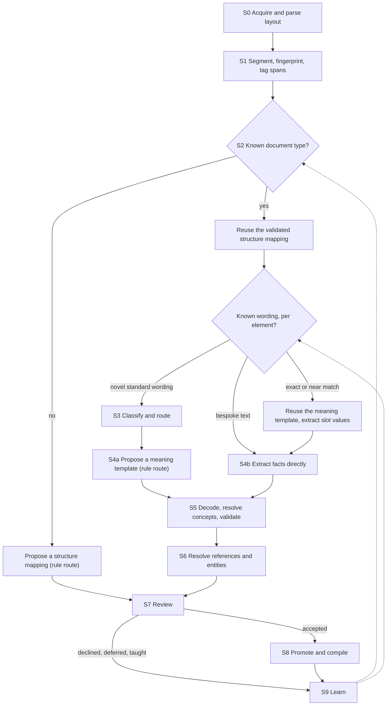

<!-- SPDX-License-Identifier: CC-BY-SA-4.0 -->

# Ingestion Vision: From Governed Text to Governed Meaning

**Status:** vision, 2026-09-25. Not a decision and not a plan. Each part that becomes work needs
its own ADR, following the Design First rule. Nothing here changes an accepted ADR.

**Scope:** how the text of a governing document (a contract, a trial protocol, a lending
covenant, an entitlement scheme, a regulation) becomes LATTICE content that the compilers can
use, with a person deciding what is accepted. Examples are domain-neutral, following the
repository's rule for public material.

**Inputs:** two working notes, [MORK for document ingestion](../developer/notes/mork-for-doc-ingest-chat.md)
and [scaling domain ontology mapping](../developer/notes/scaling-domain-ontology-mapping.md).
Where this paper adopts, refines or departs from them, §17 says so.

---

## 1. The problem

LATTICE can hold what a governing document means: who owes what to whom (Party, Instrument),
under which conditions (Eligibility), with which quantities and bounds (Quantification), and
how it changes over time (Behaviour). The compilers turn that meaning into SPARQL, SHACL, SWRL
and design-time OWL classes (ADR-A19, ADR-A24, ADR-A90). What LATTICE does not yet have is a
route from the document's text to that meaning.

Two facts shape the route:

- **Machine extraction works.** Frontier LLMs, given a rich applied ontology, have turned whole
  contracts into OWL of high quality. The MERIDIAN contract ontologies are the reference case.
- **Whole-document extraction does not scale.** One such extraction cost about USD 300 per
  contract on a frontier model. Most of that cost is structural: the document is resent with
  every call, the model re-derives terms it has already resolved, and it spends tokens on
  Turtle's verbosity. At the scale of a book of documents, that cost and the review burden it
  creates are both prohibitive.

Comparable open-source systems (Knwler, TrustGraph, Semantica) turn each document's text into
graph facts, every time, for every document. MORK was built for a different cost curve: turn a
source's *shape* into a reviewed, reusable mapping once, then compile it and run it
deterministically for every instance. The vision uses both curves, each where it fits (§2.1).

The goal is a pipeline in which a small chunk of text, given to a model with the right context,
comes back as a proposal already in LATTICE's own terms, and a person accepts or rejects it.
Once proposals are compatible with Quantification and Eligibility, they enter the compilation
pipeline unchanged, and that is the ingestion mechanism.

## 2. Principles

Each principle is stated once here and cited by number below.

| # | Principle | Grounding |
|---|---|---|
| IV1 | **The text is kept.** The source document, its structure and every span a proposal came from stay in the graph. A proposal never replaces its source | ADR-A13 "mapping never destroys the source assertion" |
| IV2 | **A proposal is not an assertion.** Extracted content is proposal-grade, held as distinguishable nodes, until a person accepts it | ADR-A25, ADR-A13 "inference never silently becomes an authored assertion" |
| IV3 | **A person decides.** Every proposal is accepted by a person. Accepting many at once is allowed only where calibration has shown it safe for that exact pack, profile and model | MORK review workbench, queue calibration governance |
| IV4 | **Neural models propose, symbolic constraints dispose.** The ontology's axioms, shapes and scheme contracts bound what a model may output, and reject what violates them | §9 |
| IV5 | **Structure before semantics.** A document is split into its elements before any model reads it, so each call sees one element and its context, never the whole document | §6.1 |
| IV6 | **Route by reuse.** Output that will be reused (a document type's structure, a standard wording's meaning) goes through MORK's mapping, review and compile loop once. Output used once (one document's values, parties and bespoke text) targets LATTICE instances directly, grounded by what was already validated for that document | §2.1 |
| IV7 | **Mappings are domain-blind where that pays.** A reusable rule is extracted as MORK intent nodes that reference only SKOS concepts, datatypes and the source text, and a mapping scheme binds them to the domain | §5 |
| IV8 | **Output in LATTICE's terms.** Every accepted proposal lands as Quantification quantities, bounds and ranges, Eligibility conditions and profiles, Party roles, Instrument elements or Behaviour declarations | §5.3 |
| IV9 | **Deterministic after the gate.** Decoding, validation, compilation and provenance stay deterministic. No model output reaches a compiled artefact without passing the gate | ADR-A19, ADR-A25, ADR-A28 |
| IV10 | **Gaps are explicit, never filled by invention.** What the text does not say becomes an uncertain mapping, an unmapped-content record, an unresolved value or an unsourced marker, never a plausible default | §8 |
| IV11 | **Retrieval is a versioned build artefact.** Every index or memory a model is shown is built deterministically, hashed, and recorded in the run's provenance, so a run can be reproduced | §6.3 |
| IV12 | **Optional backends, no core dependency.** Every model, store or agent framework sits behind an interface LATTICE owns, with a working default and contract tests, as the reasoner does under ADR-A83 | §11 |
| IV13 | **Degradation is explicit.** Without an LLM, or without a backend, each stage names what it no longer does, and does the rest | §11 |

### 2.1 Three kinds of output

The mapping layer (intent nodes, mapping DAGs, compiled executables) earns its cost when what
it produces is reused. It is a detour when the output is used once. So the pipeline separates
three kinds of output by how often each is reused:

| Output | Reused | Example | Route | Wire format | Review |
|---|---|---|---|---|---|
| **Structure mapping**, per document type | across every document of that type | how a covenant schedule's sections, tables and numbered clauses map to Instrument elements | MORK mapping of a source structure, compiled to a deterministic parser | MCN | per item, mandatory |
| **Meaning template**, per standard wording | across every document that uses the wording | the meaning of a standard facility-limit clause, with its amounts as slots | MORK intent nodes projected to LATTICE statement templates | MCN | per item, mandatory |
| **Instance facts**, per document | once | this facility's amounts, borrower, dates, and the meaning of its one bespoke clause | direct extraction to LATTICE instances, grounded by the structure mapping and templates already validated | generated compact JSON (§7) | calibrated: bulk confirmation where precision allows, per item below it |

Bespoke text is a rule with a reuse count of one. It compiles into executable artefacts like any
rule, but the mapping layer's cost is not amortised, so it goes the direct route with the facts.

For governing documents the middle row carries most of the value. Standard wording is common,
so reviewing a wording's meaning once and reusing it across a market or programme is where the
per-document cost collapses.

## 3. Two complementary routes to meaning

| | Controlled natural language | Machine extraction |
|---|---|---|
| Source | text drafted in a controlled natural language, such as Logical English or its insurance dialect InsurLE (John Cummins et al.), subsets of English that compile to a Prolog-like logic | text as drafted today, in unrestricted natural language, including legacy and bespoke documents |
| Route | the language's compiled logic, mapped to LATTICE terms through MORK | the three routes of §2.1 |
| Character | deterministic translation of what the drafter wrote | probabilistic, so every proposal is reviewed |
| Fits | new and redrafted standard text, where drafters adopt the language | the existing corpus, and anything a drafter did not write in the language |

The routes converge on the same targets (§5.3) and pass through the same gate (§7). Where both
exist for one wording, each checks the other: agreement raises confidence, and disagreement is
a signal for review. A controlled language's compiled logic is itself a source schema from
MORK's point of view, so its mapping to LATTICE is a structure mapping, reviewed once and reused.

## 4. The pipeline



| Stage | Does | Deterministic? | Graph role (ADR-A13) | Level reached (ADR-A14) |
|---|---|---|---|---|
| S0 Acquire and parse | Reads the document and recovers its layout and element tree: headings, numbered clauses, tables, schedules. Layout models, or the document format's own structure | yes, or a trained layout model | Source | L0 |
| S1 Segment and fingerprint | Hashes and embeds each element and the document's shape, and tags spans: amounts, currencies, percentages, dates, durations, references, party roles, place names | yes, or a trained tagger | Source | L0 |
| S2 Recognise | Matches the document's shape against validated structure mappings, and each element against the wording library: exact hash, near match, learned similarity | yes | Mapping | L1 |
| S3 Classify and route | Assigns each novel element an intent kind, a target (§5.3) and a route (§2.1), and sends it to the cheapest capable extractor | trained classifier or small model | Mapping | L1 |
| S4a Propose a rule | Emits intent nodes and mappings for a structure mapping or a meaning template, grounded in the target ontology and the document's memory | no | Mapping | L1 |
| S4b Extract facts | Emits LATTICE instances for slot values and bespoke text, shaped by the template or structure mapping already validated | no, except slot extraction from a known template, which can be deterministic | Mapping | L1 |
| S5 Decode and validate | Decodes the wire format, resolves concept labels against the bound scheme, validates against shapes and the DL | yes | Mapping, Validation | L1, L2 |
| S6 Resolve references and entities | Resolves defined terms, clause references, amendment operators ("clause 4.2 is deleted and replaced") and coreference within a document, and resolves entities and detects conflicting facts across documents | mostly yes | Mapping | L2 |
| S7 Review | A person confirms, retargets, reshapes, declines, teaches or defers. Rules are reviewed item by item. Facts are confirmed in calibrated batches, item by item below the threshold | no, a human act | Mapping, Execution | L2 |
| S8 Promote and compile | Accepted proposals become declarations and assertions, and the compilers generate artefacts with provenance | yes | Declaration, Assertion, Materialisation | L3 to L5 |
| S9 Learn | Reviewed decisions feed the structure mappings, the wording library, the classifiers, the extractors and calibration | offline | none | none |

S2 is where cost falls fastest. A document of a known type, whose elements are mostly known
wording, costs little beyond S0 and S1: its structure mapping runs deterministically, and only
slot values and bespoke text are extracted.

## 5. The intermediate representation for rules

This section applies to the two rule routes of §2.1. Instance facts skip it and are extracted in
LATTICE's terms directly (§7).

### 5.1 MORK's intent algebra

A meaning template is extracted as MORK intent nodes (IV7):

| Intent node | Carries | Example text |
|---|---|---|
| `mork:QualitativeIntent` | the subject of a statement | "term facilities" |
| `mork:QuantitativeConstraint` | an operator (`Between`, `GreaterThanOrEqual`, `Equal`, `NotEqual`, `LessThanOrEqual`), values, a unit, and the measured dimension (`mork:constraintDimension`) | "between EUR 1m and EUR 25m" |
| `mork:SpatialScope` | a scope type, `Include` or `Exclude`, and a place concept | "borrowers incorporated in the EU" |
| `mork:TemporalScope` | a period or offset | "within 30 days of drawdown" |
| `mork:ExclusionIntent`, `mork:InclusionIntent` | what is carved out or brought in | "excluding Cyprus" |

Every node records its source text (`mork:hasNaturalLanguageSource`) and a confidence
(`mork:hasIntentConfidence`). Nodes form a join-semilattice under `mork:refinesIntent`: one root
subject, with constraints and scopes refining it, and compound intents expressed by multi-typing
(an exclusion that is also a spatial scope). Intent nodes reference only SKOS concepts, datatypes
and source text, never a target class, so the same template can be projected into more than one
domain ontology.

A structure mapping needs no new vocabulary, as a working hypothesis. A document type's element
tree is a source representation in MORK's existing terms (`mork:RepresentationScheme`,
`mork:Representation`, `mork:compositeNarrower`, a `mork:SerializationFormat`), and its mapping
to Instrument elements is ordinary MORK mapping, compiled to a deterministic parser the way a
schema mapping compiles to RML. Whether document structure needs a sibling vocabulary instead
is §15 Q9.

### 5.2 Projection to the domain

`mork:intentMapping` links each intent node to the `mork:DataMapping` that realises it in the
target ontology. The mapping scheme, not the intent graph, holds the domain binding. Where the
target cannot receive what the text says, the mapping is a `mork:UncertainMapping` marked
incomplete, with a recommendation naming exactly what is missing, and nothing is asserted (IV10).
A minimum rate with no stated basis, or a reference to an external standard with no identifier,
stays uncertain until a person supplies the rest.

### 5.3 Targets in LATTICE's layers

A domain ontology built on LATTICE sorts its content into four kinds. Every template and every
fact lands in one of them (IV8):

| Target kind | LATTICE terms | Typical content |
|---|---|---|
| Instrument structure | `ins:Provision`, `ins:Obligation`, `ins:Qualifier`, attachment to wording | the root subject, obligations and their parties |
| Criteria over declared dimensions | `elg:AdmissionProfile` with interval, exact, set-membership and hierarchical conditions, `elg:EvidenceBinding` | spatial scopes, inclusions and exclusions, quantitative constraints on a subject's properties |
| Conditions that are not membership tests | general `elg:Condition` | warranties, conditions precedent, tests the graph cannot adjudicate, which evaluate to `Undetermined` |
| Behaviour | `bhv:` state spaces, triggers, guards, allowances | deadlines, notices, termination events, aggregate limits |

Quantities and bounds land in Quantification throughout: `qnt:Quantity`, `qnt:Bound`,
`qnt:Range` and `qnt:RangeSet`, alternative bounds per unit (ADR-A95), derived rate spaces for
percentages of a base (ADR-A93), calendar units for business days (ADR-A94).

### 5.4 Worked example

Text of a standard wording: *"Term facilities between EUR 1m and EUR 25m, to borrowers
incorporated in the EU, excluding Cyprus, at a margin of at least 150 basis points."*

As a meaning template, with the amounts, the region and the margin as slots:

| Intent node | Refines | Projects to |
|---|---|---|
| `QualitativeIntent` "term facilities" | root | the subject class of the admission profile |
| `QuantitativeConstraint` `Between` 1,000,000 and 25,000,000, unit EUR, dimension facility amount | root | an `elg:IntervalCondition` over a `qnt:RangeSet` in EUR |
| `SpatialScope` `Include` EU, dimension jurisdiction of incorporation | root | an `elg:HierarchicalMatch` condition requiring EU |
| `ExclusionIntent` and `SpatialScope` `Exclude` Cyprus | the EU scope | the same condition's `elg:excludedConcept` |
| `QuantitativeConstraint` `GreaterThanOrEqual` 150, unit basis point, dimension margin | root | an interval condition on a derived rate space |

The admission profile is `elg:AllRequired` over the three conditions. The jurisdiction condition
reads its candidate through an evidence binding from the facility to its borrower's jurisdiction
of incorporation (ADR-A91). Every downstream artefact, including the design-time OWL class that
tells a reviewer whether a revision widens the criteria (ADR-A90), is then generated, not written.

When a later document uses the same wording with EUR 2m and EUR 40m, S2 recognises the template,
S4b extracts the two amounts as facts, and nothing else is proposed or reviewed.

## 6. Making it affordable

### 6.1 Structure-first chunking

S0 and S1 split the document before any model reads it (IV5). Each call carries one element, its
variables, and the context §6.3 and §6.4 supply. The document is never resent. Cost then scales
with the number of novel elements, not with document length times calls.

### 6.2 Packaging a target ontology

The MORK Teaching Pack (MTP, ADR-A44) packages MORK for a model: a deterministic, hash-pinned
build of doctrine, a decision ladder, lenses, minimal pairs and validated cassettes. It
compresses well because MORK is small by design and its authors are the experts on its
semantics, so its doctrine was written once by the people best placed to write it.

A target domain ontology does not compress that way. It is meant to carry its domain's real
distinctions, and the pipeline's builders are not experts in every ontology a deployment brings.
Generating minimal pairs for an arbitrary ontology is knowledge acquisition, not compression,
and a wrong generated pair produces confident, wrong mappings, which is the failure the whole
design exists to avoid. So a target ontology is packaged in tiers, by risk:

| Tier | Content | Risk | When |
|---|---|---|---|
| 1. Mechanical | a codebook that shortens the target's identifiers, and a compact structural index: class hierarchy, disjointness, domain and range, cardinalities, named individuals, scheme contracts. Generated from the ontology's spec, vocab and shapes, the same operation MCN's codebook performs on `Mork.ttl` | none: meaning untouched | build first |
| 2. Retrieval | Graph RAG over the index: per decision, the candidate class and its definition and usage note, its siblings and disjoint classes, the domain and range of candidate properties, and prior confirmed mappings from the mapping store | moderate, and bounded by review | the main mechanism for disambiguation |
| 3a. Authored doctrine | lenses and minimal pairs written by the ontology's own authors, who are its domain experts, gated like MTP's curated doctrine | low | when an ontology's authors choose to invest |
| 3b. Drafted doctrine | lenses and minimal pairs drafted by a model | high | deferred, and only where telemetry shows tiers 1 and 2 leave a specific, recurring, costly gap. Every draft is proposal-grade, carries its provenance, and passes conformance gating before it can become resident |

**Readiness depends on annotation density, not size.** A large ontology with a definition and a
usage note on every term and worked examples is a good retrieval target. A small one with bare
names is a poor one, and no compilation fixes that. LATTICE's literate-spec discipline (a
definition and `fnd:utility` on every term, non-domain examples before mechanism prose) is
therefore a prerequisite for onboarding a target ontology, and its absence is a finding to
report to the ontology's owners.

### 6.3 Grounding, and reproducible retrieval

Before proposing a new term, the model asks whether the target ontology already has it. A
grounding interface answers `exact`, `broad` or `none`, with a target IRI, a confidence and a
rationale that becomes the proposal's evidence note. The default is exact-label lookup over the
tier-1 index. Better recall comes from tier-2 retrieval, embeddings and entity resolution.
Grounding retrieves, and never generates ontology content.

Live retrieval is not stable from run to run unless its index is fixed. So each index is a
derived artefact (ADR-A92): built deterministically from declared sources, hashed, versioned, and
recorded with the pack version in every run's provenance (IV11). Reproducing a run means
replaying it against the same index hash.

### 6.4 Document memory

A long document is processed element by element, so the model needs to know what earlier
elements settled: defined terms, the parties' role occupancies, open deferrals, prior hypotheses
and their confidence, cross-references. A memory interface records and recalls these, and
answers "what bears on this element" by querying the partially built graph rather than
replaying the text. The same graph answers questions about the document's state during
ingestion. A reviewer's correction to a remembered term flows back to every element that used
it. The memory's state at each call is snapshotted by hash, under IV11.

### 6.5 The wording library and structure mappings

Many governing documents are assembled from standard wording on recurring document types. Once
a wording's meaning or a document type's structure is reviewed, it is reused: S2 recognises it,
and only slot values and bespoke text are extracted. Extraction then runs once per template for
a whole market or programme, and per document only for what is new. Near-match thresholds are
set conservatively and calibrated by sampling the band just below them for review. Whether
"have we seen this shape before" reuses MORK's community-detection machinery or needs its own
similarity model is §15 Q11.

### 6.6 Extraction tiers and model tiering

Stages differ in what they need. The extraction tiers are:

- **Tier 1, lexical and symbolic, never an LLM:** grammars, codebook lookup, exact and near
  matching, DL constraint filtering
- **Tier 2, statistical, mostly not an LLM:** trained taggers and classifiers, embeddings,
  community detection
- **Tier 3, an LLM, escalatable to a person:** novel or complex text, ambiguous relations

Frontier models are kept for the tier-3 residual, which shrinks as the library and the trained
models grow:

| Stage | Initial | As reviewed data accumulates |
|---|---|---|
| Span tagging | grammars | a sequence tagger with transition constraints, its tags checked against scheme contracts |
| Recognition | hashes and near-match hashing | a learned similarity model trained on template pairs |
| Classification and routing | an embedding plus a linear classifier | a fine-tuned encoder whose output is masked by the shapes, so impossible outputs cannot occur |
| Concept resolution | label cascade then generic embeddings | embeddings fine-tuned per scheme, searched only within the bound scheme |
| Fact extraction from templates | slot filling by a small model | a schema-conditioned sequence labeller |
| Novel and complex text | a frontier LLM | unchanged |
| Rule proposals | an LLM | a relational GNN or probabilistic soft logic, with a DL validator |
| Anomaly detection | none | a graph autoencoder or one-class model over accepted content, as a complement to SHACL |

A pipeline analysis estimated that, for a 100-page document against a mature library, this
design moves the cost from over USD 70 (an agentic whole-document approach) to about USD 5 with
the staged pipeline, and about USD 3 with trained models in the cheap stages. These are
estimates, not measurements. Measuring them is part of the roadmap (§14).

### 6.7 Caching and local-first defaults

Every model call is keyed on the element's hash, the pack hash, the index hash and the model
identity, so an identical request is answered from cache and a changed input is never answered
from a stale one. Batches are resumable. Local models are the default wherever they meet a
stage's calibrated accuracy, and hosted frontier models are reserved for the tier-3 residual.

## 7. Wire formats

A model's output format is a cost lever, separate from what the output means. There are two,
one per kind of output, both decoded deterministically before anything else sees them:

- **MCN for rules.** MORK's compact notation is the proposal wire format for MORK content
  (ADR-A25). It measured about three times fewer structural tokens than Turtle on the
  repository's examples, decodes losslessly, and binds annotations to the triple they annotate.
  Structure mappings and meaning templates are MORK content, so MCN serves both.
- **Generated compact JSON for facts.** MCN compresses MORK's vocabulary, not a target
  ontology's instances, so facts need their own format. Each target layer gets a JSON Schema
  generated from its structural shapes and vocabulary as an `execution/` artefact, with types
  inferred from structural position and keys from the tier-1 codebook (§6.2). JSON Schema
  validation catches malformed output before RDF compilation, and SHACL catches the rest after it.

Both need the same compiler steps after decoding: concept-label resolution through Vocabulary's
cascade (exact `prefLabel`, `altLabel`, embeddings, then disambiguation or review), scoped to the
scheme contract bound to the property, then SHACL and OWL validation. JSON-LD is kept for
publishing compiled graphs to external tools, not for model output.

## 8. Gaps, uncertainty and `Undetermined`

Text is often silent or ambiguous. The pipeline records that instead of resolving it (IV10):

| What the text lacks | Recorded as |
|---|---|
| a part the target requires (a basis, an identifier), in a rule | `mork:UncertainMapping`, `mork:incompleteMapping true`, with a recommendation |
| a place in the target for a fact | an unmapped-content record naming the span and the missing target |
| a value the graph cannot supply | `qnt:UnresolvedValue`, so a comparison yields `Undetermined` |
| a dimension nobody has sourced yet | an unsourced marker, which blocks promotion where the dimension is runtime-critical |
| a test the graph cannot adjudicate | a condition that evaluates to `Undetermined` |
| a confident model with no grounding | a hypothesis mapping with its weighting, never an exact match |

Every consumer of a decision declares what it does with `Undetermined`: surface it, queue it,
block on it. Coercing it to either outcome is a defect.

## 9. Symbolic constraints on neural output

The ontology is not only the target. It constrains every stage (IV4):

- **Disjointness** rejects a proposal whose target is disjoint from a class the same section is
  already aligned to.
- **Cardinality** rejects a second value where the target allows one.
- **Universal restrictions** reject a filler outside the declared range.
- **MORK's co-occurrence axioms** reject structurally incomplete mappings before they reach the
  graph.
- **Scheme contracts** restrict concept resolution to the bound scheme, so a place name cannot
  resolve to a currency.
- **Shapes** mask a classifier's output space, so an element cannot be given a qualifier its
  kind does not allow.

Rejected proposals are returned to the proposer as negative evidence, so trained models learn
the constraints over time while the constraints stay exact.

## 10. Review, assurance and provenance

### 10.1 Review

The MORK review workbench provides the review act. A review snapshot pins the tenant, project,
mapping graph revision, section and evidence projection. Six typed decisions apply: **Confirm**,
**Retarget**, **Reshape**, **Decline**, **Teach** and **Defer**. For ingestion, the reviewer sees
the proposal beside its source span (IV1), and a domain steward sees evidence, not notation or
lint diagnostics. A newer snapshot makes older decisions stale, so a decision never lands on
changed evidence.

Review effort follows reuse (§2.1). Rules are reviewed item by item, because an error in a rule
repeats in every document that uses it. Facts are numerous and each matters once, so they are
confirmed in batches, which queue calibration governance allows only when precision meets a
threshold for the exact pack, profile and model. Below it, or for a low-confidence item, review
is item by item. A batch confirmation is still a person's act, recorded as one. Confirmed
items are sampled for audit.

An ontology change that affects approved mappings reopens them. Retrospective challenge records
later doubt without mutating the original decision. Corrections, to rules and to facts alike,
become graph data that later runs learn from. Active learning concentrates review on proposals
whose top candidates are closest, which is where a person's time changes the outcome.

### 10.2 Provenance

Every accepted statement can answer where it came from, in PROV-O, through Foundation's evidence
mixin and derived-artefact contract (ADR-A26, ADR-A92):

```text
document version
  → element (S0, S1)                 prov:Entity, Source role
  → span                             prov:Entity
  → extraction activity (S4)         prov:Activity: model, pack hash, index hash, memory snapshot, profile
  → proposal                         prov:Entity, Mapping role, with confidence
  → review activity (S7)             prov:Activity, associated with the reviewer, item or batch
  → accepted statement (S8)          Declaration or Assertion role
  → compiled artefact                exe:ExecutablePlan, exe:GeneratedArtefact, fnd:DerivedArtefact
  → runtime decision                 Execution role
```

A fact extracted from a known template also records the template and structure mapping it was
shaped by, so a later correction to either reaches every fact that depended on it. ADR-A13's
statement provenance properties (source artefact, extraction activity, asserting agent,
confidence, mapping status) cover each link. The chain is complete only when every link is
present, which governance can check.

## 11. Components and boundaries

The pipeline needs capabilities LATTICE does not build itself: document parsing, embeddings,
models, graph stores, agent memory. Each sits behind an interface LATTICE owns (IV12):

| Interface | Serves | Default in core | Candidate implementations |
|---|---|---|---|
| Target packager | §6.2 tiers 1 and 2 | the mechanical codebook and structural index, deterministic | none needed |
| Grounding provider | S4, S5 | exact-label lookup over the index | embedding and entity-resolution services |
| Document memory provider | S4, S6 | in-memory, per document | graph-based agent memory, Graph RAG over the working graph |
| Graph and reasoning backend | S5, S8 | an in-process RDF library, and the test-only reasoner (ADR-A83) | graph stores with SPARQL, Datalog and explanation support |
| Agent context and decision runtime | S7 audit, Behaviour guards, governance | in-memory or SQLite | decision recorders with causal tracing and PROV-O export |
| Extraction model | S3, S4 | none: manual authoring, with explicit degradation | local and hosted LLMs, trained extractors |

Semantica, a graph-native framework for context and accountable AI, is one candidate behind
several of these at once: storage-agnostic graph and vector stores, pluggable reasoners with
explanation, agent context and a decision lifecycle with PROV-O export, and entity resolution and
conflict detection that S6 needs across documents. It fits as grounding, memory and backend, not
as an extraction stage in front of MORK. Its ontology generation is not used: the target ontology
is authored and governed.

The isolation rules follow ADR-A83's pattern:

- no adapter is a dependency of any core package, and core never imports one
- backends are selected by configuration through a registry, never by conditional import
- core CI runs with no optional package installed, and each adapter passes LATTICE-owned
  contract tests in a separate, non-blocking job
- adapters version independently, so a change in a third-party API never forces a core release

## 12. What stays deterministic

- **Compilation.** The compilers are pure functions of validated graphs (ADR-A19). Determinism
  is what makes artefacts auditable and regenerable (ADR-A27). Structure mappings compile to
  deterministic parsers under the same rule.
- **Validation.** SHACL and OWL checks are exact. Trained anomaly detectors complement them and
  never replace them.
- **Provenance.** Recording where a statement came from is bookkeeping, and must be complete.
- **Packaging and indexing.** Tier-1 codebooks and indexes are generated deterministically.
- **The production gate.** No model-originated node compiles in production mode without
  governance sign-off (ADR-A25, ADR-A28).

## 13. Relationship to what exists

| Exists today | Role in the vision |
|---|---|
| MORK ontology, intent algebra and source-representation vocabulary | the representation for rules (§5) |
| MCN and its decoder | the wire format for rules (§7) |
| MTP | the model for tier 3a authored doctrine, and the codebook pattern for tier 1 (§6.2) |
| Review workbench, queue calibration governance | review and batch-confirmation bounds (§10.1) |
| Conformance ladder (ADR-A14), graph roles (ADR-A13) | where each stage's output sits (§4) |
| Quantification, Eligibility, Party, Instrument, Behaviour | the targets (§5.3) |
| `mork_compilers`, Surface, the OWL backend | what accepted meaning compiles into |
| Foundation evidence and derived artefacts | the provenance chain, and versioned indexes (§6.3, §10.2) |
| The test-only reasoning harness (ADR-A83) | the isolation pattern for optional backends (§11) |

[ontology-architecture.md §8.5](ontology-architecture.md#85-relationship-to-semantica-external-complementary-not-part-of-this-repo)
and the MORK README place Semantica in front of MORK as data acquisition. This vision refines
that: Semantica-like services supply grounding, memory and cross-document entity resolution
behind LATTICE's interfaces.

### 13.1 Comparable systems

| System | Per-document model | What LATTICE takes from it |
|---|---|---|
| Knwler | extracts entities, relations and topics from each document, against a supplied or discovered schema | local-first defaults, aggressive caching, resumable batches (§6.7). Its schema is inferred per run, so it is not guaranteed consistent across documents, which grounding avoids |
| TrustGraph | extracts ontology-typed triples, grounded in an existing OWL ontology | the closest analogue to fact extraction (§2.1): typed facts grounded in the target, not an ad hoc schema |
| Semantica | extracts entities, relations and events, with conflict detection and entity resolution as pipeline stages | cross-document resolution as a first-class stage (S6), and the backend role of §11 |

None of the three separates reusable rules from one-off facts. That separation is where LATTICE's
cost curve differs.

## 14. Roadmap sketch

Indicative only. Each phase needs its own ADRs and plan.

| Phase | Adds | Evidence it must produce |
|---|---|---|
| 0, today | MORK intent and representation vocabulary, MCN, MTP, review workbench and calibration (fixture-backed), conformance ladder, compilers for every condition kind and the OWL backend | none new |
| 1 | The tier-1 target packager (codebook and structural index), structure-first chunking, grounding and memory interfaces with null defaults | token cost per element against whole-document extraction, with zero semantic change from packaging |
| 2 | Tier-2 retrieval over the index and the confirmed-mapping store, with versioned indexes. Structure mappings and meaning templates reviewed and reused. Generated compact JSON for facts | accuracy and review time per element, share of elements reused, reproducibility of runs against a fixed index |
| 3 | Trained models for span tagging, classification, concept resolution and slot filling. Cross-document entity resolution | accuracy parity with the LLM baseline per stage before any routing moves |
| 4 | Rule proposals under symbolic validation, active learning, calibrated batch confirmation of facts | calibration per pack, profile and model, and review volume against accuracy |
| later, gated | Tier 3b drafted doctrine | only on telemetry showing a specific gap tiers 1 and 2 leave |

MTP's deferred Phase 7 (output scoring, held-out evaluation sets, metrics) is the natural home
for the measurement work each phase needs.

## 15. Open questions

| # | Question | Notes |
|---|---|---|
| Q1 | The fact format's details | whether the per-layer JSON Schema and the key mapping are one generated artefact or two, decided when the compiler exists |
| Q2 | The scope of target packaging | tiers 1 and 2 are generic tooling. Tier 3a needs a format for authored doctrine outside MORK, and ADR-A44 bounds MTP to MORK, so it needs its own ADR |
| Q3 | Additions to the intent algebra | a normative-reference intent for text that cites an external standard, and a concept-typed operator scheme in place of free-text operators |
| Q4 | Where proposals live physically | ADR-A13's Mapping role, with finer named graphs a deployment choice. Whether Foundation needs a graph-role or commitment-state property is ADR-A13's own open sub-question |
| Q5 | Several values for one dimension | extraction must record whether text states one value or several. The OWL backend compiles only single-valued paths (ADR-A90). A quantified reading ("every value", "some value") would need an Eligibility ADR |
| Q6 | Mapping a controlled language's compiled logic | treated here as a structure mapping. Whether it needs a dedicated translator with its own conformance cases is open |
| Q7 | Measuring accuracy | gold sets, held-out corpora and the metrics that gate routing and batch confirmation |
| Q8 | Review ergonomics at scale | how proposals, source spans and the partially built graph are shown together, and how reviewer fatigue and automation bias are detected |
| Q9 | One vocabulary or two for document structure | leaning: MORK's existing source-representation terms (§5.1), tested on a real document type before any sibling vocabulary is considered |
| Q10 | The review threshold for facts | the precision a batch must show before it can be confirmed at once, and the audit sampling rate after |
| Q11 | Recognising document types | MORK's community detection over element fingerprints, or a separate similarity model |
| Q12 | Where ingestion tooling lives | additions to `ontology/mork` and `tools/mork`, or a sibling pair under the repository topology rules, which needs an ADR before any new directory |

## 16. Risks

| Risk | Mitigation |
|---|---|
| A confident model asserts a wrong exact match | exact matches require grounding. Anything ungrounded is a hypothesis. Calibration gates batch confirmation |
| Drafted doctrine teaches confident errors | tier 3b is deferred and gated (§6.2). Authored doctrine comes from the ontology's own experts |
| A target ontology is too sparsely annotated to retrieve from | annotation density is an onboarding prerequisite, reported to the ontology's owners |
| Retrieval makes runs irreproducible | indexes and memory snapshots are hashed, versioned and recorded (IV11) |
| An error in a rule repeats across documents | rules are always reviewed item by item. A correction reopens every fact shaped by the rule (§10.2) |
| Review becomes a rubber stamp | calibration per pack, profile and model, audit sampling of confirmed items, retrospective challenge, anomaly detection |
| Embeddings drift as schemes are versioned | retrain or re-embed on each scheme edition. Resolution is scoped to the bound edition |
| Trained models overfit to the families they were trained on | held-out families in evaluation, fallback to tier 3 below confidence thresholds |
| Model pricing or availability changes | tiering, local-first defaults, trained models for cheap stages, and a manual path that still works |
| Optional backends leak into core | the isolation rules of §11, enforced in CI as for the reasoning harness |
| Extraction quietly fills gaps | IV10, with uncertain mappings, unmapped-content records and unresolved values checked by governance before promotion |

## 17. How this paper uses its inputs

| Note's position | Here |
|---|---|
| Document ingestion hides two problems: structure discovery (rule-like, once per document type) and fact extraction (per document) | **Adopted and extended.** §2.1 adds a third kind between them, meaning templates for standard wording, which is where governing documents recover most of their cost |
| The intent layer earns its cost for reusable rules and is overkill for one-shot facts, which should target ontology instances directly | **Adopted** as IV6. The criterion is reuse count, not kind of content: bespoke clauses are rules used once and go the direct route |
| Facts might be trusted on confidence scores, with only low-confidence items reviewed | **Not adopted.** Facts stay proposal-grade (IV2) and are accepted by a person, in calibrated batches, with audit sampling (§10.1). Confidence alone never commits |
| MCN does not help fact extraction, which needs its own compression | **Adopted.** Facts use generated compact JSON with tier-1 codebook keys (§7) |
| Reuse MORK's convergence and Graph RAG for document shapes, and share Tier 1 to 3 extraction infrastructure across both pipelines | **Adopted** (§6.5, §6.6) |
| Take local-first caching from Knwler, typed grounding from TrustGraph, entity resolution from Semantica | **Adopted** (§6.7, §2.1, S6) |
| A target ontology does not compress like MORK. Package it in three tiers: mechanical, retrieval, then drafted doctrine only if gated | **Adopted**, with one refinement: doctrine written by an ontology's own authors (tier 3a) avoids the expertise gap and is lower risk than drafted doctrine (tier 3b) |
| Annotation density, not size, decides whether retrieval works | **Adopted** as an onboarding prerequisite (§6.2) |
| Version and hash the retrieval index, and record it in provenance | **Adopted** as IV11, extended to memory snapshots |
| One vocabulary or two for document structure, fact review gates, fingerprinting, topology | carried as Q9 to Q12, with a leaning on Q9 |
