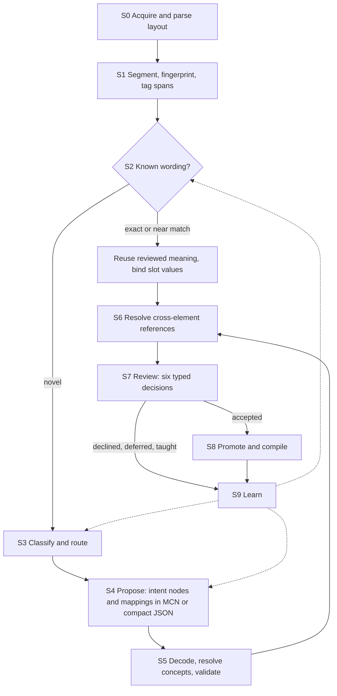

<!-- SPDX-License-Identifier: CC-BY-SA-4.0 -->

# Ingestion Vision: From Governed Text to Governed Meaning

**Status:** vision, 2026-09-25. Not a decision and not a plan. Each part that becomes work needs
its own ADR, following the Design First rule. Nothing here changes an accepted ADR.

**Scope:** how the text of a governing document (a contract, a trial protocol, a lending
covenant, an entitlement scheme, a regulation) becomes LATTICE content that the compilers can
use, with a person deciding what is accepted. Examples are domain-neutral, following the
repository's rule for public material.

---

## 1. The problem

LATTICE can hold what a governing document means: who owes what to whom (Party, Instrument),
under which conditions (Eligibility), with which quantities and bounds (Quantification), and
how it changes over time (Behaviour). The compilers turn that meaning into SPARQL, SHACL, SWRL
and design-time OWL classes (ADR-A19, ADR-A24, ADR-A90). What LATTICE does not yet have is a
route from the document's text to that meaning.

Two facts shape the route:

- **Machine extraction works.** Frontier LLMs, given a rich applied ontology, have turned whole
  contracts into OWL of high quality. The MERIDIAN contract ontologies are the reference case.
- **Whole-document extraction does not scale.** One such extraction cost about USD 300 per
  contract on a frontier model. Most of that cost is structural: the document is resent with
  every call, the model re-derives terms it has already resolved, and it spends tokens on
  Turtle's verbosity. At the scale of a book of documents, that cost and the review burden it
  creates are both prohibitive.

The vision is a pipeline in which a small chunk of text, given to a model with the right
context, comes back as a proposal already in LATTICE's own terms, and a person accepts or
rejects it. Once a proposal is compatible with Quantification and Eligibility, it enters the
compilation pipeline unchanged, and that is the ingestion mechanism.

## 2. Principles

Each principle is stated once here and cited by number below.

| # | Principle | Grounding |
|---|---|---|
| IV1 | **The text is kept.** The source document, its structure and every span a proposal came from stay in the graph. A proposal never replaces its source | ADR-A13 "mapping never destroys the source assertion" |
| IV2 | **A proposal is not an assertion.** Extracted content is proposal-grade, held as distinguishable nodes, until a person accepts it | ADR-A25, ADR-A13 "inference never silently becomes an authored assertion" |
| IV3 | **A person decides.** Every proposal is reviewed. Bulk acceptance is allowed only where calibration has shown it safe for that exact pack, profile and model | MORK review workbench, queue calibration governance |
| IV4 | **Neural models propose, symbolic constraints dispose.** The ontology's axioms, shapes and scheme contracts bound what a model may output, and reject what violates them | §9 |
| IV5 | **Structure before semantics.** A document is split into its elements before any model reads it, so each call sees one element and its context, never the whole document | §6.1 |
| IV6 | **Extract once, reuse many times.** Meaning attaches to a reusable wording once. Each instance of that wording only binds its values | §6.5 |
| IV7 | **Extraction is domain-blind, binding is domain-aware.** Text becomes MORK intent nodes that reference only SKOS concepts, datatypes and the source text. A mapping scheme binds them to a domain ontology | MORK intent algebra, §5 |
| IV8 | **Output in LATTICE's terms.** Every accepted proposal lands as Quantification quantities, bounds and ranges, Eligibility conditions and profiles, Party roles, Instrument elements or Behaviour declarations | §5.3 |
| IV9 | **Deterministic after the gate.** Decoding, validation, compilation and provenance stay deterministic. No model output reaches a compiled artefact without passing the gate | ADR-A19, ADR-A25, ADR-A28 |
| IV10 | **Gaps are explicit, never filled by invention.** What the text does not say becomes an uncertain mapping, an unresolved value or an unsourced marker, never a plausible default | §8 |
| IV11 | **Optional backends, no core dependency.** Every model, store or agent framework sits behind an interface LATTICE owns, with a working default and contract tests, as the reasoner does under ADR-A83 | §11 |
| IV12 | **Degradation is explicit.** Without an LLM, or without a backend, each stage names what it no longer does, and does the rest | §11 |

## 3. Two complementary routes to meaning

| | Controlled natural language | Machine extraction |
|---|---|---|
| Source | text drafted in a controlled natural language, such as Logical English or its insurance dialect InsurLE (John Cummins et al.), subsets of English that compile to a Prolog-like logic | text as drafted today, in unrestricted natural language, including legacy and bespoke documents |
| Route | the language's compiled logic, mapped to LATTICE terms through MORK | chunked extraction into MORK intent nodes, projected to LATTICE terms |
| Character | deterministic translation of what the drafter wrote | probabilistic, so every proposal is reviewed |
| Fits | new and redrafted standard text, where drafters adopt the language | the existing corpus, and anything a drafter did not write in the language |

The routes converge on the same targets (§5.3) and pass through the same gate (§7). Where both
exist for one wording, each checks the other: agreement raises confidence, and disagreement is
a signal for review. A controlled language's compiled logic is itself a source schema from
MORK's point of view, so its mapping to LATTICE is ordinary MORK work, with the same review.

## 4. The pipeline



| Stage | Does | Deterministic? | Graph role (ADR-A13) | Level reached (ADR-A14) |
|---|---|---|---|---|
| S0 Acquire and parse | Reads the document and recovers its layout and element tree: headings, numbered clauses, tables, schedules. Layout models or native structure (a word-processor document's own parts) | yes, or a trained layout model | Source | L0 |
| S1 Segment and fingerprint | Hashes and embeds each element, and tags spans: amounts, currencies, percentages, dates, durations, references, party roles, place names | yes, or a trained tagger | Source | L0 |
| S2 Recognise wording | Matches each element against the wording library: exact hash, near match, learned similarity | yes | Mapping | L1 |
| S3 Classify and route | Assigns each novel element an intent kind and a target (§5.3), and routes it to the cheapest capable extractor | trained classifier or small model | Mapping | L1 |
| S4 Propose | Emits intent nodes and their mappings for one element, grounded in the target ontology and the document's memory | no | Mapping | L1 |
| S5 Decode and validate | Decodes the wire format, resolves concept labels against the bound scheme, validates against shapes and the DL | yes | Mapping, Validation | L1, L2 |
| S6 Cross-element resolution | Resolves defined terms, clause references, amendment operators ("clause 4.2 is deleted and replaced") and coreference | mostly yes | Mapping | L2 |
| S7 Review | A person confirms, retargets, reshapes, declines, teaches or defers each proposal | no, a human act | Mapping, Execution | L2 |
| S8 Promote and compile | Accepted proposals become declarations and assertions, and the compilers generate artefacts with provenance | yes | Declaration, Assertion, Materialisation | L3 to L5 |
| S9 Learn | Reviewed decisions feed the wording library, the classifiers, the extractors and calibration | offline | none | none |

S2 is where cost falls fastest. A document whose elements are mostly known wording costs little
beyond S0 and S1, because the meaning of a known wording was reviewed once and is reused (IV6).

## 5. The intermediate representation

### 5.1 MORK's intent algebra

Extraction does not write domain ontology directly. It writes MORK intent nodes (IV7):

| Intent node | Carries | Example text |
|---|---|---|
| `mork:QualitativeIntent` | the subject of a statement | "term facilities" |
| `mork:QuantitativeConstraint` | an operator (`Between`, `GreaterThanOrEqual`, `Equal`, `NotEqual`, `LessThanOrEqual`), values, a unit, and the measured dimension (`mork:constraintDimension`) | "between EUR 1m and EUR 25m" |
| `mork:SpatialScope` | a scope type, `Include` or `Exclude`, and a place concept | "borrowers incorporated in the EU" |
| `mork:TemporalScope` | a period or offset | "within 30 days of drawdown" |
| `mork:ExclusionIntent`, `mork:InclusionIntent` | what is carved out or brought in | "excluding Cyprus" |

Every node records its source text (`mork:hasNaturalLanguageSource`) and a confidence
(`mork:hasIntentConfidence`). Nodes form a join-semilattice under `mork:refinesIntent`: one root
subject, with constraints and scopes refining it, and compound intents expressed by multi-typing
(an exclusion that is also a spatial scope). Intent nodes reference only SKOS concepts, datatypes
and source text, never a target class, so the same extraction serves any domain ontology.

### 5.2 Projection to the domain

`mork:intentMapping` links each intent node to the `mork:DataMapping` that realises it in the
target ontology. The mapping scheme, not the intent graph, holds the domain binding. Where the
target cannot receive what the text says, the mapping is a `mork:UncertainMapping` marked
incomplete, with a recommendation naming exactly what is missing, and nothing is asserted (IV10).
A minimum rate with no stated basis, or a reference to an external standard with no identifier,
stays uncertain until a person supplies the rest.

### 5.3 Targets in LATTICE's layers

A domain ontology built on LATTICE sorts its content into four kinds, and each intent lands in
one of them (IV8):

| Target kind | LATTICE terms | Typical intents |
|---|---|---|
| Instrument structure | `ins:Provision`, `ins:Obligation`, `ins:Qualifier`, attachment to wording | the root subject, obligations and their parties |
| Criteria over declared dimensions | `elg:AdmissionProfile` with interval, exact, set-membership and hierarchical conditions, `elg:EvidenceBinding` | spatial scopes, inclusions and exclusions, quantitative constraints on a subject's properties |
| Conditions that are not membership tests | general `elg:Condition` | warranties, conditions precedent, tests the graph cannot adjudicate, which evaluate to `Undetermined` |
| Behaviour | `bhv:` state spaces, triggers, guards, allowances | deadlines, notices, termination events, aggregate limits |

Quantities and bounds land in Quantification throughout: `qnt:Quantity`, `qnt:Bound`,
`qnt:Range` and `qnt:RangeSet`, alternative bounds per unit (ADR-A95), derived rate spaces for
percentages of a base (ADR-A93), calendar units for business days (ADR-A94).

### 5.4 Worked example

Text: *"Term facilities between EUR 1m and EUR 25m, to borrowers incorporated in the EU, excluding
Cyprus, at a margin of at least 150 basis points."*

| Intent node | Refines | Projects to |
|---|---|---|
| `QualitativeIntent` "term facilities" | root | the subject class of the admission profile |
| `QuantitativeConstraint` `Between` 1,000,000 and 25,000,000, unit EUR, dimension facility amount | root | an `elg:IntervalCondition` over a `qnt:RangeSet` in EUR |
| `SpatialScope` `Include` EU, dimension jurisdiction of incorporation | root | an `elg:HierarchicalMatch` condition requiring EU |
| `ExclusionIntent` and `SpatialScope` `Exclude` Cyprus | the EU scope | the same condition's `elg:excludedConcept` |
| `QuantitativeConstraint` `GreaterThanOrEqual` 150, unit basis point, dimension margin | root | an interval condition on a derived rate space |

The admission profile is `elg:AllRequired` over the three conditions. The jurisdiction condition
reads its candidate through an evidence binding from the facility to its borrower's jurisdiction
of incorporation (ADR-A91). Every downstream artefact, including the design-time OWL class that
tells a reviewer whether a revision widens the criteria (ADR-A90), is then generated, not written.

## 6. Making it affordable

### 6.1 Structure-first chunking

S0 and S1 split the document before any model reads it (IV5). Each call carries one element, its
variables, and the context §6.3 and §6.4 supply. The document is never resent. Cost then scales
with the number of novel elements, not with document length times calls.

### 6.2 Packaged ontologies

The MORK Teaching Pack (MTP, ADR-A44) already packages MORK for a model: a deterministic, hash-
pinned build of doctrine, a decision ladder, lenses, minimal pairs and validated cassettes,
generated from `Mork.ttl` and the MCN codebook. The vision generalises it: any domain ontology's
authors can build a pack for their ontology from its own spec, shapes and vocabulary, with the
same determinism and pins. A pack tells the model what the ontology's terms mean and which
structures are valid, without the model memorising the ontology or reading all of it per call.

### 6.3 Grounding

Before proposing a new term, the model asks whether the target ontology already has it. A
grounding interface answers `exact`, `broad` or `none`, with a target IRI, a confidence and a
rationale that becomes the proposal's evidence note. The default is exact-label lookup over the
loaded ontology. Better recall comes from embeddings and entity resolution. Grounding retrieves,
and never generates ontology content.

### 6.4 Document memory and Graph RAG

A long document is processed element by element, so the model needs to know what earlier
elements settled: defined terms, the parties' role occupancies, open deferrals, prior hypotheses
and their confidence, cross-references. A memory interface records and recalls these, and
answers "what bears on this element" by querying the partially built graph rather than
replaying the text. The same graph answers questions about the document's state during ingestion.
A reviewer's correction to a remembered term flows back to every element that used it.

### 6.5 The wording library

Many governing documents are assembled from standard wording. Once a wording's meaning is
reviewed, it is a template: later instances are recognised at S2 and only their slot values are
extracted. Extraction then runs once per template for a whole market or programme, and per
document only for bespoke text. Near-match thresholds are set conservatively and calibrated by
sampling the band just below them for review.

### 6.6 Model tiering and non-LLM models

Stages differ in what they need. Layout, span tagging, wording recognition, classification and
concept resolution can use trained, purpose-built models once reviewed data exists. Mapping
proposals can use graph neural networks or probabilistic soft logic constrained by the target's
axioms. Frontier LLMs are kept for the residual that needs open-vocabulary comprehension: novel,
complex, multi-part text. The residual shrinks as the library and the trained models grow.

| Stage | Initial | As reviewed data accumulates |
|---|---|---|
| Span tagging | grammars | a sequence tagger with transition constraints, its tags checked against scheme contracts |
| Wording recognition | hashes and near-match hashing | a learned similarity model trained on template pairs |
| Classification and routing | an embedding plus a linear classifier | a fine-tuned encoder whose output is masked by the shapes, so impossible outputs cannot occur |
| Concept resolution | label cascade then generic embeddings | embeddings fine-tuned per scheme, searched only within the bound scheme |
| Routine extraction | a mid-tier LLM | a schema-conditioned sequence labeller for single-part elements |
| Complex extraction | a frontier LLM | unchanged |
| Mapping proposals | an LLM | a relational GNN or probabilistic soft logic, with a DL validator |
| Anomaly detection | none | a graph autoencoder or one-class model over accepted mappings, as a complement to SHACL |

A pipeline analysis estimated that, for a 100-page document against a mature library, this
design moves the cost from over USD 70 (an agentic whole-document approach) to about USD 5 with
the staged pipeline, and about USD 3 with trained models in the cheap stages. These are
estimates, not measurements. Measuring them is part of the roadmap (§14).

## 7. The wire format

A model's output format is a cost lever, separate from what the output means. Two compact
formats exist in the design, both decoded deterministically before anything else sees them:

- **MCN**, MORK's compact notation, is the proposal wire format for MORK content (ADR-A25). It
  measured about three times fewer structural tokens than Turtle on the repository's examples,
  decodes losslessly, and binds annotations to the triple they annotate.
- **Generated compact JSON** for populating a layer directly: one JSON Schema per layer,
  generated from its structural shapes and vocabulary as an `execution/` artefact, with types
  inferred from structural position. JSON Schema validation catches malformed output before RDF
  compilation, and SHACL catches the rest after it.

Both need the same compiler steps after decoding: concept-label resolution through Vocabulary's
cascade (exact `prefLabel`, `altLabel`, embeddings, then disambiguation or review), scoped to the
scheme contract bound to the property, then SHACL and OWL validation. JSON-LD is kept for
publishing compiled graphs to external tools, not for model output. Which format a given target
uses is an open question (§15).

## 8. Gaps, uncertainty and `Undetermined`

Text is often silent or ambiguous. The pipeline records that instead of resolving it (IV10):

| What the text lacks | Recorded as |
|---|---|
| a part the target requires (a basis, an identifier) | `mork:UncertainMapping`, `mork:incompleteMapping true`, with a recommendation |
| a value the graph cannot supply | `qnt:UnresolvedValue`, so a comparison yields `Undetermined` |
| a dimension nobody has sourced yet | an unsourced marker, which blocks promotion where the dimension is runtime-critical |
| a test the graph cannot adjudicate | a condition that evaluates to `Undetermined` |
| a confident model with no grounding | a hypothesis mapping with its weighting, never an exact match |

Every consumer of a decision declares what it does with `Undetermined`: surface it, queue it,
block on it. Coercing it to either outcome is a defect.

## 9. Symbolic constraints on neural output

The ontology is not only the target. It constrains every stage (IV4):

- **Disjointness** rejects a proposal whose target is disjoint from a class the same section is
  already aligned to.
- **Cardinality** rejects a second value where the target allows one.
- **Universal restrictions** reject a filler outside the declared range.
- **MORK's co-occurrence axioms** reject structurally incomplete mappings before they reach the
  graph.
- **Scheme contracts** restrict concept resolution to the bound scheme, so a place name cannot
  resolve to a currency.
- **Shapes** mask a classifier's output space, so an element cannot be given a qualifier its
  kind does not allow.

Rejected proposals are returned to the proposer as negative evidence, so trained models learn
the constraints over time while the constraints stay exact.

## 10. Review, assurance and provenance

### 10.1 Review

The MORK review workbench provides the review act. A review snapshot pins the tenant, project,
mapping graph revision, section and evidence projection. Six typed decisions apply: **Confirm**,
**Retarget**, **Reshape**, **Decline**, **Teach** and **Defer**. For ingestion, the reviewer sees
the proposal beside its source span (IV1), and a domain steward sees evidence, not notation or
lint diagnostics. A newer snapshot makes older decisions stale, so a decision never lands on
changed evidence.

Queue calibration governance bounds automation: bulk confirmation is blocked until precision
meets a threshold for the exact pack, profile and model, and a passing result does not carry
across a model update. An ontology change that affects approved mappings reopens them.
Retrospective challenge records later doubt without mutating the original decision. Active
learning concentrates review on the proposals whose top candidates are closest, which is where
a person's time changes the outcome.

### 10.2 Provenance

Every accepted statement can answer where it came from, in PROV-O, through Foundation's evidence
mixin and derived-artefact contract (ADR-A26, ADR-A92):

```text
document version
  → element (S0, S1)                 prov:Entity, Source role
  → span                             prov:Entity
  → extraction activity (S4)         prov:Activity: model, pack version and hash, profile
  → proposal                         prov:Entity, Mapping role, with confidence
  → review activity (S7)             prov:Activity, associated with the reviewer
  → accepted statement (S8)          Declaration or Assertion role
  → compiled artefact                exe:ExecutablePlan, exe:GeneratedArtefact, fnd:DerivedArtefact
  → runtime decision                 Execution role
```

ADR-A13's statement provenance properties (source artefact, extraction activity, asserting agent,
confidence, mapping status) cover each link. The chain is complete only when every link is
present, which governance can check.

## 11. Components and boundaries

The pipeline needs capabilities LATTICE does not build itself: document parsing, embeddings,
models, graph stores, agent memory. Each sits behind an interface LATTICE owns (IV11):

| Interface | Serves | Default in core | Candidate implementations |
|---|---|---|---|
| Grounding provider | S4, S5 | exact-label SPARQL over the loaded ontology | embedding and entity-resolution services |
| Document memory provider | S4, S6 | in-memory, per document | graph-based agent memory, Graph RAG over the working graph |
| Graph and reasoning backend | S5, S8 | an in-process RDF library, and the test-only reasoner (ADR-A83) | graph stores with SPARQL, Datalog and explanation support |
| Agent context and decision runtime | S7 audit, Behaviour guards, governance | in-memory or SQLite | decision recorders with causal tracing and PROV-O export |
| Extraction model | S3, S4 | none: manual authoring, with explicit degradation | LLMs, trained extractors |

Semantica, a graph-native framework for context and accountable AI, is one candidate behind
several of these at once: storage-agnostic graph and vector stores, pluggable reasoners with
explanation, agent context and a decision lifecycle with PROV-O export. It fits as grounding and
memory for document-scale authoring, and as a backend, not as an extraction stage in front of
MORK. Its ontology generation is not used: the target ontology is authored and governed.

The isolation rules follow ADR-A83's pattern:

- no adapter is a dependency of any core package, and core never imports one
- backends are selected by configuration through a registry, never by conditional import
- core CI runs with no optional package installed, and each adapter passes LATTICE-owned
  contract tests in a separate, non-blocking job
- adapters version independently, so a change in a third-party API never forces a core release

## 12. What stays deterministic

- **Compilation.** The compilers are pure functions of validated graphs (ADR-A19). Determinism
  is what makes artefacts auditable and regenerable (ADR-A27).
- **Validation.** SHACL and OWL checks are exact. Trained anomaly detectors complement them and
  never replace them.
- **Provenance.** Recording where a statement came from is bookkeeping, and must be complete.
- **The production gate.** No model-originated node compiles in production mode without
  governance sign-off (ADR-A25, ADR-A28).

## 13. Relationship to what exists

| Exists today | Role in the vision |
|---|---|
| MORK ontology and intent algebra | the intermediate representation (§5) |
| MCN and its decoder | the proposal wire format (§7) |
| MTP | the pattern generalised to domain packs (§6.2) |
| Review workbench, queue calibration governance | review and automation bounds (§10.1) |
| Conformance ladder (ADR-A14), graph roles (ADR-A13) | where each stage's output sits (§4) |
| Quantification, Eligibility, Party, Instrument, Behaviour | the targets (§5.3) |
| `mork_compilers`, Surface, the OWL backend | what accepted meaning compiles into |
| Foundation evidence and derived artefacts | the provenance chain (§10.2) |
| The test-only reasoning harness (ADR-A83) | the isolation pattern for optional backends (§11) |

[ontology-architecture.md §8.5](ontology-architecture.md#85-relationship-to-semantica-external-complementary-not-part-of-this-repo)
and the MORK README place Semantica in front of MORK as data acquisition. This vision refines
that: at document scale, the model authors MORK content directly, and Semantica-like services
supply grounding and memory behind LATTICE's interfaces.

## 14. Roadmap sketch

Indicative only. Each phase needs its own ADRs and plan.

| Phase | Adds | Evidence it must produce |
|---|---|---|
| 0, today | MORK intent algebra, MCN, MTP, review workbench and calibration (fixture-backed), conformance ladder, compilers for every condition kind and the OWL backend | none new |
| 1 | Structure-first chunking, grounding and memory interfaces with null defaults, a first domain pack beyond MORK | cost and accuracy per element on a held-out, domain-neutral corpus, against whole-document extraction |
| 2 | Review of ingestion proposals beside their source spans, the wording library and near-match recognition | review time per element, share of elements reused from the library |
| 3 | Trained models for span tagging, classification and concept resolution | accuracy parity with the LLM baseline per stage before any routing moves |
| 4 | Trained extraction for routine elements, mapping proposals under symbolic validation, active learning | calibration per pack, profile and model, and review volume against accuracy |

MTP's deferred Phase 7 (output scoring, held-out evaluation sets, metrics) is the natural home
for the measurement work each phase needs.

## 15. Open questions

| # | Question | Notes |
|---|---|---|
| Q1 | MCN or generated per-layer JSON as the model's output for each target | MCN for MORK mappings is decided (ADR-A25). Direct layer population could use either |
| Q2 | Generalising MTP to domain packs | ADR-A44 bounds MTP to MORK. A domain pack format and its ownership need their own ADR |
| Q3 | Additions to the intent algebra | a normative-reference intent for text that cites an external standard, and a concept-typed operator scheme in place of free-text operators |
| Q4 | Where proposals live physically | ADR-A13's Mapping role, with finer named graphs a deployment choice. Whether Foundation needs a graph-role or commitment-state property is ADR-A13's own open sub-question |
| Q5 | Several values for one dimension | extraction must record whether text states one value or several. The OWL backend compiles only single-valued paths (ADR-A90). A quantified reading ("every value", "some value") would need an Eligibility ADR |
| Q6 | Mapping a controlled language's compiled logic | whether it is ordinary MORK source mapping, or needs a dedicated translator with its own conformance cases |
| Q7 | Measuring accuracy | gold sets, held-out corpora and the metrics that gate routing and bulk confirmation |
| Q8 | Review ergonomics at scale | how proposals, source spans and the partially built graph are shown together, and how reviewer fatigue and automation bias are detected |

## 16. Risks

| Risk | Mitigation |
|---|---|
| A confident model asserts a wrong exact match | exact matches require grounding. Anything ungrounded is a hypothesis. Calibration gates bulk confirmation |
| Review becomes a rubber stamp | calibration per pack, profile and model, sampling of confirmed items, retrospective challenge, anomaly detection on accepted mappings |
| Embeddings drift as schemes are versioned | retrain or re-embed on each scheme edition. Resolution is scoped to the bound edition |
| Trained models overfit to the families they were trained on | held-out families in evaluation, LLM fallback below confidence thresholds |
| Model pricing or availability changes | model tiering, trained models for cheap stages, and a manual path that still works |
| Optional backends leak into core | the isolation rules of §11, enforced in CI as for the reasoning harness |
| Extraction quietly fills gaps | IV10, with uncertain mappings and unresolved values checked by governance before promotion |
