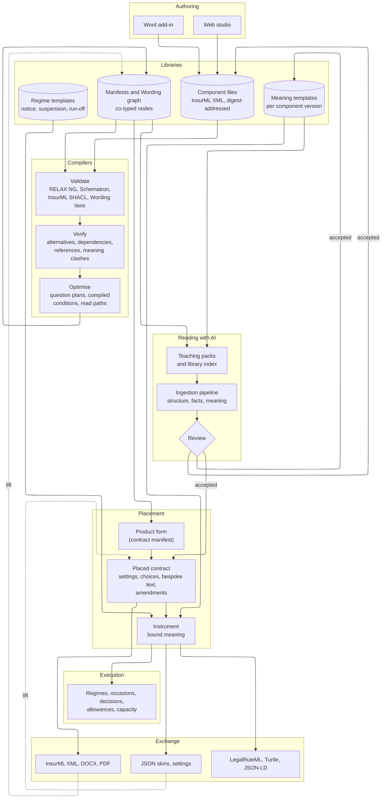
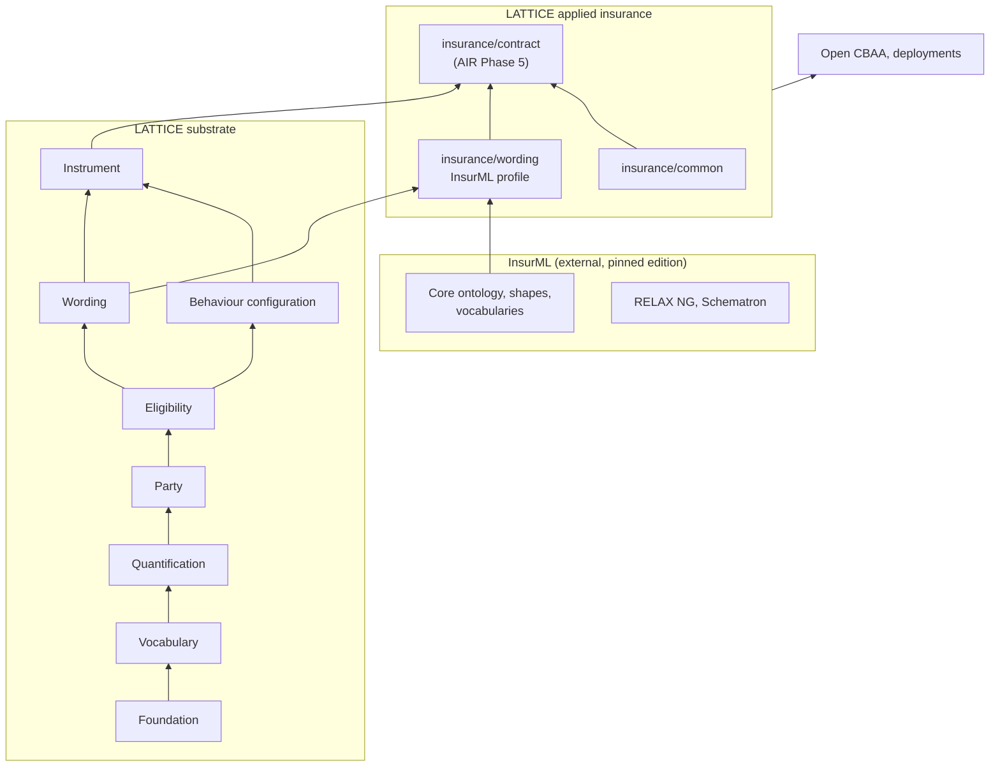
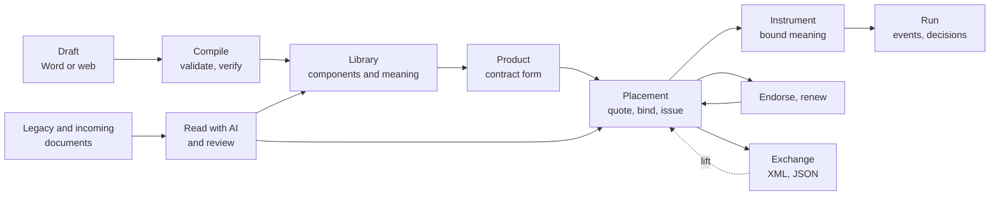
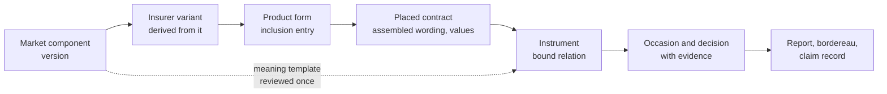
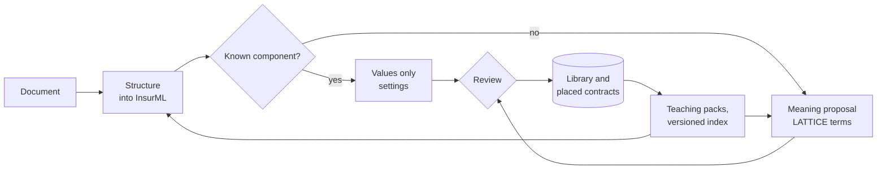

<!-- SPDX-License-Identifier: CC-BY-SA-4.0 -->

# InsurML and LATTICE: an architecture vision

**Status:** vision, 2026-10-05. Not a decision and not a plan. Each part that becomes work needs its
own ADR under the Design First rule. Nothing here changes an accepted ADR.

**Plan:** [insurml-alignment](../developer/plans/insurml-alignment.md) (epic).
**Sketches:** [insurml-bridge.md](../developer/sketches/insurml-bridge.md) (the profile, lift, lower,
assembly parity and the substrate changes) and
[insurml-toolchain-and-ai.md](../developer/sketches/insurml-toolchain-and-ai.md) (authoring,
compilation, libraries, placement, exchange, teaching packs and ingestion).
**Analysis it builds on:** [InsurML and LATTICE compared](../developer/notes/insurml-and-lattice.md)
(the comparison, cited below as "comparison §n") and
[integrating InsurML and LATTICE](../developer/notes/insurml-integration.md) (cited as
"integration §n"). Their gap numbers (L-n, I-n), mapping rows (M-nn, W-nn), proposals (P-n) and
questions (U-n, Q-n) are reused here. §12 records where this paper departs from them.

**Scope.** How InsurML, an XML markup standard for commercial insurance wording owned by John
Cummins of Axiome Partners, and LATTICE, a domain-neutral substrate for governing documents, are
used together and apart: authoring, libraries, assembly, placement, execution, exchange, and
AI-assisted reading of insurance documents.

---

## Contents

1. [Premise](#1-premise)
2. [Vision statement](#2-vision-statement)
3. [Principles](#3-principles)
4. [The end-state architecture](#4-the-end-state-architecture)
5. [Where InsurML sits among LATTICE's layers](#5-where-insurml-sits-among-lattices-layers)
6. [The lifecycle, end to end](#6-the-lifecycle-end-to-end)
7. [Using each with and without the other](#7-using-each-with-and-without-the-other)
8. [What changes, and where](#8-what-changes-and-where)
9. [Alignment with existing work](#9-alignment-with-existing-work)
10. [Risks](#10-risks)
11. [How success is measured](#11-how-success-is-measured)
12. [Where this paper departs from the analysis](#12-where-this-paper-departs-from-the-analysis)

---

## 1. Premise

Open CBAA adopted the LMA Wording Information Model (WIM) as `wim:`. LATTICE generalised it into the domain-neutral Wording layer (ADR-A112) and reserved the market's own typing for an LMA WIM profile in `ontology/applied/insurance/wording/` (CCS decision CC-D3, AIR slice AIR-5.9). The WIM originates with Axiome Partners, who are also developing InsurML, and working with the LMA on computable binding authority agreements within the DARE programme. LATTICE's authors are invited to comment.

InsurML and LATTICE's Wording layer therefore share an ancestor (comparison §3). They grew in different directions:

| | InsurML | LATTICE |
|---|---|---|
| Answers | how an insurance contract document is built from parts, identified, checked and published | what a contract means, between whom, under which conditions, with which amounts, and in what state it is now |
| Strong on | markup, schemas, inline structure, clause dependencies, a normative assembly model, real market text | library and instance kept apart, per-instance values, a condition algebra, design-time checks, amendments, legal relations, regimes, state |
| Domain | commercial insurance | any governing document, with insurance in applied modules |

The finding this paper adopts is that AIR-5.9 is built with InsurML in view, as an InsurML profile,
and that LATTICE does not define an insurance wording markup of its own. InsurML is the document
standard for insurance wording. LATTICE is the substrate for its meaning, its execution and its
governance. Each remains usable without the other.

## 2. Vision statement

Insurance wording is drafted once, in Word or in a web studio, and held as InsurML components with
stable version IRIs down to the fragment. Compilers validate it, verify it at design time and
optimise it for assembly. Its meaning is reviewed once per component version and stored in LATTICE.
Libraries of components, contract forms and meaning templates are assembled into products, and
products are tailored in placement for a risk, a client or a scenario, with every deviation from
the library recorded. The placed contract is a publishable InsurML document and a computable LATTICE
instrument at once. It runs deterministically, it is exchanged as XML or JSON, and anything that
arrives in either form is lifted back by the same published transformations. Every decision cites
the fragment of wording it rests on. Models taught both standards read legacy and incoming
documents into InsurML structure and LATTICE proposals, which people review, so that each reviewed
document makes the next one cheaper to read.

## 3. Principles

The integration principles IP1 to IP11 (integration §2) apply unchanged. The principles below govern
the architecture as a whole and are cited by number in the sketches and the plan.

| # | Principle | Grounding |
|---|---|---|
| AV1 | **Two standards, one graph.** Each standard keeps its own semantics. They meet by co-typing the same nodes and by declared alignment, never by renaming one into the other | IP4, IP6, ADR-A82 |
| AV2 | **Division of ownership.** InsurML owns insurance wording markup, its vocabularies and its assembly model. LATTICE owns meaning, state, computation, identity, provenance and governance. LATTICE does not publish a competing insurance markup | AIR-5.9, CC-D3 |
| AV3 | **Bridge before change.** Integration first uses what both standards already have. LATTICE's substrate changes only for a gap with a domain-neutral case. Changes to InsurML are proposals to its owner | IP1, IP10 |
| AV4 | **The words are the contract.** Meaning attaches to words by IRI and never replaces them. Embedding another standard never puts unreviewed meaning into the published words | IP2, IV1, IP7 |
| AV5 | **Traceable to the fragment.** Every component, fragment, inclusion and value has an IRI, and every derived artefact has provenance back to them | ADR-A26, ADR-A92 |
| AV6 | **Deterministic after review.** Lifts, lowers, assembly, compilation and rendering are pure functions of hashed inputs. Models propose and never write a compiled artefact | IV9, ADR-A19, ADR-A25 |
| AV7 | **Optional in both directions.** InsurML works without LATTICE, and LATTICE works without InsurML. Neither imports the other. Only the applied profile depends on both | IP10 |
| AV8 | **Licence and clean room first.** InsurML material is published with its owner's permission (IMA-D5). Market wording quoted in InsurML's examples keeps its owners' terms, so fixtures are written clean-room | IP11, ADR-A-C2 |
| AV9 | **Published kits.** Every transformation ships as a versioned kit (schema, query, stylesheet, shapes, examples) that a third party can run without LATTICE's runtime | IP8, XML egress sketch §8 |
| AV10 | **Models propose, standards dispose.** Model output is constrained by InsurML's grammar and LATTICE's shapes, and a person accepts it | IV2 to IV4, ADR-A25 |

## 4. The end-state architecture

The architecture has seven parts. The sketches give each its design.

| Part | Holds or does | Standard that leads | Detail |
|---|---|---|---|
| Authoring | edits InsurML components and manifests, and attaches meaning beside the words | InsurML for the words, LATTICE for meaning | toolchain sketch §2 |
| Libraries | component files, the co-typed graph, meaning templates, regime templates, product forms | both | toolchain sketch §4, bridge sketch §2 |
| Compilers | validation, design-time verification and optimisation over one intermediate graph | both, with LATTICE's compilers as the shared pipeline | toolchain sketch §3 |
| Placement | a product form tailored for one risk, recorded as an assembled wording, its values and its bound instrument | InsurML for the document, LATTICE for the record | toolchain sketch §5 |
| Execution | regimes, occasions, Eligibility decisions, allowances and capacity, evaluated deterministically | LATTICE | toolchain sketch §6 |
| Exchange | lifts and lowers between the graph and XML, JSON and RDF forms | both | bridge sketch §5, §6, toolchain sketch §7 |
| Reading with AI | teaching packs, a versioned library index and the ingestion pipeline, with review | both | toolchain sketch §9 |

Ownership of each kind of fact follows integration §3. The component file owns its words, the
manifest owns order and inclusion, Instrument owns meaning, Behaviour's runtime owns state, and
`wrd:VariableValue` owns a placed contract's values.

## 5. Where InsurML sits among LATTICE's layers

Three rules follow from AV2 and AV7:

- InsurML's ontology imports nothing from LATTICE, and no LATTICE layer imports InsurML. The
  profile is the only document that depends on both, and it pins one InsurML edition through the
  catalog as an external import (ADR-A88).
- The profile adds alignment, scheme bindings, key schemes, containment shapes compiled from
  InsurML's rules held as data, and the few properties a builder needs that the substrate should
  not hold. It never redefines an InsurML term.
- Meaning stays in Instrument and in AIR's contract module. A component typed Exclusion is a
  routing hint for review, not an `ins:Exclusion` (IP7, comparison §8).

## 6. The lifecycle, end to end

### 6.1 Authoring

Drafters work in Word, through an Office.js add-in that tags each component and fragment with its
InsurML IRI, type and optionality in content controls and custom XML parts. Library curators and
reviewers work in a web studio that edits the same components, shows their manifests, and places
meaning proposals beside their source text in the review workbench's pattern. Both write InsurML
components, and both validate as the author types with the same schemas the compilers use. Open
DARE's proof-of-concept notes already chose Office.js and tagged content for this reason
(identity is not position). The change is that the add-in now writes InsurML rather than a
private structure.

### 6.2 Compilation

One intermediate representation, the co-typed graph of InsurML manifests and LATTICE Wording,
passes through three kinds of pass, as ADR-A19's staged compiler does for conditions.

| Pass | Examples | Exists today |
|---|---|---|
| Validate | RELAX NG and Schematron on component XML, InsurML's SHACL on manifests, Wording laws W1 to W6, profile shapes | InsurML's checks, Wording's laws |
| Verify | alternatives exclusive and exhaustive for every policy, an acyclic clause dependency graph, every reference resolving to one target in scope, no obligation and prohibition clashing over one scope, a revision's widening or narrowing of criteria | slot checks for intervals (CCS C5), widening for criteria (ADR-A90). Every condition kind is CCS C13a, clashes NRS N3 |
| Optimise | a question plan per product, dead components, compiled inclusion conditions, read paths for inherited attributes and usage, a rendering cache keyed by digest | Eligibility compilers, Surface promotions |

### 6.3 Libraries

Three libraries, all versioned and governed:

| Library | Unit of reuse | Reuse across |
|---|---|---|
| Wording | an InsurML component version, with its reviewed meaning | every product and placement that includes it |
| Product | an InsurML contract form (a manifest) with its governing variables | every placement of the product |
| Template | an Instrument meaning template, a regime template (notice, suspension, non-renewal, run-off) | every component whose meaning uses it |

A market body, an insurer and a broker each publish under their own InsurML prefix. Usage and
impact are queries over the graph: which live contracts include a component version, which would
change if a new version replaced it, and whether the change widens or narrows what the contract
covers.

### 6.4 Assembly into products

A product is an InsurML contract form whose inclusion entries carry conditions on governing
variables. InsurML's normative processing model and a LATTICE assembler run the same inputs, and a
parity suite compares their results, as ADR-A28 does for the Eligibility backends. Where a
condition exceeds InsurML's equality test, Eligibility evaluates it with three values, and the
result reaches InsurML as a derived governing variable or, if InsurML adopts it, as a condition held
in RDF by IRI (P-2).

### 6.5 Placement

Placement takes a product and tailors it for a risk, a client or a scenario: answers to the
governing questions, chosen alternatives, values for embedded variables, bespoke components, and
later amendments. LATTICE records each as data: `wrd:VariableValue` records on a
`wrd:AssembledWording`, bespoke elements derived from the library elements they revise, and
`wrd:Amendment`s with PROV. The placed contract is then two views of one record, an InsurML
assembled contract for publishing and an `ins:Instrument` for computing. Because every bespoke
change names the library element it departs from, deviation from standard wording becomes a
derived report, by component and by meaning.

### 6.6 Execution

Reviewed meaning is bound per instrument. Limits and excesses become term parameters on
`ins:Qualifier` (AIR-5.1 to AIR-5.3). Notice, suspension and run-off clauses become regimes from
the template library (CCS C8a). Obligations fall due by due ranges and windows (CCS C7b). The
runtime evaluator (CCS C12) and relation plans (CCS C13) evaluate them over events, with an
honest Undetermined where data is missing. Running the same inputs gives the same result, and the
result names the clause fragment it rests on.

### 6.7 Exchange

| Form | Carries | Direction |
|---|---|---|
| InsurML component and assembled contract XML | the words, structure and published numbering | out and in |
| DOCX and PDF | the rendered document | out |
| Settings, as JSON generated from the shapes, or as Turtle | a placed contract's values | out and in |
| JSON skins of the wire protocol | terms and decisions for systems with no RDF tolerance | out and in |
| LegalRuleML, XML or JSON | normative statements, linked to their InsurML fragments | out and in |
| Turtle, JSON-LD | the graph, for RDF-native consumers | out and in |

Every form has a published kit and a deterministic lift. Data that arrives in any of them is
lifted, validated against the same shapes, and executed exactly as data authored in LATTICE.

### 6.8 Traceability

Each arrow is an IRI-to-IRI link with PROV, so a decision about a claim can be followed back to
the fragment of market wording, the review that gave it meaning, and the placement choice that
included it.

### 6.9 Reading documents with AI

The ingestion vision's pipeline gains a published structure target. Models read a policy wording,
schedule, quote, market reform contract slip, binding authority agreement or endorsement into
InsurML components, which InsurML's grammar and shapes check. Library recognition replaces
generation wherever the text is standard. Schedules become settings. Novel text becomes meaning
proposals in LATTICE's terms. Reviewed results flow back into the library and into the teaching
material.

Two techniques LATTICE has built for MORK carry over. A compact notation with a generated
codebook, as MCN is for MORK, cuts the tokens a model reads and writes, and decodes losslessly.
A teaching pack, as MTP is for MORK, gives a model a small resident kernel, doctrine units, minimal
pairs and validated examples, built deterministically and pinned by hash. For InsurML the doctrine
has an author who is its domain expert, which the ingestion vision rates as low risk (tier 3a), and
InsurML's own invalid fixtures, each naming the assertion it must fail, are ready-made negative
examples. Graph retrieval over the meaning-annotated library supplies exact, reviewed exemplars for
each new clause. Whether these raise accuracy and lower review time is a hypothesis to measure
(§11).

### 6.10 Mixing standards

InsurML is the document spine, and other standards attach to it by IRI:

| Standard | Attaches as | Detail |
|---|---|---|
| LegalRuleML | a companion document whose legal sources are InsurML fragment IRIs, linked by LegalRuleML's own associations. Inside InsurML only as informational foreign content, if InsurML's owner agrees | toolchain sketch §8 |
| InsurLE and Logical English | a controlled-English rendering per component version, checked against the reviewed meaning | logical English alignment sketch |
| ODRL | a projection of the relation classes | CCS sketch §8.2 |
| ACORD | an egress kit from the placed contract's values and terms | XML egress sketch §13 |
| MathML | a formula in foreign content, read as `ins:computedBy` | CCS C7b |

A contract package bundles the assembled InsurML contract, its settings, its LATTICE graph, any
companion LegalRuleML and the rendered document, each addressed by digest, so a recipient takes
the parts it understands and can verify the rest.

## 7. Using each with and without the other

| Adopter | Uses | Does not need |
|---|---|---|
| An InsurML publisher with an XML toolchain | InsurML, its schemas and processor | anything from LATTICE |
| An InsurML publisher wanting computable contracts | InsurML for wording, the profile, LATTICE for meaning and execution | a LATTICE markup |
| A LATTICE deployment in another domain | Wording and Instrument with its own schemes | InsurML |
| A LATTICE deployment publishing insurance documents | LATTICE as the record, the lower kit to InsurML for publishing | an InsurML authoring tool |
| Open CBAA | the profile in place of `wim:`, with Instrument and its own authority model | a local wording model |

The integration targets depth 5 of integration §1 (layering) for LATTICE, and offers depth 6
(convergence on a shared core) to InsurML's owner. Depths 0 to 2 need no change to either standard.

## 8. What changes, and where

Each row is a candidate decision.

| Where | Change | Why | Sketch |
|---|---|---|---|
| applied insurance | the InsurML profile: alignment, scheme bindings, key schemes, containment shapes, builder properties | AIR-5.9 built with InsurML in view | bridge §2 |
| tools | lift, lower, assembler, renderer, parity suite, egress kits | exchange and assembly in both directions | bridge §5 to §7 |
| Wording | placement elements, so one library element version serves many forms (L-1) | reuse of boilerplate is general to clause libraries | bridge §8 |
| Wording | inline placement of a child element inside a text, for optional words and blocks mid-sentence (L-2, L-5) | general to templates in every domain | bridge §9 |
| Wording | references to a persistent identity, resolved within an assembled wording (L-6) | a revised definition should not force reissue of every clause that uses it | bridge §11, with CCS C7c |
| Wording or applied | clause dependencies (L-3), content status (L-7) | profile first, substrate on a neutral case | bridge §10, §12 |
| Instrument | a qualifier naming the fragment it was read from (L-10) | traceability of amounts to their words | bridge §13 |
| InsurML, proposed | settings format, conditions by IRI, dynamic table structure, IRIs for inclusion entries, and the rest of P-1 to P-13 | gaps LATTICE has already modelled | bridge §15 |
| apps | Word add-in, web studio | authoring | toolchain §2 |
| tools, ontology | wording teaching packs, compact notation, library index | AI-assisted reading | toolchain §9 |

## 9. Alignment with existing work

| Workstream | Relationship | Consequence |
|---|---|---|
| [CCS](../developer/plans/computable-contract-substrate.md) | supplies Wording, Instrument, regimes, terms in time | C7c's brief takes InsurML's scope-based definition resolution as input. C9's amendments receive endorsements lifted from InsurML. C12 and C13 evaluate placed contracts. C13a verifies alternatives for every condition kind. Substrate changes wait until C9 is merged (integration R4) |
| [AIR](../developer/plans/applied-insurance-reference.md) | supplies insurance modules | AIR-5.9 is built with InsurML in view, in the alignment epic. AIR-5.1 to AIR-5.4 give limits and excesses their meaning. AIR-5.8's policy renderings gain InsurML forms. Reference vocabularies supply market, class of business and area of coverage |
| [NRS](../developer/plans/normative-rule-substrate.md) and the LegalRuleML sketches | interchange and normative statements | the companion LegalRuleML document reuses the runtime pipeline and the JSON form of LegalRuleML. N3's clash check is a verification pass |
| [Ingestion vision](ingestion-vision.md) | the route from text to meaning | InsurML is a candidate structure target (its Q9), and component digests answer document recognition (its Q11) for marked-up text |
| [MTP](mork-teaching-pack.md), [llm-training sketch](../developer/sketches/llm-training.md), [MCN](mork-compact-notation.md) | the packaging techniques | wording teaching packs and a compact form reuse the generator pattern, under a new ADR, since ADR-A44 bounds MTP to MORK |
| [Wire protocol](../developer/sketches/normative-wire-protocol.md), [XML egress](../developer/sketches/xml-egress-and-transformation-kits.md) | exchange | InsurML kits sit beside the LATTICE instrument kit. Settings get a JSON skin |
| [Evaluation context](../developer/sketches/evaluation-context.md) | ledgers for limits and aggregates | InsurML's limit and excess markup names the words that each ledger account is read from |
| Platform phases 2 and 3 | ingestion and operation planes | component files live in the artefact realm, the graph in the semantic realm, lifts and assembly as worker jobs |
| Open CBAA and Open DARE | the first consumer | `wim:` is replaced by the profile. The proof of concept's DOCX route becomes DOCX to InsurML to Wording. Certificate assembly with territory-conditional content (DA-I2) is InsurML assembly |

## 10. Risks

Integration §12 lists R1 to R12. Three more arise at this scale:

| # | Risk | Mitigation |
|---|---|---|
| R13 | Two standards bodies diverge in governance or pace | one profile pinned per edition, proposals made upstream rather than forked, joint review of each profile release |
| R14 | Published analysis outruns a draft that is still changing | InsurML's owner permits publication (IMA-D5). Each document names the draft edition it read. Clean-room examples throughout |
| R15 | AI results are oversold before they are measured | the measures of §11 gate any claim. Estimates are labelled as estimates |

## 11. How success is measured

| Capability | Measure |
|---|---|
| Fidelity | share of mapping rows graded exact or by convention, and golden round trips with no unexplained difference |
| Assembly | parity between InsurML's processor and LATTICE's assembler over every fixture product and configuration |
| Reuse | share of a product's components drawn from libraries, and meaning reviews saved by reuse |
| Placement | deviation from standard wording reported for every placed contract, by component and by meaning |
| Execution | scenario decisions equal to their expected tables, deterministic across runs |
| Exchange | each kit's output valid against its schema, and lifted back without loss beyond its declared fidelity |
| Reading with AI | structure accuracy against gold, share of elements recognised from the library, review acceptance rate, reviewer minutes and cost per document, and the rate of confident output where uncertainty was warranted |

## 12. Where this paper departs from the analysis

| Analysis | This paper |
|---|---|
| Reuse by reifying inclusion as an edge node (integration §4.2, option D), a breaking Wording change | a placement element, an additive change that keeps W1 for trees and maps one to one onto InsurML's inclusion entries (bridge sketch §8) |
| Meaning never embedded in InsurML (integration §8.17) | refined. LegalRuleML attaches as a companion document whose legal sources are InsurML fragments, or inside InsurML as informational foreign content if its owner agrees. The published words stay unchanged (AV4) |
| Optional words and blocks inside a sentence as two changes (L-2, L-5) | one change, an inline placement part (bridge sketch §9) |
| Wording's law shapes would fail on other SHACL engines (comparison §5.15) | they declare their prefixes with `sh:declare`, as the standard requires. They depart from the repository's house rule, which asks for inline `PREFIX` lines, and can be aligned with the next Wording change |
| A Word authoring add-in directory exists without source (comparison §11.2) | no such directory exists. The authoring add-in is designed in Open DARE's proof-of-concept notes only |
| Layer versions of comparison §1 | dated. Wording is at 0.5.0 and Instrument at 0.11.0 on 2026-10-05 |
