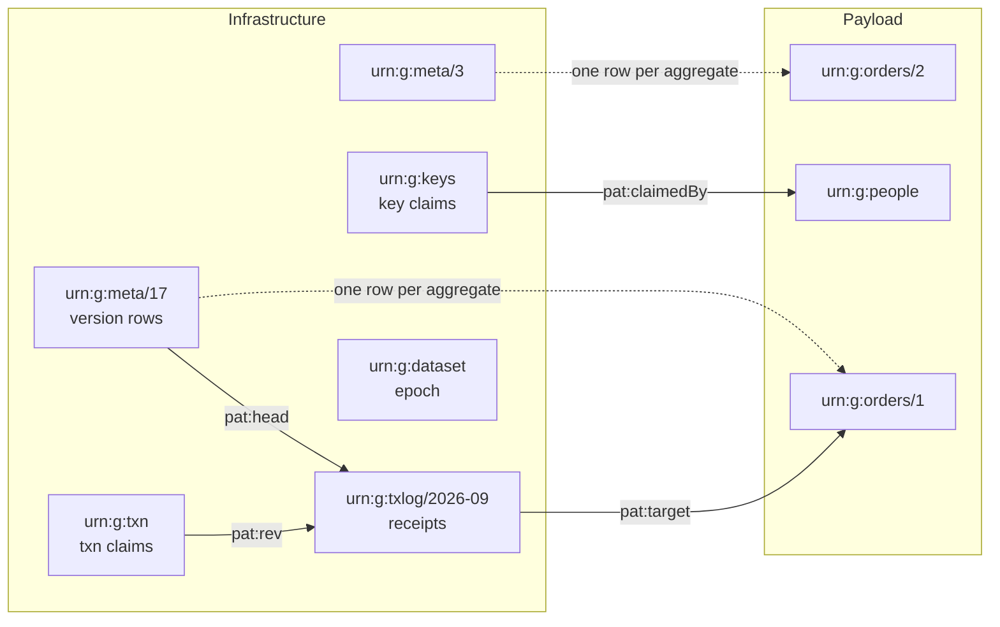
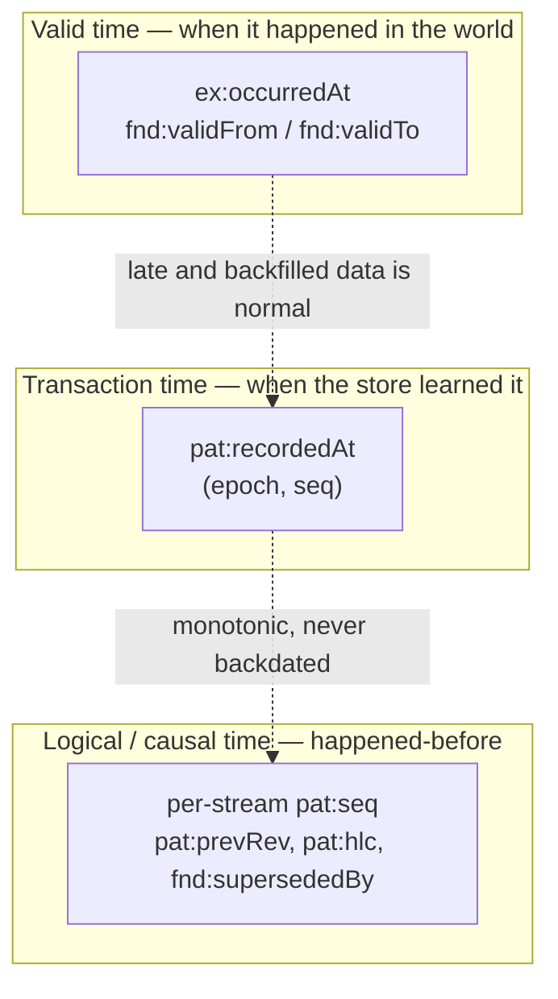
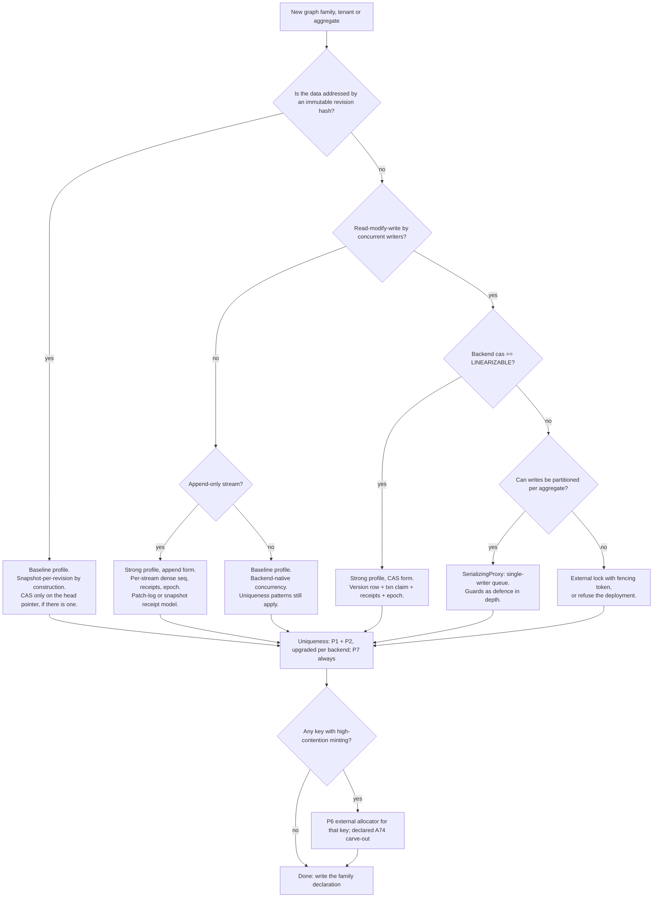

<!-- SPDX-License-Identifier: CC-BY-SA-4.0 -->

# Uniqueness, Ordering and Concurrency in RDF — The LATTICE Pattern Guide

**Status:** Authoritative architectural guide. See [Appendix D](#appendix-d--traceability-to-the-source-notes) for disagreement with other documentation.

**Audience:** anyone designing, implementing, reviewing or operating a LATTICE component that writes to an RDF store: the store SPI (A75), the Surface workflow, MORK governance, ingestion workers, and the ontology authors who decide where aggregate boundaries fall.

**Relationship to other documents:** [data-architecture.md](data-architecture.md) describes the three data realms. This guide describes the patterns that let RDF carry more of the operational state that PostgreSQL carries today (proposed ADR-A74, graph-primary), and the capability model the store SPI must expose to make that safe (proposed ADR-A75). [Chapter 30](#chapter-30--mapping-the-patterns-onto-lattice) states what the patterns imply for each.

---

## How to read this guide

This is a long document, deliberately. The notes it consolidates were written as a sequence of increasingly hard questions ("how do I enforce a unique key?", "how do I order events?", "how do I know my write applied?", "what happens when I combine all three?"), and each answer exposed a failure mode in the previous one. The guide keeps that journey, because the *reasons* are what make the patterns safe to build; a table of solutions without the failures they answer is exactly the kind of summary that has already gone wrong once (see `docs/developer/notes/misalignment.md`).

Read it in one of three ways:

| You want to | Read |
|---|---|
| Understand why RDF makes this hard and what the shape of the answer is | Part I, then the "Recommended default" at the end of Parts II, III and IV |
| Implement the store SPI or an adapter | Part I, Part V, Part VII, Appendix A and B |
| Decide what a graph family, tenant or aggregate should enable | Part I, Part VI, Part IX |
| Review a pull request that writes SPARQL | Part VIII, the gotcha tables in Chapters 8, 13 and 14, and the checklist in Chapter 29 |

Every pattern is illustrated with Turtle showing the state before and after, SPARQL showing the operation, and where useful, code showing the client or adapter side. All examples use one running domain ([Chapter 2](#chapter-2--the-running-example)) so that the failure in one chapter is visibly the same data as the fix in another.

**Naming.** Identifiers from the source notes are kept so that cross-references survive: uniqueness kinds **K1–K4** and patterns **P0–P7**; ordering requirements **O1–O5**, critique items **G1–G6** and SPARQL patterns **S1–S8**; concurrency techniques **§1.1–1.6**; and the combined design's benefits **A1–A7** and findings **F1–F13**. The sketch's letter codes for the pattern families (K, O, C, T, QP) are also kept.

### Contents

- **Part I — Foundations**
  - [Chapter 1 — Why this is harder in RDF than in SQL](#chapter-1--why-this-is-harder-in-rdf-than-in-sql)
  - [Chapter 2 — The running example](#chapter-2--the-running-example)
  - [Chapter 3 — Clocks, orders and the central trade-off](#chapter-3--clocks-orders-and-the-central-trade-off)
- **Part II — Uniqueness (Pattern K)**
  - [Chapter 4 — Four kinds of uniqueness](#chapter-4--four-kinds-of-uniqueness)
  - [Chapter 5 — P0: deterministic IRIs](#chapter-5--p0-deterministic-iris--make-uniqueness-structural)
  - [Chapter 6 — P1 and P2: the key-claim registry and the guarded write](#chapter-6--p1-and-p2-the-key-claim-registry-and-the-guarded-write)
  - [Chapter 7 — P3 to P7: isolation, upserts, SHACL, allocators and reconciliation](#chapter-7--p3-to-p7-isolation-upserts-shacl-allocators-and-reconciliation)
  - [Chapter 8 — Normalization, and the uniqueness portability table](#chapter-8--normalization-and-the-uniqueness-portability-table)
- **Part III — Ordering (Pattern O)**
  - [Chapter 9 — Six ways an ordering scheme fails](#chapter-9--six-ways-an-ordering-scheme-fails)
  - [Chapter 10 — S1: the in-transaction counter and the amended log model](#chapter-10--s1-the-in-transaction-counter-and-the-amended-log-model)
  - [Chapter 11 — Reading an ordered log: S2 to S8](#chapter-11--reading-an-ordered-log-s2-to-s8)
  - [Chapter 12 — O5: ordered collections are a different problem](#chapter-12--o5-ordered-collections-are-a-different-problem)
  - [Chapter 13 — SPARQL gotchas that break ordering](#chapter-13--sparql-gotchas-that-break-ordering)
- **Part IV — Concurrency control (Pattern C)**
  - [Chapter 14 — The CAS primitive and its variants](#chapter-14--the-cas-primitive-and-its-variants)
  - [Chapter 15 — Learning whether it applied](#chapter-15--learning-whether-it-applied)
  - [Chapter 16 — Escape hatches that do not depend on store isolation](#chapter-16--escape-hatches-that-do-not-depend-on-store-isolation)
- **Part V — The combined design (Pattern T)**
  - [Chapter 17 — What separating metadata from payload buys, and what it does not](#chapter-17--what-separating-metadata-from-payload-buys-and-what-it-does-not)
  - [Chapter 18 — Thirteen findings against the first combined pattern](#chapter-18--thirteen-findings-against-the-first-combined-pattern)
  - [Chapter 19 — The corrected pattern](#chapter-19--the-corrected-pattern)
  - [Chapter 20 — Receipts, patches or snapshots (F9)](#chapter-20--receipts-patches-or-snapshots-f9)
  - [Chapter 21 — Two tiers of order](#chapter-21--two-tiers-of-order)
  - [Chapter 22 — Append versus compare-and-set](#chapter-22--append-versus-compare-and-set)
- **Part VI — Time and lifecycle**
  - [Chapter 23 — Bi-temporal modelling: configurable, not mandated](#chapter-23--bi-temporal-modelling-configurable-not-mandated)
  - [Chapter 24 — Deletion, retention, tombstones and bulk load](#chapter-24--deletion-retention-tombstones-and-bulk-load)
- **Part VII — The store SPI**
  - [Chapter 25 — Capabilities, strategies, planners and the `unknown` outcome](#chapter-25--capabilities-strategies-planners-and-the-unknown-outcome)
  - [Chapter 26 — Store by store](#chapter-26--store-by-store)
  - [Chapter 27 — The conformance TCK](#chapter-27--the-conformance-tck)
- **Part VIII — Query discipline (Pattern QP)**
  - [Chapter 28 — Five rules and how they are enforced](#chapter-28--five-rules-and-how-they-are-enforced)
- **Part IX — Deciding**
  - [Chapter 29 — Choosing what to enable](#chapter-29--choosing-what-to-enable)
  - [Chapter 30 — Mapping the patterns onto LATTICE](#chapter-30--mapping-the-patterns-onto-lattice)
- **Appendices**
  - [A — The pattern vocabulary](#appendix-a--the-pattern-vocabulary)
  - [B — SHACL shapes](#appendix-b--shacl-shapes)
  - [C — Glossary](#appendix-c--glossary)
  - [D — Traceability to the source notes](#appendix-d--traceability-to-the-source-notes)
  - [E — What remains open](#appendix-e--what-remains-open)

---

# Part I — Foundations

## Chapter 1 — Why this is harder in RDF than in SQL

A relational database gives an application three things it barely notices until they are gone: a `UNIQUE` index, a row that two writers collide on, and a return value that says how many rows an `UPDATE` touched. RDF over SPARQL gives none of them, and the whole of this guide is, in a sense, the story of rebuilding those three things on top of a set of triples.

### 1.1 Set semantics hide lost updates

An RDF graph is a *set* of triples. Inserting a triple that is already present is a no-op, not an error; deleting a triple that is already absent is a no-op, not an error. This is convenient for idempotent loading and catastrophic for concurrency control, because two writers who both believe they are moving the world from state A to state B do not collide, they *merge*.

Consider an order whose version counter is held in a metadata graph:

```turtle
# state at t0
GRAPH <urn:g:meta/17> {
  <urn:g:orders/1>  pat:seq  "41"^^xsd:long .
}
GRAPH <urn:g:orders/1> {
  <urn:order:1>  a ex:Order ;  ex:status "placed" .
}
```

Two writers each read version 41, decide on a new status, and each issue "delete version 41 and the old payload, insert version 42 and my payload":

```sparql
# Writer A   (prefixes as declared in Chapter 2)
DELETE { GRAPH <urn:g:meta/17> { <urn:g:orders/1> pat:seq "41"^^xsd:long }
         GRAPH <urn:g:orders/1> { ?s ?p ?o } }
INSERT { GRAPH <urn:g:meta/17> { <urn:g:orders/1> pat:seq "42"^^xsd:long }
         GRAPH <urn:g:orders/1> { <urn:order:1> a ex:Order ; ex:status "paid" } }
WHERE  { GRAPH <urn:g:meta/17> { <urn:g:orders/1> pat:seq "41"^^xsd:long }
         OPTIONAL { GRAPH <urn:g:orders/1> { ?s ?p ?o } } }
```

```sparql
# Writer B — identical, except ex:status "cancelled"
```

On a store that serialises writers, the second writer's `WHERE` finds no `pat:seq 41`, matches nothing, and is a no-op. On a store with snapshot isolation and no write–write conflict detection, both writers see version 41 in their snapshot, both delete it (the second deletion is a no-op), both insert `pat:seq 42` (the second insertion is a no-op), and both replace the payload they *saw*:

```turtle
# state at t1 under snapshot isolation without conflict detection
GRAPH <urn:g:meta/17> {
  <urn:g:orders/1>  pat:seq  "42"^^xsd:long .          # one triple. Looks perfectly healthy.
}
GRAPH <urn:g:orders/1> {
  <urn:order:1>  a ex:Order ;
                 ex:status "paid" ;                    # from A
                 ex:status "cancelled" .               # from B
}
```

The version row is the most dangerous part of this picture. It shows a single, plausible value, so nothing that inspects versions will ever notice that two writers each believed they produced version 42. Had the two writers used *different* new values, say random ETags rather than a counter, the metadata graph would at least contain two `pat:etag` triples and something could object; this is the basis of the SHACL trick in [Chapter 15](#153-making-the-store-enforce-the-invariant-the-shacl-trick). With a counter, the evidence is destroyed by the very set semantics that made the merge possible.

### 1.2 There is no return value

SPARQL 1.1 Protocol has no `If-Match`, no `RETURNING`, and no affected-row count. An update endpoint replies `200` or `204` whether it changed ten thousand triples or none. A conditional update whose condition fails is therefore *indistinguishable from one that succeeded* unless the application goes back and looks.

Going back and looking is itself unreliable. Re-reading the version after a write tells you the *current* version, not whether *your* write produced it. If another writer advanced the version between your write and your read, a success looks like a failure. Resolving this is the subject of [Chapter 15](#chapter-15--learning-whether-it-applied), and the answer, a claim node keyed by a client-generated transaction id, turns out to be the single most valuable component of the whole design.

### 1.3 Isolation is underspecified and configurable

SPARQL 1.1 Update requires the operations in one request to be executed in order. It does not require that a request be a single atomic transaction, and it says nothing about isolation. In practice most engines do treat one request as one transaction, at anything from read-committed to serializable, and several make the level configurable. Two consequences follow:

1. **Check-then-write must fit in one request**, or use a vendor transaction API. The plain protocol has no way to hold a read open across a second request.
2. **Atomic is not the same as serializable.** `INSERT { … } WHERE { FILTER NOT EXISTS { … } }` is a textbook *write skew*: under snapshot isolation, two concurrent writers can both see "no such key" and both insert. Atomicity does not save you. You need serializable isolation, a materialised write conflict ([Chapter 7](#71-p3-materialise-the-write-conflict)), single-writer semantics, or an external lock.

So the *CAS primitive* is easy: a guarded `DELETE/INSERT … WHERE`. The hard parts are learning whether it applied, and proving that the store actually detects write–write conflicts. Neither is answered by reading vendor documentation; both are answered by a test suite ([Chapter 27](#chapter-27--the-conformance-tck)).

### 1.4 OWL does not help, and can hurt

`owl:InverseFunctionalProperty` looks like a uniqueness constraint and is not one. With reasoning enabled, two people who share an `ex:email` are not rejected; they are silently *merged* via inferred `owl:sameAs`, which is usually worse than a duplicate. An inconsistency is raised only if the two individuals are already asserted `owl:differentFrom` or the unique name assumption is in force. Use inverse-functional properties deliberately for record linkage, never as an integrity check.

### 1.5 What the rest of the guide rebuilds

| SQL gives you | RDF needs | Where |
|---|---|---|
| `UNIQUE` index | a deterministic node per key value with `sh:maxCount 1` on its owner | Part II |
| `SERIAL` / sequence | a counter statement rewritten inside the writing transaction | Part III |
| a row two writers collide on | a single hot statement per aggregate, separate from the payload | Part V |
| `UPDATE … RETURNING` | a claim node keyed by transaction id, checked with `ASK` | Chapters 15, 19 |
| `BEGIN … COMMIT` across statements | one request, or a vendor transaction API, gated by capability | Part VII |
| a documented isolation level | an empirical torture test per backend | Chapter 27 |

## Chapter 2 — The running example

Every example in this guide uses the same small domain, so that a corrupted state in one chapter is recognisably the same data as a correct state in another.

### 2.1 Vocabularies

```turtle
@prefix ex:   <https://example.org/ns#> .                  # illustrative domain vocabulary
@prefix pat:  <https://example.org/lattice/patterns#> .    # illustrative pattern vocabulary (Appendix A)
@prefix fnd:  <https://www.nebularis.org/neuro-semantic/lattice/foundation#> .
@prefix sh:   <http://www.w3.org/ns/shacl#> .
@prefix xsd:  <http://www.w3.org/2001/XMLSchema#> .
@prefix prov: <http://www.w3.org/ns/prov#> .
```

`ex:` is a stand-in for an applied ontology. `pat:` is the vocabulary the patterns themselves need (`pat:seq`, `pat:epoch`, `pat:KeyClaim`, `pat:Revision` and so on); it is collected in [Appendix A](#appendix-a--the-pattern-vocabulary). Its final IRI, and its alignment to Foundation terms such as `fnd:recordedAt` and `fnd:Version`, is a decision to be taken when the patterns are ratified as ADRs ([Chapter 30](#chapter-30--mapping-the-patterns-onto-lattice)); the local name is what matters here.

### 2.2 The domain

A tenant, `acme`, runs an order system. Orders are aggregates: an order and its line items change together and are read together. People have email addresses that must be unique within the tenant. The system records decisions about orders (approvals, fraud checks) as append-only events.

```turtle
# Payload: one named graph per aggregate
GRAPH <urn:g:orders/1> {
  <urn:order:1>  a ex:Order ;
                 ex:tenant      <urn:tenant:acme> ;
                 ex:orderNumber "A-1001" ;
                 ex:status      "placed" ;
                 ex:placedBy    <urn:person:8f2c1b7e-3e4a-4f7c-9a6d-2b1e0c5d7f90> ;
                 ex:lineItem    <urn:order:1/li/1> , <urn:order:1/li/2> .
  <urn:order:1/li/1>  ex:sku "WIDGET-9" ;  ex:qty 2 .
  <urn:order:1/li/2>  ex:sku "GADGET-3" ;  ex:qty 1 .
}

# Payload: people. Entity IRIs are opaque UUIDs (Chapter 5 explains why).
GRAPH <urn:g:people> {
  <urn:person:8f2c1b7e-3e4a-4f7c-9a6d-2b1e0c5d7f90>
                 a ex:Person ;
                 ex:tenant <urn:tenant:acme> ;
                 ex:email  "ada@example.org" .
}
```

Throughout, `<urn:person:8f2c…>` is abbreviated to `ex:person-42` when the full IRI would obscure the point.

### 2.3 The graphs the patterns add

The patterns add five kinds of infrastructure graph. Their separation from payload is not decoration; each has a different mutability, retention policy, access-control rule and contention profile, and [Chapter 17](#chapter-17--what-separating-metadata-from-payload-buys-and-what-it-does-not) shows that several correctness properties depend on the separation.

| Graph | Holds | Mutability | Example IRI |
|---|---|---|---|
| Payload | domain triples for one aggregate or one collection | mutable (replace) or immutable, by policy | `urn:g:orders/1`, `urn:g:people` |
| Meta (sharded) | one *version row* per aggregate or stream: `pat:epoch`, `pat:seq`, `pat:head`, `pat:deleted` | mutable point, one hot statement per row | `urn:g:meta/17` (64 shards) |
| Keys | one *claim node* per unique key value | append with tombstones | `urn:g:keys` |
| Txn | one *claim node* per client transaction id | append, TTL-pruned | `urn:g:txn` |
| Log | append-only *receipts* (revisions), bucketed by month | append-only | `urn:g:txlog/2026-09` |
| Dataset | epoch and order model | rarely changes | `urn:g:dataset` |

```turtle
GRAPH <urn:g:dataset> {
  <urn:ds:prod>  pat:epoch       "3"^^xsd:long ;
                 pat:orderModel  "per-stream-dense+hlc-global" .
}

GRAPH <urn:g:meta/17> {                      # shard = hash(<urn:g:orders/1>) mod 64
  <urn:g:orders/1>  pat:epoch "3"^^xsd:long ;
                    pat:seq   "41"^^xsd:long ;
                    pat:head  <urn:rev:orders/1/0000000000000041> .
}

GRAPH <urn:g:keys> {
  <urn:key:person-email:v1:MFRGGZDFMZTWQ2LK>       # keyed hash of "person-email|acme|ada@example.org"
      a              pat:KeyClaim ;
      pat:constraint "person-email-unique" ;
      pat:claimedBy  <urn:person:8f2c1b7e-3e4a-4f7c-9a6d-2b1e0c5d7f90> .
}

GRAPH <urn:g:txn> {
  <urn:txn:01J8Q3Z5K9V2N7M4X6P1R8T0W2>  pat:rev  <urn:rev:orders/1/0000000000000041> .
}

GRAPH <urn:g:txlog/2026-09> {
  <urn:rev:orders/1/0000000000000041>
      a              pat:Revision ;
      pat:target     <urn:g:orders/1> ;
      pat:epoch      "3"^^xsd:long ;
      pat:seq        "41"^^xsd:long ;
      pat:prevRev    <urn:rev:orders/1/0000000000000040> ;
      pat:txn        "01J8Q3Z5K9V2N7M4X6P1R8T0W2" ;
      pat:hlc        "1758445643012:0000:n7" ;
      pat:recordedAt "2026-09-21T09:14:03.012Z"^^xsd:dateTime .
}
```

The reasons for each detail (why the epoch is there, why the revision IRI is zero-padded and namespaced by aggregate, why `pat:prevRev` is an IRI and not a string, why the txn id is a *subject* in its own graph) are the substance of Part V. The picture is given here so that the smaller examples in Parts II–IV can be read against it.

### 2.4 Topology



## Chapter 3 — Clocks, orders and the central trade-off

Before any pattern, a vocabulary for what "ordered" and "unique" mean, because most of the pain in the source notes came from conflating requirements that need different solutions.

### 3.1 Five requirements that get called "ordering"

| | Requirement | Example | Needs |
|---|---|---|---|
| **O1** | Total order for replay / sync | "give me everything after where I left off" | a dense, gap-detectable, order-preserving position |
| **O2** | Causal / per-entity order | version 3 of this contract supersedes version 2 | a per-stream monotonic counter or version pointers |
| **O3** | Domain (valid-time) order | events sorted by when they happened in the world | `occurredAt` plus a deterministic tiebreak, **not** commit order |
| **O4** | Point-in-time / bitemporal read | "state as of last Tuesday", "as of seq 91,438" | `validFrom`/`validTo`, or store-native time travel |
| **O5** | Ordered collections in the data | steps 1..n of a procedure, a ranked list | an index property or a ranking key; a different problem entirely ([Chapter 12](#chapter-12--o5-ordered-collections-are-a-different-problem)) |

### 3.2 The three clocks

Keep these physically separate in the model and never let one impersonate another.



- **Valid time** (`ex:occurredAt`, or a `fnd:TemporalScope` with `fnd:validFrom`/`fnd:validTo`): when it happened in the world. Late and backfilled data is *normal*. Sorting by commit order to answer a domain question is a bug that appears the first time someone loads history.
- **Transaction time** (`pat:recordedAt` plus the `(epoch, seq)` position): when the store learned it. Monotonic, never backdated, used for audit, replay and incremental sync.
- **Logical or causal time** (per-stream `pat:seq`, `pat:prevRev` chains, hybrid logical clocks, `fnd:supersededBy`): happened-before, independent of any wall clock.

### 3.3 The central trade-off: dense or sparse

| Property | **Dense** (in-transaction counter) | **Sparse** (HLC, store LSN, timestamps) |
|---|---|---|
| Gap-free, so "did I miss anything?" is answerable | yes | no |
| Allocation order equals commit order | yes, by construction | only with watermark machinery |
| Contention | one writer at a time **per counter** | none |
| Distributed / multi-region | poor | good |
| Comparable across nodes without coordination | not applicable | yes |

You cannot have both gap-freedom and contention-freedom. Dense sequences give completeness detection; sparse clocks give scalability. The usable middle is **dense per stream, sparse across streams**, and that is why the *grain* of a sequence (per aggregate, per tenant, per dataset) is the most important decision in Part III, not the encoding.

### 3.4 Four kinds of uniqueness

| Kind | Example | Difficulty |
|---|---|---|
| **K1** cardinality / functional property | a `Person` has at most one `ex:ssn` | easy: `sh:maxCount 1`, upsert |
| **K2** global key (inverse-functional) | no two `Person`s share an `ex:email` | hard: cross-node, needs a scan or an index |
| **K3** composite / scoped key | `(tenant, orderNumber)` unique per tenant | hard, plus normalization issues |
| **K4** entity identity / de-duplication on ingest | do not mint two IRIs for the same real-world thing | hard; this is the one that bites in production |

The uniqueness patterns in Part II reduce K2 and K3 to K1, because K1 is the only kind RDF stores support cheaply and universally.

### 3.5 Two profiles: baseline and strong

The sketch established an important scoping decision that this guide keeps: **the compare-and-set profile is not the platform default.**

- **Baseline profile.** Aggregates are addressed by immutable, versioned IRIs (revision hashes, as the graph families in [data-architecture.md §2.3](data-architecture.md#23-semantic-graph-families-fuseki-realm) already are). Concurrency behaviour is whatever the chosen backend natively provides. Uniqueness uses the portable patterns of Part II. Ordering uses transaction time and whatever order signal the backend offers.
- **Strong profile** (CAS plus dense ordering). Selected per graph family, tenant or aggregate by operator choice. Adds the version row, receipts, epoch, and the dense per-stream sequence of Parts III and V, with the capability gates of Part VII.

Everything in Parts II–V is written so that the strong profile can be enabled where it pays for itself and left off where it does not. [Chapter 29](#chapter-29--choosing-what-to-enable) is the decision procedure.

---

# Part II — Uniqueness (Pattern K)

## Chapter 4 — Four kinds of uniqueness

RDF's set semantics give you exactly one uniqueness guarantee for free: no duplicate triples. Everything people actually mean by "unique" has to be built. The four kinds from [§3.4](#34-four-kinds-of-uniqueness), each shown as the state a broken system ends up in.

**K1 — cardinality.** A functional property with two values. Cheap to prevent (`sh:maxCount 1`) and cheap to repair (an upsert, [Chapter 7](#72-p4-upsert-for-functional-properties)).

```turtle
ex:person-42  ex:ssn "123-45-6789" , "123-45-6780" .     # K1 violation
```

**K2 — global key.** Two subjects share a value that is supposed to identify one of them. Detecting it requires either a scan over every `ex:email` or an index; preventing it under concurrency requires that both writers touch *the same statement*, which they do not.

```turtle
ex:person-42  a ex:Person ; ex:email "ada@example.org" .
ex:person-77  a ex:Person ; ex:email "ada@example.org" .     # K2 violation
```

**K3 — composite, scoped key.** Same as K2, but the key is a tuple and part of it is a scope. Every problem of K2 plus a normalization problem: is `"A-1001"` the same order number as `"a-1001 "`?

```turtle
<urn:order:1>  ex:tenant <urn:tenant:acme> ; ex:orderNumber "A-1001" .
<urn:order:9>  ex:tenant <urn:tenant:acme> ; ex:orderNumber "A-1001" .   # K3 violation
```

**K4 — entity identity.** Two IRIs for one real-world thing. Nothing in the graph is "wrong" triple by triple; the graph is simply two graphs pretending to be one. It is the kind that bites in production because it is created by ingestion, not by application code, and by the time it is noticed there are references to both IRIs.

```turtle
<urn:person:8f2c…>  a ex:Person ; ex:email "ada@example.org" .
<urn:person:c41a…>  a ex:Person ; ex:email "Ada@Example.org" .   # K4: same person, twice
```

Two constraints shape every solution:

1. **SPARQL 1.1 Protocol has no multi-request transactions.** The whole check-then-write must fit in one HTTP request, or use a vendor transaction API.
2. **Atomic is not serializable.** `INSERT … WHERE { FILTER NOT EXISTS { … } }` is write-skew-prone under snapshot isolation ([§1.3](#13-isolation-is-underspecified-and-configurable)).

The patterns are numbered P0–P7 and are meant to be *stacked*, not chosen between. The recommended stack is at the end of [Chapter 8](#84-recommended-default-for-uniqueness).

## Chapter 5 — P0: deterministic IRIs — make uniqueness structural

If the key *is* the identity, the store's set semantics enforce uniqueness for you, and concurrent writers converge instead of conflicting.

```
IRI = urn:ex:sku:{base32(sha256("v1|sku|" + normalize(sku)))}
```

```python
import base64, hashlib, unicodedata

def deterministic_iri(kind: str, key: str, version: str = "v1") -> str:
    """P0: an IRI derived from an immutable natural key.

    The version salt lets the scheme be re-keyed later without colliding
    with IRIs minted under the old scheme.
    """
    norm = unicodedata.normalize("NFKC", key).strip().upper()
    digest = hashlib.sha256(f"{version}|{kind}|{norm}".encode("utf-8")).digest()
    return f"urn:ex:{kind}:{base64.b32encode(digest[:20]).decode('ascii').rstrip('=')}"

deterministic_iri("sku", "widget-9")   # -> urn:ex:sku:NRXWG3DJMFXGS4DFNFWA
```

Two workers ingesting the same SKU produce the same IRI and the same triples; the second insert is a no-op. No locks, no isolation requirement, and it works on stores with no transactions at all (Rya, Halyard, federations), which is why it is the only uniqueness pattern that has no capability prerequisite.

```turtle
# both workers wrote this; the set has one copy
<urn:ex:sku:NRXWG3DJMFXGS4DFNFWA>  a ex:Product ; ex:sku "WIDGET-9" .
```

**Use it only for immutable, natural, non-PII keys.** Three reasons:

- **Mutability.** If the key changes, the IRI changes, and "user changes email" becomes a migration of every reference.
- **PII.** Hashing an email into an IRI leaks the key into every dataset dump, every log line and every URL. A hash of a normalized email is trivially reversible for anyone with a list of candidate emails.
- **Blank nodes are the anti-pattern here.** A blank node has no identity across requests; two workers ingesting the same thing as blank nodes produce two things. Skolemize on ingest, deterministically where a natural key exists and with a UUID where one does not.

For mutable or sensitive keys, P0 is still used, but for a **key node** rather than for the entity. That is P1.

## Chapter 6 — P1 and P2: the key-claim registry and the guarded write

### 6.1 P1: reduce K2 and K3 to K1

Global uniqueness is expensive and poorly supported. Per-node cardinality is cheap and universally supported. So mint a deterministic node for the *key value*, and require that node to have at most one owner.

```turtle
GRAPH <urn:g:keys> {
  <urn:key:person-email:v1:MFRGGZDFMZTWQ2LK>
      a              pat:KeyClaim ;
      pat:constraint "person-email-unique" ;
      pat:claimedBy  <urn:person:8f2c1b7e-3e4a-4f7c-9a6d-2b1e0c5d7f90> .   # sh:maxCount 1
}
```

The claim IRI is P0 applied to the key, with the constraint id and scope folded into the hash input:

```python
import hmac, hashlib, base64

def claim_iri(constraint_id: str, scope: str, normalized_key: str,
              secret: bytes, version: str = "v1") -> str:
    """P1 claim node IRI.

    A keyed hash (HMAC) rather than a plain hash: the keys graph is an
    index of every email in the tenant, and a plain SHA-256 of a
    normalized email is reversible by dictionary. With an HMAC the IRI is
    a stable pseudonym that cannot be inverted without the platform key.
    Rotating the secret is a re-keying and needs a new version salt.
    """
    material = f"{version}|{constraint_id}|{scope}|{normalized_key}".encode("utf-8")
    mac = hmac.new(secret, material, hashlib.sha256).digest()
    return f"urn:key:{constraint_id.split('-unique')[0]}:{version}:" \
           f"{base64.b32encode(mac[:10]).decode('ascii').rstrip('=')}"
```

> **On P0 versus P1 and PII.** The source notes say both "hashing an email into an IRI leaks PII" (P0) and "hash the key into a claim node" (P1). The resolution is that the claim node is (a) in its own graph, which can carry its own access-control and export rules, and (b) derived with a keyed hash so the IRI does not reveal the key. The entity IRI stays an opaque UUID. That combination is what this guide means by P1.

What P1 buys:

- The constraint becomes `sh:maxCount 1` on `pat:claimedBy` for `pat:KeyClaim`, which is **SHACL Core**, and is validated **incrementally** by engines that revalidate only the changed subgraph (RDF4J `ShaclSail`, GraphDB). A cross-node `sh:sparql` uniqueness constraint often forces a full scan; this does not.
- It is an **index**. "Find the person with this email" is a single-triple lookup with a known subject; no `?o` scan.
- All concurrent writers for the same key touch **the same subject**, which is what makes conflict detection (P3), locking (P6) and sharding work at all.
- Audit and undelete: retire a claim with a tombstone instead of deleting it.

```turtle
@prefix sh: <http://www.w3.org/ns/shacl#> .

pat:KeyClaimShape
    a sh:NodeShape ;
    sh:targetClass pat:KeyClaim ;
    sh:property [
        sh:path     pat:claimedBy ;
        sh:maxCount 1 ;
        sh:nodeKind sh:IRI ;
        sh:message  "A key value may have at most one owner" ] ;
    sh:property [
        sh:path     pat:constraint ;
        sh:minCount 1 ; sh:maxCount 1 ; sh:datatype xsd:string ] .
```

### 6.2 P2: the guarded write in one request

```sparql
PREFIX ex:  <https://example.org/ns#>
PREFIX pat: <https://example.org/lattice/patterns#>

INSERT {
  GRAPH <urn:g:keys> {
    ?claim a pat:KeyClaim ;
           pat:constraint "person-email-unique" ;
           pat:claimedBy  ex:person-42 .
  }
  GRAPH <urn:g:people> {
    ex:person-42 a ex:Person ; ex:tenant <urn:tenant:acme> ; ex:email "ada@example.org" .
  }
}
WHERE {
  BIND(<urn:key:person-email:v1:MFRGGZDFMZTWQ2LK> AS ?claim)
  FILTER NOT EXISTS {
    GRAPH <urn:g:keys> { ?claim pat:claimedBy ?other . FILTER(?other != ex:person-42) }
  }
}
```

Properties of this shape:

- **All or nothing.** One operation, so if the key is taken, *neither* the claim nor the payload lands.
- **Idempotent on retry.** Re-running it when `ex:person-42` already owns the claim is a no-op (the filter excludes `?other = ex:person-42`), so an ambiguous timeout can be retried blindly.
- **The post-check is race-free because ownership is monotonic.** A claim is only ever released by an explicit retire operation issued by its *own* owner. So the follow-up

  ```sparql
  ASK { GRAPH <urn:g:keys> { <urn:key:person-email:v1:MFRGGZDFMZTWQ2LK> pat:claimedBy ex:person-42 } }
  ```

  cannot produce a false positive: if it is true now, it was true at the moment the write applied, and no other writer can have owned the key in between. This is how you get a correct check-then-act **without** a transaction API. The only gap left is the write skew of two *different* claimants racing for an *unclaimed* key, which P3 or P6 closes.

Retiring a claim is the owner tombstoning it, not deleting it:

```sparql
DELETE { GRAPH <urn:g:keys> { ?claim pat:claimedBy ex:person-42 } }
INSERT { GRAPH <urn:g:keys> { ?claim pat:retiredBy ex:person-42 ; pat:retiredAt ?now } }
WHERE  { BIND(<urn:key:person-email:v1:MFRGGZDFMZTWQ2LK> AS ?claim)
         GRAPH <urn:g:keys> { ?claim pat:claimedBy ex:person-42 }
         BIND(NOW() AS ?now) }
```

Note the guard: only the current owner can retire. `?now` is audit-only, which is the one place [Chapter 28](#chapter-28--five-rules-and-how-they-are-enforced) permits `NOW()`.

### 6.3 What P2 looks like when it goes wrong

The write-skew trace, concretely. Two workers ingest the same person from two source systems, mint two UUIDs, and race for the same claim:

```
t0  A: WHERE finds no claimedBy for <urn:key:…MFRG…>      (snapshot: empty)
t1  B: WHERE finds no claimedBy for <urn:key:…MFRG…>      (snapshot: empty)
t2  A: INSERT claimedBy <urn:person:8f2c…>                (commits)
t3  B: INSERT claimedBy <urn:person:c41a…>                (commits: different triple, no conflict)
```

```turtle
GRAPH <urn:g:keys> {
  <urn:key:person-email:v1:MFRGGZDFMZTWQ2LK>
      a pat:KeyClaim ;
      pat:claimedBy <urn:person:8f2c1b7e-3e4a-4f7c-9a6d-2b1e0c5d7f90> ,
                    <urn:person:c41a9d02-77b3-4e1f-8c55-1a2b3c4d5e6f> .    # two owners
}
```

Under serializable isolation or a single writer, B's `WHERE` sees A's claim and matches nothing. Under snapshot isolation without write–write conflict detection, both commit. The shape above at least makes the violation *visible* (`sh:maxCount 1` is now violated and P7 will find it), but the transaction was not stopped. P3 stops it.

## Chapter 7 — P3 to P7: isolation, upserts, SHACL, allocators and reconciliation

### 7.1 P3: materialise the write conflict

Under MVCC, two inserts of *different* triples do not conflict. Force them to collide on a statement both must rewrite: a pre-created sentinel counter, sharded by key hash so that unrelated keys do not all contend on one statement.

```sparql
# bootstrap once, before any writer starts:
#   for i in 0..1023 -> GRAPH <urn:g:keys> { <urn:keyshard:i> pat:counter "0"^^xsd:long }

PREFIX ex:  <https://example.org/ns#>
PREFIX pat: <https://example.org/lattice/patterns#>

DELETE { GRAPH <urn:g:keys> { ?shard pat:counter ?n } }
INSERT {
  GRAPH <urn:g:keys> { ?shard pat:counter ?n1 .
                       ?claim a pat:KeyClaim ; pat:constraint "person-email-unique" ;
                              pat:claimedBy ex:person-42 . }
  GRAPH <urn:g:people> { ex:person-42 a ex:Person ; ex:email "ada@example.org" . }
}
WHERE {
  BIND(<urn:keyshard:817> AS ?shard)                       # sha256(claim IRI) mod 1024
  BIND(<urn:key:person-email:v1:MFRGGZDFMZTWQ2LK> AS ?claim)
  GRAPH <urn:g:keys> { ?shard pat:counter ?n }
  BIND(?n + 1 AS ?n1)
  FILTER NOT EXISTS {
    GRAPH <urn:g:keys> { ?claim pat:claimedBy ?other . FILTER(?other != ex:person-42) }
  }
}
```

Both racing transactions delete and re-insert `<urn:keyshard:817> pat:counter 0`; the store's write–write conflict detection aborts one, and it retries with jitter, re-reads, and now sees the claim. The cost is **false conflicts** between unrelated keys that hash to the same shard; tune the shard count to the write rate.

P3 is an **isolation fix**. It is for engines that detect write–write conflicts but not write skew (snapshot-isolation MVCC engines). It is *not* the tool for high-contention keys; it adds contention. High-contention identity minting is P6.

**Bootstrap eagerly.** The counter statements must exist before the first writer runs. A lazy `OPTIONAL { ?shard pat:counter ?n }` with a `COALESCE` reintroduces exactly the race it is meant to remove, on the first write to each shard.

### 7.2 P4: upsert for functional properties

K1 in isolation is an upsert:

```sparql
DELETE { GRAPH <urn:g:people> { ex:person-42 ex:email ?old } }
INSERT { GRAPH <urn:g:people> { ex:person-42 ex:email "ada.lovelace@example.org" } }
WHERE  { OPTIONAL { GRAPH <urn:g:people> { ex:person-42 ex:email ?old } } }
```

But when the property is also a unique key, the old claim must be retired and the new claim taken **in the same operation**, or claims leak (the old email stays claimed forever) or, worse, a window opens in which the person owns no claim and another writer can take the new one:

```sparql
PREFIX ex:  <https://example.org/ns#>
PREFIX pat: <https://example.org/lattice/patterns#>

DELETE {
  GRAPH <urn:g:people> { ex:person-42 ex:email ?old }
  GRAPH <urn:g:keys>   { ?oldClaim pat:claimedBy ex:person-42 }
}
INSERT {
  GRAPH <urn:g:people> { ex:person-42 ex:email "ada.lovelace@example.org" }
  GRAPH <urn:g:keys>   { ?oldClaim pat:retiredBy ex:person-42 ; pat:retiredAt ?now .
                         ?newClaim a pat:KeyClaim ; pat:constraint "person-email-unique" ;
                                   pat:claimedBy ex:person-42 . }
}
WHERE {
  BIND(<urn:key:person-email:v1:MFRGGZDFMZTWQ2LK> AS ?oldClaim)   # hash of the old email
  BIND(<urn:key:person-email:v1:GEZDGNBVGY3TQOJQ> AS ?newClaim)   # hash of the new email
  GRAPH <urn:g:people> { ex:person-42 ex:email ?old }
  GRAPH <urn:g:keys>   { ?oldClaim pat:claimedBy ex:person-42 }   # must currently own the old key
  FILTER NOT EXISTS {
    GRAPH <urn:g:keys> { ?newClaim pat:claimedBy ?other . FILTER(?other != ex:person-42) }
  }
  BIND(NOW() AS ?now)
}
```

If the new key is taken, nothing changes, including the old claim. Key rotation is one operation, always.

### 7.3 P5: SHACL as the safety net

SHACL Core has two constraints that are genuinely about uniqueness:

- `sh:maxCount 1` — functional properties **and** the P1 claim node.
- `sh:uniqueLang true` — at most one `rdfs:label` per language tag.

Cross-node uniqueness needs SHACL-SPARQL:

```turtle
ex:PersonEmailUnique
    a sh:NodeShape ;
    sh:targetClass ex:Person ;
    sh:sparql [
        sh:message  "Duplicate email {?email}" ;
        sh:prefixes ex: ;
        sh:select """
            SELECT $this ?email WHERE {
              $this  ex:email ?email .
              ?other ex:email ?email .
              FILTER (?other != $this)
            }""" ] .
```

Use shapes in two ways, and be clear which one a given deployment has:

| Mode | Where | What it is |
|---|---|---|
| **Commit-time validation** | RDF4J `ShaclSail`, GraphDB, Stardog ICV | a real constraint: the violating transaction is rejected |
| **Offline audit** | any store, on a schedule | a report feeding a quarantine queue (P7) |

Check the engine's SHACL feature matrix. Several incremental validators support only a subset of SHACL, and `sh:sparql` may force full-graph revalidation on every commit. This is exactly why P1 is worth the indirection: it turns a `sh:sparql` cross-node check into a `sh:maxCount` single-node check.

**The SHACL trick for lost updates** (developed in [Chapter 15](#153-making-the-store-enforce-the-invariant-the-shacl-trick)): if the store validates against *committed* state at commit time, then two writers racing for one claim leave two `pat:claimedBy` values, the second committer violates `sh:maxCount 1`, and its transaction is rejected. A silent write skew becomes a loud error. Caveat: under pure snapshot isolation where each transaction validates only against its own snapshot, both pass and the merged state is never validated. Verify empirically ([Chapter 27](#chapter-27--the-conformance-tck)).

### 7.4 P6: external allocator or lock — the boring industrial answer

For high-contention K4 identity minting, put the uniqueness in something that has a real unique index and treat RDF as a projection of it.

```sql
-- PostgreSQL. The unique index is the constraint; the RDF write is a projection.
CREATE TABLE key_claim (
  constraint_id  text        NOT NULL,
  norm_key       text        NOT NULL,
  owner_iri      text        NOT NULL,
  claimed_at     timestamptz NOT NULL DEFAULT now(),
  PRIMARY KEY (constraint_id, norm_key)
);

-- allocate: exactly one caller gets a row back
INSERT INTO key_claim (constraint_id, norm_key, owner_iri)
VALUES ('person-email-unique', 'acme|ada@example.org', 'urn:person:8f2c…')
ON CONFLICT DO NOTHING
RETURNING owner_iri;

-- outbox row in the same transaction, so the RDF projection is retryable
INSERT INTO outbox (aggregate, payload) VALUES ('urn:person:8f2c…', '{...quads...}');
```

Equivalents: DynamoDB `ConditionExpression: attribute_not_exists(pk)`; Redis `SET key val NX PX ttl` for a lease. Then write to RDF **idempotently** (P0 or P2), through an outbox or CDC so the projection is at-least-once safe.

A lease needs a **fencing token**. A lock service alone is not safe under GC pauses: a writer can acquire a lease, stall, lose the lease, and then apply its write after another writer has acquired the lease. Write the lease token into the claim and reject stale tokens in the guard:

```sparql
WHERE {
  …
  GRAPH <urn:g:keys> { ?claim pat:fence ?current }
  FILTER(?current < 7183)          # my token; anything newer means I lost the lease
}
```

Partitioning the writer by `hash(key) mod N` (a Kafka key, an actor per key, a RabbitMQ consistent-hash exchange) removes contention entirely and is often simpler than distributed locking. It is also the only option on non-ACID backends.

> **A74 carve-out.** "RDF is the system of record" does not mean "no authoritative unique index outside RDF". P6 makes the external index authoritative for *the key allocation* and RDF authoritative for *the entity*. This is a deliberate, declared choice per constraint, not a silent exception ([Chapter 30](#chapter-30--mapping-the-patterns-onto-lattice)).

### 7.5 P7: detect and reconcile — always

Every pattern above has holes: bulk loads, administrative `LOAD`, restores from backup, a rogue ETL job that bypasses the service. So a duplicate scan runs regardless, nightly or streaming, and feeds a quarantine graph.

```sparql
PREFIX ex: <https://example.org/ns#>

SELECT ?tenant ?email (COUNT(DISTINCT ?p) AS ?n)
       (GROUP_CONCAT(STR(?p); separator=" ") AS ?dups)
WHERE  { GRAPH <urn:g:people> { ?p a ex:Person ; ex:tenant ?tenant ; ex:email ?email } }
GROUP BY ?tenant ?email
HAVING (COUNT(DISTINCT ?p) > 1)
```

And the claim-registry version of the same check, which is cheaper because it is a single-graph scan over a small graph:

```sparql
SELECT ?claim (COUNT(?owner) AS ?n)
WHERE  { GRAPH <urn:g:keys> { ?claim a pat:KeyClaim ; pat:claimedBy ?owner } }
GROUP BY ?claim
HAVING (COUNT(?owner) > 1)
```

Ship both as metrics and alert on `> 0`. Decide the policy per constraint and write it down: `reject | merge (owl:sameAs + rewrite) | quarantine`. The reconciler is **never the only strategy**, and it is **never absent**.

## Chapter 8 — Normalization, and the uniqueness portability table

### 8.1 Where uniqueness actually breaks

Uniqueness is only as good as key canonicalization. Every one of these pairs has been treated as "equal" by a human and "different" by a store:

| Pair | Why they differ |
|---|---|
| `"A@B.com"` / `"a@b.com"` | case |
| `"x"` / `"x"^^xsd:string` / `"x"@en` | RDF 1.1 makes the first two the same term; the third is a different term |
| `1.0` / `1.00` / `"1"^^xsd:integer` | lexical form and datatype |
| `"café"` (NFC) / `"café"` (NFD) | Unicode normalization form |
| `"x "` / `"x"` | trailing whitespace |
| `http://…` / `https://…` / `…/` | scheme, trailing slash, percent-encoding |
| `bücher.example` / `xn--bcher-kva.example` | IDN |

Decide and **freeze** a normalization pipeline per constraint, version it (the `v1|` in the hash input), and apply it identically in three places: the write path, the SHACL or audit query, and the backfill job. SPARQL's string functions cannot do Unicode normalization or IDN handling, so normalize in the application, never in the query.

```python
import unicodedata
from dataclasses import dataclass
from typing import Callable

@dataclass(frozen=True)
class NormalizationPipeline:
    """Frozen, versioned, shared by write path, audit and backfill."""
    version: str
    steps: tuple[Callable[[str], str], ...]

    def __call__(self, value: str) -> str:
        for step in self.steps:
            value = step(value)
        return value

nfkc      = lambda s: unicodedata.normalize("NFKC", s)
trim      = str.strip
lowercase = str.casefold          # not .lower(): casefold handles ß, İ etc.

PERSON_EMAIL_V1 = NormalizationPipeline("v1", (nfkc, trim, lowercase))
# A future v2 that also IDN-encodes the domain gets a new version and a
# backfill; v1 claim IRIs are never silently reinterpreted.
```

The same discipline applies to **stream keys** in Part III: re-keying a stream later breaks every stored resume position, so the stream-key normalization is also frozen and versioned.

### 8.2 The uniqueness portability table

| Assumption | Reality |
|---|---|
| One SPARQL Update request is atomic | usually yes, not guaranteed by the spec; test it |
| Multiple requests can share a transaction | never in plain SPARQL Protocol; vendor API only |
| A `FILTER NOT EXISTS` guard is safe | only under serializable isolation, a single writer, or P3/P6 |
| `sh:maxCount` is enforced | only if the engine validates at commit; otherwise it is a report |
| Bulk load respects constraints | almost never; validate after, or de-duplicate before |
| `INSERT DATA` fails for an existing triple | never; it is a no-op |

### 8.3 Bulk and backfill

Per-triple guarded writes are two to four orders of magnitude too slow for load. Treat bulk as a separate pipeline:

1. Normalize and de-duplicate **offline** (Spark, DuckDB, `sort -u` on the key column) and emit a conflict report for humans.
2. Generate claim quads alongside payload quads.
3. Load with validation disabled (the fast path) into a staging named graph or a fresh repository.
4. Run the P7 queries as a **gate** before flipping the staging graphs live.

### 8.4 Recommended default for uniqueness

1. **Opaque UUID entity IRIs**, plus a **P1 key-claim registry** (keyed-hash claim IRIs) for every unique key.
2. **Guarded single-request update (P2)** as the write primitive, with post-`ASK` confirmation, relying on ownership monotonicity.
3. **Per-backend upgrade** to commit-time SHACL (`sh:maxCount 1` on the claim) or native ICV where available; **P3** where the engine has write–write detection but not write-skew detection; **P6** where contention is high or the backend is non-ACID.
4. **P7 reconciler and duplicate-count metric always on**, with a quarantine graph and an explicit merge policy per constraint.
5. **Normalization pipeline versioned and shared** by the write path, the shapes and the backfill job.
6. **A concurrency TCK** ([Chapter 27](#chapter-27--the-conformance-tck)) that every adapter passes before it is allowed near production.

---

# Part III — Ordering (Pattern O)

The question that started this part was small: "`recordedAt` cannot order two events written in the same instant; should we stamp each commit with a sequence number taken from the store's transaction log?" The answer is that the proposal was the right shape and the wrong grain, with one correctness hole that loses data. This part walks through the six failures, then the pattern that avoids all of them.

## Chapter 9 — Six ways an ordering scheme fails

The proposal under critique: a per-dataset `commitSeq`, assigned at commit from the store's log, written onto the changeset graph as a triple.

### G1 — Per-commit granularity does not order intra-commit events

If one transaction writes three events, all three carry the same `commitSeq`. Triples inside a graph have no intrinsic order, so the three events are unordered, which is exactly the failure the proposal set out to fix.

```turtle
GRAPH <urn:g:events/acme/000091439> {
  <urn:ev:a>  a ex:OrderApproved ;  ex:order <urn:order:1> .
  <urn:ev:b>  a ex:FraudCheckPassed ; ex:order <urn:order:1> .
  <urn:ev:c>  a ex:PaymentCaptured ;  ex:order <urn:order:1> .
}
GRAPH <urn:g:log> {
  <urn:g:events/acme/000091439>  ex:commitSeq "91439"^^xsd:long .
}
# Which happened first? The graph cannot say.
```

**Fix:** order on `(epoch, seq, opSeq)`, where `opSeq` is a client-supplied ordinal within the commit, or promote the sequence to event grain. Neptune Streams' `(commitNum, opNum)` pair is exactly this design.

A hard SPARQL constraint sits under this: **you cannot generate distinct ordinals inside one update.** `NOW()` returns the *same* value for every solution in a query execution (by specification), and `UUID()` and `RAND()` are per-solution but unordered. The `opSeq` must come from the client, typically through `VALUES`.

### G2 — The allocate-then-commit reorder hole

Any scheme that allocates a number *before* the transaction commits, whether from a store log, a sequence, or a pre-read counter, has this hole under concurrency:

```
t0  Tx A reads counter=4, takes seq=5
t1  Tx B reads counter=4 (or 5), takes seq=6
t2  B commits                 -> reader sees seq 6, advances its watermark to 6
t3  A commits with seq 5      -> reader never sees it
```

A consumer doing `FILTER(?seq > ?lastSeen)` loses event 5 forever. This is not hypothetical; it is the default behaviour of every pre-allocation scheme under concurrent writers, and it is the classic way change feeds lose data (the PostgreSQL sequence-versus-LSN gap is the same problem).

**Fix, and the key insight of Part III:** put the counter read-and-increment **in the same transaction as the payload write, on a single shared statement** ([Chapter 10](#chapter-10--s1-the-in-transaction-counter-and-the-amended-log-model)). Because every successful commit had to rewrite the *same* statement, successful commits form a chain: the transaction holding `n+1` necessarily read a value committed by the holder of `n`. Allocation order equals commit order, the sequence is dense, aborted transactions consume nothing, and no watermark machinery is needed.

### G3 — Per-dataset grain is the wrong default

A single global counter means every write in the dataset contends on one statement. On a single-writer store (TDB2, GraphDB, Blazegraph, Oxigraph) that costs nothing extra, because writes are already serialised. On a clustered or MVCC store it is a hotspot, and on a distributed store a globally monotonic dense counter may be unimplementable at acceptable cost.

Most consumers do not need a global total order. They need per-entity or per-topic order plus the ability to resume. **Fix:** two tiers, a per-stream dense sequence (required) and a dataset position (optional, derived). [Chapter 21](#chapter-21--two-tiers-of-order).

### G4 — No epoch, so restore or migration corrupts consumer state

```
day 1   dataset at seq 91,438; consumer C persists lastSeen = 91438
day 2   store restored from a day-1-morning backup; seq rewinds to 90,900
day 2   new writes take seqs 90,901 … 91,438 … 91,600 — *different* events, same numbers
day 3   C resumes from 91438: skips 90,901–91,438 (all new), and had it resumed
        earlier it would have double-processed. There is no way for C to tell.
```

**Fix:** a mandatory **epoch** integer in dataset metadata, bumped on *any* rebuild, restore, re-key or vendor migration. Order on the pair `(epoch, seq)`. Consumers persist and compare both; an epoch change is a hard signal to resynchronise rather than resume. This is Kafka leader epochs and Raft terms, and it is what separates a design that survives its first disaster recovery from one that does not.

### G5 — Additions are ordered; retractions are not

An append-a-graph-with-a-seq design orders *assertions*. Deletions have no natural home: `DELETE` triples from an older graph and that mutation carries no sequence and is invisible to replay.

**Fix:** make the log change-oriented (`pat:asserts ?g1 ; pat:retracts ?g2`, an RDF-Patch-shaped model), or go append-only with tombstones plus `validFrom`/`validTo` and never mutate a sealed assertion graph. Pick one per graph family and enforce it. Half-measures make O4 unanswerable.

### G6 — Annotating the graph is right, but has query and scale costs

Stamping the **graph** rather than each triple is correct: one metadata triple per commit, aligned with "named graph = atomic changeset". Two consequences to plan for:

- **Graph proliferation.** Millions of tiny named graphs degrade several stores: graph-dictionary bloat, expensive `GRAPH ?g` enumeration, slow management operations. Bucket by stream and time window rather than one graph per commit, and keep the log in a small number of large graphs.
- **Filtering by seq requires a join** through the log graph, which many optimisers will not push down. A "changes since S" query can degrade to scanning the log then probing. Measure it. If per-triple sequence filtering at speed is truly needed, RDF-star annotation or denormalising `pat:seq` into the payload graph are the options; both are expensive. Prefer bucketed graphs plus keyset pagination first.

## Chapter 10 — S1: the in-transaction counter and the amended log model

### 10.1 The workhorse operation

Append three events to the `orders/1` stream, allocating positions inside the writing transaction. This is the *append* form: the client does not know the current sequence and does not need to (contrast with the CAS form in [Chapter 22](#chapter-22--append-versus-compare-and-set)).

```sparql
PREFIX ex:  <https://example.org/ns#>
PREFIX pat: <https://example.org/lattice/patterns#>
PREFIX xsd: <http://www.w3.org/2001/XMLSchema#>

DELETE { GRAPH <urn:g:meta/17> { ?stream pat:seq ?n } }
INSERT {
  GRAPH <urn:g:meta/17> { ?stream pat:seq ?n1 }

  GRAPH <urn:g:txn> { <urn:txn:01J8Q4A7C2M9X1V5B3N8K6P0T4> pat:rev ?rev }

  GRAPH <urn:g:txlog/2026-09> {
    ?rev  a              pat:Revision ;
          pat:target     ?stream ;
          pat:epoch      "3"^^xsd:long ;
          pat:seq        ?n1 ;
          pat:txn        "01J8Q4A7C2M9X1V5B3N8K6P0T4" ;
          pat:hlc        "1758445702450:0001:n7" ;
          pat:recordedAt ?now .
  }

  GRAPH <urn:g:events/orders/2026-09> {          # bucketed by stream family and month (G6)
    ?ev  a            ?type ;
         ex:order     <urn:order:1> ;
         pat:revision ?rev ;
         pat:opSeq    ?op ;
         ex:occurredAt ?occurred .
  }
}
WHERE {
  BIND(<urn:stream:orders/1> AS ?stream)
  GRAPH <urn:g:meta/17> { ?stream pat:epoch "3"^^xsd:long ; pat:seq ?n }     # counter + epoch guard
  FILTER NOT EXISTS { GRAPH <urn:g:meta/17> { <urn:stream:orders/1> pat:deleted true } }
  FILTER NOT EXISTS { GRAPH <urn:g:txn> { <urn:txn:01J8Q4A7C2M9X1V5B3N8K6P0T4> pat:rev ?any } }
  BIND(?n + 1 AS ?n1)
  BIND(IRI(CONCAT("urn:rev:orders/1/", SUBSTR(CONCAT("0000000000000000", STR(?n1)),
                                              STRLEN(STR(?n1)) + 1))) AS ?rev)   # zero-padded
  BIND(NOW() AS ?now)
  VALUES (?ev ?type ?op ?occurred) {                                            # opSeq from the client (G1)
    (<urn:ev:01J8Q4A7C2M9X1V5B3N8K6P0T4/1> ex:OrderApproved    "1"^^xsd:long "2026-09-21T09:15:00Z"^^xsd:dateTime)
    (<urn:ev:01J8Q4A7C2M9X1V5B3N8K6P0T4/2> ex:FraudCheckPassed "2"^^xsd:long "2026-09-21T09:15:00Z"^^xsd:dateTime)
    (<urn:ev:01J8Q4A7C2M9X1V5B3N8K6P0T4/3> ex:PaymentCaptured  "3"^^xsd:long "2026-09-21T09:15:02Z"^^xsd:dateTime)
  }
}
```

Points to notice:

- **`?stream` is bound explicitly.** Without the `BIND`, `?stream pat:seq ?n` matches every counter in the shard and the update increments all of them. (The pre-amendment snippet in the sketch had this bug.)
- **The counter and the payload are one operation on one statement.** That is the G2 fix. The transaction that commits `seq 18` read `seq 17` from a committed transaction, so order is dense by construction.
- **Idempotency guard.** `FILTER NOT EXISTS` on the txn claim means a retry after an ambiguous timeout neither burns a sequence number nor duplicates the events. The txn claim node is also how the outcome is read back ([Chapter 15](#chapter-15--learning-whether-it-applied)).
- **`VALUES` carries `opSeq`.** The store cannot mint distinct ordinals. Three events, three rows, three client-supplied ordinals.
- **Server-side arithmetic and padding are used here because the client does not know `?n`.** When it does, as in the CAS form, everything is computed client-side and the template is ground ([Chapter 18, F8](#f8--moderate-server-side-arithmetic-is-unnecessary)). The `SUBSTR`/`CONCAT` padding is ugly, and pinning `xsd:long` everywhere is what keeps `?n + 1` from drifting to `xsd:integer` or `xsd:decimal` ([Chapter 13](#chapter-13--sparql-gotchas-that-break-ordering)).

**Requirements and caveats**

- The engine must either serialise writers or detect write–write conflicts. Verify with the TCK; do not trust the documentation.
- **Bootstrap counters eagerly** (`?stream pat:seq "0"`). Lazy `OPTIONAL` initialisation reintroduces a race on the first write.
- Retry on conflict with jittered backoff; the idempotency guard makes the retry safe.
- **Acquire multiple counters in sorted order** if one commit touches several streams, or two commits touching the same two streams in opposite orders will deadlock on engines that lock.

### 10.2 The amended log model

```turtle
# dataset metadata
GRAPH <urn:g:dataset> {
  <urn:ds:prod>  pat:epoch           "3"^^xsd:long ;
                 pat:orderModel      "per-stream-dense+hlc-global" ;
                 pat:stableWatermark "3:91438" .          # only if a PRE_COMMIT sparse tier exists (Chapter 25)
}

# one receipt per commit, in a small number of bucketed log graphs
GRAPH <urn:g:txlog/2026-09> {
  <urn:rev:orders/1/0000000000000018>
      a              pat:Revision ;
      pat:target     <urn:stream:orders/1> ;
      pat:epoch      "3"^^xsd:long ;
      pat:seq        "18"^^xsd:long ;             # dense per stream, allocated in-transaction
      pat:prevRev    <urn:rev:orders/1/0000000000000017> ;
      pat:txn        "01J8Q4A7C2M9X1V5B3N8K6P0T4" ;
      pat:hlc        "1758445702450:0001:n7" ;    # sparse, globally comparable (S7)
      pat:recordedAt "2026-09-21T09:15:02.450Z"^^xsd:dateTime ;
      pat:asserts    <urn:g:events/orders/2026-09> .   # patch-log model only (Chapter 20)
}

# events carry their own ordinal within the commit, and their own valid time
GRAPH <urn:g:events/orders/2026-09> {
  <urn:ev:01J8Q4A7C2M9X1V5B3N8K6P0T4/2>
      a             ex:FraudCheckPassed ;
      ex:order      <urn:order:1> ;
      pat:revision  <urn:rev:orders/1/0000000000000018> ;
      pat:opSeq     "2"^^xsd:long ;
      ex:occurredAt "2026-09-21T09:15:00Z"^^xsd:dateTime .
}
```

**Sort keys.** For O1 and O2: `(epoch, seq, opSeq)`. For O3: `(occurredAt, epoch, seq, opSeq)`, valid time first, transaction time only as a deterministic tiebreak.

### 10.3 Stream keys

A stream is an entity, an aggregate, a tenant or a topic. Its key is normalised and versioned with the same discipline as a uniqueness key ([§8.1](#81-where-uniqueness-actually-breaks)), because re-keying streams later invalidates every stored resume position:

```yaml
stream:
  key: [ ex:tenant, ex:aggregateId ]     # composite, normalised, frozen per version
  normalize: [ nfkc, trim ]
  version: 1
```

## Chapter 11 — Reading an ordered log: S2 to S8

### S2 — Keyset (seek) pagination, never `OFFSET`

`ORDER BY ?seq LIMIT 100 OFFSET 500000` is O(offset) on most engines and unstable under concurrent writes (a row inserted before the offset shifts every later page).

```sparql
SELECT ?rev ?seq ?ev ?op WHERE {
  GRAPH <urn:g:txlog/2026-09> {
    ?rev pat:epoch "3"^^xsd:long ; pat:target <urn:stream:orders/1> ; pat:seq ?seq .
  }
  OPTIONAL { GRAPH <urn:g:events/orders/2026-09> { ?ev pat:revision ?rev ; pat:opSeq ?op } }
  BIND(COALESCE(?op, 0) AS ?opk)
  FILTER (?seq > 17 || (?seq = 17 && ?opk > 2))         # resume after (3, 17, 2)
}
ORDER BY ?seq ?opk
LIMIT 100
```

Always carry the full composite position `(epoch, seq, opSeq)`, and make the client reject a response whose epoch differs from its position's. Note `COALESCE`: an unbound `?op` sorts before everything and silently reorders.

### S3 — The gap and completeness check: the payoff of density

```sparql
SELECT ?stream (MIN(?seq) AS ?lo) (MAX(?seq) AS ?hi) (COUNT(DISTINCT ?seq) AS ?n)
WHERE  { GRAPH ?log { ?r a pat:Revision ; pat:epoch "3"^^xsd:long ; pat:target ?stream ; pat:seq ?seq }
         FILTER(STRSTARTS(STR(?log), "urn:g:txlog/")) }
GROUP BY ?stream
HAVING (COUNT(DISTINCT ?seq) != MAX(?seq) - MIN(?seq) + 1)
```

Ship this as a metric and alert on any row. It is the single best argument for dense over sparse: with an HLC or a store LSN the query is impossible, and you can never *prove* a consumer has not lost an event.

### S4 — Latest revision per stream

```sparql
SELECT ?stream ?rev WHERE {
  { SELECT ?stream (MAX(?seq) AS ?max) WHERE {
      GRAPH <urn:g:txlog/2026-09> { ?r pat:target ?stream ; pat:epoch "3"^^xsd:long ; pat:seq ?seq } }
    GROUP BY ?stream }
  GRAPH <urn:g:txlog/2026-09> { ?rev pat:target ?stream ; pat:epoch "3"^^xsd:long ; pat:seq ?max }
}
```

Portable and index-friendly, and better than `ORDER BY … LIMIT 1` inside a correlated subquery, which several optimisers handle badly. Cheaper still: a materialised head pointer, upserted in the same transaction as the write and constrained to `sh:maxCount 1`:

```sparql
SELECT ?rev WHERE { GRAPH <urn:g:meta/17> { <urn:stream:orders/1> pat:head ?rev } }
```

That single-triple lookup is benefit A4 in [Chapter 17](#chapter-17--what-separating-metadata-from-payload-buys-and-what-it-does-not).

### S5 — Valid-time ordering with a deterministic tiebreak

```sparql
SELECT ?ev ?occurred WHERE {
  GRAPH <urn:g:events/orders/2026-09> {
    ?ev ex:order <urn:order:1> ; ex:occurredAt ?occurred ; pat:revision ?rev ; pat:opSeq ?op . }
  GRAPH ?log { ?rev pat:epoch ?epoch ; pat:seq ?seq }
}
ORDER BY ?occurred ?epoch ?seq ?op
```

Never `ORDER BY ?recordedAt` alone (ties, clock skew), and never `ORDER BY ?seq` for a domain question. If `occurredAt` genuinely ties and the domain has no tiebreak, the transaction-time suffix at least gives **stable, reproducible** results, which is what makes pagination and diffs sane.

The failure this prevents, concretely: a payment captured on the 18th is backfilled on the 21st.

```turtle
<urn:ev:…/late>  ex:occurredAt "2026-09-18T16:00:00Z"^^xsd:dateTime ; pat:revision <urn:rev:orders/1/…019> .
<urn:ev:…/2>     ex:occurredAt "2026-09-21T09:15:00Z"^^xsd:dateTime ; pat:revision <urn:rev:orders/1/…018> .
```

A valid-time query lists the late event first; a replay query lists it last. Both are correct. Using `?seq` for the former is the most common modelling bug in this whole area, and TCK test 8 in [Chapter 27](#chapter-27--the-conformance-tck) exists to catch it.

### S6 — As-of reads

Log replay, the portable form:

```sparql
# state of the stream as of position (3, 17)
CONSTRUCT { ?s ?p ?o } WHERE {
  GRAPH ?log { ?r pat:epoch "3"^^xsd:long ; pat:target <urn:stream:orders/1> ;
               pat:seq ?seq ; pat:asserts ?g  FILTER(?seq <= 17) }
  GRAPH ?g { ?s ?p ?o }
  FILTER NOT EXISTS {
    GRAPH ?log2 { ?r2 pat:epoch "3"^^xsd:long ; pat:seq ?s2 ; pat:retracts ?g  FILTER(?s2 <= 17) }
  }
}
```

This is expensive and gets worse with history depth. Realistic options in order of preference:

1. **Store-native time travel** (MarkLogic system timestamps, Oracle Flashback, Stardog versioning; [Chapter 26](#chapter-26--store-by-store)).
2. **`validFrom`/`validTo` intervals materialised on the data**, which makes as-of a range filter at the cost of a rewrite on every update. This is where `fnd:TemporalScope` fits ([Chapter 23](#chapter-23--bi-temporal-modelling-configurable-not-mandated)).
3. **Log replay**, as above, reserved for audit rather than serving traffic.

### S7 — Hybrid logical clocks for the sparse tier

For the cross-stream tier on multi-writer or multi-region deployments, compute an HLC in the application and store it as one lexicographically sortable string, `{physicalMillis:013}:{logical:04}:{nodeId}`:

```python
import time
from dataclasses import dataclass

@dataclass
class Hlc:
    node: str
    l: int = 0          # physical component, ms
    c: int = 0          # logical counter

    def send(self) -> str:
        now = int(time.time() * 1000)
        if now > self.l:
            self.l, self.c = now, 0
        else:
            self.c += 1
        return self.fmt()

    def receive(self, remote: str) -> None:
        rl, rc, _ = remote.split(":")
        rl, rc = int(rl), int(rc)
        now = int(time.time() * 1000)
        m = max(self.l, rl, now)
        if m == self.l == rl:  self.c = max(self.c, rc) + 1
        elif m == self.l:       self.c += 1
        elif m == rl:           self.c = rc + 1
        else:                   self.c = 0
        self.l = m

    def fmt(self) -> str:
        return f"{self.l:013d}:{self.c:04d}:{self.node}"

clock = Hlc("n7")
clock.send()     # '1758445702450:0000:n7'
clock.send()     # '1758445702450:0001:n7'  (same ms -> logical counter advances)
```

Globally comparable, causally consistent, contention-free, close to wall-clock, and it **survives NTP step-backs**, unlike raw timestamps. It gives no completeness detection, which is exactly why it pairs with S1 rather than replacing it.

### S8 — External sequencer or partitioned single writer

Put ordering where ordering is already solved: Kafka partition offsets, a PostgreSQL `BIGSERIAL`, Redis `INCR`, an actor per stream. Partition the writer by `hash(stream) mod N` and allocation order equals commit order by construction, with zero RDF-side contention. Write to RDF idempotently through an outbox, carrying `(epoch, offset)` through as the position.

This is frequently the correct answer and should not be treated as a fallback. It composes with S1 (use the external value, skip the counter statement), and it is mandatory on backends with no usable transaction ([Chapter 26](#chapter-26--store-by-store)).

## Chapter 12 — O5: ordered collections are a different problem

Stated so it does not get solved with `pat:seq`. An ordered list *in the data* (steps of a procedure, a ranked shortlist) has nothing to do with commit order.

**`rdf:List`.** Recursive; traversal needs property paths; inserting in the middle is an O(n) rewrite; painful in SPARQL. Avoid for anything mutable.

```turtle
ex:procedure-7  ex:steps ( ex:step-a ex:step-b ex:step-c ) .
# = ex:procedure-7 ex:steps _:l1 . _:l1 rdf:first ex:step-a ; rdf:rest _:l2 . _:l2 rdf:first ex:step-b ; rdf:rest _:l3 . …
```

**Integer index property.** Simple, sortable, pushdown-friendly; renumbering on insert is the cost.

```turtle
ex:step-a  ex:partOf ex:procedure-7 ; ex:position "1"^^xsd:integer .
ex:step-b  ex:partOf ex:procedure-7 ; ex:position "2"^^xsd:integer .
ex:step-c  ex:partOf ex:procedure-7 ; ex:position "3"^^xsd:integer .
```

**Fractional or lexicographic ranking keys** (LexoRank style). Insert between `"n"` and `"p"` as `"o"`, between `"n"` and `"o"` as `"nn"`; O(1) insertion, no renumbering, `ORDER BY` on a plain string. The best default for user-reorderable lists; occasionally needs a rebalance pass.

```turtle
ex:step-a  ex:rank "h" .
ex:step-b  ex:rank "n" .
ex:step-x  ex:rank "nn" .     # inserted between b and c without touching either
ex:step-c  ex:rank "p" .
```

```sparql
SELECT ?step WHERE { ?step ex:partOf ex:procedure-7 ; ex:rank ?r } ORDER BY ?r
```

`sh:order` for shape and UI ordering; the `olo:` ordered-list ontology if an off-the-shelf vocabulary is wanted.

## Chapter 13 — SPARQL gotchas that break ordering

| Gotcha | Consequence | Rule |
|---|---|---|
| `NOW()` is constant across one query execution | cannot generate distinct ordinals in one update | supply `opSeq` via `VALUES` |
| `UUID()` / `RAND()` are per-solution but unordered | usable as a tiebreak, useless as an order | never in a sort key |
| `ORDER BY` on IRIs is not reliably specified across engines | different engines, different orders | sort on a numeric or string **literal**, never on the IRI |
| `xsd:dateTime` precision is often truncated to milliseconds; timezone and leap handling vary | same-ms collisions, skew | never use wall-clock as the monotonic source |
| Unpadded numeric **strings** sort wrong (`"9" > "10"`) | IRI range scans and lexicographic sorts break | zero-pad to a fixed width wide enough for the datatype (19 digits for int64; this guide uses 16 in examples for legibility) whenever the value is a string or inside an IRI |
| Mixed `xsd:integer` / `xsd:long` / `xsd:decimal` | numeric promotion works for `ORDER BY` and comparison, but **term equality differs**; a guard on `"42"^^xsd:long` does not match `"42"^^xsd:integer` | pick **one** datatype (`xsd:long`) and enforce it in shapes |
| `ORDER BY` with unbound variables | unbound sorts before everything; an `OPTIONAL ?opSeq` silently reorders | `COALESCE(?op, 0)` |
| `ORDER BY` in a subquery without `LIMIT` | not guaranteed to survive into the outer query | order in the outermost query |
| Bulk load bypasses everything | no counters advanced, no log entries | separate bulk path ([Chapter 24](#243-bulk-and-backfill-for-ordered-streams)) |
| Union-default-graph stores (`WITH` / `USING`) | an unnamed pattern sees every graph | always name the graph in guards and log queries |

### Recommended default for ordering

1. **Grain = event**, ordered by `(epoch, streamSeq, opSeq)`.
2. **Per-stream dense counter, incremented in the same transaction as the write**, when the strong profile is selected. Allocation order equals commit order by construction; no watermark service, no gap-filling, no stalled consumers; and it yields the gap scan, the only way to *prove* a consumer has lost nothing.
3. **Epoch in dataset metadata**, bumped on every rebuild, restore, migration or re-key, part of every position and every ETag. Non-optional in the strong profile.
4. **Dataset-level order as a second, weaker tier**: derived from the store's change feed where one exists, otherwise HLC for a contention-free partial order. Do not force a globally dense counter unless the serialisation cost has been measured and accepted (on single-writer stores it is free).
5. **Valid time strictly separate** from transaction time; transaction time only as a tiebreak in valid-time queries.
6. **Explicit assert/retract change model or append-only with tombstones**, declared per graph family; bucketed graphs, never one per commit.
7. **Keyset pagination** on the composite position; `OFFSET` never appears in the codebase.
8. **Order auditor always on**: gap scan, monotonicity scan, watermark-lag and feed-retention-headroom metrics, alerting on non-zero.

---

# Part IV — Concurrency control (Pattern C)

## Chapter 14 — The CAS primitive and its variants

### 14.1 The primitive

`DELETE/INSERT … WHERE` is already conditional: no solutions in `WHERE` means no template instantiation means no-op. Put the version guard in `WHERE`, and do the whole thing as **one operation in one request** so the read and the write share a transaction. Model the aggregate as a named graph, keep version metadata in a separate graph, and append a receipt:

```sparql
PREFIX ex:  <https://example.org/ns#>
PREFIX pat: <https://example.org/lattice/patterns#>
PREFIX xsd: <http://www.w3.org/2001/XMLSchema#>

DELETE {
  GRAPH <urn:g:orders/1> { ?s ?p ?o }                                       # old payload
  GRAPH <urn:g:meta/17>  { <urn:g:orders/1> pat:seq "41"^^xsd:long }
}
INSERT {
  GRAPH <urn:g:orders/1> { <urn:order:1> a ex:Order ; ex:status "paid" ; … }
  GRAPH <urn:g:meta/17>  { <urn:g:orders/1> pat:seq "42"^^xsd:long }
  GRAPH <urn:g:txlog/2026-09> { <urn:rev:orders/1/0000000000000042> a pat:Revision ; … }
}
WHERE {
  GRAPH <urn:g:meta/17> { <urn:g:orders/1> pat:seq "41"^^xsd:long }        # the guard
  OPTIONAL { GRAPH <urn:g:orders/1> { ?s ?p ?o } }                          # whole-graph replace
}
```

That is the *whole* primitive. It is easy, and the sketch's LATTICE note called it "an elegant, enterprise-grade pattern that treats the RDF database more like a document store or event-sourced system", which is fair. Everything difficult is in what surrounds it: this chapter's variants, [Chapter 15](#chapter-15--learning-whether-it-applied)'s outcome problem, and the thirteen findings in [Chapter 18](#chapter-18--thirteen-findings-against-the-first-combined-pattern).

Why whole-graph replace rather than a patch: if the previous version had three line items and the new one has two, a patch that forgets to delete the third leaves a dangling triple. Replacing the graph makes the write the complete state, which is what an aggregate is.

### 14.2 Variants

**Create-if-absent.** The guard is inverted: the version row must *not* exist. The dummy `BIND` helps engines that dislike a group containing only a filter.

```sparql
INSERT { GRAPH <urn:g:orders/2> { … } GRAPH <urn:g:meta/3> { <urn:g:orders/2> pat:seq "1"^^xsd:long ; … } }
WHERE  { BIND(1 AS ?_)
         FILTER NOT EXISTS { GRAPH <urn:g:meta/3> { <urn:g:orders/2> pat:seq ?any } } }
```

This is a **uniqueness** problem, not a CAS problem: it is P2 from Part II, with the same write-skew caveat. On MVCC backends, pre-create the meta row (`pat:seq "0"`) at aggregate-id allocation time so that *every* write, including the first, is a rewrite of an existing statement and the race disappears.

**Delete-if-version.** Symmetric: the guard, plus `DELETE { GRAPH <g> { ?s ?p ?o } }`, plus a tombstone on the version row rather than deleting it ([Chapter 24](#241-tombstones-f10)).

**Value-based CAS for state machines.** Skip the version triple and guard on the old value:

```sparql
DELETE { GRAPH <urn:g:orders/1> { <urn:order:1> ex:status ?old } }
INSERT { GRAPH <urn:g:orders/1> { <urn:order:1> ex:status "shipped" } }
WHERE  { GRAPH <urn:g:orders/1> { <urn:order:1> ex:status ?old } FILTER(?old = "paid") }
```

Cheap and natural for status transitions, but it cannot detect "someone else changed a different field". The LATTICE note's judgement: not for user data, potentially usable for internal nodes. The snapshot-staleness rule in [data-architecture.md §5.4](data-architecture.md#5-data-sharing-and-concurrent-access-rules), where a MORK decision must name the exact `snapshotHash` it decides against, is a value-based CAS.

**Field-level versions.** `pat:seq_shipping`, `pat:seq_billing` on a hot aggregate reduce false conflicts between writers touching different parts. The cost is that "the aggregate" is no longer one unit of consistency; use only when conflict metrics show a real hotspot, and prefer splitting the aggregate.

**Content-hash ETags.** Use RDF Dataset Canonicalization (RDFC-1.0, formerly URDNA2015) to hash the payload instead of counting. Natural no-op detection (same content, same hash) and it suits offline or mobile sync. The cost is real CPU on large graphs, and a hash carries no order, so it cannot serve as a sequence.

### 14.3 Portability gotchas for guards

- **Dataset scoping.** `WITH`, `USING` and `USING NAMED` redefine what `WHERE` sees, and some stores default to a union-of-all-graphs default graph. Always name graphs explicitly in guards.
- **Blank nodes.** Skolemize everything you intend to update later; blank nodes are not addressable across requests and behave badly in `DELETE` templates.
- **Guard cardinality.** A guard that matches N solutions instantiates the templates N times. Keep guards functional. ([Chapter 18, F7](#f7--moderate-unconstrained-seq-n-in-the-guard) shows the failure.)
- **Never** rely on `INSERT DATA` failing for an existing triple.
- **Never** read the version from an eventually consistent read replica and CAS against the writer. The replica's version may already be stale, so the CAS fails spuriously, or worse, a replica ahead of what the client thinks it read succeeds against the wrong expectation.
- Avoid `NOW()`-based versions: clock skew and same-millisecond collisions.

## Chapter 15 — Learning whether it applied

### 15.1 Why re-reading the version is wrong

The protocol returns `204` either way. The obvious follow-up, "read the version and see if it is mine", fails in both directions:

```
t0  I CAS 41 -> 42.                               Applied.
t1  Another writer CASes 42 -> 43.                Applied.
t2  I read the version: 43. Not 42. I conclude I lost, and retry from 43.
    My change is now applied twice, or a different change is applied on top of my own.
```

And after a socket timeout the situation is worse: the write may or may not have applied, and the version I read tells me nothing about which.

### 15.2 The receipt, then the txn claim

The first answer in the source notes was the append-only receipt: every successful write appends a `pat:Revision` carrying the client's transaction id, and the client asks whether its receipt exists.

```sparql
ASK { GRAPH <urn:g:txlog/2026-09> { ?rev pat:txn "01J8Q3Z5K9V2N7M4X6P1R8T0W2" } }
```

Definitive and idempotent, unlike re-reading the version. But the query scans `?rev pat:txn "…"` across a growing log, and with an unbound `GRAPH ?log` it scans every graph in the dataset. The corrected form ([Chapter 18, F1 and F6](#f1--critical-the-outcome-is-unobservable)) makes the transaction id a **subject in a dedicated small graph**, so the outcome is a single-triple lookup:

```sparql
ASK { GRAPH <urn:g:txn> { <urn:txn:01J8Q3Z5K9V2N7M4X6P1R8T0W2> pat:rev ?rev } }
```

- `true`: my write landed, now or on an earlier attempt. Return `204` (or `200`) with the new ETag. Idempotent replay.
- `false`: the guard failed. Return `412 Precondition Failed` with the current ETag.

This is the key-claim registry (P1) reused: the transaction id is a key that exactly one revision may claim. It resolves the outcome-unknown case after a timeout, which is what makes retries safe, and it is unambiguous, O(1), and correct across client crashes. The same claim is checked *inside* the update with `FILTER NOT EXISTS` so that a retry of an already-applied write is a no-op rather than a second application ([Chapter 19](#chapter-19--the-corrected-pattern)).

Prune the txn graph with a TTL at least as long as the longest retry window; a claim pruned too early turns a late retry into a spurious `412`, which is safe but confusing.

### 15.3 Making the store *enforce* the invariant: the SHACL trick

If the store validates SHACL or ICV at commit **against committed state**, install the shapes of [Appendix B](#appendix-b--shacl-shapes): `sh:maxCount 1` on the version row's `pat:seq`, and the fork shape `pat:NoForkShape` on receipts. Then a lost update, two writers both deleting version 41 and inserting their own 42, leaves two receipts with the same `pat:prevRev`, the fork shape matches, and the second committer's transaction is rejected. (With a counter, the version row itself collapses to one triple by set semantics, [§1.1](#11-set-semantics-hide-lost-updates), so `sh:maxCount 1` on `pat:seq` only catches the case where the two writers wrote *different* values, as with random ETags. The receipt chain is what makes the counter case detectable.)

This converts a silent lost update into a loud error on stores whose isolation is too weak. Caveat: under pure snapshot isolation where each transaction validates only against *its own* snapshot, both pass and the merge is never validated. Verify empirically.

### 15.4 HTTP-level CAS: Graph Store Protocol, LDP, Solid

If each aggregate is one graph, concurrency control can be pushed up to HTTP, where preconditions are standard.

```http
GET /rdf-graph-store?graph=urn:g:orders/1
→ 200 OK
  ETag: W/"3-41"
```

```http
PUT /rdf-graph-store?graph=urn:g:orders/1
If-Match: W/"3-41"
Content-Type: text/turtle

<urn:order:1> a ex:Order ; ex:status "paid" .

→ 204 No Content, ETag: W/"3-42"       (applied)
→ 412 Precondition Failed              (someone else won)
```

```http
PUT /rdf-graph-store?graph=urn:g:orders/2
If-None-Match: *                        (create-if-absent)
```

- **GSP `PUT` + `If-Match`.** Not required by the GSP specification; supported by some servers and easy to add in a proxy that fronts the store and implements the guarded update of [Chapter 19](#chapter-19--the-corrected-pattern).
- **LDP** mandates `ETag` and strongly encourages `If-Match` on `PUT`/`PATCH`: a fully standard CAS.
- **Solid N3 Patch** has built-in precondition semantics. The server must fail with `409` when the `solid:where` clause has no solution or a `solid:deletes` triple is absent:

  ```n3
  @prefix solid: <http://www.w3.org/ns/solid/terms#> .
  @prefix ex:    <https://example.org/ns#> .
  _:p a solid:InsertDeletePatch ;
      solid:where   { <urn:order:1> ex:status "paid" } ;
      solid:deletes { <urn:order:1> ex:status "paid" } ;
      solid:inserts { <urn:order:1> ex:status "shipped" } .
  ```

  Combined with `If-Match`, it is the cleanest standardised conditional patch in the RDF world.

The ETag is derived, `W/"{epoch}-{seq}"`, never stored ([Chapter 18, F4](#f4--major-patetag-and-patseq-are-two-sources-of-truth)). That is what makes HTTP and SPARQL agree by construction.

## Chapter 16 — Escape hatches that do not depend on store isolation

Every technique so far assumes the store either serialises writers or detects write–write conflicts. When it does not, or when you would rather not find out the hard way, move mutual exclusion somewhere that already provides it.

### 16.1 Single-writer queue or partitioned writers

Route all writes for an aggregate through one process or one partition: a Kafka or RabbitMQ key equal to the aggregate IRI, or an actor per aggregate. Guards become belt-and-braces and the store only needs durability. This inverts the roles: the queue is *primary*, the guard is defence in depth. LATTICE's worker tier already routes jobs through RabbitMQ ([data-architecture.md §4](data-architecture.md#4-data-flows)); a consistent-hash exchange keyed by aggregate IRI gives this property without new infrastructure.

### 16.2 External lock with fencing tokens

A PostgreSQL advisory lock or row, etcd, or Redis with a lease. The lock, not the store, provides mutual exclusion. The **fencing token** goes into the version row so a paused writer's stale write fails the guard:

```turtle
GRAPH <urn:g:meta/17> {
  <urn:g:orders/1>  pat:seq "41"^^xsd:long ;  pat:fence "7183"^^xsd:long .
}
```

```sparql
WHERE {
  GRAPH <urn:g:meta/17> { <urn:g:orders/1> pat:seq "41"^^xsd:long ; pat:fence ?f }
  FILTER(?f < 7184)                 # my token is 7184; a newer token means my lease expired
  …
}
```

Without the token, a writer that acquires the lease, stalls for a GC pause, loses the lease to a second writer, and then wakes up, will apply a stale write over the second writer's work. The lock service cannot prevent that; only the token can.

### 16.3 Lease or checkout locks in the graph

For human-scale editorial workflows (an analyst "checks out" a contract for an hour), the lease can live in the graph:

```turtle
GRAPH <urn:g:meta/17> {
  <urn:g:orders/1>  pat:lockedBy    <urn:user:tw> ;
                    pat:lockExpires "2026-09-21T10:14:03Z"^^xsd:dateTime .
}
```

Acquisition is still a CAS (the lock must be absent or expired), so it needs one of the mechanisms above under it. Expiry needs a clock, so it needs the caveats of [Chapter 13](#chapter-13--sparql-gotchas-that-break-ordering).

### 16.4 Event sourcing and patch logs

Never mutate in place: append immutable revisions and hash-chain them. **RDF Delta** (Apache Jena) is exactly this: a patch log in which each patch names its predecessor, so the log server rejects a patch whose `prev` is not the current head. **TerminusDB** has the same idea as a Git-like commit graph with a conflict on a stale head. In both, the CAS *is* "append against the head you read", and the outcome is reported by the log server, not inferred. [Chapter 20](#chapter-20--receipts-patches-or-snapshots-f9) treats the patch-log model in detail.

### 16.5 CRDT-style merge

Add and remove sets with causal tags and tombstones, for genuinely multi-master or offline writers where convergence is wanted instead of rejection. Out of scope for LATTICE's current planes, and named here so it is not reinvented as "just merge the two graphs".

### 16.6 Quick decision guide for concurrency

| Situation | Use |
|---|---|
| One aggregate per graph, HTTP in front (LDP, Solid, GSP with ETags) | HTTP preconditions. Cleanest and most standard |
| Store with a real transaction API (RDF4J family, Stardog, MarkLogic, RDFox) | explicit serializable transactions; guards as defence in depth |
| Store with only a SPARQL Update endpoint (most SaaS endpoints, Fuseki over HTTP, Neptune) | guarded single-operation `DELETE/INSERT WHERE` + txn claim + receipt log + retry, gated on the torture test |
| Weak or unknown isolation | single-writer queue or external lock with fencing tokens; do not argue with the store |
| Audit, offline clients, multi-master | patch log or event sourcing (RDF Delta, TerminusDB), or CRDT merge |

---

# Part V — The combined design (Pattern T)

Parts II–IV each ended with a mechanism that rewrites one small statement inside the writing transaction: the key claim, the stream counter, the version row. This part shows that when the version row is kept in its own graph, **the CAS guard and the dense per-stream counter become the same operation on the same triple**, and then works through everything that goes wrong when the pattern is first written down naively.

## Chapter 17 — What separating metadata from payload buys, and what it does not

The question posed was: does separating version metadata from payload (the design already sketched in [Chapter 14](#141-the-primitive)) help with the monotonic ordering problem of Part III? The answer is yes, and more than is obvious.

### 17.1 What it buys (A1–A7)

| | Benefit | Why |
|---|---|---|
| **A1** | The version row is a single hot statement | The counter read-modify-write and the CAS guard are the *same* operation on the *same* triple. One materialised write conflict serves both. No separate sequence mechanism is needed for the per-stream tier. |
| **A2** | O(1) guard regardless of aggregate size | If `pat:seq` lived inside `urn:g:orders/1`, the guard read would compete with a whole-graph scan, and counter hold time would scale with payload size. Separation decouples contention from data volume. |
| **A3** | Whole-graph replace cannot erase the order | `DELETE { GRAPH <urn:g:orders/1> { ?s ?p ?o } }` deletes *everything* in that graph. If version metadata lived there, every write would destroy its own ordering evidence and re-create it, turning compare-and-set into delete-and-hope. Separation is what makes "replace the payload" safe. This is the decisive one. |
| **A4** | Head pointer for free | `<urn:g:orders/1> pat:seq ?n ; pat:head ?rev` is a single-triple lookup. No `MAX()`/`GROUP BY` over the log in the hot path. |
| **A5** | Immutable log versus mutable state | Payload is mutable, meta is a mutable point, receipts are append-only. Three different retention policies, backup cadences, index strategies and access-control rules, impossible if interleaved. |
| **A6** | Per-subject sharding is automatic | Different aggregates touch different subjects in the meta graph, so concurrent writes to different streams do not contend, **provided the backend's conflict detection is per statement** (see F12). |
| **A7** | It localises where care is needed | Exactly one statement per aggregate is contended, and it is tiny. Small enough to reason about and to test. |

### 17.2 What it does not buy

| Not solved | Why |
|---|---|
| Dataset-wide total order | `pat:seq` is per aggregate. Receipts from different aggregates are mutually unordered. Needs the second tier ([Chapter 21](#chapter-21--two-tiers-of-order)). |
| Intra-commit order | One `pat:seq` per revision; three domain events in one revision are unordered without `pat:opSeq`. |
| Epoch safety | The meta graph is destroyed and restored with everything else. Restore resets `pat:seq`; a stale ETag silently matches a *different* revision. |
| Valid time | `pat:recordedAt` is transaction time. Backfilled history still needs `ex:occurredAt`. |
| Replay and as-of | Receipts record *that* a revision happened, not *what changed*. Whole-graph replace discards the diff (F9). |
| Cross-aggregate atomic invariants | Two aggregates in one commit means two version rows, which means lock-ordering discipline. |

**One trap to name explicitly: do not put a dataset-wide counter in the meta graph.** The moment `<urn:ds:prod> pat:globalSeq ?n` sits next to the per-aggregate rows, every write in the dataset contends on one statement and A6 is gone. (On a single-writer store the contention is free, which is the one place a global counter is acceptable; [Chapter 21](#chapter-21--two-tiers-of-order).)

### 17.3 Topology is configurable

Two topologies are valid and must both be documented as selectable:

1. **Shared, sharded meta graph**: `urn:g:meta/{hash(target) mod 64}`, one row per aggregate. Controls graph count; conflict granularity per shard is what matters (F12).
2. **Meta graph per aggregate**: `urn:g:meta/orders/1`. Doubles graph count (the G6 proliferation problem) but isolates conflict detection per aggregate on engines whose granularity is the graph.

Neither is universally superior. The projected profiles in [Chapter 29](#292-by-workload-profile) show where each is likely to win, and the TCK ([Chapter 27](#chapter-27--the-conformance-tck), test T3) is how you find out on a given engine.

## Chapter 18 — Thirteen findings against the first combined pattern

The first combined pattern, as written in the concurrency note and carried into the LATTICE framing note:

```sparql
PREFIX : <https://example.org/ns#>
DELETE {
  GRAPH <urn:g:orders/1> { ?s ?p ?o }
  GRAPH <urn:g:meta>     { <urn:g:orders/1> :etag "E1" ; :seq ?n }
}
INSERT {
  GRAPH <urn:g:orders/1> { <urn:order:1> a :Order ; :status "paid" }
  GRAPH <urn:g:meta>     { <urn:g:orders/1> :etag "E2" ; :seq ?n2 }
  GRAPH <urn:g:txlog>    { <urn:rev:E2> :target <urn:g:orders/1> ; :prev "E1" ;
                                        :seq ?n2 ; :txn "01HX…" ; :at ?now }
}
WHERE {
  GRAPH <urn:g:meta> { <urn:g:orders/1> :etag "E1" ; :seq ?n }
  BIND(?n + 1 AS ?n2) BIND(NOW() AS ?now)
  OPTIONAL { GRAPH <urn:g:orders/1> { ?s ?p ?o } }
}
```

It already gets the hard part right: the guard reads `:seq ?n` and the update rewrites the same statement, so allocation order equals commit order per aggregate, densely, with no abandoned numbers. The G2 reorder hole is closed structurally. What follows are the thirteen things that are missing or wrong, in severity order, each with the state it produces.

### F1 — CRITICAL: the outcome is unobservable

If the guard does not match, the update is a legal no-op and the protocol returns success. The client cannot distinguish *I won* from *someone else won* from *the aggregate does not exist*. On an ambiguous timeout (response lost, write applied) a retry fails the guard and looks identical to a genuine conflict.

**Fix:** make the client-supplied txn id a **claim node in a dedicated small graph**, so the outcome is a single-triple `ASK`, and check the same node inside the update for idempotency:

```sparql
ASK { GRAPH <urn:g:txn> { <urn:txn:01J8Q3Z5K9V2N7M4X6P1R8T0W2> pat:rev ?rev } }
```

True means my write landed, now or on an earlier attempt: `204`, idempotent replay. False means a genuine `412`. This is the key-claim registry (P1) reused, and it is the highest-value change in the whole design. It is why the receipt log is worth more than the version row.

### F2 — CRITICAL: `<urn:rev:E2>` collides across aggregates

The revision IRI is derived from an ETag that is unique only *within* an aggregate. `orders/1` and `orders/2` both reaching `"E2"` produce one subject carrying two targets, two predecessors, two sequences:

```turtle
GRAPH <urn:g:txlog> {
  <urn:rev:E2>  :target <urn:g:orders/1> , <urn:g:orders/2> ;      # one subject, two aggregates
                :prev   "E1" , "E1" ;                                # collapsed by set semantics
                :seq    2 , 7 .                                      # which one is which?
}
```

The log is silently corrupt and every traversal is wrong.

**Fix:** derive the IRI from the full position, zero-padded: `urn:rev:orders/1/0000000000000042`. Padding matters: unpadded numeric strings in IRIs sort `"9" > "10"` and break range scans.

### F3 — CRITICAL: no epoch

Restore from backup, `pat:seq` rewinds, and a client holding `ETag: W/"42"` compare-and-sets against a *different* revision 42 and overwrites it. Receipt IRIs are reused. Consumer positions resume into a changed past ([Chapter 9, G4](#g4--no-epoch-so-restore-or-migration-corrupts-consumer-state)).

**Fix:** `pat:epoch` in the guard, in the version row, in every receipt, and in the ETag. Bump on any restore, rebuild, re-key or migration.

### F4 — MAJOR: `pat:etag` and `pat:seq` are two sources of truth

Nothing keeps them consistent. A partial failure or a buggy client leaves the row in a state where two guards mean different things:

```turtle
<urn:g:orders/1>  :etag "E2" ;  :seq 41 .      # a client guarding on the ETag and one guarding on seq now disagree
```

**Fix:** **derive** the ETag; do not store it. `ETag: W/"3-42"` is `{epoch}-{seq}`. `If-Match` maps mechanically onto the guard, HTTP and graph agree by construction, and a whole class of bug is deleted. Store only `pat:epoch`, `pat:seq` and `pat:head`.

### F5 — MAJOR: `:prev "E1"` is a string, so the chain is not traversable

**Fix:** `pat:prevRev <urn:rev:orders/1/0000000000000041>` as an IRI. This upgrades the receipt log from a flat table into a **verifiable chain**, and yields the strongest integrity check available:

```sparql
# fork detection: must always return zero rows
SELECT ?prev (COUNT(*) AS ?n) (GROUP_CONCAT(STR(?r); separator=" ") AS ?forks)
WHERE  { GRAPH ?log { ?r pat:prevRev ?prev } FILTER(STRSTARTS(STR(?log), "urn:g:txlog/")) }
GROUP BY ?prev
HAVING (COUNT(*) > 1)
```

Two receipts with the same `pat:prevRev` means two writers both won a CAS against the same version: the isolation guarantee is broken, or the backend lied about its capabilities. This catches lost updates *after the fact*, independently of the counter, and it is the test that would have caught F2 and F3 in production. Run it as a standing alert.

```turtle
# what a fork looks like
<urn:rev:orders/1/0000000000000042>  pat:prevRev <urn:rev:orders/1/0000000000000041> .
<urn:rev:orders/1/0000000000000042-b> pat:prevRev <urn:rev:orders/1/0000000000000041> .   # two children of 41
```

If tamper-evidence is wanted rather than just consistency, add `pat:hash = H(prevHash ‖ canonicalised change)` and the chain is a ledger.

### F6 — MAJOR: the idempotency key is recorded but never checked

`:txn` is written and never read. As written it is decoration.

**Fix:** as F1: guard on it *and* make it queryable. Put it in `urn:g:txn` with the txn id as **subject**, so the lookup is one triple; do not scan `?any :txn "…"` across a growing log, and never `GRAPH ?log { ?any :txn … }` with an unbound graph, which scans every graph in the dataset.

### F7 — MODERATE: unconstrained `:seq ?n` in the guard

`<urn:g:orders/1> :etag "E1" ; :seq ?n` matches *any* seq. If a prior half-applied write left two `:seq` values, the guard matches twice, `?n2` takes two values, and two receipts and two meta rows are inserted:

```turtle
GRAPH <urn:g:meta> { <urn:g:orders/1> :etag "E1" ; :seq 41 , 40 . }          # before: already damaged
GRAPH <urn:g:meta> { <urn:g:orders/1> :etag "E2" ; :seq 42 , 41 . }          # after: damage propagated
GRAPH <urn:g:txlog> { <urn:rev:E2> :seq 42 , 41 . }
```

Also numeric datatype drift: `xsd:integer` versus `xsd:long` changes term equality even where `ORDER BY` still works.

**Fix:** ground the expected values (the client knows them, F8), pin one datatype, and enforce `sh:maxCount 1` on `pat:seq`, `pat:epoch` and `pat:head` for the version row ([Appendix B](#appendix-b--shacl-shapes)). On RDF4J, GraphDB and Stardog that is a commit-time constraint, so the invariant is enforced rather than merely intended.

### F8 — MODERATE: server-side arithmetic is unnecessary

Because this is a CAS, **the client already knows the expected version, therefore it knows the next one.** Move `?n + 1`, the revision IRI and the zero-padding to the client and make the whole template ground except `?s ?p ?o` and `?prevRev`. Simpler plan, no numeric-promotion hazard, no `SUBSTR`/`CONCAT` padding in SPARQL, and the store's job reduces to *verify and apply*. (The append form of [Chapter 10](#101-the-workhorse-operation), where the client does not know the current version, is the one legitimate use of server-side arithmetic; [Chapter 22](#chapter-22--append-versus-compare-and-set).)

### F9 — DESIGN FORK: receipts are not a replayable log

Whole-graph replace discards the diff. Revisions can be ordered, but state at revision 37 cannot be reconstructed and no consumer can be fed the change. This must be decided explicitly per graph family, and it is the subject of [Chapter 20](#chapter-20--receipts-patches-or-snapshots-f9). Do not leave it implicit; consumers will assume replay exists.

### F10 — MODERATE: deletion resets the counter

Delete an aggregate and the meta row goes with it; a recreate starts at 1; sequence numbers and receipt IRIs are reused. This is F3 at the aggregate level.

**Fix:** tombstone. Keep `pat:epoch`, `pat:seq` and `pat:head`, add `pat:deleted true`, and guard normal writes with `FILTER NOT EXISTS { … pat:deleted true }`. Counters are monotonic *forever* per stream key ([Chapter 24](#241-tombstones-f10)).

### F11 — MINOR: the `OPTIONAL` cross-product

The guard yields one row; the `OPTIONAL` payload sweep yields N (one per payload triple); so both templates are instantiated N times. Harmless, because quad insertion is set-semantics idempotent, but it is O(N) template instantiation, and it *stops* being harmless the moment any non-ground element varies per row (a `UUID()`, a computed `pat:opSeq`). Never add per-row derived values to this shape.

`CLEAR GRAPH` cannot be substituted, because `CLEAR` cannot be made conditional on the guard. The `OPTIONAL` sweep is correct; just know that it reads the whole graph.

### F12 — MINOR: single meta graph, coarse conflict detection

A6 assumes per-statement conflict detection. Some engines conflict at graph or page granularity, which produces **false conflicts between unrelated aggregates** and turns the sharded counters back into a hotspot. Shard preemptively, `urn:g:meta/{hash(target) mod 64}`, and verify with the TCK rather than assuming.

### F13 — MINOR: `:at NOW()` is the only time, and it is the wrong one

Fine as transaction time. Add `ex:occurredAt` for valid time, and keep `(epoch, seq, opSeq)` as the deterministic tiebreak. Never `ORDER BY ?at`.

## Chapter 19 — The corrected pattern

### 19.1 The write

All positions client-computed; everything ground except the payload sweep and the previous head. Aggregate `orders/1` moving from revision 41 to 42 under epoch 3, meta shard 17.

```sparql
PREFIX ex:  <https://example.org/ns#>
PREFIX pat: <https://example.org/lattice/patterns#>
PREFIX xsd: <http://www.w3.org/2001/XMLSchema#>

DELETE {
  GRAPH <urn:g:orders/1> { ?s ?p ?o }                                        # whole-graph replace
  GRAPH <urn:g:meta/17>  { <urn:g:orders/1> pat:seq  "41"^^xsd:long ;
                                            pat:head ?prevRev }
}
INSERT {
  GRAPH <urn:g:orders/1> {
    <urn:order:1>  a ex:Order ; ex:tenant <urn:tenant:acme> ; ex:orderNumber "A-1001" ;
                   ex:status "paid" ;
                   ex:placedBy <urn:person:8f2c1b7e-3e4a-4f7c-9a6d-2b1e0c5d7f90> ;
                   ex:lineItem <urn:order:1/li/1> , <urn:order:1/li/2> .
    <urn:order:1/li/1>  ex:sku "WIDGET-9" ; ex:qty 2 .
    <urn:order:1/li/2>  ex:sku "GADGET-3" ; ex:qty 1 .
  }

  GRAPH <urn:g:meta/17>  { <urn:g:orders/1> pat:epoch "3"^^xsd:long ;
                                            pat:seq   "42"^^xsd:long ;
                                            pat:head  <urn:rev:orders/1/0000000000000042> }

  GRAPH <urn:g:txn>      { <urn:txn:01J8Q5B2D8N4Y7W1Z3M6K9R2V5>
                              pat:rev <urn:rev:orders/1/0000000000000042> }

  GRAPH <urn:g:txlog/2026-09> {
      <urn:rev:orders/1/0000000000000042>
          a              pat:Revision ;
          pat:target     <urn:g:orders/1> ;
          pat:epoch      "3"^^xsd:long ;
          pat:seq        "42"^^xsd:long ;
          pat:opSeq      "1"^^xsd:long ;
          pat:prevRev    ?prevRev ;
          pat:txn        "01J8Q5B2D8N4Y7W1Z3M6K9R2V5" ;
          pat:hlc        "1758445843012:0000:n7" ;
          pat:recordedAt ?now ;
          pat:occurredAt "2026-09-21T09:17:20Z"^^xsd:dateTime ;
          pat:actor      <urn:user:tw> .
  }
}
WHERE {
  GRAPH <urn:g:meta/17> {
    <urn:g:orders/1> pat:epoch "3"^^xsd:long ;                                 # epoch guard   (F3)
                     pat:seq   "41"^^xsd:long ;                                # CAS guard     (F4, F7, F8)
                     pat:head  ?prevRev .
    FILTER NOT EXISTS { <urn:g:orders/1> pat:deleted true }                    # tombstone     (F10)
  }
  FILTER NOT EXISTS {                                                          # idempotency   (F1, F6)
    GRAPH <urn:g:txn> { <urn:txn:01J8Q5B2D8N4Y7W1Z3M6K9R2V5> pat:rev ?any }
  }
  BIND(NOW() AS ?now)                                                          # audit-only    (F13)
  OPTIONAL { GRAPH <urn:g:orders/1> { ?s ?p ?o } }                             # payload sweep (F11)
}
```

### 19.2 Then, always, the confirmation

```sparql
ASK { GRAPH <urn:g:txn> { <urn:txn:01J8Q5B2D8N4Y7W1Z3M6K9R2V5>
                            pat:rev <urn:rev:orders/1/0000000000000042> } }
```

- `true`: applied, this attempt or a previous one. Respond `204 No Content`, `ETag: W/"3-42"`.
- `false`: the guard failed. Respond `412 Precondition Failed` and include the current ETag, read from the version row.

If the store reports affected rows (Blazegraph's mutation count, Virtuoso's per-graph message, RDF4J's `SIZE` inside a transaction), the adapter may skip the `ASK` when the count is unambiguous. The `ASK` is still the portable path, and it is the *only* path after a timeout.

### 19.3 The create path

Same shape with the guard inverted, `pat:seq "1"`, no `pat:prevRev`, and `If-None-Match: *` on the HTTP side:

```sparql
INSERT {
  GRAPH <urn:g:orders/2> { … }
  GRAPH <urn:g:meta/3>   { <urn:g:orders/2> pat:epoch "3"^^xsd:long ; pat:seq "1"^^xsd:long ;
                                            pat:head <urn:rev:orders/2/0000000000000001> }
  GRAPH <urn:g:txn>      { <urn:txn:01J8Q5C9…> pat:rev <urn:rev:orders/2/0000000000000001> }
  GRAPH <urn:g:txlog/2026-09> { <urn:rev:orders/2/0000000000000001> a pat:Revision ; pat:target <urn:g:orders/2> ;
                                pat:epoch "3"^^xsd:long ; pat:seq "1"^^xsd:long ; pat:txn "01J8Q5C9…" ; pat:recordedAt ?now }
}
WHERE {
  FILTER NOT EXISTS { GRAPH <urn:g:meta/3> { <urn:g:orders/2> pat:seq ?any } }
  FILTER NOT EXISTS { GRAPH <urn:g:txn>    { <urn:txn:01J8Q5C9…> pat:rev ?any } }
  BIND(NOW() AS ?now)
}
```

The create path is a **uniqueness** problem, not a CAS problem: it is P2, with P2's write-skew caveat. On MVCC backends, **pre-create the version row** (`pat:seq "0"`, no head) when the aggregate id is allocated, so that every write, including the first, is a rewrite of an existing statement and the CAS shape above is the only shape ever used.

### 19.4 The client side

Because everything is client-computed, the client is where the invariants live. In LATTICE the writer is typically a Python worker or the Control Plane's Java service; the shape is the same.

```python
from dataclasses import dataclass
from enum import Enum
import ulid   # any ULID/UUIDv7 library

# CAS_TEMPLATE, ASK_TXN (prepared, parameterised; Chapter 28), clock (an Hlc, §S7)
# and today_month() are elided.
REV_WIDTH = 16   # zero-padding width for revision IRIs (19 for full int64 in production)

class Outcome(Enum):
    APPLIED = "applied"
    CONFLICT = "conflict"
    UNKNOWN = "unknown"

@dataclass(frozen=True)
class Version:
    epoch: int
    seq: int

    @property
    def etag(self) -> str:                      # F4: derived, never stored
        return f'W/"{self.epoch}-{self.seq}"'

    @staticmethod
    def parse_etag(etag: str) -> "Version":
        e, s = etag.removeprefix('W/"').rstrip('"').split("-")
        return Version(int(e), int(s))

def rev_iri(aggregate: str, seq: int) -> str:   # F2: namespaced and zero-padded
    return f"urn:rev:{aggregate}/{seq:0{REV_WIDTH}d}"

def meta_shard(aggregate_graph: str, shards: int = 64) -> str:   # F12
    import hashlib
    h = int.from_bytes(hashlib.sha256(aggregate_graph.encode()).digest()[:4], "big")
    return f"urn:g:meta/{h % shards}"

def compare_and_set(store, aggregate: str, expected: Version, payload_quads, txn_id: str | None = None):
    txn_id = txn_id or f"urn:txn:{ulid.new()}"
    nxt = Version(expected.epoch, expected.seq + 1)
    params = {
        "graph":     f"urn:g:{aggregate}",
        "meta":      meta_shard(f"urn:g:{aggregate}"),
        "epoch":     expected.epoch,
        "expected":  expected.seq,
        "next":      nxt.seq,
        "rev":       rev_iri(aggregate, nxt.seq),
        "txn":       txn_id,
        "log":       f"urn:g:txlog/{today_month()}",
        "hlc":       clock.send(),
        "payload":   payload_quads,
    }
    try:
        store.update(CAS_TEMPLATE, params)         # a PreparedUpdate, never string concatenation (Chapter 28)
    except TimeoutError:
        return resolve(store, txn_id, params["rev"])      # F1: never retry an unknown outcome blindly
    return resolve(store, txn_id, params["rev"])

def resolve(store, txn_id: str, rev: str):
    applied = store.ask(ASK_TXN, {"txn": txn_id, "rev": rev})
    return (Outcome.APPLIED, rev) if applied else (Outcome.CONFLICT, None)
```

Retry rules that matter in practice ([Chapter 25](#255-composition-decorators-and-retry-rules) has the adapter-side version):

- **Never blindly replay** the same delete/insert set on `CONFLICT`. Re-read, re-run the domain function against the fresh snapshot, and only then re-issue. The business decision may now be different, or unnecessary.
- Bounded retries with exponential backoff **and jitter**; surface `ConflictExhausted` with the observed version history so callers can fall back to a merge UI.
- `UNKNOWN` means "call `resolve` before doing anything else".
- Track conflict rate per aggregate. A hot aggregate is a modelling smell: split it, or add field-level versions.

### 19.5 The HTTP mapping

| Client sends | Adapter does | Response |
|---|---|---|
| `GET` graph | read payload and version row | `200`, `ETag: W/"3-41"` |
| `PUT` + `If-Match: W/"3-41"` | parse ETag → `(3, 41)`; run the §19.1 update; `ASK` | `204` + `ETag: W/"3-42"`, or `412` + current ETag |
| `PUT` + `If-None-Match: *` | §19.3 create path; `ASK` | `201` + `ETag: W/"3-1"`, or `412` |
| `PUT` with no precondition | rejected, unless the caller explicitly requested `Expectation.any` | `428 Precondition Required` |
| `DELETE` + `If-Match` | guard + payload sweep + tombstone ([Chapter 24](#241-tombstones-f10)) | `204`, or `412` |

`428` is deliberate: an unconditional write to a strong-profile aggregate is almost always a bug.

### 19.6 Multi-aggregate writes

Two version rows in one commit is a lock-ordering problem. **Acquire (that is, list in the `WHERE` clause and rewrite) the version rows in sorted IRI order**, always. Two commits that touch `orders/1` and `orders/2` in opposite orders will otherwise deadlock on engines that lock, or produce a livelock of mutual conflicts on engines that abort. And expose multi-aggregate atomicity only when the backend has it ([Chapter 25](#256-cross-aggregate-writes)); a saga through the outbox is the alternative, never a silent best-effort.

### 19.7 The shapes that hold it together

The version row and the receipt each get a shape that makes F4, F7 and F5 enforceable where the store validates at commit ([Appendix B](#appendix-b--shacl-shapes) has the full set):

```turtle
pat:VersionRowShape
    a sh:NodeShape ;
    sh:targetSubjectsOf pat:seq ;
    sh:property [ sh:path pat:epoch ; sh:minCount 1 ; sh:maxCount 1 ; sh:datatype xsd:long ] ;
    sh:property [ sh:path pat:seq   ; sh:minCount 1 ; sh:maxCount 1 ; sh:datatype xsd:long ] ;
    sh:property [ sh:path pat:head  ; sh:maxCount 1 ; sh:nodeKind sh:IRI ] ;
    sh:property [ sh:path pat:deleted ; sh:maxCount 1 ; sh:datatype xsd:boolean ] .

pat:RevisionShape
    a sh:NodeShape ;
    sh:targetClass pat:Revision ;
    sh:property [ sh:path pat:target  ; sh:minCount 1 ; sh:maxCount 1 ; sh:nodeKind sh:IRI ] ;
    sh:property [ sh:path pat:epoch   ; sh:minCount 1 ; sh:maxCount 1 ; sh:datatype xsd:long ] ;
    sh:property [ sh:path pat:seq     ; sh:minCount 1 ; sh:maxCount 1 ; sh:datatype xsd:long ] ;
    sh:property [ sh:path pat:prevRev ; sh:maxCount 1 ; sh:nodeKind sh:IRI ] ;
    sh:property [ sh:path pat:txn     ; sh:minCount 1 ; sh:maxCount 1 ; sh:datatype xsd:string ] .
```

## Chapter 20 — Receipts, patches or snapshots (F9)

Whole-graph replace discards the diff, so the receipt log of [Chapter 19](#chapter-19--the-corrected-pattern) can *order* revisions but cannot *replay* them. Each graph family must declare which of three models it uses, and the query and CDC contracts must advertise it, so that no consumer assumes replay exists on a receipt-only family.

### 20.1 Receipt-only

What [Chapter 19](#chapter-19--the-corrected-pattern) writes. Audit trail, CAS outcomes and ordering. Cheapest. No replay, no as-of.

```turtle
<urn:rev:orders/1/0000000000000042>
    a pat:Revision ; pat:target <urn:g:orders/1> ; pat:epoch "3"^^xsd:long ; pat:seq "42"^^xsd:long ;
    pat:prevRev <urn:rev:orders/1/0000000000000041> ; pat:txn "01J8Q5B2…" ; pat:recordedAt "…"^^xsd:dateTime .
# Nothing here says *what* changed between 41 and 42.
```

### 20.2 Patch log

Add `pat:asserts` and `pat:retracts` pointing at delta graphs, computed **client-side** (the client already has old and new state, because it read the aggregate before the CAS). Enables replay, as-of and CDC. Costs roughly twice the write volume, and the delta graphs need the G6 bucketing discipline.

```turtle
GRAPH <urn:g:txlog/2026-09> {
  <urn:rev:orders/1/0000000000000042>
      a pat:Revision ; … ;
      pat:asserts  <urn:g:delta/orders/1/0000000000000042/add> ;
      pat:retracts <urn:g:delta/orders/1/0000000000000042/del> .
}
GRAPH <urn:g:delta/orders/1/0000000000000042/add> { <urn:order:1> ex:status "paid" . }
GRAPH <urn:g:delta/orders/1/0000000000000042/del> { <urn:order:1> ex:status "placed" . }
```

The payload graph is still whole-graph replaced (the primitive does not change); the deltas are *additional* evidence. RDF Patch (`H`, `A`, `D` records) is the wire form if the log is ever exported, and RDF Delta is a store-side implementation of the same idea.

### 20.3 Snapshot per revision

Never mutate `urn:g:orders/1`. Write `urn:g:orders/1/0000000000000042` and point `pat:head` at it. Trivially as-of and immutable, and the payload graph is now itself content-addressable by revision, which is exactly how [data-architecture.md §2.3](data-architecture.md#23-semantic-graph-families-fuseki-realm)'s families are already stored ("immutable per revision hash"). The graph count grows without bound, so bucket and prune by retention policy.

```turtle
GRAPH <urn:g:meta/17> {
  <urn:g:orders/1>  pat:epoch "3"^^xsd:long ; pat:seq "42"^^xsd:long ;
                    pat:head <urn:rev:orders/1/0000000000000042> ;
                    pat:current <urn:g:orders/1/0000000000000042> .       # the live snapshot graph
}
GRAPH <urn:g:orders/1/0000000000000041> { <urn:order:1> ex:status "placed" ; … }   # sealed
GRAPH <urn:g:orders/1/0000000000000042> { <urn:order:1> ex:status "paid"   ; … }   # sealed
```

The CAS guard is unchanged (it is still on the version row); only the payload write differs: it *creates* a new graph rather than replacing one, and the `OPTIONAL` sweep disappears.

### 20.4 Choosing

| Model | Strength | Cost | Use when |
|---|---|---|---|
| Receipt-only | outcome, audit breadcrumbs, ordering | lowest | CAS outcome plus lightweight audit is all that is needed |
| Patch log (`asserts`/`retracts`) | replay, CDC, as-of reconstruction | about 2× write volume; delta graph management | downstream replay or deterministic change history is needed |
| Snapshot per revision | strongest point-in-time simplicity; immutable evidence | highest storage and write amplification; graph proliferation | compliance and forensics; anything already addressed by revision hash |

The rule the sketch set and this guide keeps: **decision records (MORK outcomes, admissions, behaviour state changes) are always append-only and immutable.** For them, "receipt-only with whole-graph replace" is not an option, because replace discards the diff; they are patch-log or snapshot-per-revision. Projection-source data may be receipt-only if the family declares it.

## Chapter 21 — Two tiers of order

The per-stream tier comes for free with the version row. The dataset tier is a separate, weaker, derived concern.

### 21.1 Order levels

```
TOTAL_DENSE       gap-free, order-preserving, completeness detectable
TOTAL_SPARSE      total order, gaps expected (store LSN, HLC with a single sequencer)
PER_STREAM_DENSE  dense within a stream, partial across streams        <- recommended default
PARTIAL_CAUSAL    causal order only (HLC, version vectors)
BEST_EFFORT_TIME  wall-clock plus tiebreak; no guarantees               <- audit only
```

### 21.2 Where the dataset tier comes from

| Backend has | Dataset-order source | Level |
|---|---|---|
| Dense change feed (Neptune Streams, Jena `rdf-delta`) | feed position; receipts carry it as a cache | `TOTAL_DENSE` |
| Native commit position (MarkLogic system timestamp, Oracle SCN) | native, plus time travel for as-of | `TOTAL_SPARSE` |
| Single writer (TDB2, GraphDB, Blazegraph, Oxigraph) | a global counter statement is *affordable here*: writes are already serialised | `TOTAL_DENSE` |
| MVCC, no feed (Stardog, RDF4J, Virtuoso) | **HLC only.** Do not add a global counter | `PARTIAL_CAUSAL` |
| Federated or non-ACID (Rya, Halyard) | external sequencer (S8); CAS itself is unsafe here | `PARTIAL_CAUSAL` |

Note that change feeds are **dense**, not sparse; the earlier sketch had this backwards. Neptune Streams' `(commitNum, opNum)` and rdf-delta's patch versions are gap-detectable.

### 21.3 The pragmatic default

**Global reads ordered by `pat:hlc`; completeness verified per target by `pat:seq` contiguity.** Sparse across streams, dense within them. A consumer can make progress globally *and* prove it missed nothing on any given aggregate. That combination is only possible because the per-aggregate counter is dense, which is only cheap because the version row is separated out. The three decisions reinforce each other.

```sparql
# a global consumer's page: HLC order, epoch-pinned, keyset-resumed
SELECT ?rev ?target ?seq ?hlc WHERE {
  GRAPH <urn:g:txlog/2026-09> { ?rev pat:epoch "3"^^xsd:long ; pat:target ?target ; pat:seq ?seq ; pat:hlc ?hlc }
  FILTER(?hlc > "1758445702450:0001:n7")
}
ORDER BY ?hlc LIMIT 500
```

The consumer then asserts, per `?target`, that the `?seq` values it has seen are contiguous, and raises the S3 alarm if not.

## Chapter 22 — Append versus compare-and-set

The source notes contain a tension that this guide resolves explicitly. Ordering's S1 is *server-assigned* next-seq: the client does not state an expected version, the store increments whatever is there. The combined design's F8 is *client-computed* expected-version CAS: the client states 41 and supplies 42. They are the same statement rewritten in the same way, but they are different **contracts**:

| | Append (S1, `Expectation.any`) | CAS (F8, `Expectation.version`) |
|---|---|---|
| Client knows current seq? | no | yes (it read the aggregate) |
| Arithmetic | server (`BIND(?n + 1)`) | client (ground template) |
| Fails when | stream tombstoned, epoch changed, txn already claimed | those, plus expected seq does not match |
| Conflict retry | re-issue as is (idempotent via txn claim) | re-read, re-decide, re-issue |
| Use for | event streams, decision records, ingestion, anything append-only | aggregate replace, state machines, anything with read-modify-write |

Both write the same version row, the same txn claim and the same receipt shape, so a stream can be *appended to* by ingestion and *compare-and-set* by an editor without two mechanisms. The adapter's `Expectation` type ([Chapter 25](#251-the-port)) is what selects the form. Two rules:

1. An **aggregate** (whole-graph replace) is always CAS. An unconditional replace is a `428`.
2. An **event stream** is always append. A CAS on a stream is a smell: the writer is trying to reason about state that lives in the events, and should be reading the aggregate instead.

---

# Part VI — Time and lifecycle

## Chapter 23 — Bi-temporal modelling: configurable, not mandated

### 23.1 The question and the answer

Should LATTICE mandate that all data be immutable (never updated in place, only superseded), versioned (every triple gets a version) and bi-temporally queryable (as of valid time *and* as of transaction time)?

**No.** Mandate transaction-time capture and order preservation; leave valid time and in-place update to application choice, declared per graph family.

The rationale, from the Architecture Review counter-argument:

- `fnd:TemporallyScoped` already provides a mixin for time-bound domain facts (eligibility rules, time-limited claims), with `fnd:hasTemporalScope` pointing at a `fnd:TemporalScope` carrying `fnd:validFrom` and optional `fnd:validTo`. That is valid time, available to any domain that wants it, without a platform mandate.
- Mandating immutability everywhere creates data explosion: versions of every triple.
- Business domains vary wildly in their temporal requirements.
- Eligibility evaluation can no-op on `validTo`, but that is application logic.
- Some adopters will prefer in-place updates for cost and operability, and that is a valid choice.

### 23.2 What is required, optional and configurable

| | Requirement | Mechanism |
|---|---|---|
| **Required** | transaction time on every write in a strong-profile family | `pat:recordedAt` on the receipt, plus `(epoch, seq)` |
| **Required** | order preservation | the per-stream dense sequence |
| **Optional** | valid time | `ex:occurredAt` on events; `fnd:TemporalScope` on temporally scoped domain facts |
| **Configurable per family** | immutable versioning of writes | receipt-only / patch-log / snapshot-per-revision ([Chapter 20](#chapter-20--receipts-patches-or-snapshots-f9)) |
| **Configurable per family** | in-place update or supersession | `change_model: assert_retract` or `append_only_tombstone` |
| **Configurable per family** | materialised current state or on-demand as-of | S6 preference order |

**The half-measure warning (G5).** "Configurable in-place update" is only safe if the family *declares* it, because in-place update forfeits replay, as-of and CDC for that family. A consumer must be able to read the declaration and refuse to subscribe. The family declaration in [Chapter 29](#293-the-per-family-declaration) is where this lives.

### 23.3 Aligning `pat:` with Foundation

Foundation already has the terms the patterns need, with narrower domains:

| Pattern need | Foundation term | Note |
|---|---|---|
| transaction time of a receipt | `fnd:recordedAt` (domain `fnd:Evidence`) | a `pat:Revision` could be modelled as `fnd:Evidence` for the write; otherwise `pat:recordedAt` stays a separate property with the same meaning |
| valid time of a domain fact | `fnd:TemporallyScoped` → `fnd:hasTemporalScope` → `fnd:validFrom` / `fnd:validTo` | use as is |
| identity across versions | `fnd:Version` with `fnd:hasIdentity` and `fnd:supersededBy` | the receipt chain (`pat:prevRev`) is the write-level analogue of the domain-level `fnd:supersededBy` |

Whether `pat:Revision` becomes a `fnd:Evidence` subclass, and whether the receipt chain and `fnd:supersededBy` are unified or kept as separate layers (write log versus domain versioning), is an ontology decision to take with the ADR ([Appendix E](#appendix-e--what-remains-open)). This guide keeps them separate so that the pattern layer does not depend on a domain ontology.

### 23.4 The scoped `NOW()` policy

`NOW()` is server transaction time, constant within one query execution. The policy:

| Use | Verdict |
|---|---|
| in a guard (`FILTER(?expires > NOW())` as a CAS condition) | **forbidden**: non-deterministic; skew between client and server clocks |
| as an ordering key or part of a position | **forbidden**: ties, skew, step-backs ([Chapter 13](#chapter-13--sparql-gotchas-that-break-ordering)) |
| as an input to canonicalisation or identity derivation | **forbidden**: the same input must produce the same IRI forever |
| to generate distinct per-row values | **impossible**: it is constant per execution |
| as `pat:recordedAt` on a receipt | **allowed, with a lint warning**: audit only, never read back for ordering or conflict decisions |

The alternative for `pat:recordedAt` is a client-injected timestamp parameter, which makes transaction time the client's clock and removes `NOW()` entirely. Either is acceptable; the choice is a project decision and must be uniform. Adopters who use only the ontology and patterns without the platform libraries need this written down, because nothing in SPARQL will stop them putting `NOW()` in a guard.

### 23.5 Lease expiry is the hard case

`pat:lockExpires` ([§16.3](#163-lease-or-checkout-locks-in-the-graph)) is the one place a time comparison legitimately appears in a guard. It is acceptable only when (a) the comparison value is a client-injected parameter, not `NOW()`, (b) the lease carries a fencing token so a wrong clock cannot cause a stale write to apply, and (c) the leases are short relative to plausible skew.

## Chapter 24 — Deletion, retention, tombstones and bulk load

### 24.0 Deletion is policy, not forbidden

Should LATTICE forbid deletes and mandate immutable, versioned, append-only writes? **No.** Deletes are a valid and sometimes necessary policy (cost, legal compliance, correction). What LATTICE requires is:

- **An audit trail before any delete**: a decision record with cause, principal and provenance, written *before* the delete in the same or an earlier transaction.
- **A partition strategy**: hot and cold data separated by retention window, monthly by transaction time (the `urn:g:txlog/2026-09` bucketing is this).
- **Configuration per graph or tenant**, not globally.
- **An irreversibility gate**: no deletes until the Phase 0 exit gate passes and identity, provenance and temporal conventions are ratified.

What LATTICE does *not* require: immutability of application data (MORK source data may be updated per mapping decision), versioning of every triple (versioning is at decision or commit grain), or a prohibition on corrective writes and backfills.

### 24.1 Tombstones (F10)

Deleting an aggregate must not delete its version row, or the counter resets and revision IRIs are reused (F3 at the aggregate level). Delete is a CAS whose payload is empty and whose version row gains a tombstone:

```sparql
DELETE {
  GRAPH <urn:g:orders/1> { ?s ?p ?o }
  GRAPH <urn:g:meta/17>  { <urn:g:orders/1> pat:seq "42"^^xsd:long ; pat:head ?prevRev }
}
INSERT {
  GRAPH <urn:g:meta/17>  { <urn:g:orders/1> pat:epoch "3"^^xsd:long ; pat:seq "43"^^xsd:long ;
                                            pat:head <urn:rev:orders/1/0000000000000043> ;
                                            pat:deleted true }
  GRAPH <urn:g:txn>      { <urn:txn:01J8Q6…> pat:rev <urn:rev:orders/1/0000000000000043> }
  GRAPH <urn:g:txlog/2026-09> {
      <urn:rev:orders/1/0000000000000043>
          a pat:Revision , pat:Deletion ;
          pat:target <urn:g:orders/1> ; pat:epoch "3"^^xsd:long ; pat:seq "43"^^xsd:long ;
          pat:prevRev ?prevRev ; pat:txn "01J8Q6…" ; pat:recordedAt ?now ;
          pat:cause <urn:decision:gdpr-erasure/2026-09-21/7> ;        # the audit trail, written first
          pat:actor <urn:user:dpo> .
  }
}
WHERE {
  GRAPH <urn:g:meta/17> { <urn:g:orders/1> pat:epoch "3"^^xsd:long ; pat:seq "42"^^xsd:long ; pat:head ?prevRev
                          FILTER NOT EXISTS { <urn:g:orders/1> pat:deleted true } }
  FILTER NOT EXISTS { GRAPH <urn:g:txn> { <urn:txn:01J8Q6…> pat:rev ?any } }
  BIND(NOW() AS ?now)
  OPTIONAL { GRAPH <urn:g:orders/1> { ?s ?p ?o } }
}
```

Afterwards:

```turtle
GRAPH <urn:g:meta/17> {
  <urn:g:orders/1>  pat:epoch "3"^^xsd:long ; pat:seq "43"^^xsd:long ;
                    pat:head <urn:rev:orders/1/0000000000000043> ; pat:deleted true .
}
GRAPH <urn:g:orders/1> { }     # empty
```

A later recreate is a CAS from 43 to 44 that removes `pat:deleted`; the counter continues, and no revision IRI is ever reused. The `pat:deleted true` guard on ordinary writes is what stops an editor with a stale ETag resurrecting a deleted aggregate.

Key claims are retired the same way ([§6.2](#62-p2-the-guarded-write-in-one-request)): `pat:retiredBy`, never deletion.

### 24.2 Retention and pruning

| Graph kind | Retention | Mechanism |
|---|---|---|
| Payload | policy per family | delete via §24.1 |
| Meta (version rows) | forever, per stream key | never deleted; tombstoned |
| Txn claims | ≥ longest retry window (hours to days) | TTL prune; a pruned claim turns a late retry into a safe `412` |
| Receipts | policy per family (`retention.log: 400d` in the declaration) | drop whole monthly buckets; never delete individual receipts, which would break the `pat:prevRev` chain in the middle |
| Delta graphs (patch-log model) | same as receipts | drop with the bucket |
| Snapshot graphs | policy per family | prune sealed snapshots older than the window; `pat:head` and `pat:current` never point at a pruned graph |

When a consumer's resume position falls off the retained end, it must be told (`CursorExpired`) and must treat it as an epoch change: full resync. A silent skip is the failure being avoided.

### 24.3 Bulk and backfill for ordered streams

Per-event counter contention is wrong by orders of magnitude for load. Bulk is a separate pipeline:

1. Assign `(epoch, seq, opSeq)` **offline** per stream (deterministic, sorted), emitting receipts alongside payload.
2. Load with hooks and validation off into a staging graph set.
3. Run the gap scan (S3), the monotonicity scan, the fork query (F5) and shape validation as a **gate**.
4. Advance the version rows to the high-water mark **in one transaction**, then flip the staging graphs live.
5. **Bump the epoch if the backfill rewrote history**, so consumers resync instead of resuming into a changed past.

Backfill of *valid time* (loading events that happened in the past) does not bump the epoch: the events get *new* transaction-time positions and *old* `ex:occurredAt` values, which is exactly what the three clocks are for.

### 24.4 Restore and migration runbook

Any of: restore from backup, reload into a fresh repository, vendor migration, stream re-keying, changing the normalization version of a key or stream.

1. Bump `pat:epoch` on `<urn:ds:prod>` **before** accepting writes.
2. Every open ETag is now stale by construction (`W/"3-42"` cannot match epoch 4). Every consumer position is now stale by construction. This is intended.
3. Consumers receive `EpochChanged` and resynchronise from the head of each stream they follow.
4. Run the P7 reconciler, S3 gap scan and F5 fork query before declaring the dataset healthy.

---

# Part VII — The store SPI

Proposed ADR-A75 defines a three-tier store SPI: a mandatory **Core** tier (SPARQL 1.1 query and update, named graphs, `SELECT`/`ASK`/`CONSTRUCT`, an isolation and capabilities report, atomic one-request semantics), an optional **Query** tier (SHACL, full text, geospatial, temporal indices) and an optional **Distribution** tier (replication, sharding, multi-region). The reference implementation is Jena TDB2 behind Fuseki: Core complete, Query partial, Distribution none.

This part is the capability-first amendment to that SPI. The principle, shared by all three source notes: **do not abstract over "constraints" or "transactions", because backends disagree too much. Abstract over capabilities, declare what each family needs, let a planner choose the strongest strategy the backend can actually deliver, and fail at startup if it cannot.**

## Chapter 25 — Capabilities, strategies, planners and the `unknown` outcome

### 25.1 The port

```java
/** One aggregate or stream, addressed by graph IRI. */
record AggregateId(String graphIri) {}

/** Opaque to callers. Hides counters, ETags, content hashes and store commit ids. Never do arithmetic on it. */
record Version(String token) {}

sealed interface Expectation permits Expectation.Absent, Expectation.OfVersion, Expectation.Any {
  record Absent() implements Expectation {}                       // create-if-absent (Chapter 19.3)
  record OfVersion(Version v) implements Expectation {}           // compare-and-set   (Chapter 19.1)
  record Any() implements Expectation {}                          // append            (Chapter 10, 22) — explicit
}

record CasCommand(
    AggregateId id,
    Expectation expect,
    Deletes deletes,                 // ALL (whole-graph replace) or a quad set
    List<Quad> inserts,
    List<GuardPattern> guards,       // business preconditions compiled into the same atomic guard
    String txnId,                    // client-generated idempotency key; becomes the txn claim subject
    List<Event> events               // optional; each carries its opSeq
) {}

sealed interface CasResult permits CasResult.Applied, CasResult.Conflict, CasResult.Unknown {
  record Applied(Version version, String revisionIri) implements CasResult {}
  record Conflict(Optional<Version> actual)          implements CasResult {}
  record Unknown(String txnId)                       implements CasResult {}   // caller MUST call resolve()
}

record Snapshot(AggregateId id, Version version, List<Quad> quads) {}
record Position(long epoch, long seq, int opSeq) implements Comparable<Position> { /* lexicographic */ }

interface ConditionalRdfStore {
  StoreCapabilities capabilities();

  Optional<Snapshot> read(AggregateId id);
  CasResult          compareAndSet(CasCommand cmd);
  CasResult          resolve(String txnId);                       // decides Unknown; every strategy implements it

  // capability-gated
  Optional<UnitOfWork> beginUnitOfWork();                         // only if multiAggregateAtomicity
  Optional<Snapshot>   readAt(AggregateId id, Position p);        // only if nativeTimeTravel or patch/snapshot model
  Optional<ChangeFeed> changeFeed();                              // only if nativeChangeFeed
}
```

Three decisions in this shape carry most of the weight:

- **`resolve(txnId)` is mandatory.** It is what makes the port safe over an unreliable network. On the portable strategy it is the `ASK` on the txn graph; on others it may be a transaction-status call. Nothing may return `Unknown` without a working `resolve`.
- **`Expectation.Absent` and `Expectation.Any` are first class**, because create-if-absent and append need different SPARQL shapes from replace, and because an *unconditional* write must be asked for by name.
- **`guards`** let the domain layer express business preconditions (`status = "paid"`) that are compiled into the same atomic guard as the version check, instead of being checked in application code, which reintroduces the race.

### 25.2 The unified capability record

The three notes each defined a capability record. Merged, with the two flags the combined design added (`statementLevelConflictDetection`, `reportsAffectedRows`):

```java
record StoreCapabilities(
  // --- transaction model (discovered by TCK, not declared by hand) ---
  boolean        atomicUpdateRequest,        // one request == one transaction
  boolean        multiRequestTx,             // vendor transaction API
  IsolationLevel maxIsolation,               // READ_COMMITTED | SNAPSHOT | SERIALIZABLE
  boolean        singleWriter,               // writers serialised (TDB2, GraphDB, Blazegraph, Oxigraph)
  boolean        detectsWriteWriteConflict,  // enables P3 and S1 on MVCC engines
  boolean        statementLevelConflictDetection,   // F12: false => shard meta graphs harder, or per-aggregate
  boolean        multiAggregateAtomicity,    // two graphs in one commit, guaranteed
  CasLevel       cas,                        // LINEARIZABLE | BEST_EFFORT — set by the torture test

  // --- outcome observability ---
  boolean        reportsAffectedRows,        // Blazegraph mutation count, Virtuoso message, RDF4J SIZE
  boolean        httpPreconditions,          // If-Match / 412 on GSP

  // --- validation ---
  CommitValidation commitValidation,         // NONE | SHACL_CORE | SHACL_SPARQL | CUSTOM_RULES
  boolean        bulkLoadBypassesValidation,
  boolean        bulkLoadBypassesHooks,

  // --- ordering ---
  boolean        nativeSequence,             // Virtuoso sequence_next, SQL nextval
  boolean        nativeCommitPosition,       // MarkLogic ts, Oracle SCN
  boolean        nativeChangeFeed, boolean changeFeedDense, Duration feedRetention,
  boolean        nativeTimeTravel,
  boolean        insertOrderObservable,      // AllegroGraph triple ids

  // --- SPARQL dialect and limits ---
  boolean        quadsInUpdateTemplates,     // GRAPH inside DELETE/INSERT templates
  boolean        requiresSkolemization,
  boolean        unionDefaultGraph,          // WITH/USING hazard
  int            maxRequestBytes,
  int            maxGraphsAdvisory
) {}
```

**Capabilities are discovered, not declared.** `cas`, `detectsWriteWriteConflict`, `statementLevelConflictDetection` and `atomicUpdateRequest` are populated by running the TCK ([Chapter 27](#chapter-27--the-conformance-tck)) against the configured backend at adapter registration and in CI. A hand-written `true` is a claim; the TCK result is evidence.

### 25.3 Declarations, levels and the planner

Each family declares what it needs. The declaration is versioned and in source control; [Chapter 29](#293-the-per-family-declaration) has the full form. The relevant parts:

```yaml
uniqueness:
  - id: person-email-unique
    kind: unique_key                         # unique_key | max_cardinality | unique_lang
    key: [ ex:email ]
    scope: { type: tenant, path: ex:tenant }
    normalize: [ nfkc, trim, casefold ]      # frozen per version
    on_violation: reject                     # reject | merge | quarantine
    enforcement: { min_level: transactional }   # advisory | transactional | strong
ordering:
  grain: event
  tiers:
    stream:  { model: dense,             min_level: PER_STREAM_DENSE }
    dataset: { model: derived_or_sparse, min_level: PARTIAL_CAUSAL }
concurrency:
  profile: cas                               # baseline | cas
  min_cas: linearizable
```

Enforcement levels for uniqueness: `ADVISORY` (closes the window, not the race), `TRANSACTIONAL` (correct given retries), `STRONG` (the store or an external index rejects the violation). Order levels are in [§21.1](#211-order-levels). CAS levels are `LINEARIZABLE` and `BEST_EFFORT`.

The planner:

```java
Plan plan(FamilyDeclaration d, StoreCapabilities c) {
  var uniq   = d.uniqueness().stream()
                 .map(spec -> strongest(UNIQUENESS_STRATEGIES, spec, c)
                                .orElseThrow(() -> new UnsupportedDeployment(spec.id(), c)))
                 .toList();
  var stream = strongest(ORDER_STRATEGIES, d.ordering().stream(),  c);
  var ds     = strongest(ORDER_STRATEGIES, d.ordering().dataset(), c);
  var cas    = d.concurrency().profile() == CAS ? strongest(CAS_STRATEGIES, d.concurrency(), c) : Optional.empty();

  uniq.forEach(s -> requireAtLeast(s.level(), s.spec().minLevel()));
  requireAtLeast(stream.level(), d.ordering().stream().minLevel());
  requireAtLeast(ds.level(),     d.ordering().dataset().minLevel());
  cas.ifPresent(s -> requireAtLeast(s.level(), d.concurrency().minCas()));

  return new Plan(uniq, stream, ds, cas,
                  ALWAYS.reconciler(),          // P7
                  ALWAYS.orderAuditor());       // S3 gap scan, monotonicity, F5 fork query
}
```

`min_level` is the contract. If the configured backend cannot reach it, **deployment fails at startup**, not at three in the morning. There is never a silent downgrade from "gap-free" to "probably fine", or from "linearizable CAS" to "best effort".

### 25.4 Strategies

**Uniqueness (Pattern K)**

| Strategy | Requires | Level | Notes |
|---|---|---|---|
| `DeterministicIriStrategy` (P0) | nothing | STRONG | immutable natural keys only |
| `NativeConstraintStrategy` | `ConstraintProvisioner` | STRONG | Stardog ICV, GraphDB consistency rules |
| `CommitShaclStrategy` (P1+P5) | `commitValidation ≥ SHACL_CORE` | STRONG | claim node ⇒ `sh:maxCount 1`, incremental |
| `TxGuardStrategy` (P1+P2) | `multiRequestTx` + `SERIALIZABLE` | STRONG | read-check-write inside a vendor transaction |
| `SerializedGuardStrategy` (P2) | `atomicUpdateRequest` + (`singleWriter` ∨ `SERIALIZABLE`) | STRONG | one guarded update + post-`ASK` |
| `MaterializedConflictStrategy` (P2+P3) | `atomicUpdateRequest` + `detectsWriteWriteConflict` | TRANSACTIONAL | retry on conflict; shard tuning |
| `ExternalLockStrategy` (P6) | `LockService` | TRANSACTIONAL | lease + guarded update; fencing token in the claim |
| `AllocatorStrategy` (P6) | `KeyAllocator` | STRONG | uniqueness lives outside RDF; RDF is the projection |
| `GuardOnlyStrategy` (P2) | `atomicUpdateRequest` | ADVISORY | closes the window, not the race |
| `ReconcilerStrategy` (P7) | query only | ADVISORY | **always installed**, never the only one |

**Ordering (Pattern O)**

| Strategy | Requires | Provides | Notes |
|---|---|---|---|
| `SingleWriterCounterStrategy` (S1) | `singleWriter` | `TOTAL_DENSE` | TDB2, GraphDB, Blazegraph, Oxigraph; simplest correct option |
| `InTxCounterStrategy` (S1) | `detectsWriteWriteConflict` ∨ `SERIALIZABLE` | `TOTAL_DENSE` / `PER_STREAM_DENSE` | retry on conflict; shard counters by stream |
| `CasStrategy` (S1 via the version row) | as `InTxCounter` | `PER_STREAM_DENSE` | the guard *is* the counter increment; replaces `InTxCounter` when the CAS profile is on |
| `NativeSequenceStrategy` | `nativeSequence` | `TOTAL_DENSE` | Virtuoso, Oracle; allocate in SQL in the same transaction |
| `NativeFeedStrategy` | `nativeChangeFeed && changeFeedDense` | `TOTAL_DENSE` (dataset tier) | Neptune Streams, rdf-delta; **the log is the order**, the triple is a cache |
| `NativePositionStrategy` | `nativeCommitPosition` | `TOTAL_SPARSE` | MarkLogic ts, Oracle SCN; pairs with time travel |
| `ExternalSequencerStrategy` (S8) | external `SequenceService` | `TOTAL_DENSE` / `PER_STREAM_DENSE` | Kafka offsets, Postgres `nextval`, actor per stream |
| `HlcStrategy` (S7) | nothing | `PARTIAL_CAUSAL` | multi-region; no completeness detection |
| `PreAllocateWatermarkStrategy` | `WatermarkService` | `TOTAL_SPARSE` | **last resort**: needs leases and tombstone gap-filling or the watermark stalls forever |
| `ClockTiebreakStrategy` | nothing | `BEST_EFFORT_TIME` | audit only; never primary |
| `OrderAuditStrategy` | query only | — | **always installed**: gap scan, monotonicity scan, fork query, watermark lag |

**Concurrency (Pattern C)**

| Strategy | Requires | Notes |
|---|---|---|
| `GuardedSparqlUpdate` | `atomicUpdateRequest` + `cas: LINEARIZABLE` | the portable default: [Chapter 19](#chapter-19--the-corrected-pattern) plus `ASK`; `resolve` = `ASK` on the txn graph |
| `ExplicitTransaction` | `multiRequestTx` | RDF4J, Stardog, RDFox, MarkLogic: begin at serializable, read, write, commit; commit-conflict exception → `Conflict`; enables `UnitOfWork` |
| `HttpPrecondition` | `httpPreconditions` | GSP, LDP, Solid: `PUT`/`PATCH` + `If-Match`; `412`/`409` → `Conflict`; version = HTTP ETag |
| `NativePromote` | embedded TDB2 | `begin(READ)` → compute → `promote()` → `commit()`; `promote() == false` → `Conflict` |
| `PatchLog` | RDF Delta, TerminusDB | submit a patch naming the expected head; stale-head rejection *is* the conflict |
| `SerializingProxy` | `LockService` or a partitioned queue | for `BEST_EFFORT` backends; fencing token in the version so a paused writer cannot apply a stale write |
| `SubstratePrimitive` | layered store | HBase `checkAndPut`, Accumulo `ConditionalWriter`, SQL `SELECT … FOR UPDATE` |

### 25.5 Composition: decorators and retry rules

Wrap strategies with decorators rather than baking policy into each one:

```
RetryDecorator            // Conflict -> re-read -> re-run the domain function -> retry with jitter
  ( MetricsDecorator      // conflict rate, retry histogram, Unknown count, per-aggregate hotness
  ( ValidationDecorator   // SHACL preflight, skolemization, size and budget checks
  ( OutboxDecorator       // domain events into the same atomic unit, for CDC
  ( strategy ) ) ) )
```

The retry rules, restated because they are where implementations go wrong:

1. Never blindly replay the same delete/insert set on `Conflict`. Re-read, re-decide, re-issue.
2. Bounded retries, exponential backoff, jitter. `ConflictExhausted` carries the observed version history.
3. `Unknown` ⇒ `resolve()` first. Never retry an `Unknown` directly; the write may have applied.
4. A hot aggregate (high conflict rate) is a modelling smell surfaced as a metric, not hidden by more retries.

### 25.6 Cross-aggregate writes

Expose `beginUnitOfWork()` only when `multiAggregateAtomicity` is true. Otherwise throw `UnsupportedPreconditionError` at the port boundary and force the caller into a saga through the outbox. **Silently degrading multi-aggregate atomicity is the single worst thing a pluggable adapter can do**: it produces corruption that appears only under load, on one backend, long after the code shipped.

### 25.7 The write path and the reader path

```java
WriteResult append(StreamKey stream, List<Event> events, String idempotencyKey) {
  var streamId = normalize(stream);                              // frozen, versioned pipeline
  var epoch    = epochs.current();                               // read at connection open, re-validated on conflict
  for (int attempt = 0; attempt < maxRetries; attempt++) {
    var cmd = new CasCommand(streamId.aggregate(), new Expectation.Any(), Deletes.NONE,
                             List.of(), List.of(), idempotencyKey, withOpSeqs(events));
    switch (store.compareAndSet(cmd)) {
      case CasResult.Applied a  -> { return new WriteResult(a.version(), a.revisionIri()); }
      case CasResult.Unknown u  -> { return fromResolve(store.resolve(u.txnId())); }
      case CasResult.Conflict c -> { if (epochs.changed(epoch)) throw new EpochChanged(); sleep(jitter(attempt)); }
    }
  }
  throw new OrderingUnavailable(streamId);
}

Batch read(Position cursor, int limit) {
  requireSameEpoch(cursor);                                       // else EpochChanged -> resync
  var upper = semantics == PRE_COMMIT ? watermarks.stable() : Position.MAX;
  var batch = store.query(KEYSET_PAGE, bind(cursor, upper, limit));   // S2
  auditor.recordContiguity(batch);                                // dense tiers: assert seq == prev + 1
  return batch;
}
```

Non-negotiables in the write path: counters and version rows acquired in **sorted order**; the **idempotency key** checked inside the operation; the **epoch** re-validated on conflict; **zero-padded fixed-width** sequence in any minted IRI; **`opSeq` supplied by the client**; **one datatype** (`xsd:long`) for `seq` and `epoch` everywhere.

Consumers must: persist `(epoch, seq, opSeq)`; be idempotent (delivery is at-least-once); treat `EpochChanged` and `CursorExpired` as full-resync signals; and **never** advance past the stable watermark on a `PRE_COMMIT` backend.

> **A naming collision.** The query-discipline rule in [Chapter 28](#chapter-28--five-rules-and-how-they-are-enforced) says every result-returning method returns a *cursor*, meaning a memory-bounded result iterator. The ordering notes use *cursor* for a resume position `(epoch, seq, opSeq)`. This guide calls the latter a **`Position`** and reserves *cursor* for the iterator.

## Chapter 26 — Store by store

> Feature sets, isolation levels and their guarantees move between releases and several are configuration-dependent. Use this chapter as a map of *where to look*; let the TCK be the source of truth. Anything here that the TCK contradicts is wrong here.

### 26.1 Summary wiring

| Adapter | Uniqueness | Stream tier | Dataset tier | CAS | Notes |
|---|---|---|---|---|---|
| **Jena TDB2 / Fuseki** | `SerializedGuard` (single writer) + SHACL audit job | `SingleWriterCounter` → `TOTAL_DENSE` | `NativeFeed` via rdf-delta patch versions | `GuardedSparqlUpdate` over HTTP; `NativePromote` embedded | best overall fit; reference implementation |
| **RDF4J Native / Memory** | `CommitShacl` (`ShaclSail`) at `SERIALIZABLE` | `InTxCounter` @ SERIALIZABLE | listener-built log or `InTxCounter` | `ExplicitTransaction` | stamp inside a `SailWrapper` |
| **GraphDB** | `CommitShacl` (+ `.pie` for K1) | `SingleWriterCounter` | counter statement; `.pie` rule to enforce `prev + 1` | `GuardedSparqlUpdate` or `ExplicitTransaction` | plugin API if hot |
| **Neptune** | `SerializedGuard` / `MaterializedConflict`; Streams → reconciler | `InTxCounter` (retry `ConcurrentModificationException`) | **`NativeFeed`** (`commitNum`/`opNum`) | `GuardedSparqlUpdate` | do not mint a global counter; watch feed retention; never CAS against a reader endpoint |
| **Stardog** | `NativeConstraint` (ICV) or `TxGuard` | `InTxCounter` with multi-request tx | versioning, or virtual-graph `nextval` | `ExplicitTransaction` | ICV-style rule to enforce monotonicity |
| **Virtuoso** | `Allocator` via SQL unique index + stored procedure | `NativeSequence` | `NativeSequence` | SQL row locks; `40001` → retry | strongest dense option |
| **MarkLogic** | `DeterministicIri` (document URI) + multi-statement tx | `InTxCounter` (or skip) | `NativePosition` + time travel | document ETag/`If-Match` | as-of reads native; O4 nearly free |
| **Oracle RDF** | SQL constraints on staging; `Allocator` | `NativeSequence` | SCN + Flashback | `SELECT … FOR UPDATE`, `ORA_ROWSCN` | staging table for bulk |
| **AllegroGraph** | duplicate suppression; server-side functions | `InTxCounter` | `insertOrderObservable` as cross-check | session transactions | verify isolation before trusting guards alone |
| **Blazegraph** | `SerializedGuard` (single writer) | `SingleWriterCounter` | commit-point metadata (weak contract) | mutation count answers "did it apply?" | read-from-commit-point time travel |
| **RDFox** | guarded update inside read-write tx | `InTxCounter` | — | `ExplicitTransaction` (REST) | — |
| **Oxigraph / embedded** | in-process check-then-write | `SingleWriterCounter` | same | single-writer API | simplest correct implementation |
| **Rya / Halyard / federations** | `Allocator` + `DeterministicIri` + reconciler | `ExternalSequencer` | `Hlc` → `PARTIAL_CAUSAL` | **none** — CAS is unsafe | `min_level` must be ≤ `TRANSACTIONAL` / `PARTIAL_CAUSAL` |
| **In-memory test store** | `ExternalLock` with in-process locks | `InTxCounter` with in-process lock | same | in-process | — |

### 26.2 Notes per store

**Apache Jena / Fuseki / TDB2.** TDB2 is **MR+SW**: multiple readers, one writer. Writers are serialised, so a guarded update is effectively serializable, S1 is trivially correct and dense with no conflict retries, and a *global* counter is affordable (there is nothing to contend with). Embedded, `begin(READ)` then `Transactional.promote()` fails if another writer committed since the read, which is a true optimistic CAS at the API level. **RDF Patch + `rdf-delta`** gives a versioned patch log with monotonic versions, replay and gap detection: O1 done properly at the storage layer, and the reference `NativeFeed`. `DatasetChanges` hooks emit patches from custom code. `jena-shacl` validates but has no built-in commit-time reject; a Fuseki service or `DatasetGraph` wrapper can validate inside the write transaction and abort. `jena-text` for a Lucene-backed lookup index. HTTP returns no counts, so use the txn claim.

**Eclipse RDF4J** (and everything built on it). `IsolationLevels.SERIALIZABLE` on Memory and Native stores makes P2 and S1 correct, with `SailConflictException` on conflict. **`ShaclSail`** validates the *changed* subgraph at commit and throws `ShaclSailValidationException`, aborting: best in class for the P1 claim pattern, because `sh:maxCount 1` is cheap and incremental. `NotifyingSail`, `SailConnectionListener` or a `SailWrapper` let you stamp a sequence *inside* the commit in-process, after conflict resolution and before durability, the cleanest place for it. The transaction REST API (`POST /repositories/{id}/transactions?isolation-level=SERIALIZABLE`, then `?action=UPDATE`, `?action=SIZE`, `?action=COMMIT`) gives cross-request transactions; `SIZE` is a delta signal. No built-in durable log; you build it.

**Ontotext GraphDB.** Writes are serialised per repository, so P2 and S1 are safe without conflict handling. SHACL validation at commit (ShaclSail-based) with `sh:shapesGraph` management. Custom rulesets (`.pie`) with consistency checks: a rule whose match aborts the transaction, fast, materialisation-time, good for K1 axioms and for *enforcing* monotonicity (reject a commit whose seq is not `prev + 1`). The plugin API and `UpdateInterpreter` intercept statements in-process, the highest-performance option for a true unique index if you will write Java. Connectors (Lucene, Elasticsearch, Solr) give a secondary index for duplicate lookup and fast range scans over the log. No exposed global commit counter; use a counter statement.

**Amazon Neptune.** No constraints, no SHACL, no multi-request SPARQL transactions; each request is one transaction. The conflict model is **lock-based on index ranges**: `INSERT … WHERE { FILTER NOT EXISTS { … } }` can be made safe *provided the guard pattern touches the same index range as the write*, which P1 makes trivially true because the claim node is the subject of both. Conflicts surface as `ConcurrentModificationException`, which the client retries. **Neptune Streams** is the model answer for the dataset tier: each change carries `(commitNum, opNum)`, monotonic, ordered, gap-detectable, with an `eventId` for resumption. Consume the stream, let `commitNum` be the dataset position, do not mint your own. The stream has a retention window; falling off the end is a `CursorExpired`, handled like an epoch change. Do not CAS against a reader endpoint.

**Stardog.** **ICV** (Integrity Constraint Validation) adds OWL axioms or SHACL as database constraints; with validation enabled on the transaction, a violating commit is rejected, the closest thing in RDF to real DDL constraints. Snapshot isolation by default with a serializable option and conflict detection; P3 is the fallback if write skew is possible at the configured level. Multi-statement transactions over HTTP (`/transaction/begin`, `/{tx}/update`, `/commit`) allow check-then-write across requests. Versioning and graph-history features give transaction-time tracking and as-of queries without hand-rolling S6. Virtual graphs let a key or a sequence be sourced from a relational `nextval` (P6 and S8 without a second datastore).

**OpenLink Virtuoso.** RDF inside a SQL engine you can program: stored procedures, triggers, user-defined functions callable from SPARQL, native sequences (`sequence_next`, `sequence_set`), real isolation levels, a transaction log. The pragmatic pattern: a SQL table with a real `UNIQUE` index for key allocation, and a sequence for positions, called from a procedure that also writes the quads, one atomic SQL transaction. The strongest option for a correct dense sequence without contention pathologies. Treat SQL `40001` as a conflict and retry; parse the per-graph "N triples — done" message for an affected-row signal; watch the union-default-graph behaviour in guards. RDF Views over relational data make the RDBMS constraint *the* RDF constraint.

**MarkLogic.** Triples live in documents, documents are unique by URI, so derive the URI from the key (P0) and the database enforces K2/K3/K4. Every transaction has a **system timestamp** (MVCC) and point-in-time queries against it are native, so O1 and O4 are essentially free and `pat:seq` is unnecessary for transaction-time ordering. Multi-statement transactions (`POST /transactions`), `xdmp:lock-for-update` for pessimistic ordering, document-level ETag/`If-Match`, range indexes for log scans. The easiest environment of the lot if the aggregate is a document.

**Oracle RDF / Semantic Graph.** Triples in relational tables: SQL sequences, `SCN` and **Flashback** give dense positions and true as-of reads with no modelling effort; `SELECT … FOR UPDATE` and `ORA_ROWSCN` give CAS. SQL constraints, triggers and unique indexes on staging or application tables, `SEM_APIS` validation. Bulk load through a staging table with a unique index and a sequence is a clean high-throughput path.

**AllegroGraph.** Triple ids are assigned monotonically at insert and are exposed, giving a natural insertion order as a cross-check. Duplicate suppression (`spo` or `spog`) at the engine level. Explicit begin/commit/rollback per session; server-side Prolog, Lisp or JavaScript functions for atomic check-then-write and allocate-and-write. Verify the isolation level actually obtained before trusting guards alone.

**Blazegraph.** Unisolated writes are single-writer, so P2 and S1 are safe. The update REST response carries a **mutation count** (`<data modified="N" …/>`), which directly answers "did my CAS apply?". Read-from-commit-point time travel; commit and revision metadata exists but is not a great public contract.

**RDFox.** Explicit transactions via shell and REST (`/datastores/{n}/transactions`) with read-only and read-write levels; do the read and the guarded write inside one read-write transaction.

**Oxigraph, QLever and other in-process stores.** Usually a single-writer transaction API. Do the check-then-write and allocate-and-write in-process; lean on the single-writer queue pattern. The simplest correct implementation of everything in this guide.

**Rya, Halyard, Trino-style federations and other non-ACID backends.** No usable transaction, no usable dense sequence, no safe CAS. Use P0 + P6 + P7 for uniqueness, S8 + S7 for ordering (`PER_STREAM_DENSE` from the external sequencer at best, `PARTIAL_CAUSAL` across streams), and a mandatory reconciler. **Do not attempt guarded updates or S1.** The `min_level` declarations for any family deployed here must be low enough to be met, or the deployment must fail.

## Chapter 27 — The conformance TCK

Capability flags are claims. The TCK turns them into evidence. Every adapter runs the whole suite in CI and at registration; the result populates `StoreCapabilities`. The four suites from the source notes, consolidated and de-duplicated, with the gating tests marked.

### 27.1 Uniqueness (K)

| # | Test | Asserts | Gating |
|---|---|---|---|
| K-1 | **Single-key torture**: 64 threads × 500 attempts, same normalised key, distinct entity IRIs | exactly one claim; all others `409`; no orphan payload triples | **yes** |
| K-2 | **Write-skew probe**: two clients, deliberately interleaved, distinct keys hashing to the same P3 shard | conflict detection matches `detectsWriteWriteConflict` | |
| K-3 | **Atomicity probe**: a guarded update that must not fire | *no* payload triples landed (validates `atomicUpdateRequest`) | **yes** |
| K-4 | **Key rotation under contention**: A rotates `k1 → k2` while B claims `k2` | no lost claim; no double ownership | |
| K-5 | **Crash injection**: kill the client between update and post-`ASK` | monotonic-ownership recovery leaves a consistent state | |
| K-6 | **Normalization corpus**: NFC/NFD, `"x"` / `"x"^^xsd:string` / `"x"@en`, casing, IDN, numeric forms | identical claim IRIs across write path, SHACL query and backfill job | |
| K-7 | **Bulk-load path**: load a file with duplicates | the post-load gate fails the load | |
| K-8 | **Invariant scan**: reconciler over a fuzzed dataset after a workload | zero duplicates | |

### 27.2 Ordering (O)

| # | Test | Asserts | Gating |
|---|---|---|---|
| O-1 | **Density under contention**: 64 threads × 500 appends to one stream | observed seqs are exactly `1..N`, no gaps, no duplicates; every conflict consumed no number | |
| O-2 | **Reorder probe (the G2 test)**: concurrent writers with injected delay between allocate and commit; a reader polling `seq > watermark` | strictly increasing, contiguous sequence; **never** misses a committed event | **yes** |
| O-3 | **Intra-commit order**: three events in one transaction | a deterministic, documented total order across repeated reads and across engines | |
| O-4 | **Epoch transition**: backup → restore | epoch bumped; stale position rejected with `EpochChanged`; consumer resyncs without duplicates or loss | |
| O-5 | **Crash injection**: kill the writer between allocate and commit | dense strategies: no number consumed, no stall; pre-allocate strategies: watermark recovers within the lease TTL | |
| O-6 | **Clock hostility**: step the wall clock back five minutes mid-run | monotonicity holds (catches `NOW()` in an order key); HLC still advances | |
| O-7 | **Keyset pagination stability**: paginate while appending | exactly-once per position; no skips, no repeats | |
| O-8 | **Valid time versus transaction time**: backfill an old `occurredAt` after newer events | valid-time query orders it *early*; replay query orders it *late* | **yes** |
| O-9 | **Retraction ordering**: interleaved assert/retract | as-of reads at each position return the correct state | |
| O-10 | **Bulk load**: 10M triples | counters and log consistent afterwards, or the load fails loudly; gap scan reports zero | |
| O-11 | **Feed retention expiry**: force `CursorExpired` | surfaces as a resync signal, not a silent skip | |
| O-12 | **Graph proliferation**: 10⁶ commit graphs | `GRAPH ?g` enumeration, backup and management ops stay within budget (decides bucketing) | |

### 27.3 Concurrency and the combined design (C, T)

| # | Test | Asserts | Gating |
|---|---|---|---|
| T-1 | **Lost-update probe**: N writers CAS from the same version concurrently | exactly one receipt; all others `412`; `pat:seq` advanced by exactly 1; **fork query returns zero rows** | **yes** |
| T-2 | **Ambiguous-timeout replay**: kill the client after the update, before the confirming `ASK`; retry the identical request | exactly one receipt; `ASK` true; caller sees success, not `412` | **yes** |
| T-3 | **Cross-aggregate false conflict**: concurrent writes to 64 different aggregates in one meta shard | conflict rate; non-zero ⇒ coarse conflict detection ⇒ `statementLevelConflictDetection = false` ⇒ shard harder or per-aggregate meta | |
| T-4 | **Chain integrity under fuzz**: random interleaved writes, deletes, recreates | `pat:prevRev` is a single unbroken path per target; `pat:seq` contiguous from 1; no reused revision IRIs | |
| T-5 | **Restore safety**: snapshot → write → restore → replay a *stale but structurally valid* ETag | rejected on the epoch guard, not silently applied | |
| T-6 | **Delete / recreate**: delete then recreate an aggregate | `pat:seq` continues; old revision IRIs never reused | |
| T-7 | **Empty-graph replace**: CAS against an aggregate with an empty payload graph | `OPTIONAL` binds nothing; meta and receipt still update correctly | |
| T-8 | **Large-payload hold time**: CAS on a 1M-triple aggregate under concurrent load | counter hold time and conflict rate do not blow up (validates A2 on this engine) | |
| T-9 | **Concurrent create-if-absent** | exactly one winner; everyone else `Conflict` | |
| T-10 | **Replica read**: read version from a replica, CAS against the writer (where replicas exist) | documented behaviour; adapter refuses or the test proves it safe | |
| T-11 | **SHACL enforcement**: force a fork under weak isolation with commit-time shapes installed | the second committer is rejected, or `commitValidation` is downgraded | |

### 27.4 What a pass means

A backend that passes K-1, K-3, O-2, O-8, T-1 and T-2 earns `cas: LINEARIZABLE` and `atomicUpdateRequest: true`. One that does not is not broken; it is *labelled*, and the planner wraps it in `SerializingProxy`, `ExternalSequencer` and `Allocator` strategies, or refuses families whose `min_level` it cannot meet. The tests that most often separate a design that works from one that looks correct are O-2 (the reorder probe), O-8 (valid versus transaction time), T-1 (lost update) and T-2 (ambiguous timeout).

The TCK is also where the documentation of [Chapter 26](#chapter-26--store-by-store) is kept honest: any row there that a TCK run contradicts is corrected to match the run.

---

# Part VIII — Query discipline (Pattern QP)

## Chapter 28 — Five rules and how they are enforced

SPARQL permits patterns that lead to injection, non-determinism and unexpected cost at scale. Five rules, each with the failure it prevents and the enforcement that makes it stick.

### QP1 — No string concatenation into SPARQL

The failure. A key value arrives from a form and is spliced into a query:


```python
# NEVER
q = f'ASK {{ GRAPH <urn:g:keys> {{ <{claim_iri}> pat:claimedBy <{owner}> }} }}'
```


An `owner` of `urn:x> } } ; DROP GRAPH <urn:g:keys> ; ASK { <urn:y` turns a read into a delete. IRIs and literals both need escaping, and both need *typing* (a `"42"` string is not a `"42"^^xsd:long`), and the escaping rules differ between them. The only robust approach is a prepared template with typed parameters rendered by a library that knows RDF term syntax:

```python
ASK_TXN = PreparedQuery("""
  ASK { GRAPH <urn:g:txn> { ?txn pat:rev ?rev } }
""", params={"txn": IRI, "rev": IRI})

store.ask(ASK_TXN, {"txn": IRI(txn_id), "rev": IRI(rev)})
```

The library renders `?txn` as `<urn:txn:…>` with IRI escaping, or refuses if the value is not a valid IRI; a `Long(42)` renders as `"42"^^xsd:long`, never `42`. Where the store supports it, bind through the protocol's initial bindings instead of text substitution.

**Enforcement:** a lint rule bans f-strings, `%` and `.format` on any string that contains `SELECT`, `ASK`, `CONSTRUCT`, `INSERT`, `DELETE` or `PREFIX`; ArchUnit bans any class outside the store SPI package from depending on the raw query client; an injection corpus (the L8 suite) is run against every public query entry point.

### QP2 — Scoped `NOW()`

The policy of [§23.4](#234-the-scoped-now-policy): forbidden in guards, ordering keys, canonicalisation inputs and identity derivation; allowed with a warning for audit-only `pat:recordedAt`. The determinism test (QP4) is what catches violations the lint misses.

**Enforcement:** lint flags `NOW()` in any update template and requires an `# audit-only` annotation on the line to pass; Python lint bans `datetime.now()` and `time.time()` in identity, canonicalisation and guard modules (an HLC module is the one exempted place); `uuid.uuid4()` is banned in *canonicalisation* modules only, because opaque UUID entity IRIs are exactly what [Chapter 5](#chapter-5--p0-deterministic-iris--make-uniqueness-structural) recommends for entities.

### QP3 — Result-returning methods return a cursor, never a materialised collection

A `SELECT` over a log graph can return millions of rows. A method signature that returns `List<Row>` invites `.collect()` and an out-of-memory in production. The port returns a streaming cursor with a bounded buffer, and pagination is keyset (S2), never `OFFSET`.

```java
try (RowCursor rows = store.query(KEYSET_PAGE, bindings)) {
  for (Row r : rows) { … }         // streamed; the store's result set is consumed incrementally
}
```

(This *cursor* is the iterator; the resume position is a `Position`, [§25.7](#257-the-write-path-and-the-reader-path).)

**Enforcement:** ArchUnit: no public method in the SPI or its callers returns `Collection<Row>` or `List<Row>`; a lint on Python workers for `list(result)` on query results outside tests.

### QP4 — Determinism is tested

Any function that claims determinism (IRI minting, normalization, claim-IRI derivation, revision IRI derivation, canonical hashing, the query planner's template rendering) has a **permutation and repeat test** in the validation pack (the L2 suite): the same logical input in a different triple order, a different blank-node labelling, or a different run must produce byte-identical output.

```python
def test_claim_iri_is_deterministic():
    inputs = ["ada@example.org", "Ada@Example.org ", "ada@example.org​"]
    assert len({claim_iri("person-email-unique", "acme", PERSON_EMAIL_V1(i), SECRET) for i in inputs}) == 1
    for _ in range(100):
        assert claim_iri("person-email-unique", "acme", PERSON_EMAIL_V1(inputs[0]), SECRET) == \
               "urn:key:person-email:v1:MFRGGZDFMZTWQ2LK"
```

### QP5 — Store isolation is empirically verified

Guarded updates do not guarantee write-skew isolation on all stores or configurations. The TCK ([Chapter 27](#chapter-27--the-conformance-tck)) runs against the *actual* target store and configuration, and the capability record is populated from its results, never from a config file. A change of store version, isolation setting, or cluster topology re-runs it.

**Enforcement:** CI gate: an adapter cannot be marked deployable without a TCK report for the exact image and configuration; the planner refuses a family whose `min_level` the report does not support.

### The review checklist

For any pull request that touches SPARQL or the store SPI:

- [ ] No string concatenation into a query; typed parameters only.
- [ ] Every graph in every guard and template is named explicitly (no reliance on the default graph).
- [ ] Every guard is functional (matches at most one solution) or the template has no per-row derived values.
- [ ] `NOW()` appears only on an `# audit-only` line, and never in a `FILTER`, an `ORDER BY`, or an IRI derivation.
- [ ] Sequence and epoch literals are `xsd:long`; any sequence in an IRI is zero-padded to the declared width.
- [ ] Any `ORDER BY` sorts on a literal, with `COALESCE` for optional keys; no `OFFSET`.
- [ ] Updates in the strong profile carry a txn id, are followed by the `ASK`, and the caller handles `Applied`, `Conflict` and `Unknown` distinctly.
- [ ] Any new unique key has a normalization pipeline version, a claim-IRI derivation, a shape, and a reconciler query.
- [ ] Any new stream has a declared grain, change model and receipt model.
- [ ] Any new family declaration has `min_level`s the target backend's TCK report supports.

---

# Part IX — Deciding

## Chapter 29 — Choosing what to enable

### 29.1 The decision procedure



### 29.2 By workload profile

Illustrative projections from the sketch, not guarantees; every row must be TCK-measured on the target engine.

| Domain profile | Aggregates | Write rate | Meta topology bias | Receipt model | Why |
|---|---:|---:|---|---|---|
| Mid-size insurer | 2M policies / claims | 50k stimuli/day, 10× burst | shared + sharded (64–256 shards) | receipt-only for policy state; patch-log for decisions | controls graph-count growth; shard tuning handles hotspots |
| Regional healthcare network | 20M patient-centric aggregates | 5–20M updates/day, mixed batch and stream | shared + sharded, higher cardinality (1024+) | patch-log; snapshot for consent and audit families | operational scans and compaction are easier than per-aggregate graph explosion; bulk path essential |
| High-frequency trading support graph | 100k hot aggregates | 100M+ intraday mutations | backend-specific; often shared + sharded with an external sequencer (S8) | receipt-only, exported feed | conflict granularity and lock behaviour dominate; must be TCK-measured; likely `SerializingProxy` |
| LATTICE design-time plane (Surface contracts, MORK mappings) | thousands | hundreds/day, human-paced | baseline; revision-hash addressed | snapshot-per-revision by construction | already immutable per revision; CAS only on lifecycle state ([Chapter 30](#chapter-30--mapping-the-patterns-onto-lattice)) |

### 29.3 The per-family declaration

One declaration per graph family (or per tenant override), versioned in source control, read by the planner at startup and advertised to consumers through the query and CDC contracts. This merges the uniqueness, ordering and concurrency declarations of the source notes into one document.

```yaml
family: ORDERS                               # a graph family name, as in data-architecture.md §2.3
version: 1
aggregate:
  boundary: named_graph                      # named_graph | none (triple-level; value-based CAS only)
  graph_pattern: "urn:g:orders/{id}"
  id_source: uuid                            # uuid | deterministic (P0)

uniqueness:
  - id: order-number-per-tenant
    version: 1
    kind: unique_key                         # unique_key | max_cardinality | unique_lang
    target: { class: ex:Order, graph: "urn:g:orders/*" }
    key: [ ex:orderNumber ]
    scope: { type: tenant, path: ex:tenant }
    normalize: [ nfkc, trim, uppercase ]     # ordered; frozen per version
    claim_hash: hmac-sha256                  # keyed hash; the keys graph is access-controlled
    missing_key: reject                      # skip | treat_as_null | reject
    on_violation: reject                     # reject | merge | quarantine
    enforcement: { min_level: transactional }   # advisory | transactional | strong

ordering:
  epoch_source: dataset_metadata             # required; bumped on any rebuild
  stream:
    key: [ ex:tenant, ex:aggregateId ]
    normalize: [ nfkc, trim ]
    version: 1
  grain: event                               # commit | event (event => opSeq required)
  tiers:
    stream:  { model: dense,             min_level: PER_STREAM_DENSE }
    dataset: { model: derived_or_sparse, min_level: PARTIAL_CAUSAL }
  valid_time:
    property: ex:occurredAt                  # optional; omit if the family has no valid time
    tiebreak: [ epoch, streamSeq, opSeq ]

concurrency:
  profile: cas                               # baseline | cas
  min_cas: linearizable                      # linearizable | best_effort
  meta_topology: shared_sharded              # shared_sharded | per_aggregate
  meta_shards: 64
  unconditional_writes: forbidden            # forbidden (428) | allowed
  multi_aggregate: saga                      # saga | unit_of_work (requires multiAggregateAtomicity)

receipts:
  model: patch_log                           # receipt_only | patch_log | snapshot_per_revision
  change_model: assert_retract               # assert_retract | append_only_tombstone
  bucket: "urn:g:txlog/{yyyy-MM}"

temporal:
  transaction_time: required                 # always
  valid_time: optional                       # none | optional | required
  in_place_update: forbidden                 # forbidden | allowed  (allowed => no replay/as-of/CDC for this family)
  as_of_strategy: log_replay                 # native | valid_intervals | log_replay | none

lifecycle:
  deletes: allowed_with_audit                # forbidden | allowed_with_audit
  tombstone: required                        # always, when deletes allowed
  retention:
    payload: 7y
    log: 400d
    txn_claims: 72h
    on_cursor_expired: force_resync
  bulk_path: staging_and_gate
```

The planner validates the declaration against the backend's TCK report; a family that asks for `linearizable` on a `BEST_EFFORT` backend, or `PER_STREAM_DENSE` on a federation, fails deployment.

### 29.4 Operational consequences, summarised

| Choice | You gain | You pay | You must operate |
|---|---|---|---|
| Baseline profile | simplicity; backend-native behaviour | no CAS outcome, no dense order, no replay unless the backend gives it | P7 reconciler; whatever the backend needs |
| Strong profile, CAS form | provable outcome; lost updates impossible or loud; per-aggregate dense order; derived ETags | one extra hot statement per aggregate; receipt volume; client-side arithmetic discipline | txn-claim TTL pruning; log bucket rotation; fork and gap alerts; epoch runbook |
| Strong profile, append form | gap-detectable streams; idempotent ingestion | counter serialisation per stream; `opSeq` discipline | same as above plus stream-key freezing |
| Patch-log receipts | replay, CDC, as-of | ~2× write volume; delta graph count | delta bucket rotation |
| Snapshot-per-revision | immutable evidence; trivial as-of | storage and graph count | snapshot pruning; `pat:current` integrity |
| Shared sharded meta | bounded graph count | false conflicts if conflict detection is coarse (T-3) | shard-count tuning |
| Per-aggregate meta | isolation on coarse engines | doubles graph count (G6) | graph-count budget (O-12) |
| P3 materialised conflict | correctness on snapshot-isolation engines | false conflicts within a shard; retries | shard-count tuning |
| P6 external allocator | contention-free minting; works on non-ACID | second datastore; outbox; declared A74 carve-out | outbox relay; allocator availability |
| HLC dataset tier | contention-free global order | no completeness detection across streams | per-stream contiguity checks |
| Change-feed dataset tier | dense global order | feed retention window | `CursorExpired` handling; headroom metric |

## Chapter 30 — Mapping the patterns onto LATTICE

### 30.1 The graph families today

[data-architecture.md §2.3](data-architecture.md#23-semantic-graph-families-fuseki-realm) lists the Fuseki-realm families. Each already has a mutability rule, and each maps onto a profile:

| Family | Today | Profile under this guide |
|---|---|---|
| `CONTRACT`, `PROFILE` | immutable per revision hash | baseline; **snapshot-per-revision by construction**. The only mutable point is "which revision is current", which is the version row's `pat:head`. That pointer, if it moves into RDF, is a CAS. |
| `PREVIEW`, `GENERATED_OUTPUT`, `LOWERING_RECORD`, `INVALIDATION_PLAN` | immutable per revision hash, written by workers | baseline; append-only; the `(jobId, requestDigest)` idempotency rule *is* the txn-claim pattern (§30.2) |
| MORK staging graph | immutable, content-addressed by mapping digest | baseline; P0 (the digest is a deterministic IRI) |
| MORK active-mapping graph | governed by MORK activation (not yet implemented) | strong profile, CAS form: activation is a read-modify-write on "which mapping is active", contended by reviewers |
| MORK decision records, review decisions, governance ledger | PostgreSQL ledgers today | strong profile, append form, **patch-log or snapshot** receipts: decision records are always append-only and immutable |
| Release provenance graph | derived deterministically from the PostgreSQL release ledger | baseline; append-only; derived, so it needs no CAS of its own |

### 30.2 The PostgreSQL rules are already these patterns

The seven concurrent-access rules in [data-architecture.md §5](data-architecture.md#5-data-sharing-and-concurrent-access-rules) were written for PostgreSQL. Each is one of the patterns in this guide, which is what makes A74 (moving operational state into RDF) a translation rather than a redesign:

| data-architecture.md §5 rule | Pattern here |
|---|---|
| 1. Optimistic concurrency on lifecycle state: every read returns a `version`, every transition carries `expectedVersion`, mismatch is `409` | the CAS form ([Chapter 19](#chapter-19--the-corrected-pattern)) with the derived ETag `W/"{epoch}-{seq}"`; `409`/`412` |
| 2. Immutable graph-family conflict rule: `(tenantId, projectId, graphIri)` registered once; different hash rejected | P1 key claim on the composite key, `sh:maxCount 1`, ownership monotonicity |
| 3. Idempotent job replay: `(jobId, requestDigest)` deduplication; reused id with different content rejected | the txn claim node (F1/F6): `jobId` is the txn id, `requestDigest` is what the claim records |
| 4. Snapshot staleness: a decision must supply the exact `snapshotHash`; stale hash rejected | value-based CAS ([§14.2](#142-variants)) |
| 5. Tenant and project scoping at the policy layer | scope in the claim-IRI hash input and in the stream key |
| 6. No cross-realm foreign keys; `GraphReference` is the only join | unchanged; under A74 the `GraphReference` becomes `(graph IRI, epoch, seq)` or a revision IRI |
| 7. Single writer per data class | `SerializingProxy` / partitioned writer ([§16.1](#161-single-writer-queue-or-partitioned-writers)) as the primary mechanism, guards as defence in depth |

The gaps in [data-architecture.md §7](data-architecture.md#7-open-gaps) map too: the missing durable transactional outbox is the `OutboxDecorator`; the missing `surface_revision_event` history table is the receipt log with a patch-log model; the missing provenance graph publisher is a `NativeFeed` or outbox consumer.

### 30.3 The largest missing decision: aggregate boundaries

Every CAS pattern in this guide is predicated on **aggregate = named graph**. That implies aggregate roots, which implies some way for a domain ontology author to define membership: which triples travel with `<urn:order:1>` when it is replaced as a unit? The LATTICE framing note observed that this needs a substrate layer, plausibly `quantification` combined with `surface`, and that it adds modelling load. Where no boundary is defined, only triple-level techniques remain: value-based CAS on a single property, or the baseline profile.

This is proposed as its own ADR ([Appendix E](#appendix-e--what-remains-open)), because without it the strong profile cannot be enabled for any family that is not already revision-hash addressed.

### 30.4 Where the sequencing of Phase 0 needs correcting

The sketch places T (combined) in Phase 0.2, K (uniqueness) in 0.3 and O (ordering) in 0.4. Three dependencies run the other way:

1. T's **create path is a uniqueness problem** ([§19.3](#193-the-create-path)), so T depends on K's P2, and the pre-created version row it recommends is a K-level decision.
2. T *contains* the dense per-aggregate counter, because the guard is the counter; O's per-stream tier is not a later addition, it is a consequence of T.
3. A **TDB2-only walking skeleton cannot exercise the MVCC hazards** (P3, F12, write skew), because TDB2 serialises writers. The TCK must run against at least one MVCC engine (RDF4J at `SNAPSHOT`, or Stardog) before the capability model is believed, even if TDB2 is the only production target initially.

A sequencing that respects this: Phase 0.2 builds the port, the TCK harness and the K primitives (P1, P2, P7) on TDB2; Phase 0.3 adds T (version row, txn claim, receipts, epoch) using the K create path; Phase 0.4 adds O's append form, `opSeq` and the auditor, and runs the TCK on a second engine; Phase 0.5 adds query discipline enforcement and the family declaration planner.

### 30.5 The ADR inventory

| ID | Title | Decision this guide recommends |
|---|---|---|
| **A74** | Graph-primary system of record | RDF authoritative for semantic state; PostgreSQL and RabbitMQ are coordination stores; **with a declared carve-out** for P6 allocators and S8 sequencers per constraint or stream |
| **A75** | Store SPI | three tiers, **plus** discovered capabilities, strategy planner, `min_level` fail-fast, `CasResult` with `Unknown` and mandatory `resolve` |
| **A-Unique** | Uniqueness enforcement | P1 + P2 as the primitive; per-backend upgrade to commit-time SHACL or ICV; P3 for snapshot-isolation engines; P6 for high contention or non-ACID; P7 always |
| **A-Order** | Ordering and transaction time | `(epoch, streamSeq, opSeq)` at event grain; per-stream dense in the strong profile; dataset tier derived or HLC; epoch mandatory in the strong profile |
| **A-CAS** | Compare-and-set | guarded `DELETE/INSERT … WHERE` with txn claim, derived ETag, receipt chain; optional per family; `428` for unconditional writes |
| **A-Temporal** | Bi-temporal is configurable | transaction time required; valid time optional via `fnd:TemporalScope`; in-place update per family with declaration |
| **A-Delete** | Deletion is policy | audit before delete; tombstones; partition by transaction time; per-family retention |
| **A-Query** | Query safety and determinism | QP1–QP5 with lint, ArchUnit and CI gates |
| **A-Aggregate** (new) | Aggregate and stream boundaries | how an ontology author declares named-graph membership; the prerequisite for A-CAS |
| **A-Normalize** (new) | Normalization pipelines | frozen, versioned, shared by write path, shapes and backfill; applies to keys and stream keys |
| **A-Receipts** (new) | Receipt model per family | receipt-only / patch-log / snapshot-per-revision, declared and advertised; decision records never receipt-only |

---

# Appendices

## Appendix A — The pattern vocabulary

The `pat:` terms used throughout, as Turtle. The namespace IRI is illustrative; the local names are the contract. Alignment to Foundation is discussed in [§23.3](#233-aligning-pat-with-foundation).

```turtle
@prefix pat:  <https://example.org/lattice/patterns#> .
@prefix owl:  <http://www.w3.org/2002/07/owl#> .
@prefix rdfs: <http://www.w3.org/2000/01/rdf-schema#> .
@prefix xsd:  <http://www.w3.org/2001/XMLSchema#> .

# ---- Classes ------------------------------------------------------------------

pat:KeyClaim   a owl:Class ;
    rdfs:comment "A deterministic node for one normalised key value under one constraint (P1). At most one owner." .

pat:Revision   a owl:Class ;
    rdfs:comment "A receipt for one successful write to one target (aggregate or stream). Append-only. Chained by pat:prevRev." .

pat:Deletion   a owl:Class ; rdfs:subClassOf pat:Revision ;
    rdfs:comment "A revision that emptied the target's payload and tombstoned its version row (F10)." .

# ---- Version row (subject = the aggregate or stream graph IRI; lives in a meta shard) ----

pat:epoch      a owl:DatatypeProperty ; rdfs:range xsd:long ;
    rdfs:comment "Dataset generation. On the dataset node it is the current epoch; on a version row or receipt it is the epoch the write was made under. Bumped on restore, rebuild, migration, re-key (G4, F3)." .
pat:seq        a owl:DatatypeProperty ; rdfs:range xsd:long ;
    rdfs:comment "Dense per-target sequence, allocated inside the writing transaction (S1). Exactly one value per version row (F7)." .
pat:head       a owl:ObjectProperty ; rdfs:range pat:Revision ;
    rdfs:comment "The latest revision of this target (A4). Exactly one value." .
pat:current    a owl:ObjectProperty ;
    rdfs:comment "Snapshot-per-revision model only: the sealed payload graph that is the current state." .
pat:deleted    a owl:DatatypeProperty ; rdfs:range xsd:boolean ;
    rdfs:comment "Tombstone. Present and true when the target's payload has been deleted; the row and its counter survive (F10)." .
pat:fence      a owl:DatatypeProperty ; rdfs:range xsd:long ;
    rdfs:comment "Fencing token from an external lease (§16.2). Writes with an older token fail the guard." .
pat:lockedBy   a owl:ObjectProperty ;   rdfs:comment "Editorial lease holder (§16.3)." .
pat:lockExpires a owl:DatatypeProperty ; rdfs:range xsd:dateTime ; rdfs:comment "Editorial lease expiry (§16.3)." .

# ---- Receipt (subject = urn:rev:{target}/{seq zero-padded}; lives in a log bucket) ----

pat:target     a owl:ObjectProperty ;   rdfs:comment "The aggregate or stream graph this revision wrote." .
pat:opSeq      a owl:DatatypeProperty ; rdfs:range xsd:long ;
    rdfs:comment "Client-supplied ordinal of an event within its revision (G1). The store cannot mint it." .
pat:prevRev    a owl:ObjectProperty ; rdfs:range pat:Revision ;
    rdfs:comment "The previous revision of the same target, as an IRI (F5). Two revisions sharing a prevRev is a fork: proof of a lost update." .
pat:txn        a owl:DatatypeProperty ; rdfs:range xsd:string ;
    rdfs:comment "The client transaction id that produced this revision. Also the subject of a claim in the txn graph." .
pat:hlc        a owl:DatatypeProperty ; rdfs:range xsd:string ;
    rdfs:comment "Hybrid logical clock, {physicalMillis:013}:{logical:04}:{node} (S7). Sparse, globally comparable." .
pat:recordedAt a owl:DatatypeProperty ; rdfs:range xsd:dateTime ;
    rdfs:comment "Transaction time. Audit only; never an order key. Compare fnd:recordedAt." .
pat:occurredAt a owl:DatatypeProperty ; rdfs:range xsd:dateTime ;
    rdfs:comment "Valid time of the change the revision records, when the family declares valid time. Compare fnd:validFrom." .
pat:actor      a owl:ObjectProperty ;   rdfs:comment "The principal responsible for the write." .
pat:cause      a owl:ObjectProperty ;   rdfs:comment "The decision record that authorised this write; required on deletions (§24.0)." .
pat:hash       a owl:DatatypeProperty ; rdfs:range xsd:string ;
    rdfs:comment "Optional tamper-evidence: H(prevHash ‖ canonicalised change) (F5)." .
pat:asserts    a owl:ObjectProperty ;   rdfs:comment "Patch-log model: the graph of triples this revision added (G5, F9)." .
pat:retracts   a owl:ObjectProperty ;   rdfs:comment "Patch-log model: the graph of triples this revision removed (G5, F9)." .

# ---- Events (subject = the event; lives in a bucketed event graph) ----

pat:revision   a owl:ObjectProperty ; rdfs:range pat:Revision ; rdfs:comment "The revision that wrote this event." .

# ---- Txn claim (subject = urn:txn:{id}; lives in urn:g:txn) ----

pat:rev        a owl:ObjectProperty ; rdfs:range pat:Revision ;
    rdfs:comment "The revision this transaction id produced (F1, F6). Exactly one. Its presence is the CAS outcome." .

# ---- Key claim (subject = urn:key:{constraint}:{version}:{keyed hash}; lives in urn:g:keys) ----

pat:constraint a owl:DatatypeProperty ; rdfs:range xsd:string ; rdfs:comment "The uniqueness constraint id this claim belongs to." .
pat:claimedBy  a owl:ObjectProperty ;   rdfs:comment "The entity that owns this key value. At most one (P1). Released only by its owner (ownership monotonicity)." .
pat:retiredBy  a owl:ObjectProperty ;   rdfs:comment "The former owner that retired this claim. Tombstone; the node is never deleted." .
pat:retiredAt  a owl:DatatypeProperty ; rdfs:range xsd:dateTime ; rdfs:comment "Audit only." .
pat:counter    a owl:DatatypeProperty ; rdfs:range xsd:long ;
    rdfs:comment "P3 sentinel counter on a key shard node. Rewritten by every claim in the shard to materialise a write conflict." .

# ---- Dataset (subject = the dataset node; lives in urn:g:dataset) ----

pat:orderModel      a owl:DatatypeProperty ; rdfs:range xsd:string ; rdfs:comment "e.g. per-stream-dense+hlc-global." .
pat:stableWatermark a owl:DatatypeProperty ; rdfs:range xsd:string ;
    rdfs:comment "Only for PRE_COMMIT sparse tiers: highest fully committed contiguous position, as {epoch}:{seq}." .
```

## Appendix B — SHACL shapes

Installed on backends whose `commitValidation ≥ SHACL_CORE`; run as an audit on all others.

```turtle
@prefix sh:  <http://www.w3.org/ns/shacl#> .
@prefix pat: <https://example.org/lattice/patterns#> .
@prefix xsd: <http://www.w3.org/2001/XMLSchema#> .

# Version row: F4 (one source of truth), F7 (one value, one datatype), F10 (tombstone shape)
pat:VersionRowShape
    a sh:NodeShape ;
    sh:targetSubjectsOf pat:seq ;
    sh:property [ sh:path pat:epoch   ; sh:minCount 1 ; sh:maxCount 1 ; sh:datatype xsd:long ] ;
    sh:property [ sh:path pat:seq     ; sh:minCount 1 ; sh:maxCount 1 ; sh:datatype xsd:long ;
                  sh:minInclusive 0 ] ;
    sh:property [ sh:path pat:head    ; sh:maxCount 1 ; sh:nodeKind sh:IRI ] ;
    sh:property [ sh:path pat:current ; sh:maxCount 1 ; sh:nodeKind sh:IRI ] ;
    sh:property [ sh:path pat:deleted ; sh:maxCount 1 ; sh:datatype xsd:boolean ] ;
    sh:property [ sh:path pat:fence   ; sh:maxCount 1 ; sh:datatype xsd:long ] ;
    sh:property [ sh:path pat:etag    ; sh:maxCount 0 ;
                  sh:message "ETags are derived from (epoch, seq), never stored (F4)" ] .

# Receipt: F2 (target), F5 (prevRev as IRI, at most one), F13 (times), datatypes pinned
pat:RevisionShape
    a sh:NodeShape ;
    sh:targetClass pat:Revision ;
    sh:property [ sh:path pat:target     ; sh:minCount 1 ; sh:maxCount 1 ; sh:nodeKind sh:IRI ] ;
    sh:property [ sh:path pat:epoch      ; sh:minCount 1 ; sh:maxCount 1 ; sh:datatype xsd:long ] ;
    sh:property [ sh:path pat:seq        ; sh:minCount 1 ; sh:maxCount 1 ; sh:datatype xsd:long ; sh:minInclusive 1 ] ;
    sh:property [ sh:path pat:opSeq      ; sh:maxCount 1 ; sh:datatype xsd:long ] ;
    sh:property [ sh:path pat:prevRev    ; sh:maxCount 1 ; sh:nodeKind sh:IRI ; sh:class pat:Revision ] ;
    sh:property [ sh:path pat:txn        ; sh:minCount 1 ; sh:maxCount 1 ; sh:datatype xsd:string ] ;
    sh:property [ sh:path pat:hlc        ; sh:maxCount 1 ; sh:datatype xsd:string ;
                  sh:pattern "^[0-9]{13}:[0-9]{4}:[A-Za-z0-9-]+$" ] ;
    sh:property [ sh:path pat:recordedAt ; sh:minCount 1 ; sh:maxCount 1 ; sh:datatype xsd:dateTime ] ;
    sh:property [ sh:path pat:occurredAt ; sh:maxCount 1 ; sh:datatype xsd:dateTime ] ;
    sh:property [ sh:path pat:asserts    ; sh:maxCount 1 ; sh:nodeKind sh:IRI ] ;
    sh:property [ sh:path pat:retracts   ; sh:maxCount 1 ; sh:nodeKind sh:IRI ] .

# Fork detection as a shape, for engines that validate against committed state (§15.3).
# Two revisions with the same prevRev = a lost update. On other engines this is the standing F5 query.
pat:NoForkShape
    a sh:NodeShape ;
    sh:targetClass pat:Revision ;
    sh:sparql [
        sh:message "Fork: {$this} and {?other} both follow {?prev}" ;
        sh:prefixes pat: ;
        sh:select """
            SELECT $this ?other ?prev WHERE {
              $this  pat:prevRev ?prev .
              ?other pat:prevRev ?prev .
              FILTER (?other != $this)
            }""" ] .

# Deletions must carry a cause (§24.0)
pat:DeletionShape
    a sh:NodeShape ;
    sh:targetClass pat:Deletion ;
    sh:property [ sh:path pat:cause ; sh:minCount 1 ; sh:nodeKind sh:IRI ;
                  sh:message "A deletion must reference the decision record that authorised it" ] ;
    sh:property [ sh:path pat:actor ; sh:minCount 1 ; sh:nodeKind sh:IRI ] .

# Txn claim: exactly one revision per transaction id (F1, F6)
pat:TxnClaimShape
    a sh:NodeShape ;
    sh:targetSubjectsOf pat:rev ;
    sh:property [ sh:path pat:rev ; sh:minCount 1 ; sh:maxCount 1 ; sh:nodeKind sh:IRI ] .

# Key claim: at most one owner (P1); constraint id required
pat:KeyClaimShape
    a sh:NodeShape ;
    sh:targetClass pat:KeyClaim ;
    sh:property [ sh:path pat:claimedBy  ; sh:maxCount 1 ; sh:nodeKind sh:IRI ;
                  sh:message "A key value may have at most one owner" ] ;
    sh:property [ sh:path pat:constraint ; sh:minCount 1 ; sh:maxCount 1 ; sh:datatype xsd:string ] ;
    sh:property [ sh:path pat:retiredBy  ; sh:nodeKind sh:IRI ] .

# Events: one revision, one ordinal
pat:EventOrderShape
    a sh:NodeShape ;
    sh:targetSubjectsOf pat:revision ;
    sh:property [ sh:path pat:revision ; sh:minCount 1 ; sh:maxCount 1 ; sh:nodeKind sh:IRI ] ;
    sh:property [ sh:path pat:opSeq    ; sh:minCount 1 ; sh:maxCount 1 ; sh:datatype xsd:long ; sh:minInclusive 1 ] .

# Dataset node
pat:DatasetShape
    a sh:NodeShape ;
    sh:targetSubjectsOf pat:orderModel ;
    sh:property [ sh:path pat:epoch      ; sh:minCount 1 ; sh:maxCount 1 ; sh:datatype xsd:long ] ;
    sh:property [ sh:path pat:orderModel ; sh:minCount 1 ; sh:maxCount 1 ; sh:datatype xsd:string ] .
```

## Appendix C — Glossary

| Term | Meaning in this guide |
|---|---|
| **Aggregate** | A unit of consistency: a set of triples that is read, versioned and replaced together. Modelled as one named graph. |
| **Stream** | An append-only sequence of revisions sharing one version row. An aggregate is a stream; a topic (all decisions for a tenant) is a stream that is never replaced. |
| **Version row** | The single hot statement group for one aggregate or stream: `pat:epoch`, `pat:seq`, `pat:head`, optionally `pat:deleted`, in a meta shard. |
| **Receipt** | A `pat:Revision`: an append-only record that a write happened, at a position, chained to its predecessor. |
| **Txn claim** | A node in `urn:g:txn` whose subject is a client transaction id and whose object is the revision it produced. Its presence is the CAS outcome. |
| **Key claim** | A node in `urn:g:keys` whose IRI is a keyed hash of a normalised key value, with at most one owner. |
| **Epoch** | The dataset generation. Bumped on restore, rebuild, migration or re-key. Part of every position and ETag. |
| **Position** | `(epoch, seq, opSeq)`: where a consumer is in a stream. Called a *cursor* in the source ordering note. |
| **Cursor** | A memory-bounded, streaming result iterator (QP3). Not a position. |
| **ETag** | `W/"{epoch}-{seq}"`, derived from the version row, never stored. |
| **Dense** | A sequence with no gaps, so completeness is detectable. |
| **Sparse** | A total or partial order with gaps (HLC, LSN, timestamps). |
| **HLC** | Hybrid logical clock: physical time plus a logical counter plus a node id, lexicographically sortable. |
| **Write skew** | Two transactions each read a condition, both see it satisfied, both write, and the combined result violates it. Not prevented by atomicity or snapshot isolation. |
| **Materialised conflict** | Forcing two logically independent transactions to rewrite the same statement so that the store's write–write detection aborts one. |
| **Ownership monotonicity** | A key claim is released only by its own owner, so a positive post-`ASK` cannot be a false positive. |
| **Fencing token** | A monotonically increasing value issued with a lease and written into the version row, so a writer whose lease has lapsed fails the guard. |
| **Tombstone** | Marking something deleted without removing the node (version rows, key claims) so counters and chains stay monotonic. |
| **Receipt-only / patch-log / snapshot-per-revision** | The three receipt models (F9), declared per family. |
| **Baseline / strong profile** | Whether a family uses backend-native concurrency and ordering, or the CAS-plus-dense-ordering machinery of Parts III and V. |
| **TCK** | The conformance suite that populates a backend's capability record from evidence. |
| **`min_level`** | The lowest enforcement, order or CAS level a family declaration accepts; the planner fails deployment below it. |

## Appendix D — Traceability to the source notes

Every position this guide takes is grounded in one of the source documents; where the earlier sketch diverged from the sources, the guide follows the sources. The review in `docs/developer/notes/misalignment.md` listed the divergences; each is resolved here as follows.

| Position in this guide | Source(s) | Earlier sketch said |
|---|---|---|
| CAS outcome is checked by **txn claim** (`ASK { GRAPH <urn:g:txn> { <urn:txn:…> pat:rev ?rev } }`), and guarded in the same update | Combine F1, F6; Optimistic concurrency §1.2 | check by revision IRI existence |
| **Epoch is mandatory** in the strong profile; `opSeq` required at event grain | Combine F3; Ordering G4, G1 | "optionally epoch, optionally opSeq" |
| Guarded updates and S1 are **unsafe on Rya, Halyard and federations**; P0 + P6 + P7 and S8 + S7 there | Uniqueness Part 2; Ordering Part 3; Combine Part 4 | "P0–P7 work on any SPARQL 1.1 store" |
| Neptune is **lock-based on index ranges**; Streams is the dense `NativeFeed` | Uniqueness Part 2; Ordering Part 3 | "MVCC, needs P3, supports RDFMS" |
| TDB2 is **single-writer**; a global counter is affordable there; rdf-delta is the feed | Ordering G3, Part 3; Combine Part 4 | "write-conflict detection, no global counter" |
| **P3 is an isolation fix**; high contention is **P6** | Uniqueness P3, P6 | "P3 for high-contention keys" |
| A6 holds only with **per-statement conflict detection**; shard the meta graph and test (F12) | Combine A6, F12 | "no contention" |
| **One sharded meta graph** is the primary design; per-aggregate meta is a documented alternative, not the default | Combine Part 3; Ordering G6; sketch configuration note | "metadata graphs per aggregate" |
| **Change feeds are dense** (`TOTAL_DENSE`); HLC is `PARTIAL_CAUSAL`; native commit position is `TOTAL_SPARSE` | Combine Part 4; Ordering §2 | "derived, sparse, requires change feed" |
| The counter SPARQL **binds `?stream`**, uses event grain, carries the idempotency guard and `recordedAt`; the CAS form is client-computed | Ordering S1 (amended), Combine corrected pattern, F8 | pre-amendment G2 snippet with unbound `?ctr` |
| `NOW()` is **allowed for audit-only `recordedAt`**, forbidden in guards, order keys and identity | Combine F13, corrected pattern; sketch §1.2 rule 2 | "no `now()` inside guards, effects…" (two inconsistent forms) |
| Labels: **P0–P7**, **§1.1–1.6**, **F1–F13**; ETag derivation is **F4**, chain is **F5** | all four notes | P1–P7, 1.1–1.5, F1–F6, misattributed sections |
| **K1–K4 are kinds**, not sub-patterns; **O2 = causal, O3 = valid time, O4 = point-in-time, O5 = collections** | Uniqueness §0; Ordering Part 0 | renumbered catalogue, O5 dropped |
| P6 and S8 are **first-class, declared A74 carve-outs**, not fallbacks | Uniqueness P6; Ordering S8 | "no authoritative UNIQUE outside RDF" |
| When a queue or lock is primary, **guards are defence in depth**; guarded update is primary only with `cas: LINEARIZABLE` | Optimistic concurrency §1.5, §5 | roles reversed |
| A75 is **capabilities + strategies + `min_level` + TCK**, with `applied / conflict / unknown` and `resolve(txnId)` | all three adapter sections | three feature tiers with "document the isolation level" |
| In-place update is configurable **only with a per-family declaration** that forfeits replay | Ordering G5; Combine F9 | unconditional "configurable" |
| Decision records are **never receipt-only** (replace discards the diff) | Combine F9 | "append-only" alongside "whole-graph replace" without reconciling them |
| Deletion needs a **tombstone** or `pat:seq` resets | Combine F10 | not mentioned |
| Phase 0 sequencing: **T depends on K's create path**; TDB2 alone cannot exercise MVCC hazards | Combine Part 3; Uniqueness Part 2 | T in 0.2 before K in 0.3 |
| Open questions 2–5 of the sketch are **answered by the sources** (epoch bump and `EpochChanged`; per-stream dense + HLC or feed; incremental SHACL on RDF4J/GraphDB/Stardog only; S6 preference order) | Ordering, Uniqueness, Combine | left open |
| The **aggregate-boundary decision** is the largest missing ADR | `optimistic-concurrency-in-rdf.md` (LATTICE framing) | not cited |
| P0's PII objection and P1's hashed claim IRI are reconciled by a **keyed hash and an access-controlled keys graph** | Uniqueness P0, P1 (tension noted in misalignment §5) | inherited the ambiguity |
| Append (server-assigned, `Expectation.any`) and CAS (client-computed) are **two contracts on one mechanism**, assigned by use case | Ordering S1 vs Combine F8 (tension noted in misalignment §5) | merged as "one mechanism" without saying which use case gets which |
| *Cursor* (iterator) and *Position* (resume) are **distinct** | sketch §1.2 rule 3 vs Ordering §6 | name collision |
| `uuid4()` lint applies to **canonicalisation modules only** | Uniqueness recommended default (opaque UUID entity IRIs) | blanket ban |

Content carried over faithfully from the sketch and kept here: the three clocks; the dense-per-stream / sparse-across-streams decision; the in-transaction counter insight; the missing return value; the F1–F6 severities; A1–A5 and A7; HTTP-level CAS; the portability gotchas; P0–P3 and P5–P7 as concepts; the baseline/strong profile scoping; the configurable topology and receipt-model notes; the scale-profile table; and the bi-temporal and deletion positions.

## Appendix E — What remains open

Items the sources do not settle and that need a decision, in the order they block work.

1. **Aggregate and stream boundaries (A-Aggregate).** How an ontology author declares which triples belong to a named-graph aggregate, and how stream keys are derived for topics that are not aggregates. Candidate substrate: `quantification` + `surface`. Blocks the strong profile for any family not already revision-hash addressed.
2. **Store SPI target breadth.** Jena/Fuseki alone, or GraphDB (or RDF4J) as a second Core-SPI target from Phase 0? This guide's position: the TCK must run against at least one MVCC engine before the capability model is trusted, even if TDB2 is the only production target.
3. **`pat:` namespace and Foundation alignment.** Whether `pat:Revision` is a `fnd:Evidence`, whether `pat:recordedAt` is `fnd:recordedAt`, and whether the receipt chain and `fnd:supersededBy` are layered or unified.
4. **`recordedAt` source.** Server `NOW()` (audit-only, lint-warned) or client-injected timestamp. Must be uniform.
5. **Claim-hash secret management.** Where the HMAC key for P1 claim IRIs lives, how it rotates (a rotation is a re-key with a new version salt and a backfill), and who may read `urn:g:keys`.
6. **Default shard counts.** 64 meta shards and 1024 key shards are starting points; T-3 and K-2 on each target engine decide the real numbers.
7. **Temporal analytics path per profile.** Materialised current state versus as-of by log replay or native time travel, with declared SLA and cost, per family, following the S6 preference order.
8. **Which PostgreSQL ledgers move under A74, and when.** [§30.2](#302-the-postgresql-rules-are-already-these-patterns) shows the translation is mechanical; the migration sequencing and the cut-over of `GraphReference` are not decided.
