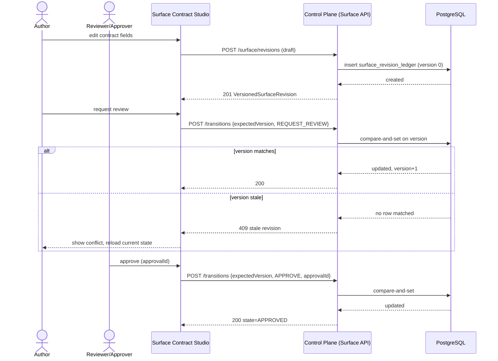
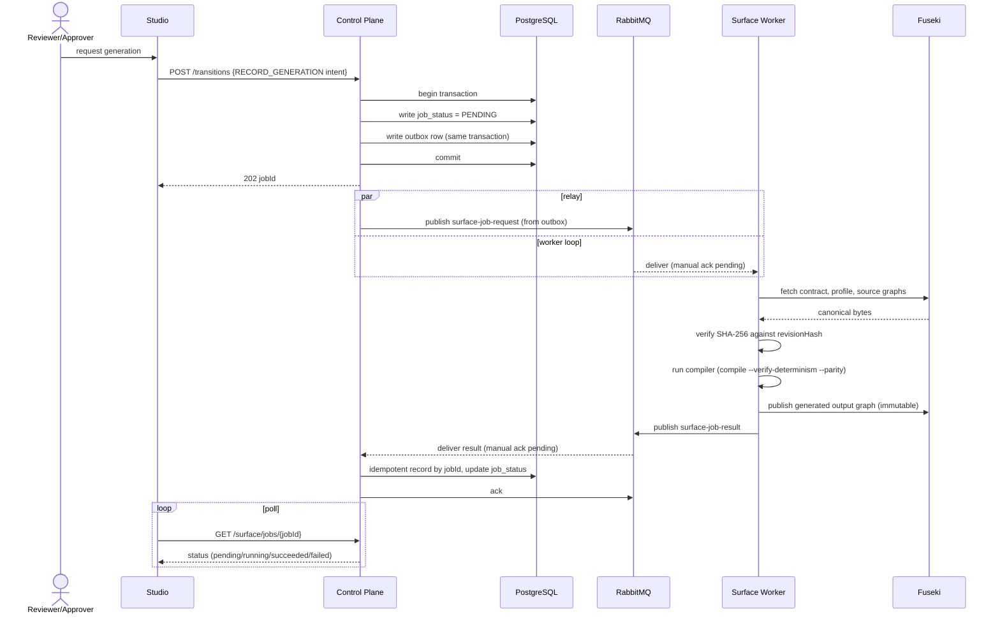
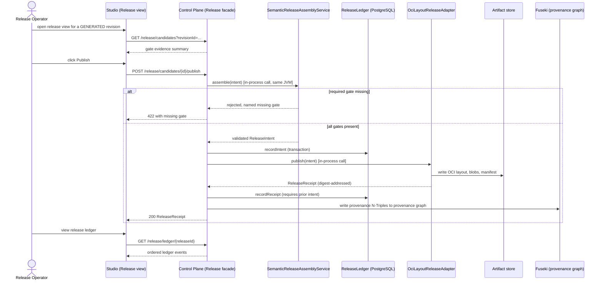
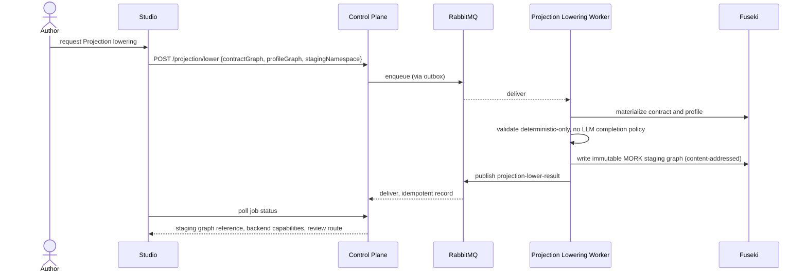
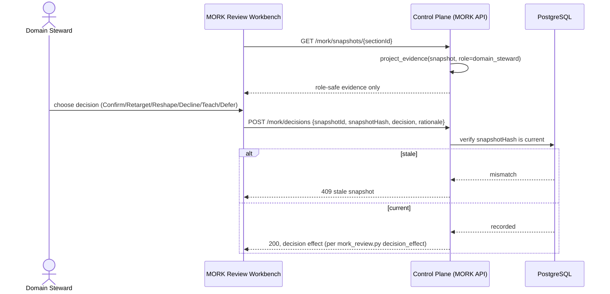
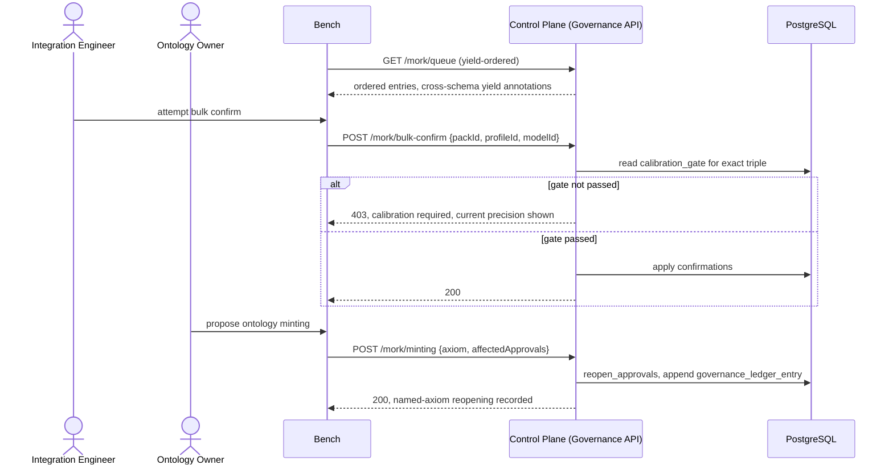
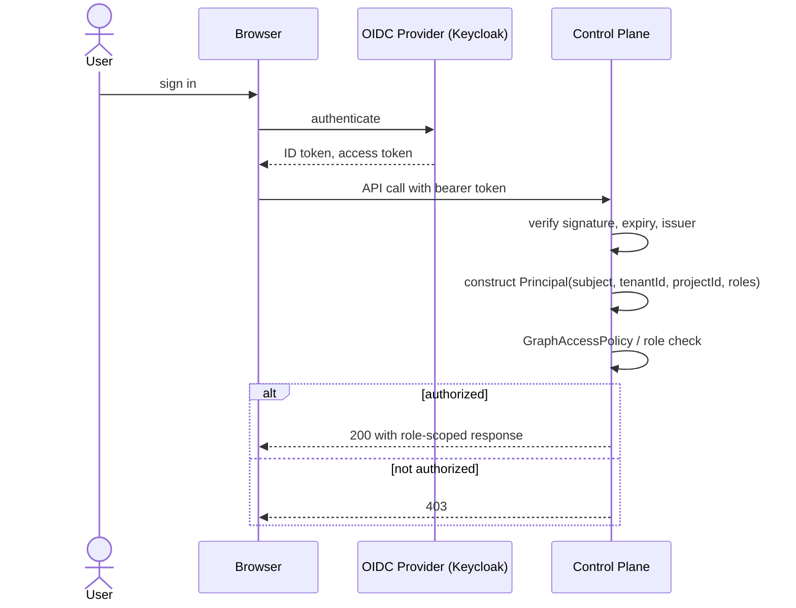
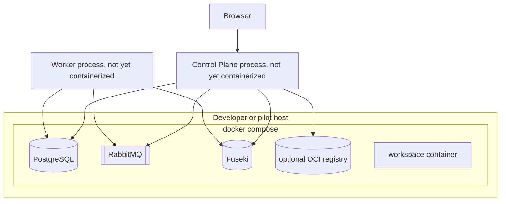

<!-- SPDX-License-Identifier: CC-BY-SA-4.0 -->

# Platform Solution Design Specification

## 0. Purpose, Scope, and Reading Order

This document provides the solution design for a software platform built around the LATTICE ontology stack and MORK mapping pipeline, explaining the various control planes, worker process tier, message and data infrastructure, multiple web applications, and release management approach.

### Supplementary Documents

* ADRs `docs/architecture/decisions` A29 through A43 record individual boundary decisions as they were made.
* Inter-component data contracts are specified under `contracts/` and say what JSON moves between components
* Ontology design and layer semantics, DL encodings, and layer dependency rules stay in the layer READMEs and in [ontology-architecture.md](ontology-architecture.md).
* UX specification in full, in [ux-design.md](ux-design.md)
* Data model in [data-architecture.md](data-architecture.md)

This platform architecture ties all of those together, and is the primary entry point for a reader new to the codebase.

### **Status discipline.** 

This document is maintained as a living design record, alongside the ADR catalogue.Every decision below is marked as one of:

- **Established** — already decided and implemented, cited to its ADR or code.
- **Decided here** — a genuine gap this document closes for the first time. Flagged in [§8](#8-open-decisions-and-adr-backlog) as a candidate for a formal ADR.
- **Deferred** — explicitly out of scope, with the reason stated once.

### Document map

| Document | Covers |
|---|---|
| This document | Capabilities, process design, component design, infrastructure, robustness |
| [data-architecture.md](data-architecture.md) | Conceptual/logical data model, system-of-record matrix, data flows, concurrency rules |
| [ux-design.md](ux-design.md) | UX Design of platform components (e.g., MORK Workbench, Surface Contract Studio) |
| [ontology-architecture.md](ontology-architecture.md) | Ontology layers, DL encodings, layer dependency order |
| [implementation-map.md](implementation-map.md) | Phase-by-phase source file index |
| [semantic-platform.md](semantic-platform.md), [surface-workflow.md](surface-workflow.md), [release-stack-integration.md](release-stack-integration.md), [surface-projection-mork.md](surface-projection-mork.md), [mork-review-workbench.md](mork-review-workbench.md), [mork-queue-calibration-governance.md](mork-queue-calibration-governance.md) | Per-component design notes this document synthesizes and cross-references rather than repeats |
| ADR-A29 through ADR-A43 | Individual accepted decisions this document assembles into one coherent picture |

Read this document top to bottom once, then use it as a reference.

---

## 1. Technical Capability Catalogue

| Capability | Description | Owning component(s) | Primary actors | Sync/Async | Maturity |
|---|---|---|---|---|---|
| Surface contract authoring | Authoring Promotion, Index, and Projection declarations without editing Turtle | Surface Contract Studio, Control Plane Surface API | Author | Sync (edits and transitions) | Fixture UI, API contract defined, no HTTP host |
| Surface lifecycle governance | Draft → Review → Approve → Generate → Release → Supersede with optimistic concurrency | Surface Workflow (`SurfaceRevisionService`, `SurfaceRevisionApi`) | Author, Reviewer/Approver | Sync | Domain logic and API adapter implemented and tested, no HTTP host, no durable persistence wired |
| Immutable graph-family registration | Prevent an IRI from being reused under a different hash, family, or owner | Surface Workflow (`SurfaceGraphFamilyRegistry`) | System (invoked by generation/release flows) | Sync | Implemented (in-memory and JDBC), not wired into a runtime |
| Deterministic compilation, parity, and invalidation | Run the existing Python Surface compiler against materialized graph content | Worker tier (`SurfaceCompilerExecutor`, `surface_jobs.py`) | System | Async | Domain logic implemented and unit tested, no live broker/graph-store wiring |
| Surface-to-MORK Projection lowering | Lower a deterministic Projection contract to an immutable MORK staging graph | Worker tier (`projection_lowering.py`, `projection_contract.py`) | System | Async | Implemented and unit tested, no live wiring |
| Semantic release assembly | Verify required semantic gate evidence before any packaging occurs | Release Integration (`SemanticReleaseAssemblyService`, `SemanticReleaseCoordinator`) | System, triggered by Release Operator | Sync (assembly), then delegates to async/external packaging | Implemented and unit tested, not exposed by any API |
| Release packaging (OCI reference) | Package a release candidate as a digest-addressed OCI Image Layout | Release Integration (`OciLayoutReleaseAdapter`) | System | Sync call, potentially slow (I/O bound) | Implemented and unit tested, no registry/signing integration test |
| Release export and restore | Copy and re-verify an OCI layout as a portable bundle | Release Integration (`OciLayoutBundleService`) | Release Operator | Sync | Implemented and unit tested |
| Release ledger and provenance | Durable record of intent, receipt, and lifecycle events, projected to RDF provenance | Release Integration (`ReleaseLedger`, `ReleaseProvenanceProjector`) | Release Operator, auditors | Sync (write), async (provenance publication, not yet built) | Ledger implemented (in-memory and JDBC), provenance projection implemented, publication to Fuseki not built |
| MORK mapping review and decisioning | Six-verb typed decision model over immutable review snapshots | Worker tier (`mork_review.py`, `mork_review_lifecycle.py`), MORK Review Workbench | Domain Steward, Integration Engineer | Sync (decision recording) | Domain logic implemented and unit tested, UI is fixture-only |
| Role-restricted evidence projection | Prevent Domain Stewards from receiving MCN, syntax, or pack internals | Worker tier (`mork_evidence_projection.py`) | System | Sync | Implemented and unit tested |
| MORK queue, calibration, and governance | Replayable review queue ordering, calibration-gated bulk actions, named-axiom reopening, retrospective challenge | Worker tier (`mork_governance.py`, `mork_governance_ledger.py`) | Ontology Owner, Integration Engineer | Sync (decisions), the queue itself is a read model | Domain logic implemented and unit tested, no durable queue or calibration-run table |
| Graph reference validation | Verify a graph reference's shape and scope before any semantic work proceeds | Worker tier (`graph_validation.py`), Semantic Policy (`GraphAccessPolicy`) | System | Sync | Implemented and unit tested |
| Identity and access control | Resolve verified OIDC claims to a scoped `Principal` | Semantic Policy | System (control plane middleware) | Sync | Domain model implemented, no HTTP middleware, no OIDC provider wired |
| Observability and audit | Make process state, evidence, and decisions inspectable after the fact | Release ledger, review/governance ledgers, [§5.3](#53-observability-and-monitoring) | Release Operator, auditors, operators | N/A (read path) | Ledger data model implemented, no dashboards, metrics, or tracing implemented |

---

## 2. Process Design

### 2.1 Actor Inventory

**Human actors**

| Actor | Product | Decision authority |
|---|---|---|
| Author | Surface Contract Studio | Draft and edit contracts, request review |
| Reviewer / Approver | Surface Contract Studio | Approve a revision for generation |
| Release Operator | Surface Contract Studio (Release view), external release-stack tooling | Trigger packaging and publication, inspect release ledger |
| Domain Steward | MORK Review Workbench | Confirm, Retarget, Decline, Teach, Defer over review-safe evidence |
| Integration Engineer | MORK Review Workbench | + Reshape, section typing, Boundary resolution, template approval |
| Ontology Owner | MORK Review Workbench | Accept/reject minting proposals, retrospective challenges |
| Pack Maintainer | MORK Review Workbench (Studio surface) | Pack release, errata, calibration review, never individual mapping content |

**System actors**

| Actor | Role |
|---|---|
| Control Plane | Authenticated HTTP API, sole writer of operational state, sole enqueuer of async work |
| Worker tier (Python) | Consumes job messages, performs trusted graph materialization and compilation/analysis, publishes result events |
| Relay (outbox) | Moves a durably recorded intent-to-publish into a broker delivery, retrying on failure |
| PostgreSQL | Operational state store |
| Fuseki | Semantic graph store |
| RabbitMQ | Asynchronous transport between Control Plane and workers |
| External release stack | Registry, signing, deployment, GitOps, or workflow system consuming LATTICE's release evidence (ADR-A31), outside this repository's ownership |

### 2.2 The Sync/Async Boundary Rule

**Established as a design rule here, consistent with existing code.** A request is synchronous when it only needs a single transaction to answer (e.g., a PostgreSQL read/write). A request is asynchronous when its duration is not bounded by a database round trip.
| Operation class | Sync or async | Why |
|---|---|---|
| Create/read/transition a Surface revision | Sync | Single-row read, optimistic-concurrency write, no external I/O |
| Register a graph-family artifact | Sync | Single-row insert with a uniqueness check |
| Generation, parity, invalidation | Async | Requires materializing graphs from Fuseki and running the compiler |
| Projection lowering | Async | Same reason |
| MORK analysis | Async | Requires reading the mapping graph and running validation/community analysis |
| Semantic release assembly (`plan`) | Sync | Pure evidence verification against already-recorded data |
| Release packaging (`publish`) | Async from the caller's perspective, because it performs file I/O and optional signing, but implemented as a request-triggered background operation, not a broker job (see [§4.4](#44-release-integration-exposure-the-answer-to-who-calls-this)) |
| MORK review decision recording | Sync | Single-row write against an immutable snapshot hash |
| MORK bulk confirmation | Sync per item, gated by a synchronously checked calibration read | The gate check must complete before any item is confirmed |

### 2.3 Reliability Mechanisms at Actor Boundaries

| Boundary | Mechanism | Failure covered |
|---|---|---|
| Browser → Control Plane | HTTPS, bearer token, typed request/response schemas, `400`/`404`/`409` semantics | Malformed input, missing resource, stale write |
| Control Plane → PostgreSQL | Single transaction per command, optimistic concurrency via version column | Concurrent conflicting writes |
| Control Plane → RabbitMQ | Outbox pattern: the enqueue record is written in the same transaction as the state change, a relay publishes it | Broker unavailable at the moment of the state change, message loss |
| RabbitMQ → Worker | Manual acknowledgement, prefetch limit, dead-letter exchange on poison messages, TTL-based retry queue | Worker crash mid-message, malformed message, transient failure |
| Worker → Fuseki | `GraphMaterializer` verifies SHA-256 of every fetched graph against its `revisionHash` before any compiler invocation | Corrupted or unauthorized graph content |
| Worker → Control Plane (result) | Idempotent result recording keyed by `jobId` plus request digest | Duplicate delivery, at-least-once redelivery |
| Control Plane → external release stack | Immutable digest-addressed receipt, capability negotiation before any operation, explicit rejection of unsupported operations | Release-stack claiming a capability it does not implement |
| Any component → identity | Claims verified at the HTTP boundary only, never trusted from a message body | Identity spoofing through the broker |

### 2.4 Process Maps

Each map states its participants, trigger, and explicit sync/async boundary. Solid arrows are synchronous request/response. Dashed arrows are asynchronous message flow.

#### P1 — Surface Contract Authoring and Lifecycle

All of P1 is synchronous. No message is published until generation is requested (P2).

#### P2 — Surface Generation Job Execution

Everything from "publish surface-job-request" to "publish surface-job-result" is asynchronous. The Studio never blocks on it, it polls.

#### P3 — Surface Release Assembly and Packaging

This directly answers the release-integration exposure question. Full rationale is in [§4.4](#44-release-integration-exposure-the-answer-to-who-calls-this).

`SemanticReleaseAssemblyService`, `ReleaseLedger`, and `OciLayoutReleaseAdapter` are called in-process by the Control Plane. They are a library, not a separate network service. See [§4.4](#44-release-integration-exposure-the-answer-to-who-calls-this) for why, and for what remains external.

#### P4 — Surface Projection Lowering to MORK Staging

No path in P4 can write an active MORK mapping. The worker rejects an `activeMappingGraph` field outright (`projection_lowering.py`). Activation is a MORK governance transition, not reachable from this flow.

#### P5 — MORK Review Decisioning

This is entirely synchronous. Nothing about recording a human decision requires async processing, only the MORK analysis that produced the snapshot (equivalent to P4's shape) was asynchronous.

#### P6 — MORK Queue, Calibration, and Governance

Bulk confirmation is synchronous per request, and the calibration check must complete inside that same request. There is no scenario where a bulk action proceeds before the gate check returns.

#### P7 — Identity and Authorization

A `Principal` is constructed once per request at this boundary and is never accepted as input from a message body or a client-supplied header, per `semantic-policy`'s existing design.

---

## 3. Data Architecture (Summary)

Full detail is in [data-architecture.md](data-architecture.md). The system-of-record answer, repeated here because it is the most-asked question:

| Data | System of record |
|---|---|
| RDF graph content (contracts, profiles, generated output, MORK staging/active mappings) | Fuseki |
| Surface lifecycle state, graph-family registry, job idempotency, release ledger, MORK review/governance ledgers | PostgreSQL |
| Generated output bytes, OCI bundles | Artifact store / OCI registry, addressed by digest |
| Identity and role claims | External OIDC provider, never cached as a writable copy |

No component other than the Control Plane and the worker tier writes any of these stores directly. Browsers never hold a database or broker credential.

---

## 4. Component Design

### 4.1 Component Inventory

| Component | Technology | Deployment unit | Exposes | Calls | System of record for |
|---|---|---|---|---|---|
| Surface Contract Studio | React, TypeScript, Vite | Static bundle served to browser | Nothing (client) | Control Plane HTTPS API | Nothing, holds only in-memory UI state |
| MORK Review Workbench | React, TypeScript, Vite | Static bundle served to browser | Nothing (client) | Control Plane HTTPS API | Nothing |
| Control Plane | Java 21, new HTTP module (decided in [§4.2](#42-control-plane-runtime-decided-here)) | One JVM process per environment | HTTPS JSON API (Surface, Release, MORK) | PostgreSQL (JDBC), RabbitMQ (AMQP), Fuseki (SPARQL/graph store protocol, indirectly through workers only for job execution, directly for read APIs) | Nothing itself, it is the sole writer into PostgreSQL |
| `semantic-dataset-spi` / `semantic-dataset-fuseki` | Java library | Linked into Control Plane and worker-adjacent Java code | N/A (library) | Fuseki | N/A |
| `semantic-policy` | Java library | Linked into Control Plane | N/A (library) | N/A | N/A |
| `platform-outbox` | Java library | Linked into Control Plane | N/A (library) | RabbitMQ (publisher), PostgreSQL (outbox table, once implemented per [data-architecture.md §7](data-architecture.md#7-open-gaps)) | N/A |
| `surface-workflow` | Java library | Linked into Control Plane | N/A (library, `SurfaceRevisionApi` is the transport-neutral boundary) | PostgreSQL | Surface revision ledger and graph-family registry, via the Control Plane |
| `release-integration` | Java library | Linked into Control Plane | N/A (library) | PostgreSQL (ledger), filesystem/OCI registry (packaging), Fuseki (provenance, once wired) | Release ledger, via the Control Plane |
| Worker tier | Python 3.11, `lattice_workers` package | One or more OS processes, containerized | Nothing (consumes from RabbitMQ, publishes to RabbitMQ) | RabbitMQ, Fuseki, PostgreSQL (processed-job store) | Processed-job idempotency table |
| RabbitMQ | Message broker | One broker (clustering deferred, [§7](#7-robustness-reliability-design)) | AMQP | N/A | Transient message state only |
| PostgreSQL | Relational database | One primary instance | JDBC/SQL | N/A | See [§3](#3-data-architecture-summary) |
| Fuseki | RDF triple store | One dataset | SPARQL 1.1, graph store protocol | N/A | RDF graph content |
| External release stack | Not part of this repository | Not part of this repository | Whatever it defines | Reads LATTICE's `ReleaseReceipt` and artifact digests | Registry state, deployment state, signing keys, retention policy |

### 4.2 Control Plane Runtime (Decided here)

**Gap identified.** No HTTP host exists. `contracts/openapi/surface-workflow.openapi.json` describes a contract with no server, and `SurfaceRevisionApi` is a transport-neutral adapter with no transport.

**Decision.** Add one new Maven module, `platform/surface-control-plane`, containing:

- A minimal HTTP runtime (a single well-chosen library, not a full application framework, consistent with the repository's stated preference for thin infrastructure over framework weight in [repository-delivery-foundation.md](repository-delivery-foundation.md)).
- A composition root that wires `SurfaceRevisionApi`, `SemanticReleaseCoordinator`, MORK review/governance services, `GraphAccessPolicy`, and an OIDC token verifier together.
- JSON (de)serialization only at the HTTP edge, mapping directly onto the existing typed request/response records, never a second copy of domain validation.
- One process, one deployment unit, per environment. It is not sharded by product (Surface vs MORK) because both share the same identity, policy, and outbox infrastructure, and splitting them would duplicate that wiring for no isolation benefit at this scale.

This is deliberately the smallest correct answer, not a placeholder for a larger framework decision later. It is flagged in [§8](#8-open-decisions-and-adr-backlog) as ADR-A44.

### 4.3 Component Interaction Patterns

| Pattern | Used between | Contract |
|---|---|---|
| Synchronous HTTPS JSON | Browser ↔ Control Plane | `contracts/openapi/*.json`, `contracts/surface/*.schema.json`, `contracts/mork/*.schema.json` |
| Asynchronous AMQP (CloudEvents-shaped JSON body) | Control Plane ↔ Worker tier | `contracts/events/*.schema.json` |
| In-process Java method call | Control Plane ↔ `surface-workflow`, `release-integration`, `semantic-policy`, `platform-outbox` libraries | Java interfaces, no wire contract |
| JDBC | Control Plane, worker tier ↔ PostgreSQL | SQL migrations under each module's `db/migration` or `sql/` directory |
| SPARQL / RDF graph store protocol | Worker tier, Control Plane read paths ↔ Fuseki | `ScopedDataset` SPI |
| Command-line adapter (`CommandRunner`) | `release-integration` ↔ ORAS, Cosign | Deployment configuration, not a LATTICE contract (ADR-A40) |

### 4.4 Release Integration Exposure: the Answer to "Who Calls This?"

This section exists because the request that produced this document asked it explicitly. `release-integration` is a **Java library**, not a standalone service. It has no network listener of its own and never will, per ADR-A31's constraint that LATTICE does not become a release engine.

**Who calls it.** The Control Plane's Release facade, a thin application service inside `surface-control-plane` (not yet built, see [§4.2](#42-control-plane-runtime-decided-here)), calls `SemanticReleaseAssemblyService.assemble(...)`, then `SemanticReleaseCoordinator.publish(...)` in-process, in the same JVM, in response to an authenticated HTTP request from the Release Operator (`POST /release/candidates/{id}/publish`). No message queue sits in front of it, because assembly and packaging are bounded, deterministic operations over already-recorded evidence, not long-running graph computation.

**How it is exposed.** As an HTTP facade over the library, following the pattern the request describes: "an API acting as a facade in front of something else." The facade's job is authentication, request mapping, and translating `IllegalArgumentException`/`IllegalStateException` into `4xx` responses, exactly as `SurfaceRevisionApi` already does for the workflow module. No new pattern is introduced, the same one is extended to Release.

**Where its evidence goes.**

1. `ReleaseIntent` and `ReleaseReceipt` are recorded in PostgreSQL by `JdbcReleaseLedger`, in the tables named in [data-architecture.md §2.1](data-architecture.md#21-operational-entities-postgresql-realm).
2. `ReleaseProvenanceProjector`'s deterministic N-Triples output is written to a dedicated `provenance` named graph in Fuseki by a new `ProvenanceGraphPublisher` adapter, called immediately after `recordReceipt` succeeds. This adapter does not exist yet, it is the one new piece of wiring this decision requires, flagged in [data-architecture.md §7](data-architecture.md#7-open-gaps).
3. The packaged artifact (OCI layout) is written to a configured directory or, when the optional registry profile is active, pushed by `OrasOciRegistryTransport` to an OCI-compatible registry. Either way, the receipt's digest is the durable reference, not the location.

**Who inspects it, and what they do with it.**

- The **Release Operator** inspects the release ledger through the Studio Release view specified in [ux-design.md §2.4](ux-design.md#24-the-release-view-new-design-not-yet-built). They decide whether to hand the receipt's digest to an external release stack for promotion, using whatever mechanism that stack defines (Docker plus CI, Kubernetes GitOps, or a workflow engine, per [release-stack-integration.md](release-stack-integration.md)).
- **Auditors** query the `provenance` named graph directly, or read the PostgreSQL ledger, to answer "what evidence backed release X" after the fact, without needing to trust the external release stack's own records for that answer.
- **External release-stack tooling** (CI, GitOps controller, or workflow engine) reads only the `ReleaseReceipt`, specifically its immutable digest and environment binding. It never reads the `ReleaseIntent` or the provenance graph, because those are LATTICE's evidence, not deployment instructions. This is the boundary ADR-A31 sets, restated here as a concrete calling contract rather than a principle.

**What remains explicitly external.** Registry storage lifecycle, signing key custody, deployment mechanics, and retention enforcement remain the responsibility of whatever release stack is configured. `release-integration` proves LATTICE's own evidence was correct before handing off, it does not and will not perform the handoff's downstream steps itself.

### 4.5 RabbitMQ Topology (Decided here)

**Gap identified.** `platform-outbox`'s `RabbitMqEventPublisher` declares one exchange and one dead-letter exchange per call site, ADR-A37 covers acknowledgement semantics, but no document specifies the full topology across job families.

**Decision.** One topic exchange and one retry/dead-letter pair per job family, following the pattern already coded in `RabbitMqEventPublisher.declareTopology`:

| Job family | Primary exchange | Primary queue | Routing key | Retry mechanism | Dead-letter queue |
|---|---|---|---|---|---|
| Surface jobs | `lattice.surface.jobs` (topic) | `lattice.surface.jobs.q` | `surface.<jobType>` | Failed delivery nacked with `requeue=false`, republished to `lattice.surface.jobs.retry` with a per-message TTL, dead-lettered back to the primary exchange on expiry, capped at a configured retry count via a header counter | `lattice.surface.jobs.dead` |
| Projection lowering | `lattice.projection.lower` | `lattice.projection.lower.q` | `projection.lower` | Same pattern | `lattice.projection.lower.dead` |
| MORK analysis | `lattice.mork.analysis` | `lattice.mork.analysis.q` | `mork.analysis` | Same pattern | `lattice.mork.analysis.dead` |
| Graph validation | `lattice.graph.validation` | `lattice.graph.validation.q` | `graph.validate` | Same pattern | `lattice.graph.validation.dead` |
| Result events (all families) | `lattice.results` (topic) | one queue per Control Plane consumer group | `result.<jobFamily>` | Same pattern, consumed by the Control Plane, idempotent by `jobId` | `lattice.results.dead` |

Rules that apply uniformly:

- Every primary queue is declared durable, with `x-dead-letter-exchange` pointing at its family's retry exchange, matching the existing `declareTopology` shape.
- Consumers use manual acknowledgement and a bounded prefetch count (starting value 10, tunable per deployment), never auto-ack, per ADR-A37.
- A message that exceeds its retry cap moves to the family's `dead` queue and requires an operator replay action, it is never silently dropped.
- Malformed messages (fails to parse as JSON, fails schema validation) are nacked with `requeue=false` immediately, they do not consume a retry attempt, matching `RabbitMqSurfaceWorker`'s existing behavior.
- Result publication carries the original `correlationId`, so the Control Plane can join a result back to the request that caused it without a separate lookup.

### 4.6 Failure Modes

| Component | Failure | Detection | Containment | Recovery |
|---|---|---|---|---|
| Control Plane | Process crash mid-request | Health check fails, connection reset to client | Client retries idempotent GETs, non-idempotent POSTs surface a clear error for the user to retry | Restart, PostgreSQL transaction guarantees no partial write survived |
| PostgreSQL | Unavailable | Connection failures on every query | Control Plane returns `503`, does not fall back to writing anywhere else | Restore service, no in-memory queue of missed writes because the outbox pattern only applies to already-committed rows |
| RabbitMQ | Unavailable | Outbox relay publish fails | Outbox row remains `PENDING`, is retried by the relay on its next pass | Relay resumes once broker is reachable, no message is lost because nothing was removed from the outbox until publish succeeded |
| Worker process | Crash mid-job | Message redelivered after visibility/ack timeout | At-least-once redelivery, `SurfaceJobConsumer` deduplicates by `(jobId, requestDigest)` | Worker restarts, resumes consuming, duplicate delivery replays the cached result instead of recompiling |
| Fuseki | Unavailable | Worker's materialization call fails | Job fails with a safe diagnostic, message is nacked with `requeue=true` for the retry path | Service restored, retried job proceeds normally |
| Graph hash mismatch | Corrupted or tampered graph content | `GraphMaterializationError` raised before compiler invocation | Job fails safely, no compiler execution occurs on unverified content | Investigate the dataset, this is treated as a data-integrity incident, not a routine retry |
| External release stack | Rejects or fails to acknowledge a published artifact | Release Operator observes the release ledger has no corresponding external confirmation | LATTICE's own ledger already recorded the intent and receipt regardless, so the semantic evidence is not lost | Operator retries the external stack's own process, LATTICE's evidence does not need to be regenerated |
| Calibration gate stale or missing | Bulk confirmation attempted for an untested pack/profile/model triple | `require_bulk_gate` raises `CalibrationRequiredError` | Bulk action is blocked outright, per-item review remains available | A new calibration run must pass before bulk action is re-enabled |

---

## 5. Infrastructure Design

### 5.1 Deployment Topology

**Reference environment (today, Docker Compose):**

The Control Plane and worker processes are not yet containerized or added to Compose, they currently run only as Maven/`pytest` test targets. Adding them as Compose services is required before the pilot in [the platform continuation status](../developer/status/platform-continuation.md) can run end to end, and is tracked there, not duplicated here.

**Target shape (unchanged topology, hardened operational posture):** the same component graph, with PostgreSQL and RabbitMQ given persistent volumes and restart policies, Fuseki given a backup schedule for its dataset directory, and the Control Plane and worker tier each given their own container image with health checks. No additional component is introduced, this is an operational maturity step, not an architecture change, consistent with the single-writer, single-broker posture justified in [§7](#7-robustness-reliability-design).

### 5.2 Moving Parts and Communication Matrix

| From | To | Protocol | Port (reference environment) | Auth |
|---|---|---|---|---|
| Browser | Control Plane | HTTPS | 443 (TLS terminated by deployment, plain HTTP in local dev) | Bearer token (OIDC access token) |
| Control Plane | PostgreSQL | PostgreSQL wire protocol | 5432 | Username/password (development credentials in Compose, secret-managed in any shared environment) |
| Control Plane | RabbitMQ | AMQP 0-9-1 | 5672 | Username/password |
| Control Plane | Fuseki | HTTP (SPARQL, graph store protocol) | 3030 | Admin password for administrative endpoints, dataset-level access otherwise |
| Worker tier | RabbitMQ | AMQP 0-9-1 | 5672 | Username/password |
| Worker tier | Fuseki | HTTP | 3030 | Same as above |
| Worker tier | PostgreSQL | PostgreSQL wire protocol | 5432 | Username/password |
| Release Integration (in Control Plane) | OCI registry (optional) | HTTPS/OCI distribution spec | 5000 (reference) | Registry credentials, external to LATTICE |
| Control Plane | OIDC provider | HTTPS, OIDC discovery | Provider-defined | Client credentials for token verification (JWKS fetch), never a shared secret with end users |

### 5.3 Observability and Monitoring

**Not yet implemented. Sketch only, decided here as the target shape.**

| Concern | Approach |
|---|---|
| Logs | Structured JSON logs from the Control Plane and worker tier, correlation ID propagated from the originating HTTP request through the outbox event, the broker message, and the result event, so one correlation ID greps a full request's lifecycle across both runtimes |
| Metrics | Per-component counters and histograms: request rate and latency per endpoint (Control Plane), queue depth and consumer lag per queue (RabbitMQ), job duration and outcome counts per job type (worker tier), dead-letter queue depth as a first-class alerting signal |
| Traces | A single trace ID carried as the CloudEvents `correlationid` extension already present in `platform-outbox`'s `CloudEvent` model, extended to worker-side spans, so a distributed trace view is possible without a new identifier scheme |
| Health checks | Liveness (process up) and readiness (dependencies reachable: PostgreSQL, RabbitMQ, Fuseki) endpoints on the Control Plane and worker tier, matching the pattern Compose already uses for its own service health checks |
| Audit visibility | The release ledger, MORK review ledger, and governance ledger are the audit trail, not a separate logging pipeline. Any dashboard for "what happened and who decided it" reads these tables, per [data-architecture.md §6](data-architecture.md#6-retention-immutability-and-lifecycle) |
| Alerting | Dead-letter queue depth greater than zero, calibration gate failing for an actively-used pack/profile/model triple, and release receipt recorded without a corresponding provenance graph write, are the three alerts with the highest signal value given this platform's failure modes |

### 5.4 Environments

| Environment | Purpose | Difference from reference |
|---|---|---|
| Local development | Individual implementation work | Exactly the Compose stack in [§5.1](#51-deployment-topology) |
| Pilot (seeded, local) | The author and reviewer pilot described in [the platform continuation status](../developer/status/platform-continuation.md) | Adds seeded demo identities and fixture scenarios, still single-host Compose |
| Future shared/production | Not yet planned in detail | Would add TLS termination, secret management, persistent volumes, and the hardening in [§5.1](#51-deployment-topology)'s target shape, deliberately deferred until the pilot proves the design |

---

## 6. UX Design

Full design is in [ux-design.md](ux-design.md), which covers the MORK Review Workbench (canonically [MORK UXD](../../ontology/mork/docs/MORK%20UXD.md)) and the newly authored Surface Contract Studio design at equivalent depth, including the Release view this document's [§4.4](#44-release-integration-exposure-the-answer-to-who-calls-this) requires. The cross-cutting principle repeated here because it governs every process map in [§2](#2-process-design): role perimeters and evidence redaction are enforced server-side, the browser never receives data it must hide from itself.

---

## 7. Robustness (Reliability) Design

### 7.1 Framing: Why CAP Applies Narrowly Here

The CAP theorem describes a tradeoff that only manifests under a network partition between replicas of the same data. This platform, as scoped, runs one authoritative PostgreSQL instance, one authoritative Fuseki dataset, and one RabbitMQ broker per environment. It is not a multi-region, multi-writer, or multi-replica system. That is a deliberate boundary, not an oversight, because the product is a single-tenant-operator "studio" environment, not a globally distributed service.

Given that scope, the request's aim to achieve C (Consistency) and A (Availability) is satisfied by construction in the absence of a partition, because there is only one partition-capable link in the whole system worth naming: the network path between the Control Plane and its data stores within one environment. The robustness design therefore focuses on what actually threatens this platform: component crashes, message loss, stale concurrent writes, and duplicate delivery, not multi-node network partitions.

### 7.2 Consistency Mechanisms

| Mechanism | Guarantees |
|---|---|
| Single-writer-per-table rule ([data-architecture.md §5](data-architecture.md#5-data-sharing-and-concurrent-access-rules)) | No two components can produce conflicting writes to the same row |
| Optimistic concurrency (`revision_version`, snapshot hash) | A stale read can never silently overwrite a newer state, it always surfaces as a conflict |
| Single PostgreSQL transaction per command | A lifecycle change and its outbox row are committed atomically, once the outbox is PostgreSQL-backed per [data-architecture.md §7](data-architecture.md#7-open-gaps) |
| Immutable graph-family registration | The same IRI can never silently change meaning underneath a component that already resolved it |
| Idempotent job and result recording | At-least-once delivery never produces at-least-once side effects, exactly-once effect is achieved through deduplication rather than exactly-once delivery |
| Ledger foreign-key ordering (receipt requires prior intent) | Evidence cannot be recorded out of causal order |

### 7.3 Availability Mechanisms

| Mechanism | Guarantees |
|---|---|
| Retry with dead-letter fallback ([§4.5](#45-rabbitmq-topology-decided-here)) | A transient failure in one job does not block the queue, and a poison message does not loop forever |
| Outbox pattern | A broker outage does not lose a committed state change, it delays its downstream propagation |
| Graceful degradation on dependency failure ([§4.6](#46-failure-modes)) | The Control Plane returns a clear error rather than hanging or corrupting state when a dependency is down |
| Bounded prefetch and manual ack | A worker crash does not lose in-flight work, it becomes redeliverable |
| Read APIs served from PostgreSQL, not from a live Fuseki round trip for lifecycle state | Lifecycle visibility in the UI degrades gracefully even if Fuseki is briefly unavailable, only graph-content-dependent views are affected |

### 7.4 Explicit Non-Goals (Deferred, With Reason)

| Non-goal | Reason |
|---|---|
| Multi-region deployment | Not required by the product's scope as a single-operator studio environment, would add partition-tolerance concerns this design does not need to solve yet |
| Multi-writer PostgreSQL or Fuseki | Would reintroduce true CAP tradeoffs for no benefit at current scale, single-writer is simpler and sufficient |
| RabbitMQ clustering/mirrored queues | Adds operational complexity, appropriate once a single broker's availability is demonstrated to be the binding constraint, not before |
| Real-time push (WebSocket/SSE) for job progress | Polling is sufficient at this scale and keeps the Control Plane's transport surface to one protocol, revisit only if polling latency becomes a measured user complaint |
| Automatic cross-environment failover | No second environment exists to fail over to yet, this is a prerequisite of the deferred production environment in [§5.4](#54-environments), not of the current design |

---

## 8. Open Decisions and ADR Backlog

Every "Decided here" item above should be ratified as a formal ADR before implementation proceeds past the current pilot slice, per the repository's own documentation discipline.

| Candidate ADR | Decision | Section |
|---|---|---|
| ADR-A44 | Control Plane HTTP runtime choice, module boundary, and composition-root ownership | [§4.2](#42-control-plane-runtime-decided-here) |
| ADR-A45 | RabbitMQ exchange/queue/retry topology across job families | [§4.5](#45-rabbitmq-topology-decided-here) |
| ADR-A46 | Release Integration exposure as an in-process library behind a Control Plane facade, and provenance-graph publication | [§4.4](#44-release-integration-exposure-the-answer-to-who-calls-this) |
| ADR-A47 | Job status/progress model (persisted state machine, polling API, no push transport yet) | [§2.4 P2](#p2--surface-generation-job-execution), [§7.4](#74-explicit-non-goals-deferred-with-reason) |
| ADR-A48 | CAP posture: single-writer, single-broker, partition tolerance explicitly deferred | [§7.1](#71-framing-why-cap-applies-narrowly-here) |
| ADR-A49 | Surface Studio Release view as the human-facing surface for release evidence | [ux-design.md §2.4](ux-design.md#24-the-release-view-new-design-not-yet-built) |

---

## 9. Traceability Matrix

Ties every capability to the component, data, process, and UX surface that realizes it, for audit and for onboarding.

| Capability | Component(s) | Data (system of record) | Process map | UX surface |
|---|---|---|---|---|
| Surface contract authoring | Studio, Control Plane Surface API | `surface_revision_ledger` | P1 | Studio Portfolio/Editor |
| Surface lifecycle governance | `surface-workflow`, Control Plane | `surface_revision_ledger` | P1 | Studio Editor |
| Graph-family registration | `surface-workflow` | `surface_graph_artifact` | P2 | Studio Inspector |
| Compilation, parity, invalidation | Worker tier | Fuseki (`GENERATED_OUTPUT`, `INVALIDATION_PLAN`), artifact store | P2 | Studio Editor/Inspector |
| Projection lowering | Worker tier | Fuseki (MORK staging graph) | P4 | Studio Technical Inspector panel |
| Semantic release assembly and packaging | `release-integration`, Control Plane facade | `release_ledger_*`, artifact store, provenance graph | P3 | Studio Release view |
| MORK review decisioning | Worker tier, Control Plane MORK API | `mork_review_snapshot`, `mork_review_decision` | P5 | Bench |
| MORK queue/calibration/governance | Worker tier, Control Plane Governance API | `governance_ledger_entry`, calibration gate state | P6 | Atlas, Boundary, Ledger, Studio (Pack Maintainer) |
| Identity and access control | `semantic-policy`, Control Plane middleware | External OIDC provider | P7 | All authenticated surfaces |
