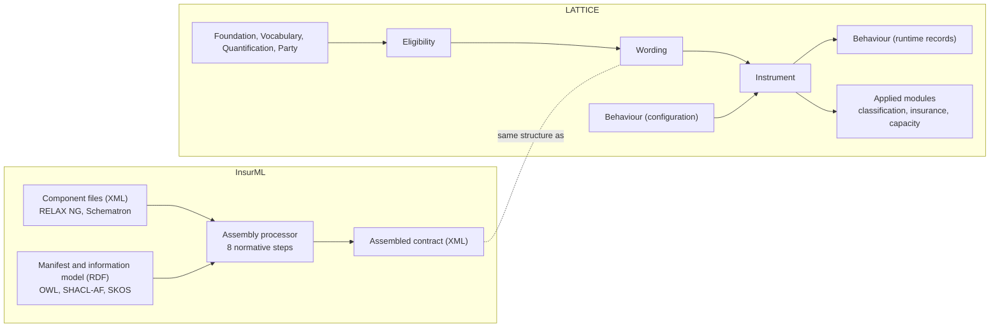

# InsurML and LATTICE compared

**Status:** analysis, 2026-10-05. Not a decision and not a plan. Local working document.
**Companion:** [insurml-integration.md](insurml-integration.md), which takes the
findings here and works out how the two can be used together.

**Inputs.** The InsurML Specification, Draft 1.0 of 4 October 2026, owner John Cummins, Axiome
Partners (`.local/sketches/insureml-spec.md`). LATTICE as it stands on `main` on the same date:
the ontology layers and their literate READMEs, the accepted and proposed ADRs, the plans and
status records of the CCS, AIR and NRS epics, and the sketches they cite.

---

## Contents

0. [Findings in brief](#0-findings-in-brief)
1. [Scope, method and caveats](#1-scope-method-and-caveats)
2. [What each one is for](#2-what-each-one-is-for)
3. [A shared ancestor](#3-a-shared-ancestor)
4. [Architecture side by side](#4-architecture-side-by-side)
5. [Construct by construct](#5-construct-by-construct)
6. [What LATTICE models that InsurML does not](#6-what-lattice-models-that-insurml-does-not)
7. [What InsurML models that LATTICE does not](#7-what-insurml-models-that-lattice-does-not)
8. [Terms that collide](#8-terms-that-collide)
9. [Maturity](#9-maturity)
10. [What each can and cannot do](#10-what-each-can-and-cannot-do)
11. [Tooling needed to run each](#11-tooling-needed-to-run-each)
12. [Gaps worth closing, per side](#12-gaps-worth-closing-per-side)
13. [Uncertainties and things to confirm](#13-uncertainties-and-things-to-confirm)

---

## 0. Findings in brief

1. **They share an ancestor.** InsurML's four classes (Contract, ComponentGroup, Component,
   DataElement), its embedded and governing variables, `applicableTo`, its LWR codes and its use of
   the LMA's CBAA Module 12 match the LMA Wording Information Model that Open CBAA encoded as
   `wim:` and that LATTICE's Wording layer absorbed (ADR-A112, CCS sketch §3.2, CC-D3). The two are
   siblings with different upbringings, not strangers. This is an inference from the evidence in §3
   and should be confirmed with the InsurML owner.
2. **They answer different questions.** InsurML answers how a contract document is built from
   parts, identified, checked and published. LATTICE answers what a contract means, who owes what
   to whom, under which conditions, and what state it is in now. They overlap in one place, the
   structure of wording, which is LATTICE's Wording layer.
3. **In the overlap, each is ahead on different things.** InsurML is ahead on the document: a
   complete XML vocabulary with normative schemas, lists, presentational tables, conditional
   phrases inside a sentence, dependencies between clauses, generated numbering, a normative
   processing model with its error cases, valid and invalid test fixtures and real market text.
   LATTICE is ahead on the model: library and instance kept apart, per-instance value records,
   admissible values, a full condition algebra, design-time checks on alternatives, five amendment
   operations recorded with PROV, semantic tables, and keys separate from identity.
4. **Outside the overlap there is nothing to compare on InsurML's side.** Legal relations, regimes
   and state, parties and shares, quantities and units, scoped vocabulary binding, eligibility
   decisions, evidence and provenance have no InsurML counterpart, by design. InsurML puts
   evaluating user input and building contracts out of scope (D51).
5. **Reuse is modelled in opposite places.** InsurML puts order and condition on the inclusion
   entry, an edge, so one component version can sit in many groups and contracts under different
   conditions. LATTICE puts rank key, inclusion mode and condition on the element, a node, and law
   W1 gives an element one parent up to versions. LATTICE reuses wording through library forms and
   `wrd:includes`. InsurML reuses it through a pool of components. This is the most consequential
   modelling difference between the two.
6. **References resolve differently.** InsurML resolves a defined-term reference to whichever
   version of the target is in the contract's scope, by shared identifier (D84). LATTICE's
   `wrd:refersToObject` names a version.
7. **Instances are identified only in LATTICE.** InsurML identifies contract versions, not issued
   policies. An assembled contract carries the contract version's IRI, and the format of a
   policy's settings is open (Q33). LATTICE separates the library form (`wrd:Wording`) from each
   instance (`wrd:AssembledWording`) and records every value (`wrd:VariableValue`).
8. **InsurML's condition is one case of LATTICE's.** InsurML tests that one governing variable
   equals one value. Eligibility adds set membership, interval containment, hierarchical match with
   exclusions, negation, AllRequired and AnySufficient, and a third value, Undetermined. InsurML
   anticipates a fuller set itself (D52, D57).
9. **Several names collide.** Exclusion, Condition, Variant, Section, Endorsement, Definition,
   Scope and Contract mean different things on each side. A mapping written from names alone will
   be wrong in places that tests built from names will not catch (§8).
10. **Neither runs end to end today.** InsurML has schemas, checkers and a worked assembler, but
    no production assembler, contract builder, settings format, publishing pipeline or semantic
    runtime. LATTICE has ontologies, compilers and platform modules, but no wording assembler,
    renderer, XML ingress or egress, wording editor or runtime evaluator (CCS C12), and its user
    interfaces are fixtures (§11).
11. **Maturity is not one number.** InsurML is one draft edition with one owner, restricted
    distribution and a placeholder base IRI, but it is internally consistent and checked by
    executable tests. LATTICE has release governance and many accepted ADRs, but Wording and
    Instrument are at major version zero, Instrument is mid-rewrite (C7b to C9), and the insurance
    contract module is deferred (AIR Phase 5) (§9).
12. **Integration is low in conflict at the meta level.** Both use RDF, SKOS typing in place of
    classes, SHACL, rules held as data and versions as resources. The companion document works this
    through.

---

## 1. Scope, method and caveats

The comparison covers four things. The information models, construct by construct. What each can
do. How mature each is. What software each needs before it is usable in a running system.

**Method.** Every InsurML statement is taken from its specification and cites the decision number
(Dnn), pattern (Rnn) or open question (Qnn) the specification gives. Every LATTICE statement cites
the README section, law, ADR or plan slice it comes from. Where a claim is an inference rather than
something either side states, it is marked as such.

**Caveats.**

- Only InsurML's specification was available. Its ontology (`ontology/insurml-core.ttl`), shapes
  (`ontology/shapes.ttl`), vocabularies, schemas, tools and examples were not. The specification
  reproduces generated reference tables of the ontology, shapes and vocabularies, which this
  analysis relies on. Behaviour of the shapes themselves (their SPARQL, their targets) is unknown.
- InsurML is a working draft "not for release". It quotes AXA wordings and LMA draft clauses whose
  distribution permissions are unsettled. Nothing from it should enter the tracked LATTICE
  repository until that is resolved (§13).
- LATTICE is moving. The versions compared are Foundation 0.4.0, Vocabulary 0.4.0, Quantification
  0.6.0, Party 0.6.0, Eligibility 0.8.0, Wording 0.4.0, Behaviour 0.11.0 (configuration and
  runtime) and Instrument 0.10.0. CCS slices C7b, C7c, C8, C8a, C9 and C12 to C17 are not built.
  AIR Phase 5, which holds the insurance contract module and the LMA WIM profile, is deferred.
- The roadmap is read from plans and sketches. A sketch is not a commitment, and this analysis
  says which LATTICE capabilities are built and which are planned.

---

## 2. What each one is for

| | InsurML | LATTICE |
|---|---|---|
| Kind of thing | an XML markup language for commercial insurance contracts, with an RDF information model for assembly | a layered RDF/OWL/SHACL substrate for governing documents in any domain, with applied modules per domain |
| Domain | commercial insurance only (policies and agreements such as binding authorities) | domain-neutral layers. Insurance lives in `ontology/applied/insurance/` and in Open CBAA downstream |
| Central question | how is a contract document assembled from reusable parts, and how are those parts marked up, identified, validated and published | what does a contract mean, between whom, under which conditions, with which amounts, and in what state is it now |
| Unit of reuse | a component version, held in its own XML file | a library form's element version, and a stated term owned by it |
| Where content lives | XML files, one per component version | RDF, with text as ordered text parts |
| Where structure lives | RDF manifest (order, conditions, scope, inheritance) | RDF (`wrd:directlyComprises`, `wrd:rankKey`, `wrd:includes`) |
| Where meaning lives | in the type of a component (Coverage, Exclusion, Condition) and in prose | in Instrument terms and legal relations, Eligibility conditions, Behaviour regimes and Quantification values |
| Out of scope | evaluating user input, building contracts (D51), presentation and house style | rendering and publishing, document markup, assembly as a running service (none built) |
| Primary users | wording authors, product teams, publishers, contract-building software vendors | ontology and platform engineers, applied-ontology authors, adopters building contract systems |

The design principles are close in spirit. InsurML's principles (§1.6 of its specification) are
IRIs throughout, one class typed by vocabulary, rules as data, the graph assembles while the XML
holds content, optionality as an attribute, and one way to write each thing. LATTICE carries
Open CBAA's DP1 (thin T-Box, governed A-Box vocabulary), DP2 (class or concept), DP8 (every
concept-valued property names a scheme contract) and DP10 (identity is not position) into the
substrate (CCS sketch §3.1). Rules as data and typing by concept are common ground.

---

## 3. A shared ancestor

The evidence that InsurML and LATTICE's Wording layer descend from the same model:

| Evidence | InsurML | LATTICE |
|---|---|---|
| Four object levels | `iml:Contract`, `iml:ComponentGroup`, `iml:Component`, `iml:DataElement` from "Appendix A" of the InsurML brief and the "Information Modelling deck" | Open CBAA's `wim:WordingObject ≡ Contract ⊔ ComponentGroup ⊔ Component ⊔ DataElement`, which became `wrd:Wording` and `wrd:Element` with the four levels kept for an LMA WIM profile (CCS sketch §3.2, CC-D3) |
| Variables | embedded and governing, as SKOS types (D63) | `wim:EmbeddedVariable`, `wim:GoverningVariable`, now `wrd:` classes |
| Applicability | `iml:applicableTo` from Appendix A's colour coding, provisional (Q31) | `wim:applicableTo`, assigned to the LMA WIM profile (C3-Q2) |
| LMA codes | `iml:lwrPublishingCode`, `iml:lwrVariantCode` ("LMA reference code", deck slides 12 and 13) | Open CBAA's `lma:` WIM typing schemes, assigned to the profile (CCS sketch §3.2) |
| Example corpus | LMA CBAA Module 12 drafts | Lloyd's CBAA collateral and Open CBAA's Module 12 lifecycle (CCS sketch §3.2, the `agr` M12 row) |
| Relations | "are building blocks of", "drive value of", "can reference" (deck slide 6) | `wim:directlyComprises`, `wim:populatedFrom`, `wim:refersToObject`, now `wrd:` |

**Inference.** Both encode the LMA's Wording Information Model, InsurML as a markup standard with
an RDF manifest, Open CBAA as an OWL module that LATTICE then generalised beyond insurance. If
that holds, LATTICE's planned LMA WIM profile (AIR-5.9) and InsurML's information model describe
the same thing, and building the profile without reference to InsurML would duplicate it.

**Where they diverged.** Open CBAA, and LATTICE after it, moved meaning out of wording types into a
separate stratum (DP3, which became the Wording and Instrument layers). InsurML kept meaning in
component types ("types by legal intent are component types in their own right", D111) and
retired the type Clause (D148). LATTICE's baseline element types keep Clause
(`wrd-voc:Clause`) because a clause is a structural unit in the domain-neutral layer and its legal
effect is stated in Instrument.

---

## 4. Architecture side by side

| Layer of concern | InsurML | LATTICE |
|---|---|---|
| Identity and versions | IRI policy with patterns R0 to R12, versions as dated IRIs (D23, D67) | Foundation: `fnd:Version`, `fnd:PersistentIdentity`, `fnd:supersededBy`, keys (ADR-A114). Identity patterns chosen per deployment (ADR-A82) |
| Controlled vocabulary | SKOS schemes, `iml:typeScheme`, `iml:attributeScheme` | Vocabulary: `voc:SchemeContract`, scoped and time-bounded `voc:SchemeBinding` with precedence (ADR-A85) |
| Values and units | `amount` with an ISO 4217 currency, datatypes on variables | Quantification: value spaces, units, conversions, bounds, ranges, range sets, unresolved values, declared operations |
| Parties | none (agents are an open IRI item, O1) | Party: actors, roles, occupancies, participation groups with shares, delegation |
| Conditions | variable equals value (D81) | Eligibility: five match strategies, three compatibility operations, negation, evidence bindings, three-valued decisions |
| Document structure | manifest plus XML markup | Wording |
| Legal meaning | component type, and prose | Instrument: terms, stated and bound meaning, five legal relations, qualifiers, legal triggers, regimes |
| Behaviour over time | none | Behaviour: state spaces, transitions, guards, effects, allowances, occasions, nested states, runtime records |
| Restatement and indexing | stored SPARQL queries for inheritance (D83) | Surface: promotion and index contracts, generated and disposable |
| Mapping external sources | none | MORK, with compilers and a review workbench |
| Storage configuration | file layout `components/{id}/{date}.xml` (D85) | Persistence: aggregate boundaries, concurrency, ordering, receipts |

---

## 5. Construct by construct

Each table gives the InsurML construct, its nearest LATTICE construct, and a verdict on how close
they are: **same** (one can be read as the other), **close** (a convention bridges them), **partial**
(one covers part of the other), **none** (no counterpart).

### 5.1 Objects and containment

| InsurML | LATTICE | Verdict | Notes |
|---|---|---|---|
| `iml:Contract` (a policy or agreement wording, a version) | `wrd:Wording`, a library form | close | an InsurML contract is a configurable wording. LATTICE's per-instance `wrd:AssembledWording` has no InsurML class (§5.4) |
| `iml:ComponentGroup` (Module, Section, Sub-section, Schedule, Clause Group, Complex Component), no text of its own (D112) | `wrd:Element` typed by concept | close | LATTICE elements may carry text. InsurML puts a group's introductory text in an Introduction component |
| `iml:Component`, its own XML file, contains at least one data element (D66, D89) | `wrd:Element` | close | LATTICE has no rule that a part holds content |
| sub-component, a role not a class (D14) | an element directly comprised by an element | same | |
| `iml:DataElement`, an RDF resource only when referenced (D39) | `wrd:Text`, `wrd:Table`, `wrd:Variable`, `wrd:Reference`, `wrd:Metadata`, `wrd:Field`, `wrd:Entry` | partial | every LATTICE content element is an RDF resource. InsurML keeps most data elements in XML |
| `iml:hasSubComponent`, `iml:hasDataElement` | `wrd:directlyComprises` (and `wrd:comprises`, its closure) | same | LATTICE has one part-whole edge, InsurML has several |
| cardinalities: a contract and group hold at least one component, a component at least one data element (D66) | none | none | LATTICE states no minimum content |
| `para` nests for nested clauses, and text may continue after a list inside it (G33) | `wrd:Text` holds text parts, child elements are separate parts | partial | LATTICE cannot place a child element at a point inside a text's run of parts (§7) |

### 5.2 Typing

| InsurML | LATTICE | Verdict | Notes |
|---|---|---|---|
| one class per structure, typed by SKOS concept (D63, D118) | the same principle: `wrd:elementType` and `wrd:classification` take concepts (ADR-A112, DP2) | same | |
| `iml:hasType` | `wrd:elementType` (functional) and `wrd:classification` (any number) | close | InsurML allows typing at any depth of one scheme. LATTICE separates "what kind of part" from "how classified" |
| `iml:typeScheme`, `iml:typeConcept` on classes | `voc:SchemeContract` with `voc:constrainsProperty`, bound by `voc:SchemeBinding` | close | LATTICE binds a scheme to a property, scoped and time-bounded, with precedence. InsurML fixes a scheme per class |
| publisher concepts in their own scheme, linked by `skos:broader` to an InsurML concept (§9.1) | a deployment binds its own scheme, which may extend the baseline (Wording §6) | partial | cross-scheme `skos:broader` sits awkwardly with Eligibility's hierarchical match, which closes over the bound scheme's members only (ADR-A100) |
| a concept belongs to exactly one scheme (`imlsh:ConceptShape`) | not required | partial | |
| deprecated types are rejected (Clause, D148) | Vocabulary's governance states (`fnd:GovernanceState`, `voc:requiresGovernanceState`) | close | |
| component types by legal intent (Coverage, Exclusion, Condition, Insuring Clause, Limit) | Instrument's relation classes and qualifiers, plus `wrd:classification` | partial | LATTICE says what a clause does in law with relations, not with a type (§8) |
| `iml:applicableTo` (contract types a type applies to), provisional (Q31) | planned in the LMA WIM profile (C3-Q2, AIR-5.9) | same, planned | |

### 5.3 Identity, versions and variants

| InsurML | LATTICE | Verdict | Notes |
|---|---|---|---|
| every contract, group and component IRI is a version (D67) | every `wrd:Wording` and `wrd:Element` is an `fnd:Version` | same | |
| `dcterms:identifier`, a slug shared by all versions | `fnd:hasIdentity` to a `fnd:PersistentIdentity`, with keys on it (`fnd:naturalKey`, ADR-A114) | close | InsurML has no identity resource. A slug is a natural key in LATTICE terms |
| `iml:version`, a date with `-2`, `-3` suffixes (D23) | none on instances. Ontology documents use SemVer (ADR-A86) | partial | LATTICE does not prescribe how an instance version is labelled |
| `iml:previousVersion` | inverse of `fnd:supersededBy` (functional, not transitive) | same | |
| versions in IRIs, `P id/component/{id}/{date}`, checked by regex (§5.5, §5.6) | no IRI form imposed. A deployment chooses a pattern (ADR-A82) and may mint with the minting libraries (ADR-A84) | partial | InsurML is prescriptive, LATTICE configurable |
| variables are not versioned (D29), IRI `P id/variable/{id}` | `wrd:Variable` is an element, so a version | partial | a mapping must decide how an unversioned InsurML variable becomes a LATTICE variable version |
| `iml:variantOf`: one concrete component adapts another (D62) | `prov:wasRevisionOf` and `prov:wasDerivedFrom` on element versions (§5.13 of Wording) | close | not `wrd:variantOf`, which means something else (§8) |
| no abstract component (D68): alternative wordings are separate components of one type | a `wrd:VariationSlot` holds alternatives, its variants carry mode Variation | partial | LATTICE has an explicit position for "one of these", InsurML an option set on the inclusion entry |
| fragment IRIs, component IRI + `#` + `xml:id` (D27) | every content element has its own IRI | close | |
| contracts have no variants (D28) | no such rule | | |

### 5.4 Assembly, order, conditions and alternatives

| InsurML | LATTICE | Verdict | Notes |
|---|---|---|---|
| manifest: inclusion entries (`iml:hasInclusion`), blank nodes with position, part and condition (D79) | `wrd:directlyComprises` from parent to child, with `wrd:rankKey`, `wrd:inclusionMode` and `wrd:includedWhen` on the child | partial | InsurML's condition belongs to one use of a part. LATTICE's belongs to the part |
| integer positions in tens (D79) | lexicographic rank keys (Wording §5.4) | close | both leave room to insert |
| the same component version fixed in one contract and optional in another | not possible for one element version. W1 allows parents that are versions of one parent only | none | LATTICE reuses a whole form, InsurML a component |
| exact versions (D80) | `wrd:includes` names element versions, recorded at assembly | same | |
| condition: one governing variable equals one value (D81) | `wrd:includedWhen` an `elg:AdmissionProfile` whose conditions each read a governing variable (`wrd:readsVariable`) | partial | InsurML's form is `elg:ExactCondition` on one variable |
| alternatives: `iml:hasOption`, each option with its own part and condition, exactly one applies (D81) | `wrd:VariationSlot`, `wrd:hasVariant`, each variant with `wrd:includedWhen` (W3) | close | |
| error at assembly if no option or several apply (D86) | slot conditions checked at design time as a set for intervals (Wording §8), and for every condition kind in CCS C13a | partial | InsurML checks one policy at assembly. LATTICE checks the form for every policy at design time |
| suitability as a condition on inclusion (D82) | the same, through `wrd:includedWhen` | same | |
| settings: governing variable values, from the contract builder, format open (Q33) | `wrd:VariableValue` records on the `wrd:AssembledWording` (`wrd:hasValue`, `wrd:forVariable`, `wrd:value`, `wrd:literalValue`) | none on InsurML's side | |
| an assembled contract carries the contract version's IRI | an `wrd:AssembledWording` is its own version, `wrd:assembledFrom` its forms | none on InsurML's side | InsurML does not identify one policy's assembled text |
| processing model, eight steps, normative (D86) | assembly semantics stated (§5.11, §5.12, W3 to W5) but no processor | partial | |
| finding the XML by path rule with a drift check (D85) | no XML | none | |
| report of included components with newer versions, informative | derivable by query over `fnd:supersededBy` | close | |

### 5.5 Optionality

InsurML's optionality attribute takes five kinds (D130). LATTICE's inclusion mode takes four
values (Wording §6).

| InsurML kind | LATTICE | Verdict | Notes |
|---|---|---|---|
| (no attribute) included | `wrd-voc:Mandatory` | same | |
| `condition` with `variable`, `value` | `wrd-voc:Conditional` with `wrd:includedWhen` | same for equality, LATTICE wider | |
| `fallback` (the kind that applies when the condition fails, such as `userSelection`) | none | none | |
| `userSelection` | `wrd-voc:Optional` ("at the drafter's choice") | same | |
| alternatives by user selection (`alternativeSet` with `userSelection`) | a variation slot whose variants carry no condition | close | |
| `includeIf` another clause was selected (`dependsOn`) | none. `wrd:readsVariable` reads only governing variables | none | |
| `excludeIf` another clause was selected | none | none | |
| `selectableIf` (offered to the user only if another clause was selected) | none. LATTICE has no notion of what is offered to a drafter | none | |
| optionality on any element, including list items, table rows and cells | inclusion mode on any element | close | LATTICE has no list items and no presentational rows |
| `optionalPhrase`: a few words inside a sentence (D131) | none. A text part has no inclusion mode | none | |
| content inside excluded content is excluded | implied by W5 (an instance includes children of what it includes) | close | |

### 5.6 Text and inline content

| InsurML | LATTICE | Verdict | Notes |
|---|---|---|---|
| `para` typed paragraph, numbered clause or nested clause | `wrd:Text` with an element type | close | the baseline has no paragraph or nested-clause types |
| mixed content: text, `definedTerm`, `reference`, `variable`, `limit`, `excess`, `optionalPhrase`, `foreign`, publisher inline elements | text parts in three forms: literal, variable reference, object reference (W2) | partial | LATTICE has no inline composite, no inline optional phrase, no inline foreign content |
| `title`, with `displayed="false"` | none. A heading would be a text element or an object id | none | |
| `label`, the printed number kept for traceability (D137) | `wrd:objectId`, presentation only (W7) | close | |
| `xml:lang` (D136), `dcterms:language`, `iml:languageStatus` legal or non-legal | language tags on `wrd:partText` literals. `ins:alsoExpressedIn` for a term stated again in another language (ADR-A96) | partial | LATTICE has no legal-or-non-legal status on a translation |

### 5.7 Lists, tables and foreign content

| InsurML | LATTICE | Verdict | Notes |
|---|---|---|---|
| `list`, `listItem`, `labelStyle` bullet, 1, a, A, i, I (D120) | none | none | lists would be text elements under an element, with no label style |
| list nested inside a sentence that continues after it (G33) | none | none | |
| static tables, a CALS subset without spans (D96, D121) | `wrd:Table` with fields, entries and cells, `wrd:fieldsAs` rows or columns (CC-D6) | partial | InsurML's is presentational, LATTICE's semantic |
| `dataTable`: data in foreign content, structure left open (§9.6) | `wrd:Field` with `wrd:fieldVariable`, `wrd:Entry`, cells as `wrd:VariableValue` with `wrd:forEntry` | none on InsurML's side | LATTICE has the structure InsurML lacks for dynamic tables |
| `foreign` holding MathML or SVG (D122) | none. Formulas are deferred to contract amounts (`ins:computedBy`, C7b-Q7) | none | |

### 5.8 References, defined terms and scope

| InsurML | LATTICE | Verdict | Notes |
|---|---|---|---|
| `definedTerm` pointing at a Defined Term component (D123) | a text part with `wrd:refersToObject` to a definition element | close | |
| resolution to the version in scope sharing the target's identifier (D84) | `wrd:refersToObject` names a version | partial | InsurML avoids re-issuing a clause when its definition is revised |
| scope: parts reached through applicable inclusion entries | the elements an assembled wording includes | close | |
| section-level definitions by scope, no precedence rule (D84) | `ins:appliesWithin`, `ins:notWithin`, per-section definitions with union and overlap reporting (CCS C7c, planned) | partial, LATTICE planned | LATTICE models the meaning, InsurML the resolution |
| `reference` to a component, fragment, table or external document, with a type of effect (D97) | `wrd:Reference` with `wrd:linksTo`, and `wrd:ExternalDocument`, `wrd:DocumentObject` | close | LATTICE has no reference effect types |
| analogue component, `iml:externalRepresentation` (D65, D91) | `wrd:DocumentObject` (an attachment not digitised) | close | |
| `iml:references`, any object to any object | `wrd:refersToObject`, `wrd:linksTo` | close | |

### 5.9 Variables and settings

| InsurML | LATTICE | Verdict | Notes |
|---|---|---|---|
| `iml:Variable`, embedded or governing as SKOS types | `wrd:EmbeddedVariable`, `wrd:GoverningVariable`, disjoint classes | same | |
| `variable` element empty for its value, or holding its printed name (D149) | a text part `wrd:refersToVariable` | partial | LATTICE has no printed name for a variable shown in place of its value |
| `iml:valueScheme` (governing variables) | `wrd:valueContract`, a scheme contract | close | LATTICE names a contract, which a binding resolves to a scheme |
| `iml:datatype` | `wrd:valueSpace` for quantities. No plain datatype for strings or dates | partial | |
| `iml:prompt` | none | none | |
| `iml:defaultValue` | `wrd-voc:DefaultedOverridable` population method, but no default value | partial | |
| `iml:constraint`, recorded only, evaluated by the builder (D72) | `wrd:admissibleValues`, a `qnt:RangeSet`, checked by W6 | partial, LATTICE stronger | |
| `iml:valueSource`: another variable, an object attribute or an external document (D76) | `wrd:populatedFrom` (another variable), `wrd:populationMethod` (eight methods) | partial | LATTICE has no source in an object attribute or external document |
| `iml:boundTo`: a governing variable takes the value of an object attribute or another variable | none | none | |
| none | `wrd:multiValued`, for a list of territories | none on InsurML's side | |
| object attributes on embedded variables, open (Q34) | none | | |
| settings by `rdf:value` in the example, format open (Q33) | `wrd:VariableValue` per assembled wording, one per variable and per table entry | none on InsurML's side | |

### 5.10 Limits, excesses and amounts

| InsurML | LATTICE | Verdict | Notes |
|---|---|---|---|
| `limit` and `excess`, made of `range` ("up to"), `amount` (with currency, may be a variable) and `basis` ("any one event") (D125) | qualifiers on terms and relations (`ins:Qualifier`), with term parameters `ctr:LimitParameter`, `ctr:RetentionParameter` and others planned (AIR-5.1 to 5.3), amounts and bases catalogued (contract-amounts A1 to A58, §1.7) | partial, LATTICE planned | InsurML marks the phrase. LATTICE models the meaning |
| `amount currency` (ISO 4217) | `qnt:Quantity` on a monetary value space with a unit, alternative bounds per unit (ADR-A95) | close | |
| publisher inline constructs for other amounts (§9.4) | the term parameter kinds scheme with governed admission (AIR-5.1) | partial | |
| none | aggregates, reinstatements, occurrence grouping, erosion as ledger accounts (evaluation context sketch, `applied/capacity`) | none on InsurML's side | |

### 5.11 Metadata, object attributes and inheritance

| InsurML | LATTICE | Verdict | Notes |
|---|---|---|---|
| `metadata` fields copied into the graph (D50, D126) | `wrd:Metadata` element. Typing and identity are RDF throughout | partial | |
| `dcterms:description`, `creator`, `issued`, `language` (D16) | no Dublin Core in the substrate layers. `rdfs:label`, `fnd:utility`, PROV | partial | |
| market, class of business, jurisdiction, insurable interest, compared through conditions (D82, D101) | governing variables read by inclusion conditions. Territory, asset class and industry schemes (`cls:`), perils and their facets (`icm:`, `prl:`) | partial | no market or class-of-business scheme exists yet in LATTICE's applied modules |
| market as a context for vocabulary | `voc:BindingScope` (markets as binding scopes, CCS sketch §3.2 `agr:inMarket` row) | partial | LATTICE uses a market to choose which scheme applies, InsurML to choose which wording applies |
| inherited attributes along the assembly (language, language status, object families), applied per contract by stored query, never written into shared components (D83) | none. A Surface promotion could materialise them per assembled wording | none | |
| `iml:areaOfCoverage`, a literal, "no standard list" | peril structure and reference vocabularies (ADR-A99, `prl:`, `icm:`) | none on InsurML's side | LATTICE has the list InsurML lacks |
| document scope (schedule, jacket, both) | `wrd:documentKind` on linked documents | partial | |
| LWR publishing and variant codes | `fnd:externalKey` with a key scheme per code family (ADR-A114) | close | |
| `iml:digitisationStatus` | `wrd:DocumentObject` | close | |
| accessibility metadata, open (Q35) | none | | |

### 5.12 Content status and guidance

| InsurML | LATTICE | Verdict | Notes |
|---|---|---|---|
| `contentStatus` contractual or informational, on any element (D132) | none | none | an informational element has no stated meaning in Instrument, but nothing says it is not part of the contract |
| guidance as Technical Guidance or System Guidance components, always informational, left out when published (D104, D127) | none | none | |
| headings that "do not form part of the contract" | none | none | |
| none | `ins:encodingStatus`, whether a clause's meaning has been encoded | none on InsurML's side | a different question, about the meaning layer |

### 5.13 Endorsements and amendments

| InsurML | LATTICE | Verdict | Notes |
|---|---|---|---|
| an endorsement is the inclusion or exclusion of a component, no separate mechanism (D87) | `wrd:Amendment ⊑ prov:Activity` with five operations: Insert, Append, Replace, StrikeAndSubstitute, Delete (Wording §5.13) | partial, LATTICE stronger | |
| a new contract version without the entry, or a condition that fails | an amendment generates the new assembled wording, records `wrd:amendsElement` and `prov:generated` | partial | |
| none | struck and substituted words (`wrd:struckText`, `wrd:substitutedText`) | none on InsurML's side | |
| none | an instance's revision of a library element is a bespoke element with its own identity, `prov:wasRevisionOf` the library one, and may be proposed back to the library | none on InsurML's side | |
| none | the legal effect of an amendment: `ins:Amendment`, consent rules, `takesEffectWhen` (CCS C9, planned) | none on InsurML's side | |
| "Endorsement" is an altLabel of the group type Complex Component (D60) | `wrd-voc:Endorsement`, a document issued after the contract is made | collision | §8 |

### 5.14 Numbering and presentation

| InsurML | LATTICE | Verdict | Notes |
|---|---|---|---|
| numbers generated in final order (D93), `number` on components and on references to them (D138) | object ids derived after assembly (W7) | same principle | neither LATTICE nor the InsurML specification says how renumbering works after filtering (Q32) |
| letters on alternatives (12.11.1A) | variants lettered in the form, numbered as the slot in an instance (Wording §5.11) | close | LATTICE answers part of Q32: a chosen variant takes the slot's number |
| `labelStyle`, `display`, `displayed` (D133) | `wrd:fieldsAs`, presentation only | partial | |
| presentation and house style out of scope | rendering out of scope | same | |

### 5.15 Rules held as data, and validation

| InsurML | LATTICE | Verdict | Notes |
|---|---|---|---|
| RELAX NG compact syntax, normative (D3, D143) | none | none | |
| XSD generated by trang, informative | none | none | |
| Schematron, normative, reading allowed values from `vocab-values.xml` built from the vocabularies | none. The XML egress sketch proposes Schematron or `xs:key` for referential integrity in a future LATTICE XML | none | |
| SHACL with SHACL Advanced Features (SPARQL constraints, SPARQL-based targets) | SHACL Core per layer, SHACL-SPARQL for laws, OWL axioms checked with an isolated reasoner in tests (ADR-A83) | close | LATTICE's shapes avoid SPARQL-based targets |
| allow and deny lists of sub-component types on type concepts (D38), group placement (`iml:allowedWithin`, D114) | containment rules planned as shapes in the LMA WIM profile (AIR-5.9) | same, planned | |
| shapes generated from one source for IRI patterns (`tools/iri_patterns.py`) | shapes extracted from literate READMEs (`tools/literate_extract.py`) | close | |
| valid and invalid fixtures, each invalid one naming the assertion it must fail | Validation Packs with positive and negative cases, mutation probes at the gate | close | |
| rule types: authoring validity and configuration normative, user input and object application informative (§2.4, D51) | Eligibility decisions are normative and three-valued. Admissible values are checked (W6) | partial | |

**Finding on LATTICE's side.** Wording's law shapes (`shapes/constraints.ttl`) declare prefixes
with `sh:prefixes wrd:LawPrefixes`, the pattern the repository's own SHACL-SPARQL rules say to
avoid, since pySHACL silently falls back to the file's `@prefix` lines where other engines fail.
The technical debt register does not list it. An integration that validates InsurML-derived
wordings with another SHACL engine would hit it.

### 5.16 Extensibility

| InsurML | LATTICE | Verdict | Notes |
|---|---|---|---|
| publisher concepts beneath InsurML concepts (§9.1) | deployment schemes bound through scheme bindings, extending the baseline | close | |
| publisher governing variables and value schemes (§9.2) | any governing variable with a value contract | same | |
| foreign content, inline extension elements in other namespaces (§9.3, §9.4) | applied ontologies extend by subclass and by binding. No inline extension of text | partial | |
| vocabulary growth without schema change (§9.5) | the same, through binding | same | |
| profiles restricting the schema, open (§9.6) | optional shape files (for example `shapes/single-expression.ttl` in Instrument), operational profiles | partial | |

### 5.17 The standard's own governance

| InsurML | LATTICE | Verdict |
|---|---|---|
| decisions D1 to D149, cited at each rule, open questions Q30 to Q36 | ADRs, plans, status records, Validation Packs, a technical debt register | close |
| select, retain, defer: one way to write each thing (D4, D116) | one model per concept, alternatives recorded in sketches and ADRs | close |
| an ontology edition IRI `B ns/core/{date}` (R3) | SemVer per document, every import pinned, re-pin cascade, release tags (ADR-A86, A-113) | partial |
| placeholder base `https://insurml.example/`, swapped by script before release (D13) | a fixed base, `https://www.nebularis.org/neuro-semantic/` | |
| a provenance register for every name (Annex B), DITA names validated (D8, D20) | clean-room authoring procedure (ADR-A-C2), a glossary | close |
| specification built from sources and checked against the schema (D146) | literate READMEs extracted and checked for drift | same |

---

## 6. What LATTICE models that InsurML does not

| LATTICE capability | Built or planned | What it allows that InsurML cannot express |
|---|---|---|
| Stated and bound meaning (`ins:Template`, `ins:boundIn`, `ins:boundFrom`) | built (C6) | a clause's meaning reviewed once, owned by its element version, and bound per instrument |
| Five legal relations, Hohfeldian (ADR-A104) | built (C6) | who must, may, need not or can do what, for whom, within which scope |
| Legal triggers and regimes (`ins:OnExercise`, `OnBreach`, `OnAct`, `OnCondition`, `OnExpiry`, `ins:Regime`) | built (C7a) | notice periods, suspension, cure periods, run-off as state machines that gate relations |
| Terms in time: due ranges, recurrence, windows, survival, termination | planned (C7b, ADR-A115) | when an obligation falls due, what survives termination |
| Definitions, deemings, sections, per-section definitions | planned (C7c) | the meaning of a defined word, section by section, with overlap reporting |
| Parameter bindings from wording variables | planned (C8) | a schedule amount becomes the value a relation or qualifier is evaluated with |
| Template library: periods, switching and threshold regimes | planned (C8a) | standard regimes (notice, suspension, non-renewal, run-off) reused across instruments |
| Amendments with legal effect, consent, incorporation | planned (C9) | an endorsement's effective date, who consented, what it changed in law |
| Runtime evaluator, relation plans | planned (C12, C13) | evaluating a regime against events, deciding a relation's state |
| Behaviour state spaces, transitions, guards, effects, allowances, occasions, nested states, history | built (Behaviour 0.11.0) | per-claim or per-occurrence state, aggregate allowances, evidenced transitions |
| Parties, roles, occupancies, participation groups with shares and composition rules | built (Party 0.6.0) | insurers' several shares, a coverholder's delegated authority, a defined party word resolved per section |
| Quantification: value spaces, units, conversions, bounds, range sets, cyclic ranges, recurrence bins, unresolved values, declared operations | built (Quantification 0.6.0) | limits in several currencies, a percentage of a base, an unknown value that yields Undetermined |
| Eligibility: three-valued decisions, five match strategies, evidence bindings, negation, set readings | built (Eligibility 0.8.0) | "within the EU except Cyprus", "sum insured at most GBP 5m or EUR 5.75m", an honest Undetermined when data is missing |
| Compilers from conditions to SPARQL, SHACL, SWRL and design-time OWL classes, with a parity gate | built (`tools/mork_compilers`, ADR-A89, A-90, A-28) | proving a revised wording widens or narrows criteria |
| Scoped, time-bounded vocabulary bindings with precedence | built (ADR-A85, `tools/vocabulary`) | a market's or a tenant's scheme chosen per context and date |
| Keys separate from identity (ADR-A114) | built (Foundation 0.4.0) | a UMR, an LWR code and an agreement number on one persistent identity |
| Evidence, temporal scope and governance mixins, PROV alignment | built | why a fact is held, from when, under which review state |
| Surface promotion and index contracts | built (Surface 0.6.0) | fast read paths materialised without changing meaning |
| MORK mapping, compilers, teaching pack, review workbench design | built in part | onboarding external schemas and, in the ingestion vision, documents |
| Persistence profiles | built (Persistence 0.2.1, compiler) | concurrency, ordering and receipts for changing contract data |
| Insurance modules: classification, common, perils, capacity | built in part (AIR Phases 1 to 3) | perils as structured reference data, capacity and authority checks |
| External mappings: LegalRuleML, ODRL, Logical English | sketched | normative statements exchanged with other standards |
| Normative wire protocol (JSON Market Profile, JSON-LD, Turtle skins) and XML egress | sketched | exchanging terms and conditions with other systems |

---

## 7. What InsurML models that LATTICE does not

| InsurML capability | Decision | Gap in LATTICE |
|---|---|---|
| a complete XML vocabulary for contract text, with normative schemas | D3, D143 | no document markup or serialisation of wording |
| reuse of one component version across many holders under different conditions and positions | D79 | conditions and rank keys sit on the element, one parent per element (W1) |
| conditional phrases inside a sentence (`optionalPhrase`) | D131 | a text part cannot be optional |
| dependencies between clauses (`includeIf`, `excludeIf`, `selectableIf`) | D130 | inclusion conditions read governing variables only |
| a fallback kind when a condition fails | D130 | none |
| lists with label styles, nested inside sentences | D120, G33 | no list structure, no inline placement of a block |
| presentational tables (CALS) | D121 | tables are semantic only |
| foreign content (MathML, SVG) and publisher inline extensions | D122, D125 | none |
| composite inline constructs (`limit`, `excess`) marking the words of an amount | D125 | meaning without a span in the text that states it |
| titles, displayed or not | D119 | none |
| content status and guidance | D104, D132 | none |
| reference resolution by identifier within scope | D84 | references name versions |
| inheritance of object attributes along the assembly | D83 | none |
| prompts and default values on variables | D72 | none |
| a variable shown by its printed name | D149 | none |
| a normative processing model with error conditions | D86 | assembly semantics as laws, no processor |
| a normative IRI grammar with regexes | §5.6 | identity form chosen per deployment |
| test fixtures from real market wordings (AXA Employers liability, LMA Module 12) | D30, D145 | Wording examples are domain-neutral (facility, trial). Insurance renderings are AIR-5.8 |
| a provenance register of borrowed names | Annex B | a glossary, no register |

---

## 8. Terms that collide

The same word with a different meaning on each side. The repository's glossary rule (check new
terms against `docs/glossary.md` and the insurance modules) applies to every mapping.

| Word | InsurML meaning | LATTICE meaning | Risk |
|---|---|---|---|
| Exclusion | a component type, an insurance exclusion clause | `ins:Exclusion`, a Hohfeldian privilege: the holder need not perform an obligation, or is immune from a power, within a scope | high. An exclusion clause often reads as an `ins:Exclusion` excepting the insurer's obligation to indemnify, but may instead narrow the scope of that obligation or state a condition. The type does not decide the relation |
| Condition | (a) a manifest or markup test that a variable equals a value (D81), (b) a component type, a policy condition | (a) `elg:Condition`, an admission condition, (b) `ins:OnCondition`, a legal trigger, (c) a relation's condition | high. Three senses on one side, three on the other |
| Variant, `variantOf` | `iml:variantOf`: a component adapting another concrete component, such as a regional adaptation (D62) | `wrd:variantOf`: one alternative of a variation slot, of which an instance includes exactly one | high. Same local name, different relation. InsurML's alternatives are LATTICE's variants, and InsurML's variants are LATTICE's revisions or derivations |
| Section | a component group type, a part of a contract such as "Employers liability section" | `wrd-voc:Section`: a part with a determined meaning of its own (parties, authority, classes or capacity), named by `ins:appliesWithin` | medium. An insurance section often has its own limits and so meets LATTICE's definition, but not always |
| Endorsement | (a) a change to a contract, an inclusion or exclusion (D87), (b) an altLabel of Complex Component (D60) | `wrd-voc:Endorsement`: a document issued after the contract is made, stating changes. Its changes are `wrd:Amendment`s | medium |
| Definition, Defined Term | a component type (slug `definition`, label Defined Term) | `wrd-voc:Definition` (an element type) and `ins:Definition` (a constitutive term, C7c) | low. Same idea, two strata in LATTICE |
| Scope | the parts reached through a contract's applicable inclusion entries (D84) | `ins:scope` on a relation, `voc:BindingScope` for vocabulary | medium |
| Contract | `iml:Contract`, a policy or agreement wording, a version | `ins:Instrument`, the legal instrument, expressed in one assembled wording | medium. An InsurML contract is a wording, not an instrument |
| Binding | Binding Authority (a contract type), XML Catalog binding (retained option) | `voc:SchemeBinding`, `ins:ParameterBinding`, bound meaning | low, but the repository's rule on "bound" and "binder" applies |
| Settings | values of a policy's governing variables | no such word. `wrd:VariableValue` | low |
| Suitability | a condition on inclusion (D82) | none | low |
| Schedule | a group type, a component type (Schedule Document) and a document scope value | `wrd-voc:Schedule`, a part holding an instance's particulars | low |
| Market | an object attribute compared through conditions | a `voc:BindingScope` | medium |
| Version | an IRI with a date | an `fnd:Version` with a persistent identity | low |

---

## 9. Maturity

Each dimension is rated low, medium or high, with the evidence. A rating says how far the thing has
come against what it sets out to do, not which is better.

| Dimension | InsurML | Evidence | LATTICE | Evidence |
|---|---|---|---|---|
| Specification completeness for its own scope | high | every element, attribute, class, property, shape and concept documented, generated from source | medium | Foundation to Wording specified. Instrument mid-rewrite (C7b to C9 open). Insurance contract module deferred |
| Formal semantics | low | OWL classes and properties with few axioms. Meaning of a contract is in prose | high | OWL 2 DL axioms, law registers, three-valued semantics, SHACL laws per layer |
| Schemas and validation | high | RELAX NG, Schematron, SHACL-AF, XSD, checked together | high | SHACL Core and SHACL-SPARQL per layer, reasoner tests in isolation, literate drift checks, versioning and import guards |
| Test corpus | medium | valid and invalid fixtures, two worked assemblies including 31 AXA components | medium | Validation Packs per slice, hundreds of tests across layers, domain-neutral examples. Insurance renderings planned (AIR-5.8) |
| Real-world grounding | high | AXA Employers liability section, LMA CBAA Module 12 | medium | validated against the AIG package policy, an IUA binding authority, Lloyd's CBAA collateral and a sectioned schedule (CCS sketch), not encoded in Wording yet |
| Executable tooling | medium | schema build and check scripts, RDF check, a worked assembler, specification builder | medium | literate extraction, versioning, catalog, compilers, Surface, Persistence, Vocabulary resolver, MORK pipeline. No wording tooling |
| Runtime readiness | low | no production assembler, builder, settings format or publisher | low | platform modules partly built, user interfaces are fixtures, no runtime evaluator |
| Governance | medium | decisions per rule, open questions, select/retain/defer | high | ADRs, SemVer with cascades, release tags, status records, review gates, technical debt register |
| Stability | low | Draft 1.0, "not for release", placeholder base IRI | low to medium | major version zero throughout. Breaking changes allowed as MINOR (ADR-A113) |
| Standing and adoption | unknown | a project owned by one firm, sourced from the LMA's work, not yet published | low | an open framework with one downstream (Open CBAA), no external adopters recorded |
| Distribution and licence | low | permissions for quoted sources unsettled | high | CC-BY-SA for documents, open licences for code (ADR-A71 proposed for platform) |
| Domain breadth | low by design | commercial insurance | high by design | any governing document. Insurance in applied modules |

**Reading the matrix.** InsurML is mature as a document standard for one market and immature as
anything else. LATTICE is mature as a semantic and governance framework and immature as a working
contract system, especially for insurance wordings, whose LATTICE encoding (AIR Phase 5, the LMA
WIM profile) has not started.

---

## 10. What each can and cannot do

| Task | InsurML today | LATTICE today | LATTICE planned |
|---|---|---|---|
| Find every contract using a given wording, and every version of it | yes, by manifest query | yes, by `wrd:includes` and `fnd:hasIdentity` | |
| Configure a contract from a few answers | yes, equality conditions on governing variables | yes in the model, richer conditions. No processor | CCS C12, C13 |
| Offer a drafter the clauses they may choose, given earlier choices | yes (`selectableIf`, `includeIf`, `excludeIf`) | no | not planned |
| Check a contract was put together by the publisher's rules | yes (SHACL on the manifest, Schematron on the XML) | yes for wording laws W1 to W6 | containment rules in AIR-5.9 |
| Prove a form's alternatives are exclusive and exhaustive for every policy | no, checked per policy at assembly | yes for interval conditions | every condition kind (C13a) |
| Publish a numbered contract with cross references | yes in the processing model (numbering open, Q32) | no | not planned in the substrate |
| Mark up a contract for a publishing pipeline | yes | no | XML egress sketch |
| Exclude guidance from the published text | yes | no | not planned |
| Record one policy's values and its assembled text as its own version | no (Q33) | yes | |
| Record an endorsement that strikes and substitutes words | no (D87) | yes | |
| Say when an endorsement takes effect, and who consented | no | no | C9 |
| State who must pay whom, and when | no | yes in the model | C7b to C8 |
| Decide whether a risk falls within a binding authority | no | yes for criteria (Eligibility) | C12 to C13, AIR Phase 3 |
| Track aggregate erosion and reinstatements | no | partly (allowances, capacity) | evaluation context sketch, AIR-5.3 |
| Compute a notice deadline from an event | no | no | C7b, C12 |
| Model insurers' several shares | no | yes (Party) | |
| Give an honest "cannot tell" when data is missing | no | yes (Undetermined) | |
| Show whether a revised wording widens cover | no | yes for criteria (design-time OWL classes) | |
| Ingest a legacy PDF wording | no | no | ingestion vision |
| Exchange terms with LegalRuleML or JSON consumers | no | no | NRS sketches |
| Validate an XML document against a published schema | yes | no | XML egress sketch |

---

## 11. Tooling needed to run each

### 11.1 InsurML

What exists, from its specification (§10.4):

| Tool | Does |
|---|---|
| `tools/fetch_schema_tools.py` | fetches jing, trang, Saxon-HE and SchXslt at pinned versions |
| `tools/check_schema.py` | regenerates the generated schemas, validates fixtures with jing, the XSD and Schematron |
| `tools/check_rdf.py` | parses Turtle, checks IRIs, runs SHACL on samples |
| `examples/assembly/assemble.py` | the worked assembly, checked against expected output |
| `tools/build_spec.py` | builds the specification and checks it against the schema |

What a running InsurML system still needs:

| Component | Purpose | Build or adopt | Notes |
|---|---|---|---|
| Component repository | store component files by `components/{id}/{date}.xml` (D85) with the graph beside them, enforce immutability of versions | adopt (a Git repository, an XML database such as eXist-db or BaseX, or object storage) plus a thin service | the drift check (file IRI against graph) must run on every write |
| Triple store with SHACL-AF | hold the manifest, vocabularies and object attributes, run stored queries and shapes | adopt (Apache Jena Fuseki with Jena SHACL, RDF4J, GraphDB, TopBraid). pySHACL needs advanced mode for SPARQL-based targets | |
| Production assembly processor | the eight steps of D86, deterministic, with the error cases | build (XSLT 3.0 on Saxon, or a library) | the worked example is a reference, not a service |
| Settings format and store | the values of a policy's governing variables (Q33) | build after a decision | without it, no policy is reproducible |
| Contract builder | asks the governing questions, evaluates `userSelection`, `includeIf`, `excludeIf`, `selectableIf` and `fallback`, applies `iml:constraint`, writes settings | build | out of InsurML's scope (D51) but needed by every adopter |
| Dependency resolver | orders and checks clause dependencies, detects cycles among `dependsOn` | build, inside the builder | the specification does not say what a cycle means |
| Numbering and reference generator | step 7, including the renumbering rule (Q32) | build | |
| Publishing pipeline | XSL-FO or HTML and CSS to PDF, Word output | adopt (Apache FOP, Antenna House, Prince, or DOCX generation) and build stylesheets | presentation is out of scope, so every publisher writes its own |
| Authoring environment | edit component files with validation | adopt (Oxygen XML Editor framework, or an add-in for Word with round trip) | the hardest part to make usable by wording teams |
| Base IRI substitution and IRI minting | the release script (D13), and minting under publisher prefixes | build | |
| Version reporting | which included components have newer versions | build (a query) | informative per D80 |
| Ingestion of existing wordings | turn PDF or Word into component files | build or adopt (layout extraction plus manual markup) | not addressed by the specification |
| Anything after issue | claims, authority checks, aggregates, notices, renewals | out of scope | InsurML stops at the document |

### 11.2 LATTICE

What exists for contracts today:

| Tool or module | State |
|---|---|
| Ontology layers with shapes, literate extraction, catalog, versioning, import guard | built and checked in CI |
| `tools/mork_compilers`: Eligibility to SPARQL, SHACL, SWRL, OWL, with parity | built |
| `tools/vocabulary`: scoped binding resolution | built |
| `tools/surface`, `tools/persistence`: compilers | built |
| `tools/mork`, MTP | built in part |
| `platform/`: store SPI, Fuseki adapter, release integration, Surface workflow | built in part, no persistent wiring |
| `workers/`: Surface and MORK jobs | early |
| `apps/surface-contract-studio`, `apps/mork-review-workbench` | fixture interfaces |
| `apps/word-authoring-addin` | a directory with no source |

What a running LATTICE contract system still needs:

| Component | Purpose | Build or adopt | Plan |
|---|---|---|---|
| Wording assembler | compute an assembled wording from forms and governing variable values: evaluate `wrd:includedWhen` through the Eligibility compilers, choose variants, write `wrd:includes` and `wrd:hasValue`, check W3 to W6 | build | none. Nearest is CCS C12 |
| Renderer | turn a wording tree and its values into text, with object ids derived (W7) | build | none |
| XML ingress | read InsurML or other XML wording into Wording | build | none. The ingestion vision's S0 covers layout parsing in general |
| XML egress | SPARQL results plus XSLT kits, published (`platform/semantic-xml-egress`) | build, Saxon adopted | sketch only |
| Wording authoring | edit forms, variables and amendments | build or adopt | none |
| Runtime evaluator | regimes and occasions, derived triggers, state occupancies with evidence | build | CCS C12 |
| Relation plans | per-class algorithms in the shared IR | build | CCS C13 |
| Parameter bindings and templates | wording values into relations and qualifiers, standard regimes | build | CCS C8, C8a |
| Evaluation context | ledgers, combinators, environments for limits and aggregates | build | sketch, before AIR Phase 5 |
| Behaviour engine and query plane | C-09, C-12 of the platform architecture | build | platform phases |
| Store with SHACL and an OWL 2 RL option | hold and check graphs | adopt (Fuseki, others through the SPI) | ADR-A75 proposed |
| Ingestion pipeline | text to proposals, reviewed | build | ingestion vision, platform Phase 2 |

**The common gap.** Both lack the same middle piece: a deterministic assembler that turns a library
of parts plus a policy's answers into one policy's text, and a renderer that publishes it. InsurML
has specified that piece and built a reference. LATTICE has modelled its inputs and outputs more
fully but built nothing that runs it.

---

## 12. Gaps worth closing, per side

These are candidates, not decisions. Each LATTICE item would need an ADR, and its home (substrate
or applied) is a design question in itself. The companion document weighs them.

### 12.1 In LATTICE, suggested by InsurML

| # | Gap | Candidate response | Layer |
|---|---|---|---|
| L-1 | an element version cannot be reused under different parents, positions or conditions | either reify inclusion as an edge node, as InsurML does, or keep forms as the unit of reuse and state why | Wording, needs an ADR |
| L-2 | no optional words inside a text | a fourth text part form that comprises its own parts and carries an inclusion mode, or optional text as an element placed inline | Wording |
| L-3 | no dependencies between clauses | an inclusion condition that reads another element's inclusion, alongside governing variables | Wording, Eligibility |
| L-4 | no fallback when a condition fails | an inclusion mode for "conditional, else optional", or a consumer rule on Denied | Wording |
| L-5 | no lists, no inline placement of a block inside a sentence | a text part that places a child element at its index | Wording |
| L-6 | references name versions only | a reference to a persistent identity, resolved within an assembled wording's inclusions | Wording |
| L-7 | no content status | a classification scheme, or a property marking text that is not part of the contract | Wording, Instrument |
| L-8 | no prompt, default value or plain datatype on variables | properties in an applied profile, since prompts are for a builder interface | applied |
| L-9 | no inheritance of attributes along the assembly | a Surface promotion per assembled wording | applied, Surface |
| L-10 | no spans in text for amounts | text parts or elements that a qualifier names as its source (`ins:expressedIn` at part level) | Instrument |
| L-11 | no market or class-of-business scheme | applied insurance reference vocabularies | AIR |
| L-12 | Wording's law shapes use `sh:prefixes` | inline `PREFIX` lines, as the repository's rules require | Wording, technical debt |
| L-13 | no XML, no assembler, no renderer | the companion document's integration routes | tools, platform |

### 12.2 In InsurML, suggested by LATTICE

| # | Gap | What LATTICE could offer |
|---|---|---|
| I-1 | settings format open (Q33) | `wrd:VariableValue` on an identified assembled wording |
| I-2 | no identity for an issued policy's text | the library and instance split (`wrd:AssembledWording`, `wrd:assembledFrom`) |
| I-3 | conditions limited to equality | Eligibility's condition algebra, whose simplest case is InsurML's |
| I-4 | alternatives checked per policy only | design-time checks that a set's conditions are exclusive and exhaustive |
| I-5 | dynamic table structure open (§9.6) | fields, entries and cells |
| I-6 | endorsements limited to inclusion and exclusion | five amendment operations recorded with PROV |
| I-7 | user-input constraints informative only | admissible values as range sets, checked |
| I-8 | area of coverage has no standard list | peril structure and reference vocabularies |
| I-9 | no persistent identity resource, identifier as a slug | persistent identity with keys and key schemes |
| I-10 | no legal meaning | Instrument, as a separate stratum over the same components |
| I-11 | renumbering open (Q32) | a chosen variant takes its slot's number |
| I-12 | agent IRIs open (O1) | Party's actors and occupancies, keys for registry identifiers |

---

## 13. Uncertainties and things to confirm

| # | Question | Why it matters | Ask |
|---|---|---|---|
| U-1 | Is InsurML's information model the LMA WIM, or derived from the same Appendix A independently? | decides whether AIR-5.9 should be an InsurML profile | the InsurML owner |
| U-2 | What do InsurML's shapes actually check, and with which SPARQL? | the specification lists shapes, not their queries | the InsurML repository |
| U-3 | Will InsurML be published, under which licence and base IRI, and when? | decides whether LATTICE can import, cite or test against it | the InsurML owner |
| U-4 | Can InsurML's example wordings (AXA, LMA Module 12) be used in LATTICE's tests? | permissions are unsettled (distribution note) | the InsurML owner and the source owners |
| U-5 | Does Open CBAA's `wim:` match InsurML's model exactly, beyond the four levels? | Open CBAA's repository is not in this workspace | the Open CBAA repository |
| U-6 | Is LATTICE's single-parent rule (W1) a deliberate stance on reuse, or a consequence of rank keys on nodes? | decides L-1 | the human, with ADR-A112 |
| U-7 | What does InsurML mean by "Step 6 selects the full set of condition kinds (D52, D57)"? | it may already plan what Eligibility offers | the InsurML owner |
| U-8 | How does InsurML treat a cycle among `dependsOn` references? | a builder needs a rule | the InsurML owner |
| U-9 | Is InsurLE, the controlled language LATTICE's ingestion vision attributes to John Cummins et al., meant to sit beside InsurML? | an InsurML component and an InsurLE rendering of it would be two views of one clause | the InsurML owner |
