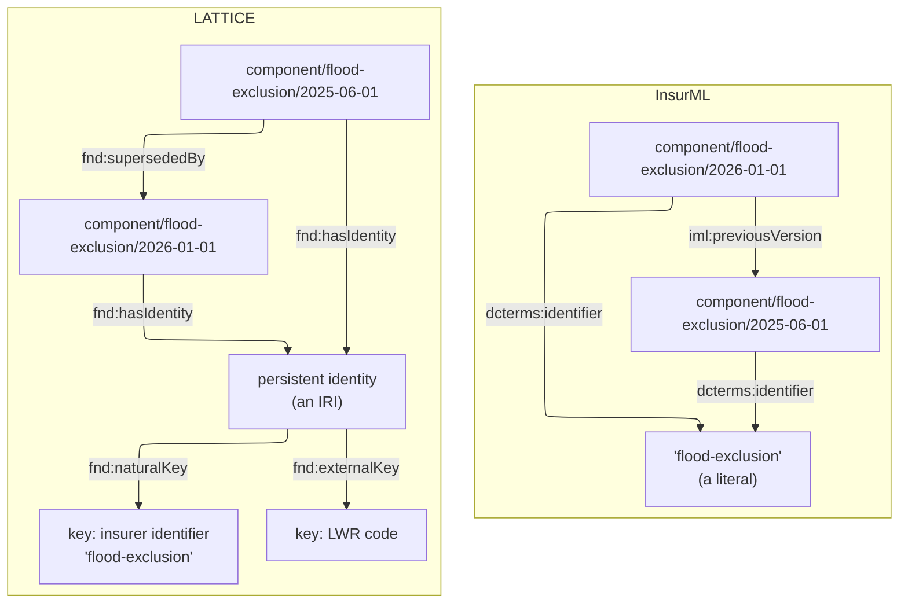
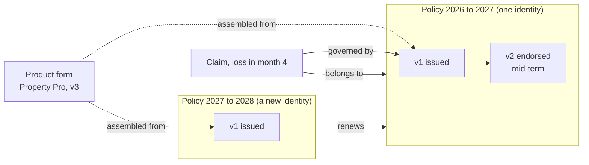

<!-- SPDX-License-Identifier: CC-BY-SA-4.0 -->

# Identity and versions in InsurML and LATTICE

**For:** the InsurML team at Axiome Partners, and LATTICE's authors. **Status:** note, 2026-10-05.
Not a decision. **Reads with:** the InsurML specification (Draft 1.0), chapter 5 and §4.3, and
LATTICE's [InsurML alignment vision](../../architecture/insurml-alignment-vision.md).

---

## Contents

1. [Summary](#1-summary)
2. [What the two standards agree on](#2-what-the-two-standards-agree-on)
3. [Where they differ](#3-where-they-differ)
4. [Why LATTICE cannot mint identities under a publisher's prefix](#4-why-lattice-cannot-mint-identities-under-a-publishers-prefix)
5. [What an identity resource does in a live system](#5-what-an-identity-resource-does-in-a-live-system)
6. [Contracts that identify issued policies](#6-contracts-that-identify-issued-policies)
7. [How it looks in different stores](#7-how-it-looks-in-different-stores)
8. [A proposal](#8-a-proposal)

---

## 1. Summary

InsurML gives every version of a contract, group and component its own IRI, and links the versions
of one thing by a shared literal, `dcterms:identifier`. LATTICE gives the versions IRIs too, and
also gives the thing that has the versions an IRI of its own, a persistent identity, to which
identifiers, approvals, usage and other facts about the thing as a whole attach.

LATTICE adopts InsurML's version IRIs as they are. It needs the persistent identity as well, and
InsurML's IRI policy leaves no room to mint one under a publisher's prefix, so today LATTICE mints
it in a deployment's own namespace. A small addition to InsurML's IRI policy, an unversioned pattern
for contracts, groups and components, would let both standards use the same identity IRI (§8).

## 2. What the two standards agree on

| Rule | InsurML | LATTICE |
|---|---|---|
| A version is immutable. New text means a new version | every contract, group and component IRI is a version (D67) | every wording and element is a version (`fnd:Version`) |
| A contract includes exact versions, never "the latest" | D80 | an assembled wording records the versions it includes (`wrd:includes`) |
| A retired IRI is never reused | §5.4 | identities and keys are never reassigned |
| Tools read data, not IRIs | identifier and version are stated as data so tools need not parse IRIs (D67) | identity is not position, and nothing is inferred from an IRI's shape |
| Numbers are generated, not identity | D93 | object ids are derived after assembly (W7) |

## 3. Where they differ



| | InsurML | LATTICE |
|---|---|---|
| The thing with versions | a literal shared by its versions | a resource, `fnd:PersistentIdentity` |
| Identifiers | one slug, frozen once chosen. LWR codes as properties | keys, each under a key scheme that says whether values are reissued and what they look like. A thing may have several, and a key may be corrected |
| Order of versions | `iml:previousVersion`, and the date in the IRI | `fnd:supersededBy` |
| Facts about the thing as a whole | stated on each version, or not stated | stated once, on the identity |

LATTICE does not choose one IRI form for identities. A deployment picks a pattern per kind of
identity (entities, aggregates, lineages, content revisions, key claims), and the same model
works with any of them.

## 4. Why LATTICE cannot mint identities under a publisher's prefix

InsurML's IRI policy says every IRI under a publisher's prefix must match exactly one pattern
(§5.6), and the kinds under `id/` are a closed list: contract, group, component and variable
(§5.3). The contract, group and component patterns all end in a date, so each names a version. The
only unversioned pattern is the variable's.

So an IRI such as `https://insurer.example/id/component/flood-exclusion`, the natural IRI for the
clause as a whole, matches no pattern. If LATTICE minted it, every InsurML validator would reject
the graph. LATTICE therefore mints the identity elsewhere, in the deployment's own namespace or
as a `urn:uuid:`, and records the publisher's slug as a key on it. This is a consequence of the IRI
policy, not a preference.

## 5. What an identity resource does in a live system

Each case below arises in a running library or policy system, and each needs something to point
at that is not one version.

| Need | With a literal only | With an identity resource |
|---|---|---|
| **Facts about the thing as a whole**: approved for a market, owned by a team, superseded as a whole, its meaning reviewed and carried forward to a new version | repeated on every version, or attached to nothing, since a literal cannot be the subject of a statement | stated once on the identity |
| **Several identifiers**: the publisher's slug, an LMA code, a market reference, a policy number | one slug, and other codes as unrelated properties | keys under schemes. A lookup by any key finds the identity, and a mistyped key is corrected without changing the identity |
| **The current version** | the latest date in the IRI. As strings, `2026-01-01-10` sorts before `2026-01-01-2`, so ordering needs the `previousVersion` chain | the version with no successor, or a head pointer the store maintains |
| **Two editors revising one component on the same day** | both mint `…/2026-01-01-2`. Nothing in the data serialises them | the identity's head pointer carries a revision number. The second write fails a compare-and-set and retries with `-3` |
| **References resolved by shared identifier** (D84) | a join on a literal | a reference names the identity and resolves to the version the contract includes |
| **Merging and splitting**: two slugs found to be one clause, or one slug that drifted into two clauses | rewrite the literals on old versions, which are immutable | record the relation between identities. Old versions stay as they are |
| **Erasure and correction of personal data** in issued policies | spread across versions | acted on once, at the identity |

None of these changes InsurML's version IRIs. They need a node beside them.

## 6. Contracts that identify issued policies

InsurML's owner confirmed on 2026-10-06 that an `iml:Contract` may be a template, such as a generic
directors and officers wording that underwriters tailor case by case, or an instance, such as one
client's bound policy in force. Its endorsements are new versions of the instance contract (D87).
So a contract IRI can identify one policy, and identity matters more still:

| Question | Why it matters for a policy |
|---|---|
| Which version does a record refer to? | the version in force at the record's relevant time, reached through the policy's identity (§6.1) |
| Is a renewal a new version? | in law a renewal is usually a new contract for a new period, so a new identity linked to the one it renews, not a version of it (§6.2) |
| Which identifiers does it carry? | a unique market reference, a policy number, certificate numbers, each under a different authority |
| What does the date in the IRI mean? | an endorsement has an effective date and a date it was recorded, and they differ when it is backdated. A version IRI with one date cannot carry both. LATTICE records both times as data on the version |
| How is a policy related to its product? | a policy assembled from a product form should name the form and the version of it. InsurML has no property for this today. LATTICE uses `wrd:assembledFrom` |
| Where are a policy's settings? | per policy version, which makes InsurML's open question on the settings format (Q33) central |

### 6.1 Which version a record refers to

A claim, a premium or a payment is decided under the terms in force at a relevant time: the date of
loss, the date a claim is first made, the date a premium falls due. So each is governed by one
version. Each record also outlives that version. A claim notified in month three is still handled
after an endorsement in month six, and a later endorsement backdated to month two may change which
version governed it. A record therefore holds two references:

| Reference | Holds | Stable when |
|---|---|---|
| to the policy's identity, by a key such as the policy number | which policy the record belongs to | the policy is endorsed |
| to the version in force at the relevant time | which terms decide it | nothing is backdated. A backdated endorsement can change it, and the record keeps both the version it was decided under and the version now known to govern |

Some records arise from one version itself. An additional premium arises from the endorsement that
creates it, so it refers to that version directly. LATTICE records this as an occasion of the
version's relation, whose parties and terms are fixed when it arises.

### 6.2 Endorsements and renewals



An endorsement changes a contract during its period, so it makes a new version of the same
identity. A renewal usually makes a new contract for a new period, with its own terms, premium and
often its own market reference. It is a new identity, linked to the one it renews and assembled
from the product form as it then stands. A claim on the 2026 policy is never governed by the 2027
terms, which is what a single identity running across renewals would allow by mistake.

Practice varies. Some insurers keep one policy number across renewals. The number is then a key
of a series of policies, a policy account, rather than of one contract. In InsurML's terms, a
renewal under the same identifier slug and a new date would look exactly like an endorsement,
which is why InsurML needs a rule for renewals (Q-20).

## 7. How it looks in different stores

The model is the same in every store: an identity, its versions, its keys, and a head that says
which version is current. What differs is where uniqueness and concurrency are enforced.

| Store | Identity, versions, keys | Current version | Uniqueness and concurrency |
|---|---|---|---|
| RDF store, Apache Jena (TDB2, Fuseki) | IRIs and triples as above, often one named graph per identity holding its head | a head triple, written in the same transaction as the new version | a SPARQL update that checks the head's revision before writing, inside a serialisable transaction. Key uniqueness by the same guarded update |
| Datalog store, RDFox | the same triples | derived by a rule: a version of an identity with no successor. Kept up to date incrementally as versions are added | integrity rules derive a violation fact when two identities share a key or a version has two successors. Identities are linked by recorded relations, never by `owl:sameAs`, whose equality reasoning would merge everything about both |
| SQL, for example PostgreSQL | an identity table with a surrogate key, a version table with the version IRI unique and a foreign key to its identity, a key table with scheme, value and validity period | a head column on the identity, or the version with no successor | a row version on the identity for optimistic concurrency. A uniqueness constraint on scheme and value, or an exclusion constraint so that validity periods for one value never overlap |
| Labelled property graph, Neo4j | `(:Identity)<-[:VERSION_OF]-(:Version)`, `(:Version)-[:SUPERSEDED_BY]->(:Version)`, keys as `(:Key {scheme, value})` nodes or properties | a `[:CURRENT]` relationship from the identity, moved in the write transaction | uniqueness constraints on version IRIs and on key scheme and value. Optimistic concurrency by a revision property on the identity, checked in the transaction |

With a literal only, each store can still group versions by the identifier, as a column, a
property or a literal-valued triple. What it cannot do is hang anything off the group. Every
system that needs to does it by creating a node or a row for the thing as a whole, which is what lattice's
persistent identity is doing.

A short SQL sketch shows the shape:

```sql
create table identity (
  id        uuid primary key,
  head      text,             -- version IRI of the current version
  revision  bigint not null    -- optimistic concurrency
);
create table version (
  iri            text primary key,      -- InsurML's version IRI, adopted as is
  identity_id    uuid not null references identity (id),
  superseded_by  text references version (iri),
  valid_from     timestamptz,           -- effective time
  recorded_at    timestamptz not null   -- when the system learned of it
);
create table key (
  scheme       text not null,           -- for example the insurer's component identifiers
  value        text not null,           -- for example 'flood-exclusion'
  identity_id  uuid not null references identity (id),
  unique (scheme, value)
);
```

## 8. A proposal

Add one pattern to InsurML's IRI policy for the identity of a contract, group or component, the
version IRI without its date:

| # | What | Pattern |
|---|---|---|
| R13, proposed | the persistent identity of a contract, group or component | `P id/{kind}/{id}` |

The slug InsurML already shares between versions becomes the identity's IRI, as R12 already does
for variables. A version then states its identity as a resource, and an identity may dereference to
its current version or its list of versions. LATTICE would adopt R13 identities as its persistent
identities and stop minting its own. Nothing else in InsurML's IRI policy changes, and no existing
IRI changes meaning.
