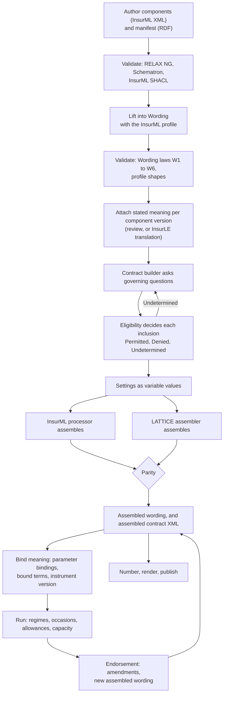

# Integrating InsurML and LATTICE

**Status:** analysis, 2026-10-05. Not a decision and not a plan. Local working document. Every
design choice below that would change a LATTICE layer needs an ADR under the Design First rule, and
every new directory needs one under the repository topology rule.
**Companion:** [insurml-and-lattice.md](insurml-and-lattice.md). Section references
of the form "comparison §5.4" point there. Its gap numbers (L-1 to L-13 for LATTICE, I-1 to I-12
for InsurML) are reused here.

**Correction, 2026-10-06.** This note was first written on the assumption that an `iml:Contract`
is only a library form and that InsurML gives one policy's wording no IRI. InsurML's owner
confirmed on 2026-10-06 that a contract can be either a template, such as a generic Directors and
Officers wording that underwriters adapt case by case, or an instance, such as one named client's
bound D&O policy in force. Both are `iml:Contract`, with version IRIs of the pattern
`P id/contract/{id}/{date}`. The rows marked "(corrected 2026-10-06)" below follow from this.

---

## Contents

0. [The recommended shape, in brief](#0-the-recommended-shape-in-brief)
1. [Depths of integration](#1-depths-of-integration)
2. [Principles](#2-principles)
3. [Who owns which fact](#3-who-owns-which-fact)
4. [Lifting InsurML into LATTICE](#4-lifting-insurml-into-lattice)
5. [Lowering LATTICE into InsurML](#5-lowering-lattice-into-insurml)
6. [Embedding: one graph, two vocabularies](#6-embedding-one-graph-two-vocabularies)
7. [One assembly pipeline](#7-one-assembly-pipeline)
8. [Integration designs, topic by topic](#8-integration-designs-topic-by-topic)
9. [Where things would live](#9-where-things-would-live)
10. [Changes each side would need](#10-changes-each-side-would-need)
11. [A phased roadmap](#11-a-phased-roadmap)
12. [Risks](#12-risks)
13. [Decisions for the human](#13-decisions-for-the-human)
14. [Questions for the InsurML owner](#14-questions-for-the-insurml-owner)

---

## 0. The recommended shape, in brief

The two standards meet in the structure of wording, and each is strong where the other is silent.
The shape that follows from that:

1. **InsurML is the document, LATTICE is the meaning.** InsurML stays the format in which
   insurance wording is authored, validated, assembled and published. LATTICE's Wording layer holds
   the same structure as a graph, and Instrument, Eligibility, Behaviour, Party and Quantification
   state what it means and how it behaves after issue.
2. **One graph, co-typed nodes.** An InsurML component version is a LATTICE `wrd:Element`, with the
   same IRI. InsurML's version IRIs are adopted as LATTICE version IRIs (ADR-A82's adopted naming
   authority). A persistent identity and keys are added beside them (ADR-A114). Nothing is copied
   under a second name.
3. **A profile, not a fork.** The LMA WIM profile planned for `ontology/applied/insurance/wording/`
   (CC-D3, AIR-5.9) becomes, or imports, an InsurML profile: InsurML's typing schemes bound through
   scheme bindings, its rules held as data compiled to shapes, and the few properties InsurML needs
   that the substrate should not hold (prompts, defaults, content status).
4. **A lift and a lower, with a declared fidelity.** A deterministic lift reads InsurML XML and its
   manifest into Wording. A deterministic lower writes Wording back as InsurML. A round-trip
   contract says, row by row, what survives (§4, §5).
5. **Assembly checked twice.** InsurML's processor and a LATTICE assembler run the same inputs, and
   a parity test compares their results, as ADR-A28 does for the Eligibility backends.
6. **LATTICE answers some of InsurML's open questions.** A settings format (Q33), the full set of
   condition kinds (D52, D57), dynamic table structure (§9.6), endorsement detail beyond inclusion
   (D87) and a standard list for area of coverage. These are offers to the InsurML owner, not
   changes LATTICE can make.
7. **InsurML exposes gaps in Wording that are not about insurance.** Reuse of a part under several
   holders (L-1), optional words inside a sentence (L-2), dependencies between clauses (L-3) and
   blocks inside a sentence (L-5) arise in any clause library, from facility agreements to trial
   protocols. They belong in the substrate, each through its own ADR.

Section 13 lists the decisions this needs from the human.

---

## 1. Depths of integration

Seven depths, each including the ones above it. They are a menu. An adopter, or LATTICE itself,
may stop at any of them.

| Depth | Name | What it means | Gives | Costs |
|---|---|---|---|---|
| 0 | coexistence | each system holds its own data. They refer to each other by IRI | traceability between a component and the meaning reviewed for it | nothing beyond discipline |
| 1 | crosswalk | alignment triples between the vocabularies (SKOS mapping relations, `rdfs:subClassOf` where sound) and between concept schemes | queries that span both, a mapping a reviewer can read | an alignment module to maintain against two release cycles |
| 2 | transform | a lift from InsurML into Wording and a lower back, deterministic and tested | either system can read the other's data | two tools, a fidelity contract, golden files |
| 3 | embedding | the same nodes carry both vocabularies in one graph | no copies, no identity mapping | care with disjointness and with properties that mean different things |
| 4 | profile | InsurML's rules become LATTICE shapes and scheme bindings in an applied module | one validation run covers both rule sets | a profile versioned against an external edition |
| 5 | layering | LATTICE meaning over InsurML components, InsurML documents over LATTICE wordings | a policy that is both a publishable document and a computable instrument | the substrate gaps in comparison §12.1 |
| 6 | convergence | the two standards agree on a shared core, and each extends it | one model for the market | standards engagement, shared governance |

**Recommended target: depth 5 for LATTICE, with depth 6 offered.** Depths 0 to 2 are reachable
without touching a LATTICE layer. Depth 3 needs nothing new either, but it does need decisions on
typing (§6.3). Depths 4 and 5 need the profile and some substrate changes. Depth 6 depends on the
InsurML owner.

---

## 2. Principles

| # | Principle | Grounding |
|---|---|---|
| IP1 | **The substrate stays neutral.** Nothing InsurML-specific enters Foundation to Instrument. A substrate change motivated by InsurML must be justified by a domain-neutral case, such as a clause library for loans, trials or licences | repository rules on domain-neutral layers |
| IP2 | **The text is kept.** Each component version's XML is retained as received, with its digest. Lifted structure never replaces it | ingestion vision IV1, ADR-A13 source graph role |
| IP3 | **One home per fact.** Every fact has one authoritative representation. Others are derived and say so (§3) | ADR-A13, ADR-A92 |
| IP4 | **Adopt identity, never re-mint it.** InsurML version IRIs are LATTICE version IRIs. LATTICE adds identity and keys beside them | ADR-A82, ADR-A114 |
| IP5 | **Fidelity is declared.** Every mapping row is graded exact, by convention, lossy or none. Round trips are tested with golden files | xml-egress sketch §8 |
| IP6 | **No mapping by name.** The colliding words of comparison §8 are mapped by definition, never by label | glossary rule |
| IP7 | **Types do not decide meaning.** A component typed Exclusion is evidence for a reviewer, not an `ins:Exclusion` | DP3, CCS sketch §3.1 |
| IP8 | **Pure functions, published.** Lift, lower and egress are deterministic and published as kits, so an adopter can run them without LATTICE | xml-egress sketch §8, ADR-A19 |
| IP9 | **Pinned editions.** The profile names the InsurML edition it targets and is re-pinned when that changes, as an internal import would be | ADR-A86, ADR-A88 |
| IP10 | **Optional, never imposed.** LATTICE works without InsurML, and an adopter chooses whether to use it | copilot instructions, framework stance |
| IP11 | **Licence first.** No InsurML text, schema or example enters the tracked repository until its distribution is settled. Fixtures are written clean-room | ADR-A-C2, InsurML distribution note |

---

## 3. Who owns which fact

In a combined system, each kind of fact needs one authoritative home.

| Fact | Authoritative in | Derived in | How |
|---|---|---|---|
| a component's words and inline markup | InsurML XML file of the version | Wording text parts | lift (§4) |
| a component's identity, version and type | the XML root and metadata, mirrored into the graph by InsurML (D50) | the same nodes, co-typed | embedding (§6) |
| order and inclusion in a library contract | InsurML manifest | Wording part-whole edges and rank keys | lift |
| inclusion conditions | InsurML manifest and markup, or Eligibility profiles once conditions exceed equality | the other | lift, or lower through derived variables (§5.2) |
| one policy's settings and variable values | `wrd:VariableValue` on its assembled wording | InsurML settings file, until Q33 is decided | lower |
| one policy's assembled text | the assembler's output, under the instance contract's version IRI, typed `iml:Contract` and `wrd:AssembledWording` | the assembled contract XML and the lifted graph, each from the other, with parity | §7 (corrected 2026-10-06) |
| amendments to an issued policy | `wrd:Amendment`, `ins:Amendment` | an endorsement is a new version of the instance contract, with new component versions where words change | lower (corrected 2026-10-06) |
| meaning of a clause | Instrument stated meaning, owned by the element version (CC-D12) | nothing in InsurML | |
| state after issue | Behaviour runtime records | nothing in InsurML | |
| typing schemes | InsurML vocabularies and publisher schemes | LATTICE scheme bindings in the profile | profile |
| published numbers | the renderer, after assembly (W7, D93) | `number` attributes, never stored as identity | |
| inherited attributes | computed per assembled wording | never written into shared components (D83) | Surface promotion (§8.9) |

---

## 4. Lifting InsurML into LATTICE

### 4.1 Mapping table

Fidelity grades: **E** exact, **C** by convention, **L** lossy, **N** no target.

| # | InsurML | LATTICE | Grade | Rule |
|---|---|---|---|---|
| M-01 | `iml:Contract` version | a template as `wrd:Wording` (a library form). An instance as `wrd:AssembledWording`, with `wrd:assembledFrom` the template version. Same IRI in both cases | C | co-typed. InsurML states neither the link to the template nor which kind a contract is (P-15, P-16) (corrected 2026-10-06) |
| M-02 | `iml:ComponentGroup` version | `wrd:Element`, same IRI | C | element type from the group type (§6.3) |
| M-03 | `iml:Component` version | `wrd:Element`, same IRI | C | element type and classification (§6.3) |
| M-04 | sub-component | element directly comprised by its component | E | |
| M-05 | `para` | `wrd:Text`, a fragment IRI where it has an `xml:id`, otherwise minted from the component IRI and a path | C | element type paragraph, numbered clause or nested clause, from a profile scheme |
| M-06 | nested `para` | `wrd:Text` directly comprised by the outer text | C | |
| M-07 | text, `definedTerm`, `reference`, `variable` inside a `para` | text parts, literal, object reference, variable reference | E | part index in document order (W2) |
| M-08 | `list`, `listItem` | elements under the text, a list type and an item type | L | label style lost without L-5 or a profile property. Position inside a continuing sentence lost (G33) |
| M-09 | `title` | a text element of type title, or `rdfs:label` on the element | C | `displayed="false"` needs a profile property |
| M-10 | `label` (printed number) | `wrd:objectId` on the form's element | E | |
| M-11 | `optionalPhrase` | none without L-2 | N | retained in the source XML only |
| M-12 | `limit`, `excess`, `range`, `amount`, `basis` | text parts. The amount's variable as a variable reference | L | the composite structure is lost unless L-10 or a profile class keeps it (§8.4) |
| M-13 | CALS `table` | `wrd:Table` with fields and declared entries, when the header row names fields | L | spans, column counts and cell markup lost. A table whose rows are not fields stays presentational and is lifted as text |
| M-14 | `dataTable` | `wrd:Table` when its foreign content follows the fields-and-entries structure (§8.3) | C | otherwise retained as foreign XML |
| M-15 | `foreign` (MathML, SVG) | none | N | retained in the source XML. A formula's meaning waits for `ins:computedBy` (contract amounts) |
| M-16 | `iml:hasInclusion` entry with position, single holder | `wrd:directlyComprises` and `wrd:rankKey` | C | rank key is the position zero-padded ("0010"), so lexicographic order matches |
| M-17 | the same part included by several holders | none under W1 | N | the central conflict (§4.2) |
| M-18 | entry with `iml:condition` | `wrd:inclusionMode wrd-voc:Conditional`, `wrd:includedWhen` an admission profile with one `elg:ExactCondition` reading the variable | E for one holder | |
| M-19 | entry with `iml:hasOption` | a `wrd:VariationSlot` with the options as variants, each with its profile | C | the slot is a minted element in the holder's place |
| M-20 | markup `optionality="condition"` | as M-18, on the lifted element | E | |
| M-21 | `fallback` | none | N | profile property, or the three-valued reading of §7.2 |
| M-22 | `userSelection` | `wrd-voc:Optional` | E | |
| M-23 | `alternativeSet` with `userSelection` | a variation slot whose variants carry no condition | C | |
| M-24 | `includeIf`, `excludeIf`, `selectableIf` with `dependsOn` | none without L-3. A derived governing variable is the workaround (§8.2) | L | |
| M-25 | `contentStatus="informational"`, guidance types | a profile classification | C | needs L-7 to say it is not part of the contract |
| M-26 | `iml:Variable` typed Governing Variable | `wrd:GoverningVariable` | E | the variable's IRI is adopted, an identity minted (§6.2) |
| M-27 | `iml:Variable` typed Embedded Variable | `wrd:EmbeddedVariable` | E | |
| M-28 | `iml:valueScheme` | `wrd:valueContract` to a scheme contract bound to the scheme | C | one contract per scheme, minted in the profile |
| M-29 | `iml:datatype` | `wrd:valueSpace` for numbers and amounts. None for text and dates | L | profile property for the rest (L-8) |
| M-30 | `iml:prompt`, `iml:defaultValue` | none | N | profile properties (L-8) |
| M-31 | `iml:constraint` | `wrd:admissibleValues` where the expression is a bound on a number | L | the prototype's XPath-like strings need parsing. Others retained as a literal |
| M-32 | `iml:valueSource` to another variable | `wrd:populatedFrom`, `wrd:populationMethod wrd-voc:FromAnotherVariable` | E | |
| M-33 | `iml:valueSource` to an object attribute or external document | `wrd:populationMethod wrd-voc:ReferenceTableLookup` | L | the source itself has no property |
| M-34 | `iml:boundTo` | none | N | |
| M-35 | variable shown by printed name (D149) | none | N | |
| M-36 | `dcterms:identifier` | a natural key on the persistent identity, under a key scheme per publisher and kind (§6.2) | E | |
| M-37 | `iml:version` | retained as is | E | LATTICE has no instance version label to map to |
| M-38 | `iml:previousVersion` | inverse of `fnd:supersededBy` | E | |
| M-39 | `iml:variantOf` (adaptation) | `prov:wasDerivedFrom` | C | never `wrd:variantOf` (comparison §8) |
| M-40 | `iml:hasType` | `wrd:elementType` and `wrd:classification` per §6.3 | C | |
| M-41 | `iml:references`, `reference` | `wrd:Reference` with `wrd:linksTo`, or a text part | E | |
| M-42 | `definedTerm` target resolved in scope (D84) | `wrd:refersToObject` to the version written in the XML | L | the in-scope resolution is lost without L-6. §8.6 |
| M-43 | analogue component, `iml:externalRepresentation` | `wrd:DocumentObject` reached by a reference | E | |
| M-44 | `iml:market`, `classOfBusiness`, `jurisdiction`, `insurableInterest` | governing variables and their values, plus `voc:BindingScope` for the market | C | §8.8 |
| M-45 | `dcterms:language`, `iml:languageStatus` | language tags on text, a profile property for status | L | |
| M-46 | object families, document scope | profile classifications | C | |
| M-47 | `iml:lwrPublishingCode`, `iml:lwrVariantCode` | `fnd:externalKey` under LWR key schemes | E | |
| M-48 | `iml:digitisationStatus` | analogue as a document object, digital as content | C | |
| M-49 | `iml:areaOfCoverage` (literal) | a classification from peril and reference vocabularies, proposed by review | L | text kept, concept proposed (§8.8) |
| M-50 | `iml:allowsSubComponentType`, `disallowsSubComponentType`, `allowedWithin` | SHACL-SPARQL shapes in the profile | E | §8.10 |
| M-51 | `iml:applicableTo` | `iml:applicableTo` kept in the profile (C3-Q2) | E | |
| M-52 | settings (`rdf:value` in the example) | `wrd:VariableValue` on the instance contract, co-typed `wrd:AssembledWording` | C | §8.1. The instance contract's IRI is adopted, nothing is minted (corrected 2026-10-06) |
| M-53 | assembled contract XML | the instance contract as a `wrd:AssembledWording`, with `wrd:assembledFrom` the template version and `wrd:includes` the resolved parts | C | the instance contract's IRI is adopted, nothing is minted. The template version comes from P-15 or a profile rule (corrected 2026-10-06) |
| M-54 | generated `number` | `wrd:objectId` on the instance's view, derived | C | W7 |
| M-55 | endorsement as a new contract version (D87) | `wrd:Amendment`s found by comparing the two manifests, Insert and Delete | L | text-level operations cannot be recovered from inclusion changes |

### 4.2 The central conflict: one part, many holders

InsurML's inclusion entry is an edge with its own position and condition. A Defined Term component
can be included by every section of every contract, at a different position and under a different
condition each time. Wording puts `wrd:rankKey`, `wrd:inclusionMode` and `wrd:includedWhen` on the
element, and law W1 says an element's parents are versions of one parent.

Four ways to lift a shared part, in increasing order of change to LATTICE:

| Option | How | Keeps W1 | Loses | Change |
|---|---|---|---|---|
| A. one form per contract, copy shared parts | mint a LATTICE element per (holder, part), `prov:wasDerivedFrom` the InsurML component | yes | the InsurML IRI is no longer the element's. Meaning reviewed for the component must be re-attached per copy | none |
| B. one form per contract, reference shared parts | the holder gets a minted reference element, `wrd:linksTo` the shared component | yes | the shared part is not in the tree, so W5 and assembly do not reach it | none |
| C. a pool wording | every InsurML component is the root of its own one-element wording, contracts are forms that reference them | yes | the contract's tree is flat references | none |
| D. reify inclusion | a new Wording class for an inclusion entry, carrying the holder, the part, the rank key, the inclusion mode and the condition. W1 is restated over inclusion entries | restated | nothing | Wording, an ADR (L-1) |

**Assessment.** A breaks the adopted identity (IP4) and multiplies meaning reviews. B and C keep
the substrate unchanged but give up what Wording's laws check. D matches InsurML and also serves
clause libraries in other domains, where one boilerplate clause sits in many forms. D is a breaking
Wording change at major version zero (ADR-A113), with a re-pin cascade through Instrument and every
document importing it, while CCS slices C7b to C9 change Instrument. Its timing matters as much as
its design (§12, R4).

A sketch of D, for discussion only:

```turtle
@prefix wrd: <https://www.nebularis.org/neuro-semantic/lattice/wording#> .
@prefix wrd-voc: <https://www.nebularis.org/neuro-semantic/lattice/wording/vocab#> .

# Hypothetical: wrd:InclusionEntry does not exist today.
<https://insurer.example/id/group/liability-section/2026-01-01>
    wrd:hasInclusionEntry [
        a wrd:InclusionEntry ;
        wrd:entryIncludes <https://insurer.example/id/component/sanctions-us/2026-01-01> ;
        wrd:rankKey "0030" ;
        wrd:inclusionMode wrd-voc:Conditional ;
        wrd:includedWhen <https://deployment.example/profile/risk-location-us>
    ] .
```

### 4.3 Defined terms and scope at lift time

A component's XML names the target version it was written against. InsurML resolves it, per
contract, to whichever version in scope shares the target's identifier (D84). A library component
lifted once cannot know that version, because it depends on the contract. Three options:

| Option | Lift writes | Resolution |
|---|---|---|
| as written | `wrd:refersToObject` the written version | none. Wrong when a later definition is in scope |
| per assembled wording | as written, and a resolution record per assembled wording naming the version in scope | the assembler writes it, a shape checks exactly one (as D86 step 6 does) |
| by identity | `wrd:refersToObject` a persistent identity (L-6) | the renderer and Instrument resolve it within the assembled wording |

The second needs no substrate change and keeps InsurML's rule. The third is cleaner and is a
Wording ADR. Instrument's per-section definitions (C7c) need the same resolution in law, so the two
should be designed together.

### 4.4 Worked lift, one component

From the offshore exclusion of InsurML's Annex A, abridged. Identity and governance triples on the
LATTICE side are shown once (§6.2).

```turtle
@prefix iml:     <https://insurml.example/ns/core#> .
@prefix wrd:     <https://www.nebularis.org/neuro-semantic/lattice/wording#> .
@prefix wrd-voc: <https://www.nebularis.org/neuro-semantic/lattice/wording/vocab#> .
@prefix dcterms: <http://purl.org/dc/terms/> .

<https://insurer.example/id/component/offshore-exclusion/2021-04-01>
    a iml:Component , wrd:Element ;
    dcterms:identifier "offshore-exclusion" ;
    iml:version "2021-04-01" ;
    iml:hasType <https://insurml.example/vocab/component-type/exclusion> ;
    wrd:directlyComprises <https://insurer.example/id/component/offshore-exclusion/2021-04-01#p1> .

<https://insurer.example/id/component/offshore-exclusion/2021-04-01#p1>
    a wrd:Text ;
    wrd:rankKey "0010" ;
    wrd:hasTextPart
        [ wrd:partIndex 0 ; wrd:partText "We will not cover claims for " ] ,
        [ wrd:partIndex 1 ; wrd:refersToObject <https://insurer.example/id/component/bodily-injury-definition/2021-04-01> ] ,
        [ wrd:partIndex 2 ; wrd:partText " to any " ] ,
        [ wrd:partIndex 3 ; wrd:refersToObject <https://insurer.example/id/component/employed-person-definition/2021-04-01> ] ,
        [ wrd:partIndex 4 ; wrd:partText " while " ] ,
        [ wrd:partIndex 5 ; wrd:refersToObject <https://insurer.example/id/component/offshore-definition/2021-04-01> ] ,
        [ wrd:partIndex 6 ; wrd:partText "." ] .
```

Two losses show here. The words inside each `definedTerm` ("bodily injury") are dropped, because a
LATTICE object reference has no display text. The source XML keeps them (IP2), and a renderer takes
them from the definition. If a wording uses an inflected form ("employed persons"), the display
text is needed, which argues for an optional display text on an object-reference part (a small
addition to L-6).

---

## 5. Lowering LATTICE into InsurML

### 5.1 Mapping table

| # | LATTICE | InsurML | Grade | Rule |
|---|---|---|---|---|
| W-01 | `wrd:Wording` (form) | `iml:Contract` and a manifest | C | contract type from the profile |
| W-02 | `wrd:Element` without text | `iml:ComponentGroup` | C | |
| W-03 | `wrd:Element` with text, or a definition, or a table | `iml:Component` in its own file | C | the profile decides which elements become component files, the rest become `para`s inside one |
| W-04 | `wrd:Text` and text parts | `para` with mixed content | E | |
| W-05 | object reference to a definition | `definedTerm` with the definition's label as display text | C | |
| W-06 | other object reference, `wrd:Reference` | `reference` | E | |
| W-07 | variable reference | empty `variable` | E | |
| W-08 | `wrd:rankKey` | `iml:position` in tens, recomputed per holder | C | positions are regenerated, not preserved |
| W-09 | inclusion modes Mandatory, Optional | no attribute, `userSelection` | E | |
| W-10 | Conditional with an exact condition on one variable | `optionality="condition"` or a manifest condition | E | |
| W-11 | Conditional with any other condition | a derived governing variable (§5.2), or a deferred InsurML option (§8.2) | C | |
| W-12 | variation slot | `iml:hasOption` or an `alternativeSet` | E | |
| W-13 | `wrd:Table` | a CALS `table` for presentation, and a `dataTable` whose foreign content carries fields, entries and values | C | §8.3 |
| W-14 | `wrd:VariableValue` | settings | C | until Q33 is decided, a profile format (§8.1) |
| W-15 | `wrd:multiValued` | none | L | a list rendered from the values |
| W-16 | `wrd:admissibleValues` | `iml:constraint` as an informative literal | L | normative on LATTICE's side only |
| W-17 | `wrd:populationMethod` | `iml:valueSource` where it names a source | L | |
| W-18 | `wrd:Amendment` Replace, StrikeAndSubstitute, Insert, Append | a new component version with `iml:previousVersion`, and a new contract version | L | the operation and the struck words are lost |
| W-19 | `wrd:Amendment` Delete | a new contract version without the entry | C | |
| W-20 | bespoke instance element | a component in the instance's own publisher space | C | |
| W-21 | `wrd:DocumentObject`, `wrd:ExternalDocument` | an analogue component, or a reference to an external document | E | |
| W-22 | `wrd:objectId` | `label` on the source, `number` generated on output | C | |
| W-23 | Instrument terms and relations | none | N | linked by component IRI, never inlined (§8.17) |
| W-24 | keys | `dcterms:identifier` from the natural key in the publisher's scheme. Other keys none | C | |
| W-25 | an element whose IRI fails InsurML's patterns | a minted InsurML IRI, `prov:wasDerivedFrom` the LATTICE one | C | only for content that did not come from InsurML |

### 5.2 Carrying richer conditions through equality

InsurML tests one variable against one value. LATTICE can evaluate any Eligibility profile before
InsurML assembles, and hand InsurML a derived variable whose value is the decision.

| LATTICE condition | Derived governing variable | InsurML condition |
|---|---|---|
| sum insured at most GBP 5m (interval) | `sum-insured-band`, values `up-to-5m`, `over-5m` | `sum-insured-band` equals `up-to-5m` |
| risk located in the EU except Cyprus (hierarchical with exclusion) | `in-eu-ex-cyprus`, boolean | equals `true` |
| any of three lines of business (set membership) | `line-group-a`, boolean | equals `true` |

The derived variable takes `wrd-voc:DerivedByRule` and its rule is the admission profile. Its value
is a three-valued decision, so a third value is needed for Undetermined (§7.2). This works today,
needs no change to either standard, and keeps the full condition in LATTICE. Its cost is a
variable per distinct condition, and the InsurML document no longer shows the real condition, only
its name.

---

## 6. Embedding: one graph, two vocabularies

### 6.1 Co-typing, and what must not be co-typed

| InsurML class | Co-typed with | Never co-typed with | Why |
|---|---|---|---|
| `iml:Contract` | `wrd:Wording` for a template, `wrd:AssembledWording` for an instance | `ins:Instrument`, in either case | a template is a library form and an instance is one policy's wording. Neither is the legal instrument (corrected 2026-10-06) |
| `iml:ComponentGroup` | `wrd:Element` | `wrd:Text`, `wrd:Table` | a group has no text of its own (D112) |
| `iml:Component` | `wrd:Element` | `wrd:Wording` | Wording and Element are disjoint |
| `iml:Variable` | `wrd:Variable` subclass by type | | the SKOS type decides embedded or governing |
| `iml:DataElement` other than variables | the matching content class | | only referenced data elements are InsurML resources (D39) |

An alignment module would state `iml:Component rdfs:subClassOf wrd:Element`,
`iml:ComponentGroup rdfs:subClassOf wrd:Element` and `iml:Contract rdfs:subClassOf wrd:Wording` in
the profile, never in Wording. The last is safe for instance contracts too, since
`wrd:AssembledWording ⊑ wrd:Wording` (corrected 2026-10-06). The axiom does not say which kind a
contract is, so the profile types an instance `wrd:AssembledWording` by its own rule until InsurML
states one (P-16). What must stay apart are `iml:Contract` and `ins:Instrument`.

The repository's rule on domains and ranges applies with force here. Neither side's properties
should acquire a domain or range in the alignment that would classify the other side's nodes. For
example, a domain of `iml:Component` on a property LATTICE also uses for definitions would make
every LATTICE definition an InsurML component.

### 6.2 Identity, versions and keys

```turtle
@prefix fnd:     <https://www.nebularis.org/neuro-semantic/lattice/foundation#> .
@prefix iml:     <https://insurml.example/ns/core#> .
@prefix dep:     <https://deployment.example/lattice/> .

<https://insurer.example/id/component/offshore-exclusion/2021-04-01>
    fnd:hasIdentity dep:identity-insurer-component-offshore-exclusion .

dep:identity-insurer-component-offshore-exclusion a fnd:PersistentIdentity ;
    fnd:naturalKey dep:key-insurer-component-offshore-exclusion .

dep:key-insurer-component-offshore-exclusion a fnd:Key ;
    fnd:keyScheme dep:insurer-component-identifier ;
    fnd:keyValue "offshore-exclusion" .

dep:insurer-component-identifier a fnd:KeyScheme ;
    fnd:reissuesValues false ;
    fnd:sensitiveDataScheme false ;
    fnd:valuePattern "^[a-z][a-z0-9]*(-[a-z0-9]+)*$" .
```

| Point | Rule |
|---|---|
| identity IRIs | minted in the deployment's namespace or as `urn:uuid:` (ADR-A82). Never under the publisher's prefix, since every IRI there must match one of InsurML's patterns, and the patterns have no persistent identity |
| key schemes | one per publisher and kind (component, group, contract, variable), since identifiers are unique within a publisher's kind. `reissuesValues false`, since InsurML never reuses a retired IRI |
| versions | `iml:previousVersion` and `fnd:supersededBy` both stated, or one materialised from the other by a Surface promotion |
| same-day revisions | `-2`, `-3` suffixes need no special handling, since LATTICE does not parse version IRIs |
| variables | an InsurML variable IRI is adopted as the version IRI of a `wrd:Variable` that never gains a second version. The identity is minted |
| assembled wordings | adopted from the instance contract's version IRI, never minted. A policy number or UMR is a natural key on its identity (corrected 2026-10-06) |
| LWR codes | external keys under their own schemes |

### 6.3 Typing

`wrd:elementType` is functional and takes one concept from the scheme bound to
`wrd-voc:ElementTypeContract`. InsurML types contracts, groups, components and data elements from
four schemes, and a publisher may type more narrowly. Three options:

| Option | `wrd:elementType` | `wrd:classification` | `iml:hasType` | Assessment |
|---|---|---|---|---|
| T1. structural types only | a profile scheme of structural types (contract, module, section, sub-section, component, paragraph, list, table), each `skos:broadMatch` a baseline type where one exists | InsurML's component type (Coverage, Exclusion, Condition) | kept | keeps "what kind of part" apart from "what it is about", as Wording intends. Needs the profile scheme |
| T2. InsurML types as element types | InsurML's concepts, through a scheme binding in an InsurML binding scope | other classifications | kept | one typing, but element type then carries legal intent, against DP3 |
| T3. leave typing to InsurML | the baseline (Clause, Section, Definition, Schedule) | none | kept | cheapest, and loses InsurML's types for LATTICE queries |

T1 is the reading consistent with Wording and Instrument. It also matches InsurML's own split
between a component's type (in metadata) and a `para`'s type (paragraph, numbered clause, nested
clause).

Publisher concepts that sit beneath InsurML concepts in another scheme (InsurML §9.1) need care.
Eligibility's hierarchical match closes over the members of the bound scheme only (ADR-A100). A
condition on "Exclusion" will not reach a publisher's "Cyber exclusion" unless the binding is to a
scheme that holds both, or a crosswalk declares the link (MORK crosswalks, with `exe:NoHierarchy`
where none is declared). The profile should bind each publisher's extended scheme, built as the
union of InsurML's scheme and the publisher's concepts.

### 6.4 Meaning over components

CC-D12 makes a clause's stated meaning belong to its element version. With co-typing, that is the
InsurML component version.

```turtle
@prefix ins: <https://www.nebularis.org/neuro-semantic/lattice/instrument#> .

<https://deployment.example/meaning/offshore-exclusion-term>
    a ins:Term , ins:Template ;
    ins:expressedIn <https://insurer.example/id/component/offshore-exclusion/2021-04-01> .
```

Reviewed once, this meaning applies to every policy whose assembled wording includes that
component version. That is the "meaning template per standard wording" row of the ingestion vision
(§2.1), with InsurML supplying the identity that makes reuse exact. A new component version needs
its meaning reviewed again, or carried forward by a reviewer's decision that the change does not
alter it, which `ins:encodingStatus` can record.

### 6.5 The source text

The XML of each component version is kept as an artefact in the artefact realm (data architecture,
three realms), addressed by digest and linked from the graph by a `GraphReference`-style pointer.
It is the source (ADR-A13 source role). The lifted Wording is a mapping output with provenance to
it. If the XML changes without a new version IRI, InsurML's drift check (D85) and the digest both
catch it.

---

## 7. One assembly pipeline

### 7.1 The flow



### 7.2 Three values meet InsurML's optionality

An inclusion question in LATTICE has three answers. InsurML's kinds fit them.

| Eligibility decision | Builder action | InsurML equivalent |
|---|---|---|
| Permitted | include | condition holds |
| Denied | exclude, or offer if a fallback says so | condition fails, `fallback` applies |
| Undetermined (a governing variable is unset or outside its scheme) | ask the question, or offer the clause | none. InsurML assumes every setting is supplied |

So `fallback="userSelection"` is a consumer's declared treatment of Denied, which ingestion vision
§8 already requires of every consumer of a decision. Nothing in the substrate needs to change to
support it. A profile property on the element can declare the treatment.

### 7.3 Who assembles

| Option | Authoritative | LATTICE's part | Fits when |
|---|---|---|---|
| A. InsurML first | InsurML's processor | lift the output and record it | an adopter already runs an InsurML toolchain |
| B. LATTICE first | a LATTICE assembler | lower the result to InsurML XML for publishing | conditions exceed equality, or amendments are frequent |
| C. both, with parity | either, by configuration | run both and compare `wrd:includes` with the parts in the assembled XML | the transition period, and as a conformance test for both |

C follows ADR-A28's parity discipline. A disagreement is a defect in one of the assemblers, in the
lift, or in a condition that one side cannot express. It must be reported, never resolved silently.

### 7.4 Dependencies between clauses

`includeIf`, `excludeIf` and `selectableIf` decide inclusion from another clause's inclusion. Until
L-3 is decided, the builder can model each dependency as a derived governing variable, "clause
12.7 is selected", populated by rule from the earlier choice. The order of questions follows the
dependency graph, which must be acyclic. InsurML does not say what a cycle means (comparison §13,
U-8). A shape in the profile can reject one.

---

## 8. Integration designs, topic by topic

### 8.1 A settings format for InsurML (Q33)

`wrd:VariableValue` already records a policy's values: one record per variable, and per table entry
for a table field, several values for a multi-valued variable, literal or resource, checked against
the declaration (W6). Proposed to InsurML as its settings format, in RDF, with a JSON skin
generated from the same shapes, as the ingestion vision proposes for facts (§7) and the normative
wire protocol for terms.

```turtle
@prefix wrd: <https://www.nebularis.org/neuro-semantic/lattice/wording#> .

<https://deployment.example/policy/bc-2026-00412/1>
    a wrd:AssembledWording ;
    wrd:assembledFrom <https://insurer.example/id/contract/business-combined/2021-04-01> ;
    wrd:hasValue
        [ a wrd:VariableValue ;
          wrd:forVariable <https://insurer.example/id/variable/risk-location> ;
          wrd:value <https://insurer.example/vocab/risk-location/other> ] ,
        [ a wrd:VariableValue ;
          wrd:forVariable <https://insurer.example/id/variable/manslaughter-costs-limit> ;
          wrd:literalValue 250000 ] .
```

The example's minted IRI, `https://deployment.example/policy/bc-2026-00412/1`, would in practice
be the instance contract's version IRI, of the pattern `P id/contract/{id}/{date}`, and nothing
would be minted (corrected 2026-10-06). With `wrd:assembledFrom` and the `wrd:AssembledWording`
type, the example also answers I-2. The instance names the template version it was drawn from, and
its type says it is an instance.

### 8.2 Condition kinds (D52, D57)

InsurML says its Step 6 "selects the full set of condition kinds", and lists "conditions held in
RDF by IRI" as a deferred option (§8.3 of its specification). Reopening that option gives InsurML
LATTICE's condition algebra without a new attribute grammar:

| InsurML markup | Meaning |
|---|---|
| `optionality="condition" variable="…" value="…"` | today's equality |
| `optionality="condition" profile="https://…/profile/eu-ex-cyprus"` | the inclusion condition is the named admission profile, evaluated three-valued |

The profile lives in the manifest graph, so the XML stays simple and the condition stays data. The
derived-variable route of §5.2 remains for consumers that do not evaluate profiles.

### 8.3 Dynamic tables (§9.6 of InsurML)

InsurML leaves the structure of dynamic table data to extensions. Wording's tables already separate
fields (declared, each with a variable), entries (declared or per instance) and cells (variable
values per entry), with presentation reduced to `wrd:fieldsAs` (CC-D6). An XML form of that
structure, in its own namespace inside `foreign`, gives InsurML a standard dynamic table and gives
LATTICE a lossless lift (M-14). The LMA's authorised fees table in InsurML's Annex A is a case: a
field per column (segment, fee type, amount), an entry per row, and the amount a quantity or a rate.

### 8.4 Limits, excesses and term parameters

| InsurML part | LATTICE meaning | Source |
|---|---|---|
| `limit` | a limit parameter qualifying a term or relation (`ctr:LimitParameter ⊑ ins:Qualifier`) | AIR-5.2 |
| `excess` | a retention parameter (`ctr:RetentionParameter`) | AIR-5.2 |
| `amount` with currency | a `qnt:Quantity` on a monetary space. When it holds a `variable`, an `ins:ParameterBinding` from that variable | Quantification, CCS C8 |
| `basis` ("any one event", "any one period of insurance") | a basis concept | contract-amounts §1.7 (A51 to A58) |
| `range` ("up to", "not exceed") | the closure of the bound (at most, inclusive) | Quantification bounds |
| "in total", aggregate words | an aggregate parameter, and a ledger account | AIR-5.3, evaluation context sketch |

Two changes would make this exact. In InsurML, an `xml:id` on each `limit` and `excess`, so the
qualifier can name the fragment it was read from. In LATTICE, a way for a qualifier to name that
fragment, which `ins:expressedIn` does today only for terms and at element level (L-10). InsurML's
publisher inline constructs (§9.4) could take their names from AIR's term parameter kinds
(sub-limit, deductible, waiting period, reinstatement), so that markup and meaning share one list.

### 8.5 Component types and the meaning a reviewer should look for

InsurML's types are evidence, not meaning (IP7). As routing hints for review and for the
ingestion pipeline's classification stage (S3), they suggest where to look:

| InsurML component type | Likely Instrument reading | Notes |
|---|---|---|
| Insuring Clause, Coverage | an obligation of the insurer to indemnify or pay, arising on a legal trigger (`ins:OnCondition`), with scope and qualifiers | the trigger is often "a claim first made during the period" |
| Exclusion | an `ins:Exclusion` excepting that obligation within a scope, or a narrower scope on the obligation itself | which one changes how overlapping exclusions combine |
| Condition | an obligation of the insured, with a consequence on breach (`ins:OnBreach`), or a condition precedent read as `ins:OnCondition` | the market's "condition" and "warranty" differ in consequence |
| Limit | a qualifier | §8.4 |
| Defined Term | an `ins:Definition`, possibly per section | CCS C7c |
| Premium | an obligation of the policyholder to pay, due by a due range | CCS C7b |
| Notice, Communication | an obligation to give notice, or a power exercised by notice | regimes for notice periods (C8a templates) |
| Termination and Automatic Suspension | powers to terminate, regimes for suspension | Open CBAA's Module 12 lifecycle, as templates (CCS sketch §5.11, C8a) |
| Effect of Non-Renewal | a run-off regime, permissions that survive | CCS C7b survival |
| Sanctions | an exclusion or a suspension regime gated by a sanctions state | |
| Survivorship | a deeming, or a condition on the subject's survival | |
| General Provision | varies | |
| Assessment, Certificate of Insurance, IPID, Synopsis, Contract Jacket, Schedule Document, List of Benefits, Table, Introduction | usually no stated meaning, or a restatement of other terms | `ins:alsoExpressedIn` for restatements |
| System Guidance, Technical Guidance | none, informational | §8.11 |

### 8.6 Definitions and scope

InsurML resolves a defined term to the version in scope (D84), and keeps section-level definitions
apart by scope rather than by precedence. Instrument plans per-section definitions with
`ins:appliesWithin` and `ins:notWithin`, union and overlap reporting (C7c). The two meet as
follows. A Defined Term component included only within a section's group is a definition that
applies within that section. A lift can write `ins:appliesWithin` from the group that includes it, and
C7c's overlap report then shows the cases where InsurML's scope rule and the law's reading differ,
such as a section that includes two definitions of one word. This is input to C7c's brief.

### 8.7 Endorsements and amendments

| Direction | Rule |
|---|---|
| InsurML to LATTICE | compare consecutive contract versions' manifests. An added entry is an Insert, a removed one a Delete, a changed component version a Replace. Each is a `wrd:Amendment` with `prov:generated` the new assembled wording. The legal effect (`ins:Amendment`, when it takes effect, consent) needs the endorsement's own text, reviewed (CCS C9) |
| LATTICE to InsurML | a Replace or StrikeAndSubstitute generates a new component version with `iml:previousVersion`. An instance's bespoke revision becomes a component in the instance's own space. The struck and substituted words survive only in the LATTICE graph |

InsurML's rule that an endorsement is inclusion or exclusion (D87) is the computable case. Market
endorsements often strike words inside a clause, which InsurML represents only as a new version
of the whole component.

### 8.8 Object attributes

| InsurML attribute | LATTICE home | Status |
|---|---|---|
| market | a `voc:BindingScope` for vocabulary, and a governing variable for inclusion | binding scopes built, no market scheme |
| class of business | a governing variable over a class-of-business scheme | no scheme yet. AIR reference vocabularies are the home |
| jurisdiction | a governing variable over the territory scheme (`cls-voc:TerritoryContract`) | built |
| insurable interest | the exposure module's subjects and interests | AIR Phase 4 |
| language, language status | language tags, a profile property for legal or non-legal status | profile |
| contract and component object families | profile classifications | profile |
| document scope | `wrd:documentKind` where it names a linked document, otherwise a profile classification | |
| LWR codes | external keys | built (ADR-A114) |
| area of coverage | the text kept, a peril or reference concept proposed by review (`icm:`, `prl:`) | built in part |

Compared attributes (market, class of business, jurisdiction, insurable interest) are compared
through inclusion conditions in InsurML (D82). In LATTICE they are governing variables read by
admission profiles, which can use hierarchical match over the territory and peril schemes.

### 8.9 Inheritance

InsurML computes inherited attributes per contract and never writes them into shared components
(D83). LATTICE's Surface layer exists for restatement without new meaning, with disposable
generated output. A promotion contract per assembled wording can materialise, for each included
element, the language status or object family inherited from the nearest holder that states one.
The read path is the part-whole chain to the root. The result is regenerated whenever the assembled
wording changes, so the two standards agree on where the value lives.

### 8.10 Rules held as data

InsurML holds sub-component allow and deny lists and group placement on type concepts (D38, D114),
and its SHACL checks them. In the profile, the same data drives SHACL-SPARQL shapes over
`wrd:directlyComprises` and the element type closure. They should follow the repository's authoring
rules: prefixes inline in each query, counted patterns optional, cardinality tested at zero. Those
rules are worth offering to InsurML as well, since its shapes need SHACL Advanced Features and the
same engine differences apply. The profile could also generate the Schematron form InsurML plans
"once such rules are in the vocabularies".

### 8.11 Content status and guidance

Informational content has no stated meaning in Instrument. The profile can classify it, and a
profile shape can refuse an `ins:expressedIn` from a term to an informational element. A renderer
leaves it out of the published text, as InsurML's processing model does. Whether "not part of the
contract" belongs in the substrate (L-7) depends on whether other domains need it. Drafting notes
in loan documentation and guidance in trial protocols suggest they do.

### 8.12 IRIs and the placeholder base

| Issue | Handling |
|---|---|
| InsurML's base is a placeholder until release (D13) | the profile pins the placeholder edition. The substitution is a breaking change for the profile, re-pinned in one pass like any import |
| every IRI under a publisher prefix must match one pattern | LATTICE never mints under a publisher's `id/` or `vocab/` paths |
| InsurML's agents have no pattern (O1) | Party actors with keys from registries (LEI, company number) |
| ontology edition IRIs are dated (`B ns/core/{date}`, R3) | recorded in the catalog as an external pinned import (ADR-A88). The versioning check treats a change of edition as a re-pin |

### 8.13 Validation together

| Check | Runs on | From |
|---|---|---|
| RELAX NG, Schematron | component XML | InsurML |
| InsurML SHACL (SHACL-AF) | manifest graph | InsurML |
| Wording shapes and laws W1 to W6 | lifted graph | LATTICE |
| profile shapes (containment, typing, content status) | lifted graph | profile |
| round-trip golden files | lift then lower, lower then lift | integration |
| assembly parity | both assemblers | integration |

The round-trip tests are L3 contract tests in the repository's taxonomy. The parity suite is L2 or
L4, depending on whether it runs on fixtures or a store.

### 8.14 Ingestion

InsurML removes most of the cost of the ingestion pipeline's early stages for documents already
marked up.

| Stage (ingestion vision §4) | With InsurML input |
|---|---|
| S0 acquire and parse layout | not needed. The structure is given |
| S1 segment and fingerprint | a component version is a segment, its IRI and digest its fingerprint |
| S2 recognise | exact, by component version IRI |
| S3 classify and route | the component type is a routing hint (§8.5) |
| S4a propose a meaning template | once per component version |
| S4b extract facts | settings and schedule values are given, not extracted |

For documents not yet marked up, InsurML is a candidate target for the structure stage: S0 and S1
could emit InsurML components, reviewed once per document type, before meaning is proposed. That
gives the ingestion pipeline a published intermediate format instead of an internal one. The lift
itself is a structure mapping from a known schema, so it can be written by hand. Recording it as a
MORK mapping gives it the review and provenance trail other mappings have (IV6).

### 8.15 InsurLE and Logical English

LATTICE's ingestion vision names InsurLE, attributed to John Cummins et al., as the controlled
language route beside machine extraction (§3), and the normative wire protocol reserves an
`insurle` form, inert until a translator exists. With InsurML, a clause can have three views of
one component version: the InsurML markup (what it says), an InsurLE rendering (what it says, in a
language that compiles to logic) and LATTICE's stated meaning. Where the InsurLE rendering and the
reviewed meaning agree, confidence rises. Where they disagree, a reviewer looks (ingestion vision
§3). The Logical English alignment sketch's option B (import through LE2, mapped through MORK) is
the route. An InsurLE text would sit beside the component, not inside its XML, since InsurML's
content is the contract's words.

### 8.16 XML egress

The XML egress sketch designs a published kit (query, stylesheet, schema, examples) per output
format. An InsurML kit is a second kit beside the LATTICE instrument kit:

| Kit | Query reads | Stylesheet emits | Schema |
|---|---|---|---|
| `lattice-instrument` (sketched) | terms, relations, parties, conditions | LATTICE instrument XML | LATTICE XSD |
| `insurml-assembled-contract` | an assembled wording, its elements, text parts, values | an InsurML assembled contract | InsurML's RELAX NG and Schematron |
| `insurml-components` | a form's elements | component files and a manifest | the same |

The sketch's hazards apply. The text-part structure is recursive, so the query must emit a depth or
path column (sketch §3). InsurML's fragment `xml:id`s and LATTICE's keys must not collide (sketch
§6). The stylesheets must be pure XSLT 3.0. Saxon-HE is already InsurML's own processor, so the
dependency is shared.

### 8.17 Meaning stays out of the document

It is tempting to embed meaning in InsurML through `foreign`, for example a LegalRuleML statement
inside each component. It should not be done. InsurML's content is the contract's words, and a
`foreign` element is published unless marked informational. Meaning belongs in the graph, joined to
the component by its IRI, and exported through the instrument kit or the JSON skins when a
consumer wants it.

### 8.18 Platform placement

| Concern | Where |
|---|---|
| component XML | the artefact realm, digest-addressed, immutable per version |
| manifest, lifted wording, meaning | the semantic graph realm, through the store SPI |
| settings, assembly runs, parity results | the semantic graph for values, the operational realm for run records |
| lift, lower, assemble, render | workers, as jobs with idempotent delivery (ADR-A36) |
| egress | `platform/semantic-xml-egress` (sketched, not built) |
| authoring | an InsurML editor for wording, the MORK review workbench pattern for meaning |

---

## 9. Where things would live

Every new directory needs an accepted ADR before it is created.

| Artefact | Proposed home | Exists | Needs |
|---|---|---|---|
| InsurML profile: alignment, scheme bindings, containment shapes, profile properties | `ontology/applied/insurance/wording/` | no, decided as the home of the LMA WIM profile (CC-D3) | an ADR naming its scope (§13, IQ-2) |
| InsurML's own ontology, shapes and vocabularies | not copied. Resolved through the catalog from a published location | no | publication and licence (IP11) |
| lift, lower and assembler tools | a project under `tools/` | no | an ADR under the topology rule |
| egress kits | `contracts/xml/<kit>/<version>/` (xml-egress sketch §8) | no | the egress ADR |
| egress module | `platform/semantic-xml-egress/` | no | the egress ADR |
| clean-room InsurML fixtures | the profile's `examples/`, and `test/conformance/` for parity | no | IP11 |
| Wording changes (L-1 to L-6) | `ontology/wording/` | | an ADR each |

---

## 10. Changes each side would need

### 10.1 LATTICE

| # | Change | Layer | Version impact | Depends on |
|---|---|---|---|---|
| X-1 | inclusion reified as an inclusion entry, W1 restated (L-1, §4.2) | Wording | MINOR, breaking, cascade through Instrument and its importers | an ADR, and a window clear of CCS C7b to C9 |
| X-2 | optional text inside a text, and a block put at a point in a text (L-2, L-5) | Wording | MINOR, breaking if W2 changes | an ADR |
| X-3 | inclusion conditions that read another element's inclusion (L-3) | Wording, possibly Eligibility | MINOR | an ADR. The derived-variable workaround meanwhile |
| X-4 | references to a persistent identity, resolved within an assembled wording, with optional display text (L-6, §4.4) | Wording | MINOR | an ADR, designed with C7c |
| X-5 | content not part of the contract (L-7) | Wording or Instrument | MINOR | a decision on whether it is neutral |
| X-6 | a qualifier naming the fragment it was read from (L-10) | Instrument | MINOR | AIR-5.x, CCS C8 |
| X-7 | Wording's law shapes use inline prefixes (L-12) | Wording shapes | PATCH | none. Record in the technical debt register meanwhile |
| X-8 | InsurML profile (§9) | applied | new document | IQ-2 |
| X-9 | wording assembler and renderer | tools | none | an ADR |
| X-10 | XML egress | platform, contracts | none | the egress ADR |
| X-11 | market and class-of-business reference schemes | applied | MINOR | AIR reference vocabularies |

### 10.2 InsurML (proposals for its owner)

| # | Proposal | Answers |
|---|---|---|
| P-1 | settings as variable value records on an identified assembled contract | Q33, I-1 (corrected 2026-10-06) |
| P-2 | conditions held in RDF by IRI, reopening the deferred option | D52, D57, I-3 |
| P-3 | a design-time check that a set of alternatives is exclusive and exhaustive | I-4 |
| P-4 | fields, entries and cells as the dynamic table structure | §9.6, I-5 |
| P-5 | text-level endorsement operations, or a link to an external amendment record | D87, I-6 |
| P-6 | numeric constraints as ranges, checked | D72, I-7 |
| P-7 | a reference vocabulary for area of coverage | I-8 |
| P-8 | a persistent identity pattern beside the version patterns | I-9 |
| P-9 | an `xml:id` on composite constructs, so meaning can cite them | §8.4 |
| P-10 | a rule for cycles among `dependsOn` | U-8 |
| P-11 | a chosen alternative takes the slot's number | Q32, I-11 |
| P-12 | SHACL authoring rules from LATTICE's experience | §8.10 |
| P-15 | a property linking an instance contract to the template version it was assembled from | I-2, Q-21 |
| P-16 | a stated way to tell a template from an instance contract, such as a contract role, or a rule that an instance has settings and no unresolved conditions | I-2, Q-21 |

P-13 and P-14 are numbered in the [alignment plan](../plans/insurml-alignment.md) §8.

---

## 11. A phased roadmap

Phases are ordered by dependency. Token estimates are orders of magnitude for agent work, to be
compared with actuals, as the repository asks. They exclude human review time.

| Phase | Content | Depends on | Changes a layer | Estimate |
|---|---|---|---|---|
| I0 | decisions IQ-1 to IQ-12, contact with the InsurML owner, licence and edition settled | none | no | under 0.1M tokens |
| I1 | profile skeleton: alignment axioms, identity and key schemes, scheme bindings (T1), variables, single-holder inclusion, clean-room fixtures, fidelity table as tests | I0, IQ-2 | no | 0.5M to 1M |
| I2 | lift tool for components and manifests, golden files, lower tool for structure, round-trip tests | I1 | no | 1M to 2M |
| I3 | substrate ADRs and slices: X-1, X-2, X-3, X-4, each a Wording slice with its cascade | I2's findings, CCS C9 merged | Wording, cascade | 1M to 2.5M |
| I4 | assembler, settings as variable values, three-valued inclusion, parity with InsurML's processor | I2, ideally I3 | no | 1M to 2M |
| I5 | meaning over components: component type routing, limits as term parameters, Module 12 regimes as templates, definitions by scope | CCS C7c, C8, C8a, C9, AIR-5.1 to 5.4 | applied | 2M to 4M |
| I6 | egress kits, renderer and numbering, ingestion of InsurML input | I4, the egress ADR | no | 1M to 2M |
| I7 | proposals P-1 to P-16 written up for the InsurML owner | I1 to I4 | no | under 0.3M |

**Dependencies on the epics.**

| Epic | Item | Why |
|---|---|---|
| CCS | C7c (definitions, sections) | §4.3, §8.6 |
| CCS | C8 (parameter bindings), C8a (templates) | §8.4, §8.5 |
| CCS | C9 (amendments with legal effect) | §8.7 |
| CCS | C12, C13, C13a (runtime, relation plans, joint satisfiability) | §7, P-3 |
| AIR | Phase 5 (term parameters, AIR-5.8 renderings, AIR-5.9 profile) | §8.4, §9 |
| AIR | reference vocabularies, Phase 4 exposure | §8.8 |
| NRS | wire protocol skins, LegalRuleML pipeline | §8.1, §8.16 |
| Platform | store SPI, workers, egress module | §8.18 |

I1 and I2 can start before any of these. I3 should wait for CCS C9, so the Wording cascade does not
cross Instrument's rewrite.

---

## 12. Risks

| # | Risk | Effect | Mitigation |
|---|---|---|---|
| R1 | InsurML's sources cannot be distributed | no real fixtures, the integration tested only on invented text | clean-room fixtures (IP11), real text in a private test bench |
| R2 | InsurML changes before release (base IRI, decisions) | profile churn | pin editions (IP9), keep the profile thin until release |
| R3 | names mapped by label | wrong meanings that tests built from names do not catch | IP6, the collision table as a test of the alignment |
| R4 | X-1 lands while CCS rewrites Instrument | two cascades crossing, merge conflicts in every importer | schedule X-1 after C9 |
| R5 | two assemblers drift | different policies from the same answers | parity suite, published kits |
| R6 | component types read as relations | meaning asserted without review | IP7, types as routing hints only |
| R7 | InsurML concerns leak into the substrate | the framework becomes insurance-shaped | IP1, each substrate change justified by a neutral case |
| R8 | dependence on a standard with one owner | LATTICE work stranded if InsurML stops | IP10, the integration lives in an optional applied module |
| R9 | XML artefacts and lifted graphs grow large | store and transform cost | lift per version once, digest-addressed artefacts, streaming XSLT for egress |
| R10 | SHACL-AF behaviour differs between engines | InsurML shapes pass in one engine and fail in another | the repository's SHACL rules, run on two engines in CI |
| R11 | identity IRIs collide with InsurML patterns | InsurML validation fails on LATTICE data | §6.2: never mint under a publisher's `id/` or `vocab/` |
| R12 | the LMA WIM and InsurML diverge later | the profile must serve two masters | IQ-2, one profile importing a shared core if both survive |

---

## 13. Decisions for the human

| # | Decision | Options | Recommendation |
|---|---|---|---|
| IQ-1 | Target depth of integration | 0 to 6 (§1) | 5 for LATTICE, 6 offered |
| IQ-2 | Scope of the profile in `applied/insurance/wording/` | (a) the LMA WIM profile only, (b) an InsurML profile, (c) a shared core with both | (b) if U-1 confirms InsurML is the LMA WIM's markup, otherwise (c) |
| IQ-3 | How to lift a part with several holders | A, B, C or D (§4.2) | D, after CCS C9. B meanwhile |
| IQ-4 | Typing | T1, T2 or T3 (§6.3) | T1 |
| IQ-5 | References to definitions | as written, per assembled wording, by identity (§4.3) | per assembled wording now, by identity with C7c |
| IQ-6 | Who assembles | A, B or C (§7.3) | C, starting from A |
| IQ-7 | Clause dependencies | derived variables, or X-3 | derived variables now, X-3 if a neutral case confirms it |
| IQ-8 | Optional words and blocks inside text (X-2) | substrate, profile, or source XML only | substrate, through an ADR |
| IQ-9 | Content status (X-5) | substrate or profile | profile first, substrate if a second domain needs it |
| IQ-10 | Whether to approach the InsurML owner with P-1 to P-16 | yes or no, and when | yes, after I2 shows the proposals work |
| IQ-11 | Whether InsurML becomes S1's target format in the ingestion pipeline | yes, no, or as one option | one option, recorded against ingestion vision Q9 |
| IQ-12 | Whether to fix Wording's `sh:prefixes` now (X-7) | now as a PATCH, or record as technical debt | record now, fix with the next Wording change |

---

## 14. Questions for the InsurML owner

| # | Question |
|---|---|
| Q-1 | Is InsurML's information model the LMA Wording Information Model, and does the LMA know of InsurML? |
| Q-2 | When, where and under which licence will InsurML be published, with which base IRI? |
| Q-3 | May the AXA and LMA example text be used in another project's tests, and under what terms? |
| Q-4 | What does Step 6's "full set of condition kinds" include? |
| Q-5 | Would InsurML accept conditions held in RDF by IRI (P-2), and a settings format (P-1)? |
| Q-6 | Is InsurLE intended to sit beside InsurML, one rendering per component? |
| Q-7 | How should a cycle among `dependsOn` references be treated? |
| Q-8 | Is reuse of one component version by several contracts under different conditions common in practice, or mostly within one product family? (This sizes IQ-3.) |
| Q-9 | Would InsurML adopt a persistent identity resource beside its dated version IRIs (P-8)? |
| Q-10 | Are the InsurML shapes and their SPARQL available for review against the engine differences in §8.10? |
| Q-19 | What does the date in an instance contract's IRI mean, its effective date or the date it was recorded, and how is a backdated endorsement versioned? (identity note §6) |
| Q-20 | Is a renewal a new instance contract with its own identity, or a new version of the old one? (identity note §6.2) |
| Q-21 | How does an instance name the template version it was drawn from, and how does a reader tell a template from an instance? (P-15, P-16) |

Q-11 to Q-18 are in the [alignment plan](../plans/insurml-alignment.md) §8. Q-16, whether a
contract is a product form or an issued policy, was answered on 2026-10-06. A contract may be
either, a template or an instance. Q-19 to Q-21 follow from that answer.
