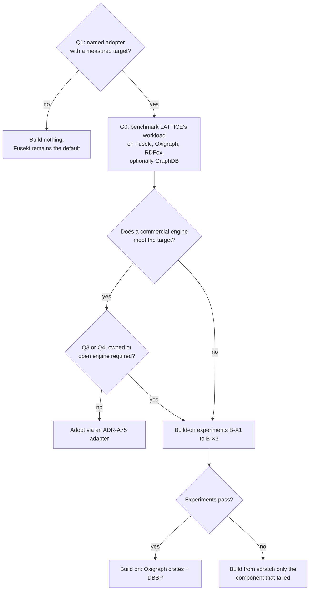

# Build, adopt, or build on: the engine decision

**Technology exploration, 2026-10-03.** The third paper on the RDF and Datalog engine. The first,
[rdf-datalog-engine-technology-exploration.md](rdf-datalog-engine-technology-exploration.md)
("paper 1"), designed an engine and chose its languages. The second,
[compiled-persistence-physical-planning.md](compiled-persistence-physical-planning.md) ("paper 2"),
compiled persistence profiles into that engine's physical structures. Both assumed the engine would
be built. This paper tests that assumption against the existing database landscape, using the
"lazy senior developer" ladder in `.github/prompts/ponytail.md` as its standard, and then costs the
two build options in tokens.

Grading is as in the earlier papers. **Fact** means a cited source says so. **Judgement** means a
reasoned position that a measurement could overturn. *(verify)* marks product or licence details
from memory that must be checked upstream before any decision rests on them. Nothing here is a
LATTICE decision.

---

## Contents

1. [Verdict](#1-verdict)
2. [What the question actually is](#2-what-the-question-actually-is)
3. [The ladder, applied](#3-the-ladder-applied)
4. [Requirements used for the survey](#4-requirements-used-for-the-survey)
5. [The landscape](#5-the-landscape)
6. [RDFox, the adopt option, in detail](#6-rdfox-the-adopt-option-in-detail)
7. [What our own engine would add, claim by claim](#7-what-our-own-engine-would-add-claim-by-claim)
8. [Build-on candidates compared](#8-build-on-candidates-compared)
9. [What the earlier papers got wrong, and what survives](#9-what-the-earlier-papers-got-wrong-and-what-survives)
10. [Recommendation and triggers](#10-recommendation-and-triggers)
11. [Token cost of the two build options](#11-token-cost-of-the-two-build-options)
12. [Decisions for the human](#12-decisions-for-the-human)
- [Appendix A: Calibration data](#appendix-a-calibration-data)
- [Appendix B: References](#appendix-b-references)

---

## 1. Verdict

**Do not build an engine now (judgement, high confidence).** There is no measured workload that an
existing engine fails, and LATTICE was designed so that it never needs one: ADR-A75's three-tier
Store SPI makes the store an adopter's choice, and the persistence compiler already realises every
profile as portable SPARQL. Paper 1's recommended architecture (one sequenced writer, parallel
incremental materialisation, wait-free snapshot readers) is close to what RDFox already ships. A
from-scratch build would reproduce a commercial product's core before it could add anything of its
own.

| Option | Verdict | Expected token cost (input-equivalent, §11) |
|---|---|---|
| **Adopt** RDFox (commercial), or GraphDB, behind the ADR-A75 SPI, with Fuseki remaining the open default | **Do this first**, after a measurement gate (G0) | not costed, by request. G0 alone is about 14M |
| **Build on** existing open-source layers: Oxigraph's crates for RDF and SPARQL, DBSP for incremental rules, `openraft`, an embedded key-value store | **Only on a named trigger** (§10.2): a measured shortfall, or a contractual need for an engine LATTICE owns | about **0.38B** (range 0.25B to 0.63B) |
| **Build from scratch** as papers 1 and 2 describe | **Do not do this.** Reconsider one component at a time, and only if the build-on option fails a specific experiment | about **1.42B** (range 0.95B to 2.37B), 3.7 times the build-on option |

**Paper 2 should be shelved (judgement).** Its native infrastructure cuts a guarded write
from about 20 + 3*n* quad operations to about 5 atomic operations. In memory, both are microseconds.
At the target latency tiers (paper 1 §3.1: sub-millisecond to milliseconds) the difference is
unlikely to be visible, and nobody has measured it. It optimises a cost before establishing that the
cost matters.

**The deciding questions are commercial.** Whether to build depends on four answers
only the human and adopters can give (§2.2). Until they are answered, any engine work is ponytail
rung 1 failing.

---

## 2. What the question actually is

### 2.1 Two different needs

| Need | Who has it | Does it require an engine of our own |
|---|---|---|
| **LATTICE needs a store** for its own platform and proofs of concept | LATTICE | **No.** Fuseki runs today (`platform/semantic-dataset-fuseki`, the authoring compose stack). ADR-A75 already anticipates further adapters with declared capabilities, including native reasoning, change feeds and CAS primitives |
| **An adopter needs a live transactional reasoning store** for trading or transaction management, with a LATTICE-modelled contract | a hypothetical adopter, the motivation for paper 1 | **Only if** no available engine meets its measured requirements at an acceptable licence |
| **Someone wants to sell or own an engine** as a product | a possible spin-out | this is a business decision. Tokens are then a minor input next to support, maintenance, sales and human review, and YAGNI does not apply in the same way |

The earlier papers blurred the second and third rows. This paper treats the second row as the
default question and names the third explicitly, because they lead to different answers.

### 2.2 The questions that decide it

| # | Question | If yes | If no |
|---|---|---|---|
| Q1 | Is there a named adopter with a stated latency and throughput target on a LATTICE-shaped workload | run G0 against that target | build nothing, keep Fuseki |
| Q2 | Is a commercial engine licence acceptable to that adopter | adopt RDFox if G0 passes | build-on becomes a candidate |
| Q3 | Must the engine be open source or owned outright (contract, regulation, escrow, sovereignty) | build-on becomes a candidate | adopt |
| Q4 | Is the engine itself intended as a product | business case decides, §11 gives the build cost input | the build options need a trigger from §10.2 |

---

## 3. The ladder, applied

The ponytail ladder stops at the first rung that holds. Applied to "build a lock-free RDF and Datalog
engine":

| Rung | Test | Finding | Holds |
|---|---|---|---|
| 1 | Does this need building at all (YAGNI) | no measured requirement, no named adopter target, no benchmark of any existing engine on LATTICE's workload | **yes, for now**. Stop here until G0 produces a number |
| 2 | Does it exist in this codebase | the Store SPI design (ADR-A75), the Fuseki adapter, the persistence compiler's SPARQL realisation, the compose stack | yes for functional semantics. Not for live incremental reasoning |
| 3 | Does the standard library cover it | n/a | no |
| 4 | Does a native platform feature cover it | RDFox provides parallel incremental materialisation with transactions. A relational database provides CAS, uniqueness and idempotency natively, which is paper 2's "infrastructure collapses" argument without a new engine | **yes, commercially** |
| 5 | Does an existing dependency solve it | Oxigraph's crates (RDF, SPARQL parsing, algebra, evaluation), DBSP (incremental computation with retraction and recursion), `openraft`, `fjall` or `redb` | **yes, in parts**. This is the build-on option |
| 6 | Can it be one line | no | no |
| 7 | Minimum code | the build-on option's core scope (§11.4), without the optional add-ons | only after rungs 1, 4 and 5 have been tested and failed |

**Reading (judgement).** Rung 1 holds today. If G0 overturns it, rung 4 probably holds (RDFox). Rung 5
is the fallback when rung 4 is excluded by licence. Rung 7 is a from-scratch build only for whatever
rung 5 cannot supply, component by component.

---

## 4. Requirements used for the survey

Taken from paper 1 §3.2 and from what LATTICE's own contracts require.

| # | Requirement | Source |
|---|---|---|
| R1 | SPARQL 1.1 Query and Update, named graphs, Graph Store Protocol | ADR-A75 Core tier |
| R2 | Datalog with recursion, stratified negation and aggregation | paper 1 §3.3: eligibility, exposures, instrument lifecycle |
| R3 | Incremental maintenance at commit, including retraction | paper 1 W2, W3 |
| R4 | ACID transactions with snapshot reads | paper 1 W1, W3 |
| R5 | Durability and high-availability replication | paper 1 W4, W8 |
| R6 | In-memory latency at tiers 2 and 3 (tens of microseconds to milliseconds) | paper 1 §3.1 |
| R7 | Exact decimal arithmetic | paper 1 W6 |
| R8 | As-of (transaction-time) queries | paper 1 W5 |
| R9 | Change subscriptions or delta streams | paper 1 W9 |
| R10 | Licence permits closed-source dependants, or a commercial licence is acceptable | paper 1 §5 |
| R11 | Active maintenance and a viable steward | operational |
| R12 | Runs LATTICE's persistence SPARQL realisation unchanged | ADR-A78, ADR-A79 |

---

## 5. The landscape

### 5.1 Commercial RDF and reasoning engines

| Engine | Language | Reasoning | Fit and notes |
|---|---|---|---|
| **RDFox** (Oxford Semantic Technologies, owned by Samsung Electronics since 2024 *(verify)*) | C++ | materialisation, parallel, incremental with retraction (Backward/Forward), Datalog with stratified negation, aggregation and built-in functions, OWL 2 RL, SWRL, SHACL, `owl:sameAs` by rewriting | **a closer fit than any other engine surveyed**. It is the commercial line of the paper that paper 1 builds on. In-memory with persistence to disk. Transactions with concurrent readers and one writer per data store *(verify)*. Detail in §6 |
| **GraphDB** (Ontotext, now Graphwise *(verify)*) | Java (RDF4J based) | forward-chaining materialisation with custom rule sets, incremental retraction | close fit for R1, R3, R4, R5. Rules have no aggregation *(verify)*. Disk-based, so latency is JVM and page-cache bound. Free edition has limits, cluster is commercial |
| **Stardog** | Java | query-time reasoning (rewriting), no materialisation | reasoning cost moves to every query, which suits analytics, not low-latency reads of derived state |
| **AllegroGraph** (Franz) | Common Lisp | Prolog rules, RDFS++, materialiser | niche, small ecosystem |
| **Amazon Neptune** | managed | none beyond query | no reasoning, cloud-only |
| **Oracle RDF Graph**, **MarkLogic**, **AnzoGraph** | various | entailment indexes or rule sets | tied to larger platforms, not a low-latency embedded engine |
| **RelationalAI**, **LogicBlox** | proprietary | relational Datalog | RelationalAI is cloud-hosted inside Snowflake *(verify)*. LogicBlox is legacy |

### 5.2 Open-source RDF stores

| Engine | Language, licence | Fit and notes |
|---|---|---|
| **Apache Jena** (TDB2, Fuseki, rule engine) | Java, Apache-2.0 | already in LATTICE. SPARQL complete, transactions, `BigDecimal` decimals. Rule engines (RETE forward, backward, hybrid) work on in-memory models and are not incremental for retraction over a transactional store. HA needs RDF Delta *(verify)* |
| **RDF4J** | Java, EDL-1.0 | SPARQL, SHACL, LMDB store. Inference limited to RDFS. The SAIL API is a clean plug-in point |
| **Oxigraph** | Rust, MIT or Apache-2.0 | SPARQL 1.1 Query and Update, RocksDB or in-memory storage, transactions, an HTTP server. No reasoning. Small maintainer team *(verify)*. Published as reusable crates: `oxrdf`, `oxttl`, `oxrdfxml`, `oxjsonld`, `spargebra`, `sparopt`, `spareval`, `sparesults` *(verify `spareval`'s dataset trait and its stability)* |
| **QLever** | C++, Apache-2.0 *(verify)* | very fast reads over large, mostly static graphs (Wikidata scale). Update support is recent *(verify)*. Not a transactional reasoning engine |
| **MillenniumDB** | C++, GPL-2.0 *(verify)* | research engine with worst-case optimal joins. Excluded if GPL |
| **Corese** | Java, CeCILL-C | SPARQL, rules, SHACL. Research-grade operations |
| **Ontop** | Java, Apache-2.0 | a virtual knowledge graph: SPARQL rewritten to SQL over a relational database. Read-only *(verify)*, OWL 2 QL reasoning by rewriting |
| **Virtuoso open source** | C, GPL-2.0 | excluded by licence |
| **Blazegraph** | Java, GPL-2.0 | excluded, unmaintained |

### 5.3 Datalog and incremental computation engines

| Engine | Language, licence | Fit and notes |
|---|---|---|
| **DBSP** (the `dbsp` crate) and **Feldera** | Rust, MIT for the core *(verify)* | incremental view maintenance on Z-sets, with retraction, aggregation and recursion *(verify recursion support in the current release)*. Feldera adds a SQL front end (Calcite, Java) and a streaming pipeline runtime. Funded company. **The leading open-source candidate for R2, R3 and R9.** Small-delta commit latency is unmeasured for this workload (experiment B-X1) |
| **Differential Dataflow** and **Timely** | Rust, MIT | the same capability family as DBSP, older and more general, with a steeper API |
| **Nemo** | Rust, MIT or Apache-2.0 *(verify)* | existential rules, columnar tries, batch materialisation. No transactions, no incremental retraction |
| **Soufflé** | C++, UPL-1.0 | compiled parallel Datalog, batch. Its index selection and concurrent B-tree are reference designs |
| **egglog** | Rust, MIT | Datalog with equality saturation and a native union-find. Batch. A reference for `owl:sameAs` handling |
| **Ascent**, **Crepe**, **Datafrog** | Rust, MIT or Apache-2.0 | embedded Datalog compiled by macros. Batch, no retraction |
| **reasonable**, **whelk-rs** | Rust, permissive *(verify)* | an OWL 2 RL reasoner on Datafrog, and an OWL EL reasoner. Batch. References only |
| **Materialize** | Rust, BSL | excluded by licence |
| **RisingWave** | Rust, Apache-2.0 | streaming SQL with incremental materialised views. No recursive views *(verify)*. Not an OLTP store |

### 5.4 Adjacent databases: Datalog, temporal, typed graph

| Engine | Language, licence | Fit and notes |
|---|---|---|
| **CozoDB** | Rust, MPL-2.0 | Datalog queries with recursion and aggregation, transactions, time travel, several storage back ends. Rules evaluate per query, not incrementally. Development appears stalled since about 2023 *(verify)*. Forking it means owning it |
| **TypeDB 3** | Rust, MPL-2.0 | typed hypergraph, rewritten in Rust, with functions in place of the earlier rules *(verify)*. Not RDF |
| **TerminusDB** | Prolog with a Rust store, Apache-2.0 | immutable layered store with git-like history. WOQL and GraphQL, not SPARQL |
| **XTDB 2** | Kotlin and Clojure, MPL-2.0 | bitemporal SQL over immutable storage. Strong on R8, no rules |
| **Datomic** | proprietary binaries, free of charge *(verify)* | Datalog queries, immutable history with native as-of, a single transactor (the same single-writer design as paper 1). Rules evaluate at query time |
| **DataScript**, **Datahike** | Clojure, EPL | embedded Datomic-style stores |
| **Kùzu** | C++, MIT | embedded property graph, archived by its maintainers in 2025 *(verify)* |
| **SurrealDB** | Rust, BSL | excluded by licence |
| **Neo4j**, **Memgraph**, **TigerGraph** | various | property graph, GPL or BSL or proprietary. No RDF Datalog |

### 5.5 Substrates and domain-specific engines

| Engine | Language, licence | Relevance |
|---|---|---|
| **TigerBeetle** | Zig, Apache-2.0 | a double-entry ledger only. If a trading adopter's hottest path is balances and transfers, that path belongs in a ledger, not an RDF engine (§7, D9) |
| **PostgreSQL** | C, PostgreSQL licence | CAS, uniqueness, idempotency and serialisable transactions are native. Recursive SQL, no incremental recursive views *(verify `pg_ivm` scope)* |
| **FoundationDB** | C++, Apache-2.0 | ordered key-value store with strict serialisability and deterministic simulation. A substrate for layers, with network round trips on every access |
| **TiKV** | Rust, Apache-2.0 | distributed key-value store. Network latency |
| **fjall**, **redb**, **RocksDB**, **LMDB** | Rust, Rust, C++, C (permissive) | embedded durable storage for logs and snapshots |
| **openraft** | Rust, MIT or Apache-2.0 | Raft for a replicated log |

### 5.6 The capability matrix

● meets, ◐ partly, ○ no, ? unverified.

| | R1 SPARQL | R2 Datalog | R3 incremental | R4 ACID | R5 HA | R6 latency | R7 decimal | R8 as-of | R9 deltas | R10 licence | R11 steward | R12 LATTICE SPARQL |
|---|---|---|---|---|---|---|---|---|---|---|---|---|
| RDFox | ● | ● | ● | ● | ◐? | ● | ? | ○ | ◐? | commercial | ◐ (new owner) | ● |
| GraphDB | ● | ◐ | ● | ● | ● | ◐ | ● | ○ | ◐? | commercial | ● | ● |
| Stardog | ● | ◐ | ○ | ● | ● | ◐ | ● | ○ | ○ | commercial | ● | ● |
| Jena / Fuseki | ● | ◐ | ○ | ● | ◐ | ◐ | ● | ○ | ○ | ● | ● | ● |
| Oxigraph | ● | ○ | ○ | ● | ○ | ◐ | ◐? | ○ | ○ | ● | ◐ | ● |
| DBSP / Feldera | ○ | ● | ● | ◐ | ◐ | ? | ● | ○ | ● | ● | ● | ○ |
| Differential Dataflow | ○ | ● | ● | ○ | ○ | ? | ◐ | ○ | ● | ● | ◐ | ○ |
| CozoDB | ○ | ● | ○ | ● | ○ | ◐ | ? | ● | ○ | ◐ | ○ | ○ |
| Datomic | ○ | ◐ | ○ | ● | ● | ◐ | ● | ● | ◐ | ◐ | ● | ○ |
| PostgreSQL + Ontop | ◐ | ○ | ○ | ● | ● | ◐ | ● | ◐ | ◐ | ● | ● | ○ |

**Facts the matrix establishes (judgement on the readings).**

1. **Only RDFox meets R1 to R6 together**, with GraphDB close behind on R2 and R6.
2. **No open-source engine meets R1 to R4 together.** The gap is incremental Datalog over a
   transactional SPARQL store.
3. **That gap is covered by two open-source parts that do not yet meet**: Oxigraph for R1, R4 and
   R12, and DBSP for R2, R3 and R9. Joining them is the build-on option.
4. **R8 (as-of) is met by none of the RDF engines.** LATTICE's persistence receipt models
   (`PatchLog`, `SnapshotPerRevision`) already provide as-of through the SPARQL realisation on any
   store, so R8 does not by itself justify an engine.

---

## 6. RDFox, the adopt option, in detail

### 6.1 Fit

| Need | RDFox *(verify each against current documentation)* |
|---|---|
| Incremental reasoning on commit | yes, the core feature. Updates are materialised incrementally inside the transaction |
| Parallelism | parallel materialisation across cores, the paper's algorithm and its successors |
| Transactions | ACID. Read-only transactions run concurrently. Writers are serialised per data store, which is the single-writer shape paper 1 recommends |
| Rules | Datalog with stratified negation, aggregation, built-in functions, plus OWL 2 RL and SWRL import, and SHACL |
| Equality | `owl:sameAs` by rewriting, which paper 1 listed as the paper's main open problem |
| Persistence and HA | persistence to a change log, with replicas following it |
| Access | SPARQL 1.1 over HTTP, a Java API, a command shell |
| Change notification | delta queries in recent versions *(verify)* |
| Explanation | derivation explanation, useful for eligibility audit |
| Data sources | virtual tables over external relational and CSV data *(verify)* |

### 6.2 Gaps

| Gap | How LATTICE covers it without an engine |
|---|---|
| As-of queries | the persistence receipt models, through the SPARQL realisation |
| Exact decimal precision *(verify RDFox's `xsd:decimal` range)* | scaled-integer representation in the domain ontology where precision exceeds the store's |
| Low-latency binary protocol | a thin gateway service in front of RDFox, if a measured need appears. It does not require owning the engine |
| Open source, inspectability | not coverable. This is the only gap that a contract or regulation could make decisive (Q3) |

### 6.3 Risks

| Risk | Mitigation |
|---|---|
| Licence cost | obtain a quote. Compare it with §11's build cost plus maintenance (trigger T3) |
| Vendor and roadmap risk after the change of ownership | ADR-A75 keeps the store replaceable. Fuseki remains the open default. Source escrow in the licence |
| Proprietary rule dialect | keep LATTICE's rules in a LATTICE-owned form and translate to RDFox Datalog at activation, so the rules are portable |
| Extended-tier lock-in | ADR-A75's rule: every Extended capability used in the domain layer has a Core fallback or an activation gate |

### 6.4 How LATTICE adopts it

An RDFox adapter behind the ADR-A75 Store SPI, publishing a `Capabilities` report that declares
native reasoning, change feed and multi-request transactions. The persistence compiler's SPARQL runs
unchanged (R12). Rule translation from LATTICE's rule form into RDFox Datalog is the only new
compiler work. This is the adaptation path, not costed here by request.

---

## 7. What our own engine would add, claim by claim

Each claimed benefit of an owned engine, tested against "can an adopter get it without one".

| # | Claimed benefit | Available without building | Verdict (judgement) |
|---|---|---|---|
| D1 | Open source, owned, inspectable | no commercial engine offers it. The build-on option does | **the only benefit that can be decisive**, and only if Q3 is answered yes |
| D2 | Performance beyond RDFox | unproven. Paper 1's design converges on RDFox's architecture. Its additions (compiled rules, native persistence) target microseconds inside millisecond budgets | **burden of proof is on the build**. G0 first |
| D3 | Native persistence infrastructure (paper 2) | a relational store gives CAS, uniqueness and idempotency natively. RDFox executes the SPARQL realisation in memory | **shelve** until G0 shows guarded writes dominate latency |
| D4 | Formal verification of the core | no RDF engine has published proofs. Regulators audit controls and outcomes, not database internals *(judgement)* | an aspiration. Oracle differential testing (§9) gives most of the assurance at a fraction of the cost |
| D5 | Aeron and SBE prepared operations | a gateway in front of any engine | **not a reason to own the engine** |
| D6 | Deterministic replication with state hashes | RDFox replication from its log *(verify)* | not decisive |
| D7 | As-of history | LATTICE receipt models on any store | not decisive |
| D8 | Rust throughout, no C++ dependency | RDFox is a separate server process reached over HTTP or an API | a preference |
| D9 | One engine for reasoning and the hot ledger | a ledger (TigerBeetle, PostgreSQL) for balances, a reasoning store for contract semantics and eligibility | **splitting is the conventional design**. An RDF engine should not be the ledger |
| D10 | Control of the roadmap | real, and paid for with permanent maintenance | real only with Q3 or Q4 |

**Reading (judgement).** Everything except D1 and D10 is either available without building or
unmeasured. D1 and D10 matter only if the answers to Q3 or Q4 are yes. So the case for building
rests on a commercial answer.

---

## 8. Build-on candidates compared

If Q3 or Q4 forces an owned engine, the question becomes which existing code to stand on.

| Candidate | What it supplies | What we would still build | Risk | Verdict (judgement) |
|---|---|---|---|---|
| **Oxigraph crates + DBSP + `openraft` + `fjall` or `redb`** (depend, do not fork) | RDF model and parsers, SPARQL parsing, algebra, optimiser and evaluator, results formats, incremental Datalog with retraction and recursion, consensus, durable storage | an in-memory MVCC quad store behind `spareval`'s dataset interface, the LATTICE rule IR to DBSP circuit translation, the transaction executor and log, replication glue, HTTP access, the conformance and oracle harness | `spareval` and `dbsp` are 0.x and may change APIs. Two upstreams to track. Unmeasured small-delta latency of DBSP | **recommended build-on base** |
| Fork Oxigraph and add reasoning inside it | a complete server | incremental reasoning, a new storage model, and permanent divergence from upstream | owning a large fork. Upstream fixes stop flowing | no. Depend on crates instead |
| Fork CozoDB | Datalog engine, storage, time travel | SPARQL, incremental maintenance, RDF model | stalled upstream, different data model, MPL file-level obligations | no |
| Nemo, Soufflé, Ascent | batch Datalog | transactions, retraction, a store | batch evaluation does not become live incremental maintenance without a rewrite | no, keep as references |
| Jena or RDF4J with an incremental rule layer | mature SPARQL, transactions, SHACL | an incremental Datalog engine on the JVM | JVM tail latency (paper 1 §6.3), and the hard part is still built | no, unless the organisation is JVM-first |
| PostgreSQL + Ontop + DBSP | relational transactions with native CAS and uniqueness, SPARQL reads by rewriting, incremental rules | SPARQL Update, a second realisation of the persistence profile in SQL, synchronisation between three systems | three systems, read-only SPARQL, LATTICE's SPARQL realisation unused | no, too many moving parts |
| RDFox + an owned Rust gateway | the whole engine | the gateway (protocols, as-of helpers) | proprietary core | this is the adopt option, with a gateway added only if measured need appears |

**Ponytail on the recommended base.** Use the single sequenced writer from paper 1 and publish
immutable snapshots for readers. That removes the lock-free hash store (paper 1 C1 to C7), its
verification, and paper 2's structure catalogue from the initial scope. Mark it in code with a
`ponytail:` comment naming the ceiling (one writer thread) and the upgrade path (parallel
materialisation inside DBSP's own workers, then partitioned writers). Paper 1's single writer already
accepted that ceiling for ordering, so this costs no guarantee the design wanted.

**The functional compiler toolchain falls away in this option (judgement, a reversal for the human
to confirm).** DBSP circuits are constructed through a Rust API at start-up. The rule compiler
shrinks to a translation from the LATTICE rule IR into circuit construction calls, which is ordinary
Rust. OCaml, Rocq, extraction and the Rust emitter (paper 2 §3 and §11) are not needed unless
compiled physical planning returns (decision BA-D4).

---

## 9. What the earlier papers got wrong, and what survives

### 9.1 Errors

| Paper | Error | Consequence |
|---|---|---|
| 1 | Concluded "build the core" from "nothing permissively licensed does this". That conflates "no open-source option" with "must build", and set aside the commercial option it had itself identified (RDFox) on licence grounds without asking whether a commercial licence was acceptable | the build was assumed rather than justified |
| 1 | Compared languages for a build before comparing building with adopting | a decision matrix for the wrong question |
| 2 | Optimised the guarded write's operation count without measuring whether it is a material share of latency at the target tier | a large planner, a proof pipeline and a structure catalogue justified by an unmeasured cost |
| 2 | Added a second language, a proof assistant and a code generator before any version of the engine existed | three toolchains of cost ahead of the first measurement |

### 9.2 What survives, and is worth doing regardless

| Idea | Origin | Why it survives |
|---|---|---|
| **Oracle differential testing** of a store against the persistence compiler's SPARQL semantics | paper 2 §14.3 | tests any adapter, including RDFox and Fuseki, and is the core of G0's correctness half. Cheap |
| **A conformance kit over operations and infrastructure state** | paper 2 §10.2, the guide's Chapter 27 | becomes the ADR-A75 TCK's persistence section |
| **Splitting the hot ledger from the reasoning store** | §7, D9 | a modelling choice for adopters, no engine needed |
| A logical transaction log, semantic versus physical plan, hints that cannot change meaning | paper 2 §8.4, §12.3 | correct design principles to keep on file if building ever starts |
| Deterministic simulation from the first commit, metamorphic tests | paper 1 Appendix A | apply to the build-on option if triggered |

---

## 10. Recommendation and triggers

### 10.1 Sequence



**G0, the measurement gate (judgement on scope).** A harness that drives the persistence compiler's
generated operations (create, CAS replace, tombstone, key claim, retire) and a LATTICE-shaped rule
set (eligibility with negation, an exposure aggregation over a hierarchy, an instrument lifecycle)
against each store, under the adopter's concurrency profile. It reports p50, p99 and p99.9 latency
and throughput per operation, and runs the oracle differential tests for correctness. Its rough cost
is about 14M input-equivalent tokens (about 42M gross) using §11's model, which is about 4% of the
build-on option. It is outside the two costings the request asked for and is listed only because
both build options should wait for it.

### 10.2 Triggers for building

| # | Trigger | Leads to |
|---|---|---|
| T1 | G0 shows no available engine meets the adopter's target after reasonable configuration | build-on experiments |
| T2 | An adopter's contract or regulator requires an open-source or owned engine | build-on experiments |
| T3 | The commercial licence cost over the planning horizon exceeds the build-on cost plus its maintenance | build-on experiments |
| T4 | The engine is to be a product (Q4) | business case, with §11 as an input |
| T5 | A build-on experiment fails | a from-scratch build of that component only |

**Build-on experiments (each small, each decisive).**

| # | Experiment | Pass criterion |
|---|---|---|
| B-X1 | DBSP commit latency for deltas of 10, 100 and 10,000 facts on the G0 rule set | p99 within the adopter's tier target |
| B-X2 | `spareval` over a custom in-memory snapshot store, on G0's prepared queries | latency within target, and the dataset interface is sufficient without patching upstream |
| B-X3 | Translation of the G0 rule set into DBSP circuits, including stratified negation and recursive aggregation | all rules expressible, results equal to the oracle |

---

## 11. Token cost of the two build options

### 11.1 Units

A token figure means nothing without saying which tokens. Three are counted.

| Symbol | Meaning |
|---|---|
| *F* | fresh input tokens, not served from the prompt cache |
| *C* | cached input tokens, re-read from the prompt cache on every call |
| *O* | output tokens |
| **G** | **gross tokens** = *F* + *C* + *O*. What a raw token meter shows |
| **E** | **input-equivalent tokens** = *F* + 0.1 *C* + 5 *O*. Weights a cached read at a tenth of a fresh input token and an output token at five, which matches current Anthropic list-price ratios *(verify against the plan in use)*. Multiply E by the price of one fresh input token, or by the plan's credit rate, to get money or AI credits |

**Every agent call re-reads its whole context.** Gross tokens therefore grow with the number of calls
times the context size, and output is a small fraction. In the measurements below, output is under
1% of gross.

### 11.2 Calibration from this session

This session's debug log retains the last 59 main-agent calls and one subagent run. Earlier slices
(WA10, WA11) fell outside it and cannot be measured. Full data in Appendix A.

| Work | Calls | Mean context | G | E |
|---|---|---|---|---|
| XSLT sidecar documents, closing portion (Sonnet 5) | 32 | about 630k | 20.1M | 2.1M |
| Paper 1 (Opus 5.5) | 6 | about 590k | 3.6M | 2.3M |
| Paper 2 (Opus 5.5) | 16 | about 650k | 10.5M | 1.9M |
| An Explore subagent (Haiku 4.5) | 7 | about 35k | 0.25M | 0.08M |

**Two findings (fact for the numbers, judgement for the reading).**

1. **Session length is the dominant cost driver.** By the time these documents were written, the
   session context had grown to 600k–690k tokens, so each call re-read about 600k. The same work
   in a fresh session would re-read about 50k–150k per call.
2. **The fixed floor is about 29k tokens per call** in this workspace: the system prompt (about 41 kB)
   plus tool schemas (about 75 kB), before any repository file is read.

### 11.3 The model

Cost per delivered line, by work class. "Delivered lines" include tests. Parameters are judgements,
anchored on §11.2 and on the floor above.

| Class | Covers | Calls per 100 lines | Mean context | Output per call |
|---|---|---|---|---|
| D | documentation and site content | 2 | 150k | 4k |
| W | web UI, Python tooling, configuration, CI | 3 | 110k | 3k |
| R | ordinary Rust, OCaml | 5 | 130k | 3k |
| C | concurrent, `unsafe` or storage-engine Rust, replication and commit protocols | 10 | 150k | 2.5k |
| P | proofs and models: Rocq, Verus, TLA+ or Quint | 20 | 150k | 2k |

With a fresh-input share of 12% (so 88% cached), E per call is 0.208 × context + 5 × output.

| Class | E per 1,000 lines | G per 1,000 lines |
|---|---|---|
| D | 1.02M | 3.08M |
| W | 1.14M | 3.39M |
| R | 2.10M | 6.65M |
| C | 4.37M | 15.25M |
| P | 8.24M | 30.40M |

**Governance, per the repository's process.** Each slice delivers code, a Validation Pack, a status
update, a review request, an INDEX row, and a mutation probe at the human gate. Budgeted at 16 calls
at 120k context, which is **0.64M E and 2.0M G per slice**, with slices averaging 1,200 delivered
lines (the 15-test, two-module slice rule). Each phase adds a plan, status, review and about three
ADRs, about 1,500 lines of class D (**1.53M E, 4.6M G**). The epic sketch, plan and initial ADR set
add about 3,000 lines of class D (**3.06M E, 9.2M G**).

**Rework.** Integration failures, human review rounds and Rust compile-fix loops are applied as a
multiplier on everything: **low ×1.0, expected ×1.5, high ×2.5**.

### 11.4 Option B: build on existing codebases

Oxigraph crates, DBSP, `openraft`, `fjall` or `redb`, `axum`. Single sequenced writer with snapshot
readers. Persistence runs through the existing SPARQL realisation. No proof assistant, no
functional-language toolchain.

| Component | Lines | Class |
|---|---|---|
| In-memory MVCC quad store over persistent structures, behind `spareval`'s dataset interface | 8k | R |
| Term encoding with inline literals and exact decimals | 3k | R |
| LATTICE rule IR to DBSP circuits: stratification, negation, aggregation, write-back of derived deltas | 12k | R |
| Equality handling by representative rewriting | 3k | R |
| Transaction executor, sequencer, log, snapshots, recovery | 6k + 2k | R + C |
| Replication with `openraft`, canonical state hash | 6k | R |
| Commit and replication protocol model | 1.5k | P |
| Deterministic simulation harness | 5k | R |
| SPARQL 1.1 Protocol, Graph Store Protocol, change subscriptions over SSE | 6k | R |
| Conformance kit and oracle differential harness | 6k | R |
| Benchmarks | 4k | R |
| Upstream patches and adapters for `spareval` and `dbsp` gaps | 3k | R |
| Operations: configuration, CLI, metrics, backup and restore, packaging, CI on x86 and ARM | 5k | W |
| Admin web tools (budget only, no design): health, transaction and log browser, rule and profile viewer, query console, users and roles. Plus their admin API | 12k + 3k | W + R |
| Developer documentation: architecture, ADRs, module READMEs, contributor guide | 6k | D |
| User documentation: operator guide, configuration reference, protocol reference, tutorials | 8k | D |
| GitHub Pages site: generator, theme, navigation, `rustdoc` integration, versioned docs, search, deployment workflow | 3k | W |

**Optional, only if measured need appears:** Aeron and SBE prepared operations (5k R), and native
idempotency, uniqueness and version headers from paper 2 with virtual graphs (10k R + 4k C).

### 11.5 Option A: build from scratch

Papers 1 and 2 as written: lock-free store, own incremental engine, OCaml compiler with a Rocq-proved
planner, the S1 to S11 catalogue, Aeron access, Verus kernels.

| Component | Lines | Class |
|---|---|---|
| Dictionary and term encoding, lock-free | 6k | C |
| Quad table with lock-free indexes (paper 1 C1 to C7), MVCC, compaction by generation | 20k | C |
| Parallel semi-naïve evaluation, stratification, negation, aggregation, termination | 14k | C |
| Incremental maintenance (Backward/Forward) and equality by union-find | 12k | C |
| SPARQL evaluation over the store (parsers and algebra reused from Oxigraph) | 16k | R |
| Transactions: sequencer, executor, log, durability, snapshots, recovery | 12k | C |
| Replication, determinism, state hash, failover | 10k | C |
| Deterministic simulation harness | 8k | R |
| Access: SPARQL protocols and subscriptions, Aeron and SBE, gRPC and Arrow Flight | 18k | R |
| Rule and query compiler in OCaml with the Rust emitter | 20k | R |
| Physical planner, diff compiler, migration generator (OCaml) | 14k | R |
| Structure catalogue S2 to S11 | 18k | C |
| Virtual infrastructure graphs | 5k | R |
| Compiled-profile interchange in `tools/persistence` | 2k | W |
| Proofs and models: Rocq planner composition, coverage and diff soundness (12k), Verus kernels (4k), TLA+ or Quint (3k) | 19k | P |
| Conformance kit and oracle differential harness | 6k | R |
| Benchmarks | 5k | R |
| Operations | 6k | W |
| Admin web tools and their admin API (budget only), with plan and migration consoles | 14k + 3k | W + R |
| Developer documentation | 8k | D |
| User documentation | 10k | D |
| GitHub Pages site | 3k | W |

### 11.6 Totals

All figures in millions of tokens. Base is before the rework multiplier. Expected is base × 1.5.

**Option B, build on (74 slices, 5 phases).**

| Category | Base E | Base G | Expected E | Expected G |
|---|---|---|---|---|
| Engine code and tests | 144.6 | 459.8 | 217.0 | 689.6 |
| Protocol model | 12.4 | 45.6 | 18.5 | 68.4 |
| Admin web tools | 20.0 | 60.6 | 30.0 | 90.9 |
| Developer documentation | 6.1 | 18.5 | 9.2 | 27.7 |
| User documentation | 8.2 | 24.6 | 12.2 | 37.0 |
| GitHub Pages site | 3.4 | 10.2 | 5.1 | 15.3 |
| Planning and governance: epic sketch and plan, phase plans, status, Validation Packs, reviews, ADRs, mutation probes | 58.1 | 180.2 | 87.1 | 270.4 |
| **Total** | **252.8** | **799.5** | **379.1** | **1,199.3** |
| Optional add-ons (Aeron, native persistence, 16 more slices) | 59.2 | 192.8 | 88.8 | 289.1 |

**Option A, from scratch (193 slices, 10 phases).**

| Category | Base E | Base G | Expected E | Expected G |
|---|---|---|---|---|
| Engine code and tests | 604.4 | 2,041.9 | 906.5 | 3,062.9 |
| Proofs and models | 156.6 | 577.6 | 234.8 | 866.4 |
| Admin web tools | 22.3 | 67.4 | 33.4 | 101.1 |
| Developer documentation | 8.2 | 24.6 | 12.2 | 37.0 |
| User documentation | 10.2 | 30.8 | 15.3 | 46.2 |
| GitHub Pages site | 3.4 | 10.2 | 5.1 | 15.3 |
| Planning and governance | 141.9 | 441.2 | 212.8 | 661.9 |
| **Total** | **946.8** | **3,193.8** | **1,420.3** | **4,790.7** |

**Ranges.**

| | Low E | Expected E | High E | Low G | Expected G | High G | Human validation gates |
|---|---|---|---|---|---|---|---|
| B, build on | 0.25B | 0.38B | 0.63B | 0.80B | 1.20B | 2.00B | 74 slices, 5 phases |
| A, from scratch | 0.95B | 1.42B | 2.37B | 3.19B | 4.79B | 7.98B | 193 slices, 10 phases |
| A ÷ B | 3.7 | 3.7 | 3.7 | 4.0 | 4.0 | 4.0 | 2.6 |

**Where A's extra cost goes (judgement).** About 60% of the difference is concurrent storage and
evaluation code (class C) that DBSP and the single-writer design remove, and about 20% is proofs.
Governance is 15% of A and 23% of B, and documentation, site and admin tools together are about 15%
of B.

### 11.7 Sensitivity

| Lever | Effect on E |
|---|---|
| Fresh session per slice, trimmed instruction files (mean context halved) | about −31% |
| Running long sessions at the measured 600k mean context | about ×3.3 |
| Fresh-input share 5% instead of 12% (stable cached prefix) | about −19% |
| Fresh-input share 25% (frequent cache misses, model switches) | about +36% |
| Calls per line ±50% | ±50%, linear |
| A cheaper model for documentation and routine slices | same tokens, fewer credits |

**Context size per call outweighs every other controllable lever in the table**, through fresh sessions per slice and
compact instruction files. It is worth more than any choice between the build options' components.

### 11.8 What the totals exclude

- Adapting a commercial engine (by request), including the RDFox adapter and rule translation.
- G0 and the build-on experiments B-X1 to B-X3 (G0 is about 14M E, §10.1).
- Maintenance after delivery: upstream tracking for B, everything for A.
- Human review time at each gate, which the slice counts indicate but this paper does not convert to
  hours.
- Licence fees, infrastructure and hardware for benchmarks.

### 11.9 Re-basing the repository's existing estimates

The WA and XS plans estimate about 330k–400k tokens per slice. Under this model a typical 1,200-line
class W slice costs about 2.0M E and 6.1M G before rework, so the existing estimates are about 5
times below E and about 17 times below G. They appear to count something close to output plus fresh
input. No slice has recorded actuals. **Recommendation:** record *F*, *C*, *O* and calls per slice in
the status file from the session debug log (Appendix A gives the method), and recalibrate the class
parameters after five slices.

---

## 12. Decisions for the human

| # | Decision | Options | Recommendation (judgement) |
|---|---|---|---|
| BA-D1 | Engine strategy | (a) adopt, gated by G0. (b) build on. (c) build from scratch | (a). (b) only on a trigger from §10.2. Not (c) |
| BA-D2 | Answers to Q1 to Q4 | named adopter, licence acceptability, ownership requirement, product intent | needed before any engine work, including G0 |
| BA-D3 | Status of paper 2 | (a) shelve. (b) pursue | (a). Its oracle and conformance ideas move to the ADR-A75 TCK |
| BA-D4 | Functional compiler language and proof assistant decisions of 2026-10-03 | (a) keep, for use only if compiled planning returns. (b) apply now | (a). Option B needs neither |
| BA-D5 | RDFox evaluation | (a) request an evaluation licence and a quote for G0. (b) do not | (a), if Q1 is yes |
| BA-D6 | Token accounting | (a) adopt the E and G units and per-slice actuals. (b) keep the current estimates | (a) |

---

## Appendix A: Calibration data

From this session's debug log (`main.jsonl`, `llm_request` events). Tokens as recorded by the client.

| Segment | Model | Calls | Input | of which cached | Output | Max context |
|---|---|---|---|---|---|---|
| XSLT sidecar documents, closing portion | claude-sonnet-5 | 32 | 20,097,326 | 20,074,707 | 18,586 | about 630k |
| Paper 1 | claude-opus-5.5 | 6 | 3,564,898 | 1,812,872 | 66,954 | 617,172 |
| Paper 2 | claude-opus-5.5 | 16 | 10,469,974 | 9,781,379 | 55,033 | 687,796 |
| Explore subagent | claude-haiku-4.5 | 7 | 244,229 | 203,593 | 3,842 | 45,829 |

**Method.** Each `llm_request` line carries `inputTokens`, `outputTokens` and `cachedTokens`. Sum
them over the calls between two `user_message` events. A PowerShell sketch:

```powershell
$rx = '"type":"llm_request".*?"inputTokens":(\d+),"outputTokens":(\d+),"cachedTokens":(\d+)'
foreach ($l in [IO.File]::ReadLines($log)) {
    $m = [regex]::Match($l, $rx)
    if ($m.Success) { $in += [int64]$m.Groups[1].Value; $out += [int64]$m.Groups[2].Value; $c += [int64]$m.Groups[3].Value }
}
```

The log is bounded, so record actuals at the end of each slice rather than at the end of a phase.

---

## Appendix B: References

- Motik, Nenov, Piro, Horrocks, Olteanu. Parallel OWL 2 RL materialisation in centralised,
  main-memory RDF systems (beside this file), and the references of papers 1 and 2.
- Nenov, Piro, Motik, Horrocks, Wu, Banerjee. RDFox: a highly-scalable RDF store. ISWC 2015.
- Budiu, Chajed, McSherry, Ryzhyk, Tannen. DBSP: automatic incremental view maintenance for rich
  query languages. VLDB 2023.
- McSherry, Murray, Isaacs, Isard. Differential dataflow. CIDR 2013.
- Xiao, Calvanese, Kontchakov et al. The virtual knowledge graph system Ontop. ISWC 2020.
- LATTICE: ADR-A74, ADR-A75, ADR-A78, ADR-A79, `.github/prompts/ponytail.md`,
  `.github/copilot-instructions.md` (planning and governance model).
- Upstream documentation and licences of each product in §5, to be checked where marked *(verify)*.
