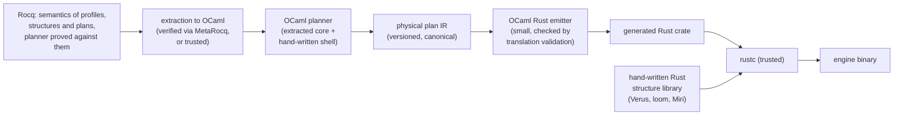
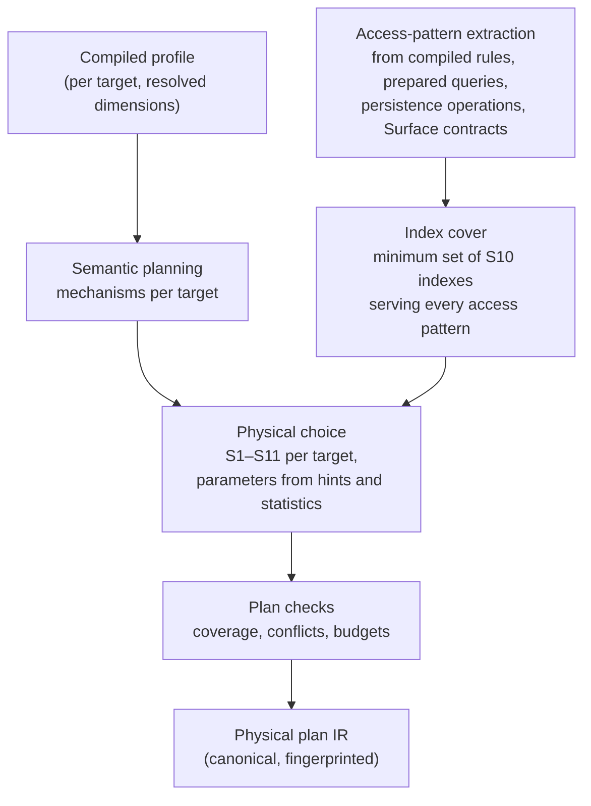
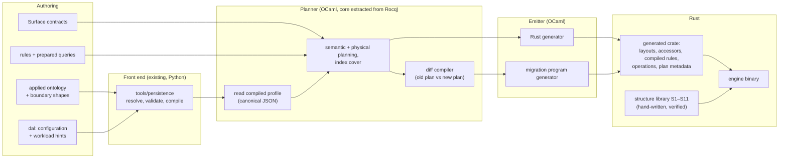

# Compiling persistence profiles into physical plans

**Technology exploration, 2026-10-03.** The second paper for the Rust RDF and Datalog engine
explored in [rdf-datalog-engine-technology-exploration.md](rdf-datalog-engine-technology-exploration.md)
(cited below as "the engine paper"). It analyses a proposal: compile an adopter's LATTICE
persistence configuration (`dal:`) into the physical indexes and storage structures the engine
uses for that adopter's data, and store persistence's infrastructure data (version rows,
tombstones, heads, receipts, claims) natively in those structures rather than as RDF graphs.

Statements are graded as in the engine paper. **Fact** means the cited source says so.
**Judgement** means a reasoned position that a prototype or benchmark could overturn. Nothing here
is a LATTICE decision. Adding workload hints to `ontology/persistence` would be an ontology change
under ADR-A86 and needs its own ADR before any work starts (§13.4).

**Status.** [engine-build-versus-adopt.md](engine-build-versus-adopt.md) recommends shelving this
paper until a measurement shows guarded writes dominate latency (its §7, D3).

---

## Contents

1. [Executive summary](#1-executive-summary)
2. [Decisions taken, and what they imply](#2-decisions-taken-and-what-they-imply)
3. [Proofs and generated code: Rocq or Isabelle](#3-proofs-and-generated-code-rocq-or-isabelle)
4. [The proposal, stated precisely](#4-the-proposal-stated-precisely)
5. [Why the infrastructure graphs exist](#5-why-the-infrastructure-graphs-exist)
6. [From profile to physical decision, dimension by dimension](#6-from-profile-to-physical-decision-dimension-by-dimension)
7. [The physical structure catalogue](#7-the-physical-structure-catalogue)
8. [The planner](#8-the-planner)
9. [Infrastructure data, stored natively](#9-infrastructure-data-stored-natively)
10. [Keeping the RDF view](#10-keeping-the-rdf-view)
11. [Code generation architecture](#11-code-generation-architecture)
12. [Change, recompilation and migration](#12-change-recompilation-and-migration)
13. [Workload hints](#13-workload-hints)
14. [Verification](#14-verification)
15. [Costs, risks, and when not to do this](#15-costs-risks-and-when-not-to-do-this)
16. [Decisions for the maintainer](#16-decisions-for-the-maintainer)
17. [Experiments](#17-experiments)
- [Appendix A: A worked example](#appendix-a-a-worked-example)
- [Appendix B: References](#appendix-b-references)

---

## 1. Executive summary

**The proposal is sound, and it is how specialised data systems are already built (judgement, high
confidence).** Relational engines do not store their lock tables, MVCC version chains or index
headers as rows in user tables. Soufflé chooses a data structure per relation (B-tree, Brie, or
equivalence relation) and selects indexes automatically from the access patterns of the compiled
program. DBToaster and LegoBase compile a known workload into a specialised engine. Data
representation synthesis (Hawkins et al.) derives concurrent data structures from relational
specifications. The LATTICE persistence profile is an unusually good input to this kind of
compiler, because it already states, declaratively and per target, the things a physical designer
needs to know: where the aggregate boundary falls, what concurrency control is required, what order
must be kept, what history must be retained, which keys must be unique, how identities are minted,
and how personal data must be erasable.

**Two claims are bundled in the proposal, and they deserve separate verdicts.**

| Claim | Verdict |
|---|---|
| **A.** Compile each target's resolved profile, together with the known rule and query set and optional workload hints, into a physical plan: which structures hold its data, which indexes serve it, and how they are concurrently accessed | **Adopt.** It is where most of the engine's performance headroom comes from (§6 to §8) |
| **B.** Store infrastructure data natively in those structures instead of in separate RDF graphs | **Adopt for storage, but not for observability.** Several infrastructure graphs exist only because RDF and SPARQL lack primitives, and those collapse. The others encode distributed-systems necessities (idempotency, epochs, retention, uniqueness) whose *semantics* must survive exactly, even though their *representation* changes. Keep all of it queryable as read-only virtual RDF graphs (§10) |

**Three conditions make it safe (judgement).**

1. **Separate the semantic plan from the physical plan.** The semantic plan follows only from the
   resolved profile and can change only through a versioned migration. The physical plan follows
   from the semantic plan plus hints and statistics, never changes meaning, and can be rebuilt
   online (§8.4).
2. **Make the transaction log logical and independent of physical layout.** Then every migration,
   however the physical plan changes, is "replay the logical history into the new plan", which turns
   a hard cost of the proposal into a well-understood mechanism (§12.3).
3. **Keep the generic SPARQL realisation as the test oracle.** The existing persistence compiler
   already generates portable SPARQL for every profile. Running the same operation histories
   against a conventional store executing that SPARQL, and against the native engine, gives
   differential testing for every configuration the planner can produce (§14.3).

**On proofs (judgement).** Yes, the compiler language decides the proof assistant more than
anything else does. With **OCaml**, choose **Rocq** (formerly Coq): extraction to OCaml is native,
mature, now has a verified extraction path through MetaRocq, and Rocq already has a production
precedent for proof-generated Rust (Fiat Cryptography). With **Haskell**, choose **Isabelle/HOL**,
whose code generator targets Haskell (and OCaml, SML and Scala) with data refinement that produces
efficient code. The recommended pairing is **OCaml with Rocq**, with Isabelle as a close second
(§3). This supersedes the engine paper's Lean 4 recommendation, which was made before the compiler
language preference was known.

**On cost (judgement).** The cost the proposal anticipates is real but bounded. Most ontology
changes in RDF are additive and need no storage migration. Rule changes only recompute derived
facts. The expensive changes are changes to persistence dimensions of existing targets, and those
fall into four classes (additive, rebuildable, lossy, forward-only), which a diff compiler can
classify mechanically before anything is deployed (§12).

---

## 2. Decisions taken, and what they imply

| Decision (recorded 2026-10-03) | Implication for this paper |
|---|---|
| Rust for the database runtime | the physical structures (§7) are Rust, hand-written once and verified, and the planner's output is Rust source or Rust-consumable plan data |
| The compiler toolchain is functional: Haskell or OCaml/OxCaml preferred, F# behind them | the physical planner, the diff compiler and the Rust emitter are written in that language |
| A polyglot codebase is acceptable | the pipeline can keep the existing Python persistence resolver as its front end (§11.2) |
| Proofs should generate quality source where possible, and a multi-stage pipeline is acceptable | the planner's core is specified and proved in a proof assistant and extracted (§3), and a separate, smaller emitter turns its output into Rust |

**OCaml or OxCaml for the compiler (judgement).** OxCaml (Jane Street's extended OCaml, with
unboxed types, modes and stack allocation) matters mainly for low-latency runtime code. A compiler
that runs at build time gains little from it and carries the cost of a branch that tracks upstream
OCaml at its own pace. Prefer mainline OCaml 5 for the compiler, and keep OxCaml in view if any OCaml
code ever runs on the hot path, which this design does not require.

**Haskell for the compiler (judgement).** Equally capable for compilers (GADTs, type classes,
parser combinators, `megaparsec`, `recursion-schemes`), and stronger for in-language lightweight
verification through Liquid Haskell and readable proof-derived code through `agda2hs`. Its laziness
and runtime are irrelevant at build time. The choice between OCaml and Haskell is therefore mainly
a choice of proof assistant and of team, not of capability.

**F# (judgement).** A credible third: ML-family syntax close to OCaml, the .NET toolchain, and F*
extracts to F#. It falls behind because neither Rocq nor Isabelle targets it directly.

---

## 3. Proofs and generated code: Rocq or Isabelle

### 3.1 What "generate quality source from proofs" can mean

Three different things, with different trust and different output quality.

| Route | What is proved | Output | Precedent |
|---|---|---|---|
| **Extraction** | a function inside the proof assistant, proved against its specification | that function as OCaml, Haskell, SML or Scala source | CompCert (Rocq to OCaml), CeTA (Isabelle to Haskell) |
| **Verified generator** | a generator inside the proof assistant, proved to emit code that meets a specification | code in another language, printed from a small IR | Fiat Cryptography (Rocq, emitting C, Rust, Go, Java and others, deployed in BoringSSL and Rust crates) |
| **Proof-producing translation** | each generated artefact individually, by a proof the translator produces alongside it | code plus a certificate | CakeML's translator (HOL4), translation validation in general |

**The proposal needs the second route for the Rust output**, with the first route for the planner
itself: the planner is proved and extracted to OCaml, and the planner emits a physical plan IR that
a small, separately checked emitter prints as Rust. That is precisely the multi-stage pipeline the
request anticipates, and Fiat Cryptography shows it working at production quality for Rust.

### 3.2 The candidates

| Criterion | Rocq | Isabelle/HOL | Lean 4 | Agda | F* | HOL4 |
|---|---|---|---|---|---|---|
| Extraction or code generation targets | OCaml (primary), Haskell, Scheme | SML, OCaml, Haskell, Scala | C (native compiler) | Haskell (MAlonzo, and `agda2hs` for readable Haskell) | OCaml, F#, C (KaRaMeL) | CakeML |
| Quality of generated code | good with extraction directives mapping `nat`, `Z` and lists to native types, and with primitive integers and arrays (`Int63`, `PArray`). Uses `Obj.magic` where dependent types are erased | good and readable. Code equations and data refinement swap abstract types for efficient ones (red-black trees, arrays) with proof | compiled directly, so no source to read | `agda2hs` output is idiomatic Haskell, for a restricted subset | good for its OCaml and F# targets | compiled to machine code by a verified compiler |
| Verified extraction | **yes**: MetaRocq's verified erasure and verified extraction to OCaml (Forster, Sozeau, Tabareau, PLDI 2024) | the code generator is trusted, with a well-studied semantics | n/a | no | no | yes, via CakeML |
| Efficient imperative code with proof | via Fiat-style generators or Iris-based developments | **Isabelle Refinement Framework and Isabelle-LLVM** (Lammich): verified imperative algorithms competitive with hand-written C | possible, young | no | Low* to C | CakeML |
| Bridges from Rust for verifying the runtime | `hax` (Rust to Rocq and F*), `coq-of-rust` | none mature | **Aeneas** (Rust to Lean) | none | `hax` | none |
| Compiler-verification ecosystem | very large (CompCert, Vellvm, Iris, MetaRocq, Fiat) | very large (Archive of Formal Proofs, IsaFoR/CeTA, seL4's proofs are in Isabelle) | growing fast | research | security-focused | CakeML |
| Natural partner language | **OCaml** | **Haskell** (also OCaml) | Lean itself | Haskell | F#, OCaml | none of the candidates |
| Licence | LGPL-2.1 (tool only, generated code is ours) | BSD-style (tool only) | Apache-2.0 | MIT-style | Apache-2.0 | BSD-style |

### 3.3 Recommendation

**Agreed, with one refinement (judgement).** The partner language does select the proof assistant,
but asymmetrically: Rocq is OCaml-first and its Haskell extraction is little used, whereas Isabelle
targets Haskell and OCaml about equally well. So:

- **OCaml compiler: Rocq.** Native extraction, a verified extraction path, a very large body of
  compiler proofs, `hax` and `coq-of-rust` for occasional verification of the Rust runtime against
  the same models, and Fiat Cryptography as direct precedent for proof-generated Rust.
- **Haskell compiler: Isabelle/HOL.** First-class Haskell generation with data refinement, the
  Refinement Framework if efficient imperative algorithms ever need proving, and seL4's precedent
  for industrial-scale proof maintenance. `agda2hs` and Liquid Haskell are useful supplements.

**Recommended pairing: OCaml with Rocq**, mainly because verified extraction shrinks the trusted base
and because the Rust-generating precedent is in Rocq. Isabelle with Haskell is a close and fully
defensible alternative. **This supersedes the engine paper's Lean 4 recommendation.** Lean's
advantage there was Aeneas, the Rust-to-Lean bridge, which matters less once the proved artefact is
the compiler rather than the runtime.

### 3.4 The trusted computing base of the pipeline



| Stage | Trust | How it is earned |
|---|---|---|
| Specification | **trusted, and the main risk**: a proof of the wrong property proves nothing useful | review, differential testing against the generic SPARQL realisation (§14.3) |
| Planner core | proved | Rocq |
| Extraction | verified (MetaRocq) or trusted (standard extraction) | MetaRocq where the planner fits its supported fragment |
| Planner shell (I/O, parsing the compiled profile) | tested | property-based tests, fuzzing |
| Plan IR | data, canonically serialised and fingerprinted | schema validation |
| Emitter | **translation validation** rather than proof: the generated crate embeds the plan it was generated from, and a checker re-derives the plan from the generated code's metadata and compares | a small checker, cheaper than proving the printer |
| Structure library | verified per structure | Verus for the key protocols, `loom` and `shuttle` exhaustively, Miri continuously (engine paper, Appendix A) |
| rustc, the OCaml compiler, the CPU | trusted | as for every system |

**The concurrency primitives cannot come out of Rocq (fact about the tools, judgement about scope).**
Atomics, memory orderings, `unsafe` layout and reclamation are not things extraction produces. The
proof covers what the planner composes and why the composition preserves the profile's semantics.
Each structure's own correctness is a separate obligation discharged in Rust tooling. §14.1 makes
this split explicit as a compositional proof.

---

## 4. The proposal, stated precisely

**Inputs.**

| Input | Source | Today |
|---|---|---|
| Resolved profile per target | `tools/persistence compile` → `dal:CompiledProfile` | exists |
| Domain ontology and boundary shapes | adopter's applied ontology, SHACL `dal:boundaryShape` | exists |
| Surface contracts | `ontology/surface`, `tools/surface` | exists, partially |
| Rule set and prepared query set | the engine's compiled rules and the persistence operations | rules: engine paper. Operations: `persistence instantiate` |
| Workload hints | **new** (§13) | proposed |
| Observed statistics | the running engine | proposed |

**Outputs.**

| Output | Changes when |
|---|---|
| **Semantic plan**: per target, which abstract mechanisms are required (CAS-guarded aggregate, append-only stream, unique key, idempotency, receipts, deltas, snapshots, retention, erasure scope) | the resolved profile changes |
| **Physical plan**: per target, which concrete structures from the catalogue (§7) realise those mechanisms, their parameters, and the secondary indexes chosen for the rule and query set | the semantic plan, hints or statistics change |
| Generated Rust | the physical plan changes |
| Migration program | the plan changes between two deployed versions |

**What the proposal replaces.** Today, a profile compiles to SPARQL templates against an RDF store
that must carry payload and infrastructure as quads in named graphs (guide §2.3). In the proposal,
the native engine realises the same profile semantics with structures chosen for it, and the RDF
form of infrastructure becomes a view (§10). The SPARQL realisation stays for every other store,
which keeps LATTICE's framework stance intact: the native engine is one realisation of a profile,
not a replacement for profiles.

---

## 5. Why the infrastructure graphs exist

The proposal's second claim depends on a distinction the guide's own text supports: some
infrastructure exists because RDF and SPARQL lack primitives, and some exists because distributed
systems are unreliable. The first kind collapses natively. The second kind survives with a new
representation.

The guide's Chapter 1 gives the RDF-specific reasons: set semantics hide lost updates, SPARQL Update
returns no value, and isolation is underspecified and store-dependent. Chapter 17's benefits A1 to
A7 explain why metadata is separated from payload. Every one of those benefits concerns contention,
lifetime or access control, all of which a native engine can provide through physical separation
without any RDF graph.

| Infrastructure (guide §2.3) | Why it exists | Kind | Native fate |
|---|---|---|---|
| **Meta version row** (`pat:epoch`, `pat:seq`, `pat:head`, `pat:deleted`) | CAS needs a single compare target, and set semantics hide lost updates | **semantic**: the CAS contract is the product | an aggregate header word, or a pointer to an immutable version record (§9.2) |
| **Meta sharding** (64 shards, `dal:metaShards`) | spread hot statements over engines whose conflict detection is graph- or page-granular (guide §17.3, F12) | **RDF artefact** | **collapses**: the engine's conflict granularity is the header itself |
| **Keys graph** (claim nodes) | uniqueness has no native SPARQL primitive | **semantic**: uniqueness is the product. Claim schemes (HMAC) are a privacy property | a lock-free unique index keyed by claim digest (§9.3) |
| **Txn graph** (claim per client transaction, with request digest) | an unreliable network can leave a client not knowing whether a write applied (guide §15, Chapter 25's `unknown`) | **semantic, distributed** | an idempotency table with expiry (§9.4) |
| **Log** (receipts, monthly buckets) | audit and ordering. Buckets exist so pruning is a graph drop | semantic (receipts), plus an RDF artefact (bucketing as a pruning device) | an append-only log in segments, where pruning is segment release |
| **Pinned heads** | bucket pruning would delete a live head's receipt (guide §24.2) | **RDF artefact** of bucket pruning | **collapses** into a reachability rule: compaction never frees a version reachable from a header |
| **Events** (per stream family and month) | append-form streams | semantic | per-stream log segments |
| **Deltas** (asserts and retracts per revision) | patch-log receipt model, replay and as-of | semantic | delta records in a per-aggregate version chain |
| **Snapshots** (sealed payload per revision) | snapshot-per-revision receipt model | semantic | immutable versions with structural sharing, far cheaper than whole-graph copies |
| **Retention** (low-water marks) | prefix pruning without losing correctness | semantic | per-target watermark fields |
| **Registry** (`dal:registryGraph`) | lets SPARQL discover a family's graphs | **RDF artefact** | **collapses** into the compiled catalogue |
| **Dataset node** (current epoch, order model) | restore can reset sequences, so ETags need an epoch (guide §17.2, §24.4) | **semantic, distributed** | the storage superblock |
| IRI encodings (zero-padded sequence numbers, epochs embedded in receipt IRIs) | SPARQL string ordering and IRI-based identity of receipts | **RDF artefact** for ordering. Semantic where receipt IRIs are exposed to clients | integers internally. IRIs rendered on demand with the same templates (§10.1) |

**A cost of the RDF form that is easy to miss (judgement).** Every revision mints at least one new
IRI (the receipt), and usually several (the txn claim, delta graph names). In a dictionary-encoded
store these are interned forever, so the dictionary grows with write history rather than with
domain size. The native form allocates integers and renders IRIs only when asked.

---

## 6. From profile to physical decision, dimension by dimension

Every dimension the persistence compiler resolves (`persistence.model.DIMENSIONS`), what it decides
semantically, and what it should decide physically. "Realisation-only" marks a dimension that
configures the RDF realisation and has no meaning for the native engine.

| Dimension | Values | Semantic decision | Physical decision (judgement) |
|---|---|---|---|
| `aggregateBoundary` | `NamedGraphBoundary`, `CompositePropertyBoundary`, `NoBoundary` | what one CAS-guarded write covers | **clustering**: an aggregate's payload lives together, behind one header (structures S2 to S4). `NoBoundary` targets go to the general store (S1) |
| `firstWrite` | `PreCreatedRow`, `AbsentRow` | whether creation is a CAS on an existing row or an insert-if-absent | `AbsentRow`: create is a CAS on the aggregate directory's bucket (empty to header). `PreCreatedRow`: the header exists at provisioning time |
| `concurrencyProfile` | `ProvidedConcurrency`, `Optimistic`, `AppendOnly`, `LockingConcurrency` | the write contract | `Optimistic`: CAS on the header's version. `AppendOnly`: no payload CAS, a log append (S5). `LockingConcurrency`: a header lock word. `ProvidedConcurrency`: delegated, so the engine provides its default for the target, recorded in the plan |
| `deadlockPolicy` | `EngineDetectAndRetry`, `SortedAcquisition`, `PartitionedWriter` | multi-aggregate write discipline | `SortedAcquisition`: acquire headers in aggregate-ID order, generated into multi-aggregate operations. `PartitionedWriter`: one owner thread per partition, **no atomics on the write path** (S9) |
| `minConcurrencyLevel` | e.g. `Linearizable` | the guarantee owed to clients | which header protocol and which memory orderings are admissible |
| `etagForm`, `etagRepresentation` | strong or weak, single or tagged | the HTTP conditional-request contract | **realisation-only for storage**. Rendered by the HTTP layer from the header's version |
| `orderingGrain` | `CommitGrain`, `EventGrain` | whether order is per commit or per event within a commit | `EventGrain`: per-event sequence numbers (`opSeq`) in the delta or event record |
| `globalReadStrategy` | `WatermarkedRead`, `LagWindowRead`, `DenseFeedRead`, `NoGlobalRead` | whether and how readers see a dataset-wide order | `DenseFeedRead`: a global sequencer (one serialisation point, which the engine paper's single writer provides). `WatermarkedRead`: a published global watermark. `NoGlobalRead`: no global sequence at all, which frees per-aggregate parallelism |
| `lagWindowMillis` | duration | read-after-write tolerance | the watermark publication interval |
| `contiguityCheckMode` | blocking or advisory | whether readers must detect gaps | blocking: dense sequences and a gap index. Advisory: a background audit |
| `receiptModel` | `ReceiptOnly`, `PatchLog`, `SnapshotPerRevision` | what history is kept | `ReceiptOnly`: receipts only, payload in place (S2). `PatchLog`: a version chain of deltas (S3). `SnapshotPerRevision`: persistent structures with structural sharing (S4) |
| `retentionMode` | `PrefixOnlyRetention`, `BucketAnyRetention` | which history may be pruned | segment-granular prefix release, or per-bucket release |
| `asOfFloorSource` | a source of the as-of floor | the earliest point as-of reads may target | a watermark feeding compaction |
| `metaTopology` | `SharedSharded`, `PerAggregate` | none for the native engine | **realisation-only**. Recorded, ignored, reported in the plan |
| `txnShards`, `logShards`, `keyShards`, `registryGraph` | counts, IRIs | none for the native engine | **realisation-only** |
| `epochGuardScope`, `epochAuthority` | `ExternalHighWaterMark`, `RestoreControlledEpoch`, `WriterStartRefusal`, `StoreLocalEpoch` | where epochs come from and what they guard | the superblock's epoch field, its source, and which headers embed it |
| Uniqueness (`dal:UniquenessConstraint`, many-valued) | constraints with `dal:onViolation`, `dal:claimScheme` | which keys must be unique, how violations reconcile, how keys are hidden | one unique index per constraint (S6), keyed by the claim digest. Dual-scheme rotation becomes two index entries per owner during rotation, mirroring `key-claim-write-dual` |
| Identity (`identity:<Role>`) | surrogate, derived hash, position-derived event, and the rest | how IRIs are minted per resource role | internal IDs: surrogates map to dense IDs with a side table to the IRI. Position-derived event IDs **are** log positions, so no allocation is needed |
| `privacyClass`, `erasureStrategy`, `erasurePrecedence`, `perSubjectScoped` | personal, internal, public. Per-subject drop, crypto-shred, none | how personal data is erased | `PerSubjectGraphDrop`: **per-subject arenas**, so erasure is arena release (S8). `CryptoShred`: per-subject keys in a key table, payload encrypted at rest, erasure deletes the key |

**Reading the table (judgement).** Of the dimensions, roughly a third decide physical structure
directly (boundary, concurrency, receipts, uniqueness, erasure), a third decide parameters of a
structure (ordering, retention, epochs, identity), and the rest are realisation-only. That ratio is
what makes compilation worthwhile: the profile already carries most of what a physical designer
would ask an adopter.

---

## 7. The physical structure catalogue

A finite set of hand-written, verified Rust structures, each generic over generated key and payload
layouts. The planner composes them. It never invents a new one. This finiteness is what keeps the
verification tractable (§14.1).

| # | Structure | Realises | Concurrency (writes / reads) | Chosen when |
|---|---|---|---|---|
| **S1** | **General store**: the engine paper's hash-indexed triple or quad table with MVCC | payload with no boundary, and anything unconfigured | lock-free inserts (paper C1 to C7), MVCC retire by CAS / wait-free snapshots | `NoBoundary`, or no profile at all. The default plan |
| **S2** | **Aggregate in place**: a header plus a small aggregate-local index over the aggregate's facts, updated in place under the header's CAS | `Optimistic` + `ReceiptOnly` | CAS on the header, writer builds the new local index off to the side and swaps it in / readers follow the header pointer under an epoch guard | small aggregates, read-heavy hints |
| **S3** | **Aggregate version chain**: header → newest version record → delta (asserts, retracts) → older versions, periodically consolidated | `Optimistic` + `PatchLog` | one CAS publishes a new version record / readers walk to their snapshot's version | write-heavy or large aggregates, or whenever deltas are required |
| **S4** | **Aggregate persistent snapshot**: a persistent map (HAMT or persistent B-tree) per aggregate, each revision a new root sharing unchanged nodes | `SnapshotPerRevision` | CAS on the root / any revision readable without blocking | snapshot history required |
| **S5** | **Append log**: segmented, per stream or per family, positions allocated by fetch-and-add or by the single writer | `AppendOnly`, events, receipts | append only / readers scan by position, never blocked | event streams, receipts, audit trails |
| **S6** | **Unique index**: open-addressing map from claim digest to owner, claim-then-publish as the paper's C1 with pre-allocated entries | uniqueness constraints | lock-free claim, CAS to retire / lookups wait-free | one per uniqueness constraint |
| **S7** | **Idempotency table**: map from client transaction ID to (request digest, outcome), with a timing wheel for expiry | txn claims, request-digest idempotency | lock-free insert, expiry by the owning thread / lookups wait-free | any target whose operations accept client transaction IDs |
| **S8** | **Per-subject arena**: an allocation region per data subject, with every structure for that subject's data placed in it | `PerSubjectGraphDrop` | as the structure inside it | personal data with per-subject erasure |
| **S9** | **Partition owned by one thread**: any of S2 to S5, owned by a pinned thread, with no atomics on the write path. Readers access published versions through a sequence lock or epoch publication | `PartitionedWriter` | single writer / readers lock-free | `PartitionedWriter`, or hot-aggregate hints |
| **S10** | **Secondary index**: a hash or sorted index over one access pattern (predicate-object, object-predicate, a Surface-promoted property), global or per aggregate family | access paths needed by compiled rules and queries | lock-free insert, MVCC filtering / wait-free | chosen by the access-pattern cover (§8.3) |
| **S11** | **History segment**: compacted, immutable, columnar (sorted runs) | retained history beyond the hot window, as-of reads | written by compaction / scans | `asOfFloorSource` and retention beyond the hot window |

**Interactions worth naming (judgement).**

- **S2 versus S3 is the central trade-off.** In-place with copy-on-write of the aggregate-local index
  costs a copy proportional to aggregate size per write, and gives readers the shortest path. A
  version chain costs one record per write proportional to the change, and gives readers of the
  newest version one extra hop. Small, read-heavy aggregates favour S2. Large or write-heavy ones
  favour S3. Hints decide (§13).
- **S8 composes with everything.** Per-subject arenas determine where other structures allocate, not
  which structures exist. This is the cleanest available realisation of per-subject erasure, and far
  cheaper than the RDF form, where erasure means finding and deleting a subject's quads in every
  graph.
- **S10 reintroduces global contention.** Every secondary index is shared across aggregates, so the
  planner must not add indexes the compiled workload does not need. This is the main reason the
  access-pattern cover in §8.3 minimises rather than maximises.

---

## 8. The planner

### 8.1 Pipeline



### 8.2 Semantic planning

A total function from a resolved profile to a set of required mechanisms, defined in Rocq and
extracted (§14.1). It refuses rather than guesses, in the same spirit as the persistence compiler's
existing refusals: a combination with no realisation in the catalogue is a compile-time error naming
the dimensions involved, never a silent downgrade. Examples of refusals worth having:

- `AppendOnly` combined with `SnapshotPerRevision` on a target whose boundary makes snapshots
  unbounded in size, unless a hint sets a size cap.
- `DenseFeedRead` combined with `PartitionedWriter` across partitions, which would need a global
  sequencer the partition design exists to avoid, unless the engine's single writer is declared as
  that sequencer.
- `PerSubjectGraphDrop` on a target whose boundary shape crosses subjects, so one aggregate would
  span several arenas.

### 8.3 Index selection as an access-pattern cover

**The workload is known (fact about this design).** The engine paper's argument that LATTICE knows
its rule set and prepared queries at build time makes classic physical design tractable here, in a
way it is not for general-purpose databases.

**Method (judgement, with precedent).** Extract every access pattern (which positions of a triple or
quad are bound when a lookup happens) from every compiled rule body (each body atom, under the join
order the compiler chose), every prepared query, every persistence operation and every Surface
lookup. Then choose a minimum set of indexes such that each pattern is a prefix of some index's key
order. Soufflé solves exactly this problem by reducing it to a minimum chain cover of the pattern
lattice, which is polynomial (Subotić, Jordan, Chang, Fekete, Scholz, VLDB 2018). The same reduction
applies here, per relation or per predicate partition, with two extensions:

- **Clustered patterns are free.** A pattern whose bound positions include the aggregate identifier
  is served by the aggregate's own local structure (S2 to S4) and needs no global index.
- **Hash versus order.** A pattern used only for equality lookups needs a hash index. A pattern used
  for ranges (time windows, price bands) or merge-style joins needs an ordered one. The cover is
  computed with that distinction.

**A property worth proving (judgement).** Coverage: every access pattern in the compiled workload is
served by a chosen index or by a declared, bounded scan. It is short to state in Rocq and catches the
whole class of "the plan forgot an index" bugs (§14.1).

### 8.4 Semantic plan versus physical plan

| | Semantic plan | Physical plan |
|---|---|---|
| Derived from | resolved profile only | semantic plan, hints, statistics, hardware profile |
| Determines | what the engine guarantees | how fast it does it |
| Can change | only through a versioned, classified migration (§12) | online, by rebuilding structures in the background and swapping them in, because meaning cannot change |
| Fingerprint | part of the deployed version's identity, checked at start-up | recorded, not identity-bearing |
| Proved | refinement of the profile semantics (§14.1) | coverage, and that it realises the semantic plan |

**This separation is what makes hints safe (judgement).** A hint can only ever influence the physical
plan, so a wrong hint can make the engine slower, never wrong. It is also what lets the engine adapt
to observed statistics without a redeployment, which matters because workload hints declared at
design time are often inaccurate.

### 8.5 Code generation versus plan as data

| | Full code generation | Plan as data | Hybrid (recommended, judgement) |
|---|---|---|---|
| What is generated | specialised Rust for every structure instance and operation | nothing. A generic engine reads the plan at start-up and instantiates structures | typed accessors, compiled rules and queries, operation glue and migration programs as Rust. Structures from the catalogue, monomorphised over generated layouts |
| Performance | full specialisation | dynamic dispatch and generic layouts cost on every access | close to full generation where it matters (hot loops over known layouts) |
| Online physical replanning | needs a rebuild and restart | yes | yes for physical choices within the compiled layouts, restart for new layouts |
| Multi-tenant with different configurations | one binary per configuration | one binary | one binary per configuration family, with plan-as-data for parameters |
| Verification | generated code is large and varied | one engine to verify | catalogue verified once, generated glue checked by translation validation |
| Build time | long (rustc on a large generated crate) | none | moderate |

---

## 9. Infrastructure data, stored natively

### 9.1 What the native form must preserve

The guide's Chapter 17 benefits are properties of the *separation*, not of RDF. Each carries over.

| Benefit (guide §17.1) | Native realisation |
|---|---|
| A1 the version row is a single hot statement | the header word is the single hot location |
| A2 O(1) guard regardless of aggregate size | the header is fixed-size and separate from payload |
| A3 replacing payload cannot erase the order | version state lives in the header and version records, never in the payload structure |
| A4 head pointer for free | the header points at the newest version record |
| A5 different retention, backup and access rules for mutable state, metadata and log | different structures with different lifetimes (S2/S3, headers, S5) |
| A6 writes to different aggregates do not contend | different headers on different cache lines |
| A7 care is localised to one small location | one header protocol, verified once |

### 9.2 The aggregate header

Two layouts, with a real trade-off.

```rust
// Layout H1: one word, CAS on version, head carried in the version record it points to.
#[repr(C, align(64))]                 // one cache line per header (A6)
pub struct AggregateHeader {
    current: AtomicU64,               // offset of the immutable current VersionRecord (pat:head)
    flags: AtomicU32,                 // tombstone, erasure pending (pat:deleted)
    arena: u32,                       // per-subject arena (S8), fixed at creation
}

#[repr(C)]
pub struct VersionRecord {            // immutable once published
    epoch: u32,                       // pat:epoch
    seq: u64,                         // pat:seq
    prev: u64,                        // pat:prevRev, as an offset
    delta: u64,                       // S3: this revision's asserts and retracts
    txn: u64,                         // pat:txn, an index into S7
    recorded_at: u64,                 // pat:recordedAt, nanoseconds
}
```

```rust
// Layout H2: two words updated together, needing a 128-bit CAS.
#[repr(C, align(64))]
pub struct AggregateHeader2 {
    version_and_head: portable_atomic::AtomicU128,  // (epoch:24 | seq:40) and the head offset
    flags: AtomicU32,
    arena: u32,
}
```

| | H1: indirection | H2: double-width CAS |
|---|---|---|
| Atomicity | single-word CAS, portable to every target | `cmpxchg16b` on x86-64, `CASP` on ARMv8.1 and later |
| Reader cost for the guard check | one extra pointer chase to read `seq` | one load |
| Version record | always allocated, and naturally the receipt | optional |
| Verification | the RCU pattern, well understood | simpler state, but platform-specific |
| Recommendation (judgement) | **default**: the version record is needed anyway for receipts and deltas | for `ReceiptOnly` targets on hardware with double-width CAS, where avoiding the hop matters |

**The CAS contract is unchanged.** A client supplies the expected `(epoch, seq)`, the engine compares
against the current version record, and publishes a new one with `seq + 1` on success. The answer is
`Applied(new version)`, `Conflict(current version)` or, only for clients across an unreliable
network, `Unknown`, resolved through S7 (§9.4). In-process callers never see `Unknown`, which the
RDF realisation cannot offer.

### 9.3 Uniqueness

Each `dal:UniquenessConstraint` becomes one S6 index keyed by the claim digest, so the plaintext key
never needs to be stored when the claim scheme is HMAC-based (guide §6.1). Claiming is the paper's
claim-then-publish protocol on a bucket. Retiring is a CAS that only the owning aggregate's write can
perform, which preserves the guide's rule that only a claim's owner may retire it. `dal:onViolation`
keeps its meaning: the guarded write always prevents the race, and the reconciler (audit, merge
relation, quarantine) runs against the index for duplicates created by bulk load or restore, exactly
as §3a of the ontology README describes.

### 9.4 Idempotency

S7 maps a client transaction ID to its request digest and outcome. A retried request with the same ID
and digest returns the recorded outcome. The same ID with a different digest is refused, which is the
guide's §15.2 rule. Expiry follows the profile's TTL through a timing wheel owned by one thread.
Entries for in-flight transactions are pinned against expiry.

### 9.5 Logs, events, deltas and retention

| Mechanism | Native form |
|---|---|
| Receipts | the version records themselves, plus an S5 log entry pointing at each, so receipts are both reachable from their aggregate and scannable in global order |
| Events | S5 per stream family. Event identities under `PositionDerivedEvent` are their log positions |
| Deltas | S3 delta records. Their IRIs (guide §2.3) are rendered on demand |
| Retention | a low-water mark per target. Compaction releases whole segments below it. Anything reachable from a live header is retained, which is why pinned heads disappear as a mechanism |
| As-of floors | feed S11 compaction, which keeps compacted history above the floor |

### 9.6 The write path, compared

An `Optimistic` + `PatchLog` write with a client transaction ID and one unique key, changing *n*
payload facts. Counts are approximate and illustrate scale, not a benchmark (judgement).

| Step | RDF realisation (guide Part V) | Native realisation |
|---|---|---|
| Idempotency check and claim | lookup plus 2 quad inserts in the txn graph, a new txn IRI interned | one S7 lookup and one CAS |
| Guard and version update | read the meta row, delete 3 and insert 3 quads | one CAS on the header |
| Receipt | about 8 quad inserts, a new revision IRI interned | one version record, one S5 append |
| Delta | 2*n* quad inserts into two new graphs, two new graph IRIs interned | one delta record of *n* entries |
| Payload | *n* quad changes | *n* changes in the aggregate's structure |
| Unique key | about 3 quad inserts in the keys graph | one S6 CAS |
| **Total** | about 20 + 3*n* quad operations, each maintaining several indexes, plus 3 or more new dictionary entries | about 5 atomic operations + *n* payload changes, no new dictionary entries |

---

## 10. Keeping the RDF view

### 10.1 Virtual infrastructure graphs

Every infrastructure graph of guide §2.3 remains queryable, read-only, as a **virtual graph** whose
triples are produced on demand from native structures, with IRIs rendered by the same templates the
SPARQL realisation would have minted (`dal:mintedIriTemplate`, receipt IRI patterns, zero padding).
A SPARQL query over `<urn:g:txlog/2026-09>` or `<urn:g:keys>` gets the triples the RDF realisation
would have stored. Writes to virtual graphs are refused.

This keeps three things the proposal would otherwise lose:

- **Audit.** Regulators and operators can inspect version history, claims and receipts with the
  same queries and tools as for any LATTICE store.
- **Rules over infrastructure.** Where a rule needs infrastructure facts ("latest revision time",
  "claimed by"), they are virtual EDB relations backed by native structures, with access patterns
  known to the planner like any other.
- **Portability.** An export streams payload and virtual graphs as quads, which a conventional store
  can load and then operate with the SPARQL realisation. The native engine never becomes a dead end.

### 10.2 The conformance test kit

The guide's Chapter 27 defines a conformance test kit for stores. The native engine should pass the
same kit through two interfaces: the operation API (applied, conflict, unknown outcomes and their
semantics), and SPARQL over the virtual graphs (the infrastructure state each operation leaves). A
store and the native engine passing the same kit is the concrete meaning of "one realisation of a
profile".

---

## 11. Code generation architecture

### 11.1 The full pipeline



### 11.2 The front end and the interchange format

**Keep `tools/persistence` as the single authority for profile resolution (judgement).** It
implements the precedence algorithm, the scope kinds and every refusal the ontology defines, and it
is tested against the ontology's own examples. Reimplementing resolution in the planner would create
two authorities that could disagree. The planner consumes the compiled profile, not the raw
configuration.

**Define a canonical JSON form of the compiled profile (judgement).** The compiled profile is RDF
today. OCaml's RDF libraries are thin and their licences need checking. The persistence compiler
already writes minting recipes as RFC 8785 canonical JSON with a SHA-256 digest, so a JSON Schema for
"compiled profile interchange" in the same style is consistent with existing practice, gives the
planner a typed input, and gives the plan fingerprint a stable input. Adding it is a change to
`tools/persistence` and to LATTICE's contracts, so it needs its own decision (§16).

### 11.3 What is generated and what is hand-written

| Artefact | Generated or hand-written | Why |
|---|---|---|
| Structures S1 to S11 | hand-written, generic, verified once | concurrency code must be verified in Rust tooling, and a finite catalogue keeps that tractable |
| Layouts (payload record types per class, header and version record parameters) | generated | known from the ontology and the plan, and monomorphising over them removes indirection |
| Typed accessors and operations per target | generated | the persistence operations (create, CAS replace, tombstone, claim, retire, audits) become typed Rust functions |
| Compiled rules and prepared queries | generated | the engine paper's compiled evaluation |
| Virtual graph renderers | generated | IRI templates are per target |
| Migration programs | generated | from the diff compiler (§12.4) |
| Plan metadata embedded in the binary | generated | for translation validation and start-up checks |

### 11.4 Rust specifics

- **Monomorphisation is the specialisation mechanism.** `S3<OrderLayout, OrderDelta>` compiles to code
  as specialised as hand-written code, with no runtime dispatch.
- **Split the generated crate by aggregate family** to keep incremental builds tolerable. A large
  generated crate can take minutes to compile, which is acceptable for a deployment step in a slowly
  changing domain and not acceptable in an edit-compile loop, so the plan-as-data mode (§8.5) should
  remain available for development.
- **Readable output.** Generated Rust is formatted, commented with the plan elements it realises, and
  carries source locations back to the profile nodes, so a debugger and a reviewer can trace any
  generated function to the configuration that caused it.

---

## 12. Change, recompilation and migration

### 12.1 What can change

| Change | Example | Storage consequence |
|---|---|---|
| Rule change | a new behaviour rule | none to base data. Derived facts recompute |
| Prepared query change | a new report query | possibly a new secondary index (S10), built online. Physical only |
| Ontology: new class or property | a new instrument type | additive. RDF is schema-on-read, so existing data is untouched |
| Ontology: removed class or property | a retired field | data remains. Indexes on it may be dropped. Archive by policy |
| Boundary shape change | a property joins an aggregate's closure | re-clustering of affected aggregates, rebuildable from existing data |
| Profile dimension change for an existing target | `ReceiptOnly` to `PatchLog` | depends on the dimension (§12.2) |
| Hint change | expected write rate raised | physical only, rebuilt online |
| Identity strategy change | surrogate to derived hash | **breaking** for anything that stored the old IRIs |

**The key observation (judgement).** RDF's open-world, schema-on-read data model absorbs most domain
ontology change without migration. The cost of the proposal therefore concentrates where the
proposal itself concentrates: in persistence dimensions and boundaries. Those are exactly the
decisions an insurance or financial operator changes rarely, and deliberately.

### 12.2 Classifying dimension changes

Four classes, decided mechanically by the diff compiler.

| Class | Meaning | Deployable |
|---|---|---|
| **Additive** | nothing existing changes | online |
| **Rebuildable** | the new structures can be derived completely from existing data | online, by background rebuild and swap, or by log replay |
| **Lossy** | the change discards information (a downgrade) | only with explicit acknowledgement recorded in the deployment |
| **Forward-only** | the new semantics needs history that was never kept | only with explicit acknowledgement, and the cut-over point is recorded so as-of reads know where the new guarantee starts |

| Dimension change | Class | Notes |
|---|---|---|
| `NoBoundary` → `NamedGraphBoundary` or `CompositePropertyBoundary` | rebuildable, **may fail** | existing facts must be assigned to aggregates. Facts reachable from two aggregates' boundaries, or from none, are reported and block the migration until reconciled |
| between the two boundary kinds | rebuildable | |
| any boundary → `NoBoundary` | rebuildable | aggregate headers become history only |
| `firstWrite` | additive | affects creation only |
| `Optimistic` ↔ `LockingConcurrency` | rebuildable | header protocol changes, data does not |
| `AppendOnly` → `Optimistic` | rebuildable | fold each stream into current state |
| `Optimistic` → `AppendOnly` | forward-only | past revisions exist only as receipts or deltas, not as appended events |
| `ProvidedConcurrency` → explicit | rebuildable | |
| `CommitGrain` → `EventGrain` | forward-only | past commits have no per-event order |
| `EventGrain` → `CommitGrain` | lossy | per-event order discarded |
| `globalReadStrategy` → `DenseFeedRead` | rebuildable **if** a total order of past commits exists (the engine's single-writer log provides one), otherwise forward-only | |
| `DenseFeedRead` → anything weaker | additive in data, a weaker client contract | the contract change itself needs acknowledgement |
| `ReceiptOnly` → `PatchLog` | forward-only | past deltas were never recorded |
| `PatchLog` → `SnapshotPerRevision` | rebuildable | replay deltas to build snapshots |
| `ReceiptOnly` → `SnapshotPerRevision` | forward-only | |
| `PatchLog` or `SnapshotPerRevision` → `ReceiptOnly` | lossy | |
| retention shortened | lossy | |
| retention lengthened | forward-only | already-pruned history is gone |
| realisation-only dimensions (`metaTopology`, shard counts, `registryGraph`) | no-op | recorded, no native effect |
| `etagForm`, `etagRepresentation` | no-op for storage | a client-visible contract change |
| uniqueness constraint added | rebuildable, **may fail** | build the index. Existing duplicates follow `dal:onViolation`: `Reject` blocks the migration with an audit report, `Merge` and `Quarantine` run their reconcilers |
| uniqueness constraint removed | additive | drop the index |
| claim scheme rotation | **already online by design** | `key-claim-write-dual` semantics: two index entries per owner during rotation |
| identity strategy changed | **breaking** | refused by default. Allowed only with an alias table from old to new IRIs and an acknowledgement |
| `epochAuthority` | additive | operational |
| → `PerSubjectGraphDrop` | rebuildable | re-allocate into per-subject arenas |
| → `CryptoShred` | rebuildable, costly | encrypt existing personal data under per-subject keys |
| → `NoErasure` | lossy in the sense of a weaker guarantee | needs acknowledgement under the privacy class |

### 12.3 The migration mechanism

**Make the log logical (judgement, a precondition for the whole proposal).** The engine paper already
logs base-fact deltas and derives everything else. If the log records operations in terms of terms
and facts, and never in terms of offsets, structure identifiers or physical layout, then any plan can
rebuild its state from any history.

**Blue/green cut-over by replay (judgement).**

1. Start the new engine version with the new plan, alongside the old.
2. Load the latest logical snapshot of base facts into it, building the new structures.
3. Replay the logical log from the snapshot point, then tail it live.
4. Run the migration program's checks (no blocking duplicates, no unassigned facts, retained
   guarantees) and compare canonical state hashes (engine paper §4.5) between old and new for every
   rebuildable dimension.
5. Cut clients over atomically at a log position. Keep the old engine and its storage until the new
   one is verified.

For physical-plan-only changes the same mechanism runs inside one engine version: build the new
structure from a snapshot, catch up from the log, swap.

**Cost (judgement).** Replay time is proportional to the base facts in the snapshot plus the log tail,
not to history, provided snapshots are frequent. At hundreds of thousands to millions of facts per
second per core of rebuild throughput (to be measured, experiment X4), a billion base facts rebuild in
minutes to tens of minutes, in the background.

### 12.4 The diff compiler and versioning

The diff compiler takes two physical plans and produces:

- the class of every change (§12.2), refusing to proceed on lossy, forward-only or breaking changes
  without recorded acknowledgement
- the migration program: rebuild steps, checks, and the canonical hash comparisons that must hold
- the **required version bump**: a physical-only change is a patch, an additive or rebuildable change a
  minor version, and a lossy, forward-only or breaking change a major version, mirroring ADR-A86's
  approach for ontologies

**Plan fingerprint.** Each deployment carries the fingerprint of its semantic plan, computed over the
canonical compiled profile, the version IRIs of the ontologies it was compiled from (ADR-A86 and
ADR-A88 make these available), and the planner version. The engine refuses to open storage whose
fingerprint differs from its own without a migration in progress.

### 12.5 Rollback

Rebuildable and additive changes can be rolled back by the same replay mechanism in reverse, because
the logical log is plan-independent. Lossy and forward-only changes cannot be fully rolled back:
rolling back restores the old plan, but information discarded or never recorded stays absent. The
diff compiler states this before the change is made, not after.

### 12.6 How often this will happen in the target domains

**Judgement.** Insurance and financial transaction domains change their persistence semantics rarely:
an aggregate boundary or a receipt model is usually decided once per product line. Regulatory change
arrives a few times a year and is overwhelmingly additive (new attributes, new reports, new
retention floors). New products arrive as new classes, which are additive. The proposal's cost model
fits these domains well. It would fit poorly where adopters reconfigure frequently (§15.3).

---

## 13. Workload hints

### 13.1 What the planner wants to know

| Hint | Influences |
|---|---|
| expected read-to-write ratio per target | S2 versus S3, reader paths |
| expected write rate per target, and its peak | log segment sizing, partitioning (S9) |
| contention shape: uniform, a few hot aggregates, one dominant aggregate | S9 for hot aggregates, combining writes for one dominant aggregate |
| aggregate size distribution (median and tail, in facts) | S2 copy cost, S4 node size, S3 consolidation interval |
| access patterns beyond the compiled workload (ad hoc queries expected on a target) | extra S10 indexes, S11 layout |
| latency class: interactive or batch | spinning versus parked workers, prefetch strategy |
| history query frequency | S11 retention granularity and layout |

### 13.2 Laws

1. **Hints never change semantics.** They select among realisations of the same semantic plan.
2. **A missing hint means "no preference"**, which selects the planner's default for that dimension,
   not a pessimistic choice.
3. **Hints resolve like every other dimension**, by the same scope kinds and precedence, so a hint can
   be declared per class, per deployment or per graph pattern.
4. **Observed statistics may override hints in the physical plan**, and the engine reports every
   override, because a declared hint that the workload contradicts is useful information for the
   adopter.

### 13.3 A sketch of the vocabulary

Illustrative only. Not part of `dal:` today.

```turtle
ex:OrderWorkload a dal:WorkloadHint ;
    dal:appliesTo                ex:OrderClass ;
    dal:expectedReadWriteRatio   "4.0"^^xsd:decimal ;
    dal:expectedWriteRate        "20000"^^xsd:integer ;     # per second, peak
    dal:contentionShape          dal:FewHotAggregates ;
    dal:aggregateSizeMedian      "40"^^xsd:integer ;        # facts
    dal:aggregateSizeTail        "400"^^xsd:integer ;       # facts at the 99th percentile
    dal:latencyClass             dal:Interactive .
```

### 13.4 Where hints should live

| Option | For | Against |
|---|---|---|
| In `ontology/persistence` as new `dal:` terms | one configuration surface, the existing resolution and scoping machinery, discoverable by every LATTICE tool | an ontology change, so a minor version bump under ADR-A86, the import cascade, catalogue and release rows, and a new ADR. It also puts engine-specific knobs into a framework vocabulary that every other realisation would ignore |
| In an engine-local hints file outside the ontology, scoped by the same target IRIs | no ontology change, engine-specific concerns stay with the engine | a second configuration surface, and its own scoping rules |

**Judgement.** Start engine-local, keyed by the targets the persistence compiler reports, and
promote to `dal:` only once the hint set has proved stable across more than one realisation. That
keeps LATTICE's framework stance ("Lattice should not impose design decisions on its users") intact
while the engine is young.

---

## 14. Verification

### 14.1 What to prove, and where

**A compositional refinement argument (judgement).** Write an abstract semantics for each profile
dimension combination as a state machine (the guide's semantics: CAS outcomes, receipts, uniqueness,
idempotency, retention). Write an abstract specification for each catalogue structure. Then prove in
Rocq:

> If every structure meets its specification, the composition the planner chooses for a resolved
> profile refines that profile's abstract semantics.

That splits the work into a proof the planner owns (composition) and obligations the Rust library
owns (each structure against its specification, discharged with Verus, `loom`, `shuttle` and Miri as
in the engine paper's Appendix A). The planner proof does not mention atomics. The structure proofs
do not mention profiles.

| Property | Proved in | Tool |
|---|---|---|
| Semantic planning is total and never silently downgrades (§8.2) | planner | Rocq |
| The physical plan realises the semantic plan | planner | Rocq |
| Index coverage of every compiled access pattern (§8.3) | planner | Rocq |
| The diff compiler's classification is sound: anything it calls rebuildable is reconstructible from the abstract state | diff compiler | Rocq |
| Migration programs preserve the abstract state for rebuildable changes | diff compiler | Rocq for the program schema, canonical hash checks at run time |
| Each structure meets its specification | Rust library | Verus, `loom`, `shuttle`, Miri |
| The emitter prints the plan it was given | emitter | translation validation |
| Profile resolution | front end | existing tests in `tools/persistence`. A Rocq model of the precedence algorithm is optional and valuable later |

### 14.2 The combinatorial problem

Code generated per configuration multiplies the configurations that must be tested. The refinement
proof addresses this for the composition logic. For the generated code and the runtime as a whole,
**generate configurations**: property-based generation of valid `dal:` configurations (the ontology's
shapes define validity), compiled end to end, with the conformance kit and differential tests (§14.3)
run against each.

### 14.3 The generic SPARQL realisation as the oracle

The existing persistence compiler already produces portable SPARQL for every configuration it
accepts. Executed on a conventional store with serialisable transactions (an embedded store run
single-threaded under test is enough), it is an independent implementation of the same semantics.

| Test | Method |
|---|---|
| Operation outcomes | the same randomised operation history against both. Applied, conflict and refusal outcomes must match |
| Infrastructure state | after each history, compare the native engine's virtual graphs with the oracle's real infrastructure graphs, modulo IRI-rendering of internal identifiers |
| Payload state | compare canonical multiset hashes of payload |
| Migration | migrate the native engine across a configuration change, and compare with the oracle store loaded from an export and operated under the new configuration's SPARQL |

The oracle has the guide's own weaker points (store isolation, `unknown` outcomes), so it runs in a
controlled single-process setting where those cannot arise. It tests semantics, not performance.

---

## 15. Costs, risks, and when not to do this

### 15.1 Costs

| Cost | Size (judgement) | Mitigation |
|---|---|---|
| A planner, a diff compiler, an emitter and a structure catalogue to build and maintain | large, the main engineering investment | a finite catalogue, a staged rollout starting from S1 (the general store) plus S3, S5 and S6 |
| Recompilation on configuration change | small per change, rare in the target domains | plan-as-data mode for development |
| Migration on semantic change | moderate, mechanised | logical log, replay, classification |
| Proof engineering | significant, specialist skills | prove composition and coverage first, extend later |
| Longer builds | minutes per deployment | crate splitting, caching |
| Two realisations of every profile to keep in step | ongoing | the oracle tests run in CI against both |

### 15.2 Risks

| # | Risk | Mitigation |
|---|---|---|
| R1 | The planner chooses a structure whose semantics subtly differs from the profile's | refinement proof (§14.1) and oracle differential tests (§14.3) |
| R2 | A hint makes a plan pathological under the real workload | hints affect only the physical plan, statistics override them, overrides are reported |
| R3 | The catalogue grows without discipline, and verification falls behind | admission criteria for a new structure: a specification, a verification plan and a profile combination it is needed for |
| R4 | The logical log accidentally encodes physical details, breaking replay-based migration | a log schema reviewed for layout independence, and a CI test that replays every log into at least two different plans |
| R5 | Virtual graphs drift from the SPARQL realisation's real graphs | the conformance kit and oracle comparison of infrastructure state |
| R6 | Identity changes slip through as "minor" | identity strategy changes are breaking by rule in the diff compiler |
| R7 | Multi-aggregate operations deadlock or livelock | `deadlockPolicy` compiles to sorted acquisition or partition ownership, and the multi-aggregate protocol is model-checked in TLA+ or Quint |
| R8 | Per-subject arenas fragment memory badly with many small subjects | arena size classes, and a hint for subject cardinality |

### 15.3 When not to do this

- **Frequently reconfigured deployments**, such as a multi-tenant service where tenants change their
  persistence semantics at will. Use the general store (S1) and plan-as-data.
- **Early product development**, when boundaries and receipt models are still being discovered. The
  general store and the SPARQL realisation are cheaper until the configuration settles.
- **Ad hoc analytical workloads** whose access patterns cannot be known in advance. Serve them from
  S11 history segments or an analytic side path, not by adding secondary indexes to the hot store.

---

## 16. Decisions for the maintainer

Proposed, none taken. Numbered for reference if this becomes a LATTICE unit.

| # | Decision | Options | Recommendation (judgement) |
|---|---|---|---|
| PP-D1 | Adopt compiled physical planning | (a) yes, with the general store as the default plan for anything unconfigured. (b) no, one general store for everything | (a) |
| PP-D2 | Proof assistant | (a) Rocq. (b) Isabelle/HOL | (a) with OCaml, (b) with Haskell |
| PP-D3 | Compiler language | (a) OCaml 5. (b) Haskell. (c) F#. OxCaml only if OCaml code reaches the hot path | (a) |
| PP-D4 | Code generation strategy | (a) hybrid: verified structure catalogue, generated glue and compiled rules. (b) full generation. (c) plan as data only | (a), with (c) kept for development |
| PP-D5 | Infrastructure observability | (a) virtual read-only RDF graphs with the SPARQL realisation's IRIs. (b) native-only, with a separate audit API | (a) |
| PP-D6 | Migration policy | (a) additive and rebuildable online. Lossy and forward-only with recorded acknowledgement. Identity changes refused without an alias table. (b) every change offline | (a) |
| PP-D7 | Interchange between `tools/persistence` and the planner | (a) a canonical JSON compiled-profile schema, RFC 8785 style. (b) the planner reads RDF | (a), which is a change to `tools/persistence` and `contracts/` needing its own LATTICE decision |
| PP-D8 | Where hints live | (a) engine-local file keyed by target. (b) new `dal:` terms | (a) now, (b) once stable, through ADR-A86's process |
| PP-D9 | Semantic and physical plan separation, with online physical replanning | (a) yes. (b) one plan | (a) |
| PP-D10 | Logical log as a hard requirement | (a) yes, enforced by a replay-into-two-plans CI test. (b) best effort | (a) |

---

## 17. Experiments

| # | Experiment | Decides | Pass criterion |
|---|---|---|---|
| X1 | Native S3 + S6 + S7 write path versus the general store executing the generated SPARQL for the same `Optimistic` + `PatchLog` profile, 1 to 64 threads | whether claim B pays | throughput and p99 improvement large enough to justify the planner, threshold agreed in advance |
| X2 | S2 versus S3 across aggregate sizes and read-to-write ratios | the hint thresholds | a crossover curve the planner can encode |
| X3 | A Rocq spike: specify two dimension combinations and the planner's choice for them, prove refinement against stub structure specifications, extract to OCaml, inspect the code | PP-D2 and the effort estimate | extracted code readable and fast enough, proof effort measured |
| X4 | Replay-based migration of 10⁸ base facts between two plans | §12.3 cost | rebuild throughput and cut-over pause within agreed limits |
| X5 | rustc build time for a generated crate covering 50 aggregate classes | §11.4 | within an agreed deployment budget |
| X6 | Oracle differential testing: 10⁴ random histories over 100 generated configurations | §14.3 | zero unexplained divergences |
| X7 | Virtual graph query cost for an audit query over a month of receipts | §10.1 | within agreed latency, without affecting hot-path p99 |

---

## Appendix A: A worked example

A trading `Order` aggregate (an order with its fills), an append-only `Trade` stream, and a
`Position` aggregate per book and instrument.

**Configuration (abridged).**

```turtle
ex:OrderProfile a dal:DataAccessProfile ;
    dal:appliesTo              ex:OrderClass ;
    dal:strategy               dal:CompositePropertyBoundary ;
    dal:boundaryShape          ex:OrderAggregateShape ;      # order + fills
    dal:concurrencyProfile     dal:Optimistic ;
    dal:minConcurrencyLevel    dal:Linearizable ;
    dal:orderingGrain          dal:EventGrain ;
    dal:receiptModel           dal:PatchLog ;
    dal:globalReadStrategy     dal:WatermarkedRead ;
    dal:uniqueness             ex:ClientOrderIdPerAccount .

ex:TradeProfile a dal:DataAccessProfile ;
    dal:appliesTo              ex:TradeClass ;
    dal:strategy               dal:NoBoundary ;
    dal:concurrencyProfile     dal:AppendOnly ;
    dal:globalReadStrategy     dal:DenseFeedRead .

ex:PositionProfile a dal:DataAccessProfile ;
    dal:appliesTo              ex:PositionClass ;
    dal:strategy               dal:NamedGraphBoundary ;
    dal:concurrencyProfile     dal:Optimistic ;
    dal:deadlockPolicy         dal:PartitionedWriter ;
    dal:receiptModel           dal:ReceiptOnly .
```

**Hints (engine-local, per PP-D8).** Orders: read-to-write about 4, median 40 facts, tail 400.
Positions: write-heavy, a few hot instruments.

**Semantic plan.**

| Target | Mechanisms |
|---|---|
| Order | CAS-guarded aggregate, per-event order within commits, delta history, watermarked global reads, one unique key, idempotency |
| Trade | append-only stream, dense global feed |
| Position | CAS-guarded aggregate, partition-owned writes, receipts only |

**Physical plan.**

| Target | Structures | Why |
|---|---|---|
| Order | S3 version chain with H1 headers, S6 for `ClientOrderIdPerAccount`, S7, a published global watermark | `PatchLog` requires deltas. The size tail makes S2's copy-per-write too costly |
| Trade | S5, positions from the engine's single writer, which already provides the dense total order | `DenseFeedRead` needs one sequence, and the sequencer exists |
| Position | S9 partitions owned by pinned threads, each holding S2 aggregates with H2 headers | `PartitionedWriter` removes atomics from the write path. `ReceiptOnly` and small aggregates make in-place cheap. Hot instruments get their own partitions |
| Secondary | S10 on (instrument, book) for positions, and on (order, status) for the open-order query | from the index cover of the compiled exposure rules and the prepared open-orders query |

**A change, classified.** Moving `Position` from `ReceiptOnly` to `PatchLog` (to support intraday
as-of reconstruction) is **forward-only**: deltas start at the cut-over position, and as-of reads
before it see receipts only. The diff compiler requires acknowledgement, records the cut-over log
position, generates the S2 to S3 rebuild for positions, and requires a minor version bump. Moving
`Order` from `WatermarkedRead` to `DenseFeedRead` is **rebuildable**, because the engine's log
already totally orders past commits.

---

## Appendix B: References

- Motik, Nenov, Piro, Horrocks, Olteanu. Parallel OWL 2 RL materialisation in centralised,
  main-memory RDF systems (beside this file), and the engine paper's references.
- LATTICE: `ontology/persistence/README.md`, `docs/architecture/rdf-sparql-patterns-guide.md`
  (cited as "the guide"), ADR-A78, ADR-A79, ADR-A82, ADR-A86, ADR-A88.
- Subotić, Jordan, Chang, Fekete, Scholz. Automatic index selection for large-scale datalog
  computation. VLDB 2018.
- Jordan, Subotić, Zhao, Scholz. A specialized B-tree for concurrent Datalog evaluation. PPoPP 2019.
- Ahmad, Kennedy, Koch, Nikolic. DBToaster: higher-order delta processing for dynamic, frequently
  fresh views. VLDB 2012.
- Klonatos, Koch, Rompf, Chafi. Building efficient query engines in a high-level language
  (LegoBase). VLDB 2014.
- Hawkins, Aiken, Fisher, Rinard, Sagiv. Data representation synthesis. PLDI 2011. And Concurrent
  data representation synthesis. PLDI 2012.
- Leroy. Formal verification of a realistic compiler (CompCert). CACM 2009.
- Erbsen, Philipoom, Gross, Sloan, Chlipala. Simple high-level code for cryptographic arithmetic,
  with proofs, without compromises (Fiat Cryptography). IEEE S&P 2019.
- Forster, Sozeau, Tabareau. Verified extraction from Coq to OCaml. PLDI 2024.
- Sozeau et al. The MetaCoq project. JAR 2020.
- Haftmann, Nipkow. Code generation via higher-order rewrite systems. FLOPS 2010.
- Lammich. Generating verified LLVM from Isabelle/HOL. ITP 2019.
- Kumar, Myreen, Norrish, Owens. CakeML: a verified implementation of ML. POPL 2014.
- Cockx et al. Reasonable Agda is correct Haskell: writing verified Haskell using agda2hs. Haskell
  Symposium 2022.
- Klein et al. seL4: formal verification of an OS kernel. SOSP 2009.
