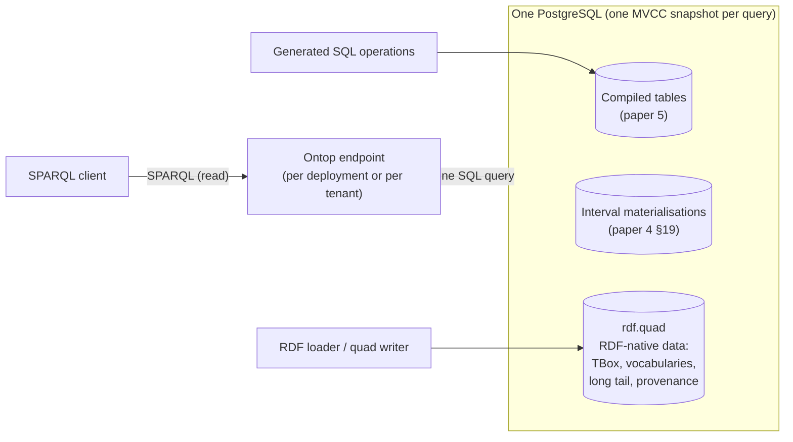
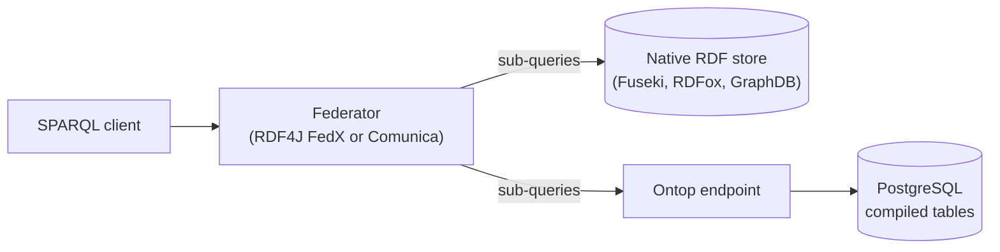

# One SPARQL view over RDF and SQL

**Technology exploration, 2026-10-03.** The sixth paper in the series. Paper 4
([workload-modeling-and-robustness-testing-strategy.md](workload-modeling-and-robustness-testing-strategy.md))
moved interval data into PostgreSQL and split tenants into separate datasets. Paper 5
([ontology-to-relational-compiler.md](ontology-to-relational-compiler.md)) compiled shape-closed
aggregates into SQL tables and emitted an R2RML mapping back to the ontology. Together they leave
LATTICE data in several places: native RDF stores, compiled SQL tables, interval materialisations,
per-tenant datasets and a central lakehouse. This paper asks whether all of it can be queried as one
RDF dataset with SPARQL, which existing technology does that, whether anything must be built, and
what it costs in performance.

Grading as before. **Fact** means a cited source says so, with the source named. **Judgement** means
a reasoned position that a measurement could overturn. *(verify)* marks details from memory. Nothing
here is a LATTICE decision.

---

## Contents

1. [Verdict](#1-verdict)
2. [The question, stated precisely](#2-the-question-stated-precisely)
3. [Theory](#3-theory)
4. [The landscape](#4-the-landscape)
5. [Five architectures](#5-five-architectures)
6. [Performance model](#6-performance-model)
7. [Making it fast by construction](#7-making-it-fast-by-construction)
8. [Semantic alignment](#8-semantic-alignment)
9. [Security](#9-security)
10. [Build, adopt or glue](#10-build-adopt-or-glue)
11. [Token estimate](#11-token-estimate)
12. [Risks](#12-risks)
13. [Decisions for the maintainer](#13-decisions-for-the-maintainer)
14. [Experiments](#14-experiments)
- [Appendix A: Worked example](#appendix-a-worked-example)
- [Appendix B: References](#appendix-b-references)

---

## 1. Verdict

**The technology exists, it is mature, and LATTICE should adopt it rather than build it (judgement,
high confidence).** Three established families solve the problem, each for a different shape of
distribution.

| Family | What it does | Leading open option | Commercial options |
|---|---|---|---|
| **Virtual knowledge graphs** (ontology-based data access) | rewrites SPARQL into SQL against relational tables through R2RML mappings | **Ontop** (Apache-2.0, 5.5.0 released February 2026, fact: ontop-vkg.org) | Stardog virtual graphs, GraphDB virtualisation *(verify)* |
| **SPARQL federation** | splits one SPARQL query across several SPARQL endpoints and joins the results | RDF4J FedX, Comunica, Jena `SERVICE` | most commercial stores |
| **Integrated engines with external sources** | a native RDF store that also reads SQL tables on demand, inside its own queries and rules | none open with a permissive licence | **RDFox data sources** (PostgreSQL, SQLite, ODBC, CSV, Solr, Lucene, fact: RDFox 7.7 documentation), Stardog, Virtuoso |

**Recommended default: keep the data in one PostgreSQL per deployment (or per tenant), with
compiled tables for shape-closed aggregates and a generic quad table for RDF-native data, and put
Ontop over both (architecture H1, §5.1).** Every SPARQL query then becomes one SQL query against one
database, reading one consistent snapshot. No network federation sits on the query path. This is
the hybrid the user describes, with the distribution moved from the query engine into the storage
layout.

**Use federation only where data genuinely lives in separate systems.** Cross-tenant reporting and
market-wide analytics run asynchronously over the lakehouse, through Ontop over a SQL federator
such as Trino or Databricks (H4). Live SPARQL federation across a native triple store and an Ontop
endpoint (H2) is reserved for selective queries that touch a small, known set of sources.

**Performance (judgement, §6).** A query that stays within one database costs about what its SQL
costs, plus a few milliseconds of rewriting, which fits paper 4's 1 to 2 second interactive budget
comfortably. A query that joins across sources costs network round trips proportional to the
number of intermediate bindings divided by the batch size, which fits the budget only when the join
is selective. Broadcasting a query to every source, joining on constructed IRI strings, and
non-canonical literals are the three ways to make a hybrid query slow, and the compiler of paper 5
can prevent all three by construction (§7).

**What must be built is glue, not an engine:** a quad table and its R2RML mapping, per-tenant Ontop
configuration, the routing registry from paper 4 §18.3, and a conformance suite that checks hybrid
answers against a pure-RDF oracle. Estimated at about 40M input-equivalent tokens, against roughly
190M to build a mediator of our own (§11).

**Writes stay native.** No production system offers general SPARQL Update over virtualised SQL,
for the same reason the Architecture Review's G-08 records: view update is not generally solvable.
Writes go to the owning store through its own operations (paper 5's generated SQL functions, or
SPARQL Update on a native RDF store). Reads are unified. This is command-query separation, and it
is the shape every system surveyed here assumes.

---

## 2. The question, stated precisely

**Where LATTICE data may live, after papers 4 and 5.**

| Place | Content | Native interface | Written by |
|---|---|---|---|
| Compiled SQL tables (paper 5) | shape-closed aggregates: binders, contracts, layers, quotes, claims | SQL | generated SQL operations |
| Interval materialisations (paper 4 §19) | cover spans, gap answers | SQL | CDC from the system of record |
| Native RDF store | TBox, shapes, governed vocabularies, the open-world long tail, triple-grain provenance | SPARQL | SPARQL Update, loaders |
| Per-tenant datasets (paper 4 §17) | any of the above, one per tenant | as above | as above |
| Central lakehouse (paper 4 §18) | market-wide history and analytics | SQL on Spark, Databricks, Trino | CDC from every tenant |

**The requirement.** A client issues one SPARQL query against one logical RDF dataset, using
ontology IRIs, and gets the answer it would have got if all of the data had been loaded into one
triple store. The client does not know where any fact lives.

**What the requirement does not include.**

- Writes through the unified view (§3.4).
- Cross-source transactions.
- Arbitrary queries meeting the interactive budget regardless of shape. The budget applies to the
  query shapes the workload model names (paper 4 §9.2).

---

## 3. Theory

### 3.1 Three problems that share a name

"Distributed SPARQL" covers three problems with different theory and different costs.

| Problem | Sources | Core technique | Cost driver |
|---|---|---|---|
| **Virtualisation** | relational databases | rewrite the SPARQL query into SQL through mappings (unfolding), optionally after rewriting it against an ontology | the quality of the generated SQL |
| **Federation** | several SPARQL endpoints | choose sources per triple pattern, plan joins across them, move intermediate results over the network | network round trips and intermediate result sizes |
| **Integrated access** | one engine holding RDF and reading external tables | treat external tables as relations inside the engine's own planner | pushdown of constraints into the external source |

They compose. Ontop over a SQL federator (Trino) is virtualisation on top of SQL-level federation.
FedX over an Ontop endpoint and a triple store is SPARQL federation over a virtualised source.

### 3.2 Virtualisation

**Mappings are global-as-view (fact, OBDA literature).** Each R2RML triples map defines ontology
terms as views over source tables: `ex:Layer` is "the rows of `tower.layer`", `ex:attachment` is
"the `attachment` column of those rows". Answering a SPARQL query means substituting each triple
pattern with the union of views that can produce it (unfolding) and simplifying the result into one
SQL query.

**With an ontology, rewriting comes first.** Under OWL 2 QL, every query can be rewritten into a
union of conjunctive queries over the base vocabulary that returns the certain answers, so
answering reduces to SQL (first-order rewritability, Calvanese et al., the DL-Lite family). Ontop
avoids the exponential blow-up of naive rewriting by pre-compiling the ontology into the mappings
(T-mappings) so that subsumption is answered by the mapping rather than by the query (Rodríguez-Muro,
Kontchakov, Zakharyaschev, ISWC 2013 *(verify)*).

**What makes the generated SQL fast or slow (fact for the techniques, judgement for the ranking).**

| Factor | Effect | Who controls it |
|---|---|---|
| IRI templates that match on both sides of a join | the join becomes a join on the underlying key columns. Mismatched templates force a join on constructed strings, which no index serves | the mapping author, so paper 5's compiler |
| Declared primary and foreign keys | self-join elimination: the triple patterns of one entity collapse into one row access | the schema, so paper 5's compiler |
| `NOT NULL` declarations | removes `IS NOT NULL` filters and outer joins | the schema |
| Canonical literal lexical forms | equality on literals pushes down as column equality | the mapping and the source types |
| Unions across many mappings for one predicate | multiplies the SQL. Predicates mapped from one table stay simple | the mapping layout |

**This is the decisive observation of this paper (judgement).** Every factor on that list is
something paper 5's compiler decides. A virtualisation layer is only as good as its mappings and
schema metadata, and in LATTICE both are generated from the same ontology by the same compiler.
LATTICE is in an unusually good position to get virtualisation performance right, because nothing
in the mapping is hand-written.

### 3.3 Federation

**Source selection.** For each triple pattern, find the sources that can answer it. Without
metadata this takes an `ASK` query per pattern per source. With a catalogue (which predicates and
classes each source holds) it is a lookup. Patterns answerable by only one source, and that share
variables, form exclusive groups sent as one sub-query (Schwarte et al., FedX, ISWC 2011).

**Join strategies.**

| Strategy | Mechanism | Good when |
|---|---|---|
| Bound join (bind join, batched) | evaluate the left side, send its bindings to the right source in batches (as `VALUES` or `UNION` blocks) | the left side is selective |
| Symmetric hash join | fetch both sides independently, join locally | both sides are small and independent |
| Semi-join | send distinct join keys first, fetch only matching rows | keys are few relative to rows |

**No shared statistics, no shared snapshot (fact about the architecture).** A federator usually has
no cardinality statistics for remote sources, so join order is chosen with heuristics, and each
source answers from its own current state at a slightly different moment. Research systems add
statistics (Odyssey, Montoya et al., ISWC 2017, and CostFed, Saleem et al., 2018 *(verify)*) and
adaptive execution (ANAPSID, Acosta et al., ISWC 2011). Benchmarks (FedBench, Schmidt et al., ISWC
2011, LargeRDFBench, Saleem et al., JWS 2018) show that latency varies by orders of magnitude between
selective and unselective queries, more than between engines.

### 3.4 Writes and the view-update problem

A write to a virtual triple must be translated into a change to source rows. For a general
mapping (joins, templates combining columns, unions) there may be no change, one change, or
several equally valid changes that produce the requested triple. This is the classical view-update
problem (Bancilhon and Spyratos, TODS 1981, Dayal and Bernstein, TODS 1982), and the Architecture
Review records the same issue for LATTICE projections (G-08). Production virtualisation systems are
read-only. Ontop is a query system.

**The consequence is command-query separation by construction (judgement).** Every write goes to
the store that owns the data, through that store's operations. Paper 5 already generates those
operations for compiled aggregates. Native RDF data keeps SPARQL Update on its own store. The
unified view is a read model.

### 3.5 Consistency

| Architecture | Snapshot seen by one query |
|---|---|
| One database behind Ontop (H1) | one MVCC snapshot, the same consistency as any SQL query |
| Federation across stores (H2) | one snapshot per source, taken at different moments. A query may see a quote in one source and not yet its layer change in another |
| Lakehouse (H4) | as of the last CDC watermark per tenant |

For the read-only reporting and audit queries the hybrid view serves, independent snapshots are
usually acceptable, as paper 4 §18.5 already argued for federation across tenants. For anything that
feeds a decision, the query must stay within one source (§7.1).

### 3.6 Reasoning across sources

| Approach | Coverage | Freshness |
|---|---|---|
| OWL 2 QL rewriting in Ontop | subsumption, domains, ranges, inverse properties, across every mapped source | always current, computed at query time |
| Rules compiled into SQL views (paper 5 §3.4) | stratified Datalog over compiled tables | current, at SQL view cost |
| RDFox rules over data-source tuple tables | full RDFox Datalog over native and external data | **derived facts are materialised and not updated when the external data changes, until a full rematerialisation is requested** (fact: RDFox 7.7 documentation, "Data sources and incremental reasoning") |
| Stardog query-time reasoning over virtual graphs | Stardog's reasoning profile *(verify)* | current, at query time |

The RDFox limitation matters for the hybrid design. Its incremental reasoning, the property that
motivated paper 1, does not extend to external sources. Rules whose inputs live in SQL should be
compiled to SQL (paper 5) rather than evaluated in RDFox over data sources, unless periodic
rematerialisation is acceptable.

---

## 4. The landscape

### 4.1 Virtualisation engines

| System | Licence | Facts relevant here |
|---|---|---|
| **Ontop** | Apache-2.0 | fact (ontop-vkg.org, accessed 2026-10-03): RDFS and OWL 2 QL, R2RML (almost fully compliant, no base IRIs or default mappings), most of SPARQL 1.1 including aggregates, subqueries and `GRAPH`. **No `SERVICE`.** Five of eight property-path forms. `EXISTS` only where it translates to a left join. Sources: PostgreSQL, MySQL, MariaDB, SQL Server, Oracle, DB2, Snowflake, Databricks, BigQuery, Redshift, and the federators Denodo, Dremio, Teiid, Spark, Trino, Presto, Athena. Lenses (virtual views defined outside the source), materialisation to RDF files, SPARQL endpoint and predefined-query endpoint. Backed by the Free University of Bozen-Bolzano and Ontopic s.r.l. |
| Stardog virtual graphs | commercial | SQL and other sources mapped into Stardog's SPARQL space, cached or virtual, with query-time reasoning *(verify current capability)* |
| GraphDB | commercial (free tier) | virtual repositories built on Ontop *(verify)*, plus FedX federation |
| Morph-RDB, D2RQ | Apache-2.0 | earlier R2RML-based rewriters. D2RQ is unmaintained *(verify)* |
| Oracle RDF views | commercial | RDF views over relational tables inside Oracle Database |

### 4.2 Federation engines

| System | Licence | Notes |
|---|---|---|
| **RDF4J FedX** | EDL-1.0 | FedX integrated into RDF4J *(verify packaging)*. Source selection by `ASK` with caching, exclusive groups, bound joins with configurable block size |
| **Comunica** | MIT | modular TypeScript engine, federation over SPARQL endpoints, files and Linked Data Fragments, link traversal |
| Apache Jena `SERVICE` | Apache-2.0 | standard SPARQL 1.1 Federated Query. The query names the endpoint explicitly, so there is no automatic source selection |
| SemaGrow, Odyssey, CostFed, ANAPSID, HiBISCuS | research licences vary | statistics, adaptive execution and source-selection indexes. References for technique rather than production choices |

### 4.3 Integrated engines with external sources

| System | Licence | Notes |
|---|---|---|
| **RDFox data sources** | commercial | fact (RDFox 7.7 documentation): native PostgreSQL and SQLite access, ODBC for other databases, CSV, Solr, Lucene. External rows exposed as tuple tables through lexical-form templates, fetched on demand and never cached. Constraints pushed into SQL, with bindings batched (default 1,024 substitutions per query). Requires canonical lexical forms and unambiguous template separators to push constraints correctly. Queried with a `TT` tuple-table extension, or mapped into triples by rules. Derived facts from external data go stale until rematerialisation |
| Stardog | commercial | native store plus virtual graphs in one SPARQL space |
| Virtuoso | GPL-2.0 open source, commercial edition | quad store and RDF views over relational tables in one engine, an early example of this design. Remote-database virtualisation is a commercial feature *(verify)*. GPL is acceptable for an unmodified separate server, not for shipping inside LATTICE (paper 3 Appendix B) |
| Anzo, Oracle Database | commercial | integrated knowledge-graph and relational platforms |

### 4.4 SQL federators, as a substrate under virtualisation

| System | Licence | Role |
|---|---|---|
| Trino, Presto | Apache-2.0 | SQL across PostgreSQL, object stores and lakehouse tables. Ontop supports both (fact) |
| Apache Spark, Databricks | Apache-2.0, commercial | the lakehouse of paper 4 §18. Ontop supports both (fact) |
| Dremio, Denodo, Teiid | mixed | data virtualisation platforms. Ontop supports them (fact) |

### 4.5 Research on semantic data lakes

Squerall (Mami et al., ISWC 2019) and Ontario (Endris et al., DEXA 2019) apply ontology-based access
over heterogeneous lake sources through Spark or Presto *(verify citations)*. They confirm the H4
shape and are not production candidates.

### 4.6 Benchmarks for this design space

| Benchmark | Measures |
|---|---|
| NPD benchmark (Lanti, Rezk, Xiao, Calvanese, EDBT 2015) | OBDA over a real petroleum dataset, ontology rewriting cost |
| BSBM (relational variant) | virtualisation against native stores on the same data |
| FedBench, LargeRDFBench | federation engines across endpoints |

---

## 5. Five architectures

### 5.1 H1: one database, two shapes, Ontop over both



**The quad table.** RDF-native data is stored as quads in PostgreSQL, in the layout triple stores
on relational engines have used since Jena2 and Oracle (paper 5 §5, P2): a term dictionary, a quad
table of term IDs, and indexes on the access orders the workload needs. The R2RML mapping for it is
a single generic triples map with the graph, subject, predicate and object taken from columns.

```sql
CREATE TABLE rdf.term (
    id      bigint GENERATED ALWAYS AS IDENTITY PRIMARY KEY,
    kind    smallint NOT NULL,                  -- IRI, blank node, literal
    lexical text NOT NULL,
    dtype   text,                               -- datatype IRI for literals
    lang    text,
    UNIQUE (kind, lexical, dtype, lang)
);
CREATE TABLE rdf.quad (
    g bigint NOT NULL REFERENCES rdf.term (id),
    s bigint NOT NULL REFERENCES rdf.term (id),
    p bigint NOT NULL REFERENCES rdf.term (id),
    o bigint NOT NULL REFERENCES rdf.term (id),
    PRIMARY KEY (g, s, p, o)
);
CREATE INDEX ON rdf.quad (p, o, s);
CREATE INDEX ON rdf.quad (s, p, o);
```

| Property | H1 |
|---|---|
| Query path | one SPARQL query becomes one SQL query |
| Consistency | one snapshot across compiled and RDF-native data |
| Reasoning | OWL 2 QL across both, plus paper 5's compiled rule views |
| Writes | compiled data through generated operations. RDF-native data through a loader or a small quad-writing function. **No SPARQL Update** on this path |
| Fit | everything inside one deployment or one tenant |
| Weak point | SPARQL Update for the RDF-native part, and quad-table performance if the long tail is large and heavily queried |

**SPARQL Update for the RDF-native part, if it is needed.** Two options, both judgement. Keep the
RDF-native data in a native triple store as its system of record, and replicate it into the quad
table by CDC for reading (adds a staleness window). Or translate the small set of update shapes
LATTICE actually issues into quad-table inserts and deletes, which is a narrow translator rather than
a general SPARQL Update engine. Decide on evidence of how often the long tail is written.

### 5.2 H2: native triple store plus Ontop, federated



| Property | H2 |
|---|---|
| Query path | source selection, sub-queries per source, joins in the federator |
| Consistency | one snapshot per source |
| Writes | native on each side, including SPARQL Update on the triple store |
| Fit | when RDF-native data must keep a native store (heavy SPARQL Update, RDFox reasoning) and still be joined live with SQL data |
| Weak point | cross-source joins pay network round trips (§6.2) |

Ontop does not support `SERVICE` (fact), so Ontop cannot be the federator. The federator sits above
both endpoints.

### 5.3 H3: an integrated commercial engine

RDFox (data sources), Stardog (virtual graphs) or Virtuoso, holding RDF-native data natively and
reading SQL tables on demand inside one query plan.

| Property | H3 |
|---|---|
| Query path | one engine plans across native and external data, pushing constraints into SQL |
| Consistency | native data at the engine's snapshot, external data at the moment of each fetch |
| Reasoning | the engine's own, with RDFox's staleness rule for derived facts over external data (§3.6) |
| Fit | an adopter that licenses one of these engines and wants a single endpoint with reasoning |
| Weak point | licence, non-standard query syntax for RDFox tuple tables unless rules map them into triples, and freshness of derived facts |

### 5.4 H4: Ontop over a SQL federator, for analytics

Ontop over Trino or Databricks, which in turn reach every tenant database and the lakehouse. This is
paper 4 §18's market-wide tier given a SPARQL face. Every query is asynchronous work by paper 4's
own classification, so seconds to minutes of latency are acceptable.

### 5.5 H5: build a mediator

A LATTICE-specific SPARQL-to-SQL rewriter plus a federation planner. §10 explains why not.

### 5.6 Comparison

| Criterion | H1 | H2 | H3 | H4 | H5 |
|---|---|---|---|---|---|
| Interactive queries within 1 to 2 s | yes | selective queries only | yes | no (asynchronous) | depends on years of work |
| One consistent snapshot | yes | no | partly | no | depends |
| Reasoning across all data | QL plus compiled rules | per source | engine's own | QL | depends |
| SPARQL Update for RDF-native data | narrow, or via CDC | yes | yes | no | depends |
| Licence | Apache-2.0 | Apache-2.0, EDL, MIT | commercial | Apache-2.0 | ours |
| New moving parts | Ontop | Ontop, federator | engine | Ontop, federator | everything |
| Build cost | glue | glue | glue plus licence | glue | high |

---

## 6. Performance model

### 6.1 Single-source virtual queries (H1, H4)

$$T_{H1} \approx T_{rewrite} + T_{SQL} + T_{serialise}$$

| Term | Estimate (judgement, to measure in HQ-X1) |
|---|---|
| $T_{rewrite}$ | milliseconds for a query seen before (Ontop caches translations), tens to hundreds of milliseconds for a new complex query against a large ontology |
| $T_{SQL}$ | what the equivalent hand-written SQL costs, provided §7's conditions hold |
| $T_{serialise}$ | proportional to result rows. SPARQL JSON serialisation of 10⁴ rows is tens of milliseconds |

| Query shape (paper 4 §9.2) | Expected H1 latency (judgement) |
|---|---|
| Authority, appetite, endorsement checks | single-digit milliseconds plus rewriting |
| Load my tower (compiled tables plus a few RDF-native labels and vocabulary terms) | tens of milliseconds |
| Coverage completeness (paper 4 §19 through paper 5 §8.7's multirange query) | tens of milliseconds |
| Audit query over receipts and provenance | tens to hundreds of milliseconds, depending on the time window |

### 6.2 Cross-source joins (H2)

For a bound join whose left side yields $n$ bindings, sent to the right source in batches of $b$:

$$T_{H2} \approx T_A + \left\lceil \frac{n}{b} \right\rceil \left( RTT + t_B(b) \right) + \frac{\text{result bytes}}{\text{bandwidth}} + T_{merge}$$

Illustrative values with a 2 ms round trip inside one data centre and $t_B(b)$ of 1 ms plus 0.01 ms
per binding (judgement):

| $n$ | $b = 25$ | $b = 1{,}000$ |
|---|---|---|
| 100 | 4 round trips, about 13 ms | 1 round trip, about 4 ms |
| 10,000 | 400 round trips, about 1.3 s | 10 round trips, about 0.13 s |
| 1,000,000 | 40,000 round trips, about 2 minutes | 1,000 round trips, about 13 s |

**Reading (judgement).** Batch size decides whether moderate cross-source joins fit the budget. RDFox
batches 1,024 substitutions per SQL query by default (fact). FedX's block size is configurable *(verify
default)*. No batch size rescues an unselective cross-source join. The design must keep such joins
inside one source.

### 6.3 Fan-out across tenants

A federated query over $k$ tenants in parallel costs about the slowest tenant's latency plus the
merge. Paper 4 L7-06 already tests this at $k$ = 10, 50 and 200. Market-wide questions do not
fan out (paper 4 §18.3). They go to the lakehouse.

### 6.4 Quad-table cost in H1

Each triple pattern over the quad table is one index lookup, and a star of $k$ patterns over the
same subject is $k - 1$ self-joins, the cost paper 5 §4.1 attributes to triple stores generally.
That is acceptable for the long tail because it is small and rarely on the hot path. If a
long-tail class becomes hot, the fix is paper 5's: promote it into a compiled table. The 1,000-node
heuristic of paper 4 §19.2 applies.

### 6.5 What makes hybrid queries slow

| Cause | Symptom | Prevention |
|---|---|---|
| Broadcast to every source | latency of the slowest source on every query | routing registry and source catalogue (§7.3) |
| Joins on constructed IRIs | full scans and string concatenation in SQL | aligned IRI templates (§7.2) |
| Non-canonical literals | equality cannot push down, or misses matches | canonical lexical forms from the compiler (§8.2) |
| Unselective cross-source joins | many round trips, large transfers | placement by aggregate boundary (§7.1) |
| Arbitrary-length property paths | unsupported in Ontop for some forms, recursive SQL otherwise | closure tables for hot paths (paper 5 rule M22) |
| Large unions per predicate | very large generated SQL | one mapping per predicate where possible, which paper 5's layout gives |

---

## 7. Making it fast by construction

### 7.1 Placement follows the aggregate boundary

**Rule P1 (judgement).** Every fact belonging to one `dal:` aggregate lives in one source. Queries
within an aggregate, which are all the hot-path queries of paper 4, never cross a source boundary.

**Rule P2.** Reference data that hot-path queries join against (vocabularies, state definitions,
labels) is co-located with the data that uses it. In H1 that is automatic. Where it is not, the
reference data is replicated, because it changes rarely and is small (paper 4 §17.2 made the same
argument for tenants).

**Rule P3.** A query that crosses sources is classified as reporting, audit or analytics, and is
not on the interactive path. Paper 4 §10 already put such work in the asynchronous tier.

### 7.2 Mapping rules the compiler must guarantee

| Rule | Guarantee | Why |
|---|---|---|
| V1 | One IRI template per identity profile, identical in every R2RML map and in the native RDF store's minting | joins across mappings reduce to key-column joins, and IRIs agree across sources |
| V2 | Template separators that cannot occur in the key columns' values | constraint pushdown is unambiguous (the same restriction RDFox documents for its data sources) |
| V3 | Primary and foreign keys and `NOT NULL` declared on every compiled table | self-join and outer-join elimination |
| V4 | Literal columns typed so the R2RML natural mapping yields the canonical lexical form | literal equality pushes down and agrees with native RDF |
| V5 | Named graphs mapped with `rr:graphMap` to the ADR-A54 graph grammar | `GRAPH` queries behave the same over virtual and native data |
| V6 | One triples map per predicate per table | small unions, readable SQL |

These are additions to paper 5's mapping rules, not a separate system. V1 to V6 extend rule M51.

### 7.3 Catalogue and routing

The federator (H2) and the analytics tier (H4) need to know which source holds which predicates,
classes and tenants. That catalogue is a by-product of compilation: the compiler knows which
classes went to SQL and which stayed RDF-native, and the tenancy configuration knows which tenant
is where. Paper 4 §18.3's routing registry (entity to tenant) completes it. Source selection then
needs no `ASK` probing.

### 7.4 Materialise when virtualisation is not enough

When a hybrid query on the interactive path cannot be made selective, materialise its result as a
Surface projection (paper 4 §10) inside the source the query will read. Virtualisation and
materialisation are complementary, and the 1,000-node heuristic (paper 4 §19.2) decides between
them.

---

## 8. Semantic alignment

### 8.1 Identity

A fact about one resource may be split across sources: a layer's attachment in SQL, a reviewer's
free-text note about it in the RDF-native long tail. The join works only if both sides produce the
same IRI. Rule V1 makes the IRI a deterministic function of the identity profile everywhere.
`owl:sameAs` between sources is not supported (paper 5 §7.6), so identity must be aligned at
minting, not reconciled at query time.

### 8.2 Literals

`"1.0"^^xsd:decimal` and `"1.00"^^xsd:decimal` denote the same value but are different lexical
forms. A native RDF store may keep the lexical form it was given. A SQL `numeric` column rendered
through R2RML's natural mapping yields one canonical form. Joins and `FILTER (?x = ?y)` across the
two then disagree. **Canonicalise literals at write time on the RDF-native side, and type SQL
columns so the natural mapping is canonical (rule V4).** Dates, times with timezones, and decimals
are the usual offenders.

### 8.3 Blank nodes

Blank nodes cannot be joined across sources, by definition. Paper 5 compiles them to owned child
rows without IRIs. A cross-source query that needs to reach such a node must go through its owning
entity's IRI.

### 8.4 Named graphs and infrastructure

R2RML graph maps let virtual triples appear in named graphs (rule V5). That gives a concrete form to
an idea paper 2 proposed and paper 3 shelved: **virtual infrastructure graphs.** Paper 2 §10 wanted
version rows, receipts and claims exposed as read-only RDF graphs with the IRIs the SPARQL
realisation would have minted. In the relational realisation, those are R2RML mappings over the
version columns, receipt tables and unique indexes of paper 5 §9. An auditor can query
`<urn:lattice:{tenant}:{env}:…>` graphs with the same queries whether the deployment uses the SPARQL
realisation or the relational one, which is the conformance property paper 2 §10.2 asked for.

### 8.5 Set and bag semantics

SPARQL returns a multiset unless `DISTINCT` is used, and the RDF data model is a set. Duplicate rows
in SQL could produce duplicate triples. Paper 5 rule M14's `UNIQUE (owner_id, value)` prevents that
at the source, and Ontop applies `DISTINCT` where its analysis cannot rule out duplicates.

---

## 9. Security

| Concern | Treatment |
|---|---|
| Tenant isolation through the virtual layer | Ontop connects with one database identity. Row-level security keyed on a per-request session variable is therefore awkward to use through it *(verify Ontop session configuration options)*. The simple form: one Ontop endpoint per tenant, connecting with a role that can read only that tenant's schema or database. This matches ADR-A54's dataset-per-tenant default and paper 4 L8-03's cross-tenant probe |
| `SERVICE` as an exfiltration or server-side request forgery path | Ontop does not support `SERVICE` (fact), which removes the risk at that layer. Federators do support it. Allow-list the endpoints a federator may call, and reject client-supplied `SERVICE` clauses. The repository's L8 taxonomy already names this ("scoping escape (`SERVICE`/`LOAD`/`DESCRIBE`)", `lattice-platform-agentic-development-v0.2.md`) |
| Mapping-level leakage | a mapping that exposes a column exposes it to every SPARQL client of that endpoint. Mappings are generated, so exposure is reviewed once in the compiler's rules, with personal-data columns (paper 5 M50) excluded from default mappings |
| Denial of service by expensive queries | query timeouts and result limits at the endpoint, and the predefined-query endpoint Ontop offers for clients that only need known shapes (fact) |

---

## 10. Build, adopt or glue

### 10.1 The ladder

| Rung | Finding |
|---|---|
| 1. Does this need building | a unified read view is needed for audit, analytics, AI agents and integration. The interactive path does not need it (it reads its own source directly) |
| 2. Does it exist in the codebase | R2RML emission is planned in paper 5 (M51). The routing registry is designed in paper 4 §18.3. A Fuseki store exists |
| 4. Does a platform feature cover it | PostgreSQL holds both shapes (H1). Trino and Databricks federate SQL (H4) |
| 5. Does an existing dependency solve it | **Ontop does the SPARQL-to-SQL part.** FedX or Comunica do SPARQL federation. RDFox or Stardog do the integrated form commercially |
| 7. Minimum code | glue only |

### 10.2 What to build

| Item | Purpose |
|---|---|
| Quad table, term dictionary, loader and generic R2RML map | the RDF-native half of H1 |
| Mapping rules V1 to V6 in the paper 5 compiler | performance and correctness of virtual queries |
| Source catalogue emitted by the compiler | source selection without probing |
| Ontop deployment per tenant (compose service, configuration, CI smoke test) | the endpoint |
| Federator configuration for H2 and H4 when needed | cross-source queries |
| Hybrid conformance suite | the same SPARQL queries over (a) everything loaded into one triple store and (b) the hybrid layout, answers compared |
| Security tests | tenant isolation and `SERVICE` allow-listing |

### 10.3 Why not H5

A competitive SPARQL-to-SQL rewriter needs the optimisations Ontop has accumulated over more than a
decade (T-mappings, self-join elimination, IRI template reasoning, nullability analysis, dialect
handling for more than fifteen databases). A federation planner needs source selection, join
ordering without statistics and adaptive execution. Neither is specific to LATTICE. The parts that
are specific to LATTICE (mapping generation, identity alignment, placement) sit in the compiler and
the configuration, which this paper puts in the glue.

---

## 11. Token estimate

Using paper 3 §11's model (class R 2.10M input-equivalent tokens per 1,000 lines, class W 1.14M,
class D 1.02M, 0.64M per slice, 1.53M per phase), rework ×1.0, ×1.5, ×2.5.

| Component | Lines | Class |
|---|---|---|
| Quad table, dictionary, loader, generic R2RML map | 1.5k | R |
| Mapping rules V1 to V6 and source catalogue in the compiler | 2k | R |
| Hybrid conformance suite (oracle comparison) | 3k | R |
| Security tests | 1k | R |
| Ontop and federator deployment, compose services, CI | 2k | W |
| Developer and operator documentation | 2k | D |

| | Base E | Expected E | High E | Base G | Expected G |
|---|---|---|---|---|---|
| Code and tests (7.5k R) | 15.8M | 23.6M | 39.4M | 49.9M | 74.8M |
| Deployment (2k W) | 2.3M | 3.4M | 5.7M | 6.8M | 10.2M |
| Documentation (2k D) | 2.0M | 3.1M | 5.1M | 6.2M | 9.2M |
| Governance (8 slices, 1 phase) | 6.7M | 10.0M | 16.6M | 20.6M | 30.9M |
| **Total** | **26.7M** | **40.1M** | **66.8M** | **83.5M** | **125.1M** |

**For comparison (judgement).** A LATTICE-built mediator (H5) at about 45k lines of class R plus
governance and documentation comes to roughly 125M base and 190M expected input-equivalent tokens,
before it reaches Ontop's current coverage. The glue assumes paper 5's compiler exists. Without it,
H1 still works over hand-written mappings for the paper 4 §19 interval tables, which is a useful
first step at a fraction of this cost.

---

## 12. Risks

| # | Risk | Mitigation |
|---|---|---|
| R1 | Hybrid answers differ from what a single triple store would return | the conformance suite in CI, with the single-store answer as oracle |
| R2 | A hot-path query drifts into crossing sources | placement rules P1 to P3, and a CI check that the interactive query set compiles to single-source SQL |
| R3 | Ontop lacks a SPARQL feature a query needs (some property paths, `SERVICE`, complex `EXISTS`) | the query set is known in advance. Unsupported shapes are found at compile time and rewritten, or answered by a materialised projection |
| R4 | IRI or literal misalignment silently drops join results | rules V1 and V4, plus round-trip and conformance tests |
| R5 | RDFox-derived facts over SQL data go stale (H3) | compile rules over SQL data into SQL, or schedule rematerialisation and report its watermark |
| R6 | Per-tenant Ontop endpoints multiply operational load | they are stateless and identical apart from configuration, deployed by the same tenancy automation as the datasets (paper 4 §17.5) |
| R7 | The quad table becomes a dumping ground for data that should be compiled | promote by the 1,000-node heuristic, and report quad-table growth per class |

---

## 13. Decisions for the maintainer

| # | Decision | Options | Recommendation (judgement) |
|---|---|---|---|
| HQ-D1 | Build or adopt the unified SPARQL view | (a) adopt Ontop plus federation where needed. (b) build a mediator | (a) |
| HQ-D2 | Default architecture per deployment | (a) H1, one PostgreSQL with compiled tables and a quad table. (b) H2. (c) H3 | (a). (b) where RDF-native data needs SPARQL Update at volume. (c) for adopters licensing RDFox or Stardog |
| HQ-D3 | Market-wide and cross-tenant SPARQL | (a) H4, Ontop over Trino or Databricks. (b) live federation across tenants | (a), consistent with paper 4 §18 |
| HQ-D4 | Federator for H2 | (a) RDF4J FedX. (b) Comunica. (c) Jena `SERVICE` with explicit endpoints | decide by HQ-X3. (a) fits the Java platform |
| HQ-D5 | Writes through the unified view | (a) none, writes go to owning stores. (b) attempt SPARQL Update over virtual data | (a) |
| HQ-D6 | Long-tail SPARQL Update in H1 | (a) native store as system of record, CDC into the quad table. (b) a narrow update translator onto the quad table. (c) loader only | decide once the long-tail write rate is known |
| HQ-D7 | Add mapping rules V1 to V6 and the source catalogue to the paper 5 compiler plan | (a) yes. (b) no | (a) |
| HQ-D8 | Tenant isolation through Ontop | (a) one endpoint per tenant with a tenant-scoped database role. (b) shared endpoint with row-level security | (a), unless HQ-X5 shows (b) can be made reliable |

---

## 14. Experiments

| # | Experiment | Decides | Pass criterion |
|---|---|---|---|
| HQ-X1 | Ontop over paper 4's synthetic tower data in compiled tables plus a quad table, running the interactive query set | H1's latency claim | p99 within paper 4's budget, rewriting overhead measured separately |
| HQ-X2 | The same queries with IRI templates deliberately misaligned and literals non-canonical | the size of §6.5's penalties | measured slowdown and missed results, used as negative controls in the conformance suite |
| HQ-X3 | FedX and Comunica over a Fuseki endpoint and an Ontop endpoint, bound joins at $n$ = 10², 10⁴, 10⁶ | HQ-D4 and §6.2's model | latency curves against the formula |
| HQ-X4 | Hybrid conformance: 10³ generated SPARQL queries over the single-store oracle and the H1 layout | R1 | zero unexplained differences |
| HQ-X5 | Row-level security through a shared Ontop endpoint, against per-tenant endpoints | HQ-D8 | no cross-tenant answers under paper 4 L8-03 |
| HQ-X6 | RDFox with a PostgreSQL data source over the compiled tables, with rules over both | H3, and the staleness behaviour | measured latency and staleness window after SQL updates |
| HQ-X7 | Ontop over Trino reaching two tenant databases and a Delta table | H4 | correct answers to paper 4's market-wide queries, latency recorded |

---

## Appendix A: Worked example

**The query.** Every layer of a programme that still has a coverage gap, with the reviewer notes
attached to it. Layers, gaps and quotes are compiled tables (paper 5). Reviewer notes are free-form
RDF in the long tail.

```sparql
PREFIX ex:  <https://example.org/ns#>
PREFIX rdfs: <http://www.w3.org/2000/01/rdf-schema#>

SELECT ?layer ?label ?gap ?note
WHERE {
  ?layer a ex:Layer ;
         ex:inProgramme <https://example.org/programme/77> ;
         ex:hasGap ?gap ;
         rdfs:label ?label .
  OPTIONAL { ?layer ex:reviewerNote ?note }
}
```

**Under H1.** `ex:Layer`, `ex:inProgramme` and `rdfs:label` map to `tower.layer`. `ex:hasGap` maps to
the gap view of paper 5 §8.7. `ex:reviewerNote` maps to the quad table. Because the layer IRI
template is the same in both mappings (rule V1), the `OPTIONAL` becomes a left join on the layer's
key, through the term dictionary. Ontop produces one SQL query of roughly this shape:

```sql
SELECT l.id, l.label, g.gap, n_obj.lexical AS note
FROM   tower.layer l
JOIN   tower.layer_gap g ON g.layer_id = l.id
LEFT JOIN rdf.term   n_subj ON n_subj.kind = 1
                           AND n_subj.lexical = 'https://example.org/layer/' || l.id
LEFT JOIN rdf.quad   q      ON q.s = n_subj.id
                           AND q.p = (SELECT id FROM rdf.term
                                      WHERE kind = 1
                                        AND lexical = 'https://example.org/ns#reviewerNote')
LEFT JOIN rdf.term   n_obj  ON n_obj.id = q.o
WHERE  l.programme_id = 77
  AND  NOT isempty(g.gap);
```

The join from the compiled side into the quad table still goes through a constructed IRI string,
because the quad table stores IRIs as dictionary terms. **Store a `subject_key` column in the quad
table for subjects minted from a known identity profile** (a refinement of rule V1 for H1), and the
join becomes `q.subject_key = l.id` on an index. This is the kind of layout decision §7 places in
the compiler.

**Under H2.** The federator sends the layer and gap patterns to Ontop (an exclusive group), receives
the layers of programme 77 (a handful), then sends their IRIs in one `VALUES` batch to the triple
store for `ex:reviewerNote`. Two round trips, tens of milliseconds. The same query for "every layer
with a gap, across all programmes" would send thousands of IRIs, and belongs in the asynchronous
tier.

---

## Appendix B: References

- Ontop documentation, ontop-vkg.org: introduction and standards compliance, accessed 2026-10-03.
- Xiao, Lanti, Kontchakov et al. The virtual knowledge graph system Ontop. ISWC 2020 (Resource
  Track).
- Calvanese, Cogrel, Komla-Ebri, Kontchakov, Lanti, Rezk, Rodríguez-Muro, Xiao. Ontop: answering
  SPARQL queries over relational databases. Semantic Web Journal 8(3), 2017.
- Rodríguez-Muro, Kontchakov, Zakharyaschev. Ontology-based data access: Ontop of databases.
  ISWC 2013 *(verify)*.
- Calvanese, De Giacomo, Lembo, Lenzerini, Rosati. Tractable reasoning and efficient query
  answering in description logics: the DL-Lite family. JAR 2007.
- Lanti, Rezk, Xiao, Calvanese. The NPD benchmark: reality check for OBDA systems. EDBT 2015.
- RDFox documentation, version 7.7, chapter 7 "Data Sources", docs.oxfordsemantic.tech, accessed
  2026-10-03.
- W3C. SPARQL 1.1 Federated Query, 2013. R2RML: RDB to RDF Mapping Language, 2012.
- Schwarte, Haase, Hose, Schenkel, Schmidt. FedX: optimization techniques for federated query
  processing on linked data. ISWC 2011.
- Schmidt, Görlitz, Haase, Ladwig, Schwarte, Tran. FedBench: a benchmark suite for federated
  semantic data query processing. ISWC 2011.
- Saleem, Hasnain, Ngonga Ngomo. LargeRDFBench: a billion triples benchmark for SPARQL endpoint
  federation. JWS 2018.
- Montoya, Skaf-Molli, Hose. The Odyssey approach for optimizing federated SPARQL queries. ISWC 2017.
- Acosta, Vidal, Lampo, Castillo, Ruckhaus. ANAPSID: an adaptive query processing engine for
  SPARQL endpoints. ISWC 2011.
- Taelman, Van Herwegen, Vander Sande, Verborgh. Comunica: a modular SPARQL query engine for the
  web. ISWC 2018.
- Mami, Graux, Scerri, Jabeen, Auer, Lehmann. Squerall: virtual ontology-based access to
  heterogeneous and large data sources. ISWC 2019 *(verify)*.
- Bancilhon, Spyratos. Update semantics of relational views. TODS 1981. Dayal, Bernstein. On the
  correct translation of update operations on relational views. TODS 1982.
- LATTICE: ADR-A54, ADR-A75, `docs/architecture/Architecture Review.md` (G-08),
  `docs/developer/plans/lattice-platform-agentic-development-v0.2.md` (L8 taxonomy), papers 2 to 5
  in this directory.


