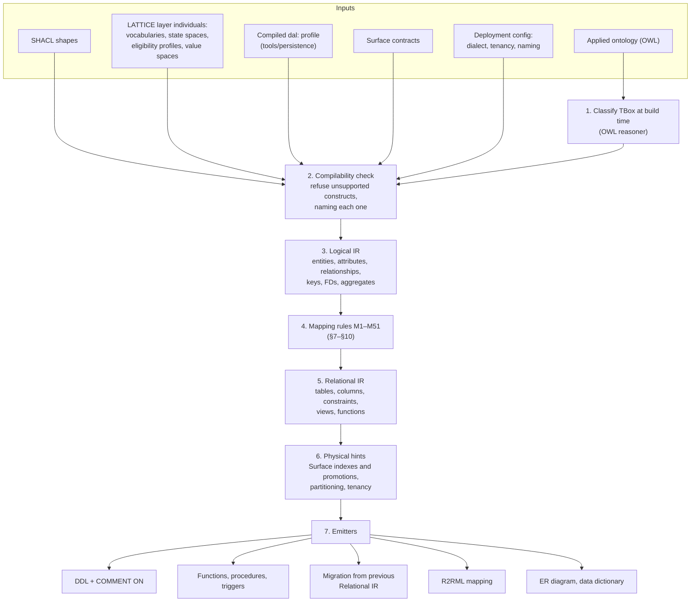
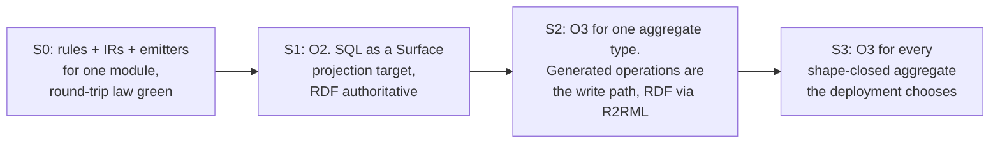

# Compiling LATTICE to a relational model

**Technology exploration, 2026-10-03.** The fifth paper in the series. Papers 1 to 3
([rdf-datalog-engine-technology-exploration.md](rdf-datalog-engine-technology-exploration.md),
[compiled-persistence-physical-planning.md](compiled-persistence-physical-planning.md),
[engine-build-versus-adopt.md](engine-build-versus-adopt.md)) asked how to run LATTICE faster on an
RDF engine. Paper 4,
[workload-modeling-and-robustness-testing-strategy.md](workload-modeling-and-robustness-testing-strategy.md),
found that throughput is not the risk, and its §19 already moved one computation (tower gap
analysis) out of RDF into PostgreSQL range types. This paper asks the general version of that move:
what it would cost, and what it would gain, to compile a domain ontology plus the full LATTICE stack
into a relational schema, integrity constraints and stored procedures that run inside an ordinary
SQL database.

Grading as before. **Fact** means a cited source says so. **Judgement** means a reasoned position
that a prototype or measurement could overturn. *(verify)* marks details from memory that must be
checked before a decision rests on them. Nothing here is a LATTICE decision. A relational
realisation would need a sketch, a plan and at least one ADR under the repository's Design First
rule, and any new `dal:` term is an ontology change under ADR-A86.

---

## Contents

1. [Verdict](#1-verdict)
2. [The question, stated precisely](#2-the-question-stated-precisely)
3. [Theory: when a relational encoding preserves meaning](#3-theory-when-a-relational-encoding-preserves-meaning)
4. [Theory: what SQL gains and loses](#4-theory-what-sql-gains-and-loses)
5. [Prior art](#5-prior-art)
6. [Compiler architecture](#6-compiler-architecture)
7. [Mapping rules: core RDF, OWL and SHACL](#7-mapping-rules-core-rdf-owl-and-shacl)
8. [Mapping rules: the LATTICE layers](#8-mapping-rules-the-lattice-layers)
9. [Persistence, re-purposed as transaction scope](#9-persistence-re-purposed-as-transaction-scope)
10. [Keeping an RDF view](#10-keeping-an-rdf-view)
11. [Schema evolution](#11-schema-evolution)
12. [Verification](#12-verification)
13. [Ease of understanding](#13-ease-of-understanding)
14. [Costs, risks and limits](#14-costs-risks-and-limits)
15. [Deployment options and a staged path](#15-deployment-options-and-a-staged-path)
16. [Complexity and token estimate](#16-complexity-and-token-estimate)
17. [Decisions for the maintainer](#17-decisions-for-the-maintainer)
18. [Experiments](#18-experiments)
- [Appendix A: Worked example](#appendix-a-worked-example)
- [Appendix B: References](#appendix-b-references)

---

## 1. Verdict

**A relational realisation is worth building, as a compiled realisation of LATTICE, with the
ontology and shapes remaining the single source of truth (judgement, medium-high confidence).**

| Claim | Verdict |
|---|---|
| Most of a LATTICE deployment's *instance data* can live in ordinary SQL tables without losing meaning | **Yes**, for data that conforms to closed SHACL shapes with bounded multiplicity, which is what an insurance or placement deployment holds (§3) |
| A compiler can derive that schema, its constraints and its operations from the ontology, shapes and LATTICE layers by fixed rules | **Yes**. Every rule needed has academic or industrial precedent (§5). The combination does not, which is the novel part |
| It would perform better | **Yes for complex reads and for writes, not because of throughput** (paper 4 showed throughput is not the risk). An entity becomes one row instead of tens of triples, a guarded write becomes one `UPDATE` instead of about 20 + 3*n* quad operations (paper 2 §9.6), and intervals, temporal validity and uniqueness use native indexed primitives (§4) |
| It would be easier to understand for people without RDF experience | **Yes, substantially**, and this may outweigh performance (§13) |
| `persistence` keeps a role | **Yes, a sharper one.** Most of its RDF-realisation dimensions collapse into native SQL features, and what remains is transaction scope, concurrency discipline, history, uniqueness, identity and erasure (§9) |
| It replaces RDF | **No.** The TBox, governed vocabularies, the open-world long tail, provenance at triple grain, integration and federation stay in RDF. SQL holds the shape-closed aggregates. A generated R2RML mapping keeps the SQL data readable as RDF (§10) |

**The weightier argument is about complexity, not speed (judgement).** Much of the
persistence guide exists because RDF and SPARQL lack primitives that SQL databases ship natively:
compare-and-set on a version, unique keys, idempotent insert, temporal non-overlap, range algebra,
row-level security, change data capture. Paper 2's "infrastructure collapses natively" claim needed
a custom engine to realise. PostgreSQL realises it today. Compiling to SQL trades LATTICE-specific
realisation complexity for compiler complexity, and the compiler is the better-understood problem.

**The main costs are schema evolution and semantic narrowing.** RDF absorbs most ontology change
without migration (paper 2 §12.1). A relational schema does not, so the compiler must also emit
migrations (§11). Open-world features (multiple and dynamic typing, unconstrained properties, OWL
inference beyond the Datalog fragment) need explicit, documented treatment or exclusion (§7, §14).

**Recommended path:** build the mapping rules once, use them first as a Surface projection target
(RDF stays authoritative, the SQL is rebuildable), then promote individual aggregate types to SQL as
system of record once the oracle and round-trip tests (§12) hold. Estimated cost about 170M
input-equivalent tokens, roughly 45% of paper 3's build-on engine option (§16).

---

## 2. The question, stated precisely

**Input.** A deployment's compiled LATTICE configuration:

| Input | Role in compilation |
|---|---|
| Applied (domain) ontology, OWL | names, hierarchy, disjointness, keys, functional and inverse properties, documentation |
| SHACL shapes | **the primary structural input**: closed shapes, cardinalities, datatypes, value sets, constraints |
| Foundation, Vocabulary, Party, Quantification, Behaviour, Eligibility, Instrument and Wording individuals and patterns | standard column types, reference tables, state machines, decision functions |
| `dal:` compiled profile (`tools/persistence`) | transaction scope, concurrency, history, uniqueness, identity, erasure |
| Surface contracts | which paths must be cheap: denormalised columns, indexes, views |
| Deployment configuration | SQL dialect, tenancy mode (ADR-A54), naming policy |

**Output.** For the chosen SQL dialect (PostgreSQL first):

| Output | Content |
|---|---|
| DDL | schemas, tables, columns, types, keys, foreign keys, `CHECK` and `EXCLUDE` constraints, indexes, comments |
| Views | superclass unions, inverse properties, defined classes, property chains, Surface projections |
| Functions and procedures | per-aggregate operations (create, guarded update, tombstone, transition firing, eligibility evaluation) |
| Triggers | aggregate-scoped constraints that a `CHECK` cannot express, Surface promotions maintained in-transaction |
| Migration | the difference from the previous compiled version |
| R2RML mapping | the SQL schema back to ontology IRIs, for an RDF view (§10) |
| Documentation | ER diagram, data dictionary from `rdfs:label` and `rdfs:comment` |

**What the user's framing already implies (judgement).** The domain ontology contributes "nuance"
on top of rules that are fixed by the LATTICE layers. That is accurate: most columns, tables and
procedures follow from the substrate layers and the persistence profile, which every deployment
shares. The domain ontology adds entity tables and their attributes. The rule set is therefore
mostly written once, against LATTICE, not per domain.

---

## 3. Theory: when a relational encoding preserves meaning

### 3.1 The mismatch

| RDF and OWL | Relational |
|---|---|
| Open-world assumption: absence of a fact means unknown | Closed-world assumption: absence of a row means false |
| No unique-name assumption: two IRIs may denote one thing (`owl:sameAs`) | Keys identify, two keys are two things |
| Schema-last, any subject may carry any property | Schema-first, a table has fixed columns |
| An individual may have many types, and gain or lose them | A row belongs to one table |
| Set semantics | Bag semantics |
| Entailment derives implicit facts | Only stored or view-defined facts exist |
| Triples are the unit of storage, close to sixth normal form | Rows group attributes under a key, usually third normal form |

### 3.2 The compilable fragment

**SHACL closes the world, so SHACL, not OWL, defines what can be stored (judgement, the central
design choice).** A data graph that validates against closed shapes with bounded `sh:maxCount`
already behaves like relational data: each focus node has a known set of properties with known
multiplicities and value types. Define:

- $\mathcal{S}$, the compiled shapes.
- $\mathrm{Valid}(\mathcal{S})$, the data graphs that conform to $\mathcal{S}$.
- $\mathrm{enc}_{\mathcal{S}}$, the encoding of a conforming graph into the generated tables.
- $\mathrm{dec}_{\mathcal{S}}$, the generated R2RML mapping read back as RDF.

**Round-trip law.** For every $G \in \mathrm{Valid}(\mathcal{S})$,
$\mathrm{dec}_{\mathcal{S}}(\mathrm{enc}_{\mathcal{S}}(G)) \cong G$, up to blank-node renaming and
modulo constructs §7 declares excluded. Data outside $\mathrm{Valid}(\mathcal{S})$ is rejected at
load, which is the closed-world contract made explicit.

**Query law.** For every query $q$ in the compiled workload (persistence operations, prepared
queries, Surface paths), $\mathrm{eval}_{SQL}(\tau(q), \mathrm{enc}(G)) = \mathrm{eval}_{SPARQL}(q, G)$,
where $\tau$ is the compiler's translation.

**Inference law.** For a rule set $P$ in stratified Datalog compiled to views $V_P$,
$V_P(\mathrm{enc}(G)) = \mathrm{enc}(P^{\infty}(G))$ restricted to the compiled relations.

All three laws are executable as tests (§12). None needs a proof assistant.

### 3.3 Normalisation follows from the shapes

**Functional dependencies come straight from SHACL and OWL (judgement, classical theory).**

| Source | Functional dependency |
|---|---|
| `sh:maxCount 1` on property $p$ for target class $C$ | $C.\mathrm{id} \rightarrow p$ |
| `owl:FunctionalProperty` | same, globally |
| `owl:hasKey`, `dal:UniquenessConstraint` | $\mathrm{key} \rightarrow C.\mathrm{id}$ |
| `owl:InverseFunctionalProperty` | $p \rightarrow C.\mathrm{id}$ |

With functional dependencies in hand, Bernstein's synthesis algorithm (1976) produces a
dependency-preserving third-normal-form schema. A triple store is close to sixth normal form (every
property stored separately, as anchor modelling also does). The compiler performs a controlled
re-composition from that decomposed form into entity tables, guided by the shapes and by the
aggregate boundaries in `dal:`. This places the compiler inside fifty years of database design
theory rather than outside it.

### 3.4 Which OWL can compile, by profile

| Profile | Compiles to | Basis |
|---|---|---|
| OWL 2 QL (DL-Lite) | query rewriting: every query over the ontology rewrites to a union of SQL queries, with no stored inference | Calvanese et al., the DL-Lite family. First-order rewritability is the profile's design goal. Ontop implements it |
| OWL 2 RL | Datalog, so materialised views or trigger-maintained derived tables. Recursion via recursive CTEs where linear | OWL 2 RL rules are Datalog by definition |
| OWL 2 EL, full DL | not compiled. Classification at build time only (the TBox is classified once, and the classified hierarchy compiles) | reasoning complexity is beyond SQL |

**Build-time classification is the practical bridge (judgement).** Run an OWL reasoner on the TBox
when compiling, and compile the *inferred* class hierarchy. Most of what an ontology's axioms
contribute to instance data in practice (subsumption, disjointness, domain and range) is then
compile-time knowledge, not runtime reasoning.

### 3.5 Three-valued logic is already in SQL

**SQL's `TRUE`, `FALSE` and `UNKNOWN` (`NULL`) under `AND`, `OR` and `NOT` follow Kleene's strong
three-valued logic (fact, SQL standard).** Eligibility's `elg:Permitted`, `elg:Denied` and
`elg:Undetermined`, with negation swapping Permitted and Denied and preserving Undetermined, map
onto it exactly. No other LATTICE layer maps onto SQL this directly.
Two hazards apply, and §8.5 handles both: `WHERE` treats `UNKNOWN` as false, and aggregates such as
`bool_and` ignore `NULL`, which breaks Kleene quantification.

---

## 4. Theory: what SQL gains and loses

### 4.1 Performance

| Aspect | RDF store | Compiled SQL | Reading (judgement) |
|---|---|---|---|
| Entity read with *k* attributes | a star pattern: *k* index lookups, *k* − 1 joins | one row fetch | the central win for "load my tower" (paper 4 §10) |
| Storage per entity | *k* triples at about 150–250 bytes each with indexes (paper 4 §7.1) | one row, typed, plus indexes the workload needs | a reduction of several times for regular data. To be measured (RS-X2) |
| Guarded write | about 20 + 3*n* quad operations (paper 2 §9.6) | `UPDATE … WHERE id = $1 AND version = $2` plus *n* row changes | the same collapse paper 2 wanted from a custom engine |
| Uniqueness, idempotency | claim graphs | `UNIQUE`, `INSERT … ON CONFLICT` | native, indexed, transactional |
| Intervals and temporal validity | `FILTER` over literals | range and multirange types with GiST indexes, `EXCLUDE` constraints | paper 4 §19 becomes one SQL statement (§8.4) |
| Planner | per-store, variable quality on complex SPARQL | mature cost-based optimisers with statistics | predictable plans for known shapes |
| Throughput | adequate for paper 4's estimates | adequate for paper 4's estimates | not a differentiator |

**Precedent for the storage and read gains (fact for the existence of the results, verify the
figures).** Abadi et al. (vertical partitioning), Neumann and Moerkotte (characteristic sets) and
Pham, Boncz et al. (emergent relational schemas) each showed that RDF data with regular structure
is stored and queried more efficiently in relational form than as generic triples. Insurance and
placement data is schema-first and shape-validated, which is the regular case those papers favour.

### 4.2 Concurrency

PostgreSQL provides MVCC, row-level locks, serialisable snapshot isolation (Ports and Grittner,
VLDB 2012) and advisory locks. Every concurrency profile in `dal:` has a direct realisation (§9).
Paper 2's header-word CAS is a version column. Its unique index S6 is a `UNIQUE` index. Its
idempotency table S7 is a table with a primary key on the client transaction ID.

### 4.3 Data management

| Capability | PostgreSQL (fact for features, verify version specifics) |
|---|---|
| Backup and point-in-time recovery | native, plus managed services on every major cloud |
| Replication | streaming and logical replication |
| Change data capture | logical decoding, consumed by Debezium and others. This is paper 4 §18's CDC without a custom reader |
| Partitioning | declarative range, list and hash partitioning |
| Tenancy | schema per tenant, database per tenant, or shared tables with row-level security |
| Erasure | `DELETE … CASCADE` within an aggregate, partition drop, or crypto-shredding with `pgcrypto` |
| Temporal | range types, `EXCLUDE` constraints. Temporal primary keys with `WITHOUT OVERLAPS` in PostgreSQL 18 *(verify)* |
| Tooling | BI tools, ORMs, schema documentation generators, migration tools, monitoring, DBAs |

### 4.4 What SQL loses

| Loss | Severity | Treatment |
|---|---|---|
| Open-world extensibility: a new property needs DDL | medium | migrations (§11), plus an `extras jsonb` column for properties outside the shapes (rule M30) |
| Multiple and dynamic typing | medium | a type-membership table for classes declared non-disjoint or runtime-classified (rule M9) |
| `owl:sameAs` and no unique-name assumption | low for shape-closed data | `dal:onViolation` reconcilers (Merge, Quarantine) become merge tables and audit views |
| Runtime OWL inference beyond the RL fragment | low in practice | build-time classification (§3.4) |
| Named-graph provenance at triple grain | medium | row-grain provenance columns. Triple-grain provenance stays in RDF |
| Native SPARQL Update | medium | operations are generated SQL functions. SPARQL reads remain via R2RML (§10) |
| Schema-agnostic exploration | low | the RDF view (§10) |

---

## 5. Prior art

**Short answer: every individual rule has precedent. No published system compiles an ontology
together with behaviour, eligibility and persistence semantics into SQL as one artefact.** The
design space is mapped by ten bodies of work.

| # | Area | Representative work | What it gives this compiler |
|---|---|---|---|
| P1 | Relational to RDF (the inverse direction) | W3C Direct Mapping and R2RML (2012), RML, D2RQ, Morph-RDB, Ontop | the decoding half $\mathrm{dec}_{\mathcal{S}}$. The compiler emits R2RML, so the inverse is a standard |
| P2 | RDF stored in relational engines | Jena2 property tables (Wilkinson et al., 2003), SW-Store vertical partitioning (Abadi et al., VLDB 2007), DB2RDF entity-oriented storage (Bornea et al., SIGMOD 2013), Oracle RDF, characteristic sets (Neumann and Moerkotte, ICDE 2011), emergent relational schemas (Pham, Passing, Erling, Boncz, WWW 2015) | evidence that regular RDF wants relational layout, and the "irregular remainder" pattern for the long tail |
| P3 | OWL storage with inference in an RDBMS | DLDB (Pan and Heflin, 2003): table per class and property, views for subsumption. Minerva (IBM, Zhou et al., 2006). Oracle's OWL inference in database | defined classes and hierarchies as views, inference materialised in SQL |
| P4 | Ontology to relational schema | Vysniauskas and Nemuraite (2006), Gali et al. (2004), Astrova's ontology-to-schema work *(verify citations)* | rule catalogues for classes, properties and restrictions, with known gaps |
| P5 | Schema languages that generate SQL | **LinkML** (`gen-sqlddl`, SQLAlchemy generation, alongside OWL, SHACL and JSON Schema generation from one schema) | a working tool that covers much of the structural part. Conventions worth borrowing (§6.4) |
| P6 | Conceptual modelling to relational | ER mapping (Chen 1976, Elmasri and Navathe), Object-Role Modelling's Rmap (Halpin), UML to relational under OMG MDA, ORM inheritance patterns (single-table, class-table, concrete-table, Fowler 2002), aggregates (Evans 2003, Vernon 2013) | decades of tested rules for inheritance, associations and aggregate boundaries |
| P7 | Datalog and rules to SQL | Ullman's Datalog-to-relational-algebra (1988), DLV-DB (Terracina et al., 2008), LogicBlox, **Logica** (Google, Apache-2.0, compiles to PostgreSQL, SQLite, BigQuery and others *(verify list)*), RecStep (VLDB 2019) | stratified rules as SQL views, fixpoint loops for non-linear recursion |
| P8 | Description logics to SQL | DL-Lite (Calvanese et al., JAR 2007), QuOnto, Mastro, Ontop | first-order rewritability, the OWL 2 QL boundary |
| P9 | Temporal relational design | Snodgrass (1999), SQL:2011 temporal tables, anchor modelling (Rönnbäck et al., ER 2009, DKE 2010), Data Vault, sixth normal form (Date, Darwen, Lorentzos) | validity periods, history, non-destructive schema evolution |
| P10 | Schema evolution | PRISM and PRISM++ schema modification operators (Curino, Moon, Zaniolo, VLDB 2008), declarative migration tools (Atlas, Liquibase, Flyway) | ontology diff to migration, with classification of information-preserving changes |

**Two further pieces of prior art sit inside this repository.**

| In-repo precedent | Path | Reuse |
|---|---|---|
| A shared eligibility IR with several backends (`IntervalPlan`, `ConceptPlan`, `ProfilePlan` to SPARQL, SHACL, SWRL, OWL) | `tools/mork_compilers/` | add a SQL backend to the existing IR rather than writing a new eligibility compiler (ponytail rung 2) |
| A persistence compiler that resolves scoped dimensions and refuses invalid combinations | `tools/persistence/` | its resolved profile is the relational compiler's transaction-scope input, unchanged |
| A transactional outbox | `platform/platform-outbox/` | the pattern for behaviour effects that cannot run inside SQL (§8.4) |

---

## 6. Compiler architecture

### 6.1 Pipeline



### 6.2 Two intermediate representations

**The logical IR is an extended entity-relationship model (judgement).** Entities with keys,
attributes with value types and multiplicity, relationships with cardinality on both ends,
functional dependencies (§3.3), aggregate membership from `dal:aggregateBoundary`, and annotations
carrying the source IRI of every element. Every LATTICE construct lowers into it first, so the
mapping rules have one input language.

**The relational IR is dialect-neutral SQL structure.** Tables, typed columns, keys, constraints,
views, function signatures and bodies as templates. Emitters print it for a dialect. PostgreSQL is
the first and, for a long time, the only target, because several rules depend on its range types,
`EXCLUDE` constraints and procedural language (§14.3).

### 6.3 Determinism

The same inputs must produce byte-identical outputs, with stable names (§7.9) and stable ordering,
so that migrations are minimal diffs and outputs can be committed and reviewed. This matches the
repository's existing practice of canonical, digested compiler outputs (persistence identity
recipes in RFC 8785 JSON).

### 6.4 Implementation language and home

**Python, under `tools/`, beside `tools/persistence` and `tools/mork_compilers` (judgement, ponytail
rung 2).** Both compilers it consumes are Python with `rdflib`. The OCaml and Rocq choice recorded
for the engine compiler (paper 2) concerned a proved physical planner. This compiler's correctness
is established by the round-trip, query and inference laws as tests (§12), which does not need a
proof assistant.

**LinkML as a dependency or as a reference (judgement).** LinkML already generates SQL DDL. Routing
LATTICE through LinkML would mean converting OWL and SHACL into LinkML schemas, and LinkML has no
counterpart for behaviour, eligibility, persistence or Surface semantics. Borrow its naming and
type-mapping conventions, and run one experiment (RS-X6) comparing its DDL for a plain structural
module with this compiler's output. Do not take it as the backbone.

---

## 7. Mapping rules: core RDF, OWL and SHACL

Rules are numbered so that compiled artefacts can cite the rule that produced them in their
comments, and so the Validation Pack for each slice can name the rules it covers. Numbers are stable
identifiers. Gaps (M29, M39, M40) are reserved, not missing rules.

### 7.1 Identity and terms

| Rule | Source | Target |
|---|---|---|
| **M1** | a class targeted by a closed node shape | a table. Primary key `id bigint` (or `uuid` per identity profile, §9) |
| **M2** | `dal:IdentityProfile` with a surrogate strategy | `iri text UNIQUE NOT NULL` stored |
| **M3** | an identity profile with a derived or natural-key strategy | the key columns stored, `iri` a generated column from the IRI template. No IRI string stored per row |
| **M4** | blank nodes and anonymous owned structures | owned child rows with surrogate keys and no IRI |
| **M5** | literal datatypes | column types: `xsd:string` → `text`, `xsd:decimal` → `numeric`, `xsd:integer` → `numeric` or `bigint` when a shape bounds it, `xsd:boolean` → `boolean`, `xsd:dateTime` → `timestamptz` (with a CHECK when timezone is required), `xsd:date` → `date`, `xsd:duration` → `interval` *(verify month and day semantics)*, `xsd:anyURI` → `text` with CHECK |
| **M6** | `rdf:langString` | a `(value text, lang text)` pair, or a child translation table when more than one language per value is allowed |

### 7.2 Classes and hierarchy

| Rule | Source | Target |
|---|---|---|
| **M7** | a hierarchy whose subclasses are pairwise disjoint and add few properties | single-table inheritance: one table with a discriminator column, `CHECK` per subclass on required columns |
| **M8** | a disjoint hierarchy whose subclasses add many properties | class-table inheritance: a table per class, child primary key also a foreign key to the parent |
| **M9** | classes that are not declared disjoint, or that an instance may gain or lose at runtime | an entity table, a type-membership table `(entity_id, class_id)`, and per-class attribute tables (the anchor-modelling shape) |
| **M10** | any superclass | a view, `UNION ALL` over its compiled subclasses (DLDB precedent) |
| **M11** | `owl:equivalentClass` with a class expression expressible as a predicate over compiled columns | a view with that predicate (a defined class). Otherwise refuse, naming the axiom |
| **M12** | `owl:disjointWith`, `owl:AllDisjointClasses` | discriminator `CHECK` under M7, a trigger on the type table under M9, nothing needed under M8 when the hierarchy is a tree |

**Choosing among M7, M8 and M9 is a fixed decision procedure, not a judgement call per deployment.**
Disjointness (from the classified TBox) and a runtime-classification flag decide M9 against M7 and
M8. The ratio of subclass-specific to shared properties decides M7 against M8, with a threshold set
in configuration. The procedure is the same one ORM tools have used for two decades.

### 7.3 Properties

| Rule | Source | Target |
|---|---|---|
| **M13** | datatype property, `sh:maxCount 1` | a column. `sh:minCount 1` adds `NOT NULL` |
| **M14** | datatype property, `sh:maxCount` > 1 or unbounded | a child table `(owner_id, value)` with `UNIQUE (owner_id, value)` to keep RDF's set semantics. An array column only when the Surface profile marks the property as never queried by element |
| **M15** | ordered multi-valued property (`rdf:List`, or a reified sequence with an index such as `srf:stepIndex`) | a child table with an `ordinal` column and `UNIQUE (owner_id, ordinal)` |
| **M16** | object property, `sh:maxCount 1` | a foreign key column |
| **M17** | object property, unbounded | an association table with `UNIQUE (subject_id, object_id)` |
| **M18** | `owl:inverseOf` | stored once, on the side with `maxCount 1` or on the aggregate that owns it (§9), the inverse is a view |
| **M19** | reified relation with its own attributes (`pty:RoleOccupancy`, `pty:GroupMembership`, `elg:EvidenceStep`) | an association table with those attributes as columns. Reification is what relational association tables already are |
| **M20** | `owl:FunctionalProperty`, `owl:InverseFunctionalProperty`, `owl:hasKey` | column (M13 or M16), `UNIQUE`, `UNIQUE` on the key columns |
| **M21** | `owl:SymmetricProperty` | one association row per pair with `CHECK (a_id < b_id)`, a view presenting both directions |
| **M22** | `owl:TransitiveProperty`, property chains | a recursive view (`WITH RECURSIVE`) when the chain is linear. A closure table maintained by trigger when Surface marks the path as hot |

### 7.4 Value constraints

| Rule | SHACL | SQL |
|---|---|---|
| **M23** | `sh:datatype` | column type (M5) |
| **M24** | `sh:in`, or a value drawn from a SKOS concept scheme | a foreign key to a concept table (§8.2). A database `enum` only for mechanism vocabularies that never change between versions |
| **M25** | `sh:minInclusive`, `sh:maxExclusive` and the like, `sh:minLength`, `sh:maxLength` | `CHECK` |
| **M26** | `sh:pattern` | `CHECK (col ~ '…')`, after translating the XPath regular-expression dialect to POSIX. Untranslatable patterns are refused, never approximated |
| **M27** | `sh:class` | a foreign key, or a foreign key to the superclass view's base table plus a type check under M9 |

### 7.5 SHACL-SPARQL constraints, by scope

A `sh:sparql` constraint is classified by the scope of the data its query touches.

| Rule | Scope | SQL realisation | Enforcement |
|---|---|---|---|
| **M28a** | one row | `CHECK` | immediate |
| **M28b** | one aggregate | a `CONSTRAINT TRIGGER … DEFERRABLE INITIALLY DEFERRED`, checking at commit | at commit, inside the aggregate's transaction |
| **M28c** | across aggregates | a validation view, run asynchronously, reporting violations | detective, not preventive. Documented as such |

**The repository's SHACL-SPARQL rules carry over unchanged.** Counting constraints must produce a
row for a subject with zero matches (copilot instructions, "Authoring SHACL-SPARQL shapes"). In SQL
the same rule reads: count with a `LEFT JOIN` from the subject table so that a subject with no
matching rows yields zero, and test every cardinality rule at zero. SQL's `CREATE ASSERTION`, the
standard's general cross-table constraint, has never been implemented by mainstream engines, which
is why M28b and M28c exist.

### 7.6 Excluded and refused constructs

| Construct | Treatment |
|---|---|
| `owl:someValuesFrom` in a superclass axiom (existential) | not stored. Kept as documentation. A shape with `sh:minCount` is the enforceable form |
| `owl:sameAs` in instance data | refused at load, or routed to a merge table when `dal:onViolation` is `Merge` |
| Punning (one IRI as class and individual) | refused unless the individual side is a vocabulary concept, which compiles under M24 |
| OWL axioms outside RL and QL at runtime | build-time classification only (§3.4) |

### 7.7 The open-world remainder

| Rule | Source | Target |
|---|---|---|
| **M30** | properties on a compiled entity that no closed shape names | an `extras jsonb` column with a GIN index, round-tripped by the R2RML view as best-effort literals. Off by default. Enabled per class by configuration |

This mirrors the "irregular triples" remainder in emergent-schema work (P2): regular structure goes
to columns, the remainder to a flexible store.

### 7.8 Provenance

| Rule | Source | Target |
|---|---|---|
| **M31** | named-graph provenance at batch grain (ADR-A54 `abox:ingest:{batchId}`, `prov:` scopes) | a `provenance_id` foreign key on each row to a provenance table |
| **M32** | provenance at triple grain | not compiled. Stays in RDF, linked by `provenance_id` |

### 7.9 Naming

| Rule | Detail |
|---|---|
| **M33** | schema per ontology module prefix, table and column names from local names in `snake_case` |
| **M34** | identifiers longer than PostgreSQL's 63-byte limit truncated with a short stable hash suffix, collisions detected at compile time and refused |
| **M35** | every table, column, view and function carries `COMMENT ON` text from `rdfs:label`, `rdfs:comment` and the source IRI, plus the rule ID that produced it |
| **M36** | renaming is a migration (§11), never silent |

---

## 8. Mapping rules: the LATTICE layers

### 8.1 Foundation

| Construct | SQL |
|---|---|
| `fnd:Version`, `fnd:supersededBy` | a version table per versioned class with `(entity_id, version_no)` key, and a `current_*` view |
| `fnd:TemporalScope` (validFrom, validTo) | `valid_period tstzrange NOT NULL`, with `EXCLUDE USING gist (entity_key WITH =, valid_period WITH &&)` so that validity periods for one identity cannot overlap (needs `btree_gist`). `WITHOUT OVERLAPS` keys in PostgreSQL 18 where available *(verify)* |
| `fnd:hasGovernanceState` | a foreign key to the governance concept table |
| `fnd:Evidence`, `fnd:assertedBy` | an evidence table, linked by M31 |

```sql
CREATE EXTENSION IF NOT EXISTS btree_gist;

CREATE TABLE pty.role_occupancy (
    id            bigint GENERATED ALWAYS AS IDENTITY PRIMARY KEY,
    role_id       bigint NOT NULL REFERENCES pty.role (id),
    actor_id      bigint REFERENCES pty.actor (id),          -- contingent occupancy, M13
    valid_period  tstzrange NOT NULL,
    provenance_id bigint REFERENCES fnd.provenance (id),     -- M31
    EXCLUDE USING gist (role_id WITH =, actor_id WITH =, valid_period WITH &&)
);
COMMENT ON TABLE pty.role_occupancy IS 'pty:RoleOccupancy. Rule M19.';
```

### 8.2 Vocabulary

| Construct | SQL |
|---|---|
| `voc:ConceptScheme` | a scheme table with version and governance state |
| SKOS concepts | a concept table `(id, scheme_id, notation, pref_label, iri)`, hierarchy as a closure table or `ltree` path for `skos:broader` |
| `voc:SchemeBinding` with time-bounded resolution | a binding table with `valid_period`, and the ADR-A85 resolution precedence as a generated SQL function |

**Concept values are rows, not `enum` types (rule M24).** Governed concept schemes are versioned
data, and an `enum` change is DDL. Keeping concepts as rows keeps vocabulary governance a data
operation, as it is in RDF.

### 8.3 Party and Quantification

| Construct | SQL |
|---|---|
| `pty:Actor`, `pty:Role` | tables |
| `pty:RoleOccupancy`, `pty:GroupMembership` | association tables (M19) with `valid_period` |
| `pty:ParticipationGroup` shares | a `share numeric` column, plus an M28b deferred trigger checking that shares in a group sum to the declared total |
| `qnt:Range` | a range type chosen from the value space: `numrange`, `int8range`, `tstzrange`, `daterange` |
| `qnt:Bound` closure (`qnt:Inclusive`, `qnt:Exclusive`) | the range's bound flags (`'[)'`, `'[]'`) |
| `qnt:RangeSet` | a multirange type (PostgreSQL 14 and later) |
| `qnt:CyclicRange` (start plus extent) | `(start, extent)` columns and a generated containment function. No native type |
| `qnt:Quantity` | `(amount numeric, unit_id bigint)` or a composite type |
| `qnt:OperationCapability` | SQL functions generated only for the operations the value space permits. Arithmetic not declared is not generated |
| `qnt:Granularity` | an explicit granularity column. Known-to-month is a value, not a `NULL`, which keeps "known coarsely" distinct from "unknown" |

### 8.4 Behaviour

**The two tiers of `bhv:` compile differently (judgement).**

| Tier | Constructs | SQL |
|---|---|---|
| Declaration (configuration) | `bhv:StateSpace`, `bhv:State`, `bhv:TransitionDefinition`, `bhv:TriggerDefinition`, `bhv:GuardDefinition`, `bhv:EffectDefinition` | **rows** in reference tables, loaded from the ontology's individuals. Not DDL |
| Runtime | `bhv:Stimulus`, `bhv:TransitionExecution`, `bhv:EffectApplication`, `bhv:StateOccupancy`, `bhv:AllowanceAccount` | tables. The aggregate root carries `current_state_id` and its version column |

Each trigger compiles to one function that performs the whole transition in one transaction: check
the expected version, check the current state admits the transition, evaluate the guard, record the
execution, apply effects, move the state.

```sql
CREATE FUNCTION bhv.fire_bind(p_contract bigint, p_expected_version bigint, p_stimulus jsonb)
RETURNS bigint LANGUAGE plpgsql AS $$
DECLARE v_new_version bigint;
BEGIN
    UPDATE ins.contract c
       SET current_state_id = bhv.state_id('Bound'),
           version          = c.version + 1
     WHERE c.id = p_contract
       AND c.version = p_expected_version                        -- dal: Optimistic, rule M41
       AND c.current_state_id = bhv.state_id('FirmQuoted')       -- transition definition
       AND elg.decide_bind_guard(p_contract) IS TRUE             -- guard, Kleene-aware (§8.5)
    RETURNING c.version INTO v_new_version;

    IF v_new_version IS NULL THEN
        RAISE EXCEPTION 'conflict or transition not admitted' USING ERRCODE = 'P0001';
    END IF;

    INSERT INTO bhv.transition_execution (contract_id, transition, stimulus, new_version)
    VALUES (p_contract, 'bind', p_stimulus, v_new_version);

    INSERT INTO outbox.event (aggregate_id, kind, payload)      -- external effects, platform-outbox
    VALUES (p_contract, 'ContractBound', p_stimulus);

    RETURN v_new_version;
END $$;
```

**Effects split by expressibility (judgement).** An effect that is an assignment or an insert over
compiled tables compiles into the function body. An effect that calls out (a notification, a
payment, a document render) becomes an outbox row in the same transaction, delivered by the existing
`platform/platform-outbox` pattern. No effect is ever executed outside the transaction that records
it.

### 8.5 Eligibility

**Mapping.** Permitted is `TRUE`, Denied is `FALSE`, Undetermined is `NULL`. Each condition kind
compiles to a boolean SQL expression, added as a SQL backend to the existing `tools/mork_compilers`
IR.

| Condition | SQL expression |
|---|---|
| `elg:ExactMatch` | `value = $candidate` (`NULL` when the evidence is missing) |
| `elg:SetMembership` | `value = ANY ($set)` *(beware `NULL` elements in the set, which turn a non-match into `NULL`)* |
| `elg:IntervalContainment` | `value <@ $range`, or `range <@ $range` |
| `elg:HierarchicalMatch` | a join to the concept closure table, or `ltree` `<@` |
| `elg:Wildcard` | `TRUE` |
| Negation | `NOT`, which already swaps `TRUE` and `FALSE` and preserves `NULL` |
| `AllRequired`, `AnySufficient` profiles | `AND`, `OR` |

**Two hazards, and their one-line fixes.**

1. `WHERE` keeps only `TRUE` rows, silently folding Undetermined into Denied. Every generated
   predicate is consumed with `IS TRUE`, `IS FALSE` or `IS NULL`, never bare.
2. `bool_and` and `bool_or` ignore `NULL`, so `bool_and` over `{TRUE, NULL}` is `TRUE`, which is
   wrong under Kleene. Quantification over evidence (`elg:EveryValue`, `elg:SomeValue`) compiles to:

```sql
-- EveryValue: FALSE if any FALSE, else UNKNOWN if any UNKNOWN, else TRUE (TRUE on the empty set)
CASE WHEN bool_or(v IS FALSE) THEN FALSE
     WHEN bool_or(v IS NULL)  THEN NULL
     ELSE TRUE END

-- SomeValue: TRUE if any TRUE, else UNKNOWN if any UNKNOWN, else FALSE (FALSE on the empty set)
CASE WHEN bool_or(v IS TRUE)  THEN TRUE
     WHEN bool_or(v IS NULL)  THEN NULL
     ELSE FALSE END
```

The empty-set results must match the eligibility layer's own semantics for `EveryValue` and
`SomeValue` over no evidence, which this paper has not verified. RS-X3 tests it.

### 8.6 Instrument and Wording

| Construct | SQL |
|---|---|
| `ins:Element` and its disjoint subclasses Provision, Obligation, Qualifier | M7 single table with a discriminator, or M8, by the decision procedure |
| `ins:hasProvision` with `ins:partOfInstrument` (functional inverse) | a foreign key on the provision (M18), the forward direction a view |
| `wrd:TextPart` nesting and ordering | an adjacency table with `parent_id` and `ordinal` (M15), plus an `ltree` path column when Surface marks subtree reads as hot |
| `wrd:Variable`, `wrd:TextValue` | tables, values typed by the variable's value space |

### 8.7 Surface

**Surface becomes the physical-design input to the compiler (judgement).** Its contracts already
declare which paths must be cheap, which is exactly what physical schema design needs to know.

| Contract | SQL |
|---|---|
| `srf:PromotionContract`, path within one aggregate | a column maintained by trigger in the same transaction, or a stored generated column when the path is within one row |
| `srf:PromotionContract`, path across aggregates | a materialised view or a trigger-maintained table, refreshed asynchronously. Freshness per `srf:realisationMode` |
| `srf:IndexContract` | `CREATE INDEX`: B-tree for scalars, GiST for ranges and geometry, GIN for arrays, `jsonb` and full text |
| `srf:ProjectionContract` | a view or materialised view. Lowering through MORK becomes a SQL transformation when the target is relational |

**Paper 4 §19's interval materialisation becomes a Surface realisation rather than a separate
mechanism.** In a relational realisation, tower gap analysis is a query over compiled tables:

```sql
-- Gaps per layer and peril: required cover minus the union of effective cover in the scenario.
SELECT r.layer_id,
       r.peril_id,
       r.required - coalesce(range_agg(c.span), '{}'::nummultirange) AS gaps
FROM   tower.required_cover r
LEFT JOIN tower.effective_cover c
       ON c.layer_id = r.layer_id
      AND c.peril_id = r.peril_id
      AND c.in_scenario
GROUP BY r.layer_id, r.peril_id, r.required;
```

`range_agg` returns a multirange and multirange difference is a native operator (PostgreSQL 14 and
later, fact). The sweep line of paper 4 §19 runs inside the database's own range implementation.
Ponytail rung 4: a native platform feature covers it.

### 8.8 MORK and SPC

| Layer | Treatment |
|---|---|
| MORK | ingestion mappings target the generated tables instead of triples. The MORK-to-RML compiler (`tools/mork2rml.py`) already produces RML. A relational target needs a MORK-to-SQL `INSERT`/`COPY` emitter from the same mapping DAG. Deferred until a deployment needs relational ingestion |
| SPC | orchestration, not storage. Session state, if persisted, compiles like any other shape-closed class. No special rules |

---

## 9. Persistence, re-purposed as transaction scope

The user's hypothesis is that `persistence` would mainly define transaction scopes. That holds for
its core, and the remaining dimensions either keep a role or collapse.

| Dimension | Relational realisation | Rule |
|---|---|---|
| `aggregateBoundary` | **the transaction scope.** The aggregate root table plus the child tables it owns. Foreign keys inside the boundary use `ON DELETE CASCADE`. References across boundaries are foreign keys without cascade, or plain IDs when they cross tenants or databases. Each generated operation touches one aggregate | M37 |
| `firstWrite` (`AbsentRow`, `PreCreatedRow`) | `INSERT` with conflict detection, or `UPDATE` of a provisioned row | M38 |
| `concurrencyProfile` `Optimistic` | a `version bigint` column, `UPDATE … WHERE version = $expected` | M41 |
| `concurrencyProfile` `LockingConcurrency` | `SELECT … FOR UPDATE` at the start of the operation | M41 |
| `concurrencyProfile` `AppendOnly` | insert-only table, `UPDATE` and `DELETE` revoked from the application role | M41 |
| `deadlockPolicy` `SortedAcquisition` | generated multi-aggregate operations lock rows in key order | M42 |
| `deadlockPolicy` `PartitionedWriter` | an advisory lock or a queue partition per aggregate key (the existing `PartitionedWorkQueue`, ADR-A59) | M42 |
| `minConcurrencyLevel` | the transaction isolation level for generated operations (`SERIALIZABLE` where the profile requires it) | M43 |
| `receiptModel` `ReceiptOnly` | a receipt table, one row per committed operation | M44 |
| `receiptModel` `PatchLog` | a change table written by the generated operation, or logical decoding of the base tables | M44 |
| `receiptModel` `SnapshotPerRevision` | a history table per versioned table (system-versioning by trigger, since PostgreSQL lacks native SQL:2011 system versioning *(verify)*) | M44 |
| `orderingGrain`, `globalReadStrategy` | a sequence per stream, or the commit log sequence number for a global order | M45 |
| `retentionMode`, `asOfFloorSource` | partitioning by time and partition detach or drop | M46 |
| `epochAuthority`, `epochGuardScope` | an epoch table, with the epoch included in version comparison where the profile requires it | M47 |
| `dal:UniquenessConstraint` | `UNIQUE` or a partial unique index with the scope columns first. Claim-scheme digests as a stored generated column | M48 |
| `onViolation` `Reject`, `Merge`, `Quarantine` | the constraint error, a merge table plus reconciliation procedure, a quarantine table | M48 |
| `identity:<Role>` | `GENERATED ALWAYS AS IDENTITY`, `uuid` (version 7 where the profile asks for time order), generated hash columns for derived identities. Content-addressed identities computed in the application, because RDF canonicalisation is not available in SQL | M49 |
| `privacyClass`, `erasureStrategy` `PerSubjectGraphDrop` | per-subject cascade delete within the aggregate, or a partition per subject group | M50 |
| `erasureStrategy` `CryptoShred` | per-subject keys in a key table, sensitive columns encrypted with `pgcrypto`, erasure deletes the key | M50 |
| `metaTopology`, `txnShards`, `logShards`, `keyShards`, `registryGraph` | **no relational meaning**. Recorded, reported, ignored, as paper 2 §6 already found for a native engine | none |
| `etagForm`, `etagRepresentation` | rendered by the API layer from the version column | none |

**The reading (judgement).** About half of the persistence guide's machinery is a workaround for
missing primitives, and SQL has the primitives. What remains is the part of `persistence` that is
real modelling: where a transaction ends, how conflicts are detected, what history is kept, what
must be unique, how identities are formed and how data is erased. That is a stronger role for the
layer, not a weaker one.

**A possible new dimension (ADR needed, not proposed here).** A deployment might want to choose,
per target, whether RDF or SQL is the system of record. That would be a new `dal:` term, so an
ontology change under ADR-A86 with a minor version bump and the full versioning cascade. Until an
ADR decides it, the choice lives in deployment configuration (decision RS-D5).

---

## 10. Keeping an RDF view

**Emit R2RML for every compiled table (rule M51).** The compiler knows the source IRI of every
table and column, so the inverse mapping is a by-product.

```turtle
<#ContractMap>
    rr:logicalTable [ rr:tableName "ins.contract" ] ;
    rr:subjectMap   [ rr:template "https://example.org/contract/{id}" ;
                      rr:class    ex:Contract ] ;
    rr:predicateObjectMap [
        rr:predicate ex:hasState ;
        rr:objectMap [ rr:parentTriplesMap <#StateMap> ;
                       rr:joinCondition [ rr:child "current_state_id" ; rr:parent "id" ] ]
    ] .
```

| Consumer | How it reads the SQL data as RDF |
|---|---|
| Ontop, or a commercial virtual-graph layer | SPARQL queries rewritten to SQL against the live tables, read-only (paper 3 §5.2, paper 4 §18.4) |
| An RDF export | materialise the R2RML mapping into triples (Morph-KGC, RMLMapper or similar), for archive, exchange or loading into an RDF store |
| The round-trip test | §12 |

**This preserves LATTICE's framework stance (judgement).** The ontology stays authoritative for
meaning, adopters who want RDF keep it, and adopters who want SQL get SQL. The relational
realisation is one more realisation of the same model, beside the SPARQL realisation of the
persistence compiler.

---

## 11. Schema evolution

### 11.1 The cost RDF did not have

Adding a class or a property to an RDF deployment needs no migration. In a relational realisation
every compiled change is DDL. This is the principal ongoing cost of the proposal.

### 11.2 Diffing two relational IRs

The compiler keeps the previous relational IR (committed beside the generated DDL) and diffs it
against the new one. Changes are classified with the same four classes paper 2 §12.2 used, reusing
PRISM's schema modification operators as the vocabulary of change.

| Ontology change | Relational change | Class |
|---|---|---|
| New class | new table | additive |
| New optional property | new nullable column | additive |
| New required property | new `NOT NULL` column, needs a default or a backfill | rebuildable, may fail |
| `sh:maxCount` raised from 1 | column moved to a child table | rebuildable |
| `sh:maxCount` lowered to 1 | child table folded into a column | rebuildable, fails on existing multi-valued data |
| Property removed | column dropped | lossy, needs acknowledgement |
| Class becomes non-disjoint (M7 or M8 to M9) | restructure to type-membership form | rebuildable, costly |
| Local name changed, IRI unchanged | nothing, names follow IRIs only through M33 at first compile | none. Display name changes are comment changes |
| IRI changed | rename, with an alias in the R2RML view | breaking without an alias |
| New uniqueness constraint | new unique index | rebuildable, fails on duplicates, `onViolation` decides |

**Ontology versioning drives schema versioning (judgement).** ADR-A86 already classifies ontology
changes by semantic-version impact. The migration class should agree with it: an ontology patch
release never produces a lossy migration, and a migration's class is checked against the ontology
release that caused it. A disagreement is a compile error.

### 11.3 Tooling

Emit plain SQL migration files and apply them with an existing tool (Flyway, Liquibase, sqitch or
Atlas). Do not write a migration runner. Ponytail rung 5.

---

## 12. Verification

| Test | Level | Law or invariant | Method |
|---|---|---|---|
| Round trip | L2 | $\mathrm{dec}(\mathrm{enc}(G)) \cong G$ for conforming $G$ (§3.2) | property-based generation of shape-conforming graphs (paper 4 §11's generator), load into SQL, materialise through R2RML, compare canonicalised graphs |
| Rejection | L2 | non-conforming data is refused with a cause | the adversarial corpus of paper 4 §11.3 |
| Operation oracle | L3/L4 | generated SQL operations agree with the SPARQL realisation | paper 2 §14.3's oracle: the same randomised operation histories against both, comparing outcomes (applied, conflict, refused) and final state |
| Inference | L2 | compiled views equal $P^{\infty}$ on the compiled relations | evaluate rules with a reference Datalog or SPARQL engine on the RDF form, compare with the views |
| Kleene | L1 | eligibility functions give the same three-valued answer as the SPARQL backend | exhaustive tables over small truth domains, including empty evidence |
| Migration | L4 | applying a migration to data from the old schema gives the same RDF view as loading that data into the new schema directly | Testcontainers PostgreSQL, before and after |
| Constraint at zero | L1 | every cardinality rule is tested at zero | the repository's existing SHACL-SPARQL rule, carried to SQL |

**Mutation check (the repository's Step 4).** Weakening a generated `CHECK`, dropping a version
predicate from a generated `UPDATE`, or replacing the Kleene `CASE` with `bool_and` must each fail a
named test above.

---

## 13. Ease of understanding

**Judgement, and the benefit the user names as frank.** The audience that LATTICE needs beyond its
core authors (application developers, analysts, DBAs, auditors, integration teams) overwhelmingly
reads SQL and does not read SPARQL, OWL or SHACL.

| Concern | RDF realisation | Relational realisation |
|---|---|---|
| Find where a fact lives | named-graph conventions (ADR-A54), infrastructure graphs (the guide) | a table and a column, with the ontology IRI in its comment |
| Read an entity | a SPARQL star pattern, plus knowledge of version rows and receipts | `SELECT * FROM … WHERE id = …` |
| Change state | a SPARQL Update template from the persistence compiler | call a named function with typed parameters |
| Understand the model | ontology documentation and Turtle | an ER diagram and data dictionary generated from the same ontology |
| Report on it | SPARQL or an export | any BI tool, directly |
| Operate it | a triple-store specialist | a PostgreSQL DBA |

**What does not get easier.** The ontology itself, the compiler's rules and the reasons behind them
remain RDF-literate work for the core team. The relational realisation moves RDF knowledge from
every consumer to the few people who maintain the model and the compiler. That is a concentration
of expertise, which is usually what a framework should achieve.

**Generated documentation (rule M35 and the documentation emitter).** Every table and column
carries its label, comment, source IRI and producing rule. The ER diagram is emitted as Mermaid, the
same format the repository already uses, so it renders in READMEs and on the documentation site.

---

## 14. Costs, risks and limits

### 14.1 Complexity cost

| Cost | Size (judgement) | Mitigation |
|---|---|---|
| The compiler: logical IR, about 50 rules, relational IR, emitters | moderate, comparable to the persistence compiler plus the eligibility compilers | fixed rule catalogue, rule IDs in output, one slice per rule group |
| Migrations for every ontology change | ongoing, the main recurring cost | classification aligned with ADR-A86, existing migration tools |
| Two realisations to keep equivalent | ongoing | the oracle and round-trip tests in CI |
| Decision procedures (M7 to M9, M28 scopes, M14 array or child table) | each small, each a place for subtle error | each with a property test |
| PostgreSQL-specific features | lock-in to one dialect | accepted for the first target (§14.3) |

### 14.2 Risks

| # | Risk | Mitigation |
|---|---|---|
| R1 | The relational realisation becomes the de facto model, and the ontology drifts into documentation | the ontology is the compiler's input. Hand-edited DDL is rejected by a drift check that recompiles and compares |
| R2 | Kleene semantics are lost in generated SQL (`WHERE`, `bool_and`) | §8.5 rules, RS-X3, mutation checks |
| R3 | Decision procedures choose a poor table layout for a domain | layout overridable per class in configuration, with the override recorded in the compiled output |
| R4 | Cross-aggregate SHACL constraints (M28c) are detective only | documented per constraint. A constraint the business needs preventively must be redesigned to aggregate scope, which is a modelling decision, and the compiler names it |
| R5 | Content-addressed identities need RDF canonicalisation outside SQL | computed in the application layer, stored, verified by the round-trip test |
| R6 | Surface promotions across aggregates go stale | the freshness and staleness-indicator rules of paper 4 §19.5 apply unchanged |
| R7 | The extras column (M30) becomes a dumping ground | off by default, enabled per class, and its usage reported so that recurring keys become proposals for shape changes |

### 14.3 Why PostgreSQL only, at first

Range and multirange types, `EXCLUDE` constraints, `ltree`, `jsonb` with GIN, row-level security,
logical decoding, mature procedural SQL and broad managed availability. Several rules (§8.1's
temporal non-overlap, §8.3's ranges, §8.7's gap query) depend on these. A second dialect would need
either equivalent features or degraded rules, which doubles the verification matrix. Defer until an
adopter needs one.

### 14.4 When not to use the relational realisation

- Data that is not shape-closed: exploratory knowledge graphs, integration hubs mixing many
  external vocabularies, research data.
- Workloads that depend on runtime OWL reasoning beyond the RL fragment.
- Deployments that need triple-grain provenance on most data.

---

## 15. Deployment options and a staged path

| Option | System of record | RDF role | SQL role |
|---|---|---|---|
| O1 | RDF | everything | none |
| O2 | RDF | everything authoritative | Surface projection target, rebuildable (paper 4 §19 generalised) |
| O3 | SQL for compiled aggregates, RDF for TBox, vocabularies, long tail, provenance | reference, integration, audit view via R2RML | transactional store |
| O4 | SQL only | none at runtime. Ontology used at build time only | everything |

**Recommendation (judgement): reach O3 by way of O2, one aggregate type at a time.**



**Why this order.** At S1 the SQL is disposable: if a rule is wrong, the projection is rebuilt and
nothing is lost. The same rules and emitters then serve S2, where the evidence from S1 (oracle
agreement, measured latency) justifies moving one aggregate's write path. Each step is reversible
until the step after it, and each is gated by the tests in §12. O4 is not recommended for LATTICE
itself, because it discards the integration and governance roles that RDF serves well, though a
particular adopter may choose it.

**Fit with the earlier papers.**

| Paper | Effect |
|---|---|
| Paper 3 (adopt an engine, gated by G0) | G0 should measure the relational realisation alongside the RDF stores, using the same workload and harness |
| Paper 4 (workload, partitioning, gap analysis) | ADR-A54's tenancy tiers map to database per tenant, schema per tenant, or shared tables with row-level security. Row-level security is store-enforced, so the reason ADR-A54 gave for rejecting shared graphs does not apply to shared tables. §19's gap analysis becomes §8.7's query |
| Paper 2 (shelved) | its claim that infrastructure collapses natively is realised by SQL without a custom engine |

---

## 16. Complexity and token estimate

Using paper 3 §11's model (class R at 2.10M input-equivalent tokens per 1,000 delivered lines, class
D at 1.02M, 0.64M per slice for governance, 1.53M per phase, about 3.06M for epic setup), and the
same rework multipliers (×1.0 low, ×1.5 expected, ×2.5 high).

| Component | Lines (code and tests) | Class |
|---|---|---|
| Loader, build-time classification hook, compilability check | 3k | R |
| Logical IR and lowering from OWL, SHACL and the substrate layers | 4k | R |
| Mapping rules M1 to M36 and decision procedures | 6k | R |
| Persistence rules M37 to M50 | 3k | R |
| Behaviour function generation | 3k | R |
| Eligibility SQL backend in `tools/mork_compilers` | 2k | R |
| Quantification and temporal rules | 2k | R |
| Surface mapping | 2k | R |
| R2RML emitter (M51) | 1.5k | R |
| Relational IR diff and migration emitter | 4k | R |
| Naming, comments, ER diagram and data dictionary emitters | 1.5k | R |
| Round-trip, oracle, Kleene, migration and zero-cardinality test harnesses | 6k | R |
| Developer and user documentation | 4k | D |

| | Base E | Expected E | High E | Base G | Expected G |
|---|---|---|---|---|---|
| Code and tests (38k R) | 79.8M | 119.7M | 199.5M | 252.7M | 379.1M |
| Documentation (4k D) | 4.1M | 6.1M | 10.2M | 12.3M | 18.5M |
| Governance (32 slices, 3 phases, epic setup) | 28.1M | 42.2M | 70.3M | 87.0M | 130.6M |
| **Total** | **112.0M** | **168.0M** | **280.0M** | **352.0M** | **528.2M** |

**Reading (judgement).** About 0.17B input-equivalent tokens expected, against 0.38B for paper 3's
build-on engine. Most of the cost is in rules and their tests, which is where the value is. The
recurring cost (migrations per ontology release) is not included.

---

## 17. Decisions for the maintainer

| # | Decision | Options | Recommendation (judgement) |
|---|---|---|---|
| RS-D1 | Pursue a relational realisation | (a) yes, as a compiled realisation. (b) no | (a) |
| RS-D2 | Source of structure | (a) SHACL shapes primary, OWL for hierarchy and documentation. (b) OWL primary | (a), §3.2 |
| RS-D3 | Target | (a) PostgreSQL only at first. (b) dialect-neutral from the start | (a), §14.3 |
| RS-D4 | Implementation | (a) Python under `tools/`, eligibility as a backend of `tools/mork_compilers`. (b) LinkML as the backbone. (c) OCaml per paper 2 | (a). LinkML as a reference, compared in RS-X6 |
| RS-D5 | Where the system-of-record choice lives | (a) deployment configuration now. (b) a new `dal:` dimension | (a) now. (b) only through an ADR and ADR-A86's process |
| RS-D6 | Staging | (a) S0 to S3 as in §15. (b) go straight to O3 | (a) |
| RS-D7 | RDF view | (a) emit R2RML always. (b) optional | (a). It is cheap and it is the round-trip test |
| RS-D8 | Open-world remainder (M30) | (a) off by default, per class opt-in. (b) on by default. (c) never | (a) |
| RS-D9 | Include the relational realisation in G0 | (a) yes. (b) no | (a) |

---

## 18. Experiments

| # | Experiment | Decides | Pass criterion |
|---|---|---|---|
| RS-X1 | Compile one module (a candidate is `ontology/applied/capacity`, or an Open-CBAA subset) end to end, load generated conforming data, run the round-trip law | feasibility of S0 | zero round-trip differences on 10⁴ generated graphs |
| RS-X2 | Paper 4's "load my tower" and "update this quote" at medium and large programme sizes, SQL against the RDF store G0 selects | the performance claim | latency and storage figures, agreed thresholds in advance |
| RS-X3 | Kleene semantics: every eligibility condition and quantifier, against the SPARQL backend, including empty evidence | §8.5 | identical three-valued outputs |
| RS-X4 | One ontology minor release compiled to a migration, applied to populated data | §11 | the migration class matches ADR-A86's classification, and the post-migration RDF view equals a direct load |
| RS-X5 | Ontop over the generated schema, running a set of audit SPARQL queries | §10 | correct answers, latency within the reporting budget |
| RS-X6 | LinkML's DDL against this compiler's DDL for a structural module | RS-D4 | a documented list of conventions to adopt |

---

## Appendix A: Worked example

A layer of a placement tower, a quote against it, and the layer's state machine, compiled.

**Source (abridged).**

```turtle
ex:Layer a owl:Class ; rdfs:label "Layer" .
ex:Quote a owl:Class ; rdfs:label "Quote" .

ex:LayerShape a sh:NodeShape ;
    sh:targetClass ex:Layer ; sh:closed true ;
    sh:property [ sh:path ex:attachment ; sh:datatype xsd:decimal ; sh:minCount 1 ; sh:maxCount 1 ] ;
    sh:property [ sh:path ex:limit      ; sh:datatype xsd:decimal ; sh:minCount 1 ; sh:maxCount 1 ;
                  sh:minExclusive 0 ] ;
    sh:property [ sh:path ex:peril      ; sh:class skos:Concept ; sh:minCount 1 ] .

ex:QuoteShape a sh:NodeShape ;
    sh:targetClass ex:Quote ; sh:closed true ;
    sh:property [ sh:path ex:forLayer   ; sh:class ex:Layer ; sh:minCount 1 ; sh:maxCount 1 ] ;
    sh:property [ sh:path ex:offered    ; sh:datatype xsd:decimal ; sh:maxCount 1 ] ;
    sh:property [ sh:path ex:validity   ; sh:class fnd:TemporalScope ; sh:maxCount 1 ] .

ex:LayerProfile a dal:DataAccessProfile ;
    dal:appliesTo ex:Layer ;
    dal:strategy dal:CompositePropertyBoundary ;   # layer owns its quotes
    dal:concurrencyProfile dal:Optimistic ;
    dal:receiptModel dal:PatchLog .
```

**Compiled (abridged).**

```sql
CREATE TABLE tower.layer (
    id               bigint GENERATED ALWAYS AS IDENTITY PRIMARY KEY,   -- M1, M49
    iri              text UNIQUE NOT NULL,                              -- M2
    attachment       numeric NOT NULL,                                  -- M13, M5
    "limit"          numeric NOT NULL CHECK ("limit" > 0),              -- M13, M25
    span             numrange GENERATED ALWAYS AS
                         (numrange(attachment, attachment + "limit", '[)')) STORED,
    current_state_id bigint NOT NULL REFERENCES bhv.state (id),         -- §8.4
    version          bigint NOT NULL DEFAULT 1,                         -- M41
    provenance_id    bigint REFERENCES fnd.provenance (id)              -- M31
);
COMMENT ON TABLE tower.layer IS 'ex:Layer (Layer). Rules M1, M2, M13.';

CREATE TABLE tower.layer_peril (                                         -- M14, M24
    layer_id   bigint NOT NULL REFERENCES tower.layer (id) ON DELETE CASCADE,  -- M37
    concept_id bigint NOT NULL REFERENCES voc.concept (id),
    UNIQUE (layer_id, concept_id)
);

CREATE TABLE tower.quote (
    id             bigint GENERATED ALWAYS AS IDENTITY PRIMARY KEY,
    iri            text UNIQUE NOT NULL,
    layer_id       bigint NOT NULL REFERENCES tower.layer (id) ON DELETE CASCADE,  -- M16, M37
    offered        numeric,
    valid_period   tstzrange                                                      -- §8.1
);

CREATE TABLE tower.layer_change (                                       -- M44, PatchLog
    layer_id    bigint NOT NULL REFERENCES tower.layer (id),
    version     bigint NOT NULL,
    delta       jsonb  NOT NULL,
    recorded_at timestamptz NOT NULL DEFAULT now(),
    PRIMARY KEY (layer_id, version)
);
```

The generated R2RML maps `tower.layer` back to `ex:Layer` with `ex:attachment`, `ex:limit` and
`ex:peril`, so the round-trip law can be checked against the source data directly.

---

## Appendix B: References

- W3C. R2RML: RDB to RDF Mapping Language. W3C Recommendation, 2012. A Direct Mapping of
  Relational Data to RDF. W3C Recommendation, 2012.
- Calvanese, De Giacomo, Lembo, Lenzerini, Rosati. Tractable reasoning and efficient query
  answering in description logics: the DL-Lite family. JAR 2007.
- Calvanese et al. Ontop: answering SPARQL queries over relational databases. Semantic Web
  Journal 2017 *(verify)*.
- Wilkinson, Sayers, Kuno, Reynolds. Efficient RDF storage and retrieval in Jena2. SWDB 2003.
- Abadi, Marcus, Madden, Hollenbach. Scalable semantic web data management using vertical
  partitioning. VLDB 2007.
- Neumann, Moerkotte. Characteristic sets: accurate cardinality estimation for RDF queries with
  multiple joins. ICDE 2011.
- Bornea et al. Building an efficient RDF store over a relational database. SIGMOD 2013.
- Pham, Passing, Erling, Boncz. Deriving an emergent relational schema from RDF data. WWW 2015.
- Pan, Heflin. DLDB: extending relational databases to support semantic web queries. PSSS 2003.
- Zhou et al. Minerva: a scalable OWL ontology storage and inference system. ASWC 2006 *(verify)*.
- Vysniauskas, Nemuraite. Transforming ontology representation from OWL to relational database.
  Information Technology and Control, 2006 *(verify)*.
- LinkML project documentation: SQL DDL and SQLAlchemy generators *(verify current generator
  names)*.
- Bernstein. Synthesizing third normal form relations from functional dependencies. TODS 1976.
- Chen. The entity-relationship model: toward a unified view of data. TODS 1976.
- Halpin. Information Modeling and Relational Databases. Morgan Kaufmann.
- Fowler. Patterns of Enterprise Application Architecture. Addison-Wesley, 2002.
- Evans. Domain-Driven Design. Addison-Wesley, 2003. Vernon. Effective aggregate design, 2011.
- Ullman. Principles of Database and Knowledge-Base Systems. Computer Science Press, 1988.
- Terracina, Leone, Lio, Panetta. Experimenting with recursive queries in database and logic
  programming systems (DLV-DB). TPLP 2008.
- Logica project documentation (Google) *(verify supported SQL engines)*.
- Snodgrass. Developing Time-Oriented Database Applications in SQL. Morgan Kaufmann, 1999.
- Rönnbäck, Regardt, Bergholtz, Johannesson, Wohed. Anchor modeling: agile information modeling
  in evolving data environments. DKE 2010.
- Curino, Moon, Zaniolo. Graceful database schema evolution: the PRISM workbench. VLDB 2008.
- Ports, Grittner. Serializable snapshot isolation in PostgreSQL. VLDB 2012.
- PostgreSQL documentation: range and multirange types, `EXCLUDE` constraints, row-level security,
  logical decoding, temporal constraints *(verify version-specific features)*.
- LATTICE: `tools/persistence/`, `tools/mork_compilers/README.md`, `platform/platform-outbox/`,
  ADR-A54, ADR-A59, ADR-A75, ADR-A85, ADR-A86, `ontology/*/README.md`,
  `docs/architecture/rdf-sparql-patterns-guide.md`.
