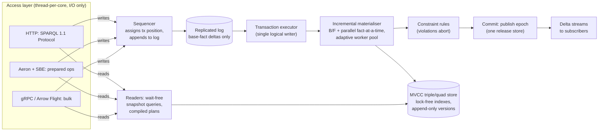
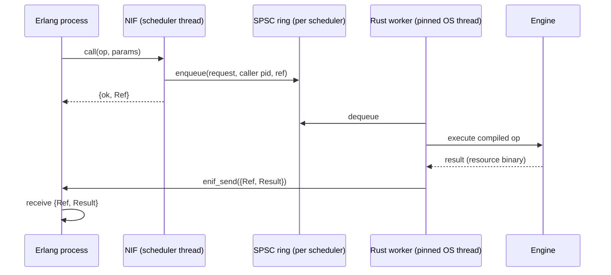

# A lock-free RDF and Datalog engine for live financial systems

**Technology exploration, 2026-10-03.** Not a LATTICE sketch and not a plan. A deep look at what
it would take to build a high-concurrency, main-memory RDF and Datalog execution engine on the
primitives of Motik, Nenov, Piro, Horrocks and Olteanu, *Parallel OWL 2 RL Materialisation in
Centralised, Main-Memory RDF Systems* (cited below as "the paper", the copy beside this file), for
a live trading or transaction-management system whose data contract is modelled in LATTICE. It is
written for a project that would be spun out into its own repository, so alignment with existing
LATTICE code is deliberately not a constraint.

Statements are graded where it matters. **Fact** means the paper or a primary source says so.
**Judgement** means a reasoned position that a benchmark could overturn. Licence statements marked
*(verify)* are from memory and must be checked against the upstream `LICENSE` file before anything
is adopted.

---

## Contents

1. [Executive summary](#1-executive-summary)
2. [What the paper actually gives us](#2-what-the-paper-actually-gives-us)
3. [The workload](#3-the-workload)
4. [Architecture, independent of language](#4-architecture-independent-of-language)
5. [Building on an existing stack](#5-building-on-an-existing-stack)
6. [Language and platform options](#6-language-and-platform-options)
7. [Decision matrix](#7-decision-matrix)
8. [Recommendation](#8-recommendation)
9. [Experiments to run before committing](#9-experiments-to-run-before-committing)
10. [Risks and open questions](#10-risks-and-open-questions)
- [Appendix A: Formal methods](#appendix-a-formal-methods)
- [Appendix B: Licence summary](#appendix-b-licence-summary)
- [Appendix C: References](#appendix-c-references)

---

## 1. Executive summary

**The paper solves one phase of the problem, and solves it well.** It gives a parallel,
fact-at-a-time semi-naïve evaluation algorithm and a hash-indexed triple store whose insertions are
"mostly" lock-free, and shows 13.9× speedup on 16 physical cores for bulk materialisation of
100M-to-1.5B-triple datasets. It is an insert-only, run-to-fixpoint, throughput-oriented design.
A live trading system is update-heavy (retractions as well as assertions), latency-oriented,
transactional, durable and audited. Everything the paper does not cover (deletion and incremental
maintenance, isolation, durability, replication, negation, aggregation, exact arithmetic, equality
at scale) has to be designed around its primitives, and those additions shape the technology choice
more than the primitives themselves do.

**The architectural position this document argues (judgement).** Sequence the writes, parallelise
the derivation, and make the reads wait-free. A single logical writer applies a totally ordered log
of transactions (the pattern behind LMAX, Aeron Cluster and TigerBeetle), each transaction's
consequences are materialised by the paper's algorithm generalised to incremental maintenance and
run in parallel only when the derivation frontier is large enough to repay coordination, and any
number of readers query immutable snapshots without blocking the writer or each other. This keeps
the paper's lock-free index where it pays (concurrent derivation and concurrent reads) and removes
it from where it hurts (write-write conflicts, deterministic replay, audit).

**The technology recommendation (judgement, high confidence on the core, medium on the rest).**

| Layer | Recommendation | Credible alternative |
|---|---|---|
| Engine core: storage, evaluation, transactions, log | **Rust** | Java with an off-heap (FFM) core, if the organisation is JVM-first |
| Rule and query compiler | Rust, generating specialised Rust at build time from the known LATTICE rule and query set | F# or OCaml if a separate compiler language is wanted |
| Specification, reference evaluator, proofs | **Lean 4** for mechanised semantics and the test oracle, **TLA+ or Quint** for protocols | Rocq (Coq) or Isabelle |
| Low-latency native access | **Aeron + SBE** (established in finance, Apache-2.0), not a bespoke TCP or UDP protocol | gRPC or Arrow Flight where microseconds do not matter |
| HTTP access | **SPARQL 1.1 Protocol**, plus streamed deltas for subscriptions and Arrow for bulk results | |
| Replication | a replicated state machine over the transaction log (Raft via `openraft`, or VSR-style) | Aeron Cluster, if the core is Java |

**On the options as posed.** Erlang + Rust is a sound pairing for a distributed control plane, but
the engine's hot path gains nothing from BEAM and pays for an extra hop and a crash-coupling risk,
so Erlang belongs at the edge if at all. .NET/F# + Rust is credible and has excellent concurrency
testing (Coyote) and SIMD, but splitting the hot path across P/Invoke is a recurring tax, so it
reduces to "Rust core, .NET for tooling and SDKs". Pure Java is the leading single-language
alternative because of the finance transport ecosystem (Aeron, Agrona, SBE, Disruptor) and runtime
code generation with JIT optimisation, held back by the absence of value types and of 128-bit CAS.
Rust + another language is the recommended shape, with the other language doing the specification
and proof work offline rather than sharing the runtime.

**There is no permissively licensed system that already does this.** RDFox, the commercial
descendant of the paper, is proprietary. The engine core must be built. Parsers, SPARQL algebra,
transport, consensus and serialisation can be reused under permissive licences (§5).

---

## 2. What the paper actually gives us

A careful reading, because several later sections depend on precisely what is and is not claimed.

### 2.1 The evaluation algorithm

**Setting (fact).** OWL 2 RL axioms are translated into a datalog program P (not the fixed OWL 2
RL/RDF rule set, though the method applies to it). Materialisation computes the fixpoint P∞(I) of
facts I under P.

**Interface the store must offer (fact).** `I.add(F)` adds F if absent. An iterator `facts.next()`
returns a not-yet-returned fact. Both must be linearisable, but need not be ACID. The store is
viewed as a vector, so I<F and I≤F denote the facts before (and up to) F. Once `facts.next()`
returns F, later additions must not change I≤F. Returning F **freezes** its prefix.

**Rule indexing (fact).** Two hash tables map each body atom to the rules it can match: H1 keyed by
class C for `⟨t, rdf:type, C⟩`, and H2 keyed by predicate R otherwise. `P.rulesFor(F)` returns each
⟨rule, annotated query, substitution⟩ for which some body atom unifies with F.

**Annotated queries (fact).** For a rule B1 ∧ … ∧ Bn → H matched at body atom Bi, atoms before i are
evaluated against I<F and atoms after i against I≤F. This is the fact-at-a-time form of
semi-naïve evaluation, and it guarantees (Theorem 1) that each rule instantiation is considered at
most once, so derivations are not repeated, although the same fact may be derived by different
instantiations.

**Algorithm 1 (fact).** Each of N threads loops: take an unprocessed fact F, find matching rules,
evaluate the annotated query with index nested loops in a greedily chosen left-to-right join order
(Algorithm 2), and add each instantiated head. A thread that finds no work increments a waiting
counter W, enters a mutex-guarded critical section, and either declares termination when W = N or
waits on a condition variable for new facts. W is incremented before taking the mutex so that
termination does not depend on mutex fairness.

**Why it parallelises (fact).** Work is partitioned dynamically, one fact at a time as threads
become free, rather than statically by hashing variables. The number of subqueries is proportional
to the number of facts, so threads stay loaded despite skew.

### 2.2 The storage scheme

**Dictionary (fact).** Resources are dictionary-encoded as integers. The paper does not describe the
dictionary's concurrency.

**Triple table (fact).** Six columns per triple: Rs, Rp, Ro (encoded terms) and Nsp, Nop, Np (next
pointers). Each triple sits in three linked lists: the **sp-list** (same subject, grouped but not
sorted by predicate), the **op-list** (same object, grouped by predicate) and the **p-list** (same
predicate). Pointers are offsets into the table, so a triple's position is also its insertion order,
and the I<F test is a pointer comparison.

**Indexes (fact).**

| Index | Realisation | Matches |
|---|---|---|
| Ispo | open-addressing hash table of triple pointers | ⟨s,p,o⟩ |
| Is, Ip, Io | arrays of list heads (Is and Io also keep list lengths) | ⟨s,y,z⟩, ⟨x,p,z⟩, ⟨x,y,o⟩ |
| Isp, Iop | open-addressing hash tables pointing at the first triple of each group | ⟨s,p,z⟩, ⟨x,p,o⟩ |
| none | scan the shorter of the s-list and o-list, filtering | ⟨s,y,o⟩, judged rare in practice |
| none | scan the table | ⟨x,y,z⟩ |

Ios is deliberately omitted because it would approach Ispo in size.

**Memory (fact, and the formula is reusable).** Per triple, excluding the dictionary:
3(r + p) + (1 + d_sp + d_op) · 2p / f, with r bytes per term, p bytes per pointer, load factor f,
and d_sp, d_op the distinct sp- and op-groups per triple. With r = 4, p = 8, f = 0.7, d_sp = 0.5,
d_op = 0.4 this is about 80 bytes, and about 46 bytes with p = 4 (at most 2³² triples). §4.3 reuses
the formula for the variants this document proposes.

### 2.3 The concurrency primitives, catalogued

| # | Primitive | Mechanism | Progress guarantee | Depends on |
|---|---|---|---|---|
| C1 | Ispo insertion (Algorithm 3) | linear probing. On an empty bucket, CAS the marker `INS` in, allocate the triple, write it, store its pointer. A prober that meets `INS` waits | **blocking at one bucket**: a thread preempted while holding `INS` stalls others probing through that bucket. The paper calls this "mostly" lock-free | single-word CAS, release/acquire ordering of the triple's fields before the pointer store |
| C2 | Triple allocation | atomic increment of the table's end | lock-free while the table has capacity | fetch-and-add |
| C3 | List insertion (Algorithm 4) | insert after the group's first triple T: read T.N, write Tnew.N, CAS T.N | lock-free (retry on interference) | single-word CAS. Insertion only, no deletion |
| C4 | New group (empty Isp/Iop bucket) | claim the bucket with `INS`, update Is or Io, publish | blocking at one bucket, as C1 | multiword update emulated by a local lock |
| C5 | Cooperative resize | one thread allocates the new array and raises a flag. Every accessing thread migrates blocks of 1,024 buckets until done. The last thread frees the old array | lock-free except the allocation step | a resize flag and a migration cursor |
| C6 | Per-thread reserved table blocks | each thread writes into its own block, so Tnew is known before probing and C1 can CAS Tnew straight into the bucket | **makes Algorithm 3 fully lock-free** (the paper's own observation) | the iterator must invalidate unused reserved rows when it reaches them, or the freeze property of §2.1 breaks |
| C7 | Per-thread private insertion points | a thread keeps private (s,p) and (o,p) insertion points for subjects or objects it has inserted more than 100 times, then inserts without CAS | interference-free on hot groups | memory: it exhausted RAM on the largest LUBM tests |
| C8 | Termination (Algorithm 1, lines 7–15) | waiting counter W, mutex, condition variable | blocking, but only idle threads enter | a fair-enough scheduler |

### 2.4 Measured results and what they imply

**Facts.** Speedup up to 13.9 on 16 physical cores and 19.5 on 32 hyperthreads. Concurrency support
costs 10–30% against a sequential build, so parallelism pays from two threads. Parallel import is
within about 5% of sequential import. Speedup correlates at 0.9 with the fraction of active triples
(triples some rule was applied to), which is why DBpedia's low active fraction gave only 6.6×.
Hash-based index nested loops with random memory access were competitive because hyperthreading and
a high degree of parallelism hide stalls. RDFox beat PostgreSQL and MonetDB triple-table layouts,
which timed out on self-joins, and was competitive with MonetDB's vertical partitioning, which was
more compact but ran out of memory on many tests.

**Implications (judgement).**

- The headline speedups are for **large** materialisations. For a transaction that derives tens or
  hundreds of facts, thread wake-up and termination detection (C8 uses a condition variable, whose
  wake-up costs microseconds) can exceed the work. Parallel evaluation must be adaptive (§4.4).
- Random-access hash and list traversal is memory-latency-bound. Hyperthreading hid it on the
  paper's hardware. On a latency-sensitive system with pinned, non-hyperthreaded cores, the same
  stalls appear directly as tail latency. Huge pages, prefetching and list layout matter (§4.3).
- C1 and C4 are blocking under preemption. With pinned threads and no oversubscription, preemption
  is rare. With oversubscription it is a tail-latency hazard. C6 removes it for C1.

### 2.5 What the paper does not cover

| Gap | Why it matters for trading |
|---|---|
| Deletion and incremental maintenance | orders are cancelled, positions close, states change. The authors' later Backward/Forward (B/F) algorithm addresses this. DRed and counting are the classical alternatives |
| Transactions and isolation | queries are answered *during* materialisation, so they can see a partial fixpoint. A trading read must see a committed fixpoint |
| Durability and replication | the paper is in-memory only and names secondary storage as future work |
| Negation and aggregation | eligibility (Undetermined vs Denied), limits and exposures need stratified negation and aggregates |
| Equality | `owl:sameAs` cliques blow up quadratically, which the paper names as its main open problem. Identifier reconciliation (ISIN, CUSIP, FIGI, LEI) is exactly this workload. The authors' later rewriting approach handles it with a representative per clique |
| Datatypes and arithmetic | money must be exact decimal, never binary floating point |
| Named graphs | LATTICE uses graphs for revisions and provenance. The scheme is triples only |
| Query planning beyond greedy left-to-right | cyclic patterns benefit from worst-case optimal joins |
| Dictionary concurrency | unspecified, and on the hot path for every new term |

---

## 3. The workload

### 3.1 Where an RDF and Datalog engine sits

A frank positioning, because it changes what "extremely high performance" has to mean.

| Tier | Typical latency budget | Fit for this engine |
|---|---|---|
| Market-data tick-to-trade (HFT) | sub-microsecond to single-digit microseconds, often FPGA | **no**. No general join engine belongs here |
| Pre-trade risk and eligibility checks | tens to hundreds of microseconds | **plausible**, with prepared, compiled rule sets and small deltas |
| Order and position management, instrument lifecycle (accruals, coupons, barriers, corporate actions, margin, collateral) | sub-millisecond to milliseconds, high throughput | **strong fit**. This is where complex instrument behaviour lives and where a declarative model pays |
| Intraday exposure, limit monitoring, regulatory reporting, as-of reconstruction | milliseconds to seconds | **strong fit**, especially with as-of snapshots (§4.5) |

**Judgement.** Target the second and third tiers: p99 in the tens of microseconds for a prepared
query or a small transaction, and millions of base-fact changes per second in aggregate. Claiming
the first tier would commit the design to constraints that the declarative model exists to avoid.

### 3.2 Requirements

| # | Requirement | Consequence |
|---|---|---|
| W1 | Many concurrent readers, never blocked by writers | snapshot reads (MVCC), wait-free on the read path |
| W2 | Writes are small deltas, assertions and retractions | incremental maintenance, fact-at-a-time evaluation (a good match for the paper's style) |
| W3 | Every committed state is a full fixpoint | commit only after materialisation and constraint checks complete |
| W4 | Deterministic, replayable history for audit and recovery | a totally ordered transaction log, a canonical state hash (§4.5) |
| W5 | As-of queries for reconstruction | retained versions, transaction time as a first-class axis |
| W6 | Exact decimal arithmetic and nanosecond timestamps | native literal types, not strings via the dictionary |
| W7 | Constraint checks can reject a transaction (limits, eligibility) | SHACL-like constraints compiled to rules whose violation facts abort the commit |
| W8 | High availability | replication of the log, fast failover |
| W9 | Push of changes to subscribers | delta streams from incremental maintenance |
| W10 | Timestamps traceable to UTC | PTP-synchronised clocks. MiFID II RTS 25 sets tight divergence limits for high-frequency activity |

### 3.3 What the LATTICE contract gives the engine

Alignment with LATTICE code is not a goal, but the contract itself is an input with real
engineering consequences.

| LATTICE element | What it tells the engine |
|---|---|
| Persistence profiles (`dal:`) | aggregate boundaries, concurrency and ordering grain, uniqueness and identity strategy per class. These are transaction-scope and partitioning hints the engine can enforce rather than infer |
| Generated SPARQL (persistence `instantiate`) | **the query set is known at design time**, so queries can be compiled into specialised plans and exposed as prepared operations |
| Surface contracts | which flattened, promoted properties must be cheap to read. These map to materialised indexes or views maintained incrementally |
| SHACL shapes | constraints to compile into violation rules (W7) |
| Instrument and Behaviour | state, transition, trigger and effect. Datalog derives which transitions are enabled. Applying an effect is a non-monotonic state change and therefore a transaction, which the sequenced writer performs. This split falls out of the model rather than being imposed on it |
| Eligibility (strong Kleene, Undetermined) | stratified negation with three-valued outcomes. Not expressible in positive datalog |

**The consequence that matters most (judgement).** Because the rule set and query set are known in
advance, the engine can be a **compiler**, in the way Soufflé compiles datalog to C++, rather than a
general interpreter. This favours languages with a good code generation story (§6.1).

---

## 4. Architecture, independent of language

### 4.1 The central tension

The request asks for lock-free access to achieve massive concurrency. Two bodies of evidence pull
in different directions.

- **Lock-free shared state** (the paper, Silo, Hekaton) scales CPU-bound work across cores when
  conflicts are rare and work is plentiful.
- **Single-writer sequencing** (LMAX Disruptor, Aeron Cluster, TigerBeetle) is how much of the
  finance industry achieves low, predictable latency and deterministic replay. It avoids write-write
  coordination entirely, and it batches.

These are not contradictory once each is applied to the part of the problem it suits:

| Part | Conflict profile | Technique |
|---|---|---|
| Ordering of transactions | every transaction must have one global position | **single sequencer**. Coordination is irreducible here, so make it one thread and batch |
| Materialisation of one transaction's consequences | many derived facts, set semantics, order-independent result | **parallel, lock-free** (the paper), adaptive to delta size |
| Reads | read-only against committed snapshots | **wait-free** snapshot access, any number of threads |
| Commit publication | one pointer swap per commit | a single release store of the new commit epoch |

### 4.2 Recommended shape



The executor applies one transaction (or one batch of mutually independent transactions, §4.4) at a
time. Inside a transaction, materialisation fans out across workers. Readers see only published
epochs. Replicas apply the same log and converge on the same fixpoint (§4.5).

### 4.3 Storage: adapting the paper

**Versioned, append-only triples (judgement, standard MVCC).** Each triple record gains
`created` and `retired` transaction numbers. A reader at snapshot e sees a triple when
`created ≤ e < retired`. Retraction is one CAS on `retired`. Nothing is unlinked on the hot path,
which keeps C3's insert-only list discipline intact. The table order still provides the I<F and I≤F
annotations within a materialisation. This is the HyPer and Hekaton family of designs applied to the
paper's table.

**Reclamation by generation, not by pointer (judgement).** Fine-grained reclamation (hazard pointers,
epoch-based reclamation per node) is among the harder parts of lock-free structures to get right and to
verify. Because the table is append-only, reclamation can be coarse: periodically build a compacted
table generation in the background (dropping versions retired before the oldest active snapshot and
outside the as-of retention window), switch readers to it with one pointer swap, and free the old
generation once no reader holds it. A single global epoch counter, as in Silo, is enough.

**Tagged 64-bit terms with inline literals (judgement, a well-known technique).** Most trading
literals are numbers, timestamps, booleans and small decimals. Encode a type tag in the high bits
and the value inline, so those terms never touch the dictionary. Decimals beyond the inline range,
strings and IRIs go through the dictionary. Comparisons and range scans on inline numerics become
integer operations.

**Exact decimals (fact about hardware, judgement about design).** Represent money as scaled i128.
Aggregates over i128 need 128-bit atomics: `cmpxchg16b` on x86-64 and `CASP` on ARMv8.1, which Rust
and C++ can use and the JVM and .NET cannot express directly. The portable alternative is per-thread
partial sums combined at read time (the `LongAdder` pattern), which also scales better under
contention.

**Layout variants (computed with the formula of §2.2, f = 0.7, d_sp = 0.5, d_op = 0.4).**

| Variant | r | p | MVCC stamps | Bytes per triple (approx.) | Limit |
|---|---|---|---|---|---|
| paper, 8-byte pointers | 4 | 8 | none | 80 | |
| paper, 4-byte pointers | 4 | 4 | none | 46 | 2³² triples |
| inline literals, 4-byte offsets | 8 | 4 | none | 58 | 2³² per table generation |
| inline literals, 4-byte offsets, MVCC | 8 | 4 | 2 × 4 bytes (epoch-relative) | 66 | as above |
| as above, quads | 8 | 4 | 2 × 4 bytes | about 80 with a graph column and one graph list | as above |

A billion live quads is therefore on the order of 80 GB before the dictionary, which fits one large
server. The hot set of a trading book is usually far smaller.

**Chunked rather than per-triple lists (judgement).** The sp- and op-lists are pointer chases, one
likely cache miss per element. Unrolled lists (a small block of triple offsets per node, appended
with one fetch-and-add on the block's fill count) keep insertion lock-free and cut misses by the
block size on scans. Soufflé's concurrent B-tree (Jordan et al., PPoPP 2019) and adaptive radix
trees with optimistic lock coupling (Leis et al.) are the main alternatives when ordered access is
needed. Bw-trees are not recommended: the SIGMOD 2018 replication study found them slower and far
more complex than alternatives.

**Hardware discipline (fact about hardware).** Random-access hash workloads are dominated by TLB and
cache misses. Back the table and hash arrays with 2 MB or 1 GB huge pages, allocate per NUMA node,
pin worker threads, and batch probes with software prefetching (group prefetching or AMAC, Kocberber
et al., VLDB 2015) inside the nested-loop join.

**Dictionary (judgement).** A concurrent open-addressing map from term bytes to ID, using the same
claim-then-publish protocol as C1 with pre-allocated IDs (as C6) so it is lock-free, plus an
append-only ID-to-term array. Hash the term bytes once and carry the hash with the term.

### 4.4 Evaluation: from bulk materialisation to small deltas

**Adaptive parallelism (judgement).** The executor starts materialising a transaction's delta on its
own thread. When the frontier of unprocessed derived facts exceeds a threshold (calibrated by
benchmark, plausibly in the hundreds), it releases pinned, spinning workers to join. Spinning
workers replace C8's condition variable, trading CPU for microseconds. Termination becomes an atomic
count of outstanding work plus a per-round flag, checked without a mutex. Bulk loads use the paper's
algorithm unchanged.

**The work source (judgement, with a real trade-off).** The paper's global iterator over the table is
both its source of the no-repeated-derivation guarantee and its remaining contention point (§5 of the
paper). Per-worker Chase-Lev deques with stealing remove the contention but lose the global order
that the I<F annotation relies on, which reintroduces some repeated derivations. For the fixpoint
itself that costs only wasted work, since set insertion deduplicates. It becomes a **correctness**
problem for any counting-based incremental maintenance scheme, which needs exact derivation counts.
Choose B/F (no counts) with work stealing, or keep the global order with counting. Not both.

**Incremental maintenance (fact for the algorithms, judgement for the choice).** For retractions,
B/F (Motik et al., AAAI 2015) checks backward whether a deleted fact still has an alternative
derivation before propagating forward, and generally overdeletes less than DRed (Gupta, Mumick and
Subrahmanian, SIGMOD 1993). Counting suits non-recursive rules. Differential dataflow and DBSP are a
different family entirely, maintaining weighted collections through sorted arrangements rather than
a hash-indexed store (§5).

**Negation and aggregation (fact for semantics).** Stratify. Run the parallel algorithm within a
stratum and barrier between strata. Maintain aggregates incrementally as derived values with
per-thread partial sums. Recursive aggregation (exposure netting up a legal-entity hierarchy) is
handled as recursion (closure) in one stratum, then aggregation over the closure in the next.

**Equality (fact for the method).** Rewrite every resource to the representative of its equality
class, with a concurrent union-find (Anderson and Woll's wait-free union-find is the classical
reference) instead of materialising `owl:sameAs` cliques.

**Joins (judgement).** Keep index nested loops for the common acyclic, selective patterns of
prepared queries. Use a worst-case optimal join (Leapfrog Triejoin, Veldhuizen 2014) where the
compiler detects cyclic patterns, which needs sorted access on the relevant indexes.

**Compiled rules (judgement).** Compile each rule body and prepared query into a specialised join
routine at build time from the LATTICE contract, with an interpreter fallback for ad hoc SPARQL.
This removes per-atom dispatch, lets the compiler fix join orders using persistence profile
statistics, and is the main reason runtime code generation features in the language matrix.

**Batching independent transactions (judgement, research).** Transactions touching disjoint LATTICE
aggregates, whose derivation footprints the compiler can prove disjoint, can be materialised
concurrently and committed in sequence order. This is where the persistence profile's aggregate
boundaries could become a throughput multiplier. It needs a static analysis of rule dependencies per
aggregate, and is not needed for a first version.

### 4.5 Durability, replication and determinism

**Log only base facts (judgement).** Derived facts are a function of base facts and rules, so the
log carries base-fact deltas and rule-set versions only. Recovery replays from a snapshot of base
facts (optionally with a snapshot of the materialisation to shorten recovery).

**Replicated state machine (judgement).** Replicate the log with Raft or Viewstamped Replication.
Each replica applies the same transactions in the same order. Parallel materialisation is
nondeterministic in *order* but deterministic in *result* for stratified datalog with deterministic
aggregates, so replicas converge on the same fixpoint without lockstep execution. That property is
what makes the paper's algorithm compatible with replication at all.

**Canonical state hash (judgement).** Dictionary IDs and table positions differ between replicas, so
a byte-level state hash is meaningless. Use an incremental multiset hash (Clarke et al., ASIACRYPT
2003) over canonical term encodings: add a triple's hash on assertion, subtract it on retraction.
Replicas can compare hashes per transaction cheaply. Audit replays can prove they reproduced the
same state.

**Transaction time is bitemporality for free (judgement).** MVCC's commit epoch is the transaction
time axis of a bitemporal model. Retaining versions within a retention window gives as-of queries
directly. Older history can be compacted to a columnar format (Parquet or Arrow) for reconstruction
queries off the hot path.

### 4.6 Access protocols

**Do not invent a wire protocol (judgement, high confidence).** A bespoke UDP protocol has to solve
loss, ordering, flow control, congestion and fan-out, which is what Aeron already solves. A bespoke
TCP protocol is a smaller risk but still forfeits every existing client library and tool.

| Layer | Protocol | Use | Notes |
|---|---|---|---|
| Low-latency native | **Aeron** (reliable UDP unicast and multicast, plus shared-memory IPC) with **SBE** encoding | prepared operations from co-located or in-datacentre clients, multicast delta fan-out | Apache-2.0. C, C++, Java and .NET clients maintained upstream. Rust via bindings to the C client. Encryption in the open-source edition should be checked *(verify)*. Datacentre links are often protected at network level instead |
| General RPC and bulk | **gRPC** over HTTP/2, **Arrow Flight** for columnar results | integration services, analytics | ubiquitous tooling, higher latency than Aeron |
| HTTP | **SPARQL 1.1 Protocol** and Graph Store Protocol, SPARQL JSON, XML, CSV and TSV results, Arrow IPC for bulk | everyone, including tools | standard and testable against the W3C suites |
| Subscriptions | Server-Sent Events or WebSocket over HTTP, Aeron multicast natively | continuous query deltas | payloads as RDF Patch-style add and delete records |
| Optional | **PostgreSQL wire protocol** exposing Surface-projected flat views as tables | BI tools, any language with a Postgres driver | used by many non-Postgres engines for client reach |

**Prepared operations (judgement).** Because the query set is known (§3.3), the native protocol
should carry an operation ID and SBE-encoded parameters, not SPARQL text. The server executes a
compiled plan and returns SBE-encoded rows. Parsing and planning leave the hot path entirely.

---

## 5. Building on an existing stack

Acceptable licences: anything permitting our project to be a runtime dependency of closed-source
commercial software. Permissive licences (MIT, Apache-2.0, BSD, ISC, UPL, OpenLDAP, EDL) are fine.
File-level weak copyleft (MPL-2.0, EPL-2.0) is usable with care. LGPL is usable with dynamic linking
and care. GPL, AGPL, SSPL and source-available licences such as BSL are excluded.

| System | Language | Licence | Fit | Verdict |
|---|---|---|---|---|
| RDFox | C++ | proprietary | the paper's own lineage | **excluded**, licence |
| GraphDB, Stardog, AllegroGraph | various | proprietary | | **excluded** |
| Virtuoso (open source) | C | GPL-2.0 | | **excluded** |
| Blazegraph | Java | GPL-2.0, unmaintained | | **excluded** |
| Apache Jena (ARQ, RIOT, TDB2) | Java | Apache-2.0 | parsers, SPARQL algebra and optimiser are reusable. TDB2 is a copy-on-write B+tree store, not this design. ARQ's iterator-per-binding execution is too allocation-heavy for the hot path | **reuse parsers and algebra** in a Java core |
| RDF4J | Java | EDL-1.0 (BSD-style) | the SAIL API is a clean plug-in point for a custom store. Execution model as Jena | **reuse** in a Java core |
| Oxigraph and its crates (`oxrdf`, `oxttl`, `oxrdfxml`, `spargebra`, `sparopt`, `sparesults`) | Rust | MIT or Apache-2.0 | parsers, SPARQL parser and algebra, result serialisers. Storage is RocksDB-based | **reuse crates** in a Rust core |
| QLever | C++ | Apache-2.0 *(verify)* | very fast read-mostly SPARQL, limited updates | reference design for compressed read paths |
| Soufflé | C++ | UPL-1.0 | compiled, parallel datalog, concurrent B-tree and Brie structures. Batch, not live | **reference design**, particularly its data structures |
| Nemo | Rust | MIT or Apache-2.0 *(verify)* | rule engine, columnar tries, successor of VLog. Batch-oriented | reference, possible rule-parser reuse |
| Differential Dataflow and Timely | Rust | MIT | incremental, recursive, handles retractions, deterministic, multi-worker | **a genuine architectural alternative** to implementing B/F over the paper's store (experiment E5) |
| DBSP and Feldera | Rust | MIT *(verify)* | incremental view maintenance with a clean algebra (Z-sets), recursion supported | **a second alternative** in the same family |
| DDlog | Rust | MIT, archived | | excluded, unmaintained |
| Datafrog, Ascent, Crepe | Rust | MIT or Apache-2.0 | embedded datalog. Ascent compiles rules via macros | reference for compile-time rule specialisation |
| DuckDB, DataFusion | C++, Rust | MIT, Apache-2.0 | vectorised analytics over flat (Surface) projections | optional analytic side-path |
| RocksDB, LMDB | C++, C | Apache-2.0 (dual GPL-2.0), OpenLDAP | durable cold storage | snapshots and history, not the hot store |
| TigerBeetle | Zig | Apache-2.0 | a financial transactions database, not RDF | **architecture reference** for single-writer design and deterministic simulation testing |
| Aeron, Agrona, SBE, Disruptor, JCTools | Java (Aeron also C) | Apache-2.0 | transport, buffers, encoding, sequencing | **reuse** |
| openraft | Rust | MIT or Apache-2.0 | Raft | **reuse** for replication in a Rust core |
| HDT libraries | Java, C++ | LGPL *(verify)* | compressed read-only RDF | avoid unless needed |

**Conclusion (judgement).** Nothing permissively licensed implements a live, transactional,
parallel, incrementally materialising RDF store. Build the core. Reuse parsing, SPARQL algebra,
transport, encoding and consensus. Treat differential dataflow and DBSP as the serious "adopt rather
than build" alternative for the incremental layer and settle it by experiment.

---

## 6. Language and platform options

### 6.1 What the language must provide

Derived from §2 and §4, in rough order of weight for this workload.

| # | Need | Why |
|---|---|---|
| L1 | Predictable tail latency on the hot path | GC pauses, safepoints and JIT deoptimisation show up at p99.9 |
| L2 | Explicit atomics with a well-defined memory model | C1 to C7 need acquire/release CAS, and ARM servers expose weak ordering that x86 hides |
| L3 | Control of memory layout | structs of arrays, alignment to cache lines, huge pages, NUMA placement, no per-triple objects |
| L4 | 128-bit atomics | exact decimal aggregates and some ABA-safe pointer schemes |
| L5 | Memory and data-race safety | a financial system's integrity and security posture |
| L6 | Concurrency verification tooling | lock-free code is where correctness arguments fail (Appendix A) |
| L7 | Code generation for compiled rules and queries | §3.3 and §4.4 |
| L8 | RDF and SPARQL ecosystem under permissive licences | parsers, algebra, result formats, test suites |
| L9 | Finance transport ecosystem | Aeron, SBE, FIX tooling |
| L10 | Operational maturity and hiring in finance | someone must run and extend this |

### 6.2 Option A: .NET (C#, F#) with Rust

**Shape.** Rust for the storage and evaluation core. .NET for the access layer (Kestrel), the rule
and query compiler (F#), client SDKs and tooling. Interop over P/Invoke.

**Strengths.**
- **Low-level C# is genuinely capable.** `Span<T>`, `ref struct`, `NativeMemory.AlignedAlloc`,
  function pointers, `Interlocked.CompareExchange` on 32- and 64-bit values and object references,
  `Volatile`, a documented memory model, and first-class hardware intrinsics
  (`System.Runtime.Intrinsics`, including AVX-512 and AdvSimd) that are more mature than the JVM's
  incubating Vector API. A pure C# core over native memory is viable, which makes Rust optional in
  this option rather than required.
- **F# is a strong compiler language.** Discriminated unions, pattern matching and computation
  expressions suit rule rewriting, stratification and join planning.
- **Runtime code generation.** `DynamicMethod` and IL emission, compiled expression trees, tiered
  compilation with dynamic PGO. Generated query code is optimised by the JIT like hand-written code.
- **Concurrency testing.** Microsoft Coyote (MIT) gives systematic, controlled-scheduling testing of
  .NET concurrency, which is rare outside research tools. Dafny compiles to C#, and F* to F#.
- **Interop cost is low per call.** A blittable P/Invoke is nanoseconds, lower with
  `SuppressGCTransition` for short calls. Tools such as `csbindgen` generate C# bindings from Rust.
- Aeron.NET and SBE for .NET exist upstream. dotNetRDF (MIT) covers parsing.

**Weaknesses.**
- **The boundary is a recurring tax.** Every query result, every batch of parameters and every
  error crosses it. Fine-grained crossings (per binding, per triple) erase the benefit of Rust.
  The boundary must sit at whole operations, which means the engine's whole hot path is in Rust
  anyway and .NET is a client of it.
- **Two runtimes, two memory managers, two build systems, two debugging stories.**
- GC pauses on the .NET side remain milliseconds-class under load, so .NET should not sit between a
  latency-critical client and the engine.
- No 128-bit `Interlocked` operations.

**Verdict (judgement).** Credible, particularly for a .NET organisation. In practice it converges on
"Rust engine, .NET for compiler, tooling and SDKs", or on a pure C# engine if the team prefers one
runtime and accepts weaker static safety for unsafe code than Rust offers.

### 6.3 Option B: Java, pure

**Shape.** The whole engine on the JVM, with the triple table, hash arrays and dictionary off-heap in
`MemorySegment`s via the Foreign Function and Memory API (final since JDK 22), and Java objects only
for control structures.

**Strengths.**
- **A precise memory model and rich atomics.** `VarHandle` access modes (plain, opaque,
  acquire/release, volatile) with `compareAndSet`, `compareAndExchange` and `getAndAdd`, including on
  aligned off-heap memory through layout var handles. Lock-free algorithms in the paper's sense
  (not lock striping) are straightforward to express. `sun.misc.Unsafe` memory access is being
  withdrawn, so new code should use FFM from the start.
- **The finance transport ecosystem is native here.** Aeron, Aeron Cluster (a Raft-based replicated
  state machine), Agrona, SBE, the Disruptor and JCTools are all Java-first and Apache-2.0. LMAX
  showed single-writer, mechanically sympathetic Java at very high throughput.
- **Runtime code generation is the platform's home ground.** The ClassFile API (final in JDK 24)
  emits bytecode for each compiled rule or query, and HotSpot or Graal then inlines and specialises
  it with profile information that ahead-of-time compilation cannot see.
- **The richest permissive RDF ecosystem.** Jena (Apache-2.0) and RDF4J (EDL) give parsers, SPARQL
  algebra, optimisers and SHACL engines.
- **Concurrency testing.** JCStress (OpenJDK) for memory-model litmus tests, Lincheck for
  linearisability checking, Java PathFinder for model checking.
- Generational ZGC keeps pauses sub-millisecond. Project Leyden's AOT cache (JDK 24 onward) reduces
  warm-up.

**Weaknesses.**
- **No value types yet.** Project Valhalla's value classes are not generally available as of JDK 25.
  Anything per-triple must live in off-heap segments or primitive arrays, accessed by offset. That
  is how high-performance Java is written already, but it gives up the type system for the data
  that matters most.
- **No 128-bit CAS.** Exact decimal aggregates must use partial sums or locks.
- **Residual JVM jitter.** Safepoints, deoptimisation, JIT compilation and allocation stalls under
  pressure. Manageable with discipline and tuning, not eliminable.
- **Static verification is weaker for concurrent code.** KeY, OpenJML and VerCors exist, but none
  approaches Verus or Iris-based reasoning for lock-free structures.

**Verdict (judgement).** The leading single-language option, and the right choice if the team is
JVM-native or if Aeron Cluster's integrated replication is decisive. Accept the off-heap programming
style for the core.

### 6.4 Option C: Erlang or Elixir with Rust

**Shape.** BEAM for network termination, sessions, supervision and distribution. Rust for the
engine. The question is how they meet.

**Integration modes (fact for the mechanisms, judgement for the ratings).**

| Mode | Mechanism | Latency added | Isolation | Notes |
|---|---|---|---|---|
| Plain NIF | synchronous call on a normal scheduler | lowest | none: a crash or undefined behaviour kills the VM | must return within about a millisecond or it degrades the schedulers |
| Yielding NIF | `enif_schedule_nif` and `enif_consume_timeslice` to split work | low | none | engine work is not naturally resumable in slices |
| Dirty NIF | runs on a dirty CPU or I/O scheduler | low | none | dirty schedulers are few. Long engine calls tie them up |
| **Async NIF with a queue** (the pipe described in the request) | the NIF enqueues onto a ring and returns at once. Rust worker threads, not BEAM threads, execute. Completion via `enif_send` to the calling process from a non-scheduler thread | low microseconds per round trip | none | the idiomatic pattern. Use one SPSC ring per BEAM scheduler to avoid CAS on enqueue. Complete with `enif_send`, not a polled handle, because polling burns reductions. Return large results as resource binaries to avoid copying into the process heap. Handle a full ring as back-pressure |
| Port program or separate process over a shared-memory ring | the engine is its own OS process. BEAM writes requests into a shared-memory ring and is woken by `eventfd` or a futex | low microseconds | **full**: an engine crash does not take down BEAM | recovers Erlang's fault-tolerance argument at modest cost |
| Network client | BEAM talks to the engine over Aeron, gRPC or TCP | tens of microseconds and up | full | simplest, and then BEAM is just another client |



**Strengths.**
- Supervision trees, process isolation, distribution and hot code loading for the control plane.
- Very good at many concurrent sessions and protocol state machines.
- The async-NIF pipe is sound, well-trodden, and keeps engine work off BEAM schedulers.
- Concuerror (systematic concurrency testing for Erlang) and property-based testing culture.

**Weaknesses.**
- **BEAM adds nothing to the hot path.** BEAM's model is share-nothing message passing. The paper's
  primitives are shared-memory CAS. All engine concurrency lives in Rust regardless.
- **An extra hop.** Client → BEAM → ring → Rust → `enif_send` → BEAM → client, where a Rust access
  layer would go client → Rust → client.
- **Crash coupling.** With any in-process NIF mode, a Rust panic is contained (Rustler catches
  unwinding) but undefined behaviour or a segmentation fault kills the VM, defeating the reason for
  choosing BEAM. Only the separate-process mode avoids it.
- Erlang distribution is not a low-latency transport. Numeric work is slow. Finance hiring for BEAM
  is thin.

**Verdict (judgement).** Choose it only if the deployment's dominant problem is orchestration across
many nodes and sessions. Then put BEAM beside the engine, as a supervising control plane and session
gateway, using the separate-process shared-memory ring or the network. Do not put it in front of
latency-critical reads.

### 6.5 Option D: Rust with another language

**Shape.** Rust for everything that runs in production. A second language where its strengths are
decisive. The useful reframing is that the second language need not share the runtime.

**Rust's case for the core.**
- **No GC, explicit layout, explicit atomics** with the C++20 memory model (`Ordering::{Relaxed,
  Acquire, Release, AcqRel, SeqCst}`, `compare_exchange`, `compare_exchange_weak`, `fetch_add`).
  128-bit atomics through `cmpxchg16b` or `CASP` via the `portable-atomic` crate, since the standard
  `AtomicU128` is not yet stable.
- **Safety where it is cheap, `unsafe` where it is needed, and tooling for the `unsafe`.** The
  borrow checker and `Send`/`Sync` remove most data races statically. The lock-free structures need
  `unsafe`, and Rust has unusually strong tools for exactly that code: `loom` (exhaustive
  interleavings under the C11 memory model), `shuttle` (randomised scheduling at scale), Miri
  (undefined-behaviour detection), Kani (bounded model checking) and Verus (SMT-based deductive
  verification, including concurrent data structures). See Appendix A.
- **Ecosystem.** `crossbeam` (epoch reclamation, deques), `seize` and `haphazard` (reclamation),
  `io_uring` runtimes (`glommio`, `monoio`, `tokio-uring`), `hyper` and `axum` for HTTP, `tonic` for
  gRPC, `arrow-rs` and DataFusion, Oxigraph's parser and algebra crates, differential dataflow,
  `openraft`.
- **Code generation.** The contract's rules and queries compile to Rust source at build time (the
  query set is known, so compile time is acceptable), with Cranelift available for runtime JIT of ad
  hoc queries.

**Rust's weaknesses.** Lock-free structures in Rust are still hard: reclamation, aliasing rules
inside `unsafe`, and self-referential layouts. Compile times. Aeron is reached through bindings to
the C client, whose quality should be checked. A smaller finance talent pool than Java or C++,
though growing.

**Candidate second languages.**

| Language | Role | Strengths | Cost |
|---|---|---|---|
| **Lean 4** | mechanised semantics of the rule language and evaluation, proofs of the semi-naïve and incremental algorithms, an executable reference evaluator used as the test oracle | proofs and programs in one language, compiles to C, Apache-2.0. Aeneas translates safe Rust into Lean for verification | proof engineering skills are scarce |
| OCaml (or OxCaml) | rule and query compiler | proven in trading (Jane Street), algebraic data types, fast compiler. OxCaml adds unboxed types and modes | a second toolchain, and OCaml is not where the engine runs |
| Haskell | compiler and property-based specification | expressive, QuickCheck lineage, Liquid Haskell | GC and runtime make it unsuitable at runtime. Offline only |
| F# | compiler | as Option A | .NET toolchain |

**Verdict (judgement).** Rust in production, Lean 4 for specification and proof, with the compiler
written in Rust unless the team strongly prefers a functional compiler language. The two never meet
at runtime, so there is no interop tax.

### 6.6 Option E: C++

**Strengths.** The incumbent for this exact domain: RDFox, Soufflé, QLever and VLog are C++. Full
control, mature libraries (Folly's hazard pointers and concurrent maps, oneTBB, libcds), `std::atomic`
with the C++20 memory model, 128-bit atomics, GenMC and CDSChecker for weak-memory model checking,
ThreadSanitizer, LLVM ORC for runtime JIT, Aeron's C and C++ clients and SBE's C++ generator.

**Weaknesses.** Memory and data-race safety rest entirely on discipline and tooling. For a new
financial system in 2026 that is a security and integrity liability that Rust removes at no
performance cost.

**Verdict (judgement).** Viable, and the default if the team is already a C++ shop with strong
concurrency expertise. Otherwise Rust supersedes it for a new codebase.

### 6.7 Option F: Zig

**Strengths.** TigerBeetle demonstrates a financial database in Zig with static allocation, a
single-threaded deterministic core, `io_uring`, and deterministic simulation testing. Explicit
allocators and `comptime` suit code generation.

**Weaknesses.** Pre-1.0 language with breaking changes. No borrow checker, so lock-free code has no
static help. Small ecosystem, almost no RDF tooling, little formal-methods tooling.

**Verdict (judgement).** Study TigerBeetle's design. Do not adopt the language for a lock-free,
shared-memory engine.

### 6.8 Others, briefly

| Option | Why not, or when |
|---|---|
| Go | GC, limited atomics, no layout control. Unsuitable for the core |
| Pony | data-race freedom by reference capabilities and a lock-free runtime, but a very small ecosystem |
| Ada and SPARK | highly industrialised deductive verification (absence of runtime errors, Ravenscar and Jorvik tasking profiles). Small ecosystem, no RDF tooling. Worth knowing for Appendix A, not a recommendation |
| OCaml alone (OCaml 5 domains) | a credible runtime for many systems, but the GC and limited layout control make the paper's off-heap hash structures awkward |
| Haskell alone | STM is elegant for composition, not for hot-path throughput, and GC pauses matter |

---

## 7. Decision matrix

Scores are judgements on a 1–5 scale for each option *as a whole*, with the hot path where that option
places it. Weights reflect §6.1. They are offered to make trade-offs explicit, not as arithmetic
truth.

| Criterion | Weight | A: .NET/F# + Rust | B: Java | C: Erlang + Rust | D: Rust + Lean/OCaml | E: C++ | F: Zig |
|---|---|---|---|---|---|---|---|
| L1 Tail latency | 3 | 4 | 3 | 3 | 5 | 5 | 5 |
| L2 Atomics and memory model | 3 | 5 | 4 | 4 | 5 | 5 | 4 |
| L3 Layout control | 3 | 5 | 3 | 5 | 5 | 5 | 5 |
| L4 128-bit atomics | 1 | 4 | 1 | 4 | 5 | 5 | 4 |
| L5 Safety | 3 | 4 | 4 | 3 | 5 | 2 | 3 |
| L6 Concurrency verification | 3 | 4 | 4 | 4 | 5 | 4 | 2 |
| L7 Code generation | 2 | 5 | 5 | 2 | 4 | 4 | 3 |
| L8 RDF ecosystem | 2 | 3 | 5 | 3 | 4 | 3 | 1 |
| L9 Finance transport | 2 | 4 | 5 | 2 | 3 | 5 | 2 |
| L10 Operations and hiring | 2 | 4 | 5 | 2 | 3 | 4 | 1 |
| Interop overhead on the hot path | 3 | 3 | 5 | 2 | 5 | 5 | 5 |
| Deductive verification (Appendix A) | 1 | 4 | 2 | 3 | 5 | 2 | 1 |
| **Weighted total (of 140)** | | **115** | **112** | **88** | **128** | **117** | **91** |

Reading the matrix: D leads on the criteria this workload weights most (latency, safety, verified
concurrency, no interop). E, A and B form a close second group for different reasons: raw control
and libraries for E, intrinsics and testing for A, ecosystem and code generation for B. E's lead
within that group comes despite its safety penalty, which a team may reasonably weight higher than
this table does. C and F trail, C because BEAM's strengths do not touch the hot path, F because of
ecosystem and tooling.

---

## 8. Recommendation

**Primary (judgement).**

1. **Engine core in Rust.** Storage (§4.3), incremental parallel evaluation (§4.4), MVCC,
   compaction by generation, the transaction executor, the log and replication via `openraft`.
2. **Compiler in Rust**, turning the LATTICE rule and query set into specialised Rust at build time,
   with an interpreter for ad hoc SPARQL built on Oxigraph's `spargebra` and `sparopt`.
3. **Access** with Aeron + SBE for prepared operations (bindings to the C client), `hyper`/`axum`
   for the SPARQL 1.1 Protocol, `tonic` and Arrow Flight for bulk, and optionally `pgwire` over
   Surface views.
4. **Lean 4** for the mechanised semantics and the reference evaluator, **TLA+ or Quint** for the
   sequencer, commit, replication and termination protocols (Appendix A).
5. **Deterministic simulation testing from the first commit**: time, randomness, I/O and worker
   scheduling behind interfaces, so the whole engine can be run under a seeded simulator.

**If the organisation is JVM-first (judgement).** Option B with an off-heap FFM core, Aeron Cluster
for replication, ClassFile API code generation, Jena or RDF4J for parsing and algebra, JCStress and
Lincheck for concurrency testing, and TLA+ for protocols. Expect more tuning effort for tail latency
and partial sums instead of 128-bit atomics.

**If Erlang is wanted for operations (judgement).** Option D as above, with BEAM as a separate
control plane and session gateway connected by a shared-memory ring between processes or by Aeron,
never as an in-process NIF in front of the read path.

---

## 9. Experiments to run before committing

Each experiment is small, decisive and benchmarked on the target hardware class (two-socket x86 and,
separately, an ARM server, because weak memory ordering changes both correctness and cost).

| # | Experiment | Decides | Pass criterion |
|---|---|---|---|
| E1 | Ispo plus sp/op indexes in Rust and in Java FFM. 1 to 64 threads, insert throughput and p99.9 insert latency, with and without reserved blocks (C6) and huge pages | the core language between B and D | Rust within agreed margin of the paper's scaling. Java p99.9 within an agreed factor of Rust |
| E2 | Small-delta materialisation: a transaction deriving 10, 100 and 10,000 facts, single-threaded versus adaptive parallel | the adaptive threshold (§4.4) and whether spinning workers are needed | p99 for a 100-fact delta below the tier target of §3.1 |
| E3 | B/F retraction versus differential dataflow versus DBSP on a LATTICE-shaped rule set (instrument lifecycle and exposure aggregation) | build versus adopt for incremental maintenance (§5) | latency, throughput and memory per live fact |
| E4 | Async-NIF round trip and the shared-memory ring between BEAM and a Rust process | whether Option C's hop is tolerable | measured round-trip p99 against the tier target |
| E5 | P/Invoke per-operation overhead with realistic result marshalling | Option A's boundary placement | overhead below an agreed fraction of operation cost |
| E6 | Aeron + SBE prepared operation, end to end, versus gRPC and HTTP | protocol layering (§4.6) | quantified latency per layer |
| E7 | Replicas applying the same log in parallel, comparing multiset hashes per transaction | the replication and determinism argument (§4.5) | hashes equal across 10⁶ transactions with randomised worker scheduling |
| E8 | `loom` and `shuttle` on the bucket and list protocols, with a deliberately weakened ordering | that the tooling catches the bugs this design invites | the weakened ordering is caught |

---

## 10. Risks and open questions

| # | Risk | Mitigation |
|---|---|---|
| R1 | The paper's speedups do not transfer to small deltas | E2 and adaptive parallelism |
| R2 | Lock-free code is correct on x86 and wrong on ARM | weak-memory model checking (`loom`, GenMC) and an ARM CI runner (Appendix A) |
| R3 | Memory growth from versions and private insertion points (C7) | compaction by generation, a cap on private insertion points, retention windows |
| R4 | The incremental algorithm is subtly wrong for some rule shape | differential testing against the Lean reference evaluator and against from-scratch recomputation on every commit in test builds |
| R5 | Scope creep into a general-purpose triple store | the compiled-contract model is the product. Ad hoc SPARQL is a fallback |
| R6 | Non-determinism leaks into replicated state (floating point, hash iteration order, timestamps) | exact decimals, canonical multiset hashing, time only from the log |
| R7 | Licence drift in a dependency | an automated licence check in CI against Appendix B's allow-list |
| R8 | A bespoke protocol creeps in for "just one client" | §4.6. Only established protocols |

**Open questions.**

| # | Question |
|---|---|
| Q1 | Which rule language is the source: SWRL, SHACL rules, an RDFox-like datalog dialect, or a LATTICE-specific IR with several front-ends |
| Q2 | Is RDF 1.2 (triple terms) needed for per-fact provenance, and at what memory cost |
| Q3 | What retention window for as-of queries is required by the regulatory regime in scope |
| Q4 | Should independent aggregates commit concurrently (§4.4, last point) in the first version, or only after the single-writer design is proven |
| Q5 | Is multicast delta fan-out to many subscribers a requirement, which would make Aeron decisive |

---

## Appendix A: Formal methods

### A.1 What needs verifying

| # | Property | Kind | Where it lives |
|---|---|---|---|
| F1 | Ispo `add` and `contains` are linearisable, and no triple is inserted twice | linearisability | C1, C2, C6 |
| F2 | Returning F freezes I≤F (§2.1), including with reserved blocks | safety invariant | C6 and the iterator |
| F3 | Each rule instantiation is considered at most once (the paper's Theorem 1) | safety | Algorithm 1 |
| F4 | Termination is neither premature nor lost | safety and liveness | C8 or its replacement |
| F5 | Resize never loses or duplicates a bucket | safety | C5 |
| F6 | No use-after-free under reclamation | memory safety | §4.3 generations |
| F7 | Readers see exactly the committed fixpoint at their snapshot | snapshot isolation | MVCC |
| F8 | Incremental maintenance yields the same set as recomputation from scratch | functional correctness | B/F |
| F9 | Replicas applying the same log reach equal canonical state | determinism | §4.5 |
| F10 | SPARQL results conform to the W3C semantics | conformance | query layer |
| F11 | Arithmetic is exact and overflow-checked | functional correctness | literals and aggregates |
| F12 | Protocol safety and liveness under failures | distributed safety | sequencer, log, replication |

### A.2 Techniques, from cheap to expensive

| Technique | Finds | Cost | Applied to |
|---|---|---|---|
| Unit and property-based tests | logic errors | low | everything |
| **Metamorphic tests** | order dependence | low | the paper's own law: any insertion order and any thread schedule give the same fixpoint. Permute inputs and schedules and compare canonical hashes (F3, F9) |
| **Differential tests** against a reference | semantic errors | low to medium | the engine against a naive evaluator (ideally the Lean one), B/F against recomputation (F8), SPARQL against the W3C test suites and another engine (F10) |
| Fuzzing | crashes, undefined behaviour, parser bugs | low to medium | parsers, protocol decoders, the compiler |
| **Systematic concurrency testing** under weak memory | interleaving and ordering bugs | medium | every lock-free structure (F1, F2, F4, F5, F6) |
| Linearisability checking of recorded histories | non-linearisable behaviour at scale | medium | the store under load (F1), transactional anomalies (F7) |
| **Deterministic simulation testing** | system-level bugs under faults | medium, but must be designed in from the start | the whole engine and replication (F7, F9, F12) |
| **Design-level model checking** (TLA+, Quint, P) | protocol design errors before code exists | medium | termination, commit, compaction switch-over, replication (F4, F6, F7, F12) |
| **Deductive verification** of kernels | proofs for all inputs and schedules | high | the bucket protocol and list insertion (F1, F5), reclamation (F6) |
| **Mechanised semantics** | specification errors, algorithm proofs | high | semi-naïve and B/F correctness (F3, F8). Mechanised datalog engines exist as precedent, for example Benzaken, Contejean and Dumbrava's certified standard and stratified datalog inference engines in Coq |

### A.3 Tooling by option

| Technique | Rust | Java | .NET | Erlang | C++ | Zig |
|---|---|---|---|---|---|---|
| Weak-memory systematic testing | **loom** (C11 model), shuttle | JCStress (litmus tests) | Coyote (controlled scheduling, not weak memory) | Concuerror (systematic, message-passing) | **GenMC**, CDSChecker, Nidhugg | none mature |
| Linearisability checking | via history checkers (Porcupine, Elle) | **Lincheck** | via history checkers | via history checkers | via history checkers | via history checkers |
| Undefined-behaviour detection | **Miri** | n/a (memory safe) | n/a for safe code | n/a | ASan, UBSan, TSan | safety checks in debug builds |
| Bounded model checking of code | **Kani** | Java PathFinder | | | CBMC | |
| Deductive verification | **Verus** (including concurrency via tokenised state machines), Creusot, Prusti, Aeneas to Lean | KeY, OpenJML, VerCors | **Dafny** (compiles to C#), F* | limited | VeriFast, Frama-C (C subset) | none |
| Deterministic simulation | madsim, turmoil, custom executors | custom executors | **Coyote** | not practical | custom | **TigerBeetle's VOPR** as a model |
| Foundations for unsafe code | RustBelt, Iris | | | | | |

Specification languages are independent of the implementation language: TLA+ (with TLC and the
Apalache symbolic checker), Quint, P, Lean 4, Rocq and Isabelle.

### A.4 A verification architecture

**Verified kernel, model-checked protocols, tested periphery (judgement).**

1. **Before code.** TLA+ or Quint models of the termination protocol (F4), the commit and epoch
   publication (F7), the compaction switch-over (F6) and replication (F12). A fragment of the
   termination model's key invariant:

   ```tla
   NoPrematureTermination ==
       done => /\ \A f \in Derived : processed[f]
               /\ Closed(Derived)        \* every rule instance over Derived is already in Derived
   ```

2. **Kernels.** The bucket claim-and-publish protocol, list insertion and reclamation are small
   enough to verify deductively in Verus, and must at least pass exhaustive `loom` exploration. An
   example of the cheap tier, which already catches the classic duplicate-insert race:

   ```rust
   #[test]
   fn racing_inserts_of_one_triple_create_it_once() {
       loom::model(|| {
           let idx = Arc::new(SpoIndex::with_capacity(4));
           let handles: Vec<_> = (0..2)
               .map(|_| {
                   let idx = idx.clone();
                   loom::thread::spawn(move || idx.insert(1, 2, 3))
               })
               .collect();
           let created = handles
               .into_iter()
               .map(|h| h.join().unwrap())
               .filter(|r| matches!(r, Inserted::New(_)))
               .count();
           assert_eq!(created, 1);
       });
   }
   ```

   The protocol under test is the paper's C1 with C6's pre-allocated triple:

   ```rust
   const EMPTY: u32 = 0;          // offsets start at 1, so 0 is free to mean "empty"
   const CLAIMED: u32 = u32::MAX; // the paper's INS marker

   pub fn insert(&self, t: Triple, reserved: u32) -> Inserted {
       let mut i = self.slot(t.hash());
       loop {
           match self.buckets[i].load(Ordering::Acquire) {
               EMPTY => {
                   // C6: the triple is already written into `reserved`, so publish it directly.
                   if self.buckets[i]
                       .compare_exchange(EMPTY, reserved, Ordering::AcqRel, Ordering::Acquire)
                       .is_ok()
                   {
                       return Inserted::New(reserved);
                   }
                   // lost the race: re-examine the same bucket, it may now hold this triple
               }
               CLAIMED => std::hint::spin_loop(), // only reachable without C6
               found if self.table.get(found) == t => return Inserted::Existing(found),
               _ => i = self.next(i),
           }
       }
   }
   ```

   The `Release` half of the successful CAS publishes the triple's fields written into `reserved`,
   and the `Acquire` load lets a prober read them. Weakening either to `Relaxed` is exactly the bug
   that x86 hides and ARM exposes, and that E8 checks the tooling catches.

3. **Algorithms.** Lean 4 mechanisation of stratified datalog semantics, the fact-at-a-time
   semi-naïve algorithm (the paper's Theorem 1 is a good first target, since its proof is short and
   given in the paper's Appendix A) and B/F. The executable Lean evaluator becomes the oracle for
   differential tests.

4. **System.** Deterministic simulation of the whole engine and replication under injected faults,
   with seeds recorded and replayable. Linearisability and transactional-anomaly checking (Elle-style)
   of recorded histories from load tests.

5. **Continuously.** Metamorphic and differential tests in CI on x86 and ARM, Miri on the `unsafe`
   modules, fuzzing of parsers and decoders, the W3C SPARQL suites, and the licence allow-list.

### A.5 How formal methods change the matrix

- **They widen Rust's lead.** `loom`, `shuttle`, Miri, Kani and Verus target precisely the `unsafe`
  lock-free code this engine needs, and Aeneas connects Rust to Lean. No other option has comparable
  coverage of that layer.
- **They lift .NET** through Coyote (systematic testing in production code) and Dafny compiling to
  C#, which makes a pure-C# core more defensible than its raw safety score suggests.
- **They leave Java strong on testing, weak on proof.** JCStress and Lincheck are mature, but
  deductive verification of lock-free Java over off-heap memory is research territory.
- **They do not rescue Erlang + Rust's hot path**, since the hot path is Rust either way. Concuerror
  helps the control plane only.
- **They penalise C++ and Zig** for the absence of ownership-based reasoning, though GenMC is a strong
  C++ tool for weak-memory checking.
- **They are language-neutral at the design level.** TLA+, Quint and Lean models are worth their cost
  whichever option is chosen.

### A.6 Pitfalls

- **Verifying under sequential consistency** while running on weak hardware. Every model and test of
  F1 to F6 must use the C11 or RC11 model (Lahav et al., PLDI 2017) or test on ARM.
- **The specification gap.** A proved kernel with a wrong specification is wrong. Differential tests
  against an independent reference catch what proofs of the wrong property miss.
- **Proof maintenance.** Proofs of fast-changing code rot. Verify the stable kernels (buckets, lists,
  reclamation, commit) and test the rest.
- **Determinism must be designed in.** Deterministic simulation cannot be retrofitted onto code that
  reads the clock, spawns threads or does I/O directly.

---

## Appendix B: Licence summary

Licences marked *(verify)* in the body must be confirmed upstream before adoption.

| Category | Examples | Status |
|---|---|---|
| Permissive | MIT, Apache-2.0, BSD-2/3, ISC, UPL-1.0, EDL-1.0, OpenLDAP, Boost | allowed |
| File-level weak copyleft | MPL-2.0, EPL-2.0 | allowed with care (modified files stay open) |
| Library copyleft | LGPL-2.1, LGPL-3.0 | allowed with dynamic linking and care. Avoid in the core |
| Strong copyleft and network copyleft | GPL, AGPL, SSPL | excluded from shipped code. Acceptable for test-only tools that are not distributed (JCStress, PropEr) |
| Source-available | BSL, Commons Clause variants | excluded |
| Runtimes | OpenJDK (GPL-2.0 with Classpath Exception), .NET (MIT), Erlang/OTP (Apache-2.0), Rust (MIT or Apache-2.0), OCaml runtime (LGPL with linking exception), GHC runtime (BSD), Lean 4 (Apache-2.0) | all compatible with a closed-source dependant |

**Our own licence (judgement).** Apache-2.0 for the engine, for its explicit patent grant, which
matters to financial institutions. MPL-2.0, which LATTICE uses, also permits closed-source dependants
and keeps modifications to our files open, if that reciprocity is wanted.

---

## Appendix C: References

- Motik, Nenov, Piro, Horrocks, Olteanu. Parallel OWL 2 RL materialisation in centralised,
  main-memory RDF systems (the paper beside this file).
- Motik, Nenov, Piro, Horrocks. Incremental update of datalog materialisation: the Backward/Forward
  algorithm. AAAI 2015.
- Motik, Nenov, Piro, Horrocks. Handling owl:sameAs via rewriting. AAAI 2015.
- Gupta, Mumick, Subrahmanian. Maintaining views incrementally. SIGMOD 1993.
- McSherry, Murray, Isaacs, Isard. Differential dataflow. CIDR 2013.
- Budiu, Chajed, McSherry, Ryzhyk, Tannen. DBSP: automatic incremental view maintenance for rich
  query languages. VLDB 2023.
- Jordan, Subotić, Zhao, Scholz. A specialized B-tree for concurrent Datalog evaluation. PPoPP 2019.
- Veldhuizen. Leapfrog Triejoin: a simple, worst-case optimal join algorithm. ICDT 2014.
- Leis, Kemper, Neumann. The adaptive radix tree. ICDE 2013. Leis, Scheibner, Kemper, Neumann. The
  ART of practical synchronization. DaMoN 2016.
- Wang et al. Building a Bw-tree takes more than just buzz words. SIGMOD 2018.
- Tu, Zheng, Kohler, Liskov, Madden. Speedy transactions in multicore in-memory databases (Silo).
  SOSP 2013.
- Larson et al. High-performance concurrency control mechanisms for main-memory databases. VLDB 2011.
- Neumann, Mühlbauer, Kemper. Fast serializable multi-version concurrency control for main-memory
  database systems. SIGMOD 2015.
- Kocberber, Falsafi, Grot. Asynchronous memory access chaining. VLDB 2015.
- Harris. A pragmatic implementation of non-blocking linked-lists. DISC 2001.
- Michael. Hazard pointers: safe memory reclamation for lock-free objects. IEEE TPDS 2004.
- Fraser. Practical lock-freedom. PhD thesis, Cambridge, 2004.
- Herlihy, Wing. Linearizability: a correctness condition for concurrent objects. TOPLAS 1990.
- Anderson, Woll. Wait-free parallel algorithms for the union-find problem. STOC 1991.
- Clarke, Devadas, van Dijk, Gassend, Suh. Incremental multiset hash functions and their application
  to memory integrity checking. ASIACRYPT 2003.
- Lahav, Vafeiadis, Kang, Hur, Dreyer. Repairing sequential consistency in C/C++11. PLDI 2017.
- Jung, Jourdan, Krebbers, Dreyer. RustBelt: securing the foundations of the Rust programming
  language. POPL 2018.
- Lattuada et al. Verus: verifying Rust programs using linear ghost types. OOPSLA 2023.
- Benzaken, Contejean, Dumbrava. Certifying standard and stratified Datalog inference engines in
  SSReflect. ITP 2017.
- Thompson, Farley, Barker, Gee, Stewart. Disruptor: high performance alternative to bounded queues
  for exchanging data between concurrent threads. LMAX technical paper, 2011.
