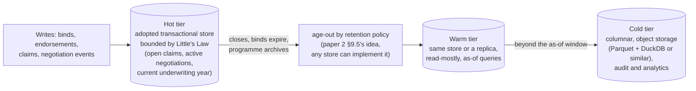
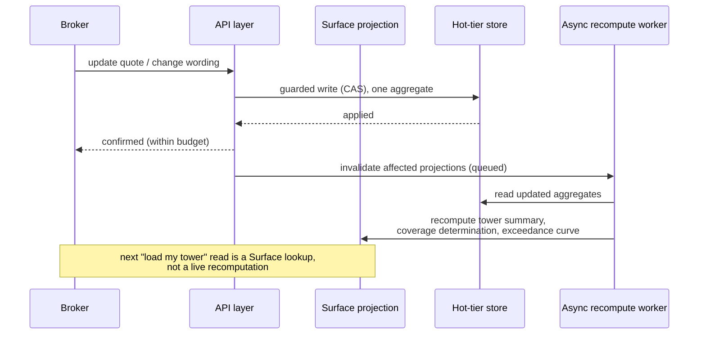
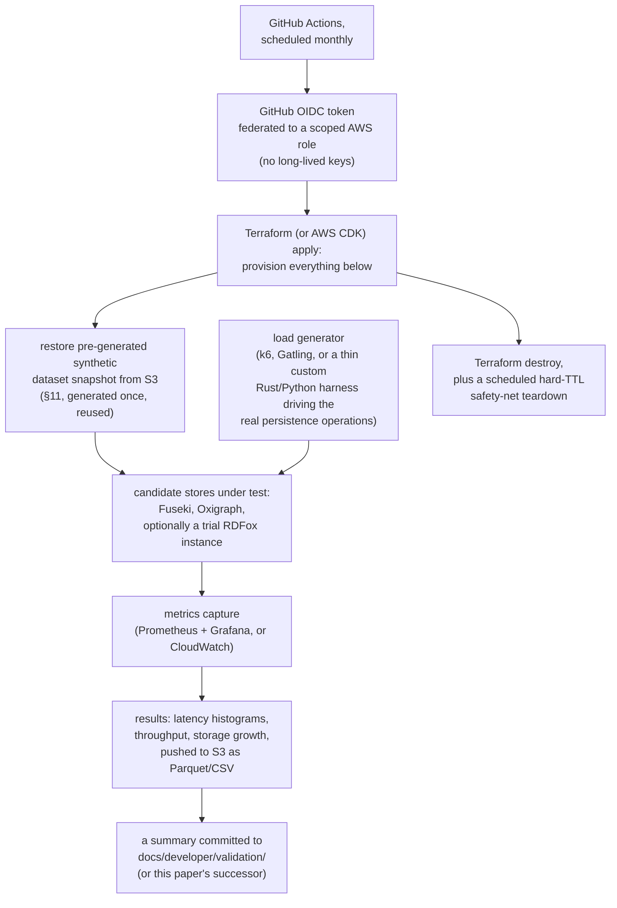
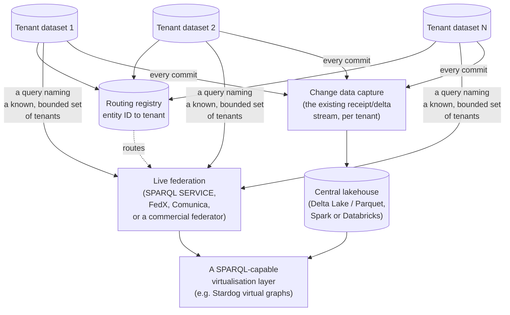
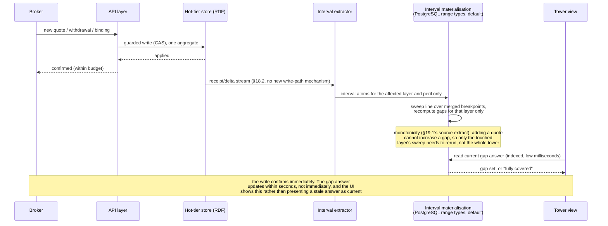

# Workload modelling and robustness testing strategy

**Technology exploration, 2026-10-03.** The fourth paper on the RDF and Datalog engine question.
Paper 3, [engine-build-versus-adopt.md](engine-build-versus-adopt.md), concluded that no engine
should be built before a measurement gate, **G0**, shows an existing store falls short of a named
adopter's requirements. This paper is G0's design: three candidate first deployments, a method for
turning each into storage, throughput, query and latency numbers, a synthetic data generation
strategy, an automated test plan mapped to the repository's test taxonomy, and an ephemeral cloud
test infrastructure sized for a small FOSS project's budget.

Grading as in the earlier papers. **Fact** means a cited source says so, with the source and access
date given. **Judgement** means a reasoned estimate that a measurement could overturn. Every number
in this paper is a planning input, not a capacity commitment. The paper follows
`.github/prompts/ponytail.md` throughout: estimate before building, reuse a benchmark generator
before writing one, and measure before optimising.

---

## Contents

1. [Verdict](#1-verdict)
2. [Method: from a use case to a number](#2-method-from-a-use-case-to-a-number)
3. [Use case 1: Open-CBAA and Lloyd's delegated authority](#3-use-case-1-open-cbaa-and-lloyds-delegated-authority)
4. [Use case 2: claims handling over computable contracts](#4-use-case-2-claims-handling-over-computable-contracts)
5. [Use case 3: MERIDIAN-style placement and programme](#5-use-case-3-meridian-style-placement-and-programme)
6. [Cross-cutting findings](#6-cross-cutting-findings)
7. [Storage estimate](#7-storage-estimate)
8. [Throughput and concurrency estimate](#8-throughput-and-concurrency-estimate)
9. [Query and index load](#9-query-and-index-load)
10. [The 1 to 2 second budget, and why it is a Surface problem](#10-the-1-to-2-second-budget-and-why-it-is-a-surface-problem)
11. [Synthetic data generation](#11-synthetic-data-generation)
12. [Automated test plan](#12-automated-test-plan)
13. [Test infrastructure for a small FOSS project](#13-test-infrastructure-for-a-small-foss-project)
14. [Relationship to G0 and the Store SPI](#14-relationship-to-g0-and-the-store-spi)
15. [Risks and open questions](#15-risks-and-open-questions)
16. [Decisions for the human](#16-decisions-for-the-human)
17. [Partitioning: one store per tenant, not one store for everyone](#17-partitioning-one-store-per-tenant-not-one-store-for-everyone)
18. [Distributed and federated queries across partitions](#18-distributed-and-federated-queries-across-partitions)
19. [Coverage completeness as interval geometry, not graph traversal](#19-coverage-completeness-as-interval-geometry-not-graph-traversal)
- [Appendix A: Lloyd's source data](#appendix-a-lloyds-source-data)
- [Appendix B: worked arithmetic](#appendix-b-worked-arithmetic)
- [Appendix C: references](#appendix-c-references)

---

## 1. Verdict

**Across all three use cases, sustained throughput is modest even at full market scale, and the
real risk is burst concentration and per-query complexity, not raw volume (judgement, grounded in
§3 to §5).** Estimated peak system-wide request rates stay under 100 requests per second for the
entire Lloyd's delegated authority market (§3), under 3 claims-handling requests per second during
a severe catastrophe burst (§4), and under 250 requests per second for a 10,000-broker placement
platform (§5). None of this threatens any engine surveyed in paper 3. What does threaten the 1 to
2 second interactive budget is a small number of specific, heavy query shapes: coverage
determination over a policy wording graph, and tower aggregation over a multi-layer programme.
Both are solved architecturally, not by a faster engine: **maintain them as Surface-projected views,
updated asynchronously, so the synchronous read is a cheap indexed lookup (§10).** A real
implementation of exactly this move, specifically for tower coverage completeness, already exists
(§19): capture coverage as interval data, materialise it outside the graph, and detect gaps with a
sweep line, which is faster than a graph traversal by construction, not only by Surface's general
argument.

**The data that must stay in a low-latency transactional store is a small fraction of the data a
mature deployment accumulates.** Open claims, active negotiations, and the current underwriting
year are all that need to be "hot". History belongs in warm or cold tiers using ordinary columnar
or object storage, not the transactional engine (§7). This reduces the hot-set sizes in the scale
table (§7.3) by roughly an order of magnitude against naive "store everything" estimates, and it
is itself a confirmation of paper 3's conclusion: most of a deployment's data volume does not need
whatever engine is chosen.

**What to build now:** one configurable synthetic data generator across all three use cases (not
three), an automated test plan mapped to the existing L0 to L8 taxonomy, and an ephemeral,
auto-torn-down AWS environment that runs a few hours monthly at an estimated cost of tens to a few
hundred dollars per run (§13). This is the deliverable of this paper, independent of which engine
strategy paper 3's triggers eventually select.

**A further finding, added after the first survey: partitioning the data by tenant, rather than
running one store for the whole platform, is already a LATTICE decision (ADR-A54, Proposed), and it
changes every scale question in this paper for the better.** A sensible tenant (one brokerage firm,
or a sub-region, §17) keeps a dataset small enough that any engine from paper 3's survey handles it
without strain, turns the market-scale storage and isolation question in §7 into an operational
fleet-management question rather than a single-store capacity question, and gives the cross-tenant
hostile test the repository's own test taxonomy already names (`cross-tenant probe`, L8) a concrete
architecture to probe. Market-wide reporting and cross-tenant analysis move to an asynchronous
central tier, fed by change data capture from the same receipt and delta records the persistence
profile already produces, rather than by querying every tenant live (§18).

---

## 2. Method: from a use case to a number

### 2.1 Four techniques, reused across all three use cases

| Technique | Answers | Used for |
|---|---|---|
| **Bottom-up entity counting.** Decompose one instance of the workload (one bound risk, one claim, one programme) into its RDF footprint: entities, properties, relationships, and revisions, each with an assumed triple count | storage per instance | §7 |
| **Little's Law** ($L = \lambda W$: the number in a system equals the arrival rate times the time each item spends in it) | the size of the "hot" working set from an arrival rate and a dwell time, and the concurrency needed to hit a latency target from a request rate | open claims (§4), active negotiations (§5), in-flight requests (§8) |
| **Peak-to-average ratios** | sustained throughput estimates do not predict the number that breaks a system. A diurnal, weekly, and calendar (renewal season, catastrophe) peak multiplier converts an annual total into a number worth testing against | §3, §4, §8 |
| **Hot, warm, cold tiering** | which of the numbers above belong in the engine under test at all | §6.2, §7.2 |

### 2.2 What this method deliberately does not do

It does not attempt a precise forecast. Every input (average premium per risk, claims frequency,
locations per client, carriers per layer) is a plausible range from industry knowledge, not a
measurement of a real book of business. The purpose is to bound the test design: to know whether
the system under test must sustain 10 requests per second or 10,000, whether a programme is
10,000 triples or 10,000,000, and whether the hard problem is throughput, latency, or storage
growth. Appendix B gives the arithmetic so every figure can be recomputed when a real input
replaces a judgement.

---

## 3. Use case 1: Open-CBAA and Lloyd's delegated authority

### 3.1 The shape of the workload

A coverholder binds a risk under a binding authority. Before binding, the coverholder's system (or
a digital platform provider) checks that the authority to bind exists, that the risk's attributes
fall within the binder's appetite, and after binding, that an endorsement to an already-bound risk
is itself within authority. Lloyd's captures the resulting contract data in an RDF graph, per the
scenario in the user's request. Open-CBAA supplies the LMA binding authority ontology. LATTICE does
not compete with contract-builder vendors for data capture, only for what happens to the data once
submitted.

| Operation | Shape | Query/write complexity |
|---|---|---|
| Authority check | does a binder exist, covering this class, territory and limit, for this coverholder, today | point lookup, low |
| Appetite/intent alignment check | do the risk's attributes satisfy the binder's declared appetite constraints | small join over a bounded constraint set, low to moderate |
| Bind | create the risk's contract instance, a guarded write under the binder's capacity aggregate | one CAS-guarded write, low |
| Endorsement | amend a bound risk, checked again against current authority and appetite | read current revision, re-check, guarded write, low |

### 3.2 Market-scale sizing (fact, with judgement for derived figures)

**Fact (Lloyd's, `lloyds.com/conducting-business/delegated-authorities`, accessed 2026-10-03):**
delegated authority premium is $26.2bn a year, about 45% of the Lloyd's market's premium income,
written across 250+ territories through 2,800+ coverholder branches and 400+ service companies.

**Fact (Lloyd's, `lloyds.com/about-lloyds/what-is-lloyds`, accessed 2026-10-03):** more than 50
managing agents, more than 400 registered Lloyd's brokers, and a global network of more than 3,000
local coverholders operate in the market.

**Derived (judgement):** total Lloyd's gross written premium ≈ $26.2bn / 0.45 ≈ **$58bn/year**.

| Average premium per bound risk (judgement, the range reflects consumer/affinity schemes at the low end and commercial/specialty binders at the high end) | Implied risks bound per year |
|---|---|
| $2,000 (scheme/affinity business: travel, warranty, small commercial) | ≈ 13.1M |
| $10,000 (a blended market-wide estimate, used as the central case) | ≈ 2.6M |
| $50,000 (commercial and specialty binders) | ≈ 0.52M |

**Total transaction volume (judgement).** Each bind generates roughly 2 endorsements over its life
(renewals, mid-term adjustments) and roughly 5 pre-bind checks (appetite and authority checks for
quotes that do not all convert), so total API operations per bound risk ≈ 8. At the central case of
2.6M binds/year, that is **≈ 21M operations/year** system-wide across the whole Lloyd's DA market.

**Throughput (judgement, method in Appendix B.1).** Spreading operations across roughly 12
effective business hours a day, 365 days a year (global coverholders across 250 territories smooth
the day somewhat, weighted toward London, European and US business hours), gives an average of
about 1.3 requests/second. Applying a peak-to-average ratio of 8 (renewal season concentration
around 1 January, and month-end bordereaux batch submission) gives a **peak of about 10
requests/second for the entire Lloyd's delegated authority market**. The high-volume scheme-heavy
case (13.1M binds/year) scales this to about 53 requests/second at peak. Both are modest for any
store surveyed in paper 3.

### 3.3 What this means for testing

The number worth testing is not "can it sustain 50 requests per second" (trivial for any candidate
store), but:

- **Concentration risk.** Can the system absorb an 8× peak-to-average swing around 1 January
  without queueing past the interactive budget, and recover cleanly afterward.
- **A single hot binder.** A popular scheme binder (an affinity travel product, for example) can
  receive a disproportionate share of binds in a short window (a marketing campaign, a holiday
  period). This is a concurrency-on-one-aggregate problem (many binds against one binder's capacity
  cap), not an aggregate-throughput problem, and is the right shape for an adversarial test (§12,
  L8-01).
- **Correctness under conflict**, not raw speed: two coverholders racing to bind against the last
  unit of a binder's capacity must not both succeed.

---

## 4. Use case 2: claims handling over computable contracts

### 4.1 The shape of the workload

A policy, modelled in a domain ontology (`applied/insurance`, or a closed-source model such as
MERIDIAN), is a computable contract in an RDF store. A claim arrives (first notice of loss, FNOL)
and the system computes the extent to which the contract, in its current state, covers it. This is
Behaviour and Eligibility doing real work: a transition check against the contract's state machine,
and a three-valued (Asserted, Denied, Undetermined) eligibility evaluation over clauses, exclusions,
conditions and sublimits.

### 4.2 Sizing from the Use Case 1 book

**Baseline (judgement).** Using Use Case 1's central case of 2.6M bound risks/year as the exposed
book, and a claims frequency of 5% to 30% depending on class (property and liability commercial
business toward the low end, high-volume consumer-like schemes such as travel toward the high end),
a blended 10% gives **≈ 260,000 attritional claims/year**.

**Open claims at steady state (Little's Law, method in Appendix B.2).** With an arrival rate λ ≈
260,000/365 ≈ 712 claims/day and a blended average open duration W ≈ 90 days (property claims close
in weeks, liability claims can stay open for years, 90 days is a blended planning figure), the hot
set of open claims is L = λW ≈ **64,000 claims**, market-wide, at any moment. This is the number
that belongs in the transactional store. Closed claims move to a warm or cold tier (§7.2).

**A catastrophe burst (judgement, illustrative, method in Appendix B.3).** A single event hitting a
geographically concentrated slice of the book, say 5% of the 2.6M bound risks, generates **≈
130,000 claims** in a compressed window. If these file over 10 days with a front-loaded arrival
curve (peak day ≈ 25% of the total) and an intraday peak multiplier of 5 for business-hours
reporting, the peak intraday rate is **≈ 2 to 3 FNOL submissions per second**, each immediately
triggering a coverage-determination query, the single heaviest query shape in any of the three use
cases. The real risk here is query cost under load, not arrival rate.

### 4.3 What this means for testing

- **The hot set is bounded and small (tens of thousands of claims), even at full market scale**,
  because claims close. Storage for this use case is dominated by closed-claim history, which
  belongs in a cold tier (§7.2), not by the live transactional set.
- **"Coverage determination" is two different problems, not one (refined in §19).** The interval,
  temporal and limit checks within it (is this loss date within the policy period, is this location
  within the covered territory, does this amount exceed a sublimit) are interval-geometry problems,
  not graph traversal, and should be materialised and swept the same way §19 describes for tower
  completeness. What remains genuinely graph- and rule-shaped is the boolean clause and exclusion
  logic, whose cost scales with the depth and branching of the contract's terms, not with claim
  volume, and which stays a candidate for live rule evaluation only until measured (§19.2). §9 and
  §12 (L7-05) make this the headline non-functional test either way.
- **The catastrophe burst is the throughput test worth running.** It is modest in raw rate (a few
  requests per second) but concentrated, and it is the only scenario across all three use cases
  where a real, publicly documented event (a major windstorm, for example) can generate a claims
  surge an order of magnitude above baseline within days.

---

## 5. Use case 3: MERIDIAN-style placement and programme

### 5.1 The shape of the workload

A client's exposure is built up incrementally: an initial request for quote (RFQ) goes to several
carriers, each gives one or more indications sized against it, the client supplies more detail, and
indications are revised. Several such negotiation threads, one per layer of a tower, are linked into
a programme. Contracts exist in different epistemic states (proposed, negotiating, bound)
simultaneously, cross-referenced to each other, to the client's exposure-asset data, and, at a
higher layer, to catastrophe model projections that AI agents may use to propose scenario events
against the programme. This is the full LATTICE stack: domain ontologies for cat model, client
exposure, contract, tower and negotiation thread, Surface projections, compiled persistence
profiles, and the infrastructure nodes the guide describes.

**This modelling matches real industry practice, not only this paper's own construction.** A
MERIDIAN documentation extract supplied alongside this paper (`.local/sketches/Theoretical
Framing.txt`) models negotiation as exactly this shape: a persistent, versioned `NegotiationThread`
per scope (layer, block or programme), carrying atomic `NegotiationMove` events (submission sent,
quote received, counter-offer, subjectivity satisfied, acceptance, lapse) and a controlled
`NegotiationState` vocabulary, reduced from the event sequence the way an event-sourced system
derives current state from an append-only log. §5.2's "20 events/layer" estimate is this paper's own
guess at the same thing MERIDIAN calls a thread's moves, which is a reassuring convergence rather
than a coincidence: both arrive at a persistent, versioned, event-bearing object because the
underlying negotiation process genuinely has that shape. The same extract is the source for §19's
coverage-completeness treatment.

### 5.2 A worked programme, bottom-up

A "medium" programme, picked as a central case between a single-layer primary-only placement and a
large, multi-territory, multi-layer tower.

| Component | Basis (judgement) | Triples |
|---|---|---|
| Client exposure-asset schedule | 500 locations × 40 triples/location, plus a 200-triple client entity | 20,200 |
| Tower structure and negotiation | 8 layers, 15 carriers approached per layer, 2.5 indication versions per carrier on average (initial plus 1 to 2 revisions) at 80 triples/version, plus 50 triples of layer metadata | 24,400 |
| Bound terms per layer | a full wording, conditions and Behaviour state-machine instance, 500 triples × 8 layers | 4,000 |
| Negotiation thread events | 20 events/layer (RFQ sent, each indication, each query, subjectivities raised and cleared, bind order) × 15 triples/event × 8 layers | 2,400 |
| Cat model scenario projections | 250 selected representative scenario events × 8 layers × 10 triples/event-layer result, plus a 500-triple exceedance-curve summary | 20,500 |
| **Payload total** | | **≈ 71,500** |

**A deliberate exclusion.** The cat model's own stochastic event catalogue (tens of thousands to
hundreds of thousands of events per peril region, as used by specialist cat model software such as
RMS or Verisk/AIR *(verify)*) is not replicated into the RDF store. Only a selected, compiled set of
representative scenarios and their results against this programme are stored. Treating the full
catalogue as domain data would multiply every number in this section by two to three orders of
magnitude for no benefit: the catalogue is reference data the cat model owns, not a fact about this
programme. This is itself a ponytail rung 1 judgement (does this need to be stored at all), applied
to data rather than to code.

**Infrastructure overhead (judgement).** The negotiation revisions above are domain payload, already
counted. Layered beneath them, a `PatchLog` persistence realisation (paper 2 §9.6) keeps a meta
version row, a receipt, and a delta per write. Using paper 2's write-path ratio as a storage-ratio
proxy gives roughly 3× the payload size once infrastructure is included: **≈ 210,000 triples stored
for a medium programme.** Small programmes (50 locations, 3 layers, 50 cat scenarios) come to
roughly 45,000 stored triples. Large ones (5,000 locations, 20 layers, 1,000 cat scenarios) come to
roughly 900,000.

### 5.3 From one programme to a broker's book, and to 100, 1,000, 10,000 brokers

**Per-broker portfolio (judgement).** A broker holds roughly 25 active client relationships. At any
moment, one programme per client is "hot" (actively under negotiation or recently bound), at the
medium size above: 25 × 210,000 ≈ **5.25M triples, hot, per broker**. Four prior renewal years are
retained per client for reference and benchmarking (not actively negotiated, so a smaller
infrastructure overhead of about 1.5×, not 3×, applies): 100 historical programme-instances × a
payload of ≈70,000 × 1.5 ≈ **10.5M triples, historical, per broker**. Total ≈ **16M triples per
broker**, of which a third is hot.

| Broker-users | Hot triples | Historical triples | Total triples | Hot, bytes* | Total, bytes* |
|---|---|---|---|---|---|
| 100 | 525M | 1.05B | 1.6B | ≈ 105 GB | ≈ 320 GB |
| 1,000 | 5.25B | 10.5B | 16B | ≈ 1.05 TB | ≈ 3.2 TB |
| 10,000 | 52.5B | 105B | 160B | ≈ 10.5 TB | ≈ 32 TB |

*At an assumed ≈ 200 bytes/triple for a conventional indexed RDF store (dictionary, SPO/POS/OSP
indexes), judgement pending G0's own measurement on the actual candidate stores, not paper 1's
hypothetical custom-engine figure of ≈ 70 to 80 bytes/triple (§7.1 explains why the two differ).

**Reading the table (judgement).** At 100 and 1,000 brokers, the hot set fits comfortably within a
single well-specified server, and even the total (hot plus historical, if nothing were tiered) is
manageable. At 10,000 brokers, the hot set alone (≈ 10.5 TB) reaches the point where sharding by
broking firm or business unit becomes operationally sensible, and the historical tier (≈ 30 TB)
should already have moved to cold, columnar storage well before that scale (§7.2).

### 5.4 Concurrency and throughput

**Little's Law again, this time for active sessions (judgement, method in Appendix B.4).** At 15% of
registered brokers concurrently active during business hours, each issuing roughly one request
every 10 seconds of active use:

| Broker-users | Concurrently active | System request rate | In-flight requests for a 1.5 s p99 |
|---|---|---|---|
| 100 | 15 | 1.5 req/s | ≈ 2 |
| 1,000 | 150 | 15 req/s | ≈ 23 |
| 10,000 | 1,500 | 150 req/s | ≈ 225 |

Even at 10,000 brokers, 150 requests/second and 225 in-flight requests are well within a single
modest server's capacity. **The constraint is not concurrency. It is whether each of those requests,
specifically "load my tower" and "update this quote" or "change this wording", completes inside the
1 to 2 second interactive budget at realistic data depth (§10).**

---

## 6. Cross-cutting findings

### 6.1 Throughput is not the risk, in any of the three use cases

| Use case | Peak system-wide rate (judgement) |
|---|---|
| Delegated authority, full Lloyd's market | ≈ 10 to 53 req/s |
| Claims, catastrophe burst | ≈ 2 to 3 req/s, concentrated |
| Placement, 10,000 brokers | ≈ 150 req/s |

All three are achievable on a single modern server by any store in paper 3's landscape survey. This
reinforces paper 3's verdict from a different angle: not only is there no evidence an engine of our
own would out-perform an adopted one, there is no evidence any of these workloads needs more
throughput than an adopted engine already provides. The risk that is real in every use case is
**burst concentration** (renewal season, a catastrophe event, a marketing-driven scheme spike) and
**query complexity** (coverage determination, tower aggregation), not sustained volume.

### 6.2 Most of the data does not need to be hot

| Use case | What must be hot | What tiers to warm or cold |
|---|---|---|
| Delegated authority | the current underwriting year's bound risks, and in-flight checks | prior years' bordereaux history |
| Claims | open claims (≈ 64,000 market-wide, §4.2) | closed claims |
| Placement | active negotiations and the current renewal cycle (≈ a third of a broker's book, §5.3) | prior renewal years |

This is a repeated structural fact across unrelated domains, worth treating as a design principle:
**size the transactional engine for the hot set given by Little's Law, and tier everything else.**
Paper 2's physical structure S11 (history segment, compacted, columnar) names the right shape for
the cold tier even though paper 2 itself is shelved. Nothing about tiering requires the custom
engine it was written for. An adopted store plus an ordinary columnar export (Parquet, queried with
DuckDB or similar) covers it.

### 6.3 The hard queries are few, and known in advance

Coverage determination (§4) and tower aggregation (§5) are the two query shapes across all three use
cases that are expensive by nature (multi-hop, rule-evaluating, multi-aggregate) rather than by
accident. Because the query set is known in advance, the same argument paper 1 made about compiled
query evaluation applies to an adopted store: these shapes should be identified, benchmarked
specifically, and, in the placement case, answered by a maintained projection rather than recomputed
live on every read (§10).

### 6.4 Partitioning removes most of the remaining scale question

Sections 7 and 8 size one platform-wide store. §17 shows that splitting the data by tenant (one
brokerage firm, or a sub-region) turns the largest figures in this paper (10.5 TB hot, 32 TB total
at 10,000 brokers, §7.3) into a fleet of datasets each a few gigabytes, individually trivial for any
engine surveyed in paper 3. What stays genuinely hard is not sizing any one tenant's data, but
deciding how market-wide questions get answered without querying every tenant live (§18).

---

## 7. Storage estimate

### 7.1 Bytes per triple, and why the figure differs from paper 1

Paper 1 §4.3 derived ≈ 70 to 80 bytes per triple for a custom, in-memory, MVCC-tagged quad table
built for the purpose. A conventional adopted store (Fuseki/TDB2, Oxigraph, a commercial engine)
carries more: a term dictionary, several B-tree or hash indexes (SPO, POS, OSP and variants), and
page or block overhead. **Judgement, to be replaced by G0's own measurement:** budget ≈ 150 to 250
bytes/triple for an adopted store, used as 200 in §5.3's table. This figure is itself one of the
first things G0 should measure directly, since every other storage figure in this paper scales
linearly with it.

### 7.2 The tiering architecture

### 7.3 Combined storage table

All figures are the hot-tier size unless marked total. Delegated authority and claims are market-wide
(all of Lloyd's); placement is per the broker-user count stated.

| Use case | Hot-tier triples | Hot-tier bytes (≈ 200 B/triple) |
|---|---|---|
| Delegated authority, current year | ≈ 2.6M bound risks × ≈ 150 triples/risk (judgement: contract, endorsements, checks) ≈ 390M | ≈ 78 GB |
| Claims, open at steady state | ≈ 64,000 claims × ≈ 300 triples/claim (judgement: FNOL, adjustor notes, reserve changes, coverage determination trace) ≈ 19M | ≈ 4 GB |
| Placement, 100 brokers | 525M | ≈ 105 GB |
| Placement, 1,000 brokers | 5.25B | ≈ 1.05 TB |
| Placement, 10,000 brokers | 52.5B | ≈ 10.5 TB |

**Reading this table against paper 3's recommendation (judgement).** Every hot-tier figure except
the largest placement case fits one well-specified server by a wide margin. This is consistent with
"adopt, gated by a measurement" remaining the right default: none of these numbers argue for a
custom engine on storage grounds.

This table sizes one platform-wide store. §17 recomputes it per tenant, where even the largest
placement case shrinks to a fleet of datasets each well under the smallest figure in this table.

---

## 8. Throughput and concurrency estimate

The per-use-case figures are given in §3.2, §4.2 and §5.4. Summarised:

| Use case | Average | Peak | Peak driver |
|---|---|---|---|
| Delegated authority, central case | ≈ 1.3 req/s | ≈ 10 req/s | renewal season, month-end bordereaux |
| Delegated authority, high-volume scheme case | ≈ 6.6 req/s | ≈ 53 req/s | as above |
| Claims, attritional | negligible | negligible | — |
| Claims, catastrophe burst | — | ≈ 2 to 3 req/s, concentrated | a single geographically concentrated event |
| Placement, 10,000 brokers | ≈ 150 req/s | similar, business-hours bounded | business-hours concentration, not a calendar event |

**The combined system peak (judgement), if one platform served all three use cases for the whole
Lloyd's market at the largest placement scale, stays under 250 requests/second.** This is the number
to design a load test around, not a number in the thousands. The test design in §12 spends its
effort on concentration and query complexity instead of raw throughput, because that is where the
estimates say the risk is.

**Partitioning by tenant (§17) removes even this modest concurrency question for the hot path.**
Each tenant's dataset serves only that tenant's own request rate, at most a few requests per second
even for a busy brokerage firm (§17.3), on a physically separate dataset, and under the dedicated
tier, a physically separate process, from every other tenant. The figures above only matter for
whatever serves cross-tenant and market-wide queries (§18), not for the per-tenant hot path.

---

## 9. Query and index load

### 9.1 The access-pattern method survives even though paper 2 is shelved

Paper 2 §8.3 proposed extracting every access pattern from the compiled rule set and prepared
queries and computing a minimum covering set of indexes, citing Soufflé's reduction to a minimum
chain cover. That method does not depend on owning the storage engine. It is exactly the right way
to configure indexes, materialised views, or a graph-store adapter's capability declarations on any
adopted store, under ADR-A75's Extended tier. **Rehabilitated for this paper: run the access-pattern
extraction over the three use cases' real query shapes, and use its output to configure whichever
store G0 selects**, rather than discarding the idea along with the custom engine it was designed for.

### 9.2 The query shapes, by use case

| Shape | Use case | Access pattern | Complexity |
|---|---|---|---|
| Authority check | DA | bound lookup: binder, class, territory, date | low, point lookup |
| Appetite check | DA | small join over a bounded constraint set | low to moderate |
| Endorsement check | DA | read current revision, re-validate | low, single aggregate |
| Coverage determination (clause and exclusion logic) | Claims | rule evaluation over the policy wording graph, stratified negation, Undetermined propagation | **high, if left live. Measure via L7-05 before assuming it must move (§19.2)** |
| Coverage completeness (interval, temporal, limit checks and tower gap analysis) | Claims, Placement | interval union, difference and containment over attachment, time and limit spans | **low once materialised, high if attempted as a live graph traversal (§19)** |
| Tower load | Placement | read across every layer's current state, exposure summary, cat model projection | **high, multi-aggregate** |
| Quote update, wording change | Placement | one guarded write, one aggregate | low |

Two shapes dominate the index design problem and the latency risk: coverage determination and tower
load. Both recur across uses cases precisely because both aggregate across a graph the compiled
rule set already knows the shape of, which is why §10 and §19 answer them architecturally rather
than by indexing harder.

A further shape appears once tenants are partitioned (§17): a **federated or routed read**, which
spans more than one tenant's dataset. §18 treats it separately, because its cost is dominated by how
many tenants it touches, not by the graph pattern itself.

---

## 10. The 1 to 2 second budget, and why it is a Surface problem

**The requirement, restated.** A synchronous page load, including loading a tower or applying an
update to a quote or a wording, must complete in 1 to 2 seconds. Anything that depends on that
result (re-running a cat model exceedance curve, recomputing an aggregated exposure) may run
asynchronously.

**The architectural answer (judgement, and the main recommendation of this section): do not compute
the tower view live.** LATTICE's Surface layer exists precisely to hold a flattened, promoted
projection of properties that are expensive to assemble from first principles. Maintain the tower
summary, and the coverage-determination result for a contract's current state, as Surface
projections, recomputed asynchronously whenever an input changes (a new indication, an endorsement,
a changed exposure). The synchronous read path becomes a single indexed lookup against the
projection, not a live multi-aggregate join or a rule evaluation. This is exactly what the user's
own framing already implies: calculations that run off an update can be asynchronous, so the
projection recomputation is that asynchronous work, and the interactive read is cheap by
construction.

**What still needs testing.** Projection staleness: how long after a write does the projection catch
up, and is that window ever visible to the user in a way that matters (a broker seeing last-hour's
tower summary a moment after they themselves just updated it is a specific, testable edge case, and
is the kind of read-after-write expectation the persistence guide's `globalReadStrategy` dimension
already names). This becomes test L7-03 (§12). §19 gives this a second, concrete, real-world form:
the projection is not always another RDF graph, and the recompute is not always a SPARQL query.

---

## 11. Synthetic data generation

### 11.1 One generator, not three

Ponytail rung 2 and rung 5 apply directly: do not write three bespoke generators for three use
cases. Build one ontology-aware, SHACL-shape-driven generator, configured per scenario by a scale
descriptor (broker count, locations per client, carriers per layer, claims frequency, and so on,
taken directly from the tables in §3 to §5), reusing the ontology's own shapes to keep generated
data valid by construction rather than validating it after the fact.

### 11.2 Prior art to adapt rather than reinvent

| Generator | What it supplies | Relevance *(verify exact citation details)* |
|---|---|---|
| WatDiv (Aluç, Hartig, Özsu, Daudjee) | diversified, parametrised RDF generation with query templates at varying selectivity, built specifically for stress testing rather than static benchmarking | the closest match in spirit. Adapt its approach to varied, parametrised generation and its query-template structure rather than its fixed schema |
| BSBM (Bizer, Schultz) | an e-commerce-shaped benchmark with configurable scale factors | reference for scale-factor conventions |
| LUBM (Guo, Pan, Heflin) | a university-domain OWL benchmark | reference for ontology-driven generation at scale |
| SP2Bench (Schmidt et al.) | a DBLP-shaped SPARQL benchmark with realistic skew | reference for heavy-tailed distribution choices |

None of these model insurance domain semantics, LATTICE's persistence operation API, or the
guarded-write and CAS-conflict behaviour this project needs to exercise, so a domain and
operation-replay layer is still built. What is reused is the statistical and parametrisation
machinery, not the insurance content.

### 11.3 Design principles

| Principle | Reason |
|---|---|
| **Generate through the real persistence operations** (create, CAS replace, tombstone, claim, retire), not by bulk-loading final-state triples | exercises the write path (conflict handling, idempotency retries, receipt generation) that a robustness test exists to probe, not only the read path over static data |
| **Heavy-tailed distributions for size** (log-normal for locations per client and premium size, a Pareto tail for catastrophe loss severity), Poisson or exponential for arrival processes, negative binomial for claim counts | matches the shape of a real insurance portfolio, where a small number of large accounts and a small number of severe events dominate totals, which is exactly the shape that breaks naive uniform-distribution load tests |
| **Seeded, deterministic generation** | a generated dataset is a fixture: reproducible, diffable, usable as a regression corpus (L2 property testing) and as the oracle comparison corpus from paper 2's differential-testing idea, which survives independently of the custom engine |
| **An adversarial corpus alongside the representative one** | concurrent-writer conflict storms on one hot aggregate (§3.3, §12 L8-01), deep revision chains on one aggregate (tests tail latency at depth, not just at average depth), and boundary-violating or dangling-reference data (tests rejection, not just acceptance) |

### 11.4 Where it lives

A LATTICE tool, not a one-off script, parametrised by a scenario descriptor (YAML) matching the
scale tables in this paper, living under `tools/` alongside the existing persistence and ontology
tooling, so it is maintained to the same standard as the rest of the repository rather than
decaying as a benchmark side-project.

---

## 12. Automated test plan

Mapped to the test taxonomy already defined in `.github/copilot-instructions.md` (L0 to L8).

| ID | Level | Scenario | Pass criterion |
|---|---|---|---|
| L4-01 | L4 | each candidate store (Fuseki, Oxigraph, a trial RDFox licence) exercised through the Store SPI (or direct SPARQL, pending ADR-A75, §14) against the small-scale synthetic corpus | every persistence operation produces the outcome the oracle (the existing SPARQL realisation) predicts |
| L7-01 | L7 | steady-state throughput at each use case's central-case average rate (§8), sustained for 30 minutes | p50 and p99 within the 1 to 2 s budget throughout |
| L7-02 | L7 | peak burst load: the DA renewal-season multiplier (§3.2) and the claims catastrophe burst (§4.2), run back to back | the system stays within budget or degrades by queueing, not by error, and returns to baseline latency within an agreed recovery window after the burst ends |
| L7-03 | L7 | tower load and quote/wording update at the "large" programme size (§5.2), via the Surface projection path (§10) | the synchronous read and write both complete within the 1 to 2 s budget, and projection staleness after a write is measured and reported, even if not yet bounded by a formal SLO |
| L7-04 | L7 | storage growth over N simulated months of history, with tiering (§7.2) applied | the hot tier's measured size tracks §7.3's model within an agreed tolerance, and ageing out of the hot tier keeps it bounded as history accumulates |
| L7-05 | L7 | coverage-determination latency at realistic contract-graph depth and breadth (§4.3), including a worst-case Undetermined-cascade rule set | p99 within an agreed budget, measured separately from simple point-lookup operations, since this is the heaviest shape in the whole plan |
| L8-01 | L8 | a concurrent-writer conflict storm: many simulated coverholders racing to bind against the last unit of one binder's capacity | exactly one winner, no lost updates, bounded retry latency for the losers, as paper 1's and paper 2's correctness arguments require regardless of which store is chosen |
| L8-02 | L8 | the adversarial corpus (§11.3): SHACL-violating and boundary-crossing facts | every violation is rejected with a clear cause, no crash, no silent corruption |
| L7-06 | L7 | §18: a live federated query spanning a bounded fan-out of tenant datasets (10, 50, 200), at the placement "large" programme size | p99 within the 1 to 2 s budget up to the fan-out this paper recommends as a practical limit (§18.3), and a clear, measured latency cliff beyond it, not a silent timeout |
| L7-07 | L7 | §18: change-data-capture freshness, from a tenant-local commit to visibility in the central lakehouse | lag stays within an agreed market-reporting SLA (minutes, not seconds), consistent with this being asynchronous work (§10) |
| L8-03 | L8 | the repository's own `cross-tenant probe` taxonomy item, instantiated here: a query or write scoped to one tenant must not read or affect another tenant's dataset | no cross-tenant visibility or mutation, under both the shared-process and dedicated-store tiers of ADR-A54 (§17.1) |
| L8-04 | L8 | one tenant's dataset made deliberately slow or unavailable during a federated query spanning it (§18) | the federation layer degrades by a partial result or a clear, timed-out error naming the affected tenant, never a hang or a silent wrong answer |
| L7-08 | L7 | §19: sweep-line gap recompute at realistic programme scale (§5.2), after a single quote change | recompute of the affected layer completes in low milliseconds, and the end-to-end freshness (commit to updated gap answer) stays within a few seconds, tighter than L7-07's general lakehouse SLA |
| L8-05 | L8 | §19: the gap-analysis materialisation is deliberately delayed while a broker views a tower whose coverage just changed | the UI surfaces a staleness or "still updating" indicator rather than presenting the stale gap answer as current truth |

**Reconciling the taxonomy's stated cadence with a small project's budget (judgement).** The
existing taxonomy puts L7 at "CI weekly" and L8 at "CI nightly", which assumes infrastructure budget
this project does not have. The reconciliation: run L4 continuously in ordinary CI (cheap, small
scale, every change). Run a small-scale smoke subset of L7 and L8 (a tenth of the synthetic scale)
per release, on ordinary CI compute. Run the full-scale L7 and L8 suite against the scale tables in
this paper monthly, on the ephemeral cloud infrastructure in §13, which is the "once every month or
so, a few hours" cadence the user described.

---

## 13. Test infrastructure for a small FOSS project

### 13.1 Shape

### 13.2 Cost (judgement, order of magnitude, pending current pricing *(verify)*)

| Item | Sizing | Approximate cost per monthly run |
|---|---|---|
| Compute, 2 to 4 memory-optimised instances (one per candidate store, one for the load generator) | a few hours | tens of dollars |
| Storage, synthetic dataset snapshot and results | tens to low hundreds of GB, mostly reused snapshots | a few dollars/month, independent of run frequency |
| Data transfer | within one region, minimal | negligible |
| **Total per run** | | **roughly $20 to $150**, so **roughly $200 to $1,000/year** at a monthly cadence |

This is a small, predictable cost for a FOSS project, and well within reach without sponsorship,
though the project should still track it as a recurring line item rather than an ad hoc spend.

### 13.3 Safety and security

| Control | Why |
|---|---|
| GitHub OIDC federation to a scoped IAM role, no static AWS access keys in CI | removes a standing credential that could leak. A documented, standard pattern |
| Least-privilege IAM: the role may only create and destroy the specific tagged resources this workflow uses | limits blast radius if the workflow or its token is ever misused |
| A hard runtime cap and a scheduled safety-net teardown, independent of the main `terraform destroy` step | protects against a runaway bill if the main teardown step itself fails |
| A billing alarm at a low threshold | an early warning independent of the above |
| Everything tagged with the run ID and workflow name | makes any leaked resource traceable and cheap to find |
| Synthetic data only, never real policyholder, claimant or commercial data | removes any data-protection or confidentiality control from scope for this environment entirely |

---

## 14. Relationship to G0 and the Store SPI

This paper is the detailed design the human asked be put aside when paper 3 named G0 only in
outline ("putting aside that the SPI layer/API isn't written yet"). ADR-A75's three-tier Store SPI
is still Proposed and unimplemented, so G0's harness cannot yet target it. Two options, not decided
here:

| Option | Effect |
|---|---|
| Run G0 directly against each store's native SPARQL endpoint now, migrate the harness to the Store SPI once ADR-A75 lands | gets a measurement sooner, at the cost of reworking the harness later |
| Wait for a minimal ADR-A75 adapter (even Core-tier only) before running G0 | the harness is built once, against the real interface, but delays the first measurement |

**Judgement:** run directly against native SPARQL now. The harness's value is in the workload model
and the synthetic data (this paper's real content), not in which interface it calls through, and a
measurement sooner is worth a later rework of a thin calling layer.

---

## 15. Risks and open questions

| # | Risk or question | Why it matters |
|---|---|---|
| Q1 | Every volume figure in §3 to §5 is a judgement range, not a measurement of a real book of business | the test design (which shapes to stress) is more robust to this uncertainty than the absolute numbers are. Validate the ranges against a real coverholder's bordereaux or a real brokerage's book the moment a design partner exists |
| Q2 | The bytes-per-triple figure (§7.1) is assumed, not measured | the first thing G0 should measure directly, since it scales every storage number in this paper |
| Q3 | Projection staleness after a write (§10) has no stated bound yet | needs a decision once L7-03 produces a real number, not before |
| Q4 | A real cat model's event catalogue size and update frequency are unknown here | affects §5.2's "selected scenario" assumption, and is a question for whoever supplies the cat model integration |
| R1 | Synthetic data, however heavy-tailed, may still miss a real book's specific concentration (one binder, one territory, one peril) | keep the adversarial corpus (§11.3) deliberately more concentrated than the representative one, and revisit after Q1 is answered |
| R2 | A monthly cadence may miss a regression introduced and reverted within the month | the release-scale smoke subset (§12) is the mitigation, not the monthly full run |

---

## 16. Decisions for the human

| # | Decision | Options | Recommendation (judgement) |
|---|---|---|---|
| WM-D1 | Adopt this paper's workload model as G0's basis | (a) yes. (b) wait for a real design partner's figures first | (a), with Q1 tracked explicitly as an open input to revisit |
| WM-D2 | Build the synthetic data generator now, or after an engine strategy is chosen | (a) now, since it is independent of paper 3's eventual choice. (b) after | (a) |
| WM-D3 | Run G0 against native SPARQL now versus waiting for ADR-A75 | (a) now. (b) wait | (a), per §14 |
| WM-D4 | Formalise this paper as a real LATTICE sketch and plan | (a) yes, since it proposes a real test harness, a new tool, and a CI/cloud workflow, which the Agentic Development Contract's Design First rule governs. (b) keep it as exploration only | (a), once WM-D1 to WM-D3 are confirmed. This paper itself is exploration, not the ADR-grade design |
| WM-D5 | Monthly full-scale cadence versus a different frequency | (a) monthly, per the user's stated budget tolerance. (b) quarterly, cheaper but slower to catch regressions | (a), reassessed after the first few runs' actual cost and signal are known |
| WM-D6 | Tenant granularity for partitioning (§17) | (a) one tenant per broker. (b) one tenant per brokerage firm. (c) one tenant per sub-region or regulatory jurisdiction. (d) configurable, decided per deployment | (b) as the default, with (c) layered on top where data residency requires it, and (a) available for a firm that wants it |
| WM-D7 | Dataset-per-tenant versus store-per-tenant (ADR-A54's existing tiers) | (a) dataset-per-tenant, shared store process, as the default for every tenant. (b) store-per-tenant for large or regulated tenants only. (c) store-per-tenant for everyone | (a) as the default, (b) on request, matching ADR-A54 exactly |
| WM-D8 | How market-wide and cross-tenant questions get answered (§18) | (a) batch ETL into a lakehouse. (b) event-driven CDC into a lakehouse, using the existing receipt/delta stream. (c) live federation for a bounded, named set of tenants. (d) a combination | (d): CDC into a lakehouse for anything market-wide or aggregate, live federation only for a query naming a small, known set of tenants, routed through a registry (§18.3) |
| WM-D9 | Whether to evaluate a commercial federation or virtualisation layer (for example Stardog virtual graphs) over the lakehouse and the tenant stores | (a) evaluate once G0 and the partitioning design are validated. (b) not now | (a), and only once WM-D8's CDC pipeline already exists to point it at |
| WM-D10 | Materialisation technology for interval and gap analysis (§19) | (a) PostgreSQL range types with GiST indexes. (b) MongoDB. (c) something else | (a), because PostgreSQL is already a LATTICE platform dependency (the Architecture Review's G-06 already names a PostgreSQL and Fuseki pairing), so this reuses rather than adds a dependency. (b) remains credible if a document-per-tenant model is preferred for operational reasons not yet established |
| WM-D11 | How the materialisation stays in sync with the graph (§19) | (a) derive it asynchronously from the receipt/delta stream (CDC), one-way. (b) an application-level dual write to both stores | (a). (b) is the pattern the Architecture Review's G-06 already flags as an unresolved inconsistency risk, and this paper's CDC mechanism (§18.2) is a constructive answer to that finding, not a new problem |
| WM-D12 | Freshness SLA for the gap-analysis materialisation specifically | (a) a few seconds, tighter than the general lakehouse CDC figure (§18, minutes), because a broker consults it mid-negotiation. (b) the same SLA as §18's general CDC | (a), measured by L7-08 |

---

## 17. Partitioning: one store per tenant, not one store for everyone

### 17.1 This is not a new idea. It is an existing, unratified LATTICE decision

ADR-A54 (`docs/architecture/decisions/ADR-A54-dataset-topology.md`, status Proposed) already answers
most of the question the human raised. Restated here because it bears directly on every storage and
throughput figure in §7 and §8:

| Tier | Isolation | Cross-tenant query | Cost at scale | ADR-A54's verdict |
|---|---|---|---|---|
| One dataset, graph-per-tenant | weak, application-layer only | easy | cheap | rejected, violates "no client-side security" |
| **Dataset-per-tenant, shared store process** | strong at query scope | federation only | moderate | **default** |
| Store-per-tenant | strongest | federation | expensive | large or regulated tenants only |

ADR-A54 already rejects the weaker form of the human's suggestion (a named graph per tenant inside
one shared dataset), for the reason its own table states: a named graph is an application-layer
convention, not a store-enforced boundary, and the repository's test taxonomy already names the
attack this leaves open (`cross-tenant probe`, L8, §12 L8-03). The unit this section uses is
ADR-A54's **dataset**, not a bare named graph.

### 17.2 Choosing the tenant, per use case

| Use case | Natural tenant | Why | Shared reference data, outside any tenant |
|---|---|---|---|
| DA | the coverholder | bound risks rarely need a live join against another coverholder's book | binder and appetite definitions (many coverholders bind under the same binder), the Open-CBAA ontology itself |
| Claims | the carrier or MGA operating the computable contract | a claim's coverage determination reads one contract, never another tenant's | policy wording templates shared across many contracts, the domain ontology |
| Placement | the brokerage firm (judgement, recommended default over one tenant per broker) | co-broking and shared client relationships inside one firm are common, and would otherwise cross a tenant boundary constantly. Cross-firm co-broking is comparatively rare and can use an explicit cross-reference instead (§17.5) | cat model reference data, market reference data (syndicate and binder registries), the domain ontologies |

**A repeated shape worth naming once.** In every use case, some data belongs to exactly one tenant
(a bound risk, a claim, a tower) and some data is reference data many tenants read and no tenant
writes (an ontology, a binder definition, a rating table, a cat model catalogue summary). ADR-A54's
named-graph grammar already separates `tbox`/`shapes` graphs from `abox` graphs inside one tenant's
dataset. **Worth adding, not yet in the ADR (judgement):** where the ontology and shapes are
identical across every tenant, which is the common case, load them once into a shared graph every
tenant's queries can reach, rather than duplicating them into every tenant dataset. This is the same
"does this need to exist per tenant at all" question ponytail asks of code, asked of reference data.

### 17.3 Recomputed storage, per tenant

Using §5's per-programme figures and §7.1's bytes-per-triple assumption, method in Appendix B.5.

| Tenant granularity | Triples per tenant (judgement) | Bytes per tenant (≈ 200 B/triple) | Number of tenants at 10,000 brokers |
|---|---|---|---|
| One broker | ≈ 16M (§5.3) | ≈ 3.2 GB | 10,000 |
| One firm of ≈ 8 brokers | ≈ 128M | ≈ 25.6 GB | ≈ 1,250 |
| One sub-region of ≈ 100 firms | ≈ 12.8B | ≈ 2.56 TB | ≈ 13 |

**Reading this table (judgement).** At the recommended firm-level grain, every tenant's dataset is
tens of gigabytes, comfortably inside a small, cheap, single-node deployment of any store in paper
3's survey, including an embedded one. The platform-wide figures in §7.3 (10.5 TB hot at 10,000
brokers) describe the sum across every tenant, not the size any one component must hold at once.
Sub-regional grouping trades this benefit away as the grain coarsens, which is why firm-level or
finer is the recommendation, not sub-region alone (sub-region remains useful as an additional,
orthogonal grouping for data residency, §17.4, layered on top of firm-level tenancy rather than
replacing it).

### 17.4 Benefits

| Benefit | Mechanism |
|---|---|
| Performance isolation | one tenant's heavy negotiation or a runaway query cannot slow another tenant's reads, because they are different datasets, and under the store-per-tenant tier, different processes entirely |
| Security, defence in depth | a store-enforced dataset boundary, not an application-layer filter, closes the gap the Architecture Review's G-13 (no tenancy control plane) and G-16 (no store capability matrix) name, and gives the existing L8 `cross-tenant probe` taxonomy item a real boundary to test (§12 L8-03) |
| Blast radius | a corrupted or unavailable tenant dataset affects that tenant only, not the platform, addressing the shape of the Architecture Review's G-10 (a single shared instance being "untenable once runtime ingestion... is in scope") even where the shared-process tier is used, provided that tier itself is pooled and replicated rather than a single process |
| Migration and versioning granularity | a persistence profile change (paper 2 §12) can roll out tenant by tenant, canary-style, rather than as one platform-wide migration |
| Regulatory data residency | a sub-regional grouping (Lloyd's itself operates a separate European entity, contact address `lloydseurope.delegatedauthority@lloyds.com`, Appendix A) can pin a tenant's dataset to a jurisdiction, which a single shared store cannot do selectively |
| Elastic, incremental cost | provisioning a new tenant is provisioning one more small dataset, not growing one large store, and `docs/developer/plans/lattice-platform-agentic-development-v0.2.md` already anticipates a tenancy provisioning saga (P1.7.2) to automate this |

### 17.5 Costs

| Cost | Mitigation |
|---|---|
| Operational fleet size: many small datasets instead of one large one | ADR-A75's Store SPI makes every tenant's adapter fungible, so the same automation provisions, upgrades and monitors all of them identically. The tenancy provisioning saga (P1.7.2) is exactly this automation, already anticipated, not yet built |
| Cross-tenant references do not disappear, they concentrate at firm boundaries (co-broking across firms, a reinsurer's book spanning many cedants' brokers) | model the shared entity in one canonical tenant, the others hold a reference, consistent with ADR-A54's own dataset-boundary reasoning. §18 handles the query side |
| The shared-process tier is still one process serving many tenants | pool and replicate it like any other shared service. It is a smaller version of the Architecture Review's G-10 finding, not a new one |
| Reference data drifting between tenants if duplicated | load it once, shared, per §17.2, rather than copying it |

### 17.6 What this adds to G0

G0 (paper 3 §10.1, detailed in this paper) should benchmark the partitioned shape explicitly, not
only one large store: provision a representative fleet of tenant datasets at the firm-level grain
(§17.3), and measure provisioning time, per-tenant resource footprint, and whether the shared-process
tier's pooling holds up under the concurrent-tenant load §8 already estimates. This is additional
scope for G0, not a replacement for the single-store measurement, because both shapes remain live
options depending on WM-D7.

---

## 18. Distributed and federated queries across partitions

### 18.1 Four patterns for seeing across tenants

| Pattern | Latency | Freshness | Fits |
|---|---|---|---|
| **Direct, single-tenant** | within the 1 to 2 s budget | live | every hot-path operation in §3 to §5. The default, and the only pattern the interactive budget assumes |
| **Batch ETL** into a lakehouse | hours | as of the last batch | regulatory returns, periodic portfolio roll-ups, anything already run on a schedule |
| **Event-driven CDC** into a lakehouse | seconds to minutes | near-live | market oversight dashboards, cross-tenant accumulation monitoring, anything that tolerates the same asynchronous staleness §10 already accepts for Surface projections |
| **Live federation** across a bounded, named set of tenants | adds the slowest participant's latency plus coordination overhead | live | a query that must be fresh and names, or can be routed to, a small number of tenants (tens, not thousands) |

### 18.2 Change data capture is close to free here

The persistence profile's `PatchLog` or `SnapshotPerRevision` receipt models (the guide, paper 2 §9)
already produce a delta and a receipt for every write, as an audit mechanism. **That stream is
already shaped like a change feed.** Point a CDC consumer at it per tenant, and the central
lakehouse (Spark Structured Streaming, Databricks Auto Loader, or an equivalent) ingests it with no
new write-path mechanism, only a new reader. This is the same move §10 makes for Surface
projections, one level up: **the central lakehouse is a market-scale Surface projection**,
maintained asynchronously from the same commits that already exist, not a new synchronous
computation.

### 18.3 Live federation needs routing, not broadcast

A query that names a specific entity (a broker, a binder, a policy) should go straight to that
entity's tenant, never to every tenant. This needs a routing registry: a small, central index from
entity ID to owning tenant, cheap to maintain because it holds identifiers and pointers, not data.
**This rehabilitates, a second time, an idea paper 2 proposed and then set aside.** Paper 2 §5
treated the registry graph as an RDF artefact that collapses once a single store's engine can answer
"which graphs exist" directly. In a partitioned architecture there is no single store to ask, so the
registry is not an artefact to eliminate. It is the mechanism that makes federation a routed query
instead of a broadcast.

| Query shape | Routing | Pattern |
|---|---|---|
| Names one tenant's entity (a specific broker's tower, a specific coverholder's binder) | direct, via the registry | direct, single-tenant |
| Names a small, known set of tenants (a reinsurer's own cedants, a regulator's flagged list) | the registry resolves the set, federation fans out to exactly those tenants | live federation |
| Names no tenant, asks a market-wide question ("every tower exposed to peril X above $10M") | not resolvable to a bounded set | the central lakehouse (CDC or ETL), never a broadcast federation |

### 18.4 Where a commercial federation or virtualisation layer fits

**Judgement, and explicitly not a recommendation to adopt yet, per WM-D9.** A product such as
Stardog offers virtual graphs, mapping an external source (a relational database, a lakehouse table)
into the SPARQL query space without first ETL-ing it into Stardog's own store, in the same spirit as
Ontop (paper 3 §5.2). Used here, it could present one SPARQL endpoint over both the tenant stores
(for graph-shaped, multi-hop queries: coverage determination, tower aggregation routed to the right
tenant) and the central lakehouse (for large columnar aggregation: portfolio accumulation, cat model
severity curves), when a single logical query genuinely needs both. *(verify current Stardog virtual
graph capability, performance characteristics, and licensing against its own documentation before
relying on this.)* This is additional machinery on top of the CDC pipeline in §18.2, not a
replacement for it, and should wait until that pipeline exists and is measured (WM-D9).

### 18.5 Consistency

**No cross-tenant writes, by design.** Every write path in §3 to §5 is scoped to one tenant's
aggregate. A shared entity across tenants (co-broking across firms) lives in one canonical tenant
with the others holding a reference, so no operation needs a distributed transaction across tenant
boundaries. **The central lakehouse is eventually consistent, and that is accepted, not a defect**,
for the same reason §10 accepts asynchronous Surface projections: nothing market-wide is on the
synchronous path. **Live federation reads each tenant's current committed state independently**,
with no single consistent snapshot across tenants, which is acceptable because every federated query
this paper identifies (§18.3) is read-only reporting, never a decision that itself writes across
tenants.

---

## 19. Coverage completeness as interval geometry, not graph traversal

### 19.1 A real precedent, not a hypothesis

A MERIDIAN documentation extract supplied alongside this paper
(`.local/sketches/Theoretical Framing.txt`) describes how a practical implementation already handles
tower coverage completeness, the question "is this layer, across every peril and the whole policy
period, fully covered by the quotes selected so far, and if not, where exactly is the gap." **Fact
(per the attached extract): it is not answered by a live SPARQL-style graph traversal.** Coverage,
required cover and exclusions are each represented as interval sets over attachment and limit
(financial span), narrowed by peril scope and time, these interval sets are materialised outside the
graph (the extract names MongoDB or PostgreSQL), and gaps are found with a sweep-line scan over the
merged interval breakpoints: $G_p(L,\sigma) = R_p(L) \setminus \bigcup_{Q \in \sigma} C_p(Q)$, computed
in roughly $O(K \log K)$ for $K$ breakpoints, not by walking the graph that produced those intervals.

**Why this is the right tool, not an arbitrary one (judgement).** The operations coverage
completeness actually needs, interval union, interval difference, interval containment, range
overlap, have no native SPARQL primitive. Expressing them with `FILTER` over numeric literals forces
an unindexed, effectively exhaustive comparison across every candidate pair of intervals. A range
type (PostgreSQL's `int4range`/`numrange`, with GiST indexing of the overlap operator `&&`) or an
equivalent structure in another engine is built for exactly this, and a sweep line implemented in
ordinary application code turns the gap calculation into a sort plus a linear scan. This is the same
reasoning this paper already uses for Surface projections (§10), taken one step further: **not every
expensive computation should even stay inside RDF once it is moved off the live path.** Some belong
in a non-graph structure purpose-built for their actual operations.

### 19.2 A general heuristic: the 1,000-node migration trigger

**The rule, as given:** a computation that routinely needs to walk more than about 1,000 nodes or
edges of the graph to produce its answer is a candidate for migration to a specialised,
asynchronously maintained structure, whether that structure is a Surface-projected RDF view (§10)
or, where the computation's native operations do not fit SPARQL at all, a non-RDF materialisation
like §19.1's interval tables.

**Applying it to this paper's own query shapes (§9.2), by inspection before measurement:**

| Shape | Estimated nodes touched (judgement) | Crosses the threshold | Action |
|---|---|---|---|
| Authority check, appetite check, endorsement check | O(1) to O(10) | no | stays live, no migration needed |
| Tower load, coverage completeness (gap analysis) | tens of thousands per programme (§5.2's payload total, §9.2) | **yes, clearly** | migrate, per §19.1 and §19.4 |
| Coverage determination, clause and exclusion logic only | unknown, depends on the policy wording template's branching, likely hundreds rather than tens of thousands for one contract | **not obviously, measure first** | leave live, gate the decision on L7-05's actual measured latency, not on inspection |

**The rule is a measurement gate, not a precommitment (judgement).** Where inspection already shows
an order-of-magnitude excess, as with tower coverage, the architectural decision does not need to
wait for a benchmark to confirm the obvious. Where it is unclear, as with clause and exclusion
logic, the correct move is to measure (L7-05, §12) and apply the rule to the result, consistent with
this paper's and ponytail's general discipline of estimating first and migrating only once a real or
clearly inspected cost justifies the second structure's maintenance burden (§19.5).

### 19.3 Decomposing "coverage determination" by computation shape, not by use case

The same split applies in both use cases that use the phrase "coverage determination", because the
shape of the sub-computation, not the use case, decides whether it is interval-shaped or rule-shaped.

| Sub-question | Shape | Where it belongs |
|---|---|---|
| Is this loss date within the policy period | interval containment | materialised interval check (§19.1), trivial even unmaterialised |
| Is this loss location within the covered territory | interval or set containment | materialised interval or set check |
| Does this amount exceed a sublimit | numeric comparison against a stored limit | materialised, or even a single indexed point lookup |
| Is this layer, across every peril and the whole policy period, fully covered by the quotes bound or firm-quoted so far | interval union, difference, gap detection across many quotes | **materialised and swept, exactly as §19.1 describes**, this is the placement use case's tower-completeness question and MERIDIAN's own worked example |
| Does this specific loss fall under a clause's exclusion, given the exclusion's boolean structure | rule and clause-graph evaluation | stays graph- and rule-shaped, gated on measurement (§19.2) |

### 19.4 The architecture: extraction, materialisation, sweep, and the UI pattern

**Why PostgreSQL by default, not MongoDB (judgement, ponytail rung 2: reuse what is already a
dependency).** The Architecture Review's G-06 already names "dual-write inconsistency between
PostgreSQL and Fuseki" as an acknowledged, unresolved platform gap, meaning PostgreSQL is already a
LATTICE platform dependency standing alongside the RDF store, not a new one this paper would be
introducing. PostgreSQL's native range types and GiST indexing are a direct fit for §19.1's
operations. MongoDB remains credible if a document-per-tenant model (§17) is independently preferred
for operational reasons, but is not the default here.

**This resolves G-06 constructively rather than repeating its warning (judgement).** G-06's finding
reads as a caution against an application-level dual write, writing to both stores synchronously
from request-handling code, which is fragile exactly because the two writes can disagree. The
pattern here is not a dual write. PostgreSQL's content is derived, one-way and asynchronously, from
the RDF store's own receipt and delta stream (§18.2), the same mechanism already proposed for the
central lakehouse. RDF remains the sole source of truth. PostgreSQL holds a disposable, rebuildable
projection, not a second authority.

**Monotonicity keeps the recompute cost bounded (fact, per the attached extract, §19.1's source).**
Because adding a quote to a scenario cannot increase its gaps, a quote change only needs to
re-sweep the one layer and peril it touches, not the whole tower. For a programme with 8 to 20
layers (§5.2), this is roughly a 10 to 20 times reduction in recompute cost per update against
recomputing the whole tower's gap state from scratch.

### 19.5 Benefit and cost, explicitly

| | Detail |
|---|---|
| **Benefit: latency** | an indexed sweep over a few hundred breakpoints (Appendix B.6) in low milliseconds, against an estimated tens of thousands of nodes for a live graph traversal of the same programme (§5.2), roughly a 40 times reduction in what must be touched, using index-accelerated range operators the target store provides natively |
| **Benefit: bounded recompute** | monotonicity (§19.4) limits a single quote change to re-sweeping one layer, not the whole tower |
| **Cost: a second schema and store to maintain** | an extraction and translation layer from RDF triples to interval atoms, which must track ontology changes the same way Surface projections already must (`ontology/surface/docs/revision-lifecycle.md`'s existing invalidation machinery is the pattern to reuse, not reinvent, per ponytail rung 2) |
| **Cost: operational surface** | one more store technology to provision, patch, back up and monitor, folded into the same fleet-management cost this paper already carries for partitioning (§17.5) |
| **Cost: staleness is unusually visible here** | a broker trusting a "fully placed" answer mid-negotiation is a more business-visible consumer of a stale projection than the general market-reporting case (§18), which is why §19.4 targets a few seconds of freshness (L7-08), tighter than §18's general lakehouse SLA (minutes), and why the UI must show a staleness indicator rather than presenting a stale gap answer as current truth (L8-05) |
| **Resolved, per the user's framing** | the synchronisation runs out of band and must never block the UI. §19.4's sequence diagram confirms the write within the 1 to 2 s budget exactly as §10 already does, and lets the gap answer catch up seconds later, exactly as asked |

---

## Appendix A: Lloyd's source data

| Figure | Value | Source |
|---|---|---|
| Delegated authority annual premium | $26.2bn | `lloyds.com/conducting-business/delegated-authorities`, accessed 2026-10-03 |
| Delegated authority share of market premium | ≈ 45% | same source |
| Territories | 250+ | same source |
| Coverholder global branches | 2,800+ | same source |
| Service companies | 400+ | same source |
| Managing agents | 50+ | `lloyds.com/about-lloyds/what-is-lloyds`, accessed 2026-10-03 |
| Registered Lloyd's brokers | 400+ | same source |
| Local coverholders | 3,000+ | same source |
| A separate Lloyd's Europe contact address, evidence of an existing regional/regulatory split (§17.4) | `lloydseurope.delegatedauthority@lloyds.com` | same source |

---

## Appendix B: worked arithmetic

### B.1 Delegated authority throughput (§3.2)

Central case: 2.6M binds/year × 8 operations/bind (1 bind, ≈2 endorsements, ≈5 pre-bind checks) =
20.8M operations/year. Business-seconds/year ≈ 12 h/day × 3,600 s/h × 365 days = 15,768,000 s.
Average rate ≈ 20.8e6 / 15.77e6 ≈ 1.32 req/s. Peak at an 8× multiplier ≈ 10.5 req/s.

High-volume case: 13.1M binds/year × 8 = 104.8M operations/year. Average ≈ 6.64 req/s. Peak at 8× ≈
53.1 req/s.

### B.2 Open claims at steady state (§4.2)

λ = 260,000 claims/year / 365 ≈ 712/day. W ≈ 90 days. L = λW ≈ 712 × 90 ≈ 64,100 open claims.

### B.3 Catastrophe burst (§4.2)

Exposed book 2.6M risks × 5% hit rate = 130,000 claims. Over a 10-day window with a front-loaded
curve, peak day ≈ 25% of total ≈ 32,500 claims/day ≈ 0.376/s average that day. An intraday peaking
multiplier of 5 (reporting concentrated in business hours) gives ≈ 1.88 req/s, rounded to the
"2 to 3" range stated in §4.2 to allow for a steeper real-world front-loading than this illustrative
curve assumes.

### B.4 Placement concurrency (§5.4)

15% of registered brokers concurrently active: 100 × 0.15 = 15, 1,000 × 0.15 = 150, 10,000 × 0.15 =
1,500. Each issuing 0.1 req/s (one request per 10 s of active use): system rate = concurrently
active × 0.1. In-flight requests for a target p99 service time of 1.5 s, by Little's Law: in-flight
= system rate × 1.5.

### B.5 Per-tenant storage (§17.3)

One broker: ≈16M triples (§5.3) × 200 B ≈ 3.2 GB. One firm of 8 brokers: 8 × 16M ≈ 128M triples ×
200 B ≈ 25.6 GB. One sub-region of 100 firms: 100 × 128M ≈ 12.8B triples × 200 B ≈ 2.56 TB. Tenant
counts at 10,000 brokers: 10,000 tenants at broker grain, ≈1,250 at firm grain (10,000 / 8), ≈13 at
the stated sub-region grain (1,250 / 100, rounded).

### B.6 Interval sweep-line cost per layer (§19.5)

Medium programme (§5.2): 8 layers, 15 carriers approached per layer, 2.5 indication versions per
carrier on average ≈ 15 × 2.5 ≈ 38 quotes per layer. Assuming ≈ 3 relevant peril-scope interval
atoms per quote, and 2 breakpoints (start and end) per atom: K ≈ 38 × 3 × 2 ≈ 228 breakpoints per
layer. Sweep cost ≈ K log₂K ≈ 228 × 7.8 ≈ 1,780 elementary operations, microseconds in practice. By
contrast, this layer's own share of the programme's graph payload (§5.2's 71,500-triple total
across 8 layers) is on the order of 9,000 triples, before counting shared reference data a live
traversal would also touch. The ratio, roughly 40 breakpoints swept per graph node that would
otherwise be walked, is illustrative, not a measured benchmark result.

---

## Appendix C: references

- Lloyd's: `lloyds.com/conducting-business/delegated-authorities`,
  `lloyds.com/about-lloyds/what-is-lloyds` (Appendix A).
- Little, J. D. C. A proof for the queuing formula L = λW. Operations Research, 1961.
- Aluç, Hartig, Özsu, Daudjee. Diversified stress testing of RDF data management systems (WatDiv).
  ISWC 2014 *(verify)*.
- Bizer, Schultz. The Berlin SPARQL Benchmark. IJSWIS 2009 *(verify)*.
- Guo, Pan, Heflin. LUBM: a benchmark for OWL knowledge base systems. JWS 2005 *(verify)*.
- Schmidt, Hornung, Lausen, Pinkel. SP2Bench: a SPARQL performance benchmark. ICDE 2009 *(verify)*.
- LATTICE: `ontology/persistence/README.md`, `docs/architecture/rdf-sparql-patterns-guide.md`,
  ADR-A74, ADR-A75, ADR-A78, ADR-A79, `.github/prompts/ponytail.md`,
  `.github/copilot-instructions.md` (test taxonomy L0 to L8).
- MERIDIAN coverage-algebra and negotiation-thread extract, supplied by the user and repository-
  local at `.local/sketches/Theoretical Framing.txt` (§19).
- PostgreSQL documentation: range types and GiST indexing *(verify current version's exact operator
  and function names)*.
- `docs/architecture/Architecture Review.md` finding G-06 (PostgreSQL/Fuseki dual-write risk,
  §19.4), and `ontology/surface/docs/revision-lifecycle.md` (projection invalidation, §19.5).
- [engine-build-versus-adopt.md](engine-build-versus-adopt.md) (paper 3, this paper's G0 design).
- [compiled-persistence-physical-planning.md](compiled-persistence-physical-planning.md) (paper 2,
  shelved, its tiering and access-pattern ideas rehabilitated in §7.2, §9.1 and §18.3).
- LATTICE: `docs/architecture/decisions/ADR-A54-dataset-topology.md`,
  `docs/architecture/Architecture Review.md` (findings G-10, G-11, G-13, G-16),
  `docs/developer/plans/lattice-platform-agentic-development-v0.2.md` (P1.7.2 tenancy provisioning
  saga, P0.1.15 NFR/SLO catalogue).
- W3C. SPARQL 1.1 Federated Query. W3C Recommendation, 2013.
- Schwarte, Haase, Hose, Schenkel, Schmidt. FedX: optimization techniques for federated query
  processing on linked data. ISWC 2011 *(verify)*.
- Taelman, Van Herwegen, Vander Sande, Verborgh. Comunica: a modular SPARQL query engine for the
  web. ISWC 2018 *(verify)*.
- Stardog documentation: virtual graphs *(verify, vendor documentation, not an academic source)*.
- Databricks documentation: Delta Lake, Auto Loader, Structured Streaming *(verify, vendor
  documentation)*.
