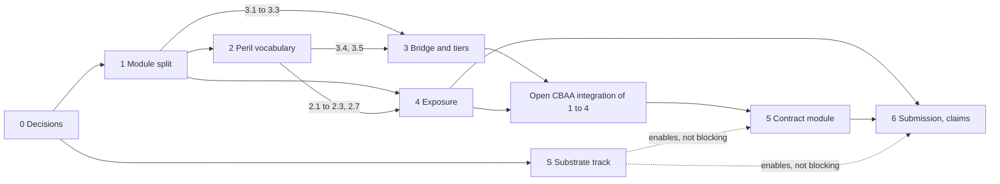

<!-- SPDX-License-Identifier: CC-BY-SA-4.0 -->

# Applied Insurance Reference — Epic

**Unit type:** Epic
**Epic:** `applied-insurance-reference`
**Epic status:** Proposed. Scope decisions recorded 2026-09-26 (§5). Decomposed into seven
phase plans (below). Phases 0 and 1 are detailed to slice level. Phases 2 to 6 are rolling-wave:
slices are outlined and detailed at the preceding phase gate.
**Trigger:** human request, 2026-09-26
**Status record:** [applied-insurance-reference.md](../status/applied-insurance-reference.md)
**Governing model:** Epic Decomposition in [copilot-instructions](../../../.github/copilot-instructions.md)

**Sketches** (the design this epic implements, cited by section):

| Sketch | Content |
|---|---|
| [peril-vocabulary.md](../sketches/peril-vocabulary.md) | reference peril vocabulary `prl:`: cause scheme, kind and part links, typed relations, characteristic and companion schemes, collections, Quantification links, crosswalks |
| [asset-exposure-ontology.md](../sketches/asset-exposure-ontology.md) | exposure ontology `aeo:`: locations, assets, values, zones, dependencies, exposure units, loss history, requirements, liability exposure |
| [term-parameters.md](../sketches/term-parameters.md) | contract term parameters on `ins:Qualifier`, term relations, optional compilation, liability direction from party roles |
| [mork-bridge.md](../sketches/mork-bridge.md) | scheme profiles and capability tiers, MORK crosswalks between flat or taxonomic lists and the reference |
| [peril-structure-whitepaper.md](../sketches/peril-structure-whitepaper.md) | why a hierarchy alone is insufficient, where each structural notion lives, inter-layer cost, upstream changes L-P1 to L-P6 |

The sketches use Open CBAA, a binding-authority consumer, and its real contractual
requirements as motivation, and describe that consumer's modules alongside LATTICE's. The
motivation stays in the sketches (decision D3). LATTICE implements its own modules, and the
consumer's modules are implemented in Open CBAA.

---

## 1. Purpose

Give LATTICE's applied insurance domain a reference implementation with the fullest treatment of
perils, exposure and contract terms, while keeping it usable by consumers who bring flat or
simply taxonomic peril lists of their own. The reference is a reference: a contract's drafter or
its market defines what a peril means in that contract, and LATTICE's editions are the unscoped
fallback.

## 2. Principles

Each is stated once in the sketch cited, and every phase plan inherits them.

| # | Principle | Source |
|---|---|---|
| E1 | Reference editions are the unscoped fallback. Agreement, drafter and market bindings take precedence, and a market-published view (an LMA edition, for example) is welcome | mork-bridge §2 |
| E2 | The operative scheme is the contract's. Checks run at the structure that scheme has, and return Undetermined when they need structure it lacks | mork-bridge §1, §3 |
| E3 | The source graph is normative. Compilation to Surface, generated classes or Capacity runtime forms is optional, parity-tested and never synchronised back | term-parameters §5 |
| E4 | Liability direction is derived from party roles, never recorded as a peril or characteristic | term-parameters §7 |
| E5 | Names: "characteristic" for peril axes, "term parameter" and "term relation" for contract terms. "Facet" is not used | term-parameters §2 |
| E6 | Applied content is not substrate. Every substrate change it motivates follows the clean-room procedure (ADR-A-C2) and the restatement boundary (ADR-A-C1) | whitepaper §7.2 |
| E7 | Every ontology change is classified under ADR-A86 and runs the import-pinning cascade | ontology-versioning-policy |

## 3. Phase map

| Phase | Plan | Capability delivered | Depends on | Milestone |
|---|---|---|---|---|
| 0 | [phase 0](applied-insurance-reference-phase-0.md) | decisions ratified | nothing | — |
| 1 | [phase 1](applied-insurance-reference-phase-1.md) | legacy contract module dropped, applied layout, `insurance/common/` and `classification/` | 0 | — |
| 2 | [phase 2](applied-insurance-reference-phase-2.md) | reference peril vocabulary | 1 | M1 |
| 3 | [phase 3](applied-insurance-reference-phase-3.md) | scheme profiles, tier-gated checks, MORK crosswalks | 1 (3.1 to 3.3), 2 (3.4, 3.5) | M2 |
| 4 | [phase 4](applied-insurance-reference-phase-4.md) | exposure ontology | 1, and slices of 2 per the phase plan | M3 |
| 5 | [phase 5](applied-insurance-reference-phase-5.md) | contract module: term parameters, liability direction in contract terms, optional compilation. Deferred (D2) | 1, 2, Open CBAA integration of 1 to 4 | M4, M5 |
| 6 | [phase 6](applied-insurance-reference-phase-6.md) | submission (after 4), claims (after 5) | 4, 5 | M6 |
| S | [substrate track](applied-insurance-reference-substrate.md) | upstream LATTICE changes L-P1 to L-P5, spatial guidance, evidence resolution | 0 | none, non-blocking |



Phases 2, 3 and 4 overlap. Lanes, the slice-level merge order and the rules for shared files are
in [lanes and merge order](applied-insurance-reference-lanes.md).

## 4. Milestones

| # | Outcome, exercised end to end over example graphs | Closes in |
|---|---|---|
| M1 | the reference cause scheme validates, and a hierarchical-match condition with exclusions admits and denies perils as the sketch's open-perils example states | phase 2 |
| M2 | one condition evaluated against a flat list (tier F), a two-level taxonomy (tier H) and the reference (tier N), with the crosswalked flat list reaching tier R. Checks needing structure a tier lacks return Undetermined with reason `InsufficientSchemeStructure` | phase 3 |
| M3 | exposure units derived on demand for a location set, and a zone-and-peril requirement evaluated over them without materialising units | phase 4 |
| M4 | (deferred with Phase 5) a D&O programme example: Side A, B and C terms, and a claim by a claimant unknown at binding whose direction (third, fourth, insured against insured) is derived from roles and the relationship graph | phase 5 |
| M5 | (deferred with Phase 5) one check run directly (route R1) and compiled (route R2) with equal results under the parity suite | phase 5 |
| M6 | a submission packages an exposure set version, and a claim records a loss cause chain against the contract that responds | phase 6 |

## 5. Decisions

### 5.1 Scope decisions (human, 2026-09-26)

| # | Decision | Effect |
|---|---|---|
| D1 | The existing contract module (`ontology/applied/insurance/spec/structure/contract.ttl`, its vocab and shapes) is dropped | AIR-1.1 deletes it. TP-Q2 is closed |
| D2 | A new contract module is de-prioritised until Phases 1 to 4 are wired into Open CBAA | Phase 5 starts only after that integration. A-101 is drafted at Phase 5 start. Claims (Phase 6, AIR-6.2 onwards) waits with it |
| D3 | Open CBAA material stays in the sketches. A real-world contractual requirement is valid motivation for a LATTICE change | Phase 0 no longer separates consumer material from the sketches |
| D4 | Open CBAA's local copies of the sketches are removed, and its documents link to LATTICE | done in Open CBAA, 2026-09-26 |

### 5.2 Applied layout (human, 2026-09-26)

Input to A-98 and A-100. Sub-domains beyond the epic's phases are illustrative and do not change
its scope.

| # | Decision |
|---|---|
| D5 | Three levels of sharing. A module sits at the lowest level that covers every module using it: substrate (`ontology/<layer>`, reached only by clean-room promotion), shared across domains (`applied/<module>`, beside the domains), shared within one domain (`applied/<domain>/common/`) |
| D6 | `capacity` stays at `applied/capacity/`, a cross-domain module imported by insurance and lending, promotable into Behaviour under its CP-9 |
| D7 | `insurance/common/` holds what means something only in insurance and is used by two or more insurance sub-domains: the insurance scheme contracts (peril, mechanism, agency, consequence, harm subject, pool), the liability role types (harmed, liable, claimant, payee), and the loss event shared by exposure and claims |
| D8 | Classifications other domains also need (territory, asset class, industry) go in a cross-domain `applied/classification/` module from the start, so no IRI moves when lending arrives |
| D9 | The peril vocabulary is an insurance sub-domain, `insurance/peril/`, with its own release cycle for editions and crosswalks. There is no `reference/` level. Its scheme contract stays in `common/`, so modules that only classify by peril need not import the vocabulary |
| D10 | Scheme profiles and capability tiers (A-100) are a cross-domain module, `applied/scheme-profile/`, promotable into Vocabulary as Capacity is into Behaviour |

```text
applied/
    README.md             domains, the three levels of sharing, dependency direction
    capacity/             shapes/, spec/, README.md
    classification/       shapes/, spec/classification.ttl, README.md
    scheme-profile/       shapes/, spec/scheme-profile.ttl, README.md
    insurance/
        domain-README.md  the insurance domain
        common/           shapes/, spec/common.ttl, README.md
        peril/            shapes/, spec/peril.ttl, vocab/, crosswalk/, README.md
        exposure/         shapes/, spec/exposure.ttl, README.md
        submission/       shapes/, spec/submission.ttl, README.md
        claims/           shapes/, spec/claims.ttl, README.md
        contract/         deferred (D2)
```

Dependencies run one way: `classification/` and `scheme-profile/` on the substrate only,
`insurance/common/` on those, `peril/` on `common/`, `exposure/` on `common/` and `peril/`,
`submission/` on `exposure/`, `claims/` on `exposure/` and `contract/`. Namespaces follow the
existing pattern: `…/neuro-semantic/lattice/applied/<module>` for cross-domain modules (as
Capacity), `…/neuro-semantic/insurance/<module>` for insurance modules. Prefixes are fixed in the
ADRs. The sketches use `brg:` for the scheme profile module.

### 5.3 ADRs

| Proposed ADR | Decision | Sketch | Drafted in |
|---|---|---|---|
| A-98 | applied layout, the three levels of sharing and the insurance module structure (§5.2, D5 to D9), one-way dependencies, one `.version` per module, LATTICE layers imported by exact version IRI | asset-exposure-ontology §3, §13 | Phase 0 |
| A-99 | reference vocabularies and scheme precedence: LATTICE reference editions as unscoped fallback, the peril vocabulary's structure beyond SKOS, and the name "characteristic" | peril-vocabulary §2, §6, §9 | Phase 0 |
| A-100 | scheme profiles and capability tiers in `applied/scheme-profile/` (D10) | mork-bridge §3, §8 | Phase 0 |
| A-102 | liability direction from party roles with unfilled occupancies | term-parameters §7, asset-exposure-ontology §5.15 | Phase 0 |
| A-101 | term parameters on `ins:Qualifier`, term relations, optional compilation routes R1 to R3 | term-parameters §3 to §5 | Phase 5 start (D2) |

Numbers are provisional and assigned when filed. The substrate track's ADRs are filed in that
track, not here.

## 6. Open questions carried from the sketches

| Question | Decided in |
|---|---|
| TP-Q1 names: "characteristic" in A-99, "term parameter" and "term relation" in A-101 | Phase 0, Phase 5 |
| TP-Q2 rebuild the contract module now or migrate it | closed by D1 and D2 |
| TP-Q3 which checks to compile by default | phase 5 gate |
| MB-Q1 agreement-scoped bindings for every agreement or only on divergence | consumer decision. LATTICE supports both |
| MB-Q2 confidence threshold and sampling rate for template mappings | phase 3 gate |
| MB-Q3 publish a crosswalk of a widely used market list with the reference edition | A-100 |
| PV-O3 concept lifecycle across editions | substrate track S1 |
| PV-O4 matching over generic links only | substrate track S2 |
| W-Q2 causation profiles and their legal review | phase 6 gate |
| W-Q3 granularity of cause of loss in claims data | phase 6 gate |
| W-Q4 binding suspension on active hazard events | consumer decision |

## 7. Out of scope

Catastrophe model internals, pricing, a consumer's statement modules and decision logs, market
editions other than examples (they are published by their owners and bound by scope), and any
runtime store or UI work.
