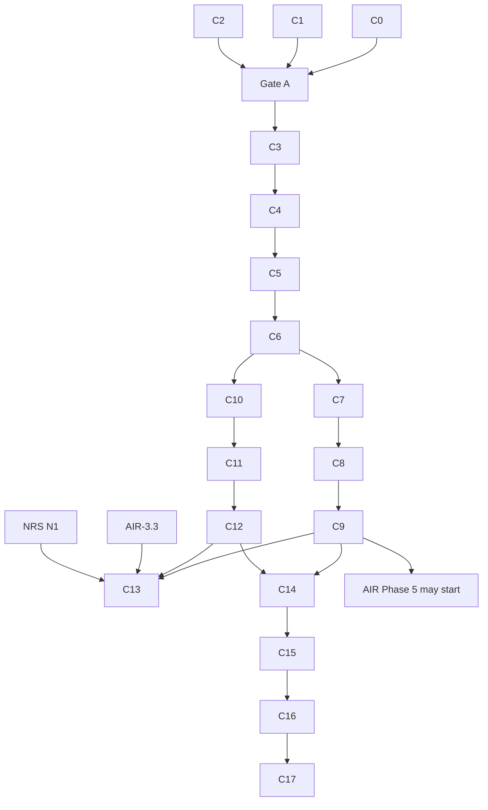

<!-- SPDX-License-Identifier: CC-BY-SA-4.0 -->

# Plan: Computable contract substrate

**Unit ID:** `computable-contract-substrate` (CCS)
**Unit type:** multi-slice unit, single machine R, in tranches with human gates (as
[normative-rule-substrate](normative-rule-substrate.md) §3)
**Status:** Proposed, awaiting human review. No slice may start until §8's decisions are taken
**Trigger:** human request, 2026-09-30, after testing the Instrument redesign against a package
policy, an IUA binding authority and the Lloyd's CBAA collateral
**Sketches:** [computable-contract-substrate.md](../sketches/computable-contract-substrate.md) (the
design and the scenario catalogue S1 to S91), [contract-amounts.md](../sketches/contract-amounts.md)
(the amounts catalogue A1 to A50),
[instrument-terms-and-legal-relations.md](../sketches/instrument-terms-and-legal-relations.md) (the
first design, superseded)
**Status record:** [computable-contract-substrate.md](../status/computable-contract-substrate.md)
**ADRs:** A-104 (retitled), A-106 (retitled), A-112, A-113, all to be drafted. A-105 and A-109 are
revised in NRS
**Absorbs:** NRS slice N4 and the Behaviour part of N8. Changes NRS N2, N5 and N6 (§6)
**Precedes:** applied-insurance Phase 5 (AIR epic §3b) and Open CBAA's migration (§7)

---

## 1. Problem

LATTICE's Instrument layer is 86 lines with a structural `ins:Obligation`, and has no model of
contract wording, legal relations beyond one class, templates, amendments or time. Open CBAA built
the wording and meaning it needed locally (`wim:`, `stm:`, `agr:`), and those are general to every
computable contract, not specific to binding authorities. Testing a relational redesign against
four instruments found 91 scenarios the substrate must model, 13 of which the first redesign got
wrong or missed, and a separate catalogue of 50 amount constructs.

## 2. Scope

**In scope.**
- A new Wording layer from Open CBAA's `wim:` and the general parts of `agr:`.
- Instrument rewritten from the sketch, taking the general parts of `stm:`.
- Behaviour extended with occasions, records, compiled wiring and state concepts.
- Compiler support for per-class evaluation.
- Eight neutral example instruments covering every scenario, with a how-to guide.
- The insurance renderings, handed to AIR Phase 5 and Open CBAA.

**Out of scope.** Contract amounts beyond their catalogue (a later unit, fed by
[contract-amounts.md](../sketches/contract-amounts.md)). Norm priority (NRS N10). Interchange (NRS
N12). A native evaluation engine.

## 3. Governing decisions

| ADR | Title | Decides | Drafted in |
|---|---|---|---|
| A-112 | Wording layer | the layer, its position between Eligibility and Instrument (amends A-01), its contents | C0 |
| A-113 | Breaking changes at major version zero | a breaking change to a 0.x layer takes a MINOR bump, marked breaking in its release row and ADR (clarifies A-86) | C0 |
| A-104 | Instrument: terms and legal relations (retitled from "Deontic extension of Instrument") | the rewrite, superseding A-07b, carrying A-96 onto terms | C1 |
| A-106 | Relation occasions and records in Behaviour (retitled from "Compensation chains and violation records") | occasions, act, breach, exercise, determination and deemed-fact records, compiled wiring, `bhv:forSubject` widened, `bhv:targets`, state concepts | C2 |
| A-109 | The importable rule-body fragment (NRS N2) | revised: a read of a recorded occasion state is admitted when stratified | NRS N2 |
| A-105 | Closure declarations (NRS N5) | revised: a contract's deeming is a closure source, determinations and burden | NRS N5 |

## 4. Slices

Sizing: 0.5 to 4 agent-days, one or two modules, a Validation Pack of 3 to 15 test cases. Each
slice's brief ("in detail" section plus Validation Pack skeleton) is written on `main` before its
branch.

### Tranche A: decisions, no ontology change

| Slice | Content | Output |
|---|---|---|
| C0 | draft A-112 and A-113 | two ADRs, Proposed |
| C1 | draft A-104 from the sketch §5, §6, laws I1 to I14 | ADR, Proposed |
| C2 | draft A-106 from the sketch §7, laws B1 to B5 | ADR, Proposed |

Gate A: the human accepts A-104, A-106, A-112 and A-113, and takes CC-D1 to CC-D8.

### Tranche B: Wording layer

| Slice | Content | Version impact |
|---|---|---|
| C3 | `ontology/wording` spec: wordings, elements, part-whole, rank keys, typing properties and contracts, content classes, segments, references, document objects, variables (sketch §4.1, §4.2) | new, 0.1.0 |
| C4 | tables (§4.3), assembly: inclusion modes, variation slots, inclusion conditions, assembled wordings, variable values (§4.4, §4.5) | 0.2.0 MINOR, vocab 0.1.0 |
| C5 | wording amendments (§4.6), shapes for W1 to W7, README | 0.3.0 MINOR, shapes 0.1.0 |

Wording imports Foundation, Vocabulary, Quantification and Eligibility. Nothing imports it until
C6, so tranche B cascades nowhere.

### Tranche C: Instrument rewrite

| Slice | Content | Version impact |
|---|---|---|
| C6 | instrument and term, the five relation classes with Exclusion, parties with groups, roles and `resolvedBy`, activity, scope, `maintains`, `fulfilledWhen`, `excepts`, qualifiers (§5.1 to §5.4, §5.7) | Instrument 0.7.0 to 0.8.0, breaking MINOR (A-113). Imports Wording |
| C7 | arising, due, recurrence, ending, `appliesInState`, survival, constitutive terms (Definition, Deeming), `appliesWithin`, classification (§5.5, §5.6) | 0.9.0 MINOR |
| C8 | templates and binding, parameter bindings, encoding status (§5.9) | 0.10.0 MINOR |
| C9 | amendments, consent rules, incorporation, `boundUnder`, `takesEffectWhen` (§5.8). Shapes for I1 to I14 | 0.11.0 MINOR, shapes |

C6's re-pin cascades to Behaviour, `behaviour-vocab` and `applied/capacity`'s execution profile
(C10 absorbs Behaviour's own change). No applied insurance module imports Instrument.

### Tranche D: Behaviour

| Slice | Content | Version impact |
|---|---|---|
| C10 | occasions and their state space, `bhv:forSubject` widened (Open CBAA L15), `bhv:targetsElement` replaced by `bhv:targets`, `bhv:realisesConcept` (§7.1, §7.4, §7.6) | Behaviour breaking MINOR (A-113). Re-pins `behaviour-vocab`, `applied/capacity` |
| C11 | records: act, breach (derived and asserted), exercise, determination, deemed fact, acceptance (§7.2). Instrument lifecycle state spaces as data (§7.5) | MINOR |
| C12 | compiled wiring: triggers and positioned stimuli from `arisesOn` and `due` (with NRS N6), breach chains, power exercises and per-occasion effects (§7.3). Parity B4 | MINOR, `tools/` |

### Tranche E: evaluation

| Slice | Content | Where |
|---|---|---|
| C13 | relation plans in the shared IR: per-class algorithms (§6.1), exception burden and `exe:ExceptionNotEstablished`, stratified state reading (§6.2), lifecycle gating (§6.3), finding, determination and deeming reads (§6.4). SPARQL reference first, SWRL for the positive subset | `tools/mork_compilers`. After AIR-3.3 and NRS N1 |

### Tranche F: examples and documentation

| Slice | Content |
|---|---|
| C14 | neutral examples E1 to E4 (sketch §9) with expected-decision tables and Behaviour traces, covering their scenarios |
| C15 | neutral examples E5 to E8, and a coverage test that every scenario S1 to S91 (except the amounts group) is shown by at least one example |
| C16 | how-to guides for Wording and Instrument (sketch §11), the substrate README's "computable contract" section, ontology architecture, SDS, data architecture |
| C17 | handoff: the insurance renderings list for AIR Phase 5 (policy scenarios) and Open CBAA (binding authority scenarios), and the Open CBAA migration notes (§7) |

## 5. Sequencing

Tranches A to D touch no file any AIR round-3 or round-4 slice touches. C13 shares
`tools/mork_compilers/` with AIR-3.3 and NRS N1 and follows both.

## 6. Impact on other plans

| Plan | Change |
|---|---|
| [normative-rule-substrate](normative-rule-substrate.md) | N4 is delivered by C1 and C6 to C9. N8's Behaviour work is C11 and C12, and N8 keeps the chain checks. N2 revised (stratified state reads). N5 revised (contractual deeming, determinations, burden). N6 is built with C12. N3 compares Obligation and Prohibition, and Permission and Exclusion. D2 and D3 answered |
| [applied-insurance-reference](applied-insurance-reference.md) §3b | the Phase 5 constraint becomes C9 accepted and merged. C6 and C10 re-pin `applied/capacity`, which the epic does not author before Phase 5 |
| [phase 5](applied-insurance-reference-phase-5.md) | builds on Wording and Instrument. Term parameters qualify terms and relations. Adds the policy renderings (AIG scenarios) and, under CC-D3, the LMA WIM profile |
| [phase 6](applied-insurance-reference-phase-6.md) | claims are occasions of the policy's relations |
| [phase-3-plan](phase-3-plan.md) (platform operation plane) | the behaviour engine's expansion includes occasions, records and compiled wiring (tranche D) |
| Open CBAA plan and integration spec | migration of §7 |

## 7. Open CBAA migration

Recorded here so the other repository can plan it. Details in the sketch §3 and §12.2.

| Open CBAA module | After migration |
|---|---|
| `wim` | removed or reduced to the LMA WIM profile if CC-D3 places the profile in Open CBAA |
| `stm` | `AuthorityGrant ⊑ ins:Power` with its envelope mechanism. Other kinds, templates, parameter bindings and encoding status come from Instrument |
| `agr` | UMR, markets, CBAA roles, M12 lifecycle data. Agreement versions become `ins:Instrument`s expressed in `wrd:Wording`s |
| `rsk` | unchanged, with `rsk:BoundPolicy ⊑ ins:Instrument` and `rsk:boundUnder ⊑ ins:boundUnder` |
| example BA-2026-001 | re-expressed, joined by the binding authority scenario renderings |
| decisions | D22 holds as I13. D23 resolved. D25 changed. I6 closed. L15 fixed upstream |

## 8. Decisions owed before C0

None of these may be taken by the agent.

| # | Decision | Recommendation |
|---|---|---|
| CC-D1 | Name of the lower layer | Wording (`wrd:`), "computable contract" for the composition (sketch §1.1) |
| CC-D2 | Position of Wording | between Eligibility and Instrument |
| CC-D3 | Home of the LMA WIM profile | `applied/insurance/wording/` in LATTICE |
| CC-D4 | Scope of A-113 | every 0.x layer |
| CC-D5 | Templates in the substrate | yes |
| CC-D6 | Table structure | rows, columns and cells as elements |
| CC-D7 | Clean-room examples | neutral in the substrate, insurance renderings in AIR and Open CBAA |
| CC-D8 | Lifecycle gating | concepts, with `bhv:realisesConcept` |

## 9. Validation

Each slice has a Validation Pack at `docs/developer/validation/computable-contract-substrate-<slice>.md`
and a `LOG.md` row at sign-off.

| Slice | Levels | One command |
|---|---|---|
| C0 to C2 | none, paper | link and prose checks |
| C3 to C12 | L1, L2 | `mise run build:ontology-catalog`, then `mise run check:ontology-versioning && mise run check:ontology-catalog` |
| C13 | L1, L2, L3 | `mise run check:mork-compilers` |
| C14, C15 | L2, L3 | the examples' decision tests and the scenario coverage test |

**Mandatory adversarial probes.**
- **I7 (C13):** an Undetermined fulfilment must never yield a breach, and a breach must never rest
  on an unestablished exception. Both are shown to fail when deliberately broken.
- **I11 (C11):** an occasion's parties must not change after arising.

Non-weakening applies throughout.

## 10. Documentation deltas

Root `README.md` (the new layer), `ontology/README.md`, the Wording and Instrument READMEs and
how-to guides, `docs/architecture/ontology-architecture.md` (layer order, both layers),
`solution-design-specification.md` (evaluation of relations), `data-architecture.md` (occasions and
records), the ADR catalogue.

## 11. Risks

| # | Risk | Mitigation |
|---|---|---|
| R1 | The rewrite breaks the only consumer mid-work | Open CBAA pins release tags. Its migration starts after C9 and C12 |
| R2 | A Foundation change is found necessary | stop and re-plan. None is expected (sketch §12.1) |
| R3 | Scope grows into contract amounts | amounts stay a catalogue until their own unit |
| R4 | Examples drift into insurance terms | ADR-A-C2 check in every Validation Pack |
| R5 | The scenario catalogue loses rows as slices are cut | C15's coverage test fails on any scenario without an example |
