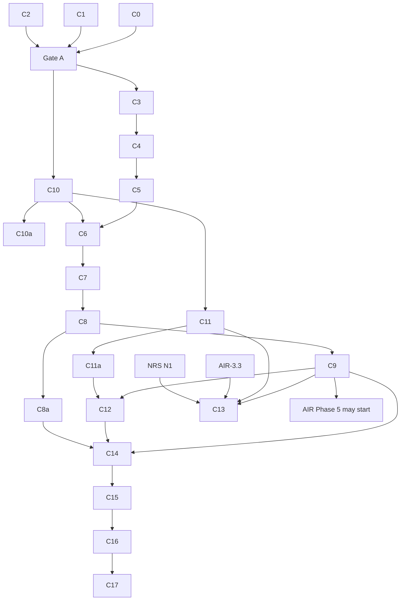

<!-- SPDX-License-Identifier: CC-BY-SA-4.0 -->

# Plan: Computable contract substrate

**Unit ID:** `computable-contract-substrate` (CCS)
**Unit type:** multi-slice unit, single machine R, in tranches with human gates (as
[normative-rule-substrate](normative-rule-substrate.md) §3)
**Status:** Proposed, awaiting human review. All §8 decisions taken (CC-D8 on 2026-10-01)
**Trigger:** human request, 2026-09-30, after testing the Instrument redesign against a package
policy, an IUA binding authority and the Lloyd's CBAA collateral
**Sketches:** [computable-contract-substrate.md](../sketches/computable-contract-substrate.md) (the
design and the scenario catalogue S1 to S101), [contract-amounts.md](../sketches/contract-amounts.md)
(the amounts catalogue A1 to A58),
[instrument-terms-and-legal-relations.md](../sketches/instrument-terms-and-legal-relations.md) (the
first design, superseded)
**Status record:** [computable-contract-substrate.md](../status/computable-contract-substrate.md)
**ADRs:** A-104 (retitled), A-106 (retitled), A-112, A-113, all to be drafted. A-105 and A-109 are
revised in NRS
**Absorbs:** NRS slice N4 and the Behaviour part of N8. Changes NRS N2, N5 and N6 (§6)
**Precedes:** applied-insurance Phase 5 (AIR epic §3b) and Open CBAA's migration (§7)

---

## 1. Problem

LATTICE's Instrument layer holds a structural `ins:Obligation`, but no model of contract wording, 
legal relations beyond one class, templates, amendments or time. Open CBAA built the wording and 
meaning it needed locally (`wim:`, `stm:`, `agr:`), and those are general to every computable contract, 
not specific to binding authorities. Testing a relational redesign against four instruments found 101
scenarios the substrate must model, 13 of which the first redesign got wrong or missed, and a separate
catalogue of 58 amount constructs. Behaviour imports Instrument for one `rdfs:range`, which blocks
Instrument from building on Behaviour's state machinery.

## 2. Scope

**In scope.**
- A new Wording layer from Open CBAA's `wim:` and the general parts of `agr:`.
- Instrument rewritten from the sketch, taking the general parts of `stm:`.
- Behaviour moved below Instrument and split into configuration and runtime documents, with
  occasions, records and the evidence rule (sketch §7).
- Instrument's regimes and legal triggers as specialisations of Behaviour configuration, and a
  template library (sketch §5.11, §7.3, §7.4).
- A deep dive on nested states, history and concurrent regimes (sketch §7.10).
- A design-time import guard (law B7).
- Compiler support for per-class evaluation.
- Eight neutral example instruments covering every scenario, with a how-to guide.
- The insurance renderings, handed to AIR Phase 5 and Open CBAA.

**Out of scope.** Contract amounts beyond their catalogue (a later unit, fed by
[contract-amounts.md](../sketches/contract-amounts.md)). Norm priority (NRS N10). Interchange (NRS
N12). A native evaluation engine.

## 3. Governing decisions

| ADR | Title | Decides | Drafted in |
|---|---|---|---|
| A-112 | Wording layer | the layer, its position between Eligibility and Instrument, and Behaviour moved below Instrument (both amend A-01), its contents | C0 |
| A-113 | Breaking changes at major version zero | a breaking change to a 0.x layer takes a MINOR bump, marked breaking (C0-Q3) (clarifies A-86) | C0 |
| A-104 | Instrument: terms and legal relations (retitled from "Deontic extension of Instrument") | the rewrite, superseding A-07b, carrying A-96 onto terms. Regimes, legal triggers, `ins:appliesInState`, `ins:computedBy`, the template library and `ontology/instrument/templates/` | C1 |
| A-106 | Behaviour configuration, runtime, occasions and records (retitled from "Compensation chains and violation records") | the configuration and runtime split, `bhv:targets` with no range, `bhv:forSubject` relaxed, engine-setting defaults, no required effect, the evidence rule (B6), occasions, act, breach, exercise, determination and deemed-fact records, laws B1 to B8. Alignment with Instrument is by sub-class and sub-property (sketch §7.3), with no compiled wiring | C2 |
| A-109 | The importable rule-body fragment (NRS N2) | revised: a read of a recorded occasion state is admitted when stratified | NRS N2 |
| A-105 | Closure declarations (NRS N5) | revised: a contract's deeming is a closure source, determinations and burden | NRS N5 |

## 4. Slices

Sizing: 0.5 to 4 agent-days, one or two modules, a Validation Pack of 3 to 15 test cases. Each
slice's brief ("in detail" section plus Validation Pack skeleton) is written on `main` before its
branch.

### Tranche A: decisions, no ontology change

| Slice | Content | Output |
|---|---|---|
| C0 | draft A-112, A-113, and the A-01 and ADR-A-C2 addenda (CC-D7) | four documents, Proposed |
| C1 | draft A-104 from the sketch §5, §6, §7.3, §7.4, laws I1 to I18 | ADR, Proposed |
| C2 | draft A-106 from the sketch §7, laws B1 to B8 | ADR, Proposed |

Gate A: the human accepts A-104, A-106, A-112 and A-113.

#### C0 in detail

**Machine:** R (Claude Code). **Branch:** `ccs/c0-adrs`, created by the human. **Validation Pack:**
[computable-contract-substrate-c0](../validation/computable-contract-substrate-c0.md).
**Decisions carried:** CC-D1, CC-D2 and CC-D8's layer order (A-112), CC-D4 (A-113), CC-D7 (the
ADR-A-C2 addendum).

**Invariant:** paper only. Two new ADRs and two addenda, all `Proposed`, plus the ADR index. No
ontology, tool, README or architecture document changes: those follow acceptance at Gate A, in the
slices that build what the ADRs decide (C3, C10, C16). Each ADR states what was decided and cites
the sketch for the argument, so the rationale lives in one place.

**Questions for the human before the branch** (the brief follows the recommendation unless told
otherwise):

| # | Question | Options | Recommendation |
|---|---|---|---|
| C0-Q1 | How does A-112 change A-01's layer order? The ADR README says a changed decision is a new ADR that supersedes the old one | (a) A-112 decides, and A-01 gains a short addendum giving the new order and pointing to A-112, as A-86 and A-98 gained addenda. (b) A-112 supersedes A-01 and restates every layer's import rule | (a): A-01's other rules (no upward import, projections from the higher layer, the rejected composition module) stand, and readers of A-01 find the current order |
| C0-Q2 | How is "not substantially more comprehensive" (CC-D7) measured, so C15 can test it? | (a) every class and property an insurance example uses for a scenario is also used by an other-domain example for that scenario. (b) a reviewer's judgement, recorded per example | (a), mechanical and checkable |
| C0-Q3 | Where is a breaking 0.x change marked (A-113)? The release register is generated and has no notes column | (a) in the ADR that authorises the change and in the layer README's release note, with the register unchanged. (b) a register column written by `tools/ontology_releases.py` | (a): no tool change, and the register keeps its add-only rows |

1. **ADR-A112, Wording layer** (`ADR-A112-wording-layer.md`). Shape as A-103: Status, Date,
   Related, Unit, then Context, Decision, Consequences.
   - **Context**, in ADR-A-C2 order: a domain-neutral premise (a contract's text has structure,
     variables, tables, variants and amendments, independent of what it means in law), then two
     non-insurance examples, the facility agreement (LEND) and the trial protocol (TRIAL), then
     the problem: Instrument holds no wording, and Open CBAA built `wim:` locally.
   - **Decision 1:** a Wording layer, prefix `wrd:`. "Computable contract" names the composition of
     Wording, Instrument and Behaviour (CC-D1, sketch §1.1).
   - **Decision 2, the layer order** (CC-D2, CC-D8), as the sketch §1 diagram: Wording imports
     Foundation, Vocabulary, Quantification and Eligibility. Behaviour imports the layers up to
     Eligibility and no longer imports Instrument. Its configuration and runtime documents are
     A-106's. Instrument imports Wording and Behaviour configuration. A-01's rule that no layer
     imports upward stands.
   - **Decision 3, contents:** a table of the sketch's §4.1 to §4.6 (structure, text parts,
     variables, tables under CC-D6, assembly, the assembled wording, amendments), with laws W1 to
     W7 listed by number and linked, not restated.
   - **Decision 4, what Wording does not hold:** legal meaning (Instrument), the LMA WIM typing
     (an applied profile, CC-D3), identifiers (Foundation, F1).
   - **Rejected:** a layer named Contract, and wording inside Instrument. One sentence each, citing
     sketch §1.1 and DP3 (§3.1).
   - **Consequences:** `ontology/wording/` is created at C3 under this ADR (the topology rule).
     A-01's promised import-closure check is built at C10a. Documentation follows at C3 and C16.
     Open CBAA's `wim:` migrates (plan §7).
2. **ADR-A01 addendum**, under C0-Q1 (a): `## Addendum (2026-10-01): Wording, and Behaviour below
   Instrument`, **Status:** Proposed, with ADR-A112. The new order as a text tree in A-01's own
   style, one sentence per changed import list, and "every other decision stands".
3. **ADR-A113, breaking changes at major version zero**
   (`ADR-A113-breaking-changes-at-major-version-zero.md`).
   - **Decision:** for any ontology document at major version zero, a change that ADR-A86's table
     classes as MAJOR takes a MINOR bump instead, marked breaking under C0-Q3. Importers re-pin in
     the same change and take the same level, by A-86's import-only rule. `1.0.0` stays reserved
     for a stability decision.
   - **Scope:** every 0.x document (CC-D4), not Instrument alone.
   - **Context:** SemVer item 4 and A-86's closing paragraph already allow it, and the Wording,
     Instrument and Behaviour rewrites need it.
   - **Consequences:** `ontology-versioning-policy.md` gains the rule when the ADR is accepted,
     before C3.
4. **ADR-A-C2 addendum** (CC-D7): `## Addendum (2026-10-01): insurance examples in the computable
   contract substrate`, **Status:** Proposed.
   - **Scope:** the examples and templates of the layers this unit authors (Wording, Instrument,
     Behaviour).
   - **The rule:** insurance examples may sit beside other-domain ones when every scenario they
     show is also shown by an other-domain example, and they are not substantially more
     comprehensive, measured under C0-Q2.
   - **Unchanged:** the authoring order (premise, then two non-domain examples, then mechanism),
     and the ban on any deployment, brand or closed-estate identifier in substrate text.
   - **Consequences:** C15's coverage test checks both conditions per scenario.
5. **ADR index** (`docs/architecture/decisions/README.md`):
   - rows for A-112 and A-113 (Proposed)
   - A-01 and A-C2 titles marked "(with addendum)"
   - one sentence in the numbering paragraph: A-104 to A-111 are reserved by NRS, A-104 and A-106
     are drafted in CCS C1 and C2, and A-112 and A-113 are CCS's
6. **Handoff:** the Validation Pack's Handoff block and the status record. There are no tags,
   since no version changes.

| ID | Given / When / Then | Level | +/- |
|---|---|---|---|
| C0-01 | A-112 and A-113 / read / each has Status `Proposed`, Date, Related, Unit, Context, Decision, Consequences | paper | + |
| C0-02 | A-112's Context / read / a domain-neutral premise and two non-insurance examples precede any mechanism prose (ADR-A-C2) | paper | + |
| C0-03 | A-112's order and the A-01 addendum / compared with the sketch §1 diagram / the same import lists, and no layer imports a higher one | paper | + |
| C0-04 | A-112 / read / decides only CC-D1, CC-D2 and CC-D8's order. Behaviour's split is cited as A-106's, not decided here | paper | + |
| C0-05 | A-113 / read / applies to every 0.x document, keeps `1.0.0` reserved, and agrees with A-86's bump table and import-only rule | paper | + |
| C0-06 | the A-C2 addendum / compared with the plan's CC-D7 record / the same two conditions, the same scope, the authoring order and brand ban unchanged | paper | + |
| C0-07 | the ADR index / read / both new rows, both "(with addendum)" titles and the numbering sentence | paper | + |
| C0-08 | the link check / run / the broken-link count is the baseline (427) and none is in a changed file | L1 | + |
| C0-09 | the changed files / prose check / no semicolons in English text, no superlatives | L1 | + |
| C0-10 | `git diff --stat main` / read / only the four ADR files, the ADR index, the Validation Pack and the status record change | L1 | + |
| C0-11 | each ADR / read / it cites the sketch for its argument and does not restate it | paper | + |

#### C1 in detail

**Machine:** R. **Branch:** `ccs/c0-adrs` (the human ran tranche A on one branch, 2026-10-01).
**Validation Pack:** [computable-contract-substrate-c1](../validation/computable-contract-substrate-c1.md).
**Decisions carried:** CC-D5, CC-D8 (regimes and legal triggers), CC-D10, CC-D11.

**Invariant:** paper only. ADR-A104 `Proposed`, superseding ADR-A07b on acceptance and carrying
ADR-A96 onto terms, decides what the sketch §5, §6, §7.3 and §7.4 decide and cites them.

1. **Context** in ADR-A-C2 order: premise, then the facility agreement (E1) and the trial protocol
   (E8), then the problem (A-07b's minimal shape).
2. **Decision**, one numbered item per sketch section: instrument and term, the five relations,
   parties (with CC-D10), content and static parameters, legal triggers, regimes, structure apart
   from state, constitutive terms, exceptions and burden, change, sections (CC-D11), templates and
   `ontology/instrument/templates/`, calculated values, evaluation, laws I1 to I16.
3. **Consequences:** slices C6 to C9 and C8a, the A-113 bumps, `ins:InstrumentTarget`, NRS N4,
   A-105 and A-109 revisions, ADR-A-C2 and its addendum for E1 to E8.
4. **Decided in review (2026-10-01):** `ins:Element` retired under CC-D12, and `ins:fulfilledBy`
   replaced by `ins:fulfilledWhen` with delegated performance.
5. **Index:** the A-104 row, and A-07b marked as superseded on acceptance.

| ID | Given / When / Then | Level | +/- |
|---|---|---|---|
| C1-01 | A-104 / read / Status `Proposed`, Supersedes, Related, Unit, Context, Decision, Consequences | paper | + |
| C1-02 | its Context / read / premise and two non-insurance examples precede mechanism prose | paper | + |
| C1-03 | each Decision item / compared with the sketch section it cites / no item decides more than the sketch, and none contradicts CC-D5, CC-D8, CC-D10 or CC-D11 | paper | + |
| C1-04 | laws I1 to I16 / read / listed by reference, not restated | paper | + |
| C1-05 | A-07b's terms (`Element`, `Provision`, `Obligation`, `Qualifier`, the cross-reference properties, `fulfilledBy`, R-B7) / checked / each is carried, replaced or raised as an open point | paper | + |
| C1-06 | links and prose / the checks of C0-08 and C0-09 / pass | L1 | + |

#### C2 in detail

**Machine:** R. **Branch:** `ccs/c0-adrs`. **Validation Pack:**
[computable-contract-substrate-c2](../validation/computable-contract-substrate-c2.md).
**Decisions carried:** CC-D8.

**Invariant:** paper only. ADR-A106 `Proposed`, amending ADR-A11 and mapping ADR-A08's tiers onto
the configuration and runtime documents, decides what the sketch §7 decides. Nested states,
history and concurrent regimes are left to C11a.

1. **Context** in ADR-A-C2 order: premise, then a software licence (E7) and the trial protocol
   (E8), then the problem (the range, the import, `forSubject`, one document).
2. **Decision:** the layer flip, A-11's target binding amended, the two documents by tier, the
   evidence rule, occasions and records, alignment without runtime inference, roles filled later,
   laws B1 to B8, and what is not decided.
3. **Consequences:** C10, C10a, C11, C12, the re-pins, risk R8, the Phase 3 engine.
4. **Decided in review (2026-10-01):** engine settings stay explicit. A-09 and A-10 stand, with no
   Behaviour-wide default.
5. **Index:** the A-106 row, and A-11 marked as amended on acceptance.

| ID | Given / When / Then | Level | +/- |
|---|---|---|---|
| C2-01 | A-106 / read / Status `Proposed`, Amends, Related, Unit, Context, Decision, Consequences | paper | + |
| C2-02 | its Context / read / premise and two non-insurance examples precede mechanism prose | paper | + |
| C2-03 | its tier table / compared with ADR-A08 / every tier in exactly one document | paper | + |
| C2-04 | laws B1 to B8 / compared with the sketch §7.11 / the same eight, same meaning | paper | + |
| C2-05 | the A-01 addendum, A-112 and A-106 / compared / one layer order, stated identically | paper | + |
| C2-06 | links and prose / the checks of C0-08 and C0-09 / pass | L1 | + |

### Tranche B: Wording layer

| Slice | Content | Version impact |
|---|---|---|
| C3 | `ontology/wording` spec: wordings, elements, part-whole, rank keys, typing properties and their scheme contracts, content classes, text parts, references, document objects, variables. Sections are an element type (CC-D11), not a class. The README starts here as the literate source. Unions named once, each property's subject and value stated in its comment and checked by SHACL Core shapes (sketch §4.1, §4.2) | new: spec 0.1.0, vocab 0.1.0, shapes 0.1.0 |
| C4 | tables (§4.3), assembly: inclusion modes, variation slots, inclusion conditions, assembled wordings, variable values (§4.4, §4.5), with subject and value comments and SHACL Core shapes as in C3 | 0.2.0 MINOR, vocab 0.2.0, shapes 0.2.0 |
| C5 | wording amendments (§4.6), shapes for W1 to W7, the README completed (laws, how-to) | 0.3.0 MINOR, shapes 0.3.0 |

Wording imports Foundation, Vocabulary, Quantification and Eligibility. Nothing imports it until
C6, so tranche B cascades nowhere.

#### C3 in detail

**Machine:** R (Claude Code). **Branch:** `ccs/c3-wording-spec`, created by the human.
**Validation Pack:** [computable-contract-substrate-c3](../validation/computable-contract-substrate-c3.md).
**Decisions:** ADR-A112 (decisions 1 to 4), ADR-A113, ADR-A-C2 and its addendum, CC-D6, CC-D11.

**Invariant:** a new layer, `ontology/wording`, whose spec imports exactly Foundation 0.3.0,
Vocabulary 0.3.0, Quantification 0.5.0 and Eligibility 0.7.0, names no term of a higher layer, and
holds the structure, text and variables of a contract's documents. Nothing imports it, so no
other document changes version.

**Decided by the human, 2026-10-01:**

- **C3-Q1.** Wording ships a baseline element type scheme in `wrd-voc`, not closed, with every
  element type that Wording's README, how-to and examples use (Section, Clause, Schedule, Annex and
  Definition at least). Deployments and the LMA profile add more. C3-13 checks it.
- **C3-Q2.** `applicableTo` belongs in the LMA WIM profile, drafted as a reference implementation
  for the CBAA after this unit.

1. **Versioning policy (ADR-A113).** `docs/architecture/ontology-versioning-policy.md` gains the
   major-version-zero rule beside its bump table, and the "Release notes" README section it
   requires. This is A-113's own consequence, landed here because C3 is the first slice after
   Gate A.
2. **Examples first (ADR-A-C2).** `ontology/wording/examples/` gains, before any README prose:
   - `facility-agreement.ttl`: a wording with a section holding clauses 4.1 and 4.2, clause 4.1
     as five text parts (literal, object reference to the Borrower's definition, literal,
     variable reference to the margin, literal), clause 4.2 linking to an annex as a document
     object (sketch §4.1 diagram)
   - `trial-protocol.ttl`: a protocol wording with sections, a schedule, a reference to an
     external regulation, an embedded and a governing variable with a value space and admissible
     values
   
   Each is a premise comment, then data. Neither names insurance.
3. **Spec** (`spec/wording.ttl`, ontology IRI `https://www.nebularis.org/neuro-semantic/wording`,
   version IRI `…/lattice/wording/0.1.0`), from the sketch §4.1 and §4.2, with names from the
   sketch §3.2 mapping and definitions written fresh:
   - `wrd:Wording` and `wrd:Element`, each `⊑ fnd:Version ⊓ fnd:Governable`, disjoint
   - `wrd:directlyComprises` (irreflexive, asymmetric, domain `Wording ⊔ Element`, range `Element`)
     `⊑ wrd:comprises` (transitive, never asserted), with inverses
   - `wrd:rankKey` and `wrd:objectId` (functional data properties)
   - `wrd:elementType` (functional) and `wrd:classification`, ranging over `skos:Concept`
   - content classes `wrd:Text`, `wrd:Table` (declared only, rows and columns are C4),
     `wrd:Variable`, `wrd:Reference` and `wrd:Metadata`, each `⊑ wrd:Element`, pairwise disjoint
   - `wrd:TextPart` with `wrd:hasTextPart` (inverse functional), `wrd:partIndex`,
     `wrd:partText`, `wrd:refersToVariable` and `wrd:refersToObject`
   - `wrd:DocumentObject` and `wrd:ExternalDocument` (`⊑ prov:Entity`), `wrd:documentKind`,
     `wrd:linksTo`
   - `wrd:EmbeddedVariable` and `wrd:GoverningVariable` (disjoint), `wrd:variableKey`,
     `wrd:populationMethod` (its class only, individuals are C4), `wrd:populatedFrom`,
     `wrd:valueContract` (to `voc:SchemeContract`), `wrd:valueSpace` (to `qnt:ValueSpace`),
     `wrd:admissibleValues` (to `qnt:RangeSet`), `wrd:multiValued`
4. **Vocab** (`vocab/wording-vocab.ttl`, `0.1.0`): `wrd-voc:ElementTypeContract`,
   `ClassificationContract` and `DocumentKindContract`, as `cls-voc`'s contracts are declared,
   and the baseline element type scheme (C3-Q1).
5. **README** (`ontology/wording/README.md`): purpose, imports, the extraction contract, the
   model with `turtle-spec` and `turtle-vocab` blocks identical to the files, and the examples.
   Laws W1 to W7 and the how-to follow in C5. `tools/literate_extract.py --check` passes for this
   layer.
6. **Catalog and releases:** `mise run build:ontology-catalog`, then
   `mise run build:ontology-releases` for the two new versions. Tags are the human's.
7. **Tests:** `tools/test_wording.py`, added to `check:ontology-catalog`'s list, for the rows
   below. The reasoner rows skip when the harness jar is not built, as `mork_compilers`' `test_reasoner.py` does.
8. **Docs** (ADR-A112's consequences): the root README and `ontology-architecture.md` take the
   A-01 addendum's order and a Wording row. `docs/developer/INDEX.md` is unchanged.

| ID | Given / When / Then | Level | +/- |
|---|---|---|---|
| C3-01 | the spec / parsed / its ontology and version IRIs, and imports of exactly Foundation 0.3.0, Vocabulary 0.3.0, Quantification 0.5.0 and Eligibility 0.7.0 | L1 | + |
| C3-02 | spec and vocab / catalog closure / every import resolves | L1 | + |
| C3-03 | every Wording file / scanned / no `ins:` or `bhv:` term, and no Instrument or Behaviour namespace | L1 | + |
| C3-04 | the facility example / loaded with the closure / clause 4.1 has five parts, indexed 0 to 4, each with exactly one of text, variable or object | L1 | + |
| C3-05 | both examples / reasoner / consistent | L2 | + |
| C3-06 | an element that directly comprises itself / reasoner / inconsistent | L2 | − |
| C3-07 | a node typed both `wrd:Wording` and `wrd:Element`, and a node both `wrd:Text` and `wrd:Table` / reasoner / inconsistent | L2 | − |
| C3-08 | the vocab / parsed / three contracts, each with identity, governance state and the property it constrains | L1 | + |
| C3-09 | the README / literate check / its blocks equal the spec and vocab | L1 | + |
| C3-10 | `check:ontology-versioning` / run / both versions have release rows | L1 | + |
| C3-11 | the examples / git history of the branch / committed before the README's model prose (ADR-A-C2) | paper | + |
| C3-12 | the existing tool tests / unchanged / pass (non-weakening) | L1 | + |
| C3-13 | every `wrd:elementType` value in the examples and in the README's example blocks / checked against the baseline scheme / each is a concept of it (C3-Q1) | L1 | + |
| C3-14 | both examples, with the spec closure / SHACL Core shapes, no inference / conform | L1 | + |
| C3-15 | a property on the wrong kind of node, a text part with two forms or none, in two texts or with a negative index, a part that is not an element, two element types, a value space that is not one / shapes / each reported on its focus node | L1 | − |
| C3-16 | `wrd:WordingNode`, `wrd:LinkedDocument`, `wrd:ReferenceTarget` / spec / each the one named union of its members, with the members' subclass triples asserted, and no anonymous union used as a domain or range | L1 | + |
| C3-17 | every property / spec / its comment states its subject and value | L1 | + |

#### C4 in detail

**Machine:** R (Claude Code). **Branch:** `ccs/c4-wording-assembly`, created by the human. May run
beside C11 and C10a: they share no file except `mise.toml`'s test list and the status record.
**Validation Pack:** [computable-contract-substrate-c4](../validation/computable-contract-substrate-c4.md).
**Decisions:** ADR-A112 decision 3, CC-D6 (tables), ADR-A-C2 and its addendum.

**Invariant:** Wording gains tables, assembly and variable values, all additive (MINOR, not
breaking). Every new property states its subject and value in its comment and is checked by SHACL
Core, as in C3. Assembly is design time: nothing here is evaluated per event.

**Decided by the human, 2026-10-01:**

- **C4-Q1.** An instance's wording is asserted as `wrd:AssembledWording ⊑ wrd:Wording`. Law I1
  (an instrument version is expressed in one), laws W3, W5 and W6, law I17 and the amendment and
  library-release flows all depend on telling one contract's text from a reusable form, and a
  fully bespoke contract is assembled from nothing, so the distinction is stated, not inferred.
- **C4-Q2.** `wrd:VariationSlot ⊑ wrd:Element`, ranked among its siblings, with
  `wrd:hasVariant ⊑ wrd:directlyComprises` to its variants. The slot carries the shared object id
  ("1.4"). Each variant carries its letter ("1.4A") only in the library form, and the assembled
  numbering shows "1.4". The slot is where C5's law shapes check its conditions as a set: no two
  overlap, and together they cover every case. Open CBAA's D19 had no recorded rationale and
  could not give the slot a rank. The LMA drafts number the position and letter the variants.
- **C4-Q3.** One `wrd:VariableValue` per variable, and per column where the variable is a table
  row's, holding several `wrd:value`s when the variable is multi-valued. Single-valuedness is then a
  Core count on that one node.

1. **Examples first (ADR-A-C2)**, in their own commit:
   - `trial-protocol.ttl` gains the schedule of assessments as a `wrd:Table` whose rows (screening,
     week 4, week 12) each declare a `wrd:rowVariable`, and an assembled protocol for one trial with
     two arms as columns, its cells as `wrd:VariableValue`s with `wrd:forColumn`
   - a new `facility-form.ttl`: a library facility form with a mandatory clause, a variation slot
     (monthly or quarterly interest periods), an optional clause (a margin ratchet) and a
     conditional clause (an agent clause, included when there is more than one lender, read from
     a governing variable), and the assembled facility drawn from it, including its multi-valued
     list of permitted jurisdictions
2. **Spec** (`wording` 0.2.0), sketch §4.3 to §4.5:
   - `wrd:Row ⊑ wrd:Element`, `wrd:rowKey` (the row's meaning), `wrd:rowVariable`
   - `wrd:InclusionMode`, `wrd:inclusionMode` (functional), `wrd:VariationSlot` under C4-Q2 (the
     slot an element with the shared object id, variants beneath it),
     `wrd:hasVariant` and `wrd:variantOf`, `wrd:includedWhen` (to `elg:AdmissionProfile`),
     `wrd:readsVariable` (from `elg:Condition` to `wrd:GoverningVariable`)
   - the assembled wording under C4-Q1, `wrd:assembledFrom`, `wrd:includes` (to element versions),
     `wrd:hasValue` (inverse functional)
   - `wrd:VariableValue`, `wrd:forVariable` (exactly one), `wrd:value` (any resource),
     `wrd:literalValue`, `wrd:forColumn` (any resource, only for a table row's variable), under C4-Q3
3. **Vocab** (`wording-vocab` 0.2.0): the four inclusion modes (Mandatory, Variation, Optional,
   Conditional) and the eight population methods, as named individuals, with comments written
   fresh and no market references.
4. **Shapes** (`wording-shapes` 0.2.0): a subject shape and a class shape per new property, as in
   C3, and a Core check that a variable value has exactly one variable and at least one value. The
   laws that need SPARQL (one variant per slot, W3. Conditions read governing variables, W4.
   Mandatory children included, W5. A value matches its declaration, W6) stay in C5.
5. **README:** the model sections for §4.3 to §4.5, the shapes, and the example table. The literate
   check covers all three files.
6. **Tests:** `tools/test_wording.py` gains the rows below.
7. **Catalog and releases**, and the tags for the human.

| ID | Given / When / Then | Level | +/- |
|---|---|---|---|
| C4-01 | the spec / parsed / imports unchanged, version `0.2.0` | L1 | + |
| C4-02 | both examples and the new one / shapes / conform | L1 | + |
| C4-03 | all examples / reasoner / consistent | L2 | + |
| C4-04 | a row with no row variable, a value for no variable or for two, a value with no value, an inclusion mode outside the four, a variant of two slots / shapes / each reported | L1 | − |
| C4-05 | the trial example / queried / one cell per row and arm: "the value in this row for each column" (S44) | L1 | + |
| C4-06 | every new property / spec / its comment states subject and value | L1 | + |
| C4-07 | the vocab / parsed / four inclusion modes and eight population methods, pairwise different | L1 | + |
| C4-08 | the README / literate check / spec, vocab and shapes equal their blocks | L1 | + |
| C4-09 | `check:ontology-versioning` / run / three bumps, three release rows | L1 | + |
| C4-10 | the examples / git history / committed before the model | paper | + |
| C4-11 | the existing tool tests / unchanged / pass (non-weakening) | L1 | + |

| Slice | Content | Version impact |
|---|---|---|
| F1 | Identifiers (CC-D9): `fnd:identifier` → `fnd:Identifier` with a scheme concept (under a scheme contract) and a value, usable on any identified thing: Coverholder PIN, LEI, syndicate number, agreement number, UMR. Uniqueness within a scheme among current versions as a shape | Foundation MINOR, cascading to all 14 importers. Runs in the Foundation window after Phase 2, in one cascade with NRS N9. C6 and C9 do not wait for it: instrument identifiers stay open-cbaa's `agr:umr` and AIR's `aeo:identifier` until F1, which then generalises them |

Slice numbers are kept stable because other plans cite them. Tranche C now runs before tranche D,
and may run beside tranche B.

### Tranche C: Behaviour below Instrument

| Slice | Content | Version impact |
|---|---|---|
| C10 | the layer flip and the split (sketch §7.1, §7.2): configuration and runtime documents in one namespace, `bhv:targetsElement` replaced by `bhv:targets` with no range, `bhv:forSubject` range removed (Open CBAA L15), the Instrument import removed, `bhv:InstrumentTarget` deprecated in `behaviour-vocab` (C6 declares its replacement), the at-least-one-effect restriction removed. Policies stay explicit (ADR-A106's open point) | Behaviour breaking MINOR (A-113). Re-pins `behaviour-vocab`, `applied/capacity`'s execution profile |
| C10a | import guard (B7): a design-time check that no layer imports or names a term of a layer above it, run over every catalogue entry | `tools/`, a `mise` check |
| C11 | runtime records: act, breach (derived and asserted), exercise, determination, deemed fact, acceptance. Occasions with a fixed core state space refined by sub-states (C11a). Declared initial states. The evidence rule (B6), derivation (B1) and fixed parties (I11) as shapes (sketch §7.5, §7.6) | configuration 0.9.0, runtime 0.9.0, vocab 0.9.0, shapes 0.3.0 (breaking) |
| C11a | deep dive: nested states, history and concurrent regimes (sketch §7.10), including the sub-states by which a deployment refines an occasion's fixed core (C11-Q1). A sketch and an A-106 amendment first, then the ontology change. Settles B5 | MINOR. Blocks C12 only |

#### C10 in detail

**Machine:** R (Claude Code). **Branch:** `ccs/c10-behaviour-split`, created by the human. May run
beside C3: the two share no file except the architecture documents, which C10 edits after C3
merges. **Validation Pack:**
[computable-contract-substrate-c10](../validation/computable-contract-substrate-c10.md).
**Decisions:** ADR-A106 decisions 1 to 3 and 6, ADR-A11 as amended, ADR-A01's addendum, ADR-A113.

**Invariant:** Behaviour imports nothing above Eligibility and names no Instrument term. Its
configuration and runtime are two documents in one namespace, split by ADR-A08's tiers. Effects
target any resource, occupancies may be for any subject, and a transition needs no effect.
Selection and activation policies stay required (ADR-A09, ADR-A10). Every existing Behaviour
example, fixture and conformance case means what it meant before, apart from the renamed
property.

**Decided by the human, 2026-10-01:**

- **C10-Q1.** The runtime document is `spec/behaviour-runtime.ttl`, version IRI
  `…/lattice/behaviour-runtime/0.8.0`, beside configuration at `…/lattice/behaviour/0.8.0`.
- **C10-Q2.** `bhv:targetsOccupancy` and `bhv:targetsAllowance` become sub-properties of
  `bhv:targets`, and the target rule is a Core shape over the three as alternative paths.

1. **Configuration** (`spec/behaviour.ttl`, `0.7.0` → `0.8.0`, breaking under ADR-A113):
   - the Instrument import, the `ins:` prefix and `bhv:targetsElement` removed
   - `bhv:targets` added, with no range, and C10-Q2 applied
   - `bhv:forSubject`'s range removed (it moves to runtime, step 2)
   - the minimum-one restriction on `bhv:hasEffect` removed
   - declaration-tier classes and properties only: state spaces, states, transitions, triggers,
     guards, effects, allowance definitions, policies, kinds and operational profiles, with
     their disjointness
2. **Runtime** (`spec/behaviour-runtime.ttl`, under C10-Q1), importing configuration only:
   `Stimulus`, `TransitionExecution`, `EffectApplication`, `StateOccupancy`, `AllowanceAccount`
   and their properties (`occupiesState`, `forSubject` with no range, `executedTransition`,
   `appliesEffect`, `causedByStimulus`, `usesProfile`, `isHypothetical`, `isCurrent`,
   `tracksAllowance`, `availableBalance`), disjoint from each other and from the configuration
   classes. Occasions and records are C11.
3. **Vocab** (`behaviour-vocab` `0.8.0`): re-pinned to configuration 0.8.0. `bhv:InstrumentTarget`
   gains `owl:deprecated true` and a comment naming its replacement in Instrument (C6).
4. **Shapes** (`.version` `0.1.0` → `0.2.0`): `hasEffect`'s minimum removed. A new
   `EffectDefinitionShape`: exactly one `bhv:targetKind`, and at least one target under C10-Q2.
   The policy shapes and `PriorityOrderedNeedsPriority` unchanged.
5. **Projection:** `projection/instrument.ttl` deleted, since it only restated the removed range.
   `.version` `0.1.0` → `0.2.0`.
6. **Fixtures:** `examples/state-transition.ttl`, `test/B-P1-basic-transition.ttl` and
   `test/conformance/cases/behaviour-bp1-transition.ttl` replace `bhv:targetsElement` with
   `bhv:targets`. Nothing else in them changes.
7. **Cascade:** `applied/capacity`'s execution profile (`0.7.0` → `0.8.0`) imports runtime
   0.8.0, since it ranges over `bhv:TransitionExecution` and `bhv:EffectApplication`. Catalog,
   release rows, and the tag list for the human.
8. **README** (`ontology/behaviour/README.md`): imports, the two documents mapped to the four
   tiers, the target rule, and a "Release notes" section with the 0.8.0 breaking entry (ADR-A113).
   `ontology-architecture.md` and the root README already carry the new order after C3. C10
   corrects only what they say about Behaviour's imports and documents.
9. **Tests:** `tools/test_behaviour_split.py`, added to `check:ontology-catalog`'s list. Before the
   change, record whether each fixture conforms. After it, compare (risk R8).

| ID | Given / When / Then | Level | +/- |
|---|---|---|---|
| C10-01 | configuration / parsed / imports Foundation, Vocabulary, Quantification, Party and Eligibility, and not Instrument. Runtime imports configuration only | L1 | + |
| C10-02 | every Behaviour file and the shared conformance case / scanned / no `ins:` term and no Instrument namespace, and no fixture uses the deprecated `bhv:InstrumentTarget` | L1 | + |
| C10-03 | both documents / parsed / no `rdfs:range` on `bhv:targets` or `bhv:forSubject` | L1 | + |
| C10-04 | a class list per document / compared with ADR-A08's tiers / declaration tier in configuration only, the other three in runtime only | L1 | + |
| C10-05 | a transition with no effect / shapes / conforms | L1 | + |
| C10-06 | a transition without `bhv:selectionPolicy`, and a `PriorityOrdered` one without `bhv:priority` / shapes / each fails (A-09, A-10 stand) | L1 | − |
| C10-07 | an effect targeting an arbitrary node through `bhv:targets`, and one through `bhv:targetsAllowance` / shapes / both conform | L1 | + |
| C10-08 | an effect with a target kind and no target / shapes / fails | L1 | − |
| C10-09 | an occupancy for a subject that is not a role occupancy / RDFS closure / no new type is inferred for the subject | L1 | + |
| C10-10 | every Behaviour example and fixture, the conformance case and capacity's execution profile / validated before and after / same outcomes (R8) | L1 | + |
| C10-11 | capacity's execution profile / catalog closure / resolves through runtime to configuration | L1 | + |
| C10-12 | `bhv:InstrumentTarget` / vocab / present and deprecated | L1 | + |
| C10-13 | `check:ontology-versioning` / run / every changed document and directory bumped, with release rows | L1 | + |
| C10-14 | the existing tool tests and `check:python-root` / unchanged / pass (non-weakening) | L1 | + |

#### C10a in detail

**Machine:** R (Claude Code). **Branch:** `ccs/c10a-import-guard`, created by the human.
**Validation Pack:** [computable-contract-substrate-c10a](../validation/computable-contract-substrate-c10a.md).
**Decisions:** ADR-A01 and its addendum (the order), ADR-A106 law B7.

**Invariant:** a design-time check fails when a layer's document imports a higher layer, or when
any Turtle file under a layer names a higher layer's namespace without importing it. Wording and
Behaviour are siblings: neither may name the other. It covers the substrate layers only
(C10a-Q2), and a substrate layer naming an applied namespace is a violation. Run today, it finds nothing: a scan on `main` at `a804fda` found no layer naming a higher one.

**Decided by the human, 2026-10-01:**

- **C10a-Q1.** The order is one table in the tool, mirroring ADR-A01's addendum, with a test that
  it agrees with the diagram in `ontology-architecture.md`. No ontology change.
- **C10a-Q2.** The guard covers the substrate layers of the order only. Applied modules, MORK,
  SPC, Surface, Persistence and `ontology/examples` stay outside for now.

1. **The tool** (`tools/import_guard.py`):
   - the order table (C10a-Q1): Foundation, Vocabulary, Quantification, Party, Eligibility, then
     Wording and Behaviour configuration as siblings, Behaviour runtime above configuration,
     Instrument above both. Any `…/lattice/applied/` namespace counts as above them all
   - for each document in the catalog that belongs to a covered module, its direct `owl:imports`
     must name only the same or lower layers
   - for every `.ttl` under a covered module, a namespace of a higher or sibling layer is a
     violation, so a projection that names a lower layer passes and one that names a higher layer
     fails
   - output lists each violation as file, line and the namespace named. Exit 1 on any
2. **Task:** `check:import-guard` in `mise.toml`, added to `check`'s dependencies.
3. **Fixtures:** `tools/fixtures/import_guard/`, a small tree with one passing layer and four
   failing ones (an upward import, an upward namespace in a spec, in a shape, in an example, and a
   sibling reference between Wording and Behaviour).
4. **Tests:** `tools/test_import_guard.py`, in `check:ontology-catalog`'s list, for the rows below.
5. **Docs:** `ontology-architecture.md` names the check beside the order. ADR-A01's consequence
   ("a future CI check … can verify import closure") gains an implementation note.

| ID | Given / When / Then | Level | +/- |
|---|---|---|---|
| C10a-01 | the repository / guard / exit 0, no violations | L1 | + |
| C10a-02 | each of the five failing fixtures / guard / exit 1, naming the file, line and namespace | L1 | − |
| C10a-03 | a lower layer's namespace in a projection file / guard / passes | L1 | + |
| C10a-04 | the tool's order table / compared with the `ontology-architecture.md` diagram / agree | L1 | + |
| C10a-05 | `mise run check` / dependency list / includes `check:import-guard` | L1 | + |

#### C11 in detail

**Machine:** R (Claude Code). **Branch:** `ccs/c11-runtime-records`, created by the human.
**Validation Pack:** [computable-contract-substrate-c11](../validation/computable-contract-substrate-c11.md).
**Decisions:** ADR-A106 decisions 4 and 5, laws B1, B2, B6, ADR-A92, ADR-A113.

**Invariant:** the runtime document gains occasions and the records that change their state, all
named without any Instrument term (B7): an occasion is for any declared subject and case, and a
record points at what it is about through properties with no range. Every state entry is recorded
(B6): an occupancy names the execution that entered it, or carries evidence. Occasion occupancies
are derived artefacts (B1), and an occasion's parties are fixed when it arises (I11, the mandatory
probe).

**Decided by the human, 2026-10-01:**

- **C11-Q1, a fixed core refined by sub-states.** `bhv:OccasionStates` holds six states, `bhv:Pending`,
  `bhv:Arisen`, `bhv:Performed`, `bhv:Breached`, `bhv:Ended` and `bhv:Suspended`, as
  `behaviour-vocab` individuals. Their transitions are the evaluator's (C12), derived from the
  sketch §6.1's algorithms and protected by law I7, so no deployment adds a top-level state to
  this space. A deployment refines a core state with sub-states of its own (C11a) and adds
  parallel regimes on the occasion (a dispute, a cure period, force majeure). Every other state
  space stays open: anyone declares states, transitions and triggers as configuration.
- **C11-Q2, a declared initial state.** Configuration gains `bhv:initialState` on a state space
  (additive). An occupancy that no execution entered either occupies its space's initial state,
  carrying evidence of the subject taking effect, or carries evidence of an external log entry.
  `bhv:Pending` is the occasion space's initial state. Nested states (C11a) reuse the property
  for initial sub-states.

0. **Configuration** (`behaviour` 0.8.0 → 0.9.0, additive): `bhv:initialState` (a state space to
   one of its states, at most one), with its comment and Core shape, and a SPARQL shape that the
   initial state belongs to the space.
1. **Runtime** (`behaviour-runtime` 0.8.0 → 0.9.0, additive):
   - `bhv:Occasion`, `bhv:occasionOf` (the declaration it applies, no range), `bhv:forCase` (no
     range), `bhv:occasionParty` (a `pty:RoleOccupancy` version, any number)
   - records, each `⊑ fnd:Evidenced`, with `fnd:recordedAt` and a valid time:
     `bhv:ActRecord` (`bhv:activity`, a concept. `bhv:actor`, an occupancy. `bhv:forCase`),
     `bhv:BreachRecord` (`bhv:ofOccasion`, `bhv:closureReliedOn` with no range, `fnd:assertedBy`
     when asserted), `bhv:ExerciseRecord` (`bhv:exercised` with no range, `bhv:actor`,
     `bhv:tookEffect`, `bhv:reasonNotTaken`), `bhv:DeterminationRecord` (`bhv:matter`,
     `bhv:determiner`, `bhv:determinedValue`), `bhv:DeemedFactRecord` (`bhv:deeming` with no
     range, `bhv:conditionSatisfied`, an `elg:Condition`), `bhv:AcceptanceRecord`
     (`bhv:accepted`, a `fnd:Version`, `bhv:actor`)
   - `bhv:fromStimulus` (any record to the `bhv:Stimulus` it came from) and `bhv:enteredBy` (an
     occupancy to the `bhv:TransitionExecution` that entered it)
   - every new property states subject and value in its comment
2. **Vocab** (`behaviour-vocab` 0.9.0) under C11-Q1: `bhv:OccasionStates`, a state space with
   `bhv:initialState bhv:Pending`, and its six states, each commented as the evaluator's. Its
   transitions are the evaluator's (C12), not declared here. The README states the extension rule:
   sub-states and parallel regimes, never a new top-level occasion state.
3. **Shapes** (`behaviour-shapes` 0.3.0, breaking under ADR-A113: B6 adds a violation an existing
   graph could fail. No fixture in the repository has a state occupancy today):
   - **B6**, Core: a state occupancy has `bhv:enteredBy` an execution that `bhv:causedByStimulus`
     a stimulus, or `fnd:hasEvidence` (`sh:or`). Under C11-Q2 the evidence is of the subject taking
     effect when the occupancy is in its space's initial state, and of an external log entry
     otherwise
   - **B1**: an occupancy of an occasion state is also a `fnd:DerivedArtefact` with at least one
     `prov:wasDerivedFrom` a record
   - **I11 probe**: an occasion's parties are role occupancy versions, never persistent
     identities, so a later version of an occupancy cannot change them
   - a subject shape and a class shape per new property, as in C3
4. **Examples first (ADR-A-C2):** the trial protocol's adverse event reporting duty, run once: an
   act record of the event, an occasion arising, a stimulus for the deadline, and a breach record.
   A software licence suspension and reinstatement: an exercise record that took effect, and one
   that did not and says why. Each occupancy carries its execution or evidence.
5. **README:** the runtime section's records table, and the 0.9.0 release notes. The runtime
   document stays a file (C10).
6. **Tests:** `tools/test_behaviour_split.py` gains the rows below (or a sibling
   `test_behaviour_records.py` if it grows past one concern).

| ID | Given / When / Then | Level | +/- |
|---|---|---|---|
| C11-01 | the runtime document / parsed / `0.9.0`, imports configuration only, no `ins:` term (B7) | L1 | + |
| C11-02 | both examples / shapes / conform | L1 | + |
| C11-03 | an occupancy with neither execution nor evidence / shapes / fails (B6, mandatory probe) | L1 | − |
| C11-04 | an occupancy entered by an execution with no stimulus / shapes / fails | L1 | − |
| C11-05 | an occasion occupancy that is not derived from a record / shapes / fails (B1) | L1 | − |
| C11-06 | an occasion whose party is a persistent identity, and one whose party is later superseded / shapes / the first fails, the second still conforms (I11, mandatory probe) | L1 | − |
| C11-07 | every new property / runtime spec / comment states subject and value, and none has a range naming a higher layer | L1 | + |
| C11-08 | the vocab / parsed / one occasion state space with six states, Pending its initial state | L1 | + |
| C11-12 | an initial state outside its own space / shapes / fails | L1 | − |
| C11-13 | configuration / parsed / `0.9.0`, `bhv:initialState` added, every existing fixture still conforms (it is optional) | L1 | + |
| C11-09 | all examples / reasoner / consistent | L2 | + |
| C11-10 | `check:ontology-versioning` / run / runtime, vocab and shapes bumped, and the README's release notes mark shapes 0.3.0 breaking | L1 | + |
| C11-11 | the existing tool tests, `check:python-root`, `check:mork-compilers` / unchanged / pass (non-weakening) | L1 | + |

### Tranche D: Instrument rewrite

| Slice | Content | Version impact |
|---|---|---|
| C6 | instrument and term, the five relation classes with Exclusion, parties with groups, roles and `resolvedBy`, party details (`noticeAddress`, `operatesAt`), instrument identifiers, activity, scope, `maintains`, `fulfilledWhen`, `excepts`, qualifiers (§5.1 to §5.4, §5.7). `ins:InstrumentTarget` in Instrument's vocabulary | Instrument 0.7.0 to 0.8.0, breaking MINOR (A-113). Imports Wording and Behaviour configuration |
| C7 | legal triggers (`OnExercise`, `OnBreach`, `OnAct`, `OnCondition`, `OnExpiry`), `ins:Regime`, `ins:RegimeTransition`, `ins:stateKind`, `ins:computedBy`. Arising and ending on legal triggers, due, recurrence, `appliesInState`, survival, constitutive terms (Definition, Deeming), `appliesWithin`, classification, segments and per-segment definitions with union and overlap reporting (§5.5, §5.6, §5.10, §7.3, §7.4, §7.9, I15, I16). The explicit `bhv:` type shape (B4) | 0.9.0 MINOR |
| C8 | stated and bound meaning (CC-D12): `ins:Template`, `ins:expressedIn` as owner, `ins:boundIn`, `ins:boundFrom`, `ins:alsoExpressedIn`, parameter bindings, encoding status, the ownership shapes in SHACL Core and law I17's two SHACL-SPARQL shapes (§5.9, I17, I18) | 0.10.0 MINOR |
| C8a | the template library (§5.11) in `ontology/instrument/templates/`: periods, switching and threshold regimes, relation patterns. Term and qualifier templates wait for the bases decision in [contract-amounts.md](../sketches/contract-amounts.md) §1.7 | templates 0.1.0 |
| C9 | amendments, consent rules, incorporation (with segment scope), `boundUnder`, `takesEffectWhen` (§5.8). Shapes for I1 to I16 | 0.11.0 MINOR, shapes |

Nothing outside Instrument imports Instrument once C10 lands, so tranche D cascades only to
Instrument's own documents and examples. No applied insurance module imports Instrument.

### Tranche E: evaluation

| Slice | Content | Where |
|---|---|---|
| C12 | the runtime evaluator for regimes and occasions: positioned stimuli for scheduled triggers (with NRS N6), derived triggers for `ins:OnBreach` and `ins:OnCondition`, occasion derivation, state occupancies with evidence (B6), history per C11a. B3 and B6 shown | `tools/`, after C9 and C11a |
| C13 | relation plans in the shared IR: per-class algorithms (§6.1), exception burden and `exe:ExceptionNotEstablished`, stratified state reading (§6.2), regime gating per state (§6.3, B8), finding, determination and deeming reads (§6.4). SPARQL reference first, SWRL for the positive subset | `tools/mork_compilers`. After AIR-3.3 and NRS N1 |

### Tranche F: examples and documentation

| Slice | Content |
|---|---|
| C14 | neutral examples E1 to E4 (sketch §9) with expected-decision tables and Behaviour traces, covering their scenarios |
| C15 | neutral examples E5 to E8, and a coverage test that every scenario S1 to S101 (except the amounts group and the merged S79) is shown by at least one example |
| C16 | how-to guides for Wording and Instrument (sketch §11), the substrate README's "computable contract" section, ontology architecture, SDS, data architecture |
| C17 | handoff: the insurance renderings list for AIR Phase 5 (policy scenarios) and Open CBAA (binding authority scenarios), and the Open CBAA migration notes (§7) |

## 5. Sequencing

Tranches A to D touch no file any AIR round-3 or round-4 slice touches. C13 shares
`tools/mork_compilers/` with AIR-3.3 and NRS N1 and follows both. C10a adds a check beside the
existing ontology checks and touches no AIR file.

## 6. Impact on other plans

| Plan | Change |
|---|---|
| [normative-rule-substrate](normative-rule-substrate.md) | N4 is delivered by C1 and C6 to C9. N8's Behaviour work is C11 and C12, and N8 keeps the chain checks. Breach chains are `ins:arisesOn` an `ins:OnBreach` trigger, not compiled wiring. N2 revised (stratified state reads). N5 revised (contractual deeming, determinations, burden). N6 is built with C12. N3 compares Obligation and Prohibition, and Permission and Exclusion. D2 and D3 answered |
| [applied-insurance-reference](applied-insurance-reference.md) §3b | the Phase 5 constraint becomes C9 accepted and merged. C10 re-pins `applied/capacity`, which the epic does not author before Phase 5. C6 no longer cascades to it |
| [phase 5](applied-insurance-reference-phase-5.md) | builds on Wording and Instrument. Term parameters qualify terms and relations, and their bases feed contract-amounts §1.7. Adds the policy renderings (AIG scenarios), insurance templates on the C8a library and, under CC-D3, the LMA WIM profile |
| [phase 6](applied-insurance-reference-phase-6.md) | claims are occasions of the policy's relations |
| [phase-3-plan](phase-3-plan.md) (platform operation plane) | the behaviour engine loads Behaviour configuration and writes runtime records, occasions and evidence (C10, C11, C12) |
| Open CBAA plan and integration spec | migration of §7 |

## 7. Open CBAA migration

Recorded here so the other repository can plan it. Details in the sketch §3 and §12.2. Open CBAA
pins release tags, and its migration starts once C9 and C12 are merged (risk R1). Open CBAA's own
plan (`docs/development/plan.md`, "Upstream") mirrors this section.

| Open CBAA module | After migration |
|---|---|
| `wim` | removed. Its structure is LATTICE's Wording layer (ADR-A112). The LMA WIM profile (the four levels as element types, their containment rules as shapes, the LMA typing schemes and `applicableTo`) is in LATTICE's `applied/insurance/wording/` (CC-D3, AIR-5.9), and Open CBAA imports it |
| `stm` | `AuthorityGrant ⊑ ins:Power` with its envelope mechanism. Other kinds, templates, parameter bindings and encoding status come from Instrument |
| `agr` | UMR, markets, CBAA roles. The M12 regimes become `applied/insurance` templates on the C8a library. Agreement versions become `ins:Instrument`s expressed in `wrd:Wording`s |
| `rsk` | unchanged, with `rsk:BoundPolicy ⊑ ins:Instrument` and `rsk:boundUnder ⊑ ins:boundUnder` |
| example BA-2026-001 | re-expressed, joined by the binding authority scenario renderings |
| decisions | D22 holds as I13. D23 resolved. D25 changed. I6 closed. L15 fixed upstream (C10). D19 replaced (below) |

What changes in the data, beyond renaming:

| Open CBAA | LATTICE | Decided by |
|---|---|---|
| `wim:Segment`, `segmentIndex`, `segmentText` | `wrd:TextPart`, `partIndex`, `partText` | sketch §3.2 |
| a variation slot outside the tree, its variants comprised by the slot's parent (D19) | `wrd:VariationSlot`, an element ranked among its siblings with the shared object id, its variants beneath it | C4-Q2 |
| `agr:VariableValue` | `wrd:VariableValue` on a `wrd:AssembledWording`, one per variable and column | C4-Q1, C4-Q3 |
| `stm:` templates and bound statements | stated meaning owned by a library element version, bound meaning owned by an instrument version | CC-D12, ADR-A104 decision 2 |
| the M12 lifecycle in `agr` | regimes (`ins:Regime`) from the template library | CC-D8 |
| an agreement as the subject of its own state | a state occupancy for the instrument's persistent identity, `bhv:forSubject` having no range | ADR-A106, C10 |

## 8. Decisions

None of these may be taken by the agent.

| # | Decision | Recommendation | State |
|---|---|---|---|
| CC-D1 | Name of the lower layer | Wording (`wrd:`), "computable contract" for the composition (sketch §1.1) | **decided 2026-09-30** |
| CC-D2 | Position of Wording | between Eligibility and Instrument | **decided 2026-09-30** |
| CC-D3 | Home of the LMA WIM profile | `applied/insurance/wording/` in LATTICE | **decided 2026-09-30** |
| CC-D4 | Scope of A-113 | every 0.x layer | **decided 2026-09-30** |
| CC-D5 | Templates in the substrate | yes | **decided 2026-09-30** |
| CC-D6 | Table structure | rows in the wording, columns at the instance, cells as variable values | **decided 2026-09-30**, with long lists as multi-valued variables |
| CC-D7 | Clean-room examples | insurance examples allowed in the substrate beside other-domain ones | **decided 2026-09-30, amended** (below) |
| CC-D8 | Gating by state, and the Behaviour and Instrument relationship | Behaviour below Instrument, split into configuration and runtime. Regimes and legal triggers specialise Behaviour (sketch §6.3, §7) | **decided 2026-10-01** (below) |
| CC-D9 | Where identifiers live | Party | **decided 2026-09-30: Foundation**, slice F1 |
| CC-D10 | A defined word meaning several parties when the instrument is silent | Undetermined until the graph holds an assertion of how the parties act | **decided 2026-09-30, amended** (below) |
| CC-D11 | Pieces of text, and parts of a contract | `wrd:TextPart`. Sections as parts of one instrument, named Section, no contract-of-contracts for now | **decided 2026-09-30** (sketch §5.10) |
| CC-D12 | Who owns the nodes that carry a contract's meaning | meaning belongs to its text: stated meaning part of one element version, bound meaning part of one instrument version. Only wordings, elements and instruments are versions | **decided 2026-10-01** (sketch §5.9, A-104 decision 2) |

**As recorded on 2026-09-30 and 2026-10-01:**
- **CC-D7.** ADR-A-C2 is relaxed for this unit's examples. Insurance examples may sit in the
  substrate provided every scenario is also shown in another domain's example, and the insurance
  examples are not substantially more comprehensive than the others. The relaxation is an
  addendum to ADR-A-C2, drafted in C0, and C15's coverage test checks both conditions per scenario.
- **CC-D10.** A relation that resolves to a group whose mode of acting the instrument does not state
  is Undetermined until the graph holds an assertion of that mode (several, joint, joint and
  several, any one). The assertion may come from any source the graph accepts, a later amendment,
  a deeming, a market default declared as data, or a recorded reading. It is not a person's
  approval step.
- **CC-D8.** Behaviour drops its Instrument import and sits below Instrument, in configuration and
  runtime documents of one namespace. Instrument imports configuration only. `ins:Regime`
  (synonym "Dispensation") specialises `bhv:StateSpace`, and the legal triggers specialise
  `bhv:TriggerDefinition`, with ranges set and SHACL enforcing use. No `ContractState` or
  `StateChange` class. Every state entry is recorded (B6). Static parameters stay in Instrument,
  dynamic quantities live in capacity through a Surface projection capacity defines. A state may
  parameterise a comparison, never vary within one (B8). The word "lifecycle" is not used in the
  T-Box, and "basis" is reserved for limits, deductibles and premiums.

## 9. Validation

Each slice has a Validation Pack at `docs/developer/validation/computable-contract-substrate-<slice>.md`
and a `LOG.md` row at sign-off.

| Slice | Levels | One command |
|---|---|---|
| C0 to C2 | none, paper | link and prose checks |
| C3 to C11a | L1, L2 | `mise run build:ontology-catalog`, then `mise run check:ontology-versioning && mise run check:ontology-catalog` |
| C10a | L1 | the new import guard check, with its failing fixtures |
| C12, C13 | L1, L2, L3 | `mise run check:mork-compilers` |
| C14, C15 | L2, L3 | the examples' decision tests and the scenario coverage test |

**Mandatory adversarial probes.**
- **I7 (C13):** an Undetermined fulfilment must never yield a breach, and a breach must never rest
  on an unestablished exception. Both are shown to fail when deliberately broken.
- **I11 (C11):** an occasion's parties must not change after arising.
- **B6 (C11, C12):** a state occupancy with neither a transition execution nor evidence must fail.
- **B7 (C10a):** a fixture layer that imports a higher layer, or names a higher layer's term
  without importing it, must fail the guard.
- **B8 (C13):** a design-time comparison that reads a runtime record must be rejected.

Non-weakening applies throughout.

## 10. Documentation deltas

Root `README.md` (the new layer), `ontology/README.md`, the Wording and Instrument READMEs and
how-to guides, `docs/architecture/ontology-architecture.md` (layer order, Wording, Behaviour below Instrument, the configuration and runtime split),
`solution-design-specification.md` (evaluation of relations), `data-architecture.md` (occasions and
records), the ADR catalogue.

## 11. Risks

| # | Risk | Mitigation |
|---|---|---|
| R1 | The rewrite breaks the only consumer mid-work | Open CBAA pins release tags. Its migration starts after C9 and C12 |
| R2 | A Foundation change beyond F1 is found necessary | stop and re-plan. None is expected (sketch §12.1) |
| R3 | Scope grows into contract amounts | amounts stay a catalogue until their own unit |
| R4 | Examples drift into insurance terms | ADR-A-C2 check in every Validation Pack |
| R5 | The scenario catalogue loses rows as slices are cut | C15's coverage test fails on any scenario without an example |
| R6 | The Foundation cascade collides with Phase 2's peril authoring | F1 waits for Phase 2 and shares one cascade with NRS N9 |
| R7 | The nested-states deep dive grows | C11a blocks only C12. Instrument, templates and examples without history proceed |
| R8 | Removing Behaviour's range axioms breaks data relying on inferred types | C10's Validation Pack runs every Behaviour example and capacity fixture before and after |
