<!-- SPDX-License-Identifier: CC-BY-SA-4.0 -->

# Plan: Computable contract substrate

**Unit ID:** `computable-contract-substrate` (CCS)
**Unit type:** multi-slice unit, single machine R, in tranches with validation gates (as
[normative-rule-substrate](normative-rule-substrate.md) §3)
**Status:** Proposed, awaiting the maintainer's review. All §8 decisions taken (CC-D8 on 2026-10-01)
**Trigger:** request, 2026-09-30, after testing the Instrument redesign against a package
policy, an IUA binding authority and the Lloyd's CBAA collateral
**Sketches:** [computable-contract-substrate.md](../sketches/computable-contract-substrate.md) (the
design and the scenario catalogue S1 to S101), [contract-amounts.md](../sketches/contract-amounts.md)
(the amounts catalogue A1 to A58),
[instrument-terms-and-legal-relations.md](../sketches/instrument-terms-and-legal-relations.md) (the
first design, superseded)
**Status record:** [computable-contract-substrate.md](../status/computable-contract-substrate.md)
**ADRs:** A-104 (retitled), A-106 (retitled), A-112, A-113, A-114, A-115 and A-120, accepted. A-105 is
drafted here in HQ-6a (2026-10-10). A-109 is revised in NRS
**Absorbs:** NRS slices N4, N5 (as HQ-6), N1 and N2 (before C13), N6 (in C12) and N8 (its Behaviour
part in C11 and C12, its chain checks in C13), decided 2026-10-10 (NRS NQ-2, NQ-3)
**Precedes:** applied-insurance Phase 5 (AIR epic §3b) and Open CBAA's migration (§7)

---

## 1. Problem

LATTICE's Instrument layer holds a structural `ins:Obligation`, but no model of contract wording, 
legal relations beyond one class, templates, amendments or time. Open CBAA built the wording and 
meaning it needed locally (`wim:`, `stm:`, `agr:`), and those are general to every computable contract, 
not specific to binding authorities. Testing a relational redesign against four instruments found 101
scenarios the substrate must model, 13 of which the first redesign got wrong or missed, and a separate
catalogue of 58 amount constructs. Behaviour imports Instrument for one `rdfs:range`, which blocks
Instrument from building on Behaviour's state machinery.

## 2. Scope

**In scope.**
- A new Wording layer from Open CBAA's `wim:` and the general parts of `agr:`.
- Instrument rewritten from the sketch, taking the general parts of `stm:`.
- Behaviour moved below Instrument and split into configuration and runtime documents, with
  occasions, records and the evidence rule (sketch §7).
- Instrument's regimes and legal triggers as specialisations of Behaviour configuration, and a
  template library (sketch §5.11, §7.3, §7.4).
- A deep dive on nested states, history and concurrent regimes (sketch §7.10).
- A design-time import guard (law B7).
- Compiler support for per-class evaluation.
- Eight neutral example instruments covering every scenario, with a how-to guide.
- The insurance renderings, handed to AIR Phase 5 and Open CBAA.

**Out of scope.** Contract amounts beyond their catalogue (a later unit, fed by
[contract-amounts.md](../sketches/contract-amounts.md)). Norm priority (NRS N10). Interchange (NRS
N12). A native evaluation engine.

## 3. Governing decisions

| ADR | Title | Decides | Drafted in |
|---|---|---|---|
| A-112 | Wording layer | the layer, its position between Eligibility and Instrument, and Behaviour moved below Instrument (both amend A-01), its contents | C0 |
| A-113 | Breaking changes at major version zero | a breaking change to a 0.x layer takes a MINOR bump, marked breaking (C0-Q3) (clarifies A-86) | C0 |
| A-104 | Instrument: terms and legal relations (retitled from "Deontic extension of Instrument") | the rewrite, superseding A-07b, carrying A-96 onto terms. Regimes, legal triggers, `ins:appliesInState`, `ins:computedBy`, the template library and `ontology/instrument/templates/` | C1 |
| A-106 | Behaviour configuration, runtime, occasions and records (retitled from "Compensation chains and violation records") | the configuration and runtime split, `bhv:targets` with no range, `bhv:forSubject` relaxed, engine-setting defaults, no required effect, the evidence rule (B6), occasions, act, breach, exercise, determination and deemed-fact records, laws B1 to B8. Alignment with Instrument is by sub-class and sub-property (sketch §7.3), with no compiled wiring | C2 |
| A-109 | The importable rule-body fragment (NRS N2) | revised: a read of a recorded occasion state is admitted when stratified | NRS N2 |
| A-105 | Closure declarations (NRS N5) | revised: a contract's deeming is a closure source, determinations and burden | CCS HQ-6a (moved from NRS N5, 2026-10-10) |

## 4. Slices

Sizing: 0.5 to 4 agent-days, one or two modules, a Validation Pack of 3 to 15 test cases. Each
slice's brief ("in detail" section plus Validation Pack skeleton) is written on `main` before its
branch.

### Tranche A: decisions, no ontology change

| Slice | Content | Output |
|---|---|---|
| C0 | draft A-112, A-113, and the A-01 and ADR-A-C2 addenda (CC-D7) | four documents, Proposed |
| C1 | draft A-104 from the sketch §5, §6, §7.3, §7.4, laws I1 to I18 | ADR, Proposed |
| C2 | draft A-106 from the sketch §7, laws B1 to B8 | ADR, Proposed |

Gate A: the maintainer accepts A-104, A-106, A-112 and A-113.

#### C0 in detail

**Machine:** R. **Branch:** `ccs/c0-adrs`, created. **Validation Pack:**
[computable-contract-substrate-c0](../validation/computable-contract-substrate-c0.md).
**Decisions carried:** CC-D1, CC-D2 and CC-D8's layer order (A-112), CC-D4 (A-113), CC-D7 (the
ADR-A-C2 addendum).

**Invariant:** paper only. Two new ADRs and two addenda, all `Proposed`, plus the ADR index. No
ontology, tool, README or architecture document changes: those follow acceptance at Gate A, in the
slices that build what the ADRs decide (C3, C10, C16). Each ADR states what was decided and cites
the sketch for the argument, so the rationale lives in one place.

**Questions for the maintainer before the branch** (the brief follows the recommendation unless told
otherwise):

| # | Question | Options | Recommendation |
|---|---|---|---|
| C0-Q1 | How does A-112 change A-01's layer order? The ADR README says a changed decision is a new ADR that supersedes the old one | (a) A-112 decides, and A-01 gains a short addendum giving the new order and pointing to A-112, as A-86 and A-98 gained addenda. (b) A-112 supersedes A-01 and restates every layer's import rule | (a): A-01's other rules (no upward import, projections from the higher layer, the rejected composition module) stand, and readers of A-01 find the current order |
| C0-Q2 | How is "not substantially more comprehensive" (CC-D7) measured, so C15 can test it? | (a) every class and property an insurance example uses for a scenario is also used by an other-domain example for that scenario. (b) a reviewer's judgement, recorded per example | (a), mechanical and checkable |
| C0-Q3 | Where is a breaking 0.x change marked (A-113)? The release register is generated and has no notes column | (a) in the ADR that authorises the change and in the layer README's release note, with the register unchanged. (b) a register column written by `tools/ontology_releases.py` | (a): no tool change, and the register keeps its add-only rows |

1. **ADR-A112, Wording layer** (`ADR-A112-wording-layer.md`). Shape as A-103: Status, Date,
   Related, Unit, then Context, Decision, Consequences.
   - **Context**, in ADR-A-C2 order: a domain-neutral premise (a contract's text has structure,
     variables, tables, variants and amendments, independent of what it means in law), then two
     non-insurance examples, the facility agreement (LEND) and the trial protocol (TRIAL), then
     the problem: Instrument holds no wording, and Open CBAA built `wim:` locally.
   - **Decision 1:** a Wording layer, prefix `wrd:`. "Computable contract" names the composition of
     Wording, Instrument and Behaviour (CC-D1, sketch §1.1).
   - **Decision 2, the layer order** (CC-D2, CC-D8), as the sketch §1 diagram: Wording imports
     Foundation, Vocabulary, Quantification and Eligibility. Behaviour imports the layers up to
     Eligibility and no longer imports Instrument. Its configuration and runtime documents are
     A-106's. Instrument imports Wording and Behaviour configuration. A-01's rule that no layer
     imports upward stands.
   - **Decision 3, contents:** a table of the sketch's §4.1 to §4.6 (structure, text parts,
     variables, tables under CC-D6, assembly, the assembled wording, amendments), with laws W1 to
     W7 listed by number and linked, not restated.
   - **Decision 4, what Wording does not hold:** legal meaning (Instrument), the LMA WIM typing
     (an applied profile, CC-D3), identifiers (Foundation, F1).
   - **Rejected:** a layer named Contract, and wording inside Instrument. One sentence each, citing
     sketch §1.1 and DP3 (§3.1).
   - **Consequences:** `ontology/wording/` is created at C3 under this ADR (the topology rule).
     A-01's promised import-closure check is built at C10a. Documentation follows at C3 and C16.
     Open CBAA's `wim:` migrates (plan §7).
2. **ADR-A01 addendum**, under C0-Q1 (a): `## Addendum (2026-10-01): Wording, and Behaviour below
   Instrument`, **Status:** Proposed, with ADR-A112. The new order as a text tree in A-01's own
   style, one sentence per changed import list, and "every other decision stands".
3. **ADR-A113, breaking changes at major version zero**
   (`ADR-A113-breaking-changes-at-major-version-zero.md`).
   - **Decision:** for any ontology document at major version zero, a change that ADR-A86's table
     classes as MAJOR takes a MINOR bump instead, marked breaking under C0-Q3. Importers re-pin in
     the same change and take the same level, by A-86's import-only rule. `1.0.0` stays reserved
     for a stability decision.
   - **Scope:** every 0.x document (CC-D4), not Instrument alone.
   - **Context:** SemVer item 4 and A-86's closing paragraph already allow it, and the Wording,
     Instrument and Behaviour rewrites need it.
   - **Consequences:** `ontology-versioning-policy.md` gains the rule when the ADR is accepted,
     before C3.
4. **ADR-A-C2 addendum** (CC-D7): `## Addendum (2026-10-01): insurance examples in the computable
   contract substrate`, **Status:** Proposed.
   - **Scope:** the examples and templates of the layers this unit authors (Wording, Instrument,
     Behaviour).
   - **The rule:** insurance examples may sit beside other-domain ones when every scenario they
     show is also shown by an other-domain example, and they are not substantially more
     comprehensive, measured under C0-Q2.
   - **Unchanged:** the authoring order (premise, then two non-domain examples, then mechanism),
     and the ban on any deployment, brand or closed-estate identifier in substrate text.
   - **Consequences:** C15's coverage test checks both conditions per scenario.
5. **ADR index** (`docs/architecture/decisions/README.md`):
   - rows for A-112 and A-113 (Proposed)
   - A-01 and A-C2 titles marked "(with addendum)"
   - one sentence in the numbering paragraph: A-104 to A-111 are reserved by NRS, A-104 and A-106
     are drafted in CCS C1 and C2, and A-112 and A-113 are CCS's
6. **Handoff:** the Validation Pack's Handoff block and the status record. There are no tags,
   since no version changes.

| ID | Given / When / Then | Level | +/- |
|---|---|---|---|
| C0-01 | A-112 and A-113 / read / each has Status `Proposed`, Date, Related, Unit, Context, Decision, Consequences | paper | + |
| C0-02 | A-112's Context / read / a domain-neutral premise and two non-insurance examples precede any mechanism prose (ADR-A-C2) | paper | + |
| C0-03 | A-112's order and the A-01 addendum / compared with the sketch §1 diagram / the same import lists, and no layer imports a higher one | paper | + |
| C0-04 | A-112 / read / decides only CC-D1, CC-D2 and CC-D8's order. Behaviour's split is cited as A-106's, not decided here | paper | + |
| C0-05 | A-113 / read / applies to every 0.x document, keeps `1.0.0` reserved, and agrees with A-86's bump table and import-only rule | paper | + |
| C0-06 | the A-C2 addendum / compared with the plan's CC-D7 record / the same two conditions, the same scope, the authoring order and brand ban unchanged | paper | + |
| C0-07 | the ADR index / read / both new rows, both "(with addendum)" titles and the numbering sentence | paper | + |
| C0-08 | the link check / run / the broken-link count is the baseline (427) and none is in a changed file | L1 | + |
| C0-09 | the changed files / prose check / no semicolons in English text, no superlatives | L1 | + |
| C0-10 | `git diff --stat main` / read / only the four ADR files, the ADR index, the Validation Pack and the status record change | L1 | + |
| C0-11 | each ADR / read / it cites the sketch for its argument and does not restate it | paper | + |

#### C1 in detail

**Machine:** R. **Branch:** `ccs/c0-adrs` (we ran tranche A on one branch, 2026-10-01).
**Validation Pack:** [computable-contract-substrate-c1](../validation/computable-contract-substrate-c1.md).
**Decisions carried:** CC-D5, CC-D8 (regimes and legal triggers), CC-D10, CC-D11.

**Invariant:** paper only. ADR-A104 `Proposed`, superseding ADR-A07b on acceptance and carrying
ADR-A96 onto terms, decides what the sketch §5, §6, §7.3 and §7.4 decide and cites them.

1. **Context** in ADR-A-C2 order: premise, then the facility agreement (E1) and the trial protocol
   (E8), then the problem (A-07b's minimal shape).
2. **Decision**, one numbered item per sketch section: instrument and term, the five relations,
   parties (with CC-D10), content and static parameters, legal triggers, regimes, structure apart
   from state, constitutive terms, exceptions and burden, change, sections (CC-D11), templates and
   `ontology/instrument/templates/`, calculated values, evaluation, laws I1 to I16.
3. **Consequences:** slices C6 to C9 and C8a, the A-113 bumps, `ins:InstrumentTarget`, NRS N4,
   A-105 and A-109 revisions, ADR-A-C2 and its addendum for E1 to E8.
4. **Decided in review (2026-10-01):** `ins:Element` retired under CC-D12, and `ins:fulfilledBy`
   replaced by `ins:fulfilledWhen` with delegated performance.
5. **Index:** the A-104 row, and A-07b marked as superseded on acceptance.

| ID | Given / When / Then | Level | +/- |
|---|---|---|---|
| C1-01 | A-104 / read / Status `Proposed`, Supersedes, Related, Unit, Context, Decision, Consequences | paper | + |
| C1-02 | its Context / read / premise and two non-insurance examples precede mechanism prose | paper | + |
| C1-03 | each Decision item / compared with the sketch section it cites / no item decides more than the sketch, and none contradicts CC-D5, CC-D8, CC-D10 or CC-D11 | paper | + |
| C1-04 | laws I1 to I16 / read / listed by reference, not restated | paper | + |
| C1-05 | A-07b's terms (`Element`, `Provision`, `Obligation`, `Qualifier`, the cross-reference properties, `fulfilledBy`, R-B7) / checked / each is carried, replaced or raised as an open point | paper | + |
| C1-06 | links and prose / the checks of C0-08 and C0-09 / pass | L1 | + |

#### C2 in detail

**Machine:** R. **Branch:** `ccs/c0-adrs`. **Validation Pack:**
[computable-contract-substrate-c2](../validation/computable-contract-substrate-c2.md).
**Decisions carried:** CC-D8.

**Invariant:** paper only. ADR-A106 `Proposed`, amending ADR-A11 and mapping ADR-A08's tiers onto
the configuration and runtime documents, decides what the sketch §7 decides. Nested states,
history and concurrent regimes are left to C11a.

1. **Context** in ADR-A-C2 order: premise, then a software licence (E7) and the trial protocol
   (E8), then the problem (the range, the import, `forSubject`, one document).
2. **Decision:** the layer flip, A-11's target binding amended, the two documents by tier, the
   evidence rule, occasions and records, alignment without runtime inference, roles filled later,
   laws B1 to B8, and what is not decided.
3. **Consequences:** C10, C10a, C11, C12, the re-pins, risk R8, the Phase 3 engine.
4. **Decided in review (2026-10-01):** engine settings stay explicit. A-09 and A-10 stand, with no
   Behaviour-wide default.
5. **Index:** the A-106 row, and A-11 marked as amended on acceptance.

| ID | Given / When / Then | Level | +/- |
|---|---|---|---|
| C2-01 | A-106 / read / Status `Proposed`, Amends, Related, Unit, Context, Decision, Consequences | paper | + |
| C2-02 | its Context / read / premise and two non-insurance examples precede mechanism prose | paper | + |
| C2-03 | its tier table / compared with ADR-A08 / every tier in exactly one document | paper | + |
| C2-04 | laws B1 to B8 / compared with the sketch §7.11 / the same eight, same meaning | paper | + |
| C2-05 | the A-01 addendum, A-112 and A-106 / compared / one layer order, stated identically | paper | + |
| C2-06 | links and prose / the checks of C0-08 and C0-09 / pass | L1 | + |

### Tranche B: Wording layer

| Slice | Content | Version impact |
|---|---|---|
| C3 | `ontology/wording` spec: wordings, elements, part-whole, rank keys, typing properties and their scheme contracts, content classes, text parts, references, document objects, variables. Sections are an element type (CC-D11), not a class. The README starts here as the literate source. Unions named once, each property's subject and value stated in its comment and checked by SHACL Core shapes (sketch §4.1, §4.2) | new: spec 0.1.0, vocab 0.1.0, shapes 0.1.0 |
| C4 | tables (§4.3), assembly: inclusion modes, variation slots, inclusion conditions, assembled wordings, variable values (§4.4, §4.5), with subject and value comments and SHACL Core shapes as in C3 | 0.2.0 MINOR, vocab 0.2.0, shapes 0.2.0 |
| C5 | wording amendments (§4.6), shapes for laws W1 to W6 (W7 is a design rule), the slot condition-set check under C5-Q1, the README completed (laws, how-to) | 0.3.0 MINOR (breaking: new violations), vocab 0.3.0, shapes 0.3.0 |

Wording imports Foundation, Vocabulary, Quantification and Eligibility. Nothing imports it until
C6, so tranche B cascades nowhere.

#### C3 in detail

**Machine:** R. **Branch:** `ccs/c3-wording-spec`, created.
**Validation Pack:** [computable-contract-substrate-c3](../validation/computable-contract-substrate-c3.md).
**Decisions:** ADR-A112 (decisions 1 to 4), ADR-A113, ADR-A-C2 and its addendum, CC-D6, CC-D11.

**Invariant:** a new layer, `ontology/wording`, whose spec imports exactly Foundation 0.3.0,
Vocabulary 0.3.0, Quantification 0.5.0 and Eligibility 0.7.0, names no term of a higher layer, and
holds the structure, text and variables of a contract's documents. Nothing imports it, so no
other document changes version.

**Decided 2026-10-01:**

- **C3-Q1.** Wording ships a baseline element type scheme in `wrd-voc`, not closed, with every
  element type that Wording's README, how-to and examples use (Section, Clause, Schedule, Annex and
  Definition at least). Deployments and the LMA profile add more. C3-13 checks it.
- **C3-Q2.** `applicableTo` belongs in the LMA WIM profile, drafted as a reference implementation
  for the CBAA after this unit.

1. **Versioning policy (ADR-A113).** `docs/architecture/ontology-versioning-policy.md` gains the
   major-version-zero rule beside its bump table, and the "Release notes" README section it
   requires. This is A-113's own consequence, landed here because C3 is the first slice after
   Gate A.
2. **Examples first (ADR-A-C2).** `ontology/wording/examples/` gains, before any README prose:
   - `facility-agreement.ttl`: a wording with a section holding clauses 4.1 and 4.2, clause 4.1
     as five text parts (literal, object reference to the Borrower's definition, literal,
     variable reference to the margin, literal), clause 4.2 linking to an annex as a document
     object (sketch §4.1 diagram)
   - `trial-protocol.ttl`: a protocol wording with sections, a schedule, a reference to an
     external regulation, an embedded and a governing variable with a value space and admissible
     values
   
   Each is a premise comment, then data. Neither names insurance.
3. **Spec** (`spec/wording.ttl`, ontology IRI `https://www.nebularis.org/neuro-semantic/wording`,
   version IRI `…/lattice/wording/0.1.0`), from the sketch §4.1 and §4.2, with names from the
   sketch §3.2 mapping and definitions written fresh:
   - `wrd:Wording` and `wrd:Element`, each `⊑ fnd:Version ⊓ fnd:Governable`, disjoint
   - `wrd:directlyComprises` (irreflexive, asymmetric, domain `Wording ⊔ Element`, range `Element`)
     `⊑ wrd:comprises` (transitive, never asserted), with inverses
   - `wrd:rankKey` and `wrd:objectId` (functional data properties)
   - `wrd:elementType` (functional) and `wrd:classification`, ranging over `skos:Concept`
   - content classes `wrd:Text`, `wrd:Table` (declared only, rows and columns are C4),
     `wrd:Variable`, `wrd:Reference` and `wrd:Metadata`, each `⊑ wrd:Element`, pairwise disjoint
   - `wrd:TextPart` with `wrd:hasTextPart` (inverse functional), `wrd:partIndex`,
     `wrd:partText`, `wrd:refersToVariable` and `wrd:refersToObject`
   - `wrd:DocumentObject` and `wrd:ExternalDocument` (`⊑ prov:Entity`), `wrd:documentKind`,
     `wrd:linksTo`
   - `wrd:EmbeddedVariable` and `wrd:GoverningVariable` (disjoint), `wrd:variableKey`,
     `wrd:populationMethod` (its class only, individuals are C4), `wrd:populatedFrom`,
     `wrd:valueContract` (to `voc:SchemeContract`), `wrd:valueSpace` (to `qnt:ValueSpace`),
     `wrd:admissibleValues` (to `qnt:RangeSet`), `wrd:multiValued`
4. **Vocab** (`vocab/wording-vocab.ttl`, `0.1.0`): `wrd-voc:ElementTypeContract`,
   `ClassificationContract` and `DocumentKindContract`, as `cls-voc`'s contracts are declared,
   and the baseline element type scheme (C3-Q1).
5. **README** (`ontology/wording/README.md`): purpose, imports, the extraction contract, the
   model with `turtle-spec` and `turtle-vocab` blocks identical to the files, and the examples.
   Laws W1 to W7 and the how-to follow in C5. `tools/literate_extract.py --check` passes for this
   layer.
6. **Catalog and releases:** `mise run build:ontology-catalog`, then
   `mise run build:ontology-releases` for the two new versions. Tags are the maintainer's.
7. **Tests:** `tools/test_wording.py`, added to `check:ontology-catalog`'s list, for the rows
   below. The reasoner rows skip when the harness jar is not built, as `mork_compilers`' `test_reasoner.py` does.
8. **Docs** (ADR-A112's consequences): the root README and `ontology-architecture.md` take the
   A-01 addendum's order and a Wording row. `docs/developer/INDEX.md` is unchanged.

| ID | Given / When / Then | Level | +/- |
|---|---|---|---|
| C3-01 | the spec / parsed / its ontology and version IRIs, and imports of exactly Foundation 0.3.0, Vocabulary 0.3.0, Quantification 0.5.0 and Eligibility 0.7.0 | L1 | + |
| C3-02 | spec and vocab / catalog closure / every import resolves | L1 | + |
| C3-03 | every Wording file / scanned / no `ins:` or `bhv:` term, and no Instrument or Behaviour namespace | L1 | + |
| C3-04 | the facility example / loaded with the closure / clause 4.1 has five parts, indexed 0 to 4, each with exactly one of text, variable or object | L1 | + |
| C3-05 | both examples / reasoner / consistent | L2 | + |
| C3-06 | an element that directly comprises itself / reasoner / inconsistent | L2 | − |
| C3-07 | a node typed both `wrd:Wording` and `wrd:Element`, and a node both `wrd:Text` and `wrd:Table` / reasoner / inconsistent | L2 | − |
| C3-08 | the vocab / parsed / three contracts, each with identity, governance state and the property it constrains | L1 | + |
| C3-09 | the README / literate check / its blocks equal the spec and vocab | L1 | + |
| C3-10 | `check:ontology-versioning` / run / both versions have release rows | L1 | + |
| C3-11 | the examples / git history of the branch / committed before the README's model prose (ADR-A-C2) | paper | + |
| C3-12 | the existing tool tests / unchanged / pass (non-weakening) | L1 | + |
| C3-13 | every `wrd:elementType` value in the examples and in the README's example blocks / checked against the baseline scheme / each is a concept of it (C3-Q1) | L1 | + |
| C3-14 | both examples, with the spec closure / SHACL Core shapes, no inference / conform | L1 | + |
| C3-15 | a property on the wrong kind of node, a text part with two forms or none, in two texts or with a negative index, a part that is not an element, two element types, a value space that is not one / shapes / each reported on its focus node | L1 | − |
| C3-16 | `wrd:WordingNode`, `wrd:LinkedDocument`, `wrd:ReferenceTarget` / spec / each the one named union of its members, with the members' subclass triples asserted, and no anonymous union used as a domain or range | L1 | + |
| C3-17 | every property / spec / its comment states its subject and value | L1 | + |

#### C4 in detail

**Machine:** R. **Branch:** `ccs/c4-wording-assembly`, created. May run
beside C11 and C10a: they share no file except `mise.toml`'s test list and the status record.
**Validation Pack:** [computable-contract-substrate-c4](../validation/computable-contract-substrate-c4.md).
**Decisions:** ADR-A112 decision 3, CC-D6 (tables), ADR-A-C2 and its addendum.

**Invariant:** Wording gains tables, assembly and variable values, all additive (MINOR, not
breaking). Every new property states its subject and value in its comment and is checked by SHACL
Core, as in C3. Assembly is design time: nothing here is evaluated per event.

**Decided 2026-10-01:**

- **C4-Q1.** An instance's wording is asserted as `wrd:AssembledWording ⊑ wrd:Wording`. Law I1
  (an instrument version is expressed in one), laws W3, W5 and W6, law I17 and the amendment and
  library-release flows all depend on telling one contract's text from a reusable form, and a
  fully bespoke contract is assembled from nothing, so the distinction is stated, not inferred.
- **C4-Q2.** `wrd:VariationSlot ⊑ wrd:Element`, ranked among its siblings, with
  `wrd:hasVariant ⊑ wrd:directlyComprises` to its variants. The slot carries the shared object id
  ("1.4"). Each variant carries its letter ("1.4A") only in the library form, and the assembled
  numbering shows "1.4". The slot is where C5's law shapes check its conditions as a set: no two
  overlap, and together they cover every case. Open CBAA's D19 had no recorded rationale and
  could not give the slot a rank. The LMA drafts number the position and letter the variants.
- **C4-Q3.** One `wrd:VariableValue` per variable, and per column where the variable is a table
  row's, holding several `wrd:value`s when the variable is multi-valued. Single-valuedness is then a
  Core count on that one node.

1. **Examples first (ADR-A-C2)**, in their own commit:
   - `trial-protocol.ttl` gains the schedule of assessments as a `wrd:Table` whose rows (screening,
     week 4, week 12) each declare a `wrd:rowVariable`, and an assembled protocol for one trial with
     two arms as columns, its cells as `wrd:VariableValue`s with `wrd:forColumn`
   - a new `facility-form.ttl`: a library facility form with a mandatory clause, a variation slot
     (monthly or quarterly interest periods), an optional clause (a margin ratchet) and a
     conditional clause (an agent clause, included when there is more than one lender, read from
     a governing variable), and the assembled facility drawn from it, including its multi-valued
     list of permitted jurisdictions
2. **Spec** (`wording` 0.2.0), sketch §4.3 to §4.5:
   - `wrd:Row ⊑ wrd:Element`, `wrd:rowKey` (the row's meaning), `wrd:rowVariable`
   - `wrd:InclusionMode`, `wrd:inclusionMode` (functional), `wrd:VariationSlot` under C4-Q2 (the
     slot an element with the shared object id, variants beneath it),
     `wrd:hasVariant` and `wrd:variantOf`, `wrd:includedWhen` (to `elg:AdmissionProfile`),
     `wrd:readsVariable` (from `elg:Condition` to `wrd:GoverningVariable`)
   - the assembled wording under C4-Q1, `wrd:assembledFrom`, `wrd:includes` (to element versions),
     `wrd:hasValue` (inverse functional)
   - `wrd:VariableValue`, `wrd:forVariable` (exactly one), `wrd:value` (any resource),
     `wrd:literalValue`, `wrd:forColumn` (any resource, only for a table row's variable), under C4-Q3
3. **Vocab** (`wording-vocab` 0.2.0): the four inclusion modes (Mandatory, Variation, Optional,
   Conditional) and the eight population methods, as named individuals, with comments written
   fresh and no market references.
4. **Shapes** (`wording-shapes` 0.2.0): a subject shape and a class shape per new property, as in
   C3, and a Core check that a variable value has exactly one variable and at least one value. The
   laws that need SPARQL (one variant per slot, W3. Conditions read governing variables, W4.
   Mandatory children included, W5. A value matches its declaration, W6) stay in C5.
5. **README:** the model sections for §4.3 to §4.5, the shapes, and the example table. The literate
   check covers all three files.
6. **Tests:** `tools/test_wording.py` gains the rows below.
7. **Catalog and releases**, and the tags for the maintainer.

| ID | Given / When / Then | Level | +/- |
|---|---|---|---|
| C4-01 | the spec / parsed / imports unchanged, version `0.2.0` | L1 | + |
| C4-02 | both examples and the new one / shapes / conform | L1 | + |
| C4-03 | all examples / reasoner / consistent | L2 | + |
| C4-04 | a row with no row variable, a value for no variable or for two, a value with no value, an inclusion mode outside the four, a variant of two slots / shapes / each reported | L1 | − |
| C4-05 | the trial example / queried / one cell per row and arm: "the value in this row for each column" (S44) | L1 | + |
| C4-06 | every new property / spec / its comment states subject and value | L1 | + |
| C4-07 | the vocab / parsed / four inclusion modes and eight population methods, pairwise different | L1 | + |
| C4-08 | the README / literate check / spec, vocab and shapes equal their blocks | L1 | + |
| C4-09 | `check:ontology-versioning` / run / three bumps, three release rows | L1 | + |
| C4-10 | the examples / git history / committed before the model | paper | + |
| C4-11 | the existing tool tests / unchanged / pass (non-weakening) | L1 | + |

#### C5 in detail

**Machine:** R. **Branch:** `ccs/c5-wording-laws`, created. May run beside
C11a, which shares no file but the status record. **Commits are the maintainer's** (2026-10-01): the
agent builds and verifies, then stops before committing, including between the examples and the
model, which ADR-A-C2 orders.
**Validation Pack:** [computable-contract-substrate-c5](../validation/computable-contract-substrate-c5.md).
**Decisions:** ADR-A112 decision 3, ADR-A113, C4-Q2's refinement (the slot checks its conditions).

**Invariant:** Wording gains textual amendments, and its laws W1 to W6 become shapes, so a
consumer without the LATTICE runtime can check a wording and an assembled instance completely. New
violation-level shapes are breaking under ADR-A113, so the README gains a Release notes section.

**Decided 2026-10-02:**

- **C5-Q1.** SHACL-SPARQL now: where every variant of a slot has an interval condition over the
  same single governing variable, the ranges must be pairwise disjoint and together cover the
  variable's admissible values. Every other slot gets the structural check (all its variants'
  conditions read the same governing variables), and a report lists it as unchecked. The full
  check, by reasoner for every kind of condition, is slice **C13a** (tranche E), not dropped.
  Open CBAA planned it (integration spec §5.6) but never built it, because the OWL backend refuses
  question-form conditions.
- **C5-Q2a.** The five operations are a closed set of named individuals: Insert, Delete, Replace,
  Strike and substitute, Append. Each has its own shape for the properties it requires.
- **C5-Q2b.** Every amendment records its before and after with PROV: `prov:used` for what it
  changed, `prov:generated` for every version it produced. `wrd:amendsElement ⊑ prov:used` and
  `wrd:replacement ⊑ prov:generated` keep their names. Insert and Append generate the new child
  and the parent's new version, Delete the parent's new version, Strike and substitute the text's.
- **C5-Q2c.** Amending a library element inside one instance produces a bespoke element, with its
  own identity, `prov:wasRevisionOf` the library version, which the instance's new assembled
  wording includes instead. Only a library release versions a library element, and it changes no
  existing instance. **Proposing a revision upstream** needs no new term: the bespoke element's
  `prov:wasRevisionOf` lets a library steward find every instance's revision of a clause, and a
  proposal is a draft library release (`fnd:Draft`, then Reviewed, then Active) whose new element
  is `prov:wasDerivedFrom` the bespoke one. The release either supersedes the library clause, or
  turns it into a variation slot with the original and the revision as variants.
- **C5-Q2d.** A replacement is a new version of the same element identity. Whether the legal
  relation it states continues is `ins:Amendment`'s to say (`prov:wasRevisionOf` on stated
  meaning, CC-D12).

**Agreed while writing the examples, 2026-10-02:**

- **New elements in a library parent.** An element an instance adds is the instance's own, placed
  with `wrd:placedUnder` the library element it was added to. Insert and Append into a library
  parent generate only the child, never the parent's new version (C5-Q2c). An instance's
  assembled wording `wrd:directlyComprises` its own bespoke elements.
- **W5 accepts a revision.** An assembled wording that includes a revision of a mandatory child, in
  place of the child, satisfies W5.
- **W1 reads:** an element's parents are all versions of one parent, and its root is a version of
  exactly one wording.
- **CC-D6 amended: fields and entries.** A table's axes are its fields, always in the form, and its
  entries, at the instance or in the form. Which is drawn as rows is presentation, stated by
  `wrd:fieldsAs` (`wrd-voc:Rows`, `wrd-voc:Columns`). Breaking renames, folded into 0.3.0:
  `wrd:Row` → `wrd:Field`, `wrd:rowKey` → `wrd:fieldKey`, `wrd:rowVariable` → `wrd:fieldVariable`,
  `wrd:forColumn` → `wrd:forEntry`. New: `wrd:Entry ⊑ wrd:Element` with `wrd:entryKey`, for
  entries the form fixes (sketch §4.3, kind 3).

1. **Examples first (ADR-A-C2).** The maintainer commits these before the model is written:
   - `facility-amendment.ttl`: an amendment letter that replaces clause 5.2's chosen variant text,
     strikes "daily" for "on each business day" in clause 5.1, and appends a clause 12.2, giving a
     second assembled facility version superseding the first
   - `trial-protocol.ttl` gains a protocol amendment that inserts a week 24 field, the visit
     window's bounds in full, the tables in fields and entries, and a kind 3 table
     (`ex:responsibilities`) whose entries the form fixes
   - two endorsements stating the same change, both recorded, one resulting version (sketch §4.6)
   - the facility amendment revises library clause 5.2B, so it produces a bespoke element
     (C5-Q2c), and a draft release of the facility form adopts that revision as a third variant
     of slot 5.2
   - the baseline element type scheme gains Endorsement, which the examples use (C3-Q1)
2. **Spec** (`wording` 0.3.0), sketch §4.6: `wrd:Amendment ⊑ prov:Activity`,
   `wrd:amendsElement`, `wrd:operation`, `wrd:replacement`, `wrd:struckText`, `wrd:substitutedText`,
   `wrd:expressedIn`, `wrd:placedUnder`, and the table renames and terms above, each property stating its subject and value, with `wrd:amendsElement ⊑
   prov:used` and `wrd:replacement ⊑ prov:generated` (C5-Q2b). The legal effect is ADR-A104's
   `ins:Amendment` with `ins:textChanges`, built in C9.
3. **Vocab** (`wording-vocab` 0.3.0): the operations under C5-Q2a, Endorsement, Rows and Columns.
4. **Shapes** (`wording-shapes` 0.3.0): the C3 pattern for the new properties, and the laws:
   - **W1**: an element's parents (`wrd:isDirectlyComprisedBy`, or `wrd:hasVariant` inverted) are all
     versions of one parent, and its root is a version of exactly one wording, with no cycle
   - **W2**: a text's part indices run 0 to n−1 without gaps or repeats (the one-form half is C3's)
   - **W3**: a variant has mode Variation and is a slot's variant, and the reverse. An assembled
     wording that includes a slot includes exactly one of its variants
   - **W4**: only conditional elements and variants have an inclusion condition, and every
     condition of it reads a governing variable
   - **W5**: an assembled wording includes every mandatory child of every element it includes, or a
     revision of it
   - **W6**: a value matches its variable: a concept is in the contract's bound scheme, a quantity is
     on the variable's value space, a numeric value lies within the admissible ranges, and a variable
     not multi-valued has one value per record
   - **the slot set check** under C5-Q1
   - each per amendment operation: Insert, Append and Replace have a replacement, Strike and
     substitute has both texts, Delete has neither, and every operation generates at least one
     version (C5-Q2b)
   - an instance's amendment never generates a new version of a library element (C5-Q2c)
   
   W7 (clause numbers derived after assembly) is a design rule, stated in the README.
5. **README:** §4.6's model, the laws section (W1 to W7, each with its shape), a how-to guide
   (author a form, assemble an instance, amend it, propose a revision upstream), and Release notes
   with the 0.3.0 breaking entry.
6. **Tests:** `tools/test_wording.py` gains the rows below.
7. **Catalog, releases and the tag list.** Work stops here, before any commit.

| ID | Given / When / Then | Level | +/- |
|---|---|---|---|
| C5-01 | all examples / shapes / conform | L1 | + |
| C5-02 | an element in two trees, a cycle of two elements / shapes / W1 reported | L1 | − |
| C5-03 | part indices 0, 1, 3, and 0, 1, 1 / shapes / W2 reported | L1 | − |
| C5-04 | a variant without mode Variation, an assembled wording with no variant of an included slot, one with two / shapes / W3 reported | L1 | − |
| C5-05 | a mandatory element with a condition, a condition reading an embedded variable / shapes / W4 reported | L1 | − |
| C5-06 | an assembled wording missing a mandatory child of an included section / shapes / W5 reported | L1 | − |
| C5-07 | a concept outside the bound scheme, a quantity on another space, a value outside the admissible ranges, two values for a single-valued variable / shapes / W6 reported | L1 | − |
| C5-08 | two variants whose ranges overlap, and two that leave a gap / shapes / reported. A slot of concept conditions / report / listed as unchecked (C5-Q1) | L1 | − |
| C5-09 | each operation missing a required property / shapes / reported | L1 | − |
| C5-10 | the facility amendment / queried / the second version includes the replacement and not the replaced element, and supersedes the first | L1 | + |
| C5-11 | the README / literate check / spec, vocab and shapes equal their blocks. Its Release notes mark 0.3.0 breaking | L1 | + |
| C5-12 | the existing tool tests / unchanged / pass (non-weakening) | L1 | + |
| C5-13 | an instance's amendment that generates a new version of a library element / shapes / reported (C5-Q2c) | L1 | − |
| C5-14 | the draft form release / queried / its new variant is `prov:wasDerivedFrom` the bespoke element, which is `prov:wasRevisionOf` the library version | L1 | + |
| C5-15 | a cell whose `wrd:forEntry` is a declared entry of another table, a `wrd:fieldsAs` outside Rows and Columns / shapes / reported | L1 | − |
| C5-16 | the trial protocol / queried / every declared field and entry of the responsibilities table has one cell per assembled version | L1 | + |

| Slice | Content | Version impact |
|---|---|---|
| F1 | External and natural keys ([ADR-A114](../../architecture/decisions/ADR-A114-external-and-natural-keys.md), CC-D9): `fnd:Key` with a `fnd:KeyScheme` and a value, `fnd:externalKey` (locates) and `fnd:naturalKey` (identifies), the common mixin `fnd:NaturallyKeyed` with its uniqueness shapes, `fnd:MergedOnNaturalKey` with `owl:hasKey`, and Persistence's optional `persistent-foundation` with `dal:PersistenceKeyed`. Taken now, while no AIR branch has work (ADR-A114 Consequences). **Impact analyses first:** before ADR-A114 is accepted, F1 writes an analysis of its effect on Persistence (uniqueness constraints, key claims and merge policy, identity profiles and minting recipes for key nodes, normalisation, privacy of sensitive schemes) and on Surface (index and promotion contracts over keys, generated lookups), each with the changes it needs | Foundation MINOR, cascading to 24 documents ([keys impact](../sketches/keys-impact.md) §4). Persistence gains `persistent-foundation`. NRS N9 keeps its own later cascade |

#### F1 in detail

**Machine:** R. **Branch:** `ccs/f1-keys`, created once this brief is on
`main`. **Commits are the maintainer's**, examples first (ADR-A-C2). Runs before C6, in the quiet window
of ADR-A114's Consequences: no branch may edit a Foundation importer until F1 merges.
**Validation Pack:** [computable-contract-substrate-f1](../validation/computable-contract-substrate-f1.md).
**Decisions:** [ADR-A114](../../architecture/decisions/ADR-A114-external-and-natural-keys.md)
(Accepted 2026-10-03), CC-D9, ADR-A51, ADR-A84, ADR-A86, ADR-A113.

**Invariant:** any thing in a LATTICE graph can carry the names the world gives it, as key nodes
with a scheme and a value, either locating it (`fnd:externalKey`) or identifying it
(`fnd:naturalKey`), so it can be found, cited and matched by the value people quote. A natural key
identifies one thing, checked by SHACL everywhere, merged by OWL for adopters who choose
`fnd:MergedOnNaturalKey`, and enforced at write time by Persistence for those who choose
`dal:PersistenceKeyed`. No LATTICE IRI is ever read for meaning, and identity stays ADR-A51's.

**Phase 0, analysis, then a gate.** Before the examples, `docs/developer/sketches/keys-impact.md`
analyses the effect on:

| Subsystem | Questions the analysis answers |
|---|---|
| Persistence | whether `dal:UniquenessConstraint` takes an object-valued key property (`fnd:naturalKey`, compared as the key node's IRI) as the compiler and validator stand (`tools/persistence/src/persistence/recipes.py`, `resolver.py`, `validator.py`), or needs a change. How each `onViolation` policy and claim scheme applies to key nodes. The identity profile and recipe per strategy of ADR-A114 decision 6, and how `fnd:keyNormalisation` meets `dal:normalizePipeline`. How `fnd:sensitiveDataScheme` meets `dal:PrivacyProfile` and erasure. Where `persistent-foundation` sits in Persistence's layout and catalog, as its first document importing a layer |
| Surface | an index contract over `fnd:externalKey` (retrieval by key) and a promotion contract restating an identity's natural key onto its versions (one-step lookup), and whether either needs a Surface change |
| the cascade | every document pinning `foundation/0.3.0` (17 at 2026-10-03), transitively every document pinning those, the version each takes under ADR-A86, the tags, and the test suites that name versions |

Each finding states the change it needs and whether it belongs in F1 or a follow-up. **Gate:** the
maintainer accepts the analysis and ADR-A114. Changes the analysis finds in `tools/persistence` are
briefed into this section then, with their test rows.

**At the gate, 2026-10-03.** The analysis found no change to `tools/persistence` or `tools/surface`
beyond Surface's ontology constant (S4), and 24 importers, not 17. G2 accepted: Foundation gains the
property chain of ADR-A114 decision 5. G3 accepted: Instrument takes 0.8.0 in the cascade, and C6 to
C9 shift by one MINOR (tranche D below). G1 revised in answer to our question: a scheme's key
class is defined by an OWL restriction on the scheme (ADR-A114 decision 2), replacing
`dal:keyClassFor`, with three shapes in `persistent-foundation` (analysis P2), accepted. ADR-A114
accepted. Two follow-ups are recorded below.

1. **Examples first (ADR-A-C2).** The maintainer commits them before the model.

   | File | Shows |
   |---|---|
   | `ontology/foundation/examples/keys.ttl` | key schemes with and without patterns, one that reissues values, one that is sensitive, one of personal data. A versioned agreement whose identity carries an agreement number and a market reference as natural keys, declarations and a claim locating it by the market reference, a company with two natural keys, a sensitive key with a surrogate IRI, and the path query that reaches each. Neutral classes only (`ex:`), Foundation naming no layer above it |
   | `ontology/persistence/examples/persistent-foundation-keys.ttl` | `dal:PersistenceKeyed`, a `dal:UniquenessConstraint` on `fnd:naturalKey`, a key class per scheme, and an identity profile per minting strategy for key nodes on those classes: derived hash, natural key, and a surrogate with a keyed claim for the sensitive scheme |
   | `ontology/surface/examples/keys.ttl` | two promotion contracts restating an identity's keys on its versions as `fnd:externalKey`, one per property the identity carries them on (`fnd:naturalKey`, `fnd:externalKey`), since Surface's steps follow asserted triples only. No index contract (analysis S1) |

2. **Spec** (`foundation` 0.3.0 → 0.4.0, additive): `fnd:Key`, `fnd:keyValue`, `fnd:keyScheme`,
   `fnd:KeyScheme`, `fnd:reissuesValues`, `fnd:sensitiveDataScheme`, `fnd:personalDataScheme`
   (optional, implying sensitive), `fnd:valuePattern`,
   `fnd:keyNormalisation` (a string naming one of the minting specification's three pipelines),
   `fnd:externalKey`, `fnd:naturalKey ⊑ fnd:externalKey`, `fnd:NaturallyKeyed` (the domain of
   `fnd:naturalKey`), `fnd:MergedOnNaturalKey ⊑ fnd:NaturallyKeyed` with
   `owl:hasKey ( fnd:naturalKey )`, and the chain `fnd:externalKey owl:propertyChainAxiom
   ( fnd:hasIdentity fnd:externalKey )` (G2). Each property's comment states its subject and value.
3. **Shapes** (Foundation's shapes, breaking under ADR-A113 only where they reject data the 0.1.0
   shapes accepted, which none should): a key has one scheme and one value, a scheme states
   `fnd:reissuesValues` and `fnd:sensitiveDataScheme` once each, a personal-data scheme is sensitive, a value matches its scheme's pattern,
   a normalisation is one of the three, a natural key's scheme does not reissue values, and no two
   different `fnd:NaturallyKeyed` things share a natural key.
4. **Persistence:** `persistent-foundation`, importing Foundation 0.4.0, with
   `dal:PersistenceKeyed ⊑ fnd:NaturallyKeyed`, a shape requiring a `dal:UniquenessConstraint` on
   `fnd:naturalKey` for each `dal:PersistenceKeyed` class (a shipped default was dropped at build:
   the compiler reads one `dal:appliesTo` per constraint), a shape refusing an identity
   profile for a sensitive scheme's keys that is not a surrogate with a keyed claim, or with a public privacy profile, or a personal-data scheme's keys without a `dal:PersonalData` profile, and the key
   class shapes (G1, analysis P2): each scheme has one key class of the restriction's form, each key
   class has an identity profile, and each key is asserted a member of its scheme's class only. Its README
   section recommends Persistence for any deployment writing keyed data (ADR-A114 decision 8).
5. **The cascade:** every pinned importer re-pins, with its release row and tag, as the analysis
   lists. No document pins `foundation/0.3.0` afterwards.
6. **Elsewhere:** Foundation's README gains a section on keys with diagrams and the example walked
   through. AIR-4.1's brief uses `fnd:Key` in place of `aeo:Identifier`. C6's brief records
   instruments' keys. The plan's §7 notes Open CBAA's `agr:umr` as a key scheme.
7. **Tests:** `tools/test_keys.py`, with the rows below. Catalog, releases and the tag list. Work
   stops before any commit.

| ID | Given / When / Then | Level | +/- |
|---|---|---|---|
| F1-01 | the Foundation spec / parsed / `0.4.0`, every new property's comment states subject and value, Foundation names no layer above it | L1 | + |
| F1-02 | the three examples / their layers' shapes / conform | L1 | + |
| F1-03 | the examples / reasoner / consistent | L2 | + |
| F1-04 | two named `fnd:MergedOnNaturalKey` members sharing a natural key / reasoner / entailed `owl:sameAs` | L2 | + |
| F1-05 | two `dal:PersistenceKeyed` members sharing a natural key / reasoner / no `owl:sameAs` entailed. Foundation's SHACL / reported. Persistence / the uniqueness constraint compiles to a guarded key-claim write and a reject audit | L1, L2 | − |
| F1-06 | a key with no scheme, one with two values, a value outside its scheme's pattern, a normalisation outside the three, a natural key from a scheme that reissues values, a personal-data scheme not marked sensitive / shapes / each reported | L1 | − |
| F1-07 | every key IRI in the examples / minted by `packages/minting/python` from its recipe / equal, and each is a valid IRI | L1 | + |
| F1-08 | an identity profile minting a sensitive scheme's keys by natural key or derived hash, a sensitive scheme's key class with a `dal:PublicData` privacy profile, a personal-data scheme's with `dal:InternalData` / Persistence shapes / reported | L1 | − |
| F1-09 | the example's path query `fnd:hasIdentity?/fnd:naturalKey` / run / finds the versioned agreement and the unversioned company, and `fnd:externalKey` finds the agreement, its declarations and its claim | L1 | + |
| F1-10 | the repository / searched / no document pins `foundation/0.3.0` outside history. Catalog, versioning, releases and import guard pass | L1 | + |
| F1-11 | the Foundation and Persistence READMEs / literate checks where they apply / pass. Release notes record Foundation 0.4.0 and every re-pin | L1 | + |
| F1-12 | every existing tool and compiler suite / updated only where a version is named / pass | L1 | + |
| F1-13 | a version whose identity carries a natural key and an external key / reasoner / the version has both as `fnd:externalKey`, and is not `fnd:NaturallyKeyed` (G2) | L2 | + |
| F1-14 | a scheme with no key class, one with two, a key class with no identity profile, a key typed with one scheme's class and carrying another scheme / `persistent-foundation` shapes / each reported (G1) | L1 | − |
| F1-15 | the Surface example / compiled over the Foundation example / each agreement version carries both natural keys and the identity's external key as `fnd:externalKey`, and neither version is `fnd:NaturallyKeyed`. With only the natural-key contract, the external key is missing | L1 | + |

**F1 follow-ups.** Found by the analysis, outside F1, each with an owner so it is not lost (risk R10).

| # | Follow-up | Owner | When |
|---|---|---|---|
| FU-F1a | an exact normalisation pipeline (no case or compatibility mapping) for IRI-valued key components, such as a uniqueness constraint on `fnd:naturalKey` (analysis P1). The three pipelines are harmless there today | [`identity-minting`](identity-minting.md), deferred items | when a scheme needs it, or with M4's specification completion |
| FU-F1b | the Persistence compiler derives the natural-key uniqueness constraint for every `dal:PersistenceKeyed` class, so an adopter declares the mixin alone (analysis P7) | a Persistence compiler unit, to be opened | when a deployment has several keyed classes |

Slice numbers are kept stable because other plans cite them. Tranche C now runs before tranche D,
and may run beside tranche B.

### Tranche C: Behaviour below Instrument

| Slice | Content | Version impact |
|---|---|---|
| C10 | the layer flip and the split (sketch §7.1, §7.2): configuration and runtime documents in one namespace, `bhv:targetsElement` replaced by `bhv:targets` with no range, `bhv:forSubject` range removed (Open CBAA L15), the Instrument import removed, `bhv:InstrumentTarget` deprecated in `behaviour-vocab` (C6 declares its replacement), the at-least-one-effect restriction removed. Policies stay explicit (ADR-A106's open point) | Behaviour breaking MINOR (A-113). Re-pins `behaviour-vocab`, `applied/capacity`'s execution profile |
| C10a | import guard (B7): a design-time check that no layer imports or names a term of a layer above it, run over every catalogue entry | `tools/`, a `mise` check |
| C11 | runtime records: act, breach (derived and asserted), exercise, determination, deemed fact, acceptance. Occasions with a fixed core state space refined by sub-states (C11a). Declared initial states. The evidence rule (B6), derivation (B1) and fixed parties (I11) as shapes (sketch §7.5, §7.6) | configuration 0.9.0, runtime 0.9.0, vocab 0.9.0, shapes 0.3.0 (breaking) |
| C11a | deep dive: nested states, history and concurrent regimes (sketch §7.10), including the sub-states by which a deployment refines an occasion's fixed core (C11-Q1). A sketch and an A-106 amendment first, then the ontology change. Settles B5 | MINOR. Blocks C12 only |

#### C10 in detail

**Machine:** R. **Branch:** `ccs/c10-behaviour-split`, created. May run
beside C3: the two share no file except the architecture documents, which C10 edits after C3
merges. **Validation Pack:**
[computable-contract-substrate-c10](../validation/computable-contract-substrate-c10.md).
**Decisions:** ADR-A106 decisions 1 to 3 and 6, ADR-A11 as amended, ADR-A01's addendum, ADR-A113.

**Invariant:** Behaviour imports nothing above Eligibility and names no Instrument term. Its
configuration and runtime are two documents in one namespace, split by ADR-A08's tiers. Effects
target any resource, occupancies may be for any subject, and a transition needs no effect.
Selection and activation policies stay required (ADR-A09, ADR-A10). Every existing Behaviour
example, fixture and conformance case means what it meant before, apart from the renamed
property.

**Decided 2026-10-01:**

- **C10-Q1.** The runtime document is `spec/behaviour-runtime.ttl`, version IRI
  `…/lattice/behaviour-runtime/0.8.0`, beside configuration at `…/lattice/behaviour/0.8.0`.
- **C10-Q2.** `bhv:targetsOccupancy` and `bhv:targetsAllowance` become sub-properties of
  `bhv:targets`, and the target rule is a Core shape over the three as alternative paths.

1. **Configuration** (`spec/behaviour.ttl`, `0.7.0` → `0.8.0`, breaking under ADR-A113):
   - the Instrument import, the `ins:` prefix and `bhv:targetsElement` removed
   - `bhv:targets` added, with no range, and C10-Q2 applied
   - `bhv:forSubject`'s range removed (it moves to runtime, step 2)
   - the minimum-one restriction on `bhv:hasEffect` removed
   - declaration-tier classes and properties only: state spaces, states, transitions, triggers,
     guards, effects, allowance definitions, policies, kinds and operational profiles, with
     their disjointness
2. **Runtime** (`spec/behaviour-runtime.ttl`, under C10-Q1), importing configuration only:
   `Stimulus`, `TransitionExecution`, `EffectApplication`, `StateOccupancy`, `AllowanceAccount`
   and their properties (`occupiesState`, `forSubject` with no range, `executedTransition`,
   `appliesEffect`, `causedByStimulus`, `usesProfile`, `isHypothetical`, `isCurrent`,
   `tracksAllowance`, `availableBalance`), disjoint from each other and from the configuration
   classes. Occasions and records are C11.
3. **Vocab** (`behaviour-vocab` `0.8.0`): re-pinned to configuration 0.8.0. `bhv:InstrumentTarget`
   gains `owl:deprecated true` and a comment naming its replacement in Instrument (C6).
4. **Shapes** (`.version` `0.1.0` → `0.2.0`): `hasEffect`'s minimum removed. A new
   `EffectDefinitionShape`: exactly one `bhv:targetKind`, and at least one target under C10-Q2.
   The policy shapes and `PriorityOrderedNeedsPriority` unchanged.
5. **Projection:** `projection/instrument.ttl` deleted, since it only restated the removed range.
   `.version` `0.1.0` → `0.2.0`.
6. **Fixtures:** `examples/state-transition.ttl`, `test/B-P1-basic-transition.ttl` and
   `test/conformance/cases/behaviour-bp1-transition.ttl` replace `bhv:targetsElement` with
   `bhv:targets`. Nothing else in them changes.
7. **Cascade:** `applied/capacity`'s execution profile (`0.7.0` → `0.8.0`) imports runtime
   0.8.0, since it ranges over `bhv:TransitionExecution` and `bhv:EffectApplication`. Catalog,
   release rows, and the tag list for the maintainer.
8. **README** (`ontology/behaviour/README.md`): imports, the two documents mapped to the four
   tiers, the target rule, and a "Release notes" section with the 0.8.0 breaking entry (ADR-A113).
   `ontology-architecture.md` and the root README already carry the new order after C3. C10
   corrects only what they say about Behaviour's imports and documents.
9. **Tests:** `tools/test_behaviour_split.py`, added to `check:ontology-catalog`'s list. Before the
   change, record whether each fixture conforms. After it, compare (risk R8).

| ID | Given / When / Then | Level | +/- |
|---|---|---|---|
| C10-01 | configuration / parsed / imports Foundation, Vocabulary, Quantification, Party and Eligibility, and not Instrument. Runtime imports configuration only | L1 | + |
| C10-02 | every Behaviour file and the shared conformance case / scanned / no `ins:` term and no Instrument namespace, and no fixture uses the deprecated `bhv:InstrumentTarget` | L1 | + |
| C10-03 | both documents / parsed / no `rdfs:range` on `bhv:targets` or `bhv:forSubject` | L1 | + |
| C10-04 | a class list per document / compared with ADR-A08's tiers / declaration tier in configuration only, the other three in runtime only | L1 | + |
| C10-05 | a transition with no effect / shapes / conforms | L1 | + |
| C10-06 | a transition without `bhv:selectionPolicy`, and a `PriorityOrdered` one without `bhv:priority` / shapes / each fails (A-09, A-10 stand) | L1 | − |
| C10-07 | an effect targeting an arbitrary node through `bhv:targets`, and one through `bhv:targetsAllowance` / shapes / both conform | L1 | + |
| C10-08 | an effect with a target kind and no target / shapes / fails | L1 | − |
| C10-09 | an occupancy for a subject that is not a role occupancy / RDFS closure / no new type is inferred for the subject | L1 | + |
| C10-10 | every Behaviour example and fixture, the conformance case and capacity's execution profile / validated before and after / same outcomes (D13) | L1 | + |
| C10-11 | capacity's execution profile / catalog closure / resolves through runtime to configuration | L1 | + |
| C10-12 | `bhv:InstrumentTarget` / vocab / present and deprecated | L1 | + |
| C10-13 | `check:ontology-versioning` / run / every changed document and directory bumped, with release rows | L1 | + |
| C10-14 | the existing tool tests and `check:python-root` / unchanged / pass (non-weakening) | L1 | + |

#### C10a in detail

**Machine:** R. **Branch:** `ccs/c10a-import-guard`, created.
**Validation Pack:** [computable-contract-substrate-c10a](../validation/computable-contract-substrate-c10a.md).
**Decisions:** ADR-A01 and its addendum (the order), ADR-A106 law B7.

**Invariant:** a design-time check fails when a layer's document imports a higher layer, or when
any Turtle file under a layer names a higher layer's namespace without importing it. Wording and
Behaviour are siblings: neither may name the other. It covers the substrate layers only
(C10a-Q2), and a substrate layer naming an applied namespace is a violation. Run today, it finds nothing: a scan on `main` at `a804fda` found no layer naming a higher one.

**Decided 2026-10-01:**

- **C10a-Q1.** The order is one table in the tool, mirroring ADR-A01's addendum, with a test that
  it agrees with the diagram in `ontology-architecture.md`. No ontology change.
- **C10a-Q2.** The guard covers the substrate layers of the order only. Applied modules, MORK,
  SPC, Surface, Persistence and `ontology/examples` stay outside for now.

1. **The tool** (`tools/import_guard.py`):
   - the order table (C10a-Q1): Foundation, Vocabulary, Quantification, Party, Eligibility, then
     Wording and Behaviour configuration as siblings, Behaviour runtime above configuration,
     Instrument above both. Any `…/lattice/applied/` namespace counts as above them all
   - for each document in the catalog that belongs to a covered module, its direct `owl:imports`
     must name only the same or lower layers
   - for every `.ttl` under a covered module, a namespace of a higher or sibling layer is a
     violation, so a projection that names a lower layer passes and one that names a higher layer
     fails
   - output lists each violation as file, line and the namespace named. Exit 1 on any
2. **Task:** `check:import-guard` in `mise.toml`, added to `check`'s dependencies.
3. **Fixtures:** `tools/fixtures/import_guard/`, a small tree with one passing layer and four
   failing ones (an upward import, an upward namespace in a spec, in a shape, in an example, and a
   sibling reference between Wording and Behaviour).
4. **Tests:** `tools/test_import_guard.py`, in `check:ontology-catalog`'s list, for the rows below.
5. **Docs:** `ontology-architecture.md` names the check beside the order. ADR-A01's consequence
   ("a future CI check … can verify import closure") gains an implementation note.

| ID | Given / When / Then | Level | +/- |
|---|---|---|---|
| C10a-01 | the repository / guard / exit 0, no violations | L1 | + |
| C10a-02 | each of the five failing fixtures / guard / exit 1, naming the file, line and namespace | L1 | − |
| C10a-03 | a lower layer's namespace in a projection file / guard / passes | L1 | + |
| C10a-04 | the tool's order table / compared with the `ontology-architecture.md` diagram / agree | L1 | + |
| C10a-05 | `mise run check` / dependency list / includes `check:import-guard` | L1 | + |

#### C11 in detail

**Machine:** R. **Branch:** `ccs/c11-runtime-records`, created.
**Validation Pack:** [computable-contract-substrate-c11](../validation/computable-contract-substrate-c11.md).
**Decisions:** ADR-A106 decisions 4 and 5, laws B1, B2, B6, ADR-A92, ADR-A113.

**Invariant:** the runtime document gains occasions and the records that change their state, all
named without any Instrument term (B7): an occasion is for any declared subject and case, and a
record points at what it is about through properties with no range. Every state entry is recorded
(B6): an occupancy names the execution that entered it, or carries evidence. Occasion occupancies
are derived artefacts (B1), and an occasion's parties are fixed when it arises (I11, the mandatory
probe).

**Decided 2026-10-01:**

- **C11-Q1, a fixed core refined by sub-states.** `bhv:OccasionStates` holds six states, `bhv:Pending`,
  `bhv:Arisen`, `bhv:Performed`, `bhv:Breached`, `bhv:Ended` and `bhv:Suspended`, as
  `behaviour-vocab` individuals. Their transitions are the evaluator's (C12), derived from the
  sketch §6.1's algorithms and protected by law I7, so no deployment adds a top-level state to
  this space. A deployment refines a core state with sub-states of its own (C11a) and adds
  parallel regimes on the occasion (a dispute, a cure period, force majeure). Every other state
  space stays open: anyone declares states, transitions and triggers as configuration.
- **C11-Q2, a declared initial state.** Configuration gains `bhv:initialState` on a state space
  (additive). An occupancy that no execution entered either occupies its space's initial state,
  carrying evidence of the subject taking effect, or carries evidence of an external log entry.
  `bhv:Pending` is the occasion space's initial state. Nested states (C11a) reuse the property
  for initial sub-states.

0. **Configuration** (`behaviour` 0.8.0 → 0.9.0, additive): `bhv:initialState` (a state space to
   one of its states, at most one), with its comment and Core shape, and a SPARQL shape that the
   initial state belongs to the space.
1. **Runtime** (`behaviour-runtime` 0.8.0 → 0.9.0, additive):
   - `bhv:Occasion`, `bhv:occasionOf` (the declaration it applies, no range), `bhv:forCase` (no
     range), `bhv:occasionParty` (a `pty:RoleOccupancy` version, any number)
   - records, each `⊑ fnd:Evidenced`, with `fnd:recordedAt` and a valid time:
     `bhv:ActRecord` (`bhv:activity`, a concept. `bhv:actor`, an occupancy. `bhv:forCase`),
     `bhv:BreachRecord` (`bhv:ofOccasion`, `bhv:closureReliedOn` with no range, `fnd:assertedBy`
     when asserted), `bhv:ExerciseRecord` (`bhv:exercised` with no range, `bhv:actor`,
     `bhv:tookEffect`, `bhv:reasonNotTaken`), `bhv:DeterminationRecord` (`bhv:matter`,
     `bhv:determiner`, `bhv:determinedValue`), `bhv:DeemedFactRecord` (`bhv:deeming` with no
     range, `bhv:conditionSatisfied`, an `elg:Condition`), `bhv:AcceptanceRecord`
     (`bhv:accepted`, a `fnd:Version`, `bhv:actor`)
   - `bhv:fromStimulus` (any record to the `bhv:Stimulus` it came from) and `bhv:enteredBy` (an
     occupancy to the `bhv:TransitionExecution` that entered it)
   - every new property states subject and value in its comment
2. **Vocab** (`behaviour-vocab` 0.9.0) under C11-Q1: `bhv:OccasionStates`, a state space with
   `bhv:initialState bhv:Pending`, and its six states, each commented as the evaluator's. Its
   transitions are the evaluator's (C12), not declared here. The README states the extension rule:
   sub-states and parallel regimes, never a new top-level occasion state.
3. **Shapes** (`behaviour-shapes` 0.3.0, breaking under ADR-A113: B6 adds a violation an existing
   graph could fail. No fixture in the repository has a state occupancy today):
   - **B6**, Core: a state occupancy has `bhv:enteredBy` an execution that `bhv:causedByStimulus`
     a stimulus, or `fnd:hasEvidence` (`sh:or`). Under C11-Q2 the evidence is of the subject taking
     effect when the occupancy is in its space's initial state, and of an external log entry
     otherwise
   - **B1**: an occupancy of an occasion state is also a `fnd:DerivedArtefact` with at least one
     `prov:wasDerivedFrom` a record
   - **I11 probe**: an occasion's parties are role occupancy versions, never persistent
     identities, so a later version of an occupancy cannot change them
   - a subject shape and a class shape per new property, as in C3
4. **Examples first (ADR-A-C2):** the trial protocol's adverse event reporting duty, run once: an
   act record of the event, an occasion arising, a stimulus for the deadline, and a breach record.
   A software licence suspension and reinstatement: an exercise record that took effect, and one
   that did not and says why. Each occupancy carries its execution or evidence.
5. **README:** the runtime section's records table, and the 0.9.0 release notes. The runtime
   document stays a file (C10).
6. **Tests:** `tools/test_behaviour_split.py` gains the rows below (or a sibling
   `test_behaviour_records.py` if it grows past one concern).

| ID | Given / When / Then | Level | +/- |
|---|---|---|---|
| C11-01 | the runtime document / parsed / `0.9.0`, imports configuration only, no `ins:` term (B7) | L1 | + |
| C11-02 | both examples / shapes / conform | L1 | + |
| C11-03 | an occupancy with neither execution nor evidence / shapes / fails (B6, mandatory probe) | L1 | − |
| C11-04 | an occupancy entered by an execution with no stimulus / shapes / fails | L1 | − |
| C11-05 | an occasion occupancy that is not derived from a record / shapes / fails (B1) | L1 | − |
| C11-06 | an occasion whose party is a persistent identity, and one whose party is later superseded / shapes / the first fails, the second still conforms (I11, mandatory probe) | L1 | − |
| C11-07 | every new property / runtime spec / comment states subject and value, and none has a range naming a higher layer | L1 | + |
| C11-08 | the vocab / parsed / one occasion state space with six states, Pending its initial state | L1 | + |
| C11-12 | an initial state outside its own space / shapes / fails | L1 | − |
| C11-13 | configuration / parsed / `0.9.0`, `bhv:initialState` added, every existing fixture still conforms (it is optional) | L1 | + |
| C11-09 | all examples / reasoner / consistent | L2 | + |
| C11-10 | `check:ontology-versioning` / run / runtime, vocab and shapes bumped, and the README's release notes mark shapes 0.3.0 breaking | L1 | + |
| C11-11 | the existing tool tests, `check:python-root`, `check:mork-compilers` / unchanged / pass (non-weakening) | L1 | + |

#### C11a in detail

**Machine:** R. **Branch:** `ccs/c11a-nested-states`, created. **Commits are
the maintainer's.** The slice has two phases with a validation gate between them, because its design is not
yet written.
**Validation Pack:** [computable-contract-substrate-c11a](../validation/computable-contract-substrate-c11a.md).
**Decisions:** ADR-A106 (decisions 5 and 7, law B5), C11-Q1 (occasions refined by sub-states),
C11-Q2 (initial states, reused for composite states).

**Invariant:** Behaviour can express a state that contains states of its own, re-entering the
sub-state it left (history), and several regimes active on one subject at once with stated rules
for how they interact, in configuration as data, evaluated by C12 without inference.

**Phase 1, paper: a sketch and an A-106 amendment.** `docs/developer/sketches/nested-states-and-history.md`:

| Topic | What the sketch decides |
|---|---|
| reference semantics | how far Behaviour follows a published statechart standard (W3C SCXML: compound and parallel states, initial states, shallow and deep history), and where it departs |
| composite states | how a state holds sub-states: a sub-state space per composite state, or a parent property on states, and how `bhv:initialState` (C11) names a composite state's initial sub-state |
| history | shallow or deep, declared per composite state, and what an occupancy records so a re-entry can find its prior sub-state. This replaces law B5's interim rule |
| occupancies | one occupancy per active state at each level, or one per leaf, and how law B6 applies to entries caused by a parent's entry |
| concurrent regimes | whether concurrency is parallel regions within one state space, separate regimes on one subject, or both, and the interaction rules: which regime's state gates a relation when two apply, and evaluation order |
| occasions | how a deployment's sub-states refine the six core occasion states (C11-Q1) without reaching their transitions, which stay the evaluator's |
| worked cases | garden leave within a notice period, a cure period within default, suspension within run-off, reinstatement after suspension from either "in force" or "notice", force majeure overlapping notice, a disputed occasion as a parallel regime |
| laws | B5 restated, and any new law |

The ADR amendment is an addendum to ADR-A106, Proposed, carrying the sketch's decisions.

**Gate:** passed 2026-10-02. We accepted the sketch and the addendum, with C11a-Q1 to Q4
answered, internal transitions decided and `AllMatches` limited to the sequential environment.

**Phase 2, the model.** Same branch. The design is the
[nested states sketch](../sketches/nested-states-and-history.md) and ADR-A106's addendum. Commits
are the maintainer's, examples first.

1. **Examples first (ADR-A-C2).** In `ontology/behaviour/examples/`, each a full configuration and
   a full record of a sequence of stimuli, with every occupancy, execution, exit and resumption
   written out and given its valid time. The maintainer commits them before the model is written.

   | File | Shows | Sketch |
   |---|---|---|
   | `covenant-default.ttl` | a compound state (default, with a cure period then uncured), entry by default, a cure from either sub-state leaving the composite, a second default | §3, §9.2 |
   | `run-off.ttl` | a parallel state: claims servicing and premium collection as two regions of run-off, suspension and reinstatement inside one region, and the whole composite left on expiry | §3, §6.1, §9.3 |
   | `standstill.ttl` | deep and shallow history: two facilities, one resuming its uncured default when its standstill ends, one given a fresh cure period by the lenders | §4, §9.4 |
   | `garden-leave.ttl` | two separate regimes on one subject, a guard requiring another regime's state, an end caused through a trigger, both orders of events, and an external self-transition (notice re-served) | §3.1, §6, §9.1 |
   | `force-majeure.ttl` | two overlapping regimes, a period within one, and one regime acting on the other only through an exercise | §6.2, §9.5 |
   | `occasion-refinement.ttl` | a refinement of `bhv:Arisen` for one relation's occasions, a suspension of the occasion, and reinstatement into `bhv:Live` by deep history, restoring the refined sub-state | §8, C11a-Q1 |
   | `disputed-occasion.ttl` | a regime per occasion (`bhv:perOccasionOf`), two occasions each with its own instance, the core state untouched by the dispute | §8, §9.6 |
   | `ordered-draws.ttl` | `AllMatches` over internal transitions in the sequential environment: two guarded draws on one stimulus in priority order, the second guard reading what the first left, then a state change in the same pass | §4.1, §7, C11a-Q3 |

   Behaviour files name no Instrument term (B7, `test_c10_02`), so the examples and the README
   describe the gating relations in words and point at them with `ex:` names.
   Written 2026-10-02. Each parses, conforms to the 0.3.0 shapes (whose open world ignores the new
   terms) and is consistent under the reasoner.
2. **Configuration** (`behaviour` 0.9.0 → 0.10.0, additive): `bhv:regionOf`,
   `bhv:perOccasionOf`, `bhv:EntryMode` and `bhv:entryMode`, `bhv:TransitionType` and
   `bhv:transitionType`, `bhv:requiresState`, `bhv:excludesState`, each with its subject and value.
3. **Runtime** (`behaviour-runtime` 0.9.0 → 0.10.0, additive): `bhv:exitedBy`, `bhv:resumedFrom`.
4. **Vocab** (`behaviour-vocab` 0.9.0 → 0.10.0, breaking under ADR-A113): the three entry modes,
   the two transition types, and `bhv:Live` in `bhv:OccasionStates` with its region
   `bhv:LiveStates` holding `bhv:Pending` (its initial state) and `bhv:Arisen`. `bhv:Live` becomes
   the space's initial state.
5. **Shapes** (`behaviour` shapes 0.3.0 → 0.4.0, breaking): Core shapes for every new property,
   and SHACL-SPARQL for:
   - regions: a region refines at most one state, regions nest without a cycle, an entry mode other
     than default targets a state that has a region
   - internal transitions: `bhv:Internal` only where source and target are one state
   - B9: a transition's source and target share one top-level space, and a refinement's
     transitions stay inside it
   - `AllMatches`: only on internal transitions, with distinct priorities among transitions from
     one state on one trigger. State-changing transitions from one state on one trigger declare
     one selection policy
   - B5: a resumed occupancy is of the same subject and state as the occupancy it resumes, was
     entered by an execution of a history transition, and resumes an occupancy that was exited
   - B6 extended: every `bhv:exitedBy` execution names its stimulus
   - B1 extended to the occasion tree: an occupancy of any state in `bhv:OccasionStates`, its
     region `bhv:LiveStates`, or a deployment's refinement of them, is derived from a record. The
     0.3.0 shape reads `bhv:inStateSpace bhv:OccasionStates` only, which would miss `Pending` and
     `Arisen` once they move into `bhv:LiveStates`
   - B5's history check accepts an evaluator's execution, which names no declared transition, where
     it enters a core occasion state (the reinstatement into `bhv:Live`)
   - B11: for a current occupancy in a region, the parent state is currently occupied for the same
     subject, and a region of a currently occupied state holds exactly one current state

   B10 (no cycle of derived triggers) needs what each derived trigger reads, which Instrument
   declares, so it is checked by C12's compile step, not by these shapes.
6. **README.** §5 gains the model with diagrams: a class diagram of states, regions and
   transitions, the pass as a flowchart, history as a sequence diagram. A new section, **Worked
   state machines**, takes each example in turn: its premise, a Mermaid statechart, the
   configuration in Turtle fragments, an occupancy timeline (Mermaid Gantt) and the records of each
   step, and what it proves. Release notes for 0.10.0 and shapes 0.4.0.
7. **Tests:** `tools/test_behaviour_nested.py`, with the rows below. Catalog, releases and the tag
   list. Work stops before any commit.

| ID | Given / When / Then | Level | +/- |
|---|---|---|---|
| C11a-01 | the sketch / read / every topic above decided or raised as a question for the maintainer | paper | + |
| C11a-02 | the worked cases / read against the sketch's model / each expressible, step by step | paper | + |
| C11a-03 | the A-106 addendum / read / Proposed, decides only what the sketch decides | paper | + |
| C11a-04 | links and prose / checks / pass | L1 | + |
| C11a-05 | every example, with the configuration, vocab and runtime documents / shapes / conform | L1 | + |
| C11a-06 | every example / reasoner / consistent | L2 | + |
| C11a-07 | a region refining two states, regions in a cycle, a history entry into an atomic state / shapes / each reported | L1 | − |
| C11a-08 | `bhv:Internal` between two states, `AllMatches` on a state-changing transition, two `AllMatches` competitors with one priority, two state-changing competitors with different policies / shapes / each reported | L1 | − |
| C11a-09 | a transition between two top-level spaces, a refinement transition leaving its refinement / shapes / each reported (B9) | L1 | − |
| C11a-10 | a resumed occupancy of another state, one resuming an occupancy never exited, one entered by a default transition / shapes / each reported (B5) | L1 | − |
| C11a-11 | a current sub-state whose parent is not current, a region with two current states, an occupied composite whose region has none / shapes / each reported (B11) | L1 | − |
| C11a-12 | `standstill.ttl` / queried / facility A resumes `Uncured` with each resumed occupancy pointing at the one the standstill exited, facility B re-enters at `CurePeriod` | L1 | + |
| C11a-13 | `ordered-draws.ttl` / queried / the second draw's guard reads the balance the first left, the state change follows both, in one pass | L1 | + |
| C11a-14 | the vocab / parsed / seven occasion states, `bhv:Live` initial, its region holding Pending (initial) and Arisen | L1 | + |
| C11a-15 | the README / literate check / blocks equal the files. Release notes mark vocab 0.10.0 and shapes 0.4.0 breaking | L1 | + |
| C11a-16 | the existing Behaviour, capacity and import-guard tests / unchanged except the occasion state count / pass | L1 | + |

### Tranche D: Instrument rewrite

| Slice | Content | Version impact |
|---|---|---|
| C6 | instrument and term, the five relation classes with Exclusion, parties with groups and roles, party details (`noticeAddress`, `operatesAt`), instrument keys (from F1), activity, scope, `maintains`, `fulfilledWhen`, `excepts`, qualifiers (§5.1 to §5.4, §5.7). `ins:InstrumentTarget` in Instrument's vocabulary | Instrument 0.8.0 to 0.9.0, breaking MINOR (A-113). Imports Wording and Behaviour configuration. 0.8.0 is F1's cascade (G3) |
| C7a | **regimes and gating** (split from C7, 2026-10-02): legal triggers (`OnExercise`, `OnBreach`, `OnAct`, `OnCondition`, `OnExpiry`, with the states in which a period does not run, C11a-Q2), `ins:Regime`, `ins:RegimeTransition`, `ins:stateKind`, `appliesInState` with the gating rule of the nested states sketch §6.2 and per-occasion resolution (C11a-Q4). The explicit `bhv:` type shape (B4) (§7.3, §7.4) | 0.10.0 MINOR. After C6 and C11a phase 2 |
| C7b | **terms in time** (split from C7, then from C7c at C7b-Q1, 2026-10-04): due ranges, recurrence, windows on powers and permissions, survival, how an instrument or a term ends and what arises on termination, designed in the [terms in time sketch](../sketches/terms-in-time.md) (§5.1, §5.5, §7.9, I3, I5 as restated, I9). Arising and ending of single relations moved to C7a (C7a-Q3). `ins:computedBy` deferred to contract amounts (C7b-Q7). Anchored time may add to Quantification (TQ1) | 0.11.0 MINOR, and a Quantification MINOR with its re-pin cascade if TQ1 is answered as recommended. After C7a |
| C7c | **what terms are, and who they bind** (split from C7b at C7b-Q1, 2026-10-04): constitutive terms (Definition, Deeming), sections (`appliesWithin`, `notWithin`), per-section definitions with union and overlap reporting, term classification (§5.6, §5.10, I15, I16). From C6's review (2026-10-03): how a case-dependent party resolves, through a definition (§5.10, S58) and through the case (S20, `ins:resolvedBy`, C6-Q5: either a path-only `elg:EvidenceBinding`, which relaxes Eligibility's shape, or a rule that such resolution is not a valid way to model), and how a group acts (several, joint) through a defined party word's definition. I15 fixes a case's section by the power it was bound under, so `ins:boundUnder` is brought forward from C9 (C7c-Q1) | 0.12.0 MINOR. After C7b |
| C8 | parameter bindings from wording variables (`ins:ParameterBinding`), including the dates and lengths that anchored time names (a wording date as a context role, terms in time sketch §5.2), and **definitions of date and amount words** ("the Expiry Date", "the Commitment"), whose `ins:means` is a value bound from a wording variable, from C7c-Q7, decided with HQ-4, encoding status, and law I17's two SHACL-SPARQL shapes (§5.9, I17). Stated and bound meaning, ownership (`ins:Template`, `ins:expressedIn`, `ins:boundIn`, `ins:boundFrom`, `ins:alsoExpressedIn`) and their SHACL Core shapes moved into C6 (C6-Q1 (b)) | 0.13.0 MINOR |
| C8a | the template library (§5.11) in `ontology/instrument/templates/`: periods, switching and threshold regimes, relation patterns. Term and qualifier templates wait for the bases decision in [contract-amounts.md](../sketches/contract-amounts.md) §1.7 | templates 0.1.0 |
| C8b | **Wording references by identity** (raised by C8-Q1, 2026-10-06, taking over insurml-alignment IMA-3.3). `wrd:refersToVariable` and `wrd:refersToObject` may name an element's persistent identity, resolved within the assembled wording's inclusions, so a clause's text names a variable or an object as its stated meaning does (D3), and a clause reused under another schedule needs no new version. A law that an assembled wording includes at most one version of a referenced identity. An optional display text for an inflected form ("insured persons") or a variable's printed name (bridge §11). A version reference stays valid. Brief: whether the identity reference replaces or sits beside the version reference, how the renderer resolves it, and InsurML's lift (IMA-D8) | Wording 0.6.0 → 0.7.0, re-pinning Instrument 0.14.0. After C8, before C9, which then takes Instrument 0.15.0 |
| C9 | amendments, consent rules, incorporation (with segment scope), `takesEffectWhen` (§5.8). `ins:boundUnder` moved into C7c (C7c-Q1). Consent rules complete how a group acts (HQ-5). Shapes for I1 to I16. An example with a party to the instrument who is in no relation, executing separately (S90, from C6's review) | 0.15.0 MINOR, shapes (C8b takes 0.14.0) |

Nothing outside Instrument imports Instrument once C10 lands, so tranche D cascades only to
Instrument's own documents and examples. No applied insurance module imports Instrument.

#### C6 in detail

**Machine:** R. **Branch:** `ccs/c6-instrument-relations`, created once
this brief is on `main` and its questions are answered. **Commits are the maintainer's**, examples first
(ADR-A-C2).
**Validation Pack:** [computable-contract-substrate-c6](../validation/computable-contract-substrate-c6.md).
**Decisions:** ADR-A104 decisions 1 to 5 and 10, CC-D10, CC-D12, ADR-A96, ADR-A102, ADR-A113.

**Invariant:** Instrument states what an agreement binds its parties to: an instrument expressed in
one assembled wording, terms, and the five legal relations with their parties and content, so
that an obligation, a prohibition and its permitted exception, an exclusion and a power can each be
written and checked as data. Only `ins:Instrument` is a version. Every relation arises under exactly
one term and belongs to it. Nothing here evaluates: arising, due and ending (C7b), regimes and
gating (C7a), parameter bindings (C8) and amendments (C9) follow.

**Answered 2026-10-02 and 2026-10-03:** C6-Q1 (b), ownership's core moves into C6.
C6-Q3 and C6-Q4 as recommended. C6-Q2: slice F1 runs first (ADR-A114), so C6 records an
instrument's keys from its first examples: the agreement number and market reference as natural
keys on its persistent identity, and amendments, declarations and notices locating it with
`fnd:externalKey`. C6's branch is recreated from `main` after F1 merges.

**Simplified after review of the examples, 2026-10-03** (decided):
- a bound relation carries no `ins:boundIn`: it belongs to its term (`ins:arisesUnder`), and only
  terms carry `ins:boundIn`, as stated relations carry no `ins:expressedIn` (ADR-A104 decision 2,
  law I2)
- a bound relation restates its template in full, as instantiation produces it: RDF has no override, so
  stating only what differs would leave both the role and the occupancy as parties
- `ins:party` stays authored, never derived from the relations: a beneficiary or regulator in a
  relation may be no party (CC-Q4), and parties execute separately (S90). The facility example
  shows a beneficiary who is not a party
- `ins:resolvedBy` moves to C7b with C6-Q5 (resolution of a case-dependent party). C6 keeps the
  contingent occupancy, a role with no actor (ADR-A102)
- an activity names the act, never its scope: `ins-voc:Enrol` with a scope, not
  `EnrolIneligibleParticipant`, and `ins-voc:Terminate`, shared by termination for convenience and
  for breach
- stated meaning names `pty:Role`s only, never an invented group role. How a group acts is stated
  by a defined party word in C7b
- conditions that nothing can yet evaluate are commented as placeholders
- the facility example's term 8.1 gives rise to two relations, to show what a term is for

**Questions for the maintainer:**

- **C6-Q1. Where term ownership is built.** The plan puts CC-D12's ownership (stated and bound
  terms, `ins:boundIn`, `ins:boundFrom`) in C8. Without it, a C6 term has no owner, and C6's
  examples would name occupancies directly in one tier, to be rewritten into two tiers in C8.
  Options:
  - (a) keep the plan: C6 terms are owned by `ins:expressedIn` a wording element only, with
    occupancies named directly. C8 splits them into stated and bound meaning and rewrites the
    examples
  - (b) move ownership's core into C6: `ins:Template` (the stated-meaning mixin),
    `ins:expressedIn` and `ins:alsoExpressedIn` for stated terms, `ins:boundIn`, `ins:boundFrom`
    and `ins:impliedBy` for bound terms, with law I2's Core shapes. C8 keeps parameter bindings,
    encoding status and law I17's shapes
  - (c) reorder: C8 before C7a and C7b. C6's examples still lack ownership

  **Recommendation: (b).** Ownership is what makes a relation belong to its text (CC-D12), the
  examples are written once in the two tiers they keep, and ADR-A96's many-element attachment
  moves to `ins:alsoExpressedIn` in the same slice that retires `ins:inProvision`.
- **C6-Q2. Instrument identifiers.** The plan row lists them, but they are Foundation's keys
  (CC-D9, ADR-A114, `fnd:naturalKey` and `fnd:externalKey`), built by slice F1. **Recommendation:**
  drop them from C6. An instrument's keys arrive with F1 and need nothing from Instrument.
- **C6-Q3. Party details.** `ins:noticeAddress` and `ins:operatesAt` on an occupancy (S97). Party
  has no address or place. **Recommendation:** `ins:noticeAddress` takes a string (the address as
  written, identity being by identifier, CC-D9), and `ins:operatesAt` a concept under a new scheme
  contract `ins-voc:LocationContract`, which a deployment binds to its territory or site scheme.
- **C6-Q4. The name of the party union.** The four party properties range over role occupancies,
  participation groups and, on stated meaning only, roles: a union named once, as Wording's
  `wrd:WordingNode` is. **Recommendation:** `ins:RelationParty`. `ins:Party` would read as a person
  and sit beside the property `ins:party`.

**Decided by precedent, not asked:**

- the activity scheme follows C3-Q1: `ins-voc:ActivityContract` constrains `ins:activity`, with a
  baseline scheme bound as fallback that holds every activity the examples and README use
- unions are named once with explicit subclass triples (C3), and every property states its subject
  and value in its comment
- law I8 (a permission's holder is the excepted prohibition's obligor with the same activity, and
  an exclusion's holder is the excepted obligation's obligor or the power's counterparty) ships in
  C6, since every term it reads is built here. I1 to I16's other shapes stay with the slices that
  build their terms (C9 for the rest)
- the legacy minimal shape (ADR-A07b) is removed, as ADR-A104 decides: `ins:Element`,
  `ins:Provision`, `ins:hasProvision`, `ins:partOfInstrument`, `ins:hasObligation`,
  `ins:inProvision`, `ins:hasQualifier`, `ins:hasCondition` and `ins:fulfilledBy`. The projection
  file `projection/party.ttl` is retired (Instrument now imports Party, so its ranges move into the
  spec). `shapes/single-provision.ttl` becomes `shapes/single-expression.ttl`, the same optional
  check on `ins:alsoExpressedIn` for a deployment that expresses each term once (ADR-A96). The stub
  `shapes/rules.ttl` is removed. The supersession shape retargets `ins:Instrument`
- the README is rewritten in the style of the Behaviour README after C11a: narrative, diagrams,
  and a worked section per example. The comment markers of the
  [documentation sketch](../sketches/improved-ontology-documentation.md) wait for that sketch's plan

1. **Examples first (ADR-A-C2).** In `ontology/instrument/examples/`, each with a small wording of
   its own and the instrument it expresses, drawn from the neutral instruments of the sketch §9
   (CC-D7). The maintainer commits them before the model. Under C6-Q1 (b), each states its clauses'
   meaning on the form and binds it for one instrument:

   | File | From | Shows |
   |---|---|---|
   | `facility-agreement.ttl` | E1, E2 | an obligation owed to a group severally, a continuing obligation with a beneficiary who is no party, one term giving rise to a prohibition (negative pledge) and the permission excepting it, a power held by a group, natural keys, stated meaning on the form and bound meaning for one facility |
   | `trial-protocol.ttl` | E8 | a reporting obligation, a prohibition with a waiver as a permission (law I8), a power to end a site's participation |
   | `product-warranty.ttl` | E5 | an exclusion excepting the duty to repair, its carve-back in its scope, a party that depends on the case (a contingent occupancy, its resolution deferred to C7b) |
   | `software-licence.ttl` | E7 | an exclusion excepting a power (immunity: a perpetual licence the licensor cannot end for convenience), party details |

2. **Spec** (`instrument` 0.8.0 → 0.9.0, breaking under ADR-A113), sketch §5.1 to §5.4: imports
   Foundation, Vocabulary, Quantification, Party, Eligibility, Wording 0.4.0 and Behaviour
   configuration 0.11.0 (their versions after F1's cascade), never the runtime document.
   - `ins:Instrument ⊑ fnd:Version`, `ins:expressedIn` one `wrd:AssembledWording` (I1), `ins:party`
   - `ins:Term`, not a version. Under C6-Q1 (b): `ins:Template`, `ins:expressedIn` (stated term to
     one element version), `ins:alsoExpressedIn`, `ins:boundIn` (bound term to one instrument
     version, terms only), `ins:boundFrom` (every bound node), `ins:impliedBy`
   - `ins:LegalRelation ≡ Obligation ⊔ Permission ⊔ Exclusion ⊔ Power`, pairwise disjoint,
     `ins:ContinuingObligation` and `ins:Prohibition` under `ins:Obligation` and disjoint, each
     relation `ins:arisesUnder` exactly one term
   - parties: `ins:obligor`, `ins:obligee`, `ins:holder`, `ins:counterparty` over the C6-Q4 union,
     with contingent occupancies (ADR-A102) and no `ins:resolvedBy` (C7b). Under C6-Q3:
     `ins:noticeAddress`, `ins:operatesAt`
   - content: `ins:activity`, `ins:scope` (an `elg:Condition`, at most one), `ins:maintains`,
     `ins:fulfilledWhen`, `ins:excepts` (a permission to a prohibition, an exclusion to an
     obligation or a power), `ins:Qualifier` with `ins:qualifies` a term or a relation
3. **Vocab** (`instrument-vocab` 0.9.0): `ins-voc:ActivityContract` and its baseline scheme,
   `ins-voc:LocationContract` (C6-Q3), and `ins:InstrumentTarget` as a `bhv:TargetKind`.
4. **Shapes** (`instrument-shapes` 0.1.0 → 0.2.0, breaking): Core shapes for each property's subject
   and value, a relation's single term, its required content per class (an obligation's obligor
   and obligees, a continuing obligation's `ins:maintains`, an exclusion's `ins:excepts`), I2
   under C6-Q1 (b), the supersession shape on `ins:Instrument`, and I8 in SHACL-SPARQL.
5. **Elsewhere:** Party's README stops naming `ins:fulfilledBy`. The gate-4 supersession fixture and
   query move to `ins:Instrument`. The ADR-A96 test in `test_substrate_extensions.py` moves to
   `ins:alsoExpressedIn`.
6. **README:** the model with diagrams, a worked section per example, and release notes.
7. **Tests:** `tools/test_instrument.py`, with the rows below. Catalog, releases and the tag list.
   Work stops before any commit.

| ID | Given / When / Then | Level | +/- |
|---|---|---|---|
| C6-01 | the spec / parsed / `0.9.0`, imports exactly the seven documents above, Behaviour's configuration and not its runtime. The import guard passes | L1 | + |
| C6-02 | every example / shapes / conform | L1 | + |
| C6-03 | every example / reasoner / consistent | L2 | + |
| C6-04 | a relation under two terms, one under none, an obligation with two obligors, a continuing obligation without `ins:maintains`, an exclusion without `ins:excepts`, a permission excepting an obligation that is not a prohibition, a scope that is not a condition / shapes / each reported | L1 | − |
| C6-05 | a node that is both an obligation and a power, both a continuing obligation and a prohibition / reasoner / inconsistent | L2 | − |
| C6-06 | a permission whose holder is not the excepted prohibition's obligor, or whose activity differs, an exclusion of a power held by the power's holder / shapes / reported (I8) | L1 | − |
| C6-07 | under C6-Q1 (b): a stated term in two element versions, a bound term in two instrument versions, a bound term from two stated terms or from none and not implied, a relation typed `fnd:Version`, a relation carrying `ins:boundIn` / shapes / each reported (I2) | L1 | − |
| C6-08 | each named union / spec / named once, its members explicit subclasses | L1 | + |
| C6-09 | every property / spec / comment states subject and value, no range names the runtime document or a higher layer | L1 | + |
| C6-10 | the repository outside history documents / searched / no `ins:Element`, `ins:Provision`, `ins:fulfilledBy` or other retired term | L1 | + |
| C6-11 | the vocab / parsed / the activity contract constrains `ins:activity`, every activity used is in the baseline, `ins:InstrumentTarget` is a `bhv:TargetKind` | L1 | + |
| C6-12 | a superseding instrument version with another identity / shapes and the gate-4 query / reported | L1 | − |
| C6-13 | one stated term expressed in two languages / core shapes / conform, and the optional `single-expression.ttl` refuses it (ADR-A96) | L1 | + |
| C6-14 | the README / literate check / blocks equal the files. Release notes mark 0.9.0 and shapes 0.2.0 breaking | L1 | + |
| C6-15 | the existing tool tests / updated only where a retired term is named / pass | L1 | + |

#### C7a in detail

**Machine:** R. **Branch:** `ccs/c7a-regimes`, created from `main` once
this brief is on `main` and its questions are answered. **Commits are the maintainer's**, examples first
(ADR-A-C2). Merged into `main` before its release tags are created.
**Validation Pack:** [computable-contract-substrate-c7a](../validation/computable-contract-substrate-c7a.md).
**Decisions:** ADR-A104 decisions 6 (legal triggers), 7 (regimes) and 8 (DP6), ADR-A106 and its addendum (nested states, C11a-Q2 and
C11a-Q4 answered (a)), CC-D8, DP6 (sketch §6.3), ADR-A113.

**Invariant:** a contract's regimes are Behaviour state spaces that arise under a term and gate legal
relations: a relation names the states it applies in (`ins:appliesInState`), and the same legal
triggers (an exercise, a breach, an act, a condition, an expiry) move a regime between states and,
from C7b, make relations arise and end. State gates evaluation and never enters a design-time
comparison (DP6). Every regime transition is a legal trigger, with the engine settings fixed, so an
author states only what the clause says.

**From the sources:**

| Construct | Specialises | Adds | Sketch |
|---|---|---|---|
| `ins:Regime` (`skos:altLabel "Dispensation"`) | `bhv:StateSpace` | arises under a term, its transitions are `ins:RegimeTransition`s | §7.3, §7.4 |
| `ins:RegimeTransition` | `bhv:TransitionDefinition` | selection `bhv:SingleMatch` and activation `bhv:ImmediateActivation` as `owl:hasValue` restrictions, legal triggers only | §7.3 |
| `ins:OnExercise` | `bhv:TriggerDefinition`, kind `bhv:ExternalStimulus` | `ins:ofPower` → `ins:Power`, with domain `ins:OnExercise` | §7.3 |
| `ins:OnBreach` | `bhv:TriggerDefinition`, kind `bhv:DerivedTrigger` | `ins:ofObligation` → `ins:Obligation`, with domain `ins:OnBreach` | §7.3 |
| `ins:OnAct` | `bhv:TriggerDefinition`, kind `bhv:ExternalStimulus` | an activity (C7a-Q2), `ins:by` → a party | §7.3 |
| `ins:OnCondition` | `bhv:TriggerDefinition`, kind `bhv:DerivedTrigger` | `ins:condition` → `elg:Condition` | §7.3 |
| `ins:OnExpiry` | `bhv:TriggerDefinition`, kind `bhv:ScheduledTrigger` | `ins:after` → a `qnt:Quantity` of time (calendar units such as business days per ADR-A94), anchored at entering the state. The states in which the period does not run, `ins:tolledIn` with domain `ins:OnExpiry` (C11a-Q2 (a), C7a-Q4) | §7.3, nested states §6.4 |
| `ins:stateKind` | | a state's kind, a concept under `ins-voc:StateKindContract` (notice period, cure period, suspended, run-off, ...) | §7.3 |
| `ins:appliesInState` | | `ins:LegalRelation` → `bhv:State` of an `ins:Regime`. Grouped by regime: any state within one regime, every regime's group across regimes. A composite holds while any descendant does (nested states §6.2) | §5.5, §6.3 |

**Answered 2026-10-04:** C7a-Q1 (a), with two refinements: a per-occasion regime
names the stated relation and covers the occasions of every bound relation instantiated from it,
and commitment in a proposal is a legal relation (a power of acceptance), with precision and
completeness an overlay outside the legal model. The reasoning, as an insurance use-case, is the
sketch's §7.4.1. C7a-Q2 (a), on the principle recorded in `.github/copilot-instructions.md`: a
domain or range only where it gives useful design-time entailment or restates what a shape checks.
C7a-Q3 as recommended. C7a-Q5 (a), added at review: the default gating subject now, within one
legally binding agreement, and qualified gates held (plan, held design questions). C7a-Q4:
`ins:tolledIn`, the revised recommendation.

**Decided after the examples, 2026-10-04 (C7a-R1):** writing the examples found that
a stated regime must assert Behaviour's terms itself, since nothing instantiates it. The
assertions stay the baseline, and a reasoner may supply them as a convenience. The design is
ADR-A104's 2026-10-04 addendum, decision 5:

- each trigger kind in the table above and both transition policies are `owl:hasValue`
  restrictions, so an OWL 2 RL reasoner adds them to a node typed only with the `ins:` class
- `ins:ofPower`, `ins:ofObligation` and `ins:tolledIn` take a domain, so the reasoner also derives
  the trigger's class from the property
- an `sh:in` shape per fixed value reports a wrong stated value at the node that states it.
  `sh:hasValue` was proposed and rejected on test: it rejects correct data written for a reasoner,
  and misses a wrong value once the reasoner has merged the two individuals
- `owl:AllDifferent` over Behaviour's policy and kind individuals is follow-up FU-C7a-a

**Questions for the maintainer:**

- **C7a-Q1. Are regimes stated meaning only, or stated and bound?** CC-D12 gives terms and relations
  two tiers, and the sketch's §5.9 lists `ins:Template` as a mixin on regimes too. But a regime
  cannot be bound the way a relation is:
  - `bhv:inStateSpace` is functional, so every state belongs to exactly one state space. A bound
    copy of a regime per instrument version would need its own states and transitions, copied in
    full (RDF has no override).
  - Runtime state belongs to the instrument's persistent identity, so that a notice period survives
    an amendment (§5.9, ADR-A106). If each instrument version had its own bound regime, every
    amendment would move the instrument's occupancy from one version's "notice period" state to
    another's, even when the notice clause did not change.

  Options:
  - (a) **one tier.** A regime is stated meaning only: it arises under the stated term of the clause
    that states it, and its states and transitions are shared by every instrument whose wording
    includes that clause. Occupancies (`bhv:forSubject` the instrument's identity) distinguish the
    instruments. A bound relation names the regime's state directly in `ins:appliesInState`. A value
    the instance supplies, such as the length of a notice period from a variable, is resolved per
    instrument at runtime from its assembled wording (C8 parameter bindings). Law I13 is restated:
    only bound *relations* are evaluated, and regimes are read as stated, per subject
  - (b) **two tiers.** A bound regime per instrument version, with copied states and transitions,
    and an occupancy migration on every amendment

  **Recommendation: (a).** It keeps one state per clause, so occupancies survive amendments that do
  not touch the regime's clause, and a change to the clause itself, a new clause version, is the
  only thing that moves an occupancy to a new state space. (b) duplicates whole state machines per
  version and fights Behaviour's own model. (a) needs an addendum to ADR-A104, whose decision 13
  says only bound meaning is evaluated, and to the sketch's §5.9, which lists `ins:Template` as a
  mixin on regimes. C7a drafts it.
- **C7a-Q2. The act of an `ins:OnAct` trigger.** The sketch reuses `ins:activity` on `ins:OnAct`. C6
  declared `ins:activity`'s domain as `ins:LegalRelation`, so a reasoner would infer that every
  `ins:OnAct` is a legal relation, and so one of the four disjoint kinds. Options: (a) drop
  `ins:activity`'s domain (shapes already check which subjects carry it), and use it on `ins:OnAct`
  too: one property for "the act", from one scheme, whether a relation is about it or a trigger
  fires on it, (b) a new property for the trigger's act. **Recommendation: (a).** Removing a domain
  rejects nothing that conformed, and a trigger on "an act of repaying" should name the same
  `ins-voc:Repay` concept the obligation does
- **C7a-Q3. Arising and ending move into C7a.** C11a-Q4 (a) resolves a per-occasion gate through the
  gated relation's arising trigger: an exclusion gated by `Disputed` reads the dispute regime of the
  occasion its `ins:arisesOnBreachOf` chain reaches. That needs `ins:arisesOn`,
  `ins:arisesOnBreachOf`, `ins:arisesOnExerciseOf` and `ins:endsOn`, which the plan puts in C7b. They
  take the triggers C7a defines. **Recommendation:** move those four properties into C7a. C7b keeps
  due ranges, recurrence, survival, `ins:ends`, constitutive terms, sections and party resolution
- **C7a-Q4. The name for "the period does not run in these states".** C11a-Q2 (a) puts it on
  `ins:OnExpiry`: "the notice period does not run while force majeure continues", "the cure period is
  extended by any period of suspension". The law's word for a period that stops running is
  *tolled*: a limitation period is tolled, and a tolling agreement stops time running. English
  drafting says "time shall not run", or uses a "stop the clock" provision. **Recommendation, revised
  at review: `ins:tolledIn`** (→ `bhv:State`, any number): "the period is tolled while the subject is
  in any of these states". It names the legal effect, and avoids "suspended", which names Behaviour's
  core occasion state
- **C7a-Q5. Whose state gates a relation.** A gate reads the occupancy of some subject. The brief
  assumed the relation's own instrument, or its occasion. Two other cases exist: one participant's
  share within an agreement, where several parties are each liable for their own share, and another
  agreement altogether, where one contract responds only once another is exhausted. Options: (a)
  state the default now (the relation's own instrument identity, or the occasion its arising chain
  reaches), and hold the other cases for a qualified gate designed with C12, (b) allow other
  subjects only through legal triggers (`ins:OnCondition` over the other subject's state), never
  through `ins:appliesInState`, (c) design qualified gates now. **Recommendation: (a)**. Answered (a):
  the model is first consistent within one legally binding agreement, and dependencies across
  agreements may or may not belong in this layer

**Decided by precedent, not asked:**

- the state kind scheme follows the activity scheme (C3-Q1, C6): `ins-voc:StateKindContract`
  constrains `ins:stateKind`, with a baseline scheme bound as fallback holding every kind the
  examples and README use
- every specialisation needs the explicit `bhv:` type beside the `ins:` type (B4, sketch §7.3), so
  the engine reads Behaviour's terms without a reasoner. A shape requires it, on the graph the
  engine reads: the asserted graph without a reasoner, the closed graph with one (C7a-R1)
- the gating rule and the per-occasion resolution are evaluated by C12. C7a states them in the
  README and comments, and ships design-time shapes: an `ins:appliesInState` value is a state of an
  `ins:Regime`, and a relation gated by a state of a regime `bhv:perOccasionOf` a relation must
  arise on that relation's breach or exercise (C11a-Q4 (a))
- examples are domain-neutral, from at least three domains, under the rule in
  `.github/copilot-instructions.md`

1. **Examples first (ADR-A-C2).** In `ontology/instrument/examples/`, each a small wording, its
   stated meaning, and one instrument's bound relations, under the answers above:

   | File | Shows |
   |---|---|
   | `licence-notice.ttl` | a period regime: in force, notice period on exercise of the power to terminate on notice, terminated on expiry after 90 days or on exercise of termination for cause. An exclusion of the licensee's power to grant sub-licences, gated by the notice period. The DP6 point: the grant's scope never mentions state |
   | `supply-suspension.ttl` | a switching regime, in force and suspended, moved by the exercise of powers to suspend and reinstate. A force majeure regime on the same instrument, and a relation gated across both regimes (nested states §6.2) |
   | `facility-cure-period.ttl` | an event-of-default regime: a cure period entered on a condition (leverage above the covenant), default on expiry after 30 business days unless cured, the period tolled while a force majeure regime is in its affected state (C11a-Q2 (a), C7a-Q4). Acceleration gated by the default state |
   | `service-dispute.ttl` | a per-occasion dispute regime (`bhv:perOccasionOf` a service obligation), and an exclusion that arises on breach of that obligation and is gated by `Disputed`, read for the occasion its arising chain reaches (C11a-Q4 (a), C7a-Q3) |

2. **Spec** (`instrument` 0.9.0 → 0.10.0, additive): the constructs of the table above, and under
   C7a-Q3 `ins:arisesOn`, `ins:arisesOnBreachOf`, `ins:arisesOnExerciseOf`, `ins:endsOn`. Under C7a-Q2,
   `ins:activity` loses its domain, and every domain and range C7a adds follows the principle in
   `.github/copilot-instructions.md`. Each property's comment states its subject and value. Under
   C7a-R1, the five trigger classes and `ins:RegimeTransition` carry their `bhv:` superclass and
   `owl:hasValue` restrictions for the kind and the two policies, and `ins:ofPower`,
   `ins:ofObligation` and `ins:tolledIn` their domains. The
   ADR-A104 addendum for C7a-Q1 (a regime is stated only, law I13 restated, the per-occasion rule and
   the default gating subject) is drafted with the examples.
3. **Vocab** (`instrument-vocab` 0.10.0): `ins-voc:StateKindContract` and its baseline scheme.
4. **Shapes** (`instrument-shapes` 0.2.0 → 0.3.0, additive, rejecting only data using the new
   terms): a regime arises under exactly one stated term, its transitions are regime transitions
   whose triggers are legal triggers, each trigger has its one required value, the explicit `bhv:`
   type (B4), `ins:appliesInState` names a state of a regime, the per-occasion arising rule, and
   `ins:tolledIn` names states of a different regime from the one its expiry fires in. Under
   C7a-R1, an `sh:in` value shape for each fixed value: `bhv:SingleMatch` and
   `bhv:ImmediateActivation` on a regime transition, and each trigger class's kind. Their messages
   name the permitted value and the decision.
5. **README:** regimes in the terminology (regime, dispensation, legal trigger, gating, tolling), a
   section explaining why a regime is stated once, with the use-case of the sketch's §7.4.1 as one
   labelled example among others, a section
   with state diagrams for each regime kind (period, switching, threshold), the gating rule with a
   diagram, DP6 and why state never enters a comparison, a worked section per example, release
   notes. A section on authoring with and without a reasoner (C7a-R1): the asserted baseline and
   why B4 needs it, the axiom table, `owl:hasValue` against `owl:allValuesFrom`, the OWL 2 RL
   profile, the three domains, validating the graph the engine reads, a worked lean form of one
   example beside its asserted form, the merge a wrong value causes, and why the value shapes use
   `sh:in`. Other sections cross-reference it.
6. **Tests:** `tools/test_regimes.py`, with the rows below. Catalog, releases and the tag list. Work
   stops before any commit.

| ID | Given / When / Then | Level | +/- |
|---|---|---|---|
| C7a-01 | the spec / parsed / `0.10.0`, imports unchanged, every new property states subject and value, nothing names `behaviour-runtime` | L1 | + |
| C7a-02 | every example / all layers' shapes / conform | L1 | + |
| C7a-03 | every example / reasoner / consistent | L2 | + |
| C7a-04 | a regime under two terms or none, a regime transition with a non-legal trigger, a regime transition stating a different selection or activation policy / shapes / each reported | L1 | − |
| C7a-05 | an `ins:OnExercise` with no power, an `ins:OnBreach` naming a power, an `ins:OnExpiry` with no duration, an `ins:OnCondition` with no condition / shapes / each reported | L1 | − |
| C7a-06 | an `ins:OnAct` without the explicit `bhv:TriggerDefinition` type, a regime without `bhv:StateSpace` / shapes / reported (B4) | L1 | − |
| C7a-07 | `ins:appliesInState` naming a state of a plain `bhv:StateSpace` that is not a regime / shapes / reported | L1 | − |
| C7a-08 | a relation gated by a per-occasion regime's state with no arising trigger reaching that regime's relation / shapes / reported (C11a-Q4) | L1 | − |
| C7a-09 | `ins:tolledIn` naming a state of the regime its own expiry belongs to / shapes / reported | L1 | − |
| C7a-10 | an `ins:OnAct` with `ins:activity` / reasoner / not inferred to be an `ins:LegalRelation` (C7a-Q2) | L2 | + |
| C7a-11 | the stated regime of the licence / design-time envelope comparison of two licence versions / independent of `ins:appliesInState` (DP6) | L1 | + |
| C7a-12 | the vocab / parsed / the state kind contract constrains `ins:stateKind`, every kind used is in the baseline | L1 | + |
| C7a-13 | the README / literate check / blocks equal the files. Release notes for 0.10.0 and shapes 0.3.0 | L1 | + |
| C7a-14 | the existing tool tests / unchanged / pass | L1 | + |
| C7a-15 | `licence-notice.ttl` with every `bhv:` type, kind and policy removed / OWL 2 RL closure, then all layers' shapes / conforms, and each transition and trigger has the fixed values (C7a-R1) | L1 | + |
| C7a-16 | the same lean form, without a reasoner / Instrument's shapes / B4 reported for every regime node, and no value shape result (C7a-R1) | L1 | − |
| C7a-17 | a regime transition stating `bhv:AllMatches` / Instrument's shapes on the asserted graph / reported once, at that transition. After an OWL 2 RL closure / reported at every regime transition (the merge, until FU-C7a-a) | L1 | − |
| C7a-18 | a trigger with only `ins:ofPower` (no class) / OWL 2 RL closure / `ins:OnExercise`, `bhv:TriggerDefinition` and kind `bhv:ExternalStimulus` (C7a-R1) | L1 | + |

**C7a follow-ups.** Found while building C7a, outside it, each with an owner (risk R10).

| # | Follow-up | Owner | When |
|---|---|---|---|
| FU-C7a-a | `owl:AllDifferent` over Behaviour's selection policies, activation policies and trigger kinds, so a reasoner reports a wrongly stated value as an inconsistency instead of merging two individuals (ADR-A104 2026-10-04 addendum, decision 5). Also registered as TD-17 | a Behaviour vocab change | the next Behaviour release, or before C12 reads regimes through a reasoner |

#### C7b in detail

**Machine:** R. **Branch:** `ccs/c7b-terms-in-time`, created from `main`
once this brief is on `main` and its questions are answered. **Commits are the maintainer's**, examples
first (ADR-A-C2). Merged into `main` before its release tags are created.
**Validation Pack:** [computable-contract-substrate-c7b](../validation/computable-contract-substrate-c7b.md).
**Decisions:** ADR-A104 decisions 6 (`ins:due`, `ins:ends`), 13 and 14 (`ins:computedBy`), and its
2026-10-04 addendum (regimes stated once), ADR-A94 (calendars), ADR-A113. Laws I3, I5 and I9.
**Design:** the [terms in time sketch](../sketches/terms-in-time.md), for C7b-Q3 to C7b-Q5.

**Invariant:** an instrument says when its relations must be performed and how long they last. An
obligation may fall due within a range anchored at a named time (its arising, the instrument's
inception or expiry, the end of a period), never at evaluation time (law I9). A recurring
obligation has one occasion per period. An instrument or a term ends when a regime enters an ending
state, and a surviving term goes on giving rise to occasions after that. Nothing here evaluates.

**Scope after C7a.** Arising and ending of single relations (`ins:arisesOn`, `ins:endsOn` and the
short forms) moved into C7a (C7a-Q3). The row's remaining content falls into two groups that share
almost nothing, and C7b-Q1 split them:

| Group | Content | Sketch, scenarios, laws |
|---|---|---|
| **terms in time** (this brief) | due ranges, recurrence, survival, how an instrument or a term ends, relations arising on termination, `ins:computedBy` | §5.1, §5.5, §7.9. S1, S2, S9, S16 to S18, S60, S72. I3, I5, I9 |
| **what terms are, and who they bind** (C7c) | definitions and deemings, sections (`ins:appliesWithin`, `ins:notWithin`, I15), per-section definitions with union and overlap reporting (I16), term classification, resolution of a party that depends on the case (C6-Q5, S20, S58), how a group acts through a defined party word | §5.3, §5.6, §5.10. S15, S20, S25, S58, S94 to S96. I11, I15, I16 |

**Answered 2026-10-04:**

- C7b-Q1 (a): the slice is split, and C7c is briefed separately
- C7b-Q2 (a): an obligation has at most one due range. Asserting that every obligation falls due
  at exactly one time is legally incorrect. Where the words fix no time, this layer does not model
  the *reasonable time* the law implies, unless a contract's express words define one. Law I5 is
  restated
- C7b-Q3 and C7b-Q4: a concrete design first, specified and documented so that it can be worked
  through against current and future use cases. The maintainer is not convinced that quantifiable
  axioms belong outside Quantification. Designed in the terms in time sketch Part A, which proposes
  putting the anchoring in Quantification (TQ1)
- C7b-Q5: the commonest endings are expiry by time and termination on notice, and every other case
  needs attention. Designed in the sketch Part B, with a catalogue of endings (TQ3 to TQ7)
- C7b-Q6 (a) and C7b-Q7 (a), as recommended

**The sketch's questions, answered 2026-10-05:** TQ1, anchored time goes in
Quantification. TQ2, business day conventions and times of day are held, and their use cases
recorded (held design question HQ-3). TQ3, TQ4, TQ6 and TQ7 as recommended. TQ5, implicit: a term
whose relations arise on termination survives for that purpose without saying so, because requiring
express wording would not work in practice.

**What C7b builds, from the answers:**

| Layer | Adds | Sketch |
|---|---|---|
| Quantification 0.6.0 → 0.7.0 (additive, ADR-A115) | `qnt:ContextValue` with `qnt:contextRole`, the role contract `qnt:ContextRoleContract`, and the unit-bearing offsets `qnt:lowerOffsetBy` and `qnt:upperOffsetBy` on `qnt:AnchorBinding` | §5.1 |
| Instrument 0.10.0 → 0.11.0 (additive, ADR-A104 addendum) | `ins:due` (at most one, a `qnt:Range`), `ins:recurrence` (a `qnt:Recurrence`), `ins:window` on powers and permissions, `ins:dueTolledIn`, `ins:ends` on a regime's state with `ins-voc:TheInstrument`, the sixth trigger `ins:OnEntry` (`ins:ofState`), `ins:at` on `ins:OnExpiry`, `ins:survives` with `ins:Survival`, `ins:survivalPeriod` and `ins:survivesUntil` | §5.2 to §5.4, §7, §8 |
| `instrument-vocab` 0.11.0 | the context roles `Arising`, `Inception`, `Ending`, `PeriodStart` and `PeriodEnd`, bound to Quantification's role contract, `ins-voc:TheInstrument`, and the state kind `Expired` | §5.2, §8.2 |

**Before branching.** Quantification's change re-pins every document that imports it: Party,
Eligibility, Wording, Behaviour, Surface, Instrument and the applied modules, including
`applied/insurance/peril` and `applied/capacity`. The maintainer confirms that no parallel workstream
edits those documents while C7b runs (risk R6, as for F1).

**Quantification's README is not yet its literate source.** Its blocks equal the generated files
as graphs, but it has no block for the ontology header, and one shapes block holds what three files
contain. C7b first restores it as the source (a header block and three shapes blocks), with no
change to any graph, as F1 did for Foundation, and then makes its additions there.

**Questions, as asked:**

- **C7b-Q1. Split the slice.** The two groups above use different machinery (time and Quantification
  for the first, Eligibility's hierarchical match and the wording tree for the second) and have
  different dependencies. Law I15 fixes a case's section by the power it was bound under
  (`ins:boundUnder`), which is C9's, so the second group either follows C9 or brings
  `ins:boundUnder` forward. Options:
  - (a) **split**: C7b is terms in time (Instrument 0.11.0), and C7c is what terms are and who they
    bind (0.12.0), briefed separately with its own questions, including C6-Q5 and the I15
    dependency
  - (b) one slice, as planned

  **Recommendation: (a).** Each half is a coherent slice of the size C7a was, and C7c's I15
  dependency can be decided in its own brief.
- **C7b-Q2. Must every obligation fall due (law I5)?** I5 says an obligation has exactly one due
  range unless continuing or a prohibition. Many obligations name no time: "the Supplier shall
  deliver the Goods ordered", "the Buyer shall pay the price". Where a contract fixes no time for
  performance, the law implies a *reasonable time*, which only a finding can establish. Options:
  - (a) **at most one** due range. With none, the obligation has no fixed time, and breach by lapse
    of time is never derived: only a finding (C13) can establish it. I5 is restated
  - (b) exactly one, as I5 says, and every example states a due range

  **Recommendation: (a).** It matches the law, and (b) would force authors to invent deadlines that
  the words do not contain.
- **C7b-Q3. How a due range names its anchor (law I9).** A due range is stated meaning: "within 30
  days of arising", "at least six months before expiry", "within 10 Business Days after the end of
  each month". The clause can only *name* the anchor. Its value differs for each instrument and
  each occasion. Quantification's `qnt:AnchorBinding` needs a concrete anchor value, and its
  offsets are unitless decimals, so it cannot hold "the arising" or business days. Options:
  - (a) **an Instrument due range**: `ins:due` → an `ins:DueRange` with `ins:dueFrom`, an anchor
    kind from a baseline scheme (`ins-voc:Arising` by default, `Inception`, `Expiry`,
    `PeriodStart`, `PeriodEnd`), and `ins:within` or `ins:notLaterThan`, a `qnt:Quantity` before or
    after it, in any unit including `qnt:CalendarUnit`. The runtime resolves it to a `qnt:Range`
    for each occasion, as `ins:OnExpiry` counts `ins:after` from entering a state
  - (b) **extend Quantification** so that an anchor binding may name a symbolic anchor and carry
    offsets with units. A Quantification change, cascading to every importer

  **Recommendation: (a).** It stays in Instrument, reads as the clause does, and matches
  `ins:after`. A due date set by a variable ("the Maturity Date") is a C8 binding. The anchor
  scheme follows the activity and state kind schemes.
- **C7b-Q4. How a recurrence names its periods.** "Within 10 Business Days after the end of each
  month" needs one occasion per month. `qnt:Recurrence` requires a concrete anchor, which stated
  meaning cannot give. Options:
  - (a) `ins:recurrence` → a `qnt:Quantity`, the period length ("one month"), counted from
    `ins:recursFrom`, an anchor kind (`Inception` by default). The runtime generates a
    `qnt:Recurrence` for each instrument, and an occasion per bin, whose due range anchors at the
    bin's start or end
  - (b) `ins:recurrence` → a `qnt:Recurrence` in bound meaning only, created by instantiation

  **Recommendation: (a)**, for the reason given at C7b-Q3. (b) would make the recurrence the only
  bound-only value in a stated relation.
- **C7b-Q5. What ends an instrument or a term, and what arises on termination.** The sketch gives a
  power `ins:ends` an instrument, a term or a relation, effective on exercise. C7a showed that
  termination usually happens on entering a state: the licence ends when its notice period runs
  out, not when notice is given. Contracts also attach consequences to termination itself: "on
  termination, the Licensee shall return all materials", "the deposit shall be repaid within 30
  days after the lease ends". No legal trigger fires on entering a state. Options:
  - (a) **ending is a state, and termination is a trigger.** `ins:ends`, on a state of a regime,
    names what entering the state ends: the instrument as a whole, or named stated terms. A new
    legal trigger, `ins:OnEntry` (`ins:ofState`, kind `bhv:DerivedTrigger`), fires on entering a
    state, so relations may arise on termination and other regimes may react to it (a run-off
    regime entered on termination). Termination for breach that takes effect at once is a
    transition straight into the ending state, as in the C7a licence
  - (b) `ins:ends` on a power, effective on exercise, as the sketch has it, and "on termination"
    written as an `ins:OnExercise` of each power that terminates. This cannot express ending at the
    end of a notice period
  - (c) `ins:ends` on any legal trigger

  **Recommendation: (a).** It keeps one account of ending, the C7a one, and gives "on termination"
  its own operative fact. It adds a sixth legal trigger, so it needs an addendum to ADR-A104
  decision 6, drafted with the examples. A single relation still ends through `ins:endsOn`.
- **C7b-Q6. How survival is stated.** "Clauses 9 and 12 survive termination of this agreement",
  "the confidentiality obligations continue for five years after termination". A surviving term
  goes on giving rise to occasions after its instrument ends. Occasions that arose before the end
  persist anyway (law I3: *accrued rights*), so survival is only about new occasions. Options:
  - (a) `ins:survives` on a term → an `ins:Survival`, with an optional `ins:survivalPeriod` (a
    `qnt:Quantity` from the ending) and an optional `ins:survivesUntil` (an Eligibility condition).
    With neither, the term survives without limit (S72)
  - (b) the same two properties directly on the term, with a third for survival without limit

  **Recommendation: (a).** One property says that a term survives, and the node says for how long.
- **C7b-Q7. `ins:computedBy` (ADR-A104 decision 14).** Every slot that takes a duration or an amount
  is to admit `ins:computedBy`, whose target is defined with contract amounts and the evaluation
  context, neither of which exists yet. Options:
  - (a) **defer** `ins:computedBy` to the contract amounts unit, recorded in an addendum to
    decision 14
  - (b) declare it now with no range, evaluating Undetermined

  **Recommendation: (a).** A property whose value cannot yet be stated would be documentation
  without use.

**Decided by precedent, not asked:**

- the context role scheme follows the activity and state kind schemes (C3-Q1, C6, C7a): a baseline
  scheme of roles, bound as fallback to the contract that constrains `qnt:contextRole` (sketch
  §5.2)
- arising windows beyond the instrument's term (a discovery period, a reporting period after
  expiry) are period regimes, with relations gated by their states (C7a)
- a due range is part of the relation's stated meaning, and a bound relation restates it in full
  (ADR-A104 decision 2)
- durations use Quantification's units and calendars, as `ins:after` does (ADR-A94)
- examples are domain-neutral, from at least three domains, under the rule in
  `.github/copilot-instructions.md`

1. **Examples first (ADR-A-C2).** In `ontology/instrument/examples/`, under the answers above, and
   one Quantification example of a context value and a recurrence anchored at one:

   | File | Shows |
   |---|---|
   | `trial-reporting.ttl` | a duty to report each serious adverse event within 24 hours of its arising (an `ins:OnAct`), and a monthly safety report due within 10 business days after each month end (recurrence, `PeriodEnd`, a calendar unit). A duty with no due range (C7b-Q2), and a covenant-like duty tested on dates (sketch §5.4) |
   | `lease-expiry.ttl` | a lease that expires at its Expiry Date (`ins:OnExpiry` `ins:at`, `ins:ends` the instrument), a tenant's break exercisable in a window (`ins:window`), and the deposit repaid within 30 days after the lease ends (`ins:OnEntry`, anchored at `Ending`) |
   | `service-renewal.ttl` | an evergreen services agreement that renews each year unless a notice of non-renewal is given in its window, and ends on notice or at the end of a period (sketch §8.2, §8.3) |
   | `licence-survival.ttl` | the C7a notice regime with `ins:ends` on its terminated state, a duty to return materials arising on termination, confidentiality surviving for five years, and an indemnity surviving without limit (C7b-Q6) |

2. **Spec.** Quantification first: its README restored as the literate source, then 0.7.0 with
   the additions above, and the re-pin cascade computed and applied under the procedure in
   `.github/copilot-instructions.md`. Then `instrument` 0.10.0 → 0.11.0: the constructs above, each
   property's comment stating its subject and value, domains and ranges under the rule in
   `.github/copilot-instructions.md`, and `owl:hasValue` restrictions for any new trigger's kind
   (C7a-R1), including for `ins:OnEntry`. ADR-A115 (Quantification context values) and the ADR-A104
   addendum (due ranges and windows, ending as a state, `ins:OnEntry`, implicit survival of
   termination consequences, I5 restated, `ins:computedBy` deferred) are drafted with the examples.
3. **Vocab** (`instrument-vocab` 0.11.0): the context roles (`Arising`, `Inception`, `Ending`,
   `PeriodStart`, `PeriodEnd`) as a baseline scheme bound to Quantification's role contract, or an
   Instrument anchor kind contract if TQ1 is answered otherwise.
4. **Shapes.** Quantification's (`quantification-shapes` 0.1.0 → 0.2.0): a context value has
   exactly one role, and an anchor binding uses decimal or quantity offsets, not both. Instrument's
   (`instrument-shapes` 0.3.0 → 0.4.0, additive): I5 as answered, a due range anchored at a context
   value (I9), a recurrence's period, a window only on a power or a permission, survival's period
   and condition, `ins:ends` on a state of a regime naming the instrument or stated terms,
   `ins:OnEntry`'s state and kind, and `ins:at` or `ins:after` on an expiry, exactly one.
5. **README**, detailed and comprehensive without being verbose, with many diagrams, including
   state diagrams in the style of the terms in time sketch:
   - Instrument: the terminology for every new class and property, with the legal terms of the
     sketch's §2 (*falling due*, *accrual*, *commencement* and the collision of "the Term" with
     `ins:Term`, *expiry* and *effluxion of time*, *termination*, *accrued rights*, *survival*,
     *renewal*, *evergreen*, *break clause*, *long-stop date*, *lapse*, *reasonable time*). A
     section on anchored time (due ranges, windows, recurrences, tolling of due ranges, runtime
     resolution), and a section on ending (the catalogue of endings, ending as entering a state,
     what ending does to occasions, survival, consequences of termination, expiry, notice,
     renewal, breaks, breach, long-stop dates). The worked examples, laws and release notes
   - Quantification: context values, roles and unit-bearing offsets, with a diagram and its own
     release notes
6. **Tests:** `tools/test_terms_in_time.py`, with the rows below. Catalog, releases and the tag
   list. Work stops before any commit.

| ID | Given / When / Then | Level | +/- |
|---|---|---|---|
| C7b-01 | the spec / parsed / `0.11.0`, imports unchanged, every new property states subject and value, nothing names `behaviour-runtime` | L1 | + |
| C7b-02 | every example / all layers' shapes / conform | L1 | + |
| C7b-03 | every example / reasoner / consistent | L2 | + |
| C7b-04 | a due range on a continuing obligation or a prohibition, two due ranges on one obligation / shapes / each reported (I5 as answered) | L1 | − |
| C7b-05 | a due range with no offset, or a context role from outside the bound scheme / shapes / each reported | L1 | − |
| C7b-06 | a due range anchored at evaluation time or at a literal date in stated meaning / shapes / reported (I9) | L1 | − |
| C7b-07 | a recurrence with no period / shapes / reported | L1 | − |
| C7b-08 | `ins:ends` on a state of a plain `bhv:StateSpace`, or naming a bound term / shapes / each reported | L1 | − |
| C7b-09 | a survival period that is not a quantity of time, survival on a relation / shapes / each reported | L1 | − |
| C7b-10 | a stated due range, and its bound restatement / shapes / conform, and the bound relation names the same anchor kind | L1 | + |
| C7b-11 | any new trigger / OWL 2 RL closure / its kind and Behaviour type follow, as for C7a's triggers (C7a-R1) | L1 | + |
| C7b-12 | the vocab / parsed / the role scheme is bound to the role contract, every role the examples use is in the baseline | L1 | + |
| C7b-13 | the README / literate check / blocks equal the files. Release notes for 0.11.0 and shapes 0.4.0. Every diagram renders under mermaid 11 | L1 | + |
| C7b-14 | the existing tool tests, including `tools/test_regimes.py` / unchanged / pass | L1 | + |
| C7b-15 | Quantification's README / literate check / blocks equal the files, before and after the additions, and the restoration changes no graph | L1 | + |
| C7b-16 | a context value with no role or two, an anchor binding with both decimal and quantity offsets / Quantification's shapes / each reported | L1 | − |
| C7b-17 | the re-pin cascade / `check:ontology-versioning`, `check:ontology-catalog`, `check:import-guard`, `build:mtp`, `check:mtp`, the literate checks / pass, and every importer of Quantification 0.6.0 re-pinned | L1 | + |
| C7b-18 | a window on an obligation, an expiry with both `ins:at` and `ins:after` or neither, an `ins:OnEntry` with no state / shapes / each reported | L1 | − |
| C7b-19 | a relation arising on an `ins:OnEntry` of an ending state, under a term with no `ins:survives` / shapes / conforms (TQ5) | L1 | + |
| C7b-20 | every diagram in both READMEs and the sketch / mermaid 11, rendered in a page / renders | L1 | + |

#### C7c in detail

**Machine:** R. **Branch:** `ccs/c7c-terms-and-parties`, created from
`main` once this brief is on `main` and its questions are answered. **Commits are the maintainer's**,
examples first (ADR-A-C2). Merged into `main` before its release tags are created.
**Validation Pack:** [computable-contract-substrate-c7c](../validation/computable-contract-substrate-c7c.md).
**Decisions:** ADR-A104 decisions 4 (parties, `ins:resolvedBy`, CC-D10), 9 (constitutive terms), 11
(`ins:boundUnder`) and 12 (sections), ADR-A102 (contingent occupancies), ADR-A87 (exclusion in
hierarchical match), ADR-A113. Laws I11, I15 and I16.
**Inputs:** the CCS sketch §5.3, §5.6 and §5.10, scenarios S15, S20, S25, S58, S61, S71 and S94 to
S96. From the insurml-alignment epic: the bridge sketch §11 (definitions resolved by scope, and a
lift that writes `ins:appliesWithin` from the group that includes a definition), the typing sketch
§7 and TY-Q3 (what a section is), and the assembly interface sketch §9 (sections and definitions
read transclusions and reference resolutions).

**Invariant:** an instrument says what its words mean and whom they bind. A definition gives a word
its meaning, within the parts of the instrument it applies to. A deeming says what is taken to hold,
and on what footing. A term may apply only within some sections, and a case's section is fixed by
the power it was bound under (I15). Definitions of one word that overlap combine by union unless one
prevails, and every overlap is reported (I16). A party that depends on the case is resolved when an
occasion arises, and stays fixed (I11). A term's classification is read, never evaluated: its
effect is stated as relations (I12). Nothing here evaluates.

**Scope.** The row's content, after C7b:

| Group | Content | Sketch, scenarios, laws |
|---|---|---|
| constitutive terms | `ins:Definition` and `ins:Deeming`, interpretation clauses and status declarations as terms with no relation | §5.6. S25, S61, S71 |
| sections | `ins:appliesWithin`, `ins:notWithin`, a case's section (I15), definitions per section with union and overlap reporting (I16), a section's ending | §5.10. S94, S95. I15, I16 |
| who terms bind | a party that depends on the case (C6-Q5), a defined party word, how a group acts through it (CC-D10) | §5.3, §5.10. S20, S58, S96. I11 |
| classification | a term's classification, for reading | §5.2. S15 |

**Before branching.** Nothing outside Instrument imports Instrument, so the bump re-pins no other
document. C7c-Q3 (b) would change Eligibility, and C7c-Q4 (b) Party. Either would cascade to every
importer of that layer, and the maintainer then confirms that no parallel workstream edits them while
C7c runs (risk R6).

**Answered 2026-10-06:**

- C7c-Q1 (a): `ins:boundUnder` is brought forward. No `ins:sectionOf` property
- C7c-Q2 (a): a section is any element a term applies within. Decision 12 is restated
- C7c-Q3 (b), chosen on its semantics, not to avoid a cascade. An evidence binding reads a candidate
  so that a condition can decide it, and its set readings combine three-valued outcomes. A party
  resolution selects who stands at a relation's end, and its result is actors, not a decision.
  Making `elg:bindsCondition` optional would give one class two meanings. Resolution also sits with
  law I11, which is Instrument's. Reusing `elg:EvidenceStep` keeps one path machinery for the
  compilers. Strengthened in review: `ins:PartyResolution` takes an optional Eligibility condition,
  applied to each actor the path reaches ("any Insured Person against whom a claim is made, who was
  a director at the date of the claim")
- C7c-Q4 (a), with the full set of group behaviours revisited after C9 (held design question HQ-5)
- C7c-Q5 (a), with `ins:prevailsOver` declared between definitions only
- C7c-Q6 (a)
- C7c-Q7 (a). Date and amount words are recorded in C8's row
- C7c-Q8 (a), with deemings made watertight once ADR-A105 exists (held design question HQ-6)
- C7c-Q9 (a)

**Questions, as asked:**

- **C7c-Q1. The case's section, and `ins:boundUnder` (I15).** I15 fixes a case's section by the
  power it was bound under: case, then `ins:boundUnder`, then the power, then the parts the power
  applies within. `ins:boundUnder` is C9's (ADR-A104 decision 11). Options:
  - (a) **bring `ins:boundUnder` forward**: the property alone, from an instrument to the power
    whose exercise created it, at most one. C9 keeps amendments, consent rules, incorporation and
    `ins:takesEffectWhen`. I15 and its shape land in C7c
  - (b) C7c without I15: sections and `ins:appliesWithin` for terms and definitions, and a case's
    section waits for C9
  - (c) a case's section asserted directly, and checked against `ins:boundUnder` when C9 arrives

  **Recommendation: (a).** The property is one line, the derivation needs it, and I15 is half of
  what sections are for. **Sub-question:** the sketch lists `ins:sectionOf` for the derived section.
  Recommendation: no property. The I15 shape computes the section along the path, and a Surface
  promotion can materialise it if a consumer needs it, as `ins:Template` is the only derivable term
  kept asserted (C16a).
- **C7c-Q2. What a section is (ADR-A104 decision 12).** Decision 12 says a section is a wording
  element of type Section. InsurML's section group type aligns with Wording's Section only by
  `skos:relatedMatch` (typing sketch §7), and a lot, a tranche or a schedule column can be a section
  without that type. Options:
  - (a) **a section is any element a term applies within.** `ins:appliesWithin` and
    `ins:notWithin` name any element of the instrument's wording. Element type Section stays a
    reading aid. Decision 12 is restated in an addendum
  - (b) as decision 12 says: the target must be typed `wrd-voc:Section`

  **Recommendation: (a).** Meaning should not depend on typing (IP7 of the integration analysis),
  and (b) would make every InsurML section, and every lot and tranche, need a second type.
- **C7c-Q3. A party that depends on the case (C6-Q5, S20).** "Any Insured Person against whom a
  claim is made" is resolved by a path from the case to an actor. `ins:resolvedBy` was to name an
  `elg:EvidenceBinding` (decision 4), but Eligibility's shape requires every binding to bind exactly
  one condition. Options:
  - (a) a **path-only evidence binding**: `elg:bindsCondition` becomes optional. An Eligibility
    change, with a cascade through every importer of Eligibility
  - (b) **an Instrument resolution reusing Eligibility's steps**: `ins:resolvedBy` names an
    `ins:PartyResolution` with the subject class (the case's class) and an ordered path of
    `elg:EvidenceStep`s ending at an actor, and an optional value reading for several actors. No
    Eligibility change. Decision 4 is restated in an addendum
  - (c) **rule it out**: a case-dependent party is resolved only through definitions. This cannot
    express "the person against whom the claim is made"

  **Recommendation: (b).** It reuses the path machinery without changing Eligibility, and keeps a
  party's resolution in the layer that owns parties to relations.
- **C7c-Q4. Defined party words, and how a group acts (S94, S96, CC-D10).** "The Coverholder" is
  defined per section. A definition of a party word `ins:defines` the role the stated relations name,
  and `ins:means` one or more occupancies. A relation binds, for each case, to the definition
  applicable to the case's section. When a definition means several occupancies, they form a group,
  and how the group acts decides the relation. Party has two composition rules, `pty:SeveralOnly`
  and `pty:JointAndSeveral`. Joint liability alone, and "any one may act" for a power, are
  missing, and a group power's consent rule is C9's. Options:
  - (a) **duties use Party's two rules. A group power, and a group with no rule, are Undetermined
    until C9's consent rules arrive** (CC-D10). No Party change
  - (b) add `pty:Joint` and an "any one" rule to Party now. A Party change, with a cascade
  - (c) as (a), and bring a minimal `ins:ConsentRule` (any one, all, a threshold by share) forward
    from C9

  **Recommendation: (a).** CC-D10 already makes silence Undetermined, which the examples show, and
  consent rules belong with C9, where amendments use them too. S96 is then shown in part by C7c and
  completed by C9.
- **C7c-Q5. Overlapping definitions (I16) and InsurML's scope rule.** I16 combines overlapping
  definitions of one word by union unless one prevails. InsurML refuses a reference that resolves
  to two definitions in scope. For a party word, union is right (SCHED). For a word that means a
  condition, union is a disjunction, which may not be what the drafters meant ("only"). Options:
  - (a) **union for every definition, as I16 says, with every overlap reported** at design time as
    a warning. An applied profile may turn the report into a violation, as an InsurML profile would
  - (b) union for party words, and an overlap of any other definition a violation unless one prevails

  **Recommendation: (a).** Whether an overlap was meant is a reading, which the report puts in
  front of a reviewer. A domain that forbids overlap says so in its profile. **Sub-question:**
  "unless one prevails" needs `ins:prevailsOver`, reserved for NRS N10. Recommendation: declare it
  now between definitions only, with N10 widening it to terms.
- **C7c-Q6. Term classification (S15).** `ins:classification` on a stated term, under a new
  `ins-voc:TermClassificationContract`. Condition, warranty and innominate term are English law's
  classes, and insurance has its own (condition precedent, warranty). Options:
  - (a) **no baseline scheme**: deployments and examples bind their own, as Wording's
    classifications have none
  - (b) a baseline of condition, warranty and innominate term

  **Recommendation: (a).** The classes are a legal system's, not a domain-neutral layer's. The
  classification is read only: what follows a breach is stated as relations arising on breach (I12).
  It also collides with InsurML's component type Condition, which the README's terminology notes.
- **C7c-Q7. What a definition may mean.** A party word means occupancies (Q4). A word such as
  "Material Adverse Effect" or "Territory" means a condition, a concept or a scheme (§5.6). A date
  or amount word, such as "the Expiry Date" or "the Commitment", means a value, usually from the
  schedule. Options:
  - (a) **party, condition and concept words in C7c. Date and amount words wait for C8**, whose
    parameter bindings give wording values to relations, and where HQ-4 (context roles from several
    sources) is decided
  - (b) all three kinds in C7c

  **Recommendation: (a).** A value word needs the binding from a wording variable, which is C8's.
- **C7c-Q8. Deemings and closure (S25, ADR-A105).** A deeming whose condition reads an absence
  ("deemed failed if not provided within 60 days") is a closure source, and the closure declaration
  is ADR-A105's, NRS N5, not yet drafted. Options:
  - (a) **declare deemings in full now** (`ins:deems`, `ins:when`, `ins:conclusive`,
    `ins:forPurposeOf`), with the closure the deeming licenses described in the README and its
    declaration left to A-105. The examples show deemed failure, deemed receipt and relation back
  - (b) defer deemings to NRS N5

  **Recommendation: (a).** A deeming is stated meaning whatever its evaluation needs, and C11's
  deemed-fact records already exist to receive it. Deemed receipt "two business days after posting"
  waits for HQ-3's business day conventions.
- **C7c-Q9. A section's ending (deferred by the ADR-A104 addendum of 2026-10-05).** A section may
  end while the instrument continues, as when one lot of a framework is withdrawn. Options:
  - (a) **`ins:ends` may name a section**: entering the state ends every term that applies within
    it, and nothing else
  - (b) defer to C9

  **Recommendation: (a).** It is one more value for a property C7b built, read as C7b's ending is.

**Decided by precedent, not asked:**

- a definition and a deeming arise under a term and belong to it, as relations do (decision 2, I2)
- a term with no `ins:appliesWithin` governs the whole instrument. Several `ins:appliesWithin`
  values are alternatives, and `ins:notWithin` excludes the parts at or below it (sketch §5.10)
- a case falls within a term's sections by Eligibility's hierarchical match with exclusion over the
  wording tree, and a case under a part above an exclusion is Undetermined (ADR-A87)
- interpretation clauses and status declarations are terms with no relation, which C6 already
  allows. An example shows one of each (S61, S71)
- the wording's definition element, of element type Definition, expresses the term under which the
  `ins:Definition` arises. References from text to it are Wording's
- examples are domain-neutral, from at least three domains, under the rule in
  `.github/copilot-instructions.md`

**Design, as decided 2026-10-06, after the examples phase.** The first examples bound each stated
term once for a whole sectioned instrument, so a word meaning different parties in different
sections left a bound relation unable to name its party. Looking at some sample contract General Terms and
Conditions shows what the design must also carry: a sectioning clause ("the definitions, terms,
conditions and limitations set forth in each Coverage Section shall apply only to that particular
Coverage Section"), one aggregate across every section, a claim triggering more than one section,
and words defined in more than one section (Claim, Insured, Loss). These decisions replace the
answers above where they differ, and the ADR-A104 addendum records them.

*What is stored, and what is generated*

| # | Decision |
|---|---|
| D1 | **An instance stores only what differs from its form**: the instrument and its identity and keys, its parties (occupancies, groups, memberships), the values it gives the wording's variables (C8), the elements its assembled wording includes, `ins:boundUnder`, and records filling a contingent party. Nothing else |
| D2 | **Stated meaning is content-addressed with its element version** (ADR-A51, CC-D12). A wording seen before, matched on its hash, brings its stated meaning and is never restated. Only changed, endorsed or novel elements add stated meaning |
| D3 | **Stated meaning is context-free.** A stated term never names another element's version. Scopes and endings name a section's persistent identity, resolved within the assembled wording's inclusions, as bridge §11 resolves references |
| D4 | **Bound meaning is generated, never stored with the instance.** It is a derived artefact (ADR-A92) built on demand from stated meaning and the instance, cached as need dictates, and may live in its own subgraph for heavy processing. Only bound meaning is evaluated (law I13), so evaluation generates what it reads. The examples show the generated bound meaning under its own heading, as the expected output |
| D5 | **Within one instrument, generation shares.** For each stated term, binding computes a resolution signature per section: what each of its words resolves to there (parties, conditions, values), not which definitions said so. Sections with equal signatures share one bound term, which records them with `ins:boundWithin`. A bound term covering the whole instrument records none. Generated nodes have deterministic identities, fixed by the instrument version, the stated node and the sections, so an instance can refer to one (a call-off's `ins:boundUnder`) and regeneration gives the same IRI. Sharing across instruments by content address is TD-19, with its own ADR and unit |

*Sections*

| # | Decision |
|---|---|
| D6 | **A sectioning term declares sections**: a constitutive term (`ins:Sectioning`, `ins:section`) arising under the clause that divides the instrument. It names the sections, and places within each section the terms that section contains. InsurML's lift writes it on the group holding the section groups, recording the review finding of the typing sketch §7 |
| D7 | **Without a sectioning term**, the instrument is one section, the whole, and any element a term's words scope to (`ins:appliesWithin`, `ins:notWithin`) is a section by being named, with nothing placed by containment. "Except in Lot 4" works with no sectioning clause. Revises C7c-Q2 and decision 12 |
| D8 | **Scopes.** No scope governs the whole instrument. Several `ins:appliesWithin` values are alternatives, and `ins:notWithin` excludes the parts at or below it. Sections nest along the wording tree. A declared section must be included in the assembled wording, and a scope naming a part inside a declared section that is not itself a section is reported while drafting |
| D9 | **A case's sections.** A case bound under a power falls in the one section the power is bound within (I15), and such a power must be bound within exactly one section. Any other case, such as a claim under a package policy, is not placed: each section's bound relations evaluate it in their own right, and cross-section terms read which sections responded. ADR-A87's Undetermined arises only for a case placed at a section above an excluded part |
| D10 | **Cross-section terms.** A qualifier spanning sections (an aggregate, a shared limit) is bound once and qualifies each section's bound relations, which read their words as their own section defines them. `ins:qualifies` on a bound qualifier therefore takes every bound relation generated from the stated one it qualifies. A cross-section term naming a word that varies by section is split per section and reported while drafting, for a reviewer to confirm |
| D11 | **Ending a section.** `ins:ends` may name a section. Entering the state ends, for that section's cases, every term bound within it. What the words keep alive is survival (`ins:survives`, C7b). Revises C7c-Q9 |

*Constitutive terms*

| # | Decision |
|---|---|
| D12 | **Definitions.** An `ins:Definition` arises under a term. It `ins:defines` exactly one word, the node stated meaning names wherever the text uses it: a `pty:Role` for a party word, a `skos:Concept` for a condition or concept word. It `ins:means` at least one thing: roles on stated meaning and occupancies or groups on bound meaning for a party word, an Eligibility condition, concept or scheme otherwise. **Stated meaning names words, bound meaning names meanings.** A condition slot on stated meaning (`ins:condition`, `ins:scope`, `ins:maintains`, `ins:deems`, `ins:when`, `ins:resolutionFilter`) may take a word a definition defines, and binding replaces it by its meaning in each section, so a condition word varies by section as a party word does. On bound meaning those slots take conditions only. A word that no definition resolves, in a section its term applies within, is reported while drafting. `ins:actingRule` states how several parties a word means act together, on stated and bound meaning, and binding gives it to the group it builds. Date and amount words wait for C8 |
| D13 | **Overlap (I16), at binding, per section.** Overlapping definitions meaning the same parties give a warning. Different parties under one agreed acting rule form that group, with a warning. Parties no definition describes together form a group with no rule (Undetermined, CC-D10), with a warning. Conflicting acting rules are a violation. `ins:prevailsOver`, between definitions only, removes an overlap. An applied profile may make any warning a violation |
| D14 | **Deemings.** An `ins:Deeming` arises under a term, `ins:deems` exactly one condition, `ins:when` at most one, conclusively or not (`ins:conclusive`), and `ins:forPurposeOf` limits it to named relations or terms. The closure a deeming over absence licenses is ADR-A105's (HQ-6). Interpretation clauses and status declarations are terms with no relation |
| D15 | **Classification.** `ins:classification` on a stated term names a concept from the scheme bound to `ins-voc:TermClassificationContract`, which has no baseline. It is read, never evaluated: a breach's effect is stated as relations arising on it (I12) |

*Who terms bind*

| # | Decision |
|---|---|
| D16 | **Bound relations always name their parties.** No occupancy is filled by definitions |
| D17 | **A party that depends on the case** is a contingent occupancy (ADR-A102) with at most one `ins:resolvedBy`. An `ins:PartyResolution` starts at the case's class (`ins:resolvesFrom`), follows an ordered path of `elg:EvidenceStep`s to actors (`ins:resolutionStep`), and keeps those satisfying at most one condition (`ins:resolutionFilter`). Without a resolution, a record of each occasion fills it. Either way the party is fixed at arising (I11). Restates decision 4 |
| D18 | **Groups.** A duty owed by or to a group is decided by its composition rule. A power held by a group, and a group with no rule, are Undetermined until C9's consent rules (CC-D10). The full set of group behaviours follows C9 (HQ-5) |
| D19 | **Party is domain-neutral.** `pty:share` is replaced by `pty:outwardShare` (the proportion a member stands for towards the other side) and `pty:inwardShare` (the proportion it bears among the members), both optional. `pty:SeveralOnly` becomes `pty:EachForOwnShare` and `pty:JointAndSeveral` becomes `pty:EachForWhole`, defined structurally. What a proportion means (liability, contribution, a line) is the instrument's or the applied layer's. Caps are `ins:Qualifier`s with C8's amounts, and a net contribution clause leaves the outward share unfixed, found per occasion (C13). An example shows several liability and joint and several liability built from these. Revises C7c-Q4's "no Party change" |

*Also decided*

| # | Decision |
|---|---|
| D20 | `ins:boundUnder` is brought forward from C9 (C7c-Q1) |
| D21 | Party resolution's properties are Instrument's own. A shared path type in Foundation, which would also replace Surface's and Eligibility's copies, is raised as its own unit |
| D22 | Several instruments covering portions of one order are held as HQ-7 |

**What C7c builds:**

| Layer | Adds |
|---|---|
| Party 0.7.0 → 0.8.0, Party vocab 0.7.0 → 0.8.0 (breaking, D19) | `pty:outwardShare` and `pty:inwardShare` replacing `pty:share`, `pty:EachForOwnShare` and `pty:EachForWhole` replacing `pty:SeveralOnly` and `pty:JointAndSeveral`. Every importer of Party re-pins, and `facility-agreement.ttl` and the Instrument README move to the new names |
| Instrument 0.11.0 → 0.12.0 | `ins:Definition` (`ins:defines`, `ins:means`, `ins:actingRule`), `ins:Deeming` (`ins:deems`, `ins:when`, `ins:conclusive`, `ins:forPurposeOf`), the sectioning term (`ins:Sectioning`, `ins:section`), `ins:appliesWithin`, `ins:notWithin` and `ins:ends` naming section identities, `ins:boundWithin`, `ins:qualifies` taking several bound relations on a bound qualifier (D10), `ins:boundUnder` (brought forward), `ins:PartyResolution` (`ins:resolvedBy`, `ins:resolvesFrom`, `ins:resolutionStep`, `ins:resolutionFilter`), `ins:classification`, `ins:prevailsOver` between definitions |
| `instrument-vocab` 0.12.0 | `ins-voc:TermClassificationContract`, with no baseline, and the activity `ins-voc:Award` |
| `instrument-shapes` 0.4.0 → 0.5.0 | definitions and deemings, sectioning, scopes and their resolution, binding per section (D5), I15, I16 (D13), party resolution, classification |
| ADR-A104 | an addendum restating decisions 4 and 12 and recording the answers and revisions |

1. **Examples first (ADR-A-C2).** In `ontology/instrument/examples/`, reworked under D1 to D22:

   | File | Shows |
   |---|---|
   | `framework-lots.ttl` | a multi-lot framework. A sectioning clause declaring the lots. A call-off bound under lot 2's power falls in lot 2 (I15). "The Supplier" defined per lot, with an overlap at lot 2 (I16), and lot 3's two suppliers acting jointly and severally for duties, while their power is Undetermined (S96). A term applying to every lot except lot 4, bound once for lots 1 and 2, which resolve it alike (D5). Lot 4 withdrawn, ending its terms for its call-offs (D11) |
   | `service-towers.ttl` | an outsourcing agreement in service towers, sectioned by containment as the sample clause does. "Service Level" defined per tower. One incident affecting two towers, evaluated by each tower's relations (D9). An overall cap on service credits across towers, bound once (D5). A term applying solely to one part of a tower, which is declared a nested section (D8) |
   | `facility-definitions.ttl` | an unsectioned facility, its one section the whole instrument. "Material Adverse Effect" defined as a condition, "the Obligors" as the borrower and each guarantor jointly and severally (D12). A deemed receipt, and an interpretation clause with no relation (S71) |
   | `trial-definitions.ttl` | "The Participant" resolved through the case and filtered (D17, S20). A deeming over absence (S25), and a relation-back deeming for one purpose |
   | `supply-classification.ttl` | condition, warranty and innominate term under the example's own scheme, each class's effect as relations arising on breach (S15). A status declaration (S61) |

2. **Spec** (`instrument` 0.11.0 → 0.12.0): the constructs above, each property's comment stating its
   subject and value, domains and ranges under the rule in `.github/copilot-instructions.md`. The
   ADR-A104 addendum is drafted with the examples.
3. **Vocab** (`instrument-vocab` 0.12.0): the term classification contract, with no baseline, and
   `ins-voc:Award`.
4. **Shapes** (`instrument-shapes` 0.4.0 → 0.5.0): a definition defines exactly one word and means at
   least one thing. A deeming deems exactly one thing, on at most one footing. A stated term names
   no element version (D3). Every section a scope names is declared, and resolves to exactly one
   element included in the assembled wording. A scope naming a part inside a section is reported.
   Each bound term is bound within the sections its signature class covers, and two bound terms
   from one stated term never share a section (D5). I15: a case bound under a power falls in exactly
   one section. I16 as D13. A party resolution's path ends at an actor. A classification is under
   the bound contract.
5. **README**, detailed and comprehensive without being verbose, with many diagrams:
   - the terminology: *definition* and *defined term*, *deeming* (conclusive and rebuttable, *relation
     back*), *section* with its other names (lot, tranche, tower, coverage section, schedule
     column), *sectioning clause*, "only" against additive scope, *condition*, *warranty* and
     *innominate term* (and the collisions with InsurML's component type Condition and with
     `elg:Condition`), *interpretation clause*, *status declaration*
   - a section on constitutive terms, a section on sections (declaring sections, placing terms,
     binding per section and sharing, a case's sections, cross-section terms, ending a section,
     definitions per section, overlap), and a section on who terms bind (party words, resolution
     through the case, groups and acting rules, CC-D10), each with a diagram
   - why stated meaning is context-free, and what a matched wording reuses
   - the drafting report for a cross-section cap that names a word varying by section, which
     binding splits per section and a reviewer confirms
   - the worked examples, laws I11, I15 and I16, and release notes for 0.12.0 and shapes 0.5.0
6. **Tests:** `tools/test_constitutive_terms.py`, with the rows below, added to the
   `check:ontology-catalog` task. Catalog, releases and the tag list. Work stops before any
   commit.

| ID | Given / When / Then | Level | +/- |
|---|---|---|---|
| C7c-01 | the spec / parsed / `0.12.0`, imports unchanged, every new property states subject and value | L1 | + |
| C7c-02 | every example / all layers' shapes / conform, with I16's overlaps reported as warnings only | L1 | + |
| C7c-03 | every example / reasoner / consistent | L2 | + |
| C7c-04 | a definition with no word or no meaning, a deeming with two `ins:deems` / shapes / each reported | L1 | − |
| C7c-05 | a stated term whose scope names an element version, a section not declared, or a section not included in the assembled wording / shapes / each reported | L1 | − |
| C7c-06 | a call-off bound under a lot's power / I15 / exactly one section, the lot | L1 | + |
| C7c-07 | a power that cases are bound under, bound within two sections / I15 / reported | L1 | − |
| C7c-08 | two definitions of one word overlapping at one section, meaning the same party, then different parties under one rule / I16 / one warning each, naming both and the section | L1 | + |
| C7c-09 | the same, with one prevailing / I16 / no warning. Two overlapping definitions with conflicting acting rules / I16 / a violation | L1 | ± |
| C7c-10 | a party resolution whose path ends at a literal, or has no step, or has two filter conditions / shapes / each reported | L1 | − |
| C7c-11 | a definition meaning two parties with no acting rule / shapes / conforms, and the README states the relation is Undetermined (CC-D10) | L1 | + |
| C7c-12 | a classification from outside the bound scheme / shapes / reported | L1 | − |
| C7c-13 | `ins:ends` naming a declared section / shapes / conforms, and naming an undeclared one is reported | L1 | ± |
| C7c-14 | `ins:prevailsOver` between two relations / shapes / reported until NRS N10 | L1 | − |
| C7c-15 | the README / literate check / blocks equal the files. Release notes for 0.12.0 and shapes 0.5.0 | L1 | + |
| C7c-16 | every diagram in the README / mermaid 11, rendered in a page / renders | L1 | + |
| C7c-17 | the existing tool tests, including `tools/test_regimes.py` and `tools/test_terms_in_time.py` / unchanged / pass | L1 | + |
| C7c-18 | the version and catalog checks, the import guard, `build:mtp` and `check:mtp`, the literate checks / pass | L1 | + |
| C7c-19 | a stated term whose words resolve alike in two sections / binding / one bound term within both. Resolving differently / two bound terms, each within its own sections | L1 | + |
| C7c-20 | a cross-section cap / binding / one bound qualifier, qualifying each section's bound relations | L1 | + |
| C7c-21 | an incident meeting two towers' conditions / the examples' expected outcomes / each tower's relations apply, the cap counts both | L1 | + |
| C7c-22 | two instruments whose wordings include the same element version / stated meaning / one set of stated nodes, shared | L1 | + |

#### C8 in detail

**Machine:** R. **Branch:** `ccs/c8-parameter-bindings`, created from
`main` once this brief is on `main` and its questions are answered, except C8-Q3's HQ-4 part, which
waits for the formal-methods epic's track C2. **Commits are the maintainer's**, examples first (ADR-A-C2).
Merged into `main` before its release tags are created.
**Validation Pack:** [computable-contract-substrate-c8](../validation/computable-contract-substrate-c8.md).
**Decisions:** ADR-A104 decision 13 (binding) and its 2026-10-06 addendum (D1 to D22), ADR-A92
(derived artefacts), ADR-A51 (content-addressed versions), ADR-A85 (scheme bindings), ADR-A115
(context values). Laws I13 and I17.
**Inputs:** the CCS sketch §5.9, scenarios S63 and S65, and S46, S73 and S81 for what waits on
contract amounts. C7c's handoff: the two checks that need binding (overlapping definitions on the
form, and every word resolving in every section its term applies within), and the actors a
schedule names, which C7c's examples could show only in generated output. C7c-Q7's date and amount
words, and HQ-4. From the insurml-alignment epic: the bridge sketch §12 (contractual and
informational content). From the formal-methods epic: track C2, which models scheme composition
before HQ-4 is decided.

**Invariant:** an instrument stores only what differs from its form, and its values are among that.
Stated meaning names roles, words and variables. Bound meaning names occupancies, meanings and
values, and is generated from the form and the instance (D4). An instrument version binds exactly
the stated meaning of the elements its wording includes (I17). Nothing here evaluates.

**Scope:**

| Group | Content | Sketch, scenarios, laws |
|---|---|---|
| values in stated meaning | how a stated node takes a value from a wording variable: a duration, a rate, a threshold, a date, an amount, a party, a concept | §5.9. S65. I13 |
| value words | definitions of date and amount words, and wording dates as context roles | C7c-Q7, HQ-4 |
| schedules | the parties and values a schedule names, per section | C7c's handoff, S94 |
| what text means nothing | encoding status | §5.9. S63. I17 |
| generation | a reference binder for one instrument, and the checks that need it | D4, D5. I16, I17 |

**Questions:**

- **C8-Q1. How stated meaning takes a value from a variable.** "The Borrower shall repay within
  [10] Business Days." The sketch (§5.9, written before C7c's D1 to D5 and D12) has an
  `ins:ParameterBinding` node per parameter, naming a parameter kind and the variable, and scope
  parameters with their own subject, steps and strategy. Generation now makes bound meaning from the
  form and the instance (D4), so the question is only how a stated node says where a value goes.
  Options, with their consequences:

  | | (a) the variable named in the slot | (b) **a placeholder that takes its value from a variable** | (c) `ins:ParameterBinding`, as sketched |
  |---|---|---|---|
  | Shape | `ins:due` or `elg:requiredConcept` names the `wrd:Variable` | a node of the slot's own kind, a quantity, a concept, a range, carries `ins:valueFrom`, naming the variable | a separate node names the stated node, a parameter kind and the variable |
  | Lower layers | Eligibility's and Quantification's ranges would type a variable as a concept, a range set or a quantity under a reasoner, which is wrong and cannot be fixed without changing those layers | none: every slot holds a node of its proper kind, and only Instrument's new property is added | none |
  | Literal values (a number, a date) | cannot be expressed, since a literal slot cannot name a node | the same way as objects: the placeholder quantity takes its number from the variable | the same way as objects |
  | Mechanisms | two, one for objects and one for literals | one | one, plus a kind vocabulary kept in step with Instrument's properties |
  | Size, per form | none added | the placeholder node, which the slot needs anyway, plus one triple | one node of about four triples per parameter, beside the slot |
  | Per instance | none: values are already stored with the assembled wording (D1) | none | none |
  | Binder | replaces a variable wherever it appears | the same walk as for words (D12) | reads each binding node, then finds the slot it names |
  | Context-free stated meaning (D3) | the variable must be named by identity | the same | the same |

  **Recommendation: (b).** It keeps every slot well typed, needs no change below Instrument, and is
  one mechanism for literal and object values alike. The node saving against (c) is small, and on
  the form only, which is shared and matched on its hash (D2), so the reason to prefer it is one
  mechanism and no kind vocabulary, not size. `ins:valueFrom` names the variable's persistent
  identity, resolved within the assembled wording, so a clause reused under another schedule keeps
  its stated meaning (D3, bridge §11). A placeholder may carry a default value, which the instance's
  value replaces.

  **How a placeholder resolves across the tiers.** Nothing new is stored at any tier. Each tier
  already holds what resolution reads:

  | Tier | What exists | What the placeholder resolves to | Checked |
  |---|---|---|---|
  | library element | an element version, its stated meaning (matched on its hash, D2), and the variable it declares or refers to, each with a persistent identity | nothing: the placeholder names the variable's identity, as the text's own reference names the variable | the placeholder names a variable's identity, and at most one |
  | template wording, a form: complete text, no data | element versions composed into one wording, InsurML's template contract among them, each declaring its variables | the one version of that identity the template declares, so a clause reused in another template, whose schedule declares the same variable, keeps its stated meaning | the template declares a version of every variable its stated meaning names (a warning while drafting) |
  | instance: an assembled wording with its values, and its instrument | `wrd:includes` the element versions, and `wrd:hasValue` the values, each `wrd:forVariable` one variable version. Variables are declarations, never included (law W5) | the value whose variable version has that identity, followed through `wrd:populatedFrom`. For a table field's variable, one value per entry (`wrd:forEntry`), and an entry may be a section or a party's occupancy, which is how a schedule gives each section its own value | the binder reports a variable with no value (the default is used if the placeholder has one), and two values for versions of one identity |

  ```mermaid
  flowchart LR
      subgraph LIB["Library element, matched on its hash"]
          CL["clause 7.2 v3<br/>within [days] Business Days"]
          PH["placeholder quantity<br/>ins:valueFrom days' identity"]
          ID["the days variable's identity"]
          CL -- "states" --> PH
          PH -- "valueFrom" --> ID
      end
      subgraph TPL["Template: complete text, no data"]
          T["template wording"]
          V2["days variable v2"]
          T -- "comprises" --> V2
          V2 -- "hasIdentity" --> ID
      end
      subgraph INS["Instance: values, and generated meaning"]
          AW["assembled wording"]
          VV["variable value 10<br/>forVariable v2"]
          BR["bound obligation<br/>due within 10 Business Days"]
          AW -- "hasValue" --> VV
          VV -- "forVariable" --> V2
          VV -. "the binder reads" .-> BR
      end
      style LIB fill:#BBDEFB
      style TPL fill:#BBDEFB
      style INS fill:#bcdee1
  ```

  A template has no bound meaning, since it has no values. A claim about every binding of a template
  (formal-methods track G) quantifies over the values its variables admit. Wording's text references
  (`wrd:refersToVariable`) still name a variable version, so a clause's text and its stated meaning
  name the variable differently until Wording takes the identity reference of bridge §11, which slice
  C8b plans.
- **C8-Q2. The parties a schedule names.** "In Lot 2, the Supplier means [Ash Ltd]." Options:
  - (a) **a party word's stated definition means a variable**, whose value is an occupancy or a
    group (`wrd:value` already admits a party's occupancy). Binding resolves the word, per section,
    to the values of the definitions that apply there
  - (b) the stated definition keeps meaning a role, and the instance says which occupancy fills it in
    each section

  **Recommendation: (a).** It follows from C8-Q1, needs no new property, and puts the value where
  the text puts it. (b) would need a per-section filling record on the instance, a second mechanism.
- **C8-Q3. Date and amount words, and HQ-4.** "The Expiry Date" is a defined word whose definition
  means a variable's value, and a due range or an expiry anchors at a context value whose role is
  that word. HQ-4 asks how such roles are bound, beside Instrument's baseline roles and other
  layers'. Options:
  - (a) one deployment scheme collecting every role
  - (b) scoped scheme bindings (ADR-A85)
  - (c) **a wording's own dates are defined words**, admitted as context roles because a definition
    in the instrument defines them, with no scheme binding. Baseline roles stay bound by contract

  **Recommendation: (c), decided after track C2's model of scheme composition** (agreed
  2026-10-06). Amount words take entered values only: computed amounts, bases and aggregation wait
  for contract amounts (§1.7 of its sketch), and so does `ins:computedBy` (C7b-Q7).
- **C8-Q4. Encoding status: which text is expected to mean something.** Law I17 asks that an
  instrument bind "every element marked `Expresses`". Its purpose is coverage: to tell text that
  binds nobody by design (a heading, a note for information, S63) from text whose meaning nobody has
  modelled yet. Without some way to tell them apart, the second half of I17 cannot be checked, and
  the formal-methods adequacy report cannot list unformalised commitments. Options, with their
  consequences:

  | | (a) marks on every element, as sketched | (b) **a convention, with one optional mark** | (c) element types decide | (d) no marks and no check |
  |---|---|---|---|---|
  | Rule | each element is `Expresses`, `NoMeaning` or `NotAssessed` | a leaf of text, a `wrd:Text` with no children, is expected to mean something. Containers, variables, references, fields and entries are not. A leaf reviewed as binding nobody carries `ins:encodingStatus ins-voc:NoMeaning`. An expected leaf with neither stated meaning nor the mark is not yet assessed | Clause and Definition are expected to mean something, Section, Schedule and the rest not | none |
  | Marks per form | one per element: about 700 for a form the size of the AIG sample policy | one per informational leaf: tens | as (b), plus a mapping per element-type scheme | none |
  | Per instance | none: marks are on element versions, shared and matched on their hash (D2) | none | none | none |
  | Check cost | one pass over the included elements, per assembled wording, which many instances share, so it is cached with it (C16b) | the same | the same | none |
  | Drift | `Expresses` can disagree with whether stated meaning exists | none: whether stated meaning exists is read, never asserted | an InsurML profile's types need their own mapping, and meaning would depend on typing, which C7c-Q2 rejected | none, and no coverage either |
  | Unassessed text | reported | reported | reported | invisible |

  **Recommendation: (b).** Convention covers almost every element: structure says what is expected,
  and only a reviewed exception is marked. It reads the wording's shape, not its types, so InsurML
  and Wording behave alike, and the lift marks InsurML's informational content `NoMeaning` (bridge
  §12). `ins-voc:NotAssessed` is not needed, since the absence of both meaning and mark says it.
  An unassessed leaf is a warning, since drafting and lifting leave many for a while, and an
  applied profile may make it a violation. A container that does express meaning, such as a
  section whose term spans its clauses, is never at fault.
- **C8-Q5. A reference binder.** Bound meaning is generated (D4), and C7c's examples hand-write it.
  Options:
  - (a) **a Python reference binder** in `tools/`, generating one instrument's bound meaning from
    its form and instance: words and variables resolved per section, sharing where they resolve
    alike, deterministic IRIs (D5). The tests regenerate every C7c and C8 example's generated part
    and compare it with the expected output, and I16 and I17 run on the binder's output. C16b adds
    sharing across instruments, the cache and the subgraph
  - (b) no binder until C16b. The examples keep hand-written expected output

  **Recommendation: (a).** A variable means nothing until something applies it, and C7c's two open
  checks need the binder. Hand-written output would drift from the rules without one.
- **C8-Q6. C7c's two open checks.** Options:
  - (a) **both on the form as well**: overlapping definitions of a word within a section, and a
    word some term uses with no definition applying in a section where the term applies, as
    SHACL-SPARQL over stated meaning and sectioning. The binder reports what depends on values,
    such as two definitions meaning different parties
  - (b) on the binder's output only

  **Recommendation: (a).** A form is reviewed before any instance exists, and both checks are
  questions about the form.

**Answered 2026-10-06:** C8-Q2 (a). C8-Q3 waits for track C2. C8-Q4 (b), by convention.
C8-Q5 (a). C8-Q6 (a). C8-Q1 (b), a placeholder taking its value from a variable's identity, after
its consequences and its resolution across the tiers were set out. The text reference gap is slice C8b.

**Decided in the examples phase, 2026-10-06:**

- **A placeholder may take its value from a value word** (an amount word now, date words with
  HQ-4), as well as from a variable. A chain of words and variables can then loop: a word means a
  placeholder whose value comes from the same word, through other words or `wrd:populatedFrom`.
  Cycle checking must be thorough, on the form and in the binder, over every hop, per section
  (a word may close a loop in one section and not in another), and through variables taking
  another's value. A cycle is a violation, since nothing in it can be bound, and its report names
  every hop in order, with the clause each hop is stated in. The rule, and what a cycle looks like,
  is stated wherever a reader meets definitions, words, placeholders or variables: the Instrument
  README's terminology, definitions, values and generation sections and its worked examples,
  Wording's README on variables and `wrd:populatedFrom`, Quantification's and Eligibility's READMEs
  where their slots may hold a placeholder or a word, the ADR-A104 addendum, and the binder's
  documentation
- **A concept word may stand in an Eligibility concept slot** (`elg:requiredConcept`,
  `elg:excludedConcept`), extending D12 below Instrument with no change to Eligibility. Shapes govern
  it: a word that also sits in a scheme its condition is constrained by is ambiguous and reported. A
  word's meaning must suit every slot it stands in (concepts for a concept slot, a condition for a
  condition slot, a quantity for a placeholder). A generated condition names no word
- **Generation's cost** is paid on demand, not stored: an instance stores its values only, and the
  path from a slot to a placeholder is generated where something reads it. C16b's content addressing
  shares generated paths between instruments whose values agree

**Decided by precedent, not asked:**

- an instance's values belong to its assembled wording (`wrd:hasValue`), so the instance stores
  them (D1). A variable with no value in an instance leaves its bound node unbuilt, which the binder
  reports, as it reports an unresolved word
- a bound node names values, never variables (law I13), checked as words are (D12)
- law I17's two SHACL-SPARQL shapes run over generated bound meaning (D4)
- generated nodes keep deterministic identities (D5)
- examples are domain-neutral, from at least three domains, under the rule in
  `.github/copilot-instructions.md`

**What C8 builds, if the recommendations are taken:**

| Layer | Adds |
|---|---|
| Instrument 0.12.0 → 0.13.0 | `ins:valueFrom`, variables admitted in stated slots, `ins:encodingStatus`, and the README's sections on values, schedules, value words and generation |
| `instrument-vocab` 0.13.0 | `ins-voc:NoMeaning` |
| `instrument-shapes` 0.5.0 → 0.6.0 | a bound node names no variable, encoding status, law I17's two shapes, overlap and word resolution on the form |
| `tools/` | the reference binder, `tools/instrument_binder.py`, and its tests |
| ADR-A104 | an addendum restating decision 13 and recording the answers |

1. **Examples first (ADR-A-C2).** In `ontology/instrument/examples/`, under the answers:

   | File | Shows |
   |---|---|
   | `facility-parameters.ttl` | a facility form's variables: the margin, "the Commitment" as an amount word, the leverage ceiling inside a covenant's range, repayment within [n] Business Days, and the parties. Generated bound meaning |
   | `framework-lots.ttl` (reworked) | Schedule 1's suppliers as variables whose values are occupancies and a group, closing C7c's gap (C8-Q2) |
   | `lease-expiry.ttl` (reworked) | the Expiry Date and the Break Date as date words bound from variables, anchoring the expiry and the break window (C8-Q3, once HQ-4 is decided) |
   | `services-schedule.ttl` | a services agreement whose territory list is a variable inside a scope condition, an element for information only (`NoMeaning`, S63), and one not yet assessed |

2. **Spec** (`instrument` 0.12.0 → 0.13.0): the constructs above, each property's comment stating its
   subject and value. The ADR-A104 addendum is drafted with the examples.
3. **Vocab** (`instrument-vocab` 0.13.0): `ins-voc:NoMeaning`.
4. **Shapes** (`instrument-shapes` 0.5.0 → 0.6.0): a bound node names no variable and no word. A
   placeholder takes at most one variable. An element marked `NoMeaning` has no stated meaning. I17:
   nothing bound comes from text the wording does not include, and every included leaf of text has
   stated meaning bound in the instrument or is marked (a warning). Overlapping
   definitions of one word within a section of the form (a warning), and a word with no definition
   applying in a section where its term applies.
5. **Binder** (`tools/instrument_binder.py`): one instrument's bound meaning from its form and
   instance, per D4 and D5, with a report of unresolved words, unvalued variables and overlaps. No
   evaluation, no cache, no sharing across instruments (C16b).
6. **README**, detailed and comprehensive without being verbose, with diagrams: values in stated
   meaning, schedules, value words and context roles, encoding status, generation and the binder,
   law I17, the worked examples, and release notes for 0.13.0 and shapes 0.6.0.
7. **Tests:** `tools/test_parameter_bindings.py`, with the rows below, added to the
   `check:ontology-catalog` task. Catalog, releases and the tag list. Work stops before any
   commit.

| ID | Given / When / Then | Level | +/- |
|---|---|---|---|
| C8-01 | the spec / parsed / `0.13.0`, imports unchanged, every new property states subject and value | L1 | + |
| C8-02 | every example / all layers' shapes / conform | L1 | + |
| C8-03 | every example / reasoner / consistent | L2 | + |
| C8-04 | a bound node naming a variable or a word, a placeholder with two variables / shapes / each reported | L1 | − |
| C8-05 | an element marked `NoMeaning` with stated meaning / shapes / reported | L1 | − |
| C8-06 | a bound term from an element the wording does not include / I17 / reported | L1 | − |
| C8-07 | an included leaf of text with neither stated meaning bound nor a mark / I17 / a warning. A container with neither / no report | L1 | ± |
| C8-08 | two stated definitions of one word applying within one section of the form / shapes / a warning | L1 | + |
| C8-09 | a stated term using a word with no definition in one of its sections / shapes / reported | L1 | − |
| C8-10 | every C7c and C8 example / binder / output isomorphic to its expected generated part | L1 | + |
| C8-11 | a variable with no value in the instance / binder / the node unbuilt and reported | L1 | − |
| C8-12 | the framework's Schedule 1 / binder / each lot's supplier from its variable, Lots 1 and 2 sharing 3.1 | L1 | + |
| C8-13 | the binder run twice / output / identical IRIs (D5) | L1 | + |
| C8-14 | the README / literate check / blocks equal the files. Release notes for 0.13.0 and shapes 0.6.0 | L1 | + |
| C8-15 | every diagram in the README / mermaid 11, rendered in a page / renders | L1 | + |
| C8-16 | the existing tool tests / unchanged / pass | L1 | + |
| C8-17 | the version and catalog checks, the import guard, `build:mtp` and `check:mtp`, the literate checks / pass | L1 | + |
| C8-18 | a word whose definition's placeholder takes its value from the same word, directly, through a second word, and through two variables joined by `wrd:populatedFrom` / shapes and binder / each a violation naming every hop in order | L1 | − |
| C8-19 | a word closing a loop in one section only / binder / reported for that section alone, the other sections bound | L1 | − |
| C8-20 | a concept word also in the scheme its condition is constrained by, a word meaning a condition placed in a concept slot / shapes / each reported | L1 | − |
| C8-21 | the documentation / every place listed in the decision / states the cycle rule | L1 | + |

#### C8b in detail

**Machine:** R. **Branch:** `ccs/c8b-references-by-identity`, created from
`main` once this brief is on `main` and its questions are answered. **Commits are the maintainer's**,
examples first (ADR-A-C2). Merged into `main` before its release tags are created.
**Validation Pack:** [computable-contract-substrate-c8b](../validation/computable-contract-substrate-c8b.md).
**Decisions:** ADR-A104 and its 2026-10-06 addenda (D3, values in stated meaning), ADR-A51
(content-addressed versions), the Wording ADRs behind laws W1 to W7. Takes over insurml-alignment
IMA-3.3, and settles the identity half of IMA-D8.
**Inputs:** the bridge sketch §11, the assembly interface sketch §6 (H5, reference resolution) and
§7 (the assembly record), C8-Q1's resolution across the tiers (Instrument README §18.2).

**Invariant:** a clause's text names what it refers to the way its stated meaning does. A reference
to another part of the wording, or to a variable, names a persistent identity, resolved within the
wording that holds the clause, so a clause reused under another schedule or beside a revised
definition needs no new version. Nothing here changes what a wording means.

**Setting the scene.**

Wording keeps every piece of text as a **version**. An element, a clause or a definition, has one
persistent identity for its whole life ("clause 5", "the definition of Insured Person"), and a new
version each time its words change. Versions are immutable and content-addressed (ADR-A51), and
since C7c they carry the stated meaning their words express, so a version seen before is matched on
its hash and never restated (D2).

A wording does not hold text directly. It **includes** versions: an assembled wording lists the
exact element versions the parties agreed (`wrd:includes`), and a form comprises the versions it is
built from. That is where versions are used. They are the record of what text was agreed, and the
assembly pins one version of each piece.

Inside a piece of text, a **reference** points at something else. Three kinds exist today:

| Reference | From | Points at | Example |
|---|---|---|---|
| `wrd:refersToObject` | a text part | another part of the wording, or a document outside it | "as defined in clause 1.1", "**Insured Person**" (a defined term, pointing at its definition) |
| `wrd:refersToVariable` | a text part | a variable, whose value the text shows | "within **[10]** Business Days" |
| `wrd:linksTo` | a reference element | a part of the wording, or a document outside it | a schedule's heading linking to an attached plan |

The things a reference can point at fall into two groups:

- **inside the wording**: an element, a variable (which is an element), or a whole wording. Each is
  versioned, with a persistent identity
- **outside the wording**: a **document object**, an attachment whose content is not digitised (a
  scanned plan), or an **external document**, a regulation or a separate agreement. Today each is a
  single node, a `prov:Entity`, with no identity, no versions and no notion of edition

Today every reference names a **version**:

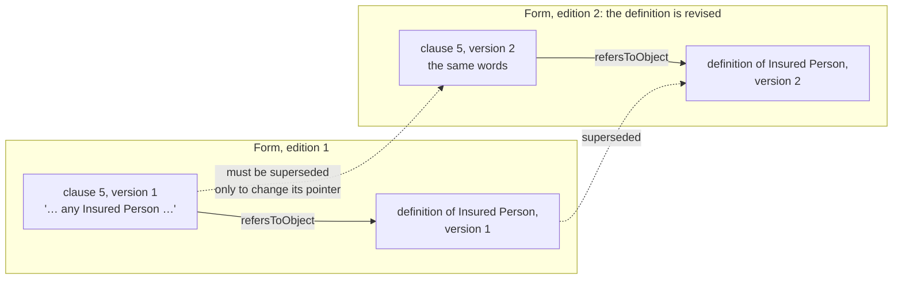

**Why this should change.** Naming a version inside a piece of text ties the text to one version of
everything it mentions:

1. **Revisions ripple.** When the definition of Insured Person is revised, every clause that mentions
   it must become a new version, though its own words have not changed, only so that its pointer
   moves. Those new versions have new hashes, so the stated meaning they carry is restated (D2's
   reuse is lost), and every form and instrument including them changes.
2. **Reuse breaks.** A clause written once for a library, "repay within [days] Business Days", cannot
   be placed in a second form whose schedule declares its own version of the days variable: the
   clause's text points at the first form's variable version, so the second form needs its own
   copy of the clause.
3. **Text and meaning disagree.** Since C8, the clause's stated meaning names the variable by
   identity (`ins:valueFrom`), and resolves it within whichever wording holds the clause. Its text
   still names one version. The two can point at different versions of the same variable.
4. **Outside documents are ambiguous.** "In accordance with the Data Protection Regulation" is a
   single node today. It does not say whether the clause means the Regulation as in force when the
   agreement was signed (a **static** reference) or as amended from time to time (an **ambulatory**
   reference), a distinction contract law draws and drafters state.

InsurML met the first two problems and resolves a reference by identifier, within the contract's
scope, to whichever version the contract includes (bridge §11). The pattern is a lockfile's: source
code names a package, and the lockfile pins its version. Here the text names an identity, and the
wording that includes the text pins the version.

**Questions, with each option's consequences:**

- **C8b-Q1. What a reference names.**

  The options, pictured for a clause mentioning a definition and citing a regulation:

  ```mermaid
  flowchart LR
      subgraph A["(a) Every reference names a version: today"]
          A1["clause"] -- "refers to" --> A2["definition, version 1"]
          A1 -- "refers to" --> A3["the Regulation<br/>(no edition)"]
      end
      subgraph B["(b) Internal references name an identity, external as today"]
          B1["clause"] -- "refers to" --> B2["the definition's identity"]
          B1 -- "refers to" --> B3["the Regulation<br/>(no edition)"]
          BW["the wording"] -- "includes" --> B4["definition, version 1"]
          B4 -- "hasIdentity" --> B2
      end
      subgraph C["(c) Every reference names an identity, and something else fixes the version"]
          C1["clause"] -- "refers to" --> C2["the definition's identity"]
          C1 -- "refers to" --> C3["the Regulation's identity"]
          CW["the wording"] -- "includes" --> C4["definition, version 1"]
          C4 -- "hasIdentity" --> C2
          CW -- "relies on, static" --> C5["the Regulation,<br/>2026 edition"]
          C5 -- "hasIdentity" --> C3
      end
  ```

  - **(a) Keep versions in every reference.** Nothing changes.
    - Every revision of a definition or a schedule forces new versions of every clause mentioning
      it, and of everything including those clauses (problem 1).
    - A library clause cannot be reused under another schedule (problem 2).
    - A clause's text and its stated meaning can name different versions of one variable
      (problem 3).
    - Outside documents stay ambiguous (problem 4).
    - Costs nothing now.
  - **(b) Internal references name an identity, external references stay as they are.** The wording
    pins internal versions by inclusion.
    - Solves problems 1 to 3.
    - Leaves problem 4: a regulation is still one node, neither static nor ambulatory.
    - Two rules for one property: a reader of `wrd:refersToObject` must know which kind of target
      it has to know whether it names an identity or a document. Less error-prone than letting
      drafters choose, but still two meanings for one link.
    - Breaking at 0.x (ADR-A113): six examples, about 14 references, migrate. Wording 0.7.0,
      Instrument re-pinned.
  - **(c) Every reference names an identity, and the version is fixed elsewhere.** Inside the
    wording, the wording's inclusion fixes the version, as in (b). Outside, an external document
    gains a persistent identity and editions (Foundation's identity and version, as every LATTICE
    record already uses), and the wording states which edition it relies on:
    - **static**: a named edition, "the Regulation as in force on 1 January 2027", fixed when the
      wording is assembled
    - **ambulatory**: "as amended from time to time", no edition fixed. The edition is whichever is
      in force at the time a case is evaluated, which makes it a value the evaluation context
      supplies (C12), as Quantification's context values do (ADR-A115)

    Consequences:
    - Solves all four problems, with one rule: a reference names what it refers to, never which
      version. The version comes from the wording, for internal targets, or from the wording's
      stated reliance, for external ones.
    - A document object, an attachment to this contract, is part of what the parties agreed, so it
      is pinned like internal text, by the wording relying on one edition of it.
    - New model in Wording: identities and editions for linked documents, and a reliance from a
      wording to an external document, static or ambulatory. Its shapes: every external
      reference has exactly one reliance in the wording holding it.
    - Ambulatory references reach the evaluator: an edition chosen at evaluation time is a
      runtime value, and C12 and C13 must supply it. Until then an ambulatory reference is stated
      and not resolved, which is honest, since its edition is not known at design time.
    - Breaking at 0.x: the same six examples, plus the two outside documents they cite. Wording
      0.7.0, Instrument re-pinned. More work than (b): about twice the model and the shapes.
  - **(d) Let each reference name either a version or an identity.**
    - Solves the problems only where the drafter chooses identity, and adds a fifth: two forms of
      one link, which readers, shapes and the binder must all handle, and which drafters will mix.
    - Additive, with no migration.

  **Leaning: (c).** It is the only option that gives a reference one meaning, and it settles a real
  ambiguity in how contracts cite outside law, which (a) and (b) leave in place. (b) is a smaller
  step that solves the three internal problems and leaves the external one for later.

- **C8b-Q2. How a reference finds its version, and whether that is stored.** Under (b) or (c), a
  reference names an identity, so something must find the version it means. That is a matter of
  looking at what the wording holds:

  ```mermaid
  flowchart LR
      R["text part<br/>refers to the definition's identity"] --> ID["identity"]
      subgraph FORM["In a form"]
          FV["the version the form comprises"]
      end
      subgraph INST["In an assembled wording"]
          IV["the version it includes,<br/>or, for a variable, the version an included element declares"]
      end
      ID -. "resolved within" .-> FV
      ID -. "resolved within" .-> IV
  ```

  - **(a) Derive it, and check it with a shape.** A new law, W8: within a form, and within an
    assembled wording, every reference by identity finds exactly one version. None means the text
    mentions something the wording does not hold. Two means the wording holds two versions of one
    thing, which W3 and W5 already rule out for elements.
    - Nothing stored per instance. Anyone can resolve it from the graph: a shape, the binder, a
      future renderer.
    - Resolution costs a lookup per reference, each time it is needed. A renderer would cache it
      per assembled wording, which many instances share.
  - **(b) Store it.** The assembler writes a resolution record per reference per assembled wording
    (the assembly interface sketch's H5).
    - Stored per instance, one record per reference: repeating what the inclusion list already
      determines, against D1.
    - Shows which resolution policy ran, which matters only if a policy could choose something the
      graph does not determine. None is known: InsurML's scope rule resolves exactly as (a) does.

  **Leaning: (a).** H5's record stays available to the assembly interface (IMA-4.1), should a policy
  appear that the graph cannot determine.

- **C8b-Q3. Display text.** A reference shows text: "**Insured Persons**" for the definition of
  "Insured Person", "the **Lender's**" for "Lender", or a variable shown by its printed name. When
  the reference names an identity, the words shown at that point need a home.
  - **(a) An optional literal on the referring text part** (`wrd:displayText`), holding the words as
    the drafter wrote them.
    - Every inflection is right, because it is written, not computed.
    - Part of the element version, so shared by hash, and nothing per instance.
    - If the definition's own label changes, the clause keeps its words, which is what its text says.
  - **(b) None: a renderer shows the target's label.**
    - Wrong for every inflected form: "Insured Person" where the text says "Insured Persons".
  - **(c) Inflection rules.**
    - Right where a rule exists, for each language, and a rule set to maintain.

  **Leaning: (a).**

- **C8b-Q4. Code.** The C8 binder already finds a variable's version from its identity.
  - **(a) Shapes for W8, and the binder's lookup extended to forms.** No new module. There is no
    renderer yet.
  - **(b) A shared reference resolver in `tools/`**, used by the binder and a future renderer.
    - Ready for a renderer, at the cost of a module and its tests before anything needs it.

  **Leaning: (a).** The assembly interface's `render` (IMA-4.1) can lift the lookup into a module
  when it exists.

**Answered 2026-10-06:** C8b-Q1 (c), every reference names an identity and the
version is fixed elsewhere. C8b-Q2 (a), derived and checked, with (b)'s record available if a
policy ever needs it. C8b-Q3 (a). C8b-Q4 (a).

**Decided by precedent, not asked:**

- the change is breaking at 0.x under ADR-A113, so Wording 0.6.0 → 0.7.0 and Instrument 0.13.0 →
  0.14.0 re-pinned. C9 then takes Instrument 0.15.0
- examples are domain-neutral, from at least three domains
- the insurml-alignment lift writes references by identity, with no resolution records (IMA-D8)

**What C8b builds:**

| Layer | Adds |
|---|---|
| Wording 0.6.0 → 0.7.0 (breaking) | `wrd:refersToObject`, `wrd:refersToVariable` and `wrd:linksTo` naming persistent identities. Linked documents with persistent identities and editions (Foundation's identity and version). A wording's reliance on an outside document: static, naming one edition, or ambulatory, naming none. `wrd:displayText`. Law W8: every internal reference resolves to exactly one version at each tier, and every external reference to exactly one reliance in the wording holding it. README sections and release notes |
| `wording-shapes` | W8, and the ranges of the three properties |
| Instrument 0.13.0 → 0.14.0 | re-pinned only |
| `tools/` | the binder's variable lookup accepting the form's tier |

1. **Examples first (ADR-A-C2):**

   | File | Shows |
   |---|---|
   | `ontology/wording/examples/facility-agreement.ttl`, `facility-form.ttl`, `trial-protocol.ttl` (reworked) | references to definitions and variables by identity |
   | `ontology/wording/examples/reused-clause.ttl` (new) | one clause version included in two forms whose schedules declare the same variable, unchanged. A definition revised without a new version of the clause mentioning it. An inflected reference with display text. A regulation cited statically, at one edition, and another cited as amended from time to time. An attachment pinned at one edition |
   | `ontology/instrument/examples/facility-parameters.ttl`, `framework-lots.ttl`, `services-schedule.ttl` (reworked) | text and stated meaning naming each variable the same way |

2. **Spec, vocab and shapes** as the table above.
3. **README:** references by identity, resolution at each tier, display text, W8, release notes.
4. **Tests:** `tools/test_wording.py` gains the rows below, which run in `check:ontology-catalog`.
   Work stops before any commit.

| ID | Given / When / Then | Level | +/- |
|---|---|---|---|
| C8b-01 | Wording's spec / parsed / `0.7.0`, the three properties' ranges, `wrd:displayText` | L1 | + |
| C8b-02 | every Wording and Instrument example / all layers' shapes / conform | L1 | + |
| C8b-03 | a reference to an element or a variable naming a version / shapes / reported | L1 | − |
| C8b-04 | an identity resolving to no version, or to two, in a form and in an assembled wording / W8 / each reported | L1 | − |
| C8b-05 | the reused clause / its two forms / one element version, its hash unchanged, each form resolving the variable to its own declaration | L1 | + |
| C8b-06 | a reference to an outside document with no reliance, or two, in the wording holding it / W8 / reported. A static reliance with no edition, an ambulatory one naming an edition / shapes / each reported | L1 | − |
| C8b-06a | a definition revised in a second edition of a form / the clause mentioning it / the same element version in both editions | L1 | + |
| C8b-07 | the binder over the reworked Instrument examples / output / unchanged from C8 | L1 | + |
| C8b-08 | Instrument / imports / Wording 0.7.0, and no file outside the catalog names Wording 0.6.0 | L1 | + |
| C8b-09 | both READMEs / literate checks / pass. Release notes for Wording 0.7.0 and Instrument 0.14.0 | L1 | + |
| C8b-10 | the existing tests, the version and catalog checks, the import guard, `build:mtp` and `check:mtp` / pass | L1 | + |

#### C9 in detail

**Machine:** R. **Branch:** created from `main` once this brief is on
`main` and its questions are answered, one branch per slice if C9 is split (C9-Q1). **Commits are
the maintainer's**, examples first (ADR-A-C2). Merged into `main` before release tags are created.
**Validation Packs:** [C9a](../validation/computable-contract-substrate-c9a.md). C9b's and C9c's are written
when each is briefed.
**Decisions:** ADR-A104 decisions 4, 11 and 16 and its addenda, ADR-A106 (records), ADR-A112 and its
references-by-identity addendum (reliance on outside documents), ADR-A85 (resolution by valid time),
CC-D10 and CC-D12.
**Inputs:** the CCS sketch §5.8 and scenarios S23, S40, S48, S50, S51, S53, S69, S90 and S99,
terms-in-time §8.6 and its endings E10 and E11, held design questions HQ-1 and HQ-5, the assembly
interface sketch's hook H13 (re-assembly after an amendment).

**Invariant:** what an instrument means changes only by an amendment that the instrument permits,
made by the parties it requires, and recorded with when it was agreed and when it takes effect.
Each version keeps the meaning it was agreed with. An instrument has no effect until it is formed,
and a document it incorporates means, within it, what the incorporation says.

**Setting the scene.**

An instrument is versioned (`fnd:Version`). Each of its versions is expressed in exactly one assembled
wording (law I1) and binds exactly the stated meaning of the element versions that wording includes
(law I17). Its bound meaning is generated (C8). Nothing else about an instrument changes, because no
term or relation is versioned (law I18).

The text side of change already exists. Wording C5 records an amendment's operations
(`wrd:Amendment`, insert, delete, replace, strike and substitute, append), each stated in a part of
an amending document and producing a new element version. `facility-amendment.ttl` changes three
clauses of a facility and assembles a second facility wording. Behaviour C11 has runtime records of
a party accepting a version (`bhv:AcceptanceRecord`), exercising a power (`bhv:ExerciseRecord`) and
acting (`bhv:ActRecord`), but Instrument imports only Behaviour's configuration, so none of these
is Instrument's to read (C9-Q2 choice 0).

The legal side is missing. Today the second facility wording exists, and nothing says:

- that a second instrument version is expressed in it, and that it replaced the first
- when the change was agreed, when it took effect, which may be earlier (a retrospective change),
  and whether it reaches occasions already arisen
- whose agreement made it: all parties, or a group exercising a power under a consent rule
  ("Majority Lenders", the lead insurer alone for a change that is not material)
- when the instrument took effect at all: on signature by every party, each signing separately (S90)
- what a document it incorporates by reference contributes, and at which edition

Today:

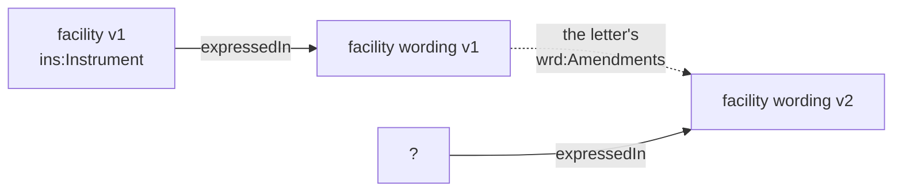

After C9:

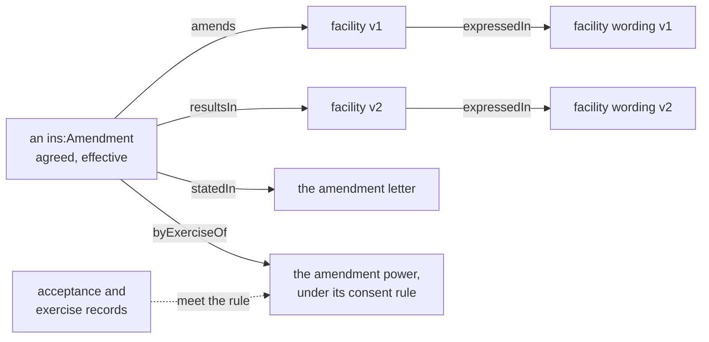

Three facts about the current model shape every option below:

1. **Versions are immutable.** A fact learned later, such as a retrospective effective date, cannot
   be written onto an existing version. It must sit on something new, such as the amendment.
2. **Eligibility cannot count.** A condition tests one case's attributes. It cannot say "every
   party has accepted" or "lenders whose commitments are more than two thirds of the total". Any
   rule over a set of parties is a construct of its own, evaluated by C12, or an Eligibility
   extension.
3. **References name identities since C8b**, and a wording's reliance fixes an outside document's
   edition, static or as amended. Incorporation by reference is a reliance with legal effect, so it
   should reuse that, never fix an edition a second way.

**Questions, with each option's consequences:**

Each option below is compared on its design overheads (how hard it is to reason about, to model
correctly, to assure and govern, and how brittle it is under change) and its runtime overheads (data
volume, inconsistency, and surprises for traversal or aggregation), then against KISS. Reworked on
2026-10-07 after the maintainer's review.

- **C9-Q1. One slice or several.** C9's row lists amendments, consent rules, incorporation and
  taking effect, plus S90 and the two endings terms-in-time left to C9. Its "shapes for I1 to I16"
  is stale, since C6 to C8 shipped those, and only I4, I10 and I14 remain, of which I10 and I14 are
  evaluated, not shaped. Counted from the questions below, C9 is about 26 test rows over Instrument,
  Wording and `tools/`, above the slice sizing rule's 15.
  - **(a) Three slices.** C9a, amendments, taking effect, and the two endings (Q2, Q5, Q6).
    C9b, powers held by groups and materiality (Q3, Q4), which an amendment by majority needs.
    C9c, incorporation (Q7, Q8). Materiality moved from C9a to C9b on 2026-10-07, beside the
    consent rules that read it.
    - Each about 8 to 10 rows, each with its own Validation Pack, releasing Instrument 0.15.0,
      0.16.0 and 0.17.0 in turn, and Wording 0.8.0 with C9c if Q7 (a) widens reliance.
    - C9a's examples amend by agreement of all parties, and C9b adds the majority case.
    - Estimated 1.5M to 2.5M tokens each, about 6M in all, to be checked against the actuals.
  - **(b) Two slices.** Amendments with consent rules, then incorporation with taking effect.
    - The first is about 16 rows, at the limit. Taking effect and incorporation share nothing.
  - **(c) One slice.**
    - One release and one review, of about 26 rows across three modules, which the sizing rule
      rejects.

  **Leaning: (a).** HQ-5, the full set of group behaviours, follows C9b as its own slice.

- **C9-Q2. What an amendment records.** Reworked again on 2026-10-07, after we pushed back
  on the order of events being assumed.

  **The model in brief**, as the leanings below would make it. An amendment is a node that exists
  from the moment it is proposed. It names the version it amends and the version it produces, and
  carries its effective date and when it was recorded. Parties' assents to a version are facts of
  their own (`ins:Assent`). An amendment is agreed when the assents it needs exist, and its agreed
  time is that of the last one. Formation works the same way for the first version, with a regime
  stating what the instrument does while it waits (C9-Q5). The picture under choice 0 shows all of
  it. Each choice below is one part of this model.

  **The events happen in any order.** Consider a system that authors terms, assembles them into
  contracts and manages each contract through its life. A party proposes an amendment. The system
  records it, finds that consent is needed, and waits. Consents arrive over days. When the last one
  needed arrives, the change is agreed, and it applies from the date it states, which may be before
  the proposal was even made:

  ```mermaid
  flowchart LR
      P["3 Feb<br/>proposal recorded<br/>v2 drafted"] --> C1["10 Feb<br/>lender A consents"]
      C1 --> C2["20 Feb, recorded 21 Feb<br/>lender B consents<br/>the rule is met: agreed"]
      C2 -. "applies from" .-> E["1 Jan<br/>effective date<br/>(retrospective)"]
  ```

  So the amendment is recorded before it is agreed, and takes effect before both. The model must
  not assume any order. Three of the times are settled, and the agreed time is choice 0:

  | Time | Held as |
  |---|---|
  | recorded, and by whom | the amendment's `fnd:hasEvidence`, its `fnd:recordedAt` and `fnd:assertedBy` |
  | effective | the amendment's `fnd:hasTemporalScope`, its `fnd:validFrom` |
  | before and after | `ins:amends ⊑ prov:used` and `ins:resultsIn ⊑ prov:generated`, as Wording's amendment does (C5-Q2b), and `fnd:supersededBy` asserted once agreed |

  *Choice 0. Where the agreed time, and the consents behind it, live.* The previous draft derived
  it from Behaviour's acceptance records (`bhv:AcceptanceRecord`). The maintainer's review rejected
  that, and the ontology bears it out. Instrument imports only Behaviour's configuration document,
  never its runtime document, and no Instrument term or shape reads a runtime record today. Behaviour
  models the states an instrument passes through. How an application takes in a proposal and
  collects consents is its own design, which a framework must not fix. The options:

  - **(a) Asserted on the amendment.** `prov:endedAtTime` gives the agreed time, added when the
    parties agree, with a second `fnd:Evidence` supporting it whose `fnd:recordedAt` is when the
    agreement became known. A pending amendment has none.
    - *Design.* One triple and one evidence node, and no dependency on how consent was gathered.
      LATTICE takes the application's word that the amendment was agreed, so a consent rule (C9b)
      is stated but never checked against anything, and a group power stays as undeterminable as it
      is today (CC-D10). Two evidence nodes on one amendment, one for the proposal and one for the
      agreement, are told apart only by what each supports, which Foundation's `fnd:supports` does
      not distinguish within one node.
    - *Runtime.* Nothing per party. "Pending" is the absence of `prov:endedAtTime`, which an
      open-world reader must treat as not known to be agreed, never as refused.
  - **(b) Assents as Instrument facts.** A new `ins:Assent` records one party's assent to one
    instrument version: who, which version, when (its valid time) and when it became known (its
    evidence). An amendment is agreed when the assents its rule needs exist: every party for an
    amendment by agreement (C9a), the consent rule for an amendment by exercise of a power (C9b).
    The agreed time is the valid time of the assent that completes the rule.
    - *Design.* One fact serves three needs: execution of the first version by each party
      (C9-Q5, S90), amendment by agreement, and consent to a group power's exercise (C9-Q4). It is
      Instrument's own, so a shape can check an amendment by agreement, and C12 a consent rule,
      without Behaviour. Any application may produce it, from a workflow engine, a signing service or
      a scanned signature page. It overlaps `bhv:AcceptanceRecord`, "a party's acceptance of a
      version". An application that uses Behaviour's runtime records the two separately or maps
      one to the other. The two stay separate because Instrument does not import the runtime
      (ADR-A106).
    - *Runtime.* One node per assenting party per version: forty for a forty-lender amendment, which
      is the information a consent rule must have anyway. "Agreed" is computed, cheap for every
      party, and a weighted sum for a threshold (C12).
  - **(c) Agreed amendments only.** Proposals, consents and pending states stay entirely in the
    application. An `ins:Amendment` is asserted only once agreed, with its agreed time as in (a).
    - *Design.* The smallest substrate. LATTICE never holds a pending amendment, so the order of
      events inside the application is the application's, and within LATTICE an amendment is always
      recorded after it is agreed. A consent rule is again unchecked. The draft new version still
      exists before agreement, as Wording drafts do (`fnd:Draft`).
    - *Runtime.* As (a).
  - *KISS.* (a) and (c) are smaller now. (b) is needed by C9b in any case if consent rules are to
    be checked, which is what C9b is for, and by C9-Q5 if execution is to be read without Behaviour.

  **Leaning: (b).** It keeps Behaviour out of the path, imposes no workflow on an application, and
  is the one fact formation, amendment and group consent all need. If the maintainer prefers to keep
  consent out of the substrate, (c) is the coherent alternative, accepting that C9b's consent rules
  then describe rather than decide.

  *How choice 0 (b) and C9-Q5 (b) fit together.* Added 2026-10-07, once we chose formation
  as a regime (C9-Q5 (b)) and asked whether an amendment needing consent can work the same way. It
  can. Formation and amendment ask one question, whether the assents a version needs exist, and
  differ only in whose assents count:

  | | Formation | Amendment by agreement | Amendment by a group power |
  |---|---|---|---|
  | version assented to | the first version | the new version | the new version |
  | whose assents count | every `ins:party`, or the parties the clause names | every `ins:party` | the members the consent rule selects, with its threshold (C9b) |
  | what completes it | the last required assent | the last required assent | the assent that meets the rule |
  | what follows | the formation regime enters the state that begins the instrument | the amendment is agreed, and applies from its effective date | the same |

  `ins:Assent` is the fact all three read, written by whatever the application uses to collect
  signatures or consents. A regime is how a clause states what happens around those assents:
  the state the instrument waits in, a long-stop date, a proposal lapsing if consent does not come in
  time. The regime reacts to assents. It never holds them.

  ```mermaid
  flowchart TB
      subgraph STATED["Stated once, in the form's clauses"]
          direction LR
          NE["formation regime<br/>state: not yet in effect"] -- "OnAcceptance<br/>every party has assented to the version" --> IF["state: in force<br/>ins:begins the instrument"]
          NE -- "OnExpiry<br/>at the long-stop date" --> TE["state: terminated<br/>ins:ends the instrument"]
          PW["power to amend<br/>held by the lenders<br/>consent rule: Majority Lenders"]
      end
      subgraph FACTS["Instrument facts, from any application"]
          direction LR
          V1["facility v1"]
          V2["facility v2"]
          A["ins:Amendment<br/>amends v1, resultsIn v2<br/>effective 1 Jan, recorded 3 Feb<br/>byExerciseOf the power"]
          S0["ins:Assent ×3<br/>borrower, lenders X and Y<br/>to v1"]
          S1["ins:Assent<br/>lender X to v2, 10 Feb"]
          S2["ins:Assent<br/>lender Y to v2, 20 Feb"]
          A -- "amends" --> V1
          A -- "resultsIn" --> V2
      end
      S0 -. "completes" .-> IF
      S1 & S2 -. "meet the rule:<br/>agreed 20 Feb" .-> PW
      PW -. "decides" .-> A
  ```

  Read in time order, for the facility:

  ```mermaid
  flowchart LR
      E1["1 Oct<br/>borrower assents to v1"] --> E2["2 Oct<br/>lenders X and Y assent to v1<br/>formation complete: in force"]
      E2 --> E3["3 Feb<br/>amendment A proposed<br/>v2 drafted, effective 1 Jan"]
      E3 --> E4["10 Feb<br/>lender X assents to v2"]
      E4 --> E5["20 Feb<br/>lender Y assents to v2<br/>Majority Lenders met: A agreed"]
      E5 -. "applies from" .-> E6["1 Jan<br/>v2 in force, retrospectively"]
  ```

  Consequences of the pair:

  - **Behaviour stays where it belongs.** Behaviour holds the formation regime's states and their
    runtime occupancies, which is the instrument's own state machine. It holds no assent and no
    consent. An application without Behaviour's runtime still writes assents, and LATTICE can still
    say whether an amendment is agreed.
  - **The agreed time has one source.** It is the valid time of the completing assent. Where a
    clause also states a regime reacting to it, the regime's trigger fires on that same assent, so the
    two cannot disagree.
  - **A per-amendment regime is optional,** and not in C9a. A clause that makes a proposal lapse
    after 30 days without consent needs a regime that runs once for each amendment proposed under
    the power, as `bhv:perOccasionOf` runs one for each occasion of a relation. Its subject is the
    amendment, which `bhv:forSubject` allows, since it has no range. That way of scoping a regime is
    new, and belongs with C9b's consent rules.
  - **The operational time is a different thing.** It is when a system may act on a change before
    its legal effect, such as loading a new rate early. It is neither the agreed nor the effective
    time, and stays out of the substrate.
  - **An amendment by agreement needs no power in the instrument.** Its rule is fixed: every party.
    C9b's consent rules apply only where a clause gives a power.

  Whichever is chosen, the new version's governance state is about its text's review, not its legal
  effect, and nothing is edited when an amendment becomes agreed. This drops the sketch's
  `ins:agreedOn`, `ins:operationalFrom` and `ins:effectiveFrom`.

  *Choice 1. Where the effective time sits.*
  - **(a) On the amendment only.** A version's valid period is read from the agreed amendments
    that made and replaced it.
    - *Design.* Versions are never edited, and each fact has one home, whatever order the facts
      arrive in. The first version has no amendment, so its start is the instrument entering the
      state that begins it (Q5), a runtime fact. Several proposals against one version may be
      pending at once. A shape allows at most one **agreed** amendment per version, so a fork among
      agreed changes is caught.
    - *Runtime.* "Which version applied at valid time *t*, as known at *k*" walks the agreed chain
      (C12), filtering by the acceptance records known at *k*. A portfolio query ("every limit in
      force on 1 March") walks every instrument's chain, which surprises a SPARQL author expecting a
      date on each version. A generated view of each version's valid period, derived and never
      authored, gives that query a filter.
  - **(b) A temporal scope on each version.**
    - *Design.* A retrospective amendment must shorten the replaced version's period after the
      fact, which edits an immutable version (ADR-A104's versioning contract). Two versions' authored
      periods can overlap or leave gaps, with nothing to say which is right.
    - *Runtime.* A plain date filter. (a)'s generated view gives the same.
  - *KISS.* (a) adds nothing beyond the amendment.

  **Leaning: (a),** which we accepted provided the events may come in any order. The table
  above is how they may.

  *Choice 1, continued. A retrospective change that overtakes a later one.* Each version's wording
  holds every agreed change so far. The case to handle:

  - v1 is in force from 1 October
  - amendment A is agreed on 1 February, effective 1 March, giving v2 = v1 + A
  - amendment B is agreed on 1 April, effective 1 January, so B **overtakes** A

  Known as at April, the contract read v1 from October, v1 + B from January, and v1 + A + B from
  March. The version v1 + B was never assembled, because when A was agreed nobody knew of B.

  - **(i) Forbid it, and the author restates.** A shape refuses an amendment taking effect before
    the effective date of the amendment that made the version it amends. To record B, the author
    enters B1 on v1 (effective January), then restates A on top of it as A′ (effective March).

    ```mermaid
    flowchart LR
        V1["v1<br/>from Oct"] -- "A, agreed Feb<br/>effective Mar" --> V2["v2 = v1+A<br/>believed Feb to Apr"]
        V1 -- "B1, effective Jan" --> V1B["v1+B<br/>Jan to Mar"]
        V1B -- "A′, a restatement of A<br/>effective Mar" --> V3["v1+A+B<br/>from Mar"]
    ```

  - **(ii) The amendment rebases.** B is one amendment, resulting in every version it changes, v1 + B
    and v1 + A + B.

    ```mermaid
    flowchart LR
        V1["v1<br/>from Oct"] -- "A, agreed Feb<br/>effective Mar" --> V2["v2 = v1+A<br/>believed Feb to Apr"]
        V1 -- "B resultsIn" --> V1B["v1+B<br/>Jan to Mar"]
        V2 -- "B resultsIn" --> V3["v1+A+B<br/>from Mar"]
    ```

  - **(iii) Record what was agreed, and derive the overtaken window.** The authored chain follows
    agreement: v1, then A gives v2, then B gives v3 = v1 + A + B, in force from March, the latest of
    its changes' dates. A shape reports that B overtakes A, so the window from January to March is
    held by no version. The version for that window, v1 + B, is derived when asked for, by
    replaying B's text changes on v1's wording, as bound meaning is generated on demand (D4, C16b),
    and kept as a derived artefact (ADR-A92).

    ```mermaid
    flowchart LR
        V1["v1<br/>from Oct"] -- "A, agreed Feb<br/>effective Mar" --> V2["v2 = v1+A"]
        V2 -- "B, agreed Apr<br/>effective Jan" --> V3["v3 = v1+A+B<br/>from Mar"]
        V1 -. "derived on demand:<br/>B replayed on v1" .-> D["v1+B<br/>Jan to Mar"]
    ```

  **Costs, walked through.** Counting instrument versions, their assembled wordings and the
  amendment nodes, the plain case of two amendments with no overtaking is 3 + 3 + 2 = 8 nodes.

  | | (i) forbid and restate | (ii) rebase | (iii) record and derive |
  |---|---|---|---|
  | authored nodes in the example | 4 + 4 + 3 = 11 | 4 + 4 + 2 = 10 | 3 + 3 + 2 = 8 |
  | derived nodes | none | none | 2 (v1 + B and its wording), only when the window is read |
  | per overtaking amendment that overtakes *m* later ones | *m* more versions, wordings and restated amendments, authored | *m* more versions and wordings, authored | none authored, up to *m* derived on demand |
  | the record of what was agreed | two amendments for one agreement, and A′ an agreement nobody made | one amendment per agreement | one amendment per agreement |
  | shape of the version graph | a tree: v1 has two agreed successors, and v2 is a dead branch from April | a tree, the same | one chain in agreement order |
  | finding the version at (*t*, *k*) | choose a branch by knowledge time, which needs a further link saying v1 + A + B replaces v2 from April | the same branch choice, and each version's period computed from two amendments' dates | walk the one chain known at *k*. If the amendments effective by *t* are a prefix of it, that version applies. Otherwise derive the slice |
  | B also changes text that A changed | the author resolves it when writing B1 | the author resolves it in B's second result | replaying B on v1 fails, which is reported, and the author then records the slice as in (i) |
  | new machinery | none beyond the shape | a non-functional `ins:resultsIn`, and every chain reader handling branches | the shape, and a replayer of Wording's text operations, which does not exist yet |

  In short, (i) and (ii) store the corrected history as authored data, and pay for it with a tree
  every reader must navigate and, in (i), an invented agreement. (iii) stores only what was agreed,
  keeps one chain, and moves the cost to generation, which is where D4 and C16b already put bound
  meaning. Its one gap is the replayer, and until it exists the overtaken window can be reported as
  not held, so an evaluation inside it is Undetermined rather than wrong.

  *KISS.* The overtaking case is rare and absent from C9a's examples. (iii)'s authored model is the
  plain chain C9a builds anyway, plus one warning shape. The replayer can wait for C16b, which
  generates on demand already.

  **Leaning: (iii),** revised from (i). C9a builds the chain and the warning, and the replayer joins
  C16b. Until then the window is reported, never silently read from the wrong version.

  *Choice 2. How the amendment reaches its text changes.* Wording C5 already links each text change
  to the part of the amending document that states it (`wrd:expressedIn`). The sketch, written
  before C5, gave the legal amendment a second link to each text change (`ins:textChanges`). The
  picture uses `facility-amendment.ttl`, where a letter of three paragraphs makes three changes and
  a later confirmation restates one of them:

  (a) The amendment names the documents:

  ```mermaid
  flowchart LR
      subgraph L["the letter"]
          P1["para 1"]
          P2["para 2"]
          P3["para 3"]
      end
      IA["ins:Amendment"] -- "statedIn" --> L
      IA -- "statedIn" --> CF["the confirmation"]
      R1["replace 5.2"] -- "expressedIn" --> P1
      S1["strike 5.1"] -- "expressedIn" --> P2
      AP["append 12.2"] -- "expressedIn" --> P3
      S2["strike 5.1 again"] -- "expressedIn" --> CF
  ```

  (b) The amendment names each text change, as the sketch has it:

  ```mermaid
  flowchart LR
      IB["ins:Amendment"] -- "textChanges" --> R1["replace 5.2"] & S1["strike 5.1"] & AP["append 12.2"] & S2["strike 5.1 again"]
      R1 -- "expressedIn" --> P1["para 1"]
      S2 -- "expressedIn" --> CF["the confirmation"]
  ```

  (c) No link. The text changes are found through what the new version includes:

  ```mermaid
  flowchart LR
      IC["ins:Amendment"] -- "resultsIn" --> V2["v2"]
      V2 -- "expressedIn" --> W2["v2's wording"]
      W2 -- "includes" --> E["new clause 5.1"]
      S1["strike 5.1"] -- "generated" --> E
  ```

  - **(a) The amendment names where it is stated** (`ins:statedIn`), the amending document or a part
    of it. Its text changes are the `wrd:Amendment`s expressed in that node or below it.
    - *Design.* The document is what the parties sign and accept, so naming it records the legal
      act's evidence, not only its effect. Text changes keep the one link Wording gave them. A change
      of values or of a party, with no text operation, still has its document. One letter making
      two amendments with different effective dates needs each in its own part, and a shape cannot
      tell when a single paragraph mixes them.
    - *Runtime.* Two links in the example. Finding the text changes walks down the document's
      parts, a short traversal.
  - **(b) The amendment names each text change** (`ins:textChanges`).
    - *Design.* Divides any document exactly, even one paragraph making two amendments. It repeats
      `wrd:expressedIn`, so the two can disagree, and it records neither the document the parties
      signed nor anything for a change of values.
    - *Runtime.* Four links in the example, one per operation, read directly.
  - **(c) No link.** The text changes are the ones that generated an element the new version
    includes and the old one does not.
    - *Design.* Nothing to author, and right in this example. Wrong in general: a deletion generates
      nothing, and the element it deletes is often a form's, shared by every contract drawn from the
      form, so another contract's deletion of the same clause would be found too. Ruled out under
      the rule that derivable in the examples is not derivable in general.
    - *Runtime.* A join across both versions' inclusions for every reading.
  - *KISS.* (a) is the smallest that is right in general.

  **Why deviate from the sketch.** The sketch's `ins:textChanges` predates C5, and C5 gave each text
  change its link to its document. With that link in place, (b) repeats it, and the document the
  parties signed, which (a) names, would otherwise have no link from the amendment at all.

  **Leaning: (a).**

- **C9-Q3. Materiality.** Decided in the [change materiality sketch](../sketches/change-materiality.md)
  (MQ1 to MQ7, 2026-10-07). No consent rule and no meaning of "material" is a default. Materiality
  comes from the contract's own definition, then a definition it refers to and LATTICE holds, then a
  determination. A definition is a condition word whose case is the amendment, read through a
  materialised change report, and bound from the version being amended (MQ2, MQ3). Its outcome is a
  grade from a scheme a deployment binds, with a two-concept baseline and grades ordered as a chain
  of narrower concepts (MQ4). A mixed definition is computed first, and its decider is asked only
  when the computed part does not settle it, and is otherwise notified of the result (MQ6). Where
  the contract names no decider, an Instrument evaluation profile holds the deployment's fallback
  (MQ5). A definition naming a clause falls back to a determination until Eligibility's paths may
  end at an identity (MQ7, HQ-9). Builds in C9b, beside the consent rules that read it (C9-Q4).

- **C9-Q4. Powers held by groups** (C9b). Today a power held by a group is Undetermined (CC-D10).
  "The Majority Lenders may waive any Default" is one power, held by the lenders as a group, which
  takes effect when lenders whose commitments exceed two thirds of the total consent.
  - **(a) A consent rule on the power** (`ins:ConsentRule`). It states who must consent for each
    exercise, chosen by role, by being affected by the change, or by the change's grade (C9-Q3),
    and an optional threshold over a weight per member. Each member's consent is an assent to
    the resulting version, held as C9-Q2 choice 0 decides. Delegated consent is a `pty:Delegation`.
    - *Design.* One class, on the power that needs it. The weight ("its Commitment") is a value of
      the instance read for each member, so a weight that changes, such as a commitment after a
      transfer, is read from the version in force at the exercise. Counting is Instrument's,
      evaluated by C12 (law I10), since Eligibility cannot count. Being affected is read from the
      change report: a member whose relations the change alters. A group power with no rule stays
      Undetermined, and HQ-5 follows for "any one may act" and the rest.
    - *Runtime.* One acceptance record per consenting member per exercise, forty for a syndicate of
      forty. The sum must count members, not records, or a member who consents twice, or a delegate
      consenting for several members, is counted wrongly, and a withdrawn consent must be read as
      a later record. A missing weight makes the outcome Undetermined, not a smaller sum.
    - *KISS.* Needed for C9b's examples. Smallest construct that states a threshold.
  - **(b) Widen Party's composition rules to acting rules for powers**, with the consent rule only
    for what varies per exercise.
    - *Design.* Takes most of HQ-5 into C9. Party changes, cascading to every layer and Open CBAA.
      A rule that varies by grade still needs (a), so there are two mechanisms for one exercise.
    - *Runtime.* As (a).
    - *KISS.* More than C9 needs.
  - **(c) Each member holds its own power, and the group's exercise is a trigger on the members'
    exercises.**
    - *Design.* A trigger that counts, which Eligibility cannot express, and the group's single
      exercise disappears from the record.
    - *Runtime.* One power per member per group power: forty powers where there was one, in every
      bound instrument.

  **Leaning: (a).** Materiality (C9-Q3) builds with it in C9b, since the consent rule is what reads
  it.

- **C9-Q5. Taking effect, and separate execution** (S40, S90). §14.7 describes an instrument whose
  obligations wait on conditions as starting in a conditional state, and no example builds it.
  Most contracts take effect on signature by every party, each signing separately.
  - **(a) `ins:takesEffectWhen` on the instrument**, read by C12. Nothing arises before it holds.
    - *Design.* One triple, and a second gate beside regimes, so the evaluator checks two places
      before a relation may arise. "Every party has signed" is not an Eligibility condition, so its
      value needs a construct of its own. A long-stop date for signature needs a regime regardless,
      and the two must then agree.
    - *Runtime.* One triple per instrument.
  - **(b) Formation as a regime.** `ins:begins`, the counterpart of `ins:ends` (§14.2), names the
    state whose entry brings the instrument, or named terms, into effect. Before it, nothing arises
    and no gate is open. A new legal trigger, `ins:OnAcceptance`, fires when every named party, or
    every `ins:party`, has assented to the version, one assent per party signing (S90), held as
    C9-Q2 choice 0 decides, never as a Behaviour runtime record. Conditions precedent and long-stop dates use the same regime. The regime is stated in a
    clause, or implied by law (`ins:impliedBy`) where none is written. An instrument with no
    `ins:begins` takes effect at once.
    - *Design.* One mechanism for all of §14.7, learned once with `ins:ends`. A shape allows at most
      one state marked `ins:begins` per instrument. The risk is an author omitting `ins:begins`
      where a clause makes effect conditional, which a coverage check on the clause can report.
      `ins:OnAcceptance` reads assents, as amendment consent does (C9-Q4), so formation and consent
      share one fact.
    - *Runtime.* A regime is stated once on the form and shared by every instrument including its
      clause (§11.1), so nothing is copied per instrument. Each instrument has one occupancy at
      runtime, and one acceptance record per party.
  - **(c) Both, with (a) as shorthand the instantiator expands into (b).**
    - *Design.* Two ways to say one thing, and expansion code to keep in step.
  - *KISS.* (b) adds one property and one trigger, and makes an existing documented design real.

  **Leaning: (b).**

- **C9-Q6. A party leaving, and ending by agreement** (terms-in-time E10 and E11).
  - **(a) Both are amendments.** A party leaving is a new version without it. Ending by agreement is
    an amendment that adds an expiry at the agreed date, as a termination agreement is often
    drafted ("this Agreement shall terminate on 30 June"), so the ending is a regime's transition,
    as §14.2 requires.
    - *Design.* No new construct. The leaving party's arisen occasions keep their parties (law I11),
      so its accrued rights stay. Every ending still reads as entering an ending state.
    - *Runtime.* One new version per departure or termination.
  - **(b) A separate instrument, a release, that discharges the first** (`ins:discharges`).
    - *Design.* Closer to some legal analyses. A second way to end an instrument, outside regimes,
      which every reader of "is it in force" must also check.
    - *Runtime.* One more instrument per release.
  - *KISS.* (a).

  **Leaning: (a).**

- **C9-Q7. What incorporation names** (C9c, S53, S99). "The Supplier's Code of Conduct, as amended
  from time to time, is incorporated into this Agreement", or "the Standard Terms 2026 apply to
  Lot 2".
  - **(a) Stated in the words, as C8b decided.** The incorporating clause names the document's
    identity, and the wording's reliance fixes the edition. Instrument adds `ins:incorporates` on the
    clause's stated term. An encoded document's stated meaning is generated into the instrument
    within the sections the incorporating term applies within (S99), and law I17 widens to
    "includes or incorporates". An opaque document generates nothing.
    - *Design.* One place fixes the edition. Wording's reliance widens from outside documents to
      wordings, an additive Wording 0.8.0, and W8 learns to resolve a reference to a wording's
      identity, which it does not check today. Two new rules follow. Incorporation can loop (A
      incorporates B, which incorporates A), so the cycle checks extend to it. And the host's and
      the incorporated document's definitions overlap, where contracts usually say the host
      prevails (S70), so `ins:prevailsOver` must reach a whole document's definitions.
    - *Runtime.* A set of standard terms incorporated into ten thousand contracts generates its
      meaning ten thousand times, unless generation is shared (D5) and bound meaning stays
      generated on demand (C16b). Until C16b, the examples stay small.
  - **(b) `ins:incorporates` on the instrument, naming an instrument, a wording or an element
    version**, as sketched before C8b.
    - *Design.* Two places say which edition, the reliance and the incorporation, and nothing stops
      them disagreeing.
    - *Runtime.* As (a).
  - **(c) Copy the text in by transclusion** (insurml-alignment IMA-3.1).
    - *Design.* Incorporation by reference is not copying, since the document stays separate and may
      change. Transclusion waits for C9, so this is circular.
  - *KISS.* (a) reuses C8b.

  **Leaning: (a).**

- **C9-Q8. An encoded document incorporated as amended.** A static incorporation has one edition,
  so its meaning is fixed. An ambulatory one changes when the document does.
  - **(a) Each new edition reaches the instrument by an amendment.** Where a party may vary the
    document (S53), the variation is an exercise of a power, and the amendment yields a new
    instrument version binding the new edition.
    - *Design.* Laws I17 and I18 stay exact, since a version's meaning never moves. But the wording
      is unchanged, because an ambulatory reliance names an identity, so the new version must pin
      the edition it binds itself, a per-version record (`ins:incorporatesEdition`) that C8b avoided
      for text. Someone must start the amendments when an edition is published.
    - *Runtime.* A fan-out. One document incorporated into ten thousand instruments, revised four
      times a year, is forty thousand amendments and versions a year, each small but each a
      version to govern and query.
  - **(b) Resolved for each occasion at its valid time,** with a record, as ADR-A85 resolves scheme
    bindings.
    - *Design.* Law I18 is restated, since one version's meaning then moves over time, and
      design-time shapes over a version cannot check meaning from editions not yet published.
    - *Runtime.* No fan-out. One resolution, and one record, per occasion that reads the document.
  - **(c) Static only in C9.** An ambulatory incorporation of an encoded document is reported, and
    its meaning not generated, until a slice decides between (a) and (b) with an example that needs
    it.
    - *Design.* Honest about what is not modelled. Open CBAA's Underwriting Instructions (S53) wait.
    - *Runtime.* Nothing.
  - *KISS.* (c) now. Both (a) and (b) have real costs, and the choice is better made with S53's
    volumes in view.

  **Leaning: (c),** revised from (a) on finding (a)'s per-version pin and fan-out. Documents
  outside the parties' control, such as legislation, stay with the normative rule substrate in
  any case.

- **C9-Q9. Instruments without wording** (HQ-1). HQ-1 is due "no later than C9".
  - **(a) Re-time it** to before an applied layer ingests proposals (AIR Phase 5,
    insurml-alignment Phase 5).
    - *Design.* Nothing in C9 needs it. An instrument made under a power, such as a call-off, still
      has its own wording. The decision is made when a real ingestion path shows what proposals
      carry.
    - *Runtime.* Nothing.
  - **(b) Decide it in C9**, by HQ-1's option (a), ingestion producing wording elements.
    - *Design.* Adds an ingestion path to slices about change, and decides it without an ingestion
      example.

  **Leaning: (a).**

- **C9-Q10. The word "binder".** C8 named its generator `tools/instrument_binder.py`, and ADR-A104's
  and ADR-A112's addenda and the Instrument README call it "the reference binder". "Binder" is a
  market word, and the governing instructions name the operation instantiation and the component an
  instantiator.
  - **(a) Rename before C9**, on `main` in one change: `tools/instrument_instantiator.py`, its
    tests, the two addenda, the Instrument README and the open plan sections. Closed Validation
    Packs and history keep the old name.
    - *Design.* A mechanical change, reviewed on its own. No ontology changes, so no release.
  - **(b) Rename as C9a's first commit.**
    - *Design.* Mixes a rename into a design slice's review.

  **Leaning: (a).**

**Answered 2026-10-07 and 2026-10-08:**

- C9-Q1 (a), three slices, C9a to C9c.
- C9-Q2 choice 0 (b), assents as Instrument facts (`ins:Assent`), after the case for deciding
  consent across placement, quote to bind, endorsements, binding authorities, claims and
  reinsurance recoveries. Choice 1 (a), the effective time on the amendment only, the events in any
  order. The overtaking rule (iii), record what was agreed and derive the overtaken window, **accepted
  for now and to be revisited at C16b**. Our concern is that derived nodes put a burden on
  every implementor to write code that exists only because of a modelling choice. Choice 2 (a),
  `ins:statedIn`.
- C9-Q3 decided through the [change materiality sketch](../sketches/change-materiality.md)
  (MQ1 to MQ7), with held questions HQ-8 to HQ-10.
- C9-Q4 (a), a consent rule on the power. C9-Q5 (b), formation as a regime, reading assents.
  C9-Q6 (a), a party leaving and ending by agreement are amendments. C9-Q7 (a), incorporation
  stated in the words, reusing C8b's reliance.
- C9-Q8 (c), static incorporation only, deferred to HQ-11 with S53's volumes in view.
- C9-Q9 (a), HQ-1 re-timed to before an applied layer ingests proposals.
- C9-Q10 (a), "binder" renamed "instantiator" on `main` before C9a's branch.

**Insurance examples, by explicit instruction (2026-10-08).** This instruction asks that
C9 model insurance specifics. In C9's examples, in this slice or a subsequent one, show:

1. **Endorsement and mid-term adjustment** (C9a), replacing a subscription placement by our
   choice on 2026-10-08. A policy's cover extended mid-term by endorsement, effective before
   the insurer agrees it, and whether the endorsement is in force on the date of a loss, as known
   when the loss is notified and as known later
2. **Reinsurance recoveries** (C9b). A reinsurer whose approval of the reinsured's claim settlement
   is a condition precedent to its liability, so that whether a recovery is due turns on that
   consent

As examples always do, each invents its own model, and the README's narrative and diagrams walk
through the industry's nuances. They stand beside the domain-neutral examples, not in place of them.
A reinsurer's consent is to an act, the settlement, not to a version, so C9b's brief must say whether
`ins:Assent` may name an exercise as well as a version. A subscription placement waits for C9a-Q1's
question to be taken up (below).

**Raised in C9a's examples phase (2026-10-08):**

- **C9a-Q1. Each insurer bound from its own assent.** Withdrawn 2026-10-08, who chose
  not to resolve it in C9. The subscription placement example is replaced in C9a by an endorsement
  and mid-term adjustment, showing whether an endorsement is in force on the date of a loss. A
  placement, and how each subscribing insurer is bound from its own assent, waits for a later slice,
  with HQ-7. The options recorded here, a formation regime run per party, one instrument per
  insurer, or a new group version per attachment, stand as its starting point.

**Decided by precedent, not asked:**

- an amendment to one instrument, an endorsement, leaves its form untouched (C5). An existing
  instrument reaches a new form edition only by an amendment, since its version's wording is fixed
  (laws I1 and I17)
- every change is a re-assembly, a new assembled wording through the assembly interface's hook H13,
  never an edit of the old one
- a correction is not an amendment (law I18)
- releases are MINOR and breaking where a range or shape tightens (ADR-A113)
- examples are domain-neutral, from at least three domains: a syndicated facility (majority
  lenders, separate execution), a services agreement incorporating a code of conduct a party may
  vary, and a licence ended by agreement, beside the insurance examples above

**What C9 builds, under the leanings:**

| Slice | Layer | Adds |
|---|---|---|
| C9a | Instrument 0.15.0 | `ins:Amendment` (`ins:amends`, `ins:resultsIn`, `ins:affectsExisting`, `ins:statedIn`), its effective time on Foundation's temporal scope and its recording on Foundation's evidence. `ins:Assent` (a party, a version, its valid time and evidence), and an amendment by agreement agreed when every party has assented. Formation as a regime: `ins:begins` and `ins:OnAcceptance`. Shapes for at most one agreed amendment per version, the overtaking warning (C9-Q2 rule (iii)), the I14 continuity warning, and I4. Examples include an endorsement and mid-term adjustment, showing whether it is in force on the date of a loss |
| C9b0 | Eligibility, cascading | the Eligibility README made its source again (TD-16's Eligibility part), and law L9's amendment from FM-EP released. Before C9b3 |
| C9b1 | Instrument 0.16.0, Behaviour 0.14.0, both breaking | the legal acts tier in its own document (ADR-A120): declarations (assent, consent, objection, withdrawal), proposals (the amendment one of them), exercises, `ins:pursuantTo`. Behaviour's exercise and acceptance records narrowed to findings. Example: reinsurance claims co-operation. [Consent sketch](../sketches/consent-and-group-powers.md) §2.1 |
| C9b2 | Quantification, cascading | extensive and intensive quantities, a proportion's base, sum and count. Examples: multicurrency commitments, written and signed lines, signing down. Sketch §2.4 |
| C9b3 | Eligibility, own ADR | set comparisons (subset, intersects, disjoint), aggregate bindings, the two kinds of deferral, with their proofs and reference semantics, including a hierarchical condition whose binding does not apply at the resolution time, Undetermined under L9 where C9b0 leaves the compilers refusing it (C9b0-Q2), and the same guard in the OWL and SWRL backends. With it, substrate S2: an option for hierarchical match to follow kind links only (`prl:broaderGeneric`) rather than every `skos:broader` (NRS NQ-4, 2026-10-10). After the formal-methods Eligibility pass and HQ-6. Sketch §2.3 |
| C9b4 | Instrument | qualifying rules as acting rules (`ins:QualifyingRule`), universe, exclusions and reference time, joint and several powers, laws I11 and I13 restated, measure words, Party's shares deprecated with a warning shape. Examples: Majority Lenders acceleration with a transfer between request and decision, an Extraordinary Resolution. Sketch §2.2, §2.5 |
| C9d | Instrument 0.17.0 | materiality (C9-Q3): the change report, condition words over it, grades, the evaluation profile, and selecting consenting members by grade. Split from C9b by C9b-Q1's leaning |
| C9c | Wording 0.8.0, Instrument 0.18.0 | reliance on a wording, and W8 for references to a wording. `ins:incorporates`, generation of an encoded incorporated document's meaning within sections, I17 widened, cycle checks and `ins:prevailsOver` over an incorporated document. Static incorporation only, an ambulatory one of an encoded document reported (C9-Q8 (c)). `tools/`: the instantiator follows incorporation |

#### C9b in detail

**Superseded, 2026-10-09,** by the [consent sketch](../sketches/consent-and-group-powers.md), decided
the same day: consent is a sibling of assent, a group's threshold is the qualifying rule of the word that
holds the power, proposals and exercises are Instrument facts, and there is no regime per exercise. C9b
becomes four slices:

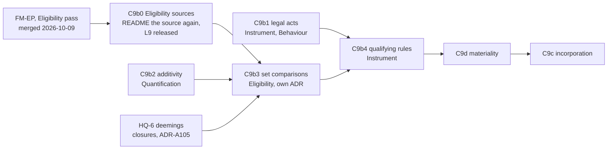

**How C9b0 to C9b2 run (2026-10-09).** On one integration branch,
`ccs/c9b-groundwork`. Each slice runs in its own local worktree and branch (`ccs/c9b0-eligibility-sources`,
`ccs/c9b2-additivity`, `ccs/c9b1-legal-acts`), built by a sub-agent that commits there, examples
first. They are merged into the integration branch in the order C9b0, C9b2, C9b1, takes each
document's version once at the strongest level any slice needs, recomputes the cascade and
regenerates the catalog, release register and MTP lock. Design questions go to the maintainer through the
agent. The maintainer reviews all three Validation Packs, pushes, merges into `main` and creates the tags.

**Before C9b3, the formal-methods epic's Eligibility pass, FM-EP, is completed** on machine S, on
`fm/eligibility-pass`, and merged (2026-10-09). C9b3 extends Eligibility's laws, its Isabelle theory, its reference semantics
and its four compilers, so it must build on a hardened base. The items are FM-D17 (generate the
kernel's truth tables from the README into both the theory and the reference), E1.4 (gate digests that
cover definitions, characterising lemmas, set-reading invariance, no `by eval`, the assumption audit),
B2.2 (the suspected hierarchical-match defect, which may change the README's wording) and B2.1 (faults
seeded in the compilers, adjudication records, exhaustive generation). B5's mutation score may follow.
C9b1 and C9b2 touch no Eligibility artefact. C9b3 then carries its own proof and reference rows.

**FM-EP merged on 2026-10-09** (`2a438b15`): FM-D17 (the kernel's truth tables generated from the README
into the theory and the reference), E1.4, B2.2 and B2.1 done, B5 deferred. Its checks pass on `main`. It
left one thing for CCS. B2.2 amended law L9 in the Eligibility README, so a hierarchical condition with
no resolved scheme is Undetermined rather than Denied. Eligibility's README is not yet its source
(TD-16), so the change did not reach `vocab/eligibility-vocab.ttl` and no version moved, and
`check:ontology-versioning` compares `.ttl` files only, which is how it passed. C9b3 must edit that
README and regenerate from it, which TD-16 forbids today. So a new slice comes first:

- **C9b0, Eligibility sources** (TD-16's Eligibility part). Make the README Eligibility's source again:
  restore the vocabulary's ontology header in it, reconcile the shapes, each difference judged, not
  regenerated over, add a test running `--check` as the other literate layers have, and release L9's
  amendment. It also confirms the compilers' reading of L9's new case. Briefed below, in C9b0 in detail.

The details below are the record of the first brief.

**Machine:** R. **Branch:** created from `main` once this brief is on
`main` and its questions are answered. **Commits are the maintainer's**, examples first (ADR-A-C2).
Merged into `main` before release tags are created.
**Validation Pack:** written once C9b-Q1 fixes the slice.
**Decisions:** ADR-A104 decisions 4 and 11, its 2026-10-08 addendum (assents), CC-D10, C9-Q3 and
the [change materiality sketch](../sketches/change-materiality.md), C9-Q4 (a).
**Inputs:** the CCS sketch §5.3 and §5.8 (consent rules, delegated consent), scenarios S50 and S51,
held question HQ-5, and our instruction for a reinsurance recoveries example (C9 in detail).

**Invariant:** a power held by a group takes effect only when the members its consent rule selects
have consented, by number or by weight, and the instrument says which. Whether consent is present is
decided from facts any application can supply, never left undetermined for want of a rule the
contract states.

**Setting the scene.**

Since C9a, a party's assent to a version is an Instrument fact (`ins:Assent`), and an amendment by
agreement is agreed when every party has assented. Three things remain:

- **A power held by a group is Undetermined** (CC-D10). The facility example's clause 10.1, "The
  Lenders may declare all loans immediately due and payable", is a power held by the lenders'
  group, and nothing says whether one lender, all of them, or lenders holding two thirds of the
  commitments may exercise it.
- **Consent is to an exercise, and only some exercises produce a version.** An amendment under a
  power produces a new version, and its consents are assents to that version, as in C9a. An
  acceleration, a waiver or a reinsurer's approval of a settlement produces no version. There is
  nothing in Instrument for a consent to name.
- **Materiality** is decided (C9-Q3, MQ1 to MQ7), and needs building: the change report, condition
  words over it, grades and the evaluation profile.

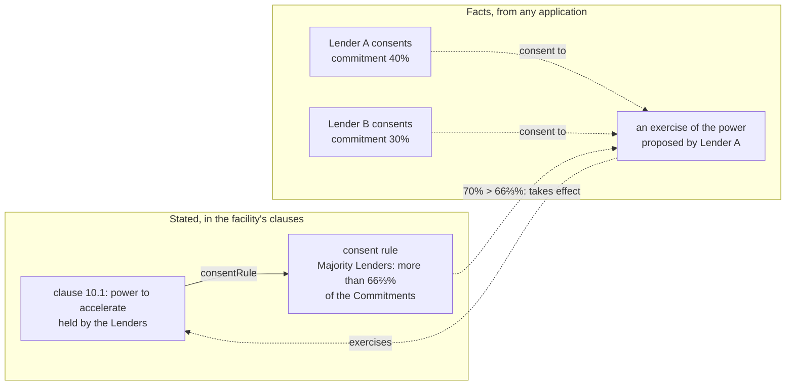

Facts about the current model that constrain the options:

1. **Behaviour's exercise record is runtime.** `bhv:ExerciseRecord` records an exercise, but
   Instrument imports only Behaviour's configuration (C9-Q2 choice 0), so a consent cannot name it.
2. **A weight per member already has two homes.** Party's `pty:outwardShare` on a group membership
   (the facility's lenders hold 60% and 40%), and a Wording table whose field has one value per
   entry, where an entry may be a party (`wrd:forEntry`). Neither is tied to consent.
3. **Eligibility cannot count or sum** (C9 in detail, fact 2), so the counting is Instrument's, and
   evaluated by C12.
4. **A regime can run per occasion** (`bhv:perOccasionOf`, no range), so running one per exercise is
   a matter of what it names, not a new Behaviour construct.

**Questions, with each option's consequences:**

Each option is compared on its design overheads and its runtime overheads, then against KISS.

- **C9b-Q1. One slice or two.** Consent rules, what a consent names, delegated consent and the
  per-exercise regime come to about 12 rows. Materiality (change report, condition words, grades,
  evaluation profile, determinations) comes to about 10 more.
  - **(a) Two slices.** C9b consent, then C9d materiality, which adds selecting consenting members
    by a change's grade.
    - *Design.* Each slice reviewable on its own. Consent rules in C9b select by role and by
      threshold only, and C9d adds selection by grade. The change report's design, the larger
      piece, gets its own brief.
    - *Runtime.* None.
  - **(b) One slice,** about 22 rows over Instrument and `tools/`.
    - *Design.* Above the sizing rule, and the change report's design questions crowd the consent
      questions.
  - *KISS.* (a).

  **Leaning: (a),** C9b consent, C9d materiality, C9c incorporation unchanged.

- **C9b-Q2. What a consent is given to.**
  - **(a) An Instrument record of an exercise, `ins:Exercise`,** naming the power exercised, and
    for an amendment the amendment. A consent is an `ins:Assent` naming the exercise
    (`ins:assentTo` widened from a version to a version or an exercise). An amendment under a
    power is an exercise whose consents may be given as assents to its resulting version, as C9a's
    are.
    - *Design.* One consent mechanism for every group power: acceleration, waiver, amendment. Any
      application writes an exercise as it writes assents. It overlaps `bhv:ExerciseRecord`, kept
      apart by the same import boundary as assents. `ins:assentTo` gains a second kind of value,
      which every reader of an assent must handle.
    - *Runtime.* One exercise node per exercise, and one assent per consenting member.
  - **(b) Consent rules for amendment powers only.** Consents are assents to the resulting version,
    as in C9a. Other group powers stay Undetermined until a later slice.
    - *Design.* No new class. Acceleration, the facility example's group power, stays undecidable,
      and so does CC-D10 in general.
    - *Runtime.* None beyond C9a.
  - **(c) Consent as a condition.** The power's scope, or the relation it gates, reads an
    application's record of consent through an Eligibility evidence binding.
    - *Design.* No new Instrument construct. Counting and weights cannot be expressed (fact 3), so
      it covers "with the Agent's consent" and not "Majority Lenders".
    - *Runtime.* An evidence binding per condition.
  - *KISS.* (b) is smallest and leaves the facility's group power undecided. (a) is the smallest that
    decides it.

  **Leaning: (a).**

- **C9b-Q3. The consent rule.** Stated once, on the stated power, and read for every bound power
  (`ins:consentRule`).
  - **Who must consent.** Every member, members by role (the Agent, the Lead), or members affected
    by the change, read from the change report (C9d).
  - **A threshold,** optional: a share of a weight, more than or at least.
  - **Where each member's weight comes from:**
    - **(i) Party's outward share** on the member's group membership.
      - *Design.* Already present, and right where a share of liability is the weight. Wrong where
        the weight is something else, such as commitments when liability shares differ, or votes.
      - *Runtime.* None new.
    - **(ii) A weight word.** The consent rule names a word ("Commitment") whose meaning, per member,
      is a value. A Wording table gives one value per party (fact 2).
      - *Design.* Any weight the contract defines, read like any other word. Reading a word once
        per member is new to the instantiator, which today reads a table field per entry only for
        placeholders. A weight that changes, such as a commitment after a transfer, is read from the
        version in force at the exercise.
      - *Runtime.* One value per member, which the contract already holds.
    - **(iii) Both,** with (i) the default where no word is named.
      - *Design.* Two ways to say one thing, and readers must know the default.
  - *KISS.* (ii) covers every case, and the facility's 60% and 40% move from outward shares to
    a commitments table only where the two differ.

  **Leaning: who by every member or by role, a threshold, and weight (ii).** Selection by affected
  members waits for C9d's change report.

- **C9b-Q4. Delegated consent.** "Each Lender authorises the Agent to consent on its behalf to any
  amendment that is not material." The sketch uses `pty:Delegation`.
  - **(a) `pty:Delegation`.** The delegate's assent counts for each delegating member.
    - *Design.* Party's construct, made for one occupancy performing for another. Its meaning
      extends naturally to consenting. The scope of a delegation, such as "not material", has no
      home in Party, so it waits for C9d.
    - *Runtime.* The sum counts members, never assents, or a delegate assenting for several members
      is miscounted. One assent can then stand for several members.
  - **(b) A consent rule that names the delegate directly** ("the Agent alone, for a change that is
    not material").
    - *Design.* No delegation needed where the contract makes the Agent's consent sufficient, which
      is how most such clauses read in effect.
  - *KISS.* (b) needs nothing new. (a) is needed only where the delegate consents for some members
    and not others.

  **Leaning: (b) in C9b,** with (a) for a later slice if an example needs it.

- **C9b-Q5. A regime per exercise.** "If the Majority Lenders have not consented within 30 days, the
  request lapses."
  - **(a) Build it now.** A regime stated with the power runs once per exercise, as
    `bhv:perOccasionOf` runs one per occasion (fact 4), entering a lapsed state on an expiry.
    - *Design.* Uses Behaviour's existing scoping with an exercise as its subject. Lapsed is a
      state of the exercise, read by the consent rule's evaluation (C12).
    - *Runtime.* One occupancy per exercise.
  - **(b) Defer** until an example needs it.
  - *KISS.* (b), unless the reinsurance example needs a time limit, which claims co-operation
    clauses often have ("within 14 days").

  **Leaning: (a) if Q2 is (a),** since the reinsurance example needs it, otherwise (b).

**Decided by precedent, not asked:**

- `ins:byExerciseOf` from an amendment to the power it exercises (ADR-A104 decision 11)
- a power held by a group with no consent rule stays Undetermined (CC-D10), and the full set of group
  behaviours is HQ-5's, following C9b
- whether an exercise takes effect (law I10) is evaluated by C12. C9b states the rule and checks its
  structure
- the reinsurance recoveries example invents its own model. Under "follow the settlements" the
  reinsured's settlement with its insured fixes the reinsurer's liability, which the model reads as
  the reinsured's power to settle. A claims co-operation clause makes the reinsurer's approval of
  each settlement a condition precedent to that liability, which the model reads as a consent rule
  naming the reinsurer, with a time limit

**What C9b builds, under the leanings:**

| Layer | Adds |
|---|---|
| Instrument 0.16.0 | `ins:ConsentRule` (`ins:consentRule`, who must consent by role or all, `ins:threshold`, `ins:weightedBy` a word), `ins:Exercise` (`ins:exercises`, `ins:proposedBy`), `ins:assentTo` widened to an exercise, `ins:byExerciseOf`, a regime per exercise. Shapes for each. Examples: the facility's acceleration by the Majority Lenders, an amendment under a power, and reinsurance recoveries |

#### C9b0 in detail

**Machine:** R. **Branch:** created from `main` once this brief is answered.
Merged first of C9b0, C9b2 and C9b1. **Commits are the maintainer's.**
**Decisions:** TD-16, ADR-A120, law L9 as amended by FM-EP's B2.2 (`2a438b15`).

**Invariant:** Eligibility's README generates every Eligibility spec, vocab and shapes file, and
`--check` proves it. No shape, law text or ontology header exists only in a generated file.

**Setting the scene.** A read-only inventory (2026-10-09) measured the drift against all three
committed shape files, not `constraints.ttl` alone. The plan's "78 and 19 triples" compared the
README's one shapes block with one file. Against the union, five triples are only in the README and
42 only in the files:

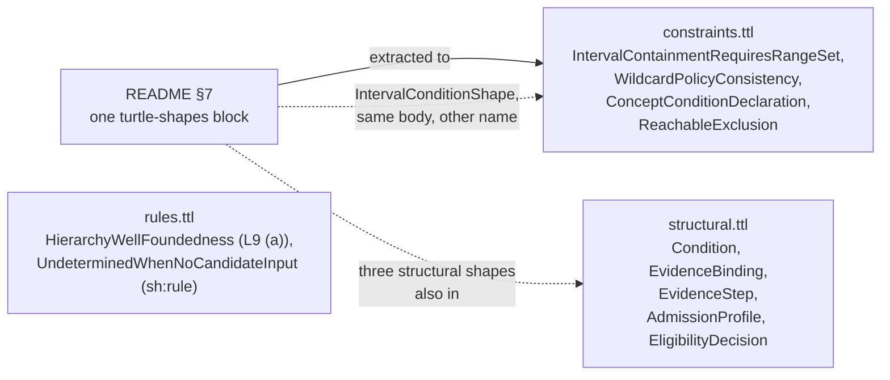

- **Spec:** isomorphic. Nothing to do.
- **Vocab:** the README has never carried the ontology header (`eligibility-vocab/0.11.0`), and L9's
  new sentence (FM-EP) is in the README only. **Nothing imports `eligibility-vocab`**, so its release
  has no cascade.
- **Shapes, in the files only:** `WildcardPolicyConsistency` (enforces ADR-A06),
  `AdmissionProfileShape`, `EligibilityDecisionShape` (README §6.4 says §7 discharges L6 to L8, yet
  §7 lacks it), and both shapes in `rules.ttl`, one of which discharges L9 clause (a).
- **Shapes, in both:** three structural shapes. Extracting the README's one block into
  `constraints.ttl` while `structural.ttl` keeps them makes every violation of them reported twice.
- **Interval shape:** the same body under two names. The files' name is the released one, cited by
  `docs/architecture/derivation-and-validation.md`.
- **No example or test changes conformance** under any of the three shape sets tried (all 8 examples,
  E1, E2, and 351 tests across the importing layers). `test_readme_mirrors_shape_file` passes only
  because it checks the two identical shapes.
- **The compilers and L9's new case.** A hierarchical condition with no resolved scheme never reaches
  a backend: `eligibility_ir.py` refuses to compile it (no `elg:constrainedByContract`, no binding,
  or no binding applicable at the resolution time). The reference returns Undetermined. Hand-built,
  the SPARQL backend would return Denied and the SHACL backend would disagree with it.

**Questions, with each option's consequences:**

**C9b0-Q1. How the README sources the three shape files.**

| Option | Design overheads | Runtime overheads |
|---|---|---|
| (a) three `turtle-shapes` blocks, structural, constraints and rules, `--shapes` naming all three | none new: Wording already has two blocks. A `sh:rule` in a shapes block is ordinary Turtle to the extractor | none. Files unchanged |
| (b) one block, the files merged into `constraints.ttl` | every reader of the three files changes, including five tests that load `structural.ttl` and `constraints.ttl` but not `rules.ttl` | a merge moves shapes between files, so tests that skip `rules.ttl` gain L9 (a) and may change |
| (c) two blocks, `rules.ttl` left hand-kept | the README is still not the whole source, the defect C9b0 exists to remove | none |

KISS: (a) is the smallest change that makes the README the whole source. **Leaning (a).**
**Answered (2026-10-09): (a).**

**C9b0-Q2. Is the compilers' refusal an acceptable reading of L9's new case?**

| Option | Design overheads | Runtime overheads |
|---|---|---|
| (a) accept it now. Document in README §6.4 that a compiler refuses a plan L9 makes Undetermined for every candidate, add the missing test (required concepts, no contract), and assert `scheme is not None` for hierarchical plans in both backends | small. The refusal is one code path | an application gets a compile error where the reference gives Undetermined |
| (b) compile it to a plan that answers Undetermined | each backend gains a no-scheme path, and the differential harness a case | matches L9 at runtime |

The refusal has two causes, which reality separates. A condition with no contract is mis-authored,
and refusing it is right. A condition whose binding does not apply at the resolution time is a
binding-time deferral, which C9b3 names and designs. KISS: C9b0 need not pre-empt C9b3.
**Leaning (a)**, with C9b3 turning the no-applicable-binding case into Undetermined.
**Answered (2026-10-09): (a), and C9b3 must cover the no-applicable-binding case.**

**Built (2026-10-09, merged into `ccs/c9b-groundwork`).** As briefed, with these settled while
building: the guards raise `IRCompileError` rather than assert, so they hold under `python -O`. The
spec's `@base` moved into README §2's prefix block so the spec regenerates byte for byte. A new README
§11 holds release notes. The OWL and SWRL backends have no guard, which C9b3 adds with the
no-applicable-binding case. One command: the literate `--check`, then
`tools/test_eligibility_examples.py` and `tools/mork_compilers/src/mork_compilers/test_hierarchical_conditions.py`
([Validation Pack](../validation/computable-contract-substrate-c9b0.md)).

**TD-16 cross-checked (we asked, 2026-10-09).** FM-EP (`2a438b15`) changed only
`ontology/eligibility/README.md` under `ontology/`. On `main`, `literate_extract.py --check` reports
drift in all three generated files. The spec differs in layout only. The vocab has one triple only in
the README (L9's new comment) and four only in the file (L9's old comment and the three-triple
header). The shapes differ as above. So TD-16's Eligibility part stands, and our proposal,
repairing Eligibility's README in its own slice before the rest of C9b, is C9b0 as briefed.

**Decided by precedent, not asked:**

- the three file-only shapes, and both `rules.ttl` shapes, move into the README unchanged. Dropping
  them would weaken earlier slices' checks (non-weakening)
- the interval shape keeps its released name, `IntervalContainmentRequiresRangeSet`
- the vocab's header joins the README. `eligibility-vocab` becomes 0.12.0, additive (L9's comment
  says more, the meaning of L9 is FM-EP's). The spec and shapes graphs are unchanged, so neither
  moves. With no importer, there is no cascade
- the literate `--check` joins `tools/test_eligibility_examples.py`, replacing
  `test_readme_mirrors_shape_file`
- the README §6.4 diagram calls L1 to L8 static, but no law register says so, and L5 has no shape.
  Recorded as TD-27, not fixed here

**Planned validation** (pack `docs/developer/validation/computable-contract-substrate-c9b0.md`, written with the slice): the
literate `--check` for Eligibility (positive), a probe shape edited in a generated file fails it
(negative), each moved shape still fires on its probe (`WildcardCondition` with `NoWildcard`, an
empty profile, an empty decision, a cyclic scheme), no violation is reported twice, the
required-concepts-without-contract refusal, and the backend guards. One command:
`mise run check:eligibility-sources` or the test file, settled in the pack.

#### C9b1 in detail

**Machine:** R. **Branch:** from `main` after C9b2 merges, merged last of the three.
**Decisions:** the [consent sketch](../sketches/consent-and-group-powers.md) §2.1, §2.6, §3, §4.3 and
its decisions, ADR-A104, ADR-A106, ADR-A120.

**Invariant:** what the parties did (declarations, proposals, exercises, notices with legal effect)
is an Instrument fact in its own document, written by any application. What the evaluator concluded
about it is a Behaviour finding. A consumer that states meaning only never imports an act.

**Setting the scene.** Facts from a read-only investigation (2026-10-09), checked against the source:

- C9a's `ins:Amendment` is "the legal effect of a change", a `prov:Activity` whose temporal scope is
  **when it takes effect**. The sketch gives a proposal's temporal scope as **when it was made**, and
  makes the amendment a kind of proposal.
- `ins:Assent` sits in Instrument's main document. Its utility still says it is read for "consent to
  a power's exercise", which consent as a sibling replaces.
- `bhv:ExerciseRecord` holds the act and its outcome (`tookEffect`, `reasonNotTaken`).
  `bhv:AcceptanceRecord` (`accepted` a version, `actor`) is used by one example,
  `licence-suspension.ttl`, and one test.
- `ins:OnExercise` is a `bhv:ExternalStimulus`, fixed by a shape. An exercise outside its window has
  no effect (law I10), so the stimulus is really the evaluator's finding.
- The reinsurance scope works today as an evidence path from the claim through the settlement,
  `ins:pursuantTo` and the approval to its activity, compiled by the SPARQL backend. Two gaps: an act
  cannot name its case (`bhv:forCase` is runtime-only), and a missing approval gives Undetermined,
  not Denied, until HQ-6's closures.
- Three Behaviour examples record notices with legal effect as `bhv:ActRecord`s (a force majeure
  notice, a claim notification, a notice withdrawn by agreement). The import guard forbids Behaviour
  examples to name `ins:`.
- The import guard treats Behaviour's configuration and runtime documents as one layer, so it cannot
  see the acts document import the runtime (ADR-A106).
- README §1.1 says "Instrument's runtime document is upstream of it". Behaviour's runtime document
  imports only Behaviour's configuration.

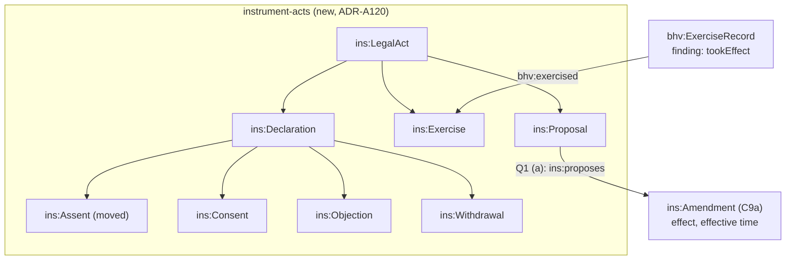

**Questions, with each option's consequences:**

**C9b1-Q1. How a proposal and an amendment relate.** In law, a proposed variation is an offer, an
act made at a time. The variation it proposes is its content, which takes effect at another.

| Option | Design overheads | Runtime overheads |
|---|---|---|
| (a) `ins:Proposal` is a legal act (`ins:proposedBy`, made when its temporal scope says) that `ins:proposes` a matter, such as an amendment. The amendment is unchanged | one property. Mirrors the law's act and content | an amendment's proposal is one hop away |
| (b) `ins:Amendment ⊑ ins:Proposal`, as the sketch wrote, with its temporal scope moved to when proposed and its effective time on a new property | breaks C9a (0.15.x) and its examples, shapes and laws I4 and I14 | none |
| (c) the subclass, with temporal scope meaning different things per subclass | the same property means two things. Easy to model wrongly, hard to query | queries must branch on type |

KISS: (a) adds one property and changes nothing released. It departs from one line of the sketch, not
from a decision. **Leaning (a).**
**Answered (2026-10-09): (a).**

**C9b1-Q2. What becomes of `bhv:AcceptanceRecord`.**

| Option | Design overheads | Runtime overheads |
|---|---|---|
| (a) deprecate it, with a warning shape, removed in C16c. Whether a version is agreed is derived from assents (C9a) | one example and one test move to assents | none |
| (b) narrow it to "the evaluator relied on an assent", `bhv:accepted` pointing at the assent | changes the range of a property (breaking), and stores a fact the evaluator can derive | a second record per assent |

KISS: a record of reliance has no reader. **Leaning (a).**
**Answered (2026-10-09): (a).**

**Decided by precedent, not asked** (each from the sketch, its decisions, or policy):

- the document is `spec/instrument-acts.ttl`, ontology `instrument-acts`, importing Instrument.
  Nothing in LATTICE imports it but examples and tests
- `ins:LegalAct ⊑ prov:Activity, fnd:TemporallyScoped, fnd:Evidenced`. Every act names its case with a
  new `ins:forCase`
- `ins:Assent` moves into the acts document and loses "consent to a power's exercise". A consumer of
  C9a's assents must now import the acts document, so Instrument 0.16.0 is breaking
- `bhv:exercised` points at an `ins:Exercise` and keeps no range. `bhv:actor` on an exercise record is
  deprecated, since the act names its party and a second copy can disagree
- `ins:OnExercise` becomes a `bhv:DerivedTrigger`, since it fires on an exercise found effective
  (law I10). Its shape changes, which is breaking
- **Behaviour is 0.14.0, a MINOR marked breaking, not a patch.** Narrowing what its records mean is a
  change of meaning (ADR-A113)
- "Effective approval" in the reinsurance scope is read from facts: the approval exists, was made by
  the party holding the power, and precedes the settlement. The first is the scope's evidence path.
  The other two are the acts' shapes. No finding enters a condition (the import boundary)
- withdrawal has no substrate default (decision 7), so AgreedChainShape and `ins:OnAcceptance` are
  unchanged and a withdrawal's effect is evaluated under the instrument's own rule
- `ins:pursuantTo` may cross instruments, as the reinsurance example needs. Unshaped until a case
  needs one
- `ins:impliedBy`'s utility adds a judgment to statute, custom and course of dealing
- `ins:boundUnder` is unchanged. An exercise may sit beside it
- the three Behaviour notice examples are annotated, not moved: a notice with legal effect is an
  Instrument act, and the record shows its performance
- a per-document test that `instrument-acts` imports no Behaviour runtime. The import guard's blind
  spot is TD-32
- README §1.1's sentence is corrected
- the reinsurance example records "no approval gives Undetermined" as deliberate non-coverage until
  HQ-6

**Raised while building (2026-10-09), answered:**

- **C9b1-Q3.** The party to any act is `ins:actBy`, with `ins:assentBy` and `ins:proposedBy` beneath
  it, and the proposal a consent or objection answers is `ins:directedAt`. `ins:actBy` takes several
  parties, since a joint notice or an act by agreement has more than one. Answered: as leaned.
- **C9b1-Q4.** The reinsurer's implied term (*Gan v Tai Ping (No 2)*) is a prohibition on refusing
  approval, scoped to a refusal found arbitrary, a determination. It is not an obligation to approve,
  since the reinsurer may refuse for proper reasons. Answered: as leaned.
- **C9b1-Q5.** The five earlier Behaviour examples with exercise records move to exercise acts in
  C16c, with the removal of the deprecated terms. Answered: as leaned.
- Settled while building: `ins:forCase` is optional, at most one, since an assent or a proposal to
  amend has no case. Act shapes target each concrete act class. `bhv:actor` on an exercise record is
  deprecated in its utility only.

**Built (2026-10-09, merged into `ccs/c9b-groundwork`).** `spec/instrument-acts.ttl` from README
§6.4, the shapes for each act, an exercise by the power's holder, and an act relied on done no later
than the act relying on it. The reinsurance implied term is a prohibition on refusing
(`ins-voc:Refuse`), beside `ins-voc:Settle` and `ins-voc:Approve`. Instrument 0.16.0 (shapes 0.8.0)
and Behaviour 0.14.0 (shapes 0.5.0), both breaking, each released once with C9b2's re-pins. ADR-A104
and ADR-A106 addenda, accepted 2026-10-10. 15 rows in two parts, acts and Behaviour
([Validation Pack](../validation/computable-contract-substrate-c9b1.md)).

**Planned validation** (pack `computable-contract-substrate-c9b1.md`): each act class and its shapes at zero and too many,
proposal and `ins:proposes`, `ins:pursuantTo` across instruments, the reinsurance evidence path
Permitted with an approval made before the settlement by the reinsurer, rejected when made by
another party or after, `ins:OnExercise` derived, the deprecation warnings, the acts document's
imports, and every C9a test unchanged. Precedence on a path cannot be tested yet (deliberate
non-coverage, C9b3). If the table passes 15 cases the slice splits into the acts tier and the
Behaviour change.

#### C9b2 in detail

**Machine:** R. **Branch:** from `main` after C9b0 merges.
**Decisions:** the [consent sketch](../sketches/consent-and-group-powers.md) §2.4, ADR-A93, ADR-A94,
ADR-A115, Quantification's open question 7.

**Invariant:** a sum of values on one space is declared legitimate only where the space is
extensive, and a sum over values whose units or bases differ, with no conversion, is Undetermined.

**Setting the scene.** Facts from a read-only investigation (2026-10-09), checked against the source:

- Sum and Count exist as operation kinds, permitted only by a declared capability (law Q7). The
  README already teaches additive, semi-additive and non-additive measures (§5.1.3) and holds
  semi-additive aggregation as open question 7.
- **Sum is already used across two spaces:** a date plus a duration gives a date. A rule "Sum needs
  an extensive space" would forbid it unless it covers only a sum within one space.
- A proportion's base is a space (`qnt:DerivedValueSpace`, ADR-A93). Lines on order A and order B
  share a space, so the space cannot tell them apart.
- README §5.1.3's table says Sum is "no" for proportions. Signed lines on one order add.
- None of the 31 value spaces outside Quantification declares a capability or a unit. There is no
  value space shape.
- Quantification cannot see Eligibility, so whether an aggregate binding's measure permits Sum is
  checked by Eligibility's shapes in C9b3.
- Prior art: extensive and intensive quantities (Campbell, Krantz et al.), kind of quantity versus
  dimension (VIM), aggregate functions on measures (QB4OLAP), stock and flow (XBRL's period type).
  QUDT and OM have no additivity flag.

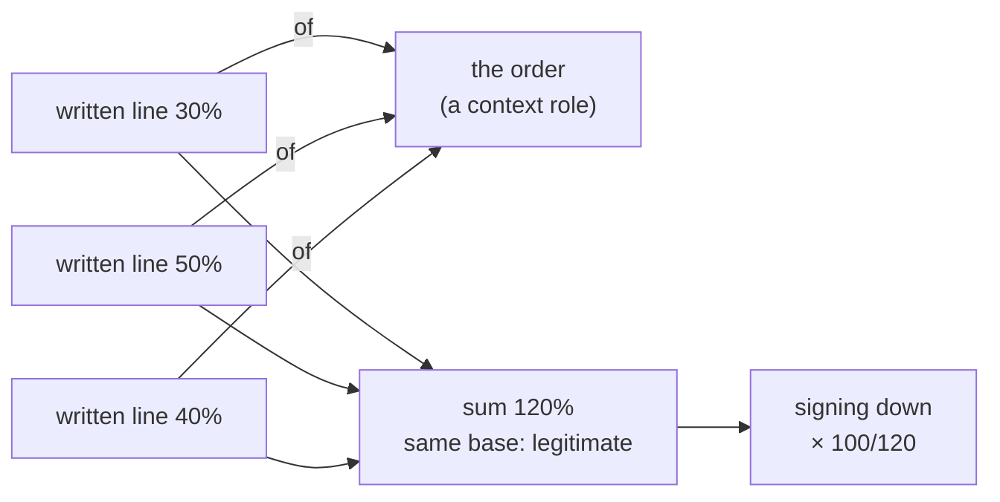

**Questions, with each option's consequences:**

**C9b2-Q1. Where additivity is declared.**

| Option | Design overheads | Runtime overheads |
|---|---|---|
| (a) an optional `qnt:additivity` on a value space, Extensive or Intensive, like `qnt:orderKind` | one property and two individuals. Optional, so no existing space breaks | none |
| (b) subclasses of value space | a space's class carries a fact about the quantity. Two disjoint classes to govern | a reasoner or `sh:class` check |
| (c) a quantity kind that spaces point to | duplicates what a space already distinguishes | an extra hop |
| (d) on the unit | currency additivity holds only within one unit, and a percent is both | units are deployment content |
| (e) nothing new: extensive means "declares a same-space Sum" | confuses a permission with a category | none |

Semi-additivity (a stock, such as a balance, summed across members but not across time) is not
needed now: every consent aggregate sums members at one reference time. KISS: (a), two values, open
question 7 stays open. **Leaning (a).**

**Does (a) make semi-additivity hard later?** (2026-10-09) No, it defers it. A
semi-additive measure adds along some groupings and not others, and in every known case the grouping
it must not cross is time: a balance adds across accounts, not across days (XBRL's instant against
duration). Adding it later takes a third value, `qnt:SemiAdditive`, and an optional property naming
what a sum must not cross. Both are additive changes. The sum's grouping is the aggregate's, which is
Eligibility's (C9b3), so that check sits there. (b) defers it the same way, with a third subclass.
(Corrected 2026-10-09: an earlier line here told authors to leave a stock undeclared, which the
analysis below contradicts. A balance shares its currency's Extensive space.)

**Design-time warnings, and a third class for semi-additivity** (2026-10-09). Facts that
decide it:

- **SHACL warns equally under (a) and (b).** Eligibility's shape for an aggregate binding checks
  `sh:path ( <measure's space> qnt:additivity ) ; sh:hasValue qnt:Extensive` under (a), or
  `sh:class qnt:ExtensiveValueSpace` under (b). Both run without a reasoner, at design time in an
  authoring studio and in CI. A missing declaration is a SHACL finding in both.
- **An OWL reasoner cannot warn of a missing declaration under either.** It works in the open world.
  A restriction such as "a semi-additive space must name what a sum may not cross" makes it infer an
  unnamed value, not report one missing. A range on the aggregate binding would make it infer that
  the space is extensive. A reasoner only finds a contradiction, such as a space declared both, and
  (a) gets that from a functional property with distinct values, as (b) does from disjoint classes.
- **The classes are free under (a) if a studio wants them.** `qnt:ExtensiveValueSpace ≡
  qnt:ValueSpace ⊓ ∃qnt:additivity.{qnt:Extensive}` lets a reasoner classify spaces from the one
  property, with nothing asserted twice. Held until a studio asks for it.
- **Semi-additivity belongs to the measure, not the space.** Quantification keeps one space per
  kind of quantity, such as sterling. A balance (a stock) and a payment (a flow) are both sterling,
  and a balance plus a payment is a new balance, a sum within one space. A third class of space
  would split them into two spaces and turn that sum into a cross-space one. The fact "do not sum
  across time" is about what the value measures, as XBRL puts its period type on the concept, not
  on the unit. Its home is the measure word (C9b4) or Eligibility's aggregate binding (C9b3), which
  is also where the check runs.
- **Only Sum is at stake.** The lowest, highest, latest and a count of a balance over time are
  meaningful, and so is an average daily balance, which divides a sum over time by a count of days.
  So the rule constrains `qnt:Sum` along time, not every aggregate.
- **Runtime.** Neither option adds runtime work. Additivity is checked at design time. The runtime
  checks are mixed units and mixed bases (C9b2-Q2), which exist under any option.

KISS: (a), with Extensive and Intensive on the space, and stock or flow on the measure when a slice
needs it. **Leaning (a), unchanged**, with open question 7 answered in principle: the consuming layer
says along which grouping a measure may be summed.
**Answered (2026-10-09): (a), with no subclasses.**

**C9b2-Q2. How a proportion names its base.**

| Option | Design overheads | Runtime overheads |
|---|---|---|
| (p1) the space, as today | nothing new | lines on different orders sum silently |
| (p2) the value names its base value | a property on every proportion. Quantification cannot name an Instrument word, so the base is a placeholder | the evaluator compares base identities |
| (p3) the space names a base context role (ADR-A115), resolved per subject at the reference time | one optional property, reusing a mechanism already built, and decision 6's reference time | the evaluator compares resolved bases. Different bases with no conversion are Undetermined |
| (p4) composition of shares | a new operation kind multiplying derived values, and a law discharge | none |

**How (p3) and (p4) work** (pictures we asked for, 2026-10-09). They answer different
questions. (p3) says *which* base a share is of, so a sum can tell whether its shares have one base.
(p4) converts a share from one base to another, as a currency conversion does for an amount.

*(p3), lines on two policies whose orders are the same size:*

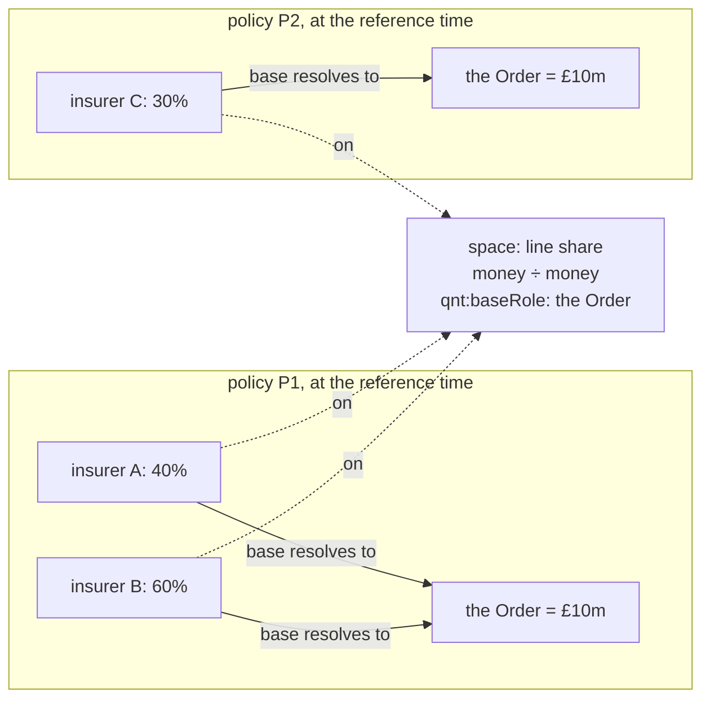

- Every line is a value on one space, the line share, whose base is a context role, the Order. The
  role is a concept under a role contract (ADR-A115), so Quantification names no Instrument word.
- Evaluating for a subject, here a policy, resolves the role to that policy's order at the reference
  time, as any context value resolves.
- A plus B: both resolve to P1's binding, so the sum is legitimate, 100%. A plus C: two bindings, so
  Undetermined, for mixed bases. Bindings are compared, not amounts: both orders are £10m and are still
  different bases.
- The same resolution turns a line into an amount. A's 40% of P1's order is £4m (Scale), which sums
  as money.
- For: one optional property on a mechanism already built, and the base follows the order when an
  amendment changes it, the reference time saying which order applies. Against: checked at runtime
  only, a share whose role has no binding is Undetermined, and two shares compare only within one
  subject's context.

*(p4), a reinsurer's share of a layer:*

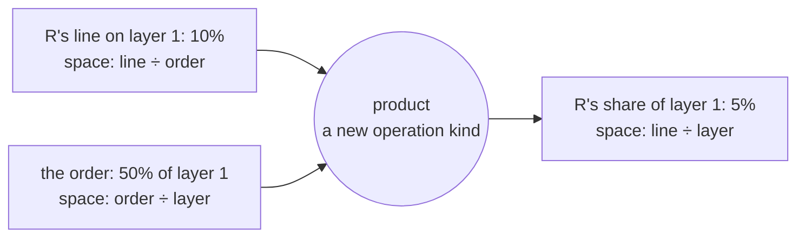

- A share of a share is a product, and the spaces multiply as fractions do: (line ÷ order) × (order ÷
  layer) = (line ÷ layer). A design-time check verifies that the middle term cancels.
- Shares brought to one base can then be compared. Shares of different layers still sum only as
  amounts.
- For: a product whose bases do not chain is caught at design time. Against: a new operation kind
  and law discharge, a derived space for each pair of bases, support in every consumer, and nothing
  in C9b needs it. Signing down multiplies a share by a plain ratio (the order over the total written),
  and the examples phase checks whether Scale covers that.

KISS: (p3) is needed now, for sums of lines and for turning a line into an amount. (p4) is needed by
no slice yet, and adding it later is additive. **Leaning (p3)**, (p4) held until a case multiplies
shares.
**Answered (2026-10-09): (p3). (p4) is held as HQ-12.** The two compose: a product of a
line share (base role: the order) and an order share (base role: the layer) has the layer as its
base role, and at runtime (p3) checks that the first operand's resolved base is what the second
measures, a check (p4) alone could not make.

**Built (2026-10-09, merged into `ccs/c9b-groundwork`).** `qnt:additivity` (`qnt:Extensive`,
`qnt:Intensive`), `qnt:baseRole` on a derived space, `qnt:MixedBases`, laws Q12 (static: a Sum within
one space needs Extensive) and Q13 (runtime: different units or bases with no conversion are
Undetermined), and three shapes. Signing down needs only Ratio then Scale, so HQ-12 stays held. A Sum
capability stating no operands reads as a sum within its own space. `qnt:baseRole` is not restricted
to proportions. Rows C9b2-08 to C9b2-13 are checked by a reference reading of §9.9 until an evaluator
of sums exists (C12). Corrected at merge: a stock shares its currency's Extensive space. Quantification
0.8.0 and its shapes 0.3.0 cascade to 18 documents, Eligibility's versions shared with C9b0
([Validation Pack](../validation/computable-contract-substrate-c9b2.md)).

**Decided by precedent, not asked:**

- Sum and Count stay operation kinds. A new shape rejects a Sum capability whose operands and result
  share one space that is not declared Extensive. A date plus a duration is unaffected. Count is the
  sum of a unit measure and needs no additivity
- mixed units with no conversion reuse `qnt:ConversionContextAbsent`. Mixed bases add one unresolved
  reason. Two laws are registered, one static and one runtime
- the README table is corrected: proportions of one base are extensive
- Quantification becomes 0.8.0, additive. Its shapes become 0.3.0, breaking, since a shape tightens,
  though no loaded space declares a same-space Sum. 18 documents re-pin, Eligibility's from C9b0's
  versions
- examples: multicurrency commitments (sum after dated conversion), written and signed lines, and
  signing down, which uses Ratio and Scale. If signing down needs a product of two derived values,
  the examples phase says so before the model phase

**Planned validation** (pack `computable-contract-substrate-c9b2.md`), including every currency case we asked for
(2026-10-09): one currency sums. Mixed currencies with a dated conversion context at the reference
time convert to the base currency, then sum. Mixed currencies with none are Undetermined
(`qnt:ConversionContextAbsent`). A limit stated in two currencies (ADR-A95) is never converted.
Shares with one base sum, and with two are Undetermined. Also: additivity at zero and two values, the same-space Sum
shape positive and negative, date plus duration still valid, Count on an intensive space valid, a
proportion's base role, the examples conformant, and the cascade's versioning, catalog and literate
checks.

### Tranche E: evaluation

| Slice | Content | Where |
|---|---|---|
| C12 | the runtime evaluator for regimes and occasions: positioned stimuli for scheduled triggers (NRS N6, absorbed), derived triggers for `ins:OnBreach` and `ins:OnCondition`, occasion derivation, state occupancies with evidence (B6), history per C11a. B3 and B6 shown | `tools/`, after C9 and C11a |
| C13 | relation plans in the shared IR: per-class algorithms (§6.1), exception burden and `exe:ExceptionNotEstablished`, stratified state reading (§6.2), regime gating per state (§6.3, B8), finding, determination and deeming reads (§6.4), and NRS N8's chain checks (absorbed). SPARQL reference first, SWRL for the positive subset | `tools/mork_compilers`. After AIR-3.3, and NRS N1 and N2, run as CCS slices (NQ-2) |
| C13a | **design-time joint satisfiability (deferred from C5, decided 2026-10-02).** The OWL backend learns to compile question-form conditions, whose subject is the value they are posed, which it refuses today (`owl_backend.py`: "compiles bound conditions only"). On that: a variation slot's conditions checked as a set by the reasoner, no two jointly satisfiable and their union covering the governing variables' admissible values, for every kind of condition, which C5's SHACL-SPARQL covers only for intervals over one variable. NRS N3's clash check (an obligation and a prohibition over overlapping scopes) and segment overlap use the same task, satisfiability of `P ⊓ Q`. Reasoner in the test-only harness (ADR-A83), so this serves LATTICE tooling, beside C5's consumer-runnable shapes | `tools/mork_compilers`. After C5 and NRS N1, with or before NRS N3 |

### Tranche F: examples and documentation

| Slice | Content |
|---|---|
| C14 | neutral examples E1 to E4 (sketch §9) with expected-decision tables and Behaviour traces, covering their scenarios |
| C15 | neutral examples E5 to E8, and a coverage test that every scenario S1 to S101 (except the amounts group and the merged S79) is shown by at least one example |
| C16 | how-to guides for Wording and Instrument (sketch §11), the substrate README's "computable contract" section, ontology architecture, SDS, data architecture |
| C16a | **simplification sweep** (from C6's review, 2026-10-03): after C9, review the Instrument model for what can be removed without losing logical correctness, under the Ponytail guardrails in `.github/copilot-instructions.md`. First candidate: the asserted `ins:Template` type, derivable from `ins:expressedIn` and `ins:arisesUnder` but kept because law I13's shapes read it without a reasoner. Second: every domain and range in Instrument reviewed against the principle in `.github/copilot-instructions.md` (from C7a-Q2): kept only where it gives useful design-time entailment or restates what a shape checks |
| C16b | **instance records and shared bound meaning** (TD-19, required before the epic closes, decided 2026-10-06). An instance stores only what differs from its form (C7c D1), and bound meaning is generated on demand, cached as need dictates and kept out of the main graph where processing allows (D4). This slice adds what C7c leaves out: sharing generated bound nodes across instruments and versions by content address, the cache and its invalidation (ADR-A27, ADR-A92), the subgraph a heavy process works in, and a size measure over a form the size of the sample policy, about 100 stored nodes per bound policy as the target. Its own ADR first. Revisits C9-Q2's overtaking rule (iii), whose derived nodes put a burden on implementors (2026-10-08) | an ADR, then `tools/` and Instrument shapes. After C9 and C12, before C17 |
| C16c | **remove Party's shares** (decided 2026-10-09, [consent sketch](../sketches/consent-and-group-powers.md) §2.5). `pty:outwardShare` and `pty:inwardShare` hold one value per membership, with an unstated meaning and base, fixed per membership version. C9b4 replaces their uses with measure words, narrows and deprecates them, and adds a warning shape reporting every use. This slice removes both, the warning shape with them, and Party's composition rules read measure words. It also removes Behaviour's terms deprecated by C9b1 (`bhv:AcceptanceRecord`, `bhv:accepted`, `bhv:actor` on an exercise record), moving the five earlier Behaviour examples' exercise records to name exercise acts (C9b1-Q5). Required before the CCS epic closes | Party and Behaviour, breaking, cascading. After C9b4 |
| C17 | handoff: the insurance renderings list for AIR Phase 5 (policy scenarios) and Open CBAA (binding authority scenarios), and the Open CBAA migration notes (§7) |

### Held design questions

Questions found while briefing or building a slice, with no slice yet. Each says why it matters,
so that its implications can be weighed when it is taken up.

| # | Question | Why it matters | Take up |
|---|---|---|---|
| HQ-1 | **Instruments without wording.** An instrument, or a fragment of one, may arrive as structured data from another system, mapped in rather than written. A counterparty's proposal sent back in response to a request for terms is the common case: it carries terms, sometimes partial or approximate, and no clause text. Law I1 requires every instrument version to be expressed in exactly one assembled wording, and law I2 requires every stated term to be expressed in a clause version. Options to weigh: (a) ingestion produces wording elements from the data, keeping "the words are the contract", (b) a fragment that is not yet an instrument, with weaker rules until it is accepted, (c) relax I1 for instruments whose source is data | a proposal must be checked by the same shapes as a contract, before anyone accepts it. Related, from C7a-Q1: a proposal's commitment (an indication, a non-binding quote, a binding quote) is a legal relation, whether it confers a power of acceptance and when that power ends. Its precision ("around five million") and completeness are an overlay on its terms, outside the legal model | before an applied ontology ingests proposals (AIR Phase 5, insurml-alignment Phase 5). Re-timed from "no later than C9" by C9-Q9 (a), 2026-10-08, since nothing in C9 needs it |
| HQ-2 | **Qualified gates: gating by another subject's state.** C7a gates a relation by the state of its own instrument, or of the occasion its arising chain reaches (C7a-Q5). Two cases are held: one participant's share within one agreement, where several parties are each liable for their own share and each share has its own state, and another agreement altogether, where one contract responds only once another is exhausted | the model must be consistent within one legally binding agreement first. Dependencies across agreements may not belong in this layer at all, and may sit in an applied ontology above it | designed with C12's evaluator, within one agreement first |
| HQ-3 | **Business day conventions and times of day** (TQ2, held 2026-10-05). "If that day is not a Business Day, on the next Business Day" (following, modified following, preceding), and "by 11:00 a.m. London time" (a time of day in a zone, S74). Recorded as use cases A13 and A14 in the [terms in time sketch](../sketches/terms-in-time.md) §3 | a due date that falls on a non-business day, or at a time of day, is resolved wrongly until Quantification can roll and zone it | with the first business continuity examples, in Quantification beside ADR-A94's calendars |
| HQ-5 | **The full set of group behaviours** (C7c-Q4, 2026-10-06). C7c uses Party's two composition rules for duties and leaves a group's power, and a group with no rule, Undetermined (CC-D10). The full set is: several only, joint only, joint and several, any one may act, all must act, and a threshold by number or by share, for duties and for powers alike, with how a member's share, release or default affects the rest, and how the instrument's silence is filled by an amendment, a deeming, a market default declared as data, or a recorded reading | a relation owed to or held by a group is decided wrongly, or not at all, until every mode is modelled | immediately after C9, as its own slice or the first follow-up of C9, and before AIR Phase 5 and Open CBAA's migration rely on group powers Revised 2026-10-09: the remaining group behaviours become acting rules beside C9b4's qualifying rules, and "any one may act" an `elg:Intersects` ([consent sketch](../sketches/consent-and-group-powers.md) §2.2, §5). |
| HQ-6 | **Deemings made watertight** (C7c-Q8, 2026-10-06). C7c states deemings in full, but the closure a deeming over absence licenses is ADR-A105's, not yet drafted. To settle: the closure declaration and its scope and window, rebuttal of a rebuttable deeming by later evidence and what that supersedes, the precedence of a conclusive deeming over a finding, deemings for one purpose only (`ins:forPurposeOf`) and how they stay out of other relations, deemed receipt counted in business days (HQ-3), and the deemed-fact record's link back to its deeming and closure | a deeming may be read as more or less than its words say, and a late fact may not supersede it correctly | a CCS slice, taking over NRS slice N5 (ADR-A105), as N4 and N8 were (HQ6-Q1, the maintainer, 2026-10-10). Split (HQ6-Q2): **HQ-6a**, before C9b3, whose set comparisons need licensed closures for deemed consent and "snooze you lose" ([consent sketch](../sketches/consent-and-group-powers.md) §2.3): ADR-A105, the closure declaration with its scope and window, a deeming as a closure source, compile-time refusal of an unlicensed absence-dependent check (NRS D7, as C9b0-Q2), and decisions recording their closure. **HQ-6b**, before C12: rebuttal and supersession, conclusive precedence, single-purpose deemings, deemed receipt in business days (HQ-3), the deemed-fact record's link, and the persistence profile's dense ordering and gap audit. Briefing waits on the formal-methods branch assessment (2026-10-10). |
| HQ-7 | **Several instruments covering portions of one order** (raised 2026-10-06, C7c). A layer in an insurance programme may be placed on several policies, each covering a portion of the order, on different risks or on the same risk with different terms. They are separate instruments related to one placement, not a group of parties acting together, so neither Party's groups nor a section models them | a placement split across policies is modelled as a group or not at all, and the portions cannot be reconciled with the order | with the insurance applied layer's placement model, or C9 if it becomes an instrument relation |
| HQ-8 | **Materiality beyond amendments** (MQ1, 2026-10-07). Material breach, a material adverse change in a party's circumstances and a material change in a risk classify an event or a state of affairs, as amendment materiality classifies a change. They share its sources (the contract's definition, a referenced one, a determination) and its split between enumerated and evaluative definitions ([change materiality sketch](../sketches/change-materiality.md)) | each is otherwise modelled ad hoc, and a definition such as "Material Adverse Effect" already exists as a condition word (C7c) without a rule for its evaluative part | later in the epic, after C9 and C12, reusing C9's mechanism |
| HQ-9 | **Eligibility paths ending at an identity** (MQ7, 2026-10-07). A condition that asks whether a value is one of several named records, such as "any amendment to Clause 35" or "a claim on one of the named vessels". Matching is exact, with no hierarchy unless the condition walks a structure Eligibility does not import | until then a materiality definition naming a clause falls back to a determination (C9), and other layers tag records with concepts to be matched | its own Eligibility slice with an ADR, after ADR-A90, A91 and A103, cascading to every importer and the MORK and design-time OWL compilers |
| HQ-10 | **A deployment configuration layer** (MQ5, 2026-10-07). Settings that vary by deployment, tenant or jurisdiction have no common home: Eligibility's operational profiles, C9's materiality fallback, HQ-5's market default for a silent group, and the evaluation context sketch's environments. Vocabulary's scope bindings select schemes, not settings | each layer grows its own profile and selection, and an outcome's settings are recorded differently in each | its own unit with an ADR for the new module, once C9's profile shows the pattern |
| HQ-11 | **An encoded document incorporated as amended** (C9-Q8, 2026-10-08). C9c incorporates encoded documents statically only. For one a party may vary, such as underwriting instructions under a binding authority (S53), each new edition reaches the instrument either by an amendment yielding a new version that pins the edition, or by resolution for each occasion at its valid time, as ADR-A85 resolves scheme bindings | the first fans out an amendment per instrument per edition, the second makes a version's meaning move over time and restates law I18. Until decided, such an incorporation is reported and its meaning not generated | when S53's volumes are known, with Open CBAA's underwriting instructions in view |
| HQ-4 | **Context roles from several sources** (found building C7b, 2026-10-05). Quantification's role contract resolves to one scheme in a context (Vocabulary, ADR-A85), and two unscoped bindings conflict. Roles come from several places: Instrument's baseline (arising, inception, ending, period start and end), other layers (an allowance reset, a policy year), and each wording's defined dates (the Expiry Date, the Break Date). C7b binds Instrument's baseline. The lease example's own date roles are left unbound | a deployment that uses Instrument and another layer's roles, or a wording's own dates, cannot bind them all to one contract today. Options: one deployment scheme that collects every role, scoped bindings, or wording dates as roles bound from variables in C8 rather than as concepts | with C8's parameter bindings, which give wording dates their values |
| HQ-12 | **Composing shares** (C9b2-Q2 (p4), 2026-10-09). A share of a share is a product: a 10% line on an order that is 50% of a layer is 5% of the layer, and the spaces multiply as fractions, (line ÷ order) × (order ÷ layer) = (line ÷ layer). Needs a new operation kind with its law discharge, a derived space per pair of bases, and support in every consumer. It composes with C9b2's base roles, which supply the runtime check that the bases chain | comparing or reporting participations across layers or programmes, and any clause that multiplies shares, without first converting to amounts | an enhancement slice, when a case needs it |

## 5. Sequencing

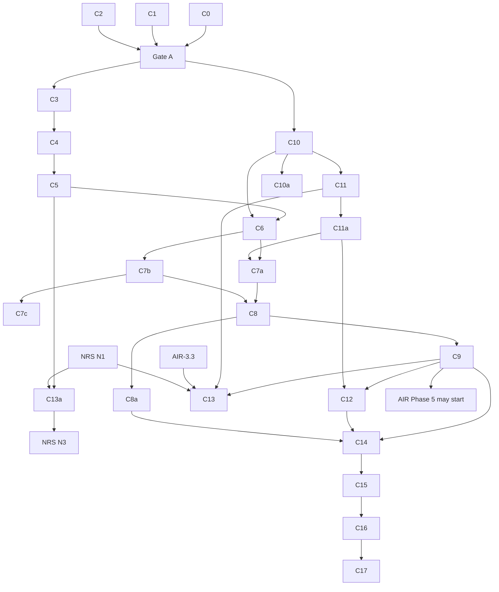

Tranches A to D touch no file any AIR round-3 or round-4 slice touches. C13 shares
`tools/mork_compilers/` with AIR-3.3 and NRS N1 and follows both. C10a adds a check beside the
existing ontology checks and touches no AIR file.

## 6. Impact on other plans

| Plan | Change |
|---|---|
| [normative-rule-substrate](normative-rule-substrate.md) | N4 is delivered by C1 and C6 to C9. N8's Behaviour work is C11 and C12, and N8 keeps the chain checks. Breach chains are `ins:arisesOn` an `ins:OnBreach` trigger, not compiled wiring. N2 revised (stratified state reads). N5 revised (contractual deeming, determinations, burden). N6 is built with C12. N3 compares Obligation and Prohibition, and Permission and Exclusion. D2 and D3 answered. 2026-10-10: N5 moved to CCS as HQ-6 (HQ-6a, HQ-6b), D7 answered (refuse), C13 and C13a wait on N1. NRS's remaining scope is its NQ-1 to NQ-4 |
| [applied-insurance-reference](applied-insurance-reference.md) §3b | the Phase 5 constraint becomes C9 accepted and merged. C10 re-pins `applied/capacity`, which the epic does not author before Phase 5. C6 no longer cascades to it |
| [phase 5](applied-insurance-reference-phase-5.md) | builds on Wording and Instrument. Term parameters qualify terms and relations, and their bases feed contract-amounts §1.7. Adds the policy renderings (sample policy scenarios), insurance templates on the C8a library and, under CC-D3, the LMA WIM profile |
| [phase 6](applied-insurance-reference-phase-6.md) | claims are occasions of the policy's relations |
| [phase-3-plan](phase-3-plan.md) (platform operation plane) | the behaviour engine loads Behaviour configuration and writes runtime records, occasions and evidence (C10, C11, C12) |
| Open CBAA plan and integration spec | migration of §7 |
| [insurml-alignment](insurml-alignment.md) (proposed epic, 2026-10-05) | C7c's brief takes InsurML's scope-based resolution of defined terms as input (bridge sketch §11). C9 is the gate for the epic's Wording changes, and receives endorsements lifted from InsurML as amendments. C12, C13 and C13a evaluate and verify placed contracts. The LMA WIM profile of §7 is built with InsurML in view, in the epic's Phase 1 (IMA-D2) |
| [evaluation-context](../sketches/evaluation-context.md) (unplanned sketch, 2026-10-02) | the ledger, combinators and environments that runtime passes run in. Comes back in at C7b (the target of `ins:computedBy`), C8a (bases), C12 (a pass as a run of the context, the sequential environment) and C13 (a Datalog form beside the SPARQL reference), and at AIR Phase 5. Its §13 |

## 7. Open CBAA migration

Recorded here so the other repository can plan it. Details in the sketch §3 and §12.2. Open CBAA
pins release tags, and its migration starts once C9 and C12 are merged (risk R1). Open CBAA's own
plan (`docs/development/plan.md`, "Upstream") mirrors this section.

| Open CBAA module | After migration |
|---|---|
| `wim` | removed. Its structure is LATTICE's Wording layer (ADR-A112). The LMA WIM profile (the four levels as element types, their containment rules as shapes, the LMA typing schemes and `applicableTo`) is in LATTICE's `applied/insurance/wording/` (CC-D3, AIR-5.9), and Open CBAA imports it |
| `stm` | `AuthorityGrant ⊑ ins:Power` with its envelope mechanism. Other kinds, templates, parameter bindings and encoding status come from Instrument |
| `agr` | UMR, markets, CBAA roles. The UMR becomes a `fnd:KeyScheme` and `agr:umr` a natural key on the contract's identity (ADR-A114, F1). The M12 regimes become `applied/insurance` templates on the C8a library. Agreement versions become `ins:Instrument`s expressed in `wrd:Wording`s |
| `rsk` | unchanged, with `rsk:BoundPolicy ⊑ ins:Instrument` and `rsk:boundUnder ⊑ ins:boundUnder` |
| example BA-2026-001 | re-expressed, joined by the binding authority scenario renderings |
| decisions | D22 holds as I13. D23 resolved. D25 changed. I6 closed. L15 fixed upstream (C10). D19 replaced (below) |

What changes in the data, beyond renaming:

| Open CBAA | LATTICE | Decided by |
|---|---|---|
| `wim:Segment`, `segmentIndex`, `segmentText` | `wrd:TextPart`, `partIndex`, `partText` | sketch §3.2 |
| a variation slot outside the tree, its variants comprised by the slot's parent (D19) | `wrd:VariationSlot`, an element ranked among its siblings with the shared object id, its variants beneath it | C4-Q2 |
| `agr:VariableValue` | `wrd:VariableValue` on a `wrd:AssembledWording`, one per variable and column | C4-Q1, C4-Q3 |
| `stm:` templates and bound statements | stated meaning owned by a library element version, bound meaning owned by an instrument version | CC-D12, ADR-A104 decision 2 |
| the M12 lifecycle in `agr` | regimes (`ins:Regime`) from the template library | CC-D8 |
| an agreement as the subject of its own state | a state occupancy for the instrument's persistent identity, `bhv:forSubject` having no range | ADR-A106, C10 |


## 8. Decisions

None of these is taken without the maintainer.

| # | Decision | Recommendation | State |
|---|---|---|---|
| CC-D1 | Name of the lower layer | Wording (`wrd:`), "computable contract" for the composition (sketch §1.1) | **decided 2026-09-30** |
| CC-D2 | Position of Wording | between Eligibility and Instrument | **decided 2026-09-30** |
| CC-D3 | Home of the LMA WIM profile | `applied/insurance/wording/` in LATTICE | **decided 2026-09-30** |
| CC-D4 | Scope of A-113 | every 0.x layer | **decided 2026-09-30** |
| CC-D5 | Templates in the substrate | yes | **decided 2026-09-30** |
| CC-D6 | Table structure | fields in the wording, entries at the instance or in the wording, in either orientation, cells as variable values | **decided 2026-09-30**, amended 2026-10-02 (fields and entries replace rows and columns, C5), with long lists as multi-valued variables |
| CC-D7 | Clean-room examples | insurance examples allowed in the substrate beside other-domain ones | **decided 2026-09-30, amended** (below) |
| CC-D8 | Gating by state, and the Behaviour and Instrument relationship | Behaviour below Instrument, split into configuration and runtime. Regimes and legal triggers specialise Behaviour (sketch §6.3, §7) | **decided 2026-10-01** (below) |
| CC-D9 | Where identifiers live | Party | **decided 2026-09-30: Foundation**, slice F1 |
| CC-D10 | A defined word meaning several parties when the instrument is silent | Undetermined until the graph holds an assertion of how the parties act | **decided 2026-09-30, amended** (below) |
| CC-D11 | Pieces of text, and parts of a contract | `wrd:TextPart`. Sections as parts of one instrument, named Section, no contract-of-contracts for now | **decided 2026-09-30** (sketch §5.10) |
| CC-D12 | Who owns the nodes that carry a contract's meaning | meaning belongs to its text: stated meaning part of one element version, bound meaning part of one instrument version. Only wordings, elements and instruments are versions | **decided 2026-10-01** (sketch §5.9, A-104 decision 2) |

**As recorded on 2026-09-30 and 2026-10-01:**
- **CC-D7.** ADR-A-C2 is relaxed for this unit's examples. Insurance examples may sit in the
  substrate provided every scenario is also shown in another domain's example, and the insurance
  examples are not substantially more comprehensive than the others. The relaxation is an
  addendum to ADR-A-C2, drafted in C0, and C15's coverage test checks both conditions per scenario.
- **CC-D10.** A relation that resolves to a group whose mode of acting the instrument does not state
  is Undetermined until the graph holds an assertion of that mode (several, joint, joint and
  several, any one). The assertion may come from any source the graph accepts, a later amendment,
  a deeming, a market default declared as data, or a recorded reading. It is not a person's
  approval step.
- **CC-D8.** Behaviour drops its Instrument import and sits below Instrument, in configuration and
  runtime documents of one namespace. Instrument imports configuration only. `ins:Regime`
  (synonym "Dispensation") specialises `bhv:StateSpace`, and the legal triggers specialise
  `bhv:TriggerDefinition`, with ranges set and SHACL enforcing use. No `ContractState` or
  `StateChange` class. Every state entry is recorded (B6). Static parameters stay in Instrument,
  dynamic quantities live in capacity through a Surface projection capacity defines. A state may
  parameterise a comparison, never vary within one (B8). The word "lifecycle" is not used in the
  T-Box, and "basis" is reserved for limits, deductibles and premiums.

## 9. Validation

Each slice has a Validation Pack at `docs/developer/validation/computable-contract-substrate-<slice>.md`.
Its adversarial probes are recorded in the status record, and the maintainer's merge is the sign-off.

| Slice | Levels | One command |
|---|---|---|
| C0 to C2 | none, paper | link and prose checks |
| C3 to C11a | L1, L2 | `mise run build:ontology-catalog`, then `mise run check:ontology-versioning && mise run check:ontology-catalog` |
| C10a | L1 | the new import guard check, with its failing fixtures |
| C12, C13 | L1, L2, L3 | `mise run check:mork-compilers` |
| C14, C15 | L2, L3 | the examples' decision tests and the scenario coverage test |

**Mandatory adversarial probes.**
- **I7 (C13):** an Undetermined fulfilment must never yield a breach, and a breach must never rest
  on an unestablished exception. Both are shown to fail when deliberately broken.
- **I11 (C11):** an occasion's parties must not change after arising.
- **B6 (C11, C12):** a state occupancy with neither a transition execution nor evidence must fail.
- **B7 (C10a):** a fixture layer that imports a higher layer, or names a higher layer's term
  without importing it, must fail the guard.
- **B8 (C13):** a design-time comparison that reads a runtime record must be rejected.

Non-weakening applies throughout.

## 10. Documentation deltas

Root `README.md` (the new layer), `ontology/README.md`, the Wording and Instrument READMEs and
how-to guides, `docs/architecture/ontology-architecture.md` (layer order, Wording, Behaviour below Instrument, the configuration and runtime split),
`solution-design-specification.md` (evaluation of relations), `data-architecture.md` (occasions and
records), the ADR catalogue.

## 11. Risks

| # | Risk | Mitigation |
|---|---|---|
| R1 | The rewrite breaks the only consumer mid-work | Open CBAA pins release tags. Its migration starts after C9 and C12 |
| R2 | A Foundation change beyond F1 is found necessary | stop and re-plan. None is expected (sketch §12.1) |
| R3 | Scope grows into contract amounts | amounts stay a catalogue until their own unit |
| R4 | Examples drift into insurance terms | ADR-A-C2 check in every Validation Pack |
| R5 | The scenario catalogue loses rows as slices are cut | C15's coverage test fails on any scenario without an example |
| R6 | The Foundation cascade collides with Phase 2's peril authoring | retired for F1 (ADR-A114 Consequences): no branch edits a Foundation importer while F1 runs. NRS N9 keeps its own later window |
| R7 | The nested-states deep dive grows | C11a blocks only C12. Instrument, templates and examples without history proceed |
| R8 | Removing Behaviour's range axioms breaks data relying on inferred types | C10's Validation Pack runs every Behaviour example and capacity fixture before and after |
| R9 | The design-time satisfiability check (C13a) is deferred and forgotten | it is a slice in tranche E with its own row on the status board, NRS N3 names it as its prerequisite, and C5's Validation Pack lists it under deliberate non-coverage |
| R10 | F1's follow-ups (FU-F1a, FU-F1b) and C7a's (FU-C7a-a) are forgotten | each has an owner in its slice's follow-ups table, FU-F1a is in the `identity-minting` plan's deferred items, FU-C7a-a is TD-17 in the technical debt register, and each slice's Validation Pack lists its follow-ups under deliberate non-coverage |
