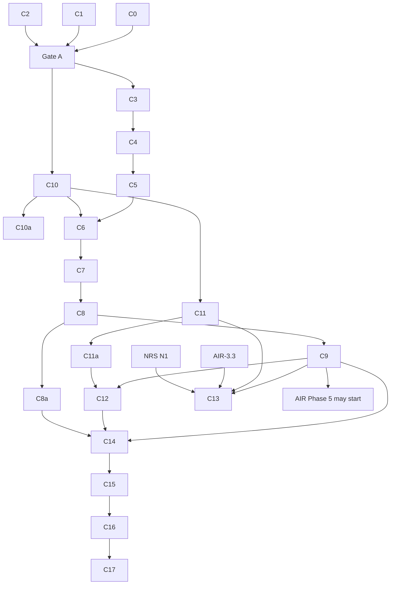

<!-- SPDX-License-Identifier: CC-BY-SA-4.0 -->

# Plan: Computable contract substrate

**Unit ID:** `computable-contract-substrate` (CCS)
**Unit type:** multi-slice unit, single machine R, in tranches with human gates (as
[normative-rule-substrate](normative-rule-substrate.md) §3)
**Status:** Proposed, awaiting human review. All §8 decisions taken (CC-D8 on 2026-10-01)
**Trigger:** human request, 2026-09-30, after testing the Instrument redesign against a package
policy, an IUA binding authority and the Lloyd's CBAA collateral
**Sketches:** [computable-contract-substrate.md](../sketches/computable-contract-substrate.md) (the
design and the scenario catalogue S1 to S101), [contract-amounts.md](../sketches/contract-amounts.md)
(the amounts catalogue A1 to A58),
[instrument-terms-and-legal-relations.md](../sketches/instrument-terms-and-legal-relations.md) (the
first design, superseded)
**Status record:** [computable-contract-substrate.md](../status/computable-contract-substrate.md)
**ADRs:** A-104 (retitled), A-106 (retitled), A-112, A-113, all to be drafted. A-105 and A-109 are
revised in NRS
**Absorbs:** NRS slice N4 and the Behaviour part of N8. Changes NRS N2, N5 and N6 (§6)
**Precedes:** applied-insurance Phase 5 (AIR epic §3b) and Open CBAA's migration (§7)

---

## 1. Problem

LATTICE's Instrument layer holds a structural `ins:Obligation`, but no model of contract wording, 
legal relations beyond one class, templates, amendments or time. Open CBAA built the wording and 
meaning it needed locally (`wim:`, `stm:`, `agr:`), and those are general to every computable contract, 
not specific to binding authorities. Testing a relational redesign against four instruments found 101
scenarios the substrate must model, 13 of which the first redesign got wrong or missed, and a separate
catalogue of 58 amount constructs. Behaviour imports Instrument for one `rdfs:range`, which blocks
Instrument from building on Behaviour's state machinery.

## 2. Scope

**In scope.**
- A new Wording layer from Open CBAA's `wim:` and the general parts of `agr:`.
- Instrument rewritten from the sketch, taking the general parts of `stm:`.
- Behaviour moved below Instrument and split into configuration and runtime documents, with
  occasions, records and the evidence rule (sketch §7).
- Instrument's regimes and legal triggers as specialisations of Behaviour configuration, and a
  template library (sketch §5.11, §7.3, §7.4).
- A deep dive on nested states, history and concurrent regimes (sketch §7.10).
- A design-time import guard (law B7).
- Compiler support for per-class evaluation.
- Eight neutral example instruments covering every scenario, with a how-to guide.
- The insurance renderings, handed to AIR Phase 5 and Open CBAA.

**Out of scope.** Contract amounts beyond their catalogue (a later unit, fed by
[contract-amounts.md](../sketches/contract-amounts.md)). Norm priority (NRS N10). Interchange (NRS
N12). A native evaluation engine.

## 3. Governing decisions

| ADR | Title | Decides | Drafted in |
|---|---|---|---|
| A-112 | Wording layer | the layer, its position between Eligibility and Instrument, and Behaviour moved below Instrument (both amend A-01), its contents | C0 |
| A-113 | Breaking changes at major version zero | a breaking change to a 0.x layer takes a MINOR bump, marked breaking in its release row and ADR (clarifies A-86) | C0 |
| A-104 | Instrument: terms and legal relations (retitled from "Deontic extension of Instrument") | the rewrite, superseding A-07b, carrying A-96 onto terms. Regimes, legal triggers, `ins:appliesInState`, `ins:computedBy`, the template library and `ontology/instrument/templates/` | C1 |
| A-106 | Behaviour configuration, runtime, occasions and records (retitled from "Compensation chains and violation records") | the configuration and runtime split, `bhv:targets` with no range, `bhv:forSubject` relaxed, engine-setting defaults, no required effect, the evidence rule (B6), occasions, act, breach, exercise, determination and deemed-fact records, laws B1 to B8. Alignment with Instrument is by sub-class and sub-property (sketch §7.3), with no compiled wiring | C2 |
| A-109 | The importable rule-body fragment (NRS N2) | revised: a read of a recorded occasion state is admitted when stratified | NRS N2 |
| A-105 | Closure declarations (NRS N5) | revised: a contract's deeming is a closure source, determinations and burden | NRS N5 |

## 4. Slices

Sizing: 0.5 to 4 agent-days, one or two modules, a Validation Pack of 3 to 15 test cases. Each
slice's brief ("in detail" section plus Validation Pack skeleton) is written on `main` before its
branch.

### Tranche A: decisions, no ontology change

| Slice | Content | Output |
|---|---|---|
| C0 | draft A-112, A-113, and the ADR-A-C2 addendum (CC-D7) | three documents, Proposed |
| C1 | draft A-104 from the sketch §5, §6, §7.3, §7.4, laws I1 to I16 | ADR, Proposed |
| C2 | draft A-106 from the sketch §7, laws B1 to B8 | ADR, Proposed |

Gate A: the human accepts A-104, A-106, A-112 and A-113.

### Tranche B: Wording layer

| Slice | Content | Version impact |
|---|---|---|
| C3 | `ontology/wording` spec: wordings, elements, part-whole, rank keys, typing properties and contracts, content classes, segments, references, document objects, variables (sketch §4.1, §4.2) | new, 0.1.0 |
| C4 | tables (§4.3), assembly: inclusion modes, variation slots, inclusion conditions, assembled wordings, variable values (§4.4, §4.5) | 0.2.0 MINOR, vocab 0.1.0 |
| C5 | wording amendments (§4.6), shapes for W1 to W7, README | 0.3.0 MINOR, shapes 0.1.0 |

Wording imports Foundation, Vocabulary, Quantification and Eligibility. Nothing imports it until
C6, so tranche B cascades nowhere.

| Slice | Content | Version impact |
|---|---|---|
| F1 | Identifiers (CC-D9): `fnd:identifier` → `fnd:Identifier` with a scheme concept (under a scheme contract) and a value, usable on any identified thing: Coverholder PIN, LEI, syndicate number, agreement number, UMR. Uniqueness within a scheme among current versions as a shape | Foundation MINOR, cascading to all 14 importers. Runs in the Foundation window after Phase 2, in one cascade with NRS N9. C6 and C9 do not wait for it: instrument identifiers stay open-cbaa's `agr:umr` and AIR's `aeo:identifier` until F1, which then generalises them |

Slice numbers are kept stable because other plans cite them. Tranche C now runs before tranche D,
and may run beside tranche B.

### Tranche C: Behaviour below Instrument

| Slice | Content | Version impact |
|---|---|---|
| C10 | the layer flip and the split (sketch §7.1, §7.2): configuration and runtime documents in one namespace, `bhv:targetsElement` replaced by `bhv:targets` with no range, `bhv:forSubject` range removed (Open CBAA L15), the Instrument import removed, `bhv:InstrumentTarget` deprecated in `behaviour-vocab` (C6 declares its replacement), engine-setting defaults, the at-least-one-effect restriction removed | Behaviour breaking MINOR (A-113). Re-pins `behaviour-vocab`, `applied/capacity`'s execution profile |
| C10a | import guard (B7): a design-time check that no layer imports or names a term of a layer above it, run over every catalogue entry | `tools/`, a `mise` check |
| C11 | runtime records: act, breach (derived and asserted), exercise, determination, deemed fact, acceptance. Occasions and their state space. The evidence rule (B6) as shapes (sketch §7.5, §7.6) | MINOR |
| C11a | deep dive: nested states, history and concurrent regimes (sketch §7.10). A sketch and an A-106 amendment first, then the ontology change. Settles B5 | MINOR. Blocks C12 only |

### Tranche D: Instrument rewrite

| Slice | Content | Version impact |
|---|---|---|
| C6 | instrument and term, the five relation classes with Exclusion, parties with groups, roles and `resolvedBy`, party details (`noticeAddress`, `operatesAt`), instrument identifiers, activity, scope, `maintains`, `fulfilledWhen`, `excepts`, qualifiers (§5.1 to §5.4, §5.7). `ins:InstrumentTarget` in Instrument's vocabulary | Instrument 0.7.0 to 0.8.0, breaking MINOR (A-113). Imports Wording and Behaviour configuration |
| C7 | legal triggers (`OnExercise`, `OnBreach`, `OnAct`, `OnCondition`, `OnExpiry`), `ins:Regime`, `ins:RegimeTransition`, `ins:stateKind`, `ins:computedBy`. Arising and ending on legal triggers, due, recurrence, `appliesInState`, survival, constitutive terms (Definition, Deeming), `appliesWithin`, classification, segments and per-segment definitions with union and overlap reporting (§5.5, §5.6, §5.10, §7.3, §7.4, §7.9, I15, I16). The explicit `bhv:` type shape (B4) | 0.9.0 MINOR |
| C8 | templates and binding, parameter bindings, encoding status (§5.9) | 0.10.0 MINOR |
| C8a | the template library (§5.11) in `ontology/instrument/templates/`: periods, switching and threshold regimes, relation patterns. Term and qualifier templates wait for the bases decision in [contract-amounts.md](../sketches/contract-amounts.md) §1.7 | templates 0.1.0 |
| C9 | amendments, consent rules, incorporation (with segment scope), `boundUnder`, `takesEffectWhen` (§5.8). Shapes for I1 to I16 | 0.11.0 MINOR, shapes |

Nothing outside Instrument imports Instrument once C10 lands, so tranche D cascades only to
Instrument's own documents and examples. No applied insurance module imports Instrument.

### Tranche E: evaluation

| Slice | Content | Where |
|---|---|---|
| C12 | the runtime evaluator for regimes and occasions: positioned stimuli for scheduled triggers (with NRS N6), derived triggers for `ins:OnBreach` and `ins:OnCondition`, occasion derivation, state occupancies with evidence (B6), history per C11a. B3 and B6 shown | `tools/`, after C9 and C11a |
| C13 | relation plans in the shared IR: per-class algorithms (§6.1), exception burden and `exe:ExceptionNotEstablished`, stratified state reading (§6.2), regime gating per state (§6.3, B8), finding, determination and deeming reads (§6.4). SPARQL reference first, SWRL for the positive subset | `tools/mork_compilers`. After AIR-3.3 and NRS N1 |

### Tranche F: examples and documentation

| Slice | Content |
|---|---|
| C14 | neutral examples E1 to E4 (sketch §9) with expected-decision tables and Behaviour traces, covering their scenarios |
| C15 | neutral examples E5 to E8, and a coverage test that every scenario S1 to S101 (except the amounts group and the merged S79) is shown by at least one example |
| C16 | how-to guides for Wording and Instrument (sketch §11), the substrate README's "computable contract" section, ontology architecture, SDS, data architecture |
| C17 | handoff: the insurance renderings list for AIR Phase 5 (policy scenarios) and Open CBAA (binding authority scenarios), and the Open CBAA migration notes (§7) |

## 5. Sequencing

Tranches A to D touch no file any AIR round-3 or round-4 slice touches. C13 shares
`tools/mork_compilers/` with AIR-3.3 and NRS N1 and follows both. C10a adds a check beside the
existing ontology checks and touches no AIR file.

## 6. Impact on other plans

| Plan | Change |
|---|---|
| [normative-rule-substrate](normative-rule-substrate.md) | N4 is delivered by C1 and C6 to C9. N8's Behaviour work is C11 and C12, and N8 keeps the chain checks. Breach chains are `ins:arisesOn` an `ins:OnBreach` trigger, not compiled wiring. N2 revised (stratified state reads). N5 revised (contractual deeming, determinations, burden). N6 is built with C12. N3 compares Obligation and Prohibition, and Permission and Exclusion. D2 and D3 answered |
| [applied-insurance-reference](applied-insurance-reference.md) §3b | the Phase 5 constraint becomes C9 accepted and merged. C10 re-pins `applied/capacity`, which the epic does not author before Phase 5. C6 no longer cascades to it |
| [phase 5](applied-insurance-reference-phase-5.md) | builds on Wording and Instrument. Term parameters qualify terms and relations, and their bases feed contract-amounts §1.7. Adds the policy renderings (AIG scenarios), insurance templates on the C8a library and, under CC-D3, the LMA WIM profile |
| [phase 6](applied-insurance-reference-phase-6.md) | claims are occasions of the policy's relations |
| [phase-3-plan](phase-3-plan.md) (platform operation plane) | the behaviour engine loads Behaviour configuration and writes runtime records, occasions and evidence (C10, C11, C12) |
| Open CBAA plan and integration spec | migration of §7 |

## 7. Open CBAA migration

Recorded here so the other repository can plan it. Details in the sketch §3 and §12.2.

| Open CBAA module | After migration |
|---|---|
| `wim` | removed or reduced to the LMA WIM profile if CC-D3 places the profile in Open CBAA |
| `stm` | `AuthorityGrant ⊑ ins:Power` with its envelope mechanism. Other kinds, templates, parameter bindings and encoding status come from Instrument |
| `agr` | UMR, markets, CBAA roles. The M12 regimes become `applied/insurance` templates on the C8a library. Agreement versions become `ins:Instrument`s expressed in `wrd:Wording`s |
| `rsk` | unchanged, with `rsk:BoundPolicy ⊑ ins:Instrument` and `rsk:boundUnder ⊑ ins:boundUnder` |
| example BA-2026-001 | re-expressed, joined by the binding authority scenario renderings |
| decisions | D22 holds as I13. D23 resolved. D25 changed. I6 closed. L15 fixed upstream |

## 8. Decisions

None of these may be taken by the agent.

| # | Decision | Recommendation | State |
|---|---|---|---|
| CC-D1 | Name of the lower layer | Wording (`wrd:`), "computable contract" for the composition (sketch §1.1) | **decided 2026-09-30** |
| CC-D2 | Position of Wording | between Eligibility and Instrument | **decided 2026-09-30** |
| CC-D3 | Home of the LMA WIM profile | `applied/insurance/wording/` in LATTICE | **decided 2026-09-30** |
| CC-D4 | Scope of A-113 | every 0.x layer | **decided 2026-09-30** |
| CC-D5 | Templates in the substrate | yes | **decided 2026-09-30** |
| CC-D6 | Table structure | rows in the wording, columns at the instance, cells as variable values | **decided 2026-09-30**, with long lists as multi-valued variables |
| CC-D7 | Clean-room examples | insurance examples allowed in the substrate beside other-domain ones | **decided 2026-09-30, amended** (below) |
| CC-D8 | Gating by state, and the Behaviour and Instrument relationship | Behaviour below Instrument, split into configuration and runtime. Regimes and legal triggers specialise Behaviour (sketch §6.3, §7) | **decided 2026-10-01** (below) |
| CC-D9 | Where identifiers live | Party | **decided 2026-09-30: Foundation**, slice F1 |
| CC-D10 | A defined word meaning several parties when the instrument is silent | Undetermined until the graph holds an assertion of how the parties act | **decided 2026-09-30, amended** (below) |
| CC-D11 | Pieces of text, and parts of a contract | `wrd:TextPart`. Sections as parts of one instrument, named Section, no contract-of-contracts for now | **decided 2026-09-30** (sketch §5.10) |

**As recorded on 2026-09-30 and 2026-10-01:**
- **CC-D7.** ADR-A-C2 is relaxed for this unit's examples. Insurance examples may sit in the
  substrate provided every scenario is also shown in another domain's example, and the insurance
  examples are not substantially more comprehensive than the others. The relaxation is an
  addendum to ADR-A-C2, drafted in C0, and C15's coverage test checks both conditions per scenario.
- **CC-D10.** A relation that resolves to a group whose mode of acting the instrument does not state
  is Undetermined until the graph holds an assertion of that mode (several, joint, joint and
  several, any one). The assertion may come from any source the graph accepts, a later amendment,
  a deeming, a market default declared as data, or a recorded reading. It is not a person's
  approval step.
- **CC-D8.** Behaviour drops its Instrument import and sits below Instrument, in configuration and
  runtime documents of one namespace. Instrument imports configuration only. `ins:Regime`
  (synonym "Dispensation") specialises `bhv:StateSpace`, and the legal triggers specialise
  `bhv:TriggerDefinition`, with ranges set and SHACL enforcing use. No `ContractState` or
  `StateChange` class. Every state entry is recorded (B6). Static parameters stay in Instrument,
  dynamic quantities live in capacity through a Surface projection capacity defines. A state may
  parameterise a comparison, never vary within one (B8). The word "lifecycle" is not used in the
  T-Box, and "basis" is reserved for limits, deductibles and premiums.

## 9. Validation

Each slice has a Validation Pack at `docs/developer/validation/computable-contract-substrate-<slice>.md`
and a `LOG.md` row at sign-off.

| Slice | Levels | One command |
|---|---|---|
| C0 to C2 | none, paper | link and prose checks |
| C3 to C11a | L1, L2 | `mise run build:ontology-catalog`, then `mise run check:ontology-versioning && mise run check:ontology-catalog` |
| C10a | L1 | the new import guard check, with its failing fixtures |
| C12, C13 | L1, L2, L3 | `mise run check:mork-compilers` |
| C14, C15 | L2, L3 | the examples' decision tests and the scenario coverage test |

**Mandatory adversarial probes.**
- **I7 (C13):** an Undetermined fulfilment must never yield a breach, and a breach must never rest
  on an unestablished exception. Both are shown to fail when deliberately broken.
- **I11 (C11):** an occasion's parties must not change after arising.
- **B6 (C11, C12):** a state occupancy with neither a transition execution nor evidence must fail.
- **B7 (C10a):** a fixture layer that imports a higher layer, or names a higher layer's term
  without importing it, must fail the guard.
- **B8 (C13):** a design-time comparison that reads a runtime record must be rejected.

Non-weakening applies throughout.

## 10. Documentation deltas

Root `README.md` (the new layer), `ontology/README.md`, the Wording and Instrument READMEs and
how-to guides, `docs/architecture/ontology-architecture.md` (layer order, Wording, Behaviour below Instrument, the configuration and runtime split),
`solution-design-specification.md` (evaluation of relations), `data-architecture.md` (occasions and
records), the ADR catalogue.

## 11. Risks

| # | Risk | Mitigation |
|---|---|---|
| R1 | The rewrite breaks the only consumer mid-work | Open CBAA pins release tags. Its migration starts after C9 and C12 |
| R2 | A Foundation change beyond F1 is found necessary | stop and re-plan. None is expected (sketch §12.1) |
| R3 | Scope grows into contract amounts | amounts stay a catalogue until their own unit |
| R4 | Examples drift into insurance terms | ADR-A-C2 check in every Validation Pack |
| R5 | The scenario catalogue loses rows as slices are cut | C15's coverage test fails on any scenario without an example |
| R6 | The Foundation cascade collides with Phase 2's peril authoring | F1 waits for Phase 2 and shares one cascade with NRS N9 |
| R7 | The nested-states deep dive grows | C11a blocks only C12. Instrument, templates and examples without history proceed |
| R8 | Removing Behaviour's range axioms breaks data relying on inferred types | C10's Validation Pack runs every Behaviour example and capacity fixture before and after |
