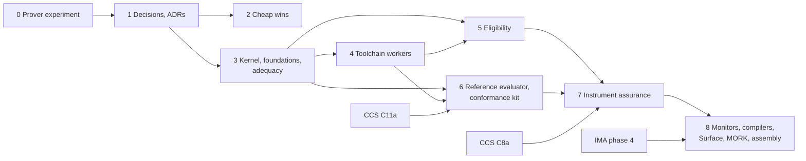

<!-- SPDX-License-Identifier: CC-BY-SA-4.0 -->

# Formal Methods: Epic

**Unit type:** Epic
**Epic:** `formal-methods` (FM)
**Epic status:** Proposed, awaiting human review. Phase 0 is detailed to slice level in its own
plan. Phases 1 to 8 are rolling-wave, each detailed at the preceding gate.
**Trigger:** human request, 2026-10-06
**Sketch:** [formal-methods.md](../sketches/formal-methods.md), with
[adequacy and architecture](../sketches/formal-adequacy-and-architecture.md),
[assurance records](../sketches/assurance-records.md),
[instrument assurance](../sketches/instrument-assurance.md),
[reference evaluator](../sketches/reference-evaluator.md) and
[toolchain workers](../sketches/formal-toolchain-workers.md)
**Prior work:** the engine notes in [`notes/rdf-engine/`](../notes/rdf-engine/)
**Phase plans:** [phase 0](formal-methods-phase-0.md). Later phases are outlined in §4
**Status record:** [formal-methods.md](../status/formal-methods.md)
**Governing model:** Epic Decomposition in [copilot-instructions](../../../.github/copilot-instructions.md)

---

## 1. Purpose

Bring formal methods into LATTICE's development lifecycle and its compilation toolchains:

- validate the correctness of every model and algorithm LATTICE specifies
- guarantee the behaviour of instruments to adopters
- check algorithms against LATTICE's architecture
- generate the toolchain's heavy tools from the specification, run as workers, never against the
  live graph

## 2. Principles

The sketch's FP1 to FP3 and goals G1 to G5 govern every phase. Five rules bind how the epic runs:

| # | Rule | Source |
|---|---|---|
| E1 | The ontology, shapes and laws stay normative. A formal theory states what they mean, and adequacy keeps the two in step | FP1 |
| E2 | Every claim names its method and bound. A bounded check is never reported as a proof | FP3, assurance records AR2 |
| E3 | No generated OCaml or Haskell runs against the live graph. Proved artefacts reach the runtime as data | sketch §13.1 |
| E4 | No phase blocks a CCS or insurml-alignment slice that does not need it. Formal work joins a slice when it is ready | G5 |
| E5 | Agents build and verify, the human commits, merges, tags and pushes. Toolchain installs are approved by the human | CCS practice |
| E6 | Toolchains, build outputs, generated binaries and generated data never enter git. Toolchain distributions and build outputs live under `.build/formal/`, and data that must not reach GitHub but is not a build artefact under `.local/formal/`. On `main`, `mise` tasks create the `.build/` locations and `.gitignore` excludes them. Every slice's handoff checks `git status` for them | human, 2026-10-06 |

## 3. Phase map

| Phase | Capability | Depends on | Milestone | Estimate (tokens) |
|---|---|---|---|---|
| 0 | **the prover experiment**: the same targets in Rocq and Isabelle/HOL, seeded defects, generated code, a worker smoke test, measured, and FM-D1 decided | none | FM1 | 0.4M to 0.8M |
| 1 | decisions and ADRs: the formal stack and its home, the assurance vocabulary, toolchain workers, languages | 0 | none | 0.1M to 0.2M |
| 2 | cheap wins: shape-derived property tests, design models for open CCS work, SMT checks, assurance links and the law report | 1 | FM2 | 0.5M to 1M |
| 3 | the kernel and foundations in the chosen prover, layer interfaces, the dependency check, the codec, adequacy | 1 | FM3 | 1M to 2M |
| 4 | toolchain workers: the first job family end to end | 3 | FM4 | 0.5M to 1M |
| 5 | Eligibility: denotation, the reference oracle for every compiler, the proved SPARQL core | 3, 4 | FM5 | 2M to 4M |
| 6 | the reference evaluator and the conformance kit for CCS C12 | 3, 4, CCS C11a | FM6 | 2M to 4M |
| 7 | instrument assurance: generic and template theorems, the property language, checkers, assurance records | 5, 6, CCS C8a | FM7 | 3M to 6M |
| 8 | monitors, proved SQL and Datalog compilers, Surface, MORK and assembly laws, InsurML parity for the shared fragment | 7, IMA phase 4 | FM8 | 2M to 4M |

Estimates are orders of magnitude for agent work, excluding human review, to be compared with
actuals.

Phase 2 needs no proof assistant and can run as soon as phase 1's ADRs are accepted.

## 4. Phases

### Phase 0: the prover experiment

Detailed in [its plan](formal-methods-phase-0.md). The same two targets in both provers, five seeded
defects, generated OCaml (and Haskell from Isabelle), a worker smoke test with a Python baseline, and
a scored comparison. Gate 0 decides FM-D1.

### Phase 1: decisions and ADRs

| Slice | Content |
|---|---|
| FM-1.1 | ADR: the formal stack, its principles, the prover chosen in phase 0, and its home (FM-D2) |
| FM-1.2 | ADR: the assurance vocabulary and its home (FM-D3) |
| FM-1.3 | ADR: toolchain workers and the language policy (FM-D9, FM-D10), with the job families' wiring |
| FM-1.4 | the design-model rule for semantic ADRs (FM-D8), as an addendum to the repository's Design First guidance |

### Phase 2: cheap wins

| Slice | Content | Sketch |
|---|---|---|
| FM-2.1 | property-based tests for `tools/mork_compilers`, `tools/persistence` and `tools/surface`, with generators derived from the shapes | parent §5 T1 |
| FM-2.2 | design models: an Alloy or Quint model of Vocabulary binding with scheme composition, ahead of CCS C8 (HQ-4) and IMA-D4a | parent §4, §8.2 |
| FM-2.3 | SMT checks for range sets and slot exclusivity, cross-checked against the C5 shapes | parent §8.3, §8.5 |
| FM-2.4 | assurance links for every existing law, and the law report in CI | assurance records |

### Phase 3: the kernel, foundations and adequacy

| Slice | Content | Sketch |
|---|---|---|
| FM-3.0 | the toolchain joins `main`: `mise` tasks to bootstrap the chosen prover and the OCaml toolchain (and the Haskell toolchain if FM-D10 admits it), tool locations under `.build/formal/`, `.gitignore` rules for every build output and generated artefact, and CI caching. `mise run bootstrap` stays usable without the formal toolchain, through a separate `bootstrap:formal` task | parent §15, E6 |
| FM-3.1 | the logic kernel: three values, information order, exact arithmetic, positions | parent §8.1 |
| FM-3.2 | Foundation and Vocabulary: supersession, keys, binding resolution with its theorems | parent §8.2 |
| FM-3.3 | Quantification: range sets and their normal form, comparisons with unresolved values | parent §8.3 |
| FM-3.4 | layer interfaces, the dependency check, the codec, adequacy over the existing corpus | adequacy and architecture |

### Phase 4: toolchain workers

| Slice | Content | Sketch |
|---|---|---|
| FM-4.1 | the worker wrapper, sandbox, packaging and provenance, with one job family. Tool images are built in CI and published to a registry, never committed. The repository holds sources, lock files and the allow-list of image digests | toolchain workers §7, E6 |
| FM-4.2 | the first family in production: `formal.slot-check`, measured against the Python baseline | toolchain workers §10 |

### Phases 5 to 8

Outlined in the parent sketch §8.4 (Eligibility), §9 and the reference evaluator sketch (phase 6),
§11 and the instrument assurance sketch (phase 7), and §8.5, §8.8, §10 and §12 (phase 8). Each is
detailed at the preceding gate.

## 5. Milestones

| # | Outcome | Closes in |
|---|---|---|
| FM1 | the prover is chosen on measured evidence, recorded in a comparison report | phase 0 |
| FM2 | every law of Eligibility, Wording, Behaviour and Instrument has an assurance link, and the law report gates CI | phase 2 |
| FM3 | the kernel and binding resolution are proved, and adequacy agrees with the shapes on every fixture of those layers | phase 3 |
| FM4 | a generated tool runs as a worker job end to end, with provenance and a measured speed-up over its Python baseline | phase 4 |
| FM5 | every Eligibility backend is differentially tested against the reference, and the SPARQL core is proved | phase 5 |
| FM6 | the C12 runtime evaluator passes the conformance kit, and fails it when deliberately broken | phase 6 |
| FM7 | a template theorem is proved, and an instance property is checked with its assurance record in a contract package | phase 7 |
| FM8 | a monitor synthesised from a property runs as data in the platform and reports a seeded violation | phase 8 |

## 6. Alignment with other work

| Unit | Item | Relationship |
|---|---|---|
| [CCS](computable-contract-substrate.md) | C8 and HQ-4 | FM-2.2 models scheme composition before C8 decides it |
| CCS | C11a, C12 | phase 6 gives C12 its reference and conformance kit. C12 does not wait for it |
| CCS | C13, C13a | phase 5 checks relation plans and the satisfiability encoding against the reference |
| CCS | C8a | phase 7 proves the template library's properties |
| CCS | C16a, the simplification sweep | laws with formal statements make removals checkable |
| [insurml-alignment](insurml-alignment.md) | IMA-D4a, IMA-4.2 | FM-2.2 informs scheme composition. Phase 8 proves InsurML parity for the shared fragment |
| insurml-alignment | phase 6 | assurance records travel in contract packages |
| [Technical debt](technical-debt.md) | TD-18 | proof and model checking add CI time. The test suite performance measures apply |
| the engine notes | the persistence planner | reuses phase 3's kernel if the custom engine is built |
| the platform | `workers/`, RabbitMQ, the store interface | phase 4 adds job families under the existing worker boundary |

## 7. Decisions

None of these may be taken by an agent.

| # | Decision | Recommendation | Needed by |
|---|---|---|---|
| FM-D1 | proof assistant | settled by phase 0 | gate 0 |
| FM-D2 | home of theories and tools | per-layer theories beside each layer, one build project under `tools/` | gate 1 |
| FM-D3 | assurance vocabulary and its home | in Executable's vocabulary | gate 1 |
| FM-D4 | first proof target | the kernel and binding resolution, which phase 0 begins | gate 0 |
| FM-D5 | the C12 evaluator | written in a platform language, held to the reference by the conformance kit | gate 5 |
| FM-D6 | distribution of generated code | toolchain binaries as worker jobs, queries and plans as data to the runtime, WebAssembly for the browser and tests | gate 1 |
| FM-D7 | instance property language | MFOTL over LATTICE atoms, read three-valued, with controlled English generated | gate 6 |
| FM-D8 | where design models are required | every ADR that adds or changes a law | gate 1 |
| FM-D9 | how generated tools run | worker jobs, one subprocess per job | gate 1 |
| FM-D10 | languages | OCaml, Haskell builds as a CI check if phase 0 shows them nearly free, Haskell tools used as tools | gate 1 |

## 8. Risks

The sketch's FR1 to FR9 apply. Specific to running the epic:

| # | Risk | Mitigation |
|---|---|---|
| FR10 | phase 0 is inconclusive | its decision rule (phase 0 plan §6) picks on weighted scores, and a tie goes to the prover with stronger counterexample finding, since G1 is primary |
| FR11 | formal work competes with CCS on machine R | E4, and phases scheduled in CCS gaps |
| FR12 | toolchains drift between developers' machines | pinned through `mise` from phase 1, and binaries built only in CI images |

## 9. Out of scope

Running generated code against the live graph. Verifying third-party engines. Replacing the Python
compilers wholesale. Mechanising SPC's session-type metatheory, which waits for its own decision.

## 10. Documentation deltas

At each gate: root `README.md` (new directories, and the `bootstrap:formal` task), `mise.toml`, `ontology/README.md` and each layer README whose
laws gain formal statements, `docs/architecture/ontology-architecture.md` (the formal stack),
`solution-design-specification.md` (toolchain workers), `data-architecture.md` (assurance records),
`docs/architecture/semantic-platform.md` (new job families), the ADR catalogue, and
`docs/developer/INDEX.md`.
