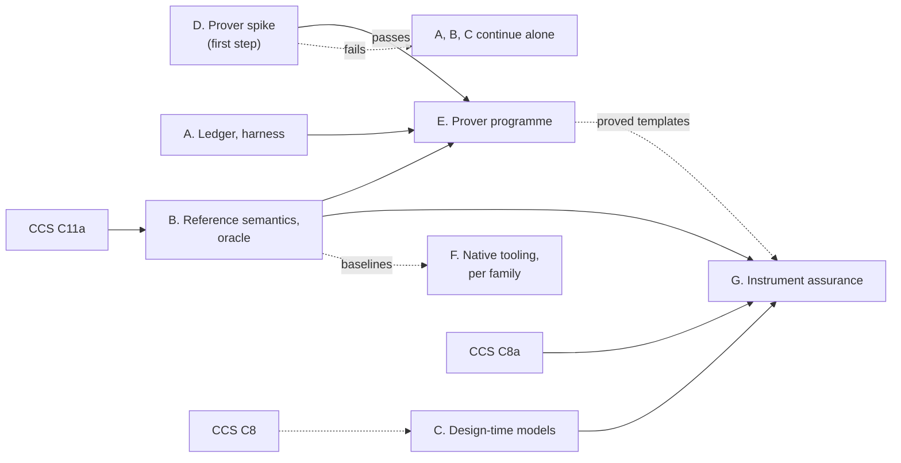

<!-- SPDX-License-Identifier: CC-BY-SA-4.0 -->

# Formal Methods: Epic

**Unit type:** Epic
**Epic:** `formal-methods` (FM)
**Epic status:** Proposed, re-sequenced into tracks on 2026-10-06 after review
([response](../notes/formal-methods-review-response.md)). Track D's spike, the prover experiment,
completed 2026-10-06: FM-D1 decided (Isabelle/HOL). Gate D is not yet fully closed (two open
criteria, status record). Other tracks are rolling-wave, each detailed when it starts.
**Trigger:** human request, 2026-10-06
**Sketch:** [formal-methods.md](../sketches/formal-methods.md), with
[adequacy and architecture](../sketches/formal-adequacy-and-architecture.md),
[assurance records](../sketches/assurance-records.md),
[instrument assurance](../sketches/instrument-assurance.md),
[reference evaluator](../sketches/reference-evaluator.md) and
[toolchain workers](../sketches/formal-toolchain-workers.md)
**Prior work:** the engine notes in [`notes/rdf-engine/`](../notes/rdf-engine/)
**Plans:** [the prover spike](formal-methods-phase-0.md) (track D). Others are outlined in §4
**Status record:** [formal-methods.md](../status/formal-methods.md)
**Governing model:** Epic Decomposition in [copilot-instructions](../../../.github/copilot-instructions.md)

---

## 1. Purpose

Bring formal methods into LATTICE's development lifecycle and its compilation toolchains:

- validate the correctness of every model and algorithm LATTICE specifies
- guarantee the behaviour of instruments to adopters, stating every guarantee's method, scope and
  assumptions
- check algorithms against LATTICE's architecture
- run heavy toolchain work natively where measurement shows it pays, as workers, never against the
  live graph

## 2. Principles

The sketch's FP1 to FP4 and goals G1 to G5 govern every track. Nine rules bind how the epic runs:

| # | Rule | Source |
|---|---|---|
| E1 | The literate README stays the one normative source. Shapes and the theory's closed datatypes are generated from it. Laws in the theory are hand-written, with their statements extracted back into it | FP1, FM-D12 |
| E2 | Every claim names its method, scope, bound and assumptions. A bounded check is never reported as a proof. Every assurance statement anywhere is generated from the record | FP3, assurance records |
| E3 | No generated OCaml or Haskell runs against the live graph. Proved artefacts reach the runtime as data | sketch §13.1 |
| E4 | No track blocks a CCS or insurml-alignment slice that does not need it | G5 |
| E5 | Agents build and verify, the human commits, merges, tags and pushes. Toolchain installs are approved by the human | CCS practice |
| E6 | Toolchains, build outputs, generated binaries and generated data never enter git. Toolchain distributions and build outputs live under `.build/formal/`, and data that must not reach GitHub but is not a build artefact under `.local/formal/`. A host that needs a short path for native toolchains, as Windows does without long paths enabled, sets `LATTICE_FORMAL_ROOT` to a location outside the repository. On `main`, `mise` tasks create the `.build/` locations and `.gitignore` excludes them. Every slice's handoff checks `git status` for them | human, 2026-10-06 |
| E7 | Verification and performance are separate decisions. The prover is chosen for verification. Native tooling is chosen per job family, on measurement | review §3.2 |
| E8 | Every track declares its metrics and abandonment conditions before it starts (§6) | review §3.4 |
| E9 | Every tool runs on macOS, Windows and Linux hosts. A pinned container image is the reference route, and the only one whose verdicts are recorded. A native install is an optional route for authoring where it is cheap (§4, Environments) | toolchain spike, 2026-10-06 |

## 3. Tracks

Tracks A, B and C need no proof assistant and survive the abandonment of everything else. E starts
only if D passes. F runs on its own measurements. The tracks are staggered (decided 2026-10-06):

| When | What | Why |
|---|---|---|
| now, alongside the spike and CCS | C1 and C2. B1 and B2, kept small | C2 must land before CCS C8 decides HQ-4. B1 gives the spike an independent verdict on L15 and L16 |
| after gate D | A1 to A4. A5 joins track C | A1's ADR is written from the spike's first real claim record, digest, assumption audit and gate |
| with CCS C11a and C12 | B4 and its conformance kits | B4 follows C11a's semantics and lands before C12 needs its kits |
| with CCS C13a | C3 | the SMT slot checks serve C13a directly |
| per ADR, from then on | track C's design models | FM-D8 |

| Track | Delivers | Prover | Depends on | Estimate (tokens) |
|---|---|---|---|---|
| **D. the prover spike** (first step) | the kernel and one law carried end to end in Rocq and Isabelle/HOL, a scripted MINOR change, measured. FM-D1 decided | yes | none | 0.3M to 0.6M |
| **A. the ledger and the harness** | the assurance profile with its own shapes and fixtures. A claim for every existing law at its current level. The law report and the release gate. The adequacy harness over the existing corpus. Joint satisfiability, independence and non-vacuity of each layer's laws | no | its ADR | 1M to 2M |
| **B. the reference semantics and the oracle** | a hand-written executable reference in Python for the logic kernel, Eligibility, the evaluation context and Behaviour's macrostep, stated precisely in the literate READMEs. Differential tests of every compiler against it. Shape-derived generators. Regeneration as naturality, MORK's lattice laws and MCN's round trip as property tests. Conformance kits for CCS C12 | no | its ADR | 1.5M to 3M |
| **C. the design-time models, permanently** | Alloy and SMT skeletons per law family, so an ADR's model costs about an hour. Binding resolution with scheme composition, ahead of CCS C8 (HQ-4, IMA-D4a). Slot exclusivity and exhaustiveness by SMT, driven from Python (C13a) | no | none | 0.5M to 1M, then per ADR |
| **E. the prover programme** | the kernel with the rounding and residual theorem, binding resolution, the Eligibility denotation with one proved SPARQL compiler core behind a fragment gate, the combinator algebra, the evaluation context mechanised from track B's reference, templates in rely and guarantee form. Behaviour and Instrument stay at T0 to T4 until those layers settle | yes | D passed | 4M to 8M |
| **F. native tooling** | the worker infrastructure for every job family, Python or native. Native tools only for families whose Python baseline is measured as the bottleneck | no | its ADR | 0.5M per family |
| **G. instrument assurance** | the property language, generated satisfying and violating traces, model generation from compiled instruments, inductive invariants before bounded exploration, vacuity checks, monitorable fragments as runtime data | partly | B, C, and E for proved templates | 2M to 4M |

Estimates are orders of magnitude for agent work, excluding human review, to be compared with
actuals.

## 4. Tracks in outline

### Track D: the prover spike

Detailed in [its plan](formal-methods-phase-0.md): the logic kernel and Eligibility L15 and L16
carried end to end in both provers, a scripted MINOR change, seeded defects, and ten weighted
measures, with abandonment conditions. Gate D decides FM-D1.

### Track A: the ledger and the harness

| Slice | Content | Sketch |
|---|---|---|
| A1 | ADR: the assurance profile of EARL, PROV-O, SHACL validation reports and in-toto, in Executable's vocabulary (FM-D3), with its own shapes and fixtures | assurance records |
| A2 | a claim for every existing law, at the level it merits today (mostly shape checks and reviews), with statement digests where a statement exists | assurance records §3 |
| A3 | the law report and the release gate, with the rules of assurance records §5 | assurance records §5 |
| A4 | the adequacy harness over the existing corpus: shape verdicts, track B's reference verdicts where they exist, coverage, laws with no negative fixture, and the list of unformalised semantic commitments | adequacy and architecture §4 |
| A5 | joint satisfiability, independence and non-vacuity of each layer's laws, by Alloy or SMT, as report columns | sketch §5, review §4.12 |

### Track B: the reference semantics and the oracle

| Slice | Content | Sketch |
|---|---|---|
| B1 | the reference for the logic kernel and Eligibility, in Python, with the semantics stated precisely in the literate README | reference evaluator §2 |
| B2 | differential tests of the Eligibility compilers against B1, with shape-derived generators, and a named negative fixture for hierarchical match with exclusions | sketch §8.4 |
| B3 | property test: regeneration as naturality (ADR-A27). MORK's lattice laws and MCN's round trip are deferred (the human's own call, and a missing encoder, respectively) | sketch §8.8, §10 |
| B4 | the reference for the evaluation context and Behaviour's macrostep, with `DesignEnv` and `RunEnv`, the rounding and residual rule, and conformance kits for C12 | reference evaluator §3, §4 |

Detailed in its own [sketch](../sketches/formal-methods-track-b.md) and
[plan](formal-methods-track-b.md); status in [its status record](../status/formal-methods-track-b.md).
B1 done 2026-10-07 (`tools/reference/eligibility/`, `ADR-A-FM3` Proposed): the logic kernel and
Eligibility's denotation (L9-L16), ported from and verified against `tools/proofs/eligibility/`'s
Isabelle statements, 47 tests passing. B1's own scoping also resolved track E's E1.2: the
rounding/residual theorem belongs to this track's B4 and track E's E3/E4, not Quantification,
where E1.2 had gone looking and found nothing — track E's plan and status are corrected to match.

### Track C: the design-time models

Skeletons first (C1), then one model per ADR that adds or changes a law (FM-D8). C2 models binding
resolution with scheme composition ahead of CCS C8. C3 is slot exclusivity and exhaustiveness by SMT
for every condition kind, driven from Python, in step with CCS C13a.

Detailed in its own [sketch](../sketches/formal-methods-track-c.md) and
[plan](formal-methods-track-c.md); status in [its status record](../status/formal-methods-track-c.md).
C1 and C2 done 2026-10-06, HQ-4 and IMA-D4a read in full from `main` and this repository's own
plans first, confirming both were genuinely unresolved and waiting on this track. C2's checked
Alloy model found that the composition rule it was built to evaluate (union of membership, union
of hierarchy) does not by itself prevent two composed schemes disagreeing about a shared
concept's `broader` parent — recorded with the full counterexample in the model's own README, an
open decision for whichever ADR accepts scheme composition, not resolved by this track.

### Track E: the prover programme

Gate D passed (FM-D1 decided: Isabelle/HOL, [ADR-A-FM1](../../architecture/decisions/ADR-A-FM1-formal-methods-prover-choice.md)).
Detailed in its own [sketch](../sketches/formal-methods-track-e.md) and
[plan](formal-methods-track-e.md); status in [its status record](../status/formal-methods-track-e.md).
Its order: E1 the kernel with the rounding and residual theorem, and binding resolution (split
into E1.0 to E1.3 by the plan, since binding resolution waits on track C's C2; the kernel's home
is decided, FM-D2, ADR-A-FM2, `tools/proofs/`). E2 the Eligibility denotation and one SPARQL
compiler core, with the mapping of "not a value" to Undetermined as its first theorem, a
mechanical fragment gate, and a cross-store conformance suite. E3 the combinator algebra. E4 the
evaluation context,
mechanising B4. E5 the template library in rely and guarantee form.

### Track F: native tooling

F1 is the worker infrastructure with the corrections of the workers sketch (cache key, verdict and
advisory parts, cancellation, tenant isolation, budgets, codec digests, attested builds). Each job
family then gets a Python baseline and a measured decision. Families bound by solvers stay Python.

### Track G: instrument assurance

Outlined in the [instrument assurance sketch](../sketches/instrument-assurance.md). Detailed when B4
and C3 exist.

### Environments, for every track

A toolchain spike on 2026-10-06 installed and ran both stacks on a Windows 11 host without
administrator rights, behind a proxy that re-signs TLS, natively and in Linux containers. Both
stacks proved a lemma, generated code, compiled and ran it, and read ASTs programmatically, so no
blocker was found for either prover. Its findings fix how every track runs tools:

| Finding | Consequence |
|---|---|
| native Rocq on Windows builds from source inside opam's own Cygwin, about three hours, longer with MetaRocq. GHC, cabal and Isabelle install from binaries in minutes | Rocq checks run from an image on every host. Native installs are optional, and for authoring |
| MetaRocq ran only in a container, and GHC's WebAssembly backend has no Windows host build | some capabilities exist only in Linux images, so the image route must exist on every host |
| paths over 260 characters broke ghcup where long paths are off | native toolchains on Windows take a short root outside the repository (`LATTICE_FORMAL_ROOT`, E6) |
| containers did not trust a TLS-re-signing proxy's root certificate, which the host trusts | an image build takes an optional certificate as a build secret, never stored in a layer, a file in the repository, or git |
| Git for Windows' MSYS tools shadowed Cygwin's on PATH and broke native OCaml linking | native Windows tasks set their own PATH order, never relying on the shell's |
| the spike's images were 4.6, 5.1 and 7.5 GB | images are slimmed under the rules below, and their size is a measure (track D's M7) |
| one download host redirected to plain HTTP, and one answered scripted requests with 403 | install scripts use mirrors and direct binary URLs, and a network probe checks every source first |
| each stack's generated code compiled under the other's compiler | code generation is not tied to the chosen prover |

**Routes.**

| Route | Hosts | Used for | Recorded |
|---|---|---|---|
| image | macOS, Windows and Linux developers, CI, and workers | every check, every build of a claim, every job. The only route for MetaRocq and the WebAssembly targets | yes: the image digest is the tool identity (FM-D15, assurance records AR1) |
| native | any host, per tool, where its install is measured cheap: Isabelle and GHC everywhere, Rocq through the Rocq Platform installers | interactive proof and editor support, which work poorly through a container | no: a native result is advisory until the image route reproduces it |

**Images use as little as they can.**

- One tool per image, built in stages: the runtime stage holds the toolchain and nothing used to
  build it. No package caches, sources, build directories or documentation, and no profiling
  libraries unless a job needs them.
- Built for `linux/amd64` and `linux/arm64`, so that Apple silicon runs them without emulation. A
  tool with no arm64 build is recorded as such, and runs under emulation only in tests.
- Base images, toolchain versions and fetched repositories are pinned by digest or commit.
- A container runs one job and is removed (`--rm`), as a non-root user, with a read-only root
  filesystem, `--network none`, and `--cpus`, `--memory` and `--pids-limit` set from the job's
  budget. Nothing stays running between jobs, so the only idle cost is the container engine.
- Caches that outlive a job, such as Isabelle session heaps and dune caches, live in volumes or
  under `.build/formal/cache/`, keyed by image digest.
- On macOS and Windows the container engine's virtual machine is capped (the engine's resource
  settings, and `.wslconfig` under WSL 2) and may be stopped when unused. Any OCI engine with a
  Docker-compatible CLI is acceptable (Docker Desktop, Colima, Podman). The plan relies on the
  image format and the CLI only.

**Tasks.** `mise` exposes, on every host:

| Task | Does |
|---|---|
| `check:formal-network` | probes every download source, flagging block pages and redirects |
| `bootstrap:formal-images` | pulls the pinned images, or builds them, with the optional certificate secret |
| `bootstrap:formal-native-<tool>` | optional, per tool. Calls the tool's own installer (opam, ghcup, the Isabelle bundle, the Rocq Platform). PowerShell on Windows through `run_windows`, shell elsewhere |
| `check:formal-smoke` | the smoke suite by the configured route: prove, generate, compile, run, read an AST, cross-compile |

One Python driver runs a tool by route (`LATTICE_FORMAL_ROUTE`, `image` by default), with a fixed
argument vector and private work directory. It is the driver a worker uses (FM-D9), so a job behind
Python behind RabbitMQ is tested locally on any host, with RabbitMQ in a container. The spike showed
the same works with a native binary built on Windows, for testing a compiled tool before its image
exists. PowerShell tasks split list arguments on commas themselves, and avoid variable names that
differ only in case, both found in the spike.

## 5. Milestones

| # | Outcome | Track |
|---|---|---|
| FM1 | the prover is chosen, or abandoned, on measured evidence that includes one law carried end to end and a MINOR change repaired | D |
| FM2 | every law of every layer has a claim record, the law report gates CI, and laws with no negative fixture are listed | A |
| FM3 | every Eligibility backend is differentially tested against the hand-written reference | B |
| FM4 | the C12 runtime evaluator passes its conformance kit, and fails it when deliberately broken | B |
| FM5 | scheme composition is modelled and checked before CCS C8 decides HQ-4 | C |
| FM6 | the first native job family is measured against its Python baseline and kept or dropped on the result | F |
| FM7 | a template claim in rely and guarantee form, and an instance property with its generated traces, are recorded and exchanged in a contract package | G |
| FM8 | the SPARQL compiler core is proved behind its fragment gate, and the cross-store suite runs | E |

## 6. Metrics and abandonment conditions

Standing metrics, reported per release:

| Metric | Measures |
|---|---|
| cost per law per assurance level | tokens and human review time to move one law up one level |
| proof-repair cost per MINOR layer change | tokens to repair proofs broken by a release, as a fraction of the slice's cost |
| adjudication rate | adequacy disagreements per release that a human had to decide |
| null-result rate | the share of jobs returning NotDecided, per family |
| native speed-up | per family, against its Python baseline |

Kill and continue criteria, declared now:

| Signal | Action |
|---|---|
| track D cannot carry L15 and L16 end to end within its budget in either prover | do not start E. Keep A, B and C |
| proof-repair cost exceeds 25% of slice cost across two consecutive releases | freeze the theory at the kernel. Everything above stays at T0 to T4 |
| adjudications exceed five per release across two releases | stop adding theory, and generate more of the closed portion from the README (FM-D12) |
| the null-result rate of `formal.property-check` stays above 30% for two releases | fix the method routing (inductive invariants first) or withdraw the instance tier |
| a native tool's speed-up is under five times its Python baseline | do not productionise that family |
| any assurance statement in a UI or document is not generated from the record | a release-blocking defect |

The thresholds are first values, to be revised at gate D with the measurements in hand.

**Gate D revision, 2026-10-06.** Track D measured a MINOR change's repair cost directly (plan
`formal-methods-phase-0.md` §4, M3): adding a fourth value reading cost +18/-6 lines in Isabelle
and +21/-7 in Rocq, against a `Reading.thy`/`Reading.v` of a few dozen lines. That is real
evidence the mechanism the "25% of slice cost" threshold targets behaves as expected (a small,
closed-world enum addition costs a correspondingly small, bounded repair), but the file it was
measured against is a spike toy, not a layer-sized theory: Eligibility's real `reading` (or its
track E equivalent) will be hundreds of lines with cross-references the spike's four-constructor
example does not have, so a percentage recalibrated from this sample would not be trustworthy.
**The 25% threshold stands, provisional**, per this section's own instruction, until track E's
first slice that changes a real layer theory under a real MINOR release gives a same-shape
measurement at production scale. The other four thresholds have no track D evidence at all (D
measured no adjudications, no `NotDecided` jobs, no native job family and no UI assurance
statement) and stand unrevised for the same reason: nothing has measured them yet.

## 7. Decisions

None of these may be taken by an agent.

| # | Decision | Recommendation | State |
|---|---|---|---|
| FM-D1 | proof assistant | settled by track D, or abandoned | **decided 2026-10-06: Isabelle/HOL**, by the corrected measures in [formal-prover-experiment.md](../notes/formal-prover-experiment.md), recorded in [ADR-A-FM1](../../architecture/decisions/ADR-A-FM1-formal-methods-prover-choice.md) |
| FM-D2 | home of theories and tools | per-layer theories beside each layer, statements extracted into the README, one build project under `tools/` | **decided 2026-10-06: `tools/proofs/`**, [ADR-A-FM2](../../architecture/decisions/ADR-A-FM2-formal-methods-theory-home.md) (not beside each layer; a developer-facing toolchain, per repository topology, not an ontology asset) |
| FM-D3 | assurance vocabulary | a profile of EARL, PROV-O, SHACL reports and in-toto, in Executable's vocabulary | open |
| FM-D4 | first proof target | the kernel with the rounding and residual theorem, then binding resolution | open |
| FM-D5 | the reference evaluator | hand-written in Python first (track B), mechanised later from it if track E proceeds. The C12 runtime is held to it by conformance kits | revised 2026-10-06 |
| FM-D6 | distribution of generated code | toolchain binaries as worker jobs, queries and plans as data to the runtime, WebAssembly for the browser, the add-in, interactive checks and tests | open |
| FM-D7 | instance property language | a metric first-order temporal logic over three-valued atoms, with prefix verdicts, rendered in controlled English, refusing non-monitorable properties for monitors | revised 2026-10-06 |
| FM-D8 | where design models are required | every ADR that adds or changes a law, with skeletons supplied by track C | open |
| FM-D9 | how tools run | worker jobs, one subprocess per job, native or Python decided per family on measurement | revised 2026-10-06 |
| FM-D10 | languages | OCaml for native tools, Haskell builds as an N-version check only if FM-D1's choice makes them nearly free | **decided 2026-10-06: Haskell and Scala**, both via Isabelle's `export_code`, Haskell demonstrated working, Scala documented and pending its own exercise. [ADR-A-FM1](../../architecture/decisions/ADR-A-FM1-formal-methods-prover-choice.md) |
| FM-D11 | Datalog's normative semantics | stratified with dual predicates, non-stratifiable programs refused | **decided 2026-10-06** |
| FM-D12 | direction of generation | from the literate README to shapes and theory datatypes | **decided 2026-10-06** |
| FM-D13 | the spike's end-to-end law | L15 and L16, with I7 first once C13 is specified | **decided 2026-10-06** |
| FM-D14 | licence of theories and generated code | decided per import, with the normative theory's licence chosen deliberately beside CC-BY-SA-4.0 | open |
| FM-D15 | tool identity in read sets | separate semantic inputs from tool identity. A tool change marks records stale and schedules re-verification, without invalidating them. Needs an ADR-A27 addendum (the invalidation rule), with the two kinds of read-set entry stated in ADR-A92's terms | **decided 2026-10-06**: semantic inputs invalidate, tool identity marks stale, a known soundness fix marks suspect, which fails the gate until re-verified |
| FM-D16 | how tools run on each host | the image route everywhere for checks, CI, claims and jobs, slimmed and capped as §4 sets out. Native installs optional, for authoring only (E9) | open |

## 8. Alignment with other work

| Unit | Item | Relationship |
|---|---|---|
| [CCS](computable-contract-substrate.md) | C8 and HQ-4 | track C models scheme composition before C8 decides it |
| CCS | C11a, C12 | track B gives C12 its reference and conformance kits. C12 does not wait for them |
| CCS | C13, C13a | track B checks relation plans. Track C supplies the SMT checks for C13a. I7 is track E's first Instrument target once C13 is specified |
| CCS | C8a | track G states the template library's claims in rely and guarantee form |
| CCS | C16a | laws with formal statements make simplifications checkable |
| [insurml-alignment](insurml-alignment.md) | IMA-D4a, IMA-4.2 | track C informs scheme composition. Assembly parity is a track B property test first and a track E theorem later |
| [Technical debt](technical-debt.md) | TD-18 | proofs and model checks add CI time, run through dependency-aware builds with deeper runs nightly |
| the engine notes | the persistence planner | reuses track E's kernel if the custom engine is built |
| the platform | `workers/`, RabbitMQ, the store interface | track F adds job families under the existing worker boundary |

## 9. Risks

The sketch's FR1 to FR12 apply.

## 10. Out of scope

Running generated code against the live graph. Timed automata, and tools whose licences exclude
commercial use. Verifying third-party engines. Replacing the Python compilers wholesale.
Mechanising SPC's session-type metatheory, which waits for its own decision.

## 11. Documentation deltas

At each track's gate: root `README.md` (new directories, the `bootstrap:formal-*` tasks, and the container engine each host needs),
`mise.toml`, `ontology/README.md` and each layer README whose laws gain formal statements,
`docs/architecture/ontology-architecture.md` (the formal stack), `solution-design-specification.md`
(toolchain workers), `data-architecture.md` (assurance records), `docs/architecture/semantic-platform.md`
(new job families), the ADR catalogue, and `docs/developer/INDEX.md`.
