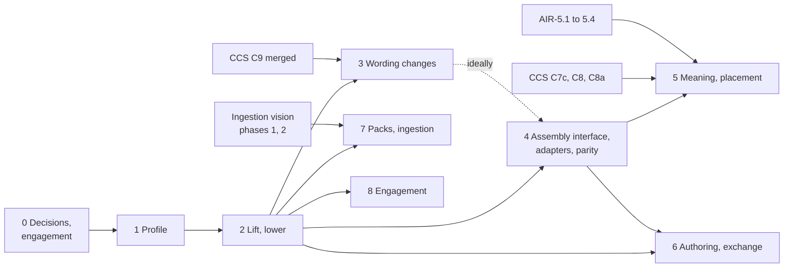

<!-- SPDX-License-Identifier: CC-BY-SA-4.0 -->

# InsurML Alignment: Epic

**Unit type:** Epic
**Epic:** `insurml-alignment` (IMA)
**Epic status:** Proposed, awaiting human review. Phase 0 is detailed to slice level in its own
plan. Phases 1 to 8 are rolling-wave. Each phase plan is written at the preceding phase's gate.
**Trigger:** human request, 2026-10-05, after reading the InsurML specification (Draft 1.0, 4 October
2026, Axiome Partners) and the two analysis notes
**Vision:** [insurml-alignment-vision.md](../../architecture/insurml-alignment-vision.md)
**Sketches:** [insurml-bridge.md](../sketches/insurml-bridge.md),
[insurml-toolchain-and-ai.md](../sketches/insurml-toolchain-and-ai.md),
[insurml-typing.md](../sketches/insurml-typing.md),
[wording-assembly-interface.md](../sketches/wording-assembly-interface.md)
**Analysis:** [comparison](../notes/insurml-and-lattice.md), [integration](../notes/insurml-integration.md),
[identity, for the InsurML team](../notes/insurml-identity.md)
**Phase plans:** [phase 0](insurml-alignment-phase-0.md). Later phases are outlined in §4
**Status record:** [insurml-alignment.md](../status/insurml-alignment.md)
**Governing model:** Epic Decomposition in the [lattice-lifecycle skill](../../../.claude/skills/lattice-lifecycle/SKILL.md)

---

## 1. Purpose

Make InsurML and LATTICE usable together and apart, as the vision describes: InsurML as the
document standard for insurance wording, LATTICE as the substrate for its meaning, execution and
governance, joined by an applied profile and a bridge of published kits. The epic absorbs AIR-5.9,
the LMA WIM profile, and builds it with InsurML in view.

## 2. Principles

The vision's AV1 to AV10 and the integration analysis's IP1 to IP11 govern every phase. Four rules
bind how the epic is run:

| # | Rule | Source |
|---|---|---|
| E1 | Every change to a LATTICE layer has an accepted ADR and a domain-neutral case before its slice starts | AV3, Design First |
| E2 | InsurML's owner permits publication of documentation and analysis of its current draft (IMA-D5). Market wording quoted in InsurML's examples keeps its own owners' terms, so fixtures stay clean-room | AV8, ADR-A-C2 |
| E3 | Proposals to InsurML go to its owner only after a LATTICE fixture shows them working. The human sends them. Agents send nothing | IQ-10 |
| E4 | Agents build and verify, the human commits, merges, tags and pushes. Every ontology change is classified under ADR-A86 and ADR-A113 and runs the re-pin cascade | CCS practice from C5 |

## 3. Phase map

| Phase | Capability | Depends on | Milestone | Estimate (tokens) |
|---|---|---|---|---|
| 0 | decisions, engagement, ADRs drafted | none | none | 0.15M to 0.3M |
| 1 | the InsurML profile (absorbs AIR-5.9) | 0 | IM1, in part | 0.5M to 1M |
| 2 | lift and lower kits, round trips, fidelity as tests | 1 | IM1 | 1M to 2M |
| 3 | Wording changes: transclusion, inline parts, references by identity | 2's findings, CCS C9 merged | IM2, in part | 1.5M to 3M |
| 4 | the assembly interface: models, hooks and the record in Wording, the assembler interface with baseline and InsurML adapters, renderer, verification and optimisation passes, parity | 2, ideally 3 | IM2 | 1.5M to 3M |
| 5 | meaning over components, placement records, deviation reports | 4, CCS C7c to C9, AIR-5.1 to AIR-5.4 | IM3 | 2M to 4M |
| 6 | authoring (Word add-in, web studio) and exchange kits, contract packages, companion LegalRuleML | 2, 4, the XML egress ADR | IM4, IM5 | 2M to 4M |
| 7 | wording teaching packs, compact form, library index, ingestion with InsurML as structure target | 2, ingestion vision phases 1 and 2 | IM6 | 2M to 4M |
| 8 | standards engagement: proposals P-1 to P-16, profile re-pins per InsurML edition | continuous, from 2 | none | under 0.3M a round |

Estimates are orders of magnitude for agent work, excluding human review, to be compared with
actuals.

Phases 1 and 2 touch no file that CCS or AIR round slices touch, so they can run beside CCS. Phase 3
waits for CCS C9 so that the Wording cascade does not cross Instrument's rewrite (integration R4).

## 4. Phases

### Phase 0: decisions and engagement

Detailed in [its plan](insurml-alignment-phase-0.md). Paper only: an engagement brief for InsurML's
owner, the licence and edition record, and five ADRs drafted (the profile, the bridge tooling and
kits, the Wording assembly interface, transclusion, inline parts).

### Phase 1: the profile

`ontology/applied/insurance/wording/` with two documents (bridge §2.1): the market's typing of
Wording, and the alignment with one InsurML edition. Outlined slices:

| Slice | Content | Sketch |
|---|---|---|
| IMA-1.1 | module skeleton, element type scheme, scheme binding in an insurance binding scope, key schemes for identifiers and LWR codes | bridge §2, §4 |
| IMA-1.2 | containment shapes generated from InsurML's rules held as data, builder properties | bridge §2.2, §2.3 |
| IMA-1.3 | alignment document, the collision table as fixtures, clean-room component library | bridge §3, §14 |

### Phase 2: lift and lower

| Slice | Content | Sketch |
|---|---|---|
| IMA-2.1 | lift kit: XSLT 3.0 normalisation, emission, minted IRIs, identities and keys, provenance | bridge §5 |
| IMA-2.2 | lower kit: component files, manifests, derived variables for richer conditions | bridge §6 |
| IMA-2.3 | fidelity table as tests, golden round trips, the MORK record of the structure mapping | bridge §5.3, §14 |

### Phase 3: Wording changes

Each slice follows its accepted ADR, after CCS C9 is merged.

| Slice | Content | Sketch |
|---|---|---|
| IMA-3.1 | transclusion, law W8, W3 and W5 read through transclusions | bridge §8 |
| IMA-3.2 | inline parts, W2's fourth form | bridge §9, §13 |
| IMA-3.3 | references to a persistent identity with display text: **moved to CCS C8b** (2026-10-06), since CCS C8's stated meaning names variables by identity and the text should too. This epic's lift adopts it | bridge §11 |

Clause dependencies and content status stay in the profile unless a neutral case appears
(IMA-D9).

### Phase 4: the assembly interface and the compiler passes

Designed in the [assembly interface sketch](../sketches/wording-assembly-interface.md). Its Wording
changes follow the ADR drafted in IMA-0.8, after CCS C9, with phase 3.

| Slice | Content | Sketch |
|---|---|---|
| IMA-4.1 | assembly models, the record's new terms (`wrd:assembledUnder`, resolution and numbering records), diagnostics for each stage, laws WA1 to WA7 | assembly §5, §7, §11 |
| IMA-4.1a | assembler interface and the baseline adapter: Eligibility-decided inclusion with three values and declared treatments, alternatives, transclusions, resolution records | assembly §6, §8, bridge §10, §11 |
| IMA-4.1b | InsurML assembly model in the profile, and the InsurML adapter over the lifted graph | assembly §10 |
| IMA-4.2 | parity suite: baseline against InsurML adapter, and InsurML adapter against InsurML's processor, over every fixture configuration | assembly §8, bridge §7 |
| IMA-4.3 | renderer and numbering, with the rule chosen for Q32 | toolchain §7 |
| IMA-4.4 | verification passes: references in every configuration, dependency acyclicity. Alternatives for every condition kind join when CCS C13a lands | toolchain §3 |
| IMA-4.5 | optimisation passes: question plans, dead components, specialisation | toolchain §3 |

### Phase 5: meaning and placement

Meaning templates over component versions, limits and excesses as term parameters, market regimes
as templates, definitions by scope, endorsements as amendments, placement records and deviation
reports. Outlined at the Phase 4 gate, with AIR Phase 5 and CCS C9 in view.

### Phase 6: authoring and exchange

The Word add-in and the web studio (each an `apps/` ADR), the exchange kits of toolchain §7.1, the
contract package, and the companion LegalRuleML document using the runtime pipeline. Outlined at
the Phase 4 gate.

### Phase 7: teaching packs and ingestion

An ADR extending the teaching-pack pattern beyond MORK, the structure and meaning packs, the
compact form measured against constrained decoding, the versioned library index, and ingestion with
InsurML as the structure target, measured against hypotheses H1 to H6 (toolchain §9.6). Outlined at
the Phase 2 gate, with the ingestion vision's phase 1 tooling in view.

### Phase 8: standards engagement

Each round takes proposals proven by fixtures, writes them up for InsurML's owner, and re-pins the
profile when InsurML publishes an edition.

## 5. Milestones

| # | Outcome, exercised end to end on clean-room fixtures | Closes in |
|---|---|---|
| IM1 | a component library and two products lift into Wording under the profile and lower back, with every mapping row's grade tested | phase 2 |
| IM2 | one product assembles identically under InsurML's processor and LATTICE's assembler for every configuration, including a component transcluded into two products | phase 4 |
| IM3 | a placed contract with values, a chosen alternative, a modified clause and a manuscript clause yields its deviation report and bound meaning, and one regime runs to a decision that cites its fragment | phase 5 |
| IM4 | a component edited in Word arrives as a valid InsurML component version and lifts | phase 6 |
| IM5 | a contract package goes out and is lifted back with no loss beyond declared fidelity, including a companion LegalRuleML document | phase 6 |
| IM6 | clean-room documents are read into InsurML structure with library recognition, and H1 and H2 are measured against gold | phase 7 |

## 6. Alignment with other work

| Unit | Item | Relationship |
|---|---|---|
| [CCS](computable-contract-substrate.md) | C7c | its brief takes InsurML's scope-based definition resolution as input (bridge §11) |
| CCS | C8, C8a | parameter bindings from InsurML variables, market regimes as templates (phase 5) |
| CCS | C9 | gate for phase 3. Endorsements lifted from InsurML become amendments (phase 5) |
| CCS | C12, C13 | evaluate placed contracts (IM3) |
| CCS | C13a | verification of alternatives for every condition kind (IMA-4.4) |
| CCS | HQ-1 | a quote or proposal arriving as data is a placement without its words. Phase 5 tests HQ-1's options against it |
| [AIR](applied-insurance-reference.md) | AIR-5.9 | moved into phase 1, decoupled from Phase 5's deferral (IMA-D2) |
| AIR | AIR-5.1 to AIR-5.4 | meaning of limits, excesses and term relations (phase 5) |
| AIR | AIR-5.8 | the policy renderings gain InsurML forms |
| AIR | reference vocabularies | market, class of business and area of coverage schemes |
| [NRS](normative-rule-substrate.md) | N3 | the clash check as a verification pass |
| NRS | N12 and the LegalRuleML sketches | the companion LegalRuleML document (phase 6) |
| [Ingestion vision](../../architecture/ingestion-vision.md) | phases 1 and 2, Q2, Q9, Q11 | InsurML as a structure target, packs beyond MORK, digests for recognition (phase 7) |
| MTP | the generator | reused for wording packs under a new ADR (phase 7) |
| [XML egress](../sketches/xml-egress-and-transformation-kits.md), [wire protocol](../sketches/normative-wire-protocol.md) | kits and skins | InsurML kits beside the instrument kit, settings as a JSON skin (phase 6) |
| [Evaluation context](../sketches/evaluation-context.md) | ledgers | limits and excesses name the words each ledger account is read from |
| Platform phases 2 and 3 | ingestion and operation planes | artefact realm for component files, workers for lifts and assembly |
| Open CBAA, Open DARE | `wim:` removal, the proof of concept | Open CBAA imports the profile. The DOCX route becomes DOCX to InsurML to Wording, and the add-in writes InsurML |
| [Technical debt](technical-debt.md) | none new | Wording's `sh:prefixes` departs from house style but is valid SHACL. It is aligned with phase 3's Wording change |

## 7. Decisions

None of these may be taken by an agent. "Needed by" is the gate at which the epic stops without it.

| # | Decision | Options | Recommendation | Needed by |
|---|---|---|---|---|
| IMA-D1 | Target depth of integration | depths 0 to 6 of integration §1 | **decided 2026-10-05:** 5 for LATTICE. Depth 6 to be discussed with InsurML's owner | gate 0 |
| IMA-D2 | Move AIR-5.9 into this epic and start it before AIR Phase 5 | yes, or keep it in Phase 5 | yes. The profile needs Wording, not Instrument | gate 0 |
| IMA-D3 | Shape of the profile | one document, or a typing document and an alignment document (bridge §2.1) | **decided 2026-10-05:** two documents in one module | gate 0 |
| IMA-D4 | Typing | T1 to T5 ([typing sketch](../sketches/insurml-typing.md) §5) | T1 as the interim, T4 as the target once IMA-D4a lands | gate 0 |
| IMA-D4a | Scheme composition in Vocabulary, so one contract resolves to several schemes in a context | a Vocabulary ADR shared with CCS HQ-4, or none | the shared ADR, briefed with CCS C8 | CCS C8 |
| IMA-D5 | Publication of InsurML-specific material | public branches now, after InsurML's owner agrees, or a private branch until InsurML is released | **decided 2026-10-05:** InsurML's owner permits publication of documentation and analysis of the current draft, whose "not for release" marks its alpha state | gate 0 |
| IMA-D6 | Reuse | options A to D of integration §4.2, or transclusion (bridge §8) | transclusion after CCS C9, a profile reference element meanwhile | gate 2 |
| IMA-D7 | Inline structure | inline parts (bridge §9), or source XML only | inline parts | gate 2 |
| IMA-D8 | References | resolution records, or references to identity (bridge §11) | records now, identity with CCS C8b | gate 2 |
| IMA-D9 | Clause dependencies and content status | profile, or substrate | profile, substrate on a neutral case | gate 2 |
| IMA-D10 | Who assembles | InsurML first, LATTICE first, or both with parity | both with parity, starting from InsurML's processor | gate 3 |
| IMA-D11 | Lift technology | XSLT kit, MORK-compiled RML, or both | XSLT kit for execution, MORK record for review | gate 1 |
| IMA-D12 | Home of the bridge tools and kits | a project under `tools/`, kits under `contracts/` | as the topology ADR drafted in phase 0 proposes | gate 1 |
| IMA-D13 | First authoring front end | Word add-in or web studio | Word add-in | gate 4 |
| IMA-D14 | LegalRuleML beside InsurML | companion document, package, inside InsurML | companion document by default | gate 4 |
| IMA-D15 | Teaching packs beyond MORK | extend ADR-A44, or a new ADR | a new ADR | gate 2 |
| IMA-D17 | Adopt assembly through an interface in Wording, with InsurML's model as the insurance default | an interface (models, hooks, one record), a new Assembly layer, the profile only, or tools only ([assembly sketch](../sketches/wording-assembly-interface.md) §12) | the interface in Wording, adapters in tools, InsurML's model in the profile | gate 0 |
| IMA-D16 | Collaboration model with InsurML's owner | proposals only, joint working sessions, contribution to InsurML's repository | proposals after fixtures, with joint review of each profile release. Licence of any contribution decided by the human | gate 0 |

## 8. Questions for InsurML's owner

Integration §14 lists Q-1 to Q-10. Five more:

| # | Question |
|---|---|
| Q-11 | Can LATTICE run InsurML's processor and checks for the parity suite, and under which licence? |
| Q-12 | Would InsurML give inclusion entries IRIs (P-13)? |
| Q-13 | Would InsurML accept meaning as informational foreign content, never contractual (P-14)? |
| Q-14 | Would InsurML's owner write, or review, the doctrine of a structure teaching pack? |
| Q-15 | Which renumbering rule does InsurML intend after filtering (Q32), given that LATTICE numbers a chosen variant as its slot? |
| Q-16 | **Answered 2026-10-06:** an `iml:Contract` may be a template (a product form underwriters tailor case by case) or an instance (one client's bound policy in force) |
| Q-19 | What does the date in an instance contract's IRI mean, its effective date or the date it was recorded, and how is a backdated endorsement versioned? (identity note §6) |
| Q-20 | Is a renewal a new instance contract with its own identifier, or a new version of the old one? (identity note §6.2) |
| Q-21 | How does an instance name the template version it was drawn from, and how does a reader tell a template from an instance? (P-15, P-16) |
| Q-17 | Should the component type scheme stay one list, or would InsurML accept its facets (structure, document part, legal function, subject, guidance) as sub-schemes or collections? ([typing sketch](../sketches/insurml-typing.md) §3) |
| Q-18 | Would InsurML add an unversioned identity pattern for contracts, groups and components (identity note §8, P-8)? |

## 9. Risks

Integration R1 to R12 and the vision's R13 to R15 apply. Specific to running the epic:

| # | Risk | Mitigation |
|---|---|---|
| R16 | Phase 3 lands while CCS rewrites Instrument | phase 3 waits for C9 |
| R17 | The profile is built on a draft that changes before release | IB-Q1: name IRIs only until release, pin an edition after it |
| R18 | Apps grow beyond their slices | each app has an ADR and starts from the proof-of-concept's walking skeleton |
| R19 | AI work starts before the library holds reviewed meaning | phase 7 depends on phase 2, and its measures need a library to recognise against |

## 10. Out of scope

A LATTICE insurance markup. Changes to InsurML, which are proposals only. Presentation and house
style beyond the renderer's defaults. Market wording in public fixtures. A production contract
builder beyond the question plan and assembler.

## 11. Documentation deltas

At each phase gate: root `README.md` (new directories), `ontology/README.md` and the applied
insurance domain README (the profile), the Wording README (phase 3),
`docs/architecture/ontology-architecture.md` (the profile and the bridge),
`solution-design-specification.md` (assembly, kits, apps), `data-architecture.md` (component files
in the artefact realm), `ux-design.md` (authoring), the ADR catalogue, and `docs/developer/INDEX.md`.
