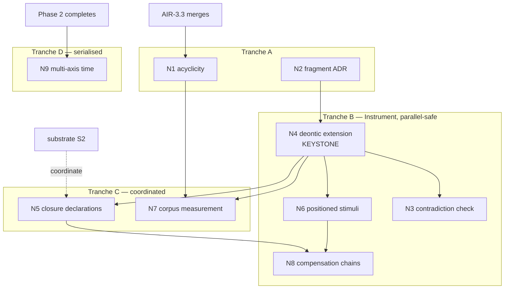

<!-- SPDX-License-Identifier: CC-BY-SA-4.0 -->

# Plan: Normative rule substrate

**Unit ID:** `normative-rule-substrate`
**Unit type:** Multi-slice unit, single machine. Deliberately not an epic (§3)
**Status:** Proposed, awaiting human review. No slice may start until §9's decisions are taken
**Trigger:** human request, 2026-09-29, following the LegalRuleML mapping analysis
**Sketches:** [legalruleml-mapping.md](../sketches/legalruleml-mapping.md) (the construct-level analysis),
[rule-layers.md](../sketches/rule-layers.md) and
[rule-layers-cross-check.md](../sketches/rule-layers-cross-check.md) (the R1 to R5 findings this unit delivers)
**Status record:** [normative-rule-substrate.md](../status/normative-rule-substrate.md)
**ADRs:** A-104 to A-111, all to be drafted. None exist yet. A-104 and A-106 are retitled and drafted in
[computable-contract-substrate](computable-contract-substrate.md) (CCS), which absorbs slice N4 and
the Behaviour part of N8 (2026-09-30)
**Runs alongside:** [applied-insurance-reference](applied-insurance-reference.md) epic, currently at round 3.
See §4 for the dependency analysis and the ordering verdict

---

## 1. Problem

LATTICE models admissibility well and normativity not at all. `ins:Obligation` is a structural
document element with an obligor and an obligee. It has no modality, no deadline, no fulfilment
test, no violation state and no link to what happens when it is breached. Every domain LATTICE
targets is regulative, not only insurance: lending covenants, trial protocols, employment terms,
licence conditions.

Three consequences follow, and they compound.

- **Applied modules will invent it locally.** Applied-insurance A-101 currently expects to draft
  term parameters on `ins:Qualifier` without a normative model of the obligation being qualified.
  The restatement boundary (ADR-AC1) exists to prevent exactly this.
- **Absence cannot decide anything.** "No notification arrived by the deadline" is permanently
  `Undetermined` under current semantics, which is correct and useless. Conformance level L5
  (ADR-A14) already requires closure assumptions that no vocabulary defines.
- **Deadlines have no replayable form.** The Phase 3 plan bans `now()` in guards and effects but
  does not say where time-driven transitions come from. The first obligation deadline will
  reintroduce a wall clock into the engine or a side channel outside the log.

## 2. Scope

**In scope.** The cross-check's R1 to R5, plus three items the LegalRuleML analysis added: the
importable rule-body fragment, multi-axis temporal scope, and norm priority.

**Out of scope.** A native evaluation engine, a Datalog sidecar, a controlled-language input
route, and any new runtime language. All are deferred in the cross-check §5 with triggers, and
nothing in this unit changes those triggers.

**Deliberately conditional.** LegalRuleML and ODRL interchange (N12) is built only if a trigger
fires. The standing ruling is that both are coverage checklists, not dependencies, and neither
syntax is adopted.

## 3. Why this is a unit and not an epic

The repository's epic model (Epic ⇒ Phase ⇒ Slice ⇒ Milestone) exists to coordinate several
machines and teams across quarters. This unit runs on one machine with one agent. Phase plans and
per-phase status records would add ceremony without adding coordination.

The unit is nevertheless epic-sized in content: thirteen slices, five ADRs on substrate layers,
and one change that cascades to fourteen files. Two safeguards replace the epic ceremony:

- **Tranche gates.** The slices group into five tranches (§7). Each tranche ends with a human
  validation gate, and the Foundation tranche additionally requires a quiet window in the
  applied-insurance epic.
- **One status record, updated per slice**, in the style of `ontology-semantic-versioning` rather
  than the per-machine sections of the applied-insurance epic.

This is a deliberate deviation from the epic decomposition model in `.github/copilot-instructions.md`
and needs human agreement before slice N1 starts. It is listed in §9 as decision D1.

---

## 4. Dependency check against the applied-insurance epic

This section answers the question directly: can this tranche proceed without interfering with the
applied-insurance epic, and if not, which goes first.

### 4.1 Method

Interference between two ontology work streams takes three forms, and each was checked separately.

| Form | How it bites | How it was measured |
|---|---|---|
| **Version cascade** | Bumping a layer forces every importer to re-pin its `owl:imports` in the same change (ADR-A98, ontology-versioning-policy). If the epic is concurrently authoring an importer, every one of its branches rebases dirty | Enumerated external importers per layer across the whole `ontology/` tree |
| **File contention** | Two slices editing the same file produce rebase conflicts, and a delimited-region file is worse because regions move | Read the remaining slice definitions in the epic's Phase 2, 3, 4 and substrate plans, and listed the files each touches |
| **Conceptual overlap** | Two slices deciding the same semantic question differently | Compared this unit's decisions against the epic's substrate track items S1 to S7 |

### 4.2 Cascade blast radius, measured

Counted by enumerating every `.ttl` under `ontology/` referencing each layer's version IRI, then
excluding the layer's own directory. "Applied modules hit" is the number of those importers that
sit under `ontology/applied/`, because those are the files the epic is actively authoring.

| Layer | External importers | Applied modules hit | Cascade risk while the epic runs |
|---|---|---|---|
| **foundation** | **14** | **5** — capacity, classification, insurance/common, insurance/peril spec and vocab | **severe** |
| vocabulary | 8 | 3 — classification, common, peril-vocab | high |
| quantification | 7 | 2 — capacity, peril | high |
| party | 4 | 1 — insurance/common | moderate |
| eligibility | 3 | 1 — applied/capacity | moderate |
| **instrument** | **1** | **0** — only `behaviour/spec/behaviour.ttl` | **negligible** |
| behaviour | 1 | 1 — applied/capacity | low |
| surface | 0 | 0 | none |
| persistence | 0 | 0 | none |

Two readings matter.

**Instrument is the safest layer in the repository to change right now.** One external importer,
no applied module, and the epic does not touch it until Phase 5, which decision D2 defers until
Open CBAA integration of Phases 1 to 4. The unit's largest deliverable, the deontic extension, is
also its least disruptive.

**Foundation is the most dangerous, and the danger is currently at its peak.** Of its five applied
importers, `insurance/peril/spec/peril.ttl` and `insurance/peril/vocab/peril-vocab.ttl` are the
two files that AIR-2.2 through AIR-2.7 author region by region across the whole of Phase 2. A
Foundation bump during Phase 2 forces every one of those six slice branches to re-pin a file it is
simultaneously rewriting.

### 4.3 File contention, slice by slice

Remaining epic slices and the files they touch, against this unit's slices.

| Epic slice | Touches | Contends with | Severity |
|---|---|---|---|
| AIR-2.2 to AIR-2.7 | `applied/insurance/peril/**` only, plus reads Quantification | nothing in this unit | none |
| AIR-3.3 | `tools/mork_compilers/` only, SWRL and OWL backends. No ontology change | **N1** (acyclicity shape and compiler refusal) and **N3** (design-time check) both touch `tools/mork_compilers/` | **moderate** |
| AIR-3.4, AIR-3.5 | `peril/crosswalk/`, `exposure/examples/`, `mork/examples/` | nothing | none |
| AIR-4.1 to AIR-4.6 | `applied/insurance/exposure/**` only | nothing | none |
| AIR-6.1 | `applied/insurance/submission/**` | nothing | none |
| Substrate S1 | Vocabulary, concept lifecycle | nothing | none |
| Substrate **S2** | **Eligibility spec**, HierarchicalMatch traversal choice | **N1** (Eligibility shapes), **N5** (Eligibility outcome path) | **moderate** |
| Substrate S4 | Quantification, occurrence grouping | nothing | none |
| Substrate S5 | Surface, generated classes from conjunctions | nothing directly. Conceptual note in §4.4 | low |
| Substrate S6 | Guidance text only | nothing | none |
| Substrate **S7** | **Foundation**, conflicting evidenced assertions of one attribute | **N9** (multi-axis temporal scope) shares the file. Conceptually adjacent to **N10** (priority) | **high** |

### 4.4 Conceptual overlap

| Epic item | This unit | Relationship |
|---|---|---|
| ADR-A103 set readings and negation (merged as AIR-3.2) | N5 closure declarations | **Complementary, not conflicting.** A103 gives classical negation over a value set. N5 gives a licence for absence to decide. They answer different questions and compose: a set reading says how to read several values, a closure says whether "no values" may mean "false" |
| S2 HierarchicalMatch traversal choice | N1 composition acyclicity | Both are Eligibility well-foundedness. S2 is acyclicity of scheme ordering, N1 is acyclicity of condition composition. Same shape, different graph. Worth authoring by the same hand |
| S5 Surface generated classes from conjunctions | N4 modality, N8 chains | Low. Surface materialises conjunctions of characteristics. This unit uses conjunction as a profile combination, which Eligibility already owns. No shared decision |
| **S7 Foundation assertion conflict resolution** | **N10 norm priority** | **Genuine adjacency.** S7 resolves conflict between two evidenced assertions of one attribute. N10 resolves conflict between two norms with opposing modality. Both are precedence models on Foundation-adjacent data. They should be designed by one hand or explicitly separated, or the repository acquires two precedence vocabularies that do not compose |

### 4.5 Verdict

**This unit can proceed now, in parallel, for most of its content. One slice must wait, and one
epic item must be coordinated.**

The ordering is not "rules first" or "insurance first" as a whole. It is per slice, and the
determining factor is cascade blast radius rather than subject matter.

| Verdict | Slices | Reason |
|---|---|---|
| **Proceed now, in parallel** | N2, N4 (now CCS), N6, N8 | Instrument and Behaviour only. One external importer, no applied module, no epic slice touches them until deferred Phase 5 |
| **Proceed now, sequenced behind AIR-3.3** | N1, N3, N7 | Share `tools/mork_compilers/` with AIR-3.3. AIR-3.3 is a round-3 slice and small. Waiting for its merge costs one round |
| **Coordinate with substrate S2** | N5 | Both touch Eligibility. Either author S2 and N5 together, or land S2 first and rebase N5 |
| **Serialise into a quiet window** | **N9** | Foundation, 14 importers, 5 applied. Must not run while Phase 2 authors the peril files |
| **Deferred, decision-gated** | N10, N11, N12, N13 | Depend on decisions in §9 and on earlier slices |

**Which goes first, stated plainly.** The rule work goes first, and specifically the Instrument
deontic extension (N4) goes first, for three independent reasons:

1. **It is the cheapest change available.** Its cascade reaches Behaviour, Behaviour's vocabulary
   and `applied/capacity`, none of which this epic is authoring (N4, version impact).
2. **The epic needs it.** The cross-check's sequencing constraint is that R1 must be accepted and
   Instrument bumped **before applied-insurance Phase 5 starts**, because A-101 expects to draft
   term parameters on `ins:Qualifier` without a normative model of the obligation they qualify.
   Doing it after Phase 5 means either reworking Phase 5 or accepting a local invention the
   restatement boundary forbids.
3. **The window is open now and closes later.** Phase 5 is deferred by D2 until Open CBAA
   integration of Phases 1 to 4. That deferral is precisely the window in which Instrument can be
   changed without touching anything the epic is building.

**The one hard ordering constraint in the other direction:** N9 (Foundation multi-axis time) must
come **after Phase 2 completes**, or it forces six actively-authored slice branches to re-pin a
file they are rewriting. Phase 2 has AIR-2.2 through AIR-2.7 outstanding. If multi-axis time is
needed sooner than that, the cost is a coordinated freeze across the epic, and that trade is the
human's to make, not the agent's. It is decision D4 in §9.

### 4.6 What would change this verdict

| If | Then |
|---|---|
| Phase 5 is un-deferred and starts early | N4 becomes urgent and blocking rather than merely first |
| S7 is pulled forward from the substrate track | N10 must merge with it, or one of the two must be abandoned |
| A Foundation change is found necessary inside N4, N5 or N8 | Those slices inherit N9's quiet-window constraint, and the parallel-safe verdict collapses. This is the single largest risk in the plan, and N4's first task is to confirm it is avoidable |

---

## 5. Governing decisions

None of these exist. Each is drafted inside the slice that needs it and must be Accepted before
that slice's implementation begins. Numbering starts at A-104 because A-103 is the highest
existing ADR and A-101 is reserved by the applied-insurance epic for term parameters.

| ADR | Title | Drafted in | Delivers |
|---|---|---|---|
| A-104 | Instrument: terms and legal relations (retitled from "Deontic extension of Instrument") | CCS C1 | cross-check R1, and the CCS sketch |
| A-105 | Closure declarations and the licence for absence | N5 | cross-check R2 |
| A-106 | Behaviour configuration, runtime, occasions and records (retitled from "Compensation chains and violation records") | CCS C2 | extends R1. Breach chains are `ins:arisesOnBreachOf`, violation is "breach" |
| A-107 | Norm priority and defeasibility | N10 | extends R1 |
| A-108 | Multi-axis temporal scope | N9 | new, from the LegalRuleML analysis |
| A-109 | The importable rule-body fragment | N2 | new |
| A-110 | Interpretation contexts | not scheduled. Recorded only | new, deferred |
| A-111 | LegalRuleML and ODRL interchange | N12, conditional | new |

A-104 amends ADR-A07b, which chose Instrument's minimal shape deliberately. That amendment is the
substantive architectural act of this unit and must be argued in A-104 rather than assumed.

---

## 6. Slices

Sizing follows the repository rule: 0.5 to 4 agent-days, one or two modules, and a Validation Pack
of roughly 3 to 15 test cases.

### Tranche A — Groundwork, no ontology version change

#### N1. Condition composition acyclicity (R4)

**Delivers** the cross-check's R4. **Touches** `ontology/eligibility/shapes/`, `tools/mork_compilers/`.

A SHACL shape and a compiler refusal for a cycle through `elg:hasCondition` across nested
profiles. ADR-A03 makes `elg:AdmissionProfile` a subclass of `elg:Condition`, so profiles nest and
a cycle is constructible. With negation (ADR-A103) a cycle has no well-founded outcome. Today
nothing prevents one, and the absence of one holds only because no fixture builds it.

Follows the existing `elg:HierarchyWellFoundednessShape` pattern, which discharges elg:L9 for
scheme ordering. Records the evaluation-order rule in the Eligibility README: a condition is
evaluated after every condition it composes.

**Version impact:** `eligibility/shapes/.version` MINOR, 0.2.0 to 0.3.0. Shapes are not imported,
so no cascade. No spec bump.

**Diagnostic added:** `exe:CompositionCycle`.

#### N2. Declare the importable rule-body fragment (A-109)

**Delivers** a decision, no code. **Touches** `docs/architecture/decisions/`.

Declares which rule bodies LATTICE can represent: tree-shaped, single-subject, no joins, no
deontic formulas in bodies, connectives as nested profiles. Names the refusals for everything
else. Independent of LegalRuleML and worth having regardless of whether the rest of this unit
proceeds.

**Revised 2026-09-30 (CCS sketch §6.2).** A condition may read the recorded state of another
relation's occasion, which is a fact, when the graph of breach, exercise and state-read edges is
acyclic. Deontic formulas stay refused. Needed for Side A D&O cover ("Non-Indemnifiable Loss", AIG
D&O 14), guarantees, and authority that depends on a regime's state.

#### N3. Self-contradiction design-time check

**Delivers** a genuinely new capability on existing machinery. **Touches**
`tools/mork_compilers/`, `platform/reasoning-testkit/`.

Answers: does any pair of norms in a contract impose opposing modalities over overlapping
activation conditions? This is satisfiability of the conjunction of two activation profiles where
the modalities are duals, and the existing reasoning harness (ADR-A83) can answer it. Detects a
contract that contradicts itself, which is a real and expensive drafting error.

Depends on N4 for the modality vocabulary, so it is sequenced after N4 despite sitting in
tranche A conceptually. Under the CCS design the pairs compared are an Obligation and a Prohibition
over the same activity, and an exception (Permission or Exclusion) that excepts nothing in scope. Listed here because it needs no gap closed beyond N4.

**Prerequisite added 2026-10-02: CCS C13a.** The OWL backend compiles only conditions bound to
the case by an evidence path. CCS slice C13a teaches it question-form conditions and builds the
joint-satisfiability task (`P ⊓ Q`) for variation slots. N3 uses the same task for clashes, so it
follows C13a or is built with it.

### Tranche B — Instrument and Behaviour, parallel-safe

#### N4. Deontic extension of Instrument (A-104, R1)

**Delivered by [CCS](computable-contract-substrate.md) C1 and C6 to C9 (2026-09-30).** D2 was
answered by the redesign in [instrument-terms-and-legal-relations.md](../sketches/instrument-terms-and-legal-relations.md)
and consolidated in [computable-contract-substrate.md](../sketches/computable-contract-substrate.md):
`ins:Obligation` is deontic, the document's structure moves to a new Wording layer, and the
qualifier-based `DeonticSpecification` below is superseded. The text below is the original slice,
kept as the record.

**The keystone slice.** **Touches** `ontology/instrument/spec/`, `vocab/`, `shapes/`,
`ontology/behaviour/spec/behaviour.ttl` (re-pin only), `ontology/instrument/examples/`.

Per the cross-check's R1 and the sketch §18, deontic modality enters Instrument rather than a new
layer. Terms: `ins:DeonticSpecification ⊑ ins:Qualifier` with four modality subtypes, bearer and
auxiliary party, activation and fulfilment profiles, deadline anchor and offset, strength, and the
achievement versus maintenance distinction. Obligation **state** is deliberately not declared here:
it is a Behaviour state space whose occupancies are derived artefacts following ADR-A102's pattern
exactly.

**First task, before any authoring:** confirm no Foundation change is required. If one is, this
slice inherits N9's quiet-window constraint and the plan's parallel-safe verdict collapses (§4.6).

**Clean-room requirement (ADR-AC2):** two non-domain worked examples first, a lending covenant
reporting duty with a cure period and a trial adverse-event reporting duty. Insurance examples
come later and must not drive the design.

**Version impact:** `instrument/spec` MINOR 0.7.0 to 0.8.0, vocab mirrored, shapes MINOR. The re-pin
in `behaviour/spec/behaviour.ttl` bumps Behaviour too (an import-only change takes the imported
bump level, ADR-A86 addendum item 1), which re-pins `behaviour-vocab` and
`applied/capacity`'s execution profile. No applied insurance module is affected. AIR-3.2 ran this
exact cascade.

**Laws:** N1, N2, N4, N10 from the sketch §18.3.

#### N6. Scheduled triggers as positioned stimuli (R3)

**Touches** `ontology/behaviour/spec/`, `vocab/`, and the Phase 3 plan text.

`bhv:ScheduledTrigger` and `bhv:DeferredActivation` fire through stimuli written to the stimulus
log by a scheduler, each carrying the valid time it represents. The engine never reads a clock.
Deadline expiry becomes an input at a position, so deterministic replay covers deadlines and a
backdated fact is ordered by the same rules as any other input. Allowance resets
(`bhv:resetRecurrence`) share the mechanism.

**Version impact:** `behaviour/spec` MINOR. One re-pin in `applied/capacity`.

**Built with CCS C12 (2026-09-30, revised 2026-10-01).** The legal triggers are Behaviour triggers (`ins:OnExpiry ⊑ bhv:TriggerDefinition`, CCS CC-D8), so nothing is compiled from `ins:arisesOn` or `ins:due`. C12's runtime evaluator turns each scheduled trigger into a positioned stimulus.

#### N8. Compensation chains and violation records (A-106)

**Touches** `ontology/instrument/spec/`, `shapes/`, `ontology/behaviour/`, `tools/mork_compilers/`.

An ordered, acyclic `ins:compensatedBy` chain, from which the Behaviour wiring is compiled rather
than hand-built. Violation and compliance as `fnd:DecisionRecord` derived artefacts per ADR-A92,
supporting both derived breach (a deadline passing) and asserted breach (an adjudicator's finding,
carrying `fnd:assertedBy`).

**Blocked on N5.** Without a closure licence a violation can never be derived and the whole chain
is inert.

**Revised 2026-09-30.** The chain is `ins:arisesOnBreachOf` on the secondary relation (it fans out,
where a `compensatedBy` list cannot), the Behaviour records are CCS C11 and the runtime evaluator
C12. Revised 2026-10-01: `ins:arisesOn` takes an `ins:OnBreach` trigger, a Behaviour trigger, so
there is no compiled wiring. N8 keeps the chain checks: acyclicity, and a permission, exclusion or power never breached.

**Laws:** N3, N5, N9.

### Tranche C — Eligibility and persistence, coordinated

#### N5. Closure declarations (A-105, R2)

**Touches** `ontology/persistence/`, `ontology/eligibility/`, `ontology/behaviour/`,
`tools/persistence/`.

A declaration that a fact family is authoritative and complete for a scope up to a position, so
absence may decide. Names the fact family, the authoritative source, the scope and the required
persistence profile of dense per-stream ordering with a blocking gap audit. The compiler refuses a
check that decides on absence unless a closure covers the fact family, and the refusal is a
diagnostic rather than a silent `Undetermined`. A decision that relied on absence records the
closure and the position, so a late fact at an earlier valid time supersedes it.

Fills the hole ADR-A14's level L5 leaves, where closure assumptions are required and undefined.

**Coordinate with substrate S2**, which also touches Eligibility.

**Diagnostic added:** `exe:NoClosureLicence`.

**Revised 2026-09-30 (CCS sketch §5.6, §5.7, §6.4).** Three additions:
- A contract's own deeming is a closure source: "deemed failed if … not provided within sixty days"
  licenses absence for that fact family (AIG D&O 3.A, CBAA M12 12.37.2).
- Determinations by a named party are decisive records, not evidence.
- The party relying on an exception bears the burden of establishing it. The diagnostic
  `exe:ExceptionNotEstablished` names that party.

#### N7. Measure the OASIS conformance corpus

**Touches** `test/conformance/` or a new fixture directory.

Runs the three OASIS worked examples against whatever exists after tranches A and B, and records
what imports, what refuses and why. Turns the gap list from an argument into a measurement, and
gives every later slice a baseline. Cheap, and the highest-information slice in the plan.

### Tranche D — Foundation, serialised

#### N9. Multi-axis temporal scope (A-108)

**Must not start while applied-insurance Phase 2 is live.** See §4.5.

**Shares its cascade with CCS slice F1 (2026-09-30),** which adds `fnd:identifier`. Both Foundation
changes land in one window and one re-pin of the 14 importers.

**Touches** `ontology/foundation/spec/`, `shapes/`, `vocab/`, plus a re-pin in all 14 importers.

Norms need several time axes. LegalRuleML names in-force, efficacy and applicability. Open CBAA
independently names transaction time, valid time, agreed date and operational date.
`fnd:TemporalScope` provides one interval and `fnd:hasTemporalScope` is functional. The proposal
is to relax it, with each scope carrying an axis concept bound by a `voc:SchemeContract`, so the
axis set is adopter-chosen.

**Version impact: MAJOR on Foundation**, cascading to 14 files including 5 applied modules. This
is the most expensive change the repository can make and the reason this slice is serialised.

### Tranche E — Deferred, decision-gated

| Slice | Content | Gate |
|---|---|---|
| **N10** | Norm priority and defeasibility (A-107) | D5. The cross-check's row J judges it "enough for current scope" and folds it into Phase 5. The sketch §22.3 offers evidence against. Also adjacent to substrate S7 |
| **N11** | Controlled-English rendering (R5) | Ingestion vision Phase 2 and review workbench design |
| **N12** | LegalRuleML and ODRL interchange (A-111) | A trigger from §2. Not built speculatively |
| **N13** | US Code §504 as acceptance milestone | All of the above |

---

## 7. Sequencing

| Order | Slice | Gate before starting |
|---|---|---|
| 1 | N2 | D1, D2 |
| 2 | N4 | delivered by CCS. No Foundation change needed (CCS sketch §12.1) |
| 3 | N1 | AIR-3.3 merged |
| 4 | N6 | N4 signed off |
| 5 | N3 | N4 signed off |
| 6 | N5 | D6. Coordinated with substrate S2 |
| 7 | N7 | N4, N1 signed off |
| 8 | N8 | N5, N6 signed off |
| 9 | N9 | **D4. Phase 2 complete** |
| 10+ | N10 to N13 | D5 and later gates |

N2 and N4 can begin immediately once §9's decisions are taken. Nothing in the applied-insurance
epic blocks them.

---

## 8. Validation

Every slice delivers a Validation Pack at `docs/developer/validation/normative-rule-substrate-<slice>.md`
following the house structure, and a row in `docs/developer/validation/LOG.md` at sign-off.

**Test levels** (repository taxonomy L0 to L8) expected per slice:

| Slice | Levels | One command |
|---|---|---|
| N1 | L1, L2, L3 | `mise run check:mork-compilers` |
| N2 | none, paper only | `mise run check:ontology-catalog` |
| N3 | L1, L4 | `mise run check:reasoning-testkit` |
| N4 | L1, L2, L3 | `mise run check:ontology-versioning && mise run check:ontology-catalog` |
| N5 | L1, L2, L3 | `mise run check:persistence` |
| N6 | L1, L2 | `mise run check:ontology-catalog` |
| N7 | L3 | to be defined by the slice |
| N8 | L1, L2, L3, L4 | `mise run check:mork-compilers` |
| N9 | L0 to L3, full cascade | `mise run check` |

**Non-weakening rule applies.** No slice may delete, skip or loosen a test from a previous slice
without an ADR-grade justification in its Validation Pack, countersigned at the gate.

**Mandatory adversarial probe for N4 and N8:** law N5 (a specification is violated only when
activation is Permitted and fulfilment is Denied, and `Undetermined` never yields violation) must
be shown to fail when deliberately broken. Getting N5 wrong makes the system accuse parties of
breaching duties never established to apply to them, and it is the single most dangerous defect
this unit can ship.

**After every ontology change:** `mise run build:ontology-catalog`, then
`mise run check:ontology-versioning` and `mise run check:ontology-catalog`. Release rows via
`mise run build:ontology-releases`. Tags are the human's to create, never the agent's.

---

## 9. Decisions owed before slice N1 starts

None of these may be taken by the agent.

| # | Decision | Bears on | Recommendation offered |
|---|---|---|---|
| **D1** | Unit rather than epic, with tranche gates replacing phase gates (§3) | the whole plan | unit. One machine, no coordination benefit from phases |
| **D2** | Is `ins:Obligation` a deontic operator or a structural document element? ADR-A07b treats it structurally without deciding | N4, and therefore everything | **answered 2026-09-30**: deontic, with structure in a new Wording layer and content in `ins:Term` (CCS sketch §1, §5) |
| **D3** | How far should ODRL alignment go? Naming the Instrument terms for a one-to-one ODRL mapping costs nothing now and is expensive to retrofit | N4 | **answered 2026-09-30**: design for LATTICE first, align where it costs nothing, map through MORK otherwise |
| **D4** | Does N9 wait for Phase 2 to complete, or does the epic accept a coordinated freeze? | N9, and the epic | wait. The freeze cost is higher than the delay cost |
| **D5** | Does priority (N10) wait for Phase 5 as the cross-check's row J suggests, or proceed on the audit-provenance evidence in the sketch §22.3? | N10, and adjacency with S7 | no recommendation. The evidence cuts both ways. Added 2026-09-30: every tested instrument asserts precedence (CBAA M1 1.2.1, M12 12.7.1, AIG End. 13 "whether such endorsement precedes or follows"). Most resolves when endorsements are consolidated, so a narrow `ins:prevailsOver` as consolidation provenance could come early (CCS sketch §10.7, S70) |
| **D6** | Is substrate S2 authored together with N5, or landed first? | N5 | together. Both are Eligibility well-foundedness by the same hand |
| **D7** | Should an unlicensed absence-dependent check be refused at compile time, or compiled to a permanent `Undetermined` with a diagnostic? | N5 | refuse. A permanent `Undetermined` hides a data-provenance problem behind a logic outcome |

---

## 10. Risks

| # | Risk | Likelihood | Impact | Mitigation |
|---|---|---|---|---|
| R1 | N4 turns out to need a Foundation change, collapsing the parallel-safe verdict | medium | high | N4's first task is to confirm it is avoidable. If not, stop and re-plan rather than proceeding |
| R2 | N9's cascade lands mid-Phase-2 despite the gate, through an unnoticed transitive dependency | low | high | `mise run check:ontology-versioning` before every handoff. The cascade checklist enumerates importers rather than assuming them |
| R3 | N10 and substrate S7 produce two incompatible precedence vocabularies | medium | medium | D5 and §4.4. Design by one hand or separate explicitly |
| R4 | Law N5 ships subtly wrong, so `Undetermined` becomes breach | low | **severe** | Mandatory adversarial probe at the N4 and N8 gates |
| R5 | The unit's scope grows to include an evaluation engine | medium | high | §2 scope exclusions, and the cross-check's deferral triggers are unchanged by this plan |
| R6 | Applied-insurance Phase 5 is un-deferred while this unit is mid-flight | low | medium | N4 first means the thing Phase 5 needs exists earliest |
