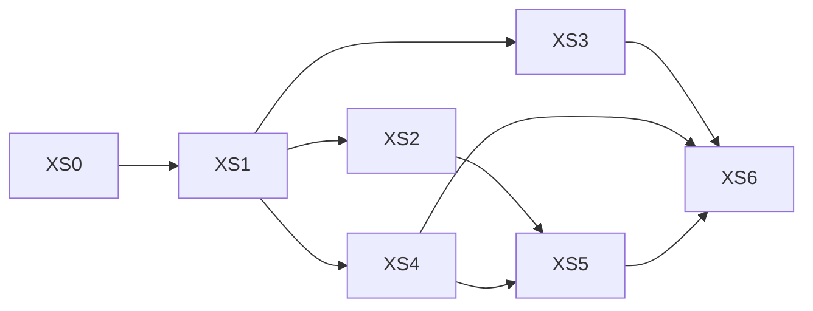

<!-- SPDX-License-Identifier: CC-BY-SA-4.0 -->

# Plan: Bidirectional XSLT transformation sidecar

**Unit ID:** `xslt-sidecar` (XS)
**Unit type:** multi-slice unit, validation gate per slice
**Status:** Decisions XS-D1 to XS-D7 proposed 2026-10-02, none recorded. ADR-A119 Proposed. No
slice may start
**Sketch:** [xslt-sidecar.md](../sketches/xslt-sidecar.md) (the design, cited below as "sketch §n")
**Status record:** [xslt-sidecar.md](../status/xslt-sidecar.md)
**ADR:** [A-119](../../architecture/decisions/ADR-A119-xslt-transformation-sidecar.md), Proposed
**Depends on:** nothing merged. Builds on
[xml-egress-and-transformation-kits.md](../sketches/xml-egress-and-transformation-kits.md) (cited
below as "egress sketch §n") as design input, not as a slice dependency
**Related unit:** `word-authoring-poc`, unaffected by this plan and not a precondition for it

This plan is written so the code follows from it with as few choices as possible. Where a slice's
design hinges on a decision (sketch §11, XS-D1 to XS-D7) not yet recorded, the slice says which one
and does not guess at its own field names, routes or file layout in the meantime.

## No implementation is authorised yet

This plan and its sketch are a design response to a request to explore the idea. **No slice may
start until the maintainer records decisions XS-D1 to XS-D7** (sketch §11), in the same way the word
authoring proof of concept could not start before its own WA-D1 to WA-D13 were recorded. Recording
them is our decision, on every one of the seven.

---

## 1. Goal and acceptance

Once the persistence compiler (and, where present, the Surface compiler) has produced artefacts for
a target, their shape is already known. A Saxon-hosted XSLT 3.0 engine, published as both a Java
library and a standalone sidecar process, turns that known shape into documents, reports and pages
on the way out (egress), and turns external, non-OWL XML into the triples the persistence tier
recognises on the way in (ingress), using kits any conformant XSLT processor can run without our
code. A MORK compiler backend compiles a mapping graph into an ingress kit's stylesheet, the same
way `tools/mork2rml.py` already compiles one into RML.

The unit is accepted when:

1. every slice's one command passes and its Validation Pack is signed in
   `docs/developer/validation/LOG.md`
2. one egress kit, sourced from a real `persistence instantiate` output where the target has a
   compiled profile, runs correctly both through the sidecar and through a bare third-party Saxon
   CLI, byte-identically (egress sketch §8.1, §15 step 8)
3. one ingress kit, hand-written, lifts a representative external XML document into canonical
   N-Triples, passing the same security and determinism tests as the egress direction (sketch §6.3,
   §9)
4. a MORK-compiled ingress kit, built from a mapping graph for the same external schema, produces
   the same triples as the hand-written kit for the same input (sketch §7.2)
5. `tools/mork2rml.py`'s existing tests still pass, unchanged, after its DAG-walking logic is shared
   with the new backend (sketch §7.1, XS-D5)
6. `mise run check:java`, and whichever Python checks touch `tools/mork2rml.py`'s factored module,
   pass with no existing test weakened

---

## 2. Fixed facts

### 2.1 Conventions this plan reuses rather than reinvents

| Convention | Source | Applies here as |
|---|---|---|
| Saxon-HE, XSLT 3.0, XPath 3.1, MPL 2.0 licence | egress sketch §7.1 | the engine, unchanged |
| A kit is a versioned directory: manifest, input definition, stylesheet, schema, golden examples | egress sketch §8 | both directions. An ingress kit's "input definition" is the external schema, not a SPARQL query |
| No Saxon extension functions in a published stylesheet | egress sketch §8.2 | both directions |
| Canonical form for a hash: sorted N-Triples, SHA-256 over the join | the word authoring POC's `CanonicalHash` (an existing, unrelated precedent for the same convention) | the ingress direction's output form (sketch §6.1, XS-D4) |
| `GraphReference` and `KitId` only, never a raw query or endpoint | egress sketch §11.4 | both directions' public interfaces (sketch §8) |
| One shared IR, several backends | `tools/mork_compilers`, ADR-A23 | the MORK-to-RML and MORK-to-XSLT compilers, once XS-D5's refactor lands |
| Virtual thread-per-request, a minimal HTTP library, mandatory deadline propagation | ADR-A81 | the sidecar's HTTP runtime (XS-D2) |

### 2.2 Paths

| Path | Holds |
|---|---|
| `platform/semantic-xml-egress` | the core Java library, both directions (named for the egress sketch's own module, extended rather than renamed) |
| `platform/xslt-sidecar` (new module) | the standalone HTTP process wrapping the library |
| `contracts/xml/` (new) | published kits, egress and ingress, manifest-distinguished |
| `tools/mork2rml.py` and a new shared module beside it | the factored DAG walk (XS-D5) |
| `tools/mork2xslt.py` (new) | the new compiler backend |

### 2.3 Branch and commits

As the word authoring POC's own §2.1: one local commit per slice, message
`[wap-xs] XS<n>: <slice title>` (`wap-xs` distinguishes this unit's commits from `word-authoring-poc`'s
`[wap]` ones in `git log`), no push, final push left to the maintainer.

---

## 3. Decisions

Decisions XS-D1 to XS-D7 are recorded in [sketch §11](../sketches/xslt-sidecar.md#11-decisions), not
duplicated here. None is taken without the maintainer. No slice below may start until the decisions its own
precondition line names are recorded.

---

## 4. Slice overview

| Slice | Title | Paths | Decisions needed first | One command | Estimate (tokens) |
|---|---|---|---|---|---|
| XS0 | Preflight | status record only | none | the preflight script (§5 XS0) | 60k |
| XS1 | Core egress module | `platform/semantic-xml-egress` | none | `mise run check:xslt-sidecar` | 400k |
| XS2 | First kit, grounded in a compiled profile | `platform/semantic-xml-egress`, `contracts/xml/` | XS-D3, XS-D6 | `mise run check:xslt-sidecar` | 500k |
| XS3 | The standalone sidecar process | `platform/xslt-sidecar` (new) | XS-D1, XS-D2 | `mise run check:xslt-sidecar-service` | 350k |
| XS4 | Ingress direction, hand-written kit | `platform/semantic-xml-egress`, `contracts/xml/` | XS-D4, XS-D6 | `mise run check:xslt-sidecar` | 400k |
| XS5 | MORK-to-XSLT compiler | `tools/mork2rml.py` (refactored), `tools/mork2xslt.py` (new) | XS-D5, XS-D6 | `mise run check:mork-xslt` | 450k |
| XS6 | Documentation and close-out | docs only | none | `mise run check:xslt-sidecar` and the XS6 checks | 150k |

Total about 2.31M tokens. Record the actual per slice in the status record.

Run XS0 to XS2 first (the egress direction, since it reuses the most already-settled design). XS3
and XS4 may then run in either order. XS5 needs both a working ingress mechanism (XS4) to compare
its generated kit against, and nothing from XS2 directly, but is listed after both for narrative
order. XS6 needs everything else committed.

---

## 5. Slices

### XS0: Preflight

**Preconditions:** none.

As the word authoring POC's own WA0, adapted:

| # | Check | Pass |
|---|---|---|
| P1 | clean tree, branch, identity | empty `git status --short`, branch and identity set |
| P2 | Java baseline | `mise run check:java` is BUILD SUCCESS |
| P3 | Saxon-HE resolves from the configured Maven mirror, at the version the sketch's §7.1 names | `mvn dependency:get` exits 0 |
| P4 | `tools/mork2rml.py`'s existing tests pass today, before any refactor | the current test command exits 0, recorded as the XS5 regression baseline |
| P5 | `persistence instantiate` runs against a real example and produces `.rq` files | exits 0, at least one file produced |
| P6 | the reasoning isolation check does not already flag anything Saxon-related | `tools/reasoning_isolation_check.py` still passes once a Saxon dependency is added in a throwaway spike, then reverted |

**Output:** the status record's preflight table. Commit only if the status record changed.

---

### XS1: Core egress module

**Preconditions:** XS0 done.

**Paths:** `platform/semantic-xml-egress` (new Maven module).

Builds the egress sketch's §7.2 module largely as that sketch already specifies it: the
`XmlProjection` interface (sketch §8's wire contract), Saxon-HE wired with
`FEATURE_SECURE_PROCESSING`, DTD and external-entity processing disabled (egress sketch §11.1), and
a portability check that fails the build if a published stylesheet contains a `saxon:`-namespaced
call (egress sketch §8.2, X1). No kit exists yet. This slice proves the engine runs, securely, with
nothing published through it.

Test approach: as the egress sketch's §15 steps 1 and 6, before any real kit exists — a
minimal, throwaway stylesheet to prove the wiring, and the DOCTYPE/external-entity refusal test
against it.

**Docs:** a new `platform/semantic-xml-egress/README.md`: purpose, the licence note (egress sketch
§7.1), the portability check's rule.

---

### XS2: First kit, grounded in a compiled profile

**Preconditions:** XS1 committed. Decisions XS-D3, XS-D6 recorded.

**Paths:** `platform/semantic-xml-egress`, `contracts/xml/` (new).

The egress sketch's own §15 "first slice," with one change: step 2's `query.rq` is, per XS-D3, the
output of a real `persistence instantiate` run against a real compiled profile (or a thin,
`ORDER BY`-adding wrapper around it), not hand-written from nothing. The kit's manifest (sketch §5,
§11 XS-D6) records which compiled profile it was sourced from. Every one of the egress sketch's §15
steps 3 to 8 applies unchanged, including the security test (step 6), the `@key`-collision embedding
test if the chosen kit happens to carry LegalRuleML (optional for this slice, since the first kit
need not exercise embedding), and the third-party reproduction test (step 8).

Test approach: the egress sketch's own test table (§15), plus one new case: regenerate the source
compiled profile with a trivial, reversible change, and confirm the kit's manifest mismatch is
detected (sketch §3, §9's drift argument) rather than silently serving the old shape.

**Docs:** `contracts/xml/README.md` created: what a kit is, the manifest fields, where egress and
ingress kits differ.

---

### XS3: The standalone sidecar process

**Preconditions:** XS1 committed. Decisions XS-D1, XS-D2 recorded.

**Paths:** `platform/xslt-sidecar` (new Maven module).

Wraps `platform/semantic-xml-egress`'s library behind an HTTP boundary, aligned with ADR-A81's
runtime shape (XS-D2): virtual thread-per-request, a minimal library, deadline propagation, Jackson
for the request/response envelope only, never for the XML or N-Triples body itself. Two routes,
mirroring the library's two interface methods (sketch §8): one for egress, one for ingress, each
taking a kit id and an input, returning the kit's output. A minimal example (a compose file or
equivalent, outside `deployment/compose/authoring`) demonstrates the sidecar running against a
generic Fuseki instance, standing in for "some other stack."

Test approach: an HTTP-level test per route (request in, response out, matching the library-level
test's expectation), a deadline-propagation test (a request whose deadline has already passed is
refused before the engine runs, per ADR-A81), and the example deployment actually brought up and
exercised once, not only described.

**Docs:** `platform/xslt-sidecar/README.md`: how to run it standalone, the two routes, the example
deployment.

---

### XS4: Ingress direction, hand-written kit

**Preconditions:** XS1 committed. Decisions XS-D4, XS-D6 recorded.

**Paths:** `platform/semantic-xml-egress`, `contracts/xml/`.

The `XmlIngestion` interface (sketch §8), and one hand-written ingress kit lifting a small,
representative external XML document (not ACORD specifically, a simpler invented schema is enough
to exercise the mechanism, per the egress sketch's own "exercise the mechanism, not the domain"
framing in its §15) into canonical sorted N-Triples (XS-D4). The security controls of sketch §6.3:
whole-document size and depth limits, schema validation before the stylesheet runs where the
external source provides a schema, and the DOCTYPE/external-entity refusal of XS1 confirmed against
a full untrusted document rather than only an embedded subtree.

Test approach: a golden fixture (input document to expected N-Triples, byte-exact), a security test
(a DOCTYPE-bearing input refused at the boundary), a determinism test (the same input compiles to
the same output twice, and after a process restart), and the third-party reproduction test (the
same kit run in a bare Saxon CLI).

**Docs:** `contracts/xml/README.md` gains the ingress kit's shape (input definition instead of
`query.rq`, output always N-Triples).

---

### XS5: MORK-to-XSLT compiler

**Preconditions:** XS4 committed. Decision XS-D5 recorded.

**Paths:** `tools/mork2rml.py` (refactored in place), a new shared module (exact name decided in the
slice, once XS-D5 is recorded), `tools/mork2xslt.py` (new).

First, factor `mork2rml.py`'s DAG-walking and case-analysis logic (its own Definition 10.7) into a
module both compilers import, with `mork2rml.py`'s existing tests run against the factored code,
unchanged, as the regression guard (plan §1 acceptance item 5). Only once that is green does the new
backend get added: `mork2xslt`, compiling the same MORK mapping graph into a static XSLT 3.0
stylesheet (sketch §7.2) that emits N-Triples lines, matching XS4's output convention exactly so the
two ingress kits (hand-written and MORK-compiled) are interchangeable from a caller's point of view.

Test approach: the refactor regression (above), then a parity test proving `mork2xslt`'s generated
kit and XS4's hand-written kit produce identical triples for the same input document, which is the
acceptance criterion the sketch's §7.2 names directly. The generated stylesheet is also run through
the portability check (XS1) and the third-party reproduction test (XS4), since a generated kit is
published exactly as a hand-written one is (sketch §6.2).

**Docs:** `tools/mork2rml.py`'s own module docstring updated to note the shared module and its
sibling. A new `tools/mork2xslt.py` docstring matching its style.

---

### XS6: Documentation and close-out

**Preconditions:** XS3, XS4, XS5 committed.

**Paths:** documentation only.

As the word authoring POC's own WA11/WA19: root `README.md` gains the new paths. `docs/developer/INDEX.md`
entry updated with slice states and links to the Validation Packs. The status record set to
"awaiting the maintainer's validation" with actual token use per slice. `mise run check:java`,
`check:mork-compilers` (or whichever task now covers the factored module), `check:ontology-catalog`,
`topology:links` run and recorded. Prose check of every changed Markdown file. ADR-A119 is left
Proposed: moving it to Accepted is our decision, not a slice output.

**Commit:** `[wap-xs] XS6: documentation and close-out`.

---

## 6. Commands, consolidated

| Task | Runs |
|---|---|
| `check:xslt-sidecar` | the core library's tests (XS1, XS2, XS4) |
| `check:xslt-sidecar-service` | the standalone sidecar process's tests (XS3) |
| `check:mork-xslt` | the factored `mork2rml`/`mork2xslt` compiler family's tests (XS5), replacing whichever task runs `mork2rml.py`'s tests today |

---

## 7. Validation Pack skeleton

As the word authoring POC's own §7: `docs/developer/validation/xslt-sidecar-xs<n>.md`, same shape
(Invariant, Test cases, One command, Artefacts to inspect, Self-probe, Implementer choices,
Deliberate non-coverage).

Non-coverage that applies to the whole unit, cited by every pack: the LegalRuleML-specific ingress
pipeline (sketch §1, XS-D7, out of scope by decision, not by oversight). Streaming for large result
sets (egress sketch §12, deferred until a real caller needs it). Batching several ingress documents
in one call (sketch open question XS-Q3).

---

## 8. Risks

Risks XS-R1 to XS-R6 are recorded in
[sketch §12](../sketches/xslt-sidecar.md#12-risks), not duplicated here.

| # | Risk (plan-execution specific, not already in the sketch) | Mitigation |
|---|---|---|
| P1 | XS5's refactor of `mork2rml.py` is attempted before XS4 gives it a second backend to prove itself against, so the refactor's correctness rests on inspection alone | the slice order (§4) puts XS4 before XS5 for exactly this reason |
| P2 | The sidecar (XS3) is built against ADR-A81 before `platform/runtime-host` exists, and later needs a second migration once it does | sketch open question XS-Q1 names this explicitly as a decision for the maintainer, not an assumption this plan makes |

---

## 9. Handoff

After XS6 the agent's last message lists, in order: the commits made (`git log --oneline
<first>^..HEAD`), the Validation Packs, any blocker or deviation, and a note that ADR-A119 remains
Proposed pending our own review, not advanced before then. No ontology document changes in
this unit, so no release tag is due.
