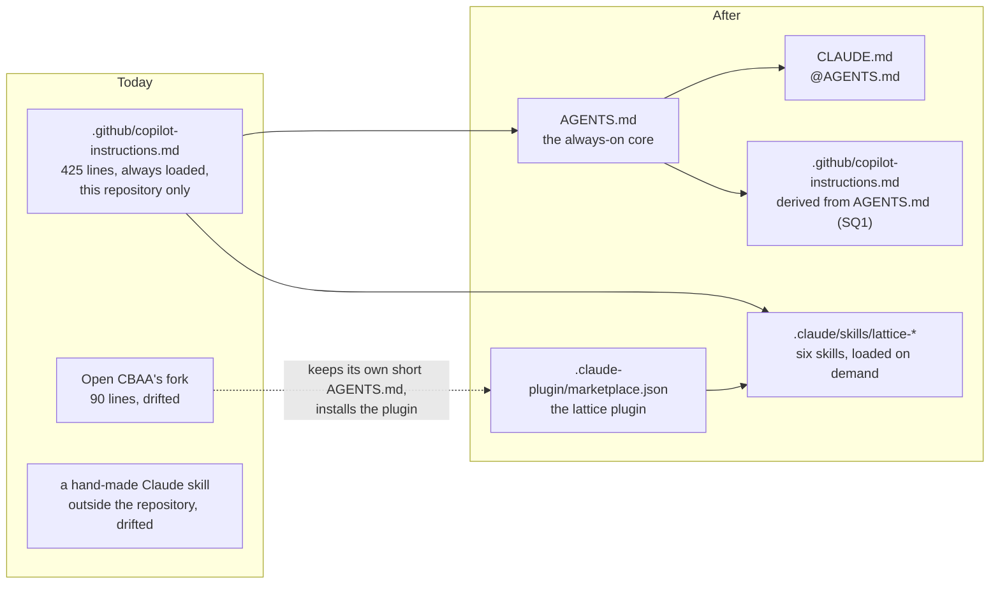

<!-- SPDX-License-Identifier: CC-BY-SA-4.0 -->

# Agent skills: LATTICE's guidance for AI agents, as a skill library

**Unit:** `agent-skills` (this sketch). Takes over technical debt TD-21.
**Status:** decided 2026-10-07. SQ1 to SQ5 answered (§8). ADR-A117 awaits acceptance.
**Decision:** [ADR-A117](../../architecture/decisions/ADR-A117-agent-guidance-and-skill-library.md)
(Proposed). Two tiers, six skills in `.claude/skills/`, shared as a Claude Code plugin from this
repository.
**Reads with:** [`.github/copilot-instructions.md`](../../../.github/copilot-instructions.md) (the
source being split), the [developer guide](../developer-guide.md),
[GENAI_CONTRIBUTION.md](../../../GENAI_CONTRIBUTION.md).

## 1. What changes

Inside this repository, Claude Code and Copilot load `AGENTS.md` (through `CLAUDE.md` and Copilot's
file) and discover the six skills in `.claude/skills/` with no setup. Elsewhere, Claude Code installs
the `lattice` plugin, and Copilot links the skills into its personal skills directory (§6).

## 2. The always-on core

`AGENTS.md` holds only what must apply to every reply, in about 80 lines:

| Section | Contents |
|---|---|
| The contract | default and autonomous modes, never stating a check passed that was not run, pausing for design decisions, never committing, tagging, merging or pushing without the human's go-ahead |
| Writing | no semicolons, sparing colons, no superlatives, no binary reframes, no formulaic transitions or meta-commentary, examples introduced as examples, no market words coined as technical terms, "versioned" for `fnd:Version` |
| Privacy | the repository is public. Nothing identifying a person or a client. No secrets, private hostnames or credentials. Domain-neutral substrate text |
| Where things are | the repository roots in one table, the documentation lifecycle in one line each, pointers to the developer guide |
| The skills | each skill's name and when it applies |

Everything else moves to a skill.

## 3. The skills

Each skill's `description` is what an agent matches a task against, so each names its triggers.

### `lattice-lifecycle`

*Use when starting, continuing, handing off or closing a unit of work, slice or phase in LATTICE or
a project built on it: reading the status record, writing a Validation Pack, updating status and
plans, committing, merging, tagging releases, or reporting what comes next.*

- the documentation lifecycle: sketches, plans, status, review records, the technical debt
  register's scope
- the epic decomposition model, the slice shape, the slice sizing rule, the test taxonomy, the human
  validation gate, the non-weakening rule
- examples first (ADR-A-C2), pausing before commits, merge before tag, branch from `main`, the
  `🔴 RELEASE TAGS REQUIRED` notice, the end-of-report markers 🔴 PLAN FIRST and 🟢 READY TO BRANCH
- token estimates instead of agent days
- the traceability update (`docs/developer/INDEX.md`, the validation `LOG.md`)

### `lattice-design`

*Use when writing or revising a sketch, a plan brief, an ADR or a set of design questions for the
human, or when presenting options for a modelling or architecture decision.*

- design first: consult the ADRs, propose an ADR, keep the architecture documents current
- writing a plan or a sketch: re-read the material, check consequences against the ontologies,
  check the roadmap
- presenting a question: set the scene, draw a picture, then each option with its design and runtime
  overheads, then KISS, then a leaning. A worked example, C9's materiality questions
- diagrams: mermaid that renders, checked in a browser before handoff
- the framework principle: offer options and configuration, impose nothing not vital to correctness

### `lattice-architecture`

*Use when a design touches more than one layer, adds a dependency between layers or modules, or
needs the principles behind LATTICE's structure.*

- the layer map and the import guard, Instrument's and Behaviour's places, what imports what
- principles: the words are the contract, stated and bound meaning, versions and identities,
  structure apart from state, domain neutrality, LATTICE as a framework
- an index of the ADRs that most designs touch, by subject, linking each rather than restating it

### `lattice-ontology-authoring`

*Use when changing anything under `ontology/`: a layer's README, spec, vocab, shapes, projection
or examples, a version IRI, or a SHACL shape.*

- the change procedure, steps 1 to 8 of today's "Changing an ontology document"
- documenting ontologies: say a design decision once, sparing `rdfs:domain` and `rdfs:range`
- the Ponytail guardrails for ontologies
- authoring SHACL-SPARQL shapes
- domain-neutral READMEs, and referring to `fnd:Version`
- the market-word rule and its exceptions (bound meaning, SPC's binder)

### `lattice-toolchain`

*Use when building, testing or running checks, setting up or repairing an environment, or when a
package install or tool fails.*

- `mise` as the one entry point, the task families, the checks to run for each kind of change
- shell activation, mirrored registries, the `mise.toml` quoting rule on Windows
- checking that editable installs point at this checkout
- the formal-methods toolchains, pointing at the formal methods lifecycle guide

### `lattice-publication-hygiene`

*Use before committing, before opening a pull request, and whenever writing text that will be
published: documentation, commit messages, examples, generated content.*

- the repository is public. What must never enter it: names of people or clients, private
  hostnames, credentials, private repository paths
- anonymising sources and examples, as the CCS sketches did
- words to avoid in generated content, and why
- AI disclosure, per [GENAI_CONTRIBUTION.md](../../../GENAI_CONTRIBUTION.md)
- the personal deny-list: a file outside the repository listing real names to check for, read by
  a local check, so the list itself is never published

## 4. Where each existing rule goes

| Today's section of `.github/copilot-instructions.md` | Goes to |
|---|---|
| Agentic Development Contract, execution modes, Pause For Architectural Guidance | core (essentials), `lattice-lifecycle` (detail) |
| Design First, Planning Mode, Writing a plan or a sketch, Comparing Options, KISS | `lattice-design` |
| Planning Mode's framework principle and semantic versioning note | `lattice-design`, `lattice-ontology-authoring` |
| Release tags, merge before tag | `lattice-lifecycle` |
| Repository Topology, Decisions and Links | core (table), `lattice-architecture` |
| Documentation Lifecycle, Epic Decomposition Model | `lattice-lifecycle` |
| Changing an ontology document | `lattice-ontology-authoring` |
| Toolchain, Shell activation, Restricted or mirrored package registries | `lattice-toolchain` |
| General Guidelines, Writing Style, What To Avoid, What To Reduce | core |
| Documenting ontologies, Ponytail guardrails, SHACL-SPARQL | `lattice-ontology-authoring` |
| Thinking / Reasoning for Coding and for Writing | core |
| Domain-neutral READMEs, market words | core (rule), `lattice-ontology-authoring` (detail) |

Agent memory, kept by the human's Claude Code sessions, holds rules that belong in the library and
some that do not:

| Memory | Goes to |
|---|---|
| plan first when blocked, the 🔴 and 🟢 markers | `lattice-lifecycle` |
| consequences with every choice | `lattice-design` |
| pause before commit, merge before tag | `lattice-lifecycle` |
| domain-neutral READMEs, sparing colons, sparing domain and range | core, `lattice-ontology-authoring` |
| which remote to push to, editable installs from another clone | stays personal: true of one machine |

The general lessons of `docs/developer/project-environment.md` (do not route around a blocked
registry, hand off what cannot run) move to `lattice-toolchain`.

## 5. How a skill stays right

- **Point, do not copy.** A skill links the developer guide, the versioning policy and the ADRs for
  anything they already say. A skill restates only what has no other home.
- **Checked by a test.** `mise run check` gains a check that every skill's `SKILL.md` has a name
  and description, that every link in the core and the skills resolves, that the marketplace file
  names exactly the six directories, and that Copilot's file matches `AGENTS.md` (SQ1).
- **Reviewed as documents.** A skill change is a documentation change, reviewed under the
  publication hygiene rules.
- **Short.** A `SKILL.md` stays under about 300 lines. Longer material sits in files beside it,
  named from the skill, so it loads only when needed.

## 6. Installing

| Agent | In this repository | In another project |
|---|---|---|
| Claude Code | nothing. `CLAUDE.md` and `.claude/skills/` load | `/plugin marketplace add nebularis/lattice`, then `/plugin install lattice@<marketplace name>`. `/plugin marketplace update` refreshes |
| Copilot in VS Code or the CLI | nothing. Copilot's file and `.claude/skills/` load | from a LATTICE checkout, `mise run skills:link` links the six skills into `~/.copilot/skills/` (copies on Windows). Re-run after pulling |
| Copilot's cloud agent | nothing | sees only the project's own repository (SQ4) |
| any other agent reading `AGENTS.md` | `AGENTS.md` | the project's own `AGENTS.md`, pointing at the skills' text |

Open CBAA replaces its 90-line fork with a short `AGENTS.md` of its own (its topology, its
principles, its ontology change steps), and installs the plugin.

## 7. Build steps

1. `AGENTS.md`, `CLAUDE.md`, and Copilot's file derived from `AGENTS.md` (SQ1).
2. The six skills, written from §4's sources, each checked against the document it replaces.
3. `.claude-plugin/marketplace.json`, validated with `claude plugin validate .`, and installed into a
   scratch project to check the six skills load and nothing else does.
4. `mise run skills:link`, and the checks of §5 in `mise run check`.
5. The root `README.md`, the developer guide and `GENAI_CONTRIBUTION.md` updated. TD-21 removed.
6. `project-environment.md` folded into `lattice-toolchain`.

## 8. Questions

Each option is compared on its design overheads (how hard it is to reason about, to keep right,
and how brittle it is) and its runtime overheads (what loads, what drifts, what each user must do),
then against KISS.

### SQ1. Copilot's always-on file

- **(a) Generated from `AGENTS.md`** by a `mise` task, and checked for drift.
  - *Design.* Works on every Copilot surface, whether or not it reads `AGENTS.md`. One generated
    file and one check to maintain.
  - *Runtime.* Copilot loads the same core as Claude Code. Editing the generated file by hand fails
    the check.
- **(b) A pointer**, telling Copilot to read `AGENTS.md`.
  - *Design.* Nothing generated. Relies on the agent following the pointer on every request, which
    an agent may skip when the request looks simple.
  - *Runtime.* The core may silently not apply.
- **(c) Removed**, relying on Copilot reading `AGENTS.md` itself.
  - *Design.* Least to maintain, where supported. Not every Copilot surface is known to read it.
- *KISS.* (a) is one task and one check.

**Leaning: (a).**

### SQ2. Skill names

- **(a) Prefixed**, `lattice-design`.
  - *Design.* Unambiguous where skills from many sources mix, as in `~/.copilot/skills/`.
  - *Runtime.* Through the plugin, a skill is invoked as `/lattice:lattice-design`, which repeats
    the name. Agents mostly load skills by description, not by typed command.
- **(b) Bare**, `design`.
  - *Design.* Tidy through the plugin (`/lattice:design`). Collides in a personal directory with
    any other project's `design` skill, and inside the repository with nothing to say whose it is.
- *KISS.* Both are equally simple. (a) is safer.

**Leaning: (a).**

### SQ3. Plugin versions

- **(a) Unversioned.** An update takes the plugin as it is on `main`.
  - *Design.* Nothing to bump. A downstream project gets rule changes as soon as it updates,
    including rules for an ontology release it has not adopted yet.
  - *Runtime.* `/plugin marketplace update` is all a user does.
- **(b) Versioned,** bumped when a skill changes.
  - *Design.* A project chooses when to take new rules. One more version to keep, beside the
    ontologies'.
- *KISS.* (a) now. The skills describe process more than any one ontology release, and a project
  that needs to pin can be given (b) when it asks.

**Leaning: (a).**

### SQ4. Copilot outside this repository

- **(a) A link task** (`mise run skills:link`) into the personal skills directory.
  - *Design.* One source on each machine. Symbolic links are unreliable on Windows, so it copies
    there, and a copy goes stale until re-run.
  - *Runtime.* Covers Copilot in VS Code and the CLI. Copilot's cloud agent runs on GitHub, sees
    no personal directory, and so sees no LATTICE skill in another project.
- **(b) A vendored copy** committed into the other project's `.github/skills/`, refreshed by a sync
  script and checked against a LATTICE tag.
  - *Design.* The only way the cloud agent sees the skills. A committed copy is the drift this
    unit exists to remove, held in check only by the sync check.
- *KISS.* (a) now, and (b) only for a project that uses Copilot's cloud agent.

**Leaning: (a),** with (b) added if Open CBAA adopts the cloud agent.

### SQ5. The deny-list check

- **(a) A local check** (a `mise` task, optionally a git pre-commit hook) reading a list from the
  user's own configuration directory, and passing when there is no list.
  - *Design.* Catches a name before it is committed, without publishing the names. Each person
    keeps their own list.
  - *Runtime.* Runs on staged changes, fast.
- **(b) Rules only**, no check.
  - *Design.* Nothing to build. Depends on the agent and the human noticing.
- *KISS.* (a) is small.

**Leaning: (a).**

**Answered by the human, 2026-10-07:** SQ1 to SQ5, each as the leaning.

### Where the deny-list check looks

The check (`mise run check:deny-terms`) reads the first of these that exists, and passes when none
does, so it never fails on a machine or in CI with no list:

1. the file named by `LATTICE_DENY_TERMS`
2. `${XDG_CONFIG_HOME:-~/.config}/lattice/deny-terms` on macOS and Linux
3. `%APPDATA%\lattice\deny-terms` on Windows

The file holds one case-insensitive regular expression per line, with `#` for comments. A line
starting `!` names a path glob the check skips, for a file where a term may legitimately appear,
such as synthetic data. By default the check reads only the lines a commit adds (`git diff
--cached`), and `--all` scans the tracked tree. A finding prints the file, the line and the
pattern's line number in the list, never the pattern, so a shared terminal log does not repeat it.
`mise run hooks:install` adds an opt-in git pre-commit hook that runs it. The hook lives in
`.git/hooks/`, which is never committed.
