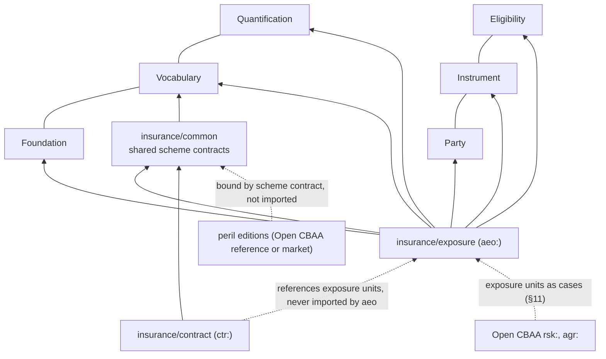
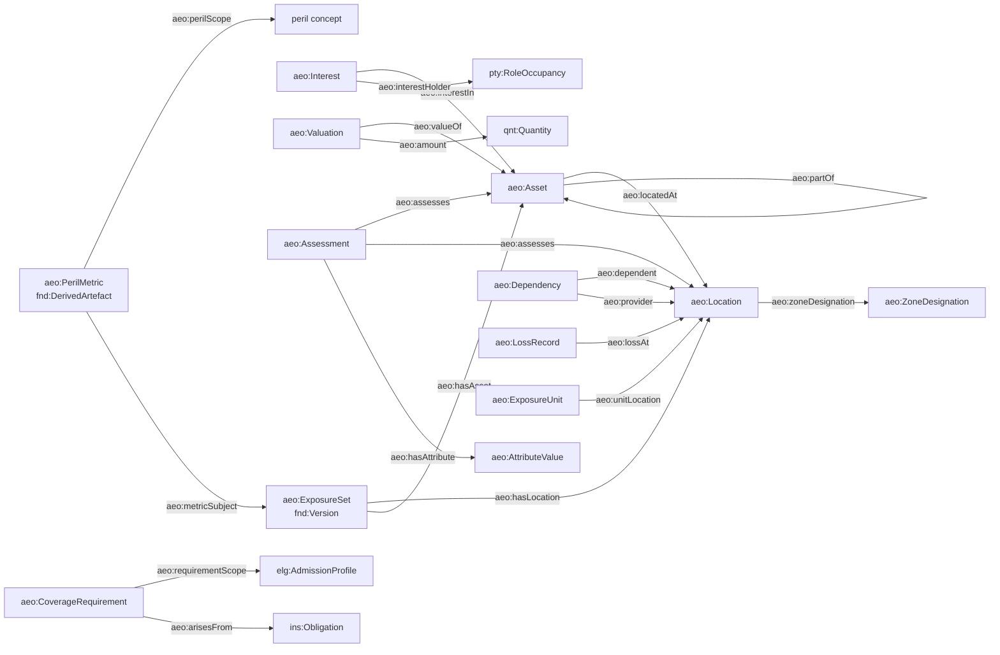

# Asset Exposure Ontology (`aeo:`): Design Sketch

Version 0.2, draft for review. A sketch of the asset exposure ontology for a reference build of
LATTICE's applied insurance domain (`lattice/ontology/applied/insurance`). It describes what an
insured owns, uses or depends on, where it is, what it is worth, how it is built and protected,
what it is exposed to, what has happened to it, and what cover its owners require. It maps every
construct onto LATTICE, and it is the main consumer of the
[reference peril vocabulary](peril-vocabulary.md) outside the contract. The
[whitepaper](peril-structure-whitepaper.md) covers the structural questions the two share.

---

## 1. Purpose and Position

| Question | Answer |
|---|---|
| What it describes | the demand side: parties, assets, locations, interests, values, hazard attributes, dependencies, modelled peril metrics, loss history and coverage requirements |
| What it does not describe | contracts, coverage grants, layers, terms, claims handling, catastrophe model internals. It supplies the operands those need and never computes cover, gaps or eligibility itself |
| How it relates to submission | `submission/` packages an exposure set version, requirements and existing cover for one placement, with its own lifecycle. The facts themselves are defined here, independent of any one submission |
| Where it lives | `ontology/applied/insurance/exposure/`, one of the applied insurance domain's sub-folders (§3), in the applied layer. Nothing here is substrate, so LATTICE's clean-room rule (ADR-A-C2) does not constrain its naming, but any substrate change it motivates must follow that rule (§13) |
| Who consumes it | the applied contract module (schedules, scopes, percentage deductibles), catastrophe analytics, placement and gap analysis, and Open CBAA, whose `rsk:Risk` is an exposure unit seen from a binding authority (§11) |
| What it is built on | Foundation (identity, versions, valid time, evidence, derived artefacts), Vocabulary (every classification), Quantification (every amount, rate, duration and intensity), Party (actors, roles, occupancies), Instrument (obligations to maintain insurance), Eligibility (requirement scopes), MORK (ingestion mappings), Persistence (boundaries, privacy) |

## 2. Principles

| # | Principle |
|---|---|
| A1 | **Facts about the world, not about cover.** A valuation is not a limit, a flood zone is not a flood sub-limit, exposure to a peril is not cover for it |
| A2 | **LATTICE first.** No AEO class re-invents identity, versioning, validity, evidence, quantities or roles. An AEO class exists only where insurance needs a structure LATTICE does not have |
| A3 | **Thin T-Box.** A class only where instances need different properties or constraints (DP2). Everything that differs only by classification is a concept under a scheme contract. Profile questions are typed assessments, not classes (§5.8) |
| A4 | **Two times.** Valid time (when a fact holds in the world) is `fnd:TemporalScope`. Record time (when it was known) is `fnd:recordedAt` on evidence and the persistence layer's transaction time |
| A5 | **Derived is not asserted.** Normalised currency values, aggregated TIV, zone memberships computed from coordinates and modelled metrics are `fnd:DerivedArtefact`s with a derivation run, never plain facts |
| A6 | **Market-neutral core, market profiles.** London and US framings differ in what must be present and how it is classified (§10). The core is shared, and each market adds scheme bindings and shapes, never classes |
| A7 | **Exposure units are the case.** Eligibility, authority and gap analysis evaluate single-valued paths from a case (ADR-A90 option B). The ontology offers exposure units shaped for that (§5.11) |

## 3. Namespaces, Layout and Versions

| Prefix | IRI | Content |
|---|---|---|
| `aeo:` | `https://www.nebularis.org/neuro-semantic/insurance/exposure#` | T-Box |
| `aeo-voc:` | `https://www.nebularis.org/neuro-semantic/insurance/exposure/vocab#` | V1 individuals, scheme contracts, value spaces |
| `geo:` | `http://www.opengis.net/ont/geosparql#` | optional alignment for geometry |

```
ontology/applied/
    capacity/           cross-domain: finite resources and their allocation
    classification/     cross-domain: territory, asset class and industry contracts (§7)
    scheme-profile/     cross-domain: scheme profiles and capability tiers (MORK bridge §8)
    insurance/
        common/         insurance scheme contracts, liability role types, loss event (§7)
        peril/          the reference peril vocabulary (peril vocabulary §4)
        exposure/       this module
            spec/exposure.ttl           owl:versionIRI …/insurance/exposure/0.1.0
            vocab/exposure-vocab.ttl    owl:versionIRI …/insurance/exposure-vocab/0.1.0
            shapes/structural.ttl, constraints.ttl, profiles/*.ttl, .version
            examples/
        submission/     placement packages over exposure (§1)
        claims/         claims, loss cause chains, claimant roles
        contract/       coverage, layers, term parameters (term parameters §9), deferred
```

The applied insurance directory today holds one module whose shapes and vocab sit in shared
`shapes/` and `vocab/` directories. Under LATTICE's versioning policy (ADR-A86 and its addendum)
a shapes directory is versioned by its `.version` file, so two modules sharing one directory
would bump each other. Each sub-folder above is therefore a module with its own spec, vocab,
shapes and `.version`. A module sits at the lowest level of sharing that covers its users:
cross-domain modules beside the domains, insurance-only shared content in `insurance/common/`.
Dependencies run one way: `classification/` and `scheme-profile/` on the substrate only,
`insurance/common/` on those, `peril/` on `common/`, `exposure/` on `common/` and `peril/`,
`submission/` on `exposure/`, `claims/` on `exposure/` and `contract/`.

## 4. Dependencies



`aeo:` imports the LATTICE layers it uses by exact version IRI, each explicitly (layers import only
Foundation). It never imports the contract module: links from contracts to exposure are the
contract module's properties. Peril, territory and asset class editions are bound, not imported
(DP8).

## 5. Core Model



### 5.1 Parties, roles and control

The insured is a `pty:Actor`. AEO adds `aeo:LegalEntity ⊑ pty:Actor` for organisations with
identifiers (`aeo:identifier` to an `aeo:Identifier` node carrying scheme and value, since LEIs,
registration and tax numbers are several schemes) and uses `pty:Actor` directly for persons.

Roles in the insured's programme are `pty:Role` individuals in `aeo-voc:` (named insured, first
named insured, additional insured, loss payee, mortgagee, lessor, bailor), filled by
`pty:RoleOccupancy`s. An occupancy is time-scoped and evidenced by Party, which is what an
additional-insured or mortgagee clause needs. Parties who might claim against the insured are
not named here. They are described as populations (§5.15).

Control between legal entities is `aeo:ControlRelation ⊑ fnd:TemporallyScoped ⊓ fnd:Evidenced`,
with exactly one `aeo:controller` and one `aeo:controlled`, a `aeo:controlKind` (subsidiary,
affiliate, joint venture, branch, franchise) and an optional `aeo:controlShare` (a
`qnt:Quantity` on the proportion space). Reified because ownership has a share and a period. A
transitive shortcut (`aeo:withinGroupOf`) is generated as a derived artefact for consolidated
queries, never asserted, and a shape rejects cycles.

### 5.2 Exposure set

```
aeo:ExposureSet ⊑ fnd:Version ⊓ fnd:Governable ⊓ fnd:TemporallyScoped ⊓ fnd:Evidenced
               ⊓ =1 fnd:hasIdentity.aeo:ExposureIdentity
               ⊓ =1 aeo:reportingUnit.qnt:Unit
```

A versioned snapshot of one insured's schedule. The identity follows the schedule across
renewals, each version is a schedule at an as-of date (its temporal scope starts there), and its
governance state is the record's (Draft while being assembled, Active when submitted, Superseded
by the next). Members are linked by `aeo:hasLocation`, `aeo:hasAsset`, `aeo:hasInterest`,
`aeo:hasValuation`, `aeo:hasAssessment`, `aeo:hasDependency`, `aeo:hasPerilMetric`,
`aeo:hasLossRecord`, `aeo:hasRequirement` and `aeo:hasExistingCover`, all inverse functional, so
a member node belongs to one version. Unchanged locations and assets are shared across versions
by identity (§5.3), not by node.

Persistence: each exposure set version is an aggregate boundary (`dal:AggregateBoundaryProfile`,
one named graph per version), written by compare-and-set, as Open CBAA does for agreement
versions.

### 5.3 Location

```
aeo:Location ⊑ fnd:Version ⊓ =1 fnd:hasIdentity.aeo:LocationIdentity
```

A place where exposure sits: a site, a building footprint, a pipeline segment, a port. A version
per change of address or geometry, one identity across schedules, so a location's loss history
and zone designations follow it.

| Property | Range | Card. | Note |
|---|---|---|---|
| `aeo:address` | `aeo:Address` | 0..1 | structured components, a node so it can be versioned and geocoded as a unit |
| `aeo:geometry` | `geo:Geometry` | 0..1 | point, footprint or line, via GeoSPARQL `geo:asWKT`. Optional alignment, so the core does not depend on GeoSPARQL |
| `aeo:geoPrecision` | concept | 0..1 | rooftop, parcel, street, postcode, city, zone centroid. Scheme contract `aeo-voc:GeoPrecisionContract` |
| `aeo:territory` | concept | 1..* | the territory concepts the location falls in, at the finest level known. Scheme contract shared with Open CBAA's territory contract (§7) |
| `aeo:zoneDesignation` | `aeo:ZoneDesignation` | 0..* | regulatory and model hazard zones (§5.4) |
| `aeo:poolParticipation` | `aeo:PoolParticipation` | 0..* | participation in a risk pool or residual mechanism for a peril (§5.4) |
| `aeo:occupancyState` | concept | 0..1 | occupied, partly vacant, vacant, under construction, with a temporal scope on the assessment that records it |

### 5.4 Zones and pools

A hazard zone is not a territory and not a peril. A flood zone from a national map, a seismic
design category, a wind-borne debris region or a wildfire interface class is a designation of a
location under a published zoning scheme:

```
aeo:ZoneDesignation ⊑ fnd:Evidenced ⊓ fnd:TemporallyScoped
    ⊓ =1 aeo:zone.skos:Concept ⊓ =1 aeo:designationSource.skos:Concept
```

`aeo:zone` is bound per jurisdiction by a scheme contract with territory-scoped bindings (one
flood zone scheme per national programme). The designation's temporal scope is the map's
effective period, so a map revision does not rewrite history. A designation computed from
coordinates is a derived artefact of a spatial join, with its derivation run.

`aeo:PoolParticipation` records that a location's exposure to a peril is ceded to, or insured by,
a pool or residual mechanism, with the pool concept (the peril vocabulary's pool scheme), the
peril scope and the temporal scope. The CBAA SoUA "applicable pool schemes" row reads it.

### 5.5 Asset and interest

```
aeo:Asset ⊑ fnd:Version ⊓ =1 fnd:hasIdentity.aeo:AssetIdentity ⊓ =1 aeo:assetClass.skos:Concept
          ⊓ ≤1 aeo:locatedAt.aeo:Location
```

Anything of value exposed to loss: a building, contents, stock, machinery, a vessel, a fleet, a
crop, a data estate, an income stream (business income is an asset of the income kind, so it
can have a location, dependencies and values like anything else). `aeo:partOf` (asymmetric,
irreflexive) composes assets: critical equipment in a building, a building in a campus.
`aeo:locatedAt` is functional for fixed assets. Mobile assets have `aeo:Presence` nodes
(location, temporal scope, share of time or value) instead, which a shape enforces by asset
class.

`aeo:assetClass` is bound to the insurance asset class scheme, crosswalked to the CBAA
insurable interest hierarchy (Energy, Events and Intangibles, Fixed Property, Insured Persons,
Movable Property, Occupations or Industries, Transport, with sub-groups and additional grain).
The CBAA hierarchy classifies what a policy insures (an insurable interest) and the asset class
classifies what exists, so the mapping is `skos:broadMatch` and `skos:closeMatch`, not identity.

An interest is a party's stake in an asset:

```
aeo:Interest ⊑ fnd:TemporallyScoped ⊓ fnd:Evidenced
    ⊓ =1 aeo:interestHolder.pty:RoleOccupancy ⊓ =1 aeo:interestIn.aeo:Asset
    ⊓ =1 aeo:interestKind.skos:Concept
```

Kinds: owner, lessee, lessor, secured lender, bailee or custodian, beneficiary. `aeo:extent` is a
`qnt:Quantity` (an allocated principal for a lender, a share for a co-owner). Interests carry
what US lender covenants turn on (§10) and what "property of others in care, custody or control"
and "tenants' improvements" mean, without new asset classes.

### 5.6 Valuation

```
aeo:Valuation ⊑ fnd:Evidenced ⊓ fnd:TemporallyScoped
    ⊓ =1 aeo:valueOf.(aeo:Asset ⊔ aeo:Location) ⊓ =1 aeo:valueType.skos:Concept
    ⊓ =1 aeo:valuationBasis.skos:Concept
    ⊓ ((=1 aeo:amount.qnt:Quantity) ⊔ (=1 aeo:rate.qnt:Quantity ⊓ =1 aeo:horizon.qnt:Quantity))
```

| Property | Meaning |
|---|---|
| `aeo:valueType` | building, contents, stock, machinery, business income (gross profit, revenue, rental), extra expense, other. Bound per market, since breakdowns differ |
| `aeo:valuationBasis` | the settlement measure: replacement cost, actual cash value, agreed value, market value, functional replacement, reinstatement |
| `aeo:valuationMethod` | how the figure was obtained: declared, appraised, indexed, modelled, audited. A separate scheme from the basis, since the two vary independently |
| `aeo:amount` | a money `qnt:Quantity` in one currency |
| `aeo:rate` and `aeo:horizon` | for income: a rate on a derived money-per-period space (Quantification derived rates) and the horizon it is stated for. A business income value "for 12 months" and one "for 24 months" are one rate and two horizons, so a requirement for a 24-month indemnity period can be tested against the same data |

Currency is never normalised in place. A value in another currency than the reporting unit is
converted by a `qnt:Conversion` under a `qnt:ConversionContext` (the as-of date), and the
converted figure is a derived artefact. A shape checks that any aggregation the set publishes
(total TIV) is a derived artefact whose read set covers every contributing valuation.

### 5.7 Hazard attributes

Construction, occupancy, protection and external exposure (COPE) and every peril-specific
secondary modifier are attribute values:

```
aeo:AttributeValue ⊑ =1 aeo:attributeType.skos:Concept
    ⊓ =1 (aeo:conceptValue ⊔ aeo:quantityValue ⊔ aeo:literalValue)
```

`aeo:attributeType` is a concept in the attribute type scheme (construction class, year built,
year of major renovation, storeys, roof geometry, roof covering, opening protection, first-floor
height, basement, soft storey, sprinkler type and coverage, detection, fire brigade response,
distance to coast, defensible space, and so on), each with its COPE category as a classification and, for
quantity-valued types, the `qnt:ValueSpace` its values are on. Concept-valued types name the
scheme contract their values are drawn under (construction class schemes differ by market).

The peril vocabulary's `prl:relevantAttribute` links perils to attribute types. A completeness
shape reads it: for every peril in an exposure set's requirement or metric scope, each asset of
a relevant class should have the relevant attributes, and each missing one is a warning that a
data request can be generated from.

### 5.8 Assessments and profiles

Attribute values are not attached to assets one by one. They come in assessments:

```
aeo:Assessment ⊑ fnd:Evidenced ⊓ fnd:TemporallyScoped
    ⊓ ≥1 aeo:assesses.(aeo:Asset ⊔ aeo:Location ⊔ pty:Actor ⊔ aeo:ExposureSet)
    ⊓ =1 aeo:assessmentKind.skos:Concept ⊓ ≥1 aeo:hasAttribute.aeo:AttributeValue
```

An assessment is one source's account of one subject at one time: a survey report, a schedule
row, a questionnaire answer set, an engineering inspection, a geocoder run. Profile families
that carrier questions ask about (construction and protection, cyber posture, business
continuity, environmental, fleet, compliance, operations and workforce, supply chain) are
assessment kinds, not classes. Each kind has a shapes file in `shapes/profiles/` stating which
attribute types it requires and allows. A new question family is a new kind, attribute types
and a shape, with no T-Box change (A3). A kind is promoted to a class only when its instances
need properties an attribute value cannot carry, which none of the families above do.

Conflicting assessments of one attribute are kept, each with its evidence. Which one a consumer
uses is a resolution policy (latest, highest precision, surveyed over declared), applied by the
consumer and recorded as a derived artefact, never by overwriting.

### 5.9 Dependencies

Business interruption and contingent business interruption turn on how locations depend on each
other and on third parties, which a flat supplier count cannot express:

```
aeo:Dependency ⊑ fnd:TemporallyScoped ⊓ fnd:Evidenced
    ⊓ =1 aeo:dependent.(aeo:Location ⊔ aeo:Asset)
    ⊓ =1 aeo:provider.(aeo:Location ⊔ aeo:Asset ⊔ pty:Actor)
    ⊓ =1 aeo:dependencyKind.skos:Concept
```

Kinds: supply of goods, utility, IT service, logistics, customer. Optional: `aeo:shareAtRisk`
(proportion of the dependent's output lost without the provider), `aeo:recoveryLeadTime`
(duration to restore or replace, a `qnt:Quantity`), `aeo:substitutability` (concept: none,
partial, full) and `aeo:singleSource`. Critical equipment is an asset with `aeo:partOf` its
building and a replacement lead time on its assessment. Bottlenecks and maximum foreseeable
interruption are derived from the graph, as derived artefacts, and are what a 24-month or
18-month indemnity period requirement is tested against.

### 5.10 Peril metrics

A modelled or scored measure of exposure to perils:

```
aeo:PerilMetric ⊑ fnd:DerivedArtefact ⊓ fnd:Evidenced
    ⊓ ≥1 aeo:perilScope.skos:Concept ⊓ =1 aeo:metricSubject.(aeo:ExposureSet ⊔ aeo:Location ⊔ aeo:Asset)
    ⊓ =1 aeo:metricKind.skos:Concept ⊓ =1 aeo:perspective.skos:Concept ⊓ =1 aeo:metricValue.qnt:Value
```

| Property | Note |
|---|---|
| `aeo:perilScope` | one or more cause concepts, or a model grouping. Models report "wind and surge combined", "surge only" and "inland flood excluding surge" as separate metrics, so the scope is a set, and a shape checks that metrics compared with one another have compatible scopes |
| `aeo:regionScope` | territory concepts the metric is restricted to ("European windstorm", "Taiwan earthquake") |
| `aeo:metricKind` | average annual loss, occurrence exceedance loss, aggregate exceedance loss, tail value at risk, probability of at least k events in a year, hazard score |
| `aeo:returnPeriod` or `aeo:exceedanceProbability` | for exceedance metrics |
| `aeo:perspective` | ground-up, gross, net |
| `aeo:modelOption` | secondary uncertainty, demand surge, surge included, event set |
| provenance | the model and version are the `fnd:DerivationRun`'s, the model output file is evidence. Full curves and event tables stay in a catastrophe analytics module, referenced by IRI |

Hazard scores are metrics too (kind hazard score, value an ordinal or a quantity on a declared
score space), so a vendor's 1 to 10 and another's A to F never share a space by accident.

### 5.11 Exposure units

Eligibility, authority checks and gap analysis evaluate a case with single-valued paths (ADR-A90
option B, Open CBAA D24). A location has many perils, many values and many assets, so it is a
poor case. The exposure unit is the case:

```
aeo:ExposureUnit ⊑ fnd:DerivedArtefact
    ⊓ =1 aeo:unitLocation.aeo:Location ⊓ =1 aeo:unitAssetClass.skos:Concept
    ⊓ =1 aeo:unitPeril.skos:Concept ⊓ ≤1 aeo:unitValue.qnt:Quantity
```

One unit per location, asset class and peril in scope, with the value exposed. Units are
generated (a derived artefact, reproducible from the exposure set and the peril edition), so the
graph never asserts them by hand. Generation is lazy: a check may compute the units it needs from
the source graph on the fly (route R1, term parameters §5), and only a deployment that profiles
a need materialises them. The peril is read in the operative scheme of the contract being
checked, at that scheme's tier (MORK bridge §6). They are what "flood cover for every property in a special
flood hazard area with TIV over a threshold" is evaluated against, and what a percentage-of-TIV
deductible reads its base from. Open CBAA's `rsk:Risk` is the bound counterpart: one location,
one deemed peril set, one sum insured (§11).

### 5.12 Loss history

```
aeo:LossRecord ⊑ fnd:Evidenced ⊓ =1 aeo:lossDate ⊓ ≤1 aeo:lossAt.aeo:Location
```

| Property | Note |
|---|---|
| `aeo:initiatingPeril` | the event family concept (tropical cyclone) |
| `aeo:proximatePeril` | the peril the record attributes the loss to (surge), where known |
| `aeo:mechanism`, `aeo:agency` | characteristic values of this loss, from the peril vocabulary's schemes |
| `aeo:consequence` | heads of loss (physical damage, business interruption) |
| `aeo:paid`, `aeo:reserved`, `aeo:incurred` | money quantities in one unit. A shape checks incurred equals paid plus reserved when all three are present |
| `aeo:lossStatus` | open, closed, reopened, in litigation |
| `aeo:lossEvent` | an optional shared event node, so losses from one catastrophe group together |

The chain (initiating, proximate, mechanism) is recorded because London and US causation rules
read different elements of it (whitepaper §3.8).

### 5.13 Coverage requirements

Requirements arrive from different sources with different force:

| Source kind | Example | Force |
|---|---|---|
| risk appetite | net loss at 1-in-100 not above 10% of equity | internal governance |
| lender covenant | flood cover for properties in special flood hazard areas, business income for 18 months | contractual obligation to a lender |
| regulation | compulsory classes, natural catastrophe cover where fire cover is given (CBAA M5 5.15.1) | statutory |
| lease or contract | landlord's insurance clause, additional insured requirement | contractual |
| board mandate | affirmative cyber-physical cover | internal governance |

```
aeo:CoverageRequirement ⊑ fnd:Version ⊓ fnd:Evidenced
    ⊓ =1 aeo:requirementSource.skos:Concept
    ⊓ ≥1 aeo:requiredMeasure.aeo:MeasureConstraint
```

| Part | LATTICE construct |
|---|---|
| where it applies: which exposure units | `aeo:requirementScope`, an `elg:AdmissionProfile` over `aeo:ExposureUnit` (peril, territory, zone, asset class, value band) |
| what must hold | `aeo:MeasureConstraint`: a measure concept (limit, sub-limit, retention, indemnity period, waiting period, capacity share, net retained loss at a return period) and a `qnt:RangeSet` on the measure's space |
| relative bounds | a bound stated relative to a financial metric (10% of equity) uses a Quantification derived rate, with the metric as operand |
| who it is owed to | `aeo:arisesFrom`, an `ins:Obligation` with the insured's occupancy as obligor and the lender's as obligee, when the source is a covenant, lease or regulation |

The ontology stops there. Whether a programme meets a requirement is gap analysis, computed by
the contract side from these operands, and each gap is a derived artefact that cites the
requirement and the coverage it compared.

### 5.14 Existing cover and financial metrics

`aeo:ExistingCover` records cover the insured already has or must have: an expiring programme, a
national flood scheme policy that sits primary, a pool participation. It carries a reference to
the contract (an IRI, the contract module owns the term), a peril scope, and its relation to the
programme being placed (underlying, alongside, replaced).

`aeo:FinancialMetric ⊑ fnd:Evidenced ⊓ fnd:TemporallyScoped` carries revenue, gross profit,
equity, payroll and headcount, each a `qnt:Quantity` with its period, and whether audited. Liability
lines add market capitalisation, fees, turnover by territory and records held (§5.15).

### 5.15 Liability exposure

Liability, D&O and E&O cover respond to claims by parties who are mostly unknown when the
contract is bound. Exposure to them is described by who could claim, how they relate to the
insured and how many there are, never by named claimants:

```
aeo:CounterpartyPopulation ⊑ fnd:Evidenced ⊓ fnd:TemporallyScoped
    ⊓ =1 aeo:populationOf.pty:Actor
    ⊓ =1 aeo:populationKind.skos:Concept
    ⊓ =1 aeo:relationshipDepth.skos:Concept
    ⊓ ≤1 aeo:populationSize.qnt:Quantity
```

| Property | Note |
|---|---|
| `aeo:populationOf` | the insured entity the population relates to |
| `aeo:populationKind` | shareholders, securities holders, creditors, employees, customers, patients, data subjects, regulators, the public, customers' customers |
| `aeo:relationshipDepth` | direct, through one intermediary, further. Sets the third or fourth party reading of term parameters §7.3 |
| `aeo:populationSize` | a count, or a basis quantity where counts are unknown (records held, units sold) |
| `aeo:populationTerritory` | where the population is, which selects the legal regimes a claim could arise under |
| `aeo:exposureBasis` | the financial metric the population's exposure scales with (market capitalisation for securities holders, payroll for employees, fees for professional clients) |

Securities listings are attribute values on the legal entity (exchange, listing kind, since),
because securities claims turn on them and they differ in nothing else. Control relations (§5.1)
say who is an insured when a group is covered, and dependencies (§5.9) with kind customer or
supply give the intermediaries through which fourth parties reach the insured. Together they are
the relationship graph from which a claim's direction is derived when its roles are filled
(term parameters §7). The contract names populations in its scopes, the claim fills the roles.

## 6. Property Characteristics and Axioms

| Property | Characteristics | Why |
|---|---|---|
| `aeo:locatedAt` | functional | a fixed asset has one location per version. Mobile assets use presences |
| `aeo:partOf` | irreflexive, asymmetric, simple | composition. Transitive closure is a derived shortcut, so the edge stays simple (OWL 2 DL) |
| `aeo:hasLocation`, `aeo:hasAsset`, and every exposure set membership | inverse functional | a member belongs to one version |
| `aeo:controller`, `aeo:controlled`, `aeo:dependent`, `aeo:provider`, `aeo:interestHolder`, `aeo:interestIn`, `aeo:valueOf` | functional on their reified node | one of each per relation node |
| `aeo:territory` | not functional | a location is in a country, a region and a regulatory grouping at once |
| `aeo:perilScope` | not functional | metrics cover peril sets |

Disjointness: exposure set, location, asset, interest, valuation, assessment, attribute value,
dependency, peril metric, exposure unit, loss record, requirement, existing cover, counterparty population and control
relation are pairwise disjoint, and disjoint with `pty:Actor`.

Chains are not declared in the T-Box. The shortcuts consumers want (an insured exposed in a
territory, an asset's territory, a party's consolidated exposure) are computed from the source
graph on demand, or, where a deployment opts in, generated by Surface as derived relations, which keeps the ontology in OWL 2 RL-friendly territory for runtime
materialisation and puts every shortcut under provenance.

## 7. Vocabularies and Scheme Contracts

| Property | Scheme contract | Tier | Binding |
|---|---|---|---|
| `aeo:assetClass` | `cls:AssetClassContract` | V2 plus V3 | crosswalked to the CBAA insurable interest hierarchy |
| `aeo:territory` | `cls:TerritoryContract` | V2 plus V3 | same edition Open CBAA binds for `rsk:riskLocation` |
| `aeo:zone` | `aeo-voc:HazardZoneContract` | V2 per jurisdiction | territory-scoped bindings |
| `aeo:initiatingPeril`, `aeo:proximatePeril`, `aeo:perilScope`, `aeo:unitPeril` | `common:PerilContract` | reference, market or drafter | the `insurance/peril` edition as unscoped fallback, drafter and market editions by scope (peril vocabulary §9) |
| `aeo:mechanism`, `aeo:agency` | `common:PerilMechanismContract`, `common:PerilAgencyContract` | reference | peril vocabulary characteristic schemes |
| `aeo:populationKind`, `aeo:relationshipDepth` | `aeo-voc:` contracts | V1 plus V3 | |
| `aeo:consequence` | `common:ConsequenceContract` | reference | peril vocabulary consequence scheme |
| `aeo:attributeType` | `aeo-voc:AttributeTypeContract` | V1 core plus V3 | |
| construction class, occupancy class values | per attribute type | V2, market-scoped | London and US schemes differ |
| `aeo:valueType`, `aeo:valuationBasis`, `aeo:valuationMethod` | `aeo-voc:` contracts | V1 | |
| `aeo:geoPrecision`, `aeo:assessmentKind`, `aeo:dependencyKind`, `aeo:interestKind`, `aeo:controlKind`, `aeo:requirementSource`, `aeo:metricKind`, `aeo:perspective`, `aeo:lossStatus` | `aeo-voc:` contracts | V1 | closed sets |
| pool | `common:PoolContract` | V2 per territory | peril vocabulary pool scheme |

`common:` is `insurance/common/` and `cls:` is the cross-domain `classification/` module (§3).
Prefixes are provisional until the layout ADR fixes them. One set of scheme contracts, on
`voc:SchemeContract`, serves every insurance module and Open CBAA's bindings, replacing the
private governance vocabulary and duplicate schemes of the legacy contract module, which is
dropped.

Value spaces declared in `aeo-voc:`: proportion, count, area, length (distance to coast and
water, elevation, first-floor height), money per period (derived), and the intensity spaces the
peril vocabulary declares, reused rather than redeclared.

## 8. Shapes

| Shape | Rule |
|---|---|
| exposure set | one identity, one reporting unit, one temporal scope, governance state |
| location | one identity, at least one territory, geometry or address, geo precision when geometry is present |
| asset | one identity, one asset class. Fixed classes have one location, mobile classes have presences instead |
| valuation | one value type and basis. Amount, or rate with horizon. Money in one currency |
| currency | an aggregate in the reporting unit is a derived artefact whose read set covers its inputs |
| zone designation | the zone is in a scheme bound for one of the location's territories |
| attribute value | exactly one value form, matching the attribute type's declared form and space |
| profiles | per assessment kind, the attribute types required and allowed (`shapes/profiles/`) |
| peril completeness | warning when a relevant attribute (`prl:relevantAttribute`) is missing for a peril in scope |
| geo precision for peril | warning when a location's precision is coarser than `prl:minimumGeoPrecision` for a peril in scope |
| control and dependency | no cycles in control. Dependency cycles allowed but reported |
| loss record | incurred equals paid plus reserved when all present, one unit |
| requirement | scope profile well-formed (Eligibility shapes), each measure constraint's range on the measure's space |
| peril metric comparability | two metrics compared by a derived artefact have equal peril scope, region scope and perspective |

## 9. Mapping to LATTICE

| AEO element | LATTICE construct | Layer |
|---|---|---|
| exposure set, location, asset identities and versions | `fnd:Version`, `fnd:PersistentIdentity`, `fnd:supersededBy` | Foundation |
| exposure set review state | `fnd:Governable` | Foundation |
| valid time of any fact | `fnd:TemporallyScoped` | Foundation |
| source documents, surveys, questionnaires, geocoders | `fnd:Evidence`, `fnd:hasEvidence` | Foundation |
| normalised values, totals, zone joins, exposure units, peril metrics, bottlenecks | `fnd:DerivedArtefact`, `fnd:DerivationRun` | Foundation |
| every classification | `voc:SchemeContract`, `voc:SchemeBinding`, `voc:resolvedUnder` | Vocabulary |
| amounts, rates, horizons, distances, intensities, scores | `qnt:Quantity`, `qnt:DerivedValueSpace`, `qnt:OrdinalValue` | Quantification |
| currency conversion | `qnt:Conversion`, `qnt:ConversionContext` | Quantification |
| requirement bounds | `qnt:RangeSet`, `qnt:alternativeBound` for multi-currency | Quantification |
| insureds, lenders, landlords | `pty:Actor`, `pty:Role`, `pty:RoleOccupancy` | Party |
| co-insured groups | `pty:ParticipationGroup` | Party |
| covenant to maintain insurance | `ins:Obligation` | Instrument |
| requirement scope, zone and peril conditions | `elg:AdmissionProfile`, `elg:EvidenceBinding` over exposure units | Eligibility |
| design-time classes (all SFHA flood units), optional | `srf:GeneratedClass` | Surface |
| counterparty populations, claimant and harmed roles filled at claim time | `pty:Role`, `pty:RoleOccupancy` | Party |
| schedule and open exposure data ingestion | MORK mapping graphs, with the mapping as evidence | MORK |
| per-version named graphs, personal data of individual insureds | `dal:AggregateBoundaryProfile`, `dal:PrivacyProfile` | Persistence |

## 10. Market Profiles: London and US

The core does not change between markets. A profile is a set of scheme bindings (scoped by
market and legal regime) and a set of shapes that make market-required data mandatory.

| Topic | London profile | US profile |
|---|---|---|
| grant being placed | open perils, peril sub-limits, subscription layers following form | standard causes-of-loss forms, admitted primary, surplus lines excess, residual markets |
| values needed | location TIV and business income, often in several currencies against one reporting currency | TIV by location and value type, because wind and earthquake deductibles are a percentage of location TIV |
| deductible operands | flat per occurrence, hours for business interruption | percentage of location value, per location, and hours for windstorm |
| zones | model hazard zones, accumulation zones | national flood programme zones (special flood hazard areas), wind pool eligibility, seismic zones |
| pools | terrorism and flood pools by territory, as the CBAA SoUA lists | state residual wind pools, the national flood scheme as primary cover (existing cover, §5.14) |
| construction and occupancy | international construction class schemes | construction classes 1 to 6 of the US scheme. Year built and year of major renovation both matter (historic buildings) |
| requirements | board risk appetite as a share of equity at return periods | lender covenants by peril, zone and value, with the lender as obligee |
| dependencies | inter-site supply chains and critical equipment lead times drive indemnity period requirements | same, plus residual market eligibility per location |
| peril metrics | model perils per region (European windstorm, European flood, Taiwan earthquake) | wind and surge combined, surge only, inland flood excluding surge, per basin |
| loss records | proximate cause under English law | initiating and proximate causes both, because the causation rule varies by state |

For a CBAA binding authority, both profiles can apply at once: a London binder writing US risks
binds the US profile's schemes under a binding scoped to the London market and the US regime
(peril vocabulary §9.1).

## 11. Integration with Open CBAA

| Open CBAA | AEO |
|---|---|
| `rsk:Risk` (one deemed location, sum insured, covered perils) | an exposure unit (or a set of units for one location) at bind time. A bordereau row can populate both, with the risk citing the units as evidence |
| `rsk:riskLocation`, `rsk:territorialLimit` | `aeo:territory` under the same territory contract and edition |
| `rsk:peril` (covered perils) | not `aeo:unitPeril` (exposed perils). Same contract, different meaning (peril vocabulary PV-O2) |
| `rsk:insurableInterest` | crosswalked from `aeo:assetClass` and `aeo:interestKind` |
| SoUA included and excluded perils per segment | exposure units' perils evaluated against the segment's scope |
| SoUA applicable pool schemes | `aeo:PoolParticipation` |
| a drafter's flat or taxonomic peril list | exposure units carry perils in that list's scheme, and peril-dependent exposure checks run at its tier (MORK bridge §6) |
| SoUA vacant property segments | `aeo:occupancyState` on the location's assessment |
| M5 5.15.1 (natural catastrophe cover must be offered in France with fire cover) | a requirement of source regulation, scope French locations, triggered by the fire peril in the bound policy's scope |
| aggregate GWP limits and catastrophe accumulation | peril metrics and exposure units summed per territory and peril grouping, as derived artefacts feeding the accumulators of design-spec §6.4 |

## 12. Worked Example

Two fragments, one per profile. Names are fictional.

```turtle-example
# London profile: a fabrication site with critical equipment and a supply dependency.
ex:site-a a aeo:Location ;
    fnd:hasIdentity ex:site-a-id ;
    aeo:territory ex:GB-England ;
    aeo:geoPrecision aeo-voc:Rooftop .
ex:fab-a a aeo:Asset ; fnd:hasIdentity ex:fab-a-id ;
    aeo:assetClass ex:SemiconductorFab ; aeo:locatedAt ex:site-a .
ex:litho-a a aeo:Asset ; fnd:hasIdentity ex:litho-a-id ;
    aeo:assetClass ex:ProcessMachinery ; aeo:partOf ex:fab-a .
ex:litho-a-survey a aeo:Assessment ;
    aeo:assesses ex:litho-a ; aeo:assessmentKind aeo-voc:EquipmentInspection ;
    aeo:hasAttribute [ aeo:attributeType aeo-voc:ReplacementLeadTime ;
                       aeo:quantityValue [ a qnt:Quantity ; qnt:onSpace aeo-voc:DurationSpace ;
                                           qnt:numericValue 24.0 ; qnt:inUnit aeo-voc:Month ] ] .
ex:bi-a a aeo:Valuation ;
    aeo:valueOf ex:income-a ; aeo:valueType aeo-voc:GrossProfit ; aeo:valuationBasis aeo-voc:Declared ;
    aeo:rate [ a qnt:Quantity ; qnt:onSpace aeo-voc:MoneyPerMonth ; qnt:numericValue 12000000.0 ; qnt:inUnit ex:GBPPerMonth ] ;
    aeo:horizon [ a qnt:Quantity ; qnt:numericValue 12.0 ; qnt:inUnit aeo-voc:Month ] .
ex:dep-a-b a aeo:Dependency ;
    aeo:dependent ex:site-b ; aeo:provider ex:site-a ; aeo:dependencyKind aeo-voc:SupplyOfGoods ;
    aeo:singleSource true ;
    aeo:shareAtRisk [ a qnt:Quantity ; qnt:onSpace aeo-voc:Proportion ; qnt:numericValue 0.6 ] .

# US profile: a coastal hotel in a flood zone with a secured lender.
ex:hotel-c a aeo:Location ; fnd:hasIdentity ex:hotel-c-id ;
    aeo:territory ex:US-FL ;
    aeo:zoneDesignation [ a aeo:ZoneDesignation ; aeo:zone ex:FloodZoneVE ;
                          aeo:designationSource ex:NationalFloodMap ;
                          fnd:hasTemporalScope [ fnd:validFrom "2024-06-01T00:00:00Z"^^xsd:dateTime ] ] ;
    aeo:poolParticipation [ a aeo:PoolParticipation ; aeo:pool ex:StateWindPool ; aeo:perilScope prl:N.MET.NS ] .
ex:lender-interest a aeo:Interest ;
    aeo:interestHolder ex:lender-as-mortgagee ; aeo:interestIn ex:hotel-c-building ;
    aeo:interestKind aeo-voc:SecuredLender ;
    aeo:extent [ a qnt:Quantity ; qnt:numericValue 95000000.0 ; qnt:inUnit ex:USD ] .
ex:covenant-flood a aeo:CoverageRequirement ;
    aeo:requirementSource aeo-voc:LenderCovenant ;
    aeo:arisesFrom ex:covenant-obligation ;           # ins:Obligation, obligor insured, obligee lender
    aeo:requirementScope ex:sfha-flood-units ;        # elg:AdmissionProfile: zone in SFHA, peril in AllFlood
    aeo:requiredMeasure [ a aeo:MeasureConstraint ; aeo:measure aeo-voc:Limit ; aeo:bound ex:at-least-principal ] .
```

## 13. Recommendations

For LATTICE's applied insurance domain:

| # | Recommendation |
|---|---|
| AI-1 | One directory per applied module (§3), each with its own shapes `.version`, at the lowest level of sharing that covers its users |
| AI-2 | An `insurance/common/` module with the insurance scheme contracts on `voc:SchemeContract`, and a cross-domain `classification/` module for territory, asset class and industry, replacing the legacy contract module's private governance vocabulary and duplicate schemes |
| AI-3 | The contract module imports LATTICE's layers by exact version IRI, as `aeo:` does |
| AI-4 | A prefix other than `ins:` for applied insurance terms: Instrument owns `ins:`, and the capacity architecture's `ins:LossDemand` collides with it |

For LATTICE's substrate, each subject to the clean-room procedure (a domain-neutral premise and
two non-insurance examples first):

| # | Recommendation | Why AEO needs it |
|---|---|---|
| AL-1 | A spatial guidance note: geometry by GeoSPARQL alignment, zone membership as concepts, spatial joins as derived artefacts | locations, zones, footprints |
| AL-2 | Every-value and some-value readings for evidence bindings (already open as Open CBAA I7) | an exposure set is exposed to many perils. Requirements say "every property in the zone" |
| AL-3 | A resolution-policy pattern for conflicting evidenced assertions of one attribute | several assessments of one building |

The whitepaper's §7 lists these with costs, together with the peril vocabulary's needs.
