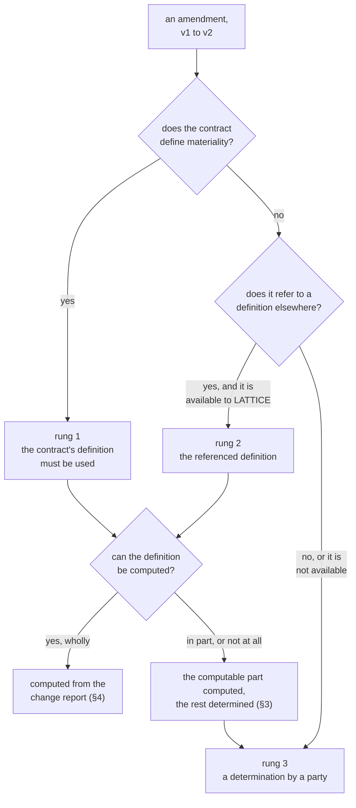
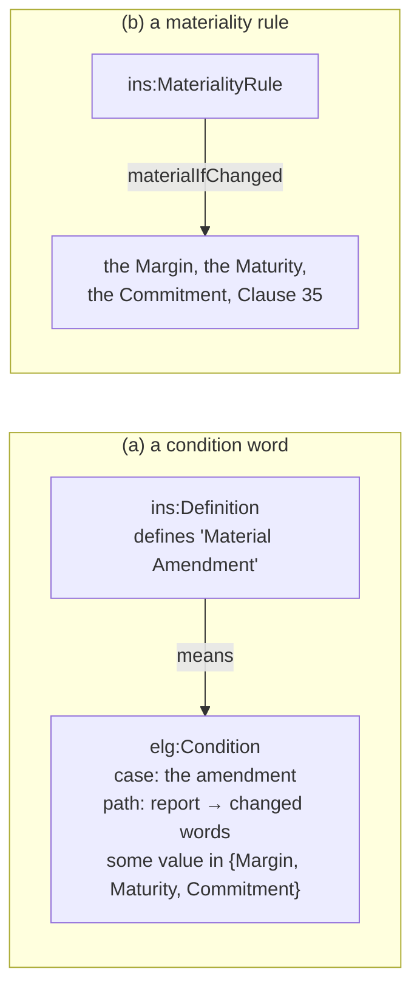

<!-- SPDX-License-Identifier: CC-BY-SA-4.0 -->

# Change materiality: deciding whether an amendment is material

**Unit:** [`computable-contract-substrate`](../plans/computable-contract-substrate.md), slice C9
(C9-Q3, paused for this sketch on 2026-10-07).
**Status:** decided 2026-10-07 (MQ1 to MQ7 answered, §10). Carried into C9 as C9-Q3's answer.
**Amends, if accepted:** ADR-A104 decision 11, through the C9 addendum. Possibly Eligibility (§8).
**Reads with:** the [CCS sketch](computable-contract-substrate.md) §5.8 (change and composition),
the [Instrument README](../../../ontology/instrument/README.md) §15.1 (definitions) and §15.4
(classification), the [Eligibility README](../../../ontology/eligibility/README.md) (evidence
bindings and set readings), ADR-A106 (records), ADR-A92 (derived artefacts).

## 1. The problem

Many contracts treat a change differently by how much it matters. A *material* change may need every
party's consent, a filing with a regulator, or notice to a third party, where a minor one needs the
agreement of one party alone. Whether a given amendment is material is therefore an input to who
must consent (C9-Q4), and to any relation that arises on a material change.

LATTICE is a framework, so it imposes no consent rule and no meaning of "material". The contract
says what both are. LATTICE's job is to find the meaning the contract gives, apply it where it can,
and say plainly where it cannot.

**In scope:** the materiality of an amendment, a change from one instrument version to the next.

**Out of scope, though related:** a material breach, a material adverse change in a party's
circumstances, a material change in a risk. These classify an event or a state of affairs, not a
change of terms. They may later reuse the mechanism, and are held for later in the epic (MQ1, HQ-8).

## 2. Where materiality comes from

We set the order on 2026-10-07. Materiality comes from the most specific source available:

Each rung is a source of the *meaning* of material. The second question, whether that meaning can
be computed, cuts across rungs 1 and 2, and is where most of the design lies.

## 3. Definitions that compute, and definitions that judge

Contracts define materiality in two ways, often together:

| Kind | Example | Can LATTICE decide it? |
|---|---|---|
| **enumerated** | "a change to the Margin, the Final Maturity Date or any Commitment", "a change to the Fees or the Territory" | yes, from what changed |
| **evaluative** | "a change which would adversely affect the rights of any Lender", "likely to have a substantial impact on the safety of the subjects" | no. A person must judge it |
| **mixed** | "a change to the Margin or the Final Maturity Date, or any other change which in the Agent's opinion is material" | the enumerated part, yes. The rest needs a judgement |

A defined term is not therefore always a computable one. An evaluative definition still governs,
since it says what the person deciding must decide, and often who decides ("in the Agent's opinion"). So
rung 1 can end in a determination, and the determination is then made under the contract's
definition, not in place of it.

Eligibility's three values fit this directly. The enumerated part is evaluated against the change
report and yields Permitted (material) or Denied (not material). An evaluative part has no
evidence and yields Undetermined. Their disjunction, under strong Kleene logic, is material if
either part is, not material only if both are not, and Undetermined otherwise, until a
determination supplies the missing part.

**The definition is a condition word.** Instrument already models it (C7c, README §15.1). "Material
Amendment" is a word, a `skos:Concept`, which an `ins:Definition` defines and whose meaning is an
Eligibility condition. What is new is the condition's *case*: the amendment, read through its change
report, where every condition so far has read a case of the instrument's own subject matter.

## 4. The change report

Computing an enumerated definition needs what changed, as data a condition can read. The sketch
§5.8 already says what changed is computed, never recorded, by comparing the two versions'
wordings:

| Change | Seen as |
|---|---|
| a clause amended | an element identity included at two versions |
| a clause added or removed | an element identity included by one version only |
| a value changed | a different value for the same variable |
| a party changed | a different definition, or a role filled by a different party |

A condition reads a path from its case to a value (an `elg:EvidenceBinding`). For a change report,
the case is the amendment, and the path reaches each changed thing. A definition names what it
cares about by its defined words ("the Margin") or by its clause numbers ("Clause 23"), so each
changed thing must be reachable as the word or the clause the contract would name:

- a changed **value** is reached through the variable to the words whose meaning takes its value
  from it (C8's `ins:valueFrom`). "The Margin" is a word, so a concept, and an Eligibility concept
  condition reads it today, under `elg:SomeValue` ("any changed word is one of these")
- a changed **definition** is reached as the word it defines, also a concept
- a changed **clause** is reached as the element's persistent identity, which is not a concept.
  Eligibility's paths end at a concept, a quantity or a literal, so "any change to Clause 23" cannot
  be read today. §8 takes this up

Whether the report is materialised in the graph (a derived artefact, ADR-A92, with its
`fnd:DerivationRun`) or computed when a condition asks is MQ3.

## 5. A definition referred to elsewhere

A contract may take its meaning from outside: "Material Amendment has the meaning given in the
Standard Terms", or a regulation's definition of a substantial modification to a trial protocol.
Since C8b, the reference names the document's identity and the wording's reliance fixes its edition,
static or as amended. Since C9c (C9-Q7), incorporation gives the document legal effect within the
contract.

- If the document is **encoded** in LATTICE, its definition is a condition word like any other, and
  §3 applies unchanged.
- If it is **not available**, the definition still binds the parties in law. LATTICE cannot apply
  it, so rung 3 applies, and the determination is made under the referenced definition. The record
  says so, so a reader knows the decision rests on a text LATTICE did not hold.

## 6. A determination

Behaviour already records "a determination of a matter by the party a contract names to decide it"
(`bhv:DeterminationRecord`, ADR-A106). A materiality determination is one whose matter is an
amendment's materiality.

Who determines is the contract's to say. Where it names no one, LATTICE must still behave
predictably, and must not invent a legal rule. A deployment chooses one of three fallbacks
(MQ5): Undetermined until a determination is recorded, treat the amendment as material, or a
decider named by role. MQ5 asks where that choice is held.

## 7. Recording the outcome

Whatever the rung, a reader later needs to know three things: the outcome, the source of the
meaning (which rung, and which definition), and how it was reached (computed, or determined by
whom):

| Outcome reached by | Recorded as |
|---|---|
| computation | a derived artefact with its `fnd:DerivationRun`, naming the definition and the versions compared |
| determination | a `bhv:DeterminationRecord`, naming the decider and the definition it was made under, if any |
| both, for a mixed definition | the computed part and the determination, each as above |

Materiality is decided **when the amendment is proposed**, before consent is sought, since the
consent rule reads it. Both versions exist by then, so the comparison is a design-time act, not a
runtime evaluation.

## 8. Eligibility paths ending at an identity

Raised 2026-10-07. A path that ends at a persistent identity would let a condition
ask "is this one of these named things", where the named things are clauses, documents, or any
other identified record, not concepts.

**Answered 2026-10-07:** (b) as its own Eligibility slice with an ADR (HQ-9), and (a)
in C9 meanwhile.

- **(a) Leave Eligibility as it is.** Words cover enumerated definitions that name defined terms.
  Definitions naming clauses fall back to a determination.
  - No Eligibility change. Clause-number definitions ("any amendment to this Clause 35") are common
    in amendment clauses themselves, and would all need a person to decide.
- **(b) Let a path end at a `fnd:PersistentIdentity`, matched by identity.** A new condition kind,
  or `elg:SetMembershipCondition` widened, decides whether the value is one of the listed
  identities.
  - Identity matching is exact. There is no hierarchy, unlike concepts under `skos:broader`, so
    "Clause 23" does not match "Clause 23.1" unless the condition walks the wording's structure.
    That walk is Wording's, which Eligibility does not import.
  - Useful beyond materiality: a claim on one of the named vessels, a case about one of the named
    sites.
  - An Eligibility change, additive at 0.x, with its own ADR (after ADR-A90, A91 and A103), and the
    cascade to every importer. The MORK and design-time OWL compilers must learn the new ending.
- **(c) Give each identity a concept.** An element whose number a definition may name carries a
  concept, and the definition names the concept.
  - No Eligibility change. Every clause gains a concept and a link, which duplicates its identity,
    and the two can drift.

## 9. Examples, by domain

| Domain | Definition | Rung | Computed? |
|---|---|---|---|
| a syndicated facility | "a change to the Margin, the Final Maturity Date or any Commitment, or to this Clause 35" | 1 | the words yes, the clause only under §8 (b) or (c) |
| a clinical trial protocol | a regulation's "substantial modification", likely to affect the subjects' safety or the data's reliability | 2 | no. The sponsor determines it under the regulation |
| a software licence | "any change to the Fees or the Territory" | 1 | yes |
| a services agreement | change control: "Minor Changes" listed in a schedule, anything else "Major", and the parties' change board deciding disputes | 1, mixed | the list yes, the rest by the board's determination |
| a supply agreement silent on materiality | none | 3 | no. MQ5 decides who |

## 10. Questions

Each open option is compared on its design overheads (how hard it is to reason about, to model
correctly, to assure and govern, and how brittle it is under change) and its runtime overheads (data
volume, inconsistency, and surprises for traversal or aggregation), then against KISS.

**Answered 2026-10-07:** MQ1 (a), amendments only, with (b) on the epic's backlog as
held design question HQ-8. MQ3 (a), the change report materialised. MQ7 (b) as its own Eligibility
slice with an ADR (HQ-9), and (a) in C9 meanwhile, so a definition naming a clause falls back to a
determination. MQ5's three choices are all offered.

**Answered 2026-10-07, second round:** MQ2 (a), a condition word. MQ4 (b), a graded
scheme with the two-concept baseline and the chain rule. MQ5 (a) in C9, an Instrument evaluation
profile shaped so a deployment configuration layer can absorb it, and that layer on the backlog as
its own unit with an ADR (HQ-10). MQ6 (a), with the decider notified of the computed result, so the
record exists without the decision being asked again.

### MQ2. How a contract's definition is represented

The facility defines "Material Amendment" as a change to the Margin, the Final Maturity Date or any
Commitment. Its consent rule reads the word, and so may a notice duty ("the Agent shall notify the
Lenders of any Material Amendment").

- **(a) A condition word** (§3). The definition is an `ins:Definition` like any other, whose meaning
  is an Eligibility condition over the amendment's change report.
  - *Design.* Nothing new to learn, since the word is defined, placed in sections, checked for overlap
    (I16) and cycles, bound by the instantiator and rendered in controlled English as every other
    defined word is. Eligibility's laws, its shapes and its compilers (MORK, the design-time OWL
    backend) apply, and so does the formal methods track's work on Eligibility. Thresholds and
    combinations come with it ("a change to the Margin of more than 0.25%" is an interval condition
    on the change, once the report holds old and new values). Two things need rules of their own.
    The definition that governs is the one in the version being amended, since a change is made
    under the terms in force when it is made, so the condition is bound from v1 and reads a report
    comparing v1 with v2. And an amendment touching two sections that define the word differently
    needs a rule. Material if material in any section is the natural reading, and the shapes
    should say so. The definitions' paths depend on the change report's shape, so the report is
    part of Instrument's versioned contract, and changing it is breaking.
  - *Runtime.* No data beyond the report (MQ3). Evaluation is Eligibility's, three-valued, so a
    mixed definition's Undetermined part needs nothing special (§3). Until MQ7's Eligibility slice,
    a definition naming a clause cannot be written, and falls back to a determination.
  - *KISS.* Adds no construct. The only new thing is a subject class, the amendment, that conditions
    read.
- **(b) A dedicated `ins:MaterialityRule`**, listing the words and clauses whose change is material.
  - *Design.* Easy to author and read, and it can name a clause's identity directly, so it does not
    wait for MQ7. But it is a second rule language beside Eligibility, with its own semantics,
    evaluator code, shapes and assurance, and no compiler support. It cannot express a threshold
    or a combination without growing into Eligibility. In law the text is still a definition of a
    word, and any other clause using the word ("notify the Lenders of any Material Amendment")
    needs the word as a condition, so (b) needs a bridge back to (a) for those, and the two can
    disagree.
  - *Runtime.* A set intersection, cheap. Undetermined has to be added by hand for evaluative parts.
  - *KISS.* Simpler for the first example, and more to build and keep consistent afterwards.

**Leaning: (a).** MQ7's slice later removes (b)'s one advantage.

### MQ4. Grades, and their downstream consequences

Under (b), an amendment's materiality is a concept from a scheme ("Minor" and "Major", or "non-substantial" and
"substantial"), and a contract defines a word per grade. What follows downstream:

| Where | Consequence |
|---|---|
| Vocabulary | a scheme contract, say `ins-voc:ChangeGradeContract`, as `ins-voc:TermClassificationContract` is. A deployment binds a scheme to it, per binding scope |
| definitions | one condition word per grade ("Major Change means…", "Minor Change means…"). An amendment satisfying two grades' definitions needs a rule for which grade it takes |
| order of grades | Vocabulary has no order on concepts. A consent rule saying "Major or above" needs one. A chain of narrower concepts gives it with what exists. If "Fundamental" is narrower than "Major", Eligibility's hierarchical match on "Major" admits both, and "every Fundamental change is a Major change" reads correctly. The same chain settles an amendment matching two grades, which takes the narrowest |
| consent rules | read the grade with a concept condition. "Every lender for a Major change" is a hierarchical match on Major |
| determinations | record a concept, not a yes or no |
| reporting across instruments | grades from different schemes are not comparable. "How many material amendments this year" across a book needs each scheme mapped to a common one (`skos:broadMatch`), or it silently counts only one scheme's concepts |
| binary contracts | still need a scheme bound. A two-concept baseline (material, not material) that a deployment may replace avoids that setup for the common case |

- **(a) Material or not.**
  - *Design.* Nothing to bind. Contracts with grades ("Minor", "Major") cannot be modelled, and a
    later move to grades changes every consent rule and determination record. Brittle for the
    service and trial cases of §9.
  - *Runtime.* A boolean aggregates across instruments without surprise.
- **(b) A graded scheme, with a two-concept baseline.**
  - *Design.* One mechanism for every grading. The order comes from the scheme's hierarchy, which an
    author can get wrong (a chain built upside down admits the wrong grades), so a shape should
    check that each grade scheme is a single chain. Governance is the scheme's, versioned and
    bound per scope.
  - *Runtime.* One concept per amendment. Aggregation across schemes needs the mapping above, and a
    report that ignores it undercounts without error.
- *KISS.* (a) is simpler now. (b) is needed by two of §9's five examples, and changing from (a) later
  is breaking.

**Leaning: (b), with the baseline and the chain rule.**

### MQ5. Where the fallback setting lives

The three fallbacks are offered (Undetermined, treat as material, a decider named by role). LATTICE
has no deployment configuration layer, and three mechanisms come close:

| Existing | What it configures | Fit |
|---|---|---|
| `voc:BindingScope` and `voc:SchemeBinding` (ADR-A85) | which scheme edition a contract property draws on, per deployment, tenant, jurisdiction or product, resolved by valid time and recorded with `voc:resolvedUnder` | scopes and history fit. It binds schemes, not settings |
| `elg:OperationalProfile` | how an Eligibility decision was evaluated. Versioned, and every decision names the one it used (law L8) | the pattern fits: a versioned record of evaluation settings, named by each outcome |
| ADR-A50's role profiles (`LATTICE_ROLE`) | which processes a deployment runs | not semantic configuration |

Other settings already wait for a home: Eligibility's operational profiles, HQ-5's "market default
declared as data" for how a silent group acts, and the evaluation context sketch's choice of
environment.

- **(a) An Instrument evaluation profile**, following `elg:OperationalProfile`: a versioned record
  holding the fallback and, for the third choice, the decider's role. Each materiality outcome
  names the profile it was reached under. Which profile a deployment loads is its runtime setting,
  outside the graph.
  - *Design.* Small, and in the layer that uses it. Every outcome says which settings produced it,
    so an audit can replay it. A second profile class beside Eligibility's, and the next layer
    needing settings adds a third, each with its own selection.
  - *Runtime.* One profile node per deployment edition, and one link per outcome.
  - *KISS.* Needed now, minimal.
- **(b) Widen Vocabulary's scope bindings to bind settings as well as schemes.**
  - *Design.* One mechanism, with scopes, valid time and resolution records already worked out.
    Vocabulary's purpose widens from schemes to configuration, and every setting becomes a
    "contract" to bind, which reads awkwardly for a single value. A Vocabulary change with an ADR,
    cascading to every layer.
  - *Runtime.* Each outcome records the binding it resolved under, as concept values do.
  - *KISS.* More than C9 needs.
- **(c) A deployment configuration layer**, a new module holding profiles and settings for every
  layer, selected per binding scope.
  - *Design.* The right home once several layers have settings, and it would absorb (a)'s profile
    and Eligibility's. A new directory needs an ADR, and its design has to consider all the waiting
    settings, which is a unit of its own.
  - *Runtime.* As (a).
  - *KISS.* Not needed for C9 alone, but the need is real and growing.
- **(d) On each instrument**, the instantiator writing the deployment's fallback into every one.
  - *Design.* No new class. A change of setting needs a new version of every instrument, and the
    setting is the deployment's, not the parties'. Ruled out.
  - *Runtime.* One copy per instrument version.

**Leaning: (a) in C9, shaped so (c) can absorb it, and (c) on the backlog as its own unit with an
ADR.**

### MQ6. Mixed definitions

"A change to the Margin or the Final Maturity Date, or any other change which in the Agent's
opinion is material." The amendment changes the Margin.

- **(a) Compute first, and ask for a determination only when the computed part does not settle it.**
  Here the Margin changed, so the amendment is material, and the Agent is not asked.
  - *Design.* This is exactly the strong Kleene reading of §3, where material or Undetermined is material.
    Nothing can contradict the computed part, because no determination is sought where it decides.
    With grades (MQ4 (b)), it settles only at the highest grade the definition can reach, and a
    lower computed grade still asks the decider whether a higher one applies.
  - *Runtime.* Fewer determinations, and amendments the definition decides are not held waiting
    for a person.
- **(b) Always ask for a determination when any part is evaluative.** The Agent is asked even
  though the Margin changed.
  - *Design.* Every amendment under such a contract carries a decider's record, which some
    governance processes want. But the decider can then answer "not material" where the contract
    says material, and the model needs a rule for that conflict. The contract's enumerated part
    prevails, and the determination is reported as contradicting it. That is a check, a message and
    a way to resolve it, for a case (a) cannot produce.
  - *Runtime.* One determination per amendment, and each amendment waits for it before consent can
    be sought.
- *KISS.* (a) does less and needs no conflict rule.

**Leaning: (a).** If we want (b) for its audit trail, a cheaper form is (a) with the
decider notified of the computed result, so the record exists without the decision being asked
again.
