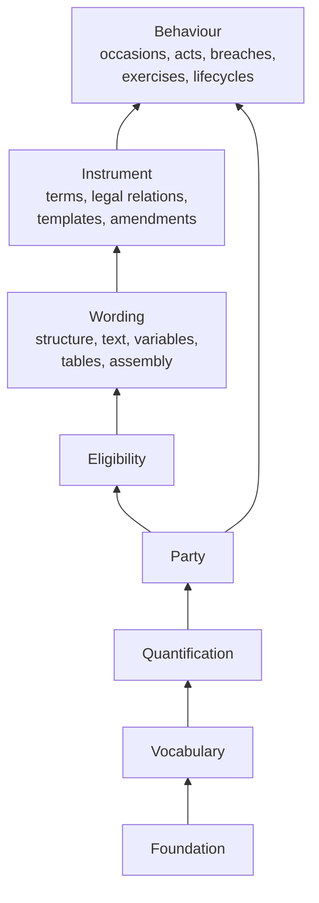

<!-- SPDX-License-Identifier: CC-BY-SA-4.0 -->

# Computable contract substrate: wording, instrument and behaviour

Draft for review, 2026-09-30. The design for how LATTICE models a computable contract: its wording
(what the document says), its instrument (what it means in law) and its behaviour (what happens
over time). It consolidates, and supersedes as the working design:

- [instrument-terms-and-legal-relations.md](instrument-terms-and-legal-relations.md), the first
  answer to [normative-rule-substrate](../plans/normative-rule-substrate.md) decision D2, kept as
  the record of that answer
- [legalruleml-mapping.md](legalruleml-mapping.md) §6.3's resolution, §18.2 and §18.3
- the thirteen fixes found by testing the first design against three real contracts, recorded in
  §10 with their sources

It also brings Open CBAA's wording model (`wim:`) and the general parts of its meaning (`stm:`)
and agreement (`agr:`) modules into the substrate (§3). Contract amounts (limits, retentions,
shares, accumulations, commissions) are catalogued separately in
[contract-amounts.md](contract-amounts.md). Plan:
[computable-contract-substrate](../plans/computable-contract-substrate.md). Nothing here is
ratified.

**Evidence.** Four instruments were read clause by clause:

| Code | Instrument | Where |
|---|---|---|
| AIG Dummy Policy | AIG dummy non-profit package policy: General Terms and Conditions, Non-Profit D&O, EPL, Fiduciary, Corporate Counsel, CrisisFund, 33 endorsements | `wingman/Nebularis/Ontologies/specification/sample-policy-blended.md` |
| IUA | IUA 09-069 BAA2018 (Broker) non-marine binding authority agreement and its schedule | `open-dare/.copilot/UIA_Broker_BAA.md` |
| CBAA | Lloyd's proposed computable binding authority agreement, modules M1 to M6, M8 to M10, M12 to M14, with the Insurer Capacity Table and Scope of Underwriting Authority base tables | `open-dare/.copilot/cbaa/`, extracted by `open-dare/tools/cbaa_extract.py` |
| SCHED | the schedule of a sectioned Lloyd's binding authority (its agreement number and UMR are not recorded here): coverholders, persons responsible, classes and locations per section | image supplied in review, 2026-09-30 |
| LEND, TRIAL | the clean-room examples of the first sketch: a facility agreement and a trial protocol | [instrument-terms-and-legal-relations.md](instrument-terms-and-legal-relations.md) §7 |

Clause references below use these codes, for example AIG Dummy Policy D&O 9.A(2), IUA 36.6, CBAA M3 3.9.1.

Three tests govern every choice, in this order:

1. **Reads right.** A contract lawyer or an engineer surveying the T-Box recognises each name and
   meets no word used in two senses.
2. **Reasons right.** Every class has one evaluation algorithm, total over the class, that runs on
   the A-Box at runtime without a reasoner.
3. **Relates (or Sits) right.** The design maps onto the logics LATTICE must meet: Hohfeld's legal relations,
   deontic and defeasible logic, strong Kleene decisions, OWL DL, SHACL, SWRL, stratified Datalog
   and controlled English. External standards are aligned where it costs nothing and mapped
   through MORK otherwise.

---

## 1. The three strata of a computable contract

A computable contract is three things, and each is a layer:

| Stratum | Answers | Layer | Prefix |
|---|---|---|---|
| **Wording** | what does the document say, how is it built, and what did this instance fill in? | Wording, new, below Instrument | `wrd:` (provisional, decision CC-D1) |
| **Instrument** | what does it mean in law: which terms bind, which legal relations they create, between whom? | Instrument, rewritten | `ins:` |
| **Behaviour** | what happens over time: arisings, acts, breaches, exercises, states? | Behaviour, extended | `bhv:` |

The substrate README calls the composition a **computable contract**. No single layer carries that
name.



**Why the wording is a layer of its own.** Contract structure and wording are general to every
computable contract: a policy, a binding authority, a facility agreement, a licence. Elements that
nest, text that embeds variables, tables whose cells are variables, references to definitions and
external documents, and design-time assembly from a library of variants are all needed for a
policy (AIG Dummy Policy's forms index and optional endorsements) as much as for a binding authority (the CBAA's
variation slots and conditional clauses, the IUA's form and schedule). Nothing in Open CBAA's `wim:`
T-Box is specific to binding authorities (§3). The London market's WIM typing is specific to the
London market, not to binding authorities, and becomes a profile (CC-D3).

**Why wording sits between Eligibility and Instrument.** Wording needs Foundation (versions,
governance), Vocabulary (typing by scheme contract), Quantification (a variable's value space and
admissible range) and Eligibility (a conditional clause's inclusion condition). Instrument needs
Wording, because a term is expressed in wording. Behaviour needs both. This inserts one layer into
ADR-A01's order, which ADR-A112 amends.

### 1.1 Naming: wording, instrument, contract

The proposal in review was to call the lower layer `contract`. The names here come from how each
word is used in law and in the market:

| Word | Its meaning in law and the market | Fit |
|---|---|---|
| **contract** | the legally binding agreement itself, and colloquially its document | names the whole. A layer called Contract would claim the whole while holding only its text, and "a contract of contracts" (a tower) would be ambiguous between nested documents and nested agreements |
| **instrument** | a formal legal document that creates, defines or transfers rights and duties | names the legal meaning of the document well: the rights and duties are what Instrument holds |
| **wording** | the text and form of a contract: "the policy wording", "the LMA wordings", "the wording of clause 5" | names the text and its structure, with no claim to legal effect. The market's own model is the LMA **Wording** Information Model, which already includes variables and tables |

So the proposal is **Wording** (`wrd:`) for the lower layer, **Instrument** (`ins:`) for the
meaning, and **computable contract** for the composition. The choice is CC-D1. The prefix `ctr:` is
avoided in any case: MERIDIAN CSO and the term-parameters sketch (A-101) already use it.

---

## 2. Reading the words

Every name in the three layers is chosen so that no word carries two senses. The table extends the
first sketch's.

| Word | Its senses in contracts | Where each sense lands |
|---|---|---|
| **term** | (a) a provision the parties are bound by, express or implied. (b) a duration ("policy term") | (a) `ins:Term`. (b) `fnd:TemporalScope` |
| **condition** | (a) a heading ("General Conditions"). (b) a class of term by breach consequence (condition, warranty, innominate, condition precedent). (c) a contingency | (a) a wording element type. (b) a term classification (`ins:classification`, §5.1) whose legal effect is modelled as relations (S27). (c) `elg:Condition`. No `ins:` or `wrd:` class is named Condition |
| **provision** | both a clause and what it provides | retired. `wrd:Element` and `ins:Term` replace it |
| **clause, section, schedule, module, endorsement, annex, appendix** | parts of a document | element types (concepts), never classes (DP2) |
| **wording, form** | the text of a contract, and a standard text published for reuse | `wrd:Wording`. A form is a library wording (`wrd:Wording` not assembled) |
| **variable, field, blank, "{Missing}", "delete as applicable"** | what an instance must supply or choose | `wrd:Variable` and assembly (§4) |
| **obligation, duty** | the bond, and the obligor's end of it | `ins:Obligation`. "Duty" gets no class |
| **right** | a claim, a power or a liberty | the obligee's end, `ins:Power`, `ins:Permission`. No class is named Right |
| **may** | a liberty or a power | `ins:Permission` if it only frees the holder from a restriction. `ins:Power` if it changes someone else's position |
| **must not, shall not** | a negative obligation | `ins:Prohibition` |
| **shall not be liable, not obliged, no duty** | a liberty not to perform a duty | `ins:Exclusion` |
| **authority, authorise** | an agent's power to change the principal's relations, and the liberty to use it | `ins:Power` (with a `Prohibition` outside it where the wording says so). Open CBAA keeps `AuthorityGrant ⊑ ins:Power` |
| **quotation, offer** | an offer the offeree may accept | `ins:Power` of acceptance held by the offeree |
| **breach, violation** | the same | "breach" |
| **deem, deemed, conclusively deemed** | a fact taken to hold, rebuttably or not | `ins:Deeming` |
| **means, shall mean** | a definition | `ins:Definition` |
| **prevail, notwithstanding** | precedence between terms | `ins:prevailsOver` (N10, D5) |
| **amend, delete, replace, insert** | a change to wording, and its legal effect | `wrd:Amendment` (text), `ins:Amendment` (effect) |
| **liability** | an insurer's liability to pay, and Hohfeld's correlative of a power | never a name. The power's other end is `ins:counterparty` |
| **permission, Permitted** | a legal relation, and an Eligibility decision value | kept, with a disambiguating comment on both |
| **section** | a part of a contract with a determined meaning, as in Lloyd's and the MRC: "Section B2", with its own parties, authority, classes or capacity. The CBAA calls it an "Agreement Segment" | a wording element of type Section, which terms name with `ins:appliesWithin` and `ins:notWithin` (§5.10). Pieces of text are `wrd:TextPart`s |
| **the Coverholder, the Insured, the Lender** (a defined party word) | a role whose occupant the instrument defines, sometimes per section | an `ins:Definition` whose meaning is one or more occupancies (§5.10) |
| **norm, statement** | legal theory, and Open CBAA's term for attached meaning | not used in the substrate. Open CBAA's `stm:Statement` maps to terms and relations (§3) |

---

## 3. Where Open CBAA's modules land

Cross-referenced against the Open CBAA [ontology README](https://github.com/nebularis/open-cbaa)
(`open-dare/ontology/README.md`), its design specification (principles AP1 to AP4, DP1 to DP10,
decisions D1 to D26) and its LATTICE integration specification (I1 to I10, upstream items L1 to
L17).

### 3.1 Principles carried into the substrate

| Open CBAA principle | In the substrate |
|---|---|
| DP1 thin T-Box, governed A-Box vocabulary | kept: every typing is a concept under a scheme contract |
| DP2 class or concept | kept: element types are concepts, content kinds that differ in properties are classes |
| DP3 wording and meaning are separate strata | becomes the Wording and Instrument layers, disjoint |
| DP4 intrinsic on nodes, relational on edges | kept: parameters on relations, qualifiers as nodes |
| DP5 compile, do not interpret, on hot paths | kept for Behaviour's compiled wiring (§7) |
| DP6 state never enters structural comparison | kept: `ins:appliesInState` is separate from scope and never enters design-time comparison |
| DP7 open world for terminology, closed world for transitions | kept |
| DP8 every concept-valued property names a scheme contract | kept |
| DP9 `Any` concept, never the empty set | kept for scope dimensions |
| DP10 identity is not position | kept: rank keys and segment indices, clause numbers derived |
| design-spec §3.6: inclusion and applicability conditions never share a mechanism | kept: `wrd:includedWhen` (assembly, question form) and relation conditions (runtime, evidence bindings) |

### 3.2 Construct by construct

| Open CBAA term | Lands in | As |
|---|---|---|
| `wim:WordingObject ≡ Contract ⊔ ComponentGroup ⊔ Component ⊔ DataElement` | Wording | `wrd:Wording` (root) and `wrd:Element` (nestable), typed by concept. The four fixed levels and their containment rules become the LMA WIM profile (CC-D3) |
| `wim:directlyComprises` ⊑ `wim:comprises` (transitive), the simple/non-simple split | Wording | `wrd:directlyComprises` ⊑ `wrd:comprises`, same characteristics, same reason |
| `wim:rankKey`, `wim:objectId` | Wording | `wrd:rankKey`, `wrd:objectId` |
| `wim:contractCategory`, `componentGroupType`, `componentType`, `elementType`, `clauseClassification`, `documentKind`, `applicableTo` | Wording | `wrd:elementType` (functional, every element and the root), `wrd:classification` (polyhierarchy), `wrd:documentKind`, `wrd:applicableTo`. Contracts unbound in the substrate |
| `wim:Text`, `wim:Segment`, `segmentIndex`, `segmentText`, `refersToVariable`, `refersToObject` | Wording | `wrd:Text`, `wrd:TextPart`, `wrd:partIndex`, `wrd:partText`, `wrd:refersToVariable`, `wrd:refersToObject`. Renamed so that "segment" keeps its market meaning, a section of business (§5.10) |
| `wim:Table` (dynamic, static) | Wording | `wrd:Table` with rows, columns and cells (§4.3, CC-D6) |
| `wim:Variable`, `EmbeddedVariable`, `GoverningVariable`, `variableKey`, `populationMethod`, `populatedFrom`, `valueContract`, `valueSpace`, `admissibleValues`, `multiValued` | Wording | same, `wrd:` |
| `wim:Metadata`, `wim:Reference`, `wim:DocumentObject`, `wim:ExternalDocument`, `wim:linksTo` | Wording | same, `wrd:` |
| `wim:InclusionMode`, `inclusionMode`, `VariationSlot`, `hasVariant`, `variantOf`, `includedWhen`, `readsVariable` | Wording | same, `wrd:` (assembly, §4.4) |
| `wim-vocab` individuals (inclusion modes, population methods) | Wording vocab | same |
| `lma:` WIM typing schemes | applied insurance, or Open CBAA | the LMA WIM profile (CC-D3) |
| `stm:Statement` kinds Obligation, Prohibition, Permission, Power | Instrument | the legal relation classes |
| `stm:AuthorityGrant` | Open CBAA | `⊑ ins:Power`, with level and limits as qualifiers. Its envelope mechanism hangs off it unchanged |
| `stm:Definition`, `stm:Classification` | Instrument | `ins:Definition`, `ins:Deeming` (classification that counts something as a category, deemed receipt) |
| `stm:Precedence` (`prevails`, `over`) | Instrument | `ins:prevailsOver`, reserved for N10 |
| `stm:StatementTemplate`, `stm:BoundStatement`, `boundFrom`, `expresses`, `expressedBy` | Instrument | templates and binding (§5.9): `ins:Template`, `ins:boundFrom`, `ins:expressedIn` |
| `stm:bearer`, `counterparty`, `bearerOccupancy`, `counterpartyOccupancy` | Instrument | `ins:obligor` or `ins:holder`, and `ins:obligee` or `ins:counterparty`. Roles on templates, occupancies on bound relations |
| `stm:activity`, `stm:scope`, `stm:level`, `stm:deadline`, `stm:recurrence` | Instrument | `ins:activity`, `ins:scope`, a level qualifier, `ins:due`, `ins:recurrence` |
| `stm:trigger` (range `bhv:TriggerDefinition`) | Instrument | `ins:arisesOn`, range `elg:Condition`, since Instrument cannot import Behaviour. Behaviour compiles the trigger from it |
| `stm:appliesInState` (range a Behaviour state) | Instrument | `ins:appliesInState`, range a lifecycle state concept. Behaviour states name their concept (§7.6) |
| `stm:breachTreatment` | Instrument | `ins:classification` on a term, bound in insurance to the breach-treatment scheme |
| `stm:ParameterBinding`, `ParameterKind`, `fromVariable`, `scopeSubject`, `scopeStep`, `scopeStrategy` | Instrument | `ins:ParameterBinding` and its properties (§5.9) |
| `stm:EncodingStatus`, `encodingStatus` | Instrument | `ins:encodingStatus` on a wording element |
| `agr:AgreementIdentity`, `agr:AgreementVersion` | Instrument | `ins:Instrument` (a `fnd:Version` with a persistent identity), expressed in an assembled `wrd:Wording` |
| `agr:includes`, `agr:VariableValue`, `hasVariableValue`, `forVariable`, `value`, `literalValue` | Wording | the assembled wording's resolved inclusions and values (§4.5) |
| `agr:hasOccupancy`, `agr:insurers` | Instrument | `ins:party` |
| `agr:Amendment` (`amends`, `resultsIn`, `agreedOn`, `operationalFrom`, `materiality`) | Instrument | `ins:Amendment`, with the Foundation gap Open CBAA recorded (integration spec §4.1) closed here, not in Foundation |
| `agr:umr`, `agr:inMarket` | Open CBAA | the market-specific key stays. Markets are `voc:BindingScope`s, and `ins:bindingScope` is the general hook |
| `agr` M12 lifecycle declared on Behaviour | Open CBAA, on the extended Behaviour | unchanged as data. L15 is fixed upstream (§7.1) |
| `rsk:BoundPolicy`, `rsk:boundUnder`, `rsk:boundAt` | Instrument for the general part | `ins:boundUnder` (an instrument created by exercising a power, S48). `rsk:BoundPolicy ⊑ ins:Instrument` stays in Open CBAA |
| `rsk:Risk` and its dimensions | Open CBAA, and AIR's exposure module | the case |

Open CBAA decisions affected: D22 (only bound relations are instrument relations) holds as the
template rule of §5.9. D23 is resolved, since attachment is `ins:expressedIn` from a template term
to a library element, with no `ins:Provision`. D25 changes: an agreement version is an
`ins:Instrument` expressed in a `wrd:Wording`, and no longer an `ins:Element`. Integration spec I6
closes with D23. L15 is fixed by ADR-A106.

---

## 4. The Wording layer

### 4.1 Structure

```text
wrd:Wording          ⊑ fnd:Version ⊓ fnd:Governable      the root of a wording tree: a policy
                                                         wording, an agreement, a form, an endorsement
                                                         issued as its own document
wrd:Element          ⊑ fnd:Version ⊓ fnd:Governable      a nestable part: section, clause, schedule,
                                                         module, endorsement, annex, table row
wrd:directlyComprises  (Wording ⊔ Element) → Element     asserted edge, irreflexive, asymmetric
wrd:comprises          transitive super-property         never asserted
wrd:rankKey            lexicographic sibling order        identity is not position (DP10)
wrd:objectId           the element's stable id            "C05.2", "4.B(2)"
wrd:elementType        functional, concept                bound by wrd-voc:ElementTypeContract
wrd:classification     concept, polyhierarchy             bound by wrd-voc:ClassificationContract
```

Content kinds that differ in properties are classes (DP2), each `⊑ wrd:Element`:

| Class | Content |
|---|---|
| `wrd:Text` | ordered `wrd:TextPart`s: literal text, a variable reference or an object reference, indexed 0..n−1 |
| `wrd:Table` | rows, columns and cells (§4.3) |
| `wrd:Variable` | a declaration of what an instance supplies (§4.2) |
| `wrd:Reference` | a link to a definition, another element, a table, a document object or an external document |
| `wrd:Metadata` | descriptive and system metadata |

`wrd:DocumentObject` (an analogue attachment, content not digitised) and `wrd:ExternalDocument` (a
regulation, a separate agreement) are `prov:Entity`s outside the tree, reached by `wrd:linksTo`.

### 4.2 Variables

```text
wrd:Variable           ⊑ wrd:Element
wrd:EmbeddedVariable   ⊑ wrd:Variable     shown in text
wrd:GoverningVariable  ⊑ wrd:Variable     read by inclusion conditions, disjoint from embedded
wrd:variableKey, wrd:populationMethod, wrd:populatedFrom, wrd:valueContract (concept-valued, DP8),
wrd:valueSpace (quantity-valued), wrd:admissibleValues (qnt:RangeSet), wrd:multiValued
```

A variable's value may be a concept, a quantity, a literal, a party occupancy or another
instrument. The last two are why a variable's value is recorded at the Wording layer as a node
(`wrd:VariableValue`, §4.5) whose value may be any resource, checked against the declaration by
shape.

### 4.3 Tables

Decided 2026-09-30 (CC-D6): **rows in the wording, columns at the instance, cells as variable
values**, with long lists as multi-valued variables.

The collateral shows why. The Scope of Underwriting Authority base table fixes its rows in the
standard form, each Mandatory, Optional or Conditional, while its columns are supplied per agreement:
"Rows above this point will dictate the number of columns (or segments) required" (row 14). The
Insurer Capacity Table has one column per insurer. Territory tables are long lists whose rows are
just values.

```text
wrd:Table        ⊑ wrd:Element
wrd:Row          ⊑ wrd:Element     declared in the template, with inclusion modes, rank keys and
                                   wrd:rowKey (the row's meaning, "Maximum Limits of Liability")
  wrd:rowVariable  → wrd:Variable  the variable each column supplies a value for
wrd:VariableValue (§4.5)
  wrd:forColumn    → the column key: a section, an insurer's occupancy, a lot
                                   so a cell is the value of a row's variable for one column
long lists       a multi-valued wrd:Variable (a territory table), not a wrd:Table
```

Rejected options, for the record: an opaque table whose cells are separately named variables (Open
CBAA's `wim:Table` today, which cannot say "row X for every column"), rows and columns both as
wording elements (treats instance columns as template text), and the whole table as one record-set
value (loses optional and conditional rows). The constraint that must hold: a template parameter can
bind "the value in this row for each column", so one row yields one parameter per column (S44).

### 4.4 Assembly: variants and conditional clauses

Assembly is design time. It selects wording from a library and never runs per event (Open CBAA
design-spec §3.6).

```text
wrd:inclusionMode      Mandatory (default), Variation, Optional, Conditional   (wrd-vocab, closed)
wrd:VariationSlot      a position holding exactly one of several variants in any instance
wrd:hasVariant / wrd:variantOf
wrd:includedWhen       → elg:AdmissionProfile over governing variables, evaluated in question form
wrd:readsVariable      elg:Condition → wrd:GoverningVariable
```

The IUA's "*Permitted / Not permitted (Delete as applicable)" and "*Yes / No" schedule entries
are variation slots with two variants. AIG Dummy Policy's optional endorsements and the forms index are optional
elements. CBAA's grey clauses with inclusion comments ("Will only appear if more than one
insurer") are conditional elements whose conditions read governing variables.

### 4.5 The assembled wording of an instance

```text
wrd:Wording (assembled)
  wrd:assembledFrom    → the library wordings it draws on
  wrd:includes         → every library element version included: mandatory, one variant per slot,
                         the optional and conditional elements that apply. Recorded, never recomputed
  wrd:hasValue         → wrd:VariableValue (inverse functional)
wrd:VariableValue      wrd:forVariable (exactly one), wrd:value or wrd:literalValue
```

An assembled wording is immutable once the instrument it expresses takes effect. A later version
is a new assembled wording, a `fnd:Version` of the same identity.

### 4.6 Amendments to wording

Endorsements and amendment deeds change text. The operations are wording-level. Their legal effect
is Instrument's (§5.8).

```text
wrd:Amendment   ⊑ prov:Activity     one textual change
  wrd:amendsElement      → the element changed
  wrd:operation          Insert, Delete, Replace, StrikeAndSubstitute, Append   (wrd-vocab)
  wrd:replacement        → the new element or text, for Insert, Replace, Append
  wrd:struckText, wrd:substitutedText   for StrikeAndSubstitute
  wrd:expressedIn        → the endorsement or amendment element that states the change
```

Two endorsements may state the same change (AIG Dummy Policy End. 8 I and End. 18). The resulting version is
the same, and both amendments are recorded.

### 4.7 Laws of the Wording layer

| Law | Statement | Register |
|---|---|---|
| W1 | `wrd:directlyComprises` forms a tree from each root. Every element reaches exactly one root | SHACL |
| W2 | A text's part indices run 0..n−1 and each part is exactly one of three forms | SHACL |
| W3 | A variant has mode Variation and a slot, and vice versa. An assembled wording includes exactly one variant per slot | SHACL |
| W4 | Only conditional elements and variants state an inclusion condition, and each condition reads a governing variable | SHACL |
| W5 | An assembled wording includes every mandatory child of every included element | SHACL |
| W6 | A variable value matches its declaration: its contract or space, its admissible range, and single-valuedness | SHACL |
| W7 | Clause numbers are derived after assembly and never stored as identity | design |

---

## 5. The Instrument layer

### 5.1 Instrument and term

```text
ins:Instrument   ⊑ fnd:Version          a legal instrument: contract, policy, agreement, deed, licence,
                                        protocol. Its identity persists across versions
  ins:expressedIn        → wrd:Wording   the assembled wording that states it
  ins:party              → pty:RoleOccupancy ⊔ pty:ParticipationGroup
  ins:bindingScope       → voc:BindingScope   the market, jurisdiction or deployment its schemes
                                              resolve under
  ins:takesEffectWhen    → elg:Condition  execution: signature, acceptance by all parties, receipt
  ins:incorporates       → ins:Instrument ⊔ wrd:Wording ⊔ wrd:Element   (S53)
  ins:boundUnder         → ins:Power      created by exercising a power (S48)
ins:Term         ⊑ fnd:Version          a provision the parties are bound by
  ins:termOf             → ins:Instrument (exactly one)
  ins:expressedIn        → wrd:Element   the clause, row or table stating it
  ins:impliedBy          → a statute, custom or course of dealing
  ins:appliesWithin      → wrd:Element   the part of the wording it governs, default the whole (S21)
  ins:classification     → concept        condition, warranty, innominate, condition precedent
  ins:survives           → ins:Survival  (S18)
  ins:prevailsOver       → ins:Term      reserved for N10 (D5)
```

A term is expressed in at least one element or implied by at least one source (law I2).

### 5.2 Legal relations

Five classes, pairwise disjoint where the table says so, each a `fnd:Version` arising under exactly
one term:

| Class | Reads as | Parties | Required content |
|---|---|---|---|
| `ins:Obligation` | the obligor must perform the activity for the obligee by the due time | `ins:obligor`, `ins:obligee` | activity, due (unless continuing or a prohibition) |
| `ins:ContinuingObligation ⊑ Obligation` | the obligor must ensure a state holds throughout | same | `ins:maintains` |
| `ins:Prohibition ⊑ Obligation` | the obligor must not perform the activity within the scope | same | activity |
| `ins:Permission` | the holder may perform the activity despite a prohibition | `ins:holder`, `ins:counterparty` | activity |
| `ins:Exclusion` | the holder need not perform an obligation, or cannot be made subject to a power, in the scope | `ins:holder`, `ins:counterparty` | `ins:excepts` |
| `ins:Power` | the holder may, by an act, change the counterparty's legal relations | `ins:holder`, `ins:counterparty` | activity |

```text
ins:LegalRelation ≡ Obligation ⊔ Permission ⊔ Exclusion ⊔ Power     ⊑ =1 ins:arisesUnder.ins:Term
Disj(Obligation, Permission, Exclusion, Power)      Disj(ContinuingObligation, Prohibition)
ins:excepts      Permission → Prohibition,  Exclusion → Obligation ⊔ Power
```

Permission and Exclusion are both Hohfeldian privileges: a liberty to act despite a duty not to,
and a liberty not to act despite a duty to (or an immunity against a power). Contract English names
them differently, so the T-Box does too.

### 5.3 Parties

```text
ins:obligor       Obligation → pty:RoleOccupancy ⊔ pty:ParticipationGroup ⊔ pty:Role  (exactly one)
ins:obligee       Obligation → same                                                   (at least one)
ins:holder        Permission ⊔ Exclusion ⊔ Power → same                               (exactly one)
ins:counterparty  Permission ⊔ Exclusion ⊔ Power → same
ins:resolvedBy    party end → elg:EvidenceBinding   a path from the case to the actor (S20, S58)
ins:consentRule   Power → ins:ConsentRule           joint exercise (S50)
```

- A group is the obligor of a several duty (IUA 41, CBAA M1 1.19) or the holder of a joint power
  (CBAA M3).
- A role stands for a party on a template only (§5.9).
- A contingent occupancy (ADR-A102) with `ins:resolvedBy` stands for a party that depends on the
  case: "any Insured Person" against whom a claim is made (AIG Dummy Policy D&O 1.A), "the party assigned the
  role of Data Formatter for the relevant Agreement Segment" (CBAA M10).
- **Parties are fixed at arising** (law I11). An occasion's parties resolve at the valid time it
  arises, which is how outgoing and incoming syndicate members of a Lloyd's annual transfer, and a
  replaced follow insurer, stay bound for their own occasions (S52).

### 5.4 Content of a relation

```text
ins:activity       LegalRelation → concept   bound by ins-voc:ActivityContract
ins:scope          LegalRelation → elg:Condition   the cases it applies to (at most one)
ins:maintains      ContinuingObligation → elg:Condition
ins:fulfilledWhen  Obligation → elg:Condition   performance test, default generated from activity:
                                               an act of the activity for the case by the obligor or
                                               a delegate (pty:Delegation)
ins:qualifies      Qualifier → Term ⊔ LegalRelation   limits, levels, retentions (A-101, contract-amounts)
```

### 5.5 Arising, due and ending

```text
ins:arisesOn            LegalRelation → elg:Condition   an occurrence matching a condition
ins:arisesOnBreachOf    LegalRelation → ins:Obligation   values are alternatives
ins:arisesOnExerciseOf  LegalRelation → ins:Power
ins:endsOn              LegalRelation → elg:Condition   (S16)
ins:ends                Power → ins:Instrument ⊔ ins:Term ⊔ ins:LegalRelation   (S6, per occasion S46)
ins:due                 Obligation → qnt:Range   anchored by qnt:relativeToAnchor on a named valid
                                                time: the arising by default, or inception, expiry,
                                                a period end (S17)
ins:recurrence          Obligation → qnt:Recurrence   reporting periods, test dates
ins:appliesInState      LegalRelation → concept   a lifecycle state of the instrument (S54, DP6)
```

`ins:appliesInState` gates evaluation and never enters a design-time comparison (DP6). Its values
are concepts in a lifecycle scheme, and Behaviour's states name the concept they realise (§7.6), so
Instrument never imports Behaviour.

### 5.6 Constitutive terms

A term may create no legal relation. What it constitutes is one of:

```text
ins:Definition   arisesUnder a Term
  ins:defines        → the defined word, as a concept or literal
  ins:means          → elg:Condition, concept or scheme      the meaning
  ins:scope          → elg:Condition                        a jurisdiction-scoped definition (CBAA M9)
ins:Deeming      arisesUnder a Term
  ins:deems          → elg:Condition or a record kind       what is taken to hold
  ins:when           → elg:Condition                        on what footing
  ins:conclusive     xsd:boolean                             irrebuttable when true
  ins:forPurposeOf   → ins:LegalRelation ⊔ ins:Term          a deeming limited to one purpose (relation back)
```

Deemings are how a contract licenses absence (S25): "deemed failed if … not provided … within
sixty (60) days" is a deeming whose condition reads the absence of an act within a window, and the
instrument itself is the closure licence (A-105).

Status declarations ("acts as agent of the Insurers", "held in a fiduciary capacity", "records
remain the property of", "nothing … creating the relationship of employer and employee") are terms
with no relation whose legal consequences enter as terms implied by law (S61). Interpretation rules
("headings … form no part", "singular includes plural") are terms with no relation (S71).

### 5.7 Exceptions and burden

An exception (a Permission or an Exclusion) applies to a case only when its scope is Permitted:
**the party relying on an exception bears the burden of establishing it**. An exception that is
Undetermined does not apply, and nothing that would follow from its not applying is derived as a
breach: the result is Undetermined with the diagnostic `exe:ExceptionNotEstablished`, naming the
party that bears the burden (law I7). A contract that allocates the burden differently says so with
a deeming, or by writing the exception's condition over an authoritative record under a closure
licence (AIG Dummy Policy D&O 4.B(1), "if established by any final, non-appealable adjudication").

### 5.8 Change and composition

```text
ins:Amendment   ⊑ prov:Activity        the legal effect of an amendment
  ins:amends / ins:resultsIn           instrument version before and after
  ins:agreedOn, ins:operationalFrom    agreed, and implemented ahead of legal effect (CBAA M3 3.22)
  ins:effectiveFrom                    valid time, may be retrospective (CBAA M3 3.20)
  ins:affectsExisting  xsd:boolean     whether bound instruments and live occasions change,
                                       default false (CBAA M3 3.21)
  ins:byExerciseOf     → ins:Power      the amendment power exercised (S50)
  ins:materiality      → concept        derived by design-time comparison (S50)
  ins:textChanges      → wrd:Amendment
ins:ConsentRule
  ins:requiredFrom     → elg:Condition   which members of the holder group must consent, per exercise
                                         (by role, by the change's materiality, by being affected)
  ins:threshold        → qnt:Quantity    a share threshold (majority lenders), optional
```

Delegated consent (follow insurers delegating non-material amendments to the lead, CBAA M3 3.9.2)
is a `pty:Delegation` from each follower's occupancy to the lead's. A power that some terms are
immune from (CBAA M3 3.2, "does not permit … replacement of … the Lead Insurer") is an Exclusion
excepting the amendment power in that scope (S51).

### 5.9 Templates and binding

Meaning is attached once to library wording and bound per instance (Open CBAA design-spec §3.4).

```text
ins:Template               a mixin on Term and LegalRelation: library meaning
  parties are pty:Roles, parameters come through ins:ParameterBinding
ins:boundFrom              bound Term or relation → its template (exactly one), ⊑ prov:wasDerivedFrom
ins:ParameterBinding       ins:parameterKind, ins:fromVariable → wrd:Variable, for a scope parameter
                           ins:scopeSubject (the case class), ins:scopeStep (evidence steps),
                           ins:scopeStrategy (match strategy)
ins:encodingStatus         wrd:Element → Expresses, NoMeaning, NotAssessed   (ins-voc, closed)
```

A template names roles. A bound relation names occupancies and carries the instance's values, so
only bound relations are evaluated (Open CBAA D22). A bespoke clause has bound meaning with no
template.

### 5.10 Sectioned instruments

A sectioned binder, a multi-lot framework or a facility with tranches is divided into **sections**,
and states parties, persons responsible, classes of business, locations, capacity and forms per
section. We imagine a Lloyd's schedule to port forth this model (called SCHED below):
"The Coverholder" is Imagine Underwriting Limited for "All sections (Excluding Section B5)", Imagine
Underwriting Limited and Imagine Underwriting Inc for "Sections B2, D2, E2, F2, G2 only", Imagine
Underwriting Limited for "Sections A1, D1, E1, F1 & G1 only", and a fourth party with three
addresses for B5. Persons responsible, authorised classes and risk locations are stated per section
the same way.

In Lloyd's usage the parts of a contract are **sections**, with a determined meaning, as in the MRC.
Binding authorities have sections too, and sections may or may not have terms that interact across
them. A section is modelled as a part of one instrument, not as an instrument of its own. The
"contract of contracts" (master and child contracts, as APEX's placement notes sketch) is
deliberately not introduced here, so that the later applied broking and carrier models can choose
that abstraction freely (CC-D11). APEX's own notes keep per-section scoping within one contract as
the less disruptive pattern for cross-layer single contracts.

```text
section                 a wording element of element type Section, with its code (A1, B5) as
                        wrd:objectId. Sections may nest (section D, then D1, D2)
ins:appliesWithin       Term ⊔ LegalRelation ⊔ Definition ⊔ Qualifier → wrd:Element   (multi-valued)
ins:notWithin           the same → wrd:Element   an excluded part ("excluding Section B5")
ins:sectionOf           the case's section: derived from the power it was bound under
                        (case → instrument → boundUnder → power → arisesUnder → term → appliesWithin)
```

A case falls within a term when its section is at or below one of the term's `appliesWithin` parts
and not at or below any `notWithin` part. That is Eligibility's hierarchical match with exclusion
(ADR-A87) applied to the wording tree instead of a concept scheme, and a case under a part above an
exclusion is Undetermined in the same way.

- **Section sets with exclusions.** "All sections (Excluding Section B5)" is `appliesWithin` the
  agreement and `notWithin` B5. "Sections A1, D1, E1, F1 & G1 only" is `appliesWithin` those five.
- **Per-section authority.** Each section has its own authority `Power`, whose scope is that
  section's classes and locations (S44). The power a case is bound under fixes its section for
  every later relation: reporting, claims, remuneration.
- **Terms that interact across sections.** An aggregate limit or a shared duty is `appliesWithin`
  several sections or the whole agreement. A term with no `appliesWithin` governs the whole.
- **Per-section parties.** "The Coverholder" is a defined party word. Each schedule column is an
  `ins:Definition` that `ins:defines` the word, whose `ins:means` is one or more occupancies and
  which `appliesWithin` its sections. A template relation whose party is the role resolves it per
  case through the definition applicable to the case's section (`ins:resolvedBy`, law I11).
- **Overlapping definitions.** Imagine Underwriting Limited is defined for "all sections excluding
  B5" and again for B2 and for A1. Definitions of one word whose parts overlap combine by union
  unless one `ins:prevailsOver` the other. The design-time overlap check reports every overlap for
  review, since "only" may have been meant to exclude.
- **A word meaning several parties.** For B2, D2, E2, F2 and G2 "the Coverholder" means two
  entities. For a power, the group holds it with a consent rule of any one member ("either may
  bind"). For a duty, the group's composition rule decides (several, joint and several). Where the
  instrument is silent, relations resolving to the group are Undetermined until the graph holds an
  assertion of how the parties act (CC-D10).
- **Party details.** An address for notices, several trading addresses (B5's three) and the
  locations authority depends on (S91) are details of the party in this instrument:
  `ins:noticeAddress` and `ins:operatesAt` on the occupancy. Party identity is by identifier (the
  Coverholder PIN), not by address text: SCHED gives "1 Example Street, London EC1 1AA" and "EC1A 1AA"
  for one entity with one PIN. Identifiers are a Foundation construct (CC-D9).
- **Forms per section.** "LMA3113A / LMA3114 / LMA3115 as applicable" incorporates one of several
  standard forms, chosen by applicability (the market of each section's capacity). This is
  `ins:incorporates` within sections, or an assembly-time variation slot whose variants are the
  forms.
- **Instrument identifiers.** An agreement number and a UMR are two identifiers of one instrument
  identity (Open CBAA's `agr:umr`, generalised by `fnd:identifier`).
- **Terminology.** The CBAA's "Agreement Segment" (SoUA row 14, Insurer Capacity Table row 8)
  appears to name the same thing as a section. Its "Placing Section" (row 9) may be a different
  one. Both are to be confirmed against the collateral before C7.

### 5.11 Laws of the Instrument layer

| Law | Statement | Register |
|---|---|---|
| I1 | An instrument version is expressed in exactly one assembled wording | SHACL |
| I2 | A term is expressed in at least one element or implied by at least one source | SHACL |
| I3 | A relation arises under exactly one term. It can arise only while its arising condition allows, which may extend beyond the term's in-force period (a discovery period, a run-off). Once arisen, an occasion persists until performed, breached or ended, unless its term's survival says otherwise | OWL and semantic |
| I4 | All conditions on one relation bind one subject class, the case | SHACL |
| I5 | An obligation has exactly one due range unless continuing or a prohibition, which have none | SHACL and OWL |
| I6 | The graph of `arisesOnBreachOf`, `arisesOnExerciseOf` and state reading (§6.2) is acyclic. Multiple values of a trigger are alternatives. A breach or exercise for case c triggers occasions for case c | SHACL |
| I7 | Breach is derived only as §6.1 states. Undetermined never yields breach. An exception applies only when established, and a breach never rests on an unestablished exception | semantic, mandatory adversarial probe |
| I8 | A Permission's holder is the excepted prohibition's obligor with the same activity. An Exclusion's holder is the excepted obligation's obligor or the power's counterparty | SHACL |
| I9 | A due range is anchored at a named valid time, never at evaluation time. Expiry enters as a positioned stimulus (R3) | static and semantic |
| I10 | A power's exercise takes effect only when its scope is Permitted at the exercise position and its consent rule is met | semantic |
| I11 | An occasion's parties are resolved at the valid time it arises | semantic |
| I12 | Nothing is implied between relations. A relation depends on another only through an explicit trigger or state reading (IUA 36.7, "any failure … shall not affect the automatic termination") | design |
| I13 | Only bound relations are evaluated. A template names roles, a bound relation names occupancies | SHACL |
| I14 | An amendment does not change bound instruments or arisen occasions unless it says so | semantic |
| I15 | A case has exactly one section where the instrument is sectioned, fixed by the power it was bound under | SHACL and semantic |
| I16 | Definitions of one word whose parts or scopes overlap combine by union unless one prevails, and every overlap is reported at design time | SHACL, design-time check |

---

## 6. Evaluation

### 6.1 One algorithm per class

Each is evaluated for a case at a stimulus-log position, with Eligibility's three values. Exceptions
are applied as §5.7 states.

| Class | Arises | Breached when | Closure licence needed | Monotone |
|---|---|---|---|---|
| `Obligation` | term in force (or survival), `appliesInState` holds, trigger Permitted at p, not excepted | `fulfilledWhen` has not become Permitted by the end of the due range | yes, when fulfilment is an absence | no |
| `ContinuingObligation` | as above | `maintains` is Denied at a position while arisen, or at a recurrence test date | only if `maintains` reads absence | yes on evaluated positions |
| `Prohibition` | as above | an act of the activity by the obligor, for a case Permitted in scope, with every excepting permission established as not applying | no | yes |
| `Permission`, `Exclusion` | as above | never | no | yes |
| `Power` | as above | never. An exercise is an act by the holder (or, jointly, the consenters). It takes effect when I10 holds, otherwise its record says why not | no | yes |

### 6.2 Stratification

Relations depend on each other only through explicit edges (I12): a breach record, an exercise
record, or a condition that reads another relation's recorded occasion state. The last is new
(AIG Dummy Policy D&O 14 "Non-Indemnifiable Loss", Loss for which an Organization "has neither indemnified nor is
permitted or required to indemnify", which reads the state of the Organization's own duty under
D&O 12.A). It is admitted when the graph of all three edge kinds is acyclic (I6). This revises NRS
slice N2 (A-109): deontic formulas in a condition stay refused, and a read of a recorded occasion
state, which is a fact, is admitted.

### 6.3 Lifecycle gating

`ins:appliesInState` decides whether a relation applies in the instrument's current lifecycle
state: in force, notice period, suspended, run-off (CBAA M12 12.16, 12.24, 12.26, 12.39, IUA 37).
Suspension (CBAA M12 12.15 to 12.19) is a state, not an ending, because it can be reinstated.

### 6.4 Determinations, findings and deemings

| Kind | Example | How a condition reads it |
|---|---|---|
| a standard a court or adjudicator decides | "materially impaired" (IUA 36.6.6), "fair and proper allocation" (AIG Dummy Policy D&O 9.D) | an evidenced finding record, asserted with `fnd:assertedBy`. Undetermined until one exists |
| a standard the contract hands to one party | "to the Lead Insurer's satisfaction" (CBAA M12 12.19, 12.22.9), "materiality is defined by the aggrieved Agreement Party" (12.22.2) | the exercise record of that party's power to determine. Decisive, not evidence |
| a deeming | deemed failed (AIG Dummy Policy D&O 3.A), deemed received (IUA 36.3, CBAA M12 12.10), automatic extension (CBAA M12 12.37.2), relation back (AIG Dummy Policy D&O 7(b), 7(c)) | a derived record produced by the deeming, citing the deeming term and the position |
| a matter outside computation | conformance to law (AIG Dummy Policy GTC 13), Global Liberalization (AIG Dummy Policy D&O 2.D), "where insurable by law" | Undetermined, with the matter recorded for a person |

### 6.5 What the A-Box answers

```sparql
# What does the borrower owe, and under which clause?
SELECT ?duty ?activity ?clause WHERE {
  ?duty ins:obligor ex:borrower-occ ; ins:activity ?activity ; ins:arisesUnder/ins:expressedIn ?clause .
}
# Which instruments were created under this authority?
SELECT ?contract WHERE { ?contract ins:boundUnder ex:authority-to-conclude . }
# Which terms does this endorsement change, and how?
SELECT ?element ?op WHERE { ?a wrd:expressedIn ex:endorsement-18 ; wrd:amendsElement ?element ; wrd:operation ?op . }
```

---

## 7. The Behaviour layer: what moves and what changes

Everything that grows with time lives in Behaviour. Instrument declares relations over cases.
Behaviour holds each occasion, each act and each record.

### 7.1 Occasions

An **occasion** is one relation for one case: the lender's reporting duty for financial year 2027.
Its state space is `Pending → Arisen → (Performed | Breached | Ended)`, with `Suspended` reachable
from `Arisen` and `Pending`. Occasion state occupancies are derived artefacts (ADR-A92, following
ADR-A102's pattern).

Behaviour today cannot key a state occupancy by anything but a role occupancy (`bhv:forSubject` has
range `pty:RoleOccupancy`, Open CBAA L15). The change: an occupancy is for a subject, and a subject
is a role occupancy, an instrument, or an **occasion** (relation × case). This is a breaking change
to Behaviour under 0.x (A-113).

### 7.2 Records

| Record | From | Carries |
|---|---|---|
| act | a stimulus: an act of an activity by an actor for a case | activity, actor occupancy, case, valid time. Acts are what `fulfilledWhen` and prohibition breach read |
| breach | derived per §6.1, or asserted by an adjudicator | the occasion, the position, the closure it relied on if any, `fnd:assertedBy` when asserted |
| exercise | an act that exercises a power | the power, holder or consenters, case, whether it took effect and why not |
| determination | the exercise of a power to determine | the matter, the determiner, the value |
| deemed fact | a deeming's derivation | the deeming term, the condition it satisfied, the position |
| amendment acceptance | a party's acceptance of an instrument version | the party, the version, the time (CBAA M2 2.3 to 2.8) |

### 7.3 Compiled wiring

Behaviour's transitions and effects are compiled from Instrument, never hand-built (DP5, NRS N8):

- `arisesOn` compiles to a trigger. `due` compiles to a scheduled trigger written to the stimulus
  log as a positioned stimulus (R3, NRS N6).
- `arisesOnBreachOf` compiles to a transition on the breach record. Its compiled form agrees with
  direct evaluation (law N9 of the first sketch, now B4).
- A power's exercise compiles to a transition whose effects end relations, end or vary occasions
  (a per-claim withdrawal of authority, IUA 21.2, CBAA M9 9.2.6), or create relations
  (`arisesOnExerciseOf`).

### 7.4 Effects retargeted

`bhv:targetsElement` has range `ins:Element`, which the rewrite removes. Effects target an
instrument, a term, a relation or an occasion, and a wording amendment is not a Behaviour effect
(it is an `ins:Amendment` with `wrd:Amendment`s). The property becomes `bhv:targets` with that
range.

### 7.5 Instrument lifecycles

An instrument's lifecycle (in force, notice served, suspended, run-off, closed) is a Behaviour
state space declared as data, as Open CBAA's agreement-vocab already declares M12. The
instrument's execution condition (`ins:takesEffectWhen`) guards the transition into force.

### 7.6 State concepts

`bhv:State` gains `bhv:realisesConcept` → the lifecycle concept that `ins:appliesInState` names.
This keeps Instrument below Behaviour.

### 7.7 Laws of the Behaviour changes

| Law | Statement |
|---|---|
| B1 | An occasion occupancy is derived, never asserted, and records its read set |
| B2 | An occasion's state follows only from records: acts, breaches, exercises, deemed facts, determinations |
| B3 | Every scheduled trigger is a positioned stimulus. The engine never reads a clock |
| B4 | Compiled wiring for a breach chain or a power agrees with direct evaluation (parity) |
| B5 | A suspended occasion resumes its prior state on reinstatement |

---

## 8. Where it sits

- **Hohfeld.** Duty and claim are the two ends of an `Obligation`. Privilege and no-right are the
  ends of a `Permission` or an `Exclusion`. Power and liability are the ends of a `Power`.
  Immunity and disability are an `Exclusion` excepting a `Power` (S11, S51).
- **Deontic logic.** O is `Obligation`, F p ≡ O ¬p is `Prohibition`, and P is strong permission as
  an exception. Weak permission is an absence and stays unrepresented. Achievement and maintenance
  are `Obligation` and `ContinuingObligation`.
- **Defeasible logic.** A defeater is an exception. Superiority is `ins:prevailsOver` (N10). Rule
  strength is not modelled.
- **Contrary-to-duty.** Stratified by breach records (§6.2), so Chisholm's paradox does not arise.
- **Strong Kleene.** Every decision is an Eligibility decision. Breach is breached, not breached, or
  undetermined with a diagnostic.
- **OWL DL, SHACL, SWRL, Datalog.** Classes and cardinalities in OWL. Completeness and the
  "neither continuing nor prohibition" rule in SHACL. SWRL derives prohibition breaches and power
  effects, which are positive, and refuses achievement breaches, which read absence. The trigger
  and state-reading graph gives the Datalog strata.
- **Controlled English.** One modal per class: must, must ensure, must not, may (despite), need not,
  may (which ends or creates).
- **External standards.** ODRL Duty, Prohibition and Permission map class to class, `consequence`
  maps to `arisesOnBreachOf` read backwards. LegalRuleML maps as the first sketch §6.5 and the
  [runtime pipeline](legalruleml-runtime-pipeline.md) state, with the targets of §3 here. The
  [wire protocol](normative-wire-protocol.md)'s polymorphic term bodies attach to `ins:Term`, whose
  `encodingStatus` and bound relations say what lifted.

### 8.1 Controlled English renderings

One modal verb per class, so a rendering never guesses (R5):

| Class | Rendering |
|---|---|
| `Obligation` | *{obligor} must {activity} for {obligee} within {due} of {arisesOn}, where {scope}.* |
| `ContinuingObligation` | *{obligor} must ensure that {maintains}, while {term} is in force.* |
| `Prohibition` | *{obligor} must not {activity} where {scope}.* |
| `Permission` | *{holder} may {activity} where {scope}, despite {excepts}.* |
| `Exclusion` | *{holder} need not {excepted activity} where {scope}*, or for a power, *{excepted power} cannot be exercised against {holder} where {scope}.* |
| `Power` | *{holder} may {activity} where {scope}, which ends {ends}* or *which gives rise to {created relations}.* |
| `Definition` | *"{defines}" means {means}.* |
| `Deeming` | *When {when}, {deems} is treated as holding{, conclusively}.* |

### 8.2 External standards

| Standard | Maps to | Cost |
|---|---|---|
| ODRL `Duty`, `Prohibition`, `Permission` | the classes of the same meaning | free |
| ODRL `action`, `constraint`, `assignee`, `assigner` | `activity`, `scope`, obligor or holder, obligee or counterparty | free |
| ODRL `consequence` | `arisesOnBreachOf`, read in the opposite direction | a MORK inversion |
| LegalRuleML Obligation, Prohibition, Permission | the same classes | free |
| LegalRuleML Right | the obligee end, or a Power | a MORK mapping per use |
| LegalRuleML suborder list | a linear chain of `arisesOnBreachOf`. The chain generalises to fan-out, which the list cannot express | free one way |
| LegalRuleML Bearer, AuxiliaryParty | obligor or holder, obligee or counterparty | free |
| LegalRuleML Override | `ins:excepts` where a permission overrides a prohibition, otherwise `ins:prevailsOver` (N10) | D5 |
| LegalRuleML strength | not modelled | lossy import, recorded |
| Open CBAA wire Market Profile | as the note in [normative-wire-protocol.md](normative-wire-protocol.md) states | lift rules |

---

## 9. Neutral example instruments

Under CC-D7 (decided 2026-09-30, an addendum to ADR-A-C2) the substrate may hold insurance
examples, provided every scenario of §10 is also shown in one of the eight other-domain instruments
below, and the insurance examples are not substantially more comprehensive than those. Fuller
insurance renderings still live in AIR Phase 5 (policy scenarios) and Open CBAA (binding authority
scenarios).

| Code | Neutral instrument | Carries |
|---|---|---|
| E1 | facility agreement: reporting, financial covenants, negative pledge, events of default, acceleration | obligations, continuing obligations, prohibitions, permissions, breach chains, powers |
| E2 | syndicated facility: several commitments, majority and all-lender consents, the agent, lender transfers, sanctions | joint powers and consent rules, delegated consent, determinations by the agent, party change over time, immunity from amendment |
| E3 | framework supply agreement with lots, call-off orders, a price list the supplier may vary, and offers | instruments created under a power, powers of acceptance, incorporation of a mutable document, segments and role tables, precedence between framework and call-off |
| E4 | commercial agency agreement: authority to conclude contracts, sub-agency, reporting, termination, run-off | authority as a power with a prohibition outside it, referral, per-occasion withdrawal, directions, lifecycle gating, automatic suspension, regulator access |
| E5 | commercial product warranty with sections, exclusions and carve-backs, and claims-made notification | exclusions and carve-backs, condition precedent, section-scoped definitions, relation back, burden of proof, case-dependent parties, terms implied by statute and excluded |
| E6 | guarantee and indemnity | a condition reading another relation's state, subrogation, continuing indemnities, limitation of loss with a carve-back |
| E7 | software licence: assignment with consent, audit, suspension, termination for breach, perpetual licence, optional support purchase | consent regimes, termination procedure, option exercisable in a window, immunity, severability, interpretation rules, notices and deemed receipt |
| E8 | clinical trial protocol (the first sketch's TRIAL) | reporting deadline, prohibition with a waiver, a power ending a term |

Each is an A-Box of `wrd:` and `ins:` data with a Behaviour trace and an expected-decision table,
like `set-reading-admissions.ttl`.

---

## 10. Scenario catalogue

Every construct found in the four instruments and the described sectioned Lloyd's schedule (SCHED, §5.10). Each row names its sources, the modelling pattern, the neutral example that shows it, and the how-to entry that explains it (§11). "Rendering" names where the insurance form is shown: AIR Phase 5 for policy scenarios, Open CBAA for binding authority scenarios.

### 10.1 Duties

Numbers are stable identifiers, not an order. S79 ("not treated as contravening … if disclosed and agreed", IUA 33.2) merged into S4.

| # | Scenario | Sources | Pattern | E | Rendering |
|---|---|---|---|---|---|
| S1 | one-off duty due within a period of a trigger | LEND reporting, TRIAL SAE 24h, CBAA M8 8.1.2 FNOL 1 business day, AIG Dummy Policy D&O 9.A(3) advancement within 90 days of bills, IUA 20.3 documentation within 30 days | `Obligation` with `arisesOn`, `due` anchored at the arising | E1, E8 | both |
| S2 | continuing duty, tested at recurring dates or throughout | LEND leverage, IUA 30 indemnity insurance, IUA 31 business continuity, CBAA M14 14.13 to 14.16 | `ContinuingObligation` with `maintains`, optional `recurrence` | E1 | Open CBAA |
| S3 | negative duty over a scope | LEND negative pledge, CBAA M5 5.15.10 no New York risks, IUA 15.1 no premium finance | `Prohibition` with `scope` | E1 | Open CBAA |
| S8 | duty performed by anyone, or by a delegate the obligor answers for | CBAA M10 10.5B "ensure that ABC Insurance Brokers … must", M1 1.20.2, IUA 5.2 | `fulfilledWhen` default reads acts by the obligor or a delegate, `pty:Delegation` | E4 | Open CBAA |
| S9 | recurring reporting with a nil return and error rectification | IUA 23.1.2, 24.4, CBAA M10 10.4.5 to 10.4.7 | `Obligation` with `recurrence`, due after each period end. The nil return makes performance an act | E4 | Open CBAA |
| S59 | responsibility retained for a delegate's performance | CBAA M4 4.4, M10 10.7 | an obligation on the principal whose `fulfilledWhen` reads the delegate's acts | E4 | Open CBAA |
| S60 | continuing, independent, surviving indemnities | CBAA M14 14.8 to 14.12 | `Obligation`s arising on loss from breach, `ins:survives`, no dependency between them (I12) | E6 | Open CBAA |
| S66 | notify material data errors and rectify by contra rows | CBAA M10 10.4.6, 10.4.7 | two obligations, the second arising on the first's act | E4 | Open CBAA |
| S75 | an absence breach needs a closure, a positive breach does not | all | §6.1 table | E1 | both |
| S77 | notify changes to a maintained state | IUA 30.3, 3.5, CBAA M4 4.2, M14 14.18 | `Obligation` arising on a change event of the maintained state | E4 | Open CBAA |
| S78 | notify on suspected breach or awareness of a matter | IUA 22.3, 32.3, CBAA M1 1.6, 1.11 | `Obligation` whose trigger is an open-textured awareness condition, read through a finding record | E4 | Open CBAA |
| S83 | a duty that lapses if performance would breach law | IUA 37.3, CBAA M12 12.30.1, 12.44.1 | `Exclusion` excepting the duty in the scope "performance would breach applicable law", established by a finding | E4 | Open CBAA |
| S84 | a non-party's right of access, and the duty to permit it | IUA 25.3, CBAA M1 1.8.2, M14 14.39 | a `Power` or `Permission` held by the regulator's occupancy, and an `Obligation` to permit | E4 | Open CBAA |
| S86 | payments free of deductions, in a stated currency | AIG Dummy Policy GTC 14, CBAA M14 14.11 | `Obligation` content, amounts in contract-amounts | E7 | both |

### 10.2 Liberties, exclusions and immunities

| # | Scenario | Sources | Pattern | E | Rendering |
|---|---|---|---|---|---|
| S4 | permission excepting a prohibition | LEND liens by law, TRIAL waiver, IUA 33.2 disclosed conflicts, IUA 32.2 confidentiality exceptions | `Permission` with `excepts` | E1, E8 | Open CBAA |
| S10 | exclusion of an obligation, with carve-backs and carve-backs added by endorsement | AIG Dummy Policy D&O 4.B, End. 8 III.D, End. 5, 14, 15 | `Exclusion` with `excepts`, carve-backs as nested negated conditions in its scope | E5 | AIR |
| S11 | immunity against a power | AIG Dummy Policy D&O 11.B non-rescindable Side A, a perpetual licence | `Exclusion` excepting a `Power` | E7 | AIR |
| S12 | exclusion of a term the law would imply | AIG Dummy Policy D&O 9.A(1) no duty to defend, IUA 40 and CBAA M14 14.3 no third-party rights, CBAA M2 2.9.1.8 waiver of notice | `Exclusion` excepting a relation arising under an implied term | E5, E7 | both |
| S13 | term implied by statute | the Contracts (Rights of Third Parties) Act 1999, sale of goods implied terms | `ins:impliedBy` | E5 | both |
| S30 | consent regime: forbidden without consent, consent not unreasonably withheld, no consent needed within a threshold | AIG Dummy Policy D&O 9.A(5), GTC 10, IUA 27.1.4.2, 35.5.6, 35.5.7 | `Prohibition`, a `Permission` on a consent record, an `Obligation` on the consenting party with an open-textured test, a second `Permission` on the threshold | E7 | both |
| S31 | a right but not an obligation, and an explicit no-duty | AIG Dummy Policy D&O 9.A(4), IUA 33.4, CBAA M14 14.23 | a standalone `Permission`, and an `Exclusion` of the implied duty | E7 | both |
| S45 | delegation forbidden unless the principal is party to the delegation | IUA 5, CBAA M14 14.48 | `Prohibition` and a `Permission` whose scope reads the delegation contract's parties | E4 | Open CBAA |
| S51 | amendments the amendment power cannot make | CBAA M3 3.2 | `Exclusion` excepting the amendment `Power` in that scope | E2 | Open CBAA |

### 10.3 Powers

| # | Scenario | Sources | Pattern | E | Rendering |
|---|---|---|---|---|---|
| S7 | breach chains: a cure period, a late fee, termination for breach, fanning out | LEND cure and acceleration, CBAA M12 12.22.2 rectification within 30 business days, 12.22.9, AIG Dummy Policy D&O 12.A reimbursement | relations `arisesOnBreachOf` the primary duty, several per breach | E1 | both |
| S5 | power whose exercise creates a duty | LEND acceleration, IUA 4.3 directions, AIG Dummy Policy D&O 3.B CEO request | `Power`, relation `arisesOnExerciseOf` it | E1 | both |
| S6 | power ending the instrument or a term | AIG Dummy Policy GTC 7, IUA 36.1, CBAA M12 12.22, 12.23, TRIAL suspension | `Power` with `ins:ends` | E7, E8 | both |
| S27 | power with procedural conditions of valid exercise | AIG Dummy Policy End. 1 (reasons, 30 days, Superintendent copy, broker 5 days earlier, 18-point envelope), IUA 36.2, CBAA M12 12.9 to 12.13 | the power's `scope` reads notice acts and their timing. Copies "for information only" are separate obligations that do not condition validity (I12) | E7 | both |
| S28 | option exercisable in a window, requiring payment | AIG Dummy Policy GTC 4 discovery period | `Power` whose scope reads the window and a payment act | E7 | AIR |
| S29 | chain of powers with defaults | AIG Dummy Policy D&O 13 ADR election, default election, rejection | successive `Power`s, a `Deeming` for the default | E7 | AIR |
| S33 | power to vary an external list, with grandfathering | AIG Dummy Policy D&O 9.B panel counsel | `Power` to vary a scheme edition (ADR-A99), `Permission` for removed entries | E3 | AIR |
| S43 | authority to conclude contracts for a principal, and holding out | IUA 4.1, 4.6, CBAA M1 1.14 to 1.16, M5 5.1 | `Power` (activity bind) with a scope, and a `Prohibition` on acting or holding out beyond it | E4 | Open CBAA |
| S44 | authority scope from tables, by segment, with a level of authority, prior submit and special acceptances | CBAA M5 SoUA base table rows 3 to 47, Coverholder Level of Authority sheet, 5.18 | one `Power` per segment column, parameters bound to table cells. Level as a qualifier. Prior submit: scope reads an approval act. A special acceptance is a further `Power` for the named case | E3, E4 | Open CBAA |
| S46 | authority with a limit, referral above it, no ex gratia, withdrawal for one claim | IUA 21.1 to 21.3, CBAA M8, M9 9.1 to 9.2.10 | `Power` with a limit in scope, `Obligation` to refer, `Prohibition`, a principal's `Power` that ends one occasion | E4 | Open CBAA |
| S47 | directions power, including a regulator's | IUA 4.3, 4.8, CBAA M1 1.7, 1.12, M12 12.3 | `Power` held by the principal or a non-party, duty `arisesOnExerciseOf` | E4 | Open CBAA |
| S49 | an offer as a power of acceptance, time-limited | CBAA M12 12.16.3, 12.24.1.2, M3 3.24.3 | `Power` held by the offeree, scope the quotation period, creating an instrument on exercise | E3 | Open CBAA |
| S50 | joint power whose consenters depend on the change | CBAA M3 3.7 to 3.10, Insurer Capacity Table row 32 | `Power` held by a group, `ConsentRule` with `requiredFrom` over roles, materiality and affected parties. Materiality derived by design-time subsumption between versions | E2 | Open CBAA |
| S55 | automatic effect unless a party agrees otherwise | IUA 36.5, CBAA M12 12.15 | the automatic effect is an `endsOn` or a state change, and the party's waiver is a `Power` whose exercise excepts it | E4 | Open CBAA |
| S56 | determination by a named party | CBAA M12 12.19, 12.22.2, 12.22.9, M14 14.40, M3 3.9.1.17 | a `Power` to determine held by that party, read by the dependent condition (§6.4) | E2 | Open CBAA |
| S76 | consent delegated to a lead | CBAA M3 3.9.2, 3.10 | `pty:Delegation` of the consenting occupancy | E2 | Open CBAA |
| S80 | a transfer at each party's option, with notice waived | CBAA M2 2.9 | a `Power` per insurer, an `Exclusion` of the implied notice duty | E2 | Open CBAA |
| S87 | governing law with one party's option to choose another forum | IUA 42, CBAA M14 14.5 | `Power` | E7 | both |
| S42 | duty to offer on terms the offeror reasonably decides | AIG Dummy Policy GTC 4 transaction discovery offer, 5(b) waiver by endorsement | `Obligation` (activity make offer) with an open-textured content test | E7 | AIR |

### 10.4 Time and lifecycle

| # | Scenario | Sources | Pattern | E | Rendering |
|---|---|---|---|---|---|
| S16 | a relation ending on an event | AIG Dummy Policy D&O 9.A(2) tender lapses after 30 days, GTC 5 no cancellation after a Transaction, D&O 10.B former subsidiaries, IUA 36.5 automatic termination | `ins:endsOn` | E7 | both |
| S17 | deadline counted back from a future date | AIG Dummy Policy End. 1 nonrenewal notice 30 days before expiry, CBAA M12 12.34 | `due` anchored at expiry with a negative offset | E7 | both |
| S18 | arising window beyond the in-force period, survival and run-off with a cap | AIG Dummy Policy D&O 7(a) report within 90 days after the period, GTC 4 discovery up to six years, CBAA M12 12.X1, 12.X2, M14 14.49, 14.50, IUA 37.2.2, 35.7 | the arising condition compares case dates with the windows, `ins:survives` with a limit and an until-condition | E5 | both |
| S19 | retroactive effect | AIG Dummy Policy D&O 11.C rescission ab initio, CBAA M3 3.20 retrospective amendments | effects with a valid time before the exercise, ADR-A67 | E7 | both |
| S40 | effect only on execution or acceptance by all parties | AIG Dummy Policy declarations signature, IUA 1.1, CBAA M2 2.3 to 2.8 | `ins:takesEffectWhen` over acceptance records | all | both |
| S54 | relations that apply only in some lifecycle states | CBAA M12 12.16, 12.24, 12.26, 12.39, 12.40, IUA 37.1, 37.2 | `ins:appliesInState` | E4 | Open CBAA |
| S62 | a term disapplied as invalid, the rest continuing | IUA 39, CBAA M14 14.2 | a term state (disapplied) in Behaviour | E7 | both |
| S72 | survival notwithstanding limitation periods | CBAA M14 14.50 | `ins:survives` with no limit | E6 | Open CBAA |
| S74 | business days, calendars, time zones, 00:00 and 24:00 conventions, local time at an address | AIG Dummy Policy declarations "12:01 A.M. at the Named Entity Address", CBAA M2 2.1, 2.2 guidance, M3, M8, M12 | Quantification calendars (ADR-A94), contextual time-zone conversion | E3 | both |
| S68 | agreed, operational and legal effect dates | CBAA M3 3.22 | `ins:agreedOn`, `ins:operationalFrom`, `ins:effectiveFrom` | E2 | Open CBAA |

### 10.5 Parties

| # | Scenario | Sources | Pattern | E | Rendering |
|---|---|---|---|---|---|
| S20 | parties that depend on the case | AIG Dummy Policy D&O 1.A "any Insured Person", Insured Person definition (past, present, future), spouses and estates (GTC 6(c)) | a contingent occupancy with `ins:resolvedBy` | E5 | AIR |
| S35 | several liability, several repayment | AIG Dummy Policy D&O 9.A(3) repayment "severally according to their respective interests", IUA 41, CBAA M1 1.19 | a `ParticipationGroup` under `pty:SeveralOnly` | E2 | both |
| S52 | parties changing over time: annual transfer of benefit and burden, a replaced follow insurer liable for existing policies and live quotes | CBAA M2 2.9, M3 3.23, 3.24.3 | time-scoped occupancies, and I11 (parties fixed at arising) | E2 | Open CBAA |
| S58 | performers assigned by a role table per segment | CBAA M10 10.4B, 10.5E, M8 8.1B, Multiple Reporting Arrangements and Multiple Claims Handling Arrangements tables | a party end resolved through the table's cells for the case's segment | E3 | Open CBAA |
| S34 | subrogation: claims against third parties pass to the payer on payment, and are not pursued against an insured unless an exclusion applies | AIG Dummy Policy D&O 12.C, a guarantor's subrogation | the third-party relation's obligee end is resolved at each occasion (I11), with a `Deeming` that the payer stands in the creditor's place on payment. A `Prohibition` on pursuing insureds, excepted by a `Permission` whose scope reads the conduct exclusion | E6 | AIR |
| S94 | a defined party word with section-scoped definitions | SCHED "The Coverholder" per section, persons responsible per section | `ins:Definition` per column, meaning occupancies, `appliesWithin` its sections. Resolution per case (§5.10) | E3 | Open CBAA |
| S95 | overlapping definitions of one word | SCHED Imagine Underwriting Limited under "all excluding B5" and under B2 and A1 | union unless `prevailsOver`, overlap reported (I16) | E3 | Open CBAA |
| S96 | a defined word meaning several parties | SCHED B2, D2, E2, F2, G2: two coverholder entities | a group: consent rule "any one" for powers, composition rule for duties, a recorded finding where silent | E3 | Open CBAA |
| S97 | party details in the instrument: notice address, several trading addresses | SCHED B5 with three addresses, CBAA M1 1.4A.2.2, IUA 36.2 | `ins:noticeAddress`, `ins:operatesAt` on the occupancy | E4 | Open CBAA |
| S98 | party identity by a market identifier, not by address text | SCHED one PIN under two address spellings | `fnd:identifier` (CC-D9) | E3 | Open CBAA |
| S82 | a party leaving remains bound on occasions already arisen | CBAA M3 3.24.3, 3.24.4 | I11 and I3 | E3 | Open CBAA |
| S90 | several parties on one side, each executing separately | CBAA M1 1.4B, 1.4C, M2 2.4B, 2.7B | `ins:party` per entity, acceptance per entity | E2 | Open CBAA |
| S91 | authority that differs by trading location | CBAA M1 1.4A.3, M9 9.1.4, SoUA row 17 | scope reads the acting occupancy's location | E4 | Open CBAA |

### 10.6 Conditions and exceptions

| # | Scenario | Sources | Pattern | E | Rendering |
|---|---|---|---|---|---|
| S14 | a condition precedent to another party's duty | AIG Dummy Policy D&O 7(a) notice, GTC 11 action against the insurer | part of the dependent obligation's `arisesOn`, not an obligation | E5 | AIR |
| S15 | breach consequences by term classification | English condition, warranty, innominate term, insurance condition precedent and warranty (`stm:breachTreatment`) | `ins:classification` for reading, and the effect as relations arising on breach | E5 | AIR |
| S22 | severability per party: one party's breach does not affect another's | AIG Dummy Policy D&O 4.A, 9.A(4) cooperation, 11.C application severability | I6: one case per insured, triggers keep the case | E2 | AIR |
| S24 | a condition reading another relation's state | AIG Dummy Policy D&O 14 Non-Indemnifiable Loss, End. 16 | a stratified state read (§6.2) | E6 | AIR |
| S25 | contractual deeming | AIG Dummy Policy D&O 3.A deemed failed after 60 days, D&O 14 Outside Entity Executive default, End. 16 conclusively deemed, D&O 7(b), 7(c) relation back, CBAA HC-6 CMS audit deemed first made, IUA 36.3, CBAA M12 12.10 deemed receipt, M12 12.37.2 automatic extension, M3 3.6 no amendment by conduct | `ins:Deeming`, and the instrument as a closure licence (A-105) | E5, E7 | both |
| S26 | burden: an exception applies only if established | AIG Dummy Policy D&O 4.B(1) "if established by … final, non-appealable adjudication" | §5.7 | E5 | AIR |
| S36 | open-textured standards | "reasonable", "as soon as practicable", "fair and proper", "best efforts", "materially", "not unreasonably withheld" throughout | a finding record (§6.4) | all | both |
| S37 | matters outside computation | AIG Dummy Policy GTC 13 conformance to law, D&O 2.D Global Liberalization, "where insurable by law", "law that most favors coverage" | Undetermined with the matter recorded | E5 | AIR |
| S38 | an overriding condition on every payment duty from an external list | AIG Dummy Policy End. 31 sanctions, IUA 34.4, CBAA M14 14.28.2 | an `Exclusion` over every payment obligation whose scope reads a sanctions scheme edition (ADR-A85) | E2 | both |
| S41 | conditions over other instruments | AIG Dummy Policy D&O 12.B other insurance, CrisisFund 2, CBAA M12 12.22.13, 12.22.15 (outsourcing agreement, co-insurance agreement), 12.21 broker | conditions reading other instruments' records and states. Absence of other insurance needs a closure | E6 | both |
| S57 | termination triggers concerning third parties | CBAA M12 12.20, 12.21, 12.22.12, 12.22.14, IUA 36.6.3 | as S41 | E4 | Open CBAA |
| S89 | no implied dependency between relations | IUA 36.7, CBAA M12 12.4, 12.11.2 | I12 | E7 | both |

### 10.7 Structure, change and composition

| # | Scenario | Sources | Pattern | E | Rendering |
|---|---|---|---|---|---|
| S21 | a term scoped to part of the wording | AIG Dummy Policy GTC 1 and 16 per-section definitions, End. 5 and 14 endorsement-scoped definitions, CBAA M5 5.15 territory-tagged clauses | `ins:appliesWithin` | E5 | AIR |
| S23 | textual amendments | AIG Dummy Policy End. 8 (delete, replace, add, strike words), End. 18, End. 19, End. 20 | `wrd:Amendment` operations, `ins:Amendment` for effect | E2 | AIR |
| S48 | instruments created by exercising a power | IUA 4.1, 13.2, 37.2.2, CBAA M5 5.2, M12 12.28, `rsk:boundUnder` | `ins:boundUnder`, and conditions over "instruments bound under" | E3 | Open CBAA |
| S53 | incorporation by reference, including a document one party may vary | IUA schedule "incorporates by reference IUA 09-069", CBAA M1 1.2, M5 5.1.4 Underwriting Instructions, AIG Dummy Policy forms index, GTC incorporated into each coverage section | `ins:incorporates`, a varying `Power`, relations reading the version in force at the occasion (ADR-A85) | E3 | both |
| S63 | content for information only | CBAA M8 8.7D.3 DCA details, M5 5.1.3 estimated premium income | elements with `encodingStatus` NoMeaning | E3 | Open CBAA |
| S64 | clause variations and conditional clauses | CBAA A, B, C variants and grey clauses throughout, IUA "delete as applicable", AIG Dummy Policy optional endorsements | Wording assembly (§4.4) | E3 | both |
| S65 | variables in text, governing variables, tables, references | CBAA endnotes, SoUA and capacity tables, IUA schedule | Wording (§4.2, §4.3) | E3 | both |
| S67 | jurisdiction-tagged duties, and filing before exercising a power | CBAA M4 4.3.2 to 4.3.36, 4.3.22 ELANY filing 10 business days before binding | obligations scoped by territory. A filing duty is also a condition in the power's scope | E4 | Open CBAA |
| S69 | a fallback amendment process, later formalised, the later version prevailing | CBAA M3 3.19 | a `Power` arising on a force majeure condition, an `Obligation` to formalise, `prevailsOver` | E2 | Open CBAA |
| S70 | precedence: agreement over annexes, instructions unless they expressly say otherwise, endorsements notwithstanding, regardless of order | CBAA M1 1.2.1, M12 12.7.1, AIG Dummy Policy End. 13 "whether such endorsement precedes or follows", GTC 1 | `ins:prevailsOver`, with its own priority where a later statement overrides (N10) | E3 | both |
| S71 | interpretation rules | AIG Dummy Policy GTC 15, IUA 38, CBAA M14 14.1 | terms with no relation | E7 | both |
| S61 | status declarations | IUA 4.7, 27.1, 25.1, CBAA M1 1.13, 1.14, 1.18, M14 14.19 | terms with no relation, consequences implied by law | E4 | Open CBAA |
| S92 | a sectioned instrument: per-section authority, parties, persons, classes, locations, capacity, and terms that interact across sections | SCHED, CBAA SoUA segments and Insurer Capacity Table row 8, Multiple Claims Handling and Multiple Reporting Arrangements tables | sections as wording elements, `ins:appliesWithin`, the case's section from the power it was bound under (§5.10, I15) | E3 | both |
| S93 | section sets with exclusions | SCHED "All sections (Excluding Section B5)", "Sections A1, D1, E1, F1 & G1 only" | `ins:appliesWithin` and `ins:notWithin`, hierarchical match with exclusion over the wording tree | E3 | both |
| S99 | one of several forms incorporated "as applicable" | SCHED "LMA3113A / LMA3114 / LMA3115 as applicable" | `ins:incorporates` within sections, or a variation slot whose variants are forms | E3 | Open CBAA |
| S100 | persons responsible, classes of business and locations per section | SCHED later parts, IUA 3, 7, 9 per section | S94 for persons, S44 per-segment power scopes for classes and locations | E3 | Open CBAA |
| S101 | several identifiers for one instrument | SCHED agreement number and UMR | `fnd:identifier` on the instrument identity | E3 | Open CBAA |
| S88 | notice formalities: in writing, to a named address, copies for information only | AIG Dummy Policy GTC 9, IUA 36.2 to 36.4, CBAA M12 12.9 to 12.13 | conditions on the exercise act, separate information obligations (I12) | E7 | both |

### 10.8 Amounts (catalogued in contract-amounts.md)

| # | Scenario | Sources |
|---|---|---|
| S32 | order of payments and a direction to withhold | AIG Dummy Policy D&O 3.B |
| S39 | conversion at a published rate on a date | AIG Dummy Policy GTC 14 |
| S73 | limits, sublimits, retentions, coinsurance, erosion, aggregates, commissions, fees, shares | contract-amounts.md, every instrument |
| S81 | one limit in several currencies | CBAA SoUA row 42 |
| S85 | commission refund on cancelled bound instruments | IUA 17.1, CBAA M6 6.8B.1A.1 |

---

## 11. How do I model: the guide

The rewrite ships `ontology/instrument/docs/how-to-model.md` and `ontology/wording/docs/how-to-model.md`
(names follow CC-D1). One entry per group below, each citing its scenarios, showing the neutral
example's Turtle, the expected decisions, and the controlled-English rendering.

| Entry | Scenarios |
|---|---|
| a duty with a deadline after a trigger | S1, S75 |
| a duty to keep something true, tested at dates | S2, S77 |
| a duty not to do something | S3 |
| a duty someone else performs for you | S8, S59 |
| recurring reports, nil returns and corrections | S9, S66 |
| an exception to a prohibition | S4, S30, S45 |
| an exclusion, and carve-backs from it | S10, S38 |
| an immunity against a power | S11, S51 |
| a term implied by statute, and excluding it | S12, S13 |
| a right but not an obligation | S31 |
| a power that creates a duty, or ends something, including a non-party's power | S5, S6, S47, S84, S87 |
| a power with formalities, a window, a price or a default | S27, S28, S29, S88 |
| authority to act for a principal | S43, S44, S46, S91 |
| a time-limited power of acceptance held by the offeree | S49 |
| instruments created by exercising a power | S48, S82 |
| joint powers whose consenters depend on the change | S50, S76 |
| a determination by a named party | S56 |
| deemings, presumptions and relation back | S25 |
| who must prove an exception | S26 |
| a condition that depends on another party's duty | S24 |
| a condition precedent to another party's duty | S14 |
| a term that governs only part of the wording | S21 |
| when an instrument takes effect | S40 |
| indemnities, independent duties and no implied dependency | S60, S89 |
| a term disapplied as invalid | S62 |
| payment terms: currency and no deductions | S86, with contract-amounts |
| breach chains: cure periods, late fees, termination for breach | S7, S15 |
| relations that end on an event | S16 |
| deadlines before a future date, calendars and time zones | S17, S74 |
| survival, run-off and discovery periods | S18, S72 |
| retroactive effect | S19 |
| lifecycle states: notice, suspension, run-off | S54, S55 |
| parties that depend on the case | S20, S58 |
| sectioned instruments: sections, per-section parties and authority | S92, S93, S94, S95, S96, S100 |
| party details and identifiers | S97, S98, S101 |
| several and joint parties, parties that change over time, and subrogation | S34, S35, S52, S80, S90 |
| severability between parties | S22 |
| incorporation by reference, forms "as applicable", and documents or lists one party may vary | S33, S53, S99 |
| precedence between terms | S70 |
| amendments: text, effect, dates, consent | S23, S68, S69 |
| definitions, status declarations and interpretation rules | S61, S71 |
| information that binds nobody | S63 |
| standard forms: variants, conditional clauses, variables and tables | S64, S65 |
| standards a person must judge, and matters outside computation | S36, S37, S42, S78, S83 |
| conditions over other instruments and third parties | S41, S57 |
| jurisdiction-specific duties | S67 |

S79 merged into S4. The amounts group (S32, S34's amounts, S39, S73, S81, S85) is guided from
[contract-amounts.md](contract-amounts.md) once its design exists.

---

## 12. Consequences

### 12.1 LATTICE

| Artefact | Change | ADR |
|---|---|---|
| layer order | Wording inserted between Eligibility and Instrument | A-112 amends A-01 |
| `ontology/wording` | new, 0.1.0: spec, vocab (inclusion modes, population methods, amendment operations, scheme contracts), shapes, examples, README, how-to | A-112 |
| `ontology/instrument` | rewritten, 0.x breaking MINOR under A-113 | A-104, A-113 |
| `ontology/behaviour` | occasions, records, `bhv:forSubject` widened, `bhv:targets`, state concepts, compiled wiring. Breaking MINOR under A-113 | A-106 (retitled), A-113 |
| `ontology/foundation` | `fnd:identifier` (CC-D9). One MINOR, cascading to every layer and its 14 importers, so batched with NRS N9 in the Foundation window after Phase 2 | A-86 |
| `behaviour-vocab`, `applied/capacity` | re-pin, cascade | A-86 |
| `tools/mork_compilers` | relation plans, per-class evaluation, burden diagnostics, stratification | A-104, A-109 |
| NRS | N4 is delivered here. N2, N5, N6 and N8 change (plan) | A-109, A-105, A-106 |
| AIR | Phase 5 builds on this. The LMA WIM profile may land in `applied/insurance` (CC-D3) | A-101 |
| ADR-A07b, A-96 | superseded by A-104. A-96's many-provision attachment carries onto terms | A-104 |

No Foundation change is needed: the amendment dates Open CBAA found missing (its integration spec
§4.1) sit on `ins:Amendment`.

### 12.2 Open CBAA

`wim:` shrinks to the LMA WIM profile, or disappears if CC-D3 places the profile in LATTICE. `stm:`
keeps `AuthorityGrant ⊑ ins:Power` and its envelope mechanism. `agr:` keeps the UMR, markets and the
CBAA role scheme. `rsk:` keeps the case. The M12 lifecycle stays data on the extended Behaviour. The
worked example BA-2026-001 is re-expressed, and the binding authority renderings of §10 are its
examples.

### 12.3 Versioning

Instrument, Behaviour and the new Wording layer are all at major version zero. A-113 records that a
breaking change at 0.x takes a MINOR bump, marked breaking in its release row and ADR, as SemVer's
item 4 and ADR-A86's closing paragraph already allow.

---

## 13. Decisions and open questions

| # | Question | Proposal |
|---|---|---|
| CC-D1 | Name of the lower layer | Wording (`wrd:`), with "computable contract" for the composition. Decided 2026-09-30 |
| CC-D2 | Its position | between Eligibility and Instrument. Decided 2026-09-30 |
| CC-D3 | Home of the LMA WIM profile (four levels, containment rules, LMA typing schemes) | `applied/insurance/wording/` in LATTICE, since it serves policies and agreements alike. Open CBAA imports it. Decided 2026-09-30 |
| CC-D4 | Scope of A-113 | every layer at 0.x, not Instrument alone, since Behaviour and Wording need it too. Decided 2026-09-30 |
| CC-D5 | Templates in the substrate | yes (§5.9). Decided 2026-09-30 |
| CC-D6 | Table structure | decided 2026-09-30: rows in the wording, columns at the instance, cells as variable values, long lists as multi-valued variables (§4.3) |
| CC-D7 | Clean-room examples | decided 2026-09-30: insurance examples allowed in the substrate when every scenario also has an other-domain example and the insurance ones are not substantially more comprehensive. Previously proposed: neutral instruments E1 to E8 in the substrate, insurance renderings in AIR Phase 5 and Open CBAA |
| CC-D8 | Lifecycle gating | `ins:appliesInState` over concepts, `bhv:realisesConcept` on states |
| CC-Q1 | Does `ins:prevailsOver` need its own priority (a later statement overriding an earlier precedence clause, CBAA M12 12.7.1)? | carried to N10 |
| CC-Q2 | Is `wrd:Wording` also an `ins:Instrument` for single-document instruments, or always two nodes? | always two: an instrument may have several wordings (bilingual, consolidated) and a form is wording with no instrument |
| CC-D9 | Identifiers | decided 2026-09-30: Foundation, `fnd:identifier` for any identified thing (actors, instruments), with a scheme and a value. Its cascade reaches every layer, so it lands in the Foundation window after Phase 2, batched with NRS N9 |
| CC-D10 | A defined word meaning several parties when the instrument is silent on how they act | Undetermined until the graph holds an assertion of how the parties act (several, joint, joint and several, any one), from any accepted source: an amendment, a deeming, a market default declared as data, or a recorded reading. Decided 2026-09-30 |
| CC-D11 | Pieces of text, and parts of a contract | decided 2026-09-30: `wrd:TextPart` for pieces of text. Sections are parts of one instrument (wording elements of type Section), named by terms with `ins:appliesWithin` and `ins:notWithin`, with no contract-of-contracts for now (§5.10) |
| CC-Q3 | Fixed calendar dates without a recurrence | `ins:dueOn` when an example needs it |
| CC-Q4 | Should `ins:party` gain a privity shape (an obligor is a party to the term's instrument)? | no. Third-party beneficiaries and regulators' powers (S84) make it an applied choice |
| CC-Q5 | Is `ins:obligee` required, given regulatory duties owed to no party? | required, with the regulator as an occupancy |
| CC-Q6 | Should a relation name its case class, rather than reading it from its conditions' bindings? | read it from the bindings, checked by I4 |
