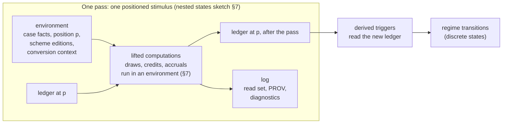
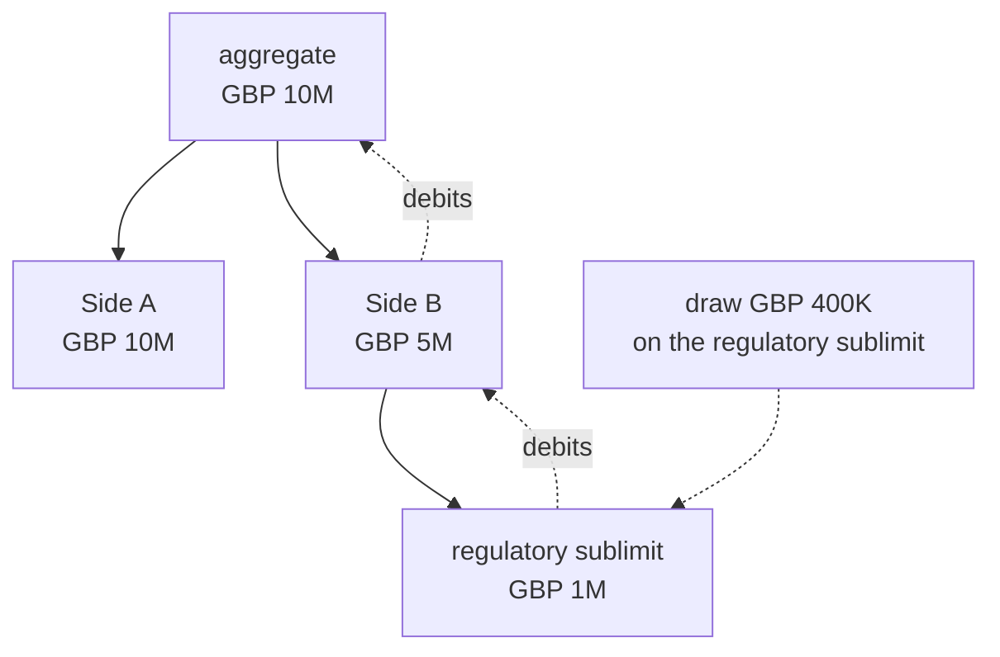
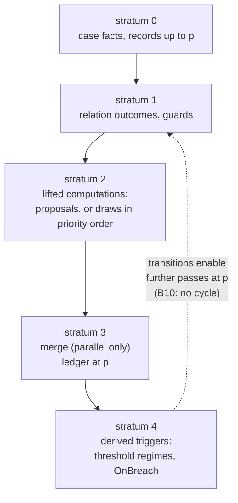

<!-- SPDX-License-Identifier: CC-BY-SA-4.0 -->

# Evaluation context: ledger, combinators and environments

**Status:** unplanned sketch, 2026-10-02. No plan owns it yet.
**Comes back in with:** the [computable contract substrate](../plans/computable-contract-substrate.md)
(`[ccs]`: C7b, C8a, C12, C13) and the
[applied insurance reference](../plans/applied-insurance-reference.md) epic (`[air]`: Phase 5).
§13 lists exactly when.
**Reads with:** [contract-amounts.md](contract-amounts.md) (the requirements catalogue this answers
in outline), [nested-states-and-history.md](nested-states-and-history.md) (the pass this runs in),
the CCS sketch §6.2 (stratification) and §7.9 (calculated values), and the note
[logic-encodings.md](../notes/logic-encodings.md) (the Datalog dialect of §9).

---

## 1. Premise

Contracts compute. A licence fee is charged per seat per year. A facility's drawings may not exceed
its commitment, and a commitment fee accrues on the undrawn part. An insurance policy pays loss up
to a sublimit that is part of a section limit that is part of an aggregate, in a stated order, and
recoveries restore what was paid. A binding authority's income limit sums premium over every policy
bound under it.

Each of these has three ingredients that today live in different places or nowhere:

- **pure computation over amounts**: the highest of several retentions, a 50% coinsurance split, a
  percentage of a base, a period of three months plus a week per year of service
- **a running record that computation changes**: what has been drawn, paid, earned or exhausted,
  and what a recovery gives back
- **a discipline for running both**: in what order, against which snapshot, with what happens when
  a value is missing, and with a record of what was read

The CCS plan has so far kept computation out of Behaviour, rightly. This sketch proposes where it
goes: an **evaluation context** that every runtime pass runs in, carrying the running record as
its state, into which side-effecting computation must be lifted. The name and the shape are
borrowed from functional programming, where this is a stack of monads. Behaviour's states stay
discrete and declared. The evaluation context is what flows through them.

The fixed set of axioms defined in this sketch would have known, documented semantics, that lattice software packages would provide a reference implementation of. Implementors/deployments could extend these axioms, however the semantics (and therefore runtime behaviour) of any extensions would be entirely dependent upon the extender to document and implement. Lattice is NOT attempting to build a general purpose programming language syntax in RDF.

## 2. What exists, and what is missing

| Piece | Where today | Gap |
|---|---|---|
| quantities, ranges, several currencies, percentages of a base | Quantification (ADR-A93, ADR-A95) | no operations that combine them |
| caps consumed over a period | Behaviour `AllowanceDefinition`, `AllowanceAccount`, `absorptionPolicy` | flat: no "part of and not in addition to", no credits, no scope wider than one subject |
| calculated durations and amounts | `ins:computedBy`, target undefined (CCS sketch §7.9) | no target |
| order of payment, conditional draws | `AllMatches` over internal transitions in sequence (C11a-Q3, decided 2026-10-02) | the computation each draw runs |
| Undetermined with a reason | each evaluator in its own way (Eligibility, the relation plans) | no shared rule for how it passes through a computation |
| provenance of a derived value | ADR-A92 derived artefacts, read sets | per evaluator |
| the requirements | contract-amounts §1 (58 constructs) and §3 (eight design questions) | the design |

## 3. The evaluation context

One context, four parts. Each part answers one question about a computation.

| Part | Functional name | Holds | Question it answers |
|---|---|---|---|
| **environment** | Reader | the case's facts, the stimulus position, the pinned scheme and vocabulary editions, the conversion context at a date | what may this computation read? |
| **ledger** | State | accounts and their balances (§5) | what does it change? |
| **log** | Writer | read sets, PROV records, diagnostics | what did it rely on, and why did it decide as it did? |
| **outcome** | three-valued failure | a value, or Undetermined with a reason, or Denied | can it be decided at all? |

**A pass is one run of the context.** It commits all its ledger changes with one read set, or
none of them. That is the unit nested-states §7 already defines: one macrostep per positioned
stimulus. The context gives it a value semantics: what went in, what came out, what was read.

**The context is carried, not owned.** Regimes are finite state machines whose states are declared.
A ledger holds quantities, which range over infinitely many values. Neither becomes the other. The
bridge is the threshold regime (CCS sketch §7.4): its states partition a ledger value with a
`qnt:RangeSet`, and its transitions are derived triggers that read the ledger after the pass.

## 4. Pure computations: combinators

A **combinator** is a named operation over values with no effect. It reads the environment and,
where the computation is lifted (§6), the ledger snapshot, and returns a value or Undetermined.
The set is closed, and every member is data, never code: contract-amounts §3.2 already asks for
"named, declared operations over accounts, not code".

| Combinator | Reads | Catalogue |
|---|---|---|
| `sum`, `count` over a declared population | values in one unit | A30 income, A32 exposure |
| `max`, `min` of several | values in one unit | A9 highest limit, A16 and A18 highest retention |
| `cap(v, limit)`, `floor(v, f)`, `excessOver(v, r)` | values in one unit | A15 retention, A20 above a retention |
| `percentOf(base, rate)` | a value and a rate | A35 commission, A42 leader fee, A46 discovery premium (via ADR-A93) |
| `split(v, shares)` | a value, a share set that sums to the whole | A20 coinsurance, A47 several shares |
| `proRata(v, part, whole)` | a value and two measures | A29 public cap shares, A45 return premium, A56 reinstatement pro rata |
| `convert(v, unit, at)` | a value, a conversion context at a date | A48 payment currency |
| `duration(base, per, count)` | quantities of time | CCS §7.9 "three months plus one week per year of service" |
| `basis(v, unit, window, grouping)` | a value with its counting unit, window and grouping rule | A51 to A55 (contract-amounts §1.7) |

**Rules every combinator keeps:**

- **Units never change silently.** Values in different units are not combined without `convert`,
  which needs a conversion context. Without one the result is Undetermined (ADR-A95).
- **Undetermined absorbs, except where the answer is already decided.** `max(5M, Undetermined)` is
  Undetermined. `cap(v, 0)` is 0 whatever `v` is. This is Strong Kleene lifted to values, as CEL
  does for expressions (logic-encodings §4).
- **Exact arithmetic.** Decimal, never binary floating point. A rounding rule is a combinator
  argument, never an engine default.

## 5. The ledger

The ledger generalises Behaviour's allowances. Its design answers contract-amounts §3.1 (nested
accounts) without a workaround.

**Accounts form a tree.** "Part of and not in addition to" is the parent edge. A draw on an account
debits that account and every ancestor, as one operation that succeeds or fails as a whole. A
sublimit inside a section limit inside an aggregate is three accounts on one path.

| Construct | Ledger form |
|---|---|
| A1, A2, A4, A5 nested sublimits | a path of accounts. A draw debits the path |
| A3 a lesser cap for one section under a shared limit, reduced by prior payments | the section is a child of the shared account with its own smaller balance. Its availability is `min(own, parent's)`, a combinator, not a second account |
| A6 an excess limit that drops down when the section and other insurance are exhausted | a second account, drawn only by a draw whose guard reads the section's balance as zero (sequential environment) |
| A8 a limit shared with another section for one purpose | one account with two parents is not a tree. Raised as EC-Q3 |
| A25 recoveries reinstate limits, less recovery costs | a credit: the inverse of a draw, along the same path, of `excessOver(recovery, costs)` |
| A30 to A33 aggregates over bound business | a ledger scoped to the authority, not to one instrument: every instrument bound under the power draws on it |
| A56 reinstatements | a credit, with its premium as a second lifted computation |

**Scope.** A ledger belongs to a persistent identity (an instrument, an authority, a programme), as
regime state does (ADR-A106 decision 5), so it outlives a new version of what it belongs to.

**Relation to allowances.** An `AllowanceDefinition` is a one-account ledger with a reset
recurrence. Whether allowances become ledger accounts or stay beside them is EC-Q2.

## 6. Lifting

A combinator has no effect. An **effect** in Behaviour changes something. Lifting joins them: an
effect definition names a computation, and applies its result to the ledger.

| Effect | Lifts | Into |
|---|---|---|
| draw | a computation of the amount | a debit on an account path |
| credit | a computation of the amount | a credit on an account path |
| accrue | a computation over a period (a fee per annum, interest) | a debit or credit at each recurrence position |
| record a derived value | a computation | a derived artefact (ADR-A92) with its read set, no ledger change |

Guards stay Eligibility profiles. A guard that reads the ledger reads it through the environment:
in the sequential environment, as the previous draw left it, and in the parallel one, as the pass
found it (§7).

Nothing outside a lifted effect changes the ledger. That is the discipline: a computation that has
not been lifted can be run anywhere, including at design time, because it cannot change anything.

## 7. Environments

How several lifted computations in one pass compose is a choice of **environment**. Each is a
different evaluation context, not a flag on one.

| Environment | Functional reading | Each guard reads | Ledger changes | Needs |
|---|---|---|---|---|
| **sequential** | State threaded through bind (`>>=`) | the ledger the previous computation left | applied one after another, in `bhv:priority` order | distinct priorities among the competitors |
| **parallel** | Reader over a snapshot, Writer of proposed changes, then a merge (applicative `<*>`) | the ledger as the pass found it | proposed together, then merged | a merge rule for proposals that touch one account |

**Sequential** is order of payment: "Side A first, then B and C only if limits remain" (A24). Each
draw's guard sees what the one before it left.

**Parallel** is shares: every participant's draw is computed from the same loss, and a merge decides
what happens when together they exceed an account. Merge rules, as data:

| Merge | Effect on an over-subscribed account | Catalogue |
|---|---|---|
| proportional | each proposal scaled by `proRata` to the balance | A29 public cap, pro rata below the statutory aggregate |
| in priority order | proposals applied by priority until the balance runs out | the existing `bhv:Sequential` absorption |
| refuse | no proposal applied, Undetermined with a reason | a strict cap with no allocation rule |

Behaviour's `bhv:absorptionPolicy` (Sequential, Proportional) is the first two merge rules, on one
account. The parallel environment generalises it to a pass.

**Decided for C11a (2026-10-02):** `AllMatches` over internal transitions ships with the sequential
environment only. Parallel and its merge rules arrive with this design, without changing C11a.

**Not an environment:** taking the highest of several retentions (A16, A18) is `max`, a combinator.
An environment decides how effects compose. A combinator decides a value.

## 8. Stratification and time

Two layers of order, both already in LATTICE, fit together without a new idea.

**Within a position: strata.** Relations depend on each other only through explicit edges (CCS
§6.2, I6, I12), so evaluation runs stratum by stratum. Lifted computations add one kind of edge: a
guard or a computation that reads an account depends on every effect that writes it earlier in the
pass. In the sequential environment that is the priority order. In the parallel one, the merge is a
stratum of its own, after every proposal and before any derived trigger reads the ledger.

**Across positions: time.** Positions come from the stimulus log (B3: the engine never reads a
clock), so the ledger at position p+1 is a function of the ledger at p and the pass at p+1. This is
the Dedalus pattern the logic-encodings note names (§3.5): Datalog with time as a totally ordered
attribute, and state change as a rule over successor positions. In the sequential environment the
priority order is a micro-position inside p: (p, 1), (p, 2) and so on.

**Design time is the environment alone.** B8 and DP6 say design-time comparisons never read
runtime records. In this model that becomes a property of the computation: one that reads only the
environment can run at design time, and one that reads or changes the ledger cannot. A per-state
comparison (CCS §6.3) is a computation with a state fixed in its environment. The rule is enforced
by what a computation is allowed to read, not by a separate check.

## 9. A stratified Datalog backend

The configuration this sketch describes (declared states and transitions, closed combinators,
lifted effects, declared environments, explicit strata, positions as time) is a program in the
dialect the logic-encodings note recommends: **stratified Datalog with dual predicates for the
three values, negation over evidence only under a closure licence, stratified aggregation, and
positions as time** (§3.7 of the note). A configuration written once could then be evaluated by
any engine for that dialect.

| Construct | Datalog form |
|---|---|
| environment at p | EDB facts: case facts, records with positions up to p, scheme closure (`below/2`) |
| Permitted, Denied, Undetermined | the dual predicates `permitted/2`, `denied/2`, Undetermined as neither (note §3.2) |
| a combinator | a rule with arithmetic in its body. `max`, `sum`, `count` as stratified aggregates |
| a regime transition at p | a rule deriving `occupies(S, State, p')` from `occupies(S, From, p)`, a matching stimulus and a permitted guard |
| the ledger at p | `balance(Account, V, p)`, derived from the balance at the previous position and the pass |
| a draw on a path | `debit(A, X, p)` for the account and each ancestor (a recursive closure over the account tree, which is finite) |
| sequential environment | micro-positions `(p, i)` by priority: each draw's guard reads `balance` at `(p, i−1)` |
| parallel environment | proposals at p, then a merge rule aggregating them per account in a later stratum |
| the log | provenance: engines that explain derivations give it directly. Otherwise derivation facts recorded with their premises |
| closure licences (ADR-A105) | the admissibility check for `not p(...)` over evidence (note §3.2) |
| B10 (no cycle of derived triggers) | the stratification condition itself |

**Why this matters.**

- **One model, several engines.** The SPARQL reference plans (C13) stay the conformance oracle. A
  Datalog engine evaluates the same configuration, compared under the parity suite (ADR-A28), as the
  compiled Eligibility backends are today.
- **Incremental evaluation.** The stimulus log only grows. An engine that maintains derived facts
  incrementally recomputes only what a new position affects, which is exactly the cost profile of a
  contract over its life: many positions, each touching little.
- **Explanations.** A proof tree over the dual predicates is the golden thread (from a decision back
  to the wording version and scheme edition that caused it), produced by the engine, not
  reconstructed after it.
- **Scale.** Aggregates over every policy bound under an authority (A30 to A33) are where SPARQL
  plans strain and Datalog engines are built to perform.

**Engines.** RDFox is the natural first candidate: RDF-native, Datalog with stratified negation and
aggregation, incremental maintenance, explanations, and the transaction support the platform's
optimistic concurrency notes already list. Open-source Datalog engines (Nemo among those that read
RDF, Soufflé among those that do not) are the comparison set. No choice is made here.

**Constraints to respect.**

- **ADR-A83 isolates every rules engine to the test-only harness.** A Datalog engine behind
  LATTICE at runtime needs a decision of its own, beside A83, through the platform's SPI seam
  (ADR-A71), which also governs licences. RDFox is commercial. EC-Q6.
- **Arithmetic in recursive rules can invent values without end.** Here recursion runs only over
  the account tree and over positions, both finite (positions come from the log), and arithmetic
  stays out of any other recursion. A configuration that breaks this is refused at compile time.
- **Datalog has one model.** Competing interpretations of a clause (logic-encodings G5) stay
  outside it, as the note says.
- **OWL entailment is not read in rule bodies.** Design-time classes stay in the OWL backend
  (ADR-A90). The Datalog program reads asserted and derived facts.

## 10. What else the context settles

| Challenge | How |
|---|---|
| calculated values (CCS §7.9) | `ins:computedBy` names a combinator expression. Its target is defined |
| Undetermined through arithmetic | the outcome part of the context, one rule for every evaluator |
| atomic passes | one run of the context, one commit, one read set |
| provenance per pass | the log part, a derived artefact per pass (ADR-A92, B1) |
| B8 and DP6 | design-time computations read the environment only (§8) |
| currency at a date (A48) | `convert` reads the conversion context from the environment |
| aggregates across instruments (A30 to A33) | a ledger scoped to the authority |
| reinstatement (A25, A56) | credits along a path |
| conditional and ordered draws | lifted computations in the sequential environment |
| shares and pro rata (A29, A47) | the parallel environment with a proportional merge |
| bases (contract-amounts §1.7) | `basis` as a combinator over a counting unit, a window and a grouping rule |

## 11. What C11a and C12 must leave room for

Decided or to be kept so nothing here is foreclosed:

1. **A pass is the unit of commit** (nested states §7). C12 commits a pass whole.
2. **`AllMatches` composes the effects of every enabled internal transition** into one computation,
   run in the sequential environment, in priority order. Distinct priorities among the competitors.
3. **Effects name what they change**, so a later design can type them as lifted computations
   without changing the transitions that carry them.
4. **Guards read through the evaluation's view** of the ledger, never around it, so the parallel
   environment can later give them the snapshot.

## 12. Questions

| # | Question | First thoughts |
|---|---|---|
| EC-Q1 | Where combinators live | pure operations over quantities fit Quantification, which owns quantities, derived spaces and conversion. Instrument would name them, never define them |
| EC-Q2 | Ledger and allowances | an allowance is a one-account ledger with a reset. Generalising allowances into ledger accounts avoids two mechanisms for one idea, at the cost of a breaking change to Behaviour |
| EC-Q3 | Shared limits that are not a tree (A8) | an account with two parents, or a single account with two draw purposes. The second keeps the tree |
| EC-Q4 | How a combinator expression is written | an RDF expression IR like Eligibility's compiled IR in `tools/mork_compilers`, or the JSON abstract syntax the logic-encodings note proposes (§1, §4), with RDF as its projection |
| EC-Q5 | How fine the log is | one derived artefact per pass, or per lifted computation. Per pass is cheaper. Per computation explains more |
| EC-Q6 | A Datalog backend at runtime | an ADR beside A83 and under A71, choosing whether the platform may run a rules engine in production, and on what licence terms |
| EC-Q7 | Whether this is a layer | the context is evaluation semantics, held by the evaluators. What it needs in the ontology (combinators, ledger, environments, merge rules) may be small enough to sit in Quantification and Behaviour, or may justify a substrate layer of its own |

## 13. When it comes back in

| Unit | Slice or phase | What it needs from here |
|---|---|---|
| `[ccs]` | C11a phase 2 | nothing new: §11 is already decided there |
| `[ccs]` | C7b | the target of `ins:computedBy` (§4, §10). If this is not designed by then, C7b keeps `ins:computedBy` with an undefined target and Undetermined evaluation, as CCS §7.9 says |
| `[ccs]` | C8a | term and qualifier templates wait on bases (contract-amounts §1.7, `basis` here) |
| `[ccs]` | C12 | the pass as a run of the context (§3, §11). The sequential environment |
| `[ccs]` | C13 | relation plans whose scopes read computed values. The Datalog form of §9 as a candidate backend beside the SPARQL reference |
| `[air]` | Phase 5 | A-101 term parameters: limits, retentions, aggregates, reinstatements and bases are ledger accounts, combinators and environments. Phase 5 should not start its contract module without this designed |
| contract-amounts | its design | §3 items 1 to 8 answered in outline here, to be tested against all 58 constructs |
