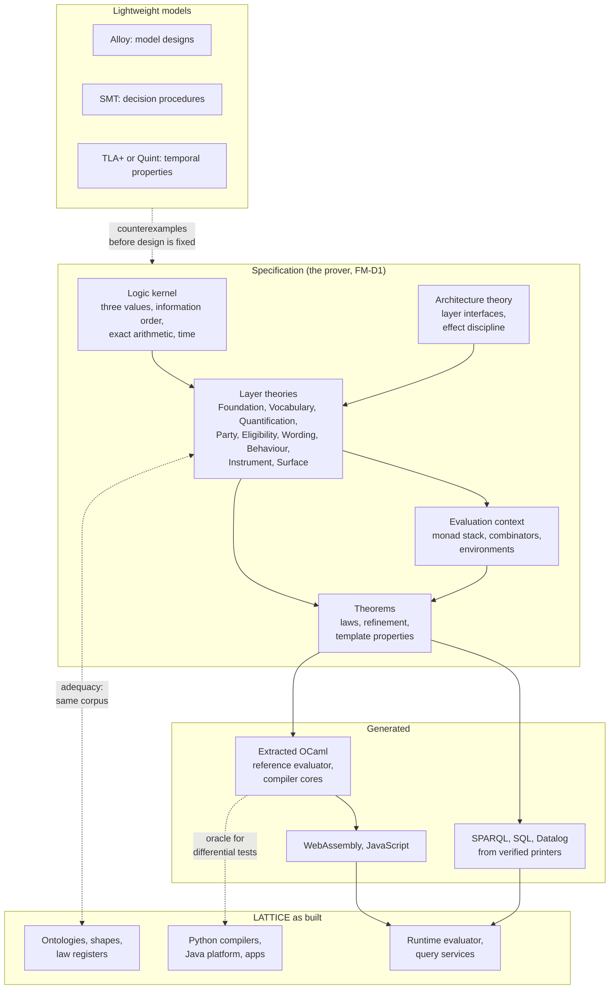
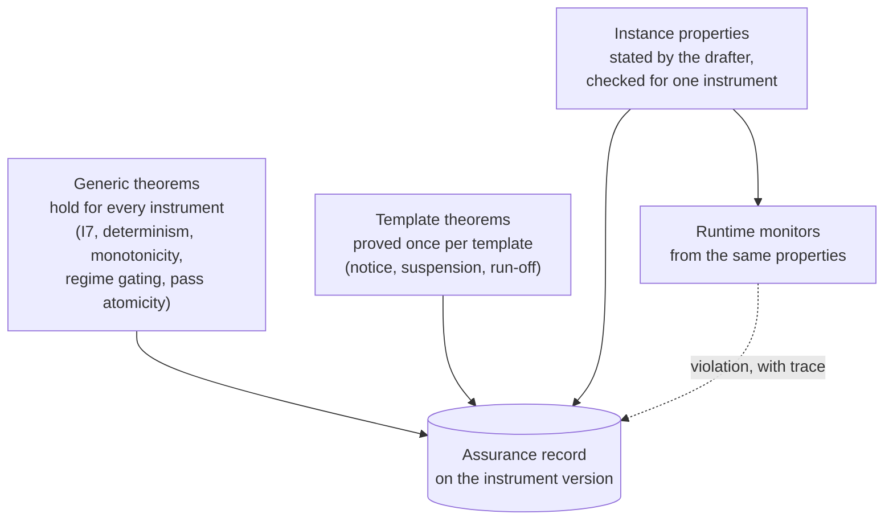
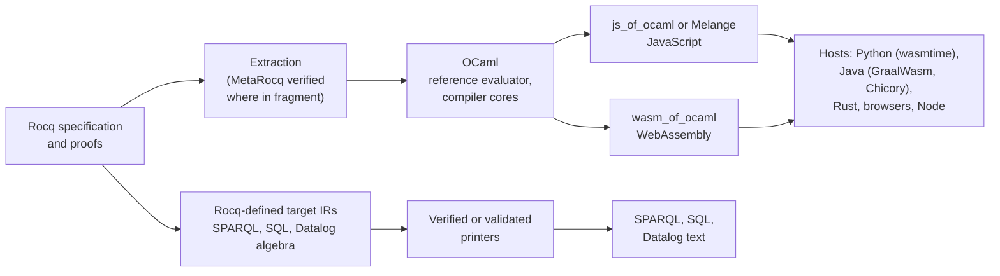
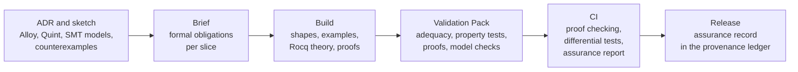

<!-- SPDX-License-Identifier: CC-BY-SA-4.0 -->

# Formal methods in LATTICE: specification, verification and generated code

**Unit:** [formal-methods](../plans/formal-methods.md) (epic). **Status:** sketch, 2026-10-06. Nothing here
is ratified. A new directory, a new vocabulary and any change to the toolchain each need an ADR.
**Prover:** open (FM-D1). This sketch's examples use Rocq. Phase 0 of the plan compares Rocq and
Isabelle/HOL before anything else is built, and the smaller sketches are written prover-neutral.
**Smaller sketches:** [adequacy and architecture](formal-adequacy-and-architecture.md),
[assurance records](assurance-records.md), [instrument assurance](instrument-assurance.md),
[reference evaluator](reference-evaluator.md), [toolchain workers](formal-toolchain-workers.md).
**Reads with:** the [evaluation context sketch](evaluation-context.md) (the monadic evaluator),
the [nested states sketch](nested-states-and-history.md) (Behaviour's reference semantics), the
[logic encodings note](../notes/logic-encodings.md) and the
[logic encoding research](logic-encoding-research.md) (Datalog as reference semantics), the
[assembly interface sketch](wording-assembly-interface.md), and the engine notes in
[`notes/rdf-engine/`](../notes/rdf-engine/), whose formal methods sections this paper generalises:
[compiled persistence profiles](../notes/rdf-engine/compiled-persistence-profiles.md) §3 and §14,
and the [lock-free store](../notes/rdf-engine/lock-free-rdf-store.md) Appendix A.

---

## Contents

1. [Premise and goals](#1-premise-and-goals)
2. [What correct means in LATTICE](#2-what-correct-means-in-lattice)
3. [What LATTICE already has, and what it lacks](#3-what-lattice-already-has-and-what-it-lacks)
4. [Errors a formal model would have found earlier](#4-errors-a-formal-model-would-have-found-earlier)
5. [The techniques, by cost](#5-the-techniques-by-cost)
6. [The shape of the formal stack](#6-the-shape-of-the-formal-stack)
7. [Plugging a specification into the architecture](#7-plugging-a-specification-into-the-architecture)
8. [Layer by layer](#8-layer-by-layer)
9. [The monadic evaluator, specified and extracted](#9-the-monadic-evaluator-specified-and-extracted)
10. [Category theory as a design language](#10-category-theory-as-a-design-language)
11. [Guaranteeing the behaviour of instruments](#11-guaranteeing-the-behaviour-of-instruments)
12. [From specification to code](#12-from-specification-to-code)
13. [The compilation toolchains](#13-the-compilation-toolchains)
14. [The development lifecycle](#14-the-development-lifecycle)
15. [Tools](#15-tools)
16. [Where it lives](#16-where-it-lives)
17. [A phased route](#17-a-phased-route)
18. [Risks](#18-risks)
19. [Decisions for the human](#19-decisions-for-the-human)
20. [Open questions](#20-open-questions)

---

## 1. Premise and goals

LATTICE states its semantics in prose, in OWL axioms, in SHACL shapes and in law registers, and
checks them against examples. That has served the layers well, but it has a limit. A shape checks
that data satisfies a law. It says nothing about whether an algorithm always produces data that
satisfies it, whether two backends always agree, or whether an instrument always behaves as its
drafters intend. Each of those is a claim about every input, and examples cannot establish it.

The engine notes in `notes/rdf-engine/` already chose formal methods for one target, a proved
planner for a custom engine, with Rocq extracted to OCaml and a separately checked emitter to Rust.
This paper widens the scope to the whole of LATTICE: its models, its algorithms, its compilers, its
development lifecycle, and the instruments adopters build on it.

| # | Goal | Priority |
|---|---|---|
| G1 | **Validate the correctness of every model and algorithm LATTICE specifies**, before and after it is implemented | primary |
| G2 | **Guarantee the behaviour of instruments** to adopters: properties that hold for every instrument, for every use of a template, and for one instrument as configured | primary, built on G1 |
| G3 | **Check an algorithm against LATTICE's architecture**: its layer dependencies, its design-time and runtime separation, its determinism | primary, built on G1 |
| G4 | **Generate code reliably** from specifications, through OCaml and on to the languages and execution surfaces LATTICE targets | secondary |
| G5 | **Keep the cost proportional**: formal effort where it pays, cheap techniques everywhere else, nothing that blocks a slice that does not need it | constraint |

## 2. What correct means in LATTICE

Three kinds of artefact need three kinds of correctness.

| Artefact | Examples | Correct means |
|---|---|---|
| **Models** | each layer's T-Box, vocabularies, shapes and laws. An applied module. An adopter's configuration | consistent (it has a model), adequate (it admits exactly the intended data), its laws jointly satisfiable and independent of accidents of encoding |
| **Algorithms** | binding resolution, three-valued evaluation, match strategies, assembly, regime macrosteps, evaluation passes, projections, compilers, persistence planning, minting | total and deterministic where stated, preserving every law of its inputs in its outputs, agreeing with every other realisation of the same semantics |
| **Instruments** | one contract as configured: its relations, triggers, regimes, amounts, templates | behaving as its drafters intend over every sequence of events: invariants hold, deadlines close, no relation arises in a state that gates it, no breach rests on what was never established |

The properties fall into families that recur across the layers:

| Family | Statement | Where it recurs |
|---|---|---|
| Consistency | the axioms and laws have a model | every T-Box, every applied module |
| Adequacy | the formal model and the shapes accept the same data | every layer with a literate README |
| Determinism | equal inputs give equal outputs | binding resolution, assembly (WA5), passes (B3), compilers (ADR-A19), minting |
| Law preservation | an algorithm's output satisfies the laws its specification promises | assembly (W3 to W6), macrosteps (B9 to B11), projections (X1 to X6) |
| Refinement and parity | an implementation, or a compiled artefact, means what the specification means | compilers, backends (ADR-A28), the InsurML adapters, persistence plans |
| Monotonicity in information | more evidence never reverses a decided outcome | Eligibility, Quantification comparisons, Instrument breach (I7) |
| Stratification and termination | evaluation is well founded and ends | Instrument (I6, I12), Behaviour (B10), Datalog backends |
| Temporal properties | something always holds, or eventually happens, over a run | regimes, windows, ledgers, every instrument |
| Conservativity | a derived view adds no meaning | Surface (X1), Persistence, the lift from InsurML |

## 3. What LATTICE already has, and what it lacks

**Formal in all but name.**

| Exists | What it gives | Limit |
|---|---|---|
| OWL 2 DL axioms, checked by a reasoner in the test-only harness (ADR-A83) | consistency of each T-Box and its examples | checks the ontologies, not the algorithms over them |
| SHACL and SHACL-SPARQL law shapes per layer | each law checked on data | a check per graph, not a guarantee for every graph an algorithm can produce |
| Positive and negative examples, mutation and adversarial probes in Validation Packs | evidence that a shape rejects what it should | as strong as the examples chosen |
| The parity gate (ADR-A28) | backends agree on fixtures | agreement with each other, not with a reference, and only on fixtures |
| Design-time OWL classes (ADR-A90) and satisfiability (CCS C13a) | widening, narrowing and joint satisfiability of criteria | the reasoner's answer is trusted. No proof the encoding is faithful |
| Strong Kleene semantics, stratification, determinism (B3), design time never reading runtime (B8, DP6) | precise statements in prose | not mechanised, so a change can break one silently |
| The Datalog reference semantics recommended in the logic encodings note | a candidate definitional semantics | not written as a checked artefact |
| SPC's metatheory claims (subject reduction, deadlock freedom, session fidelity) | stated properties of protocols | asserted, not mechanised |
| Literate extraction and drift checks | README and source agree | the prose is not checked against the semantics |

**What is missing.**

| Gap | Effect |
|---|---|
| no executable reference semantics for any layer | backends can only be compared with each other, and a shared misreading passes the parity gate |
| no proofs about algorithms | an algorithm can break a law for inputs no example covers |
| no checking of temporal properties | an instrument's behaviour over time is shown by traces, never established |
| no link from a law to the evidence that it holds | nobody can say which laws are proved, which are model-checked and which are only shape-checked |
| no architectural rules checked on algorithms | B7 checks imports, but nothing checks that a design-time computation cannot read the ledger |
| no generated code | every backend is written by hand, and every one is a new chance to misread the semantics |

## 4. Errors a formal model would have found earlier

Each of these was found during CCS or the InsurML alignment by building, testing or analysing.
Each is the kind of error a small formal model finds before any code exists.

| Found | What happened | Technique that finds it first |
|---|---|---|
| TD-17 (CCS C7a) | functional properties plus `owl:hasValue` axioms let a reasoner infer that two Behaviour policies are the same individual when a value is mis-stated, so the error surfaces far from its cause | a model finder (Alloy, or an OWL reasoner run over generated instances) asked for a model in which two named policies are equal |
| HQ-4 (CCS C7b) | two unscoped scheme bindings for one contract conflict, so a deployment cannot bind context roles from several sources | a specification of binding resolution with the property "every role a layer needs resolves", checked over generated deployments |
| The union scheme (typing sketch §6.1) | the analysis proposed putting InsurML concepts in a second scheme, which InsurML's own shape forbids | the two standards' constraints conjoined in one model, checked for satisfiability |
| W1 against reuse (bridge sketch §8) | one parent per element blocks InsurML's reuse of one component in many contracts | a model of both assembly semantics, with the property "every InsurML manifest has a Wording image" |
| TD-11 (Surface shapes) | Surface's shapes never ran under a SHACL engine | an adequacy check that runs every law's formal statement and its shape over the same corpus |

None of these was costly once found. Each was found late, by someone looking in the right place.

## 5. The techniques, by cost

The ladder of the lock-free store note's Appendix A, applied to LATTICE as a whole. Each rung is
used where it pays, and the cheap rungs apply everywhere.

| Rung | Technique | Finds | Cost | LATTICE targets |
|---|---|---|---|---|
| T0 | **Executable reference semantics**: a small definitional interpreter per layer | disagreement between backends and the meaning | low to medium | the oracle for parity, for compilers, for the InsurML adapters |
| T1 | **Property-based and metamorphic tests**, with generators derived from the shapes | law breaks, order dependence | low | every algorithm, every compiler, every lift |
| T2 | **Model finding** (Alloy 6) | inconsistent or underconstrained models, with counterexamples | low | new T-Box designs, law sets, cross-standard constraints |
| T3 | **SMT solving** (Z3, cvc5) | satisfiability, overlap, exhaustiveness, widening, with witnesses | low to medium | Eligibility conditions, slot exclusivity (C13a), clash detection (NRS N3), range sets |
| T4 | **Model checking** (TLA+ with TLC or Apalache, Quint, nuXmv, UPPAAL for timed models) | temporal property violations, with traces | medium | regimes, windows, ledgers, instruments, platform protocols |
| T5 | **Mechanised semantics and proof** (Rocq) | errors in specifications and algorithms, for all inputs | high | the logic kernel, binding resolution, Eligibility, the evaluation context, Behaviour macrosteps, compilers |
| T6 | **Verified code generation** (extraction, verified printers) | translation errors | high | the reference evaluator, compilers to query surfaces |
| T7 | **Runtime verification**: monitors generated from properties | violations in production, as they happen | low once T4 properties exist | live instruments |

## 6. The shape of the formal stack



Three principles hold the stack together.

| # | Principle |
|---|---|
| FP1 | **The specification is a reference, never a second source of truth.** The ontology, shapes and laws stay normative. A formal theory states what they mean, and an adequacy check keeps the two in step (§7.3) |
| FP2 | **Closed, validated configurations are the formal domain.** A Rocq datatype is closed-world. OWL is open-world. The formal model covers configurations after SHACL validation and compilation, which is where LATTICE already compiles rather than interprets (DP5). Open-world reasoning stays with the OWL tooling |
| FP3 | **Every claim of assurance names its method.** A law is proved, model-checked to a bound, solver-checked, property-tested or shape-checked, and the record says which (§7.4) |

## 7. Plugging a specification into the architecture

The request is for a mechanism through which an algorithm can be formally defined and checked
against LATTICE's architecture with little ceremony. Four pieces make it.

### 7.1 Layer interfaces as module types

Each layer becomes a Rocq module type: its datatypes (from its classes and closed vocabularies),
its operations (the algorithms its README specifies) and its laws (as propositions). A layer's
module may depend only on the module types of the layers it imports, so the Rocq dependency graph
must equal the ontology import graph. A check compares the two, as the import guard (B7) compares
imports with use today.

An algorithm is then a Rocq functor over the interfaces it reads:

```coq
(* Sketch. An assembler reads Wording and Eligibility, and nothing above them. *)
Module Type WORDING.  (* forms, elements, inclusion modes, the assembly record, laws W1 to W8 *) End WORDING.
Module Type ELIGIBILITY. (* conditions, profiles, decide : Profile -> Candidate -> K3 *) End ELIGIBILITY.

Module Assembler (W : WORDING) (E : ELIGIBILITY).
  (* assemble : Form -> Settings -> Model -> Outcome Record *)
  (* Theorem assemble_satisfies_W3_W6 : ... *)
End Assembler.
```

Reading a layer the functor does not take is a type error. That is G3 for dependencies, at no cost
beyond writing the functor's signature.

### 7.2 Effects as types

LATTICE's architectural rules about time and state become typing rules over the evaluation
context's monad stack (§9):

| Rule | Typing |
|---|---|
| B8, DP6: design time never reads runtime records | a design-time computation has type `Reader Env A`. It cannot mention the ledger or the log |
| only a lifted effect changes the ledger (evaluation context §6) | only `lift : Computation A -> Effect` produces `State Ledger` |
| B3: the engine never reads a clock | time enters only as the position in `Env` |
| WA4: assembly reads the form, settings and choices only | the assembler's monad carries no runtime component |
| units never change silently | quantities are indexed by value space and unit, so adding two in different units does not typecheck without `convert` |

### 7.3 Adequacy against the ontology

The formal datatypes and the ontology must describe the same things. Two checks keep them aligned.

| Direction | Check |
|---|---|
| ontology to specification | a generator reads each layer's node shapes and closed vocabularies and emits, or checks, the Rocq datatypes: a closed set of named individuals becomes an inductive type, a functional property a field, any other property a finite set |
| specification to ontology | an extracted decoder turns every example in the layer's README and Validation Packs into Rocq terms. Every valid example must decode and satisfy the formal laws. Every invalid example must fail the same law its shape names |

The second check reuses a corpus LATTICE already maintains: every slice's positive and negative
fixtures. A law whose shape and formal statement disagree on any fixture is a defect in one of
them, reported by name.

### 7.4 Laws linked to their evidence

Each layer's laws are already named individuals (`elg:L1` to `elg:L16`, and the registers W1 to
W8, B1 to B11, I1 to I18, X1 to X6). A small assurance vocabulary links each law to its formal
statement and to the evidence that it holds:

```turtle
# Hypothetical: the asr: vocabulary does not exist. Its home is FM-D3.
elg:L15 asr:statedAs "Lattice.Eligibility.SetReadings.l15" ;
    asr:evidence [ a asr:Proof ; asr:tool "rocq-9.0" ; asr:artefact "theories/Eligibility/SetReadings.v" ] ,
                 [ a asr:ShapeCheck ; asr:shape elg:L15Shape ] .

ins:I7 asr:statedAs "Lattice.Instrument.Breach.no_breach_from_undetermined" ;
    asr:evidence [ a asr:ModelCheck ; asr:tool "apalache" ; asr:bound 12 ] .
```

A report over these links answers which laws are proved, which are checked to a bound and which
only by shapes. The report is a derived artefact of each release (ADR-A92), and a release whose
report regresses fails the gate.

## 8. Layer by layer

### 8.1 The logic kernel

| Specify | Prove |
|---|---|
| `k3`, with the values Permitted, Denied and Undetermined, strong Kleene connectives, the information order (Undetermined below both decided values) | the connectives are monotone in the information order. De Morgan holds. Negation swaps decided values and fixes Undetermined (L16) |
| exact decimal arithmetic with explicit rounding | the operations the combinators need are total and exact |
| positions as a total order from the stimulus log | no operation reads anything but positions |

Monotonicity is the property adopters care about most: **adding evidence never reverses a decided
outcome**. Every later layer inherits it, so it is proved once here.

```coq
Inductive k3 := Permitted | Denied | Undetermined.

Definition le_info (a b : k3) : Prop := a = Undetermined \/ a = b.

Definition and3 (a b : k3) : k3 :=
  match a, b with
  | Denied, _ | _, Denied => Denied
  | Permitted, Permitted => Permitted
  | _, _ => Undetermined
  end.

Theorem and3_monotone : forall a a' b b',
  le_info a a' -> le_info b b' -> le_info (and3 a b) (and3 a' b').
(* Proof by case analysis on a and b. Omitted in this sketch. *)
```

### 8.2 Foundation and Vocabulary

| Specify | Prove |
|---|---|
| versions, identities, supersession, keys and key schemes | supersession is acyclic and functional. A key value names at most one identity in a scheme at a time |
| scheme contracts, bindings, scopes, validity periods, precedence (ADR-A85) | resolution is a function of context and time. A conflict is reported exactly when two applicable bindings are maximal. A resolved record never changes when later bindings are added (no retroactive re-resolution) |
| scheme composition, if IMA-D4a goes ahead | the composed membership and hierarchy are the unions, and resolution stays a function |

Binding resolution is small, central and already precisely stated, which makes it the first Rocq
target. HQ-4 and IMA-D4a can be designed in the specification before Vocabulary changes.

### 8.3 Quantification

| Specify | Prove |
|---|---|
| value spaces with order and density kinds, units, conversions with contexts | conversion composes and round-trips where the space declares it, and never runs without a context (ADR-A95) |
| bounds, ranges and range sets | every range set has one normal form. Containment, overlap and union decided on normal forms agree with the set semantics |
| unresolved and context values (ADR-A115) | a comparison with an unresolved value is Undetermined, and resolving it gives a decided value consistent with the Undetermined it replaced (monotonicity, from §8.1) |
| recurrences and bins | anchor-preserving bins partition their span, with no gap or overlap |

Range sets are where an SMT encoding is cheapest (linear arithmetic over rationals). An SMT check
and the Rocq normal form can each serve as the other's oracle.

### 8.4 Eligibility

| Specify | Prove |
|---|---|
| a denotation of conditions and profiles into `K3`: exact, set membership, interval containment, hierarchical match with exclusions, flat schemes (ADR-A100), set readings (ADR-A103), negation, AllRequired and AnySufficient, evidence bindings as paths | L1 to L16. A decision is monotone in evidence. Hierarchical match over a flat scheme is Undetermined exactly where ADR-A100 says |
| the concept IR (ADR-A89) and each backend's target fragment | **compiler correctness**: for each backend, the compiled artefact evaluated under the target's semantics equals the denotation. SPARQL first, over a formal semantics of the algebra fragment the compiler emits |
| design-time questions: satisfiability, exhaustiveness, widening | the SMT encoding is faithful: a model of the encoding is a candidate the denotation decides as stated, and the reverse |

Compiler correctness for SPARQL turns the parity gate from "backends agree on fixtures" into "the
reference backend agrees with the meaning on every input", and leaves fixtures to the other
backends until each has its own proof.

### 8.5 Wording and assembly

| Specify | Prove |
|---|---|
| forms, elements, text parts, inclusion modes, slots, transclusion, inline parts, laws W1 to W8 | the laws are jointly satisfiable, and transclusion introduces no cycle (W8) |
| assembly as a function of form, settings, choices and model (assembly sketch §8) | WA1 to WA7: every successful assembly satisfies W3 to W6, assembly is deterministic, a missing capability refuses rather than drops |
| a lowering, such as an interval condition carried as a derived governing variable | the lowered assembly includes exactly what the native one does |
| InsurML's processing model, from its normative steps | **parity for the shared fragment**: on forms that use only constructs both models read natively, the InsurML model and the baseline produce the same record |

The last row turns the InsurML parity suite of the bridge sketch §7 from a test into a theorem for
the shared fragment, with tests for the rest.

### 8.6 Behaviour

| Specify | Prove |
|---|---|
| state spaces, transitions, guards, effects, nested states, history, concurrent regions, as a labelled transition system over configurations | a macrostep preserves B9, B10 and B11. B10 makes every macrostep terminate. With distinct priorities the macrostep is deterministic |
| occasions and records, with evidence (B6) | every occupancy a macrostep creates names its execution and stimulus |
| history | entering a history state restores the configuration last exited, shallow or deep as declared (B5) |

The nested states sketch already gives a reference semantics in prose (§2 there). Writing it as an
inductive step relation is direct, and its worked cases (§9 there) become the first adequacy
corpus for Behaviour.

### 8.7 Instrument

| Specify | Prove |
|---|---|
| legal relations and their correlatives (obligation, prohibition, permission, exclusion, power), arising on legal triggers, due ranges and windows, regimes gating by state, survival, termination | I3: an occasion persists until performed, breached or ended. I9: every time is anchored. I13: only bound relations are evaluated |
| breach for achievement and maintenance obligations, exceptions established only when evidenced | **I7**: an Undetermined fulfilment never yields a breach, and a breach never rests on an unestablished exception |
| stratification over trigger and state-reading edges (I6, I12) | evaluation is well founded. Contrary-to-duty chains are stratified by breach records, so Chisholm's paradox has no model in which it arises |
| templates (CCS C8a) | each template's properties, once, for every instrument that uses it (§11.2) |

### 8.8 Surface, MORK and Persistence

| Target | Specify | Prove |
|---|---|---|
| Surface promotion and index (X1 to X6) | a promotion as a view of its source | conservativity: the view adds no fact the source does not entail (X1). Index faithfulness (X2) |
| Surface projection and stacking (ADR-A20, ADR-A21) | composition of contracts | stacked projections compose associatively and conservativity survives composition (§10) |
| regeneration (ADR-A27) | a change to a source, and its minimal regeneration | regenerating after a change equals applying the change's image to the old output (§10) |
| MORK intents | the refinement order on intent nodes | the intent graph is a join-semilattice. The co-occurrence axioms reject exactly the incomplete mappings |
| MCN | encoder and decoder | decoding is lossless: decode after encode is the identity up to graph isomorphism |
| Persistence | profiles and their compiled plans | the refinement argument of the persistence note §14.1, unchanged |

### 8.9 Platform protocols

The outbox, idempotent delivery (ADR-A36), acknowledgement (ADR-A37), optimistic concurrency on
revision ledgers (ADR-A33) and the identity head pointer of the identity note are protocols.
TLA+ or Quint models check that a message is delivered at least once and applied at most once, that
a lost compare-and-set never loses a write, and that replay after failure reaches the same state.
The engine note's Appendix A covers the store itself.

## 9. The monadic evaluator, specified and extracted

The evaluation context sketch describes the evaluator as a stack of monads: an environment it
reads, a ledger it changes, a log it writes, and a three-valued outcome. That description is
already a specification. Written in Rocq, it can be proved and then extracted as the reference
implementation of CCS C12.

### 9.1 The stack

```coq
(* Sketch. Outcome carries a value, or Undetermined with a reason, or Denied. *)
Inductive outcome (A : Type) := Value (a : A) | Undet (r : reason) | Deny (r : reason).

(* Reader Env, State Ledger, Writer Log, over Outcome. *)
Definition Eval (A : Type) : Type :=
  env -> ledger -> outcome (A * ledger) * log.

Definition ret {A} (a : A) : Eval A := fun _ l => (Value _ (a, l), nil).

Definition bind {A B} (m : Eval A) (k : A -> Eval B) : Eval B :=
  fun e l =>
    match m e l with
    | (Value _ (a, l'), w) => let '(r, w') := k a e l' in (r, w ++ w')
    | (Undet _ r, w) => (Undet _ r, w)
    | (Deny _ r, w) => (Deny _ r, w)
    end.
```

| Prove | Why |
|---|---|
| the monad laws for `ret` and `bind` | refactoring and compiling evaluator code is safe |
| a pass commits all its ledger changes or none | evaluation context §3: a pass is one run of the context |
| a computation typed `Reader Env A` cannot change the ledger | B8, by construction (§7.2) |
| `Undetermined` absorbs except where the result is already decided | the combinator rule, Strong Kleene lifted to values |
| sequential and parallel environments agree when no two proposals touch one account | the choice of environment matters only under contention |
| proportional merge never over-draws, and its result does not depend on the order of proposals | the merge rules are safe to run in any order |
| no combinator mixes units without `convert` | by typing (§7.2) |
| the ledger at position p+1 is a function of the ledger at p and the pass at p+1 | determinism across positions, the Dedalus reading (evaluation context §8) |

### 9.2 Combinators as a closed algebra

The combinators (`sum`, `max`, `cap`, `percentOf`, `split`, `proRata`, `convert`, `duration`,
`basis`) are a closed set, held as data. In Rocq they are an inductive syntax with a denotation,
which gives two things at once: each combinator's laws (for example that `split` conserves the
whole), and a compiler from combinator expressions to SPARQL, SQL or Datalog whose correctness is
proved against the same denotation (§13).

### 9.3 Behaviour and the evaluator together

A pass runs Behaviour's macrostep (§8.6) inside the evaluation context: guards through Eligibility,
effects lifted onto the ledger, derived triggers read after the merge, all in the strata of the
evaluation context §8. One theorem then joins the layers: **every pass preserves the Behaviour laws
and the ledger's invariants, and its outcome is the denotation of the instrument's relations at
that position**. That theorem is what "the evaluator is correct" means.

### 9.4 What extraction gives C12

| Option | How | Fits |
|---|---|---|
| reference only | the extracted evaluator runs in tests as the oracle for the SPARQL relation plans (C13) and any Datalog backend | first, and always |
| toolchain service | the extracted evaluator runs as a worker job (§13.1) for bounded property exploration and for generating conformance kits, never against the live graph | from the start |
| conformance kit | event logs with expected outcomes, ledgers and records, generated by the reference, which the C12 runtime, written in a platform language, must pass | with C12 |
| generator | the evaluator's core is compiled per instrument, as the persistence note compiles plans | later, if a measured need appears |

## 10. Category theory as a design language

Category theory is useful here as the language that says which laws a construction must satisfy,
and as the source of constructions whose laws are already known. It is not a goal in itself, and
each use below ends in a concrete property to prove or test.

| Construction | LATTICE reading | Property it hands us |
|---|---|---|
| **Monad, applicative** | the evaluation context: sequential composition is bind, parallel composition is applicative with a merge (§9) | the monad and applicative laws, and when the two coincide |
| **Functor** | a Surface promotion, a MORK mapping, the lift from InsurML: structure-preserving maps from one model to another | identity and composition laws: lifting then projecting composes as the parts do |
| **Natural transformation** | incremental regeneration (ADR-A27): a source change and its image in the output commute | regenerating after a change equals applying the change's image to the old output. That is correctness of minimal regeneration |
| **Profunctor** | a projection between layers as a relation from source shapes to target shapes, used contravariantly on the source and covariantly on the target | stacked projections compose by profunctor composition, which is associative, and signature scope composition (ADR-A21) is that composition restricted to declared signatures |
| **Profunctor optics, lenses** | where a view writes back. LATTICE forbids write-back from Surface and Capacity (AIR E3), so only the read half applies | if write-back is ever admitted, the lens laws (get after put, put after get) are the price |
| **Functorial data migration** (Spivak and Wisnesky) | the pull-back and push-forward of instances along a schema map, as in the SQL compiler note | the migration functors' adjunctions give a correctness criterion for schema change and for compiling a layer to SQL |
| **Institutions** (Goguen and Burstall) | each execution surface as a logic: OWL, SHACL, SPARQL, Datalog, SQL. A compiler as a morphism between them | the satisfaction condition: a compiled artefact is satisfied in the target exactly when its source is in LATTICE. This is the formal statement of parity (ADR-A28), and DOL with the Hets tool is prior art for heterogeneous specifications of this kind |
| **Join-semilattice** | MORK's intent refinement | the ordering laws, and that merging two intents is the least upper bound |

The profunctor reading answers the request directly. A projection `P : Src^op × Tgt → Set` relates
each source shape to the target shapes it may produce. Stacking projection `Q` over `P` is their
composition, and conservativity becomes a property of each `P` that composition preserves. Proving
that once covers every stack an adopter builds.

## 11. Guaranteeing the behaviour of instruments

This is where formal methods reach adopters. Three tiers of guarantee, from the most general to one
instrument.



### 11.1 Generic theorems

Proved in the specification, true of every instrument LATTICE evaluates: an Undetermined fulfilment
never yields a breach (I7), evaluation is deterministic, more evidence never reverses a decided
outcome, no relation arises in a state whose regime gates it, every pass is atomic, the ledger
changes only through lifted effects. An adopter gets these by using LATTICE, with nothing to do.

### 11.2 Template theorems

A regime template (CCS C8a) is a parameterised configuration. Its properties are proved once, over
its parameters, and hold for every instrument that binds it:

| Template | Property, for every binding of its parameters |
|---|---|
| notice | a termination takes effect only after the notice window closes, and never before notice is given |
| suspension | no relation gated by the suspended state arises while it is occupied, and every suspended relation resumes or ends |
| run-off | the relations the template names survive termination, and no new business relation arises after it |
| threshold | the regime is in the state whose range contains the ledger value after every pass |
| discovery period | the power to elect exists only within its window after cancellation or non-renewal, and never after a cancellation for non-payment |

This turns a template library into a library of certified behaviour. An insurance profile that
builds its market templates on these inherits the proofs, and a market body publishing a wording
can publish the certified template that gives it meaning.

### 11.3 Instance properties

A drafter or reviewer states what one instrument must do, in a small temporal property language
over LATTICE's terms:

| Property, in words | Kind |
|---|---|
| the insurer's payments never exceed the policy aggregate | invariant over the ledger |
| every claim notified within the window is eventually decided | liveness, under fairness of the event source |
| the insurer may cancel only for non-payment, and only on at least 15 days' notice | safety over powers and windows |
| a retention is satisfied only by payments the insured made with consent | invariant over effects |

**Semantics.** Instrument properties are three-valued, since a run may leave a fact undetermined.
Three-valued temporal logics for runtime verification (LTL3 of Bauer, Leucker and Schallhart, with
true, false and inconclusive) fit that directly, and give monitors their meaning (§11.4).

**Checking, by the property's form:**

| Form | Method |
|---|---|
| follows from template theorems | a proof by composition, often automatic |
| finite-state abstraction exists (regime states, windows as clocks) | model checking: TLA+ or Quint, nuXmv, or UPPAAL for timed properties. Symboleo's tool chain already model-checks contract specifications, and is prior art |
| ledger arithmetic within linear bounds | SMT over unrolled passes, to a bound |
| otherwise | bounded exploration with the extracted evaluator, generating event sequences, with the bound recorded |

Each result is recorded on the instrument version as an assurance record: the property, the method,
the bound, the result, the tool and specification versions, and a counterexample trace where one
was found. It is a derived artefact (ADR-A92) whose read set is the instrument version, so it is
regenerated when the instrument changes and is evidence a regulator or a market body can read.

### 11.4 Runtime monitors

The same properties compile to monitors that run beside the live system over Behaviour's records.
A monitor reports a violation with the trace that led to it, or reports that a property is now
decided either way. Formal methods then continue after issue, which is where an instrument's
behaviour matters most.

### 11.5 Properties in controlled English

A property language only reviewers can read helps no drafter. Properties render in controlled
English as relations already do (CCS sketch §8.1), and a Logical English or InsurLE route can import
them (logic encoding research, Logical English alignment sketch). The rendering is generated from
the property, so the two cannot drift.

## 12. From specification to code

### 12.1 The routes

The persistence note §3.1 distinguishes extraction, verified generators and proof-producing
translation. For LATTICE as a whole:



| Route | For | Assurance |
|---|---|---|
| **E1 extraction to OCaml, run as OCaml** | the reference evaluator, the assembler, binding resolution, the adequacy decoder | high: proved code, extraction verified or trusted, the OCaml compiler trusted |
| **E2 OCaml to WebAssembly or JavaScript** | the browser and the Word add-in (client-side validation), and in-process use in tests. Not runtime evaluation against the graph (§13.1) | as E1, plus the compiler to WebAssembly or JavaScript trusted |
| **E3 verified generators to query surfaces** | compilers from the Eligibility IR and the combinator algebra to SPARQL, SQL and Datalog: the target's algebra is defined in Rocq, compilation is proved against it, and a small printer emits text | high for the algebra. The printer is checked by translation validation: the emitted text is parsed back and compared with the algebra term |
| **E4 OCaml AST to another language** | translating the extracted OCaml's syntax into Python, Java or Rust source | low: an unverified translator. Usable only with differential testing against E1, and never for code that claims proved assurance |

**Recommendation (judgement, revised 2026-10-06).** E1 for toolchain tools run as worker jobs
(§13.1). E3 for everything the runtime executes, which reaches it as queries, plans, tables and
conformance kits, never as OCaml code. E2 for the browser, the Word add-in and tests. E4 not at all
for assured code. Where idiomatic source in a platform language is required, generate it from a
prover-defined IR (E3's method), not from OCaml's syntax tree.

### 12.2 The trusted base

| Stage | Trust | How it is earned |
|---|---|---|
| the specification | trusted, and the largest risk | adequacy against the fixture corpus (§7.3), review, differential tests against independent implementations |
| proofs | checked by Rocq's kernel | Rocq |
| extraction | verified (MetaRocq) for the supported fragment, otherwise trusted | MetaRocq where it applies |
| OCaml, WebAssembly and JavaScript compilers | trusted | as for any compiled system |
| query printers | validated per output | parse back and compare |
| hand-written shells: I/O, RDF parsing, CLI | tested | property-based tests, fuzzing |
| target engines: a SPARQL store, a SQL database, a Datalog engine | trusted | the W3C test suites and differential tests across engines |

## 13. The compilation toolchains

LATTICE's toolchains today are Python compilers (`tools/mork_compilers`, `tools/surface`,
`tools/persistence`), each producing SPARQL, SHACL, SWRL, OWL or recipes. Formal methods enter them
in three steps, none of which forces a rewrite.

| Step | Change | Effect |
|---|---|---|
| S1 oracle | the extracted reference semantics runs beside each Python compiler in CI. Generated inputs, from the shapes, are compiled by Python and evaluated on a store, and the results compared with the reference | every compiler is tested against the meaning, not only against its peers |
| S2 proved core | where a compiler's correctness matters most (Eligibility to SPARQL first), its core is written in Rocq over the target algebra and extracted. The Python tool calls it through WebAssembly or a CLI | the reference backend is proved. Others stay tested against it |
| S3 new targets from the start | new execution surfaces (SQL, from the SQL compiler note, and Datalog, from the evaluation context §9) are built proved from the start, since each is a new compiler anyway | no new hand-written backend to misread the semantics |

Parity (ADR-A28) then has a fixed point: every backend agrees with the reference, and the reference
agrees with the specification by proof.

### 13.1 Generated tools in the toolchain, never at runtime

**The opportunity.** OCaml and Haskell compile to native code, and for CPU-bound symbolic work they
are commonly one to two orders of magnitude faster than CPython, with far less memory per term.
That is an expectation to measure, not a fact about LATTICE, and Phase 0 of the
[formal methods plan](../plans/formal-methods.md) measures it. Several jobs in LATTICE's toolchain
are exactly that kind of work, and they are the jobs that grow with an adopter's library:

| Job | Why it is heavy | Today |
|---|---|---|
| joint satisfiability and exhaustiveness of every variation slot, for every condition kind (CCS C13a) | a solver call per slot, over every pair and every gap | intervals only, by candidate points in SHACL-SPARQL |
| configuration-space analysis of a product: question plans, dead components, specialisation (toolchain sketch §3) | exponential in the governing variables without pruning | none |
| assembly of a whole library and the parity suite over every configuration (IMA-4.2) | one assembly per configuration per model | none |
| bounded exploration of instrument properties (§11.3) | many event sequences per property, each a full evaluation | none |
| adequacy over the whole fixture corpus (§7.3) | every example decoded and checked against every law, on every change | none |
| compiling large applied modules' conditions and combinators to SPARQL, SQL and Datalog | many plans, each checked by parsing it back | Python, per condition |
| closures, normal forms and crosswalks over large schemes, such as the peril vocabulary | transitive closures and normalisation over thousands of concepts | Python and the store |
| minimal regeneration after a change (ADR-A27) | a difference over large derived graphs | Python |
| persistence planning (the persistence note) | search over physical structures | designed, not built |

**The division of labour (recommendation).**

| Part | Owns | Language |
|---|---|---|
| Python | RDF input and output (`rdflib`), shape validation, orchestration, the job protocol, provenance | Python, as now |
| generated tools | computation over typed terms: decisions, normal forms, satisfiability, assembly, exploration, compilation | OCaml generated from the prover (§13.2) |
| the store | query evaluation | as configured through the store interface |
| the runtime | execution against the live graph: Behaviour stimuli, relation plans, queries | the platform's languages, Java and Python |

**Why not at runtime.** The runtime holds the live graph through the store interface, under the
platform's authorisation checks, optimistic concurrency, persistence profiles and aggregate leases
(ADR-A59's strict per-key ordering for Behaviour stimuli). A second language at runtime would be a
second platform to operate, secure, observe and staff, and the platform's extension rule (adapters
pass the store interface's contract tests) assumes the platform's own languages. The design rule
that already governs hot paths, compile and do not interpret (DP5), gives the better answer: the
toolchain compiles, and the runtime executes what was compiled. Proved artefacts therefore reach the
runtime as **data**, never as OCaml or Haskell code:

| Reaches the runtime as | Produced by |
|---|---|
| SPARQL, SQL and Datalog text | verified printers in the toolchain (E3) |
| relation plans, state tables, monitor automata | generated tools, emitted as canonical data |
| conformance kits: event logs with expected outcomes, ledgers and records | the reference evaluator (§9), run in the toolchain |

The runtime evaluator of CCS C12 is then written in a platform language and held to the reference
by its conformance kit. This revises §9.4, where an extracted runtime was one option, and §12.1,
where WebAssembly carried extracted code into every runtime.

**How a generated tool runs.** As a job, exactly as Surface compilers run today:

| Step | Rule | Existing decision |
|---|---|---|
| 1 | the control plane enqueues a job of a closed job family (`formal.slot-check`, `formal.property-check`) carrying graph references only, with an idempotency key | ADR-A30, ADR-A36 |
| 2 | a Python worker consumes it and materialises each graph through the trusted resolver, checking its digest against the reference's revision hash | ADR-A35 |
| 3 | the worker encodes the input as canonical typed JSON, using the codec generated from the specification's datatypes, the same codec the adequacy check uses | §7.3 |
| 4 | the worker runs the tool with one fixed argument vector per job family, no network, a private work directory, and bounds on time, memory and CPU | ADR-A35 |
| 5 | the tool writes a canonical result and its diagnostics. It is deterministic, so the result's digest is a function of the input's digest and the tool's | §12 |
| 6 | the worker decodes and validates the result, records it as a derived artefact whose read set is the input revisions and the tool's image digest, publishes, then acknowledges | ADR-A92, ADR-A26, ADR-A36, ADR-A37 |
| 7 | a repeated request with the same input and tool digests republishes the cached result | ADR-A36 |

Three choices in that flow are deliberate:

- **Typed JSON into the tool, not RDF.** OCaml's and Haskell's RDF libraries are thin, and one RDF
  stack is enough. The codec is generated from the specification on both sides, so encoding and
  decoding are checked by the adequacy corpus like everything else. A binary encoding (CBOR) is an
  option where payloads grow large.
- **A subprocess per job, not a service.** Native start-up costs milliseconds, the sandbox is the
  process, and a crash cannot corrupt the worker. A long-lived tool process speaking a line
  protocol is the fallback if measured start-up cost dominates small jobs.
- **A bound is an outcome.** A job that reaches its time or exploration bound reports "not decided
  within the bound", never "passed", and the bound is recorded in the assurance record (FP3).

The same binary runs locally and in CI through `mise`, without RabbitMQ, so tests and production
jobs share one code path. Tools are built reproducibly from locked dependencies, shipped as
OCI images with recorded digests, and signed through ADR-A40's adapters. A worker refuses a tool
whose digest it does not know.

The design is detailed in the [formal toolchain workers sketch](formal-toolchain-workers.md).

### 13.2 One prover or two, one generated language or two

| Question | Benefit | Cost | Recommendation |
|---|---|---|---|
| **Two provers for the same artefacts** | two independent specifications might catch a specification error | every specification, proof and adequacy check twice, and two specifications to keep aligned | **no.** Independent checking of specifications comes more cheaply from the lightweight rung (Alloy, Quint, SMT) and from differential tests against independent implementations |
| **A second prover for a separate artefact** | a closer fit for that artefact | a second proof culture | **only when the artefact exists and the fit is decisive.** The custom engine's Rust kernels are the one candidate: Rocq's `hax` or Lean's Aeneas. Decide if the engine is built |
| **Several tools across the rungs** | each finds a different class of defect at a different cost | a toolchain per tool | **yes**, as designed: Alloy, SMT, TLA+ or Quint, one prover, generated monitors |
| **OCaml and Haskell generated from one specification** | N-version execution: both builds run the same inputs in CI, and any difference exposes a code generator or runtime library defect, which is the trusted part of the chain | two toolchains to pin, two images | **only as a CI check, and only if it is nearly free.** It is nearly free with Isabelle, which generates both. It is not with Rocq, whose Haskell extraction is little used. Phase 0 measures it |
| **Haskell as the production toolchain language** | QuickCheck and Hedgehog, parser combinators, type-level programming, Liquid Haskell for refinement types on hand-written tools | lazy evaluation risks space leaks in long batch runs, and GHC's WebAssembly and JavaScript backends are younger | **no, OCaml.** Strict evaluation gives predictable memory in heavy batch work, OCaml compiles fast, and js_of_ocaml and wasm_of_ocaml serve the browser and tests. OCaml 5's domains give in-process parallelism, though the job queue already parallelises across workers |
| **Haskell tools without writing Haskell** | pandoc for document conversion in ingestion and DOCX round trips, NASA's Copilot for monitors that compile to C | none beyond packaging | **yes, as tools**, wherever they fit the task. Using a tool written in Haskell needs no Haskell in LATTICE |

So the recommendation is **one prover, OCaml as the toolchain language, Haskell builds as an
optional N-version check, and Haskell tools used freely as tools**. FM-D1 decides the prover, and
FM-D9 and FM-D10 the rest.

## 14. The development lifecycle



| Stage | Formal practice |
|---|---|
| **Design** (ADR, sketch) | a semantic ADR carries a small model: Alloy for structure, Quint or TLA+ for behaviour, an SMT encoding for a decision procedure. Counterexamples are found before the design is accepted. Cost is hours, not days |
| **Brief** (Validation Pack skeleton) | the slice's laws are listed with their intended assurance level: proved, model-checked, solver-checked, property-tested, shape-checked |
| **Build** | the literate README states a law. The shape checks it on data. The Rocq theory states it as a proposition, and a proof or a model check establishes it for the algorithm |
| **Validation Pack** | adds four rows to the existing evidence: adequacy over the fixtures, property tests from shape-derived generators, the proofs that check, the model checks with their bounds |
| **CI** | `mise` tasks for proof checking, model checking to declared bounds, and differential tests of every compiler against the reference. Proof checking is cached by file hash, so an unchanged theory costs nothing |
| **Release** | the assurance report joins the semantic release's provenance ledger (ADR-A39). A release that lowers any law's assurance level fails the gate |
| **Agentic development** | a proof assistant is a precise critic. An agent proposes a proof, Rocq's kernel accepts or rejects it, exactly as the ingestion vision has models propose and shapes dispose. Proof attempts cost tokens, and estimates should count them |
| **Adopters** | applied ontology authors receive certified templates and a property checker for their instruments (§11) |

The cheapest practices (shape-derived property tests, small Alloy or Quint models at design time,
SMT for decision procedures) pay from the first slice that uses them and need no proof assistant.

## 15. Tools

| Need | Recommended | Alternatives | Notes |
|---|---|---|---|
| Proof assistant | **Rocq or Isabelle/HOL**, decided by Phase 0 (FM-D1) | Lean 4 (strong metaprogramming, mathlib, Aeneas for Rust), Isabelle/HOL (Haskell generation, the Refinement Framework), Agda (category theory), F* | Rocq gives verified extraction to OCaml (MetaRocq), a large compiler-verification ecosystem, and precedent for Datalog and SQL semantics (Benzaken, Contejean and Dumbrava) |
| Model finding | Alloy 6 | | temporal operators since version 6 |
| SMT | Z3, cvc5 | | both permissive |
| Model checking | TLA+ with TLC and Apalache, Quint | nuXmv, UPPAAL for timed models | nuXmv and UPPAAL licences need checking before use |
| Property-based testing | Hypothesis (Python), jqwik (Java) | | generators derived from shapes |
| Code generation | Rocq extraction, js_of_ocaml or Melange, wasm_of_ocaml | | |
| Runtime monitors | generated from LTL3 properties | | |
| Heterogeneous specification | Hets and DOL, as reference | | prior art for relating OWL, first-order and other logics |

Licences: the proof assistant and checkers are tools, so their licences do not reach the code they
check. Extracted code is LATTICE's. Each tool's licence is confirmed before adoption, as the engine
notes require.

## 16. Where it lives

The repository topology rule gives `ontology/` the semantic assets and `tools/` the executable
implementations. A mechanised semantics is both: its definitions are normative semantics, its
proofs and extraction are a build.

| Option | Layout | For | Against |
|---|---|---|---|
| **O1** | per-layer theories in `ontology/<layer>/formal/`, one Rocq project in `tools/formal/` that builds them with the proofs of algorithms, extraction and generators | each layer's formal statement sits beside its README, shapes and examples, and is reviewed with them | two places to look |
| O2 | everything in `tools/formal/` | one project, one build | the normative semantics leaves the layer it defines |
| O3 | a new top-level `formal/` root | visible and self-contained | a new root, and a third home for semantics |

**Recommendation: O1.** Rocq's build maps several directories into one logical project, so the
layout costs nothing at build time. Each option needs an ADR under the topology rule.

## 17. A phased route

The [formal methods plan](../plans/formal-methods.md) supersedes this table. It puts a prover
experiment first and adds the toolchain workers of §13.1. The table is kept as the sketch's first
ordering. Token estimates are orders of magnitude for agent work, excluding human review, to be
compared with actuals.

| Phase | Content | Depends on | Estimate (tokens) |
|---|---|---|---|
| F0 | ADRs: the formal stack, its home (FM-D2), the assurance vocabulary (FM-D3), the tool choice (FM-D1) | none | 0.1M to 0.2M |
| F1 | cheap wins: shape-derived property tests for the existing Python compilers, Alloy models of Vocabulary binding and of the CCS laws, SMT for range sets and slot exclusivity, the law-to-evidence links and report | F0 | 0.5M to 1M |
| F2 | the Rocq kernel: three values, information order, exact arithmetic. Foundation and Vocabulary binding resolution. Quantification range sets. Adequacy tooling | F0 | 1M to 2M |
| F3 | Eligibility denotation, the reference evaluator extracted as the oracle for the compilers (S1), and the proved SPARQL compiler core (S2) | F2 | 2M to 4M |
| F4 | Behaviour macrosteps and the evaluation context, extracted as the reference for CCS C12 | F2, the evaluation context design, CCS C11a | 2M to 4M |
| F5 | Instrument semantics, generic theorems, template theorems for the C8a library, the instance property language, checkers and assurance records | F3, F4, CCS C8a | 3M to 6M |
| F6 | runtime monitors, WebAssembly distribution, proved SQL and Datalog compilers | F4, F5 | 2M to 4M |
| F7 | Surface, MORK and assembly laws: conservativity under composition, regeneration as naturality, MCN losslessness, InsurML parity for the shared fragment | F2 | 1M to 3M |

**Alignment.** F4 serves CCS C12 directly, and F3 serves C13 and C13a. F5's templates are C8a's.
F7's assembly theorem is the insurml-alignment epic's IMA-4.2 in proved form. The persistence note's
planner proof is an F6-era sibling that reuses F2's kernel.

## 18. Risks

| # | Risk | Mitigation |
|---|---|---|
| FR1 | **The specification gap**: a proof of the wrong property proves nothing useful | adequacy against the fixture corpus (§7.3), review of statements before proofs, differential tests against independent implementations |
| FR2 | **Proof maintenance** while layers are at major version zero and change in MINOR steps | prove the stable kernels first (logic, binding resolution, range sets), keep fast-moving layers at model checking and property tests until they settle |
| FR3 | **Skills and continuity**: few contributors write Rocq | the cheap rungs need no proof assistant. Proofs are reviewed artefacts with their own documentation. Agents can draft proofs under the kernel's check |
| FR4 | **Toolchain weight**: opam, Rocq versions, OCaml in a Python and Java repository | one pinned toolchain under `mise`, cached CI, extracted artefacts committed with their hashes so most contributors never build them |
| FR5 | **Open world against closed datatypes** | FP2: the formal domain is validated, compiled configurations. Open-world entailment stays with OWL tooling (ADR-A83) |
| FR6 | **Over-formalising** | G5, and the rule that every formal artefact names the defect class it prevents |
| FR7 | **Slow CI** | proofs checked once per changed file, model checks to declared bounds, deeper runs nightly. The test suite performance sketch's measures apply here too |
| FR8 | **Extraction's trusted base** | MetaRocq's verified extraction where the code fits its fragment, translation validation for printers |
| FR9 | **Overclaiming to adopters** | every guarantee states its method and bound (FP3). A model check to depth 12 is reported as such, never as a proof |

## 19. Decisions for the human

| # | Decision | Options | Recommendation |
|---|---|---|---|
| FM-D1 | Proof assistant | Rocq, Lean 4, Isabelle/HOL | settled by evidence: Phase 0 of the plan formalises the same targets in Rocq and Isabelle/HOL and compares them |
| FM-D2 | Home | O1, O2, O3 (§16) | O1 |
| FM-D3 | Assurance vocabulary and its home | Executable's vocabulary, Foundation, a new small vocabulary | Executable's, beside derived artefacts and diagnostics |
| FM-D4 | First proof target | binding resolution, the logic kernel, Eligibility | the logic kernel and binding resolution together, since both are small and every later theory needs them |
| FM-D5 | The C12 evaluator | hand-written, or extracted from the specification | extracted as the reference, hand-written only if measured performance demands it |
| FM-D6 | Multi-language distribution | WebAssembly from OCaml, AST translation, per-language generators from Rocq IRs | WebAssembly for code, Rocq IRs for queries |
| FM-D7 | Instance property language | LTL3 over LATTICE terms, a controlled English front end, or both | both, with the logic as the source and the English generated |
| FM-D8 | Where design-time models are required | every semantic ADR, or only those that change a law | every ADR that adds or changes a law |
| FM-D9 | How generated tools run | worker jobs over typed JSON, a long-lived tool service, or in-process WebAssembly | worker jobs, one subprocess per job (§13.1) |
| FM-D10 | Languages | OCaml only, OCaml with Haskell as an N-version check, Haskell only | OCaml, with Haskell builds as a CI check if Phase 0 shows them nearly free, and Haskell tools used as tools (§13.2) |

## 20. Open questions

| # | Question | Leaning |
|---|---|---|
| FM-Q1 | Should the Rocq datatypes be generated from the shapes, or written and checked against them? | written, checked by the adequacy tooling, since generated Rocq is hard to prove against |
| FM-Q2 | Which SPARQL fragment does the Eligibility compiler emit, precisely enough to formalise? | enumerate it from the compiler's templates as part of F3 |
| FM-Q3 | Does SPC's session-type metatheory belong in this programme? | later, with prior mechanisations of session types as the starting point |
| FM-Q4 | How are instance properties authored in the review workbench? | as a property panel beside each relation, rendered in controlled English |
| FM-Q5 | Should assurance records be exchangeable, so a market body can publish a certified template with its proofs? | yes, as a derived artefact with its read set, carried in the contract package of the InsurML toolchain sketch |
| FM-Q6 | Is a timed model needed for windows and notice periods, or do positions suffice? | positions suffice for the evaluator. Timed model checking helps where properties mention durations between events |
