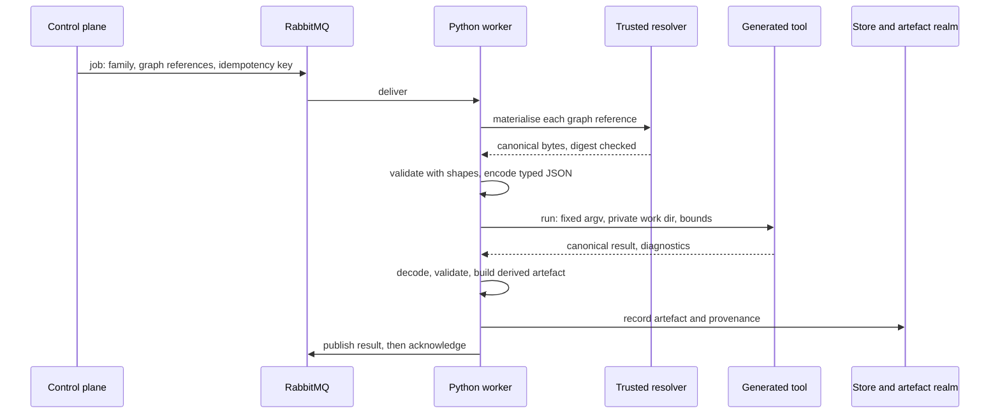

<!-- SPDX-License-Identifier: CC-BY-SA-4.0 -->

# Generated tools as toolchain workers

**Unit:** [formal-methods](../plans/formal-methods.md), phase 4. **Status:** sketch, 2026-10-06.
Nothing here is ratified. New job families need the platform's wiring decisions, and the image
build needs an ADR.
**Parent:** [formal methods](formal-methods.md) §13.1 and §13.2, which give the rationale. This
sketch is the operational design.
**Reads with:** the [semantic platform](../../architecture/semantic-platform.md), ADR-A30, ADR-A35,
ADR-A36, ADR-A37, ADR-A40, ADR-A59 and ADR-A92.

---

## 1. Scope

Heavy symbolic work in the toolchain runs as native tools generated from the specification, invoked
by Python workers that take jobs from RabbitMQ. Nothing generated runs against the live graph. This
sketch defines the job families, the flow, the interchange, the sandbox, the packaging, the
provenance and the failure semantics.

## 2. Job families

Closed families, each with one fixed argument vector (ADR-A35). First candidates, in order of value:

| Family | Input | Output | Ordering class (ADR-A59) |
|---|---|---|---|
| `formal.slot-check` | a form version, its governing variables and conditions | per slot: exclusive, exhaustive, with witnesses where not | none |
| `formal.config-space` | a product form | question plan, dead components, conditions that always hold, specialisations | none |
| `formal.adequacy` | a layer's fixture corpus | the adequacy report | none |
| `formal.kit-generate` | a configuration set and generation bounds | a conformance kit | none |
| `formal.property-check` | an instrument version and its properties | assurance records, counterexample traces | per instrument version |
| `formal.compile` | a module's conditions and combinators | SPARQL, SQL or Datalog text, each parsed back and compared | none |
| `formal.assembly-parity` | a form, its models and its configurations | the parity report | none |

## 3. The flow

## 4. The job envelope

| Field | Holds |
|---|---|
| `jobId` | opaque, with the canonical request digest as its idempotency identity (ADR-A36) |
| `family` | one of the closed families |
| `inputs` | graph references: tenant, project, graph IRI, revision hash (ADR-A30). Never RDF |
| `bounds` | time, memory, exploration depth, as declared per family, capped by the worker |
| `tool` | the expected tool image digest, which the worker checks before running |
| `correlationId` | carried to the result and the operational record |

## 5. Interchange

Typed canonical JSON from the codec generated from the specification
([adequacy and architecture sketch](formal-adequacy-and-architecture.md) §5). CBOR with the same
schema where a payload exceeds a declared size. The tool never parses RDF, and the worker never
interprets the tool's internal terms beyond the codec.

## 6. Running the tool

| Rule | Detail |
|---|---|
| one process per job | native start-up in milliseconds. The process is the sandbox |
| fixed argument vector | the request selects a family, never a command or a path (ADR-A35) |
| private work directory | input and output files only, inside it |
| no network | the tool reads its input file and writes its output file |
| bounds | wall time, CPU, memory, and the family's exploration bound, enforced by the worker |
| determinism | no clock, no randomness except a seed in the request, recorded in the result |

A long-lived tool process speaking a line protocol over standard input and output is the fallback,
if measured start-up cost dominates many small jobs.

## 7. Packaging

| Item | Rule |
|---|---|
| build | reproducible, from a locked dependency set (an opam lock or a cabal freeze file) and a pinned compiler |
| artefact | a static binary in an OCI image, with its digest recorded in the release |
| signature | through ADR-A40's signing adapter |
| registry of known digests | the worker refuses a tool whose digest is not in the deployment's allow-list |
| local use | the same binary under `mise run`, with no queue, for CI and developers |

## 8. Provenance and caching

| Item | Rule |
|---|---|
| derived artefact | the result's read set is the input revisions, the tool image digest and the specification digest (ADR-A92, ADR-A26) |
| cache | keyed by tool digest and input digest. A repeated request republishes without running (ADR-A36) |
| invalidation | a new specification or tool digest invalidates dependent artefacts in the smallest scope (ADR-A27) |

## 9. Failure semantics

| Event | Outcome |
|---|---|
| malformed request | negative acknowledgement without requeue (ADR-A37) |
| tool crash, out of memory | negative acknowledgement with requeue, then the dead-letter queue after the configured retries |
| bound reached | a normal result with `NotDecided` and the bound, never `Holds` (assurance records AR3) |
| unknown tool digest | refused, with a diagnostic, and no execution |
| result fails validation | the job fails. The output is kept for diagnosis, never recorded as an artefact |

## 10. Measures

Each family records wall time, peak memory, input and output sizes and cache hit rate. The first
family to reach production is compared with its Python baseline, if one exists, so the performance
claim of the parent §13.1 is measured, not assumed.

## 11. Open questions

| # | Question | Leaning |
|---|---|---|
| TW-Q1 | One image for all families, or one per family? | one per tool, with several families per tool where they share a specification |
| TW-Q2 | Does the review workbench call these jobs synchronously? | no. It submits a job and shows the result when it arrives, as the proof of concept's add-in does with write intents |
| TW-Q3 | Should Haskell builds of the same tools run in CI as an N-version check? | only if Phase 0 shows it nearly free (parent §13.2) |
