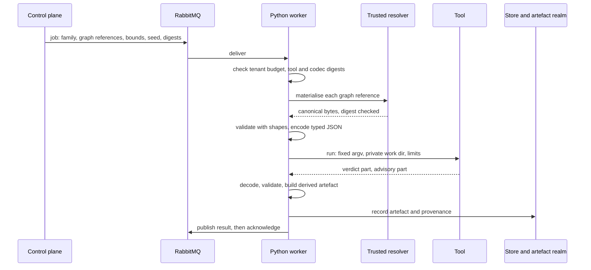

<!-- SPDX-License-Identifier: CC-BY-SA-4.0 -->

# Toolchain workers

**Unit:** [formal-methods](../plans/formal-methods.md), track F. **Status:** sketch, 2026-10-06,
revised after review ([response](../notes/formal-methods-review-response.md)). Nothing here is
ratified. New job families need the platform's wiring decisions, and the image build needs an ADR.
**Parent:** [formal methods](formal-methods.md) §13.1 and §13.2, which give the rationale. This
sketch is the operational design.
**Reads with:** the [semantic platform](../../architecture/semantic-platform.md), ADR-A30, ADR-A35,
ADR-A36, ADR-A37, ADR-A40, ADR-A59 and ADR-A92.

---

## 1. Scope

Heavy toolchain work runs as jobs that Python workers take from RabbitMQ. A job's tool is written in
Python, or native where its Python baseline is measured as the bottleneck. Nothing a job runs touches
the live graph. This sketch defines the families, the flow, the envelope, the interchange, the
sandbox, packaging, provenance, caching, isolation and failure.

## 2. Job families, and where each runs

| Family | Output | Bound by | Tool | Ordering class (ADR-A59) |
|---|---|---|---|---|
| `formal.slot-check` | per slot: exclusive, exhaustive, witnesses | the SMT solver | **Python driving Z3 or cvc5**. A native rewrite buys nothing | none |
| `formal.closure` | closures, normal forms, crosswalks over large schemes | the store, or a Datalog engine | **the store or a Datalog engine**, not a new tool | none |
| `formal.regenerate` | minimal regeneration diffs (ADR-A27) | input and output, graph diffing | Python first, measured | none |
| `formal.compile` | SPARQL, SQL or Datalog text, with the algebra term | string and tree work | Python first, measured | none |
| `formal.config-space` | question plan, dead components, specialisations | interpretation | **native candidate**, after a Python baseline | none |
| `formal.assembly-parity` | the parity report over every configuration | interpretation | **native candidate**, after a Python baseline | none |
| `formal.property-check` | claims, generated traces | the evaluator, or the model checker | **native candidate** for exploration. The model checker as itself | none |
| `formal.adequacy` | the adequacy report | decoding and checking per fixture | native candidate, after a Python baseline | none |
| `formal.kit-generate` | a conformance kit | the evaluator | as `formal.property-check` | none |
| persistence planning | a physical plan | search | native candidate, if the custom engine is built | none |

A family becomes native only if its native build is measured at five times its Python baseline or
better (epic §6). All families have ordering class none: they are pure reads, and publication for one
key is already serialised by ADR-A36's idempotency.

## 3. The flow

## 4. The envelope

| Field | Holds |
|---|---|
| `jobId` | opaque. Its idempotency identity is the canonical digest of the **whole** request (ADR-A36) |
| `family` | one of the closed families |
| `tenant` | the tenant, part of the request and of the cache key |
| `inputs` | graph references: tenant, project, graph IRI, revision hash (ADR-A30). Never RDF |
| `bounds`, `seed` | time, memory, exploration depth, and the generation seed |
| `tool`, `codec` | the expected tool image digest and codec schema digest, both checked before running |
| `supersedes` | an earlier job this one replaces, so the earlier is cancelled |
| `correlationId` | carried to the result and the operational record |

## 5. Interchange

Typed canonical JSON from the generated codec, with every quantity as a lexical string, never a JSON
number ([adequacy and architecture sketch](formal-adequacy-and-architecture.md) §5). CBOR with
deterministic encoding and decimal-fraction tags where a payload exceeds a declared size. The tool
never parses RDF.

## 6. Running the tool

| Rule | Detail |
|---|---|
| one process per job | the process is the sandbox. For an imaged tool, one container per job, removed when it ends, as a non-root user with a read-only root filesystem and `--network none` |
| fixed argument vector | the request selects a family, never a command or a path (ADR-A35) |
| private work directory, no network | input and output files only |
| limits | wall time, CPU, memory and exploration bound, enforced by the worker, and passed to the container as `--cpus`, `--memory` and `--pids-limit` |
| budgets | per-tenant concurrency limits and a cost ledger, so one tenant's exhaustive run cannot starve others. The ledger is also how the feature is priced |
| cancellation | a job whose input revision has been superseded, or whose `supersedes` names a running job, is cancelled |
| interactive checks | a drafter's sub-second feedback is a separate, small, in-process check built for the browser (FM-D6), never a synchronous path to these jobs |

## 7. Results: verdict and advisory

| Part | Holds | Identity |
|---|---|---|
| verdict | holds, fails or not decided, with scope, bound and completeness | content-addressed, gated, part of the artefact's identity |
| advisory | witnesses, counterexample traces, timings, the resource envelope | recorded, not part of the identity |

Solvers and model checkers do not give stable witnesses or traces across versions, worker counts and
machines. Splitting the result keeps a re-run on another machine from appearing as a change in the
provenance ledger. `formal.compile` records both the algebra term and the emitted text, with both
digests: parsing the text back validates the printer, and the term's own correctness is a separate
claim.

## 8. Packaging

| Item | Rule |
|---|---|
| build | hermetic, from locked dependencies, a pinned compiler, a pinned system toolchain and a pinned base image. Staged, so the runtime image holds the tool and nothing used to build it |
| image | one tool per image, built for `linux/amd64` and `linux/arm64`, pinned by digest. Nothing stays running between jobs, so an idle worker host costs only its container engine |
| hosts | macOS, Windows and Linux run the same images (epic §4, Environments, FM-D16). On macOS and Windows the engine's virtual machine is capped. A host behind a TLS-re-signing proxy passes its certificate to image builds as a secret, never stored in a layer |
| provenance | an in-toto or SLSA build attestation for each image, published with it. Signing (ADR-A40) covers the artefact, and the attestation covers the build |
| registry | images are built in CI and published to a registry, never committed (E6). The repository holds sources, lock files and the allow-list of digests |
| local use | the same image under `mise run`, with no queue, through the Python driver a worker uses. A queue test runs RabbitMQ in a container and the worker natively, on any host. A native binary, built on the host before its image exists, runs behind the same driver for testing only, and is never recorded |

## 9. Provenance and caching

| Item | Rule |
|---|---|
| read set | **semantic inputs** (input revisions, specification digest, statement digests) and **tool identity** (tool image, codec) are recorded separately. A change of semantic input invalidates the artefact. A change of tool identity marks it stale and schedules re-verification in the background, without invalidating it or failing the release gate (FM-D15, an ADR-A27 addendum (the invalidation rule), with the two kinds of read-set entry stated in ADR-A92's terms) |
| cache key | the canonical digest of the whole request: tenant, family, inputs, bounds, seed, tool and codec |
| not decided | cached with a short horizon and marked re-runnable on a larger budget. A cached not-decided result never answers a request with a larger bound |
| tenancy | the cache is per tenant, except for content the platform itself publishes, so a hit cannot reveal what another tenant holds |

## 10. Sensitive output

Counterexample traces and generated traces are built from real instrument values. They are tenant
data: classified as the instrument is, retained for a declared period, kept for diagnosis on failure
only within the tenant, and exported in an exchanged claim only on the owner's decision.

## 11. Failure semantics

| Event | Outcome |
|---|---|
| malformed request | negative acknowledgement without requeue (ADR-A37) |
| tool crash, out of memory | negative acknowledgement with requeue, then the dead-letter queue after the configured retries |
| bound reached | a normal result, not decided, with the bound and the resource envelope |
| unknown tool or codec digest | refused, with a diagnostic, and no execution |
| result fails validation | the job fails, and the output is kept within the tenant for diagnosis, never recorded as an artefact |
| budget exhausted | queued behind the tenant's limit, never run over it |

## 12. Measures

Per family: wall time, peak memory, input and output sizes, cache hit rate, the **null-result rate**
(the share returning not decided), and for native candidates the speed-up against the Python
baseline. The null-result rate and the speed-up drive the epic's abandonment conditions.

## 13. Open questions

| # | Question | Leaning |
|---|---|---|
| TW-Q1 | One image for all families, or one per tool? | one per tool, with several families per tool where they share semantics. A combined image would carry every toolchain into every job, which the resource rules of epic §4 rule out |
| TW-Q2 | Does the review workbench call these jobs synchronously? | no. Interactive feedback is the separate in-process check of §6 |
| TW-Q3 | Should Haskell builds of native tools run in CI as an N-version check? | only if FM-D1's choice makes them nearly free |
