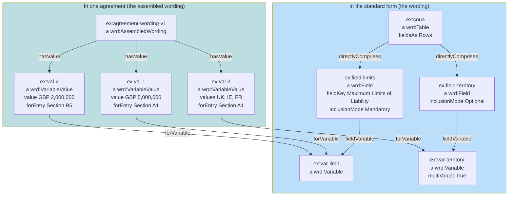
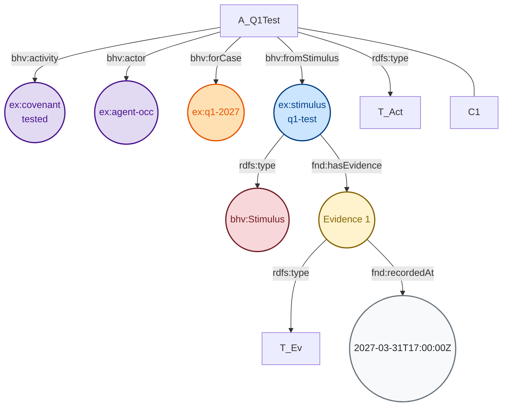
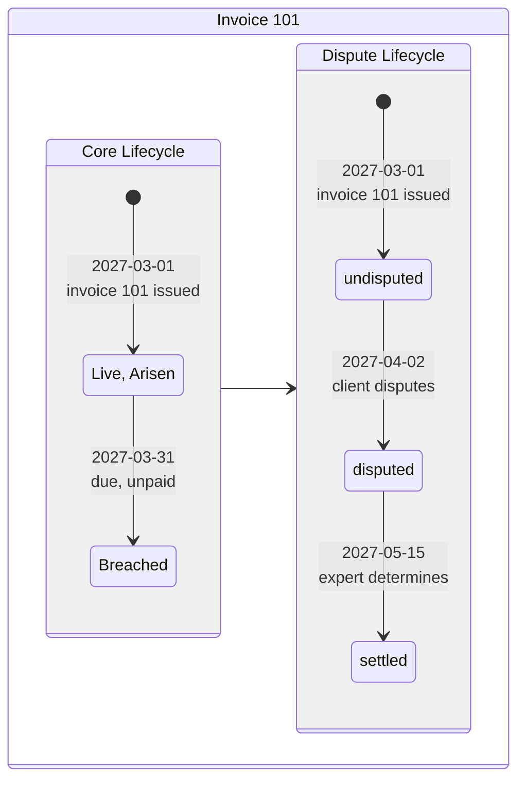

<!-- SPDX-License-Identifier: CC-BY-SA-4.0 -->

# Improved Ontology Documentation.

Draft for review, 2026-10-02. Unplanned: an exploration, with no plan, slice or ADR behind it. This spec defines an internal markup design and proposes an extention to the `literate_extract.py` tool. 

## Overivew

Our ontologies are incredibly rich resources, but the TTL files contain little beyond the OWL axioms themselves, and some basic RDF comments. Given the richness of information in our `docs/architecture`, the developer sketches, and the ontology README.md files themselves, I believe we should be able to include much richer content in the TTL files, making the ontologies far more self-documenting than they currently are.

## Exploration/Design Sketch

Since every ontology is generated from the README.md, narrative explanations about how the ontology's axioms are intended to be used should be drawn out and given in much more detail in the README for each substrate/layer. Segements of this narrative should be injected into the TTL generated from the documents, as comments.

I would propose that we DO NOT put this extensive narrative text inside the OWL/TTL that put in backticks, because it will reduce the quality of the documentation. So this (below) is NOT what we want:

```turtle-spec
pfx:UsefulThing a owl:Class ;
	rdfs:subClassOf fnd:Version ;
	rdfs:comment "DO NOT INCLUDE A LONG NARRATIVE DESCRIPTION IN THE COMMENTS HERE..." .
```

Instead, I propose that we use a pair of non-rendering/comment markdown link constructs to demarcate comments for a specific class. The structure is open to discussion, but I propose something roughtly like this:

```markdown
<!-- start: {"id": "comment-1", "target": "@base/StateSpace", "annotation": "rdfs:comment" } -->
Now a large block of text that needs to go into the comment. Obviously the literate extract tool will need to ensure escape sequences are properly applied, so we end up with valid TTL. This comment can be quite long and may also, as you will see below, have other comments nested within it! The reason for the nesting is that the narrative in the README.md needs to "read nicely", but different parts of the text may need to go to different annotations in the ontology.
<!-- start: {"id": "nested-comment-2", "target": "@base/StateSpace", "annotation": "skos:scopeNote" } -->
I have here targeted `skos:scopeNote` which is perhaps questionable, but `usage` is our own internal one that this bit could target - the point is to give a potentially more useful and explanatory set of notes to a person reading the TTL.

Within any comment, there may be things like diagrams that need to be escaped. In order to demonstrate that properly, let's get out of this backtick block and simulate the idea in the main markdown text of this sketch.
<!-- end: {"id": "nested-comment-2" } -->
<!-- end: {"id": "comment-1" } -->
```

### Simulated Example

Now we're going to simulate a section of README.md, this one based on the wording ontology README, but actually these detailed notes came from a sketch. In this example below, we will see a long comment and an embedded mermaid table being excluded from what is written to the OWL annotation property on the class.

#### The Example

<!-- start: {"id": "comment-1", "target": "@base/Table", "annotation": "rdfs:comment" } -->

An opaque table whose cells are separately named variables, cannot say "field X for every entry"). Instance entries as wording elements (treats them as form text), would require modelling the whole table as one record-set value (which loses optional and conditional fields), and naming the axes rows and columns (fixes the presentation in the model, and kind 2 then reads back to front). 

The constraint that must hold: a template parameter can bind "the value in this field for each entry", so one field yields one parameter per entry (S44).

<!-- start: {"exclude": "true" } -->


<!-- end: {"exclude": "ignored" } -->

For a kind-3 table the form's `wrd:Table` also comprises its `wrd:Entry` nodes, and each cell's
`wrd:forEntry` names one of them (the responsibilities table in `trial-protocol.ttl`).

<!-- end: {"id": "comment-1" } -->

## An "Examples" Example

Sometimes, examples are MUCH easier to reason about when they're just pictures. I propose that exploratory examples are broken up into small chunks, given longer commentary, with supporting diagrams rendered in the README.md. We then write a standard conversion from the convention we use for mermaid to TTL. Let's draw this example out:

### The Example (imagine this in a README.md section)

An incoming simulus attempts to leverage 4.2x against a maximum of 4.0x:

<!-- start-conversion (NB: no meta-data on the comment, because it's all in the mermaid -->

<!-- end-conversion (NB: no nesting is available with conversions) -->

### Example Explanation

When the conversion runs, it will generate TTL, such as:

```turtle
ex:stimulus-q1-test a bhv:Stimulus ;
    fnd:hasEvidence [ a fnd:Evidence ; fnd:recordedAt "2027-03-31T17:00:00Z"^^xsd:dateTime ] .
```

Obviously the author of the examples might wish to include mermaid that isn't included in the conversion, to help string the narrative picture together, and that's also fine. What follows is another example of exactly that - note the use of `{ "target": "file" }` to indicate that the comments should go (as comments) into the TTL file, rather than being attached as an annotation property to an axiom in the TTL file's graph.

### "Examples" Example 2

<!-- start: {"id": "commentary", "target": "file" } -->
A state machine can belong to each occasion of a relation, not to the agreement as a whole: every invoice can be disputed on its own, and a dispute about one says nothing about another. The occasion's own core state is untouched: what the dispute changes are the consequences that read it.

A services agreement obliges the client to pay each invoice within 30 days. A dispute regime (undisputed, disputed, settled) runs once per occasion of that duty. Invoice 101 goes unpaid and is disputed, so its occasion is breached and disputed at once, until an expert determines the dispute. Invoice 102 is paid on time and never disputed.

 | Date       | Record                                  | Invoice 101: core   | Invoice 101: dispute | Invoice 102: core | Invoice 102: dispute |
 |------------|-----------------------------------------|---------------------|----------------------|-------------------|----------------------|
 | 2027-03-01 | invoice 101 issued                      | Live, Arisen        | undisputed           |                   |                      |
 | 2027-03-05 | invoice 102 issued                      |                     |                      | Live, Arisen      | undisputed           |
 | 2027-03-31 | invoice 101 due, unpaid                 | Breached            |                      |                   |                      |
 | 2027-04-02 | the client disputes invoice 101         |                     | disputed             |                   |                      |
 | 2027-04-04 | invoice 102 paid                        |                     |                      | Performed         |                      |
 | 2027-05-15 | the expert determines invoice 101       |                     | settled              |                   |                      |

<!-- end: {"id": "commentary" } -->

Let's take a walk through how this is modelled in lattice. We'll start with the first invoice.



This will be modelled as ... <!-- and the text goes on, using a combination of the constructs we've already seen -->

## Implementation Proposal

### Initial Hand-Crafted Example

I will craft, from one of the existing README.md files, an example. I will probably choose the `wording` layer, which is quite important and covers a lot of narrative ground and examples etc.

This will be used to determine what changes should be made to the literate extract tool to support this work.

### Sweep 1 & 2 over the documentation content in the codebase

It is proposed that we run a sweep across the architecture, design, and developer documentation (including the sketches), bringing a MUCH richer set of documentation from elsewhere in the codebase, into the literate specification README.md docs, including more diagrams, usage examples, and explanations of how concepts work together and why design decisions have been taken.

A second sweep, would then target some of this richer narrative documentation for the TTL files, using this comment-markers in the README.md files to demarcate what goes where.

Finally, a flag in the literate extract script, should enable turning on or off of the literate extraction. The primary purpose being that some environments (e.g., when sending a TTL over the wire) might prefer less _noise_.

### Remove generated TTL content from git

Unless excepted by architecture decision, this sketch proposes that the TTL files for ontologies, vocab, shapes, and examples, be removed from git and generated as part of the bootstrap of the project.

This also would ensure that all the narrative which is generated - especially, for example, where a sketch + a plan + a validation will all come together to explain the concepts in an example. This would lead to sections where an example is walked through bit by bit, which again is going to really potentially help users - and of course, sometimes the user is an AI agent who we've given the ontology to - to understand the usage patterns for a layer/substrate.

### Cannonical Set of README.md file locations

Since most TTL content will now be generated by running a `mise` command (and hooked during bootstrap, of course), it will be very important that the canonical set of README.md files to be processed is well-known. This MAY already be handled, but it will need to be locked down from after this sketch is implemented and well-understood and documented.

## Proposed Benefits

This should not only make for much better documentation in the folders themselves. The README.md files can be used to populate more documentation content on the github pages website AND could reduce the amount of additional (and separate) architecture documentation a user must read to understand the solution.


