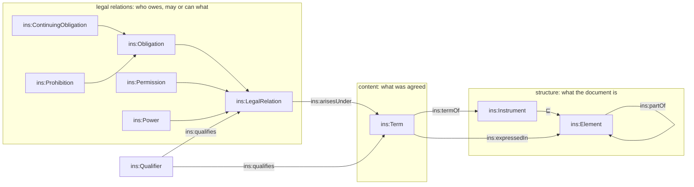

<!-- SPDX-License-Identifier: CC-BY-SA-4.0 -->

# Instrument: structure, terms and legal relations

Draft for review, 2026-09-30. A from-scratch design for `ontology/instrument`, answering
[normative-rule-substrate](../plans/normative-rule-substrate.md) decision D2 and replacing the
design in [legalruleml-mapping.md](legalruleml-mapping.md) §6.3's resolution, §18.2 and §18.3.
Nothing here is ratified. It becomes ADR-A104 and slice N4.

Three tests govern every choice, in this order:

1. **Reads right.** A contract lawyer or an engineer surveying the T-box recognises each name and
   meets no word used in two senses.
2. **Reasons right.** Every class has one evaluation algorithm, total over the class, that runs on
   the A-box at runtime without a reasoner.
3. **Sits right.** The design maps cleanly onto the logics LATTICE must meet: Hohfeld's legal
   relations, standard deontic logic, defeasible logic, strong Kleene decisions, OWL DL, SHACL,
   SWRL and controlled English. External standards (LegalRuleML, ODRL) are mapped through MORK
   where they differ, and aligned only where it costs nothing.

---

## 1. The answer to D2, in one paragraph

`ins:Obligation` is deontic. It is the legal bond by which an obligor owes an obligee some conduct,
which is what the word has meant since Roman law's *obligatio*. It stops being a document element.
The document's structure moves to `ins:Element`, and the agreed content moves to `ins:Term`. A term
gives rise to legal relations, and an obligation is one kind of legal relation. The D2 walkthrough
posed "structural or deontic" as a choice about one class. The better answer splits the class's
two jobs between three classes, each named in contract English.

## 2. Reading the words

Contract English is dense with words used in several senses. The design names each sense once and
gives no class to a word that stays ambiguous.

| Word | Its senses in contracts | Where each sense lands |
|---|---|---|
| **term** | (a) a provision the parties are bound by, express or implied. (b) a duration ("the policy term is 12 months") | (a) `ins:Term`. (b) `fnd:TemporalScope`. The class comment says so |
| **condition** | (a) a heading ("General Conditions"). (b) a class of term by breach consequence (condition, warranty, innominate term, and in insurance condition precedent, warranty, bare condition). (c) a contingency ("condition precedent to liability") | (a) an element type concept. (b) an applied classification of terms, as open-cbaa's `stm:breachTreatment` already does. Its legal effect is modelled explicitly (§5.4). (c) `elg:Condition`. **No `ins:` class is named Condition** |
| **provision** | both the clause (text) and what it provides (content) | retired. `ins:Element` and `ins:Term` replace it |
| **obligation**, **duty** | the bond (obligation) and the obligor's end of it (duty) | `ins:Obligation`. "Duty" is the obligor's view and gets no class |
| **right** | (a) the obligee's end of an obligation (a claim). (b) a power ("right to terminate"). (c) a liberty ("right to use") | (a) `ins:obligee`. (b) `ins:Power`. (c) `ins:Permission`. **No class is named Right**, because Hohfeld showed the word covers four things |
| **may** | a liberty ("may use the premises") or a power ("may cancel") | `ins:Permission` if it only frees the holder from a restriction. `ins:Power` if it changes someone else's position. The ontology forces the choice the drafting leaves open |
| **must not**, **shall not** | a negative obligation | `ins:Prohibition`, a kind of obligation ("an obligation not to sublet" is idiomatic) |
| **breach**, **violation** | the same, in contract and deontic-logic vocabularies | "breach", the contract word |
| **liability** | the insurer's liability to pay, and Hohfeld's correlative of a power | never used as a name. The power's other end is `ins:counterparty` |
| **norm** | legal theory, rare in contracts | not used |
| **permission**, **Permitted** | a legal relation (`ins:Permission`) and an Eligibility decision value (`elg:Permitted`) | kept, with a disambiguating comment on both. A risk can be `elg:Permitted` by a scope while no `ins:Permission` to bind it exists |

## 3. The model

Four strata, pairwise disjoint, each a `fnd:Version` under ADR-A07b's versioning contract (never
updated in place, superseded within one identity).



**Structure.** `ins:Element` is a recursive structural unit: a section, clause, schedule,
endorsement or definitions page, told apart by an element type concept rather than by subclass, as
MERIDIAN CSO's `ctr:ContractElement` and open-cbaa's `wim:` levels do. `ins:Instrument` is the root
element: a contract, policy, agreement, deed, licence or protocol. Making it an element lets an
ancillary agreement sit inside a binder's structure, as CSO's dual classification allows.
Ordering among siblings is the wording model's concern (`wim:rankKey`) and is not in the substrate.

**Content.** `ins:Term` is what the parties are bound by. It is expressed in one or more elements
(a bilingual agreement, a restatement in a schedule), or implied by a source with no element at
all: a statute, custom or course of dealing. An implied term is the reason a term cannot be a
structural element. ADR-A96's "one obligation in several provisions" becomes "one term expressed in
several elements", where it always belonged.

**Legal relations.** Every legal relation arises under exactly one term, holds between two parties,
and concerns one kind of conduct (an activity) over some cases (a scope). That uniform shape is
Hohfeld's: each relation is a two-ended bond about an act. It is also the shape open-cbaa's `stm:`
arrived at independently, with `stm:activity`, `stm:scope`, `stm:bearer` and `stm:counterparty`
on every kind.

| Class | Reads as | Parties | Required content |
|---|---|---|---|
| `ins:Obligation` | the obligor must perform the activity for the obligee by the due time | `ins:obligor`, `ins:obligee` | activity, due |
| `ins:ContinuingObligation` | the obligor must ensure a state holds throughout | same | `ins:maintains` |
| `ins:Prohibition` | the obligor must not perform the activity within the scope | same | activity |
| `ins:Permission` | the holder may perform the activity within the scope, despite a prohibition | `ins:holder`, `ins:counterparty` | activity |
| `ins:Power` | the holder may, by performing the activity, change the counterparty's legal relations | `ins:holder`, `ins:counterparty` | activity |

`ins:obligor` accepts a `pty:ParticipationGroup` as well as a `pty:RoleOccupancy`, so a duty owed
severally by a syndicate names the syndicate as obligor. `ins:fulfilledBy` is retired: it said the
same thing a second way.

**What a term gives rise to can arise later.** A relation arises when its term is in force, and
optionally on a trigger:

- `ins:arisesOn`: an occurrence matching a condition (receipt of a report, a financial year end).
- `ins:arisesOnBreachOf`: breach of a named obligation (a cure period, a late fee, a right to
  terminate for breach of a condition).
- `ins:arisesOnExerciseOf`: exercise of a named power (an acceleration creates a duty to repay).

A power that ends things names them with `ins:ends` (a power to cancel ends the instrument).
Creation points from the created relation to its trigger, and ending points from the power to what
it ends, because a created relation needs its own description anyway and an ended one already has
it.

**Constitutive terms create no relation.** A definition, a classification or an interpretation
clause is a term with no legal relations. Its meaning lives where LATTICE already puts constitutive
content: Vocabulary schemes, Eligibility conditions and Surface contracts (legalruleml-mapping §5.2).

**Qualifier.** `ins:Qualifier` stays, for A-101's term parameters (limits, retentions, levels). It
qualifies a term or a legal relation, and is in force exactly when that is.

## 4. The T-box, sketched

Imports are unchanged: Foundation, Vocabulary, Quantification, Party and Eligibility. Instrument
still imports nothing from Behaviour. The earlier design's `ins:deadlineAnchor` ranged over
`bhv:TriggerDefinition`, which would have made Instrument import Behaviour and closed a cycle,
since Behaviour imports Instrument. Deadlines here are Quantification ranges anchored on the
arising, so no cycle exists.

```turtle
# --- strata ------------------------------------------------------------------
ins:Element        a owl:Class ; rdfs:subClassOf fnd:Version .
ins:Instrument     a owl:Class ; rdfs:subClassOf ins:Element .
ins:Term           a owl:Class ; rdfs:subClassOf fnd:Version .
ins:LegalRelation  a owl:Class ; rdfs:subClassOf fnd:Version ;
    owl:equivalentClass [ a owl:Class ; owl:unionOf ( ins:Obligation ins:Permission ins:Power ) ] ;
    rdfs:subClassOf [ a owl:Restriction ; owl:onProperty ins:arisesUnder ;
                      owl:qualifiedCardinality "1"^^xsd:nonNegativeInteger ; owl:onClass ins:Term ] .
ins:Qualifier      a owl:Class ; rdfs:subClassOf fnd:Version .
[] a owl:AllDisjointClasses ; owl:members ( ins:Element ins:Term ins:LegalRelation ins:Qualifier ) .

# --- legal relations ---------------------------------------------------------
ins:Obligation            a owl:Class ; rdfs:subClassOf ins:LegalRelation .
ins:ContinuingObligation  a owl:Class ; rdfs:subClassOf ins:Obligation ,
    [ a owl:Restriction ; owl:onProperty ins:due ; owl:maxCardinality "0"^^xsd:nonNegativeInteger ] ,
    [ a owl:Restriction ; owl:onProperty ins:maintains ; owl:cardinality "1"^^xsd:nonNegativeInteger ] .
ins:Prohibition           a owl:Class ; rdfs:subClassOf ins:Obligation ,
    [ a owl:Restriction ; owl:onProperty ins:due ; owl:maxCardinality "0"^^xsd:nonNegativeInteger ] ,
    [ a owl:Restriction ; owl:onProperty ins:activity ; owl:cardinality "1"^^xsd:nonNegativeInteger ] .
ins:Permission            a owl:Class ; rdfs:subClassOf ins:LegalRelation ,
    [ a owl:Restriction ; owl:onProperty ins:activity ; owl:cardinality "1"^^xsd:nonNegativeInteger ] .
ins:Power                 a owl:Class ; rdfs:subClassOf ins:LegalRelation ,
    [ a owl:Restriction ; owl:onProperty ins:activity ; owl:cardinality "1"^^xsd:nonNegativeInteger ] .
[] a owl:AllDisjointClasses ; owl:members ( ins:Obligation ins:Permission ins:Power ) .
[] a owl:AllDisjointClasses ; owl:members ( ins:ContinuingObligation ins:Prohibition ) .

# --- structure and content ---------------------------------------------------
ins:partOf       Element → Element            functional, irreflexive, asymmetric. Acyclic by shape
ins:elementType  Element → skos:Concept       bound by ins-voc:ElementTypeContract
ins:party        Instrument → pty:RoleOccupancy
ins:termOf       Term → Instrument            exactly one
ins:expressedIn  Term → Element               the clause or clauses stating it
ins:impliedBy    Term → any                   a statute, custom or course of dealing (an ELI IRI, say)
ins:arisesUnder  LegalRelation → Term         exactly one

# --- parties -----------------------------------------------------------------
ins:obligor       Obligation → RoleOccupancy ⊔ ParticipationGroup   exactly one
ins:obligee       Obligation → RoleOccupancy                        at least one
ins:holder        Permission ⊔ Power → RoleOccupancy                exactly one
ins:counterparty  Permission ⊔ Power → RoleOccupancy                at least one for a power

# --- content and time --------------------------------------------------------
ins:activity               LegalRelation → skos:Concept    bound by ins-voc:ActivityContract
ins:scope                  LegalRelation → elg:Condition   at most one. The cases it applies to
ins:maintains              ContinuingObligation → elg:Condition
ins:arisesOn               LegalRelation → elg:Condition
ins:arisesOnBreachOf       LegalRelation → ins:Obligation
ins:arisesOnExerciseOf     LegalRelation → ins:Power
ins:due                    Obligation → qnt:Range          relative to an anchor (qnt:relativeToAnchor)
ins:recurrence             Obligation → qnt:Recurrence     monthly reporting, quarterly test dates
ins:excepts                Permission → ins:Prohibition
ins:ends                   Power → ins:Instrument ⊔ ins:Term ⊔ ins:LegalRelation
ins:qualifies              Qualifier → ins:Term ⊔ ins:LegalRelation   functional
```

One rule needs SHACL rather than OWL. An obligation that is neither continuing nor a prohibition has
exactly one activity and exactly one due range:

```turtle
ins:ObligationShape a sh:NodeShape ;
    sh:targetClass ins:Obligation ;
    sh:or (
        [ sh:class ins:ContinuingObligation ]
        [ sh:class ins:Prohibition ]
        [ sh:property [ sh:path ins:activity ; sh:minCount 1 ; sh:maxCount 1 ] ;
          sh:property [ sh:path ins:due ; sh:minCount 1 ; sh:maxCount 1 ] ]
    ) .
```

About 10 classes and 22 properties, against today's 4 and 11. Every addition carries a name a
reader already knows.

## 5. Reasoning at runtime

### 5.1 Relations are general, their occasions are not

"The borrower must deliver accounts within 120 days of each year end" is one `ins:Obligation`. Each
year end is an occasion. The case is the subject the relation's conditions evaluate: the financial
year, the report, the risk. Occasions are never minted in the instrument. Behaviour holds them as
state occupancies keyed by (relation, case), derived per ADR-A102's pattern, with the states
**pending, arisen, performed, breached, ended**.

This keeps the T-box and the instrument A-box finite and reviewable, and puts everything that grows
with time where time is already handled.

**One case per relation.** Every condition on a relation (`scope`, `arisesOn`, `maintains`) binds
the same subject class, the single-subject fragment of A-109. A relation over two cases is two
relations, or a projection.

### 5.2 One algorithm per class

Each is evaluated for a case at a stimulus-log position, with Eligibility's three values.
"Breach" means a breach record is derived. Undetermined never yields breach (law I7).

| Class | Arises | Breached when | Needs a closure licence (A-105) | Monotone |
|---|---|---|---|---|
| `Obligation` | term in force, and trigger Permitted at position p | the due range, anchored at p, has passed with no act of the activity by the obligor for the case | **yes**. "No act" is absence | no |
| `ContinuingObligation` | as above | `maintains` is Denied at a position while arisen, or at a recurrence test date | only where `maintains` itself reads absence | yes, on the positions evaluated |
| `Prohibition` | as above | an act of the activity by the obligor, for a case Permitted in `scope`, and the scope of every excepting permission for that case is Denied | **no**. Breach is a positive act | **yes** |
| `Permission` | as above | never | no | yes |
| `Power` | as above | never. Exercise is an act of the activity by the holder. It takes effect only if `scope` is Permitted at the exercise position. Undetermined means no effect, recorded as such | no | yes |

Three consequences follow directly from the table.

- **Prohibitions need no closure and SWRL can derive their breaches.** A breach is a positive fact,
  so ADR-A24's positive-only SWRL derives it. An achievement obligation's breach is an absence and
  needs A-105's licence. The difference between "must" and "must not" is therefore a difference in
  evidence, which is why they are separate classes and not one class with a polarity flag.
- **Exceptions are Eligibility, not defeasible logic.** A permission that excepts a prohibition
  narrows the prohibition's breach test to "in scope, and not in any exception's scope". Strong
  Kleene gives the right answer when an exception is Undetermined: the act is not a breach. The
  compiler builds this as a nested profile with negation (ADR-A03, ADR-A103), so no new evaluator
  is needed.
- **Contrary-to-duty chains stratify.** `arisesOnBreachOf` and `arisesOnExerciseOf` read breach
  and exercise *records*, which are facts, never deontic formulas. Kept acyclic by shape (law I6),
  they give an evaluation order: primary relations first, then their records, then the relations
  those records trigger. Chisholm's contrary-to-duty paradox needs a deontic formula in a condition,
  which A-109's fragment already refuses.

### 5.3 What the A-box answers

The relations are the index, so the questions reviewers ask are one pattern each:

```sparql
# What does the borrower owe, and under which clause?
SELECT ?duty ?activity ?clause WHERE {
  ?duty ins:obligor ex:borrower-occ ; ins:activity ?activity ; ins:arisesUnder/ins:expressedIn ?clause .
}
# What can the lender do to the borrower?
SELECT ?power WHERE { ?power a ins:Power ; ins:holder ex:lender-occ ; ins:counterparty ex:borrower-occ . }
# What follows if this obligation is breached?
SELECT ?next WHERE { ?next ins:arisesOnBreachOf ex:deliver-accounts . }
```

### 5.4 Breach consequences are relations, and their classification is applied

English law's condition, warranty and innominate term, and insurance's condition precedent and
warranty, classify a term by what its breach allows. The allowance itself is a relation:

- breach of a condition gives the other party a `Power` to terminate, `arisesOnBreachOf` the
  obligation
- breach of a warranty gives damages, an `Obligation` to pay, `arisesOnBreachOf` it
- an insurance condition precedent to liability is not an obligation at all. It is part of the
  indemnity obligation's `arisesOn`: no notice in time, no liability

The classification stays applied (open-cbaa's `stm:breachTreatment`), as a reading aid over
relations that carry the effect.

## 6. Where it sits

### 6.1 Hohfeld

| Hohfeld | Correlative | This design |
|---|---|---|
| duty | claim-right | `ins:Obligation`: `obligor` holds the duty, `obligee` the claim |
| privilege (liberty) | no-right | `ins:Permission`: `holder` has the privilege, `counterparty` the no-right |
| power | liability | `ins:Power`: `holder`, `counterparty` |
| immunity | disability | not modelled. It is the absence of a power, and an absent power already has no effect |

Correlatives are the two ends of one node, so no consistency algorithm is needed between a duty and
its right. Hohfeld defines a privilege as the negation of a duty to the contrary, which is exactly
what `ins:excepts` records.

### 6.2 Deontic and defeasible logic

- **Standard deontic logic.** O is `Obligation`. F p ≡ O ¬p is `Prohibition`, a kind of
  obligation. P is strong permission only, as an exception to a prohibition. Weak permission (no
  contrary duty exists) is an absence and stays unrepresented, which is LATTICE's position on
  absence everywhere (legalruleml-mapping §6.4).
- **Achievement and maintenance** (Governatori) are `Obligation` and `ContinuingObligation`.
  LegalRuleML leaves this neutral. LATTICE cannot, because the two compile differently (§5.2).
- **Defeasible logic.** A defeater is a `Permission` with `excepts`. A superiority relation is
  `ins:prevailsOver` between terms, reserved for N10 and gated by D5. Rule strength (strict,
  defeasible, defeater) is not modelled. An unexcepted prohibition is strict in effect.

### 6.3 LATTICE's own logics

- **Strong Kleene.** Every decision is an Eligibility decision. Breach is three-valued in effect:
  breached, not breached, or undetermined with a diagnostic.
- **OWL DL.** Classes, covering and disjointness axioms, and cardinalities are in OWL. The
  "neither continuing nor prohibition" rule is SHACL, since OWL cannot state it under the open world.
- **SWRL.** Derives prohibition breaches and power exercise effects, which are positive. Refuses
  achievement-obligation breach, which reads absence (A-105, D7).
- **Stratified Datalog.** The arising graph gives the strata (§5.2).

### 6.4 Controlled English (R5)

One modal verb per class, so a rendering never has to guess:

| Class | Rendering |
|---|---|
| `Obligation` | *{obligor} must {activity} for {obligee} within {due} of {arisesOn}, where {scope}.* |
| `ContinuingObligation` | *{obligor} must ensure that {maintains}, while {term} is in force.* |
| `Prohibition` | *{obligor} must not {activity} where {scope}.* |
| `Permission` | *{holder} may {activity} where {scope}, despite {excepts}.* |
| `Power` | *{holder} may {activity} where {scope}, which ends {ends}.* |

### 6.5 External standards, for free where it is free

| Standard | Maps to | Cost |
|---|---|---|
| ODRL `Duty`, `Prohibition`, `Permission` | the classes of the same meaning | free |
| ODRL `action`, `constraint`, `assignee`, `assigner` | `activity`, `scope`, obligor or holder, obligee or counterparty | free |
| ODRL `consequence` | `arisesOnBreachOf`, read in the opposite direction | a MORK inversion |
| LegalRuleML Obligation, Prohibition, Permission | the same classes | free |
| LegalRuleML Right | the obligee end, or a Power | a MORK mapping per use |
| LegalRuleML suborder list | a linear chain of `arisesOnBreachOf` | free one way. The chain generalises to fan-out, which the list cannot express |
| LegalRuleML Bearer, AuxiliaryParty | obligor or holder, obligee or counterparty | free |
| LegalRuleML Override | `ins:prevailsOver`, reserved | D5 |
| LegalRuleML strength | not modelled | lossy import, recorded |

## 7. Worked examples

Clean room first (ADR-A-C2): lending and a clinical trial. The open-cbaa mapping in §8 checks the
design against a real consumer and did not drive it.

### 7.1 A facility agreement's reporting covenant, cure period and acceleration

```turtle
ex:facility a ins:Instrument ; ins:party ex:borrower-occ , ex:lender-occ .
ex:clause-21-1 a ins:Element ; ins:partOf ex:facility ; ins:elementType ex-voc:Clause .
ex:clause-23-1 a ins:Element ; ins:partOf ex:facility ; ins:elementType ex-voc:Clause .
ex:clause-25-1 a ins:Element ; ins:partOf ex:facility ; ins:elementType ex-voc:Clause .

ex:reporting a ins:Term ; ins:termOf ex:facility ; ins:expressedIn ex:clause-21-1 .
ex:deliver-accounts a ins:Obligation ;
    ins:arisesUnder ex:reporting ;
    ins:obligor ex:borrower-occ ; ins:obligee ex:lender-occ ;
    ins:activity ex-voc:DeliverAnnualAccounts ;
    ins:arisesOn ex:financial-year-ended ;       # elg condition over the financial year
    ins:due ex:within-120-days .                 # qnt:Range relative to the arising

ex:leverage a ins:Term ; ins:termOf ex:facility ; ins:expressedIn ex:clause-21-1 .
ex:keep-leverage a ins:ContinuingObligation ;
    ins:arisesUnder ex:leverage ;
    ins:obligor ex:borrower-occ ; ins:obligee ex:lender-occ ;
    ins:maintains ex:leverage-at-most-3x ;       # elg interval condition
    ins:recurrence ex:quarter-ends .

ex:negative-pledge-term a ins:Term ; ins:termOf ex:facility ; ins:expressedIn ex:clause-21-1 .
ex:negative-pledge a ins:Prohibition ;
    ins:arisesUnder ex:negative-pledge-term ;
    ins:obligor ex:borrower-occ ; ins:obligee ex:lender-occ ;
    ins:activity ex-voc:CreateSecurity ;
    ins:scope ex:over-borrower-assets .
ex:liens-by-law a ins:Permission ;
    ins:arisesUnder ex:negative-pledge-term ;
    ins:holder ex:borrower-occ ; ins:counterparty ex:lender-occ ;
    ins:activity ex-voc:CreateSecurity ;
    ins:scope ex:arising-by-operation-of-law ;
    ins:excepts ex:negative-pledge .

ex:cure a ins:Term ; ins:termOf ex:facility ; ins:expressedIn ex:clause-23-1 .
ex:cure-accounts a ins:Obligation ;
    ins:arisesUnder ex:cure ;
    ins:arisesOnBreachOf ex:deliver-accounts ;
    ins:obligor ex:borrower-occ ; ins:obligee ex:lender-occ ;
    ins:activity ex-voc:DeliverAnnualAccounts ;
    ins:due ex:within-30-days .

ex:acceleration a ins:Term ; ins:termOf ex:facility ; ins:expressedIn ex:clause-25-1 .
ex:accelerate a ins:Power ;
    ins:arisesUnder ex:acceleration ;
    ins:arisesOnBreachOf ex:cure-accounts , ex:keep-leverage , ex:negative-pledge ;
    ins:holder ex:lender-occ ; ins:counterparty ex:borrower-occ ;
    ins:activity ex-voc:DeclareLoansDue .
ex:repay-now a ins:Obligation ;
    ins:arisesUnder ex:acceleration ;
    ins:arisesOnExerciseOf ex:accelerate ;
    ins:obligor ex:borrower-occ ; ins:obligee ex:lender-occ ;
    ins:activity ex-voc:RepayAllLoans ;
    ins:due ex:within-3-business-days .
```

Several `arisesOnBreachOf` values need a reading, since the acceleration power arises on
breach of any one of them. Values of a multi-valued trigger are alternatives, as `elg:requiredConcept`
values are. That is law I6's companion and belongs in A-104.

What the evaluator does, per financial year: `deliver-accounts` arises at year end. With no delivery
act by day 120, and a closure over the lender's inbox, it is breached. `cure-accounts` arises on
that breach record. With no delivery by day 30 it is breached, which gives rise to `accelerate`.
The lender's `DeclareLoansDue` act exercises it, and `repay-now` arises. A security interest
created by operation of law is not a breach of the negative pledge, and one whose origin is
unknown is Undetermined and is not a breach either.

### 7.2 A trial protocol

| Clause | Relation |
|---|---|
| The investigator must report a serious adverse event to the sponsor within 24 hours of becoming aware of it | `Obligation`, activity ReportSAE, arises on awareness, due 24 hours |
| The investigator must not enrol a patient meeting an exclusion criterion | `Prohibition`, activity Enrol, scope the exclusion criteria (an Eligibility profile) |
| unless the sponsor has granted a written waiver for that patient | `Permission`, activity Enrol, scope "waiver granted for this patient", excepts the prohibition |
| The sponsor may suspend a site that fails to report | `Power`, arises on breach of the reporting obligation, activity SuspendSite, ends the term under which the site may enrol |

## 8. Consequences

### 8.1 Versioning

SemVer 2.0.0 already allows this. Its item 4 says of major version zero that "anything MAY change
at any time". ADR-A86's own closing paragraph says major version zero keeps "its ordinary SemVer
meaning". What conflicts is A-86's bump table, which classifies breaking changes as MAJOR without
excepting 0.x.

So the proposal needs a short ADR (or an A-86 addendum), not a break with SemVer. It would say that
while a layer is at 0.x, a breaking change takes a MINOR bump and is marked breaking in its release
row and ADR. It can name Instrument alone, as proposed, or every 0.x layer. That choice is yours.
Instrument 0.7.0 then goes to 0.8.0, breaking. Behaviour re-pins, and so do `behaviour-vocab` and
`applied/capacity`, as the plan's N4 cascade already lists.

### 8.2 LATTICE

| Artefact | Change |
|---|---|
| `ontology/instrument` spec, vocab, shapes, README | rewritten. The vocab gains `ins-voc:ElementTypeContract` and `ins-voc:ActivityContract` |
| ADR-A07b | superseded by A-104. Its versioning contract carries over unchanged |
| ADR-A96 | carries over onto terms. `ins:SingleProvisionShape` becomes a single-element shape on `ins:expressedIn` |
| `behaviour/spec` | re-pin. `bhv:targetsElement`'s range widens to elements, terms and legal relations, since effects end relations |
| Behaviour fixtures, `tools/test_substrate_extensions.py` | retyped |
| Foundation README, ontology architecture §3 and §4 | illustrations use `ins:Obligation ⊑ fnd:Version` still, and remain true |
| NRS plan: N4, §18.2 and §18.3 of the mapping sketch | superseded by this sketch. The laws are I1 to I10 below. N8's `compensatedBy` chain becomes `arisesOnBreachOf` |
| NRS decisions | D2 answered here. D3 answered by your ruling: align where free, map through MORK otherwise |
| AIR Phase 5, A-101 | `ctr:TermParameter ⊑ ins:Qualifier` still holds. It qualifies a term or a relation |

### 8.3 Open-cbaa

| Today | Becomes |
|---|---|
| `agr:Agreement ⊑ wim:Contract, ins:Element` | `agr:Agreement ⊑ wim:Contract, ins:Instrument` |
| `wim:` components | `⊑ ins:Element`, with `wim:isDirectlyComprisedBy ⊑ ins:partOf` |
| bound `stm:Obligation ⊑ ins:Obligation`, the other kinds on `stm:bearerOccupancy` | every bound prescriptive kind is an `ins:` relation. `stm:bearerOccupancy` becomes `ins:holder` or `ins:obligor` |
| `stm:activity`, `stm:scope`, `stm:trigger`, `stm:deadline`, `stm:recurrence` | `ins:activity`, `ins:scope`, `ins:arisesOn`, `ins:due`, `ins:recurrence` |
| `stm:AuthorityGrant` | stays applied: an `ins:Power` to bind within the scope, with its level and limits as qualifiers, plus a `Prohibition` on binding outside it where the wording says so |
| `stm:Definition`, `stm:Classification` | stay applied, as terms that create no relation |
| `stm:Precedence` | waits for `ins:prevailsOver` (D5) |
| `stm:StatementTemplate` | stays applied. Templates name roles, so they are not `ins:` relations, as today |
| wording and meaning disjoint (open-cbaa DP3) | kept, as the structure and content strata |

## 9. Laws for A-104

| Law | Statement | Register |
|---|---|---|
| I1 | `ins:partOf` forms a tree. Every element reaches exactly one root instrument | static, SHACL |
| I2 | A term is expressed in at least one element or implied by at least one source | static, SHACL |
| I3 | A legal relation arises under exactly one term, and is in force only while that term is | static, OWL and semantic |
| I4 | All conditions on one relation bind one subject class (one case) | static, SHACL |
| I5 | An obligation has exactly one due range unless it is continuing or a prohibition, which have none | static, SHACL and OWL |
| I6 | The graph of `arisesOnBreachOf` and `arisesOnExerciseOf` is acyclic. Its values are alternatives | static, SHACL |
| I7 | Breach is derived only as §5.2 states. **Undetermined never yields breach.** An absence-based breach cites its closure and position | semantic, the mandatory adversarial probe |
| I8 | A permission's holder is the excepted prohibition's obligor, and its activity is the prohibition's | static, SHACL |
| I9 | A due range is anchored at the valid time of the arising, never at evaluation time. Expiry enters as a positioned stimulus (R3) | static and semantic |
| I10 | A power's exercise takes effect only when its scope is Permitted at the exercise position | semantic |

## 10. Open questions

| # | Question | Default if unanswered |
|---|---|---|
| Q1 | Does the 0.x breaking-MINOR ADR cover Instrument only, or every 0.x layer? | Instrument only, as proposed |
| Q2 | Should `ins:party` gain a privity shape (an obligor is a party to the term's instrument)? | no. Third-party beneficiaries make it an applied choice |
| Q3 | Is `ins:obligee` required, given regulatory duties owed to no party to the instrument? | required, with the regulator as a contingent occupancy (ADR-A102's pattern) |
| Q4 | Should a relation name the case class explicitly, rather than reading it from its conditions' bindings? | read it from the bindings, checked by I4 |
| Q5 | Does a fixed calendar date need `ins:dueOn`, or do `ins:recurrence` and anchored ranges cover every example? | add `ins:dueOn` when an example needs it |
