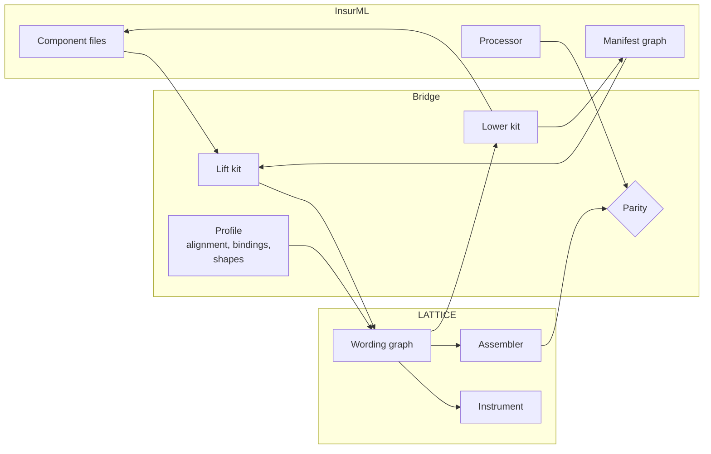
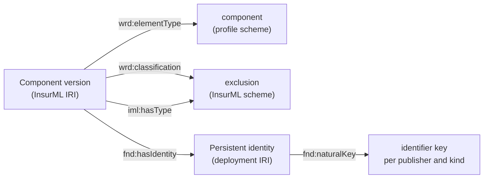
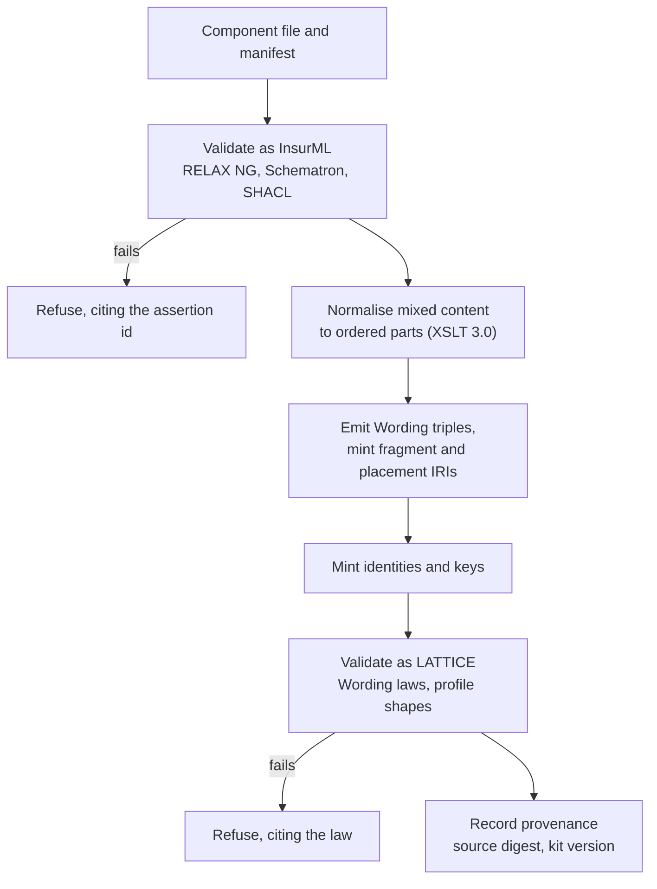
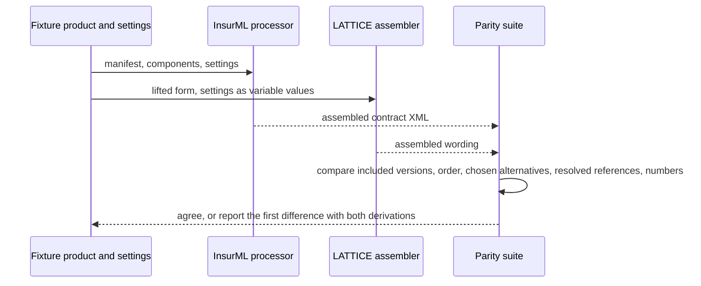
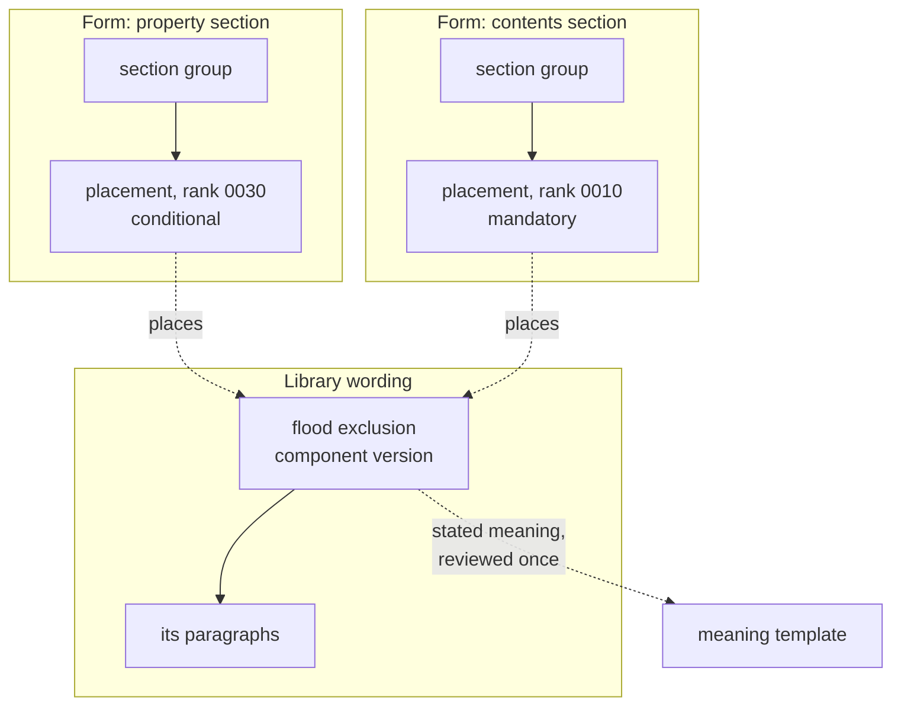
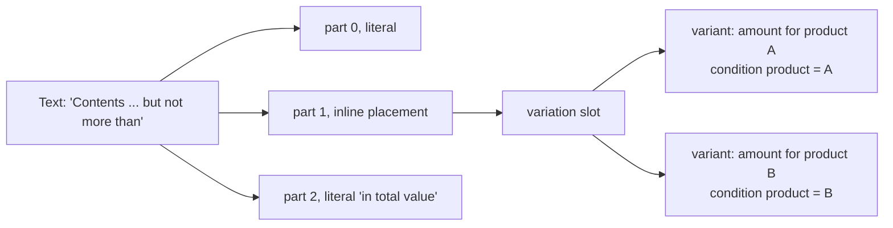

<!-- SPDX-License-Identifier: CC-BY-SA-4.0 -->

# The InsurML bridge: profile, lift, lower and assembly parity

**Unit:** [insurml-alignment](../plans/insurml-alignment.md) (epic). **Status:** sketch, 2026-10-05.
Nothing here is ratified. Every change to a LATTICE layer needs its own ADR.
**Reads with:** [the vision](../../architecture/insurml-alignment-vision.md) (principles AV1 to AV10),
[the comparison](../notes/insurml-and-lattice.md) and [the integration analysis](../notes/insurml-integration.md),
whose mapping rows (M-nn, W-nn), gaps (L-n, I-n) and proposals (P-n) are cited and not repeated, and
the [Wording README](../../../ontology/wording/README.md).
**Companion:** [insurml-toolchain-and-ai.md](insurml-toolchain-and-ai.md), which covers what is built
on the bridge.

Examples are clean-room. They use `.example` hosts and InsurML's placeholder base
`https://insurml.example/`, and quote no market wording (AV8).

---

## Contents

1. [Premise](#1-premise)
2. [The profile](#2-the-profile)
3. [Alignment and co-typing](#3-alignment-and-co-typing)
4. [Identity, keys and typing](#4-identity-keys-and-typing)
5. [Lift: InsurML into LATTICE](#5-lift-insurml-into-lattice)
6. [Lower: LATTICE into InsurML](#6-lower-lattice-into-insurml)
7. [Assembly parity](#7-assembly-parity)
8. [Reuse: placement elements](#8-reuse-placement-elements)
9. [Inline placement inside a text](#9-inline-placement-inside-a-text)
10. [Clause dependencies and fallback](#10-clause-dependencies-and-fallback)
11. [References by identity, and scope](#11-references-by-identity-and-scope)
12. [Content status and guidance](#12-content-status-and-guidance)
13. [Amounts: limits and excesses](#13-amounts-limits-and-excesses)
14. [Validation together](#14-validation-together)
15. [Proposals to InsurML](#15-proposals-to-insurml)
16. [Open questions](#16-open-questions)

---

## 1. Premise

The bridge lets one graph hold InsurML and LATTICE data without either standard giving up its
meaning (AV1). It has three parts: an applied profile that states how the vocabularies align, a
lift and a lower that move data between InsurML's XML and LATTICE's Wording, and a parity suite
that runs both standards' assembly over the same inputs. Four substrate changes would raise the
bridge's fidelity. Each has a case outside insurance, and each is an ADR candidate (§8 to §11).



## 2. The profile

The profile is AIR-5.9, the LMA WIM profile, built with InsurML in view. It lives in
`ontology/applied/insurance/wording/`, which CC-D3 chose as its home and which needs an ADR before
the directory is created.

### 2.1 Two documents in one module

| Document | Holds | Imports |
|---|---|---|
| `spec/wording-profile.ttl` | the market's typing of Wording, as an element type scheme for contracts, groups, components and content kinds, bound to `wrd-voc:ElementTypeContract` in an insurance binding scope. Containment shapes compiled from InsurML's rules held as data. Key schemes for component identifiers and LWR codes. The builder properties of §2.3 | Wording, `insurance/common`, InsurML's vocabularies |
| `spec/insurml-alignment.ttl` | class and property alignment with one pinned InsurML core edition (§3) | the profile, InsurML's core ontology |

Splitting the two keeps the market's typing usable for wordings that never pass through InsurML
XML, and isolates the edition pin to the one document that needs InsurML's classes. Until InsurML
is published under a known licence, the alignment document names InsurML IRIs without importing
them, and its tests run against clean-room fixtures (AV8, IB-Q1).

### 2.2 Containment rules

InsurML holds sub-component allow and deny lists and group placement as data on type concepts
(`iml:allowsSubComponentType`, `iml:disallowsSubComponentType`, `iml:allowedWithin`). The profile
compiles each into a SHACL-SPARQL shape over `wrd:directlyComprises` and the type hierarchy, with
`PREFIX` lines inline, as the repository's SHACL rules require. A rule on a broad type applies to
its narrower types, so the shapes read `skos:broader*` within the bound scheme. Because the rules
are data, the shapes are generated, never written by hand, and a change to InsurML's vocabularies
regenerates them.

### 2.3 Builder properties

A few InsurML properties serve a contract builder rather than the meaning of a contract. They stay
in the profile, never in the substrate (IP1):

| Property | InsurML source | Note |
|---|---|---|
| prompt, default value | `iml:prompt`, `iml:defaultValue` | for a builder's question form (L-8) |
| plain datatype of a variable | `iml:datatype` | where `wrd:valueSpace` does not apply: text, dates |
| treatment of Denied | `fallback` | §10 |
| title not printed | `displayed="false"` | presentation |
| label style | `labelStyle` | presentation |
| language status | `iml:languageStatus` | legal or non-legal translation |
| object families, document scope | `iml:contractObjectFamily`, `iml:componentObjectFamily`, `iml:documentScope` | classifications |

## 3. Alignment and co-typing

An InsurML node is a LATTICE node with the same IRI (integration §6.1). The alignment states:

```turtle
@prefix iml:  <https://insurml.example/ns/core#> .
@prefix wrd:  <https://www.nebularis.org/neuro-semantic/lattice/wording#> .
@prefix ins:  <https://www.nebularis.org/neuro-semantic/lattice/instrument#> .
@prefix owl:  <http://www.w3.org/2002/07/owl#> .
@prefix rdfs: <http://www.w3.org/2000/01/rdf-schema#> .

iml:Contract       rdfs:subClassOf wrd:Wording ;
                   owl:disjointWith ins:Instrument .
iml:ComponentGroup rdfs:subClassOf wrd:Element .
iml:Component      rdfs:subClassOf wrd:Element .
iml:Variable       rdfs:subClassOf wrd:Variable .

iml:hasSubComponent rdfs:subPropertyOf wrd:directlyComprises .
iml:references      rdfs:subPropertyOf wrd:refersToObject .
```

| Rule | Why |
|---|---|
| An InsurML contract is a wording, never an instrument | `owl:disjointWith ins:Instrument` turns a common naming error (comparison §8, "Contract") into a reasoner finding. Whether a contract is a library form or an issued policy's wording waits for Q-16. Both are `wrd:Wording`, and an issued one would align with `wrd:AssembledWording` |
| No property gains a domain or range in the alignment | a domain of `iml:Component` on a property LATTICE also uses would classify every LATTICE definition as an InsurML component (the repository's rule on sparing domains and ranges) |
| `iml:hasInclusion` aligns with nothing | its blank-node entries become placement elements on lift (§8), not a sub-property of a tree edge |
| `iml:variantOf` aligns with `prov:wasDerivedFrom`, never `wrd:variantOf` | the words collide with different meanings (comparison §8) |
| A variable's kind comes from its SKOS type | the lift adds `wrd:GoverningVariable` or `wrd:EmbeddedVariable` from `iml:hasType` (M-26, M-27) |

The colliding words of comparison §8 become a test of the alignment. Each row is a fixture that a
wrong alignment would accept.

## 4. Identity, keys and typing

**Identity.** InsurML version IRIs are adopted as LATTICE version IRIs (IP4, ADR-A82). The lift
mints a `fnd:PersistentIdentity` per component, group, contract and variable in the deployment's
namespace, never under a publisher's `id/` or `vocab/` path, so InsurML's IRI patterns still match
every publisher IRI (integration §6.2, R11). `dcterms:identifier` becomes a natural key under a key
scheme per publisher and kind (ADR-A114). LWR codes become external keys under their own schemes.
`iml:previousVersion` and `fnd:supersededBy` are both stated, one materialised from the other by a
Surface promotion.

**Typing.** Explored in depth in [insurml-typing.md](insurml-typing.md), which recommends T1 as an interim and T4 as the target. The interim is option T1 of integration §6.3. `wrd:elementType` takes a structural type from the
profile's scheme (contract, module, section, sub-section, component, paragraph, numbered clause,
nested clause, list, list item, table, title), each `skos:broadMatch` a baseline Wording type where
one exists. InsurML's component type (Coverage, Exclusion, Condition and the rest) becomes a
`wrd:classification`. `iml:hasType` is kept as stated. A publisher that narrows InsurML's types in
its own scheme is bound to a scheme that holds both, so Eligibility's hierarchical match reaches the
narrower concepts (ADR-A100).



## 5. Lift: InsurML into LATTICE

### 5.1 Stages



The lift refuses input that is not valid InsurML, so it never has to repair it. Mixed content is
the hard part. A `para` interleaves text with inline elements, and an RML mapping over XPath cannot
keep that order. So an XSLT 3.0 stylesheet first flattens each `para` into an ordered list of parts,
and the emission from that list is a plain structure mapping. The mapping is recorded in MORK so it
has the review and provenance trail other mappings have (IV6), and published as a kit (AV9). The
source file is kept, addressed by digest (IP2).

### 5.2 Minted IRIs

| Node | IRI |
|---|---|
| component, group, contract, variable | adopted from InsurML |
| fragment with an `xml:id` | adopted, as the component IRI, `#` and the id |
| fragment without an `xml:id` | minted in the deployment's namespace from the component IRI and the fragment's path. Never under the component IRI's `#` space, which belongs to the publisher's `xml:id`s (integration §6.2) |
| placement element, from an inclusion entry | minted from the holder IRI and the entry's position (§8), until InsurML gives entries IRIs (P-13) |
| persistent identity, key | minted in the deployment's namespace |

### 5.3 Fidelity

Integration §4.1 grades all 55 rows. Without substrate change, 37 are exact or by convention and 18
are lossy or have no target. The substrate changes of §8 to §11 raise the grade of the rows below.

| Rows | Today | With | After |
|---|---|---|---|
| M-17 one part, many holders | none | placement elements (§8) | exact |
| M-11 optional phrase, M-08 lists in a continuing sentence, M-12 limit and excess | none or lossy | inline placement (§9) | exact for structure. Label style by profile property |
| M-42 defined term resolved in scope | lossy | references by identity (§11) | exact |
| M-24 clause dependencies | lossy | derived variables, or §10's condition | by convention |
| M-25 content status | by convention | §12 | by convention, then exact if a substrate status is adopted |

Of the rows with no target, M-21 and M-30 become profile properties (§2.3, §10), and M-35, a
variable shown by its printed name, takes the optional display text of §11. Two keep no target.
Foreign content (M-15) stays in the source file and is rendered from it, and `iml:boundTo` (M-34)
waits for InsurML to settle its meaning.

## 6. Lower: LATTICE into InsurML

The lower writes a form as component files and a manifest, and a placed contract as an assembled
contract with its settings (integration §5.1). Two rules decide most of it:

- **Which elements become component files.** An element whose type in the profile is a component,
  or which carries stated meaning, becomes a file. Its descendants become `para`, `list` and
  `table` content inside it. Groups become manifest entries.
- **Conditions beyond equality.** InsurML tests one variable against one value. A LATTICE condition
  of any other kind is evaluated by Eligibility before assembly and handed to InsurML as a derived
  governing variable whose value is the decision (integration §5.2). The derived variable needs a
  third value for Undetermined. If InsurML adopts conditions held in RDF by IRI (P-2), the lower
  writes the profile's IRI instead.

What the lower cannot carry is meaning (W-23). It stays in the graph, linked by component IRI, and
travels in a contract package or a companion document (toolchain sketch §7, §8).

## 7. Assembly parity

The [assembly interface sketch](wording-assembly-interface.md) reframes §7 to §12. Placements,
inline placement, dependencies, fallback, references and content status become hooks of a
domain-neutral assembly interface in Wording, with InsurML's model as the insurance default. The
designs below stand.



The comparison is over what both standards define: the set and order of included component
versions, the alternative chosen in each set, the target each reference resolves to, and the
generated numbers once InsurML settles renumbering (Q32). A disagreement is a defect in an
assembler, in the lift, or in a condition one side cannot express. It is reported, never resolved
silently (ADR-A28). The suite starts from InsurML's processor as the reference (integration §7.3,
option A), and both become references once the LATTICE assembler passes every fixture (option C).

## 8. Reuse: placement elements

### 8.1 The problem

InsurML puts position and condition on an inclusion entry, an edge, so one component version can
be included by many groups and contracts, each time at a different position and under a different
condition. Wording puts `wrd:rankKey`, `wrd:inclusionMode` and `wrd:includedWhen` on the element,
and law W1 gives an element one parent up to versions. The integration analysis weighed four
options and recommended reifying the edge (option D), a breaking change that moves three
properties off the element (integration §4.2).

### 8.2 The proposal

A fifth option keeps every existing property where it is. A **placement** is an element whose only
content is a reference, with assembly semantics, to an element version in another wording. It
carries the rank key, the inclusion mode and the inclusion condition as any element does. The
placed element keeps its own tree, its own identity and its own stated meaning.

```turtle
@prefix wrd:     <https://www.nebularis.org/neuro-semantic/lattice/wording#> .
@prefix wrd-voc: <https://www.nebularis.org/neuro-semantic/lattice/wording/vocab#> .

# Hypothetical: wrd:Placement and wrd:places do not exist today.

<https://insurer.example/id/group/property-section/2026-01-01>
    wrd:directlyComprises <https://deployment.example/placement/insurer/property-section/2026-01-01/30> .

<https://deployment.example/placement/insurer/property-section/2026-01-01/30>
    a wrd:Placement ;
    wrd:rankKey "0030" ;
    wrd:inclusionMode wrd-voc:Conditional ;
    wrd:includedWhen <https://deployment.example/profile/flood-zone-a> ;
    wrd:places <https://insurer.example/id/component/flood-exclusion/2026-01-01> .
```



| Aspect | Rule |
|---|---|
| Laws | W1 holds as written, since a placement has one parent and the placed element sits in its own wording's tree. A new law W8: a placement places exactly one element, in another wording, and no element reaches itself through placements. W3 and W5 read through placements |
| Assembly | an assembled wording that includes a placement includes the placed element and, under W5, its mandatory descendants. `wrd:includes` lists both |
| Alternatives | a variation slot's variants may be placements, so InsurML's `iml:hasOption` lifts to a slot whose variants place library components |
| Meaning | stated meaning stays with the placed element version (CC-D12), so it is reviewed once for every form that places it |
| Numbering | the placement takes the object id in its form. The placed element's own id is irrelevant there |
| Where placed elements live | one library wording per component file, or one per publisher library edition (IB-Q2) |
| Versioning | a new class, a new property and two extended laws, so a MINOR, non-breaking change under ADR-A86 and ADR-A113, with the usual re-pin cascade |

The neutral case is a clause library, such as a tax gross-up clause placed in every facility form
or a consent clause placed in every trial protocol. Placements also give InsurML's blank-node inclusion
entries an identity, so a published number, a condition's provenance and a deviation report can
each name the entry they come from (P-13).

**Cost.** Two ways now put an element in a form, comprising it directly or placing it. They serve
different purposes, a form's own text and reused text, and the ADR states which to use when. The
change should land after CCS C9, so the Wording cascade does not cross Instrument's rewrite
(integration R4). Until then, the lift uses option B of integration §4.2, a placement element typed
by the profile, linked by `wrd:linksTo`, with assembly done by InsurML's processor alone.

## 9. Inline placement inside a text

Today a `wrd:Text` holds parts in three forms: literal, variable reference and object reference.
InsurML puts structure inside a sentence: an `optionalPhrase` whose inclusion is conditional,
alternatives among phrases, a list after which the sentence continues, and the `limit` and
`excess` composites whose parts carry meaning.

One addition covers all four. A fourth part form, the **inline placement**, places a child element
of the text at the part's index. The child is an ordinary element with its own inclusion mode,
condition and text parts. It is rendered at that index and nowhere else, and like a variant it has
no rank key.

| InsurML construct | Child element placed inline |
|---|---|
| `optionalPhrase` with a condition | a text, mode Conditional, with its inclusion condition |
| phrases sharing an `alternativeSet` | a variation slot, its variants texts |
| `list` inside a continuing `para` | an element of the profile's list type, its items as children |
| `limit`, `excess` with `range`, `amount`, `basis` | an element of type limit or excess, its parts as typed child texts, the amount's variable a variable reference |



The neutral case is bracketed drafting in any template, "[the Borrower] [each Obligor]", and a
consent form whose sentence carries an optional phrase. W2 gains a fourth form, so the change is
MINOR and non-breaking. It also answers L-10 without an Instrument change, since a qualifier can
be `ins:expressedIn` the limit's child element (§13).

## 10. Clause dependencies and fallback

InsurML's `includeIf`, `excludeIf` and `selectableIf` decide inclusion, or what is offered to a
drafter, from another clause's inclusion. LATTICE's inclusion conditions read governing variables
only.

| Option | How | Change |
|---|---|---|
| Derived variable | a governing variable "clause X selected", `wrd-voc:DerivedByRule`, populated from the earlier choice. `includeIf` and `excludeIf` become ordinary conditions on it | none |
| Inclusion-reading condition | a condition that reads whether another element is included in the same assembled wording, evaluated in dependency order | Wording, possibly Eligibility |

The derived variable is enough today, and keeps the dependency visible as data. The second option
is worth an ADR only when a neutral case needs it. `selectableIf` concerns what a builder offers,
not what a contract says, so it is a profile property read by the builder. The dependency graph
must be acyclic, and a profile shape rejects a cycle (U-8).

`fallback` is a consumer's declared treatment of a Denied decision, which the ingestion vision
already requires of every consumer (§8 there). A Denied conditional element with
`fallback="userSelection"` is offered to the drafter. An Undetermined one, where a governing
variable is unset, is a question for the builder to ask, a case InsurML does not model because it
assumes every setting is supplied (integration §7.2).

## 11. References by identity, and scope

InsurML resolves a defined-term reference to whichever version in the contract's scope shares the
target's identifier, so a clause need not be reissued when the definition it uses is revised.
`wrd:refersToObject` names a version.

| Option | Holds | Change |
|---|---|---|
| Resolution record per assembled wording | the assembler records the version each reference resolved to, and a shape checks exactly one | none |
| Reference to a persistent identity | `wrd:refersToObject` may name an identity, resolved within the assembled wording's inclusions. An optional display text on object and variable references carries an inflected form ("insured persons") or a variable's printed name | Wording |

The record works now. The identity reference is the cleaner model and belongs with CCS C7c, whose
per-section definitions (`ins:appliesWithin`, `ins:notWithin`) need the same resolution in law.
A definition component placed only within one section's group is a definition that applies within
that section, so the lift can write `ins:appliesWithin` from placement, and C7c's overlap report
then shows where InsurML's scope rule and the legal reading differ (integration §8.6). This is
input to C7c's brief.

## 12. Content status and guidance

InsurML marks content contractual or informational, and guidance is always informational and left
out when published. LATTICE has no such status. The profile classifies informational content, a
profile shape refuses `ins:expressedIn` from a term to it, and the renderer leaves it out. Drafting
notes in loan documentation and guidance in trial protocols suggest a neutral case, so a substrate
status is worth an ADR if a second domain asks for it (IQ-9).

## 13. Amounts: limits and excesses

With §9, InsurML's `limit` and `excess` lift to typed child elements, and their meaning attaches
where AIR Phase 5 puts it:

| Words | Meaning | Source |
|---|---|---|
| the `limit` element | a limit parameter qualifying a term or relation, `ins:expressedIn` the limit's child element | AIR-5.1, AIR-5.2 |
| the `excess` element | a retention parameter | AIR-5.2 |
| `amount` with a currency | a `qnt:Quantity` on a monetary space, bound from the amount's variable by an `ins:ParameterBinding` | Quantification, CCS C8 |
| `basis` | a basis concept (per occurrence, per period) | contract-amounts §1.7 |
| `range` | the closure of the bound ("up to" is at most, inclusive) | Quantification bounds |
| aggregate words | an aggregate parameter and a ledger account | AIR-5.3, evaluation context sketch |

InsurML's publisher inline constructs could take their names from AIR's term parameter kinds
(sub-limit, deductible, waiting period, reinstatement), so markup and meaning share one list (P-9).

## 14. Validation together

| Order | Check | On | From |
|---|---|---|---|
| 1 | RELAX NG, Schematron | component XML | InsurML |
| 2 | InsurML SHACL, with SHACL Advanced Features | manifest graph | InsurML |
| 3 | Wording laws W1 to W6 (W8 with §8) | lifted graph | LATTICE |
| 4 | profile shapes: containment, typing, content status, dependency acyclicity | lifted graph | profile |
| 5 | alignment fixtures: the collision table | lifted graph with the alignment | profile |
| 6 | round trips: lift then lower, lower then lift, against golden files | both | bridge |
| 7 | assembly parity | both assemblers | bridge |

Rows 1 to 5 are L1 and L2 checks. Rows 6 and 7 are L3 contract tests on fixtures and L4 on a
store. InsurML's shapes need SPARQL-based targets, so the suite runs them under two SHACL engines
to catch engine differences (integration R10).

## 15. Proposals to InsurML

Integration §10.2 lists P-1 to P-12. Two more arise here:

| # | Proposal | Answers |
|---|---|---|
| P-13 | give inclusion entries IRIs, minted from holder and position, in place of blank nodes | traceability of a number, a condition or a deviation to its entry, and a one-to-one lift to placements (§8) |
| P-14 | accept LegalRuleML, or any statement of meaning, as informational foreign content, never contractual | a single document for consumers who want one, without changing the published words (toolchain sketch §8) |

Each proposal goes to InsurML's owner only after a LATTICE fixture shows it working (IQ-10).

## 16. Open questions

| # | Question | Leaning |
|---|---|---|
| IB-Q1 | Can the alignment import InsurML's ontology, or only name its IRIs, until publication? | name only, tested on clean-room fixtures, import once licensed |
| IB-Q2 | Where do placed library elements live: a wording per component file, or one per publisher library edition? | per component file, since a component file is a document and the mapping stays one to one |
| IB-Q3 | Is the placement a class or an element type? | a class, since it has its own property and law (DP2) |
| IB-Q4 | Does the lift run as an XSLT kit only, or also as a compiled MORK mapping? | XSLT kit for execution, MORK record for review and provenance |
| IB-Q5 | Should profile shapes check InsurML's rules a second time, or trust InsurML's SHACL? | generate them once from the same data, run both, report differences as defects |
| IB-Q6 | Does an inline-placed child count as included when its text is included, or need its own inclusion record? | its own, so W5 and deviation reports treat it like any element |
