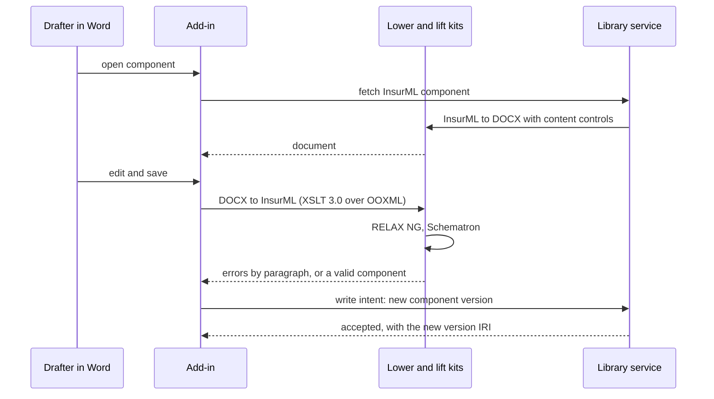
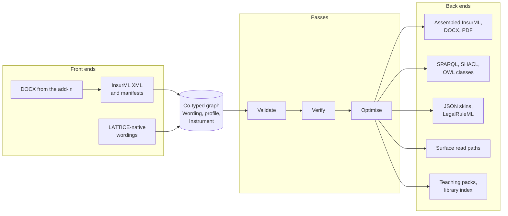
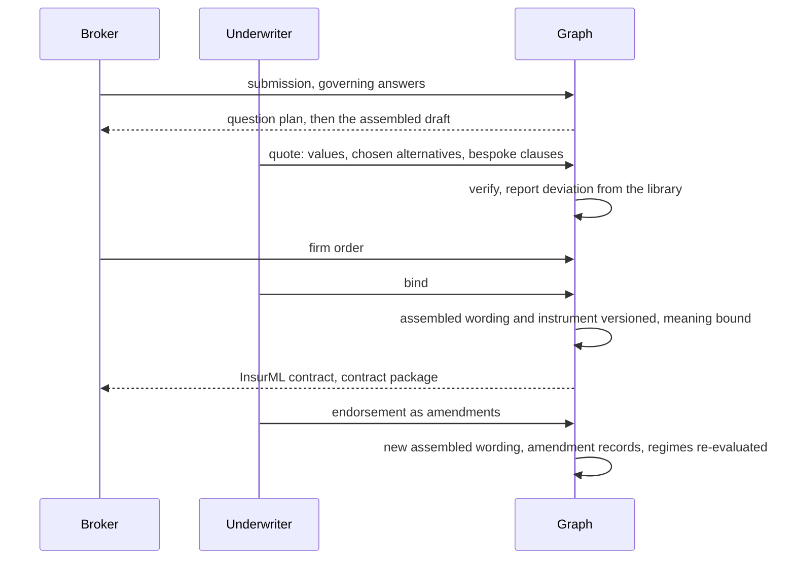
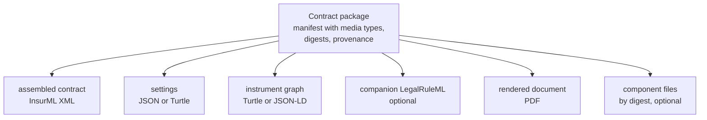
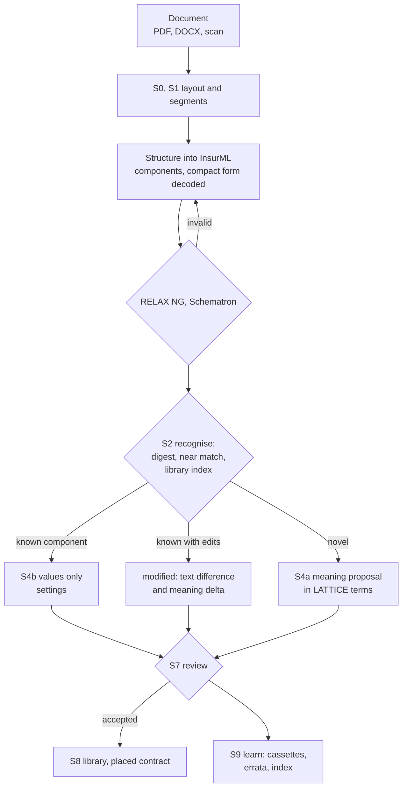

<!-- SPDX-License-Identifier: CC-BY-SA-4.0 -->

# From drafting to reading: the InsurML and LATTICE toolchain

**Unit:** [insurml-alignment](../plans/insurml-alignment.md) (epic). **Status:** sketch, 2026-10-05.
Nothing here is ratified. New directories, apps and packs each need an ADR.
**Reads with:** [the vision](../../architecture/insurml-alignment-vision.md) (AV1 to AV10),
[the bridge sketch](insurml-bridge.md) (the profile, lift, lower, parity and substrate changes this
sketch builds on), the [ingestion vision](../../architecture/ingestion-vision.md) (IV1 to IV13,
stages S0 to S9), [llm-training.md](llm-training.md) and [MTP](../../architecture/mork-teaching-pack.md),
the [XML egress](xml-egress-and-transformation-kits.md) and [wire protocol](normative-wire-protocol.md)
sketches, and Open DARE's proof-of-concept notes (`open-dare/docs/discovery/poc-ideas.md`, §4 and §5).

Examples are clean-room and use `.example` hosts (AV8).

---

## Contents

1. [Premise](#1-premise)
2. [Authoring](#2-authoring)
3. [The compiler](#3-the-compiler)
4. [Libraries](#4-libraries)
5. [Placement](#5-placement)
6. [Execution](#6-execution)
7. [Exchange](#7-exchange)
8. [Mixing standards](#8-mixing-standards)
9. [Teaching packs and AI-assisted reading](#9-teaching-packs-and-ai-assisted-reading)
10. [Platform placement](#10-platform-placement)
11. [Open questions](#11-open-questions)

---

## 1. Premise

The bridge makes InsurML and LATTICE data one graph. This sketch follows that graph through its
life: drafted in Word or a web studio, compiled, kept in libraries, assembled into products,
placed for a risk, run, exchanged, and read back from documents with AI. At each step it says what
exists, what each standard contributes, and what is new.

## 2. Authoring

### 2.1 Word

Market drafters work in Word. An Office.js task pane add-in, chosen in Open DARE's notes because it
runs on Windows, Mac and the web without an installer, keeps InsurML identity in the document:

| Word construct | Carries | InsurML |
|---|---|---|
| a content control per component, with a custom XML part | component IRI, type, optionality, alternative set, dependency | `component` with `iri`, metadata, markup attributes |
| a content control per fragment | `xml:id`, paragraph type, printed label | `para` with `xml:id`, `type`, `label` |
| a content control bound to a variable IRI | an embedded variable, or its printed name | `variable` |
| a content control around words with a condition | optional words, or one of a set of alternatives | `optionalPhrase` |
| a tagged table | static or dynamic table | CALS `table`, `dataTable` |



Numbering is never read from Word's list numbering. Identity travels in the tags, and numbers are
generated after assembly (DP10, W7). A tracked change in a placed contract maps naturally to a
strike-and-substitute amendment, so the add-in can offer an endorsement as a proposed
`wrd:Amendment` with its struck and substituted words, reviewed before it applies.

### 2.2 The web studio

Library curators, product owners and reviewers work in a web studio over the same components:

| View | Does |
|---|---|
| Component editor | edits a component's XML through a structured editor, validating as it goes |
| Product editor | edits a contract form's inclusion entries or placements, conditions as Eligibility profiles, alternatives, governing variables and their schemes |
| Meaning review | shows a meaning proposal beside its source fragment, with the review workbench's six decisions (Confirm, Retarget, Reshape, Decline, Teach, Defer) |
| Release | publishes a library edition, records governance states, shows impact (§4) |

### 2.3 One write path

Both front ends send the same write intents (Open DARE notes §5.2), so validation, persistence and
events have one code path whatever the client. Validation in the client uses the same schemas the
compilers use. Schematron compiles to XSLT, which can run in the browser and in the add-in, so a
drafter sees the same assertion ids as the server.

## 3. The compiler

One intermediate graph, many passes, many outputs, as ADR-A19's staged compiler already does for
conditions.



| Pass | Checks or produces | State |
|---|---|---|
| **Validate** | InsurML's grammar, Schematron and SHACL. Wording laws. Profile shapes (bridge §14) | built on both sides, profile shapes new |
| **Verify** alternatives | every set of alternatives exclusive and exhaustive over the governing variables' admissible values, for every product | intervals built (CCS C5), every kind CCS C13a |
| **Verify** dependencies | the clause dependency graph is acyclic, and every `dependsOn` target can be included | new, profile |
| **Verify** references | every reference resolves to exactly one target in every reachable configuration | new, generalising InsurML's per-policy check to all policies |
| **Verify** meaning | no obligation and prohibition over overlapping scopes, and a revision's widening or narrowing of criteria | NRS N3, ADR-A90 |
| **Optimise** questions | an order for the governing questions in which each answer removes the most undecided inclusions, as a question plan per product | new |
| **Optimise** configurations | dead components (never included), conditions that always hold (made mandatory), alternatives never chosen | new, on C13a's satisfiability |
| **Optimise** specialisation | a product partially evaluated over answers fixed for a market or a programme, giving a smaller form | new |
| **Optimise** conditions | inclusion conditions compiled to SPARQL and SHACL | built (`tools/mork_compilers`) |
| **Optimise** read paths | inherited attributes per placed contract, a usage index from component to live placements | Surface promotions, new contracts |
| **Optimise** rendering | a cache keyed by the component digest and the settings it reads | new |

Every pass is a pure function of hashed inputs. Each output is a derived artefact with its read set
(ADR-A92), regenerated in the smallest scope when an input changes (ADR-A27).

## 4. Libraries

| Library | Holds | Published by |
|---|---|---|
| Wording | InsurML component versions with their reviewed meaning templates | a market body, an insurer, a broker, each under its own prefix |
| Product | InsurML contract forms with governing variables and conditions | an insurer or a programme owner |
| Template | Instrument meaning templates, and regime templates for notice, suspension, non-renewal and run-off (CCS C8a) | LATTICE for neutral templates, the insurance profile for market ones |

A library is published in editions, as a vocabulary is. Each component version carries a
governance state (`fnd:GovernanceState`), and a withdrawn version is never reused. Questions the
graph answers:

| Question | Read path |
|---|---|
| Which live placed contracts include this component version? | usage index, `wrd:includes` |
| What would change if version 2 replaced version 1 in this product? | text difference, plus the meaning template's difference: same relation with changed parameters, a different relation, or criteria widened or narrowed (ADR-A90) |
| Which components are near duplicates? | fingerprints from ingestion stage S1, proposed to a curator as variants or merges |
| Which components have no reviewed meaning? | `ins:encodingStatus` |

## 5. Placement

A placement tailors a product for a risk, a client or a scenario. Each step writes data, never a
copy of the document.



| What placement records | LATTICE | InsurML |
|---|---|---|
| answers to governing questions | `wrd:VariableValue` on the `wrd:AssembledWording` | settings |
| chosen alternatives and optional clauses | `wrd:includes` | the assembled contract's parts |
| values for embedded variables and schedule tables | `wrd:VariableValue`, per table entry for a table field | `variable` values |
| a bespoke clause revising a library clause | a bespoke element, `prov:wasRevisionOf` the library element, which may be proposed back to the library | a component in the placement's own publisher space |
| a manuscript clause with no library origin | a bespoke element with no derivation | the same |
| an endorsement | `wrd:Amendment`s, and `ins:Amendment` for its legal effect (CCS C9) | a new contract version |

**Deviation from standard wording** is a derived report for every placed contract:

| Category | Test |
|---|---|
| standard | library element version included unchanged |
| standard with values | as above, with values for its variables |
| standard alternative | one alternative of a library set chosen |
| modified | a bespoke element that revises a library element, with the text difference |
| manuscript | a bespoke element with no library origin |
| removed | a mandatory library element deleted by amendment |

Each category is paired with the meaning delta of §4: same meaning, changed parameters, changed
relation, or meaning not yet reviewed. A renewal carries the settings forward, lists library
components with newer versions, and shows the impact of moving to them before anyone agrees.

## 6. Execution

Reviewed meaning is bound per instrument and run by LATTICE alone. InsurML's component types route
review to the likely reading (integration §8.5), and the bridge's §13 gives limits and excesses
their parameters.

| Runs | Where | Slice |
|---|---|---|
| due ranges, windows, survival | Instrument | CCS C7b |
| definitions per section | Instrument | CCS C7c |
| schedule values into relations | parameter bindings | CCS C8 |
| notice, suspension, non-renewal, run-off | regime templates | CCS C8a, AIR Phase 5 |
| endorsements in law | amendments | CCS C9 |
| regimes and occasions over events | runtime evaluator | CCS C12 |
| obligations, permissions, exclusions, powers | relation plans | CCS C13 |
| limits, retentions, aggregates | term parameters and ledgers | AIR-5.1 to AIR-5.3, evaluation context |
| authority at bind | Eligibility, capacity | AIR Phase 3, Open CBAA |

A decision carries its explanation: the relation, the evidence, and the fragment IRI of the words
that state it.

## 7. Exchange

### 7.1 Kits

Every exchange form is a published kit (AV9): a query, a stylesheet or generator, a schema and
examples, versioned in `contracts/` as the XML egress sketch proposes.

| Kit | Direction | Query or source | Output and schema |
|---|---|---|---|
| `insurml-components` | out | a form's elements | component files and a manifest, InsurML's RELAX NG and SHACL |
| `insurml-assembled-contract` | out | a placed contract | an assembled contract, InsurML's RELAX NG |
| `insurml-lift` | in | component files and manifests | the co-typed graph, Wording laws and profile shapes |
| `docx` | both | a component, or a placed contract | DOCX with content controls |
| `settings-json` | both | `wrd:VariableValue` records | JSON generated from the shapes (ingestion vision §7) |
| `market-profile` | both | terms, relations, decisions | the wire protocol's plain JSON |
| `lattice-instrument` | out | terms, relations, parties, conditions | LATTICE instrument XML (XML egress sketch) |
| `legalruleml` | both | relations | LegalRuleML XML or its JSON form (§8) |

An API serves a placed contract in any of these forms by content negotiation (wire protocol §11),
so any system that wants InsurML can have it, whatever authored the contract.

### 7.2 The contract package



A recipient takes the parts it understands and verifies the rest by digest. A package is a derived
artefact of one placed contract version. The release assembly and OCI export of ADR-A39 and
ADR-A40 are a candidate container format (IT-Q5).

### 7.3 Ingesting exchanged data

Anything that arrives in a kit's form runs through that kit's lift, the same validation, and the
same execution as data authored in LATTICE. Identity is preserved. InsurML IRIs are adopted, and
keys (a policy number, a unique market reference) resolve to existing identities rather than
minting new ones (ADR-A114). Running a lift twice on the same input yields the same graph.

## 8. Mixing standards

### 8.1 LegalRuleML

Three ways to put LegalRuleML beside InsurML:

| Option | How | For | Against |
|---|---|---|---|
| Companion document | a LegalRuleML document whose legal sources are InsurML fragment IRIs, tied to statements by LegalRuleML's associations | no change to InsurML. The published words are untouched. LegalRuleML's own mechanism for source links is used as designed | two documents to keep together |
| In the contract package | the companion document inside the package | one delivery, verified by digest | needs a package reader |
| Inside InsurML | LegalRuleML within `foreign`, marked informational | one document | needs InsurML's owner to accept it (P-14). A statement marked contractual would put meaning into the published words, which AV4 forbids |

The companion document is the default. Its legal sources are the fragments the meaning was reviewed
against:

```xml
<lrml:LegalRuleML xmlns:lrml="http://docs.oasis-open.org/legalruleml/ns/v1.0/">
  <lrml:LegalSources>
    <lrml:LegalSource key="src-flood"
        sameAs="https://insurer.example/id/component/flood-exclusion/2026-01-01#p1"/>
  </lrml:LegalSources>
  <lrml:Associations>
    <lrml:Association>
      <lrml:appliesSource keyref="#src-flood"/>
      <lrml:toTarget keyref="#stmt-flood"/>
    </lrml:Association>
  </lrml:Associations>
  <!-- statements, including #stmt-flood, generated from the bound relations -->
</lrml:LegalRuleML>
```

The statements are generated from bound relations by the LegalRuleML mapping, and lifted back by
the runtime pipeline, whose refiner refuses what LATTICE cannot hold. The JSON form of the wire
protocol carries the same structure for consumers without XML.

### 8.2 Other standards

| Standard | Attaches as | Notes |
|---|---|---|
| InsurLE and Logical English | a controlled-English rendering per component version | three views of one clause: the InsurML words, the controlled rendering and the reviewed meaning. Agreement raises confidence and disagreement goes to review (ingestion vision §3, logical English alignment sketch) |
| ODRL | a projection of duties, prohibitions and permissions | CCS sketch §8.2 |
| ACORD | an egress kit from the placed contract's values and terms | XML egress sketch §13, for policy administration systems |
| MathML | a formula inside a component, read as `ins:computedBy` | the formula's meaning waits for contract amounts (CCS C7b) |

## 9. Teaching packs and AI-assisted reading

### 9.1 What changes for the ingestion pipeline

The ingestion vision reads a document into LATTICE through a structure stage, recognition, fact
extraction and meaning proposals. InsurML gives the structure stage a published target with a
grammar, a vocabulary and validators, and gives recognition exact identifiers and digests.



| Document | Structure target | Facts | Meaning |
|---|---|---|---|
| policy wording | InsurML components and a form | none | reused from the library, proposed for novel text |
| schedule | a schedule component and its tables | settings and table values | none, already bound to the wording |
| quote, market reform contract slip | components for its conditions, settings for its particulars | values, parties, shares | reused or proposed |
| binding authority agreement | modules and components | particulars, authority tables | authority grants and obligations, reused or proposed |
| endorsement | amendments against the placed contract | effective date, values | the amendment's legal effect (CCS C9) |
| certificate | an assembled contract of a known form | values | none |
| bordereau | not a wording. A MORK structure mapping per layout | rows | none |

### 9.2 Wording teaching packs

MTP teaches a model a vocabulary cheaply, with a small resident kernel, doctrine units chosen
per task, minimal pairs, validated examples, and an errata card, all generated deterministically
and pinned by hash. The same generator pattern serves two new packs. ADR-A44 bounds MTP to MORK, so
these need their own ADR (ingestion vision Q2).

| Tier | InsurML structure pack | Insurance meaning pack |
|---|---|---|
| L0 kernel | what a component, group, inclusion and fragment are. The two forms of optionality. Identity is not position. Output contract | stated and bound meaning, the relation classes, legal triggers, Undetermined. Types do not decide meaning |
| L1 codebook | element and attribute names, type slugs, optionality kinds, generated from the RELAX NG and vocabularies | the profile's and the layers' terms, from the structural index (ingestion vision §6.2, tier 1) |
| L2 lenses | optionality and alternatives, composites and amounts, defined terms and scope, tables, guidance | exclusions and scope, conditions and triggers, notice and regimes, limits and bases, parties and shares |
| L3 cassettes | InsurML's valid fixtures, and its invalid fixtures as negative examples, each naming the assertion it fails | library components paired with their reviewed meaning |
| L4 errata | from Schematron and SHACL failures in use | from review decisions (Retarget, Reshape, Decline) |
| L5 on demand | the specification, the full vocabularies | the layer READMEs |

InsurML's design log, one decision per rule, is ready-made doctrine, and its author is the domain
expert. The ingestion vision rates doctrine written by an ontology's own authors as low risk
(tier 3a). So the structure pack's lenses should be written with InsurML's owner.

**Minimal pairs from the term collisions.** The words that mean different things on each side
(comparison §8) are the distinctions a model is likely to confuse:

| Confusion | Use A when | Use B when |
|---|---|---|
| component type Exclusion, or `ins:Exclusion` | classifying the clause | the clause relieves someone of a duty or a power's liability within a scope. An exclusion clause may instead narrow a cover's scope |
| component type Condition, `ins:OnCondition`, or an inclusion condition | classifying the clause | the clause makes a relation arise when a state of affairs holds / a part of the wording is included only for some answers |
| `iml:variantOf`, or a variation slot's variant | one concrete component adapts another | one of several alternatives, exactly one of which a contract includes |
| an optional phrase, or a user selection | the words depend on a governing answer | the drafter chooses |
| a section group, or a section with its own meaning | a part of the document | a part with its own parties, authority, classes or capacity (`ins:appliesWithin`) |

### 9.3 A compact form for structure

MCN cut MORK's structural tokens by about three times against Turtle on the repository's examples.
InsurML's XML has the same cost, since closing tags, namespaces and attribute names dominate a model's
output. Two ways to reduce it, to be measured before either is adopted:

| Option | How | Cost |
|---|---|---|
| Compact notation | an indentation-based form with codes from the L1 codebook, decoded losslessly into InsurML XML and round-trip tested as MCN is | a decoder and its tests |
| Constrained decoding | the RELAX NG compiled to a grammar the model's sampler cannot violate, where the API supports it | depends on the provider |

Facts use JSON generated from the shapes (ingestion vision §7), and meaning proposals use MCN.
Every output is decoded deterministically before any validator sees it.

### 9.4 Graph retrieval over the library

The library is a graph of component versions, fragments, definitions in scope, inclusions,
derivations and reviewed meaning. For each segment of a new document, retrieval returns the nearest
components by digest, near match and embedding, with their meaning templates and the definitions
they reference, as exemplars. A near match is presented as "library component X, modified", which
feeds the deviation report of §5. The index is a derived artefact, built deterministically, hashed,
and recorded in each run's provenance (IV11).

### 9.5 The learning loop

Every review decision is labelled data. Accepted pairs of words and meaning become cassettes and
retrieval exemplars. Declines and corrections become errata and negative examples. A held-out set
of documents with gold InsurML structure and gold meaning becomes the evaluation suite, run on every
pack change and every model change (MTP Phase 7). Fine-tuning is an optional compilation target of
the same corpus, never a dependency (llm-training §6).

### 9.6 Why quality should rise, and how it is measured

| # | Hypothesis | Measure |
|---|---|---|
| H1 | A published grammar as the structure target removes malformed structure | share of structure outputs valid on first decode, against an unconstrained baseline |
| H2 | Recognition replaces generation for standard wording | share of segments matched to library components, and meaning proposals avoided |
| H3 | Reviewed exemplars from the library raise meaning accuracy | review acceptance rate with and without retrieval |
| H4 | Doctrine from InsurML's author and minimal pairs from the collisions cut the commonest errors | error rate on the collision pairs |
| H5 | The loop lowers cost per document as the library grows | reviewer minutes and model cost per document over successive batches |
| H6 | Confidence stays honest | the rate of confident output where an uncertain mapping was warranted |

These are hypotheses. The ingestion vision's cost estimates are estimates too, and measuring them
is part of its roadmap (§14 there).

### 9.7 Training data and licences

A pack carries only clean-room text, text its owner has licensed for the purpose, or a deployment's
own text in a deployment-private pack. Market wording whose distribution is unsettled stays out of
public packs and public indexes (AV8). Each pack records the provenance of every example it holds.

## 10. Platform placement

Integration §8.18 places each concern. In short, component files and rendered documents live in
the artefact realm, addressed by digest, while manifests, the lifted graph, meaning and values live
in the semantic graph realm through the store SPI. Run records live in the operational realm.
Lifts, assembly, rendering, compilation and pack builds run as worker jobs with idempotent
delivery (ADR-A36), and the egress kits run in the planned semantic XML egress module.

## 11. Open questions

| # | Question | Leaning |
|---|---|---|
| IT-Q1 | Which authoring front end first? | the Word add-in for drafters, since market wording lives in Word. The web studio follows for curation and review |
| IT-Q2 | Where do the add-in and the studio live? | `apps/`, each under an ADR. The studio may grow from the review workbench's design |
| IT-Q3 | Compact notation or constrained decoding for structure? | measure both on clean-room fixtures, adopt by measurement |
| IT-Q4 | One teaching pack per standard, or one combined? | two packs, structure and meaning, routed per task as MTP routes lenses |
| IT-Q5 | What container does a contract package use? | the release assembly's manifest and digests (ADR-A39), with OCI export where a recipient wants it (ADR-A40) |
| IT-Q6 | Does a question plan belong in the profile, or in the builder? | in the compiler's output, as a derived artefact a builder reads |
| IT-Q7 | Can tracked changes in Word round-trip as amendments? | yes for strike and substitute within one fragment, which is the common endorsement. Others become a new component version |
