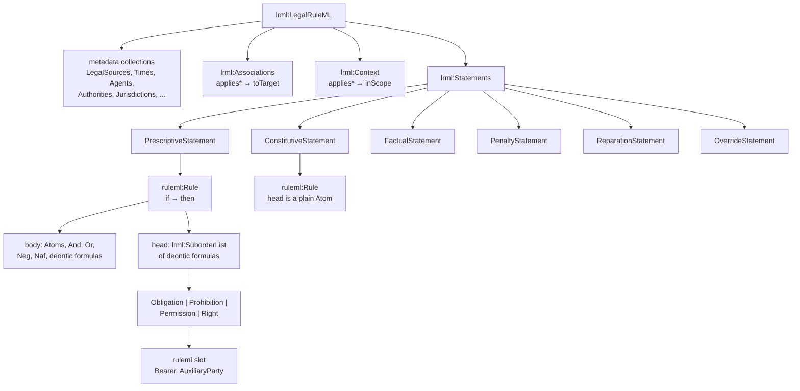
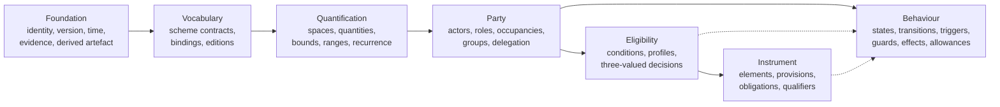
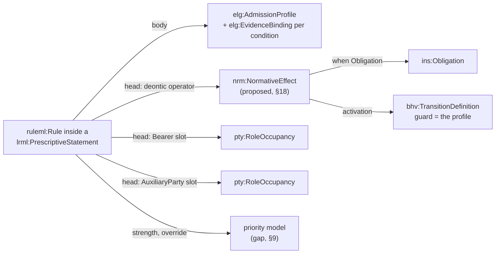
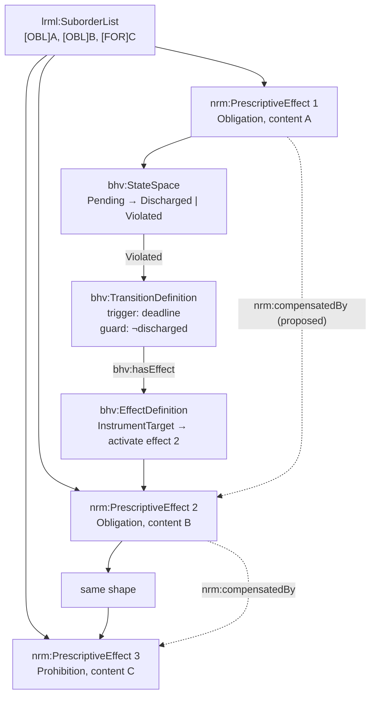
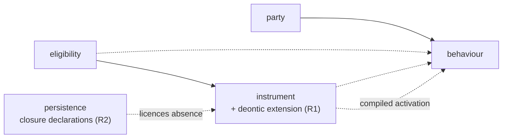

<!-- SPDX-License-Identifier: CC-BY-SA-4.0 -->

# LegalRuleML and LATTICE: An Exhaustive Mapping

Version 0.1, draft for review. Maps every construct of the OASIS LegalRuleML Core Specification
v1.0 onto LATTICE's layers, states where the mapping is native, where it is composed from several
layers, and where LATTICE has no counterpart and a decision is owed. Written against the
[Open CBAA architecture](https://github.com/nebularis/open-cbaa) supplied for review, whose
statement module (`stm:`) already claims that "the prescriptive and constitutive split follows
LegalRuleML" (architecture §4.7) without yet saying what else follows from that claim.

This is a sketch. It becomes an architecture, a design entry in
[solution-design-specification.md](../../architecture/solution-design-specification.md), a set of
ADRs, and a plan. Nothing here is ratified. Where this sketch and an accepted ADR differ, the ADR
takes precedence.

**Companion sketches.** [rule-layers.md](rule-layers.md) and
[rule-layers-cross-check.md](rule-layers-cross-check.md) cover adjacent ground and were written
first. This document is subordinate to the cross-check's findings R1 to R5 and does not reopen
them. §1.4 records what they settle and the three conclusions they correct in this document.

**Source of truth for LegalRuleML:** [LegalRuleML Core Specification Version 1.0, OASIS Standard,
30 August 2021](https://docs.oasis-open.org/legalruleml/legalruleml-core-spec/v1.0/os/legalruleml-core-spec-v1.0-os.html).
Section numbers cited as "LRML §n" refer to that document. The metamodel namespace is
`http://docs.oasis-open.org/legalruleml/ns/mm/v1.0/` (`lrmlmm:`), the language namespace is
`http://docs.oasis-open.org/legalruleml/ns/v1.0/` (`lrml:`), and embedded rules use RuleML
(`ruleml:`, `http://ruleml.org/spec`).

---

## Contents

1. [Why this document exists](#1-why-this-document-exists), including
   [companion sketches and what they settle](#14-companion-sketches-and-what-they-settle)
2. [Method: what "mapping" means here](#2-method-what-mapping-means-here)
3. [The two models side by side](#3-the-two-models-side-by-side)
4. [The central mismatch: rules over facts, versus admissibility over subjects](#4-the-central-mismatch-rules-over-facts-versus-admissibility-over-subjects)
5. [Mapping the statement layer](#5-mapping-the-statement-layer)
6. [Mapping the deontic layer](#6-mapping-the-deontic-layer)
7. [Mapping the rule body: conditions and evidence](#7-mapping-the-rule-body-conditions-and-evidence)
8. [Mapping violation, suborder, penalty and reparation](#8-mapping-violation-suborder-penalty-and-reparation)
9. [Mapping defeasibility, strength and override](#9-mapping-defeasibility-strength-and-override)
10. [Mapping parties: Bearer, AuxiliaryParty, Agent, Figure, Role](#10-mapping-parties-bearer-auxiliaryparty-agent-figure-role)
11. [Mapping temporal characteristics and legal status](#11-mapping-temporal-characteristics-and-legal-status)
12. [Mapping authority, jurisdiction and scope](#12-mapping-authority-jurisdiction-and-scope)
13. [Mapping sources, references and isomorphism](#13-mapping-sources-references-and-isomorphism)
14. [Mapping alternatives and context](#14-mapping-alternatives-and-context)
15. [The complete construct table](#15-the-complete-construct-table)
16. [Semantic reconciliation: three-valued Kleene against defeasible logic](#16-semantic-reconciliation-three-valued-kleene-against-defeasible-logic)
17. [Gaps, each with options](#17-gaps-each-with-options)
18. [Proposed module design](#18-proposed-module-design)
19. [Compilation: LegalRuleML through the shared IR](#19-compilation-legalruleml-through-the-shared-ir)
20. [Interchange profiles and conformance](#20-interchange-profiles-and-conformance)
21. [What LATTICE should not adopt](#21-what-lattice-should-not-adopt)
22. [Worked examples](#22-worked-examples)
23. [Impact on existing decisions](#23-impact-on-existing-decisions)
24. [Proposed ADRs](#24-proposed-adrs)
25. [Open questions](#25-open-questions)
26. [Sketch of the work](#26-sketch-of-the-work)

### Prefixes

| Prefix | Namespace | Source |
|---|---|---|
| `lrml:` | `http://docs.oasis-open.org/legalruleml/ns/v1.0/` | OASIS LegalRuleML language |
| `lrmlmm:` | `http://docs.oasis-open.org/legalruleml/ns/mm/v1.0/` | OASIS LegalRuleML RDFS metamodel |
| `ruleml:` | `http://ruleml.org/spec` | RuleML 1.02, embedded by LegalRuleML |
| `fnd:` | Foundation | LATTICE |
| `voc:` | Vocabulary | LATTICE |
| `qnt:` | Quantification | LATTICE |
| `pty:` | Party | LATTICE |
| `elg:` | Eligibility | LATTICE |
| `ins:` | Instrument | LATTICE |
| `bhv:` | Behaviour | LATTICE |
| `srf:`, `mrk:`, `exe:`, `dal:` | Surface, MORK, Executable, Persistence | LATTICE |
| `nrm:` | **placeholder** for proposed normative terms. Per §18.1 these land in `ins:`, not a new module. The distinct prefix is kept in the analysis below only to mark which terms are proposed rather than existing | this sketch |
| `stm:`, `wim:`, `agr:`, `rsk:` | Open CBAA statement, wording, agreement, risk modules | Open CBAA |

---

## 1. Why this document exists

Three things make the mapping worth doing now.

**Open CBAA already claims the alignment.** Its statement module splits statements into
prescriptive, constitutive and meta "following LegalRuleML", and names five prescriptive kinds
(`stm:Obligation`, `stm:Prohibition`, `stm:Permission`, `stm:Power`, `stm:AuthorityGrant`) and a
meta kind (`stm:Precedence`). That claim is currently a statement about taxonomy only. Nothing in
LATTICE or Open CBAA today carries the semantics LegalRuleML attaches to those names: no
defeasibility, no violation, no compensation chain, no strength, no override relation. A claim of
alignment that does not survive contact with the standard's semantics is a liability at
certification time and a source of misunderstanding for adopters.

**Contract terms are the use case.** Open CBAA's motivating problems are the ones LegalRuleML was
designed for: a binding authority is a normative document, its scope of underwriting authority is
a conditional permission with exceptions, its notice provisions are obligations with deadlines and
consequences, and the market's practice of overriding general wording with specific endorsements
is a defeasible priority relation. LATTICE today models the admissibility half of this well
(Eligibility) and the structural half adequately (Instrument), and has no model of the third half,
the normative half.

**Interchange has value independent of internal modelling.** Even if LATTICE never adopts
defeasible logic internally, being able to import a LegalRuleML document into LATTICE terms, and
to export a LATTICE contract module as LegalRuleML, is worth having. Regulators, market bodies and
academic partners publish in LegalRuleML. A one-way lossy import is cheap. A round trip is not,
and this sketch is largely about establishing which of those is worth paying for.

**What this document deliberately does not do.** It does not pick an answer to the gaps in §17.
Those are architectural decisions and are listed as proposed ADRs in §24.

### 1.4 Companion sketches, and what they settle

Two sketches in this directory cover adjacent ground and were written first. This document sits
beside them and does not restate or override them.

| Sketch | Covers | Relation to this document |
|---|---|---|
| [rule-layers.md](rule-layers.md) | Logical English as a controlled-language route, the LE and OWL semantic gap, stratified Datalog, deontic concepts in insurance, and whether a native evaluation engine is needed | Names LegalRuleML as "a checklist of what a legal rule IR needs" and advises borrowing its concepts rather than its XML. This document is that checklist, worked construct by construct |
| [rule-layers-cross-check.md](rule-layers-cross-check.md) | Cross-checks the above against LATTICE's ADRs and roadmap, producing five additions R1 to R5 with sizes and sequencing | Settles several questions this document would otherwise reopen. Its R1 and R2 are prerequisites for most of what is proposed here |

**Adopted from the cross-check without re-arguing:**

| From | Settled |
|---|---|
| R1 | The deontic gap is real, and its home is a **deontic extension of Instrument**, sized as an ADR plus a MINOR Instrument bump, landing before applied-insurance Phase 5 (A-101). A new layer is justified only if normative state is shown to need its own dependency position |
| R1 | LegalRuleML and ODRL are **coverage checklists, not dependencies**. Adopt neither syntax. Align with ODRL terms where meanings match, so ODRL policies map through MORK |
| R2 | Absence may decide an outcome only under a **closure declaration**: a named fact family with an authoritative source, a scope, and a required persistence profile (dense per-stream ordering, blocking gap audit) |
| R3 | Deadlines fire through **positioned stimuli written to the stimulus log**, never a wall clock, so deadline-driven conclusions replay |
| R4 | Condition composition needs an **acyclicity check**, because profiles compose as a tree and negation makes a cycle ill-founded |
| R5 | Compiled rules should be **renderable as controlled English** for reviewers, as a rendering and never a source |

**Three corrections the cross-check and ADR-A03 force on an earlier draft of this document.** Each
changed a conclusion, so each is recorded rather than silently fixed.

1. **Eligibility profiles nest.** ADR-A03 makes `elg:AdmissionProfile` a subclass of
   `elg:Condition`, so a profile composes into another profile and `(A ∧ B) ∨ C` is expressible.
   An earlier draft asserted the opposite and proposed an ADR to fix a gap that does not exist.
   The real gap is narrower and is R4: nesting exists and is **unchecked for cycles**. §7.3 and
   §17 are corrected.
2. **Negation as failure is not refused outright.** An earlier draft refused `ruleml:Naf` on
   principle. R2 is the better answer: absence may decide where a closure declaration licenses it,
   and stays Undetermined otherwise. §16.3 and §17 G6 are corrected.
3. **R2 is a prerequisite for the deontic work, not a parallel concern.** Without a closure
   declaration, "no notification arrived by the deadline" is permanently Undetermined, so a
   violation can never be derived and every compensation chain in §8 is inert. Law N5 in §18.3
   depends on it. The cross-check states this plainly: "R1 without R2 cannot detect a single
   violation."

---

## 2. Method: what "mapping" means here

Every LegalRuleML construct is placed in exactly one of five buckets. The bucket determines what
work, if any, follows.

| Bucket | Meaning | Consequence |
|---|---|---|
| **N** Native | A LATTICE term already means this, with the same or a stricter semantics | Record the alignment. No new terms |
| **C** Composed | No single LATTICE term means this, but a fixed composition of existing terms does, and the composition is stable enough to name | Add a named pattern to an applied module. No substrate change |
| **A** Applied | LATTICE has the mechanism, and the construct is domain content rather than substrate | Model in `applied/`, never promote |
| **G** Gap | LATTICE has no mechanism, and a substrate change or an explicit refusal is owed | ADR required. Clean-room procedure (ADR-A-C2) applies |
| **X** Excluded | The construct is a serialisation or document-management artefact of LegalRuleML's XML form, with no semantic content to map | Note and move on |

Two rules govern the buckets, both inherited from the repository's standing decisions.

- **Downward-only dependency (ADR-A01).** A mapping that would make Eligibility depend on
  Instrument, or Party depend on Eligibility, is not available, however natural it reads. Several
  of the composed mappings below are shaped by this constraint rather than by legal theory.
- **Restatement boundary (ADR-A-C1) and clean room (ADR-A-C2).** Where applied insurance or
  Open CBAA content motivates a substrate term, the substrate term is designed from the general
  requirement, not lifted from the applied document.

A third rule is specific to this work. **LegalRuleML is a rule interchange language, and LATTICE
is not a rule language.** A construct that exists only to serialise a rule is bucket X or a
compilation target, not an ontology term. §4 develops this.

---

## 3. The two models side by side

### 3.1 LegalRuleML's shape

LegalRuleML wraps RuleML. A document is a `lrml:LegalRuleML` root holding, in a prescribed order
(LRML §5.16): prefixes, then metadata collections (legal sources, references, times, temporal
characteristics, agents, figures, roles, authorities, jurisdictions), then associations, then
statements and contexts.



Four structural facts matter for the mapping.

1. **The unit of meaning is a statement, and a statement wraps a rule template.** Reification is
   pervasive: rules are objects with properties (LRML §4.1 R6).
2. **The head of a prescriptive rule is a suborder list of deontic formulas, not a single
   formula.** This is how compensation chains are expressed (LRML §4.2.3.2).
3. **Metadata is attached indirectly.** `lrml:Association` pairs a property (`appliesAuthority`,
   `appliesTemporalCharacteristics`, `appliesStrength`, `appliesSource`, `appliesModality`) with
   targets. `lrml:Context` applies a set of associations within a scope. Nothing is attached by a
   direct triple on the rule.
4. **Defeasibility is first class.** Every rule has a strength (strict, defeasible, defeater), and
   priority between rules is an explicit `lrml:Override` with `@over` and `@under`.

### 3.2 LATTICE's shape

LATTICE is a layered ontology substrate with a downward-only dependency chain, plus cross-cutting
compilation and persistence modules.



Four structural facts matter here too.

1. **Decisions are three-valued and defined by law, not by logic programme.** Eligibility's L1 to
   L16 fix what Permitted, Denied and Undetermined mean under each match strategy and each
   combination operation.
2. **Conditions read domain data by path (ADR-A91), not by predicate application.** An
   `elg:EvidenceBinding` names a subject class and an ordered list of property steps.
3. **Behaviour is where things happen over time.** Triggers, transitions, guards, effects and
   allowance accounts. Eligibility decides, Behaviour acts.
4. **Compilation is optional and derived (ADR-A24, ADR-A89).** The declarative graph is always
   evaluable. SPARQL, SHACL, SWRL, OWL and Surface forms are `fnd:DerivedArtefact`s that must agree
   with it.

### 3.3 The overlap, stated plainly

| Concern | LegalRuleML | LATTICE |
|---|---|---|
| what a norm applies to | rule body, arbitrary n-ary atoms over variables | `elg:AdmissionProfile` over one subject, read by evidence path |
| what a norm does | deontic operator in the rule head | `ins:Obligation`, or nothing (no permission, prohibition or power term) |
| who it binds | `lrml:Bearer` slot | `ins:obligor` → `pty:RoleOccupancy` |
| who benefits | `lrml:AuxiliaryParty` slot | `ins:obligee` → `pty:RoleOccupancy` |
| when it is in force | `lrml:TemporalCharacteristic` with legal status | `fnd:TemporalScope` on a `fnd:Version` |
| what it came from | `lrml:LegalSource` plus `lrml:Association` | `prov:wasDerivedFrom`, Open CBAA `stm:expressedBy` |
| conflict between norms | `lrml:Override`, strength, suborder list | **nothing** |
| consequence of breach | `lrml:Violation`, `PenaltyStatement`, `Reparation` | **nothing** (Behaviour can express it, nothing names it) |
| competing interpretations | `lrml:Alternatives`, `lrml:Context` | **nothing** |

The last three rows are the substance of this document.

---

## 4. The central mismatch: rules over facts, versus admissibility over subjects

This section is the hinge. Everything downstream depends on getting it right.

### 4.1 The shapes differ

A LegalRuleML prescriptive rule is a conditional over a set of atoms with shared variables:

```text
Person(x), ¬HasLicence(x)  =>  [FORB] EngageCreditActivity(x)
```

The body is a conjunction of n-ary predicates. Variables bind across atoms. The head applies a
deontic operator to a predicate, with Bearer and AuxiliaryParty as labelled slots.

A LATTICE admission profile is a set of conditions over one subject, each condition reading one
candidate value by a path:

```text
AdmissionProfile (AllRequired)
  Condition: riskLocation ∈ Within(France) \ Within(Corsica)     [HierarchicalMatch]
  Condition: sumInsured ∈ (−∞, 5,000,000] GBP                    [IntervalContainment]
  Condition: contractType ∈ {Insurance}                          [SetMembership]
```

There is no variable binding across conditions. Each condition is anchored to the same subject and
reads a value by an `elg:EvidenceBinding` path. A profile is closer to a description-logic class
expression than to a Horn clause. This is deliberate and is what makes the OWL backend (ADR-A90)
and the Surface envelope table possible at all.

### 4.2 What LATTICE can express, and what it cannot

| LegalRuleML body form | LATTICE equivalent | Notes |
|---|---|---|
| unary predicate over the subject | condition over a path of length 0 or more | native |
| conjunction of unary predicates | `elg:AllRequired` profile | native |
| disjunction of unary predicates | `elg:AnySufficient` profile | native |
| classical negation of a unary predicate | `elg:negated true` (ADR-A103, L16) | native, but see §17 G6 |
| negation as failure (`ruleml:Naf`) | **no equivalent** | LATTICE returns Undetermined on absence, never "false by absence" |
| binary predicate relating subject to a reachable value | condition with a multi-step evidence binding | native where the second argument is reachable from the subject by a path |
| binary predicate relating two independently quantified individuals | **no equivalent** | the profile has one subject |
| n-ary predicate, n ≥ 3 | **no equivalent** | no join |
| existential over an unreachable individual | **no equivalent** | evidence paths are functional traversals from the subject |
| arithmetic in the body (`ruleml:Expr`, `ruleml:Fun`) | `qnt:` comparison against a declared range only | no general computation. Projection to MORK (`srf:ProjectionContract`) is the escape hatch |

The honest summary: **LATTICE Eligibility covers the tree-shaped, single-subject fragment of
LegalRuleML rule bodies, and nothing beyond it.** In practice, the great majority of contract-term
conditions are in that fragment: "risks located in France, excluding Corsica, with sum insured at
or below five million pounds" is three single-subject conditions. The fragment fails on genuine
joins: "the Coverholder must not bind a risk where the same insured already holds a policy with an
aggregate exceeding the limit" relates two individuals and needs a projection.

This is not a defect to be fixed by widening Eligibility. Widening it to arbitrary joins would
destroy the OWL backend, the Surface table and the determinism guarantees. The correct response is
to declare the fragment, refuse what falls outside it with a named diagnostic, and route the
remainder to MORK projection. That refusal needs an ADR (§24, proposed A-110).

### 4.3 The consequence for the mapping

A LegalRuleML rule does not map to a LATTICE term. It maps to a **composition**:



The profile is the body. The deontic effect is the head. Behaviour turns the pair into something
that happens. That triad, **profile / effect / activation**, is the recurring pattern of this
whole mapping, and §18 proposes naming it.

---

## 5. Mapping the statement layer

### 5.1 `lrml:PrescriptiveStatement`

**Bucket: C (composed), becoming N if the proposed `nrm:` module is accepted.**

A prescriptive statement is a reified rule whose head carries deontic force. The composition is:

| Part | LATTICE |
|---|---|
| the statement's identity and versioning | `fnd:PersistentIdentity` + `fnd:Version` |
| the statement's governance state | `fnd:Governable` |
| the rule body | `elg:AdmissionProfile` with `elg:EvidenceBinding` per condition |
| the rule head | proposed `nrm:PrescriptiveEffect` (§18), one per suborder position |
| the bearer | `pty:RoleOccupancy` via the effect |
| the source text | `prov:wasDerivedFrom`, or Open CBAA `stm:expressedBy` to a `wim:` node |
| the structural home | `ins:Provision` |

Open CBAA's `stm:PrescriptiveStatement` already occupies this slot at the applied level. The
question this sketch raises is whether the substrate should carry the concept at all, or whether
every adopter restates it. §18 argues for a thin substrate module and gives the reasons.

Note one asymmetry that matters at import time. LegalRuleML permits deontic formulas **in the
body** of both prescriptive and constitutive rules (LRML §4.2.2): "if it is obligatory that X, then
...". LATTICE has no way to make an admission condition read the deontic status of another norm,
because Eligibility sits below Instrument and cannot see obligations. A body containing a deontic
formula is therefore out of the importable fragment. It is a real pattern in law ("where a person
is under a duty to notify, they must also ..."), so this is a genuine limitation and belongs in
the refusal ADR.

### 5.2 `lrml:ConstitutiveStatement`

**Bucket: C, and partly N.**

Constitutive rules define concepts and institutional facts. Their head is a plain atom, never a
deontic formula. LATTICE has three existing mechanisms that between them cover most of what
constitutive rules do, and they are not interchangeable.

| Constitutive pattern | LATTICE mechanism | Layer |
|---|---|---|
| "X counts as Y in context C" where Y is a classification | `skos:broader` / `skos:exactMatch` inside a `voc:ConceptScheme`, bound by a `voc:SchemeContract` | Vocabulary |
| "X counts as Y" where Y is a class with its own properties | `owl:equivalentClass` or a `srf:IndexContract` minting a class per value | Surface |
| "the value of P on X is derived from a path" | `srf:PromotionContract` (restate a reachable value as a direct assertion) | Surface |
| "Y is computed from X" | `srf:ProjectionContract` lowering to a MORK mapping | Surface / MORK |
| "a reviewed correspondence between two schemes" | crosswalk as `fnd:DerivedArtefact` (ADR-A100) | Vocabulary + Foundation |

Open CBAA's `stm:Definition` and `stm:Classification` split along the first two rows. That split
is sound and should be kept.

The important observation: **LATTICE's constitutive machinery is stronger than LegalRuleML's**,
because it carries provenance (`fnd:DerivedArtefact`, read sets, input hashes) and staleness
detection, where LegalRuleML carries only the rule. An export to LegalRuleML loses the read set.

### 5.3 `lrml:FactualStatement`

**Bucket: N.**

An expression of fact. In LATTICE this is ordinary A-Box data, optionally carrying
`fnd:Evidence` with `fnd:recordedAt` and `fnd:assertedBy` (aligned to `prov:wasAttributedTo`).
LegalRuleML has no evidence model beyond the statement itself, so this is another place where
the LATTICE side is richer and export is lossy.

### 5.4 `lrml:PenaltyStatement`

**Bucket: G.** See §8.

### 5.5 `lrml:ReparationStatement` and `lrml:Reparation`

**Bucket: G.** See §8.

### 5.6 `lrml:OverrideStatement` and `lrml:Override`

**Bucket: G.** See §9.

### 5.7 `lrml:Statements`, `lrml:hasStatement`, `lrml:hasTemplate`

**Bucket: X.** Collection and striping machinery of the XML serialisation. `lrml:hasTemplate` is
the edge from a statement to its rule template, and disappears in the compact serialisation. In
RDF these become `rdf:List` membership. LATTICE models collections by named properties with SHACL
cardinality, and has no reason to import the list structure.

One caveat: `lrml:hasTemplate` is semantically load-bearing in one respect. A statement's template
can be **referenced** by `@keyref` from another statement, which then inherits and modifies it
(`lrmlmm:mergerOf`, LRML §5.12). That is a template-instantiation mechanism, and it corresponds
closely to Open CBAA's `stm:StatementTemplate` / `stm:BoundStatement` pair, where a template on a
library wording is bound many times into agreements. The correspondence is worth recording, since
it means Open CBAA's binding model has a standard analogue.

---

## 6. Mapping the deontic layer

This is where the gap is widest and the decisions are most consequential.

### 6.1 What LegalRuleML means by the four operators

From LRML §3.4 and §4.2.3, with the definitions quoted in substance:

| Operator | Definition | Violated when |
|---|---|---|
| `lrml:Obligation` | a state, act or course of action to which a Bearer is legally bound, and which, if not achieved or performed, results in a Violation | the content does not hold |
| `lrml:Prohibition` | a state, act or course of action to which a Bearer is legally bound, and which, if achieved or performed, results in a Violation | the content holds |
| `lrml:Permission` | a state, act or course of action where the Bearer has no Obligation or Prohibition to the contrary | never. A permission cannot be violated |
| `lrml:Right` | a Permission to the Bearer that implies Obligations or Prohibitions on the AuxiliaryParty such that the Bearer can exercise it | not directly. Its implied duties can be |

Two refinements the standard names but does not fix:

- **Weak versus strong permission.** Weak permission is the absence of a contrary obligation or
  prohibition. Strong permission is an explicit derogation. LegalRuleML is neutral and expects the
  distinction to be carried by the `@iri` on the deontic node or by `lrml:appliesModality`.
- **Achievement versus maintenance obligation.** Whether the content must hold once during the
  obligation's life, or at every instant. Again neutral, again carried by `@iri`.

The neutrality is important. It means a conforming LegalRuleML consumer is expected to resolve
deontic subtype from an external ontology IRI. LATTICE is entitled to be that ontology.

### 6.2 What LATTICE has today

`ins:Obligation` and nothing else. It is a `fnd:Version`-bearing `ins:Element` with one or more
`ins:obligor` and `ins:obligee` role occupancies, optional `ins:fulfilledBy` naming a
participation group, and an optional `ins:hasCondition` pointing at an `elg:Condition`.

There is no prohibition, no permission, no right, no power, no violation and no compliance. There
is also no statement anywhere that `ins:Obligation` carries deontic semantics at all. Reading the
Instrument README, `ins:Obligation` is a **structural** term: an element of a governing document
that happens to be called an obligation. Whether it is intended to mean `[OBL]` in the deontic
sense is undecided, and deciding it is the first ADR this sketch requires.

### 6.3 The mapping, four options

**Option 1: deontic operators are applied content.** LATTICE keeps `ins:Obligation` structural.
Prohibition, permission, right and power are modelled in `applied/` by each domain that needs them.
Open CBAA's `stm:` hierarchy is the reference example.

- For: no substrate change, no commitment to a deontic logic, smallest surface.
- Against: every adopter re-invents it and they will diverge. The compilers cannot help, because
  they do not know what an applied `stm:Prohibition` means. Interchange with LegalRuleML has to be
  written once per adopter. Open CBAA's claim of LegalRuleML alignment stays unverifiable.

**Option 2: a thin normative substrate module (`nrm:`) between Instrument and Behaviour.** Declare
the four operators, the bearer and auxiliary-party links, violation and compliance as recordable
occurrences, and nothing about how conflicts resolve.

- For: names the concepts once, lets compilers reason about them, makes interchange a substrate
  concern, and leaves defeasibility open.
- Against: a new layer in a dependency chain that ADR-A01 fixes. Needs a position in the chain,
  and the natural position (above Instrument, below or beside Behaviour) has to be argued.

**Option 3: extend Instrument in place.** Add `ins:Prohibition`, `ins:Permission`, `ins:Right`
alongside `ins:Obligation`, all as `ins:Element` subclasses.

- For: no new layer, smallest diff, keeps the "governing document" framing.
- Against: conflates structural and normative readings of the same class tree. An `ins:Element` is
  a part of a document. A prohibition is a modality, and the same document element can carry
  several. Making them siblings forces one element per modality, which the suborder list
  immediately breaks.

**Option 4: deontic modality as a qualifier.** Keep `ins:Obligation` structural, and add a
`nrm:DeonticSpecification` that `ins:Qualifier` specialises, so an element carries its modality by
qualification rather than by class.

- For: matches LegalRuleML's own shape, where the deontic operator wraps a formula rather than
  being the formula's type. Allows one element to carry several modalities, which is what a
  suborder list needs. Reuses `ins:Qualifier`, which the
  [term parameters sketch](term-parameters.md) already leans on.
- Against: indirection. "Is this clause a prohibition?" becomes a two-hop query.

**This sketch's hypothesis, offered for challenge:** Option 4 composed with Option 2. Declare a
small `nrm:` module holding `nrm:DeonticSpecification` and its four subtypes plus violation and
compliance, and let `ins:Qualifier` be the attachment point so that nothing in Instrument's class
tree changes. The reason to prefer it is the suborder list (§8): any design that makes modality
the class of the element cannot express "obligation A, and on its violation obligation B" without
inventing a second element that has no counterpart in the source document, which breaks
isomorphism (LRML §4.1 R4), which is one of the few things LegalRuleML insists on.

**Resolution.** The cross-check's R1 settles the module question in favour of Instrument, so the
surviving combination is **Option 4 inside Instrument**: modality attaches through
`ins:Qualifier`, and no new layer is created. See §18.1. Options 1, 2 and 3 are kept above because
the reasoning against each is what justifies the choice, not because any remains open.

### 6.4 The permission problem

Permission deserves separate treatment, because LATTICE already has something that looks like it
and is not.

`elg:Permitted` is a **decision value**. It says a subject satisfies an admission profile. It is
epistemic and evaluative.

`lrml:Permission` is a **deontic modality**. It says no contrary duty exists.

These are different. A risk can be `elg:Permitted` under a grant's scope profile while the
Coverholder has no `lrml:Permission` to bind it, because a separate suspension provision is in
force. Conflating them would be a category error, and the naming similarity makes the error easy.
Any `nrm:` module must avoid reusing the local name `Permitted` or `Permission` without a
disambiguating note in both directions. This belongs in the glossary.

There is a related and subtler point. LegalRuleML's weak permission is defined by **absence** of a
contrary norm. LATTICE refuses to reason from absence: that is the whole content of Undetermined
and of the SWRL backend's restriction to positive facts (ADR-A24). A LATTICE model can therefore
represent strong permission (an explicit derogation, which is a positive statement) and cannot
represent weak permission except as "no norm was found, which is not the same as permitted". That
limitation is defensible and should be stated, not hidden.

### 6.5 Power

Open CBAA has `stm:Power`, and LegalRuleML v1.0 has no counterpart. Power is Hohfeldian: the
ability to change another party's normative position. LegalRuleML's deontic set (obligation,
permission, prohibition, right) does not include it, and the specification's neutrality mechanism
(`@iri` on the deontic node) is the intended extension point.

For LATTICE, a power is close to `bhv:TransitionDefinition` with a guard: an actor in a role, when
conditions hold, may cause a transition that changes an obligation or fills an occupancy. That is
a genuinely native mapping and worth recording, because it means Open CBAA's `stm:Power` and
`stm:AuthorityGrant` are both **behavioural** rather than deontic in LATTICE terms, and their
compilation target is Behaviour, not the proposed `nrm:` module.

---

## 7. Mapping the rule body: conditions and evidence

### 7.1 RuleML logical structure

| RuleML construct | LATTICE | Bucket |
|---|---|---|
| `ruleml:Rule` with `if` / `then` | `elg:AdmissionProfile` as body, effect as head | C |
| `ruleml:Atom` | `elg:Condition` + `elg:EvidenceBinding`, where the atom is unary or path-shaped | C |
| `ruleml:Rel` | the `elg:stepProperty` at the end of the path, or the `elg:subjectClass` | C |
| `ruleml:Var` | no counterpart. The subject is implicit, other variables are unsupported | G |
| `ruleml:Ind` | `skos:Concept` in `elg:requiredConcept`, or a `qnt:Value` | N |
| `ruleml:Data` | typed literal read on a `qnt:ValueSpace` via `elg:readOnSpace` | N |
| `ruleml:And` | `elg:AllRequired` | N |
| `ruleml:Or` | `elg:AnySufficient` | N |
| `ruleml:Neg` (classical) | `elg:negated true` (L16) | N |
| `ruleml:Naf` (negation as failure) | no counterpart, and deliberately so | G, likely refused |
| `ruleml:Expr` / `ruleml:Fun` | `srf:ProjectionContract` to MORK, or refusal | A |
| `ruleml:slot` | named parameter. Open CBAA's `stm:ParameterBinding` | A |
| `closure="universal"` | implicit. Profiles are universally quantified over their subject class | X |

### 7.2 Evidence binding is the honest counterpart of an atom

ADR-A91's evidence binding is the closest LATTICE analogue to atom application, and the
correspondence is worth setting out precisely, because it is the most reusable part of the mapping.

A LegalRuleML atom `riskLocation(x, l)` with `x` the subject and `l` compared against a constant
becomes:

```turtle
ex:locationBinding a elg:EvidenceBinding ;
    elg:bindsCondition ex:locationCondition ;
    elg:subjectClass    rsk:Risk ;
    elg:evidenceStep    [ elg:stepIndex 0 ;
                          elg:stepProperty rsk:riskLocation ;
                          elg:stepDirection elg:Forward ] ;
    elg:singleValued    true .
```

A two-place atom whose second argument is reached through an intermediate, `contractType(policyOf(x), t)`,
becomes a two-step path with `elg:stepIndex` 0 and 1. This covers the "read it in two steps, the
risk's policy and then its contract type" pattern in the Open CBAA architecture (§4.12).

The `elg:valueReading` values (ADR-A103) supply quantification that RuleML expresses with explicit
variables:

| Reading | Meaning | RuleML analogue |
|---|---|---|
| `elg:SingleValue` | exactly one value, else Undetermined | functional property, implicit |
| `elg:SomeValue` | Permitted if any value is, Denied if all are (strong Kleene OR) | `∃l . riskLocation(x,l) ∧ φ(l)` |
| `elg:EveryValue` | Denied if any value is, Permitted if all are (strong Kleene AND) | `∀l . riskLocation(x,l) → φ(l)` |

This is a real and useful alignment: set readings are bounded existential and universal
quantification over a path's value set, and they are exactly the quantifiers a tree-shaped fragment
can afford.

### 7.3 Where the fragment ends, precisely

A LegalRuleML rule body is importable into an `elg:AdmissionProfile` when all of the following hold.

1. Every atom mentions the rule's single distinguished subject variable.
2. Every other argument of every atom is either a constant, or a variable that appears in exactly
   one other atom in a chain rooted at the subject (a path, not a join).
3. No atom applies a deontic operator.
4. No `ruleml:Naf` appears.
5. No `ruleml:Expr` appears outside a comparison against a declared `qnt:Range`.
6. The connective structure maps onto nested profiles, each level carrying one
   `elg:compatibilityOperation`, and the nesting is acyclic.

Condition 6 needs care, and an earlier draft of this document got it wrong. **Eligibility profiles
nest.** ADR-A03 makes `elg:AdmissionProfile` a subclass of `elg:Condition`, and `elg:hasCondition`
ranges over `elg:Condition`, so a profile is a condition of another profile:

```turtle
elg:AdmissionProfile a owl:Class ;
    rdfs:subClassOf elg:Condition, fnd:Version,
        [ a owl:Restriction ; owl:onProperty elg:hasCondition ;
          owl:minCardinality "1"^^xsd:nonNegativeInteger ] .
```

ADR-A03's stated reason is that a profile "can be reasoned over as a condition itself, which keeps
composition uniform". So `(A ∧ B) ∨ C` is an `AnySufficient` profile over an `AllRequired`
sub-profile and a bare condition. There is no expressivity gap here.

The gap is narrower and is the cross-check's **R4**: nothing checks that composition is acyclic.
With negation (ADR-A103) a cycle through `elg:hasCondition` has no well-founded outcome, and the
absence of one today holds only because no fixture builds one. Hierarchical match already carries
an analogous rule for scheme ordering (`elg:HierarchyWellFoundednessShape`, discharging elg:L9),
so the shape follows an existing pattern. R4 is adopted here, not re-proposed.

---

## 8. Mapping violation, suborder, penalty and reparation

### 8.1 What the standard says

`lrml:SuborderList` is a sequence of deontic formulas. An element holds only when every element
before it has been violated (LRML §3.4, §4.2.3.2). Written out:

```text
[OBL]A, [OBL]B, [FOR]C, [PER]D
```

means: A is obligatory. If A is violated, B becomes obligatory. If B is violated, C becomes
prohibited. If C is violated, D is permitted. Permissions and rights cannot be violated, so any
element after a permission never holds, and a well-formed list does not place obligations or
prohibitions after them.

`lrml:PenaltyStatement` holds a suborder list representing a sanction.
`lrml:Reparation` links a penalty statement to the prescriptive statement it compensates, through
`lrml:appliesPenalty` and `lrml:toPrescriptiveStatement`. This indirection exists so that one
penalty clause can compensate many norms, and so that penalties can be versioned separately from
the norms they attach to. The specification's own example is US Code §504, where statutory damage
amounts changed three times while the prohibition did not.

This is contrary-to-duty reasoning, and it is the single most characteristically legal thing in
the standard.

### 8.2 LATTICE has the parts and not the assembly

Every ingredient exists.

| Ingredient | LATTICE term |
|---|---|
| the primary duty | `ins:Obligation` |
| the condition under which it is discharged | `elg:AdmissionProfile` |
| the observation that it was not | `bhv:Stimulus`, or a `bhv:DerivedTrigger` on a deadline |
| the state of being in breach | `bhv:State` and `bhv:StateOccupancy` |
| the transition from compliant to breached | `bhv:TransitionDefinition` with `bhv:ScheduledTrigger` |
| the consequence taking effect | `bhv:EffectDefinition` with `bhv:InstrumentTarget`, creating or activating the secondary duty |
| an amount owed | `qnt:Range` or `qnt:RangeSet` on a `qnt:ValueSpace` |
| a cap consumed over a period | `bhv:AllowanceDefinition` and `bhv:AllowanceAccount` |
| ordering between competing transitions | `bhv:priority` with `bhv:PriorityOrdered` |

The Open CBAA architecture's own worked example (§7.5) builds exactly this by hand: an FNOL arrives,
an obligation is instantiated with a one-business-day deadline, a scheduler fires, and a breach
occurrence is recorded with the obligation's state moving to overdue.

What is missing is a **name for the pattern** and the guarantee that goes with it. Today an adopter
wires a compensation chain out of behaviour primitives, and nothing checks that the chain has
suborder-list semantics: that the second duty activates only on violation of the first, that
violation is defined against the first duty's own content, that a permission terminates the chain,
and that the chain cannot loop.

### 8.3 The composed mapping



The proposal is a `nrm:compensatedBy` chain that is **declarative and ordered**, from which the
Behaviour wiring is compiled rather than hand-built. That gives three things hand-building does not:
the chain is checkable (acyclicity, permission-terminates-the-chain, at most one successor), the
chain is exportable to a `lrml:SuborderList` losslessly, and the chain is one object for the
reviewer to read rather than six.

### 8.4 Violation and compliance

`lrml:Violation` and `lrml:Compliance` are indications, not statements, in LegalRuleML. In LATTICE
they are naturally **occurrences**: `bhv:Stimulus` subtypes, or better, first-class records
carrying `fnd:Evidenced` so that the finding of a breach has evidence and an asserting agent.

The design question is whether violation is derived or asserted. Both are needed. A deadline breach
is derived (`bhv:DerivedTrigger` over a scheduled time and an absent discharge record). A finding
of breach by an adjudicator is asserted, and carries evidence. A model that supports only the first
cannot record a dispute, and disputes are the reason contracts exist.

This argues for `nrm:Violation` as a `fnd:Evidenced` record with a `nrm:violates` link to the
effect and an optional `prov:wasDerivedFrom` to the compiled artefact that derived it. Where it is
asserted, the evidence carries `fnd:assertedBy`.

---

## 9. Mapping defeasibility, strength and override

### 9.1 What the standard requires

Three rule strengths (LRML §4.2.1), from the body-head relationship:

| Strength | Notation | Reading |
|---|---|---|
| `lrml:StrictStrength` | `body -> head` | whenever the body holds, the head holds, indisputably |
| `lrml:DefeasibleStrength` | `body => head` | typically the head holds, unless there is reason to conclude otherwise |
| `lrml:Defeater` | `body ~> head` | cannot establish the head, but blocks the opposite conclusion |

Priority is an explicit binary relation: `<lrml:Override over="#cs2" under="#cs1"/>` states that
`cs2` beats `cs1`. Strength may be attached globally (`lrml:hasStrength` on the rule) or locally to
a context (`lrml:appliesStrength` inside a `lrml:Context`), and the difference is meaningful: the
first holds in all contexts, the second only in that one.

Defeasible reasoning is sceptical. Two rules concluding opposite heads, with no priority between
them, yield **neither** conclusion rather than a contradiction.

### 9.2 LATTICE has nothing, and one thing that looks like it

There is no strength, no priority between conditions or profiles, and no notion that one norm beats
another. Eligibility's L10 (exclusion precedence: an excluded concept gives Denied regardless of a
matching required concept) is the only precedence rule in the substrate, and it is precedence
**within** a condition, not between norms.

`bhv:priority` with `bhv:PriorityOrdered` selection is precedence between transitions, which is
close in spirit but operates on behaviour rather than on norms, and has no defeasible semantics: it
picks one transition, it does not withdraw a conclusion.

### 9.3 The striking observation

**Eligibility's sceptical treatment of conflict already matches defeasible logic's.**

Under `elg:AllRequired`, one Denied gives Denied, and one Undetermined with no Denied gives
Undetermined. Under `elg:AnySufficient`, one Permitted gives Permitted, all Denied gives Denied,
and anything else gives Undetermined. That "anything else gives Undetermined" is precisely
scepticism: in the face of conflict, conclude nothing rather than conclude both.

Strong Kleene three-valued logic and sceptical defeasible logic are not the same formalism, and it
would be wrong to claim they are. But they agree on the behaviour that matters here: conflict
produces abstention, not explosion. That agreement is the foundation on which a priority model
could be built without abandoning LATTICE's semantics, and it is the most encouraging finding in
this analysis.

**And the priority model is stratified, given the closure.** The
[logic encodings note](../notes/logic-encodings.md) shows that if the override closure is
precomputed, as §19.2's `PriorityPlan` already proposes, sceptical priority is expressible without
leaving stratified Datalog:

```prolog
blocked(N, X)     :- overrides(M, N), opposes(M, N), not inactive(M, X).
applies(N, X)     :- activated(N, X), not blocked(N, X).
conflict(N, M, X) :- applies(N, X), applies(M, X), opposes(N, M).
```

Every negation is over a **derived** predicate in a lower stratum, which §16.5's rule makes sound
without a closure licence. `conflict` yields N7's `exe:IncomparablePriority` directly.

The `not inactive` rather than `activated` choice carries a semantic decision that should be a law
rather than an accident: **when it is uncertain whether a superior norm applies, the inferior is
withheld rather than applied.** That is the sceptical reading and it is the conservative one, but it
is a choice, and A-107 should state it. It is listed as a decision in the
[research sketch](logic-encoding-research.md), D4.

One caveat worth carrying: this holds for the **explicit-superiority** subset, which is §9.4's
Option B. Full defeasible logic with team defeat, defeaters and ambiguity propagation has known
translations into logic programs, and those are not always stratified. Staying inside the explicit
form is what keeps the result.

### 9.4 Four options for priority

**Option A: refuse.** LATTICE does not model defeasibility. Conflicting norms produce Undetermined,
and resolution is the adopter's problem, handled outside the graph.

- For: no change, no new semantics, no risk of getting a hard formalism subtly wrong.
- Against: makes most real contract analysis impossible. "The specific endorsement overrides the
  general wording" is the most common legal move there is. An Undetermined here is not a useful
  referral, it is a failure to model.

**Option B: priority as an explicit, acyclic, partial order between norms.** A `nrm:Overrides`
relation, asymmetric and irreflexive, checked acyclic by SHACL, with a compiler that resolves
conflicts by transitive closure and leaves incomparable conflicts Undetermined.

- For: matches `lrml:Override` one for one, so interchange is lossless in both directions. The
  acyclicity check is the same shape as the scheme well-foundedness check Eligibility already runs
  (ADR-A100). Incomparable conflict falling to Undetermined preserves the existing law.
- Against: resolving priority at evaluation time changes the compilation story. A SPARQL backend
  can do it. The OWL design-time backend (ADR-A90) probably cannot, because subsumption has no
  notion of one axiom beating another. That means the design-time checks (did authority expand,
  do two grants overlap) would answer questions about the un-defeated reading only, and that
  limitation would need to be stated and diagnosed rather than silently wrong.

**Option C: priority by specificity, computed rather than declared.** Derive precedence from
subsumption between profiles: the more specific profile wins (*lex specialis*).

- For: nothing to author, and it matches one real legal principle.
- Against: the AI-and-law literature is explicit that specificity is often the wrong principle
  (LRML §4.2.1 cites Prakken and Sartor on exactly this: a specific local regulation does not
  override a general constitutional norm). Computing subsumption between profiles needs the
  reasoner on the evaluation path, which ADR-A83 forbids. This option should be recorded and
  declined.

**Option D: strength without priority.** Adopt `strict` / `defeasible` / `defeater` as an
annotation on norms, and use it only to decide whether a conclusion may be withdrawn, with all
conflicts falling to Undetermined.

- For: cheap, and captures the useful part (this norm is a default, that one is not).
- Against: a defeater with no priority relation does almost nothing, since its whole purpose is to
  block a specific opposing conclusion.

**This sketch's hypothesis:** Option B, with the design-time backend limitation stated as a
declared non-capability rather than worked around. Option D is a subset of B and can ship first if
the work needs splitting.

### 9.5 The interaction that must not be missed

If priority is adopted, **every existing compiled artefact's semantics changes**, because a
decision now depends on which other norms exist and how they rank. The read set of a compiled
artefact would have to include the priority graph, and any change to priority would invalidate
every artefact downstream. ADR-A92's derived-artefact contract already has the machinery
(read sets, input hashes, staleness), but the blast radius grows sharply. This is an argument for
compiling priority resolution into a separate, small artefact that the decision query consults,
rather than folding it into every profile's compiled form.

---

## 10. Mapping parties: Bearer, AuxiliaryParty, Agent, Figure, Role

This is the best-aligned area of the whole mapping, and needs the least work.

| LegalRuleML | LATTICE | Bucket | Note |
|---|---|---|---|
| `lrml:Bearer` | `pty:RoleOccupancy`, reached from the effect. `pty:Obligor` is the vocab role | N | LegalRuleML's Bearer is a slot on the deontic formula, LATTICE's is a link from the obligation. Same content |
| `lrml:AuxiliaryParty` | `pty:RoleOccupancy`, `pty:Obligee` | N | |
| `lrml:Agent` | `pty:Actor` | N | `lrml:hasType` on an Agent (Person, database, bot) becomes a subclass of `pty:Actor` or a concept in a bound scheme |
| `lrml:Figure` | `pty:RoleOccupancy` where the role is a function rather than a contractual capacity | N | LegalRuleML's Figure is "an instantiation of a function by an Actor", which is exactly a reified occupancy. The example (Obama as chief executive rather than commander-in-chief) is an occupancy distinction |
| `lrml:Role` with `lrml:filledBy` and `lrml:forExpression` | authorship metadata. `prov:wasAttributedTo` via `fnd:Evidence`, or `fnd:DerivationRun` | N | Careful: `lrml:Role` is **authorial** (who wrote this rule), not contractual. It is not `pty:Role`. This false friend must be flagged in the glossary |
| `lrml:Actor` (Agent or Figure) | `pty:Actor` or `pty:RoleOccupancy` | N | |
| `lrml:hasActor`, `lrml:hasFunction` | `pty:occupiedBy`, `pty:inRole` | N | |

### 10.1 What LATTICE adds

Party carries four things LegalRuleML has no way to express, and an export loses all of them.

- **Temporal scope on occupancy.** `pty:RoleOccupancy` is `fnd:TemporallyScoped`. A bearer who was
  the bearer only from March is expressible in LATTICE and not in LegalRuleML's deontic slots.
- **Contingent occupancy.** `pty:inRole` required, `pty:occupiedBy` optional, so a role designed
  into a contract and not yet filled is a first-class object. This is how Open CBAA handles a
  claimant unknown at binding (ADR-A102).
- **Shares and composition.** `pty:ParticipationGroup` with `pty:SeveralOnly` or
  `pty:JointAndSeveral`, and `pty:share` per membership. Several liability across a subscription
  market has no LegalRuleML form at all. `ins:fulfilledBy` pointing at a group is how a duty owed
  by a syndicate is expressed.
- **Delegation.** `pty:Delegation` from an accountable occupancy to a performing one. LegalRuleML
  would have to model this as two norms and a constitutive rule.

### 10.2 Liability direction

ADR-A102 derives liability direction (harmed, liable, claimant, payee) from party roles rather than
asserting it, and treats the direction as a derived artefact. LegalRuleML asserts direction through
Bearer and AuxiliaryParty slots. The LATTICE approach is stronger and the export must materialise
the derivation into slots, recording in provenance that it did so.

---

## 11. Mapping temporal characteristics and legal status

### 11.1 The standard's model

`lrml:TemporalCharacteristic` is a triple of a legal status, a status development and a time
(LRML §4.3.5):

```xml
<lrml:TemporalCharacteristic key="nev1">
  <lrml:forStatus iri=".../vocab#Efficacious"/>
  <lrml:hasStatusDevelopment iri=".../vocab#Starts"/>
  <lrml:atTime keyref="#t1"/>
</lrml:TemporalCharacteristic>
```

Three axes are called out as the main ones: when a norm comes into force, when it has efficacy, and
when it applies. They differ. A tax provision enacted in December, in force from January and
applying to the previous year's income has three different dates, and the specification is explicit
that these must not be collapsed.

### 11.2 LATTICE's model and the mismatch

`fnd:TemporalScope` has `fnd:validFrom` and optional `fnd:validTo`, and a `fnd:TemporallyScoped`
thing has exactly one. **One interval, one axis.**

Open CBAA's architecture already records that one axis is not enough (§5.4): it names transaction
time, valid time, agreed date and operational date, and notes that an amendment can take effect
retrospectively. It handles this at the applied level by putting extra date properties on
agreement versions and amendments.

So both LegalRuleML and the reference consumer independently concluded that norms need
multi-axis time, and the LATTICE substrate provides one axis. That convergence is evidence, and it
is the second-strongest finding in this analysis after the defeasibility gap.

### 11.3 Options

**Option A: multi-axis temporal scope in Foundation.** Allow several `fnd:TemporalScope`s on one
version, each carrying a `fnd:temporalAxis` naming a status concept bound by a `voc:SchemeContract`,
so that the axes themselves are vocabulary rather than fixed terms.

- For: solves it once, at the right layer. The axis set is adopter-chosen, which suits a framework.
  Bitemporality (transaction time versus valid time) falls out for free, which is independently
  wanted for audit.
- Against: `fnd:hasTemporalScope` is currently functional. Relaxing it is a breaking change to
  Foundation under ADR-A86, cascading to every importer. That is a MAJOR bump on the base layer,
  which is the most expensive change the repository can make.

**Option B: a temporal-status module above Foundation.** Leave `fnd:TemporalScope` as the primary
interval, and add a module that carries additional axes by reference.

- For: no breaking change.
- Against: two mechanisms for the same concept, and the primary one is privileged for no principled
  reason.

**Option C: applied content.** Each adopter adds the axes it needs, as Open CBAA already does.

- For: no substrate change, and axis vocabularies genuinely are domain-specific.
- Against: the third independent rediscovery of the same requirement is usually the signal to
  promote it.

**This sketch's hypothesis:** Option A, sequenced carefully. The cascade cost is real and the
change is small in content. Doing it early is much cheaper than doing it after more layers pin
Foundation. If the cost is judged too high now, Option B with an explicit intent to merge is the
fallback, and Option C should be declined on the evidence of triple rediscovery.

### 11.4 Status development

`Starts` and `Ends` as status developments map onto `fnd:validFrom` and `fnd:validTo`.
LegalRuleML's model is event-shaped (a development changes a status at a time) where LATTICE's is
interval-shaped. Interval is derivable from events and events are not derivable from intervals
without loss, so an import from LegalRuleML is lossy in the case where a status starts, ends and
starts again. A repeating status is a `qnt:Recurrence` in LATTICE if it is regular, and needs
several scopes if it is not, which is another argument for Option A.

### 11.5 The other temporal dimension

LRML §4.3.5 says plainly that it models the temporal dimension of **norms**, not of the events the
norms are about: when the rule is valid, not when the taxpayer must file. LATTICE models the second
in Behaviour (triggers, scheduled transitions, deadlines resolved against a calendar from a scheme
binding) and the first in Foundation. The separation is the same in both and no mapping work is
needed. Worth stating explicitly, because the two are easy to conflate when reading either
specification quickly.

---

## 12. Mapping authority, jurisdiction and scope

| LegalRuleML | LATTICE | Bucket |
|---|---|---|
| `lrml:Authority` | `pty:Actor` in a role with power to create or endorse norms. Where the authority endorses rather than acts, `fnd:Evidence` with `fnd:assertedBy` | N |
| `lrml:Jurisdiction` | `skos:Concept` in a scheme bound by a `voc:SchemeContract` | N |
| `lrml:appliesJurisdiction` | `elg:Condition` on a jurisdiction dimension, or `voc:BindingScope` | C |
| `lrml:appliesAuthority` | `fnd:assertedBy` on evidence, or `fnd:DerivationRun` attribution | N |

### 12.1 Jurisdiction is two things

LegalRuleML uses `lrml:Jurisdiction` for a geographic area **and** for a subject matter (its own
example: an executive order addressed only to executive departments). LATTICE would split these:
territory is one scheme contract, subject-matter competence another. Both are `skos:Concept`s in
bound schemes, and hierarchical match over a territory scheme is exactly the pattern Eligibility's
`elg:HierarchicalMatch` and ADR-A100 exist for. An import that puts both kinds of jurisdiction into
one dimension would produce a scheme with no coherent hierarchy, which L14 would correctly report
as Undetermined. That failure mode is worth a named diagnostic.

### 12.2 `voc:BindingScope` is the closer analogue

There is a subtle and useful correspondence. `voc:BindingScope` is an opaque context marker
determining which scheme edition is in force, resolved by strict-superset specificity with ties
raised as conflicts (ADR-A85). `lrml:Jurisdiction` inside a `lrml:Context` does the same job: it
selects which reading of a norm applies where.

Both are context selectors with a specificity rule. LATTICE's is stricter, because it refuses ties
rather than resolving them arbitrarily. If `lrml:Context` is ever mapped (§14), `voc:BindingScope`'s
resolution algorithm is the model to copy, not to reinvent.

---

## 13. Mapping sources, references and isomorphism

| LegalRuleML | LATTICE / Open CBAA | Bucket |
|---|---|---|
| `lrml:LegalSource` (IRI-identified) | the source document node. In Open CBAA a `wim:` node at any level | A |
| `lrml:LegalReference` (non-IRI, with `@refIDSystemName`) | a claimed key with a naming system, as Open CBAA's UMR pattern | A |
| `lrml:Source` (non-legal external) | any `prov:Entity` | N |
| `lrml:Association` with `appliesSource` / `toTarget` | `prov:wasDerivedFrom`, or Open CBAA `stm:expressedBy ⊑ prov:wasDerivedFrom` | N |
| isomorphism (N:M rules to provisions) | native. Nothing forces one obligation per provision, and ADR-A96 explicitly allows an obligation to attach to several provisions | N |
| `lrml:Paraphrase` | `skos:note` or a dedicated annotation | N |
| `lrml:Comment` | `rdfs:comment` | N |

### 13.1 Isomorphism is already satisfied

LRML §4.1 R4 requires one-to-one correspondence between rule collections and units of source text,
and §4.3.1 requires N:M linking at fine granularity (rules, fragments, atoms, paragraphs, words).

Open CBAA's design meets this directly. A `wim:Text` node carries ordered `wim:hasSegment`
segments, meaning is attached at whatever node is right, `stm:expresses` links wording to template,
and `stm:boundFrom` links bound statement to template. The chain from a decision back to a clause
(architecture §4.21) is exactly the isomorphism LegalRuleML asks for, with provenance LegalRuleML
does not have.

The conclusion is that **LATTICE plus Open CBAA already exceeds LegalRuleML on isomorphism and
provenance**, and this is the part of the mapping where export is most lossy and import adds least.

---

## 14. Mapping alternatives and context

### 14.1 What they are for

`lrml:Alternatives` is a mutually exclusive collection of renderings of the same legal source
(LRML §4.2.4). Its purpose is to record that competing interpretations exist, without choosing.
`lrml:Context` then selects: a context applies a set of associations, optionally names alternatives,
and has `lrml:inScope` naming the statements it governs. When a context is processed, rules are
generated from the templates of in-scope statements, annotated and possibly modified by the
context's associations.

The specification's worked example (LRML §6.2, the Bologna maternity benefit case) has three
incompatible formalisations of one provision, with the judge's adjudication represented as a
context selecting one.

### 14.2 LATTICE has nothing, and MORK is closer than it first appears

There is no notion of competing readings of the same source in LATTICE. There is something
adjacent: MORK's proposal-and-review model, where mappings are proposed by recognition, community
or projection strata and wait for review before becoming authoritative, and ADR-A100's
crosswalks, which are reviewed graphs carrying Foundation provenance.

The shapes differ in an important way. MORK proposals are **candidates pending resolution**, and
the expected end state is one accepted mapping. LegalRuleML alternatives are **durable competing
readings** where the end state is that several persist, and the choice is made per context and
possibly differently by different consumers.

An insurance contract genuinely has this. A disputed clause has the insurer's reading and the
insured's reading, both persist, and a court picks one later. Open CBAA's architecture gestures at
it (meaning proposals with confirm, retarget, decline, defer) but its end state is a single
confirmed template.

### 14.3 Options

**Option A: refuse.** LATTICE records one meaning per source. Competing readings are separate
graphs managed outside the ontology.

- For: no new mechanism. Named graphs per aggregate already give physical separation.
- Against: loses the link that says these are readings of the same thing, which is the entire
  content of `lrml:Alternatives`. Two disconnected graphs do not say they are in competition.

**Option B: alternatives as a first-class set with a selecting context.** A `nrm:Interpretation`
grouping statements, a `nrm:InterpretationSet` collecting mutually exclusive interpretations of one
source, and evaluation taking an interpretation as a parameter, in the way it already takes a
binding scope and a resolution time.

- For: closes the loop with `voc:BindingScope` and `fnd:TemporalScope`. Evaluation already takes
  context parameters, so one more is a small change to the compilers, and the parameter is already
  recorded on the decision by `voc:resolvedUnder`.
- Against: another dimension of compiled artefact. Artefacts multiply by interpretation, and the
  read set grows. Reviewers must understand which interpretation an artefact was compiled under.

**Option C: applied content.** Open CBAA or the applied insurance reference models disputes.

- For: dispute modelling is arguably domain content.
- Against: the mechanism (evaluate under a named context) is substrate, as `voc:BindingScope`
  already demonstrates.

**This sketch's hypothesis:** Option B is right in principle and should not be built yet. The
mechanism is a generalisation of `voc:BindingScope`, and the cheapest correct path is to build it
when a second use case appears, designing `voc:BindingScope`'s successor to cover both. Recording
the requirement now is what matters, so the binding-scope design is not accidentally closed against
it.

---

## 15. The complete construct table

Every node element, edge element and attribute from LRML §3.4, §3.6 and §3.7. Bucket codes from §2.

### 15.1 Node elements

| LegalRuleML | Bucket | LATTICE mapping | Section |
|---|---|---|---|
| `lrml:LegalRuleML` | X | document root, no semantic content | — |
| `lrml:Statements` | X | collection | §5.7 |
| `lrml:PrescriptiveStatement` | C | profile + effect + activation | §5.1 |
| `lrml:ConstitutiveStatement` | C | scheme relation, Surface promotion, index or projection | §5.2 |
| `lrml:FactualStatement` | N | A-Box assertion, optionally `fnd:Evidenced` | §5.3 |
| `lrml:PenaltyStatement` | G | compensation chain, proposed `nrm:` | §8 |
| `lrml:ReparationStatement` | G | proposed `nrm:compensatedBy` | §8 |
| `lrml:Reparation` | G | link from chain to primary effect | §8 |
| `lrml:OverrideStatement` | G | proposed `nrm:Overrides` | §9 |
| `lrml:Override` (`@over`, `@under`) | G | proposed asymmetric irreflexive relation | §9 |
| `lrml:Obligation` | G | proposed `nrm:Obligation`, attaching to `ins:Obligation` | §6 |
| `lrml:Prohibition` | G | proposed `nrm:Prohibition` | §6 |
| `lrml:Permission` | G | proposed `nrm:Permission`. Not `elg:Permitted` | §6.4 |
| `lrml:Right` | G | proposed `nrm:Right`, implying duties on auxiliary party | §6 |
| `lrml:SuborderList` | G | ordered `nrm:compensatedBy` chain | §8 |
| `lrml:Violation` | G | proposed `nrm:Violation`, `fnd:Evidenced` | §8.4 |
| `lrml:Compliance` | G | proposed `nrm:Compliance`, `fnd:Evidenced` | §8.4 |
| `lrml:Bearer` | N | `pty:RoleOccupancy`, `pty:Obligor` | §10 |
| `lrml:AuxiliaryParty` | N | `pty:RoleOccupancy`, `pty:Obligee` | §10 |
| `lrml:StrictStrength` | G | proposed strength annotation | §9 |
| `lrml:DefeasibleStrength` | G | proposed strength annotation | §9 |
| `lrml:Defeater` | G | proposed strength annotation | §9 |
| `lrml:Alternatives` | G | proposed `nrm:InterpretationSet`, deferred | §14 |
| `lrml:Context` | G | generalisation of `voc:BindingScope`, deferred | §14 |
| `lrml:Association` / `lrml:Associations` | C | direct properties plus `prov:` links | §13 |
| `lrml:Agent` / `lrml:Agents` | N | `pty:Actor` | §10 |
| `lrml:Figure` / `lrml:Figures` | N | `pty:RoleOccupancy` over a function | §10 |
| `lrml:Role` / `lrml:Roles` | N | authorship. `prov:wasAttributedTo`. **Not** `pty:Role` | §10 |
| `lrml:Authority` / `lrml:Authorities` | N | `pty:Actor` plus `fnd:assertedBy` | §12 |
| `lrml:Jurisdiction` / `lrml:Jurisdictions` | N | bound `skos:Concept`, two dimensions | §12.1 |
| `lrml:LegalSource` / `lrml:LegalSources` | A | source document node | §13 |
| `lrml:LegalReference` / `lrml:LegalReferences` | A | claimed key with naming system | §13 |
| `lrml:Source` / `lrml:Sources` | N | `prov:Entity` | §13 |
| `lrml:Reference` / `lrml:References` | A | claimed key | §13 |
| `lrml:TemporalCharacteristic(s)` | G | multi-axis temporal scope | §11 |
| `lrml:Time` / `lrml:Times` | N | `xsd:dateTime` on `fnd:TemporalScope` | §11 |
| `lrml:Paraphrase` | N | `skos:note` | §13 |
| `lrml:Comment` | N | `rdfs:comment` | §13 |
| `lrml:Prefix` | X | serialisation | — |
| `ruleml:Rule` | C | profile plus effect | §7 |
| `ruleml:Atom`, `Rel`, `Ind`, `Data` | C / N | condition, evidence path, concept, literal | §7.1 |
| `ruleml:Var` | G | no general variables | §4.2 |
| `ruleml:And`, `Or` | N | `elg:AllRequired`, `elg:AnySufficient` | §7.1 |
| `ruleml:Neg` | N | `elg:negated` | §7.1 |
| `ruleml:Naf` | G | refused. No reasoning from absence | §7.1 |
| `ruleml:Expr`, `Fun` | A | MORK projection | §7.1 |
| `ruleml:slot` | A | named parameter | §7.1 |
| `ruleml:Time` | N | as `lrml:Time` | §11 |

### 15.2 Edge elements and attributes

| LegalRuleML | Bucket | LATTICE mapping |
|---|---|---|
| `lrml:hasStatement(s)`, `hasAgent(s)`, `hasAuthority(ies)`, `hasJurisdiction(s)`, `hasRole(s)`, `hasFigure(s)`, `hasTime(s)`, `hasLegalSource(s)`, `hasReference(s)`, `hasAlternative(s)`, `hasAssociation(s)`, `hasTemporalCharacteristic(s)` | X | collection membership. Named properties with SHACL cardinality |
| `lrml:hasTemplate` | C | template-to-instance. Open CBAA `stm:StatementTemplate` / `stm:BoundStatement` |
| `lrml:hasQualification` | G | attaches an override to a statement collection |
| `lrml:hasStrength` | G | strength, globally scoped |
| `lrml:appliesStrength` | G | strength, context scoped |
| `lrml:appliesModality` | C | resolves the deontic subtype from an external IRI. LATTICE would be that ontology |
| `lrml:appliesSource` | N | `prov:wasDerivedFrom` |
| `lrml:appliesAuthority` | N | `fnd:assertedBy` |
| `lrml:appliesJurisdiction` | C | condition on a jurisdiction dimension, or binding scope |
| `lrml:appliesTemporalCharacteristic(s)` | G | multi-axis scope |
| `lrml:appliesPenalty` | G | proposed `nrm:compensatedBy` |
| `lrml:appliesAssociations`, `appliesAlternatives` | G | deferred, §14 |
| `lrml:toTarget` | X | the association's object |
| `lrml:toPrescriptiveStatement` | G | reparation's primary effect |
| `lrml:inScope` | G | deferred, §14 |
| `lrml:forStatus` | G | temporal axis |
| `lrml:hasStatusDevelopment` | G | Starts / Ends against `validFrom` / `validTo` |
| `lrml:atTime` | N | the instant |
| `lrml:filledBy` | N | `pty:occupiedBy`, for authorial roles |
| `lrml:forExpression` | N | attribution target |
| `lrml:hasActor`, `hasFunction` | N | `pty:occupiedBy`, `pty:inRole` |
| `lrml:hasParaphrase`, `hasComment` | N | annotation |
| `lrml:hasType`, `@type` | N | `rdf:type` |
| `lrml:fromLegalSources` | G | deferred, §14 |
| `@key`, `@keyref`, `@xml:id` | X | local identifiers. IRIs in LATTICE |
| `@iri`, `@sameAs` | N | `owl:sameAs` |
| `@over`, `@under` | G | priority relation |
| `@strength` | G | strength |
| `@refersTo`, `@refID`, `@refIDSystemName`, `@refIDSystemSource`, `@refType` | A | claimed key and naming system |
| `@memberType` | X | collection typing |
| `@hasCreationDate` | N | `fnd:recordedAt`, or `prov:generatedAtTime` |
| `@pre` | X | prefix declaration |
| `@index` | X | ordering in the serialisation. `elg:stepIndex` and `wim:` segment index are the LATTICE pattern |

### 15.3 Tally

| Bucket | Count | Share |
|---|---|---|
| N (native) | 27 | 32% |
| C (composed) | 11 | 13% |
| A (applied) | 7 | 8% |
| G (gap) | 25 | 30% |
| X (excluded) | 14 | 17% |

Counts are of rows above and are indicative rather than exact, since several rows group related
terms. The shape is the point: roughly **half the standard maps today** (N plus C plus A), **a
third is a genuine gap**, and the gaps are concentrated in four places: deontic modality,
compensation chains, defeasibility, and multi-axis time.

---

## 16. Semantic reconciliation: three-valued Kleene against defeasible logic

The mapping is only sound if the two semantics can coexist. This section argues they can, with one
named caveat.

### 16.1 The agreement

| Situation | Defeasible logic | LATTICE Eligibility |
|---|---|---|
| body holds, no contrary rule | conclude the head | Permitted |
| body fails | conclude nothing about the head | Denied for that condition, or Undetermined if evidence is absent |
| two rules, opposite heads, no priority | conclude neither (sceptical) | Undetermined under both AllRequired and AnySufficient |
| two rules, opposite heads, priority known | conclude the superior head | would need §9 Option B |
| evidence missing | no rule fires, conclude nothing | Undetermined, with a named diagnostic |

Rows 1, 2, 3 and 5 already agree. Row 4 is the gap, and it is precisely the gap §9 addresses.

### 16.2 The distinction that must be preserved

Defeasible logic's "conclude nothing" and LATTICE's Undetermined are **not** the same, and
collapsing them would be a mistake.

- **Defeasible "conclude nothing"** arises from conflict between rules that both fired.
- **LATTICE Undetermined** arises from missing, unresolved or ambiguous evidence (L14, L11, the
  set readings), or from conflict.

The difference matters operationally, because Undetermined in LATTICE is designed to become a
**referral that names what is missing**: `exe:AboveExclusion`, `exe:NoBoundInUnit`,
`exe:MissingCandidate`. That is the feature the Open CBAA architecture leans on most heavily
(§7.1, where a coarse location becomes a referral naming the clause that needs it).

If priority is adopted, conflict-derived Undetermined needs its own diagnostic, distinct from
evidence-derived Undetermined, because the operational responses differ: one asks for more data,
the other asks for a priority decision or a human ruling. Proposed diagnostic names:
`exe:UnresolvedNormConflict` and `exe:IncomparablePriority`.

### 16.3 The caveat: negation, and the closure that licenses it

LATTICE has one negation (`elg:negated`, classical, swapping Permitted and Denied while preserving
Undetermined). LegalRuleML carries two, classical (`ruleml:Neg`) and failure (`ruleml:Naf`), and
defeasible logic's treatment of the second is the source of much of its subtlety.

`elg:negated` is sound against `ruleml:Neg`. For `ruleml:Naf` an earlier draft of this document
proposed outright refusal, on the grounds that reasoning from absence in an open-world graph is
what Undetermined exists to prevent. **The cross-check's R2 is the better answer**, and it is
adopted here.

Absence may decide an outcome where, and only where, a **closure declaration** licenses it: a
named fact family with an authoritative source, a scope, and a required persistence profile of
dense per-stream ordering with a blocking gap audit. The guarantee is not philosophical but
operational, and LATTICE's persistence patterns already supply the proof: with dense `(epoch, seq)`
positions and a clean gap scan, "I have seen everything up to here" is a checkable property rather
than an assumption. Conformance level L5 already requires closure assumptions (ADR-A14) and no
vocabulary defines one, which is the hole R2 fills.

So the import rule is three-way, not two-way:

| Case | Outcome |
|---|---|
| `ruleml:Naf` over a fact family with a closure declaration covering the scope | compile it. The decision cites the closure and the position it relied on, so a late fact at an earlier valid time supersedes it |
| `ruleml:Naf` over a fact family with no closure declaration | refuse at compile time with `exe:NoClosureLicence`. A refusal, not a silent Undetermined |
| absence beyond the closure's recorded position | Undetermined, as today |

The refusal in row two matters more than it looks. Approximating an unlicensed `Naf` would
silently produce Denied where the truth is Undetermined, which is the most dangerous error this
system can make, and compiling it to a permanent Undetermined would hide a data-provenance problem
behind a logic outcome. The cross-check makes the same point about the failure mode being
informative: if closure declarations are repeatedly refused because streams are not authoritative
for the facts contracts care about, the finding is about ingestion provenance, not about
reasoning.

### 16.4 Strong Kleene and suborder lists

One further agreement worth recording. `elg:SomeValue` and `elg:EveryValue` are defined by strong
Kleene OR and AND over a value set (L15). A suborder list is an ordered structure where each
element's activation depends on the previous element's violation. These compose cleanly: a
compensation chain whose primary duty is evaluated under `EveryValue` over a set of subjects means
"breach on any one triggers the compensation", which is the reading contracts normally intend for
portfolio-level duties. No conflict arises, and the composition is worth a worked test case.

### 16.5 The dual-predicate encoding, and what it settles

The [logic encodings note](../notes/logic-encodings.md) supplies a result that strengthens this
whole section, and it is the most useful technical finding in the set. It is recorded here because
it changes what §16.3 and §9 can claim.

**Encode each outcome as two independently derived positive predicates** rather than as one
three-valued one. This is extended logic programming with strong negation, in Gelfond and
Lifschitz's sense.

| Derived | Meaning |
|---|---|
| `permitted` only | Permitted |
| `denied` only | Denied |
| **neither** | **Undetermined**, the default when evidence is absent |
| both | conflict. A fourth value, free, reportable as an integrity violation |

Under this encoding, **strong Kleene combination needs no negation at all**:

```prolog
% AllRequired over conditions c1..c3
permitted(p, X) :- permitted(c1, X), permitted(c2, X), permitted(c3, X).
denied(p, X)    :- denied(c1, X).
denied(p, X)    :- denied(c2, X).
denied(p, X)    :- denied(c3, X).

% L16 negation is a swap, which is why it preserves Undetermined
permitted(n, X) :- denied(c, X).
denied(n, X)    :- permitted(c, X).
```

That L16 falls out as a *swap of two predicates*, rather than needing a special rule to preserve
Undetermined, is a good sign the encoding is the natural one rather than a contrivance.

**Checked against the hardest existing law.** Hierarchical match with exclusion, where L11 requires
Undetermined for a candidate standing strictly above an exclusion:

```prolog
permitted(loc, X) :- riskLocation(X, L), below(L, fr),
                     not below(L, fr20r), not below(fr20r, L).
denied(loc, X)    :- riskLocation(X, L), below(L, fr20r).
denied(loc, X)    :- riskLocation(X, L), not below(L, fr), not below(fr, L).
```

| Candidate | permitted | denied | Result | Law |
|---|---|---|---|---|
| Lyon | fires | no | Permitted | L12 |
| Ajaccio | blocked | fires | Denied | L10 |
| `fr` itself | blocked by `not below(fr20r, L)` | no | **Undetermined** | **L11** |
| Belgium | no | fires | Denied | — |
| no location at all | no | no | Undetermined | `exe:MissingCandidate` |

It reproduces L10, L11, L12 and the missing-candidate diagnostic exactly, with no special cases.

**What settles the closure question.** Every negation above is over `below`, the scheme's
reflexive-transitive closure. A bound scheme edition is authoritative and complete by construction,
so in R2's terms the Vocabulary layer already holds that closure declaration implicitly.

So the rule for §16.3 can be stated much more sharply than "absence needs a licence":

> **Negation as failure over a derived predicate is sound in a complete stratified evaluation.**
> **Negation as failure over an evidence predicate needs a closure licence.**

That distinction is mechanical and compile-time checkable: `not p(…)` is admissible if and only if
`p` sits in a lower stratum **and** is either derived, or is an evidence predicate covered by a
closure declaration. `exe:NoClosureLicence` becomes a syntactic check rather than a judgement,
which is a considerable simplification of what A-105 has to specify.

**And the fragment turns out to be positive.** Under the dual encoding the single-subject
Eligibility fragment compiles to positive Datalog plus negation over closed predicates only. The
deep worry about Datalog's closed-world minimal model, and about conflating the well-founded
semantics' "undefined" with Undetermined, applies to the *obvious* encoding and not to this one.

This does **not** propose a Datalog runtime. It proposes Datalog as the **reference semantics** of
the existing IR, against which the evaluator can be property-tested. See
[research item R2](logic-encoding-research.md).

---

## 17. Gaps, each with options

Consolidated from the sections above.

| # | Gap | Where | Options | Sketch's hypothesis |
|---|---|---|---|---|
| **G1** | No deontic modality beyond structural obligation | §6 | applied only / thin `nrm:` layer / extend Instrument / modality as qualifier | qualifier plus thin `nrm:` module |
| **G2** | No compensation chain (suborder, penalty, reparation) | §8 | hand-wire in Behaviour / declarative `nrm:compensatedBy` compiled to Behaviour | declarative chain, compiled |
| **G3** | No defeasibility, strength or priority | §9 | refuse / explicit acyclic `nrm:Overrides` / computed specificity / strength only | explicit priority, with design-time backend limitation declared |
| **G4** | One temporal axis where norms need several | §11 | multi-axis in Foundation / separate module / applied | multi-axis in Foundation, sequenced early |
| **G5** | No competing interpretations of one source | §14 | refuse / `nrm:InterpretationSet` with selecting context / applied | record requirement, build on second use case |
| **G6** | Negation as failure has no licence | §16.3 | refuse outright / **closure declarations (R2)** / approximate | R2. Adopted from the cross-check. Approximation remains unsafe |
| **G7** | Profile composition is unchecked for cycles | §7.3 | **acyclicity shape (R4)** / leave unchecked | R4. Adopted. Note: profiles *do* nest, correcting an earlier draft |
| **G8** | Rule bodies limited to tree-shaped single-subject fragment | §4.2 | declare the fragment and refuse the rest / widen Eligibility | declare and refuse. Widening breaks the OWL and Surface backends |
| **G9** | Deontic formulas in rule bodies (norms conditioned on other norms) | §5.1 | out of fragment / allow via a later layer | out of fragment for now, flagged as a real limitation |
| **G10** | Violation is derivable but not assertable | §8.4 | derive only / `fnd:Evidenced` record supporting both | support both. Disputes require assertion |
| **G11** | Violations cannot be derived at all without a closure licence | §16.3, §18.3 N5 | **R2 closure declarations** | R2. A hard prerequisite for G1 and G2, not a parallel concern |
| **G12** | Deadlines have no replayable input form | §19.4 | **R3 positioned stimuli** / wall clock / side channel | R3. Adopted from the cross-check |
| **G13** | **`elg:EveryValue` and `elg:SingleValue` may assume a closed value set without saying so** | §16.5 | cite a closure / return Undetermined without one / confirm L15 already assumes closure | **unresolved, and sharp.** See below |

**G13 deserves expanding, because it is a defect probe rather than a missing feature.** Written in
Datalog, two of the existing set readings turn out to be negation in disguise:

- **`EveryValue` Permitted** means "every value of the path is Permitted". Concluding that requires
  knowing no unseen value exists, which is a negation over the evidence path.
- **`SingleValue`** means "exactly one value, else Undetermined". Counting requires the same
  knowledge.

So either L15 already assumes the value set is closed and does not say so, or these readings should
cite a closure declaration and return Undetermined without one. The translation makes the question
impossible to miss, and it is much cheaper to settle in A-105 than to discover in a parity test
between the SPARQL and Datalog readings. `SomeValue` is unaffected: "any value is Permitted" is
positive and needs no closure.

---

## 18. Proposed module design

Offered as a concrete proposal to argue against, not as a recommendation to implement.

### 18.1 Placement: the cross-check has already answered this

An earlier draft of this document proposed `nrm:` as a **new layer** between Instrument and
Behaviour. The cross-check's R1 reaches a different conclusion, and it is the better one:

> **R1's home.** Instrument (substrate) or a new layer? My reading is Instrument, because
> obligations are already there and the four target domains are all regulative. A new layer would
> only be justified if normative state needed its own dependency position.

That reasoning holds, and this document adopts it. `ins:Obligation`, `ins:obligor`, `ins:obligee`
and `ins:hasCondition` already sit in Instrument, and a deontic extension puts the modality beside
the thing it qualifies rather than one layer away. ADR-A07b chose Instrument's minimal shape
deliberately, so extending it is amending a decision rather than routing around it. The sizing R1
gives, an ADR plus a MINOR Instrument bump, is right for the content below.

So the proposal becomes: **the terms below are added to Instrument**, not to a new layer. The
prefix stays `ins:`. A new layer is held in reserve for the one condition R1 names, that normative
state turns out to need its own dependency position, and §9.5 is the only place in this analysis
that hints it might, since a priority graph is consulted by evaluation rather than imported by it.
That hint is not strong enough to overturn R1.

Placement in the ADR-A01 chain is therefore **unchanged**, which removes the high-severity impact
an earlier draft of §23 carried.



The dotted edge from Instrument to Behaviour is a compilation relation, not an import. Instrument
declares compensation chains, and a compiler emits the Behaviour wiring. Instrument importing
Behaviour would create a cycle, since Behaviour already reaches Instrument through
`bhv:targetsElement`.

### 18.2 Contents, minimal

```text
ins:DeonticSpecification        ⊑ ins:Qualifier
    ins:ObligationModality      ⊑ ins:DeonticSpecification
    ins:ProhibitionModality     ⊑ ins:DeonticSpecification
    ins:PermissionModality      ⊑ ins:DeonticSpecification
    ins:RightModality           ⊑ ins:DeonticSpecification
    pairwise disjoint

ins:bearer                      : ins:DeonticSpecification → pty:RoleOccupancy   (≥1)
ins:auxiliaryParty              : ins:DeonticSpecification → pty:RoleOccupancy   (≥0)
ins:activatedBy                 : ins:DeonticSpecification → elg:AdmissionProfile (=1, functional)
ins:fulfilledWhen               : ins:DeonticSpecification → elg:AdmissionProfile (=1, functional)
ins:deadlineAnchor              : ins:DeonticSpecification → bhv:TriggerDefinition (≤1)
ins:deadlineOffset              : ins:DeonticSpecification → qnt:Quantity        (≤1, calendar units per ADR-A94)
ins:compensatedBy               : ins:DeonticSpecification → ins:DeonticSpecification (≤1, functional,
                                  asymmetric, irreflexive, acyclic by SHACL)
ins:strength                    : ins:DeonticSpecification → ins:Strength (=1, functional)
ins:Overrides                   : reified. ins:superior, ins:inferior, each functional and required

ins:Strength individuals        : ins:Strict, ins:Defeasible, ins:Defeater
ins:ObligationKind individuals  : ins:Achievement, ins:Maintenance   (see §21)
```

Obligation **state** (pending, active, fulfilled, violated, discharged) is deliberately absent from
this list. R1 places it in Behaviour as a state space whose occupancies are
`fnd:DerivedArtefact`s, never asserted, following ADR-A102's pattern exactly: a read set, a
derivation, and a shape that reports a state carrying no derivation. Violation and compliance are
therefore derived records rather than declared classes here, which also settles G10's "derive or
assert" question in favour of both, since ADR-A102's pattern admits an asserted derivation with
`fnd:assertedBy` on its evidence.

Deliberately absent, each a decision: no jurisdiction term (Vocabulary's job), no authority term
(Party and Foundation's job), no temporal term (Foundation's job), no rule term (Eligibility's
job), no interpretation term (deferred, §14), no state term (Behaviour's job, per R1).

### 18.3 The laws this module would owe

Following Eligibility's L-register pattern, since that discipline is what makes Eligibility
trustworthy.

| Law | Statement | Register |
|---|---|---|
| N1 | Every `ins:DeonticSpecification` names exactly one activating profile | static constraint |
| N2 | Every obligation, prohibition or right names at least one bearer | static constraint |
| N3 | `ins:compensatedBy` is acyclic | static constraint |
| N4 | A permission or right has no `ins:compensatedBy` successor, since it cannot be violated | static constraint |
| N5 | A specification is violated when its activating profile is Permitted for a subject and its fulfilment profile is Denied. **Undetermined fulfilment never yields violation.** Where fulfilment turns on absence, a closure declaration (R2) must cover the fact family, and the violation record cites the closure and position | semantic law, depends on R2 |
| N6 | `ins:Overrides` is asymmetric, irreflexive and its transitive closure is acyclic | static constraint |
| N7 | Two specifications with opposing modality over the same content, with no path between them in the override closure, yield Undetermined with `exe:IncomparablePriority` | semantic law |
| N8 | A prohibition is the modality dual of an obligation over negated content. The compiler must produce identical decisions for both renderings | semantic law, property test |
| N9 | Compiled Behaviour wiring for a compensation chain agrees with direct evaluation of the chain | runtime conformance, parity test |
| N10 | A deadline is anchored to a valid-time trigger and an offset, never to evaluation time. Deadline expiry enters as a positioned stimulus (R3) | static constraint, per ADR-A67 and R3 |

N5 deserves emphasis twice over. It keeps Undetermined from becoming breach, and getting it wrong
would make the system accuse people of breaching duties never established to apply to them. It
should be the first mutation probe at the validation gate. Its dependence on R2 is the reason the
cross-check sequences R2 before the Phase 3 guard work, and the reason this document cannot
proceed past §8 without it.

---

## 19. Compilation: LegalRuleML through the shared IR

ADR-A24 and ADR-A89 fix that every executable form comes from one IR. A normative module must fit
that, or the guarantee that a norm means the same thing at bind time and in a bordereau check is
lost.

### 19.1 What each backend can carry

| Backend | Profiles | Deontic modality | Compensation chain | Priority |
|---|---|---|---|---|
| **SPARQL** (reference) | yes | yes, as a returned column | yes, by evaluating chain position | yes, by closure over the override graph |
| **SHACL** | yes | yes, as a shape per modality | partial. Reports breach, does not activate the successor | no. A shape has no access to rival shapes |
| **SWRL** | positive only | positive only | no. Requires negation of the primary duty's content | no |
| **OWL** (design time) | claimed single-valued paths | as class annotation | no | **no**, and this is the significant loss (§9.4) |
| **Surface** | yes, as a flattened table | yes, as a column | no. The table is per dimension | precomputed, if resolution is folded in at compile time |

The pattern is consistent. Declarative admissibility compiles everywhere. Deontic modality compiles
as a label everywhere. **Compensation and priority compile only into SPARQL and Surface**, because
both need to see the relationship between norms, and the constraint and rule backends see one norm
at a time.

That is not a defect, it is the expected shape, and it matches how ADR-A24 already treats SWRL's
inability to produce Undetermined. The response is the same: declare per-backend capability, emit a
capability report, and refuse to compile what a backend cannot carry rather than emitting something
weaker that looks equivalent.

### 19.2 Proposed IR additions

```text
NormPlan
  modality        Obligation | Prohibition | Permission | Right
  activation      ProfilePlan            (existing)
  bearer          role occupancy reference
  auxiliary       role occupancy reference, optional
  strength        Strict | Defeasible | Defeater
  chainPosition   integer, 0 for primary
  chainSuccessor  NormPlan reference, optional
  content         ProfilePlan            (what must or must not hold)

PriorityPlan
  edges           set of (superior, inferior) NormPlan references
  closure         precomputed transitive closure
  incomparable    set of conflicting pairs with no path, for diagnostics
```

`PriorityPlan` as a separate artefact is the point made in §9.5: it keeps priority changes from
invalidating every profile artefact in the graph.

### 19.3 Design-time checks gain a question

The OWL backend today answers whether authority expanded, whether a grant admits anything, and
whether two grants overlap (Open CBAA architecture §3.3). A normative module adds a fourth that is
worth having and is answerable without defeasibility:

> Does any pair of norms in this contract impose opposing modalities over overlapping activation
> conditions?

That is satisfiability of the conjunction of two activation profiles where the modalities are duals,
and the existing reasoning harness (ADR-A83) can answer it. It detects a contract that contradicts
itself, which is a real and expensive drafting error, and it does not require the priority model.
This may be the cheapest genuinely new capability in the whole proposal, and a candidate for
building first.

### 19.4 Deadlines enter as positioned stimuli, never as a clock

The cross-check's R3 fixes something §8 needs and an earlier draft of this document left
unspecified. A compensation chain turns on a deadline passing, and a deadline passing must be an
**input at a position**, not a clock reading.

`bhv:ScheduledTrigger` and `bhv:DeferredActivation` fire through stimuli written to the stimulus
log by a scheduler, each carrying the valid time it represents. The engine never reads a wall
clock, which the Phase 3 plan already requires. Three consequences matter for the normative work:

- Deterministic replay covers deadlines, so "why was this declared late on day 45" replays exactly.
- A backdated fact arriving after a deadline stimulus is ordered by the same rules as any other
  input, and supersedes the earlier conclusion through `fnd:supersededBy` rather than mutating it.
- Allowance resets (`bhv:resetRecurrence`) and deferred activations share the mechanism, so the
  scheduler is one component rather than three.

Without R3, the first obligation deadline reintroduces the wall clock into the engine or into a
side channel outside the log, and every determinism guarantee in ADR-A67 stops covering the part
of the system that most needs it.

### 19.5 What a normative conclusion records

A violation or compliance conclusion is a `fnd:DerivedArtefact` of kind `fnd:DecisionRecord`
(ADR-A92), and its read set is what makes it re-derivable and supersedable. The fields that matter
beyond the existing contract:

| Field | Why |
|---|---|
| the activating and fulfilment profiles, by version | the decision is only meaningful against the norm as it then stood |
| the compiled plan digest, including compiler version | ADR-A19's staged compiler, so a compiler change is visible |
| input stream positions, `(epoch, seq)` per stream | the R2 closure licence, and what makes replay exact |
| the closure declaration relied on, where absence decided | so a late fact at an earlier valid time supersedes the conclusion |
| the priority graph artefact, where priority resolved a conflict | §9.5, kept separate so priority changes do not invalidate every profile artefact |
| `fnd:supersededBy` | corrections are new versions, never in-place edits, per ADR-A67 |

This is the same shape ADR-A102 uses for liability direction, and reusing it rather than inventing
a parallel record type is the point.

---

## 20. Interchange profiles and conformance

### 20.0 First, the standing ruling: checklist, not dependency

The cross-check is explicit, and it constrains everything in this section:

> **Checklists, not dependencies.** Use LegalRuleML (deontic operators, reparation chains,
> defeasibility, time dimensions, source provenance) and ODRL (Duty, Permission, Prohibition in
> RDF) to check coverage. **Adopt neither syntax.** Align with ODRL terms where the meaning is
> equal, so policies expressed in ODRL can be mapped through MORK.

[rule-layers.md](rule-layers.md) says the same: "borrow its concepts for your IR rather than
adopting its XML syntax."

So the primary deliverable of this whole analysis is §15's construct table used as a **coverage
check on the R1 design**, not an importer. The interchange profiles below are a secondary,
optional deliverable, and they should not be built until a trigger fires. An earlier draft of this
document treated them as a main work item, which inverted the priority.

**Triggers that would justify building an importer:** a regulator, market body or partner supplies
norms in LegalRuleML, or an adopter needs to export a LATTICE contract module for a certification
process that requires the standard.

### 20.1 ODRL, the closer alignment

ODRL is a W3C policy language, natively RDF, with `odrl:Duty`, `odrl:Permission` and
`odrl:Prohibition`, plus constraints and consequences. It is less expressive than LegalRuleML and
sits much closer to the stack, which makes it the better alignment target for naming.

| ODRL | Proposed Instrument term | Fit |
|---|---|---|
| `odrl:Duty` | `ins:ObligationModality` on an `ins:Obligation` | close. ODRL duties carry a consequence, which is a one-step compensation chain |
| `odrl:Permission` | `ins:PermissionModality` | close |
| `odrl:Prohibition` | `ins:ProhibitionModality` | close |
| `odrl:Constraint` | `elg:Condition` | ODRL constraints are operator-plus-operand over a left operand, which is the single-subject fragment of §4.2 |
| `odrl:consequence` | `ins:compensatedBy` | ODRL has one level, LegalRuleML has an ordered list. The chain generalises both |
| `odrl:assignee` / `odrl:assigner` | `ins:bearer` / `ins:auxiliaryParty` | close, though ODRL parties are not temporally scoped occupancies |
| ODRL has no counterpart | strength, priority, override | the gap ODRL shares with everything except LegalRuleML |

The recommendation this suggests, offered for challenge: **name the Instrument terms so that the
ODRL mapping is one-to-one where meanings match**, because ODRL is RDF and a MORK mapping to it is
cheap, while the LegalRuleML mapping is a compiler either way. That is what the cross-check's R1
already asks for, and §18.2's names are chosen with it in mind.

### 20.2 Three profiles, if and when they are built

Attempting lossless round-tripping of arbitrary LegalRuleML would fail and would waste the effort.
Three named profiles, each with a stated guarantee, is the workable shape.

| Profile | Direction | Guarantee |
|---|---|---|
| **LRML-Import-Core** | LegalRuleML → LATTICE | Accepts documents whose rule bodies are in the fragment of §7.3, with no `Naf`, no deontic body formulas, no joins. Refuses the rest with a named diagnostic per refusal, citing the offending `@key` |
| **LRML-Export-Core** | LATTICE → LegalRuleML | Emits a conforming LegalRuleML document. Loses evidence, read sets, derived-artefact provenance, temporal scope on occupancies, shares and composition rules, delegation. Losses enumerated, not silent |
| **LRML-RoundTrip** | both | Import then export yields a document with the same abstract syntax, for documents in the intersection. Tested by fixture |

### 20.3 Refusal is the feature

Every refusal in LRML-Import-Core must name what it refused and why, in the way Eligibility's
Undetermined names its diagnostic. A silent partial import of a legal document is worse than no
import, because the result looks complete. Proposed diagnostics:

| Diagnostic | Raised when |
|---|---|
| `exe:NoClosureLicence` | `ruleml:Naf` over a fact family with no closure declaration covering the scope (§16.3, R2) |
| `exe:JoinUnsupported` | an atom relates two independently quantified variables |
| `exe:DeonticBodyUnsupported` | a deontic formula in a rule body |
| `exe:CompositionCycle` | nested profiles form a cycle through `elg:hasCondition` (R4) |
| `exe:ComputationUnsupported` | `ruleml:Expr` outside a range comparison |
| `exe:ModalityUnmapped` | a deontic `@iri` naming a subtype LATTICE does not model, including an obligation that resolves to neither achievement nor maintenance (§21) |
| `exe:PriorityUnsupported` | an `lrml:Override` when the priority model is not adopted |
| `exe:UnanchoredDeadline` | a deadline with no valid-time anchor event (R3, N10) |

### 20.4 Conformance testing

The OASIS specification ships examples (Annex E), including the three worked cases: the Australian
credit licensing prohibition with civil and criminal penalties, the Bologna maternity case with
three interpretations, and US Code §504 with time-varying statutory damages. These are the natural
conformance corpus, and they are well chosen for the purpose: between them they exercise
prohibition with strong permission exception, override, penalty, reparation, alternatives, context,
and time-varying penalties attached to a stable norm.

A realistic expectation before any gap is closed: **the first case imports partially** (the
prohibition and permission map, the override and penalties refuse), **the second refuses**
(alternatives), **the third refuses** (time-varying penalty needs both multi-axis time and
reparation). That baseline is worth establishing early, because it turns the gap list from an
argument into a measurement.

---

## 21. What LATTICE should not adopt

Stated positively, so the boundary is deliberate rather than accidental.

| Not adopted | Why |
|---|---|
| The XML serialisations, normalised and compact | LATTICE is RDF-native. The RDFS metamodel (LRML Annex C) is the interchange surface, not the XML |
| `@key` / `@keyref` local identifiers | LATTICE uses IRIs throughout, with minting governed by ADR-A84 |
| The striped syntax and skippable edges | Serialisation artefacts |
| Collection node elements as `rdf:List` | LATTICE uses named properties with SHACL cardinality. Ordered positions use an explicit index (`elg:stepIndex`, `wim:` segment index), which is checkable where a list is not |
| `ruleml:Naf` | Reasoning from absence, refused on principle (§16.3) |
| Arbitrary n-ary atoms in bodies | Breaks the OWL and Surface backends (§4.2) |
| Specificity-based priority | Rejected in the legal literature the specification itself cites, and needs the reasoner on the evaluation path against ADR-A83 |
| LegalRuleML's neutrality on deontic subtype | LATTICE should decide achievement versus maintenance obligation rather than defer it, because the compiled deadline behaviour differs and an undecided one cannot be compiled |

The last row is worth expanding. LegalRuleML is neutral about achievement versus maintenance
obligations, expecting the distinction to arrive by `@iri`. LATTICE cannot be neutral, because the
two compile differently: an achievement obligation is discharged by one occurrence before a
deadline, and a maintenance obligation is breached by any instant of non-conformance within a
window. Those are different Behaviour wirings. So `nrm:Obligation` needs the distinction as a
declared, required property, and the import profile must refuse an obligation whose `@iri` does not
resolve to one of them. This is a place where LATTICE should be stricter than the standard.

---

## 22. Worked examples

### 22.1 The binding authority grant (Open CBAA §5.3)

Source clause: the Coverholder may bind insurance risks located in France, excluding Corsica, with
sums insured up to GBP 5,000,000 or EUR 5,750,000.

**As LegalRuleML:**

```text
ps1: Risk(x), contractType(policyOf(x), Insurance),
     within(riskLocation(x), France), ¬within(riskLocation(x), Corsica),
     sumInsured(x) ≤ limit(currencyOf(x))
     => [PERM bearer=%coverholder] bind(x)
```

**As LATTICE today:** an `elg:AdmissionProfile` with three conditions, evidence bindings per
condition, evaluated to Permitted, Denied or Undetermined. Open CBAA wraps it as a
`stm:AuthorityGrant` bound statement with `stm:scope` naming the profile.

**What is preserved:** the whole body, natively. Hierarchical match with exclusion is exactly L10
and L11, and the Undetermined-above-an-exclusion behaviour for a risk known only as "France" is a
semantic nicety LegalRuleML has no way to express at all.

**What is missing:** the modality. Today the model says the risk is admissible. It does not say the
Coverholder is permitted to bind it. Those coincide here and do not coincide when a suspension
provision is in force, which is the case that motivates G1.

**Under the proposal:** one `nrm:Permission` with `nrm:activatedBy` the existing profile and
`nrm:bearer` the Coverholder's occupancy. Nothing about the profile changes, which is the test of
whether the proposal is well-factored.

### 22.2 The notice obligation with a deadline (Open CBAA §7.5)

Source clause: the Coverholder must transfer an FNOL onward within one business day of receipt.

**As LegalRuleML:**

```text
ps2: FNOL(f), receivedBy(f, coverholder)
     => [OBL bearer=%coverholder] transferOnward(f, within 1 business day)
```

**As LATTICE today:** an `ins:Obligation` with `ins:obligor` the Coverholder's occupancy, a
`bhv:TriggerDefinition` on FNOL receipt, a deadline as a `qnt:Range` resolved against a calendar
from a scheme binding, and a scheduled transition recording breach.

**What is preserved:** everything, including the calendar resolution, which LegalRuleML would have
to push into an external function.

**What is missing:** nothing, until the clause continues "failing which the Coverholder shall pay
a late-notification fee, and on repeated failure the authority is suspended". That is a suborder
list of length three, and G2 applies.

**Under the proposal:**

```turtle
ex:noticeDuty a nrm:Obligation ;
    nrm:bearer        ex:coverholderOccupancy ;
    nrm:activatedBy   ex:fnolReceivedProfile ;
    nrm:strength      nrm:Defeasible ;
    nrm:compensatedBy ex:lateFeeDuty .

ex:lateFeeDuty a nrm:Obligation ;
    nrm:bearer        ex:coverholderOccupancy ;
    nrm:compensatedBy ex:suspensionEffect .

ex:suspensionEffect a nrm:Prohibition ;
    nrm:bearer        ex:coverholderOccupancy ;
    nrm:activatedBy   ex:anyBindProfile .
```

The Behaviour wiring is compiled from this, and N9 checks the compiled form agrees with direct
evaluation.

### 22.3 The endorsement that overrides the schedule

Source: a general wording permits risks in the EU. An endorsement excludes Italy. Market practice
is that the endorsement prevails.

**As LegalRuleML:** two prescriptive statements and an `lrml:Override` with the endorsement over
the wording.

**As LATTICE today:** not expressible as two norms. The modeller must merge them by hand into one
profile with Italy in `elg:excludedConcept`, losing the record that two documents said different
things and that one prevailed.

That loss is the practical cost of G3. It is not a theoretical concern: the audit question "why was
this risk refused" should answer "because endorsement 3 excluded Italy and endorsement 3 prevails
over the schedule", and today it can only answer "because Italy was excluded". The first answer
cites a document. The second cites a modelling decision with no provenance.

### 22.4 US Code §504, the standard's own hard case

Time-varying statutory damages attached to a stable prohibition: minimum USD 250 from 1976, USD 500
from 1995, USD 750 from 2001, with separate willful and non-willful bands and a defeasible priority
R4 > R3 > R2.

This exercises every gap at once: prohibition (G1), penalty and reparation (G2), priority (G3),
multi-axis time (G4, since the efficacy interval of the penalty differs from the force interval of
the prohibition) and ranges in several bands (native, `qnt:RangeSet`).

It is therefore the right acceptance test for the whole body of work, and the wrong place to start.
Proposed sequencing puts it last, as the milestone that demonstrates the gaps are genuinely closed
rather than individually patched.

---

## 23. Impact on existing decisions

| Decision | Impact | Severity |
|---|---|---|
| ADR-A01 layer dependency order | **None.** An earlier draft proposed a new layer. R1 places the work in Instrument, so the chain is unchanged | none |
| ADR-A07b minimal Instrument shape | Directly amended. The minimal shape was deliberate and is now the limiting factor | **high**. Amends an accepted ADR, as R1 intends |
| ADR-A03 condition taxonomy | Unchanged, and load-bearing. Profile-as-condition is what makes nested bodies expressible | none. Confirmed |
| ADR-A14 conformance levels | L5 requires closure assumptions that nothing defines. R2 fills the hole | medium |
| ADR-A24 executable semantics backend strategy | New IR plans, and per-backend capability for modality, chain and priority | medium. Extends, does not contradict |
| ADR-A19 staged compiler architecture | Normative lowering is another backend adapter after the shared stages | low. Fits the existing shape |
| ADR-A89 Eligibility IR | `NormPlan` and `PriorityPlan` added alongside profile plans | medium |
| ADR-A90 design-time OWL backend | Priority is not representable. Declared non-capability | medium. Must be stated, not worked around |
| ADR-A91 evidence binding | Unchanged. Confirmed as the atom analogue | none. Reinforced |
| ADR-A103 set readings and negation | Confirmed as bounded quantification. NAF gains a licence rather than a refusal (R2) | low |
| ADR-A67 bi-temporal model | Deadlines as positioned stimuli (R3) is what makes its determinism claim cover normative conclusions | medium. Reinforced |
| ADR-A94 calendar binding | `ins:deadlineOffset` uses calendar units directly | none. Reused as designed |
| ADR-A85 scoped temporal binding | Its resolution algorithm is the model for interpretation context (§14) | none now. Design must not close against it |
| ADR-A86 semantic versioning | Instrument takes a MINOR bump (R1). A multi-axis `fnd:TemporalScope` would be a MAJOR bump on Foundation, cascading to every layer | **high** for the temporal change only. Sequencing matters more than content |
| ADR-A92 derived artefact contract | Obligation state and violations are `fnd:DecisionRecord` artefacts. Priority enters read sets | medium |
| ADR-A102 liability direction | The pattern to copy for obligation state: derived, read set, shape refusing an underived assertion | none. Reused as a template |
| ADR-A83 reasoning isolation | Unchanged. Reinforced, since it rules out specificity-based priority | none |
| ADR-A98 applied layout | The deontic extension is substrate and does not sit under `applied/` | low |
| ADR-A96 obligation across provisions | Unchanged. Supports isomorphism | none. Reinforced |
| ADR-A75 store SPI and TCK | A rule-backend conformance suite is its counterpart, and the cross-check finds it already covered by the parity gate (ADR-A28) | none |

Only one high-severity item now involves new structure: the Foundation temporal change. The other,
amending ADR-A07b, is exactly what R1 proposes and is the expected cost of the work.

---

## 24. Proposed ADRs

The cross-check's R1 to R5 are the primary units. This document adds detail to R1 and proposes
three ADRs beyond them. The highest existing ADR is A-103, and A-104 is unassigned. A-101 is
reserved by the applied-insurance epic for term parameters, so the numbers below start at A-104.

| Proposed | Title | Decides | Maps to | Depends on |
|---|---|---|---|---|
| **A-104** | Deontic extension of Instrument | G1, G5-modality. The four modalities as `ins:Qualifier` specialisations, bearer and auxiliary party, achievement versus maintenance, fulfilment profile, deadline anchor. Obligation state derived in Behaviour per ADR-A102 | **R1** | amends ADR-A07b |
| **A-105** | Closure declarations and the licence for absence | G6, G11. Fact family, authoritative source, scope, required persistence profile. Compile-time refusal where unlicensed | **R2** | ADR-A14, `ontology/persistence` |
| **A-106** | Compensation chains and violation records | G2, G10. Ordered `ins:compensatedBy`, compiled to Behaviour, violation as `fnd:DecisionRecord` | extends **R1** | A-104, A-105 |
| **A-107** | Norm priority and defeasibility | G3. Whether priority is modelled, and the design-time backend consequence | extends **R1**, see note | A-104 |
| **A-108** | Multi-axis temporal scope | G4. Whether Foundation carries several axes, and the cascade plan | new | sequence early |
| **A-109** | The importable rule-body fragment | G8, G9. Declares the fragment and the named refusals. Independent of LegalRuleML | new | none |
| **A-110** | Interpretation contexts | G5. Deferred. Records the requirement and constrains the binding-scope successor design | new | A-108 |
| **A-111** | LegalRuleML and ODRL interchange | §20's profiles, only if a trigger fires | **R1** checklist ruling | A-104, A-106, A-107 |

Two units in the cross-check need no new ADR from this document. **R3** (positioned stimuli) is
one slice in the Phase 3 expansion. **R4** (composition acyclicity) is one shape and one test in
`eligibility-compiler`. Both are adopted here as stated. **R5** (controlled-English rendering) is a
sketch against the ingestion vision, and §19.5's decision-record fields are what it would render.

**A note on A-107.** The cross-check's row J judges defeasibility "partial, enough for current
scope" and recommends folding the question into R1 and A-101 rather than raising a separate unit.
That judgement may be right, and this document does not overturn it. It does offer one piece of
evidence against it, in §22.3: without a priority relation the audit answer to "why was this risk
refused" degrades from "because endorsement 3 excluded Italy and endorsement 3 prevails over the
schedule" to "because Italy was excluded". The first cites a document, the second cites a
modelling decision with no provenance. Whether that loss is tolerable until Phase 5 remains undecided, and it is Q4 below.

---

## 25. Open questions

The cross-check already asks four questions. Those are not repeated here, except
where this analysis adds evidence. Its Q1 (R1's home) is treated as answered in favour of
Instrument, per §18.1.

| # | Question | Bears on |
|---|---|---|
| Q1 | Is `ins:Obligation` intended as a deontic operator or a structural document element? ADR-A07b treats it structurally but does not decide the question, and everything in §6 depends on the answer | A-104 |
| Q2 | How far should ODRL alignment go? §20.1 suggests naming the Instrument terms for a one-to-one ODRL mapping. The cross-check asks the same as its Q2 | A-104 |
| Q3 | Should an unlicensed absence-dependent check be refused at compile time, or compiled to a permanent Undetermined with a diagnostic? The cross-check recommends refusal, and §16.3 agrees | A-105 |
| Q4 | Does priority wait for Phase 5, as the cross-check's row J suggests, or proceed sooner on the audit-provenance evidence in §22.3? | A-107 |
| Q5 | Is the design-time OWL backend's inability to carry priority acceptable, or does it veto the priority model? | A-107, ADR-A90 |
| Q6 | Is the Foundation temporal cascade affordable now? It gets more expensive with every layer added | A-108, ADR-A86 |
| Q7 | Does any adopter need LegalRuleML interchange at all, or is the construct table's use as a coverage checklist the whole value? | A-111 |
| Q8 | Should `ins:PermissionModality` exist, given LATTICE cannot express weak permission without a closure declaration? §6.4 and R2 interact here | A-104, A-105 |
| Q9 | Does Open CBAA's `stm:` hierarchy get rebased onto the Instrument extension, or stay independent with a mapping? | A-104, Open CBAA |
| Q10 | Is achievement versus maintenance obligation a required distinction, as §21 argues, or a qualifier? | A-104 |
| Q11 | Where do `stm:Power` and `stm:AuthorityGrant` land, given §6.5 argues they are behavioural rather than deontic? The cross-check agrees, placing power with Behaviour effects | A-104 |
| Q12 | Should the self-contradiction design-time check of §19.3 be built independently? It is cheap and needs no gap closed | sequencing |

---

## 26. Sketch of the work

Not a plan. A shape, so the scale is visible before committing. Sequenced to agree with the
cross-check's §6, which this document defers to on ordering.

| Stage | Content | Depends on | Rough scale |
|---|---|---|---|
| **0** | **R4**: composition acyclicity shape and test in `eligibility-compiler`. Independent of everything else | nothing | small |
| **1** | **A-109**: declare the importable fragment and its refusals. Paper only, no code | nothing | small |
| **2** | Self-contradiction design-time check (§19.3) on existing machinery | 1 | small |
| **3** | **R1 / A-104** sketch with two non-domain examples per ADR-A-C2, then the ADR, then Instrument MINOR. Laws N1, N2, N4, N10 | Q1, Q2 | medium |
| **4** | **R2 / A-105** closure declarations across Eligibility, Behaviour and persistence. Sequenced before the Phase 3 guard work | Q3 | medium |
| **5** | **R3**: scheduled triggers as positioned stimuli, one slice in the Phase 3 expansion | 4 | small |
| **6** | Measure the OASIS corpus against stages 1 to 5. Establishes the gap list as a measurement rather than an argument | 1, 3 | small |
| **7** | **A-106** compensation chains, laws N3, N5, N9, and the Behaviour compiler | 3, 4, 5 | large |
| **8** | **A-108** multi-axis time, with the cascade | Q6 | large, mostly cascade |
| **9** | **A-107** priority, `PriorityPlan`, laws N6, N7, and the backend capability report | 3, 7, Q4 | large |
| **10** | **R5** controlled-English rendering, against the decision-record fields of §19.5 | 7 | medium |
| **11** | **A-111** interchange, only if Q7 says yes. Re-measure the corpus | 6, 7, 9 | medium |
| **12** | US Code §504 as the acceptance milestone (§22.4) | all | small, given the rest |

Stages 0 to 2 are worth doing whatever is decided about the rest. Stage 4 must precede stage 7,
because a compensation chain without a closure licence can never fire. Stage 6 turns every later
argument from speculation into measurement, and is the cheapest high-value step in the list.

The cross-check's own sequencing constraint is carried over unchanged: **R1 must be accepted and
Instrument bumped before applied-insurance Phase 5 starts**, because A-101 currently expects to
draft term parameters on `ins:Qualifier` without a normative model of the obligation they qualify.

---

## Appendix: false friends

Terms that appear in both vocabularies with different meanings. Each has caused a
misreading during the drafting of this sketch and belongs in [the glossary](../../glossary.md).

| Term | LegalRuleML | LATTICE |
|---|---|---|
| Permission / Permitted | deontic modality: no contrary duty exists | `elg:Permitted`, a decision value: a subject satisfies a profile |
| Role | authorial function: who wrote or endorsed the rule | `pty:Role`, a contractual capacity an occupancy fills |
| Statement | a reified rule with metadata | Open CBAA `stm:Statement`, a unit of attached meaning |
| Context | a set of associations applied within a scope, selecting an interpretation | ordinary English throughout LATTICE. `voc:BindingScope` is the nearest formal term |
| Strength | defeasible strength of a rule | no LATTICE term. Not related to evidence strength |
| Source | a legal source document | `srf:ExactSource` / `srf:DerivedSource`, a fidelity marker on a read path |
| Template | a rule template instantiated by contexts | Open CBAA `stm:StatementTemplate`, meaning attached to library wording |
| Time | a neutral temporal entity, an instant | `fnd:TemporalScope` is an interval, not an instant |
