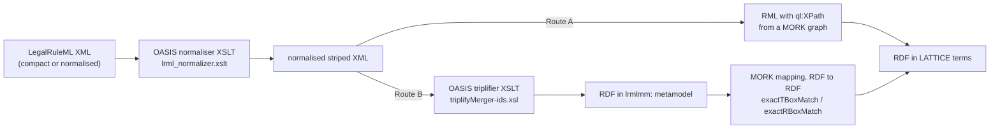
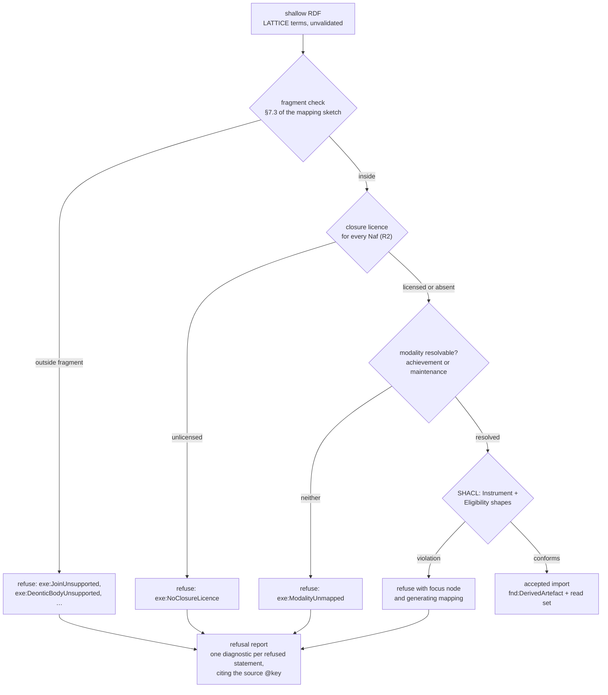
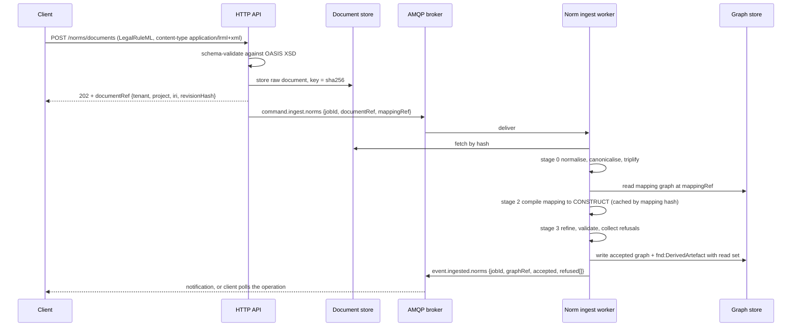

<!-- SPDX-License-Identifier: CC-BY-SA-4.0 -->

# Runtime pipeline: ingesting LegalRuleML through MORK and RML

> **Note, 2026-09-30.** The mapping targets in §4.1 change under [computable-contract-substrate.md](computable-contract-substrate.md): `lrmlmm:Obligation` maps to `ins:Obligation` (class to class), `lrmlmm:hasBearer` to `ins:obligor` or `ins:holder` chosen by the refiner from the modality, strength has no target (a lossy note or refusal), and a suborder list becomes a chain of `ins:arisesOnBreachOf`. An override that puts a permission over a prohibition maps to `ins:excepts`.

Version 0.1, draft for review. Explores whether the construct mapping in
[legalruleml-mapping.md](legalruleml-mapping.md) can be delivered as a **MORK mapping graph**
compiled by `tools/mork2rml.py` into **RML**, and executed at runtime to ingest LegalRuleML
documents into LATTICE terms.

**Short answer: yes for the structural 80%, and no for the part that matters most.** RML is a
deterministic tree-to-triple transformer. It can carry the mapping. It cannot make the judgements
the mapping sketch's §7.3 fragment rules require, and it cannot refuse. The pipeline is therefore
three stages, not one, and the third stage is where the value is.

Companion to [normative-wire-protocol.md](normative-wire-protocol.md), which covers what this
pipeline exposes to callers.

---

## Contents

1. [What already exists](#1-what-already-exists)
2. [Two routes, and why the RDF one wins](#2-two-routes-and-why-the-rdf-one-wins)
3. [Stage 0: normalise the source](#3-stage-0-normalise-the-source)
4. [Stage 1: the MORK mapping graph](#4-stage-1-the-mork-mapping-graph)
5. [Stage 2: compile to RML](#5-stage-2-compile-to-rml)
6. [Stage 3: the refiner, which RML cannot be](#6-stage-3-the-refiner-which-rml-cannot-be)
7. [What RML cannot do, precisely](#7-what-rml-cannot-do-precisely)
8. [Runtime shape: workers, messages, storage](#8-runtime-shape-workers-messages-storage)
9. [Determinism, provenance and staleness](#9-determinism-provenance-and-staleness)
10. [Gaps in the existing tooling](#10-gaps-in-the-existing-tooling)
11. [A first slice](#11-a-first-slice)
12. [Risks](#12-risks)

---

## 1. What already exists

The premise is stronger than it first appears. Four pieces are already built.

| Piece | Where | State |
|---|---|---|
| MORK → RML compiler | `tools/mork2rml.py` | Built. The reference adapter under ADR-A19's staged pipeline |
| **XPath reference formulation** | `tools/mork2rml.py`, `SourceFormat.XML → QL.XPath` | **Already emitted.** Not a new capability |
| RML executor | `tools/spc/python/src/spc/ingress/rml_executor.py` | Built. Two modes, RMLMapper via Java subprocess or `pyrml` in-process |
| Compact-notation decoder precedent | `tools/mork/src/mcn_decoder.py` | Built. Maps `"xml"` → `ql:XPath` in its own codebook |

The XPath support is the load-bearing fact. `mork2rml.py` derives its reference formulation from
the source format:

```python
{
    SourceFormat.JSON: QL.JSONPath,
    SourceFormat.XML:  QL.XPath,
    SourceFormat.YAML: QL.JSONPath,
}.get(fmt, QL.JSONPath)
```

with `QL = Namespace("http://semweb.mmlab.be/ns/ql#")`. So a MORK mapping whose `mork:dataRef`
values are XPath expressions compiles to RML that an RML processor will run against XML. Nothing
in the compiler needs changing to point it at a LegalRuleML document.

That makes the question not "can we?" but "should the mapping be expressed over XML at all?"

---

## 2. Two routes, and why the RDF one wins

LegalRuleML ships a **normative XSLT that converts its XML to RDF** in the `lrmlmm:` metamodel
(`xslt/lrml-rdf/triplifyMerger-ids.xsl`, LRML Annex C). That creates a genuine choice.



### 2.1 The comparison

| | Route A: XML → RML → LATTICE | Route B: XML → `lrmlmm:` RDF → LATTICE |
|---|---|---|
| Hops | one mapping hop | two, but hop one is normative and supplied |
| MORK fit | poor. `mork:dataRef` holds an XPath string. The T-Box/R-Box/A-Box match vocabulary has nothing to match against, because the source has no classes or properties, only element names | **good.** `mork:exactTBoxMatch` maps `lrmlmm:Obligation` → `ins:ObligationModality`. `mork:exactRBoxMatch` maps `lrmlmm:hasBearer` → `ins:bearer`. This is precisely what that vocabulary is for |
| Serialisation sensitivity | **high.** XPath differs between compact and normalised serialisations, so a mapping written for one breaks on the other | none after hop one. The metamodel is serialisation-independent by construction |
| `@keyref` resolution | painful. Cross-document references become `rr:refObjectMap` joins on a key, and `mork2rml.py`'s referencing-object-map support is partial | natural. `@keyref` becomes an IRI in hop one. A reference is just a triple |
| Trust | our XPath expressions are our own risk | hop one is OASIS-normative. A defect there is a defect in the standard's toolchain, not ours |
| Reviewability | an XPath string tells a reviewer nothing about meaning | a `mork:exactTBoxMatch` between two named classes is reviewable by a domain steward, which is what MORK's review model assumes |
| Dependency | RML processor | RML processor **plus** an XSLT 2.0 processor (Saxon) |

### 2.2 Recommendation

**Route B, with Route A retained as a documented fallback.**

The decisive argument is not effort, it is **reviewability**. MORK exists so that mapping intent is
a first-class reviewable object, and the review workbench shows a steward evidence rather than
notation. A mapping expressed as `lrmlmm:Obligation → ins:ObligationModality` with a
`mork:mappingNote` is reviewable. A mapping expressed as
`/lrml:LegalRuleML/lrml:Statements/lrml:PrescriptiveStatement/lrml:hasTemplate/ruleml:Rule/ruleml:then/lrml:SuborderList/lrml:Obligation`
is not, and it silently breaks when the sender uses the compact serialisation.

Route A stays documented because it is a single hop and needs no Java, which matters for an adopter
who will not run Saxon. It is the right choice for a narrow, high-volume, single-serialisation feed
where the mapping is written once and pinned.

The rest of this sketch assumes Route B.

---

## 3. Stage 0: normalise the source

Two transforms, both shipped by OASIS, both pure functions.

| Step | Transform | Why |
|---|---|---|
| 0a | `lrml_normalizer.xslt` | LegalRuleML has two equivalent serialisations. The compact form omits skippable edge tags. Normalising first means one mapping covers both |
| 0b | `lrml_normal_canonicalizer.xslt` | Evaluates CURIEs against `lrml:Prefix` declarations, so downstream sees absolute IRIs only |
| 0c | `triplifyMerger-ids.xsl` | Produces the `lrmlmm:` RDF graph |

**The input is hashed before 0a and the output after 0c**, and both hashes enter the read set. A
document that arrives already normalised skips 0a and records that it did, so the provenance chain
does not lie about what ran.

**Conformance check before anything runs.** The document must validate against one of the three
OASIS schemas. A document that does not is refused at the boundary with
`exe:SourceNotConformant`, before any mapping executes. Refusing early is cheaper than refusing
late and produces a better message.

---

## 4. Stage 1: the MORK mapping graph

This is the deliverable the mapping sketch's §15 construct table becomes. Each row with bucket
**N** or **C** is one or more MORK statements. Rows with bucket **G** have nothing to map until the
corresponding gap closes, and rows with **X** are dropped by hop 0c anyway.

### 4.1 Shape

```turtle
@prefix mork:   <https://www.nebularis.org/neuro-semantic/mork#> .
@prefix lrmlmm: <http://docs.oasis-open.org/legalruleml/ns/mm/v1.0/> .
@prefix ins:    <https://www.nebularis.org/neuro-semantic/lattice/instrument#> .
@prefix pty:    <https://www.nebularis.org/neuro-semantic/lattice/party#> .

ex:lrmlScheme a mork:MappingScheme ;
    skos:prefLabel "LegalRuleML 1.0 to LATTICE, import core" .

# --- T-Box: a deontic node becomes a modality qualifier ---------------------
ex:obligationMapping a mork:DataMapping ;
    skos:inScheme        ex:lrmlScheme ;
    mork:mappingFor      lrmlmm:Obligation ;
    mork:exactTBoxMatch  ins:ObligationModality ;
    mork:conceptName     "obligation modality" ;
    mork:mappingNote     "LRML §3.4. Bearer is legally bound; non-performance is a Violation." .

# --- R-Box: the bearer slot becomes ins:bearer ------------------------------
ex:bearerMapping a mork:DataMapping ;
    skos:inScheme        ex:lrmlScheme ;
    mork:mappingFor      lrmlmm:hasBearer ;
    mork:exactRBoxMatch  ins:bearer ;
    mork:deferredMapping ex:occupancyMapping ;     # bearer resolves to an occupancy first
    mork:mappingNote     "Bearer is a slot on the formula in LRML, a link from the norm in LATTICE." .

# --- A-Box: strength individuals -------------------------------------------
ex:defeasibleMapping a mork:DataMapping ;
    skos:inScheme        ex:lrmlScheme ;
    mork:mappingFor      lrmlmm:DefeasibleStrength ;
    mork:exactABoxMatch  ins:Defeasible .

# --- Broad match where LATTICE is narrower ---------------------------------
ex:jurisdictionMapping a mork:DataMapping ;
    skos:inScheme               ex:lrmlScheme ;
    mork:mappingFor             lrmlmm:Jurisdiction ;
    mork:broadTBoxCategoryMatch skos:Concept ;
    mork:mappingNote     "LRML conflates territory and subject-matter competence. LATTICE splits them into two scheme contracts, so this is broad and needs a per-deployment refinement." .
```

Four things this buys that a hand-written transform does not.

1. **The mapping is reviewable** in the MORK review workbench, one decision per mapping, with the
   six-verb model (confirm, retarget, reshape, decline, teach, defer).
2. **The mapping is versioned and hashed**, so an artefact's read set names the mapping revision it
   was compiled from.
3. **Broad and narrow matches are first class.** The jurisdiction row above is honest about being
   lossy, and a reviewer sees that rather than discovering it in production.
4. **`mork:dependsOnMapping` gives ordering.** The bearer mapping cannot run before occupancies
   exist, and the DAG says so rather than the code implying it.

### 4.2 Where the mapping is thin

Bucket **C** rows are compositions, not matches, and MORK expresses them awkwardly. A
`lrml:PrescriptiveStatement` becomes a profile plus a modality plus an activation, which is three
targets from one source. MORK has `mork:compositeNarrowerMapping` for exactly this, and the
compiler's support for it is one of the weaker areas (§10). Expect the composite rows to be where
the work is.

---

## 5. Stage 2: compile to RML

`mork2rml.py` with no changes for the T-Box, R-Box and A-Box rows. The output is RML TriplesMaps:

```turtle
<#ObligationMap> a rr:TriplesMap ;
    rml:logicalSource [
        rml:source              "normalised.rdf" ;
        rml:referenceFormulation ql:XPath ;       # Route A
        rml:iterator            "//lrml:Obligation"
    ] ;
    rr:subjectMap [
        rr:template "https://…/instrument/modality/{@key}" ;
        rr:class    ins:ObligationModality
    ] ;
    rr:predicateObjectMap [
        rr:predicate ins:bearer ;
        rr:objectMap [ rr:template "https://…/party/occupancy/{lrml:Bearer/@iri}" ;
                       rr:termType rr:IRI ]
    ] .
```

Under Route B the logical source is RDF rather than XML, which RML core does not address. Two
options, and this is a real fork:

| Option | Mechanism | Assessment |
|---|---|---|
| **B1** | Skip RML for hop two. Compile the MORK graph to **SPARQL CONSTRUCT** instead, using the existing `sparql_backend.py` | Natural. The source is already RDF, and CONSTRUCT is the idiomatic RDF-to-RDF transform. Reuses a built backend |
| **B2** | Use an RML processor with an RDF logical source via `ql:SPARQL` or a vendor extension | Non-standard, and support varies by processor. Not worth the portability loss |

**B1.** Which means the honest statement is: *Route B does not use `mork2rml` at all.* It uses the
same MORK mapping graph through a different backend of the same staged compiler, which is precisely
what ADR-A19's architecture exists to permit — "a backend is an adapter attached after the shared
validate, normalise, lower stages, not a parallel reimplementation".

So the user's instinct is right in substance and slightly off in mechanism. The MORK mapping graph
is the deliverable. RML is one compilation target of it, correct for Route A. SPARQL CONSTRUCT is
the target for Route B, and it already exists.

---

## 6. Stage 3: the refiner, which RML cannot be

Stages 0 to 2 produce **shallow RDF**: LATTICE-shaped triples that are structurally correct and
semantically unvalidated. The refiner turns that into either an accepted import or a refusal with
reasons.



The refiner is a normal LATTICE compiler pass. It is not novel machinery, and that is the point: it
is SHACL plus the fragment rules plus the diagnostic vocabulary, all of which the substrate already
has or the normative-rule-substrate plan already schedules.

**Refusal granularity is per statement, not per document.** A LegalRuleML document with forty
statements of which three use joins imports thirty-seven and reports three refusals, each citing
the offending `@key`. Refusing the whole document because part of it is out of fragment would make
the importer useless on real legal sources, which are never uniformly simple.

---

## 7. What RML cannot do, precisely

Worth stating explicitly, because over-claiming here would be the expensive mistake.

| Task | Why RML cannot | Who does |
|---|---|---|
| Decide a rule body is tree-shaped and single-subject | Requires analysing variable occurrence across atoms. RML has no notion of a variable | refiner |
| Emit a diagnostic | RML produces triples or nothing. It has no failure channel beyond an empty result | refiner |
| Refuse | Same | refiner |
| Resolve `@keyref` inheritance (`lrmlmm:mergerOf`) | A statement referencing another's template *and modifying it* is a graph merge with override semantics. RML templates do not compose | hop 0c, then refiner |
| Order a `SuborderList` | RML emits triples from a tree. Position-dependent activation semantics are not triples | refiner, into `ins:compensatedBy` |
| Evaluate `lrml:Override` transitively | Closure over a relation. Not a transform | compiler, `PriorityPlan` |
| Decide achievement versus maintenance | Resolves a deontic `@iri` against an external ontology | refiner |
| Detect that two imported norms contradict | Satisfiability of a conjunction. Needs the reasoner | design-time check, ADR-A83 harness |
| Handle `lrml:Alternatives` | Several mutually exclusive readings of one source. RML has no branch | refused until interpretation contexts exist |

The pattern: **RML moves structure, the refiner supplies judgement.** Every row in the "who does"
column that says "refiner" is a row where a naive single-stage design would silently produce wrong
triples rather than a refusal, and silently-wrong is the worst outcome for a legal document.

---

## 8. Runtime shape: workers, messages, storage

The house rule is explicit and constrains the design: *"Job payloads carry only these references.
They do not carry RDF, credentials, browser tokens, or unrestricted endpoint details."* So the
LegalRuleML document is stored first and referenced by hash. It never rides in a message.



### 8.1 New contracts

Following the house style exactly: JSON Schema 2020-12, `$id` under
`https://schemas.nebularis.org/lattice/…`, `additionalProperties: false`, graph references rather
than content.

| Contract | Routing key | Payload |
|---|---|---|
| `contracts/events/norm-ingest-request.schema.json` | `lattice.norm.ingest` | `jobId`, `correlationId`, `documentRef`, `mappingRef`, `sourceDialect` |
| `contracts/events/norm-ingest-result.schema.json` | `lattice.norm.ingested` | `jobId`, `graphRef`, `accepted` count, `refused[]` with `{sourceKey, diagnostic, message}` |

`sourceDialect` matters. It is an enum, not a guess:
`oasis-lrml-1.0-normalised`, `oasis-lrml-1.0-compact`, `oasis-lrml-1.0-basic`, `lrmlmm-rdf`. The
worker refuses a document whose declared dialect does not match what it parses, rather than
sniffing. Sniffing a legal document is how the wrong serialisation gets silently half-imported.

### 8.2 Where the compiled artefact is cached

The CONSTRUCT (or RML) is a `fnd:DerivedArtefact` keyed by the **mapping graph hash plus compiler
version**, not by the document. One compilation serves every document using that mapping, which is
the difference between a viable import service and one that recompiles per request.

---

## 9. Determinism, provenance and staleness

Every stage is a pure function, which makes the whole pipeline replayable.

```text
ingest(document@hash, mapping@hash, compiler@version, shapes@version) → graph@hash + refusals
```

The accepted graph's read set carries all four. Consequences:

- **A mapping revision invalidates every graph imported under it.** The existing
  `INVALIDATION_PLAN` family and read-set-scoped invalidation (ADR-A27) cover this without new
  machinery.
- **A re-import is idempotent.** Same four inputs, same output hash, so two workers racing produce
  one result and neither needs a lock.
- **A refusal is durable and re-derivable.** "Why was clause 12 not imported" is answerable from the
  refusal record, months later, against the mapping version that refused it.
- **Upgrading the fragment rules is visible.** Widening the fragment means old refusals become
  imports, and the read set makes that a detectable, reviewable change rather than a silent drift.

---

## 10. Gaps in the existing tooling

Measured against `tools/mork2rml.py` as it stands.

| # | Gap | Severity for this work | Note |
|---|---|---|---|
| 1 | `LookupExpression` cannot compile to a template, needs `rr:refObjectMap` (Remark 10.10 in the code) | **high for Route A**, low for Route B | LegalRuleML is full of `@keyref` lookups. Route B turns them into IRIs at hop 0c and sidesteps this entirely. This is a further argument for Route B |
| 2 | Referencing-object-map semantics partially implemented | high for Route A, low for B | same reason |
| 3 | `ShapeMapping` and `RuleMapping` skipped by `mork2rml` | none | ADR-A23 closes this with the SHACL and SWRL backends, which exist |
| 4 | Logical-source resolution uses static defaults rather than resolving `mork:RepresentationScheme` | medium | Needs wiring to the document store. Small |
| 5 | Iterator expressions are defaults (`$` or `/*`) | medium for Route A | A LegalRuleML mapping needs a real iterator per statement kind |
| 6 | No RDF logical source in RML | resolved by B1 | Use the SPARQL backend instead of RML for Route B |
| 7 | RML executor depends on RMLMapper JAR or `pyrml` | low | `pyrml` avoids Java. Only needed for Route A |
| 8 | `exe:` diagnostics are a **closed set** (ADR-A89 item 6) | **medium** | Every new refusal diagnostic amends that set and needs the ADR touched. Budget for it rather than discovering it |
| 9 | No XSLT processor in the toolchain | medium for Route B | Saxon-HE, or `lxml` with XSLT 1.0 limits. The OASIS transforms are XSLT 2.0, so Saxon |

Gap 8 is the one most likely to be missed. The refusal vocabulary in the mapping sketch §20.3 adds
eight diagnostics to a set the ADR declares closed.

---

## 11. A first slice

One end-to-end path, chosen to exercise the pipeline rather than the domain. Sized at roughly one
slice under the repository's rule.

**Source:** the OASIS Australian credit-licensing example (`ex5-section29new-compact.lrml`). It has
a prohibition, a strong-permission exception, an override and two penalties, so it exercises both
what imports and what must refuse.

| Step | Deliverable | Expected result |
|---|---|---|
| 1 | Run the OASIS normaliser and triplifier over the example. No LATTICE code | `lrmlmm:` RDF. Establishes the Saxon dependency is workable |
| 2 | A MORK mapping graph covering only bucket **N** and **C** rows for prohibition, permission, bearer | ~15 mappings |
| 3 | Compile via the SPARQL backend | a CONSTRUCT, cached by mapping hash |
| 4 | Execute, producing shallow RDF | two norms in Instrument terms |
| 5 | Refiner: fragment check plus SHACL | both norms accepted |
| 6 | Refiner on the override and penalties | **two refusals**, `exe:PriorityUnsupported` and a penalty refusal, each citing `@key` |
| 7 | Record the artefact with its four-part read set | replay produces an identical hash |

**The success criterion is step 6, not step 5.** An importer that accepts what it understands is
easy. An importer that refuses what it does not, names why, cites the source key, and stays
re-derivable is the thing worth building. If step 6 produces silence or a partial import rather
than two named refusals, the design is wrong and should be stopped there.

This slice depends on nothing in the normative-rule-substrate plan except the diagnostic
vocabulary, because it maps only to terms that exist today and refuses everything else. That makes
it a genuinely early slice, and a cheap way to test the whole architecture before the deontic
extension lands.

---

## 12. Risks

| # | Risk | Likelihood | Impact | Mitigation |
|---|---|---|---|---|
| 1 | The refiner grows into a second compiler, duplicating Eligibility's | medium | high | It is a pass over shallow RDF with SHACL plus fragment rules. Any need for a new evaluation path means stop and re-plan |
| 2 | Route A is chosen for expedience and breaks on the other serialisation | medium | medium | Declare `sourceDialect` explicitly and refuse mismatches. Never sniff |
| 3 | Silent partial import of a legal document | low | **severe** | Per-statement refusal with the source key. The step-6 criterion above exists to catch this early |
| 4 | Saxon becomes a runtime dependency of the platform | medium | medium | It is a build-time and worker-time dependency, not a runtime library. Containerise it as the cross-check proposes for any external compiler |
| 5 | The mapping graph is written once and never reviewed, so broad matches ship as if exact | medium | high | The six-verb review model applies. A `broadTBoxCategoryMatch` without a confirmed review decision should not compile |
| 6 | Effort is spent on interchange before anyone needs it | **high** | medium | The mapping sketch §20's ruling stands: checklist first, importer only on a trigger. This sketch describes how, not whether |

Risk 6 deserves the last word. Nothing here argues the importer should be built now. It argues that
**if** it is built, the MORK mapping graph is the right deliverable, Route B is the right shape, and
the refiner is where the engineering actually is.
