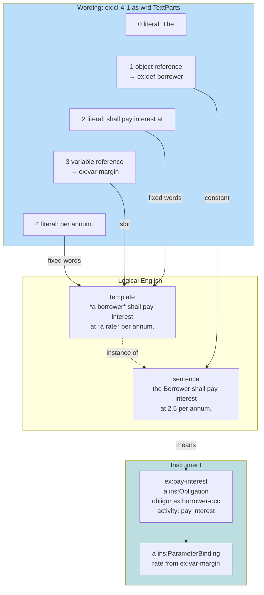
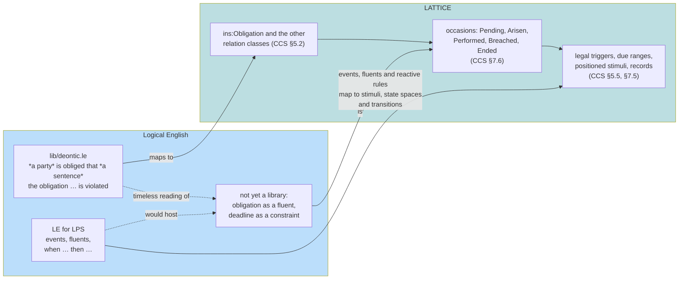
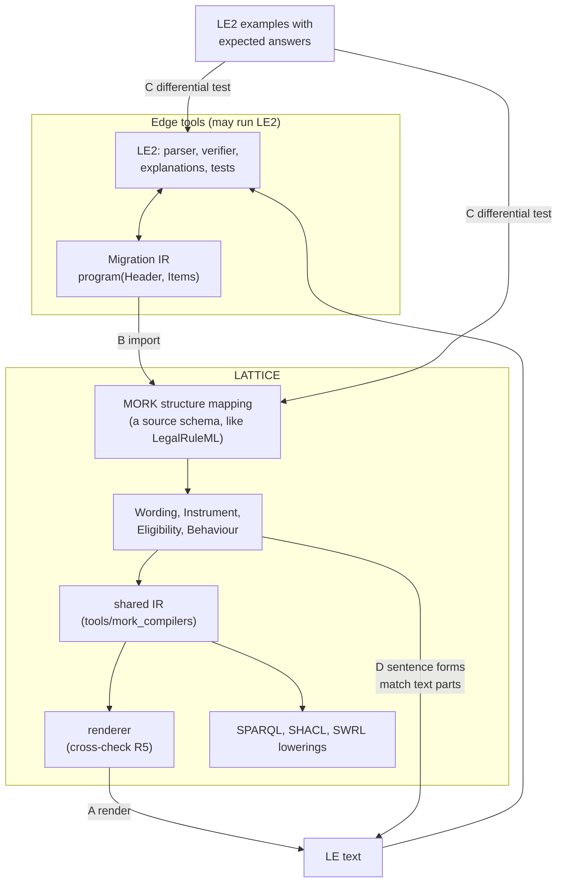

<!-- SPDX-License-Identifier: CC-BY-SA-4.0 -->

# Logical English and the computable contract substrate

Draft for review, 2026-10-01. Unplanned: an exploration, with no plan, slice or ADR behind it. It
asks how much of Logical English (LE) the computable contract substrate can carry, without adding
Prolog to the stack, and whether the Wording layer's text parts make LE a natural fit.

**Inputs.**
- [LogicalEnglish2](https://github.com/LogicalContractsOrg/LogicalEnglish2) (LE2, Apache 2.0), cloned
  at `work/LogicalEnglish2`: its language reference (`docs/user/reference/language.md`), the
  introductory tutorial, `lib/deontic.le`, the LPS target reference and the writer's Migration IR
  (`le_writer.pl`, `docs/dev/migration.md`).
- [computable-contract-substrate.md](computable-contract-substrate.md) (CCS), whose §14 points here.
- [rule-layers.md](rule-layers.md) and [rule-layers-cross-check.md](rule-layers-cross-check.md),
  which deferred an LE input route until a drafter supplies LE text or rendered rules are worth
  round-tripping (cross-check §5).
- [ingestion-vision.md](../../architecture/ingestion-vision.md) §3, which names LE and InsurLE as the
  controlled-language route to meaning.

Only core LE is considered. The constructs that need LE2's proprietary `le_extensions.pl` (`which`
clauses, grouped alternatives, numbered bodies, prepositional chaining) are out of scope.

---

## 1. The question, and a short answer

Two claims are on the table. The substrate matches the semantics of stratified Datalog (CCS §8:
the trigger and state-reading graph gives the strata). And a wording's text parts look like LE
sentences. If both hold, an LE program is something LATTICE can **represent, render, import and
check**, but not something it should **run** as LE runs it.

| Question | Short answer |
|---|---|
| Is LE's Prolog target within stratified Datalog? | Most of it. Facts, rules, `and`, `or`, `it is not the case that`, `for all cases in which`, `unless`, `otherwise`, comparisons, dates, constants, decision tables and the `is a` taxonomy are stratified Datalog with built-ins. Arithmetic and aggregates are Datalog with safe built-ins and stratified aggregation. Recursion over data, sentences as arguments and abduction go beyond what Eligibility evaluates today. Embedded `prolog` goals are out (§5) |
| Do the semantics agree? | Not by default. LE is closed-world and two-valued, LATTICE is three-valued and open-world unless a closure licence says otherwise (A-105). The two agree where every case fact LE treats as complete is given a closure licence (§4) |
| Do the text parts fit LE? | Yes. A text's parts (literal, variable reference, object reference) are the three things an LE sentence is made of: a template's fixed words, a slot and a constant (§2) |
| Where would LE add value? | Rendering meaning as runnable text, an authoring route for redrafted standard wording, and a large corpus of programs with expected answers for differential testing (§6) |

---

## 2. Text parts are LE sentences

CCS §4.1 breaks clause 4.1 of the facility wording into five text parts. Read as LE, the same
clause is a sentence of one template:

| Part | CCS §4.1 | LE |
|---|---|---|
| 0 | literal "The" | an ignorable word (LE §9) |
| 1 | object reference to the definition of Borrower | `the Borrower`, a definite description nothing introduced, so a **global constant** (LE §6.0) |
| 2 | literal "shall pay interest at" | the template's fixed words |
| 3 | variable reference to `ex:var-margin` | a slot, `*a rate*` |
| 4 | literal "per annum." | the template's fixed words |

The template is `*a borrower* shall pay interest at *a rate* per annum.` Its slots are typed by
their head noun: `borrower`, `rate`. In LATTICE the same types come from the variable's
`wrd:valueContract` or `wrd:valueSpace`, and from the role the definition names.



**Why this matters.** The hard part of reading LE is segmenting a sentence into fixed words and
arguments. LE2 does it by matching declared templates, ignoring filler words. A `wrd:Text` already
carries that segmentation: its parts say which words are fixed, which are arguments, and what each
argument refers to. Matching a text to a template is then a comparison of literal sequences, modulo
LE's ignorable words, with no parser and no language model. Whatever produced the parts (a drafter
in an authoring tool, an import from Open CBAA's `wim:`, an extraction proposal reviewed at the
gate) did the segmenting once.

**Where the fit stops.**
- **Modal words.** "shall" carries the modality in the wording. In the Instrument it is the class
  (`ins:Obligation`), and the controlled rendering says "must" (CCS §8.1). An LE template either
  keeps "shall" as fixed words, typed as an obligation form, or uses `lib/deontic.le`'s
  `*a party* is obliged that *a sentence*` with "shall" mapped away. §3 compares the two.
- **Connectives.** Contract text joins conditions with "if", "provided that", "unless", "save
  where". A `wrd:Text` is flat. The logical structure of a clause lives in Instrument and
  Eligibility (scope, `fulfilledWhen`, exceptions), so an LE rule's head and body map to a relation
  and its conditions, not to one text.
- **Drafted English is not controlled English.** Most existing clauses match no template. Their
  `ins:encodingStatus` stays `NotAssessed` or their meaning is bound by hand, as today. LE helps
  where wording is drafted or redrafted to conform (ingestion vision §3).
- **Per-section constants.** "The Coverholder" means different parties in different sections (CCS
  §5.10). In LE a global constant has one referent per program. The section-dependent referent
  needs a rule (`the coverholder for a risk is a party if …`), which is what the Instrument's
  per-section definitions already compute.

### 2.1 A sentence form

LE's template is two things at once: a **sentence form** (fixed words and typed slots) and a
**predicate** (an n-ary relation the rules reason over). LATTICE holds both, in different layers:

| LE | LATTICE |
|---|---|
| the sentence form | a library `wrd:Text` whose variable references are unbound (a template's wording, CCS §5.9) |
| the predicate | the bound meaning: an `ins:` relation for a clause, or an Eligibility condition's evidence binding for a condition atom |
| the slot types | `wrd:valueContract`, `wrd:valueSpace`, the role a party slot names |
| `; synonym <template>` | a second form for the same meaning, rendered on request |
| a fact or rule sentence | an instance text, or a rendering generated from the bound meaning |

What LATTICE lacks is a form for a **condition atom**. Clauses have wording, but `the person is
aged an age` exists only as an Eligibility evidence binding, with no words. Rendering (R5 of the
cross-check) and import both need one form per atom kind. Where that form lives is open (LE-Q2).

---

## 3. Construct by construct

**Fit:** ✅ direct, ⚠️ with care or partial, ❌ refused or left at the edge.

| LE construct (reference §) | LATTICE counterpart | Fit |
|---|---|---|
| template with typed slots (§2) | sentence form plus predicate (§2.1) | ✅ |
| `; synonym` (§2) | another form of the same meaning | ✅ |
| `; opposite`, `only if` (§2, §15.1) | a necessary condition, the classification condition precedent (CCS S14), with the opposite as its rendering | ⚠️ the derived negative conclusion is not a LATTICE assertion |
| `; undefined`, a scenario element (§2) | case data in the happened A-Box, with a closure licence scoped to the scenario (§4) | ✅ |
| `; unknown`, `; assumable` (§2) | a fact family with **no** closure licence, so its absence is Undetermined | ⚠️ LE assumes and answers conditionally, LATTICE reports Undetermined (§4) |
| `; judged` (§17.1) | a finding record with `fnd:assertedBy` (CCS §6.4), Undetermined until one exists | ✅ |
| fact, rule `Head if Body` (§3) | an instance relation or deeming, with an Eligibility condition as its body | ✅ |
| `and`, `or` (§4) | Eligibility composition | ✅ |
| `it is not the case that` (§4) | Eligibility negation (A-103), deciding on absence only under a closure licence (A-105) | ✅ with a licence |
| `unless` (§4) | an exception: a Permission or an Exclusion | ⚠️ the burden differs (§4.2) |
| `for all cases in which … it is the case that` (§4) | `¬∃ ¬`, stratified | ✅ with a licence over the range |
| `otherwise` cascade (§17.2) | ordered alternatives: each guarded by the failure of the earlier ones | ⚠️ no ordered alternative in Eligibility. Exceptions and `ins:prevailsOver` (N10) express it with more nodes |
| decision table, first match (§17.3) | a partition of a measured value (`qnt:RangeSet`) where the rows are intervals, otherwise rows as rules with a hit policy | ⚠️ the hit policy is new |
| integrity constraint `it must not be true that` (§3.3) | a SHACL shape over case data | ✅ for checking. Its role in abduction does not carry |
| constants `the constants are:` (§2.2) | variable values (`wrd:VariableValue`) and parameter bindings | ✅ |
| functions `the functions are:` (§2.3) | `ins:computedBy` (CCS §7.9) | ⚠️ the expression construct is not decided |
| arithmetic `+ - * / // mod`, `round`, `ceiling` (§7) | Quantification derived values, `qnt:DerivedValueSpace`, proportional offsets | ⚠️ partial until the expression decision |
| dates, `days after`, calendar `months after` (§7.1) | `qnt:Range` anchored by `qnt:relativeToAnchor`, calendar units (ADR-A94) | ✅ |
| aggregates `sum`, `count`, `min`, `max`, `list` (§5) | allowance accounts, capacity, the contract amounts work | ⚠️ no general aggregate in Eligibility |
| recursion, `; memorable` fixpoint (§2.4) | none in Eligibility, whose conditions form a tree (cross-check R4) | ❌ for now |
| `is a` taxonomy (§8) | Vocabulary schemes and hierarchical match (ADR-A87) | ✅ |
| meta-templates, `says that`, `is approved that` (§11) | records about a proposition: findings, exercises, deemed facts | ⚠️ one level of nesting, reified |
| provenance trailers `according to`, `as stated in`, `confer`, `because` (§17.1) | `fnd:assertedBy`, `fnd:Evidenced`, and the wording element a term is `ins:expressedIn` | ✅ |
| rule label `with provenance …, confer "…"` (§15.5) | `ins:Term` `ins:expressedIn` `wrd:Element`, with the text part quoted | ✅ |
| `according to` in a rule, admissibility (§17.5) | evaluation restricted to evidence from admissible sources: a closure licence by source, and the burden of CCS §5.7 | ⚠️ needs a scoped evaluation mode |
| sections, `applicability`, `question`, `remedy` (§3.1, §17.4) | labels only in LE. LATTICE sections are wording elements with meaning (CCS §5.10) | ⚠️ name clash, different concepts |
| `the contract <name> states that:` (§1) | `ins:Instrument` | ✅ |
| scenario (§1) | a case in the happened A-Box | ✅ |
| query (§3.2) | the Decision and Explain API | ✅ |
| `expects answers` (§12) | a Validation Pack's expected-decision table (CCS C14) | ✅ |
| flip (§17.7) | the Explain API's challenge sets | ⚠️ tooling, not semantics |
| `lib/deontic.le` (§14.2) | the relation classes, read without time (§5) | ⚠️ |
| embedded `prolog` goals (§15.6), services (§17.6) | none | ❌ |
| s(CASP): constraint answers, stable models, abduction (tutorial §21) | none at runtime. Constraint answers resemble design-time envelope comparison | ❌ |
| LE for LPS: fluents, events, reactive rules (§1) | Behaviour configuration and runtime (§5) | ⚠️ |

---

## 4. Semantics: who closes the world

### 4.1 The inversion

LE is closed-world by default and opens the world on request. LATTICE is open-world by default
and closes it on licence.

| What LE says | LE's reading | LATTICE's reading |
|---|---|---|
| a template with no addition | not provable means false | absent means Undetermined, unless a closure licence covers the fact family |
| `; undefined` (a scenario element) | the scenario states every such fact | a closure licence whose authoritative source is the scenario, scoped to the case |
| `; unknown` | not provable means assumed true, and the answer lists the assumption | no closure licence: Undetermined, with the open fact in the diagnostic |
| `; judged` | assumed, shown as "judgment needed", fixed once an outcome is recorded | Undetermined until a finding record exists (CCS §6.4) |
| `according to S` | only evidence admissible under S counts | a closure licence and evidence filter whose sources are those admissible under S |

So a translation from LE gives every `; undefined` fact family a closure licence over its scenario,
and every other fact family none. LE's `; unknown` answers and LATTICE's Undetermined carry the same
information: LE says "true, if these hold", LATTICE says "undetermined, because these are open".
Neither invents an answer.

The deeming of CCS §5.6 shows the correspondence. In LE:

```le
the templates are:
    *a party* makes *a request* on *a date*; undefined.
    *a party* provides the documents for *a request* on *a date*; undefined.
    *a request* is deemed failed on *a date*.

the knowledge base deeming includes:

rule clause_3a with provenance the agreement at clause 3.A,
        confer "deemed failed if not provided within sixty (60) days":
a request is deemed failed on a date
    if a requester makes the request on a first date
    and the date is 60 days after the first date
    and it is not the case that
        a party provides the documents for the request on a second date
        and the second date is before or equal to the date.
```

`; undefined` on the providing template is what licenses the absence. In LATTICE that licence is
explicit: the deeming's instrument is the authoritative source for the fact family "acts of
providing the documents", over the window (CCS §5.6 diagram).

### 4.2 Where the readings differ

- **Exceptions and burden.** LE's `Head if Body unless C` concludes Head when C cannot be proved.
  LATTICE applies an exception only when it is established (law I7). For an obligation that arises
  unless an exception applies, both conclude that it arises. For a breach that would follow if the
  exception did not apply, LE derives the breach and LATTICE answers Undetermined with
  `exe:ExceptionNotEstablished`. Translating LE's `unless` as a LATTICE exception changes this
  answer, by design.
- **Contradiction.** A case whose facts break an LE integrity constraint answers nothing. LATTICE
  reports a shape violation and still evaluates.
- **Time.** LE's Prolog target answers one query against one scenario. LATTICE answers at a
  stimulus-log position, bitemporally, with supersession. A late fact in LE is a new scenario. In
  LATTICE it supersedes an earlier decision.
- **Cycles through negation.** LE warns and, under Prolog, may loop. s(CASP) gives stable models.
  LATTICE refuses the cycle at design time (I6, cross-check R4).

### 4.3 A conjecture to test

> For a core LE program that is stratified, uses no `; unknown`, `; judged`, `prolog`, services,
> recursion or s(CASP)-only constructs, and whose scenario templates are all `; undefined`, the
> translation with a closure licence per scenario element gives Permitted exactly where LE answers
> true, Denied exactly where it answers false, and never Undetermined.

LE2's examples hold 426 programs and about 3,700 `expects` lines. The subset meeting the
conjecture's conditions is a differential test corpus, as NRS N7 uses the OASIS LegalRuleML
examples. Each mismatch is either a translation bug or a semantic difference worth recording.

---

## 5. Time: LE's deontic library and Behaviour

`lib/deontic.le` reads obligations without time: who is obliged, permitted or forbidden that a
sentence holds, and whether that is violated in one case. Its own header says that deadlines and
"the life of an obligation over time" belong to LE for LPS, where an obligation is a fluent that its
trigger initiates and its fulfilment terminates, and that no library exists for it yet.

That missing library is the CCS occasion model.



| LE | LATTICE |
|---|---|
| `*a party* is obliged that *a sentence*` | `ins:Obligation` whose `ins:fulfilledWhen` is the sentence's condition (ought-to-be becomes ought-to-do with a test) |
| `*a party* is forbidden that *a sentence*` | `ins:Prohibition` |
| `*a party* is permitted that *a sentence*` | `ins:Permission`, which in LATTICE needs a prohibition to except. A bare LE permission is weak permission, which LATTICE leaves unrepresented (CCS §8) |
| a violation | a breach record, derived as CCS §6.1 states |
| a reparation, a rule concluding a new obligation from a violation | `ins:arisesOnBreachOf` |
| an LPS event | a stimulus |
| an LPS fluent | a state occupancy, or a dynamic quantity in capacity (CCS §7.8) |
| `; 0 by default` on a fluent | a capacity account's opening value |
| `when … then …`, `if … then …` | a transition with a trigger, or an effect |

An export of LATTICE relations to LE for LPS would therefore write the obligation library that LE2
lacks, generated from the substrate's templates (CCS §5.11). That is a possible contribution back,
not a dependency.

---

## 6. Routes that keep Prolog out of the runtime

The rule from [rule-layers.md](rule-layers.md) holds: Prolog, if used at all, is a tool at the edge,
never in a LATTICE runtime. Four routes respect it.



| Route | What | Runs LE2? | Value |
|---|---|---|---|
| **A. Render** | generate LE text from the shared IR: one form per relation class and per condition atom (§2.1). The CCS §8.1 renderings become runnable LE | no, the output may be opened in LE2 | reviewers read meaning as English, and can run it in LE2's editor for explanations, why-not trees and flips without LATTICE building them |
| **B. Import** | read an LE program at the edge with LE2 (`kb_to_ir/2`) and map the Migration IR through MORK, as LegalRuleML is mapped | yes, at ingestion only | an authoring route for wording drafted in LE or InsurLE. The IR is a Prolog term today, so a JSON serialisation of it is the one piece of edge code needed |
| **C. Differential test** | run the conjecture's subset of LE2's examples through route B and LATTICE's evaluation, and compare with their `expects` lines | yes, offline | measures the semantic match (§4.3), as NRS N7 measures LegalRuleML |
| **D. Wording-native** | match a wording's text parts against declared sentence forms (§2), so a conforming clause is its own LE sentence and its meaning is checked against its form | no | the wording and the logic stop drifting apart: the text a party signs is the text the rules are written in |

Route D is the one the text-parts model makes possible, and the one with no counterpart in LE2.
LE2 reads a document's text to quote it (`confer`, the source viewer, LE §17.1), but its rules are
written beside the document, not in it.

---

## 7. What would change in LATTICE

Nothing is proposed for a slice. If the routes are pursued, these are the candidate changes:

| Change | Needed by | Note |
|---|---|---|
| a sentence form for each condition atom kind and each relation class | A, B, D | where it lives is LE-Q2 |
| an ordered-alternatives construct in Eligibility, or a documented translation of `otherwise` into exceptions | B | LE-Q4 |
| the expression construct for `ins:computedBy`, compatible with LE's arithmetic subset | B, and CCS §7.9 anyway | arguments for choosing the subset LE already uses: `+ - * / // mod`, `round`, `ceiling`, `floor`, `min` and `max` as conditions |
| a scoped evaluation mode: evidence filtered by admissible source | B | generalises the closure licence by source (A-105) and the burden rule (CCS §5.7) |
| a hit policy on tables that hold rules rather than values | B | CCS's `wrd:Table` holds values. LE's decision tables hold rules |
| a JSON form of LE2's Migration IR | B, C | edge code, outside LATTICE |

None of these touches Foundation, and none changes a decision taken in CCS.

---

## 8. Risks

| # | Risk | Mitigation |
|---|---|---|
| L1 | LE's two-valued answers are taken as LATTICE's | every imported program carries its closure licences explicitly, and the §4.2 differences are listed in the import report |
| L2 | Prolog drifts into a runtime | routes B and C run LE2 only at ingestion or offline, enforced by the same boundary rule that keeps reasoners out of runtime (ADR-A83) |
| L3 | Sentence forms become a second, competing vocabulary | forms are words for meanings LATTICE already holds. A form never adds a predicate of its own |
| L4 | Drafted wording is assumed to conform | conformance of a text to a form is checked and recorded, never assumed |
| L5 | Dependence on proprietary extensions | core LE only, as stated above |

---

## 9. Open questions

| # | Question | First thought |
|---|---|---|
| LE-Q1 | Is route D worth a construct of its own, or is a library `wrd:Text` with unbound variables already the sentence form? | the library text suffices for clauses. Condition atoms need something new |
| LE-Q2 | Where does a condition atom's sentence form live: Eligibility (beside the evidence binding), Vocabulary (as a label scheme), or a rendering profile outside the T-Box? | a rendering profile, so the T-Box gains nothing for presentation |
| LE-Q3 | Should "shall" be fixed words of an obligation form, or should forms use `lib/deontic.le`'s `is obliged that`? | fixed words: the wording is the drafter's, and the relation class carries the modality |
| LE-Q4 | `otherwise`: an Eligibility construct, or a translation into exceptions? | a translation first. A construct only if real wording needs it often |
| LE-Q5 | Is the conjecture of §4.3 true? | measure it (route C) before relying on it |
| LE-Q6 | Would an LPS obligation library generated from CCS templates be welcome upstream in LE2? | a conversation with the LE2 maintainers, not a design question |
