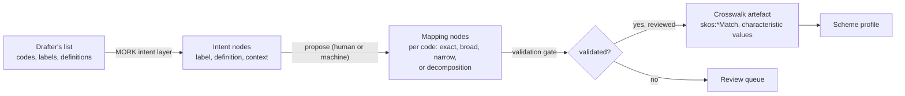

# The MORK Bridge: Industry Models and the LATTICE Reference

Version 0.1, draft for review. Specifies how Open CBAA works with the vocabularies and data the
market brings today (flat code lists, simple taxonomies, spreadsheet rows, bordereaux) and, where
a deployment wants it, with LATTICE's applied insurance reference implementation (the
[reference peril vocabulary](peril-vocabulary.md), [term parameters](term-parameters.md) and the
[asset exposure ontology](asset-exposure-ontology.md)), with MORK mappings between the two.
Nothing here is implemented yet.


Citations of `design-spec` and of codes AP, DP, D and I refer to Open CBAA's [design
specification](https://github.com/nebularis/open-cbaa/blob/main/docs/design/design-spec.md) and
[LATTICE integration
specification](https://github.com/nebularis/open-cbaa/blob/main/docs/design/lattice-integration.md).
Where this sketch and the [applied insurance reference
epic](../plans/applied-insurance-reference.md) or its ADRs (A-98 to A-102) differ, they take
precedence.

---

## 1. Two Worlds

| | Industry as it stands | LATTICE reference |
|---|---|---|
| perils | whatever the contract's drafter supplies: a market cause-of-loss code list, a carrier's or MGA's own list, a simple two-level taxonomy, or a view the LMA may publish | a cause hierarchy with kind and part links, characteristics, collections, overlaps, thresholds |
| contract terms | SoUA table rows, schedule fields, free text | term parameters and term relations, optionally compiled into capacity behaviour |
| exposure | bordereau rows, statements of values, open exposure data files | the asset exposure ontology |
| who owns the meaning | the drafter and the market | LATTICE, as a reference that anyone may adopt |

Open CBAA must operate in the first world, because that is where agreements are written, and
must be able to use the second, because that is where the richer checks live. Neither may be
forced on a deployment. The bridge is how the two meet without either rewriting the other.

**Principles**

| # | Principle |
|---|---|
| B1 | **The operative vocabulary is the contract's.** The scheme a wording's values are drawn from is authoritative for that wording. A reference vocabulary is a lens, never an override |
| B2 | **Capability follows structure.** A check runs at the level of detail the operative scheme supports, and no further |
| B3 | **Never guess.** A check that needs structure the operative scheme lacks returns `Undetermined` with a reason naming the missing capability, which becomes a referral (design-spec §6.3) |
| B4 | **Mapping is data.** Every bridge between worlds is a MORK mapping graph: proposed, validated, reviewed and versioned, in the Mapping graph role (ADR-A13), never code |
| B5 | **Exactness sets authority.** A value reached through an exact correspondence may decide. One reached through a broader, narrower or close correspondence may only advise (Surface source fidelity and derivation authority) |
| B6 | **Consumers declare what they trust.** Each check states which graph roles and which mapping fidelities it accepts (ADR-A13) |

## 2. Where a Peril Scheme Comes From

Open CBAA authors no peril scheme. The scheme bound to `rsk:PerilContract` for an agreement is
resolved by LATTICE Vocabulary's scoped bindings, most specific first:

| Precedence | Binding scope | Typical source |
|---|---|---|
| 1 | the agreement | the drafter's own list, for this agreement only |
| 2 | the drafting organisation and the market | an MGA's, carrier's or broker's house list |
| 3 | the market, with a regime where needed | a market edition, including one the LMA may publish, and the code list the CBAA SoUA tables reference |
| 4 | none (`voc:boundScheme`) | LATTICE's reference edition, the fallback when nothing more specific is bound |

LATTICE's precedence rule (a binding whose scopes are a strict superset wins, and a tie is a
governance error) gives this order without Open CBAA logic. Each agreement version records the
binding its values were resolved under (`voc:resolvedUnder`), so a later change of list does not
change what an accepted agreement meant.

A published LMA view is welcome and fits at precedence 3. If it is richer than the reference, it
serves directly. If it is flat, the bridge maps it to the reference as it would any other list.

## 3. Capability Tiers

### 3.1 Tiers

A bound scheme is profiled when it is bound. The profile is a derived artefact over the scheme
and its crosswalks, recomputed when either changes.

| Tier | Structure present | Examples |
|---|---|---|
| F, flat | concepts with labels and codes, no `skos:broader` | the market cause-of-loss list behind the SoUA "Perils List" |
| H, taxonomic | an acyclic `skos:broader` hierarchy | a house list grouped into families |
| R, reference-aligned | F or H, plus a reviewed crosswalk into the reference vocabulary | a house list mapped by the bridge (§4) |
| N, native | a scheme with the reference's structure (characteristics, collections, overlaps, thresholds) | the reference edition, a market edition built as an override of it |

Tier R is per concept: a list may be 90% exactly mapped and 10% unmapped. The profile records
coverage by mapping fidelity, and a check on an unmapped or inexactly mapped concept behaves as
tier F or H for that concept.

### 3.2 What each check can do per tier

| CBAA check | F | H | R | N |
|---|---|---|---|---|
| segment included and excluded perils (SoUA U1, U2) | exact set membership | hierarchical match with exclusions | as H, plus reference collections for bundles named in wording | full |
| open grant with exclusions ("all perils excluding flood and earthquake") | membership in the list minus exclusions | hierarchical | as H | full |
| standard exclusions present and unchanged (U4) | code set comparison | hierarchical comparison | comparison with the reference standard set through the crosswalk | full |
| cyber inclusion or exclusion (U5) | membership of the listed cyber code | hierarchical | agency and mechanism characteristics through the crosswalk, for write-backs | full |
| overlap needing a classification statement (surge and flood) | not detectable | not detectable | detectable for exactly mapped concepts | full |
| materiality of a change to perils (M3) | set difference | subsumption between old and new scopes | as H, plus collections | full, with design-time classes |
| accumulation by peril grouping (U9, GWP limits) | groupings declared by the drafter | by family | reference model groupings | full |
| natural catastrophe obligation (U8) | a drafter-declared set | family "natural hazard" if the taxonomy has one | reference natural hazard family | full |
| threshold-defined peril against event data | no | no | exact mappings only | full |

A cell that says "no" returns `Undetermined` with the reason `InsufficientSchemeStructure`, the
capability it needed, and the concept it could not place. A referral carries the reason, so an
underwriter sees why the system could not decide.

### 3.3 The profile

```turtle-example
ex:peril-edition-profile a spf:SchemeProfile , fnd:DerivedArtefact ;
    spf:profiles ex:house-peril-list-2026 ;
    spf:tier spf:ReferenceAligned ;
    spf:hierarchical true ;
    spf:polyhierarchical false ;
    spf:crosswalk ex:house-to-reference-crosswalk ;
    spf:exactCoverage   [ a qnt:Quantity ; qnt:onSpace spf:Proportion ; qnt:numericValue 0.87 ] ;
    spf:inexactCoverage [ a qnt:Quantity ; qnt:onSpace spf:Proportion ; qnt:numericValue 0.09 ] ;
    spf:capability spf:HierarchicalMatch , spf:ReferenceCollections , spf:ReferenceCharacteristics .
```

`spf:` is a small cross-domain LATTICE module (§8). Each check declares the capabilities it needs,
and the evaluator compares them with the profile before running.

## 4. Bridging Peril Schemes

### 4.1 From a drafter's list to the reference



| Source code shape | MORK construct | Artefact |
|---|---|---|
| one code, one reference concept | `mork:DataMapping` with a reference data mapping to the concept | `skos:exactMatch` or `skos:closeMatch` |
| a code broader or narrower than any concept | same, with the broad or narrow category match | `skos:broadMatch` or `skos:narrowMatch` |
| a code naming several axes ("accident railway crossing", "arson by a third person") | `mork:compositeNarrowerMapping` with one sub-mapping per axis | a cause match plus characteristic values (mechanism, agency) and, where present, a consequence or harm subject |
| a code with no cause ("delay", "no details", "liability for buildings") | mapping to characteristic or consequence schemes only | no cause match. The profile counts it as unmapped for cause checks |
| a group code | mapping to a collection | a `prl:ModelGrouping` carrying the code |
| many codes following one pattern | `mork:templateMapping` | one template, many instantiations |

Each mapping carries MORK's confidence. Effective confidence compounds through composite
mappings, and a mapping below the deployment's threshold stays a hypothesis
(`mork:hypothesisMapping`) until reviewed. Reviewed mappings are promoted into the crosswalk
artefact, which is what the profile and the checks read.

### 4.2 From the reference to a drafter's list

The reverse direction serves a deployment that authors in the reference but must report or bind
in a market's codes. A reference concept lowers to the market code it maps exactly. Where only
broader codes exist, the lowering is inexact and flagged, and where no code exists, the value is
reported with the nearest broader code and a note. Lowering never invents codes.

### 4.3 Between two market lists

Two lists are bridged through the reference rather than to each other: each maps once to the
reference, and the list-to-list correspondence is derived by composition. Composition of an
exact and an inexact mapping is inexact (B5).

## 5. Bridging Contract Terms

Open CBAA's statement parameters and LATTICE's term parameters describe the same rows at
different depth ([term parameters](term-parameters.md) §6).

| Direction | What happens | Fidelity |
|---|---|---|
| lift: bound authority grant → LATTICE terms | each SoUA row parameter becomes a term parameter on a coverage-grant term. Scope limits become limit parameters with their basis, claims basis a claims basis parameter, GWP limits an aggregate parameter with its window, perils the term's scope | exact, row by row. The lifted terms are derived artefacts citing the bound statement |
| lower: LATTICE terms → SoUA rows | term parameters with a SoUA row counterpart lower to it | exact where a row exists. Parameters with no row (reinstatement, collateral, occurrence grouping) cannot lower, and are reported as "not expressible in a SoUA table" |
| from a spreadsheet SoUA | the base table's rows and their embedded variables map to statement parameters | MORK templates per row type. Human review of each first mapping, then reuse |

Lifting is how an Open CBAA deployment uses LATTICE's compiled capacity behaviour (accumulators
by peril, scenario runs) without Open CBAA owning term parameters or capacity. The lift is a
mapping, not a copy: re-running it on an amended agreement regenerates the terms.

## 6. Bridging Exposure

| Source | Target | Construct |
|---|---|---|
| bordereau risk rows | `rsk:Risk` and asset exposure exposure units | MORK data mappings compiled to RML, one mapping graph per reporting format version |
| statements of values, open exposure data files | asset exposure locations, assets, valuations, assessments | same, with reference data mappings for construction, occupancy and peril codes |
| asset exposure data → bordereau reporting items | lowering for reporting | exact where the data item exists, flagged otherwise |

Peril codes in exposure data go through the same peril crosswalk as contract perils, so a risk's
exposed perils and a segment's covered perils are compared in one scheme.

## 7. Governance

| Concern | Rule |
|---|---|
| where mappings live | the Mapping graph role (ADR-A13), outside the library plane. Only reviewed mappings are promoted to the crosswalk artefacts checks read |
| review | every first mapping of a list or row type is reviewed by a person. Template instantiations above the confidence threshold may be accepted without individual review, and are sampled |
| versioning | a crosswalk is versioned with both its source list edition and the reference edition. Either changing invalidates the crosswalk and the scheme profile |
| provenance | each crosswalk triple traces to its mapping node, intent node and source code (MORK provenance chain) |
| disagreement | when the drafter's definition and the reference concept differ, the mapping is inexact (close or broad), never exact. The contract's definition stands (B1) |
| machine proposals | extraction and proposal follow design-spec §3.7: a proposal is not meaning until reviewed |

## 8. The Bridge Module

A small cross-domain module of LATTICE's applied layer, `applied/scheme-profile/` (prefix `spf:`,
ADR-A100), holds only what the bridge needs to describe itself. It uses no insurance
terms, since any domain binding its own lists against a reference needs it. Mappings are MORK's, crosswalks are SKOS, and bindings are Vocabulary's.

| Term | Meaning |
|---|---|
| `spf:SchemeProfile` | the derived profile of a bound scheme (§3.3), a `fnd:DerivedArtefact` |
| `spf:tier` | F, H, R or N |
| `spf:capability` | the checks the scheme supports (hierarchical match, reference collections, reference characteristics, overlap detection, thresholds) |
| `spf:exactCoverage`, `spf:inexactCoverage` | share of the scheme's concepts mapped at each fidelity |
| `spf:requiresCapability` | on a check (a shape, a compiled profile), what it needs |
| `spf:InsufficientSchemeStructure` | the undetermined reason a check returns when the profile lacks a capability |
| `spf:Crosswalk` | a versioned crosswalk artefact, citing its source and target editions and its mapping graph |

## 9. Open Questions

| # | Question |
|---|---|
| MB-Q1 | Should an agreement-scoped peril binding be created for every agreement, or only when the drafter supplies a list other than their organisation's? |
| MB-Q2 | What confidence threshold, and what sampling rate, for accepting template mappings without individual review? |
| MB-Q3 | Should the crosswalk of the CBAA SoUA reference list be published with LATTICE's reference edition, so every deployment starts at tier R for that list? |
