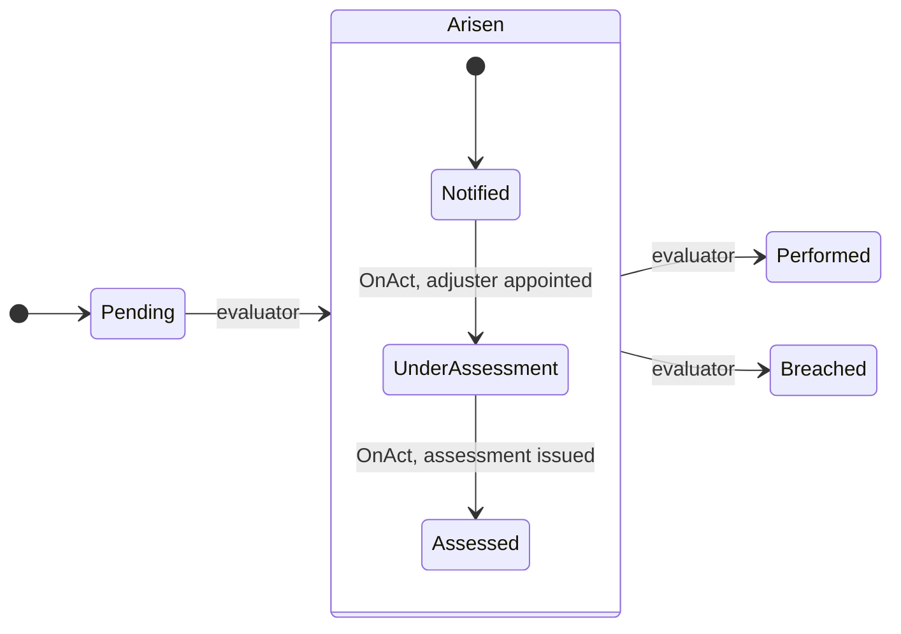
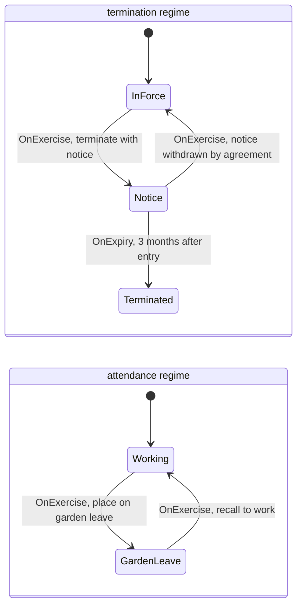
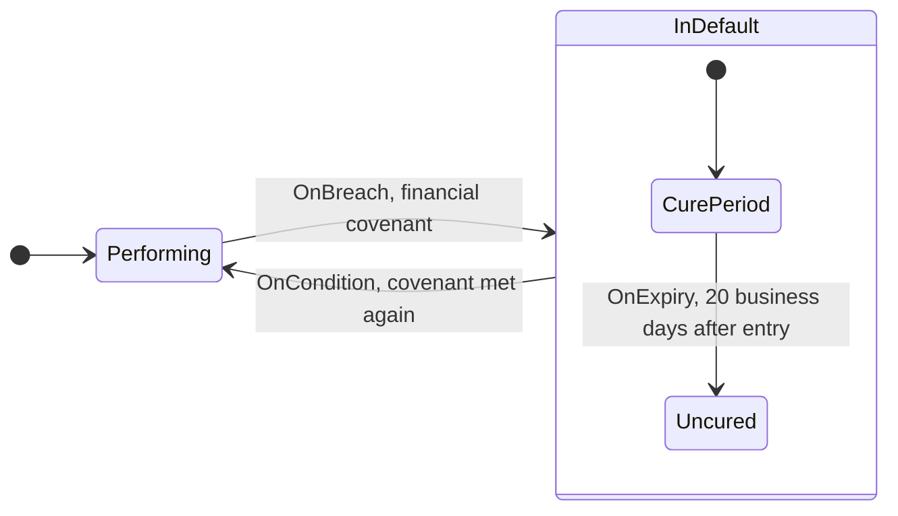
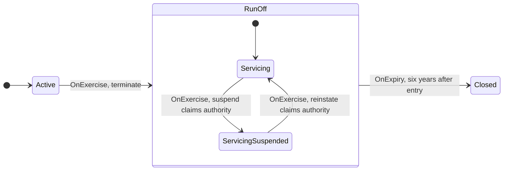
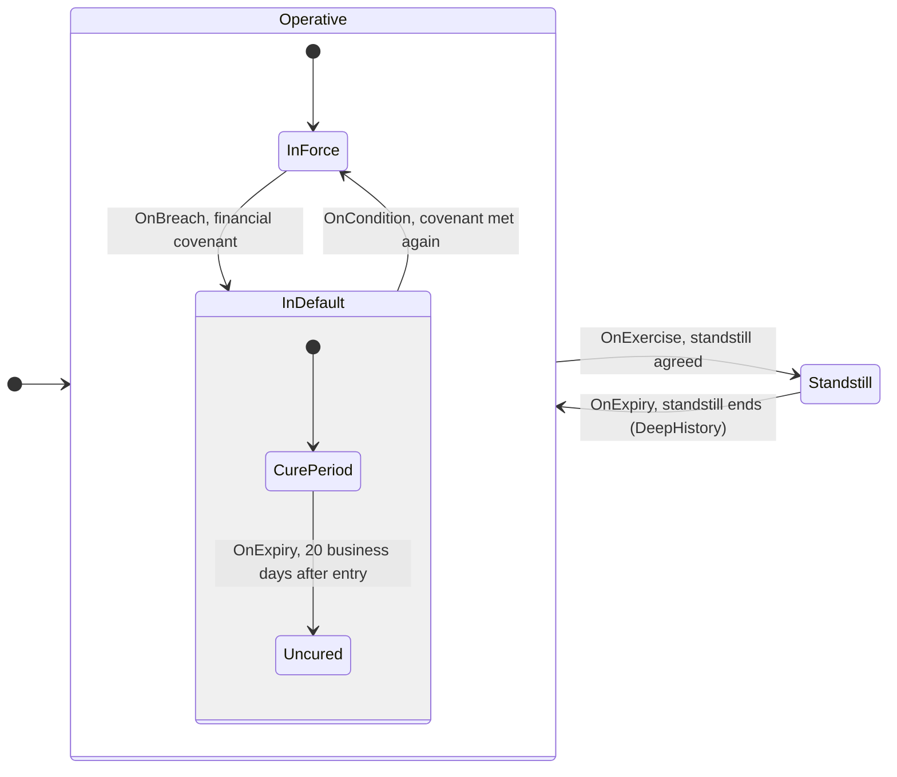
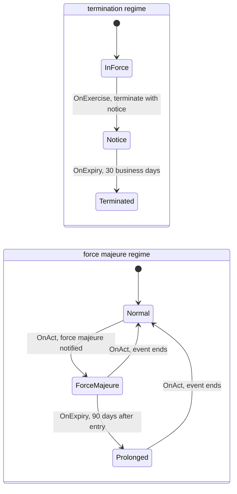
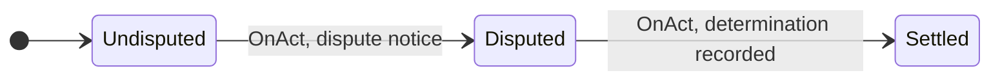

<!-- SPDX-License-Identifier: CC-BY-SA-4.0 -->

# Nested states, history and concurrent regimes

**Unit:** [`computable-contract-substrate`](../plans/computable-contract-substrate.md), slice C11a
phase 1. **Status:** draft for the C11a gate, 2026-10-02.
**Amends:** [ADR-A106](../../architecture/decisions/ADR-A106-behaviour-configuration-runtime-occasions-and-records.md)
through its addendum. **Reads with:** the CCS sketch §7.4 to §7.11 and the
[Behaviour README](../../../ontology/behaviour/README.md).

---

## 1. Premise

Things that change state over time often hold states inside states. A borrower in default is
first in a cure period, then uncured, and both end when the default does. A service
under suspension returns to whatever it was doing before. And several independent state machines
run on one subject at once: an agreement may be under notice and under force majeure together.

Behaviour today has flat state spaces, one occupancy per space, and an interim rule (law B5) that a
suspended occasion or regime resumes its prior state. This sketch decides how a state holds states
of its own, how a return finds the state it left, how concurrent regimes interact, and in which
order the evaluator (C12) applies all of it, without inference and with every state entry
recorded (B6).

## 2. Reference semantics

Behaviour takes W3C SCXML (State Chart XML, Recommendation 2015) as its reference, so a reader who
knows statecharts reads Behaviour's configuration without surprise. It does not claim conformance
to SCXML: it departs wherever RDF, the evidence rule or the legal reading need something else, and
where safety matters more than the standard's default. The departures are listed here and nowhere
else.

| SCXML | Behaviour | Note |
|---|---|---|
| compound state (`<state>` with children) | a state with one region, a nested `bhv:StateSpace` (§3) | |
| parallel state (`<parallel>`) | a state with several regions | |
| `<initial>` | `bhv:initialState` on the region (C11-Q2) | reused unchanged |
| shallow and deep `<history>` pseudo-states | `bhv:entryMode` on the entering transition (§4) | departs: no pseudo-state nodes |
| document order breaks ties | `bhv:priority`, then the conflict rule of §7 | departs: RDF has no document order |
| transitions from inner states preempt their ancestors' | kept (§7) | |
| exit deepest first, enter outermost first | kept (§7) | |
| macrostep of microsteps, eventless transitions to quiescence | one macrostep per positioned stimulus, derived triggers to quiescence (§7, law B10) | |
| events, including internal ones | positioned stimuli and derived triggers (B3) | departs: no clock, no raised events |
| `In(state)` in conditions | `bhv:requiresState` on a guard (§6.3) | |
| `type="external"` by default, `"internal"` on request | a transition that returns to its own state is internal unless it declares `bhv:External` (§4.1) | departs: the safe default |
| datamodel, executable content | Eligibility guards and effect definitions | departs |
| `<final>` and `done.state` events | not adopted. A composite is left by an explicit transition | departs, revisit if a case needs it |

## 3. Composite states

**Decided.** A state holds sub-states through **regions**. A region is a `bhv:StateSpace` that
names the state it refines with `bhv:regionOf`. A state with one region is compound, a state with
several is parallel, and a state with none is atomic. A region has its own `bhv:initialState`,
exactly as a top-level space does (C11-Q2).

```text
bhv:regionOf      StateSpace → State      functional. The state this space refines
bhv:initialState  StateSpace → State      as today, on every region
```

The direction runs from region to parent, not from state to region, for two reasons. A region can
refine a state the configuration author does not own, such as a core occasion state (§8), without
changing that state's description. And a regime template nests in another by naming the parent
state, so the library's period template can be dropped into any state of any regime (CCS sketch
§7.7). The rejected alternative, a parent property on each state (`bhv:subStateOf`), would put
sub-states into the parent's space, so a region would have no initial state of its own and parallel
regions could not be told apart.

```turtle-example
ex:covenant-regime a bhv:StateSpace ;
    bhv:initialState ex:performing .
ex:performing a bhv:State ; bhv:inStateSpace ex:covenant-regime .
ex:default    a bhv:State ; bhv:inStateSpace ex:covenant-regime .

ex:default-stages a bhv:StateSpace ;         # a region: default is now compound
    bhv:regionOf ex:default ;
    bhv:initialState ex:cure-period .
ex:cure-period a bhv:State ; bhv:inStateSpace ex:default-stages .
ex:uncured     a bhv:State ; bhv:inStateSpace ex:default-stages .
```

A transition may leave from, or arrive at, a state at any level of one tree. Arriving at a
composite state enters each of its regions at its initial state (or by history, §4). Arriving at a
nested state from outside also enters every ancestor on the way. Leaving a composite state leaves
every active state inside it. A transition never joins two separate trees: its source and target
share the same top-level space (law B9).

### 3.1 When to nest

**Decided.** States that occur together are not, on that account, nested. Nest a machine inside a
state only when its states depend on that state:

1. **Existence.** Its states have no meaning outside the parent: a cure period is a stage of a
   default, and there is no cure period without one.
2. **Exit.** Every way out of the parent must end it, so a rule would otherwise have to be repeated
   on each exit.
3. **Return.** Re-entering the parent must find it again (history, §4).

Where none of these holds, the two machines are **separate regimes** on the subject (§6). An entry
that is allowed only in some state of another regime is a guard (`bhv:requiresState`, §6.3), and
an end caused by another regime's change is a legal trigger, not a nesting. Garden leave is the
example (§9.1): it may start during notice, but it can exist without notice, notice can begin
during it, and nothing in it depends on the notice state, so it is a regime of its own.

A test for an author: if the inner machine could be entered, or could continue, while the parent
is not active, it is not nested.

## 4. History

**Decided.** History is a property of the transition that enters a composite state, not of the
composite state itself. `bhv:entryMode` on a transition definition takes one of three
individuals:

| Entry mode | On entering the target composite |
|---|---|
| `bhv:DefaultEntry` (when absent) | each region at its initial state |
| `bhv:ShallowHistory` | each region at the state it held when the target was last exited, then the defaults below it |
| `bhv:DeepHistory` | the whole configuration below the target as it was when last exited |

A target never exited before is entered by default, whichever mode the transition declares.

The brief asked for history declared per composite state. Per transition is what the cases need:
an agreement takes effect into "operative" by default, and a reinstatement returns into
"operative" by history. SCXML gets the same effect by targeting a history pseudo-state, which in
RDF would be a node standing for nothing a reader recognises.

**What history reads.** Nothing new is stored for it. When an execution leaves a composite state,
each occupancy it ends records `bhv:exitedBy` that execution. A history entry finds the occupancies
the target's last exit ended, and each occupancy it creates names the one it resumes with
`bhv:resumedFrom`. A resumed state is a new occupancy, since records are never reopened.

```text
bhv:exitedBy     StateOccupancy → TransitionExecution   functional. The execution that ended it
bhv:resumedFrom  StateOccupancy → StateOccupancy        functional. The occupancy a history entry resumed
bhv:entryMode    TransitionDefinition → EntryMode       functional, DefaultEntry when absent
```

This replaces law B5's interim rule (§10).

### 4.1 Internal and external transitions

**Decided, 2026-10-02.** A transition whose source and target are the same state is **internal**
unless it declares otherwise: it applies its effects and records an execution, and leaves and
enters nothing, so it creates no occupancy, keeps the state's entry time, and does not disturb
history. A transition that declares `bhv:transitionType bhv:External` leaves the state and enters
it again, with a new occupancy, by its entry mode.

```text
bhv:transitionType  TransitionDefinition → TransitionType   functional. Internal when absent and
                                                            source equals target. External otherwise
```

The default is the reverse of SCXML's, deliberately. An effect-only reaction written as a
self-transition (a payment recorded during a notice period) must never restart a period anchored
on entry into the state. Restarting is the case that should take a word: re-serving notice so that
the period runs again is `bhv:External`. A transition between different states is always external,
and declaring `bhv:Internal` on one is reported.

## 5. Occupancies

**Decided.** One occupancy per active state, at every level. A borrower in "default", in its
"cure period", holds two current occupancies, one of each. The set of a subject's current occupancies is
its **active configuration**.

Per level, not per leaf, because `ins:appliesInState` may name a composite state ("applies during
the default", whatever stage it is in), and the evaluator then reads one occupancy instead
of walking the hierarchy (B4's spirit: no inference at runtime). It also gives every exit and
every history entry a record to point at.

**B6 holds unchanged.** Every occupancy an execution creates, the target's and every ancestor and
default sub-state it enters with it, names that execution with `bhv:enteredBy`. When a subject takes
effect, each initial state down the tree is occupied with evidence of the subject taking effect.

**A configuration is well formed** (law B11): for every current occupancy of a state in a region,
the subject has a current occupancy of the region's parent state, and every region of every
currently occupied state holds exactly one current occupancy.

## 6. Concurrent regimes

### 6.1 Two forms, both kept

| Form | What it is | When |
|---|---|---|
| **separate regimes** on one subject | several top-level state spaces whose occupancies are for the same subject | independent machines that can overlap at any time: termination and force majeure on an agreement |
| **parallel regions** within one state | a state with several regions | concurrency that exists only while that state does (§3.1): during run-off, claims servicing and premium collection each run their own course, and both end with run-off |

Separate regimes are what SCXML would write as a parallel state at the root. Behaviour keeps them
separate because they arise under different terms and belong to them (ADR-A104 decision 2), and
because an instrument may gain or lose a regime by amendment while the others continue.

### 6.2 How regimes interact

1. **No ranking.** Behaviour never ranks one regime over another. Each regime takes its own
   transitions, and its state is evaluated on its own.
2. **Gating.** A relation's `ins:appliesInState` values are grouped by the top-level regime their
   states belong to. Within one regime, the relation applies in any of the named states. Across
   regimes, it applies only when each regime's group holds. A composite state holds while any of its
   descendants is active.
3. **Conflict between relations is Instrument's.** When force majeure excuses a duty that the
   notice regime keeps alive, the two relations conflict, and `ins:excepts` and `ins:prevailsOver`
   (NRS N10) resolve it. Behaviour supplies the states, not the precedence.
4. **One regime reacts to another** through legal triggers (an exercise, an act, a condition) or
   through a guard that reads another regime's state (§6.3). Never by one regime's transition
   naming another regime's states (B9).

### 6.3 Guards that read a state

A guard may require that the subject is, or is not, in a state of any regime on the same subject:
SCXML's `In()`.

```text
bhv:requiresState  GuardDefinition → State   any number. Grouped by regime as in §6.2
bhv:excludesState  GuardDefinition → State   any number. The guard fails if any is active
```

### 6.4 Periods that do not run in another regime's state

Whether a notice period runs during force majeure, or a cure period during a suspension, is a term
of the contract, not a property of statecharts. It is raised as question C11a-Q2 (§11).

## 7. Evaluation order

C12 applies one **macrostep** per positioned stimulus, to every subject the stimulus can affect,
and records every execution with that stimulus as its cause.

1. **Select.** For each active atomic state, walk outwards through its ancestors and take the first
   state with a transition whose trigger matches the stimulus and whose guard is Permitted. An inner
   state's transition preempts its ancestors' (SCXML).
2. **Resolve within a state.** Among the enabled transitions of one state, the state's selection
   policy applies (ADR-A09). `SingleMatch`: more than one enabled is a conflict. `PriorityOrdered`:
   the highest `bhv:priority`. `AllMatches` applies to internal transitions only: every enabled
   one fires, in priority order, each guard reading what the one before it left (C11a-Q3, the
   sequential environment of the [evaluation context](evaluation-context.md) §7). Internal
   transitions fire before the state's state-changing transition, if any.
3. **Resolve across regions.** Two selected transitions conflict when their exit sets intersect.
   The one whose source is deeper wins, then the higher `bhv:priority`. A remaining tie takes no
   transition and records the diagnostic, so the subject's state for that region is Undetermined
   until an adjudicator records an outcome (Strong Kleene, as for every other decision).
4. **Exit**, deepest first, recording `bhv:exitedBy` on every occupancy ended.
5. **Enter**, outermost first, by each transition's entry mode, recording `bhv:enteredBy` (and
   `bhv:resumedFrom` on a history entry).
6. **Derived triggers.** `ins:OnCondition` and `ins:OnBreach` read the new configuration and may
   enable further transitions at the same position. Steps 1 to 5 repeat until none is enabled. A
   configuration whose derived triggers can form a cycle is rejected at design time (law B10).

Activation policy (ADR-A10) is unchanged: a deferred or manual transition is selected in step 1 and
executed when it activates.

## 8. Occasions

C11-Q1 fixed six core occasion states, whose transitions are the evaluator's. A deployment reaches
an occasion in two ways, both through one property:

```text
bhv:perOccasionOf  StateSpace → (any)   any number. One instance of the space per occasion of the
                                        declaration named. No range (B7)
```

- **A refinement** of a core state is a region (`bhv:regionOf bhv:Arisen`, for example) that is
  also `bhv:perOccasionOf` the relations whose occasions it refines. Its own transitions are the
  deployment's, but stay inside it (law B9): the move out of the core state is always the
  evaluator's, and leaves the refinement with it.
- **A parallel regime** on an occasion is a top-level space `bhv:perOccasionOf` the relation: a
  dispute, a cure period, a force majeure claim for one obligation.



An indemnity obligation's `Arisen` refined by a claims-handling region. The deployment declares
`Notified`, `UnderAssessment` and `Assessed` and their transitions. The evaluator still decides
when the occasion is performed or breached.

**Suspension and B5.** In the core space, `Suspended` is entered from `Pending` or `Arisen`, and
reinstatement returns to whichever it left. In statechart terms that is history, which needs a
composite to return into. Question C11a-Q1 (§11) asks whether to give the core one.

## 9. Worked cases

Each case is given as configuration, then as the records a sequence of stimuli produces. `ex:`
names are illustrative. Instrument terms (`ins:appliesInState`, `ins:OnExercise`) are those of the
CCS sketch §5 and §7.

### 9.1 Garden leave: a separate regime, not a nested one

The brief listed garden leave within a notice period as a case for nesting. By §3.1 it is not one.
An employer may put an employee on garden leave with no notice given (during an investigation, for
example), notice may be served while the employee is already on garden leave, and garden leave
does not depend on any stage of the notice period. So the employment has two regimes:



The duty to work applies in `Working`. An Exclusion of it, and a Prohibition on working for a
competitor, apply in `GardenLeave`. Salary applies in `InForce` and `Notice`.

| Contract wording | Configuration |
|---|---|
| "the employer may place the employee on garden leave at any time" | as drawn |
| "during any period of notice, the employer may place the employee on garden leave" | the transition's guard `bhv:requiresState ex:notice` |
| "garden leave ends if notice is withdrawn" | a transition `GardenLeave → Working` triggered by the exercise that withdraws notice |
| termination ends everything | nothing to model: once the employment ends, no relation applies in any of its regimes' states |

Any order of events is an ordinary pair of states, one per regime: on garden leave and then given
notice, or given notice and then put on garden leave. Garden leave would be nested only if the
contract made it depend on the notice state, for example if each return to notice after a
suspension had to restore it (§3.1, third test).

### 9.2 A cure period within default



The power to accelerate applies in `Uncured` only. The transition back to `Performing` leaves from
the composite, so a cure in either sub-state ends the default.

| Stimulus | Exited | Entered |
|---|---|---|
| covenant breached | `Performing` | `Default`, `CurePeriod` |
| 20 business days pass | `CurePeriod` | `Uncured` |
| covenant met again | `Uncured`, `Default` | `Performing` |

### 9.3 Suspension within run-off



The coverholder's power to settle claims applies in `Servicing`. Leaving `RunOff` after six years
exits whichever sub-state is active.

### 9.4 Reinstatement after suspension, with history

A facility is suspended by a standstill agreement, which may be entered while the facility is in
force or in default, and reinstatement returns it to where it was. Here the third test of §3.1
holds, so the states the standstill interrupts are nested in `Operative`.



| Stimulus | Exited | Entered |
|---|---|---|
| takes effect | | `Operative`, `InForce` (evidence) |
| covenant breached | `InForce` | `Default`, `CurePeriod` |
| 20 business days pass | `CurePeriod` | `Uncured` |
| standstill agreed (execution x3) | `Uncured`, `Default`, `Operative`, each `exitedBy` x3 | `Standstill` |
| standstill ends, deep history | `Standstill` | `Operative`, `Default`, `Uncured`, each `resumedFrom` the occupancy x3 ended |

With `ShallowHistory` the last row enters `Operative`, `Default` and then `CurePeriod`, the
region's default under the state history restored, so the borrower gets a fresh cure period.
Suspended from `InForce`, either mode returns to `InForce`. Whether the cure period ran during the
standstill is question C11a-Q2.

### 9.5 Force majeure overlapping notice

Two separate regimes on the agreement:



An Exclusion of the affected party's performance duties applies in `ForceMajeure` and
`Prolonged`. A power to terminate for prolonged force majeure applies in `Prolonged`, and its
exercise is an `ins:OnExercise` trigger of the termination regime's transition to `Terminated`. The
regimes interact only through that trigger (§6.2). The two regimes are each in one state at every
position: `Notice` and `ForceMajeure` together is an ordinary configuration.

### 9.6 A disputed occasion

A dispute regime runs per occasion of the payment obligation:



`ex:dispute-regime bhv:perOccasionOf ex:pay-invoice`. Each invoice's occasion gets its own instance.
The occasion's core state is untouched: an unpaid invoice is still `Breached` when its due range
ends. What the dispute changes is a consequence: an Exclusion excepting the power to terminate for
non-payment applies in `Disputed`. Which occasion's dispute state that Exclusion reads, when the
power's own case is the breach, is question C11a-Q4.

## 10. Laws

| Law | Statement | Checked by |
|---|---|---|
| B5 (restated) | A transition with a history entry mode enters the configuration its target held when last exited, shallow or deep as it declares, or by default if the target was never exited. Each occupancy it creates names the occupancy it resumes | SHACL on records, C12 |
| B6 (extended) | Every occupancy an execution creates names it, including the ancestors and default sub-states entered with the target. Every occupancy an execution ends names it with `bhv:exitedBy` | SHACL |
| B9 | A transition's source and target belong to one tree of regions under one top-level space. A transition declared in a refinement of a core occasion state has its source and target inside that refinement | SHACL-SPARQL |
| B10 | The derived triggers of a subject's regimes cannot form a cycle of transitions at one position | design-time check |
| B11 | A subject's current occupancies form a well-formed configuration: each nested state's parent is occupied, each region of each occupied state holds exactly one current state | SHACL-SPARQL |

B1 to B4, B7 and B8 stand as ADR-A106 states them.

## 11. Questions for the human

**Answered 2026-10-02:** C11a-Q1 (a), C11a-Q2 (a) and C11a-Q4 (a), as recommended. C11a-Q3: (c),
`AllMatches` redefined over internal transitions, composing their effects into one computation in
the sequential environment, in priority order, with distinct priorities among the competitors. The
parallel environment and its merge rules are deferred to the
[evaluation context](evaluation-context.md) design (its §7).

**C11a-Q1. A composite for occasion suspension.** The six core states are flat, so B5's "resume the
prior state" is not statechart history. Options:

- (a) add a seventh core state, `bhv:Live`, with one region holding `Pending` and `Arisen`.
  `Suspended` sits beside `Live`, and reinstatement enters `Live` by deep history, restoring any
  refinement of `Arisen` too. Breaking for `behaviour-vocab` (`Pending` and `Arisen` change space),
  a MINOR under ADR-A113
- (b) keep the core flat, and let the evaluator resume the state an occasion's `Suspended` was
  entered from, a special case beside history

**Recommendation: (a).** One history mechanism for every state space, refinements of `Arisen`
survive a suspension without a second rule, and 0.x is the time to make the change.

**C11a-Q2. Periods that do not run.** "The notice period does not run while force majeure
continues" and "the cure period is extended by any period of suspension" are common terms. Options:

- (a) an expiry trigger declares the states during which its period does not run, and C12 counts
  the period over the subject's occupancy history, recomputing the expiry position on each entry and
  exit of those states (B3 holds: the position is computed, never read from a clock)
- (b) leave it to the contract: a transition into the pausing state exits the period, and a history
  re-entry starts a new period of the remaining length, computed with `ins:computedBy`

**Recommendation: (a)**, declared on `ins:OnExpiry` in C7a, with Behaviour providing the occupancy
history it reads. It states the term as written, and (b) needs calculated values that are not
designed yet (CCS sketch §7.9).

**C11a-Q3. `AllMatches` within a region.** A region holds one state, so firing every enabled
transition of one state is incoherent once states nest. Options: (a) a design-time error when two
transitions from one state in one region can both be enabled under `AllMatches`, keeping the policy
for its existing uses, (b) deprecate `AllMatches`. **Recommendation: (a)**, since ADR-A09 records no
case it serves that the macrostep does not.

**C11a-Q4. Which occasion a per-occasion state gates.** An Exclusion gated by `Disputed` must read
the dispute regime of one occasion. Options: (a) the occasion the relation's case refers to, through
its arising trigger (for a power arising `ins:OnBreach` of the payment obligation, the breached
occasion), and Undetermined when the chain does not reach exactly one, (b) the relation names the
occasion's relation explicitly with a qualifier on `ins:appliesInState`. **Recommendation: (a)**,
which needs no new term and reads the same records the evaluator already holds. Settled in C7a.

## 12. What phase 2 changes

Briefed after the gate. Expected, subject to the answers:

| Document | Change | Version |
|---|---|---|
| `behaviour` (configuration) | `bhv:regionOf`, `bhv:perOccasionOf`, `bhv:entryMode` and `bhv:EntryMode`, `bhv:transitionType` and `bhv:TransitionType`, `bhv:requiresState`, `bhv:excludesState`. Shapes for B9, the region rules, `AllMatches` only on internal transitions with distinct priorities, and agreement among state-changing competitors | MINOR, additive |
| `behaviour-runtime` | `bhv:exitedBy`, `bhv:resumedFrom`. Shapes for B5, B6 extended and B11 | MINOR, additive |
| `behaviour-vocab` | the three entry modes, the two transition types, `bhv:Live` and its region (C11a-Q1) | MINOR, breaking |
| README | the model, the worked cases as examples, release notes | |

C12 implements §7. C7a settles C11a-Q2 and C11a-Q4 in Instrument. Phase 2 also gives the Behaviour README a section of
worked state machines, each case of §9 in depth, with diagrams and Turtle, authored as examples
before the model (ADR-A-C2).
