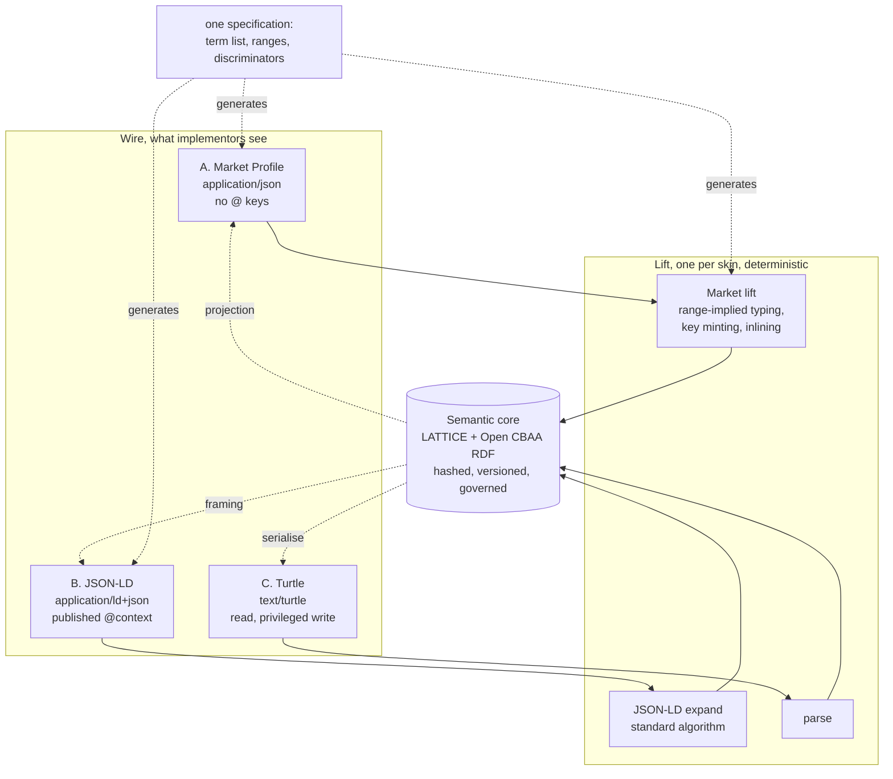

<!-- SPDX-License-Identifier: CC-BY-SA-4.0 -->

# A normative wire protocol for the markets

Version 0.1, draft for review. Explores how LATTICE and Open CBAA expose contract terms over an API
that a market implementor will actually adopt. Takes as given that the internal model is RDF and
OWL, and that the wire should not be.

Companion to [legalruleml-runtime-pipeline.md](legalruleml-runtime-pipeline.md), which covers how a
LegalRuleML document gets in. This sketch covers everything else that crosses a process boundary.

**The position it argues.** One semantic core, several wire skins, one deterministic lift per skin.
JSON-LD is offered and is not the default. The default is a plain-JSON profile with no `@` keys at
all, where node types come from property ranges rather than from the document. Term bodies are
polymorphic, so a term may be expressed as structured conditions, as embedded LegalRuleML, as
InsurLE text, or as unextracted prose, and the response says which form was lifted and what refused.

---

## Contents

1. [Who the consumer actually is](#1-who-the-consumer-actually-is)
2. [The house position, which already constrains this](#2-the-house-position-which-already-constrains-this)
3. [The MCN precedent, and what it does and does not transfer](#3-the-mcn-precedent-and-what-it-does-and-does-not-transfer)
4. [The `@type` problem, and the honest fix](#4-the-type-problem-and-the-honest-fix)
5. [Four candidate skins](#5-four-candidate-skins)
6. [The proposal: a profile stack](#6-the-proposal-a-profile-stack)
7. [The Market Profile, concretely](#7-the-market-profile-concretely)
8. [Polymorphic term bodies](#8-polymorphic-term-bodies)
9. [Identity without IRIs](#9-identity-without-iris)
10. [Decisions on the wire](#10-decisions-on-the-wire)
11. [Content negotiation and versioning](#11-content-negotiation-and-versioning)
12. [The lift is the contract](#12-the-lift-is-the-contract)
13. [What this costs](#13-what-this-costs)
14. [Open questions](#14-open-questions)

---

## 1. Who the consumer actually is

Worth being concrete, because the answer determines everything else.

| Consumer | Stack | Tolerance for RDF | What they want |
|---|---|---|---|
| Binding platform at a broker | Java or .NET, OpenAPI codegen, Jackson or `System.Text.Json` | **none.** Adding an RDF library to a regulated production service is a procurement conversation | a typed client, generated from a spec, with POJOs |
| Coverholder system integrator | whatever the coverholder bought in 2011 | none | flat JSON, ideally with an example they can paste |
| Market body (LMA, Lloyd's) | mixed, some semantic-web literacy | some | something they can standardise on and validate |
| Regulator or academic partner | Python, RDF-native | **high.** They want the graph | Turtle, SPARQL, provenance |
| An LLM producing mapping proposals | n/a | n/a | minimum tokens |
| Our own review workbench | TypeScript, React | none | the projection, already shaped |

Six audiences, three incompatible optima. A single wire format that serves all six will serve none
well, and the attempt is where this kind of project usually goes wrong.

The repository already implies the resolution. `contracts/` carries plain JSON with
`format: "uri"` where an IRI is genuinely needed, the OpenAPI spec describes a typed control plane,
SPC's egress applies JSON-LD framing where a consumer wants linked data, and MCN exists for
generation. **The pattern of several skins over one core is already in the building.** This sketch
makes it deliberate and adds the market-facing one.

---

## 2. The house position, which already constrains this

Three standing rules, all of which this design must respect rather than relitigate.

**No RDF crosses a message boundary.** From the semantic platform document: *"Job payloads carry
only these references. They do not carry RDF, credentials, browser tokens, or unrestricted endpoint
details."* The universal portable description is a **graph reference**: tenant, project, absolute
graph IRI, immutable revision hash.

**The control plane is typed and synchronous, the semantic plane is asynchronous.** The OpenAPI
spec describes the first and says so in its own description: *"Typed control-plane contract.
Semantic graph content is referenced by immutable graph references."*

**Contracts are JSON Schema 2020-12, strict.** `$id` under `https://schemas.nebularis.org/lattice/`,
`additionalProperties: false`, nested `$defs` rather than external `$ref`.

So the question this sketch answers is narrower than it first appears. It is not "what is our wire
format". It is: **when a caller needs the semantic content itself rather than a reference to it,
what shape does that content take?** That happens in exactly three places: submitting a contract's
terms, reading them back, and receiving a decision about a case.

---

## 3. The MCN precedent, and what it does and does not transfer

[MCN](../../architecture/mork-compact-notation.md) already solved "RDF serialisations are too noisy"
once, for a different audience, with measured results.

| Document | Triples | MCN | Turtle | **JSON-LD compacted** | RDF/XML |
|---|---|---|---|---|---|
| `loan_mapping.ttl` | 40 | **219** | 614 (2.8×) | **1418 (6.5×)** | 1383 (6.3×) |
| `UncertainMappings.ttl` | 160 | **1366** | 2674 (2.0×) | **5308 (3.9×)** | 5929 (4.3×) |

Its stated reason is worth quoting, because it is the same complaint the markets will have:

> long prefixed names are repeated on every triple, every individual is re-typed as
> `owl:NamedIndividual`, every mapping restates its scheme membership, and reified `owl:Axiom`
> annotations cost fifty tokens to say "this match is lexical".

### 3.1 What transfers

**The architecture, entirely.** MCN's design is: a compact wire form, a deterministic decoder, and
the explicit guarantee that *"No compiler, shape or reasoner needs to know MCN exists."* Decoded RDF
is what is stored, hashed, validated and compiled. That is precisely the shape a market API needs,
and it is already house-sanctioned rather than novel.

Four of its seven design rules transfer verbatim:

| MCN rule | Transfers |
|---|---|
| Say each fact once. Typing and membership come from context or the decoder | **yes.** This is the whole answer to `@type` (§4) |
| Structure is positional where the ontology fixes it | **yes**, as "structure is nested where the ontology fixes it" |
| Anything not covered is still expressible, via an escape hatch | **yes.** §8's polymorphic bodies are that escape hatch |
| Decoding is a pure function of the text, so output can be hashed and cached | **yes**, and it is what makes the lift auditable |

### 3.2 What does not transfer

**The optimisation target.** MCN optimises tokens for a machine generator and explicitly says
*"Human readability is not a goal. Where legibility and token count conflict, token count wins."*

A market API has the opposite priority. A developer at a broker reads the payload, pastes it into a
ticket, diffs it in a pull request, and greps a log for it. Token count is irrelevant. **Legibility
and toolchain familiarity are the entire game.**

So: reuse MCN's architecture, reject its notation, and do not invent a third bespoke syntax when
JSON is what the audience already has. The measured 6.5× is evidence against *compacted JSON-LD as
a generation target*, not evidence against JSON.

---

## 4. The `@type` problem, and the honest fix

The instinct that `@type` will make JSON-LD unpopular is correct, and the fix is better than it
looks.

### 4.1 Why `@type` is usually needed, and why it need not be

JSON-LD needs `@type` when the consumer must know a node's class and nothing else says so. But in a
well-specified ontology, **the property already says so**. `ins:bearer` has range
`pty:RoleOccupancy`. `ins:activatedBy` has range `elg:AdmissionProfile`. A node reached by
`ins:bearer` is an occupancy whether or not the document says it.

So the rule is:

> **Types are implied by range, never stated on the wire.** The lift materialises `rdf:type` from
> the property that reached the node. A document that states a type is accepted and ignored unless
> it conflicts, in which case it is refused.

This is not a trick. It is the same move MCN makes ("typing and scheme membership are supplied by
context or by the decoder, never repeated per node"), and it is sound because LATTICE declares
ranges. Where a range is a union or is absent, the property gets a **discriminator** instead, which
is an ordinary enum field with a business-meaningful name like `modality` or `form` rather than
`@type`.

### 4.2 What JSON-LD 1.1 can and cannot hide

Since JSON-LD remains one of the offered skins, worth being precise about how far its own features
get, because the answer is "further than most people think, and not all the way".

| Noise | JSON-LD 1.1 mitigation | Fully hidden? |
|---|---|---|
| Prefixed names everywhere | `@vocab` in the context | **yes** |
| `@type` on every node | property-scoped contexts, plus range-implied typing (§4.1) | **yes**, with the lift doing the work |
| IRI-valued fields wrapped in objects | `"@type": "@id"` on the term definition | **yes** |
| Arrays where one value is normal | `"@container": "@set"` normalises, and single values are legal anyway | **yes** |
| Keyed collections | `"@container": "@index"` or `"@id"` gives maps instead of arrays | **yes** |
| Deep nesting that mirrors the graph | `@nest` flattens presentational grouping | **partly** |
| `@id` on every node | `@base` plus relative IRIs shortens it. Cannot remove it | **no** (see §9) |
| `@context` itself in every document | HTTP `Link: rel="http://www.w3.org/ns/json-ld#context"` header moves it out of the body | **yes**, for HTTP |

So a carefully built context gets JSON-LD to within one field of plain JSON, and that field is
`@id`. §9 removes it.

The conclusion is not "JSON-LD is fine after all". It is: **the gap between good JSON-LD and plain
JSON is small enough that the choice should be made on toolchain, not on aesthetics.** And on
toolchain, plain JSON wins for the market audience, because OpenAPI codegen produces clean POJOs
from it and produces awkward ones from anything with `@` keys.

---

## 5. Four candidate skins

| Skin | Audience | Verdict |
|---|---|---|
| **A. Plain JSON, Market Profile** | binding platforms, coverholders, integrators | **default.** No `@` keys, OpenAPI-describable, codegen-clean |
| **B. JSON-LD with a published context** | market bodies, regulators, semantic-web-literate consumers | **offered**, content-negotiated. Same information, `application/ld+json` |
| **C. Turtle or N-Quads** | regulators, academic partners, our own tooling | **offered** for read, refused for write except by privileged callers |
| **D. MCN** | LLM proposal generation | **exists.** Not exposed on the public API |

One core, four projections, and the projections are generated from one specification rather than
hand-maintained. That last point is the difference between this working and rotting: if the Market
Profile schema and the JSON-LD context drift, the API lies to half its users.

---

## 6. The proposal: a profile stack



**The specification generates the skins.** A single term table — property, range, discriminator,
cardinality, market name — generates the JSON Schema, the JSON-LD context, the OpenAPI components
and the lift's dispatch table. Drift becomes impossible rather than merely discouraged, and adding
a term is one row rather than four edits.

This is the same generation discipline the repository already applies to ontology catalogs and
compiled artefacts, so it needs no new argument.

---

## 7. The Market Profile, concretely

A binding authority's scope of underwriting authority, the running example from the mapping sketch.

```json
{
  "lattice": "1.0",
  "instrument": {
    "key": "BA-2026-001",
    "version": 1,
    "parties": [
      { "key": "coverholder", "role": "coverholder", "actor": "harbour-underwriting-ltd" },
      { "key": "leadInsurer", "role": "insurer", "actor": "insurer-a", "share": 0.6 },
      { "key": "followInsurer", "role": "insurer", "actor": "insurer-b", "share": 0.4 }
    ],
    "participation": { "key": "insurers", "rule": "several", "members": ["leadInsurer", "followInsurer"] },
    "terms": [
      {
        "key": "uw-authority",
        "form": "conditions",
        "modality": "permission",
        "bearer": "coverholder",
        "activity": "bind",
        "activatedBy": {
          "all": [
            { "read": "policy.contractType", "scheme": "contract-type", "match": "exact", "oneOf": ["insurance"] },
            { "read": "riskLocation", "scheme": "territory", "match": "hierarchical",
              "within": ["FR"], "except": ["FR-20R"] },
            { "read": "sumInsured", "atMost": [
                { "amount": 5000000, "unit": "GBP" },
                { "amount": 5750000, "unit": "EUR" } ] }
          ]
        }
      },
      {
        "key": "fnol-notice",
        "form": "conditions",
        "modality": "obligation",
        "kind": "achievement",
        "bearer": "coverholder",
        "beneficiary": "insurers",
        "activatedBy": { "all": [ { "read": "type", "oneOf": ["fnol"] } ] },
        "fulfilledWhen": { "all": [ { "read": "onwardTransfer", "present": true } ] },
        "deadline": { "after": "receipt", "within": { "amount": 1, "unit": "businessDay" },
                      "calendar": "lma-london" },
        "compensatedBy": "late-notice-fee"
      }
    ],
    "bindings": {
      "territory": "iso-3166:2026",
      "contract-type": "lma-contract-type:2025"
    }
  }
}
```

### 7.1 What was removed, and where it went

| RDF concern | Where it went |
|---|---|
| `@context`, `@vocab`, prefixes | the `"lattice": "1.0"` version marker selects the term table server-side |
| `@type` on every node | **range-implied** (§4.1). `bearer` has range `pty:RoleOccupancy`, so the lift types it |
| `@id` everywhere | **claimed keys** (§9). `"coverholder"` is document-local and the server mints the IRI |
| `elg:EvidenceBinding` with indexed `elg:EvidenceStep` nodes | `"read": "policy.contractType"`, a dotted path the lift explodes into ordered steps |
| `voc:SchemeContract` reference | `"scheme": "territory"`, resolved against the `bindings` block |
| `qnt:RangeSet` → `qnt:Range` → `qnt:Bound` → `qnt:Quantity` → `qnt:ValueSpace` | `"atMost": [{ "amount": …, "unit": … }]`. Five levels of RDF, one level of JSON |
| `pty:ParticipationGroup` + `pty:GroupMembership` + `pty:share` | `participation` with `members` and inline `share` |
| `elg:compatibilityOperation` | `"all"` / `"any"` as the key itself |
| `fnd:TemporalScope`, `owl:versionIRI` | `"version": 1`, plus `ETag` and `If-Match` on HTTP |

The `atMost` row is the one that sells it. Five nested RDF nodes become one array of two objects,
and nothing is lost because the lift knows the shape.

### 7.2 The properties that make it work

- **`read` is a dotted path, not an IRI.** The lift resolves each segment against the subject class
  declared for the term, producing `elg:EvidenceStep` nodes with `elg:stepIndex`. An unresolvable
  segment is a refusal with the segment named, not a silent empty binding.
- **`within` / `except` rather than `requiredConcept` / `excludedConcept`.** Same semantics, reads
  like the clause it came from. Exclusion precedence (L10) is unchanged and documented, not implied.
- **Quantities are `{amount, unit}`.** No datatype IRIs, no value-space reference. The unit resolves
  against the bound scheme, and a unit with no bound limit yields `undetermined` exactly as the
  Eligibility law requires.
- **`compensatedBy` is a key reference.** A chain, expressed as a link, matching the proposed
  `ins:compensatedBy`. Acyclicity is checked at lift.

---

## 8. Polymorphic term bodies

This is where the instinct about embedding LegalRuleML pays off, and it is the most interesting part
of the design.

A term declares its **form**, and each form has a declared lift into the same internal graph. Five
forms, escalating in fidelity downward:

```json
{ "key": "uw-authority", "form": "conditions",  "modality": "permission", "activatedBy": { … } }

{ "key": "aggregate-cap", "form": "rules", "dialect": "lattice-rules-0.1", … }

{ "key": "notice-2", "form": "legalruleml", "dialect": "lrml-json-1.0",
  "statement": { "kind": "PrescriptiveStatement", "key": "ps2", "rule": { … } } }

{ "key": "notice-3", "form": "insurle",     "dialect": "insurle-0.1",
  "text": "The Coverholder must transfer a notification within 1 business day of receiving it." }

{ "key": "notice-4", "form": "prose",       "text": "The Coverholder shall …",
  "meaning": "unextracted" }
```

### 8.0 LegalRuleML as JSON, not as an escaped string

**Normalised LegalRuleML is a strict alternation of typed nodes and role edges**, which is a JSON object model already:

| Normalised XML | JSON |
|---|---|
| Node element (`Rule`, `Atom`, `Obligation`) | object with a `kind` discriminator. No `@type` |
| edge element (`if`, `then`, `arg`, `hasTemplate`) | property name |
| repeated edges, or `@index` | array, order preserved |
| `@key` | `key`, document-local per §9 |
| `@keyref` | `ref` |
| `@iri` | `iri`, a plain string |

```json
{
  "kind": "PrescriptiveStatement", "key": "ps1",
  "rule": {
    "kind": "Rule", "strength": "defeasible",
    "if": { "kind": "And", "formulas": [
      { "kind": "Atom", "rel": "Risk", "args": [ { "var": "x" } ] },
      { "kind": "Neg", "formula": { "kind": "Atom", "rel": "within",
          "args": [ { "var": "x" }, { "ind": "FR-20R" } ] } }
    ] },
    "then": { "kind": "SuborderList", "items": [
      { "kind": "Permission", "bearer": { "ref": "coverholder" },
        "formula": { "kind": "Atom", "rel": "bind", "args": [ { "var": "x" } ] } }
    ] }
  }
}
```

Four properties make this strictly better than the escaped form.

- **It is codegen-clean.** A discriminated `oneOf` on `kind` is what OpenAPI 3.1 and every JSON
  binding tool handle well. An escaped string is `String` in every generated model.
- **It round-trips deterministically to normalised XML**, so Route B of the ingress pipeline and the
  XML egress kit both stay available. Generate the XML, then run the OASIS transforms.
- **Malformed content fails at schema validation**, not three layers later inside a reparse. An
  escaped string is opaque to every validator between the sender and the parser.
- **No escaping defect can corrupt a legal document**, which is the failure mode that made the
  string form unacceptable.

The cost is real and worth stating: this skin is *faithful* to LegalRuleML, so it carries all of
LegalRuleML's generality, including joins, `Naf`, deontic bodies and `Alternatives`. The refiner
still refuses everything outside the fragment. That is acceptable for an **interchange** form and is
the wrong shape for the **default** form, which is why `conditions` and `rules` exist beside it.

**To verify:** whether a maintained normative JSON serialisation of RuleML already exists. Defining
one where a standard exists would be a mistake. See the [research sketch](logic-encoding-research.md), R1.

### 8.0.1 The `rules` tier

`conditions` covers the single-subject fragment. Some real terms need a join or an aggregate, and
the honest answer is a tier that admits them explicitly rather than pretending the fragment is
enough.

```json
{
  "key": "aggregate-cap",
  "form": "rules",
  "dialect": "lattice-rules-0.1",
  "modality": "prohibition",
  "bearer": "coverholder",
  "activity": "bind",
  "activatedBy": {
    "let": { "i": { "read": "insured" } },
    "all": [
      { "aggregate": "sum",
        "over": { "var": "p", "read": "i.policies", "closure": "policy-register" },
        "of": "p.sumInsured", "as": "total" },
      { "read": "total", "atLeast": [ { "amount": 10000000, "unit": "GBP" } ] }
    ]
  }
}
```

Three properties, each deliberate.

- **No `@` keys and no strings of logic.** Every node is a typed object, so codegen stays clean and
  the DMN mistake of putting an expression language in a string attribute is avoided.
- **Variables appear only through `let` and `over`, always rooted in a path** from the subject or
  another variable. That keeps every rule *safe* in the Datalog sense, every variable bound by a
  positive atom, and keeps explanations readable.
- **Closure is named, not assumed.** `"closure": "policy-register"` cites the declaration that
  licenses aggregating over a set. Omitting it is a submission-time refusal with
  `noClosureLicence`, never a silently wrong total. An aggregate over an incomplete set is the
  arithmetic equivalent of reasoning from absence.

`rules` is a strict superset of `conditions` and shares its lift, its refusals and its term table.
A `conditions` body is a `rules` body with no `let`, no `over` and no `aggregate`.

### 8.1 Why this is the right shape

**It matches how contracts actually arrive.** A real binding authority has some terms that are
cleanly structured, some that came from a market wording already marked up, some drafted in
controlled English, and some that nobody has extracted yet. Forcing all four into one representation
means either the structured form carries prose it cannot express, or the prose form loses the
structure that exists.

**It makes the fidelity ladder explicit and visible.** Each form declares what it can support:

| Form | Decidable at runtime? | Design-time checks? | Renderable to English? | Round-trips? |
|---|---|---|---|---|
| `conditions` | yes | yes | yes (R5) | yes |
| `rules` | yes, on SPARQL and Datalog backends | **no** for joins and aggregates | yes | yes |
| `legalruleml` | **only what lifts into the fragment** | for the lifted part | for the lifted part | **yes**, as JSON AST to normalised XML |
| `insurle` | once a translator exists. Refused today | no | it is already English | text retained |
| `prose` | no | no | it is already English | text retained |

**It gives a migration path.** A term arrives as `prose`, an extraction proposes `conditions`, a
reviewer confirms, the term's form changes and its history records both. That is the ingestion
vision's proposal-and-review model expressed on the wire, rather than bolted beside it.

**It makes the LegalRuleML importer optional rather than load-bearing.** A caller who has
LegalRuleML can send it. A caller who does not never encounters it. The mapping sketch's ruling
(checklist, not dependency) survives intact.

### 8.2 The response tells the truth about what happened

A submission returns per-term disposition, never a bare 201:

```json
{
  "instrument": { "key": "BA-2026-001", "version": 2, "ref": "sha256:9f3a…" },
  "terms": [
    { "key": "uw-authority", "form": "conditions",  "lifted": "full",
      "decidable": true,
      "capabilities": { "runtime": true, "designTime": true } },

    { "key": "aggregate-cap", "form": "rules", "lifted": "full",
      "decidable": true,
      "capabilities": { "runtime": true, "designTime": false },
      "notes": [ { "diagnostic": "joinExceedsDesignTimeFragment",
                   "message": "Aggregates are decided at runtime and excluded from OWL subsumption and overlap checks." } ] },

    { "key": "notice-2",     "form": "legalruleml", "lifted": "partial",
      "decidable": true,
      "capabilities": { "runtime": true, "designTime": true },
      "refusals": [ { "sourceKey": "ps2-override",
                      "diagnostic": "priorityUnsupported",
                      "message": "lrml:Override has no LATTICE counterpart until norm priority is modelled." } ] },

    { "key": "cap-no-closure", "form": "rules", "lifted": "none",
      "decidable": false,
      "capabilities": { "runtime": false, "designTime": false },
      "refusals": [ { "diagnostic": "noClosureLicence",
                      "message": "Aggregating over insured.policies needs a closure declaration for the policy register." } ] },

    { "key": "notice-3",     "form": "insurle",     "lifted": "none",
      "decidable": false,
      "capabilities": { "runtime": false, "designTime": false },
      "refusals": [ { "diagnostic": "dialectUnsupported",
                      "message": "insurle-0.1 has no translator. Text is retained and the term is inert." } ] }
  ]
}
```

**`lifted` and `decidable` are the two fields that matter.** A caller must be able to tell, without
reading diagnostics, whether a term will participate in decisions. Anything that leaves that
ambiguous produces the failure mode where a broker believes a clause is being enforced and it is
inert.

**`capabilities` surfaces the declared non-capability pattern on the wire.** ADR-A24 already
requires a backend to refuse what it cannot carry rather than emit something weaker that looks
equivalent. A term that decides correctly at runtime but cannot participate in design-time
subsumption or overlap checks is exactly that situation, and a caller relying on "did my amendment
expand authority" needs to know which terms the answer covered. Hiding it produces a design-time
check that is silently partial, which is worse than one that is absent.

**`notes` and `refusals` are separate.** A note reports a limitation on a term that still works. A
refusal reports a term that does not. Collapsing them would make `aggregate-cap` above look broken
when it is not.

Diagnostics are **compact names**, not `exe:` IRIs. The mapping between them is generated from the
same term table, so a new `exe:` diagnostic gets a wire name automatically.

### 8.3 ODRL as a projection, not an adoption

ODRL 2.2 is the closest existing standard to the `conditions` form: it is a W3C policy language,
natively JSON-LD, with `Duty`, `Permission` and `Prohibition`, constraints as operator-plus-operand
over a left operand, and a one-step `consequence`. Its deontic-as-data shape matches the decision to
reify modality as `ins:DeonticSpecification` rather than reach for a modal logic.

The [logic encodings note](../notes/logic-encodings.md) raises making the Market Profile an
ODRL-compatible profile, so that a published context turns one into the other. That is attractive
and should not be adopted without checking what it costs, because ODRL cannot carry multi-step
compensation chains, priority, or aggregates, and a profile that silently drops them would mislead.

**Treated here as a projection of the `conditions` form**, in the same sense as the LegalRuleML and
RIF projections, with the losses enumerated. Whether to go further and make the wire format itself
ODRL-shaped is [research item R4](logic-encoding-research.md).

---

## 9. Identity without IRIs

`@id` is the last piece of RDF noise, and the repository already has the mechanism to remove it.

ADR-A84 records identity minting as an orthogonal choice, and the persistence profile carries
`dal:IdentityProfile` with `SurrogateClaimedIdentity`, `DerivedHashIdentity` and `ExternalIdentity`.
Open CBAA already uses a claimed key (the UMR) against an opaque surrogate identity.

So the wire rule is:

> **The document carries document-local keys. The server mints IRIs.** A `key` is unique within its
> document and means nothing outside it. The response returns the minted reference, and subsequent
> requests may use either the key plus the instrument reference, or the IRI.

Three consequences.

- **A caller never constructs an IRI**, so a caller never constructs a wrong one, and IRI policy
  stays ours to change.
- **Resubmission is well-defined.** Same claimed key plus same instrument means the same entity, so
  an amendment addresses terms by the keys the caller already knows.
- **`ExternalIdentity` remains available** for a caller who genuinely has a durable identifier, via
  an explicit `externalId` field alongside `key`. That is the UMR case.

---

## 10. Decisions on the wire

The other direction. A case is submitted, a decision comes back, and the three-valued outcome must
survive the trip.

```json
{
  "case": { "key": "risk-france-2m", "ref": "sha256:41c…" },
  "against": { "instrument": "BA-2026-001", "version": 1 },
  "decision": "undetermined",
  "terms": [
    { "key": "uw-authority", "decision": "undetermined",
      "because": [
        { "read": "riskLocation", "decision": "undetermined",
          "diagnostic": "aboveExclusion",
          "message": "Risk location is FR, which stands above the excluded FR-20R. A risk known only as France may or may not be in Corsica.",
          "needs": "A location at or below FR that is not within FR-20R.",
          "clause": { "document": "C05.2", "version": 3, "row": 12 } },
        { "read": "sumInsured",  "decision": "permitted" },
        { "read": "policy.contractType", "decision": "permitted" }
      ] }
  ],
  "replay": { "plan": "sha256:7b2…", "bindings": { "territory": "iso-3166:2026" },
              "evaluatedAt": "2026-03-14T09:22:11Z" }
}
```

Four deliberate choices.

- **`undetermined` is a first-class value, never `null` or `false`.** It is the feature, and an API
  that collapses it to a boolean throws away the thing that makes referrals possible.
- **`because` carries per-condition outcomes with a `needs` field.** That turns a refusal into an
  actionable referral, which is the Open CBAA architecture's most-used property.
- **`clause` cites the source.** The provenance chain exists internally, and surfacing one hop of it
  is what lets a broker's screen say "clause 12 of C05.2 v3 needs this" rather than "declined".
- **`replay` makes the decision reproducible** by a caller who later disputes it, without exposing
  the graph.

---

## 11. Content negotiation and versioning

| Concern | Mechanism |
|---|---|
| Skin selection | `Accept: application/json` (Market Profile), `application/ld+json`, `text/turtle` |
| Profile selection within a skin | `Accept: application/json; profile="https://schemas.nebularis.org/lattice/market/1.0"` |
| JSON-LD context delivery | `Link: <…/context/1.0.jsonld>; rel="http://www.w3.org/ns/json-ld#context"` on every `application/json` response, so a semantic consumer can upgrade a plain response without a second call |
| Wire version | `"lattice": "1.0"` in the body, and in the profile parameter. Independent of ontology versions, which callers never see |
| Optimistic concurrency | `ETag` and `If-Match`, backed by the existing `version` integer and compare-and-set |
| Ontology version | **never on the wire.** An instrument's `version` is its own. The ontology versions it was evaluated under are in `replay`, for audit only |

That last row matters. A market implementor must never need to know that Instrument moved from
0.7.0 to 0.8.0. The wire version and the ontology versions are decoupled deliberately, and the lift
is the thing that absorbs the difference.

---

## 12. The lift is the contract

The lift from Market Profile to RDF is the whole system's trust boundary, so it gets the same
discipline as a compiler.

| Property | Why | How |
|---|---|---|
| **Deterministic** | same document, same graph, same hash | pure function. No clock, no randomness, no ambient state. Minting is derived from claimed keys |
| **Total or refusing** | never partially lifts in silence | every input either lifts fully, lifts with enumerated refusals, or is rejected |
| **Versioned** | the lift is an input to every artefact | lift version enters the read set alongside document, mapping and compiler versions |
| **Round-trip tested** | projection must invert the lift | property test: `project(lift(d)) ≡ d` for every conformance document, up to key normalisation |
| **Specified once** | skins must not drift | generated from the term table (§6) |

**Round-trip is the strongest available test** and the one most likely to be skipped. It catches the
failure where the wire quietly loses a distinction the ontology makes — the class of bug that does
not surface until an audit two years later asks why a decision cannot be explained.

A conformance kit follows the store SPI's pattern (ADR-A75): a corpus of documents, expected graphs,
expected refusals, and a runner. Any future skin passes the same kit.

---

## 13. What this costs

Honest accounting, since the design is more than it first appears.

| Item | Size | Note |
|---|---|---|
| Term table and its generator | medium | generates schema, context, OpenAPI components, lift dispatch |
| Market Profile lift | **large** | the real engineering. Path resolution, key minting, quantity handling, refusals |
| Projection (graph → Market Profile) | medium | inverse of the lift, needed for round-trip and for read |
| JSON-LD context | small | generated |
| JSON-LD framing for read | small | SPC already does framing, and the mechanism is reusable |
| Decision projection | medium | the `because` structure with diagnostics and referral text |
| Conformance kit | medium | corpus plus runner |
| Polymorphic form dispatch | small per form | `conditions` is the lift. `legalruleml` delegates to the runtime pipeline. `insurle` and `prose` store and mark inert |

**The cheapest useful subset**, if this must be staged: the term table, the `conditions` form only,
the lift, and round-trip tests. That is a working market API with one form. Every other form, skin
and negotiation feature is additive and can wait for a caller who wants it.

**What should not be staged away:** `undetermined` as a first-class decision value, the `because`
structure, and per-term `lifted` / `decidable`. Those three are what distinguish this from any
ordinary REST API over a rules engine, and retrofitting them is much harder than building them.

---

## 14. Open questions

| # | Question | Bears on |
|---|---|---|
| W1 | Is the Market Profile a LATTICE contract or an Open CBAA one? It mixes substrate terms with insurance-shaped naming (`coverholder`, `sumInsured`) | scope, and ADR-A98's applied boundary |
| W2 | Should `read` paths be dotted strings or arrays of segments? Dotted is friendlier and ambiguous if a property name contains a dot | lift design |
| W3 | Does the market audience want JSON Schema, OpenAPI, or both? OpenAPI 3.1 embeds 2020-12, so both is nearly free | contract shape |
| W4 | Is `prose` with `"meaning": "unextracted"` a term at all, or a separate resource? Admitting inert terms may mislead | §8 |
| W5 | Should embedded LegalRuleML be lifted eagerly at submission, or lazily on first decision? Eager gives immediate refusals and costs latency | §8, runtime pipeline |
| W6 | Do we publish the term table itself as a machine-readable artefact, so adopters can generate their own clients in languages we do not ship? | adoption |
| W7 | How does a caller discover which forms and dialects an instance supports? A capabilities document, in the style of ADR-A75's capability object, seems right | negotiation |
| W8 | Does the decision response expose `clause` provenance to every caller, or is that privileged? A coverholder seeing which clause refused them is useful and is also information disclosure | §10, security |

W8 is the one with a genuine tension rather than a straightforward answer, and it is worth resolving
before the decision projection is built rather than after.
