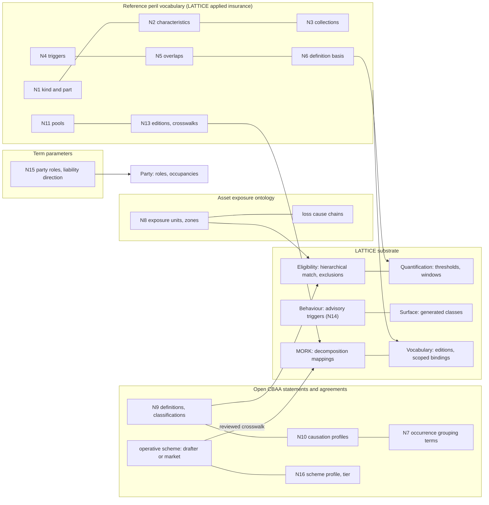

# Is a Peril Hierarchy Enough?

Structure, semantics and inter-layer cost of perils for the CBAA modules

Version 0.2, draft for review. Companion to the [reference peril vocabulary](peril-vocabulary.md),
the [asset exposure ontology](asset-exposure-ontology.md), [term parameters](term-parameters.md)
and the [MORK bridge](mork-bridge.md), which implement its recommendations. Cites Open CBAA's [design
specification](https://github.com/nebularis/open-cbaa/blob/main/docs/design/design-spec.md) (AP,
DP, D) and [LATTICE integration
specification](https://github.com/nebularis/open-cbaa/blob/main/docs/design/lattice-integration.md)
(I, L), and LATTICE ADRs by number. Where this sketch and the [applied insurance reference
epic](../plans/applied-insurance-reference.md) or its ADRs (A-98 to A-102) differ, they take
precedence.

---

## Summary

A hierarchy of perils is necessary and not sufficient. It is the right backbone for the most
frequent CBAA question, "is this risk inside the perils the Coverholder may bind?", and
LATTICE's hierarchical match with exclusions already answers that question for single-valued
cases. It is not sufficient because the CBAA drafts, their reference lists and the London and
US markets they sit in use "peril" for several different things at once, and because the
meaning of a peril in a contract is partly fixed by the wording, the governing law and the
location, not by the peril.

Eight further notions carry that meaning. Four belong in the vocabulary as SKOS-compatible
structure: characteristics, collections, typed causal and overlap relations, and definition bases with
links to Quantification. Four belong elsewhere and must not be forced into the vocabulary:
contract-relative classification and definition (Open CBAA statements), causation rules
(evaluation profiles by governing law), peril-by-location conditions (exposure units), and
occurrence grouping (contract terms, with informative defaults). Two upstream capabilities are
missing in LATTICE for the rest: reading a set of values (the risk's several perils, a loss's
chain of causes) and matching over kind links only. Neither blocks a first release.

The rich structure belongs to LATTICE's applied insurance reference, not to Open CBAA. CBAA
perils are defined by each agreement's drafter or by the market, and arrive as flat lists or
simple taxonomies far more often than as structured schemes. Open CBAA therefore binds the
operative scheme it is given, checks at the level of structure that scheme has, and reaches the
reference's structure only through reviewed MORK crosswalks. Compilation of any of this into
generated forms is optional and never the source of truth.

| Recommendation | Where | Cost | Needed for |
|---|---|---|---|
| cause hierarchy with kind and part links | reference vocabulary | low | every scope check |
| characteristics: mechanism, agency, onset, definition basis, accumulation | reference vocabulary | low to author, moderate to govern | cyber write-backs, flood by mechanism, pollution onset, accumulation |
| collections: bundles, model groupings, standard sets | reference and market editions | low | SoUA standard exclusions, named-peril forms, model outputs |
| typed relations: triggers, overlaps | reference vocabulary | low | secondary perils, classification checklists |
| Quantification links: intensity, thresholds, event windows | reference vocabulary | moderate | threshold-defined perils, parametric triggers, hours clauses |
| peril definitions and classifications in wording | Open CBAA statements | moderate | named storm, surge, write-backs |
| causation profiles by governing law | Open CBAA, evaluation | high | mixed-cause losses, claims authority |
| exposure units (location × asset class × peril) | asset exposure ontology | moderate | zone-dependent scopes, percentage deductibles, covenants |
| every-value and some-value readings | LATTICE Eligibility | high, upstream | design-time classes for perils (I7), anti-concurrent exclusion |
| scheme profiles and capability tiers | Open CBAA, MORK bridge | low | drafter and market lists that are flat or simply taxonomic |
| party roles for liability direction | term parameters, LATTICE Party | low | D&O sides, insured against insured, parties unknown at binding |

---

## 1. The Question

The integration specification leaves perils out of design-time classes because a risk has
several (D24, I7), and the design specification's catalogue lists peril as a hierarchical,
runtime-critical dimension bound to a market edition (design-spec §4.5). Both treat the peril as
one hierarchical dimension. This paper asks whether that is enough for the modules to operate,
what else is needed, where each extra notion should live, and what each costs across Open
CBAA's modules and LATTICE's layers.

"Enough" is judged against four evaluation modes (design-spec §6.3):

| Mode | Peril question |
|---|---|
| A, static admission | is the risk inside the segment's perils? |
| Q, quantitative | is the sum insured inside the limit set for the peril's segment? |
| P, portfolio | do totals by peril stay inside GWP limits and accumulation appetites? |
| S, state | does an active event (a named storm approaching) suspend authority? |

and three design-time checks: materiality of an amendment that changes perils, overlap between
segments, and completeness of the exposure data a peril needs.

## 2. What the CBAA Drafts Ask

The drafts reviewed are M1 to M14 and the M5 base tables. Every peril use found is listed.

| # | Draft | Use | Mode |
|---|---|---|---|
| U1 | M5 SoUA base table, "Included Perils" | optional per segment. The guidance says it is not a complete list, only the key perils that drive different sums insured or GWP limits, or single-peril cover | A, Q, P |
| U2 | M5 SoUA base table, "Excluded Perils" | optional per segment, same guidance. More than one excluded peril may justify further segmentation | A |
| U3 | M5 SoUA "Perils List" tab | the value list for U1 and U2: 525 codes from a market cause-of-loss list, headed "cause of loss, subclass of business", flat | all |
| U4 | M5 SoUA "Standard Exclusions" | war and war-related perils including civil war, nuclear, chemical, biological or radioactive perils, and financial guarantee, default, bankruptcy or insolvency risks. Default on every segment, removal marks the table non-standard | A, materiality |
| U5 | M5 SoUA cyber rows | "losses caused by a Cyber event", excluded or included per segment. "Cyber event" is a defined term | A |
| U6 | M5 SoUA "Applicable Pool Scheme(s)" | per segment, from a list of national terrorism and flood pools | A, P |
| U7 | M5 insurable interest descriptors and segment names | "direct physical loss or damage including the lesser perils of fire, extended coverage, vandalism and malicious mischief", "excluding flood and earthquake", "Property - Exc Wind, Flood" | A |
| U8 | M5 clause 5.15.1 | where property is in France and cover includes fire or other damage, natural catastrophe cover must be offered under French regulation | obligation |
| U9 | M5 base tables, sum insured basis list | "any one catastrophe", "any one event", "each and every loss or series of losses" | Q, P |
| U10 | M6 option D | commission may vary across risks, locations, perils or segments | remuneration |
| U11 | M3 | a natural catastrophe event or cyber attack can prevent the use of electronic means for amendments | operational condition |
| U12 | M8, M10 | no peril terms in the drafts reviewed. Claims and bordereaux will carry cause of loss through the reporting data items, not reviewed here | reporting |

Two observations follow. First, the drafts use perils to **segment** authority (U1, U2, U10),
so a peril scope names perils at whatever level a segment needs, and every level must be
matchable. Second, the drafts attach **other structure** to perils: standard sets (U4), defined
terms (U5), pools (U6), bundles and open grants (U7), territory-conditioned obligations (U8)
and event grouping (U9). None of these is a parent-child relation.

## 3. What the Evidence Shows

### 3.1 The reference list mixes axes

The M5 "Perils List" (U3) is the list a CBAA drafter picks from. A sample of its 525 entries,
grouped by what each entry actually names:

| What the entry names | Examples from the list |
|---|---|
| a natural cause | earthquake, flood, hail, tornado, typhoon, storm, snow, surge, wind shear |
| a deliberate human act | arson by a third person, burglary, robbery, assault and battery, extortionate robbery |
| an accident, often with its context | accident hunting, accident on pasture, accident railway crossing, crash landing, collision on the ground |
| a defect or fault | bad maintenance, bad workmanship, faulty material, latent defect, choice of wrong material |
| a failure mode | engine failure, failure of hydraulic system, fuel exhaustion, material fatigue, machinery breakdown |
| a consequence | delay, disappearance, shortage, partial loss, loss of freight, general average |
| a legal basis | liability for buildings and premises, non-compliance regarding performance bonds |
| an injury or disease | industrial deafness, byssinosis, poisoning by food |
| a specific product tort | named pharmaceuticals and implants |
| no information | "no details" |

The heading itself says the list is two things ("cause of loss, subclass of business"). A
hierarchy cannot be built over it without deciding, entry by entry, which axis the entry lives on,
and many entries live on two (arson is a human act and a fire mechanism, "accident railway
crossing" is a transport accident in a context). The reference vocabulary therefore does not adopt
the list. It decomposes each code into a cause and characteristic values by a MORK mapping (peril
vocabulary §9.2), so the list stays usable as input and never shapes the hierarchy.

### 3.2 A standard set that is not all perils

U4 excludes, by default, war (a conflict cause), nuclear, chemical, biological and radiological
perils (a mix of accidental and deliberate causes, grouped by mechanism), and financial
guarantee, default and insolvency risks. The last group is partly a cause (default,
insolvency) and partly a class of business (financial guarantee), which the CBAA's own insurable
interest hierarchy lists under "Events and Intangibles, Contracts". Represented as one node, the
set would need a parent that means nothing. Represented as a collection spanning families and
dimensions, it is exact, and "removal marks the table non-standard" becomes a comparison between
a segment's exclusions and the collection.

### 3.3 Model groupings cross branches and duplicate phenomena

Open catastrophe model codes group wind perils (tropical cyclone, extratropical cyclone, storm
surge, hail, tornado, straight-line wind) and flood perils (fluvial, pluvial, coastal and surge)
under group codes, including a "wind with surge" group. Storm surge appears on both sides, once as
a wind sub-peril and once as coastal flood. Model outputs follow those groupings: one portfolio
reports "hurricane, wind and surge combined", "surge only" and "inland flood, non-surge" as
three metrics. Any tree must put surge on one side, and every consumer that thinks of the other
side then gets it wrong. Collections and overlap links carry the groupings without choosing.

### 3.4 Some perils exist by designation, some by threshold

A named windstorm is a storm a meteorological authority has named. Its extension is defined by an
administrative act, not by physics, and it overlaps tropical cyclones and, in some regions,
extratropical storms, without being a kind of either. A hurricane is a tropical cyclone above a
sustained-wind threshold in particular basins. Some wordings define "storm" by a wind speed.
"Cyber event" and "critical illness" are whatever the wording defines. A hierarchy records only
that one class sits inside another. It cannot record what the membership test is, so a
threshold-defined peril cannot be checked against an intensity, and a designation-defined one
cannot be distinguished from a meteorological class with the same name.

### 3.5 Storm surge is classified by the wording

In the US worked example, the primary form's water exclusion removes surge outside a named
windstorm, and surge is covered only as part of named windstorm, with a percentage-of-value
deductible. A 30 million surge loss at a 285 million location is a 14.25 million deductible as
windstorm, or a 10 million sub-limit as flood. In the London example, flood sub-limits follow
the model's flood grouping. The same physical event is wind in one contract and water in the
next. This is the clearest case against encoding classification in the vocabulary: the
vocabulary should say surge is part of a cyclone event (a kind link would be wrong) and overlaps
coastal flood, and the wording's classification statement should decide.

### 3.6 Some peril scopes depend on where the risk is, not on the peril

The US example sub-limits flood differently inside and outside special flood hazard areas, and
the lender covenant requires flood cover for properties in those areas and named windstorm cover
for properties above a value. The London example sub-limits a territory. CBAA U8 obliges
natural catastrophe cover in one country when fire cover is given. "Flood in a special flood
hazard area" is not a narrower peril. It is a peril condition conjoined with a location condition
(a regulatory zone designation), and the case the conjunction is evaluated on is a location and
peril pair, not a policy.

### 3.7 One word on three axes

"Equipment breakdown" names a cause (mechanical or electrical failure), a coverage section (the
London excess layers exclude "boiler and machinery", the US programme covers it by a separate
form) and a class of asset (boilers, pressure vessels, machinery). "Business interruption" is
named as a peril in some models of cover, but it is a consequence of a cause. "Cargo" and "motor"
name subjects and lines of business. A single hierarchy puts all three kinds of term in one
tree, so an exclusion of the section would also exclude the cause wherever it occurs.

### 3.8 Causation differs between London and US

A loss often has more than one cause: a cyclone causes surge, a cyber attack causes a fire, a
freeze causes a pipe to burst. Which cause governs cover is a question of law.

| | London | US |
|---|---|---|
| general rule | proximate cause: the dominant, effective cause | varies by state. Many apply an efficient proximate cause rule: the loss is covered if the efficient cause is covered |
| two concurrent causes, one excluded | the exclusion generally prevails | under efficient proximate cause, cover may follow the efficient cause. Wordings answer with anti-concurrent causation clauses, enforced in some states and not others |
| consequence | evaluate the dominant cause, and deny if any concurrent cause is excluded | evaluate the efficient cause, or deny if any cause is excluded where an anti-concurrent clause is enforceable |

This is general background for design, to be confirmed by counsel before any rule is encoded. The
design consequence does not depend on the detail: the rule that picks the governing cause is set
by governing law and wording, so it is an evaluation profile selected per contract, and a loss
record must keep the chain of causes, not one code.

### 3.9 Cyber is split by intent and written back by mechanism

The London layers use two cyber clauses: one excludes malicious cyber acts and writes back
non-malicious events that cause physical damage, the other excludes all cyber absolutely. The
write-back scope is a closed list of physical damage mechanisms (fire, explosion). The US
primary has an absolute cyber physical damage exclusion. To evaluate these, a loss needs its
agency (malicious or not) and its mechanism (what did the physical damage), and the vocabulary
needs both as characteristics. A tree of "cyber" concepts alone cannot express "non-malicious and
resulting in fire".

### 3.10 Named-peril bundles are sets

CBAA U7 names "the lesser perils of fire, extended coverage, vandalism and malicious mischief".
US causes-of-loss forms come in named-peril variants (a basic list and a broad list) and an open
variant with exclusions. Bundles are sets of perils from several families, varying by market and
form edition. They are collections, never nodes, and the open variant is not a bundle at all but
"everything in the edition, minus exclusions".

### 3.11 Occurrences are grouped by peril

Hours clauses group losses into one occurrence within a window that depends on the peril, and the
US example applies a 72-hour windstorm deductible per location. U9's "any one catastrophe" and
"any one event" bases, and the US named storm aggregate that decides when a higher layer
attaches, both depend on grouping losses into events. The window is a contract term, but its
customary values differ by peril, and an event record needs the peril to know which window to
apply.

### 3.12 Pools and residual markets are linked to perils and places

CBAA U6 lists terrorism and flood pools. The US example uses state residual wind pools and a
national flood scheme that sits primary to the programme. Each pool covers a peril set in a
territory. They are neither perils nor territories, and their link to both is structure the
vocabulary should carry (peril vocabulary §9.4).

## 4. Where a Hierarchy Alone Fails

| # | Failure | Consequence in CBAA | Evidence |
|---|---|---|---|
| F1 | one tree for several axes (cause, consequence, subject, line) | an exclusion of a section excludes the cause everywhere, and a segment scoped by line admits unrelated causes | §3.1, §3.7 |
| F2 | forced single placement of overlapping phenomena | surge admitted under a wind segment and denied under a flood segment, or the reverse, against the wording | §3.3, §3.5 |
| F3 | polyhierarchy used to escape F2 | sibling disjointness can no longer be declared (ADR-A90 refuses it for polyhierarchies), so overlap checks between segments over-report | §3.3 |
| F4 | bundles and standard sets as nodes | "non-standard" detection impossible, open grants unrepresentable | §3.2, §3.10 |
| F5 | membership tests not recorded | a threshold or designation peril cannot be checked against event data or a parametric trigger | §3.4 |
| F6 | classification fixed globally | the vocabulary contradicts wordings, and no single edition can serve London and US | §3.5 |
| F7 | peril scope without location conditions | zone-dependent sub-limits and covenants unevaluable | §3.6 |
| F8 | one peril per loss | cyber write-backs, anti-concurrent clauses and proximate cause rules unevaluable | §3.8, §3.9 |

F1 to F5 are vocabulary structure. F6 to F8 are not, and fixing them in the vocabulary would
make it worse.

## 5. Structural Notions

Each notion: what it is, why CBAA needs it, the ways it could be expressed, and the choice.

| # | Notion | Need | Options | Choice |
|---|---|---|---|---|
| N1 | Kind and part links | hurricane deductibles on kinds, model totals on parts (§3.3) | two SKOS schemes, OWL classes, the thesaurus standard's generic and partitive broader | sub-properties of `skos:broader`, aligned to `iso-thes:`, with `skos:broader` materialised |
| N2 | Characteristics | cyber write-backs, flood by mechanism, onset for pollution, accumulation (§3.9) | polyhierarchy, one scheme per characteristic, OWL class conjunctions | one scheme per characteristic, characteristic properties on concepts for defaults and on occurrences for facts |
| N3 | Collections | standard exclusions, bundles, model groupings (§3.2, §3.10) | nodes, `skos:Collection`, SHACL lists | `skos:Collection` sub-classes, expanded at bind time |
| N4 | Triggering | secondary perils across families (§3.8) | `skos:related`, a new property | `prl:canTrigger` ⊑ `skos:semanticRelation`, directed (`skos:related` is symmetric) |
| N5 | Overlap | extensions that intersect without subsumption (§3.3, §3.4) | nothing, polyhierarchy, a new property | `prl:overlaps` ⊑ `skos:related`, symmetric, and a shape that asks the wording to resolve each overlap in scope |
| N6 | Definition basis and thresholds | designation and threshold perils (§3.4) | prose, a characteristic, Quantification links | a characteristic, plus `prl:definingThreshold` to a `qnt:RangeSet` on an intensity space |
| N7 | Occurrence grouping | hours clauses, event-based bases and aggregates (§3.11) | vocabulary, contract terms, Behaviour | a contract term. The vocabulary carries only an informative customary window |
| N8 | Peril by place | zone sub-limits, covenants, U8 (§3.6) | narrower perils per zone, conditions over a case | Eligibility conjunction over an exposure unit (location × asset class × peril) |
| N9 | Contract-relative meaning | surge classification, named storm definition, write-backs (§3.5) | vocabulary editions per contract, statements | `stm:Definition`, `stm:Classification`, `stm:Precedence` on the wording |
| N10 | Causation rules | mixed-cause losses (§3.8) | fixed rule, statement, evaluation profile | an evaluation profile selected by governing law, overridden by a precedence statement where the wording has an anti-concurrent clause |
| N11 | Pools | U6, residual markets (§3.12) | territory concepts, peril concepts, own scheme | own scheme linked to perils and territories |
| N12 | Sets of values | a risk covers several perils, a loss has several causes (§3.8, I7) | one case per peril, quantified readings | exposure units where the data allows, upstream every-value and some-value readings otherwise |
| N13 | Market editions and decomposition | London and US framings, the flat list (§3.1) | fork, override editions, decomposition mappings | override editions bound by market and regime, flat lists decomposed by MORK mapping |
| N14 | Active hazard events | US binders commonly suspend binding while a named storm threatens (general practice, not in the drafts) | a peril property, a Behaviour state | a Behaviour trigger from an external advisory, with an Eligibility guard on the risk's territory (mode S) |
| N15 | Liability direction | liability, D&O and E&O segments scoped by who harmed whom, with claimants unknown at binding | agency characteristic, harm subject, party roles | party roles (harmed, liable, claimant, payee) with occupancies that may be unfilled, direction derived from them (term parameters §7). Agency stays a cause characteristic |
| N16 | Scheme structure | drafter and market lists range from flat to structured | require the reference structure, degrade silently, profile each scheme | a scheme profile declaring the structure present, and checks gated by the resulting tier (MORK bridge §3) |

## 6. Where Each Notion Lives

Three properties, one contract. The CBAA uses three different peril relations, and today Open
CBAA has one property (`rsk:peril`):

| Relation | Property | Owner |
|---|---|---|
| perils a policy or risk covers | `rsk:peril` (renamed in meaning to "covered peril") | Open CBAA risk |
| perils an exposure is subject to | `aeo:unitPeril`, `aeo:perilScope` | asset exposure ontology |
| perils that caused a loss | `aeo:initiatingPeril`, `aeo:proximatePeril` and, for CBAA claims, a claims module property | exposure and claims |

All three name the same scheme contract, so one binding serves them, and none is mistaken for
another.

## 7. Inter-Layer Dependencies and Cost

### 7.1 By notion

| Notion | Open CBAA artefacts | LATTICE layers | Upstream change | Reasoning and runtime cost | Governance and data cost |
|---|---|---|---|---|---|
| N1 | peril vocab, `rsk:PerilContract` binding | Vocabulary, Eligibility (reads `skos:broader+`) | none for a first release. L-P2 for kind-only matching | closure of about 240 concepts at depth 5 or less is under 1,000 pairs per edition, materialised or interval-encoded (design-spec §4.4) | every concept states its link kind |
| N2 | statement scope parameters for mechanism and agency, reading the reference's characteristic schemes | Vocabulary, Eligibility | none | one extra condition per scope that uses a characteristic, on a single-valued path from a loss | three mandatory characteristics per concept at authoring (LATTICE). Loss records must capture them, so claims data items must carry them |
| N3 | peril collections, SoUA standard exclusions | Vocabulary, Eligibility | none: bind-time expansion | none at runtime, since expansion happens at bind | collections per market edition, with review |
| N4, N5 | peril vocab, shapes | Vocabulary | none | shape evaluation at bind | curation of each link. The overlap shape creates review work, which is its purpose |
| N6 | peril vocab intensity scheme | Quantification | none: value spaces, range sets and alternative bounds exist | threshold checks are interval containment (mode Q) | intensity spaces and units per measure |
| N7 | statement parameters for event windows, agreement terms | Quantification (durations), Behaviour or Capacity (grouping) | L-P5, episode grouping by anchored window | grouping is stateful: an accumulator per open event | loss events must be recorded with times and perils |
| N8 | `rsk:Risk` alignment, SoUA segment scopes | Eligibility (conjunction on one subject class) | none if the exposure unit is the case | one unit per location, class and peril in scope: a portfolio of 10,000 locations and 6 perils is 60,000 units, generated | zone designations per jurisdiction, spatial joins as derived artefacts |
| N9 | `stm:Definition`, `stm:Classification`, `stm:Precedence` patterns for perils | Instrument (via statements), Eligibility | none | classification rewrites a loss's peril before scope evaluation, one lookup per loss | extraction and review per wording (design-spec §3.7) |
| N10 | agreement or policy governing law, causation profiles | Eligibility (profile aggregation) | L-P3: exclusion on any member of a set | depends on the profile: dominant cause is a single-valued path, anti-concurrent is a some-value reading over the chain | legal review of each profile, per jurisdiction |
| N11 | pool scheme, SoUA pool row, exposure pool participation | Vocabulary | none | none | pool editions per territory |
| N12 | risk, exposure units | Eligibility, Surface | L-P3 (I7) | design-time OWL classes for multi-valued perils need quantified readings: a some-value reading is `∃peril.Within(c)`, cheap. An every-value reading is `∀peril.Within(c) ⊓ ∃peril.⊤`. Both are small for a reasoner at this vocabulary size, so the cost is the upstream change to the shared IR, not reasoning | none beyond I7 |
| N13 | market editions, crosswalk mapping graphs | Vocabulary (scoped bindings), MORK | none: scoped bindings exist (L3a) | resolution by scope precedence, per bind | the largest ongoing cost: each market edition and each external list needs a maintained crosswalk, reviewed by people |
| N14 | agreement lifecycle, advisory events | Behaviour, Eligibility | none | a trigger per advisory, a guard per bind | an advisory feed, out of scope for the ontology |
| N15 | segment scopes on direction, party role parameters | Party, Instrument, Eligibility | none: roles and unfilled occupancies exist | one derivation per claim, from the relationship graph | relationship data (subsidiaries, contracting chains) must be captured for fourth-party checks |
| N16 | scheme profiles, bridge graphs | Vocabulary, MORK | none | one tier lookup per check | a profile per bound scheme, reviewed with its crosswalk |

### 7.2 Upstream changes

| # | Layer | Change | Motivating need | Status |
|---|---|---|---|---|
| L-P1 | Vocabulary | concept-level lifecycle: deprecation, replacement and split across editions | splitting or retiring a peril without breaking recorded values | already an open item in Vocabulary |
| L-P2 | Eligibility | `HierarchicalMatch` with a chosen traversal: all broader links, or a named sub-property of `skos:broader` only | a hurricane deductible applies to kinds of tropical cyclone, not to its parts | new |
| L-P3 | Eligibility | every-value and some-value readings for evidence bindings, and an exclusion that denies when any value is excluded | several perils on a risk (I7), anti-concurrent causation over a loss's causes | extends I7 |
| L-P4 | Surface | generated classes from collections and characteristic conjunctions | design-time checks over bundles and write-back scopes | new |
| L-P5 | Quantification or Capacity | grouping of occurrences into episodes by a window anchored on the first occurrence | hours clauses, event-based aggregates | new. Capacity (applied) first, per its promotion criteria |
| L-P6 | none, guidance | spatial pattern: geometry by GeoSPARQL alignment, zones as concepts, joins as derived artefacts | zone-dependent scopes | new |

Each substrate change follows the clean-room procedure (ADR-A-C2): a domain-neutral premise and
two non-insurance examples before any mechanism prose. The premises exist without insurance:
kind against part-of matching (anatomy, organisational units), set readings (a patient's several
diagnoses, an applicant's several qualifications), episode grouping (clinical episodes of care,
incident grouping in operations).

### 7.3 The cost of not doing it

| If omitted | What goes wrong |
|---|---|
| characteristics | cyber write-backs and flood-by-mechanism wordings cannot be checked, so every such bind refers |
| collections | standard exclusions are copied per segment, and removal is undetectable |
| overlaps and classification statements | surge and similar losses are decided by whichever side the vocabulary chose, silently |
| causation profiles | mixed-cause losses (the costly ones) are decided by the first code on the claim |
| exposure units | zone-dependent scopes and covenants are checked by hand |
| editions and crosswalks | a London binder writing US risks gets London framings for US forms |
| scheme profiles | a flat list is either rejected or silently treated as structured, and checks that need structure it lacks return wrong answers instead of Undetermined |
| party roles | D&O Side A, B and C and insured-against-insured exclusions are unevaluable, and a claim by an unknown fourth party cannot be placed |

### 7.4 Optional compilation

Every check runs directly over the source graph (route R1, [term parameters](term-parameters.md)
§5). Surface projections, generated classes and capacity runtime profiles are allowed where
profiling shows a need, as cached reproducible artefacts with parity tests against R1. There is
no synchronisation back from a compiled form to its source. The cost of compilation is therefore
opt-in per deployment, and its absence costs latency, not correctness.

## 8. London and US: What the Differences Change

| Difference | Vocabulary | Asset exposure | Open CBAA | LATTICE |
|---|---|---|---|---|
| open perils with sub-limits (London) against causes-of-loss forms (US) | bundles and open grants as collections and exclusions, per market edition | none | segment scopes read either form | none |
| named windstorm by designation (US) | designation-defined concept, overlapping both cyclone families | none | wording defines the designation authority and window | none |
| surge classified by wording (US) | part of cyclone event, overlaps coastal flood | loss records keep initiating and proximate cause | classification statement per wording | none |
| flood by regulatory zone (US) | zone is not a peril | zone designations, exposure units | segment scopes conjoin peril and zone | none, if units are cases |
| percentage-of-value deductibles per location (US) | none | location values by value type | deductible terms read the unit's value | Quantification derived rates (done) |
| peril-specific aggregates across layers (US) | none | peril metrics include event frequency | accumulators per peril grouping | L-P5 |
| cyber malicious and non-malicious (London) | agency split, mechanism characteristic | loss agency and mechanism | write-back as classification plus scope | L-P4 for design-time checks |
| causation by governing law | chains are possible, not asserted | loss chains | governing law on agreement and policy, causation profiles | L-P3 |
| lender covenants by peril and zone (US) | none | requirements with obligee | not a CBAA concern, but the same data | Instrument obligation (done) |
| residual markets and pools | pool scheme | pool participation | SoUA pool row | none |
| board appetite by return period (London) | none | requirements on peril metrics | none | Quantification derived rates (done) |

A CBAA binder is written in London, but its risks may be US risks written as surplus lines. Both
framings can apply to one agreement, which is why market editions are bound by market and
regime scopes together (peril vocabulary §9.1), and why the exposure ontology keeps its core
market-neutral.

## 9. Proposed Decisions

For Open CBAA, to be added to the design specification's decision log once agreed:

| # | Decision |
|---|---|
| D27 | The reference peril vocabulary is LATTICE's (applied insurance `peril/`). Open CBAA binds it only as the unscoped fallback of `rsk:PerilContract`. Agreement, drafter and market editions (an LMA view included) are bound by scope and take precedence |
| D28 | Keep the peril vocabulary to causes. Consequences, harm subjects, liability bases and lines of business are other schemes |
| D29 | Three peril relations (covered, exposed, caused) under one contract (§6) |
| D30 | SoUA standard exclusions as a standard set collection, compared at bind to flag non-standard tables |
| D31 | A pool scheme, linked to perils and territories, for the SoUA pool row |
| D32 | Peril definitions, classifications and write-backs in wording as statements, with an overlap shape asking for them |
| D33 | Governing law on agreement and policy, selecting a causation profile, pending legal review |
| D34 | Exposure units as the case for zone-dependent and location-dependent peril scopes |
| D35 | Every bound peril scheme has a scheme profile. Checks are gated by its tier (flat, taxonomic, reference-aligned, native) and return Undetermined when a check needs structure the tier lacks |
| D36 | Compilation is optional. The source graph is normative, compiled forms are parity-tested caches, and nothing synchronises back |
| D37 | Liability direction is derived from party roles, never recorded as a peril or characteristic |

## 10. Phasing

| Phase | Scope | Depends on |
|---|---|---|
| 1 | Open CBAA: scheme profiles and tiers F and H, binding of drafter and market lists. LATTICE: cause hierarchy with kind and part links, collections, reference codes. Crosswalk of the CBAA list (tier R) | nothing |
| 2 | characteristic schemes, party roles for liability direction, triggers and overlaps, overlap shape, classification and definition statement patterns | phase 1 |
| 3 | intensity scheme and thresholds, pool scheme, exposure units in the asset exposure ontology | phase 2, Quantification (done) |
| 4 | causation profiles, loss cause chains in claims | legal review, L-P3 |
| 5 | design-time classes for multi-valued perils, episode grouping | L-P3, L-P4, L-P5 |

## 11. Open Questions

| # | Question |
|---|---|
| W-Q1 | Resolved: LATTICE owns the reference vocabulary, in applied insurance `peril/` (D27) |
| W-Q2 | Which causation profiles are needed first, and who reviews them? |
| W-Q3 | Do the CBAA reporting data items carry cause of loss, and at what granularity? The answer sets how much of the characteristic structure claims data can populate |
| W-Q4 | Is binding suspension on an active named storm in scope for CBAA M5 or M12, given it is common US binder practice but absent from the drafts? |
