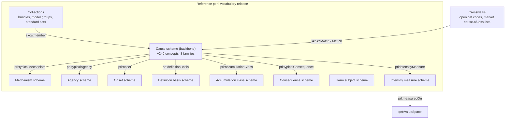

# Reference Peril Vocabulary: Design Specification

Version 0.2, draft for review. Specifies the reference peril vocabulary of LATTICE's applied
insurance reference implementation, and how Open CBAA uses it as one of the peril schemes an
agreement may bind. Open CBAA authors no peril scheme: the contract's drafter or the market
supplies it, and the [MORK bridge](mork-bridge.md) connects what they supply to this reference. The companion [whitepaper](peril-structure-whitepaper.md) argues why the vocabulary has the shape it has, and the [asset exposure ontology](asset-exposure-ontology.md) is its main consumer outside the contract.


Citations of `design-spec` and of codes AP, DP, D and I refer to Open CBAA's [design
specification](https://github.com/nebularis/open-cbaa/blob/main/docs/design/design-spec.md) and
[LATTICE integration
specification](https://github.com/nebularis/open-cbaa/blob/main/docs/design/lattice-integration.md).
Where this sketch and the [applied insurance reference
epic](../plans/applied-insurance-reference.md) or its ADRs (A-98 to A-102) differ, they take
precedence.

---

## 1. Purpose and Position

A peril, in this vocabulary, describes a event or condition that could result in an adverse
outcome: an earthquake, burst pipe, riot, ransomware attack, insolvency, etc. Market usage
stretches the word much further, to consequences (business interruption), the thing harmed
(cargo), legal bases (product liability), and to lines of business (such as "automotive").

The reference vocabulary keeps the word to its core sense and gives each of those other axes its 
own scheme, so each can be matched, excluded and crosswalked on its own terms (whitepaper §4).

| Question | Answer |
|---|---|
| Who owns it | LATTICE, in its applied insurance reference implementation (`applied/insurance/peril`, §4). It is a reference, not a market standard, and says so on every scheme |
| Who supplies CBAA perils | the drafter of each agreement (an MGA, carrier or broker) or the market, possibly including a view the LMA may publish, which is welcome. Their scheme is the operative one for the wording (MORK bridge, B1) |
| When it applies | as the unscoped fallback, when nothing more specific is bound. An agreement's own list, a drafting organisation's list and a market edition all take precedence (MORK bridge §2) |
| How other schemes are handled | flat lists and simple taxonomies are first-class. Checks run at the level of structure the operative scheme has, and reach this reference's richer structure only through reviewed crosswalks (MORK bridge §3, §4) |
| Who consumes it | `rsk:peril` and the statement scope parameters in Open CBAA, the exposure ontology's peril metrics and loss records, and the applied insurance binding-contract module's peril scope |
| What it is built on | LATTICE Vocabulary: every scheme is a `voc:ConceptScheme` edition, every consuming property names a `voc:SchemeContract`. SKOS for concepts, with a small, SKOS-compatible extension (§6) |
| What it is not | a statement of what any contract covers. Whether a storm surge counts as windstorm or flood, or which cause governs a mixed loss, is contract meaning and lives in statements (§8) |

### 1.1 What the CBAA drafts ask of it

The module drafts and their base tables define the requirements the vocabulary must serve.

| Draft | Use of perils | Consequence here |
|---|---|---|
| M5 SoUA base table, rows "Included Perils" and "Excluded Perils" | optional per segment (column). The guidance says the rows are not a full list, only the key perils that drive different sums insured or GWP limits, or single-peril cover | hierarchical include and exclude sets, one pair per segment. Perils are a segmentation driver, so a scope can name a peril at any level (§7.2) |
| M5 SoUA "Perils List" tab | the value list for those rows: a flat list of 525 codes whose own heading reads "cause of loss, subclass of business". It mixes natural causes, human acts, defects, consequences (delay, shortage), legal bases, injuries, product-specific torts and "no details" | no hierarchy and no axes. Crosswalked by decomposition into cause and characteristic values (§9.2), never adopted as the cause scheme |
| M5 SoUA row "Standard Exclusions" | war and war-related perils including civil war, nuclear, chemical, biological or radioactive perils, and financial guarantee, default, bankruptcy or insolvency risks. Standard on every segment, and removing one marks the table non-standard | a standard set spanning three families, one of which is not a cause at all (§7.3) |
| M5 SoUA rows "Cyber Coverage Exclusion" and "Specific Inclusions" | "losses caused by a Cyber event", excluded or included per segment. "Cyber event" is a defined term of the wording | cyber's definition basis is wording-defined (§5.6) |
| M5 SoUA row "Applicable Pool Scheme(s)" | per segment, from a list of national terrorism and flood pools | pools as their own scheme linked to perils and territory (§9.4) |
| M5 insurable interest descriptors and segment names | "direct physical loss or damage including the lesser perils of fire, extended coverage, vandalism and malicious mischief", "excluding flood and earthquake", "Property - Exc Wind, Flood" | open perils with exclusions, and named bundles (§7) |
| M5 clause 5.15.1 | where property is in France and cover includes fire or other damage, the Coverholder must offer natural catastrophe cover under French regulation | an obligation conditioned on peril and territory. Needs the natural hazard family as a matchable set (§7.3) |
| M5 base tables, sum insured basis list | "any one catastrophe", "any one event", "each and every loss or series" | occurrence grouping depends on the peril (§6.4, event window) |
| M6 remuneration, option D | commission levels may differ across risks, locations, perils or segments | peril as a dimension of a remuneration schedule |
| M3 amendments | a natural catastrophe event or cyber attack as a reason electronic means cannot be used | peril terms appear in operational conditions, not only in scope |

## 2. Principles

| # | Principle |
|---|---|
| PV1 | **One axis per scheme.** The cause backbone classifies by initiating event. Mechanism, agency, onset, definition basis, accumulation character, consequence and harm subject are separate schemes, so no concept needs two parents to say two different things |
| PV2 | **Event-family placement.** A secondary effect sits under the event family that initiates it (fire following earthquake under earthquake), because cat models, event definitions and aggregation all group that way. Cross-family triggering is a typed relation, never a second `skos:broader` |
| PV3 | **Kinds and parts are different broader links.** A hurricane is a kind of tropical cyclone. A storm surge is part of a tropical cyclone event. Both are `skos:broader` to SKOS consumers, and the vocabulary also records which one it is (§6.1) |
| PV4 | **Bundles are collections, not nodes.** "Fire and extended perils", "wind with surge" and the CBAA standard exclusions are `skos:Collection`s whose members span families. They never appear in the hierarchy |
| PV5 | **"All perils" is not a concept.** An open-perils grant is a hierarchical condition requiring every top concept of the bound edition, with exclusions (§7.2). A single top concept called "all perils" would sit in every market edition's hierarchy as a node no wording ever means, and a wildcard would also admit values from outside the scheme |
| PV6 | **Definition basis is explicit.** A named storm exists because an authority named it. A hurricane exists above a wind threshold in given basins. A cyber event is whatever the wording defines. The basis is recorded, and threshold definitions point at Quantification (§6.4) |
| PV7 | **Market framing through editions and labels.** Regional names (hurricane, typhoon, bushfire) are labels or narrower concepts by stated rule. Market-specific bundles, definitions and codes come from scoped market editions and crosswalks, never from forks of the reference |
| PV8 | **Contract meaning stays in contracts.** The vocabulary may record what is customary (a typical event window, typical mechanisms) as informative data. It never decides coverage |
| PV9 | **SKOS-compatible extension only.** Every addition is a sub-property of a SKOS property or a plain property on `skos:Concept`. A SKOS-only consumer loses detail but never meaning |

## 3. Architecture

One release contains several schemes, each a separate `voc:ConceptScheme` edition with its own
identity, so each can be versioned and bound on its own.



| Scheme | Contents | Consumed by |
|---|---|---|
| Cause | the peril backbone (§5) | `rsk:peril`, statement scopes, exposure peril metrics, loss records, contract peril scope |
| Mechanism | how harm is inflicted: shaking, inundation, wind load, fire, impact, contamination, electrical overstress, data encryption | contract write-back scopes (cyber physical damage), classification rules, exposure loss records |
| Agency | natural, accidental, negligent, malicious criminal, malicious political, sovereign, belligerent, undetermined | cyber malicious or non-malicious splits, terrorism against vandalism, war exclusions |
| Onset | sudden, gradual, latent, recurrent | pollution and long-tail distinctions, deterioration exclusions |
| Definition basis | physical, designation, threshold, wording-defined, statutory, index | named storm, hurricane, cyber event, flood under a national scheme, parametric triggers |
| Accumulation class | catastrophe, systemic, attritional | aggregates, capacity, portfolio questions |
| Consequence | heads of loss: direct physical damage, business interruption, extra expense, recall, clean-up, liability to others, defence costs | coverage types and the market's habit of calling these perils (whitepaper §3.1) |
| Harm subject | property, persons, financial interest, data and systems, environment, reputation | what was harmed. Liability direction is derived from party roles, not from this scheme ([term parameters](term-parameters.md) §7) |
| Intensity measure | PGA, spectral acceleration, 3-second gust, sustained wind, flood depth, flow velocity, surge height, hail diameter, fireline intensity, ash load, snow load | threshold definitions, parametric triggers, exposure hazard attributes |

## 4. Namespaces, Files and Versions

An insurance sub-domain module of LATTICE's applied layer, `applied/insurance/peril/`, beside
`common/`, `exposure/` and the others ([asset exposure ontology](asset-exposure-ontology.md) §3).
It has its own release cycle for editions and crosswalks. Its scheme contract
is in `insurance/common/`, so modules that only classify by peril
need not import the vocabulary. Applied content is not substrate, so LATTICE's clean-room rule does not govern its naming.
Open CBAA resolves it through its catalog by release tag, as it does LATTICE's layers.

| File (under `lattice/ontology/applied/insurance/peril/`) | Content | Version IRI |
|---|---|---|
| `spec/peril.ttl` | the `prl:` properties of §6, and nothing else | `…/insurance/peril/0.1.0` |
| `vocab/peril-vocab.ttl` | the cause scheme and the characteristic and companion schemes, as reference editions | `…/insurance/peril-vocab/0.1.0` |
| `vocab/peril-intensity.ttl` | the intensity measure scheme and its `qnt:ValueSpace`s | `…/insurance/peril-intensity/0.1.0` |
| `vocab/peril-collections.ttl` | reference collections (§7) | `…/insurance/peril-collections/0.1.0` |
| `crosswalk/*.ttl` | one reviewed crosswalk per external code system (§9), each the artefact of a MORK mapping graph | per file |
| `shapes/` | vocabulary well-formedness (§10), versioned by `.version` | |

`…` is `https://www.nebularis.org/neuro-semantic`. Namespace
`https://www.nebularis.org/neuro-semantic/insurance/peril#`, prefix `prl:`, for properties and
datatypes. Schemes and concepts live in the vocabulary's own namespace,
`https://www.nebularis.org/neuro-semantic/insurance/peril/vocab#`, prefix `prl-voc:` (ADR-A98
decision 6). Examples in this sketch write concepts as `prl:`: read them as `prl-voc:`. Each scheme carries `skos:editorialNote` stating it is a reference
edition, and `fnd:hasGovernanceState` Active.

Every concept carries:

- `skos:prefLabel` (at least `@en`), `skos:definition`, `skos:inScheme`
- a reference code as `skos:notation` typed `prl:ReferenceCode` (the dotted codes of §5). Codes
  are stable across editions, and a retired code is never reused
- `prl:typicalAgency`, `prl:onset` and `prl:definitionBasis` (cause scheme only), so every cause
  is placed on those axes and none is left implicit
- optionally `skos:scopeNote`, `skos:altLabel`, market notations (§9) and the relations of §6

## 5. The Cause Scheme

Eight top concepts. Codes are `family.group.concept`. **K** marks a kind (`prl:broaderGeneric`),
**P** a part of an event (`prl:broaderPartitive`), per §6.1. Unmarked children are kinds. The
last column gives the open cat-model code where one exists, and notes.

### 5.1 N — Natural hazard

| Code | Concept | Link | Model code, notes |
|---|---|---|---|
| N | Natural hazard | top | |
| N.GEO | Geophysical hazard | K | |
| N.GEO.EQ | Earthquake | K | event family. Collection `prl:AllEarthquake` adds tsunami |
| N.GEO.EQ.SHK | Ground shaking | P | QEQ. Mechanism: shaking |
| N.GEO.EQ.FFE | Fire following earthquake | P | QFF. Mechanism: fire. Canonical example of PV2 |
| N.GEO.EQ.LIQ | Liquefaction | P | QLF. Mechanism: ground failure |
| N.GEO.EQ.LSD | Earthquake-induced landslide | P | QLS. `prl:overlaps` N.GEO.MM.LS |
| N.GEO.EQ.SPL | Sprinkler leakage following earthquake | P | related T.EOW.SPR |
| N.GEO.EQ.AFT | Aftershock | K | a later earthquake. Whether it is the same occurrence is an event-definition question for the contract |
| N.GEO.TSU | Tsunami | K | own family, triggered by several initiators |
| N.GEO.TSU.EQT | Earthquake-induced tsunami | K | QTS. `prl:canTrigger` from N.GEO.EQ |
| N.GEO.TSU.LST | Landslide or volcanic tsunami | K | `prl:canTrigger` from N.GEO.MM, N.GEO.VOL |
| N.GEO.VOL | Volcanic activity | K | |
| N.GEO.VOL.ASH | Volcanic ashfall | P | mechanism: burial and load, contamination. Aviation-relevant |
| N.GEO.VOL.LAV | Lava flow | P | |
| N.GEO.VOL.PYR | Pyroclastic flow | P | |
| N.GEO.VOL.LAH | Lahar | P | `prl:overlaps` N.GEO.MM.LS.DF |
| N.GEO.VOL.GAS | Volcanic gas release | P | |
| N.GEO.MM | Mass movement | K | alt label "earth movement" |
| N.GEO.MM.LS | Landslide | K | |
| N.GEO.MM.LS.RF | Rockfall and rockslide | K | |
| N.GEO.MM.LS.DF | Debris flow | K | |
| N.GEO.MM.LS.MF | Mudflow and mudslide | K | some national flood schemes define mudflow as flood. Handled by crosswalk, not polyhierarchy |
| N.GEO.MM.SUB | Subsidence | K | natural subsidence. Induced subsidence is T.STR.FND with agency negligent |
| N.GEO.MM.SNK | Sinkhole collapse | K | |
| N.GEO.MM.HVE | Ground heave | K | |
| N.GEO.MM.AVL | Snow avalanche | K | `prl:canTrigger` from N.MET.WIN |
| N.MET | Meteorological hazard | K | |
| N.MET.TC | Tropical cyclone | K | event family. WTC for wind |
| N.MET.TC.WND | Tropical cyclone wind | P | WTC |
| N.MET.TC.SRG | Tropical cyclone storm surge | P | WSS. `prl:overlaps` N.HYD.FLD.CST. Mechanism: inundation. Whitepaper §3.5 |
| N.MET.TC.RFL | Tropical cyclone rainfall flooding | P | mechanism: inundation. `prl:overlaps` N.HYD.FLD |
| N.MET.TC.TOR | Tropical cyclone tornado | P | `prl:overlaps` N.MET.SCS.TOR |
| N.MET.TC.HUR | Hurricane | K | definition basis threshold: sustained wind at hurricane strength in the North Atlantic and eastern North Pacific basins |
| N.MET.TC.TYP | Typhoon | K | threshold, western North Pacific basin |
| N.MET.TC.SEV | Severe tropical cyclone | K | threshold, South Pacific and Indian Ocean basins. Alt label "cyclone" |
| N.MET.TC.TST | Tropical storm | K | below hurricane strength |
| N.MET.NS | Named storm | K | definition basis designation: a storm named by a recognised meteorological authority. `prl:overlaps` N.MET.TC and N.MET.ETC. Not a kind of either (whitepaper §3.4) |
| N.MET.ETC | Extratropical cyclone | K | WEC. Alt labels "windstorm", "European windstorm" |
| N.MET.ETC.WND | Extratropical cyclone wind | P | WEC |
| N.MET.ETC.SRG | Extratropical storm surge | P | mechanism: inundation. `prl:overlaps` N.HYD.FLD.CST |
| N.MET.SCS | Severe convective storm | K | event family |
| N.MET.SCS.TOR | Tornado | P | XTD |
| N.MET.SCS.HAI | Hail | P | XHL |
| N.MET.SCS.SLW | Straight-line wind | P | XSL |
| N.MET.SCS.SLW.DER | Derecho | K | |
| N.MET.SCS.LTG | Lightning | P | mechanism: electrical overstress, fire. Also occurs without a severe storm, which the definition allows |
| N.MET.SCS.HVR | Convective heavy rainfall | P | `prl:canTrigger` N.HYD.FLD.PLU, N.HYD.FLD.FSH |
| N.MET.WIN | Winter storm and cold | K | |
| N.MET.WIN.SNL | Snow load | P | |
| N.MET.WIN.ICE | Ice storm and freezing rain | P | |
| N.MET.WIN.BLZ | Blizzard | K | |
| N.MET.WIN.FRZ | Freeze | K | `prl:canTrigger` T.EOW.PIP |
| N.MET.WIN.FRS | Frost | K | agricultural |
| N.MET.LWS | Local and other windstorm | K | non-cyclonic wind. Alt label "tempest". Some wordings define storm by a wind-speed threshold, which a market edition expresses with definition basis threshold |
| N.MET.DST | Sand and dust storm | K | |
| N.HYD | Hydrological hazard | K | |
| N.HYD.FLD | Flood | K | inland and coastal flooding not attributed to a cyclone event. OO1 via collection |
| N.HYD.FLD.FLU | Fluvial flood | K | ORF |
| N.HYD.FLD.PLU | Pluvial and surface-water flood | K | OPF |
| N.HYD.FLD.FSH | Flash flood | K | |
| N.HYD.FLD.GWF | Groundwater flood | K | |
| N.HYD.FLD.CST | Coastal flood | K | OSF. High water and wave overtopping. Cyclone surge is under its cyclone and overlaps here |
| N.HYD.FLD.ICJ | Ice-jam flood | K | |
| N.HYD.FLD.GLF | Glacial lake outburst flood | K | |
| N.HYD.ERS | Erosion | K | |
| N.HYD.ERS.CST | Coastal erosion | K | |
| N.HYD.ERS.FLD | Flood-related erosion | K | |
| N.HYD.WAV | Wave action | K | related "perils of the seas" (§9.3) |
| N.CLI | Climatological hazard | K | |
| N.CLI.DRT | Drought | K | onset gradual |
| N.CLI.HTW | Extreme heat | K | alt label "heatwave" |
| N.CLI.CLD | Extreme cold | K | alt label "cold wave" |
| N.CLI.WF | Wildfire | K | BBF. Agency undetermined: ignition may be lightning, accident or arson. Alt label "bushfire" (regional) |
| N.CLI.WF.FOR | Forest fire | K | |
| N.CLI.WF.GRS | Grass and brush fire | K | BSK |
| N.BIO | Biological hazard | K | |
| N.BIO.OUT | Infectious disease outbreak | K | |
| N.BIO.OUT.EPI | Epidemic | K | |
| N.BIO.OUT.PAN | Pandemic | K | accumulation class systemic |
| N.BIO.INF | Infestation | K | pests, vermin, invasive species. Onset gradual |
| N.BIO.CRD | Crop disease | K | |
| N.BIO.ANI | Animal disease | K | livestock, bloodstock, aquaculture |
| N.BIO.MLD | Mould and fungal growth | K | onset gradual. Commonly excluded |
| N.BIO.ALG | Harmful algal bloom | K | |
| N.EXT | Extraterrestrial hazard | K | |
| N.EXT.GMS | Geomagnetic storm | K | accumulation class systemic. `prl:canTrigger` T.UTL.PWR |
| N.EXT.SRS | Solar radiation storm | K | alt label "solar flare" |
| N.EXT.MET | Meteoroid impact | K | |

### 5.2 T — Technological and accidental

| Code | Concept | Link | Notes |
|---|---|---|---|
| T | Technological and accidental event | top | agency accidental unless a characteristic value says otherwise |
| T.FIR | Fire | K | accidental fire not initiated by a natural hazard |
| T.FIR.ELF | Electrical fire | K | related T.EQB.ELC |
| T.FIR.SCB | Spontaneous combustion | K | |
| T.FIR.HWK | Hot work fire | K | |
| T.EXP | Explosion | K | mechanism: blast and overpressure |
| T.EXP.PVE | Boiler and pressure vessel explosion | K | related T.EQB.PVF |
| T.EXP.GAS | Gas explosion | K | related T.REL.GLK |
| T.EXP.DST | Dust explosion | K | |
| T.EXP.CHM | Chemical explosion | K | |
| T.EXP.VCE | Vapour cloud explosion | K | |
| T.EXP.EXS | Accidental detonation of explosives | K | |
| T.EQB | Equipment breakdown | K | the peril. The coverage section of the same name is a consequence and coverage matter, and the equipment is an asset class (whitepaper §3.7) |
| T.EQB.MEC | Mechanical breakdown | K | |
| T.EQB.MEC.TRB | Turbine failure | K | |
| T.EQB.ELC | Electrical breakdown | K | |
| T.EQB.ELC.SCT | Short circuit | K | |
| T.EQB.ELC.OVV | Overvoltage and power surge | K | `prl:canTrigger` from N.MET.SCS.LTG |
| T.EQB.ELC.ARC | Arc flash | K | |
| T.EQB.ELC.TRF | Transformer failure | K | |
| T.EQB.PVF | Pressure vessel failure | K | |
| T.EQB.TCF | Refrigeration and temperature-control failure | K | `prl:typicalConsequence` spoilage |
| T.EQB.CTL | Control system malfunction | K | non-cyber. `prl:overlaps` C.NML.OTF |
| T.STR | Structural failure | K | |
| T.STR.COL | Collapse | K | |
| T.STR.FAC | Facade and cladding failure | K | |
| T.STR.FND | Foundation failure | K | |
| T.STR.DAM | Dam and levee failure | K | `prl:canTrigger` N.HYD.FLD |
| T.EOW | Escape of water and other liquids | K | alt label "water damage". Distinct from flood by definition |
| T.EOW.PIP | Pipe burst | K | |
| T.EOW.SPR | Sprinkler leakage | K | |
| T.EOW.SWR | Sewer and drain backup | K | |
| T.EOW.TNK | Tank rupture and leakage | K | |
| T.UTL | Utility service failure | K | loss of supply from outside the premises |
| T.UTL.PWR | Power supply failure | K | |
| T.UTL.GAS | Gas supply failure | K | |
| T.UTL.WAT | Water supply failure | K | |
| T.UTL.TEL | Telecommunications failure | K | `prl:overlaps` C.NML.SVC |
| T.REL | Release of hazardous substances | K | alt label "pollution" |
| T.REL.CHM | Chemical release | K | |
| T.REL.OIL | Oil spill | K | |
| T.REL.GLK | Gas leak | K | |
| T.REL.RAD | Accidental radiological release | K | related P.TER.CBR.RAD for the deliberate kind |
| T.REL.ASB | Asbestos release | K | onset latent |
| T.REL.BIO | Accidental biological agent release | K | |
| T.NUC | Nuclear installation incident | K | commonly excluded or pooled |
| T.TRN | Transport accident | K | |
| T.TRN.RD | Road collision | K | |
| T.TRN.OVT | Overturn | K | |
| T.TRN.MAR | Marine casualty | K | |
| T.TRN.MAR.COL | Collision at sea | K | |
| T.TRN.MAR.GRD | Grounding and stranding | K | |
| T.TRN.MAR.SNK | Sinking, capsizing and foundering | K | |
| T.TRN.AIR | Aviation accident | K | |
| T.TRN.AIR.CRS | Aircraft crash | K | |
| T.TRN.AIR.GND | Ground collision | K | |
| T.TRN.AIR.BRD | Bird strike | K | |
| T.TRN.AIR.FOD | Foreign object ingestion | K | |
| T.TRN.RAI | Rail accident | K | |
| T.TRN.RAI.DER | Derailment | K | |
| T.TRN.RAI.COL | Rail collision | K | |
| T.TRN.SPC | Space activity accident | K | |
| T.TRN.SPC.LCH | Launch failure | K | |
| T.TRN.SPC.ORB | In-orbit failure | K | |
| T.TRN.SPC.DEB | Space debris collision | K | |
| T.TRN.SPC.REE | Re-entry failure | K | |
| T.IMP | Impact | K | impact on property not caused by a transport accident of the insured |
| T.IMP.VEH | Vehicle impact | K | |
| T.IMP.ACR | Aircraft and articles dropped from aircraft | K | |
| T.IMP.FOB | Falling objects | K | |
| T.HND | Handling and loading damage | K | |

### 5.3 E — Error, defect and deterioration

| Code | Concept | Link | Notes |
|---|---|---|---|
| E | Error, defect and deterioration | top | agency negligent or accidental. Separated from T because most wordings treat defect and deterioration as exclusions with ensuing-loss write-backs |
| E.DES | Design defect | K | |
| E.WRK | Defective workmanship | K | |
| E.MAT | Faulty materials | K | |
| E.LAT | Latent defect | K | onset latent |
| E.TST | Testing and commissioning failure | K | |
| E.PRD | Product defect | K | manufacturing defect, contamination, mislabelling |
| E.HUM | Human error | K | |
| E.HUM.OPR | Operator error | K | |
| E.HUM.MNT | Maintenance failure | K | |
| E.PRO | Professional error and omission | K | negligent advice, calculation, administration or service |
| E.DET | Deterioration | K | onset gradual |
| E.DET.WNT | Wear and tear | K | |
| E.DET.COR | Corrosion | K | |
| E.DET.INV | Inherent vice | K | |

### 5.4 H — Deliberate human acts

| Code | Concept | Link | Notes |
|---|---|---|---|
| H | Deliberate human act | top | agency malicious criminal unless stated |
| H.THF | Theft | K | mechanism: deprivation |
| H.THF.BUR | Burglary | K | |
| H.THF.ROB | Robbery | K | |
| H.THF.EMP | Employee theft | K | |
| H.THF.TRS | Theft in transit | K | kept because transit custody changes underwriting, not only context |
| H.FRD | Fraud and dishonesty | K | |
| H.FRD.FOR | Forgery | K | |
| H.FRD.SOC | Social engineering fraud | K | `prl:overlaps` C.MAL.SEN |
| H.FRD.CMP | Computer fraud | K | `prl:overlaps` C.MAL |
| H.FRD.EMD | Employee dishonesty | K | |
| H.FRD.CFT | Counterfeiting | K | |
| H.EXT | Extortion | K | |
| H.EXT.KID | Kidnap for ransom | K | |
| H.EXT.THR | Extortion threat | K | non-cyber |
| H.EXT.HJK | Hijack and detention | K | |
| H.MAL | Malicious damage | K | |
| H.MAL.VAN | Vandalism | K | |
| H.MAL.ARS | Arson | K | mechanism: fire |
| H.MAL.TMP | Malicious product tampering | K | |
| H.VIO | Violence against persons | K | |
| H.VIO.ASL | Assault and battery | K | |
| H.VIO.ABS | Abuse and molestation | K | onset latent in claims |
| H.WRA | Wrongful act | K | conduct giving rise to liability. The liability basis is a coverage axis, not a peril (whitepaper §4) |
| H.WRA.EMP | Employment practices wrongful act | K | |
| H.WRA.EMP.DIS | Discrimination | K | |
| H.WRA.EMP.HAR | Harassment | K | |
| H.WRA.EMP.DSM | Wrongful dismissal | K | |
| H.WRA.EMP.RET | Retaliation | K | |
| H.WRA.EMP.WHV | Wage and hour violation | K | |
| H.WRA.MGT | Management breach of duty | K | |
| H.WRA.FID | Fiduciary breach | K | |
| H.WRA.IPI | Intellectual property infringement | K | |
| H.WRA.DEF | Defamation | K | |
| H.WRA.PRV | Privacy violation | K | `prl:overlaps` C.MAL.EXF |
| H.WRA.MIS | Misrepresentation and mis-selling | K | |
| H.WRA.ANT | Anticompetitive conduct | K | |

### 5.5 P — Conflict and political

| Code | Concept | Link | Notes |
|---|---|---|---|
| P | Conflict and political event | top | |
| P.WAR | War and hostile acts | K | agency belligerent. The CBAA standard exclusion (§7.3) |
| P.WAR.WAR | War | K | declared or not |
| P.WAR.CVW | Civil war | K | |
| P.WAR.INV | Invasion | K | |
| P.WAR.HOS | Hostile act by a belligerent | K | |
| P.WAR.WPN | Weapons of war | K | derelict mines, torpedoes, unexploded ordnance |
| P.WAR.SZR | War seizure and capture | K | |
| P.WAR.CYW | State cyber operation | K | `prl:overlaps` C.MAL. Agency sovereign or belligerent |
| P.TER | Terrorism | K | agency malicious political. Pools apply by territory (§9.4) |
| P.TER.CNV | Conventional terrorism | K | |
| P.TER.CBR | CBRN terrorism | K | |
| P.TER.CBR.CHM | Chemical attack | K | |
| P.TER.CBR.BIO | Biological attack | K | |
| P.TER.CBR.RAD | Radiological attack | K | |
| P.TER.CBR.NUC | Nuclear attack | K | |
| P.TER.CYT | Cyber terrorism | K | `prl:overlaps` C.MAL |
| P.PV | Political violence | K | |
| P.PV.RIO | Riot | K | |
| P.PV.CCM | Civil commotion | K | |
| P.PV.STK | Strike and labour disturbance | K | includes lockout |
| P.PV.INS | Insurrection | K | |
| P.PV.RBL | Rebellion and revolution | K | |
| P.PV.CPD | Coup d'état | K | |
| P.PV.SAB | Political sabotage | K | related H.MAL |
| P.GOV | Government and sovereign action | K | agency sovereign |
| P.GOV.EXP | Expropriation | K | |
| P.GOV.CNF | Confiscation | K | |
| P.GOV.NAT | Nationalisation | K | |
| P.GOV.DEP | Creeping deprivation | K | |
| P.GOV.CIV | Currency inconvertibility | K | |
| P.GOV.TRR | Transfer restriction | K | |
| P.GOV.EMB | Embargo and sanctions | K | |
| P.GOV.LIC | Licence cancellation | K | |
| P.GOV.CFR | Contract frustration by a sovereign | K | |
| P.GOV.ACA | Acts of authorities | K | closure orders, detainment, requisition. `prl:typicalConsequence` denial of access |

### 5.6 C — Cyber

The first split is by agency, because every market wording that treats cyber splits there
(malicious act, or non-malicious event with a write-back). The agency characteristic is still asserted on
each concept, so both views agree.

| Code | Concept | Link | Notes |
|---|---|---|---|
| C | Cyber event | top | definition basis wording-defined: the reference definition is informative, and a bound wording's defined term governs |
| C.MAL | Malicious cyber act | K | agency malicious criminal, political or sovereign |
| C.MAL.INT | Unauthorised access and intrusion | K | |
| C.MAL.RAN | Ransomware | K | mechanism: data encryption. `prl:typicalConsequence` extortion payment, data restoration |
| C.MAL.MWR | Other malware | K | |
| C.MAL.DOS | Denial of service attack | K | |
| C.MAL.EXF | Data exfiltration | K | |
| C.MAL.SEN | Social engineering attack | K | alt label "phishing" |
| C.MAL.EXT | Cyber extortion | K | |
| C.MAL.SUP | Supply chain compromise | K | accumulation class systemic |
| C.MAL.OTA | Operational technology attack | K | `prl:canTrigger` T.FIR, T.EXP, T.EQB |
| C.NML | Non-malicious cyber event | K | agency accidental or negligent |
| C.NML.SWF | Software failure | K | |
| C.NML.CFG | Configuration and operator error | K | related E.HUM |
| C.NML.SVC | Third-party IT service outage | K | accumulation class systemic |
| C.NML.OTF | Operational technology failure | K | `prl:canTrigger` T.FIR, T.EXP, T.EQB |
| C.NML.DLS | Accidental data loss or disclosure | K | |

### 5.7 F — Financial and counterparty

| Code | Concept | Link | Notes |
|---|---|---|---|
| F | Financial and counterparty event | top | |
| F.DEF | Default | K | |
| F.DEF.NPY | Non-payment | K | buyer or borrower |
| F.DEF.SOV | Sovereign default | K | agency sovereign |
| F.DEF.PNP | Principal non-performance | K | the surety trigger |
| F.INS | Insolvency | K | |
| F.CFR | Contract frustration | K | non-sovereign counterparty |
| F.MKT | Adverse market movement | K | |
| F.MKT.RVS | Residual value shortfall | K | |
| F.MKT.MVD | Market value decline | K | |

"Financial guarantee" is not a cause. The CBAA standard exclusion that names it reads as a class
of business and an insurable interest, and the reference collection for that exclusion (§7.3)
says so (whitepaper §3.2).

### 5.8 L — Life and health

| Code | Concept | Link | Notes |
|---|---|---|---|
| L | Life and health event | top | harm subject persons |
| L.MOR | Death | K | alt label "mortality" |
| L.MRB | Illness and disability | K | alt label "morbidity" |
| L.MRB.CRI | Critical illness diagnosis | K | definition basis wording-defined |
| L.MRB.DIS | Disability | K | |
| L.MRB.LTC | Need for long-term care | K | |
| L.LNG | Longevity | K | accumulation class systemic |
| L.ACC | Accident to a person | K | |
| L.ACC.OCC | Occupational accident | K | |
| L.OCD | Occupational disease | K | onset latent |
| L.MED | Medical treatment injury | K | related E.PRO |

## 6. Structure Beyond SKOS

SKOS gives `broader`, `narrower`, `related`, collections and mapping properties. The vocabulary
needs six more things, each added in a form SKOS consumers can ignore safely (PV9).

### 6.1 Kinds and parts: generic and partitive broader

```turtle
prl:broaderGeneric    rdfs:subPropertyOf skos:broader .   # a kind of
prl:broaderPartitive  rdfs:subPropertyOf skos:broader .   # a part of the parent event
```

Aligned with the international thesaurus standard's RDF vocabulary (`iso-thes:broaderGeneric`, `iso-thes:broaderPartitive`) by
`owl:equivalentProperty`, so thesaurus tooling reads them. Each concept states exactly one of
them to its primary parent, and `skos:broader` is materialised so SKOS consumers and LATTICE's
`HierarchicalMatch` (which walks `skos:broader+`) see the plain hierarchy.

The distinction matters in three places. A hurricane deductible applies to kinds of tropical
cyclone, not to its parts. "All tropical cyclone perils" for a model means every part. A
generated design-time class (Surface) may need either reading. Matching on generic links only
needs an Eligibility option LATTICE lacks (whitepaper §7, L-P2).

### 6.2 Typed associative relations

```turtle
prl:canTrigger  a owl:ObjectProperty , owl:IrreflexiveProperty ;
    rdfs:subPropertyOf skos:semanticRelation .       # directed: initiating → secondary
prl:overlaps    a owl:ObjectProperty , owl:SymmetricProperty , owl:IrreflexiveProperty ;
    rdfs:subPropertyOf skos:related .                # symmetric: extensions intersect
```

`prl:canTrigger` records cross-family causation (tropical cyclone to inland flood, cyber to fire,
freeze to pipe burst). It is directed, and SKOS has no directed associative property: its only
associative relation, `skos:related`, is symmetric, so a sub-property of it would entail the
association in both directions. `prl:canTrigger` is therefore a sub-property of
`skos:semanticRelation`, which SKOS provides as the super-property for relations of meaning
between concepts. It is neither symmetric nor transitive: chains of triggering are facts about
occurrences (§6.7). In the §5 tables, "`prl:canTrigger` from X" means X `prl:canTrigger` the row's
concept. SKOS makes only `skos:related` disjoint with `skos:broaderTransitive` (S27), so the SKOS
integrity shape (§10) states the same rule for `prl:canTrigger` explicitly: it never links an
event to its own parts (PV2 puts those under `broader`).

`prl:overlaps` is declared symmetric itself, because a sub-property does not inherit its
super-property's symmetry.

It records that two concepts' extensions intersect without either being a kind of
the other: named storm and tropical cyclone, cyclone surge and coastal flood, social engineering
fraud and social engineering attack. It is the signal that a wording may classify an occurrence
under either, and every overlap is a candidate for a classification statement (§8).

### 6.3 Characteristic properties

Plain object properties with domain `skos:Concept`, each constrained by a scheme contract to its
characteristic scheme:

| Property | Cardinality on cause concepts | Characteristic scheme |
|---|---|---|
| `prl:typicalAgency` | 1..* | agency |
| `prl:onset` | 1..1 | onset |
| `prl:definitionBasis` | 1..1 | definition basis |
| `prl:typicalMechanism` | 0..* | mechanism |
| `prl:accumulationClass` | 0..1 | accumulation class |
| `prl:typicalConsequence` | 0..* | consequence |
| `prl:harmSubject` | 0..* | harm subject |

"Typical" marks a default. An occurrence's actual agency or mechanism is a fact about the
occurrence (a loss record, a claim), recorded there with the same characteristic schemes.

### 6.4 Links to Quantification

```turtle
prl:intensityMeasure  a owl:ObjectProperty ;   # cause concept → intensity measure concept
    rdfs:domain skos:Concept .
prl:measuredOn        a owl:ObjectProperty ;   # intensity measure concept → qnt:ValueSpace
    rdfs:range qnt:ValueSpace .
prl:definingThreshold a owl:ObjectProperty ;   # threshold-defined concept → qnt:RangeSet
    rdfs:range qnt:RangeSet .
prl:customaryEventWindow a owl:ObjectProperty ; # informative: qnt:Quantity on a duration space
    rdfs:range qnt:Quantity .
```

Each intensity measure has a `qnt:ValueSpace` with a unit contract (acceleration in g or m/s²,
wind speed in m/s, kn or mph, depth in m). A threshold-defined concept (hurricane, a wording's
"storm") points at the range set that defines it, on the measure's space, with the averaging
period stated by the measure (1-minute sustained against 10-minute mean are different measures,
not different units). Parametric triggers reuse the same spaces.

`prl:customaryEventWindow` records the window a peril's occurrences are customarily grouped by
(72 hours for wind, 168 hours for earthquake and flood are common). It is informative only
(PV8). The window that applies is a contract term.

### 6.5 Links to exposure data

```turtle
prl:relevantAttribute   a owl:ObjectProperty .  # cause concept → exposure attribute type concept
prl:minimumGeoPrecision a owl:ObjectProperty .  # cause concept → geocoding precision concept
```

`prl:relevantAttribute` names the exposure attributes that change loss for the peril: roof
geometry and opening protection for tropical cyclone wind, soil class and soft storey for
shaking, first-floor height and basement for flood. The exposure ontology uses it to derive
completeness warnings and data requests. `prl:minimumGeoPrecision` states the geocoding level
below which a peril's hazard cannot be assessed (building level for flood and wildfire, street
level for shaking, postcode level for cyclone wind).

### 6.6 Market and regional labels

Regional synonyms are `skos:altLabel`s when they denote the same concept (bushfire, tempest).
Where a label carries a market's meaning, the market edition uses SKOS-XL labels with a scope
note, or, if the meaning differs, a narrower concept of its own with a crosswalk (§9).

### 6.7 What was considered and not adopted

| Option | Why not |
|---|---|
| OWL classes per peril | every edition change would be a T-Box release, against DP1. Surface generates classes where a design-time check needs them |
| One polyhierarchy carrying every axis | the approach the whitepaper's §3 dissects: a concept with two parents meaning two different things cannot be matched or excluded predictably |
| Reifying causal chains in the vocabulary | chains are facts about occurrences and contract rules about them. The vocabulary supplies the possible links (`canTrigger`), the data supplies the chain |

### 6.8 Checks across cause and characteristics

Eligibility never reads the vocabulary's structure beyond `skos:broader`. A check that accounts
for a cause and its characteristics is a profile with one condition per axis, each bound to the
same subject (ADR-A91). The London cyber write-back, "a non-malicious cyber event that results in
fire or explosion", evaluates each link of a loss's cause chain (asset exposure ontology §5.12):

```turtle-example
ex:cyber-write-back a elg:AdmissionProfile ;
    elg:compatibilityOperation elg:AllRequired ;
    elg:hasCondition ex:is-cyber , ex:not-malicious , ex:burns .

ex:is-cyber a elg:Condition ;
    elg:matchStrategy elg:HierarchicalMatch ;
    elg:constrainedByContract icm:PerilContract ;
    elg:requiredConcept prl:C .
ex:not-malicious a elg:Condition ;
    elg:matchStrategy elg:SetMembership ;
    elg:constrainedByContract icm:PerilAgencyContract ;
    elg:requiredConcept prl:Accidental , prl:Negligent .
ex:burns a elg:Condition ;
    elg:matchStrategy elg:SetMembership ;
    elg:constrainedByContract icm:PerilMechanismContract ;
    elg:requiredConcept prl:Fire , prl:Explosion .

ex:is-cyber-binding a elg:EvidenceBinding ;
    elg:bindsCondition ex:is-cyber ;
    elg:subjectClass aeo:LossCause ;
    elg:evidenceStep [ a elg:EvidenceStep ; elg:stepIndex 0 ;
                       elg:stepProperty aeo:peril ; elg:stepDirection elg:Forward ] .
ex:burns-binding a elg:EvidenceBinding ;
    elg:bindsCondition ex:burns ;
    elg:subjectClass aeo:LossCause ;
    elg:valueReading elg:SomeValue ;         # a link may record several mechanisms (ADR-A103)
    elg:evidenceStep [ a elg:EvidenceStep ; elg:stepIndex 0 ;
                       elg:stepProperty aeo:mechanism ; elg:stepDirection elg:Forward ] .
# ex:not-malicious binds to aeo:LossCause through aeo:agency the same way.
```

The other uses of the structure reduce to things Eligibility already does:

| Structure | How a check uses it |
|---|---|
| characteristics of the cause concept | a two-step path, for example `aeo:peril` then `prl:onset`. "Every covered peril is of sudden onset" reads the covered perils then `prl:onset` with `elg:EveryValue` |
| collections | expanded into required or excluded concepts when the wording is bound (§7.2) |
| thresholds | an interval condition on an intensity quantity (§6.4) |
| overlaps | a design-time shape asking the wording for a classification (§8), not an evaluation |
| kind links only | substrate item S2 |

Against a drafter's list, the same profile degrades without new rules. The list's codes carry no
characteristics, so conditions reading them are Undetermined (`exe:MissingCandidate`), and
hierarchical match over a list without a hierarchy leaves unnamed codes Undetermined
(`exe:NoHierarchy`, ADR-A100). A reviewed crosswalk that maps a code exactly lets it be decided
against the reference (MORK bridge §3).

## 7. Collections

### 7.1 Kinds

| Kind | Example | Class |
|---|---|---|
| Model grouping | wind with surge, all flood, all earthquake | `prl:ModelGrouping` ⊑ `skos:Collection` |
| Named-peril bundle | fire and extended perils, vandalism and malicious mischief, strike riot and civil commotion | `prl:PerilBundle` ⊑ `skos:Collection` |
| Standard set | CBAA standard exclusions | `prl:StandardSet` ⊑ `skos:Collection` |

Collections are editioned with the vocabulary and immutable once published. A market edition
supplies its own bundles (§9.3). Membership includes narrower concepts implicitly: a bundle
member means the member and everything below it.

### 7.2 Using collections and open perils in scopes

Collections are expanded at bind time into required or excluded concepts of an Eligibility
condition, so no Eligibility change is needed. An open-perils grant is a hierarchical condition
whose required concepts are the top concepts of the edition in force, generated at bind time,
with the exclusions as excluded concepts (ADR-A87). `elg:Wildcard` is not used: it would also
admit a value from outside the bound scheme, and "all perils" means all perils of the edition.

```turtle-example
# CBAA vacant property segment: "direct physical loss or damage excluding flood and earthquake".
ex:perils a elg:Condition ;
    elg:matchStrategy elg:HierarchicalMatch ;
    elg:compatibilityOperation elg:AllRequired ;
    elg:wildcardSemantics elg:NoWildcard ;
    elg:constrainedByContract rsk:PerilContract ;
    elg:requiredConcept prl:N , prl:T , prl:E , prl:H , prl:P , prl:C , prl:F , prl:L ;
    elg:excludedConcept prl:N.HYD.FLD , prl:N.GEO.EQ , prl:N.MET.TC.SRG , prl:N.MET.TC.RFL .
```

The last two exclusions show why the choice between reading flood by cause and flood by mechanism
has to be made in the wording (§8): the bound statement's classification decides whether cyclone
surge and rainfall flooding are excluded as flood.

### 7.3 Reference collections

| Collection | Members | Note |
|---|---|---|
| `prl:AllWind` | N.MET.TC.WND, N.MET.ETC.WND, N.MET.SCS.TOR, N.MET.SCS.SLW, N.MET.LWS | |
| `prl:WindWithSurge` | AllWind members, N.MET.TC.SRG, N.MET.ETC.SRG | spans two families on the mechanism view |
| `prl:AllFlood` | N.HYD.FLD, N.MET.TC.SRG, N.MET.TC.RFL, N.MET.ETC.SRG | the mechanism view of flood |
| `prl:AllEarthquake` | N.GEO.EQ, N.GEO.TSU.EQT | |
| `prl:FireAndExtendedPerils` | T.FIR, N.MET.SCS.LTG, T.EXP, T.IMP.ACR, T.IMP.VEH, N.MET.LWS, N.MET.SCS.HAI, P.PV.RIO, P.PV.CCM | illustrative, and the "lesser perils" of the CBAA vacant property descriptor. Smoke damage is a mechanism, not a member. Market editions override |
| `prl:VandalismAndMaliciousMischief` | H.MAL.VAN, H.MAL.ARS | |
| `prl:StrikeRiotCivilCommotion` | P.PV.STK, P.PV.RIO, P.PV.CCM | |
| `prl:CBAAStandardExclusions` | P.WAR, P.TER.CBR, T.NUC, T.REL.RAD, F.DEF, F.INS | editorial note: the CBAA's "financial guarantee" wording is a class of business and is expressed on the insurable interest dimension, not here |

## 8. What the Vocabulary Leaves to Wording

Open CBAA's statement kinds (design-spec §3.3) carry the contract-relative meaning the
vocabulary refuses to fix:

| Wording does | Statement kind | Example |
|---|---|---|
| defines a peril term | `stm:Definition` | "named windstorm" as a storm named by a stated authority, with a stated event window |
| classifies an overlap | `stm:Classification` | cyclone surge counts as named windstorm, not flood, for this policy |
| resolves concurrent causes | `stm:Precedence` | an anti-concurrent causation clause: the exclusion prevails over any concurrent covered cause |
| writes back a subset | `stm:Classification` plus a scope | non-malicious cyber events causing fire or explosion are covered despite the cyber exclusion |

The vocabulary's `prl:overlaps` links are the checklist: every overlap a bound scope touches
should be resolved by a classification or definition in the wording, and a shape can warn when
one is not (§10).

### 8.1 Agency is not liability direction

The agency characteristic records who or what acted to cause an event. It does not say who was
harmed, who is liable, who claims or who is paid. Those are party roles, and liability direction
(first party, third party, insured against insured, fourth party) is derived from them
([term parameters](term-parameters.md) §7). A D&O wrongful act is a cause (H.WRA.MGT) with an
agency, and reaches a programme along whichever direction its roles give it.

## 9. Market Editions and Crosswalks

### 9.1 Binding

The reference cause scheme is the unscoped fallback (`voc:boundScheme`) on the applied insurance
peril contract and, in Open CBAA, on `rsk:PerilContract`. Agreement-scoped, organisation-scoped
and market-scoped bindings take precedence ([MORK bridge](mork-bridge.md) §2). A market edition
may be independent of the reference (bridged by crosswalk) or extend it (adding narrower concepts and bundles, with
`skos:broadMatch` and `skos:exactMatch` into it, design-spec §4.3) and is bound by a
`voc:SchemeBinding` scoped to the market, and where needed to a legal regime:

```turtle-example
ex:us-surplus-lines-binding a voc:SchemeBinding ;
    voc:forContract rsk:PerilContract ;
    voc:bindsScheme ex:us-market-peril-edition ;
    voc:bindingScope ex:london-market , ex:us-risk-regime ;
    fnd:hasTemporalScope [ a fnd:TemporalScope ; fnd:validFrom "2026-01-01T00:00:00Z"^^xsd:dateTime ] .
```

LATTICE's precedence rule (a binding whose scopes are a strict superset wins) makes this binding
win over a London-only binding for US risks written in London, without any Open CBAA logic.

A drafter's flat list or simple taxonomy is bound the same way, at agreement or organisation
scope. It need not extend the reference. Checks run at the structure it has, and are Undetermined
where they need more (§6.8, [MORK bridge](mork-bridge.md) §3).

### 9.2 Crosswalk kinds

| Crosswalk | Mechanism |
|---|---|
| a code that is one concept | `skos:exactMatch`, `skos:closeMatch` |
| a code broader or narrower than any concept | `skos:broadMatch`, `skos:narrowMatch` |
| a group code | `skos:exactMatch` to a collection is not SKOS-valid, so a group code maps to a `prl:ModelGrouping` with the code as `skos:notation` |
| a flat code that mixes axes | a MORK mapping to a tuple of concepts across schemes (cause, mechanism, agency, consequence, harm subject). SKOS mapping properties cannot express a one-to-tuple mapping (whitepaper §3.1) |

The CBAA SoUA tables point at a flat market cause-of-loss list of several hundred codes. Its
crosswalk is the main MORK mapping graph of this module. Each code decomposes into at most one
cause and zero or more characteristic values, and codes with no cause (a legal basis, a consequence, "no
details") map to characteristic values only.

### 9.3 London and US framings

| Topic | London framing | US framing | Consequence for the vocabulary |
|---|---|---|---|
| form of grant | open perils with named exclusions and peril sub-limits | standard causes-of-loss forms in basic, broad and special variants (named bundles, or open with exclusions) | US edition ships the basic and broad bundles as `prl:PerilBundle`s. Special form is a wildcard with an exclusion collection |
| windstorm | meteorological classes from cat models (extratropical cyclone, tropical cyclone) | named windstorm by designation, with hurricane deductibles | N.MET.NS is designation-based and overlaps both cyclone families. US edition adds its designation authority and event window as definition data |
| storm surge | grouped with wind in model groupings | excluded as water outside a named windstorm, covered as named windstorm inside one | overlap links plus a classification statement per wording (§8) |
| flood | peril sub-limit | sub-limit keyed on a regulatory flood zone, a national scheme primary | the zone is an exposure attribute, never a narrower peril (whitepaper §3.6) |
| cyber | market clauses: malicious excluded, non-malicious written back for listed physical mechanisms, or excluded absolutely | manuscript or form cyber exclusions | agency split in C, mechanism characteristic for write-back scopes |
| equipment breakdown | a section excluded from excess layers | a separate form | T.EQB is the peril. Section and equipment belong to other axes |
| marine | "perils of the seas" as a term of art | inland marine forms | London edition adds it as a wording-defined concept with `skos:broadMatch` to T.TRN.MAR and N.HYD.WAV |
| pools | terrorism and flood pools by territory | state residual wind pools, a national flood scheme | pools are a separate scheme with `prl:coversPeril` links, bound by territory (§9.4) |

### 9.4 Risk pools

Pools and residual mechanisms are not perils. A pool scheme (`prl:PoolScheme`, reference edition
empty, deployment editions populated) has concepts with `prl:coversPeril` (to cause concepts or
collections) and `prl:poolTerritory` (to territory concepts). The CBAA SoUA "applicable pool
schemes" row and the exposure ontology's pool participation both use it.

## 10. Shapes

Vocabulary well-formedness, run over the reference and each edition that extends it before
publication. They are publication rules for structured editions. A drafter's list bound for use
is not required to pass them.

| Shape | Rule |
|---|---|
| definition and label | every concept has one `skos:prefLabel@en` and one `skos:definition@en` |
| reference code | exactly one `prl:ReferenceCode` notation, unique in the release, matching the code's position in the hierarchy |
| primary parent | every non-top cause concept has exactly one `prl:broaderGeneric` or `prl:broaderPartitive`. Any second `skos:broader` needs a `skos:editorialNote` justifying it |
| materialised broader | every `prl:broaderGeneric` and `prl:broaderPartitive` also appears as `skos:broader` |
| characteristics | every cause concept has `prl:typicalAgency`, `prl:onset` and `prl:definitionBasis` |
| SKOS integrity | no `skos:related` (hence no `overlaps`) and no `canTrigger`, in either direction, between concepts in one `skos:broaderTransitive` chain, and no cycles in `skos:broader` |
| threshold definitions | a concept with definition basis threshold has `prl:definingThreshold`, on the space of one of its intensity measures |
| collections | every member is in a scheme of the release or of the edition that declares the collection |
| crosswalks | every mapping target resolves, and no code maps both `exactMatch` and `broadMatch` to concepts in one chain |
| overlap coverage (on data) | warning when a bound scope includes one side of a `prl:overlaps` pair and excludes the other, and the wording has no classification statement for the pair |

## 11. Worked Snippet

```turtle-example
prl:N.MET.TC a skos:Concept ;
    skos:inScheme prl:CauseScheme ;
    skos:prefLabel "Tropical cyclone"@en ;
    skos:definition "A rotating, organised storm system originating over tropical or subtropical waters."@en ;
    skos:notation "N.MET.TC"^^prl:ReferenceCode ;
    prl:broaderGeneric prl:N.MET ; skos:broader prl:N.MET ;
    prl:typicalAgency prl:Natural ; prl:onset prl:Sudden ; prl:definitionBasis prl:Physical ;
    prl:accumulationClass prl:Catastrophe ;
    prl:canTrigger prl:N.HYD.FLD.FLU , prl:N.HYD.FLD.PLU ;
    prl:overlaps prl:N.MET.NS ;
    prl:customaryEventWindow [ a qnt:Quantity ; qnt:onSpace stm:DurationSpace ; qnt:numericValue 72.0 ; qnt:inUnit ex:Hour ] .

prl:N.MET.TC.SRG a skos:Concept ;
    skos:prefLabel "Tropical cyclone storm surge"@en ;
    skos:notation "N.MET.TC.SRG"^^prl:ReferenceCode , "WSS"^^prl:CatModelCode ;
    prl:broaderPartitive prl:N.MET.TC ; skos:broader prl:N.MET.TC ;
    prl:typicalMechanism prl:Inundation ;
    prl:overlaps prl:N.HYD.FLD.CST ;
    prl:intensityMeasure prl:SurgeHeight , prl:InundationDepth ;
    prl:relevantAttribute ex:FirstFloorHeight , ex:BasementPresence ;
    prl:minimumGeoPrecision ex:BuildingLevel .

prl:N.MET.TC.HUR a skos:Concept ;
    skos:prefLabel "Hurricane"@en ;
    prl:broaderGeneric prl:N.MET.TC ; skos:broader prl:N.MET.TC ;
    prl:definitionBasis prl:Threshold ;
    prl:definingThreshold ex:hurricane-strength-range .   # on the 1-minute sustained wind space

prl:N.MET.NS a skos:Concept ;
    skos:prefLabel "Named storm"@en ;
    prl:broaderGeneric prl:N.MET ; skos:broader prl:N.MET ;
    prl:definitionBasis prl:Designation ;
    prl:overlaps prl:N.MET.TC , prl:N.MET.ETC .
```

## 12. Open Items

| # | Item | Where decided |
|---|---|---|
| PV-O1 | Ship the cause scheme and characteristics first. Intensity links, pools and the market editions follow | whitepaper §8 |
| PV-O2 | `rsk:peril` means "covered peril" on the risk. The exposure ontology's "exposed to" and the claim's "caused by" are different properties with the same contract | whitepaper §6 |
| PV-O3 | Concept deprecation and splitting across editions needs LATTICE concept-level lifecycle (Vocabulary open item) | whitepaper §7, L-P1 |
| PV-O4 | Matching over generic links only needs an Eligibility traversal option | whitepaper §7, L-P2 |
| PV-O5 | The crosswalk of the CBAA cause-of-loss list is a MORK mapping graph, whose review is a human task (design-spec §3.7) | MORK bridge §4 |
| PV-O6 | Publish that crosswalk with the reference edition where the list owner's terms allow, so every deployment using the list starts aligned | ADR-A100 decision 10 |
| PV-O7 | Invite the LMA to publish its view, and map it when published | MORK bridge §2 |
