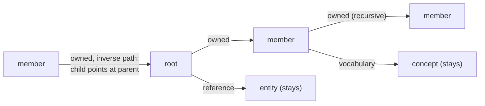

<!-- SPDX-License-Identifier: CC-BY-SA-4.0 -->

# Persistence: aggregate ownership (design sketch)

**Unit:** [`formal-methods-track-h`](../status/formal-methods-track-h.md), slices HO0 to HO9
([plan §3.5](../plans/formal-methods-track-h.md#35-ho-aggregate-ownership))
**Status:** sketch, 2026-10-10. Decisions AO-Q1 to AO-Q12 were taken on 2026-10-10
(H-D14), and AO-Q13 the same day, option a (H-D15, [§9](#9-named-graph-naming-ao-q13-ho8)). The decisions are
[ADR-A122](../../architecture/decisions/ADR-A122-aggregate-ownership.md), drafted 2026-10-10 and
Proposed until the maintainer accepts the work package at its close. The slices run end to end.
**Built from:** the exploration note [persistence-aggregate-ownership.md](../notes/persistence-aggregate-ownership.md),
its spike [`spikes/persistence-aggregate-ownership`](../../../spikes/persistence-aggregate-ownership/README.md),
and the review [persistence-aggregate-ownership-review.md](../notes/persistence-aggregate-ownership-review.md),
whose finding and decision numbers (S1 to S6, F1 to F9, AO-Q1 to AO-Q13) this sketch cites.
**Amends:** [ADR-A78](../../architecture/decisions/ADR-A78-persistence-profile-substrate-and-aggregate-boundaries.md)
decision 4, through ADR-A122.
**Compatibility:** none is kept. Nobody uses `persistence` except the formal-methods stream
(agreed 2026-10-10). Terms are removed, not deprecated. Compiled output, examples, witnesses and
tests change freely. No shim, alias or migration note is written.

This sketch is normative for the HO slices. A slice that finds a rule here wrong stops and asks,
and does not improvise.

## 1. The model in one paragraph

An aggregate is a root and the nodes it owns. Its boundary shape is a SHACL node-shape graph in
which every property shape that leads to a node is classified as **owned**, a **reference**, or
**vocabulary**. The **members** are the nodes reached from the root by a path made only of owned
edges, in the direction each edge declares. The **delete set** is every triple whose subject is the
root or a member, whatever its predicate, so datatype values, owned edges, reference edges and
vocabulary edges all go, while the nodes at the far end of reference and vocabulary edges stay. A
replace, a create and a tombstone delete are generated from one compiled property path. Version
rows stay one per root.



## 2. Definitions

| Term | Meaning |
|---|---|
| boundary shape | the `sh:NodeShape` named by `dal:boundaryShape` on a `dal:AggregateBoundaryProfile` |
| root shape, root class | the boundary shape, and its `sh:targetClass` |
| step | one hop, `<p>` forward or `^<p>` inverse |
| value property | a property shape with `sh:datatype`, or with `sh:nodeKind sh:Literal` |
| node property | any other property shape. It must carry `dal:ownership` |
| owned edge | a node property with `dal:ownership dal:Owned` |
| owned shape | the root shape, or the `sh:node` of an owned edge |
| member | a node other than the root reached from the root by a non-empty sequence of owned steps |
| member class | the `sh:class` of an owned edge, else the `sh:targetClass` of its `sh:node` |
| data graph | the named graph a composite family's aggregates live in, the profile's `dal:dataGraph` |
| delete set | every triple in the data graph whose subject is the root or a member |
| reference data | `skos:Concept`, `skos:ConceptScheme`, any class covered by a `dal:ReferenceData` declaration, and any class asserted `rdfs:subClassOf+` one of these in the configuration graph |

A skolem IRI is an ordinary IRI here (F5). Payloads are skolemised before they are written, so a
stored aggregate has no blank nodes. A list or a quantity inside an aggregate is owned only through
owned edges, for example `rdf:first` and `rdf:rest` as owned edges of a list shape.

## 3. Declaration surface (HO3)

`ontology/persistence` goes from 0.2.1 to **0.3.0** (breaking, ADR-A113). Follow skill
`lattice-ontology-authoring` for the version IRI, the catalog and the release row.

### 3.1 Added to `spec/persistence.ttl`

```turtle
dal:ownership a owl:ObjectProperty ;
    rdfs:label "ownership" ;
    rdfs:range dal:OwnershipKind ;
    rdfs:comment "On an sh:PropertyShape inside a dal:boundaryShape tree. Classifies the edge the property shape describes, in the context of the node shape that holds it. Mandatory on every property shape that is not a value property (sh:datatype, or sh:nodeKind sh:Literal). Forbidden on a value property." .

dal:OwnershipKind a owl:Class ;
    rdfs:label "Ownership kind" ;
    owl:oneOf ( dal:Owned dal:Reference dal:Vocabulary ) .

dal:Owned a dal:OwnershipKind ;
    rdfs:comment "The node at the far end belongs to the aggregate. It is deleted with the aggregate and its own owned edges are followed." .

dal:Reference a dal:OwnershipKind ;
    rdfs:comment "The node at the far end is another aggregate or an independent entity. The edge belongs to the aggregate and is deleted with it. The node is never deleted and its edges are not followed." .

dal:Vocabulary a dal:OwnershipKind ;
    rdfs:comment "As dal:Reference, for an edge to reference data (a concept, a scheme, a code). Declares intent. Behaves as dal:Reference at run time." .

dal:ReferenceData a owl:Class ;
    rdfs:label "Reference data declaration" ;
    rdfs:comment "Declares that the instances of each dal:coversClass are reference data. An owned edge to reference data is refused unless its profile declares dal:ownsReferenceData true. skos:Concept and skos:ConceptScheme are reference data without a declaration." .

dal:dataGraph a owl:ObjectProperty ;
    rdfs:comment "On a dal:AggregateBoundaryProfile whose strategy is dal:CompositePropertyBoundary. The named graph that holds the aggregates of this family. Mandatory for that strategy. Every composite operation reads and writes this graph only (static check S-1)." .

dal:ownsReferenceData a owl:DatatypeProperty ;
    rdfs:range xsd:boolean ;
    rdfs:comment "On a dal:AggregateBoundaryProfile. True for an aggregate that manages reference data, for example a concept scheme and its concepts. Default false." .
```

`dal:coversClass` already exists and is reused on `dal:ReferenceData`. Widen its `rdfs:comment` to
name both uses.

### 3.2 Removed

| Term | Why |
|---|---|
| `dal:maxTraversalDepth` | recursion is compiled to a path (AO-Q9). The walk visits each shape once, so it needs no bound |

Also remove its property from `dal:AggregateBoundaryProfileShape` in `shapes/constraints.ttl` (line
55 today), and every mention in the README, `docs/aggregate-boundaries.md` and examples.

Reword the `rdfs:comment` of `dal:CompositePropertyBoundary` and `dal:boundaryShape` to say the
shape is a classified tree, walked once, with `dal:ownership` on every node property.

### 3.3 Shapes added to `shapes/constraints.ttl`

```turtle
dal:BoundaryOwnershipShape a sh:NodeShape ;
    sh:targetSubjectsOf dal:ownership ;
    sh:property [
        sh:path dal:ownership ;
        sh:maxCount 1 ;
        sh:in ( dal:Owned dal:Reference dal:Vocabulary ) ;
        sh:message "dal:ownership takes exactly one of dal:Owned, dal:Reference, dal:Vocabulary." ] .

dal:ReferenceDataShape a sh:NodeShape ;
    sh:targetClass dal:ReferenceData ;
    sh:property [
        sh:path dal:coversClass ;
        sh:minCount 1 ;
        sh:nodeKind sh:IRI ;
        sh:message "A dal:ReferenceData declaration names at least one class with dal:coversClass." ] .

dal:CompositePropertyBoundaryRequiresDataGraphShape a sh:NodeShape ;
    sh:targetClass dal:AggregateBoundaryProfile ;
    sh:sparql [
        sh:message "dal:CompositePropertyBoundary requires dal:dataGraph, the named graph its aggregates live in (ADR-A122 decision 3, static check S-1)." ;
        sh:select """
            SELECT $this WHERE {
              $this dal:strategy dal:CompositePropertyBoundary .
              FILTER NOT EXISTS { $this dal:dataGraph ?g }
            }""" ] .
```

Copy the prefix declarations and `sh:prefixes` form of the existing
`dal:CompositePropertyBoundaryRequiresShapeShape` exactly. Add
`[ sh:path dal:dataGraph ; sh:maxCount 1 ; sh:nodeKind sh:IRI ]` to
`dal:AggregateBoundaryProfileShape`.

Add `[ sh:path dal:ownsReferenceData ; sh:maxCount 1 ; sh:datatype xsd:boolean ]` to
`dal:AggregateBoundaryProfileShape`.

## 4. The walk (HO4)

HO4 adds the new walk beside the old one, as a pure addition, and HO5 switches the compiler to it and deletes the old one. The new walk returns an `OwnershipTree` and raises nothing for classification
problems. It records them, and `validator.py` raises them (§5), so every refusal kind is a string
literal in `validator.py` where the witness harness finds it (H-D9).

### 4.1 Data model

```python
@dataclass(frozen=True)
class Step:
    predicate: URIRef
    inverse: bool

@dataclass(frozen=True)
class Edge:
    source_shape: URIRef
    property_shape: Node
    step: Step
    kind: str                       # "Owned" | "Reference" | "Vocabulary" | "Value"
    target_shape: URIRef | None     # sh:node, or None
    target_class: URIRef | None     # sh:class, else sh:targetClass of sh:node, else None

@dataclass
class OwnershipTree:
    root_shape: URIRef
    root_class: URIRef | None
    shapes: list[URIRef]            # owned shapes in visiting order, root first
    edges: list[Edge]               # every property shape of every owned shape, in walk order
    complex_paths: list[tuple[URIRef, Node]]        # (shape, property shape)
    unclassified: list[tuple[URIRef, Node, URIRef]] # (shape, property shape, predicate)
    ownership_on_values: list[tuple[URIRef, Node, URIRef]]

    def owned_edges(self) -> list[Edge]
    def member_classes(self) -> set[URIRef]        # target_class of owned edges, None dropped
    def predicates(self) -> set[URIRef]            # every step predicate on every owned shape, any kind
    def owned_path(self) -> PathExpr | None        # §6. None when there is no owned edge
```

### 4.2 Algorithm

```text
walk(graph, root_shape):
    queue = [root_shape], visited = [] (ordered)
    while queue:
        shape = queue.pop(0)
        if shape in visited: continue
        visited.append(shape)
        for ps in sorted(sh:property of shape, key = (str(predicate or ""), "1" if inverse else "0", str(ps))):
            path = sh:path of ps
            if path is an IRI:                         step = Step(path, False)
            elif path is a node with exactly one triple (path, sh:inversePath, IRI p):
                                                       step = Step(p, True)
            else: record complex_paths, continue
            kind = functional_value(ps, dal:ownership)    # IRI or None
            value = (ps sh:datatype ?) or (ps sh:nodeKind sh:Literal)
            if value:
                if kind is not None: record ownership_on_values
                edges.append(Edge(..., kind="Value", target_shape=None, target_class=None)); continue
            if kind is None: record unclassified, continue
            target_shape = functional_value(ps, sh:node)
            target_class = functional_value(ps, sh:class) or (target_shape and functional_value(target_shape, sh:targetClass))
            edges.append(Edge(..., kind=local_name(kind), target_shape, target_class))
            if kind == dal:Owned and target_shape is not None: queue.append(target_shape)
    return OwnershipTree(root_shape, functional_value(root_shape, sh:targetClass), visited, edges, ...)
```

Notes for the implementer:

- Recursion is legal. A shape reached twice is walked once.
- The sort key is total and independent of triple order (law L1). Keep H1.4a's T7 property, now over
  the new tree.
- A `dal:Reference` or `dal:Vocabulary` edge never queues its `sh:node`. That is what makes
  `sh:node` on a reference safe (F1).
- `functional_value` (`persistence.functional`) refuses a multi-valued `dal:ownership`. The shape
  in §3.3 also catches it.

### 4.3 Where the tree goes (HO5)

`resolver.py` stores the tree as `boundary_dim.extra["ownershipTree"]`. It replaces the extras
`compositeProperties`, `compositeEdgeProperties` and `maxTraversalDepth`, which are removed, and
`Closure`, `walk_boundary_shape`'s old return type, and `reachable_properties`, which are deleted.
`BoundaryCycleError` is deleted with its witness `refusal-BoundaryCycleError.ttl`.
`MissingBoundaryShapeError` stays.

## 5. Refusals and warnings (HO6)

Raised in `validator.py`, in this order, so that one fixture triggers exactly one rule. Each is a
`CrossAxisViolation(kind, str(target), message)` except the warning. Each needs a witness in
`tools/persistence/tests/witnesses/`, named `refusal-<Kind>.ttl` or `warning-<Kind>.ttl`, in the
slice that adds it, or `mise run check:persistence` fails (H1.2).

| Order | Kind | Condition | Message (fill the braces) |
|---|---|---|---|
| 1 | `MissingBoundaryShapeError` (exists) | composite profile without `dal:boundaryShape` | unchanged |
| 2 | `ComplexBoundaryPath` | `tree.complex_paths` not empty | `property shape {ps} on {shape} has an sh:path that is neither an IRI nor [ sh:inversePath IRI ]. A boundary shape allows one step per property shape.` |
| 3 | `UnclassifiedBoundaryEdge` | `tree.unclassified` not empty | `property shape {ps} on {shape} ({predicate}) leads to a node but declares no dal:ownership. Classify it as dal:Owned, dal:Reference or dal:Vocabulary.` |
| 4 | `OwnershipOnValueProperty` | `tree.ownership_on_values` not empty | `property shape {ps} on {shape} ({predicate}) is a value property (sh:datatype or sh:nodeKind sh:Literal) and cannot carry dal:ownership.` |
| 5 | `CompositeBoundaryWithoutOwnedEdges` | `tree.owned_edges()` is empty | `boundary shape {shape} owns no edge, so the aggregate is its root alone. Use dal:NamedGraphBoundary or dal:NoBoundary.` |
| 6 | `OwnedReferenceData` | an owned edge's `target_class` is reference data (§2), and the profile does not have `dal:ownsReferenceData true` | `property shape {ps} on {shape} owns {class}, which is reference data. Classify the edge dal:Vocabulary, or declare dal:ownsReferenceData true on the profile if this aggregate manages that vocabulary.` |
| 7 | `UniquenessOutsideBoundary` (exists) | a uniqueness key property is not in `tree.predicates()` | unchanged, reworded to say "not a property of the root or of an owned shape" |
| 8 | `BoundaryConflict` (exists, rewritten) | a member class at **any** depth declares its own boundary strategy other than `dal:NoBoundary` | unchanged text. Today's check reads only the first level ([validator.py:504](../../../tools/persistence/src/persistence/validator.py:504)) |
| 9 | `OverlappingOwnership` | two composite profiles A and B where `members(A)` meets `members(B) ∪ {root(B)}` | `{class} is owned by both {shapeA} and {shapeB}. A node belongs to one aggregate.` |
| W | `ReferenceToOwnedClass` (warning) | a property shape anywhere in the configuration graph, not on an owned shape of tree T, has `sh:class X` or an `sh:node` targeting `X`, where `X` is a member class of T and not T's root class | `{ps} points at {X}, which {shapeT} owns. References from outside an aggregate should target its root ({rootClass}), since a deleted member leaves the reference dangling.` |

Rules 8 and 9 are configuration-wide and run where `BoundaryConflict` runs today. The warning is a
`Diagnostic(kind="ReferenceToOwnedClass", severity="WARNING", ...)`, emitted like
`MixedReceiptModel` ([validator.py:469](../../../tools/persistence/src/persistence/validator.py:469)).

Removed in HO5, with its witness and tests: `CompositeBoundaryMultipleProperties`. Several owned
edges are the normal case now.

## 6. Compiling the tree to one property path (HO4)

### 6.1 Why one path

SPARQL property paths are regular expressions over predicates. The owned edges form a finite
automaton whose states are owned shapes, so the set of members is a regular language over steps, and
state elimination turns it into one path expression. One `OPTIONAL` with one path then sweeps the
aggregate in time linear in its size (F2), recursion becomes `*`, inverse edges become `^`, and
SPARQL's path semantics terminate on cyclic data.

### 6.2 Expression tree

A new module `persistence/paths.py`.

```python
class PathExpr: ...                          # abstract
@dataclass(frozen=True) class Eps(PathExpr)  # the empty path
@dataclass(frozen=True) class Step(PathExpr): predicate: URIRef; inverse: bool
@dataclass(frozen=True) class Seq(PathExpr): parts: tuple[PathExpr, ...]
@dataclass(frozen=True) class Alt(PathExpr): options: tuple[PathExpr, ...]   # sorted by render()
@dataclass(frozen=True) class Star(PathExpr): inner: PathExpr
@dataclass(frozen=True) class Opt(PathExpr): inner: PathExpr

def render(e) -> str:
    Step:  "<p>" or "^<p>", with p through terms.Iri.encode
    Seq:   "/".join(render(part), parenthesised when part is Alt)
    Alt:   "(" + "|".join(render(option)) + ")"
    Star:  "(" + render(inner) + ")*"
    Opt:   "(" + render(inner) + ")?"
    Eps:   never rendered on its own (an assertion)
```

Smart constructors, which keep the output small and deterministic:

| Constructor | Rule |
|---|---|
| `seq(a, b)` | `None` if either is `None`. `Eps` is the identity. Nested `Seq` flattens |
| `alt(a, b)` | `None` is the identity. Nested `Alt` flattens. Duplicates removed. If `Eps` is among several options, the result is `Opt(alt(rest))`. If `Opt(x)` is among the options, unwrap it to `x` and add `Eps`. Options sorted by `render` |
| `star(x)` | `star(Eps) = Eps`. `star(Star(y)) = Star(y)`. `star(Opt(y)) = Star(y)` |

### 6.3 State elimination

```text
owned_path(tree):
    states = tree.shapes + [LEAF]          # LEAF: target of every owned edge with no sh:node
    R = {}                                  # (from, to) -> PathExpr
    for e in tree.owned_edges():
        to = e.target_shape or LEAF
        R[(e.source_shape, to)] = alt(R.get(...), Step(e.step.predicate, e.step.inverse))
    R[(START, tree.root_shape)] = Eps
    for q in states: R[(q, FINAL)] = Eps
    for q in sorted(states, key=str, with LEAF last):
        loop = R.pop((q, q), None)
        ins  = [(p, x) for (p, t), x in R.items() if t == q]
        outs = [(r, y) for (f, r), y in R.items() if f == q]
        for p, x in ins:
            for r, y in outs:
                R[(p, r)] = alt(R.get((p, r)), seq(seq(x, star(loop) if loop else Eps), y))
        remove every key with q as either end
    return R[(START, FINAL)]                # contains Eps, so it renders as "( ... )?"
```

The result matches the root itself (zero length) and every member. The templates sweep
`$root <path> ?s . ?s ?p ?o`, so the root's own triples need no separate branch.

### 6.4 The injection boundary

Add `class PropertyPath(SparqlTerm)` to `terms.py`, with `encode(expr: PathExpr) -> PropertyPath`,
which renders through `render` and so through `Iri.encode` for every predicate. Operators come from a
fixed set, so no adopter string reaches query structure except as an encoded IRI. At encode time,
parse `SELECT * WHERE { ?a <rendered> ?b }` with `rdflib.plugins.sparql.prepareQuery` and raise
`SparqlTermError` if it fails. `render.py` and `instantiate.py` need no change, since a `PropertyPath`
is a `SparqlTerm` and `instantiate` passes every binding type except `Integer` through as encoded
text. Add `"PropertyPath"` to the `param_type` comment in `operations.py`.

### 6.5 Expected path for the reference fixture

Owned edges of §10's fixture, by source shape: `ProjectShape` (`hasMilestone` to `MilestoneShape`,
`hasPlan` to `PlanShape`), `MilestoneShape` (`hasTask` to `TaskShape`), `TaskShape` (`attachment` to
`DocumentShape`, `^onTask` to `CommentShape`, `hasSubtask` to `TaskShape`), and nothing owned from
`PlanShape`, `DocumentShape` or `CommentShape`. The rendered string depends on elimination order and
is pinned by a golden test in HO4 after the first run. Its **meaning** is pinned now, by the member
set in §10.3.

## 7. Generated operations (HO1, HO5, HO7)

**Which graph (AO-Q14, decided 2026-10-10: option a).** A composite family's aggregates live in one
named graph, the profile's `dal:dataGraph`, bound as an `Iri` named `dataGraph`. Every composite
pattern, delete template and payload from HO5 on is wrapped in `GRAPH {{{dataGraph}}}`, which meets
static check S-1 ([review F10, §7.1](../notes/persistence-aggregate-ownership-review.md#71-a-further-question-ao-q14)).
HO1 alone keeps the default graph, because it fixes today's template before `dal:dataGraph`
exists. A composite profile without `dal:dataGraph` is refused as `MissingDataGraph` (HO5). Version
rows, transaction claims and revision records keep their graphs. Tests load their data into the data
graph. The sections below show the HO1 form, and then the HO5 and HO7 forms with the graph.

### 7.1 Replace, `cas-replace-composite-property` and its dataset-guard variant

**HO1** (before the path exists) changes the existing two templates only in these places:

```sparql
DELETE {
  ?s ?p ?o .
  GRAPH {{{metaGraphPrefix}}} { ... unchanged ... }
}
INSERT {
  {{{payloadTriples}}}
  GRAPH {{{metaGraphPrefix}}} { ... unchanged ... }
  GRAPH {{{txnGraph}}}        { ... unchanged ... }
  GRAPH ?logGraph2 { ... unchanged revision record ... }
}
WHERE {
  ... unchanged guards and BINDs ...
  OPTIONAL { $root {{{compositeProperty}}}* ?s . ?s ?p ?o }
}
```

So `?root ?p1 ?o1` and `?member ?p2 ?o2` become one `?s ?p ?o`, the two `OPTIONAL`s become one, `+`
becomes `*` (the zero-length step brings in the root), and the payload leaves `GRAPH ?logGraph`.
Update the template's header comment to match.

**HO5** replaces `{{{compositeProperty}}}*` with `{{{ownedPath}}}`, bound as a `PropertyPath` from
`tree.owned_path()`, and adds the data graph, so the three changed places read:

```sparql
DELETE { GRAPH {{{dataGraph}}} { ?s ?p ?o } ... }
INSERT { GRAPH {{{dataGraph}}} { {{{payloadTriples}}} } ... }
WHERE  { ... OPTIONAL { GRAPH {{{dataGraph}}} { $root {{{ownedPath}}} ?s . ?s ?p ?o } } }
```

The `compositeProperty` binding is removed from `operations.py`.

### 7.2 Create, `create-if-absent-composite` and its dataset-guard variant (HO7, closes TD-04)

Copy `create-if-absent-named-graph.mustache` and its dataset-guard variant. Then:

- the payload goes to the data graph: `INSERT { GRAPH {{{dataGraph}}} { {{{payloadTriples}}} } ... }`
- delete the `BIND(... AS ?g)` line and the `graphPrefix` binding
- add a guard that nothing of the root is already in the data graph:
  `FILTER NOT EXISTS { GRAPH {{{dataGraph}}} { $root ?anyP ?anyO } }`

Generated when the boundary is composite and `dal:firstWrite` is `dal:AbsentRow`, exactly as the
named-graph create is generated for a named-graph boundary today.

### 7.3 Tombstone delete, `tombstone-delete-composite` and its dataset-guard variant (HO7)

Copy `tombstone-delete-named-graph.mustache` and its dataset-guard variant. Then:

- `DELETE { GRAPH {{{dataGraph}}} { ?s ?p ?o } GRAPH {{{metaGraphPrefix}}} { ... } }`
- replace `OPTIONAL { GRAPH ?g { ?s ?p ?o } }` with
  `OPTIONAL { GRAPH {{{dataGraph}}} { $root {{{ownedPath}}} ?s . ?s ?p ?o } }`
- delete the `?g` `BIND` and the `graphPrefix` binding

Generated wherever the named-graph tombstone is generated for a named-graph boundary.

### 7.4 Every new or changed template

- appears in `test_template_alignment.py`
- is reached by a fixture (H1.3's rule), adding `template-<name>.ttl` witnesses where no example
  reaches it
- passes S-3 and S-4 (`python -m persistence hygiene`). The previous-revision allowance in
  `templatecheck.OPTIONAL_INSERT_VARIABLES` applies to the new tombstone as it does to the
  named-graph one. The new create needs none

### 7.5 What is not generated

No partial update, no "set at a node", no add-child or remove-child operation. Those are level
operations, deferred with units (§11). Whole-replace stays the only edit, guarded by the root's
version row.

## 8. Named-graph strategy and the shared tree

AO-Q7. A `dal:NamedGraphBoundary` profile **may** name a `dal:boundaryShape`. When it does, the
compiler walks it, applies refusals 2 to 6 and the warning, and records the tree. No SPARQL changes:
the graph is the aggregate. The tree defines which subjects a payload may contain, and H2's IR
enforces that as the payload check ([§12](#12-what-h2-inherits)). Documentation recommends named
graphs for new deployments (HO7). The compiler's default boundary strategy does not change.

## 9. Named-graph naming, AO-Q13 (HO8)

Decided 2026-10-10, option a (H-D15). The options and the reasoning on IRI length are in the
[review §7](../notes/persistence-aggregate-ownership-review.md#7-one-new-question-ao-q13). HO8 does this:

- `dal:graphIriTemplate` must contain `{id}` exactly once. Its comment says `{id}` is replaced by the
  root IRI, percent-encoded with `ENCODE_FOR_URI`. A template without `{id}` is refused as
  `GraphIriTemplateInvalid` (new, witnessed).
- `operations.py` splits the template at `{id}` into `graphPrefix` and `graphSuffix`, binding both.
- Every named-graph template computes
  `BIND(IRI(CONCAT({{{graphPrefix}}}, ENCODE_FOR_URI(STR($root)), {{{graphSuffix}}})) AS ?g)`. They are
  the six named-graph templates: create, replace, tombstone, each with its dataset-guard variant. Also
  `unconditional-write` where it names `?g`.
- When a profile declares no template, the compiler uses `urn:g:<family token>/{id}`, the family
  token as `_family_token` computes it for event graphs today.
- **Across families** (review F11): the prefixes before `{id}` of every named-graph family in one
  configuration form an antichain, or the compile is refused as `GraphIriTemplateOverlap`, naming
  both profiles. A non-empty suffix after `{id}` begins with a character that `ENCODE_FOR_URI`
  never emits, that is, not one of `A-Z a-z 0-9 - . _ ~ %`, or the template is refused as
  `GraphIriTemplateInvalid`. With both rules, equal graph IRIs imply the same family and the same root.
- Tests: two roots `https://example.org/a/1` and `https://example.org/b/1` get different graphs. A
  template `urn:g:orders/{id}/data` keeps `/data`. A template without `{id}`, and one whose suffix is
  `data` (no separator), are refused as `GraphIriTemplateInvalid`. Two families with templates
  `urn:g:{id}` and `urn:g:orders/{id}` are refused as `GraphIriTemplateOverlap`.


## 10. The reference fixture

Domain-neutral, because substrate documentation must be (`AGENTS.md`). It has the structure of the
placement example in the exploration note: several owned relations, a recursion, an edge that is owned in one
context and a reference in another, an inverse edge, a reference outside, and vocabulary. HO4 adds it
as `ontology/persistence/examples/composite-project-ownership.ttl` (configuration and shape) and
`tools/persistence/tests/fixtures/project-data.ttl` (instance data).

### 10.1 Configuration and boundary shape

```turtle
@prefix dal:  <https://www.nebularis.org/neuro-semantic/lattice/persistence#> .
@prefix ex:   <https://example.org/projects#> .
@prefix sh:   <http://www.w3.org/ns/shacl#> .
@prefix skos: <http://www.w3.org/2004/02/skos/core#> .
@prefix xsd:  <http://www.w3.org/2001/XMLSchema#> .

ex:ProjectClass a dal:ClassScope ;
    dal:targetClass ex:Project ;
    dal:priority "20"^^xsd:integer .

ex:ProjectBoundaryProfile a dal:AggregateBoundaryProfile ;
    dal:appliesTo     ex:ProjectClass ;
    dal:strategy      dal:CompositePropertyBoundary ;
    dal:boundaryShape ex:ProjectShape ;
    dal:dataGraph     <urn:g:projects> .

ex:ProjectConcurrencyProfile a dal:ConcurrencyProfile ;
    dal:appliesTo           ex:ProjectClass ;
    dal:concurrencyProfile  dal:Optimistic ;
    dal:minConcurrencyLevel dal:Linearizable .

ex:ProjectReceiptProfile a dal:ReceiptProfile ;
    dal:appliesTo    ex:ProjectClass ;
    dal:receiptModel dal:PatchLog .

ex:ProjectShape a sh:NodeShape ; sh:targetClass ex:Project ;
    sh:property [ sh:path ex:name ; sh:datatype xsd:string ] ,
                [ sh:path ex:forClient ; sh:class ex:Organisation ; dal:ownership dal:Reference ] ,
                [ sh:path ex:hasMilestone ; sh:node ex:MilestoneShape ; dal:ownership dal:Owned ] ,
                [ sh:path ex:hasPlan ; sh:node ex:PlanShape ; dal:ownership dal:Owned ] .

ex:MilestoneShape a sh:NodeShape ; sh:targetClass ex:Milestone ;
    sh:property [ sh:path ex:due ; sh:datatype xsd:date ] ,
                [ sh:path ex:hasTask ; sh:node ex:TaskShape ; dal:ownership dal:Owned ] .

ex:TaskShape a sh:NodeShape ; sh:targetClass ex:Task ;
    sh:property [ sh:path ex:status ; sh:class skos:Concept ; dal:ownership dal:Vocabulary ] ,
                [ sh:path ex:assignee ; sh:class ex:Person ; dal:ownership dal:Reference ] ,
                [ sh:path ex:hasSubtask ; sh:node ex:TaskShape ; dal:ownership dal:Owned ] ,
                [ sh:path ex:attachment ; sh:node ex:DocumentShape ; dal:ownership dal:Owned ] ,
                [ sh:path [ sh:inversePath ex:onTask ] ; sh:node ex:CommentShape ; dal:ownership dal:Owned ] .

ex:PlanShape a sh:NodeShape ; sh:targetClass ex:Plan ;
    sh:property [ sh:path ex:attachment ; sh:class ex:Document ; dal:ownership dal:Reference ] .

ex:DocumentShape a sh:NodeShape ; sh:targetClass ex:Document ;
    sh:property [ sh:path ex:title ; sh:datatype xsd:string ] .

ex:CommentShape a sh:NodeShape ; sh:targetClass ex:Comment ;
    sh:property [ sh:path ex:text ; sh:datatype xsd:string ] ,
                [ sh:path ex:onTask ; sh:class ex:Task ; dal:ownership dal:Reference ] .
```

The scope and profiles copy the form of the shipped `composite-property-boundary-shacl.ttl`,
without its `dal:maxTraversalDepth` (removed, §3.2).

`CommentShape`'s forward `onTask` is a `dal:Reference` from the comment's side. Its triple is
still deleted because the comment is a member and the triple's subject is the comment.

### 10.2 Instance data

Loaded into the data graph `<urn:g:projects>` from HO5 on, and into the default graph for HO4's
path tests, which do not involve operations.

```turtle
@prefix ex:   <https://example.org/projects#> .
@prefix skos: <http://www.w3.org/2004/02/skos/core#> .
@prefix xsd:  <http://www.w3.org/2001/XMLSchema#> .

ex:p1 a ex:Project ; ex:name "Apollo" ; ex:forClient ex:acme ;
      ex:hasMilestone ex:m1 , ex:m2 ; ex:hasPlan ex:plan1 .
ex:m1 a ex:Milestone ; ex:due "2026-11-01"^^xsd:date ; ex:hasTask ex:t1 .
ex:m2 a ex:Milestone ; ex:due "2026-12-01"^^xsd:date .
ex:t1 a ex:Task ; ex:status ex:InProgress ; ex:assignee ex:alice ;
      ex:hasSubtask ex:t2 ; ex:attachment ex:docOwned .
ex:t2 a ex:Task ; ex:status ex:Done ; ex:hasSubtask ex:t3 .
ex:t3 a ex:Task ; ex:status ex:Done .
ex:docOwned a ex:Document ; ex:title "Task notes" .
ex:c1 a ex:Comment ; ex:text "Looks good" ; ex:onTask ex:t1 .
ex:plan1 a ex:Plan ; ex:attachment ex:docShared .

# outside the aggregate
ex:acme a ex:Organisation ; ex:name "Acme" .
ex:alice a ex:Person ; ex:name "Alice" .
ex:docShared a ex:Document ; ex:title "Shared template" .
ex:InProgress a skos:Concept ; skos:inScheme ex:TaskStatuses .
ex:Done a skos:Concept ; skos:inScheme ex:TaskStatuses .
ex:TaskStatuses a skos:ConceptScheme .
ex:report1 ex:about ex:p1 .

# a second aggregate that must be untouched
ex:p2 a ex:Project ; ex:name "Gemini" ; ex:hasMilestone ex:m9 .
ex:m9 a ex:Milestone ; ex:due "2027-01-01"^^xsd:date .
```

### 10.3 Expected results

| Question | Answer |
|---|---|
| members of `ex:p1` | `m1, m2, t1, t2, t3, docOwned, c1, plan1` (8) |
| delete set | every triple whose subject is `p1` or one of the 8 members (28 triples: `p1` 6, `m1` 3, `m2` 2, `t1` 5, `t2` 3, `t3` 2, `docOwned` 2, `c1` 3, `plan1` 2) |
| left after deleting `p1`'s aggregate, by subject | `acme, alice, docShared, InProgress, Done, TaskStatuses, report1, p2, m9`, every one with all its triples |
| `ex:report1 ex:about ex:p1` | left, since its subject is outside |
| `docShared` | left: owned from `TaskShape`, a reference from `PlanShape`, and reached only from `plan1` |
| a flat alternation of every owned predicate, for contrast | would also reach `docShared` (the context problem, note §4.1) |

Assert 28 in the test. If it differs,
recount by hand and correct this table in the same slice.

## 11. Deferred: units and level operations

AO-Q5. Not built. Recorded so a later slice can start from it.

- **Units.** A unit is an owned node with its own version row. Rules, from the spike's D2 and D4
  (note §7.3): an edit bumps the row of its nearest enclosing unit. Creating or removing a child unit
  bumps the parent unit's row. Removing a unit also bumps and tombstones every unit below it, as
  found in the removal's own snapshot. A declared cross-level invariant has its own row, bumped by
  every writer it covers. Sequences and receipts become per unit, and an as-of read of the whole
  aggregate then needs a rule (note §7.6).
- **Level operations.** Set at a node replaces the node's value properties and reference and
  vocabulary edges, **never its owned edges** (F7). Add child inserts one owned edge and the child's
  triples. Remove child deletes the edge and the child's delete set.
- **Trigger to revisit:** measured contention on a root's version row, or a domain invariant that
  needs per-level edits.
- **Model:** protocol model O in the [protocols sketch](formal-methods-track-h-protocols.md), seeded
  from `spikes/persistence-aggregate-ownership/concurrency_model.py`.

## 12. What H2 inherits

H2's typed IR (the [specification sketch §3](formal-methods-track-h-specification.md#3-the-typed-intermediate-representation))
gains three things from this work, listed there:

1. The `OwnershipTree` and its compiled `PropertyPath` as typed IR values.
2. A **payload check**: every subject of a composite or named-graph payload is the root or a node the
   payload reaches from the root through owned steps. The IR states it, and the runtime caller
   enforces it, since a payload is a request-time slot the SPARQL cannot inspect.
3. The required-parameter guard of H-D12, option D (TD-34).

## 13. ADR-A122, drafted 2026-10-10

**Title:** Aggregate ownership: a classified boundary shape for every boundary strategy.
**Status:** Proposed. **Amends:** ADR-A78 decision 4. **Related:** ADR-A79, ADR-A-FM4, this sketch,
the note and the review.

Context: summarise review §1 and §5, citing F1, F2, F4, F6 and TD-03, TD-04, TD-39.

Decisions, one numbered point each:

1. A boundary shape is a classified tree. Every node property carries `dal:ownership`, one of
   `dal:Owned`, `dal:Reference`, `dal:Vocabulary`. `sh:node` alone no longer means ownership.
2. The members are the nodes reached through owned steps. The delete set is every triple whose
   subject is the root or a member. Inverse steps and recursion are allowed. Types are not checked
   at run time.
3. The tree compiles to one SPARQL property path, and composite operations sweep with it in one
   pattern. Replace, create and tombstone delete are generated for the composite strategy. Every
   composite operation reads and writes one named graph, the profile's mandatory `dal:dataGraph`,
   never the default graph (AO-Q14, static check S-1).
4. Reference data (SKOS concepts and schemes, and declared `dal:ReferenceData` classes) is never
   owned, unless the profile declares `dal:ownsReferenceData true`.
5. One owner per class across composite boundaries, checked at compile time. References from outside
   should target roots, and the compiler warns otherwise.
6. Named-graph profiles may carry the same classified shape, which defines what a payload may
   contain. Named graphs are the recommended default for new deployments.
7. Version rows stay one per root. Units and level operations are deferred, with the conditions
   that would bring them back.
8. A named graph's IRI is `dal:graphIriTemplate` with `{id}` replaced by the root IRI encoded with
   `ENCODE_FOR_URI`, which is injective. A template must contain `{id}` exactly once. Across
   families, template prefixes form an antichain and a non-empty suffix starts with a character the
   encoding never emits, so the mapping from (family, root) to graph is injective (review F11). No
   standard limits IRI length, and a store that refused an over-long IRI would fail the write loudly
   (review §7).

Consequences: the removed terms (§3.2), refusals (§5), templates (§7), the effect on Track H (H1.4b,
H2, model O), and that no compatibility was kept, citing the agreement of 2026-10-10.

Add it to `docs/architecture/decisions/README.md`. Re-check the number against `main` before the
merge (A121 is claimed by the repository-catalogue sketch).

## 14. Non-goals

- Units, level operations, a membership index (§11, AO-Q5, AO-Q8).
- Runtime type checks on members (S3).
- Changing the compiler's default boundary strategy (AO-Q7).
- Checking references into an aggregate at run time (AO-Q4 makes it a static warning).
- Erasure of personal data, which follows its own procedure (guide §24.5).

## 15. Effect on the later Track H slices

Traced on 2026-10-10 through the Track H plan (§4 to §7), its three sketches, the source review
[persistence-fml.md](../notes/rdf-engine/persistence-fml.md), and the epic's plan, sketch and status.
Tracks A to G concern Eligibility, the ledger and the toolchain, and none of them depends on
Persistence's boundary design, so none changes. Within Track H, every slice that reasons about what
a write touches changes. Each row below is mirrored in the plan's outline for that slice.

| Slice or artefact | Before | After the ownership design |
|---|---|---|
| Laws (main sketch §3) | L1 to L15, from the source review. L3 asks that targets partition instances | **L16, ownership is a partition of members**, added to the track's register: the compiled path denotes exactly the classified tree's paths (soundness, review check C10), and no node is a member of two live aggregates (disjointness: class-level by `OverlappingOwnership`, instance-level by an audit, H9). L6's gap list follows H1.4b. L15's migrations gain two kinds: reclassifying an edge, which changes what a delete takes for data already stored, and changing `dal:graphIriTemplate`, which renames graphs |
| H1.4b | composite entries from TD-03 and the first-property binding | the entries in plan §3's H1.4b paragraph, plus "composite operations rely on the default graph (S-1, TD-40)" until HO5 |
| H2, typed IR | typed parameters, read and write sets, explicit graph roles, guard tags | adds `OwnershipTree` and `PropertyPath` as typed values, the payload check, the required-parameter guard (TD-34) (§12). A composite operation's **read set is the closure the path computes at execution**, and its write set is the delete set, the payload and the version row, which H5's models consume. The explicit-graph rule holds, since AO-Q14 chose a named data graph |
| H3, registry | cross-axis rules, selection table, README tables, obligations, laws held | the boundary rules of §5 and HO8's two graph-naming rules join the rule inventory with their witnesses. They are structural rules over one shape or one configuration, not cross-axis predicates, so the registry records them as their own kind. The selection table gains composite create (under `dal:AbsentRow`) and composite tombstone delete, so the L5 totality check covers them |
| H4, exhaustive checks | V1 to V10 over the cross-axis space, and the static checks of the specification sketch §6 | three additions. **C10, path language equality:** the compiled path's language equals the set of owned-edge paths of the shape graph, checked by automata equivalence over the shape graph (it was "to the declared depth", and depth is gone). **IRI-template injectivity (Z3 strings)** covers graph templates across families, verifying F11's two rules. **C14, request size:** whole-replace sends the whole aggregate, so the bound uses the largest declared aggregate |
| H5, models A to D | model A, the guarded write, over named graphs | **model A is parametrised by boundary strategy.** Under the composite strategy the delete set is read at execution, so the model checks that a writer to aggregate A never changes a triple outside A's delete set, and that two writers to A always meet on A's root row (the spike's D0 result, now beyond pairs of writers). **Model C, the create race, covers the composite create**, whose guards are "no version row" and "no triple of the root". Two concurrent creates insert the same version-row triple, and whether inserting an identical statement counts as a write-write conflict is a store property the capability record must carry and the model must branch on |
| H5, capability record | the full record of the main sketch §5 | `unionDefaultGraph` does not matter to the composite strategy, since AO-Q14 chose a named data graph. The identical-insert conflict property above is a new field |
| H6, Isabelle | `Resolution`, `Positions`, `Encoding`, `Outcomes` | **`Encoding.thy` gains graph-IRI injectivity**: `prefix · enc(r) · suffix` is injective in `(family, r)` under F11's two rules, with `enc` the percent-encoding of UTF-8. A theory of state elimination (the compiled regular expression denotes the automaton's language) is possible but not proposed: H4's automata check and HO4's property test cover it at lower cost |
| H7, models E to J | outcome, epoch, retention, global read, fencing, infrastructure writers | no change. None depends on what an aggregate contains |
| H8, model K (erasure) | the enumerated store list | the list includes composite members in the data graph, reached through the owned path, and erasure follows its own procedure, not the tombstone delete (ADR-A122 consequences) |
| H8, model L (multi-aggregate writes) | deadlock and livelock under `dal:deadlockPolicy` | adds references across aggregates: a writer to B adding a reference into A while A is deleted. Under the roots-only rule (AO-Q4) the reference names A's root and reads as deleted. A reference to a non-root member, which the compiler only warns about, can dangle, and the model shows when |
| H8, model M (bulk load and cutover) | offline positions, staging, cutover | an out-of-band load can make a node a member of two aggregates, which no guard sees. The H9 overlap audit is its detector |
| Protocol model O | not in the source review | units, deferred with them (§11, protocols sketch) |
| H9, detection | nine missing audits from the source review | four more invariants with an audit and a witness each: **instance overlap** (a node reached by the owned paths of two live roots), **orphan member** (a subject typed with an owned member class and reached from no live root), **reference into a member** (an edge from outside an aggregate to a non-root member, the run-time side of `ReferenceToOwnedClass`), and, for named-graph families with a boundary shape, **payload outside the tree** (a subject in the graph the tree does not reach). Each audit is applicable only to the strategies it names, labelled as the plan's H9 requires |
| H10, monitors | monitors from H9's invariants | the four audits above become monitors with the rest |
| Milestones | FMH1 to FMH7 | FMH-O added: the composite strategy deletes exactly the declared aggregate, verified on the reference fixture, by the property test, and by the automata check once H4 lands |

### 15.1 Solvers and provers, in summary

| Technique | New obligation from this design | Slice |
|---|---|---|
| automata | compiled path language equals the shape graph's owned-path language (C10) | H4 |
| SMT strings (Z3) | graph IRI injectivity across families (F11) | H4 |
| linear arithmetic | request size of whole-replace with the largest aggregate (C14) | H4 |
| Alloy | the source review's `ClosuresDisjoint` model, restated over classified edges: no counterexample at class level given `OverlappingOwnership`, and the instance-level counterexample (a wrongly typed edge) that motivates H9's overlap audit | H4 or H9 |
| Isabelle | `Encoding.thy`: graph IRI injectivity | H6 |
| TLA+ or Quint | model A by boundary strategy, model C with composite create, models K, L, M additions, model O deferred | H5, H8 |
