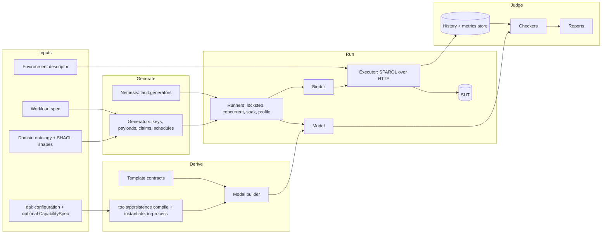

<!-- SPDX-License-Identifier: CC-BY-SA-4.0 -->

# Persistence Model-Based Testing Library (Design Sketch)

**Unit ID:** `persistence-mbt`
**Status:** Sketch. Proposes ADR-A84 (see §14). No plan or status record yet.
**Working name:** `tools/persistence_mbt`, CLI `persistence-mbt`
**Builds on:** [ADR-A78](../../architecture/decisions/ADR-A78-persistence-profile-substrate-and-aggregate-boundaries.md), [ADR-A79](../../architecture/decisions/ADR-A79-persistence-compiler-toolchain.md), [ADR-A82](../../architecture/decisions/ADR-A82-framework-neutral-identity-pattern-selection.md), [rdf-sparql-patterns-guide.md](../../architecture/rdf-sparql-patterns-guide.md) (Chapters 15, 18, 19, 25, 27), [persistence-compiler-iri-sync](persistence-compiler-iri-sync.md)

---

## 1. Purpose and boundary

An adopter chooses persistence behaviour by writing a `dal:` configuration against their own domain ontology. The compiler turns that choice into SPARQL. Nothing today tells the adopter whether the result behaves as they intended on the backend they actually run, under the load they actually expect.

This library closes that gap. Given a domain ontology, a `dal:` configuration, an optional `dal:CapabilitySpec`, and a workload description, it:

1. derives an executable **model** of the behaviour the configuration promises,
2. **generates** scenarios (operations, synthetic data, concurrency, faults) from the ontology, the configuration, and the workload,
3. runs each scenario against the model and against the **system under test** (SUT) by executing compiler-generated SPARQL,
4. **checks** the observed behaviour against the model and reports, per guarantee, whether it held.

The same engine serves three uses, sharing one run format so that a performance or growth number is never taken from a run whose behaviour was not also checked:

| Use | Question answered |
|---|---|
| Behavioural verification | Does my design, on my backend, deliver the guarantees my configuration claims, and which anomalies does it permit? |
| Performance profiling | What latency, throughput, conflict and retry rates does my design produce at a given contention level? |
| Growth and cost estimation | How fast does each graph family grow under a controlled intake, and what does that cost over a horizon? |

**Out of scope:**

- Store conformance. Certifying a backend's capabilities is the TCK's job (epic P0.5.4–P0.5.6, P0.5.14, guide Chapter 27). This library validates an adopter's configuration *on* a backend, certified or not. §9.2 maps the two.
- Arbitrary SPARQL load testing. Every write the library issues is compiler-generated. It never hand-writes a write path (guardrail G5/G11 in the epic).
- Runtime use. Test-time only, never a dependency of a product package, isolated the same way ADR-A83 (proposed) isolates reasoners.
- The store SPI (proposed ADR-A75). Backend interaction is described only as executing SPARQL (§6.5). An SPI-backed executor slots into the same seam later.

## 2. The central idea: the resolved profile is the specification

The adopter's resolved profile already states the behaviour they chose: `dal:Optimistic` means a stale write must be rejected, `dal:PatchLog` means history must be replayable, `dal:DatasetLevelGuard` means a restore must invalidate stale writers. The model is therefore not written per adopter. It is a generic interpreter that assigns executable semantics to each resolved dimension value and to each template the compiler selected.

This makes the model derivable, and it makes the verdict meaningful to the adopter. Every observation is classified into one of four outcomes:

| Verdict | Meaning | Default CI effect |
|---|---|---|
| **Guarantee held** | Behaviour the configuration promises was observed | pass |
| **Guarantee violated** | Behaviour the configuration promises did not hold: a template defect, a backend defect, or a `dal:CapabilitySpec` claim the backend does not meet | fail |
| **Permitted anomaly observed** | Behaviour the configuration explicitly allows was observed and measured, for example a lost update under `dal:ProvidedConcurrency` or a stale-row commit under `dal:RowLevelGuardOnly`. Reported with the `dal:` warning shape that documents it | report, configurable threshold |
| **Unmodelled behaviour** | An outcome no model state explains | fail, triaged as a model or contract defect until shown otherwise |

The third class is what makes this a design-validation tool rather than a pass/fail gate. ADR-A82 establishes that LATTICE documents trade-offs and lets adopters choose. This tool shows the adopter the concrete consequence of each choice on their own data and backend, for example "under this workload, 4.1% of concurrent writes to `ex:Order` were silently overwritten, as `dal:ProvidedConcurrency` permits."

## 3. Architecture



### 3.1 Technology

Python 3.11, matching `tools/persistence`, so the library imports the compiler in-process and interprets exactly the resolved profile the compiler produced rather than re-deriving it.

| Dependency | Role | Licence | Required |
|---|---|---|---|
| `tools/persistence` | Compile, resolve, instantiate, term encoders | MPL-2.0 (in repository) | yes |
| rdflib | Graph handling, N-Triples payload serialisation, in-process self-test executor | BSD-3-Clause | yes |
| Hypothesis | Stateful model-based testing, generator strategies, shrinking | MPL-2.0 | yes |
| httpx | Async SPARQL 1.1 Protocol client | BSD-3-Clause | yes |
| pyshacl | Generator self-validation against the adopter's shapes | Apache-2.0 | yes |
| DuckDB | Run store: histories, metrics, census samples, regression for growth fits | MIT | yes |
| HdrHistogram (Python port) | Latency histograms with coordinated-omission correction | verify at slice time | yes |
| Testcontainers (Python) | Reference SUT lifecycle for the library's own integration tests | Apache-2.0 | test extra |
| Apache Jena Fuseki (TDB2) | Reference SUT | Apache-2.0 | test extra |
| Oxigraph server | Second reference SUT, to keep the library honest about backend assumptions | MIT OR Apache-2.0 | test extra |
| Porcupine | Optional linearizability-check accelerator, out of process on exported histories | MIT | optional |
| Elle (via `elle-cli`) | Optional transactional-anomaly classification, out of process | EPL, verify version | optional |
| OpenTelemetry | Optional metrics/trace export | Apache-2.0 | optional |

Every licence above must be re-verified against primary sources at slice time. The Openllet assessment in [eligibility-compiler.md](../plans/eligibility-compiler.md) §B.4 found a recalled licence to be wrong, and the same discipline applies here. EPL and any other copyleft tool is used only as a subprocess on exported files, never imported, so no combined work is created (the same argument §B.4 makes for Openllet).

## 4. Inputs

### 4.1 Domain ontology

The adopter's T-Box and SHACL shapes for every target class. Shapes drive payload generation (§7.3). No reasoner is used, consistent with the compiler.

### 4.2 Persistence configuration

The `dal:` graph and optional `dal:CapabilitySpec`, compiled in-process. The library consumes only the resolved profile, never the raw configuration, so any compile error or `dal:Diagnostic` surfaces before a run starts. `dal:` dimensions the compiler does not yet resolve (see [persistence-compiler-iri-sync](persistence-compiler-iri-sync.md)) are reported as "declared, not exercised" rather than guessed at.

### 4.3 Workload specification

New input. Describes the traffic the adopter expects, per target:

| Field | Examples |
|---|---|
| Operation mix | create 10%, CAS replace 70%, tombstone 2%, append 15%, claim 3% |
| Arrival process | open loop (Poisson, fixed rate, stepped) or closed loop (N clients with think time) |
| Key selection | uniform, Zipf(s), hot set (k keys take p of traffic), single key, sequential |
| Key-space evolution | initial population, new keys per second |
| Payload shape | triples per aggregate (distribution), closure fan-out, literal sizes |
| Claim collisions | fraction of claims colliding after normalisation |
| Read-modify-write gap | delay between reading a version and issuing the CAS, to widen race windows |
| Retry policy | the guide Chapter 25.5 rules: bounded, jittered, re-read on conflict, resolve before retrying `Unknown` |
| Phases | warm-up, ramp, steady, spike, soak, with durations |
| Fault schedule | which nemesis faults, when, how often (§7.6) |

Format is decision D2. TOML is recommended for a first cut: no ontology change, IRIs as strings, simple to diff.

### 4.4 Environment descriptor

SPARQL query and update endpoint URLs, authentication, per-operation timeouts, and optionally an environment controller plugin (§7.6) and a physical-size probe (§11.3).

## 5. The model

### 5.1 What it is built from

Per compiled `Target`: the resolved dimensions and the generated operations (template id, compile-time bindings). Per template: a **semantic contract**.

### 5.2 Template semantic contracts

A template is SPARQL text. The model needs its meaning. Each template therefore gets a machine-readable contract, keyed by `(templateId, templateVersion)`, stating:

- kind: write, read, confirmation, or audit
- the `$`-parameters it requires, and their term types
- the precondition, expressed over abstract state
- the effect on abstract state if it commits
- how the outcome is observed: the confirmation contract that decides committed or rejected (§6.4)
- graphs written, and triples added or removed per graph family, as a function of payload (the growth oracle input, §5.6)

Illustrative contract (format to be decided with D3):

```toml
[template]
id = "cas-replace-named-graph-dataset-guard"
version = "1"
kind = "write"
confirm = "confirm-txn"
idempotency_key = "txnId"

[params]
root = "Iri"          # aggregate root
epoch = "Long"
expectedSeq = "Long"
nextSeq = "Long"
txnId = "Iri"
newRev = "Iri"        # minted by the binder, deterministic (§6.3)
payload = "Triples"   # spliced at #PAYLOAD#

[precondition]        # all must hold in abstract state
dataset_epoch_eq = "epoch"
row_epoch_eq = "epoch"
row_seq_eq = "expectedSeq"
row_not_deleted = true
txn_unseen = "txnId"

[effect]
row = { seq = "nextSeq", head = "newRev" }
content = "payload"               # whole-graph replace (NamedGraphBoundary)
txn = { "txnId" = "newRev" }
receipt = { target = "root", epoch = "epoch", seq = "nextSeq", prev = "row.head" }

[growth]                            # triples added per commit, by graph family
payload = "replace(|payload|)"
meta = 0                            # updated in place
txn = 1
log = 9
```

Contracts are **fail closed**: the library refuses a compiled profile that selects a template with no contract for its exact version. This is why `dal:templateVersion` must be emitted by the compiler (§13). Recommended home is `tools/persistence`, next to the templates, so a template change and its contract change in the same slice (D3).

### 5.3 Abstract state

```
Dataset       epoch
Aggregate     root -> { exists, deleted, epoch, seq, head, content, revisions[] }
Stream        stream -> { epoch, seq, head, events[(seq, opSeq, event)] }
TxnRegistry   txnId -> revision
Claims        (constraintId, normalisedKey) -> { owner, retired }
Receipts      revision -> { target, epoch, seq, prevRev, txn, asserts, retracts, snapshot }
Sentinels     root -> triples outside the boundary that must survive every write
```

`content` is an abstract value (the generated payload's canonical digest plus the triples themselves for small runs), not a store copy. The model is pure and deterministic: no I/O, no clock, no randomness.

### 5.4 Dimension semantics

Each resolved value maps to model rules. This is where the configuration becomes executable expectation.

| Dimension | Value | Model rule |
|---|---|---|
| `aggregateBoundary` | `NamedGraphBoundary` | commit replaces the aggregate graph wholesale |
| | `CompositePropertyBoundary` | commit replaces the walked closure only. Sentinel triples outside it (for example `ex:customer`) must survive |
| | `NoBoundary` | commit replaces the guard property's value only |
| `concurrencyProfile` | `Optimistic` | commit iff the precondition holds. Of N concurrent writers from one version, exactly one commits |
| | `ProvidedConcurrency` | every write commits. Final state is some serialisation. Overwritten writes are a **permitted anomaly**, counted |
| | `AppendOnly` | every non-duplicate append commits, sequence dense and gap-free |
| | `LockingConcurrency` | at the SPARQL level, identical to `ProvidedConcurrency`. The lock is external (marker only, sketch §3.3.1). Its guarantee is **not under test** unless the adopter supplies a `LockProvider` plugin that the harness acquires around each read-modify-write |
| `orderingGrain` | `CommitGrain` | total order by `(epoch, seq)` |
| | `EventGrain` | total order by `(epoch, seq, opSeq)`, `opSeq` client-supplied |
| `receiptModel` | `ReceiptOnly` | one receipt per commit. No replay invariant |
| | `PatchLog` | asserts and retracts per commit. **Replay invariant**: folding the deltas in order reproduces current content |
| | `SnapshotPerRevision` | as-of read of any revision equals its snapshot |
| `metaTopology` | `SharedSharded`, `PerAggregate` | correctness-neutral (routing must be deterministic). Performance-relevant: false conflicts across aggregates sharing a shard (guide T-3) |
| `epochGuardScope` | `DatasetLevelGuard` | after a restore and epoch bump, every stale-epoch write is rejected |
| | `RowLevelGuardOnly` | a stale-epoch write against a row the bump did not reach may commit. **Permitted anomaly**, linked to `dal:RowLevelGuardOnlyWarningShape` |
| `epochAuthority` (extra) | any | the harness plays the epoch allocator as declared. `dal:StoreLocalEpoch` under a double restore reproduces epoch reuse, linked to `dal:StoreLocalEpochWarningShape` |
| uniqueness | per constraint | at most one live owner per normalised key. The model applies the same frozen `dal:normalizePipeline` |

`dal:CapabilitySpec` adjusts expectations. If it declares `providesCas "BEST_EFFORT"`, the `Optimistic` exactly-one rule is reported as *expected, not guaranteed*. If it declares `LINEARIZABLE` and a fork is observed, the verdict is **guarantee violated: capability claim contradicted**, with the evidence attached. The library never writes a `CapabilitySpec` back into the compile path. ADR-A79 keeps the compiler independent of any live backend, so evidence is reported for the adopter to act on.

### 5.5 Expected concurrency behaviour

The model yields expected outcome distributions for canonical contention scenarios. These double as the smallest useful test cases.

| Scenario | `Optimistic` | `ProvidedConcurrency` | `AppendOnly` |
|---|---|---|---|
| N clients CAS from the same version | exactly 1 committed, N−1 rejected, seq +1, zero forks | N committed, final content is one of them, N−1 overwritten (anomaly) | not applicable |
| N clients append to one stream | not applicable | not applicable | N committed, seq exactly `prev+1 … prev+N` |
| N clients create the same root | exactly 1 committed | exactly 1 committed (create-if-absent is guarded regardless) | not applicable |
| Timeout after send, then retry with same `txnId` | exactly 1 receipt, retry sees committed | same | same |
| Stale-epoch write after restore | rejected under `DatasetLevelGuard`, may commit under `RowLevelGuardOnly` | same split | same split |
| N clients claim keys that normalise equal | exactly 1 owner | exactly 1 owner | exactly 1 owner |

`UNKNOWN` outcomes (§6.4) widen each expectation until resolved: an unresolved write may or may not have committed, and the checker treats it that way (§9.1).

### 5.6 Growth oracle

Each contract states triples added per graph family per commit (§5.2). Summed over a history, the model predicts store growth. This serves twice: as an invariant (measured growth must match within tolerance, or a template is writing something it should not), and as the analytic base for capacity projection (§11).

## 6. Driving the SUT with compiler-generated SPARQL

### 6.1 Instantiate once

Each run instantiates the compiled profile once. Compile-time bindings (graph prefixes, shard, `urn:g:dataset`) are fixed for the run.

### 6.2 Request-time binding

The instantiated text still contains `$`-variables and `#PAYLOAD#` markers. A **test-scoped binder** replaces each `$name` token with a term encoded by `persistence.terms`, and splices the generated payload, serialised as N-Triples by rdflib, at `#PAYLOAD#`. Any `$`-variable left unbound is an error, never a silent default.

This binder is not the Request Query Mapping library (epic Part 13, open question 11). It is deliberately narrow, like the C-04-local binding in epic P2.3.1. Its experience should inform that library's design.

### 6.3 Runtime values

| Value | Source |
|---|---|
| `txnId` | seeded generator, unique per logical operation, reused on retry |
| `newRev` | minted deterministically from `(root, epoch, seq)` with the deployment's fixed width, per guide §19.1 and [iri-identity-patterns.md §10.2](../../architecture/iri-identity-patterns.md#102-fixed-width-positions). Deterministic minting matters: it is what makes forks visible to the txn-cardinality audit (guide F5) |
| `epoch` | the harness epoch allocator, acting as the declared `dal:epochAuthority` |
| `expectedSeq`, `nextSeq` | the client's own last observation, never the model's. A client acting on stale knowledge is the point of the test |
| `now` (claim retire) | harness clock, recorded in the history |

### 6.4 Observing outcomes

A SPARQL Update returns success whether or not its guard matched (guide §15.1). Every write is therefore followed by a confirmation read of the txn claim (guide §15.2), giving one of:

- **COMMITTED**: the claim exists and points at this operation's revision
- **REJECTED**: the claim does not exist and the request completed
- **UNKNOWN**: the request timed out or the connection failed. Resolved later by the same confirmation read, mirroring `resolve(txnId)` in guide §25.1

Clients follow guide §25.5 exactly: never replay a rejected write unchanged, re-read and re-decide, and never retry an `UNKNOWN` before resolving it. A client that broke these rules would test the client, not the configuration.

### 6.5 Executor seam

```python
class SparqlExecutor(Protocol):
    async def update(self, text: str, deadline: float) -> ExecResult: ...
    async def query(self, text: str, deadline: float) -> QueryResult: ...
```

| Executor | Use |
|---|---|
| `HttpSparqlExecutor` | the SUT, over SPARQL 1.1 Protocol |
| `RdflibExecutor` | the library's own sequential self-tests. Not a valid SUT for concurrency claims and labelled as such in every report |
| `RecordingExecutor` | decorator on any executor: records invoke/complete events and timings to the history store |
| `FaultyExecutor` | decorator used only to verify the checkers (§9.3) |
| SPI executor | future, once ADR-A75 is ratified |

### 6.6 Read and audit templates the library needs

Checking requires reads. Under the epic's no-hand-written-SPARQL rule, these should be compiler-emitted templates with contracts, not queries embedded in the test library (D4):

| Template | Purpose |
|---|---|
| `confirm-txn` | outcome confirmation (§6.4) |
| `read-head` | current `(epoch, seq, head, deleted)` for a root or stream |
| `read-aggregate` | current content, for content equivalence checks |
| `read-claim` | current owner of a normalised key |
| `txn-cardinality-audit` | fork detection in the guide F5 form (see §13) |
| `consistency-scan` | meta head, txn claim and receipt agree for every root (atomicity, guide K-3) |
| `graph-census` | triple counts per graph family (§11) |

`gap-scan-audit` already exists and is reused.

## 7. Generators

### 7.1 One algebra, two back-ends

Each generator is defined once and compiled to either a **Hypothesis strategy** (search with shrinking, for behavioural verification) or a **seeded stream** (volume, for stress, profiling and growth). The same seed and configuration digest always produce the same operation stream. Concurrent interleaving is not reproducible, and reports say so.

### 7.2 Keys

Root IRIs follow the target's `dal:graphIriTemplate` today, and the resolved `dal:IdentityProfile` once Slice 3 of persistence-compiler-iri-sync lands. Distributions per §4.3. A hot-key generator exists specifically to produce contention.

### 7.3 Payloads

Shape-driven, no reasoner. For the target class, walk `sh:property`, `sh:path`, `sh:datatype`, `sh:minCount`/`sh:maxCount`, `sh:in`, `sh:class`, `sh:node`, and best-effort `sh:pattern`, reusing the walking approach of `persistence.boundary`. For `CompositePropertyBoundary` targets, generate the closure plus **sentinel** triples just outside it. Adversarial payloads reuse the injection corpus from `tools/persistence/tests/test_terms.py`, plus Unicode edge cases, blank nodes treated per the adopter's declared skolemisation choice ([iri-identity-patterns.md §9](../../architecture/iri-identity-patterns.md)), and large literals. Every generated payload is validated against the adopter's shapes with pyshacl before use, so a generator defect is never mistaken for a SUT defect.

### 7.4 Uniqueness keys

A **normalisation-collision generator** produces distinct raw values that map to one key under the declared `dal:normalizePipeline` (case, NFKC, whitespace), plus near misses that must not collide. This targets guide K-6.

### 7.5 Operation schedules

Generated from the workload mix. The generator tracks client-side knowledge so most operations are plausible, and deliberately injects stale ones (old `expectedSeq`, old epoch, retired claims).

### 7.6 Faults (nemesis)

| Level | Fault | Guide reference |
|---|---|---|
| Client | timeout before response (forces `UNKNOWN`) | T-2 |
| Client | response dropped after the store commits | T-2, K-5 |
| Client | duplicate submission of one `txnId` | F6 |
| Client | pause between read and CAS | T-1 |
| Client | retry storm | §25.5 |
| Dataset | logical restore: dump graphs via Graph Store Protocol, continue writing, reload the dump | T-5, O-4 |
| Dataset | epoch bump per declared `dal:epochAuthority`, including a double restore | §24.4 |
| Dataset | meta-shard migration with and without `dal:epochBumpAcknowledged` | §3.5 row 3 |
| Environment (plugin) | store kill, restart, pause | K-5, O-5 |
| Environment (plugin) | network partition between harness and store | T-2 |
| Environment (plugin) | clock step on the store host | O-6 |

Logical restore exercises the epoch design through SPARQL alone and is labelled as logical. It does not exercise the backend's own backup mechanism. Environment faults are backend- and deployment-specific and sit outside the SPARQL contract, so they are plugins, never core.

## 8. Harnesses

Every harness writes to both the model and the SUT. They differ in when the model is consulted.

| Runner | Concurrency | Model use | Primary output |
|---|---|---|---|
| Lockstep | one client | each operation applied to model and SUT, outcomes and observable state compared after every step | shrunk counterexample |
| Concurrent | 2–64 clients | not stepped. The history is checked against the model afterwards, because the real interleaving is unknown until then | linearizability and invariant verdicts |
| Soak | many clients, long duration | online windowed checkers per key, periodic audits, final full check | violations over time, anomaly rates |
| Profile | open-loop intake | cheap invariants online, full check afterwards | latency, throughput, growth |

The lockstep runner is a Hypothesis `RuleBasedStateMachine`: one rule per operation kind, bundles for generated roots and claims, and model invariants as `@invariant` methods. The concurrent runner uses asyncio with one task per logical client, each holding its own view of the world.

A first cut runs in one process, so the harness monotonic clock orders invocations and completions exactly. Distributed load generation is deferred: clock skew between harness nodes weakens the real-time ordering the linearizability check relies on, and needs per-node histories with bounded-skew merging.

## 9. Validation and verification

### 9.1 Checkers

**Sequential equivalence.** Lockstep only. Model outcome equals SUT outcome, and model state equals SUT state as read back through `read-head` and `read-aggregate`.

**Per-key linearizability.** Each root is an independent object, so the check decomposes per key (P-compositionality), which keeps it tractable. The object model depends on the resolved dimensions:

| Resolved value | Sequential object checked against |
|---|---|
| `Optimistic` | compare-and-set register over `(epoch, seq, content)` |
| `ProvidedConcurrency`, `LockingConcurrency` | blind-write register. Linearizable, with lost updates counted as a permitted anomaly rather than failed |
| `AppendOnly` | append-only log with dense positions |
| uniqueness constraint | claim register per `(constraintId, normalisedKey)` |

The search is Wing–Gong with Lowe's optimisations, with `UNKNOWN` operations treated as possibly committed at any point after invocation, as Jepsen treats indeterminate operations. Long per-key histories are split at quiescent points and epoch boundaries.

**Global invariants**, checked through the read and audit templates:

| Invariant | Guide |
|---|---|
| each `txnId` maps to at most one revision, and each revision to at most one `txnId` | F5, F6, T-1 |
| no sequence gaps per stream (`gap-scan-audit` returns nothing) | S3, O-1 |
| `pat:prevRev` forms one unbroken chain per target, no reused revision IRIs | T-4, T-6 |
| meta head, txn claim and receipt agree for every root | K-3 |
| `PatchLog`: folding deltas reproduces current content | Chapter 20 |
| composite boundary sentinels survive every write | sketch §4.3 |
| at most one live owner per normalised key | K-1, K-4 |
| no committed write carries a stale epoch under `DatasetLevelGuard` | T-5, O-4 |
| measured growth matches the growth oracle | §5.6 |

**Permitted-anomaly classifiers** measure, rather than fail on, lost updates (`ProvidedConcurrency`), stale-row commits (`RowLevelGuardOnly`) and epoch reuse (`StoreLocalEpoch` under double restore).

**Optional external checkers.** Histories export in Porcupine's JSON form and in Jepsen's EDN form for Elle. Neither is required.

### 9.2 Relationship to the conformance TCK

The TCK (guide Chapter 27, epic P0.5.4–P0.5.6) proves what a backend can do in general. This library proves what an adopter's configuration does on that backend, using the adopter's own classes, shapes and traffic. Scenarios reuse the TCK's structure where it applies:

| TCK row | Library scenario |
|---|---|
| K-1, K-4, K-6 | claim contention, key rotation, normalisation collisions on the adopter's constraints |
| K-3 | atomicity via `consistency-scan` after rejected writes |
| K-5, T-2 | dropped-response and timeout faults |
| O-1, O-2 | append contention, plus reader clients polling below the watermark when a dataset tier is declared |
| O-4, T-5 | logical restore with epoch authority |
| O-6 | clock step plugin |
| T-1, T-9 | same-version CAS and create-if-absent contention |
| T-3 | cross-aggregate false-conflict measurement per meta shard |
| T-4, T-6 | chain integrity under randomised writes, deletes and recreates |
| T-7 | empty-payload replace |

The two should share one history format and one linearizability checker rather than grow two (D6).

### 9.3 Verifying the verifier

An MBT tool that reports "all guarantees held" is only credible if it demonstrably fails when they do not. Four mechanisms, following this repository's adversarial-probe practice:

1. **Template mutation.** A mutation set of the compiler's templates (drop the `pat:seq` guard, drop the txn `FILTER NOT EXISTS`, drop the dataset epoch guard, remove the `OPTIONAL` payload sweep, write the receipt to the wrong graph). Each mutant must be killed by at least one checker. The mutation score is a gate for the library's own CI.
2. **Faulty executors.** Executor decorators that apply an update partially, apply it twice, acknowledge without applying, or reorder two clients' requests. Each must produce **guarantee violated**, never **held**.
3. **History corpus.** Hand-built linearizable and non-linearizable histories, including indeterminate operations, with known verdicts. Cross-checked against Porcupine where installed.
4. **Differential self-test.** Lockstep runs of model against `RdflibExecutor`. This runs in CI with no store and catches model or contract drift from the templates.

### 9.4 Coverage is an output

Every report states what was and was not exercised: template × outcome, dimension values, fault kinds, contention achieved. For example, "`cas-replace` never produced REJECTED: contention was too low to test the guard" turns a vacuous pass into an actionable finding.

### 9.5 Reproducibility

Every run writes a manifest: configuration and ontology digests, workload file digest, seed, tool and template versions, SUT descriptor. Lockstep failures produce a replay script. Concurrent failures produce the history file, the seed, and the minimal per-key sub-history the checker identified.

## 10. Performance profiling

The profile runner measures, per template and per outcome:

- latency of the update and of its confirmation read, separately, as HDR histograms, with the open-loop generator's intended start times used to correct for coordinated omission
- throughput, conflict rate by contention bucket, retry amplification (attempts per logical operation), `UNKNOWN` rate and time to resolve
- false conflicts per meta shard (guide T-3), which is the evidence for `dal:metaShards` tuning or moving to `dal:PerAggregate`
- audit cost as data grows (gap scan, txn-cardinality audit, consistency scan), since several scan graph families whose size grows with history

Results are recorded in a form the epic's L7 harness and `nfr.yaml` (P0.1.15) can consume, and can populate a workload section of the capability and benchmark report (P0.5.13, P0.5.14).

## 11. Growth and cost estimation

### 11.1 Census

The `graph-census` template samples triple counts per graph family at intervals during a run: payload, meta shards, txn claims, log buckets, event buckets, claims, deltas, snapshots.

### 11.2 Projection

Per-commit growth coefficients per graph family are fitted from the census (DuckDB regression) and compared with the growth oracle (§5.6). Given an intake curve (writes per day by operation kind, key-space growth), the tool projects triple counts per family over a horizon. The receipt model dominates: `SnapshotPerRevision` grows with payload size per commit, `PatchLog` with changed triples, `ReceiptOnly` with a constant per commit.

Pruning is not modelled until `dal:retentionMode` is wired into the compiler (Slice 2 of persistence-compiler-iri-sync). Projections state this.

### 11.3 Physical size and cost

Bytes per triple is backend-specific and not observable through SPARQL. An optional environment probe (for example, the size of a TDB2 dataset directory) calibrates bytes per triple per graph family on the adopter's backend. Cost is projected size multiplied by adopter-supplied unit prices. The tool ships no prices.

### 11.4 Profile comparison

`compare` runs one workload against alternative configurations, for example `PatchLog` versus `ReceiptOnly`, or 64 meta shards versus `PerAggregate`, and reports behaviour verdicts, performance and projected growth side by side. This is the direct answer to "which of my options should I choose."

## 12. Packaging

```
tools/persistence_mbt/
  README.md
  pyproject.toml            test extras: testcontainers, reference SUT images
  src/persistence_mbt/
    inputs/                 ontology, dal:, workload, environment loading
    contracts/              contract loading and validation (contracts themselves per D3)
    model/                  abstract state, dimension semantics, growth oracle
    generators/             keys, shape-driven payloads, collisions, schedules
    nemesis/                client, dataset and plugin faults
    binder.py               $-variable binding and #PAYLOAD# splicing
    executors/              http, rdflib, recording, faulty
    runners/                lockstep, concurrent, soak, profile
    history/                event log, DuckDB store, EDN and JSON export
    checkers/               sequential, linearizability, invariants, anomalies
    metrics/                histograms, census, fits
    reports/                verdicts, coverage, projections, comparisons
    cli.py
  tests/
```

CLI:

| Command | Does |
|---|---|
| `plan` | compile, derive the model, print guarantees, permitted anomalies and the coverage plan. No SUT needed |
| `verify` | lockstep then concurrent behavioural runs |
| `stress` | soak with faults |
| `profile` | controlled-intake performance run |
| `project` | growth and cost projection from one or more runs |
| `compare` | one workload across alternative configurations |
| `replay` | re-run a lockstep counterexample |
| `report` | render a run store to HTML |

`mise` tasks: `bootstrap:persistence-mbt`, `check:persistence-mbt` (the library's own tests, with the rdflib executor and no store), and a separate opt-in task for reference-SUT integration tests that need Docker, not part of the default `check`.

### 12.1 Worked example: `plan` on `baseline-single-class.ttl`

```
target ex:LoanApplication
  boundary     NamedGraphBoundary       whole-graph replace
  concurrency  Optimistic               GUARANTEE exactly one of N same-version writers commits
  ordering     EventGrain               GUARANTEE total order (epoch, seq, opSeq)
  receipts     PatchLog                 GUARANTEE delta replay reproduces current content
  epoch guard  RowLevelGuardOnly        PERMITTED stale-row commit after restore
                                        (dal:RowLevelGuardOnlyWarningShape, baseline default)
  uniqueness   loan-application-number-per-branch
                                        GUARANTEE one live owner per normalised
                                        (applicationNumber, branch), NfkcTrimUppercase
  operations   create-if-absent, cas-replace, tombstone-delete,
               key-claim-write, key-claim-retire, gap-scan-audit, fork-detection-audit
  not exercised  identity, privacy, retention, etag, deadlock, firstWrite
                 (declared in dal:, not yet resolved by the compiler)
  blocked        fork-detection-audit contract missing: template uses the pre-F5
                 prevRev grouping (see §13)
```

## 13. Dependencies and gaps found while designing

Several prerequisites sit in `tools/persistence`. Three are template defects found while reading the templates for this design, which is the class of problem this library exists to catch.

| Item | Kind | Needed for |
|---|---|---|
| `dal:templateVersion` declared in the vocabulary but not emitted by `compiler.emit_compiled_profile` | compiler gap | fail-closed contract matching (§5.2) |
| template semantic contracts | new artefact | the model (§5.2), D3 |
| read and audit templates listed in §6.6 | compiler scope extension | checkers (§9.1), D4 |
| `fork-detection-audit.mustache` groups by `pat:prevRev`. Guide F5 now states this "can never fire" once revision IRIs are deterministic, and prescribes txn-cardinality instead | **template drift from the remediated guide** | fork detection |
| `append-event.mustache` lacks the dataset-level epoch guard (B1), does not maintain `pat:head`/`pat:prevRev` (B6), uses `?n + 1` without `STRDT` re-typing (B4), and mints `<stream>/<n>` revision IRIs rather than epoch-scoped zero-padded ones (F3), all against guide §10.1 | **template drift from the remediated guide** | append scenarios |
| no stream-bootstrap template: `append-event` requires an existing `pat:seq` row, and guide §10.1 requires eager bootstrap, but nothing generates it | **missing template** | any `AppendOnly` or append-selected target |
| CAS templates require `pat:head` in `WHERE`. Guide §19.1 wraps it in `OPTIONAL` for `dal:PreCreatedRow` (B5). Latent until `dal:firstWrite` is wired | template drift, latent | `PreCreatedRow` targets |
| `unconditional-write` supports `NamedGraphBoundary` only. `cas-replace-composite-property` uses only the first composite property | known limitations (`tools/persistence/README.md`) | coverage for those combinations |
| persistence-compiler-iri-sync Slices 2–5 | compiler wiring | model coverage of identity, privacy, retention, etag, deadlock, first-write |
| Request Query Mapping (epic Part 13, row 11), store SPI (proposed A75) | deferred | replaced here by the test-scoped binder and executor seam |

The three drift items and the missing bootstrap template are recorded as G9 in [persistence-compiler-iri-sync](persistence-compiler-iri-sync.md), since they belong to that unit's scope, not to this library.

## 14. Decisions required (ADR-A84 content)

| # | Decision | Recommendation |
|---|---|---|
| D1 | Location, language, name | `tools/persistence_mbt`, Python 3.11, test-time only |
| D2 | Workload specification format | TOML for a first cut. Revisit a vocabulary once real workloads exist |
| D3 | Where template contracts live | `tools/persistence`, beside each template, versioned together |
| D4 | Whether the compiler emits read and audit templates | yes. It keeps every SPARQL the library issues compiler-generated, and needs an explicit scope note against ADR-A79, which currently describes write-path generation |
| D5 | Policy for optional copyleft checkers (Elle) | subprocess on exported histories only, never imported, never required |
| D6 | Relationship with the TCK | one shared history format and linearizability checker, location decided when P0.5.4 starts |
| D7 | Whether a permitted anomaly fails CI by default | no. Report it, with an adopter-set threshold that can fail a run |

## 15. Indicative slicing, for the eventual plan

1. ADR-A84.
2. Compiler prerequisites in `tools/persistence`: emit `dal:templateVersion`, contracts for existing templates, read and audit templates, and the G9 template fixes (these may land through persistence-compiler-iri-sync instead).
3. Model, contract interpreter, and `plan`.
4. Binder, executors, lockstep runner, with rdflib self-test and Fuseki.
5. Generators: shape-driven payloads, keys, collisions, schedules.
6. Concurrent runner, history store, per-key linearizability checker, faulty-executor and history corpora, template mutation set.
7. Nemesis: client faults, logical restore, epoch authority.
8. Profiling metrics.
9. Census, growth projection, `compare`.
10. Documentation: root README, `docs/architecture` entry, and the `solution-design-specification.md` capability row.
