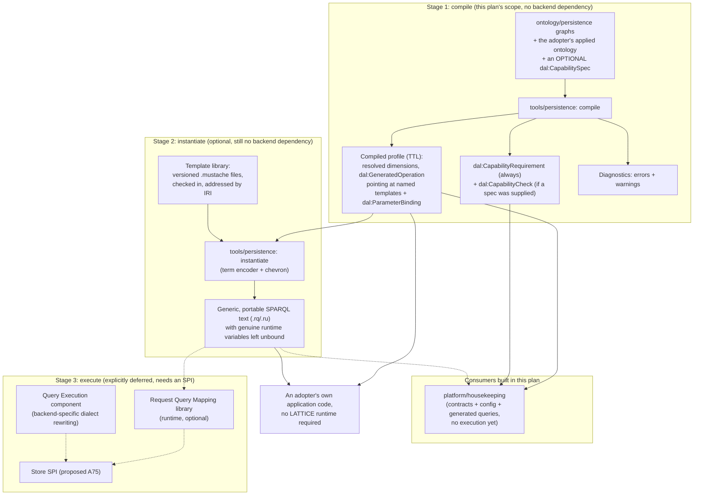

<!-- SPDX-License-Identifier: CC-BY-SA-4.0 -->

# Persistence Profile Substrate — Sketch

**Status:** Design sketch. Extends [rdf-sparql-patterns-guide.md](../../architecture/rdf-sparql-patterns-guide.md) from a catalogue of patterns into a configuration mechanism an adopter can point at their own applied ontology. Governed by proposed [ADR-A78](../../architecture/decisions/ADR-A78-persistence-profile-substrate-and-aggregate-boundaries.md), [ADR-A79](../../architecture/decisions/ADR-A79-persistence-compiler-toolchain.md), and [ADR-A80](../../architecture/decisions/ADR-A80-housekeeping-component-boundary.md).

**Unit note.** This sketch carries a new identifier, `persistence-profile-substrate`, distinct from the plan it feeds. It is the sketch of record for Slice 2 and Slice 3 of the existing `rdf-sparql-patterns-phase` plan ([rdf-sparql-patterns-phase-plan.md](../plans/rdf-sparql-patterns-phase-plan.md)), whose Slice 1 was fulfilled by the guide this sketch extends. The plan's identifier and status record stay as they are. Only its governing sketch changes for the slices this document covers.

**Prerequisite for:** `rdf-sparql-patterns-phase` Slice 2 (ontology substrate and compiler) and Slice 3 (housekeeping first cut).

---

## Part 0 — Problem statement

### 0.1 The guide gives a menu, not a configuration mechanism

The patterns guide answers "what are the options and their consequences" for uniqueness, ordering, concurrency, and their combination. It does not answer "how does one adopter, building one applied ontology on LATTICE, tell the platform which options apply to which part of their model." LATTICE ships ontologies, libraries, deployable services, and control-plane infrastructure the way a framework does, not the way a single application does. An adopter is free to take some of it, all of it, or build around it entirely, and the parts they do take, they configure for their own domain and their own operational constraints. A future multi-tenant platform hosting many such adopters is a possible thing to build on top of LATTICE, but it is not this codebase, and nothing here assumes it.

This means the platform cannot pick one aggregate-boundary strategy, one concurrency profile, or one ordering grain and apply it uniformly. It has to let each adopter declare their own choices, at whatever granularity their model actually needs, and it has to do this without asking every adopter to hand-write the guide's SPARQL themselves.

### 0.2 The questions this sketch must answer

Restated as concrete requirements, because each one drives a specific piece of the design below.

| # | Question | Where answered |
|---|---|---|
| 1 | How does an adopter indicate how their ontology, built on LATTICE's layers, should be handled for persistence concerns | [Part 3](#part-3--the-ontologypersistence-substrate) |
| 2 | How does the platform generate correct SPARQL from that configuration | [Part 5](#part-5--software-architecture), in two separate stages: compile (produces a template pointer and parameters, no SPARQL text, no backend dependency) and the optional instantiate (mixes them into portable SPARQL text) |
| 3 | Should configuration work at class granularity, whole-ontology granularity, or something between | [§3.2](#32-profilescope-five-kinds-ranked-by-reasoning-dependency) |
| 4 | Does every one of the six dimensions (boundary, concurrency, ordering, receipts, meta topology, uniqueness) need its own independently scopable profile class | [§3.2](#32-profilescope-five-kinds-ranked-by-reasoning-dependency), answered yes |
| 5 | What are the consequences of choosing different ordering grains in different parts of one implementation | [§3.8](#38-consequences-of-mixed-choices-across-scopes) |
| 6 | How does the platform warn about the consequences of odd configuration choices | [§3.5](#35-cross-axis-consistency-checks), [§3.6](#36-reasoning-dependency-and-capability-self-checks) |
| 7 | How do configurations at overlapping scopes get applied to one another, and what wins | [§3.4](#34-precedence-and-resolution-algorithm) |
| 8 | What is the precedence when a namespace, a class inside it, and an `equivalentClass` covering part of that class's population all carry different profiles | [§3.4](#34-precedence-and-resolution-algorithm), worked in [§3.4.3](#343-worked-conflict-lending-vs-credit-plus-an-equivalentclass-override) |
| 9 | Why `equivalentClass` and anything reasoning-dependent needs special care, and what the platform does when an adopter's declared capabilities do not include the reasoning a profile expects | [§3.6](#36-reasoning-dependency-and-capability-self-checks) |
| 10 | How does the platform handle a LATTICE-owned class (from Behaviour, Party, or another substrate) that two different applied ontologies use under two different profiles | [§3.7](#37-shared-substrate-classes-used-under-different-profiles) |
| 11 | How can a chosen granularity's requirements be made explicit against a backend, given this package builds no SPI to ask, and can the non-RDF layers (RabbitMQ, Kafka) support it too | [§3.6](#36-reasoning-dependency-and-capability-self-checks) (an unconditional requirement record plus an optional, adopter-declared, unverified self-check), [§5.6](#56-housekeeping-first-cut) |
| 12 | How does an adopter define what an aggregate root is and what its containment rule is, since only the adopter's own domain knowledge can say | [Part 4](#part-4--aggregate-boundary-configurability) |
| 13 | Named-graph partitioning, property-path traversal, and SHACL shape traversal were all considered as boundary strategies. What does the platform actually build | [§4.1](#41-two-authoring-surfaces-two-runtime-mechanisms), which explains why property-path traversal as a *hand-authored* surface was dropped in favour of SHACL |
| 14 | How is the SPARQL compiler kept separate from the SPI implementation, and why | [§5.2](#52-the-compiler-pipeline) |
| 15 | Why generate portable SPARQL at all, rather than only a Java runtime | [§5.2.1](#521-why-generate-sparql-at-all-and-why-as-a-separate-optional-stage) |
| 16 | What does "Request Query Mapping" mean, why is it out of scope here, and where is that recorded | [§5.4](#54-request-query-mapping-deferred) |
| 17 | What does "Query Execution" mean, why is it out of scope here, and where is that recorded | [§5.5](#55-query-execution-deferred) |
| 18 | What does the housekeeping component own, and what is deferred | [§5.6](#56-housekeeping-first-cut) |
| 19 | How is SPARQL injection prevented in a template-based compiler | [§5.3](#53-templating-and-injection-safety-in-the-instantiate-stage), which applies to the optional instantiate stage specifically, since the compile stage never produces SPARQL text at all |

### 0.3 Non-goals

- No store SPI is designed, extended, or implemented here (proposed A75 territory).
- No runtime component executes a query against a live store. Everything this sketch describes runs at compile time, against ontology graphs, on the adopter's own machine or build pipeline.
- No multi-tenant hosting platform is designed. An adopter's own deployment may serve many of their own tenants, and the guide's tenant-scoping patterns already cover that. A platform that hosts many independent adopters is out of scope by design, not by oversight.
- No decision is made here about which reasoner, if any, LATTICE ships or recommends. `EquivalentClassScope` is designed to degrade safely in the absence of one, not to require one.

---

## Part 1 — Design goals and non-goals

| Goal | Statement |
|---|---|
| G1 | Every dimension of the guide's patterns (boundary, concurrency, ordering, receipts, meta topology, uniqueness) is independently configurable, at a granularity the adopter chooses, not one the platform imposes. |
| G2 | A configuration that cannot be satisfied by the target backend, or that is internally inconsistent, should be rejected. That is, however, beyond the scope of this document (since it implies SPI choice and at-runtime behaviour) |
| G3 | An adopter can use the generated SPARQL without adopting any LATTICE runtime component. |
| G4 | A LATTICE-owned substrate class carries no persistence opinion of its own. Authority belongs to whoever deploys it. A Lattice substrate MAY however, make recommendations about suitable configurations, e.g., architectural documentation and/or user guides may suggest what kind of input-handling choices are ideal for state-bearing `behaviour` usage. This is only a recommendation though. |
| G5 | Every generated artefact is inspectable. A resolved profile is itself a graph, with provenance, not a black box the compiler keeps in memory, and that graph, the compiled profile defined in [Part 5](#part-5--software-architecture) and worked in full in [Part 6](#part-6--worked-end-to-end-example), never depends on a live backend to produce. |
| G6 | The same profile-resolution engine and the same compiled output feed every consumer (the compiler's own template stage now, housekeeping now, a future runtime library later), so no consumer re-derives resolution logic. |

**A note on G2.** Rejecting a configuration against what a *live* backend actually supports needs a backend to ask, which needs the SPI this work package does not build, so G2's live-verification claim is correctly marked out of scope. That does not remove capability reasoning from this sketch entirely: [§3.6](#36-reasoning-dependency-and-capability-self-checks) still computes, unconditionally and without any backend, exactly what a configuration requires, and offers an adopter an optional, self-declared, unverified check against their own stated understanding of their environment. Real verification against a real backend remains deferred, alongside the SPI.

## Part 2 — Relationship to Surface

The user's own instinct was that `ontology/surface` is not reusable here, and it holds up: Surface declares how a value reachable by a read path is restated locally for query convenience (promotion, indexing, projection). It never governs how a write lands, what counts as an aggregate, or how concurrent writers are serialised. Its `PromotionContract` / `IndexContract` / `ProjectionContract` triad answers "how do I read this more conveniently," and `ontology/persistence` answers "how do I write this safely and coherently." No class, shape, or compiler code from Surface transfers.

What does transfer, deliberately, is the *shape* of the architecture: a declarative `Contract`-style individual naming a carrier class, feeding a staged compiler (ADR-A19's precedent) that lowers intent into a concrete target syntax. `ontology/persistence` follows the same shape for a different concern, described in [Part 5](#part-5--software-architecture). This is a stylistic and architectural precedent, not a code or ontology dependency, and `ontology/persistence` does not import `ontology/surface`.

---

## Part 3 — The `ontology/persistence` substrate

### 3.1 Namespace and position in the layer model

`ontology/persistence` defines the **Data Access Layer** vocabulary, prefix `dal:`, namespace `https://www.nebularis.org/neuro-semantic/lattice/persistence#`. The directory name reflects the subsystem it belongs to, since the compiler, the housekeeping component, and any future runtime piece are all "persistence" components. The ontology inside it is named for what it actually is, a data access layer configuration vocabulary, matching the `dal:` prefix used throughout this sketch and by the person who commissioned it.

It targets classes, graphs, and shapes **by IRI reference only**. A `dal:targetClass` triple's object is an IRI. Nothing in `ontology/persistence` `owl:imports` Foundation, Vocabulary, Quantification, Party, Eligibility, Instrument, or Behaviour, and nothing in those layers imports it back. It therefore has no place in the seven-layer dependency table in [ontology-architecture.md](../../architecture/ontology-architecture.md), and sits alongside Surface and MORK as a cross-cutting substrate, documented in its own section of that file (a doc delta owed by the implementation slice, not by this sketch).

The one place it optionally aligns with an existing layer is Foundation's temporal and identity vocabulary, per the guide's [§23.3](../../architecture/rdf-sparql-patterns-guide.md#233-aligning-pat-with-foundation): whether a `dal:Revision` individual is asserted as an `fnd:Evidence`, and whether `dal:recordedAt` is `fnd:recordedAt` under a different local name or the same property, is an open item carried into [Part 7](#part-7--open-questions-resolved-vs-deferred), not settled by this sketch, and does not create an import dependency either way (a shared property IRI is still just an IRI reference).

### 3.2 `ProfileScope`: five kinds, ranked by reasoning dependency

A scope answers one question: which resources does this profile apply to. Every scope kind below is a subclass of `dal:ProfileScope` and carries `dal:priority` (an `xsd:integer`, default `0`, higher wins) and an optional `dal:describedBy` (`rdfs:comment`-equivalent, for human review).

| Scope kind | Matches | Needs reasoning | Typical use |
|---|---|---|---|
| `dal:GraphPatternScope` | graphs whose IRI matches a declared prefix (`dal:graphPrefix`) | no | "everything this deployment writes under `urn:g:lending/`" |
| `dal:NamespaceScope` | resources whose own IRI matches a declared prefix (`dal:iriPrefix`) | no | "every class my ontology mints under `https://example.org/lending#`" |
| `dal:ClassScope` | resources with an asserted `rdf:type` of the named class, optionally including asserted subclasses via a depth-bounded `rdfs:subClassOf*` property path when `dal:includeSubclasses true` | no (subclass walk is over asserted triples, not entailment) | "every `ex:Order`, and anything asserted a subclass of it" |
| `dal:ShapeScope` | resources conforming to a named `sh:NodeShape`, evaluated once against the adopter's data model at compile time | no (compile-time only, never a write-time SHACL dependency) | "the subset of a class with a particular shape, used to carve out a finer population than the class alone allows" |
| `dal:EquivalentClassScope` | resources reachable only through `owl:equivalentClass` or other OWL entailment | **yes** | reserved for cases where the domain model genuinely defines membership through equivalence, not asserted typing |

`GraphPatternScope` and `NamespaceScope` never require the target backend to do anything beyond string matching on an IRI it already has. `ClassScope` with `includeSubclasses` requires only a plain property path, expressible in any SPARQL 1.1 engine. `ShapeScope` is resolved once, offline, by the compiler walking the shape graph against a representative data sample or against the ontology's own class/property declarations, never at write time. Only `EquivalentClassScope` needs the target to reason, or needs a precomputed materialised closure standing in for reasoning, which is exactly the case [§3.6](#36-reasoning-dependency-and-capability-self-checks) gates.

```turtle
@prefix dal: <https://www.nebularis.org/neuro-semantic/lattice/persistence#> .
@prefix ex:  <https://example.org/lending#> .
@prefix xsd: <http://www.w3.org/2001/XMLSchema#> .

dal:LendingGraphs a dal:GraphPatternScope ;
    dal:graphPrefix "urn:g:lending/" ;
    dal:priority "10"^^xsd:integer .

dal:LoanApplicationClass a dal:ClassScope ;
    dal:targetClass ex:LoanApplication ;
    dal:includeSubclasses false ;
    dal:priority "20"^^xsd:integer .
```

### 3.3 Six independently scopable dimensions

Each dimension is its own class of individual, and each individual carries exactly one `dal:appliesTo` scope. A `dal:DataAccessProfile` is sugar over all six at one scope, decomposed at compile time into six separate assertions at that same scope and priority, so nothing downstream ever special-cases the composite form.

| Dimension | Class | Values | Guide reference |
|---|---|---|---|
| Aggregate boundary | `dal:AggregateBoundaryProfile` | `dal:NamedGraphBoundary`, `dal:CompositePropertyBoundary`, `dal:NoBoundary` | [Part 4](#part-4--aggregate-boundary-configurability) |
| Concurrency | `dal:ConcurrencyProfile` | `dal:ProvidedConcurrency`, `dal:Optimistic`, `dal:AppendOnly`, `dal:LockingConcurrency` (marker only, see [§3.3.1](#331-the-concurrency-values-and-the-locking-marker)) | Guide [§3.5](../../architecture/rdf-sparql-patterns-guide.md#35-two-profiles-baseline-and-strong), [Chapter 22](../../architecture/rdf-sparql-patterns-guide.md#chapter-22--append-versus-compare-and-set) |
| Ordering grain | `dal:OrderingProfile` | `dal:CommitGrain`, `dal:EventGrain`, plus `dal:datasetTierModel` (`dal:DerivedFeed`, `dal:HybridLogicalClock`, `dal:GlobalDenseCounter`) | Guide [Chapter 21](../../architecture/rdf-sparql-patterns-guide.md#chapter-21--two-tiers-of-order) |
| Receipt model | `dal:ReceiptProfile` | `dal:ReceiptOnly`, `dal:PatchLog`, `dal:SnapshotPerRevision` | Guide [Chapter 20](../../architecture/rdf-sparql-patterns-guide.md#chapter-20--receipts-patches-or-snapshots-f9) |
| Meta topology | `dal:MetaTopologyProfile` | `dal:SharedSharded` (with `dal:metaShards`), `dal:PerAggregate` | Guide [§17.3](../../architecture/rdf-sparql-patterns-guide.md#173-topology-is-configurable) |
| Uniqueness | `dal:UniquenessConstraint` (many per scope, keyed by `dal:constraintId`) | `dal:keyProperty` (one or more), `dal:normalizePipeline`, `dal:onViolation` (`dal:Reject`, `dal:Merge`, `dal:Quarantine`) | Guide [Chapter 8](../../architecture/rdf-sparql-patterns-guide.md#chapter-8--normalization-and-the-uniqueness-portability-table) |

Every dimension also carries `dal:minEnforcementLevel`, one of the guide's own level vocabularies (`Advisory`/`Transactional`/`Strong` for uniqueness, the order-level ladder for ordering, `Linearizable`/`BestEffort` for concurrency), which is the value [§3.6](#36-reasoning-dependency-and-capability-self-checks)'s capability check compares against, when one is available.

#### 3.3.1 The concurrency values, and the locking marker

Three of the four `dal:ConcurrencyStrategy` values name something the compiler actually realises in generated SPARQL, and the fourth is a marker the compiler does not act on at all.

| Value | What it means | Realised by generated SPARQL |
|---|---|---|
| `dal:ProvidedConcurrency` | whatever concurrency behaviour the target backend gives natively. No guard is generated | no, by design, this is an unconditional write |
| `dal:Optimistic` | the guarded compare-and-set pattern, [guide Chapter 19](../../architecture/rdf-sparql-patterns-guide.md#chapter-19--the-corrected-pattern): a version-row guard, a txn claim, a receipt | yes |
| `dal:AppendOnly` | server-assigned next-position append, no expected-version guard, [guide Chapter 22](../../architecture/rdf-sparql-patterns-guide.md#chapter-22--append-versus-compare-and-set) | yes |
| `dal:LockingConcurrency` | **marker only.** Declares that this target needs external serialisation, a single-writer queue or an external lock ([guide §16.1](../../architecture/rdf-sparql-patterns-guide.md#161-single-writer-queue-or-partitioned-writers), [§16.2](../../architecture/rdf-sparql-patterns-guide.md#162-external-lock-with-fencing-tokens)) | **no.** Pure SPARQL cannot serialise writers. There is nothing to generate |

`dal:ProvidedConcurrency` is named for what it is: "whatever the backend already provides," never "the default," so it cannot be misread as a platform recommendation. `dal:Optimistic` is named for the guarantee it actually delivers rather than for the mechanism (`dal:CompareAndSet` named the technique, not the property an adopter cares about).

**Why a locking marker exists, and why it is only a marker.** Pure SPARQL cannot express mutual exclusion between writer processes, so `dal:LockingConcurrency` cannot compile to a guard the way `dal:Optimistic` does. Leaving it out of the vocabulary entirely would split concurrency configuration across two disconnected places: `ontology/persistence` for anything SPARQL can realise, and some other, unrelated piece of deployment configuration for anything it cannot. Declaring it as a fourth value keeps concurrency configuration in **one place**, with a documented boundary around which values that one place can act on itself. The compiler, on seeing `dal:LockingConcurrency`, emits a `dal:ConcurrencyStrategy` fact in the compiled profile ([§5.2](#52-the-compiler-pipeline)) and generates unconditional-write SPARQL for the target (the same as `dal:ProvidedConcurrency`, since the store itself does not need to guard anything when a lock upstream already serialises writers). It never attempts to realise the lock itself, and it never fails because it cannot. A future Infrastructure-as-Code compiler, a queue-routing configuration generator, or the deferred Request Query Mapping library ([§5.4](#54-request-query-mapping-deferred)) is the intended reader of this marker, choosing a partition key, a consistent-hash exchange, or a single-writer deployment topology from the same configuration graph, rather than from a second, hand-maintained source of truth.

```turtle
dal:OrderClassStrongProfile a dal:DataAccessProfile ;
    dal:appliesTo          dal:LoanApplicationClass ;
    dal:aggregateBoundary  dal:NamedGraphBoundary ;
    dal:concurrencyProfile dal:Optimistic ;
    dal:minConcurrencyLevel dal:Linearizable ;
    dal:orderingGrain      dal:EventGrain ;
    dal:receiptModel       dal:PatchLog ;
    dal:metaTopology       dal:SharedSharded ;
    dal:metaShards         "64"^^xsd:long ;
    dal:uniqueness         dal:LoanApplication-number-per-branch .

dal:LoanApplication-number-per-branch a dal:UniquenessConstraint ;
    dal:constraintId    "loan-application-number-per-branch" ;
    dal:appliesTo       dal:LoanApplicationClass ;
    dal:keyProperty     ( ex:applicationNumber ) ;
    dal:scopeProperty   ex:branch ;
    dal:normalizePipeline dal:NfkcTrimUppercase ;
    dal:onViolation     dal:Reject ;
    dal:minEnforcementLevel dal:Transactional .
```

This is the user's own example, expanded to show the decomposition and the nested uniqueness constraint explicitly, and it answers requirement 4 from [§0.2](#02-the-questions-this-sketch-must-answer) directly: yes, each dimension has its own class, every one of them independently scopable, and the composite form is convenience sugar rather than the model of record.

### 3.4 Precedence and resolution algorithm

Resolution runs **per target, per dimension**, never per whole profile. A target is a concrete resource the compiler is generating code for: a class (for boundary, concurrency, ordering, receipts, meta topology) or a `(class, key)` pair (for uniqueness).

```
resolve(target, dimension, capabilitySpec):
  candidates := every profile individual of `dimension`'s class
                whose scope matches `target`
  if capabilitySpec is present:
      candidates := drop any candidate whose scope needs reasoning
                    capabilitySpec does not claim to provide,
                    emitting a ReasoningUnavailable warning naming the
                    dropped scope, per §3.6
  # capabilitySpec is optional (§3.6). Absent, nothing is dropped on
  # capability grounds: every candidate that matches on scope alone
  # participates, and the compiled profile's CapabilityRequirement simply
  # records what this resolution actually depended on, for the adopter
  # to judge against their own environment whenever they choose to.
  if candidates is empty:
      return the platform baseline default for `dimension`  (§3.4.1)
  winner := candidate with the highest `dal:priority`
  if more than one candidate shares the highest priority:
      prefer non-reasoning scopes over reasoning scopes  (fixed rule)
      if still tied:
          raise ProfileAmbiguityError(target, dimension, tied candidates)
  return winner's value
```

This is deliberately similar in shape to the guide's capability-gated strategy planner in [Chapter 25](../../architecture/rdf-sparql-patterns-guide.md#253-declarations-levels-and-the-planner), with one load-bearing difference: the guide's planner runs against a *TCK-verified* capability report from a live backend, which this compiler does not have and does not require, per [§3.6](#36-reasoning-dependency-and-capability-self-checks). `capabilitySpec` here is an *optional, adopter-declared, unverified* input, and its absence is the normal case, not an error case. `ProfileAmbiguityError` is a compile-time refusal regardless, never a coin flip, matching the guide's "never silently downgrade" rule, and it never depends on capability information either.

#### 3.4.1 Platform baseline defaults

Every dimension has a zero-configuration default, so a class with no matching profile at all still compiles to something, and that something is always the guide's baseline (not strong) profile:

| Dimension | Default |
|---|---|
| Aggregate boundary | `dal:NamedGraphBoundary` |
| Concurrency | `dal:ProvidedConcurrency` (backend-native, no CAS machinery generated) |
| Ordering grain | `dal:CommitGrain`, dataset tier `dal:DerivedFeed` |
| Receipt model | `dal:ReceiptOnly` |
| Meta topology | `dal:SharedSharded`, `dal:metaShards "64"^^xsd:long` |
| Uniqueness | none (no constraint generated unless one is declared) |

#### 3.4.2 Why scope kind is not itself a specificity ladder

An earlier draft of this design tried to rank scope *kinds* by assumed narrowness (a class is narrower than a namespace, which is narrower than a graph pattern, and so on) and use that ranking as a tiebreak ahead of `dal:priority`. It does not hold up: a `GraphPatternScope` naming one exact graph IRI is narrower than a `ClassScope` matching millions of individuals, and a `NamespaceScope` covering one small applied ontology can be narrower than a `ClassScope` on a heavily reused Behaviour class. Specificity is a property of what the adopter actually wrote, not of which vocabulary term they used to write it. The algorithm therefore asks the adopter to say what they mean with `dal:priority`, and only uses a fixed, narrow, non-negotiable rule (non-reasoning beats reasoning) to break a genuine tie, rather than guessing intent from scope kind. This is worth stating plainly because it is the one place this sketch overrides the shape the commissioning conversation first proposed.

#### 3.4.3 Worked conflict: lending vs credit, plus an `equivalentClass` override

Three profiles target overlapping populations of `beh:Behaviour` individuals (the shared substrate class from `ontology/behaviour`), reused by two applied ontologies:

```turtle
@prefix beh: <https://www.nebularis.org/neuro-semantic/lattice/behaviour#> .

# 1. lending's own deployment, scoped by WHERE lending writes its behaviour instances
dal:LendingBehaviourGraphs a dal:GraphPatternScope ;
    dal:graphPrefix "urn:g:lending/behaviour/" ;
    dal:priority "10"^^xsd:integer .

dal:LendingBehaviourProfile a dal:DataAccessProfile ;
    dal:appliesTo dal:LendingBehaviourGraphs ;
    dal:concurrencyProfile dal:Optimistic ;
    dal:receiptModel dal:PatchLog .

# 2. credit's own deployment, scoped the same way, disjoint graph prefix
dal:CreditBehaviourGraphs a dal:GraphPatternScope ;
    dal:graphPrefix "urn:g:credit/behaviour/" ;
    dal:priority "10"^^xsd:integer .

dal:CreditBehaviourProfile a dal:DataAccessProfile ;
    dal:appliesTo dal:CreditBehaviourGraphs ;
    dal:concurrencyProfile dal:ProvidedConcurrency ;
    dal:receiptModel dal:ReceiptOnly .

# 3. a bare class-level default, in case anyone deploys beh:Behaviour outside
#    either graph family, deliberately low priority
dal:BehaviourClassFallback a dal:ClassScope ;
    dal:targetClass beh:Behaviour ;
    dal:priority "0"^^xsd:integer .

dal:BehaviourFallbackProfile a dal:DataAccessProfile ;
    dal:appliesTo dal:BehaviourClassFallback ;
    dal:concurrencyProfile dal:ProvidedConcurrency ;
    dal:receiptModel dal:ReceiptOnly .

# 4. a reasoning-dependent override: "high-value" behaviour instances, defined
#    as equivalent to a class expression over a monetary threshold, want a
#    stronger receipt model wherever they occur
dal:HighValueBehaviourEquivalence a dal:EquivalentClassScope ;
    dal:equivalentTo [ a owl:Class ;
                        owl:intersectionOf ( beh:Behaviour ex:HighValueThresholdRestriction ) ] ;
    dal:priority "30"^^xsd:integer .

dal:HighValueBehaviourProfile a dal:DataAccessProfile ;
    dal:appliesTo dal:HighValueBehaviourEquivalence ;
    dal:receiptModel dal:SnapshotPerRevision .
```

For a `beh:Behaviour` individual sitting in `urn:g:lending/behaviour/loans/17`, that is also, per OWL entailment, a member of the high-value equivalence class:

- **Boundary, ordering, meta topology**: no profile above declares them, so all three inherit the platform baseline ([§3.4.1](#341-platform-baseline-defaults)).
- **Concurrency**: only `dal:LendingBehaviourGraphs` (priority 10) and `dal:BehaviourClassFallback` (priority 0) declare it. The graph-pattern scope outranks the class scope on priority, so `Optimistic` wins. This is the graph-pattern-over-class precedence [ADR-A78](../../architecture/decisions/ADR-A78-persistence-profile-substrate-and-aggregate-boundaries.md) names as the mechanism resolving shared-class reuse: lending's own deployment decision wins over the shared class's fallback, without lending needing a higher-priority number than credit anywhere, because their graph prefixes are disjoint and both simply outrank the fallback.
- **Receipts**: three candidates now match — `dal:LendingBehaviourGraphs` (10, `PatchLog`), `dal:BehaviourClassFallback` (0, `ReceiptOnly`), and `dal:HighValueBehaviourEquivalence` (30, `SnapshotPerRevision`, reasoning-dependent). If no `dal:CapabilitySpec` is supplied for this compile, nothing is dropped on capability grounds ([§3.6](#36-reasoning-dependency-and-capability-self-checks)), and priority 30 wins outright: `SnapshotPerRevision`, with the compiled profile's `CapabilityRequirement` recording that this target depends on reasoning being available wherever it is eventually deployed. If a `CapabilitySpec` *is* supplied and it declares `dal:providesReasoning false`, candidate 3 is dropped with a `ReasoningUnavailable` warning naming it, and resolution falls back to the highest remaining priority, `PatchLog` from candidate 1. Either way the outcome is deterministic and explained in the compiled profile report's provenance for this target ([§5.2](#52-the-compiler-pipeline)), never a silent pick between "the strong receipt model I asked for" and "the one the platform happened to produce."

This example also answers requirement 8 from [§0.2](#02-the-questions-this-sketch-must-answer) directly, with the namespace-vs-class-vs-equivalentClass three-way case the commissioning conversation asked for, generalised to graph-pattern-vs-class-vs-equivalentClass since graph pattern is the more useful coarse scope for deployment-owned data (see [§3.7](#37-shared-substrate-classes-used-under-different-profiles)).

### 3.5 Cross-axis consistency checks

Resolved per target, after all six dimensions have their per-axis winners, before any template is selected:

| Check | Rejects when | Remediation named |
|---|---|---|
| Boundary vs concurrency | `dal:NoBoundary` with `dal:Optimistic` and `dal:concurrencyGrain` = aggregate (whole-resource replace) | switch to a value-based `dal:Optimistic` guard on one property (guide [§14.2](../../architecture/rdf-sparql-patterns-guide.md#142-variants)), or declare a real boundary |
| Boundary vs receipts | `dal:CompositePropertyBoundary` with `dal:receiptModel = dal:ReceiptOnly` and `dal:aggregateGrained true` | composite-property aggregates cannot whole-graph replace, so a receipt-only model here cannot even audit what changed within the closure. Require at least `dal:PatchLog` |
| Meta topology vs deployment history | `dal:metaShards` changed for a scope that already has committed data under a prior shard count | this is a migration event. Require an explicit `dal:epochBumpAcknowledged true` alongside the change, per guide [§24.4](../../architecture/rdf-sparql-patterns-guide.md#244-restore-and-migration-runbook) |
| Ordering grain vs opSeq | `dal:CommitGrain` declared alongside a nested `dal:opSeqRequired true` (opSeq is meaningless at commit grain) | drop the flag, or move to `dal:EventGrain` |
| Uniqueness scope vs boundary | a `dal:UniquenessConstraint` whose `dal:keyProperty` path leaves the declared aggregate boundary (for `CompositePropertyBoundary`, a property not reachable within the declared `dal:boundaryShape`'s `sh:property`/`sh:node` tree, bounded by `dal:maxTraversalDepth`) | narrow the key property, or widen the shape |
| Receipt-model heterogeneity in one subscription scope | two targets under the same `dal:GraphPatternScope` a consumer would subscribe to as one unit resolve to different receipt models | not a compile error, a `MixedReceiptModel` warning attached to the compiled profile report, because a downstream consumer must be told, not left to assume uniformity (guide [§29.3](../../architecture/rdf-sparql-patterns-guide.md#293-the-per-family-declaration)) |

Every row above is a named exception type in the compiler's diagnostics output ([§5.2](#52-the-compiler-pipeline)), not free text, so a CI gate can assert on the type, not grep a message string.

### 3.6 Reasoning-dependency and capability self-checks

**This section was originally written as though the compiler consulted a live backend's capability report. It does not, and it must not: this work package builds no SPI, so it has no backend to ask, and it cannot invent one just to answer this question.** What follows replaces that assumption with a design that needs no backend at all, while still giving an adopter a way to catch a mismatch before it reaches production.

Three artefacts, not one, and only the first is ever mandatory:

| Artefact | Class | Who supplies it | When it exists |
|---|---|---|---|
| Capability requirement | `dal:CapabilityRequirement` | the compiler, computed from the resolved profile | always, one per target, unconditionally |
| Capability spec | `dal:CapabilitySpec` | the adopter, by hand or by copying a vendor document, **never derived from a live SPI or a TCK run** | optional |
| Capability check | `dal:CapabilityCheck` | the compiler, comparing the two above | only when a spec was supplied |

**The requirement is unconditional and needs nothing about a backend.** `EquivalentClassScope`, and `ClassScope` with `dal:includeSubclasses true` where the adopter wants entailed (not merely asserted) subclass membership, both carry `dal:requiresReasoning true` intrinsically, and the same is true of every other dimension's minimum enforcement level. The compiler always records, per target, exactly what the resolved configuration needs: `dal:requiresCas "LINEARIZABLE"`, `dal:requiresReasoningFor <the scopes that needed it>`, and so on. This is pure computation over the resolved profile. No backend, live or hypothetical, is consulted to produce it.

**The spec is optional, adopter-authored, and never verified by this compiler.** An adopter who wants to sanity-check a configuration against their own understanding of their environment writes a `dal:CapabilitySpec`, in the same shape as the requirement it will be checked against:

```turtle
ex:MyFusekiEnvironment a dal:CapabilitySpec ;
    dal:providesCas               "LINEARIZABLE" ;
    dal:providesReasoning         false ;
    dal:providesCommitValidation  "NONE" ;
    dal:providesSingleWriter      true .
```

Nothing forces an adopter to write one, and compilation without one is the normal case, not a degraded one: with no spec, **the compiler behaves as if the maximum any backend could provide is available**, so no candidate scope is ever dropped and no strategy is ever downgraded for lack of a spec. The only artefact produced is the unconditional requirement, and it is left to the adopter to compare it, by eye or by their own tooling, against whatever they know about their real target.

**The check exists only when a spec is supplied**, and is a self-consistency comparison, never a live verification:

- **Pass**, per dimension, when the requirement is within what the spec claims to provide. The scope participates in resolution normally.
- **Fail**, when it is not. The offending scope is dropped, a `ReasoningUnavailable` (or the equivalent named failure for a non-reasoning dimension) warning is attached naming the scope, the target, and the specific claim in the spec it exceeded, and resolution proceeds among the remaining candidates as in [§3.4.3](#343-worked-conflict-lending-vs-credit-plus-an-equivalentclass-override).
- **If the dropped scope was the *only* candidate for a dimension**, the platform baseline applies, and the warning is upgraded to note that the adopter's intent for that target was not realised at all against the environment they described, not merely downgraded to a weaker sibling.

This is deliberately a self-check the adopter opts into, not an external verification. An adopter who supplies an inaccurate `dal:CapabilitySpec`, whether too generous or too conservative, gets an inaccurate check. That is an acceptable cost, because the alternative, requiring a live, TCK-verified `StoreCapabilities` report ([guide §25.2](../../architecture/rdf-sparql-patterns-guide.md#252-the-unified-capability-record)) before this compiler can produce anything, would make the compiler depend on an SPI this work package does not build, forcing every adopter to expose a running database to a design-time tool before they could use it at all. **The relationship between the two is one of lineage, not identity**: `dal:CapabilitySpec` shares field shape with the guide's `StoreCapabilities` record by design, so that when a real SPI and its TCK exist, a future stage can populate a `dal:CapabilitySpec` from a genuine TCK run and re-check a compiled profile against it, without inventing a second vocabulary. That later verification is out of scope here, alongside the SPI itself.

**Why this is not a courtesy, even in its unverified form.** A profile that silently loses its `EquivalentClassScope` override in one environment and keeps it in another produces two deployments of the same ontology with two different persistence behaviours for the same declared configuration. Making the requirement explicit, and the check explicit and optional rather than assumed, is what keeps that divergence visible to whoever is deciding it, instead of buried in whichever backend happened to be plugged in on a given day.

### 3.7 Shared substrate classes used under different profiles

The convention from [ADR-A78](../../architecture/decisions/ADR-A78-persistence-profile-substrate-and-aggregate-boundaries.md): a LATTICE substrate ontology (Behaviour, Party, Eligibility, Instrument) never ships a `dal:DataAccessProfile` bound to its own classes. `ontology/behaviour` declares `beh:Behaviour`. It does not declare how `beh:Behaviour` individuals get written, versioned, or ordered, because that is a fact about a *deployment* of the class, not about the class itself. Authority belongs to whichever applied ontology deploys individuals of that class, expressed through a `GraphPatternScope` or `NamespaceScope` naming that deployment, which structurally outranks a bare `ClassScope` at equal or lower priority ([§3.4.3](#343-worked-conflict-lending-vs-credit-plus-an-equivalentclass-override)).

This resolves the "lending and credit both use `beh:Behaviour` differently" case without either applied ontology needing to know about the other, without subclassing `beh:Behaviour` into `lending:Behaviour` and `credit:Behaviour` (which would fragment the shared class for no domain reason), and without a central registry mediating between them. Each applied ontology writes its own individuals into its own graph family, per the guide's aggregate-per-graph convention, and scopes its own profile to that graph family. The bare `ClassScope` fallback exists only to give *unclaimed* deployments of the shared class a sane baseline, never to arbitrate between two claimed ones.

**A linting rule enforces the convention structurally.** A `dal:DataAccessProfile` whose only scope is a `dal:ClassScope` targeting a class not declared in the same ontology module as the profile individual itself is flagged, at compile time, as `SharedClassProfileWarning`, nudging the author toward a `GraphPatternScope` or `NamespaceScope` instead. This is enforced by the compiler's diagnostics stage ([§5.2](#52-the-compiler-pipeline)), not by a human reviewing every substrate ontology by hand.

**On the "guarantee the backend, and the non-RDF layers, can support it" requirement:** this compiler cannot *guarantee* a live backend supports anything, because it has no live backend to ask, and building one is explicitly out of scope ([§3.6](#36-reasoning-dependency-and-capability-self-checks)). What it does instead is make the requirement **exhaustive and explicit** for every dimension this ontology declares (`dal:CapabilityRequirement`, unconditional), and make a **self-check against the adopter's own stated understanding** available whenever they want it (`dal:CapabilitySpec` and `dal:CapabilityCheck`, optional). Real verification against a real backend is deferred to whenever an SPI and its TCK exist, per [§3.6](#36-reasoning-dependency-and-capability-self-checks)'s lineage note. The non-RDF half of the same question — a RabbitMQ or Kafka consumer needing to know a stream's receipt model and ordering grain to interpret a change feed correctly — is not solved by generating better SPARQL either. It is solved by making the **compiled profile itself** ([§5.2](#52-the-compiler-pipeline)) the single artefact every consumer reads, RDF-facing or not. The housekeeping component ([§5.6](#56-housekeeping-first-cut)) is the first concrete non-SPARQL consumer built against it in this plan. A future message-broker-facing consumer reads the same compiled profile rather than re-deriving receipt-model or ordering-grain facts from the ontology graph itself.

### 3.8 Consequences of mixed choices across scopes

Two questions hide inside "what does it mean to choose different grains for different parts of my implementation": whether it is safe, and whether it is detected when it is not.

**Between different targets, it is safe by design.** Ordering grain, receipt model, and meta topology are all properties of a *stream* (guide [§10.3](../../architecture/rdf-sparql-patterns-guide.md#103-stream-keys)), and the guide's two-tier order model ([Chapter 21](../../architecture/rdf-sparql-patterns-guide.md#chapter-21--two-tiers-of-order)) exists precisely so that a dataset-wide consumer does not need every stream to share one grain, one receipt model, or one shard count. A `LoanApplication` stream at event grain with patch-log receipts and a `CreditScore` stream at commit grain with receipt-only records coexist without conflict, because the dataset tier orders them by HLC or a derived feed, never by assuming per-stream uniformity, and a consumer proves completeness per stream via that stream's own gap scan, never a cross-stream one.

**Within one target, it is a compile-time ambiguity, not a runtime surprise.** The only way "different grains for the same thing" becomes a live problem is two scopes matching the *same* target with *different* values for the *same* dimension, which is exactly what [§3.4](#34-precedence-and-resolution-algorithm)'s per-dimension resolution and [§3.4.3](#343-worked-conflict-lending-vs-credit-plus-an-equivalentclass-override)'s worked example are built to resolve deterministically, or refuse outright as a `ProfileAmbiguityError` when priority does not disambiguate.

**Across an aggregate boundary, grain does not compose the way an adopter might expect.** A `CompositePropertyBoundary` aggregate ([§4.3](#43-compositepropertyboundary-the-logical-mechanism)) whose root is one stream and whose reachable members are declared under a *different* stream's ordering profile is a modelling error the compiler catches structurally, not a grain question: the composite closure's membership must resolve to exactly one stream identity for versioning purposes, or the aggregate has no coherent head pointer. This is checked as part of the boundary-strategy validation in [§4.6](#46-boundary-strategy-conflicts), not as an ordering check, because the underlying defect is about aggregate identity, and ordering grain is only where it would otherwise surface as a confusing symptom.

### 3.9 SHACL shapes for `ontology/persistence` itself

The profile ontology validates its own instance data the same way the guide's Appendix B validates the guard/receipt vocabulary it introduces: `sh:maxCount 1` on every functional profile property, `sh:class` on every object property pointing at a `dal:ProfileScope` subtype, and a standing `sh:sparql` check that no `dal:ClassScope`-only profile targets a class outside its own declaring ontology module without an explicit `dal:acknowledgedSharedClassOverride true` escape hatch (for the rare, deliberate case where an adopter really does want to override a shared class globally rather than per deployment). The full shape set is an implementation deliverable of the accompanying plan's ontology-substrate slice, not reproduced in full here, and follows the pattern already shown in the guide's [Appendix B](../../architecture/rdf-sparql-patterns-guide.md#appendix-b--shacl-shapes).

---

## Part 4 — Aggregate boundary configurability

Only the adopter knows whether a population of triples is an aggregate, and if so, what belongs inside it. The guide's Part V assumes the answer is always "a named graph," because that is the cheapest, most portable mechanism, and it is right to assume that as a default. It cannot be the *only* mechanism a framework offers, because plenty of real applied ontologies already have a large, shared graph and cannot, or do not want to, repartition it into one graph per aggregate. The guide will need to be updated once this sketch is implemented.

### 4.1 Two authoring surfaces, two runtime mechanisms

Three ways of declaring a boundary were originally on the table. Only two survive, for a reason worth stating plainly because it reverses an earlier decision in this sketch.

| Authoring surface | What it declares | Cost |
|---|---|---|
| Named graph partitioning | the aggregate root's IRI names a dedicated graph, members co-located inside it | graph proliferation at scale, otherwise the cheapest and most portable |
| SHACL shape traversal | a `sh:NodeShape` tree recursively declares the aggregate's structural blueprint | doubles as a validation schema. The only cost worth naming is the depth/cycle discipline in [§4.3](#43-compositepropertyboundary-the-logical-mechanism) |

**Hand-declared composition properties, an earlier third surface, were dropped.** The original design asked an applied ontology to assert `ex:lineItem rdfs:subPropertyOf dal:isCompositeOf`, marking a domain property as part of an aggregate's containment closure by making it a sub-property of a `dal:` vocabulary term. This is unsafe for reasons specific to OWL, not merely a style preference: `rdfs:subPropertyOf` carries real entailment consequences (anything inferable through `dal:isCompositeOf`'s own characteristics, present or added later, is inferable through every one of its sub-properties too), it makes an applied ontology's own property axioms depend on a `dal:` term existing and having stable semantics, and it reintroduces exactly the "does this create an import dependency on `ontology/persistence`" problem [§3.1](#31-namespace-and-position-in-the-layer-model) works to avoid for every other part of this design. Two domain properties from two unrelated applied ontologies both declared sub-properties of the same `dal:` term can also produce reasoning artefacts neither author intended, depending on the reasoner and on what else gets asserted about `dal:isCompositeOf` in the future. None of this is needed: a SHACL shape says exactly the same thing (`sh:property [ sh:path ex:lineItem ; sh:node ex:LineItemShape ]`) by pointing at the domain property **by IRI reference**, the same non-invasive mechanism [§3.1](#31-namespace-and-position-in-the-layer-model) already uses for every other kind of scope, and touches nothing in the domain ontology's own axioms. Building a bespoke, smaller property-path vocabulary instead of using SHACL would only end up reinventing a subset of SHACL with none of its tooling or review history. `ontology/persistence` therefore declares no composition-property vocabulary of its own, and `dal:CompositePropertyBoundary` has exactly one authoring surface: a `dal:boundaryShape`.

No target backend is ever asked to execute that shape to determine where a write's boundary lies. **A SHACL shape used as a boundary declaration is walked once, at compile time**, by `tools/persistence` itself, and lowered into an internal closure model the compiler uses to generate SPARQL. This is the same "walk it once, offline" treatment [§3.2](#32-profilescope-five-kinds-ranked-by-reasoning-dependency) already gives `ShapeScope`, applied here to boundaries instead of scopes. The platform therefore has two mechanisms to build: named-graph partitioning and shape-derived closure. `dal:NoBoundary` is a third, degenerate mechanism for triple-level, value-based CAS, with no closure to compute at all.

```turtle
dal:AggregateBoundaryStrategy a owl:Class .
dal:NamedGraphBoundary        a dal:AggregateBoundaryStrategy .
dal:CompositePropertyBoundary a dal:AggregateBoundaryStrategy .
dal:NoBoundary                a dal:AggregateBoundaryStrategy .
```

With that being said, there is nothing to stop an SPI that wishes to, from executing said SHACL as part of its query layer.

### 4.2 `NamedGraphBoundary`

This is the mechanism the guide's Part V already fully specifies. `ontology/persistence` adds only the declaration:

```turtle
ex:OrderClass a dal:ClassScope ; dal:targetClass ex:Order .

ex:OrderBoundaryProfile a dal:AggregateBoundaryProfile ;
    dal:appliesTo ex:OrderClass ;
    dal:strategy  dal:NamedGraphBoundary ;
    dal:graphIriTemplate "urn:g:orders/{id}" .
```

`dal:graphIriTemplate` is the one piece of genuinely new information: how to derive the aggregate's graph IRI from its root instance's identity. It compiles, via [§5.3](#53-templating-and-injection-safety-in-the-instantiate-stage)'s template engine, into the exact `GRAPH <urn:g:orders/{id}>` shape the guide's [Chapter 19](../../architecture/rdf-sparql-patterns-guide.md#chapter-19--the-corrected-pattern) worked example already shows, with `{id}` bound per request, never per compile.

### 4.3 `CompositePropertyBoundary`: the logical mechanism

Declared by a SHACL shape, the only authoring surface for this strategy, per [§4.1](#41-two-authoring-surfaces-two-runtime-mechanisms):

```turtle
ex:OrderAggregateShape a sh:NodeShape ;
    sh:targetClass ex:Order ;
    sh:property [ sh:path ex:lineItem ; sh:node ex:LineItemShape ; sh:minCount 1 ] .

ex:OrderBoundaryProfile a dal:AggregateBoundaryProfile ;
    dal:appliesTo ex:OrderClass ;
    dal:strategy  dal:CompositePropertyBoundary ;
    dal:boundaryShape ex:OrderAggregateShape ;   # mandatory for this strategy
    dal:maxTraversalDepth "8"^^xsd:integer .
```

The compiler walks `ex:OrderAggregateShape`'s `sh:property`/`sh:node` tree once, at compile time, into an internal closure definition: a set of properties considered "composite" (here, `ex:lineItem`) and a maximum depth. A **compile-time cycle check** over that shape graph rejects a configuration whose `sh:node` recursion can reach back to an ancestor shape. This check is structural, over the shape's own asserted triples, and needs no reasoner, matching [§3.2](#32-profilescope-five-kinds-ranked-by-reasoning-dependency)'s "no reasoning" classification for `ShapeScope`. A `dal:AggregateBoundaryProfile` with `dal:strategy dal:CompositePropertyBoundary` and no `dal:boundaryShape` is a compile error, since there is nothing to walk.

**What actually changes in the generated SPARQL.** The guide's whole-graph replace primitive ([Chapter 19](../../architecture/rdf-sparql-patterns-guide.md#chapter-19--the-corrected-pattern)) deletes and re-inserts everything in one named graph. There is no single graph here, so the compiler generates a bounded `CONSTRUCT` to snapshot the closure in place of the `OPTIONAL { GRAPH ?g { ?s ?p ?o } }` sweep, and a `DELETE` template built from that same property-path pattern rather than a `GRAPH` reference:

```sparql
# CompositePropertyBoundary variant of the guide's corrected CAS pattern (Chapter 19),
# generated for ex:Order with maxTraversalDepth 8, composite properties {ex:lineItem}

PREFIX ex:  <https://example.org/lending#>
PREFIX pat: <https://example.org/lattice/patterns#>
PREFIX dal: <https://www.nebularis.org/neuro-semantic/lattice/persistence#>

DELETE {
  ?root ?p1 ?o1 .
  ?o1   ex:lineItem* ?member .
  ?member ?p2 ?o2 .
  GRAPH <urn:g:meta/17> { ?root pat:seq "41"^^xsd:long ; pat:head ?prevRev }
}
INSERT {
  # ... new closure quads, supplied by the caller as a bounded set, never open-ended ...
  GRAPH <urn:g:meta/17> { ?root pat:epoch "3"^^xsd:long ; pat:seq "42"^^xsd:long ;
                                pat:head <urn:rev:order/root-id/0000000000000042> }
}
WHERE {
  GRAPH <urn:g:meta/17> { ?root pat:epoch "3"^^xsd:long ; pat:seq "41"^^xsd:long ; pat:head ?prevRev }
  BIND(<urn:order:1> AS ?root)
  OPTIONAL { ?root ?p1 ?o1 . FILTER(?p1 = ex:lineItem) }
  OPTIONAL { ?o1 (ex:lineItem)* ?member { 0, 8 } ?member ?p2 ?o2 }   # depth-bounded property path sweep
}
```

Two consequences worth naming explicitly, because they are exactly the kind of thing an adopter choosing this strategy needs to plan for and the guide never had to address:

1. **The version row's subject is the root instance IRI (`<urn:order:1>`), not a graph IRI.** There is no graph to key the meta shard on. `pat:target` in the receipt therefore points at an instance, not a graph, and any downstream code that assumed `pat:target` is always dereferenceable as a graph (the guide's [Chapter 19](../../architecture/rdf-sparql-patterns-guide.md#chapter-19--the-corrected-pattern) examples do this) must branch on the target's declared boundary strategy first. The compiled profile report ([§5.2](#52-the-compiler-pipeline)) states which form applies per target, so this is never guessed downstream.
2. **The closure sweep is bounded and paid for on every write**, unlike a named graph's `GRAPH ?g { ?s ?p ?o }`, whose cost is proportional to the aggregate's own size regardless of traversal depth. A `CompositePropertyBoundary` write's cost is proportional to `maxTraversalDepth` times the branching factor of composite properties, and a deep or highly branching composite structure is exactly the signal the housekeeping component's graph-proliferation-adjacent metric ([§5.6](#56-housekeeping-first-cut)) should also track for this strategy, even though there is no proliferating graph count to watch here.

### 4.4 The shape is read, never executed, and may double as validation

Two points worth separating, because they answer two different original concerns.

**No target backend is ever asked to run SHACL to determine a boundary.** `tools/persistence` reads `ex:OrderAggregateShape` once, offline, with its own SHACL-aware graph walk, the same way it resolves `ShapeScope` in [§3.2](#32-profilescope-five-kinds-ranked-by-reasoning-dependency). The result is baked into the generated closure logic shown in [§4.3](#43-compositepropertyboundary-the-logical-mechanism). A backend with no SHACL support at all, not even the commit-time validation `dal:CapabilitySpec` can describe ([§3.6](#36-reasoning-dependency-and-capability-self-checks)), still receives ordinary, portable SPARQL, because by the time anything reaches SPARQL, the shape has already been consumed. This resolves the original concern that motivated the question: adopting a shape-based boundary never obliges the platform to build SHACL execution into every SPI.

**The same shape can serve two purposes without conflict.** An adopter who already maintains `ex:OrderAggregateShape` for ordinary SHACL data validation loses nothing by also pointing `dal:boundaryShape` at it: the compiler only interprets its `sh:property`/`sh:node` recursion for boundary purposes, and any other SHACL construct in the same shape (`sh:pattern`, `sh:datatype`, `sh:or`, and so on) is left untouched, available to whatever the adopter's own SHACL validation tooling does with it. Nothing here implements or claims to implement SHACL Core in general, and no boundary-walking code is asked to interpret a construct it does not need for closure computation.

### 4.5 `NoBoundary`

For populations with no coherent aggregate at all: no version row, no receipt chain, no CAS on a whole-resource replace. Concurrency, if any, is value-based CAS on individual properties ([guide §14.2](../../architecture/rdf-sparql-patterns-guide.md#142-variants)), declared per property rather than per aggregate, and ordering, if any, is dataset-tier only (HLC or a derived feed), since there is no stream identity to hang a per-stream dense sequence from. This is the correct choice for populations that are genuinely just facts, not entities with a lifecycle, and the compiler refuses (per [§3.5](#35-cross-axis-consistency-checks)'s first row) to let `NoBoundary` combine with an aggregate-grained `CompareAndSet`.

### 4.6 Boundary-strategy conflicts

Two checks, both structural, both run before any SPARQL is generated:

- **A resource cannot belong to two aggregates with different boundary strategies.** If `ex:LineItem` is reachable both as a `NamedGraphBoundary` member (co-located in `urn:g:orders/1`) and, via a *different* shape's `sh:property`/`sh:node` recursion declared elsewhere, as a `CompositePropertyBoundary` member of some other root, the compiler raises `BoundaryConflict`, naming both roots and the shared member, and refuses to generate anything for either until the adopter narrows one declaration or the other. This is checked by computing, for every class with a declared boundary, its full reachable-member set (named-graph membership is exact and free to compute, shape-derived membership is exact within `dal:maxTraversalDepth`), and asserting the resulting sets are pairwise disjoint across scopes.
- **A `CompositePropertyBoundary` root cannot resolve to more than one ordering stream.** Raised as an `AggregateIdentityConflict`, per [§3.8](#38-consequences-of-mixed-choices-across-scopes)'s closing paragraph, when the closure's members carry conflicting stream-identity implications rather than a single coherent one.

---

## Part 5 — Software architecture



### 5.1 Why this shape

Everything in Stage 1 and Stage 2 is a file on disk, produced by a process with no network connection and no knowledge of any live backend, consumed by anything that can read Turtle and plain text. Nothing there requires a JVM or a running SPI. This is the concrete mechanism behind [ADR-A79](../../architecture/decisions/ADR-A79-persistence-compiler-toolchain.md)'s decision that an adopter can use the ontologies and the generated SPARQL while adopting none of LATTICE's runtime, and it is also the direct fix for an earlier draft of this design that let backend knowledge leak into Stage 1, addressed in [§5.2](#52-the-compiler-pipeline) below.

**The compiled profile, not a SPARQL file, is the canonical artefact.** A `dal:CompiledProfile` graph names, for each target, which named template applies to each generated operation and what parameters instantiate it, using the reified `dal:ParameterBinding` shape (modelled on `mrk:ParameterBinding` in `ontology/mork`, see [Appendix A](#appendix-a--ontologypersistence-vocabulary-indicative)). It does **not** embed literal SPARQL text as a datatype property value anywhere, which was considered and rejected: a query body sitting as a string on an RDF node is opaque to everything that isn't a text-diff tool, and it is exactly the pattern `mrk:queryText` uses in `ontology/mork`, deliberately not repeated here. Literal SPARQL text, when anyone wants it, is a *derived*, optional, Stage 2 artefact, never the thing Stage 1 produces or the thing a consumer is expected to parse to learn what a target's persistence behaviour is.

### 5.2 The compiler pipeline

`tools/persistence`, a Python package (`persistence`), following the `tools/surface` and `tools/mork` convention: `mise bootstrap:persistence` installs it editable, `mise check:persistence` runs its own test suite. Two CLI subcommands, corresponding to the two stages in the diagram above, deliberately kept separate so that a consumer who only wants the canonical TTL never has to run the encoder, and so that "does this configuration resolve and validate" is answerable without a template library on disk at all:

```
python -m persistence compile <config-dir> [--capability-spec <spec.ttl>] --out <compiled-profile.ttl>
python -m persistence instantiate <compiled-profile.ttl> --template-dir <dir> --out <dir>
```

**Stage 1, `compile`:**

| Stage | Input | Output | Failure mode |
|---|---|---|---|
| Load | `ontology/persistence` graphs and the adopter's applied ontology. An **optional** `dal:CapabilitySpec` | an in-memory RDF graph, plus a capability spec if one was given | malformed Turtle, unknown target name |
| Resolve | the loaded graph | one resolved profile per target, six dimensions each, with provenance | `ProfileAmbiguityError` ([§3.4](#34-precedence-and-resolution-algorithm)) |
| Validate | resolved profiles | a diagnostics list | any check in [§3.5](#35-cross-axis-consistency-checks) or [§4.6](#46-boundary-strategy-conflicts) failing, or (only if a spec was supplied) a `dal:CapabilityCheck` failing per [§3.6](#36-reasoning-dependency-and-capability-self-checks) |
| Select | validated profiles | one `dal:Template` identifier per generated operation, per target (create, CAS-replace, tombstone, key-claim write and retire, append, gap-scan audit, fork-detection audit), looked up from a fixed table keyed by resolved dimension values, never a live template file read | none — a lookup table cannot fail once validation has passed |
| Emit | selected templates + term-encoded configuration constants, as `dal:ParameterBinding` individuals, never as raw strings | a `dal:CompiledProfile` graph (TTL): `dal:GeneratedOperation`s pointing at template identifiers and parameter bindings, plus `dal:CapabilityRequirement` (always) and `dal:CapabilityCheck` (if a spec was supplied), plus the diagnostics | an encoder rejection on a configuration constant ([§5.3](#53-templating-and-injection-safety-in-the-instantiate-stage)) |

`compile` never reads the `.mustache` template library at all, only a table of template identifiers. It has no backend, no template body, and nothing but ontology graphs as input, which is what makes it possible to state, without qualification, that it needs no SPI.

**Stage 2, `instantiate`**, entirely optional, described in full in [§5.3](#53-templating-and-injection-safety-in-the-instantiate-stage): reads a `dal:CompiledProfile` and the checked-in template library, and mixes each `dal:GeneratedOperation`'s parameters into its named template to produce plain, portable, backend-agnostic SPARQL text. It still needs no backend and no SPI, and it is the stage that keeps [ADR-A79](../../architecture/decisions/ADR-A79-persistence-compiler-toolchain.md)'s original promise, that an adopter can walk away with literal SPARQL files, without requiring Stage 1 to have known anything about a backend to get there.

Only `ontology/persistence` graphs and the adopter's ontology are untrusted input in the security sense, in both stages (they may contain adversarial IRIs or literals, whether by accident or by a compromised upstream dependency). A supplied `dal:CapabilitySpec`, being adopter-authored and self-declared rather than externally verified, is trusted at the same level.

#### 5.2.1 Why generate SPARQL at all, and why as a separate, optional stage

A Java-only runtime would need every adopter to run a JVM process, adopt LATTICE's dependency-injection shape, and trust LATTICE's own SPARQL construction code at the moment of every write, for every backend LATTICE chooses to support. Generating SPARQL as reviewable, versioned text, and handing it to the adopter, means the adopter's trust boundary is "read this file," not "trust this running process." Keeping that generation in a separate stage from resolution keeps the canonical artefact (the compiled profile) free of any assumption that a template library, an encoder, or a rendering step will ever run at all, which matters for a consumer, such as housekeeping's job contracts in [§5.6](#56-housekeeping-first-cut), that only needs to read *what was decided*, not *what SPARQL that decision would produce*. It is also the design most compatible with the stated future direction of generating non-RDF projections (SQL, a labelled-property-graph form) from the same ontology-declared configuration: a new target syntax is a new Stage 2 renderer reading the same Stage 1 output, not a change to resolution.

### 5.3 Templating and injection safety, in the `instantiate` stage

The template engine is **Mustache**, via the pure-Python `chevron` implementation (no dependencies, no arbitrary expression evaluation, matching the "logic-less templates" requirement precisely). Templates live under `tools/persistence/templates/*.mustache`, one per generated operation shape, Lattice-authored and code-reviewed like any other source file, each with a stable `dal:templateId` and `dal:templateVersion` a `dal:CompiledProfile` can reference ([Appendix A](#appendix-a--ontologypersistence-vocabulary-indicative)). This machinery belongs entirely to `instantiate`. The `compile` stage in [§5.2](#52-the-compiler-pipeline) never touches `chevron`, never reads a template body, and cannot suffer an injection failure, because it never produces text to inject into.

**The security boundary is exact.** Mustache's own escaping (`{{var}}` HTML-escapes, `{{{var}}}` does not) is irrelevant to SPARQL and is never relied on. Instead:

```python
class SparqlTerm(str):
    """A string that has already been validated and escaped as a specific
    RDF term. The template renderer accepts only this type or its
    subclasses. A bare `str` reaching the renderer is a programming error,
    not a data problem, and is caught by a type check, not a runtime probe."""

class Iri(SparqlTerm):
    @classmethod
    def encode(cls, value: str) -> "Iri":
        # validate against RFC 3987 iunreserved/ipchar grammar, reject
        # control characters, angle brackets, and unbalanced delimiters
        # outright rather than percent-escaping them away silently
        ...

class Literal(SparqlTerm):
    @classmethod
    def encode(cls, value: str, datatype: str | None = None, lang: str | None = None) -> "Literal":
        # escape \, ", \n, \r, \t per the SPARQL grammar's ECHAR production,
        # wrap in a matching quote style, append ^^<datatype> or @lang
        ...

class Var(SparqlTerm):
    @classmethod
    def encode(cls, name: str) -> "Var":
        # restrict to the SPARQL VARNAME grammar exactly, no exceptions
        ...

def render(template_name: str, context: dict[str, SparqlTerm | list[SparqlTerm] | int]) -> str:
    for key, value in context.items():
        if isinstance(value, str) and not isinstance(value, SparqlTerm):
            raise TypeError(f"{key!r} reached the renderer as a bare str, not an encoded SparqlTerm")
    return chevron.render(load_template(template_name), context)
```

Every configuration value the compiler places into a template context is produced by `Iri.encode`, `Literal.encode`, or `Var.encode` before it is placed there, never by string-formatting a raw value from the loaded ontology graph. A shard count, a zero-pad width, and every other integer constant is rendered through Python's own `int` formatting, never through string interpolation of an untrusted value either.

**The injection corpus is a release gate**, exercised in `tools/persistence`'s own test suite, not left to CI discovery later: adversarial IRIs and literals (unbalanced `{`/`}`, embedded `DELETE`/`DROP`/`;` sequences, quote and backslash sequences, bidirectional-override and zero-width Unicode) are fed through every encoder, and every resulting rendered template is parsed with `rdflib`'s SPARQL parser (`rdflib.plugins.sparql.parser`) to assert it contains exactly the one intended operation, never an extra statement appended by a successful injection. A corpus entry that produces a *parse failure* is a passing result, the encoder correctly refused or safely escaped a hostile value into something inert. A corpus entry that produces a *second, unintended, syntactically valid operation* is a failing result and blocks release. This mirrors the guide's [QP1](../../architecture/rdf-sparql-patterns-guide.md#chapter-28--five-rules-and-how-they-are-enforced) enforcement, moved from "every hand-written query" to "every template this compiler ships."

### 5.4 Request Query Mapping: deferred

The commissioning conversation described an optional runtime component that would wire an incoming request to a compiled template and an SPI, without assuming any transport (no HTTP listener, no RabbitMQ endpoint baked in), so that an adopter can front it with their own HTTP API, or a RabbitMQ request/response pair, or an AMQP 1.0-over-WebSocket or MQTT-over-WebSocket bridge to a browser client, as they see fit.

This is not built in this plan, and not designed in detail here, for one reason: it needs an SPI to inject, and the SPI's shape (proposed A75) is not decided. A contract sketched against a nonexistent SPI would need redoing once the SPI exists, which is worse than not sketching it. It is recorded as an explicitly unresolved open design question in [lattice-platform-agentic-development-v0.2.md](../../developer/plans/lattice-platform-agentic-development-v0.2.md), Part 13, and the one design constraint worth fixing now, because it shapes the compiler's manifest format, is that the manifest ([§5.2](#52-the-compiler-pipeline)) names every runtime parameter a future Request Query Mapping implementation (or an adopter's own code) would need to bind, so that work is not blocked on re-deriving what the compiler already knows.

### 5.5 Query Execution: deferred

Also described in the commissioning conversation: a component sitting closer to a specific SPI, because some backends need a compiled template's syntax adjusted for that backend's own SPARQL dialect or feature gaps (the guide's [Chapter 26](../../architecture/rdf-sparql-patterns-guide.md#chapter-26--store-by-store) catalogues exactly this kind of per-backend variance). This introduces a real tension: the compiler already froze the query's structure at design time, and a component that rewrites it at request time reopens exactly the injection-safety question [§5.3](#53-templating-and-injection-safety-in-the-instantiate-stage) closes for the compiler, unless that rewriting is itself template-based and reviewed with the same discipline.

Not designed here, for the same reason as [§5.4](#54-request-query-mapping-deferred): it depends on the SPI. Recorded as a second unresolved open design question in the same location.

### 5.6 Housekeeping: first cut

Full design in [ADR-A80](../../architecture/decisions/ADR-A80-housekeeping-component-boundary.md), summarised here against this sketch's own vocabulary.

**What it consumes.** The `compile` stage's `dal:CompiledProfile` and `dal:CapabilityRequirement` ([§5.2](#52-the-compiler-pipeline)) for every target in a deployment, telling it, per target: retention window, receipt model, meta topology and shard count, declared uniqueness constraints, and boundary strategy (which decides whether a graph-proliferation check or a closure-depth check applies, per [§4.3](#43-compositepropertyboundary-the-logical-mechanism)'s closing note). Where it needs literal SPARQL text for its own generated job queries, it is the second concrete caller of the `instantiate` stage, alongside an adopter's own use of it.

**What it owns now (in scope for this plan).**

| Contract element | Shape |
|---|---|
| `HousekeepingJob` | a Java interface: `JobResult run(JobContext ctx)`, no store-calling implementation yet |
| `JobContext` | target identity, its compiled profile report, its operational config (below), a `dryRun` flag |
| `JobResult` | counts examined/flagged/remediated, a list of typed findings (mirroring the guide's [gap scan](../../architecture/rdf-sparql-patterns-guide.md#s3--the-gap-and-completeness-check-the-payoff-of-density), [fork query](../../architecture/rdf-sparql-patterns-guide.md#f5--major-prev-e1-is-a-string-so-the-chain-is-not-traversable), and [duplicate-count reconciler](../../architecture/rdf-sparql-patterns-guide.md#75-p7-detect-and-reconcile--always) result shapes) |
| Job taxonomy | `UniquenessReconcilerJob` (P7), `GapCompletenessScanJob` (S3), `ForkDetectionJob` (F5), `RetentionSweepJob` (txn-claim TTL, log-bucket rotation, tombstone-per-policy, snapshot pruning per [§24.2](../../architecture/rdf-sparql-patterns-guide.md#242-retention-and-pruning)), `BoundaryBudgetJob` (graph-count or closure-depth budget, per boundary strategy) |
| Operational config | cadence, batch size, dry-run vs enforce, alert sink identity, kept **out of RDF**, in a deployment-local properties or YAML file, never conflated with the ontological "what to check" configuration above |
| Generated queries | one `.rq` per job type per target, produced by running `tools/persistence instantiate` against the compiled profile, checked into the module's resources, no hand-written SPARQL inside the Java module |

**What it defers.** The scheduler and the actual store-calling execution loop. `platform/housekeeping`'s job interfaces have no implementation that opens a connection to anything in this plan. That is Query Execution's and the SPI's problem, in that order, both already deferred in [§5.4](#54-request-query-mapping-deferred) and [§5.5](#55-query-execution-deferred).

**Roadmap.**

| Version | Scope |
|---|---|
| v0 (this plan) | contracts, configuration model, generated queries, no execution |
| v1 | execution engine wired to the Fuseki/TDB2 reference SPI once it exists, single-node scheduling |
| v2 | distributed-safe scheduling, alert-sink integrations |
| v3 | adaptive throttling using per-aggregate conflict-rate metrics (guide [§25.5](../../architecture/rdf-sparql-patterns-guide.md#255-composition-decorators-and-retry-rules)) |

---

## Part 6 — Worked end-to-end example

One target, `ex:LoanApplication`, using the configuration from [§3.3](#33-six-independently-scopable-dimensions), carried through both stages from [§5.2](#52-the-compiler-pipeline), with and without an adopter-supplied `dal:CapabilitySpec`.

### 6.1 Input: the resolved configuration (repeated for locality)

```turtle
dal:LoanApplicationClass a dal:ClassScope ; dal:targetClass ex:LoanApplication ; dal:priority "20"^^xsd:integer .

dal:OrderClassStrongProfile a dal:DataAccessProfile ;
    dal:appliesTo          dal:LoanApplicationClass ;
    dal:aggregateBoundary  dal:NamedGraphBoundary ;
    dal:graphIriTemplate   "urn:g:loan-application/{id}" ;
    dal:concurrencyProfile dal:Optimistic ;
    dal:minConcurrencyLevel dal:Linearizable ;
    dal:orderingGrain      dal:EventGrain ;
    dal:receiptModel       dal:PatchLog ;
    dal:metaTopology       dal:SharedSharded ;
    dal:metaShards         "64"^^xsd:long ;
    dal:uniqueness         dal:LoanApplication-number-per-branch .
```

An adopter may, optionally, also supply:

```turtle
ex:MyFusekiEnvironment a dal:CapabilitySpec ;
    dal:appliesToTarget           ex:LoanApplication ;
    dal:providesCas               "LINEARIZABLE" ;
    dal:providesReasoning         false ;
    dal:providesCommitValidation  "NONE" .
```

### 6.2 `compile` output: the compiled profile (TTL, canonical)

The single artefact that states exactly what was decided, why, what it needs, and, if a spec was supplied, whether that spec covers it. No SPARQL character exists yet.

```turtle
@prefix dal: <https://www.nebularis.org/neuro-semantic/lattice/persistence#> .

[] a dal:CompiledProfile ;
    dal:forTarget ex:LoanApplication ;
    dal:resolvedDimension
        [ dal:dimension dal:aggregateBoundary ; dal:resolvedValue dal:NamedGraphBoundary ;
          dal:wonBy dal:OrderClassStrongProfile ; dal:candidateCount 1 ] ,
        [ dal:dimension dal:concurrencyProfile ; dal:resolvedValue dal:Optimistic ;
          dal:wonBy dal:OrderClassStrongProfile ; dal:candidateCount 1 ] ,
        [ dal:dimension dal:orderingGrain ; dal:resolvedValue dal:EventGrain ;
          dal:wonBy dal:OrderClassStrongProfile ; dal:candidateCount 1 ] ,
        [ dal:dimension dal:receiptModel ; dal:resolvedValue dal:PatchLog ;
          dal:wonBy dal:OrderClassStrongProfile ; dal:candidateCount 1 ] ,
        [ dal:dimension dal:metaTopology ; dal:resolvedValue dal:SharedSharded ;
          dal:metaShards "64"^^xsd:long ; dal:wonBy dal:OrderClassStrongProfile ; dal:candidateCount 1 ] ;
    dal:appliedUniquenessConstraint dal:LoanApplication-number-per-branch ;

    dal:generatedOperation
        [ a dal:GeneratedOperation ;
          dal:forOperation "cas-replace" ;
          dal:usesTemplate dal:Template-cas-replace-named-graph-v1 ;
          dal:hasParameterBinding
              [ a dal:ParameterBinding ; dal:paramName "shard"      ; dal:paramType "Integer" ; dal:paramValue 17 ] ,
              [ a dal:ParameterBinding ; dal:paramName "monthBucket"; dal:paramType "String"  ; dal:paramValue "2026-09" ] ,
              [ a dal:ParameterBinding ; dal:paramName "graphIriTemplate" ; dal:paramType "String" ;
                dal:paramValue "urn:g:loan-application/{id}" ] ] ;

    dal:capabilityRequirement
        [ a dal:CapabilityRequirement ;
          dal:requiresCas "LINEARIZABLE" ;
          dal:requiresReasoningFor () ;                 # empty: nothing here needs reasoning
          dal:requiresUniquenessLevel dal:Transactional ] ;

    dal:capabilityCheck                                  # present only because ex:MyFusekiEnvironment was supplied
        [ a dal:CapabilityCheck ;
          dal:checkedAgainst ex:MyFusekiEnvironment ;
          dal:verdict "PASS" ] ;

    dal:diagnostic [] .   # empty: this target raised no warnings or errors
```

`dal:Template-cas-replace-named-graph-v1` is a stable identifier for a template in the checked-in library ([§6.3](#63-the-referenced-template-shared-not-generated-per-target)), not a per-target artefact. `dal:hasParameterBinding` carries exactly the configuration-time constants that template needs, each reified with a type, in the shape of [Appendix A](#appendix-a--ontologypersistence-vocabulary-indicative)'s `dal:ParameterBinding` (itself modelled on `mrk:ParameterBinding`). Nothing here is a SPARQL string.

### 6.3 The referenced template: shared, not generated per target

`dal:Template-cas-replace-named-graph-v1` names a single `.mustache` file, `tools/persistence/templates/cas-replace-named-graph.mustache`, shared by *every* target that resolves to `NamedGraphBoundary` + `Optimistic` + event grain + `PatchLog` + `SharedSharded`, not authored fresh for `ex:LoanApplication`:

```mustache
{{! cas-replace-named-graph.mustache — Chapter 19's corrected pattern, NamedGraphBoundary variant.
    Mustache slots (shard, monthBucket, graphIriTemplate) come from a GeneratedOperation's
    ParameterBindings. $-prefixed names are genuine SPARQL variables, bound per request,
    never touched by this template's own rendering. }}
PREFIX ex:  <https://example.org/lending#>
PREFIX pat: <https://example.org/lattice/patterns#>

DELETE {
  GRAPH ?g { ?s ?p ?o }
  GRAPH <urn:g:meta/{{shard}}> { ?root pat:seq $expectedSeq ; pat:head ?prevRev }
}
INSERT {
  GRAPH ?g { $payload }
  GRAPH <urn:g:meta/{{shard}}> { ?root pat:epoch $expectedEpoch ; pat:seq $nextSeq ; pat:head $newRev }
  GRAPH <urn:g:txn>            { $txnId pat:rev $newRev }
  GRAPH <urn:g:txlog/{{monthBucket}}> { $newRev a pat:Revision ; pat:target ?root ;
                                        pat:epoch $expectedEpoch ; pat:seq $nextSeq ;
                                        pat:prevRev ?prevRev ; pat:txn $txnId ;
                                        pat:asserts $assertGraph ; pat:retracts $retractGraph }
}
WHERE {
  BIND($root AS ?root)
  BIND(IRI(CONCAT("{{graphIriTemplate}}", STRAFTER(STR(?root), "urn:loan-application:"))) AS ?g)
  GRAPH <urn:g:meta/{{shard}}> { ?root pat:epoch $expectedEpoch ; pat:seq $expectedSeq ; pat:head ?prevRev
                                 FILTER NOT EXISTS { ?root pat:deleted true } }
  FILTER NOT EXISTS { GRAPH <urn:g:txn> { $txnId pat:rev ?any } }
  OPTIONAL { GRAPH ?g { ?s ?p ?o } }
}
```

The tombstone-delete and key-claim-write templates follow the same pattern, generated from the guide's [§24.1](../../architecture/rdf-sparql-patterns-guide.md#241-tombstones-f10) and [§6.2](../../architecture/rdf-sparql-patterns-guide.md#62-p2-the-guarded-write-in-one-request) shapes respectively, and are not reproduced here for the sake of not repeating the guide's own listings.

### 6.4 `instantiate` output: generic SPARQL text (optional, derived)

Only produced if the adopter runs `python -m persistence instantiate` against [§6.2](#62-compile-output-the-compiled-profile-ttl-canonical)'s compiled profile, pointed at the template library holding [§6.3](#63-the-referenced-template-shared-not-generated-per-target)'s file:

```sparql
# derived: loan-application.cas-replace.rq
# from: dal:Template-cas-replace-named-graph-v1 + the ParameterBindings in §6.2
# runtime parameters (unbound, bind per request): $root (IRI), $expectedEpoch (xsd:long),
#   $expectedSeq (xsd:long), $nextSeq (xsd:long), $txnId (xsd:string), $payload (quad set)

PREFIX ex:  <https://example.org/lending#>
PREFIX pat: <https://example.org/lattice/patterns#>

DELETE {
  GRAPH ?g { ?s ?p ?o }
  GRAPH <urn:g:meta/17> { ?root pat:seq $expectedSeq ; pat:head ?prevRev }
}
INSERT {
  GRAPH ?g { $payload }
  GRAPH <urn:g:meta/17> { ?root pat:epoch $expectedEpoch ; pat:seq $nextSeq ; pat:head $newRev }
  GRAPH <urn:g:txn>     { $txnId pat:rev $newRev }
  GRAPH <urn:g:txlog/2026-09> { $newRev a pat:Revision ; pat:target ?root ;
                                pat:epoch $expectedEpoch ; pat:seq $nextSeq ;
                                pat:prevRev ?prevRev ; pat:txn $txnId ;
                                pat:asserts $assertGraph ; pat:retracts $retractGraph }
}
WHERE {
  BIND($root AS ?root)
  BIND(IRI(CONCAT("urn:g:loan-application/{id}", STRAFTER(STR(?root), "urn:loan-application:"))) AS ?g)
  GRAPH <urn:g:meta/17> { ?root pat:epoch $expectedEpoch ; pat:seq $expectedSeq ; pat:head ?prevRev
                          FILTER NOT EXISTS { ?root pat:deleted true } }
  FILTER NOT EXISTS { GRAPH <urn:g:txn> { $txnId pat:rev ?any } }
  OPTIONAL { GRAPH ?g { ?s ?p ?o } }
}
```

`{{shard}}`, `{{monthBucket}}`, and `{{graphIriTemplate}}` are gone, replaced by the literal values from [§6.2](#62-compile-output-the-compiled-profile-ttl-canonical)'s `dal:ParameterBinding`s. `$root`, `$expectedEpoch`, `$expectedSeq`, `$nextSeq`, `$txnId`, `$payload`, `$assertGraph`, `$retractGraph` remain genuine SPARQL variables: `instantiate` never touches them, because they vary per request, not per configuration, exactly as [§5.2](#52-the-compiler-pipeline) and [ADR-A79](../../architecture/decisions/ADR-A79-persistence-compiler-toolchain.md) require.

### 6.5 What changes without a `dal:CapabilitySpec`

Drop `ex:MyFusekiEnvironment` from [§6.1](#61-input-the-resolved-configuration-repeated-for-locality) and nothing else changes except one block in [§6.2](#62-compile-output-the-compiled-profile-ttl-canonical): the `dal:capabilityCheck` triple is simply absent, since there is nothing to check against. `dal:capabilityRequirement` is unchanged, because it is unconditional. The compiled profile, the templates selected, and the parameter bindings are **identical either way**, which is the concrete demonstration of [§3.6](#36-reasoning-dependency-and-capability-self-checks)'s claim that a missing spec never changes what gets resolved, only whether a self-check exists to review it against.

---

## Part 7 — Open questions resolved vs deferred

| Question | Resolution |
|---|---|
| Class-level or whole-ontology configurability | Both, plus graph-pattern and shape-level, resolved per dimension independently ([§3.2](#32-profilescope-five-kinds-ranked-by-reasoning-dependency), [§3.3](#33-six-independently-scopable-dimensions)) |
| Does each dimension need its own profile class | Yes, six classes, `DataAccessProfile` is sugar ([§3.3](#33-six-independently-scopable-dimensions)) |
| Precedence between namespace, class, and `equivalentClass` | Per-dimension priority resolution, reasoning-dependent scopes ranked below non-reasoning ones at equal priority, ties refused rather than guessed ([§3.4](#34-precedence-and-resolution-algorithm)) |
| Consequences of differing grains | Safe across streams by the two-tier order model, a compile-time ambiguity within one stream, never a silent runtime surprise ([§3.8](#38-consequences-of-mixed-choices-across-scopes)) |
| Warning when a profile expects reasoning a declared environment lacks | `ReasoningUnavailable`, drop and fall back, only when an adopter supplied a `dal:CapabilitySpec` saying so. Absent a spec, never dropped, and the requirement is recorded unconditionally instead ([§3.6](#36-reasoning-dependency-and-capability-self-checks)) |
| A LATTICE class used differently by two applied ontologies | Convention: substrate ontologies carry no profile of their own, authority sits with the deploying graph family, enforced by a lint warning ([§3.7](#37-shared-substrate-classes-used-under-different-profiles)) |
| Guaranteeing the backend, and non-RDF layers, can support a chosen granularity | This compiler builds no SPI and cannot guarantee anything about a live backend. It always emits an unconditional `dal:CapabilityRequirement`, and optionally self-checks it against an adopter-declared, unverified `dal:CapabilitySpec` ([§3.6](#36-reasoning-dependency-and-capability-self-checks)). Non-RDF-facing: every consumer reads the same compiled profile rather than re-deriving facts ([§3.7](#37-shared-substrate-classes-used-under-different-profiles)) |
| How an adopter defines an aggregate root and its containment | `dal:AggregateBoundaryProfile`, two authoring surfaces (named graph, SHACL shape), two runtime mechanisms ([Part 4](#part-4--aggregate-boundary-configurability)) |
| SHACL-shape traversal forcing runtime SHACL support | Resolved: shapes are walked once at compile time, never executed by the target backend, and hand-declared composition sub-properties were dropped as unsafe, leaving SHACL as the sole authoring surface ([§4.1](#41-two-authoring-surfaces-two-runtime-mechanisms), [§4.4](#44-the-shape-is-read-never-executed-and-may-double-as-validation)) |
| Keeping the compiler separate from the SPI | Design-time-only toolchain, no SPI dependency, no I/O against a live store ([§5.2](#52-the-compiler-pipeline), [ADR-A79](../../architecture/decisions/ADR-A79-persistence-compiler-toolchain.md)) |
| Why generate SPARQL rather than only a runtime | An adopter's trust boundary becomes a reviewable file, not a running process, and the design generalises to future non-RDF targets ([§5.2.1](#521-why-generate-sparql-at-all-and-why-as-a-separate-optional-stage)) |
| Request Query Mapping | Explicitly deferred, needs the SPI first, recorded as an open design question in the epic plan ([§5.4](#54-request-query-mapping-deferred)) |
| Query Execution | Explicitly deferred, same reason, same location ([§5.5](#55-query-execution-deferred)) |
| Housekeeping's scope | Contracts, configuration model, and generated queries now, execution deferred alongside the SPI ([§5.6](#56-housekeeping-first-cut), [ADR-A80](../../architecture/decisions/ADR-A80-housekeeping-component-boundary.md)) |
| Preventing SPARQL injection in a template compiler | Mustache for structure only, a mandatory RDF-term encoder for every value, a type-enforced renderer, and an injection corpus as a release gate ([§5.3](#53-templating-and-injection-safety-in-the-instantiate-stage)) |
| Whether `Request Query Mapping` should have been built in Slice 2 after all | The commissioning conversation said so once, then explicitly excluded it twice with more detail and a specific instruction to log it as unresolved. This sketch follows the more detailed, more explicit, and later instruction. Flagged here for visibility rather than silently resolved either way. |
| Naming the concurrency values for what they provide, not for the mechanism | `dal:BaselineConcurrency` → `dal:ProvidedConcurrency`, `dal:CompareAndSet` → `dal:Optimistic`, plus a new marker-only `dal:LockingConcurrency` for external serialisation ([§3.3.1](#331-the-concurrency-values-and-the-locking-marker)) |
| Whether the compiler may depend on a live backend's capability report | No. Replaced with an unconditional `dal:CapabilityRequirement` plus an optional, adopter-declared, unverified `dal:CapabilitySpec` and `dal:CapabilityCheck` ([§3.6](#36-reasoning-dependency-and-capability-self-checks)) |
| Whether the compiler's canonical output is SPARQL text or RDF | RDF. A `dal:CompiledProfile` graph naming templates and parameters is canonical. Literal SPARQL text is an optional, derived, Stage 2 artefact ([§5.1](#51-why-this-shape), [§5.2](#52-the-compiler-pipeline)) |
| Whether hand-declared composition properties are a safe authoring surface | No, dropped: `rdfs:subPropertyOf` onto a `dal:` term has real entailment consequences and creates an import dependency this design otherwise avoids. SHACL is the sole `CompositePropertyBoundary` authoring surface ([§4.1](#41-two-authoring-surfaces-two-runtime-mechanisms)) |

## Part 8 — Traceability

| This sketch | Guide chapter reused |
|---|---|
| `dal:ConcurrencyProfile` values | [§3.5](../../architecture/rdf-sparql-patterns-guide.md#35-two-profiles-baseline-and-strong), [Chapter 19](../../architecture/rdf-sparql-patterns-guide.md#chapter-19--the-corrected-pattern) |
| `dal:OrderingProfile` grain and dataset tier | [Chapter 21](../../architecture/rdf-sparql-patterns-guide.md#chapter-21--two-tiers-of-order), [Chapter 22](../../architecture/rdf-sparql-patterns-guide.md#chapter-22--append-versus-compare-and-set) |
| `dal:ReceiptProfile` | [Chapter 20](../../architecture/rdf-sparql-patterns-guide.md#chapter-20--receipts-patches-or-snapshots-f9) |
| `dal:MetaTopologyProfile` | [§17.3](../../architecture/rdf-sparql-patterns-guide.md#173-topology-is-configurable), [F12](../../architecture/rdf-sparql-patterns-guide.md#f12--minor-single-meta-graph-coarse-conflict-detection) |
| `dal:UniquenessConstraint` | [Chapter 8](../../architecture/rdf-sparql-patterns-guide.md#chapter-8--normalization-and-the-uniqueness-portability-table), [§8.4](../../architecture/rdf-sparql-patterns-guide.md#84-recommended-default-for-uniqueness) |
| `dal:CapabilitySpec`/`dal:CapabilityRequirement`, `min_level` field shape | [Chapter 25, §25.2](../../architecture/rdf-sparql-patterns-guide.md#252-the-unified-capability-record), as an adopter-declared, unverified analogue, not the same artefact |
| `dal:Template`/`dal:ParameterBinding` reified shape | `ontology/mork`'s `mrk:QueryTemplate`/`mrk:ParameterBinding`, as an authoring-pattern precedent, deliberately not reusing `mrk:queryText`'s literal-embedding approach |
| Housekeeping job taxonomy | [§7.5 P7](../../architecture/rdf-sparql-patterns-guide.md#75-p7-detect-and-reconcile--always), [S3](../../architecture/rdf-sparql-patterns-guide.md#s3--the-gap-and-completeness-check-the-payoff-of-density), [F5](../../architecture/rdf-sparql-patterns-guide.md#f5--major-prev-e1-is-a-string-so-the-chain-is-not-traversable), [§24.2](../../architecture/rdf-sparql-patterns-guide.md#242-retention-and-pruning) |
| Query safety, no string concatenation | [Chapter 28, QP1](../../architecture/rdf-sparql-patterns-guide.md#chapter-28--five-rules-and-how-they-are-enforced), applied to the `instantiate` stage |

---

## Appendix A — `ontology/persistence` vocabulary (indicative)

The templates and generated-operation shapes below are modelled on `ontology/mork`'s `mrk:QueryTemplate` and `mrk:ParameterBinding` (`paramName`/`paramType`/`paramValue`), with one deliberate divergence: `mrk:QueryTemplate` carries its query body as a literal, `mrk:queryText`. `dal:Template` never does. A template's text lives as a reviewed file in the `tools/persistence` template library, and the ontology only carries a stable identifier and path to it, per [§5.1](#51-why-this-shape)'s reasoning.

```turtle
@prefix dal:  <https://www.nebularis.org/neuro-semantic/lattice/persistence#> .
@prefix owl:  <http://www.w3.org/2002/07/owl#> .
@prefix rdfs: <http://www.w3.org/2000/01/rdf-schema#> .
@prefix xsd:  <http://www.w3.org/2001/XMLSchema#> .

# ---- Scopes ----
dal:ProfileScope           a owl:Class .
dal:GraphPatternScope      a owl:Class ; rdfs:subClassOf dal:ProfileScope .
dal:NamespaceScope         a owl:Class ; rdfs:subClassOf dal:ProfileScope .
dal:ClassScope             a owl:Class ; rdfs:subClassOf dal:ProfileScope .
dal:ShapeScope             a owl:Class ; rdfs:subClassOf dal:ProfileScope .
dal:EquivalentClassScope   a owl:Class ; rdfs:subClassOf dal:ProfileScope .

dal:priority           a owl:DatatypeProperty ; rdfs:range xsd:integer .
dal:graphPrefix        a owl:DatatypeProperty ; rdfs:domain dal:GraphPatternScope ; rdfs:range xsd:string .
dal:iriPrefix          a owl:DatatypeProperty ; rdfs:domain dal:NamespaceScope ; rdfs:range xsd:string .
dal:targetClass        a owl:ObjectProperty ; rdfs:domain dal:ClassScope .
dal:includeSubclasses  a owl:DatatypeProperty ; rdfs:domain dal:ClassScope ; rdfs:range xsd:boolean .
dal:equivalentTo       a owl:ObjectProperty ; rdfs:domain dal:EquivalentClassScope .
dal:requiresReasoning  a owl:DatatypeProperty ; rdfs:range xsd:boolean .

# ---- Composite profile ----
dal:DataAccessProfile  a owl:Class .
dal:appliesTo          a owl:ObjectProperty ; rdfs:range dal:ProfileScope .

# ---- Aggregate boundary. CompositePropertyBoundary has exactly one authoring
#      surface, dal:boundaryShape, an sh:NodeShape (§4.1, §4.3). There is no
#      composition-property vocabulary here: a domain property is referenced
#      by IRI inside the shape, never made a sub-property of a dal: term. ----
dal:AggregateBoundaryProfile  a owl:Class .
dal:AggregateBoundaryStrategy a owl:Class .
dal:NamedGraphBoundary        a dal:AggregateBoundaryStrategy .
dal:CompositePropertyBoundary a dal:AggregateBoundaryStrategy .
dal:NoBoundary                a dal:AggregateBoundaryStrategy .
dal:strategy            a owl:ObjectProperty ; rdfs:range dal:AggregateBoundaryStrategy .
dal:graphIriTemplate    a owl:DatatypeProperty ; rdfs:range xsd:string .
dal:boundaryShape       a owl:ObjectProperty ;
    rdfs:comment "an sh:NodeShape; mandatory when dal:strategy is dal:CompositePropertyBoundary, meaningless otherwise" .
dal:maxTraversalDepth   a owl:DatatypeProperty ; rdfs:range xsd:integer ;
    rdfs:comment "caps the sh:property/sh:node recursion the compiler will walk from dal:boundaryShape" .

# ---- Concurrency. Named for what each value provides, not for the mechanism
#      that provides it (§3.3.1). dal:LockingConcurrency is a marker: the
#      compiler generates unconditional-write SPARQL for it and asserts
#      nothing about how serialisation is actually achieved. ----
dal:ConcurrencyProfile  a owl:Class .
dal:ConcurrencyStrategy a owl:Class .
dal:ProvidedConcurrency a dal:ConcurrencyStrategy ;
    rdfs:comment "Whatever the target backend provides natively. No guard is generated." .
dal:Optimistic          a dal:ConcurrencyStrategy ;
    rdfs:comment "The guarded compare-and-set pattern (guide Chapter 19), fully realised by generated SPARQL." .
dal:AppendOnly          a dal:ConcurrencyStrategy ;
    rdfs:comment "Server-assigned next-position append, no expected-version guard (guide Chapter 22)." .
dal:LockingConcurrency  a dal:ConcurrencyStrategy ;
    rdfs:comment "MARKER ONLY. Declares that this target needs external serialisation (guide §16.1-§16.2). Pure SPARQL cannot realise it. The compiler generates an unconditional write and emits the marker into the compiled profile for non-SPARQL tooling (an IaC compiler, a future routing layer) to act on." .
dal:concurrencyProfile  a owl:ObjectProperty ; rdfs:range dal:ConcurrencyStrategy .
dal:minConcurrencyLevel a owl:ObjectProperty ;
    rdfs:comment "meaningful only when dal:concurrencyProfile is dal:Optimistic" .
dal:Linearizable        a dal:minConcurrencyLevel .
dal:BestEffort          a dal:minConcurrencyLevel .

# ---- Ordering ----
dal:OrderingProfile    a owl:Class .
dal:CommitGrain        a owl:Class .
dal:EventGrain         a owl:Class .
dal:orderingGrain      a owl:ObjectProperty .
dal:opSeqRequired      a owl:DatatypeProperty ; rdfs:range xsd:boolean .
dal:datasetTierModel   a owl:ObjectProperty .
dal:DerivedFeed        a owl:Class .
dal:HybridLogicalClock a owl:Class .
dal:GlobalDenseCounter a owl:Class .

# ---- Receipts ----
dal:ReceiptProfile        a owl:Class .
dal:ReceiptOnly           a owl:Class .
dal:PatchLog              a owl:Class .
dal:SnapshotPerRevision   a owl:Class .
dal:receiptModel          a owl:ObjectProperty .

# ---- Meta topology ----
dal:MetaTopologyProfile a owl:Class .
dal:SharedSharded       a owl:Class .
dal:PerAggregate        a owl:Class .
dal:metaTopology        a owl:ObjectProperty .
dal:metaShards          a owl:DatatypeProperty ; rdfs:range xsd:long .
dal:epochBumpAcknowledged a owl:DatatypeProperty ; rdfs:range xsd:boolean .

# ---- Uniqueness ----
dal:UniquenessConstraint  a owl:Class .
dal:constraintId          a owl:DatatypeProperty ; rdfs:range xsd:string .
dal:keyProperty           a owl:ObjectProperty .
dal:scopeProperty         a owl:ObjectProperty .
dal:normalizePipeline     a owl:ObjectProperty .
dal:onViolation           a owl:ObjectProperty .
dal:Reject                a owl:Class .
dal:Merge                 a owl:Class .
dal:Quarantine            a owl:Class .
dal:minEnforcementLevel   a owl:ObjectProperty .
dal:Advisory              a owl:Class .
dal:Transactional         a owl:Class .
dal:Strong                a owl:Class .

# ---- Capability declaration (adopter-authored, optional, unverified) and
#      capability requirement (compiler output, unconditional). See §3.6. ----
dal:CapabilitySpec a owl:Class ;
    rdfs:comment "An adopter-authored, optional, static declaration of assumed capabilities. Never derived from a live SPI or TCK run, never required for compilation to succeed. Its field shape follows the guide's StoreCapabilities record by design, so a future SPI-integrated stage can populate one from a real TCK run without a second vocabulary." .
dal:appliesToTarget                          a owl:ObjectProperty ; rdfs:domain dal:CapabilitySpec .
dal:providesCas                              a owl:DatatypeProperty ; rdfs:domain dal:CapabilitySpec .   # "LINEARIZABLE" | "BEST_EFFORT" | "NONE"
dal:providesReasoning                        a owl:DatatypeProperty ; rdfs:domain dal:CapabilitySpec ; rdfs:range xsd:boolean .
dal:providesCommitValidation                 a owl:DatatypeProperty ; rdfs:domain dal:CapabilitySpec .   # "NONE" | "SHACL_CORE" | "SHACL_SPARQL" | "CUSTOM_RULES"
dal:providesSingleWriter                     a owl:DatatypeProperty ; rdfs:domain dal:CapabilitySpec ; rdfs:range xsd:boolean .
dal:providesStatementLevelConflictDetection  a owl:DatatypeProperty ; rdfs:domain dal:CapabilitySpec ; rdfs:range xsd:boolean .

dal:CapabilityRequirement a owl:Class ;
    rdfs:comment "The compiler's own unconditional output: exactly what a resolved configuration requires. Always produced, one per target, independent of any CapabilitySpec." .
dal:requiresCas              a owl:DatatypeProperty ; rdfs:domain dal:CapabilityRequirement .
dal:requiresReasoningFor     a owl:ObjectProperty   ; rdfs:domain dal:CapabilityRequirement ; rdfs:comment "an rdf:List of the scopes, if any, whose resolution depended on reasoning" .
dal:requiresUniquenessLevel  a owl:ObjectProperty   ; rdfs:domain dal:CapabilityRequirement .

dal:CapabilityCheck a owl:Class ;
    rdfs:comment "A comparison of a dal:CapabilityRequirement against a supplied dal:CapabilitySpec, with a verdict. Present only when a spec was supplied for the target." .
dal:checkedAgainst  a owl:ObjectProperty ; rdfs:domain dal:CapabilityCheck ; rdfs:range dal:CapabilitySpec .
dal:verdict         a owl:DatatypeProperty ; rdfs:domain dal:CapabilityCheck .   # "PASS" | "FAIL"

# ---- Templates and generated operations. Modelled on mrk:QueryTemplate /
#      mrk:ParameterBinding, diverging deliberately on query-text embedding
#      (see this appendix's introduction and §5.1). ----
dal:Template a owl:Class ;
    rdfs:comment "A reusable, versioned Mustache SPARQL template, shared across every target that resolves to the same dimension combination. Its text is a reviewed file in the tools/persistence template library, never a literal on this individual." .
dal:templateId      a owl:DatatypeProperty ; rdfs:domain dal:Template ; rdfs:range xsd:string .
dal:templateVersion a owl:DatatypeProperty ; rdfs:domain dal:Template ; rdfs:range xsd:string .
dal:templatePath    a owl:DatatypeProperty ; rdfs:domain dal:Template ; rdfs:range xsd:string ;
    rdfs:comment "path within the checked-in template library, resolved only by the instantiate stage" .

dal:GeneratedOperation a owl:Class ;
    rdfs:comment "One operation (create, cas-replace, tombstone, ...) selected for a target: which template, and which parameters to mix into it." .
dal:forOperation        a owl:DatatypeProperty ; rdfs:domain dal:GeneratedOperation ; rdfs:range xsd:string .
dal:usesTemplate        a owl:ObjectProperty   ; rdfs:domain dal:GeneratedOperation ; rdfs:range dal:Template .
dal:hasParameterBinding a owl:ObjectProperty   ; rdfs:domain dal:GeneratedOperation ; rdfs:range dal:ParameterBinding .

dal:ParameterBinding a owl:Class ;
    rdfs:comment "A reified, typed parameter binding mixed into a template's Mustache slots at instantiate time. Modelled on mrk:ParameterBinding." .
dal:paramName  a owl:DatatypeProperty ; rdfs:domain dal:ParameterBinding ; rdfs:range xsd:string .
dal:paramType  a owl:DatatypeProperty ; rdfs:domain dal:ParameterBinding .   # "Iri" | "Literal" | "Integer" | "String" | ...
dal:paramValue a owl:DatatypeProperty ; rdfs:domain dal:ParameterBinding .

# ---- Compiled output (generated, not authored) ----
dal:CompiledProfile              a owl:Class .
dal:forTarget                    a owl:ObjectProperty .
dal:resolvedDimension            a owl:ObjectProperty .
dal:dimension                    a owl:DatatypeProperty .
dal:resolvedValue                a owl:ObjectProperty .
dal:wonBy                        a owl:ObjectProperty .
dal:candidateCount                a owl:DatatypeProperty ; rdfs:range xsd:integer .
dal:diagnostic                    a owl:ObjectProperty .
dal:appliedUniquenessConstraint   a owl:ObjectProperty .
dal:generatedOperation            a owl:ObjectProperty ; rdfs:range dal:GeneratedOperation .
dal:capabilityRequirement         a owl:ObjectProperty ; rdfs:range dal:CapabilityRequirement .
dal:capabilityCheck               a owl:ObjectProperty ; rdfs:range dal:CapabilityCheck .
```

## Appendix B — Glossary additions

Terms not already in the guide's [Appendix C](../../architecture/rdf-sparql-patterns-guide.md#appendix-c--glossary).

| Term | Meaning |
|---|---|
| Data Access Layer (`dal:`) | the vocabulary `ontology/persistence` defines, naming the profile, scope, and boundary classes in this sketch |
| Profile dimension | one of the six independently scopable concerns: aggregate boundary, concurrency, ordering, receipts, meta topology, uniqueness |
| Scope | a `dal:ProfileScope` individual stating which resources a profile applies to, ranked by whether it needs reasoning |
| Resolved profile | the per-target, per-dimension outcome of running [§3.4](#34-precedence-and-resolution-algorithm)'s algorithm |
| Compiled profile | the canonical `dal:CompiledProfile` graph recording a resolved profile with provenance, its generated operations, and its capability requirement, per [§5.2](#52-the-compiler-pipeline). Never contains literal SPARQL text |
| Closure | the bounded set of resources reachable from an aggregate root by walking its `dal:boundaryShape`'s `sh:property`/`sh:node` tree, within `dal:maxTraversalDepth` |
| Boundary conflict | a resource reachable as a member of two aggregates under incompatible boundary strategies, detected at compile time |
| Locking marker | `dal:LockingConcurrency`, a concurrency value the compiler records but never realises in SPARQL, intended for non-SPARQL tooling ([§3.3.1](#331-the-concurrency-values-and-the-locking-marker)) |
| Capability spec | `dal:CapabilitySpec`, an adopter-authored, optional, unverified declaration of assumed backend capability, used only for a self-check ([§3.6](#36-reasoning-dependency-and-capability-self-checks)) |
| Capability requirement | `dal:CapabilityRequirement`, the compiler's unconditional record of what a resolved configuration needs, independent of any spec |
| Capability check | `dal:CapabilityCheck`, a pass/fail comparison of a requirement against a spec, present only when a spec was supplied |
| Template | `dal:Template`, a stable, versioned identifier for a checked-in Mustache file, referenced by IRI, never embedded as query text |
| Generated operation | `dal:GeneratedOperation`, one operation a compiled profile selected for a target, naming its template and parameter bindings |
| Instantiate | the optional Stage 2 step that mixes a generated operation's parameters into its named template to produce literal, portable SPARQL text ([§5.2](#52-the-compiler-pipeline)) |
