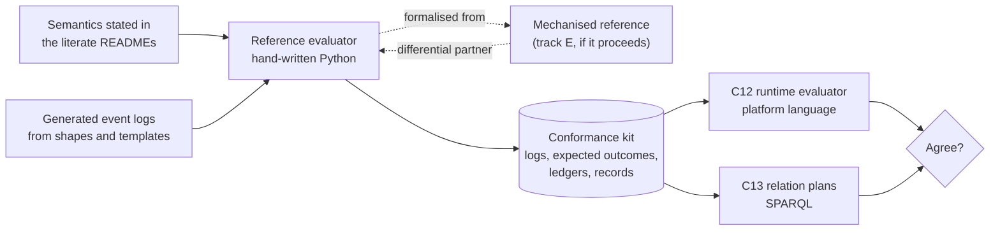

<!-- SPDX-License-Identifier: CC-BY-SA-4.0 -->

# The reference evaluator and its conformance kit

**Unit:** [formal-methods](../plans/formal-methods.md), track B, and track E for its mechanisation.
**Status:** sketch, 2026-10-06, revised after review
([response](../notes/formal-methods-review-response.md)). Nothing here is ratified.
**Parent:** [formal methods](formal-methods.md) §9. Reads with the
[evaluation context sketch](evaluation-context.md), the [nested states sketch](nested-states-and-history.md),
and the CCS plan's C11a, C12 and C13.

---

## 1. The problem

CCS C12 builds LATTICE's runtime evaluator, and C13 builds relation plans in SPARQL. Both interpret
semantics stated in prose. Without a reference they can only be compared with each other, and a
shared misreading passes the parity gate.

**The reference is written by hand, now, in Python** (track B), with its semantics stated precisely
in the literate READMEs. It will be wrong in places, and differential tests against the compilers
will find them, which is the point. It becomes the specification that any later mechanisation
formalises (track E), which is cheaper than mechanising prose. If the prover programme is abandoned,
LATTICE keeps the reference and the parity fixed point.

## 2. What is specified

| Part | Specification | Source |
|---|---|---|
| outcome | a value, Undetermined with a reason, or Denied with a reason. Every partial operation (division, conversion without a context, an operation on a negative quantity) maps to a reason the diagnostics vocabulary carries, never to an exception | evaluation context §3 |
| environments | **`DesignEnv`** (case facts as stated, pinned scheme editions, conversion contexts, a hypothetical state for per-state comparisons) and **`RunEnv`**, which extends it with positions and records. A design-time computation receives only `DesignEnv` | evaluation context §7, §8 |
| ledger | accounts on a tree, balances, debits and credits by path | evaluation context §5 |
| log | read sets, provenance, diagnostics | evaluation context §3 |
| combinators | the closed algebra, with a denotation each, and **a declared rounding rule and residual-allocation rule** wherever a value is divided | evaluation context §4 |
| lifting | effects as the only producers of ledger changes | evaluation context §6 |
| environments of composition | sequential (bind, priority order) and parallel (applicative with a merge) | evaluation context §7 |
| strata | the order inside a pass | evaluation context §8 |
| macrostep | Behaviour's step relation over configurations, with nested states and history | nested states §2 to §7 |
| relations | arising, due, breach, exceptions, gating | CCS sketch §5, Instrument README |

The split of environments is checked by the architecture check: a new field added to `DesignEnv`
that holds runtime-derived data fails CI.

## 3. What must hold

Property tests in track B, theorems in track E where it proceeds.

| # | Property | Gives |
|---|---|---|
| RE1 | the monad laws for the stack, and the applicative laws for the parallel environment | refactoring and compilation are safe |
| RE2 | a pass commits all its ledger changes or none | atomicity |
| RE3 | a computation given only `DesignEnv` cannot observe a record or change the ledger | B8, by construction |
| RE4 | the ledger at p+1 is a function of the ledger at p and the pass at p+1 | determinism across positions (B3) |
| RE5 | the sequential and parallel environments agree when no two proposals touch one account | the environment matters only under contention |
| RE6 | `split` and `proRata` conserve the whole under the declared rounding and residual rule, and proportional merge is order-independent and never over-draws **with that rule** | merge safety where rounding applies, which it otherwise breaks |
| RE7 | every macrostep preserves B9 to B11 and terminates under B10 | Behaviour's laws hold for every run |
| RE8 | every outcome is the denotation of the instrument's relations at that position | the evaluator means what Instrument says |

RE6 is the property most likely to fail, and the first one track E should mechanise.

## 4. The conformance kit

| Part | Content |
|---|---|
| inputs | an instrument configuration, as canonical typed JSON and as Turtle, and a stimulus log |
| expected | per position: relation outcomes, occupancies, ledger balances, records with their evidence, diagnostics |
| provenance | the semantics' digest and the reference's commit that produced the expectations |
| generation | event logs from the shapes and the template library, with metamorphic variants: permuted independent events, renamed identifiers, split and merged passes where the semantics allows |
| coverage | every Behaviour law, every Instrument law, every template, every combinator, listed with the logs that exercise it |

The kit is data. The runtime evaluator, whatever its language, runs it and compares. So do the C13
relation plans, run on a store.

## 5. Where the reference runs

| Use | How |
|---|---|
| generating the kit | a job, per change to the semantics |
| bounded exploration and generated traces for instance properties | a job ([instrument assurance sketch](instrument-assurance.md) §4, §6) |
| validating generated model-checker inputs | runs the same logs as the model ([instrument assurance sketch](instrument-assurance.md) §4.1) |
| replaying a counterexample | a local command through `mise` |
| live evaluation | never. The runtime evaluator does that |

If track F measures the Python reference as too slow for exploration, a native build of the same
semantics is a track F decision, held to the Python reference by the kit.

## 6. Effect on CCS

| Slice | Change |
|---|---|
| C11a | its laws gain precise statements. Its worked cases become the first kit entries |
| C12 | builds the runtime evaluator against the kit. Its mandatory probes (B3, B6) become kit entries that must fail when the runtime is deliberately broken |
| C13 | relation plans are checked against the kit on a store |
| C13a | its satisfiability encoding is checked against the reference's denotation |

None of this delays CCS. Until the reference exists, C12 proceeds as planned, and the kit applies
when it arrives.

## 7. Open questions

| # | Question | Leaning |
|---|---|---|
| RE-Q1 | How many positions should a generated log span? | the longest template window plus margin, recorded as the kit's bound |
| RE-Q2 | Does the kit include the Datalog backend? | yes, when it exists, under the normative semantics of FM-D11 |
| RE-Q3 | Who owns the kit's expected outcomes when the semantics changes? | the semantics. The kit is regenerated and reviewed as a diff |
| RE-Q4 | Which residual-allocation rule is the default? | largest remainder, with ties broken by a total order of accounts, declared per combinator use |
